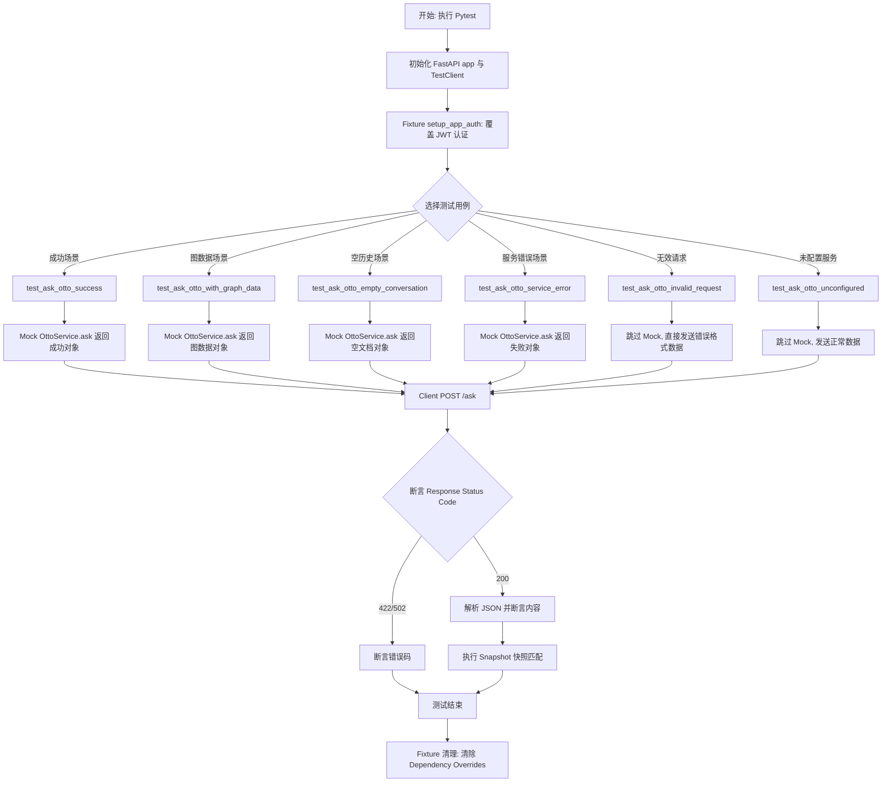
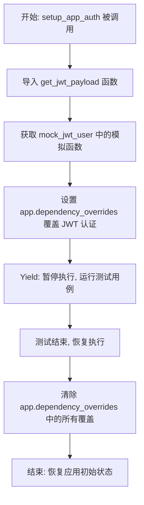
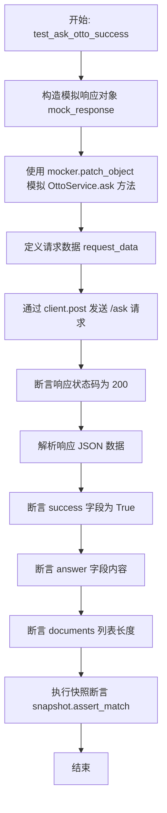
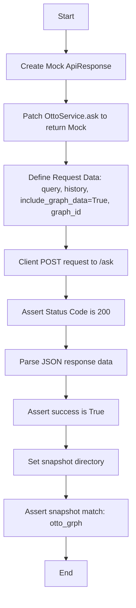
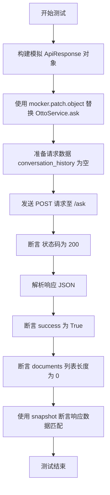
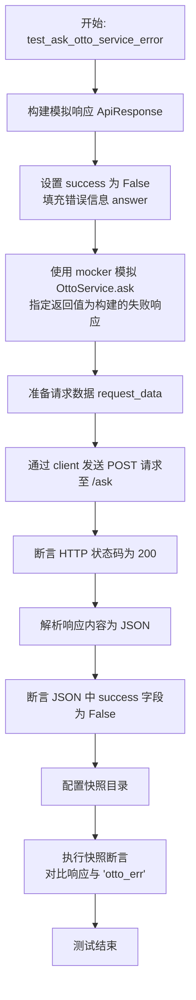
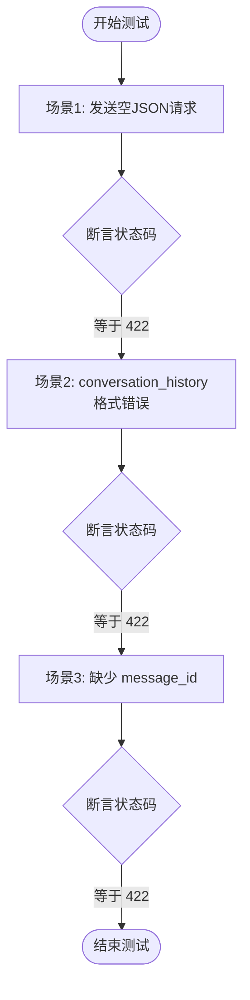
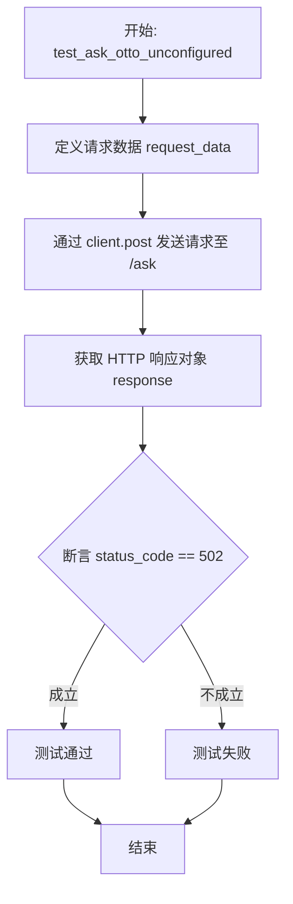

# `AutoGPT\autogpt_platform\backend\backend\api\features\otto\routes_test.py` 详细设计文档

本文件是针对 Otto 智能问答服务的集成测试套件，利用 FastAPI TestClient 和 Pytest 框架，全面验证了 `/ask` 接口在多种场景下的行为，包括正常响应、包含图数据查询、空对话历史、服务端错误、无效请求格式以及未配置服务的情况，确保系统交互逻辑的正确性和鲁棒性。

## 整体流程



## 类结构

```
test_otto.py (测试模块)
├── Global Variables (全局变量)
│   ├── app: FastAPI
│   └── client: TestClient
├── Fixtures (测试夹具)
│   └── setup_app_auth
└── Test Functions (测试函数)
    ├── test_ask_otto_success
    ├── test_ask_otto_with_graph_data
    ├── test_ask_otto_empty_conversation
    ├── test_ask_otto_service_error
    ├── test_ask_otto_invalid_request
    └── test_ask_otto_unconfigured
```

## 全局变量及字段


### `app`
    
FastAPI 应用实例，用于挂载路由配置并在测试环境中模拟服务器。

类型：`fastapi.FastAPI`
    


### `client`
    
测试客户端实例，用于向 FastAPI 应用发送模拟 HTTP 请求以进行集成测试。

类型：`fastapi.testclient.TestClient`
    


    

## 全局函数及方法


### `setup_app_auth`

该函数是一个带有 `autouse=True` 属性的 Pytest fixture，用于自动为模块内的所有测试设置身份验证覆盖。它通过将 FastAPI 应用的 JWT 依赖项替换为模拟对象，确保测试可以在无需真实身份验证的情况下运行，并在测试执行完成后自动清理依赖项覆盖，以恢复应用的原始状态。

参数：

-   `mock_jwt_user`：`dict` 或 `Fixture`，一个包含模拟身份验证逻辑的 fixture 或字典，其中必须包含键 `get_jwt_payload`，对应的值用于替换真实的 JWT payload 获取函数。

返回值：`Generator`，生成器对象。它在设置完依赖覆盖后交出控制权以执行具体的测试逻辑，并在测试结束后执行清理操作。

#### 流程图



#### 带注释源码

```python
@pytest.fixture(autouse=True)
def setup_app_auth(mock_jwt_user):
    """Setup auth overrides for all tests in this module"""
    # 从 auth 库导入真实的 JWT payload 获取函数，
    # 以便在 FastAPI 的依赖覆盖系统中指定要替换的目标。
    from autogpt_libs.auth.jwt_utils import get_jwt_payload

    # 使用传入的 mock_jwt_user fixture 中的模拟函数，
    # 覆盖 app 中 get_jwt_payload 依赖的实现。
    # 这使得在测试中调用需要认证的接口时，将直接使用模拟数据，跳过真实 JWT 验证。
    app.dependency_overrides[get_jwt_payload] = mock_jwt_user["get_jwt_payload"]
    
    # 暂停 fixture 执行，将控制权交还给测试函数，等待测试运行完毕。
    yield
    
    # 测试执行完毕后的清理代码：
    # 清除 app 中所有的依赖覆盖，确保后续操作或测试不受当前 mock 的影响，
    # 将应用恢复到未修改的状态。
    app.dependency_overrides.clear()
```


### `test_ask_otto_success`

测试 Otto API 请求成功处理的逻辑。通过模拟 `OttoService` 的返回值，发送包含查询和对话历史的 POST 请求到 `/ask` 端点，并验证响应的状态码、关键字段内容是否符合预期，同时使用快照测试确保响应结构的稳定性。

参数：

-  `mocker`：`pytest_mock.MockFixture`，Pytest 提供的 fixture，用于模拟（mock）对象和方法的行为。
-  `snapshot`：`Snapshot`，Pytest 提供的 fixture，用于进行快照测试，以比对输出结果与预存的快照是否一致。

返回值：`None`，该函数为测试函数，主要用于断言验证，无返回值。

#### 流程图



#### 带注释源码

```python
def test_ask_otto_success(
    mocker: pytest_mock.MockFixture,
    snapshot: Snapshot,
) -> None:
    """Test successful Otto API request"""
    # 1. 构造模拟的响应对象，包含答案、文档列表和成功状态
    mock_response = otto_models.ApiResponse(
        answer="This is Otto's response to your query.",
        documents=[
            otto_models.Document(
                url="https://example.com/doc1",
                relevance_score=0.95,
            ),
            otto_models.Document(
                url="https://example.com/doc2",
                relevance_score=0.87,
            ),
        ],
        success=True,
    )

    # 2. 模拟 OttoService 的 ask 方法，使其直接返回上面构造的 mock_response
    mocker.patch.object(
        OttoService,
        "ask",
        return_value=mock_response,
    )

    # 3. 准备发送给 API 的请求数据，包含查询内容、历史记录等
    request_data = {
        "query": "How do I create an agent?",
        "conversation_history": [
            {
                "query": "What is AutoGPT?",
                "response": "AutoGPT is an AI agent platform.",
            }
        ],
        "message_id": "msg_123",
        "include_graph_data": False,
    }

    # 4. 使用 TestClient 发送 POST 请求到 /ask 端点
    response = client.post("/ask", json=request_data)

    # 5. 验证 HTTP 状态码是否为 200 (OK)
    assert response.status_code == 200
    response_data = response.json()
    
    # 6. 验证业务逻辑字段：success 必须为 True
    assert response_data["success"] is True
    # 7. 验证返回的答案文本是否与模拟值一致
    assert response_data["answer"] == "This is Otto's response to your query."
    # 8. 验证返回的文档列表数量是否正确
    assert len(response_data["documents"]) == 2

    # 9. 设置快照目录并执行快照断言，用于防止未来意外更改响应结构
    snapshot.snapshot_dir = "snapshots"
    snapshot.assert_match(
        json.dumps(response_data, indent=2, sort_keys=True),
        "otto_ok",
    )
```


### `test_ask_otto_with_graph_data`

该函数用于测试当请求包含图数据（`include_graph_data` 为 True）并指定 `graph_id` 时，Otto API 的 `/ask` 端点是否能够正确处理并返回预期的响应结构。它通过模拟服务层的响应来验证控制器的逻辑，并使用快照测试确保输出格式的一致性。

参数：

-  `mocker`：`pytest_mock.MockFixture`，Pytest 的 fixture，用于创建和配置模拟对象（Mock），此处用于模拟 `OttoService.ask` 方法的行为。
-  `snapshot`：`Snapshot`，Pytest-snapshot 的 fixture，用于执行快照测试，将当前的实际响应与存储的快照文件进行比对。

返回值：`None`，该函数为测试用例，主要执行断言逻辑验证系统行为，无显式返回值。

#### 流程图



#### 带注释源码

```python
def test_ask_otto_with_graph_data(
    mocker: pytest_mock.MockFixture,
    snapshot: Snapshot,
) -> None:
    """Test Otto API request with graph data included"""
    # 1. 准备模拟响应对象：模拟 API 成功返回的情况，包含一个文档
    mock_response = otto_models.ApiResponse(
        answer="Here's information about your graph.",
        documents=[
            otto_models.Document(
                url="https://example.com/graph-doc",
                relevance_score=0.92,
            ),
        ],
        success=True,
    )

    # 2. 模拟 OttoService.ask 方法：使其直接返回上面定义的 mock_response，从而绕过实际的服务调用
    mocker.patch.object(
        OttoService,
        "ask",
        return_value=mock_response,
    )

    # 3. 准备请求数据：设置查询、空历史记录、开启图数据标志并提供 graph_id
    request_data = {
        "query": "Tell me about my graph",
        "conversation_history": [],
        "message_id": "msg_456",
        "include_graph_data": True,
        "graph_id": "graph_123",
    }

    # 4. 发送 POST 请求：使用测试客户端向 /ask 端点发送 JSON 数据
    response = client.post("/ask", json=request_data)

    # 5. 验证状态码：断言 HTTP 响应状态码为 200 (OK)
    assert response.status_code == 200
    
    # 6. 解析响应数据：获取响应体的 JSON 格式数据
    response_data = response.json()
    
    # 7. 验证业务逻辑：断言响应中的 success 字段为 True
    assert response_data["success"] is True

    # 8. 执行快照测试：设置快照存储目录，并将格式化后的响应数据与名为 "otto_grph" 的快照文件进行比对
    snapshot.snapshot_dir = "snapshots"
    snapshot.assert_match(
        json.dumps(response_data, indent=2, sort_keys=True),
        "otto_grph",
    )
```


### `test_ask_otto_empty_conversation`

该函数是一个单元测试，用于验证当向 Otto API 发送带有空对话历史的请求时，系统能否正确处理并返回预期的响应结构（即包含欢迎信息、无文档且状态为成功）。

参数：

-  `mocker`：`pytest_mock.MockFixture`，用于模拟对象和方法的 pytest fixture，在此用于替换 `OttoService.ask` 的真实实现。
-  `snapshot`：`Snapshot`，用于快照测试的 pytest fixture，用于验证 API 响应数据是否符合预期格式。

返回值：`None`，该函数为测试用例，无返回值。

#### 流程图



#### 带注释源码

```python
def test_ask_otto_empty_conversation(
    mocker: pytest_mock.MockFixture,
    snapshot: Snapshot,
) -> None:
    """Test Otto API request with empty conversation history"""
    # Mock the OttoService.ask method
    # 创建一个模拟的响应对象，预设答案为欢迎语，无文档，且状态为成功
    mock_response = otto_models.ApiResponse(
        answer="Welcome! How can I help you?",
        documents=[],
        success=True,
    )

    # 将 OttoService 类的 ask 方法替换为模拟实现，直接返回上面定义的 mock_response
    mocker.patch.object(
        OttoService,
        "ask",
        return_value=mock_response,
    )

    # 准备请求体数据，模拟新对话场景（conversation_history 为空）
    request_data = {
        "query": "Hello",
        "conversation_history": [],
        "message_id": "msg_789",
        "include_graph_data": False,
    }

    # 使用测试客户端向 /ask 接口发送 POST 请求
    response = client.post("/ask", json=request_data)

    # 验证 HTTP 响应状态码是否为 200 OK
    assert response.status_code == 200
    
    # 获取响应的 JSON 数据
    response_data = response.json()
    
    # 验证业务逻辑中的 success 字段是否为 True
    assert response_data["success"] is True
    
    # 验证对话历史为空时返回的文档列表是否为空
    assert len(response_data["documents"]) == 0

    # Snapshot test the response
    # 设置快照保存目录，并将响应数据格式化为 JSON 字符串进行快照对比
    # 确保响应结构与之前记录的快照 "otto_empty" 一致
    snapshot.snapshot_dir = "snapshots"
    snapshot.assert_match(
        json.dumps(response_data, indent=2, sort_keys=True),
        "otto_empty",
    )
```


### `test_ask_otto_service_error`

测试当服务返回错误时的 Otto API 请求。该测试用例模拟了 OttoService 返回失败响应的场景，验证 API 端点能够正确处理并返回预期的错误状态，同时使用快照测试确保响应结构的稳定性。

参数：

-  `mocker`：`pytest_mock.MockFixture`，Pytest fixture，用于模拟和打桩对象，此处用于模拟 `OttoService.ask` 方法的行为。
-  `snapshot`：`Snapshot`，Pytest fixture，来自 `pytest_snapshot` 插件，用于对响应数据进行快照对比测试。

返回值：`None`，无返回值，该函数主要用于执行断言验证逻辑。

#### 流程图



#### 带注释源码

```python
def test_ask_otto_service_error(
    mocker: pytest_mock.MockFixture,
    snapshot: Snapshot,
) -> None:
    """Test Otto API request when service returns error"""
    # 1. 构建一个模拟的 ApiResponse 对象，模拟服务处理失败的情况
    # 设置 success 为 False，并提供错误提示信息
    mock_response = otto_models.ApiResponse(
        answer="An error occurred while processing your request.",
        documents=[],
        success=False,
    )

    # 2. 使用 mocker.patch.object 替换 OttoService 类的 ask 方法
    # 使其在被调用时直接返回上面构造的失败响应，而不是真正调用后端逻辑
    mocker.patch.object(
        OttoService,
        "ask",
        return_value=mock_response,
    )

    # 3. 准备发送给 API 的请求数据
    request_data = {
        "query": "Test query",
        "conversation_history": [],
        "message_id": "msg_error",
        "include_graph_data": False,
    }

    # 4. 使用 TestClient 向 /ask 端点发送 POST 请求
    response = client.post("/ask", json=request_data)

    # 5. 验证 HTTP 响应状态码是否为 200 (即使业务逻辑失败，HTTP 层面可能仍返回 OK)
    assert response.status_code == 200
    
    # 6. 解析响应 JSON 数据
    response_data = response.json()
    
    # 7. 验证业务逻辑是否正确返回了失败状态 (success 为 False)
    assert response_data["success"] is False

    # 8. 配置快照保存的目录
    snapshot.snapshot_dir = "snapshots"
    
    # 9. 执行快照断言，将格式化后的响应数据与 "otto_err" 快照文件进行对比
    # 确保错误响应的结构和内容符合预期
    snapshot.assert_match(
        json.dumps(response_data, indent=2, sort_keys=True),
        "otto_err",
    )
```


### `test_ask_otto_invalid_request`

测试 Otto API 在接收到无效请求数据时的行为，主要验证缺少必填字段、字段格式错误等情况下 API 是否能正确返回 422 (Unprocessable Entity) 状态码。

参数：

无

返回值：`None`，无返回值，通过断言验证测试结果。

#### 流程图



#### 带注释源码

```python
def test_ask_otto_invalid_request() -> None:
    """Test Otto API with invalid request data"""
    # 测试用例 1: 请求体中缺少所有必填字段
    response = client.post("/ask", json={})
    # 预期返回 422 状态码 (Unprocessable Entity)
    assert response.status_code == 422

    # 测试用例 2: conversation_history 字段格式错误
    # 期望是一个 list，但传入了 string
    response = client.post(
        "/ask",
        json={
            "query": "Test",
            "conversation_history": "not a list",
            "message_id": "123",
        },
    )
    # 预期返回 422 状态码
    assert response.status_code == 422

    # 测试用例 3: 请求体中缺少必填字段 message_id
    response = client.post(
        "/ask",
        json={
            "query": "Test",
            "conversation_history": [],
        },
    )
    # 预期返回 422 状态码
    assert response.status_code == 422
```


### `test_ask_otto_unconfigured`

该函数用于测试当 Otto 服务未配置（即缺少 API URL）时，系统能否正确处理请求并返回预期的 502 Bad Gateway 错误状态码。

参数：

- 无

返回值：`None`，该函数为单元测试函数，不返回任何值，主要通过断言验证行为。

#### 流程图



#### 带注释源码

```python
def test_ask_otto_unconfigured() -> None:
    """Test Otto API request without configuration"""
    # 准备测试用的请求数据
    request_data = {
        "query": "Test",
        "conversation_history": [],
        "message_id": "123",
    }

    # 当 Otto API URL 未配置时，预期服务端无法处理请求
    # 发送 POST 请求到 /ask 端点
    response = client.post("/ask", json=request_data)
    
    # 断言响应状态码为 502 (Bad Gateway)，验证未配置情况下的错误处理
    assert response.status_code == 502
```


## 关键组件


### OttoService（核心服务组件）
作为系统核心的业务逻辑层，负责处理用户的查询请求、对话历史管理及图形数据整合，本代码通过Mock该服务来验证API的各种响应场景（如成功、失败、空对话等）。

### FastAPI 路由与测试客户端（API交互组件）
包含FastAPI应用实例及其路由注册，以及用于模拟HTTP请求的TestClient，负责接收 `/ask` 端点的请求并返回标准的HTTP状态码（200, 422, 502）和JSON响应体。

### 身份认证模拟（安全组件）
通过 `setup_app_auth` fixture 实现，用于覆盖 JWT 认证依赖 (`get_jwt_payload`)，从而在测试环境中模拟已登录用户状态，隔离业务逻辑与认证流程。

### 数据模型与验证（数据结构组件）
定义了API交互的数据契约，包括请求参数（query, message_id, include_graph_data）和响应结构（ApiResponse, Document, relevance_score），并依赖Pydantic或类似机制处理输入验证（如缺失必填字段时的422错误）。

### 快照测试机制（测试保障组件）
利用 pytest_snapshot 插件对API响应的JSON序列化结果进行快照匹配，用于回归测试，确保代码变更不会意外修改预期的响应格式。


## 问题及建议


### 已知问题

-   测试数据冗余：`request_data` 字典在多个测试函数中重复定义，包含大量重复的字段（如 `query`, `conversation_history` 等），当 API 接口结构变更时，需要同步修改多处，维护成本较高。
-   快照配置分散：`snapshot.snapshot_dir = "snapshots"` 在每个使用快照的测试函数中重复出现，缺乏集中配置管理，导致硬编码字符串散落在代码各处。
-   状态隐式依赖：`test_ask_otto_unconfigured` 测试用例依赖于外部未配置的特定状态，但代码中并未显式展示如何触发或确保这种“未配置”状态（如清除环境变量或配置对象），这使得该测试的逻辑不透明且可能在环境变动时失效。

### 优化建议

-   使用参数化测试：建议将 `test_ask_otto_invalid_request` 中的多个无效请求场景（缺少必填字段、格式错误等）合并，使用 `@pytest.mark.parametrize` 进行重构，从而减少样板代码并提高测试的可读性与扩展性。
-   提取公共 Fixture：建议将通用的请求 Payload（如 `valid_request_payload`）和 Mock 响应对象提取为 Pytest Fixture 或辅助工厂函数，以减少测试代码间的重复逻辑，实现数据生成的复用。
-   集中配置管理：建议将 `snapshot` 的目录配置移至 `pytest.ini` 配置文件或 `conftest.py` 的全局 hook 函数中，统一管理快照路径，避免在每个测试用例中重复设置。
-   优化依赖注入模拟：建议检查 `OttoService` 在路由中的实现方式，如果可能，将其重构为 FastAPI 的依赖项。在测试中优先使用 `app.dependency_overrides` 来覆盖依赖，而非直接 `mocker.patch.object` 类方法，这样更符合 FastAPI 的集成测试规范，能测试依赖注入的链路。


## 其它


### 设计目标与约束

1.  **接口响应稳定性**：通过引入 Snapshot（快照）测试机制，确保 API 的响应结构和数据格式在版本迭代中保持高度一致，防止非预期的接口变更导致的前端集成问题。
2.  **身份验证强制化**：所有 API 请求必须在认证上下文中运行。测试环境通过 `dependency_overrides` 机制模拟真实的 JWT 认证流程，确保生产环境中的安全性约束不被绕过。
3.  **输入验证严格性**：严格遵循 FastAPI 的 Pydantic 模型验证，对请求体中的字段类型（如 `conversation_history` 必须为列表）和必填字段（如 `query`, `message_id`）进行强制约束，拒绝不符合 Schema 的请求（HTTP 422）。
4.  **服务降级与容错**：当 Otto 服务未配置或底层依赖不可用时，系统设计为返回明确的 HTTP 502 Bad Gateway 状态码，而非导致应用崩溃，体现了系统在依赖缺失时的容错约束。
5.  **业务逻辑与传输层解耦**：服务层错误（如 `OttoService` 处理失败）通过响应体中的 `success: false` 标识，而非直接抛出 HTTP 5xx 异常，实现了业务逻辑状态与 HTTP 传输层状态的部分解耦。

### 错误处理与异常设计

1.  **客户端请求错误 (HTTP 422)**：
    *   **触发条件**：请求体缺少必填字段（如 `query`）、字段类型不匹配（如 `conversation_history` 传入了字符串而非列表）或格式错误。
    *   **处理机制**：由 FastAPI 框架基于 Pydantic 模型自动拦截并返回 422 Unprocessable Entity 错误，测试用例 `test_ask_otto_invalid_request` 专门验证了此逻辑。
2.  **服务层业务错误 (HTTP 200 + Payload)**：
    *   **触发条件**：`OttoService` 能够响应，但在处理查询时发生了逻辑错误或无法生成有效回答。
    *   **处理机制**：API 返回 HTTP 200 OK，但在 JSON 响应体中包含 `"success": false` 和错误描述信息。测试用例 `test_ask_otto_service_error` 验证了此时服务不会抛出异常，而是正常返回结构化的错误响应。
3.  **基础设施/配置错误 (HTTP 502)**：
    *   **触发条件**： Otto API 的基础 URL 未配置或服务不可达。
    *   **处理机制**：系统返回 502 Bad Gateway，表明网关或代理在尝试连接上游服务时失败。测试用例 `test_ask_otto_unconfigured` 覆盖了此场景。
4.  **测试环境隔离与清理**：
    *   **异常处理**：测试利用 `yield` 机制确保在测试执行完毕后清理 `dependency_overrides`，防止测试间的认证状态污染，这属于测试层面的资源清理异常处理设计。

### 数据流与状态机

1.  **数据流**：
    *   **输入流**：客户端构建 JSON 请求体 -> TestClient 发送 POST 请求至 `/ask` -> FastAPI 路由层接收 -> JWT 认证拦截器（Mocked）验证 -> Pydantic 模型校验数据结构。
    *   **处理流**：校验后的数据传递给 `OttoService.ask` 方法 -> 服务层处理逻辑（在测试中被 Mock 拦截并返回预设对象）。
    *   **输出流**：`OttoService` 返回 `ApiResponse` 对象 -> FastAPI 序列化为 JSON -> 返回给客户端 -> 客户端断言验证 -> Snapshot 插件生成/比对快照文件。
2.  **状态机**：
    *   **认证状态**：测试模块全局维护一个“已认证”状态，通过 `setup_app_auth` fixture 注入 Mock JWT Payload，所有测试用例默认在此状态下运行。
    *   **服务可用性状态**：
        *   *状态 A (Normal)*：服务正常，`OttoService` 返回有效数据，包含 `answer` 和 `documents`。
        *   *状态 B (Business Failure)*：服务运行但返回错误标记，响应体 `success` 为 false。
        *   *状态 C (Unreachable)*：服务未配置，状态机切换至 502 错误响应模式。
    *   **会话状态**：系统本身是无状态的，会话历史通过请求参数 `conversation_history` 显式传递，不支持服务端会话保持。

### 外部依赖与接口契约

1.  **外部依赖**：
    *   **FastAPI & TestClient**：核心 Web 框架及测试客户端，提供 ASGI 服务器模拟和路由注册功能。
    *   **Pytest & Pytest-Mock**：测试框架及 Mock 工具，用于模拟 `OttoService` 的行为和控制依赖注入。
    *   **Pytest-Snapshot**：用于响应数据的快照断言，依赖于文件系统读写来存储基准数据。
    *   **AutoGPT Libs (`autogpt_libs.auth`)**：提供 JWT 认证工具函数 `get_jwt_payload`，测试时必须被 Override 才能运行。
    *   **内部模块**：依赖 `otto_models`（数据模型定义）和 `otto_routes`（路由定义）。
2.  **接口契约**：
    *   **端点**：`POST /ask`
    *   **请求契约**：
        *   `Content-Type`: `application/json`
        *   必填字段：`query` (string), `message_id` (string)
        *   可选字段：`conversation_history` (array), `include_graph_data` (boolean), `graph_id` (string)
    *   **响应契约**：
        *   成功/业务失败状态 (HTTP 200)：
            ```json
            {
              "success": boolean,
              "answer": string,
              "documents": [ { "url": string, "relevance_score": float } ]
            }
            ```
        *   验证失败 (HTTP 422)：返回 FastAPI 标准的错误详情模型。
        *   网关错误 (HTTP 502)：返回空或标准网关错误响应。
    *   **服务层契约**：`OttoService.ask` 方法必须接受与请求体匹配的参数，并返回一个 `otto_models.ApiResponse` 实例。

### 测试策略与质量保证

1.  **Mock 驱动的单元测试**：
    *   策略：使用 `mocker.patch.object` 将 `OttoService` 完全隔离，专注于测试路由层、参数验证层和响应序列化层的正确性，而不依赖真实的后端 AI 服务。
2.  **快照测试**：
    *   策略：对 JSON 响应进行 `json.dumps(..., sort_keys=True)` 格式化后与文件系统中的快照比对。这保证了 API 输出的字段顺序、数据类型和结构稳定性，防止细微的回归。
3.  **基于场景的测试覆盖**：
    *   策略：测试用例不仅覆盖“快乐路径”（`test_ask_otto_success`），还覆盖了边界条件（空历史记录 `test_ask_otto_empty_conversation`）、特定功能开关（包含图表数据 `test_ask_otto_with_graph_data`）以及各种异常场景（服务错误、无效请求、未配置服务）。
4.  **自动化 Fixture 管理**：
    *   策略：使用 `autouse=True` 的 fixture 自动处理复杂的认证依赖注入，在每个测试后自动清理，确保测试用例的独立性和可维护性。

    