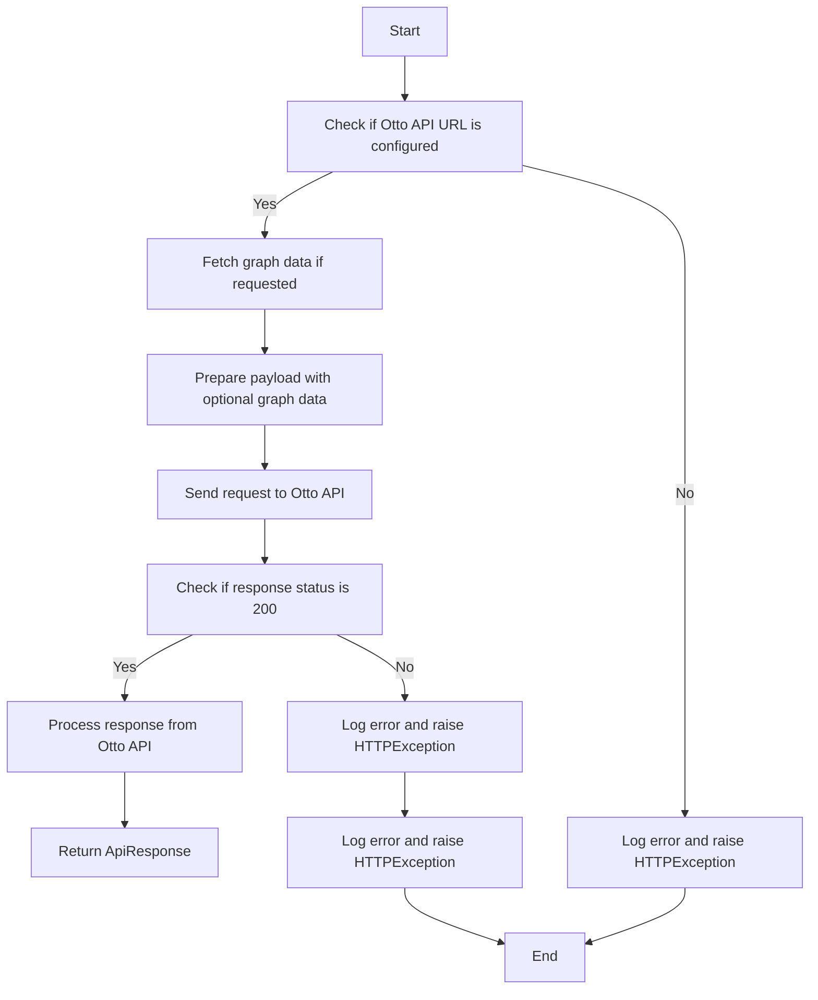
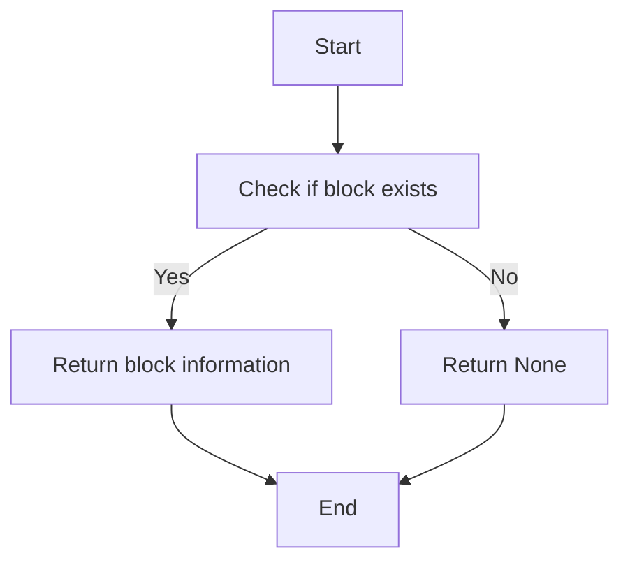
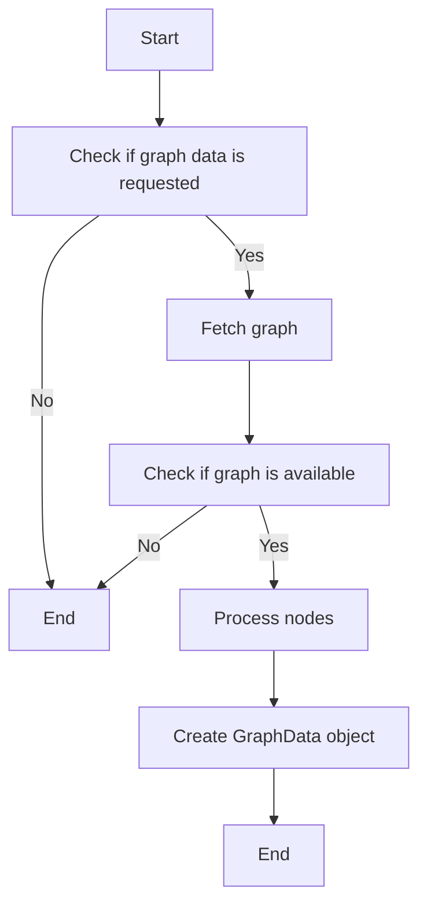
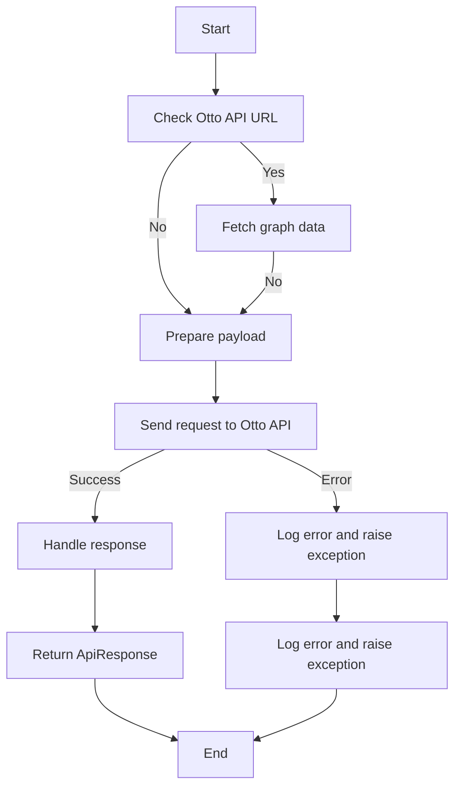

# `.\AutoGPT\autogpt_platform\backend\backend\api\features\otto\service.py` 详细设计文档

The code provides an interface to interact with the Otto API, handling requests, fetching graph data, and managing responses.

## 整体流程



## 类结构

```
OttoService (类)
```

## 全局变量及字段


### `logger`
    
Logger instance for logging messages.

类型：`logging.Logger`
    


### `settings`
    
Settings instance for configuration parameters.

类型：`backend.util.settings.Settings`
    


### `OTTO_API_URL`
    
The URL of the Otto API endpoint.

类型：`str`
    


    

## 全局函数及方法


### `get_block`

获取指定块的信息。

参数：

- `block_id`：`str`，块的唯一标识符。

返回值：`Optional[Block]`，包含块信息的对象，如果没有找到块则返回`None`。

#### 流程图



#### 带注释源码

```python
def get_block(block_id: str) -> Optional[Block]:
    # Assume Block is a class that represents a block of data
    # This function would interact with the database or another data source
    # to retrieve the block information based on the block_id
    # For the purpose of this example, we'll return None to simulate a block not being found
    # In a real implementation, you would query the database or data source here
    return None
```

由于源码中并没有实际的`get_block`函数实现，以上流程图和源码是基于假设的示例。在实际应用中，`get_block`函数会包含与数据库或其他数据源的交互逻辑来检索块信息。


### OttoService._fetch_graph_data

Fetches graph data if requested and available.

参数：

- `request`：`ChatRequest`，The chat request object containing the graph data request details.
- `user_id`：`str`，The user ID associated with the request.

返回值：`Optional[GraphData]`，The fetched graph data or `None` if not available.

#### 流程图



#### 带注释源码

```python
@staticmethod
async def _fetch_graph_data(
    request: ChatRequest, user_id: str
) -> Optional[GraphData]:
    """Fetch graph data if requested and available."""
    if not (request.include_graph_data and request.graph_id):
        return None

    try:
        graph = await graph_db.get_graph(
            graph_id=request.graph_id, version=None, user_id=user_id
        )
        if not graph:
            return None

        nodes_data = []
        for node in graph.nodes:
            block = get_block(node.block_id)
            if not block:
                continue

            node_data = {
                "id": node.id,
                "block_id": node.block_id,
                "block_name": block.name,
                "block_type": (
                    block.block_type.value if hasattr(block, "block_type") else None
                ),
                "data": {
                    k: v
                    for k, v in (node.input_default or {}).items()
                    if k not in ["credentials"]  # Exclude sensitive data
                },
            }
            nodes_data.append(node_data)

        # Create a GraphData object with the required fields
        return GraphData(
            nodes=nodes_data,
            edges=[],
            graph_name=graph.name,
            graph_description=graph.description,
        )
    except Exception as e:
        logger.error(f"Failed to fetch graph data: {str(e)}")
        return None
```


### OttoService.ask

Send request to Otto API and handle the response.

参数：

- `request`：`ChatRequest`，The request object containing the query and conversation history.
- `user_id`：`str`，The user ID associated with the request.

返回值：`ApiResponse`，The response from the Otto API.

#### 流程图



#### 带注释源码

```python
@staticmethod
async def ask(request: ChatRequest, user_id: str) -> ApiResponse:
    """
    Send request to Otto API and handle the response.
    """
    # Check if Otto API URL is configured
    if not OTTO_API_URL:
        logger.error("Otto API URL is not configured")
        raise HTTPException(
            status_code=503, detail="Otto service is not configured"
        )

    try:
        async with aiohttp.ClientSession() as session:
            headers = {
                "Content-Type": "application/json",
                "Accept": "application/json",
            }

            # If graph data is requested, fetch it
            graph_data = await OttoService._fetch_graph_data(request, user_id)

            # Prepare the payload with optional graph data
            payload = {
                "query": request.query,
                "conversation_history": [
                    msg.model_dump() for msg in request.conversation_history
                ],
                "user_id": user_id,
                "message_id": request.message_id,
            }

            if graph_data:
                payload["graph_data"] = graph_data.model_dump()

            logger.info(f"Sending request to Otto API for user {user_id}")
            logger.debug(f"Request payload: {payload}")

            async with session.post(
                OTTO_API_URL,
                json=payload,
                headers=headers,
                timeout=aiohttp.ClientTimeout(total=60),
            ) as response:
                if response.status != 200:
                    error_text = await response.text()
                    logger.error(f"Otto API error: {error_text}")
                    raise HTTPException(
                        status_code=response.status,
                        detail=f"Otto API request failed: {error_text}",
                    )

                data = await response.json()
                logger.info(
                    f"Successfully received response from Otto API for user {user_id}"
                )
                return ApiResponse(**data)

    except aiohttp.ClientError as e:
        logger.error(f"Connection error to Otto API: {str(e)}")
        raise HTTPException(
            status_code=503, detail="Failed to connect to Otto service"
        )
    except asyncio.TimeoutError:
        logger.error("Timeout error connecting to Otto API after 60 seconds")
        raise HTTPException(
            status_code=504, detail="Request to Otto service timed out"
        )
    except Exception as e:
        logger.error(f"Unexpected error in Otto API proxy: {str(e)}")
        raise HTTPException(
            status_code=500, detail="Internal server error in Otto proxy"
        )
```


## 关键组件


### 张量索引与惰性加载

张量索引与惰性加载机制允许在处理大规模数据时，仅加载和处理所需的数据部分，从而提高效率和减少内存消耗。

### 反量化支持

反量化支持使得代码能够处理不同类型的量化数据，包括浮点数和整数，以及相应的量化策略。

### 量化策略

量化策略定义了如何将浮点数数据转换为整数数据，以及如何处理这些整数数据，以适应特定的硬件和性能需求。


## 问题及建议


### 已知问题

-   **配置管理**：代码中使用了全局变量 `OTTO_API_URL` 来存储 Otto API 的 URL，这种做法可能导致配置信息难以管理和维护。建议使用环境变量或配置文件来管理此类配置信息。
-   **异常处理**：代码中使用了通用的 `Exception` 来捕获所有异常，这可能导致一些潜在的错误信息被掩盖。建议根据不同的异常类型进行更细粒度的异常处理。
-   **日志记录**：虽然代码中使用了日志记录，但日志级别和内容可能需要根据实际需求进行调整，以便更好地追踪和调试。
-   **代码复用**：`_fetch_graph_data` 方法中存在重复的代码，例如获取节点数据的逻辑。建议将这些逻辑抽象成单独的函数以提高代码复用性。
-   **错误响应**：HTTPException 的错误信息可能不够具体，建议提供更详细的错误信息，以便调用者更好地理解错误原因。

### 优化建议

-   **使用配置管理库**：引入如 `python-decouple` 或 `configparser` 等库来管理配置信息，使配置更加灵活和可维护。
-   **细化异常处理**：根据不同的异常类型定义不同的异常处理逻辑，例如针对数据库操作、网络请求等分别处理。
-   **优化日志记录**：根据实际需求调整日志级别和内容，确保日志信息能够帮助开发者快速定位问题。
-   **抽象重复代码**：将重复的代码抽象成函数或类，减少代码冗余，提高代码可读性和可维护性。
-   **改进错误响应**：提供更详细的错误信息，包括错误代码、错误描述和可能的解决方案，以便调用者更好地处理错误情况。


## 其它


### 设计目标与约束

- 设计目标：
  - 实现一个异步的 Otto API 请求代理服务。
  - 确保请求和响应的及时性和准确性。
  - 提供错误处理机制，以便在出现问题时能够优雅地处理。

- 约束：
  - 必须使用 FastAPI 框架。
  - 必须使用 aiohttp 库进行异步 HTTP 请求。
  - 必须遵守 Otto API 的接口规范。

### 错误处理与异常设计

- 错误处理：
  - 使用 HTTPException 来处理与 HTTP 相关的错误，如 503 服务不可用、504 请求超时等。
  - 使用 logging 模块记录错误信息。

- 异常设计：
  - 异常被捕获并记录，然后转换为 HTTPException 以便返回给客户端。
  - 特定的异常，如 aiohttp.ClientError 和 asyncio.TimeoutError，被捕获并转换为相应的 HTTP 状态码。

### 数据流与状态机

- 数据流：
  - 用户请求通过 FastAPI 接口发送到 OttoService 类。
  - OttoService 类异步请求 Otto API。
  - Otto API 响应返回到客户端。

- 状态机：
  - OttoService 类中的状态包括：请求发送、等待响应、处理响应、错误处理。

### 外部依赖与接口契约

- 外部依赖：
  - fastapi
  - aiohttp
  - logging
  - backend.data.graph
  - backend.data.block
  - backend.util.settings

- 接口契约：
  - Otto API 需要的请求格式和响应格式。
  - OttoService 类需要与 backend.data.graph 和 backend.data.block 交互以获取图数据。
  - OttoService 类需要与 backend.util.settings 交互以获取配置信息。

    