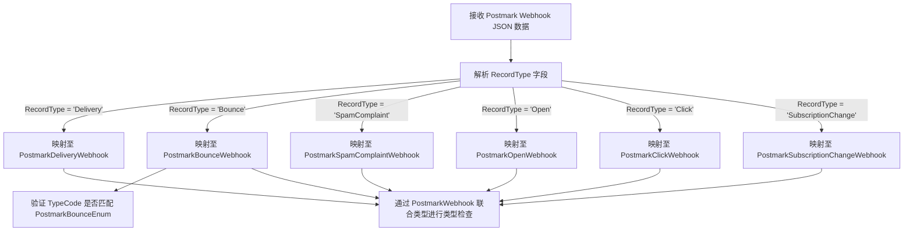

# `AutoGPT\autogpt_platform\backend\backend\api\features\postmark\models.py` 详细设计文档

该代码定义了一系列基于 Pydantic 的数据模型，用于解析、验证和结构化处理来自 Postmark 邮件服务的 Webhook 事件，涵盖了投递成功、退信（含详细的退信类型枚举）、垃圾邮件投诉、邮件打开、链接点击以及订阅状态变更等多种事件类型。

## 整体流程



## 类结构

```
BaseModel (Pydantic)
├── PostmarkDeliveryWebhook
├── PostmarkBounceWebhook
├── PostmarkSpamComplaintWebhook
├── PostmarkOpenWebhook
├── PostmarkClickWebhook
└── PostmarkSubscriptionChangeWebhook
Enum
└── PostmarkBounceEnum
```

## 全局变量及字段


### `PostmarkWebhook`
    
Represents a union type of all possible Postmark webhook payload models.

类型：`type[PostmarkDeliveryWebhook] | type[PostmarkBounceWebhook] | type[PostmarkSpamComplaintWebhook] | type[PostmarkOpenWebhook] | type[PostmarkClickWebhook] | type[PostmarkSubscriptionChangeWebhook]`
    


### `PostmarkDeliveryWebhook.RecordType`
    
The record type, fixed to 'Delivery' for this webhook.

类型：`Literal["Delivery"]`
    


### `PostmarkDeliveryWebhook.ServerID`
    
The ID of the server the message was sent from.

类型：`int`
    


### `PostmarkDeliveryWebhook.MessageStream`
    
The message stream the message was sent through.

类型：`str`
    


### `PostmarkDeliveryWebhook.MessageID`
    
The ID of the message assigned by Postmark.

类型：`str`
    


### `PostmarkDeliveryWebhook.Recipient`
    
The email address of the recipient.

类型：`str`
    


### `PostmarkDeliveryWebhook.Tag`
    
The tag associated with the message.

类型：`str`
    


### `PostmarkDeliveryWebhook.DeliveredAt`
    
The timestamp when the message was successfully delivered.

类型：`str`
    


### `PostmarkDeliveryWebhook.Details`
    
Additional delivery details provided by the receiving server.

类型：`str`
    


### `PostmarkDeliveryWebhook.Metadata`
    
User-defined metadata key-value pairs associated with the message.

类型：`dict[str, str]`
    


### `PostmarkBounceEnum.HardBounce`
    
The server was unable to deliver your message (ex: unknown user, mailbox not found).

类型：`int`
    


### `PostmarkBounceEnum.Transient`
    
The server could not temporarily deliver your message (ex: Message is delayed due to network troubles).

类型：`int`
    


### `PostmarkBounceEnum.Unsubscribe`
    
Unsubscribe or Remove request.

类型：`int`
    


### `PostmarkBounceEnum.Subscribe`
    
Subscribe request from someone wanting to get added to the mailing list.

类型：`int`
    


### `PostmarkBounceEnum.AutoResponder`
    
Automatic email responder including nondescript NDRs and some out of office replies.

类型：`int`
    


### `PostmarkBounceEnum.AddressChange`
    
The recipient has requested an address change.

类型：`int`
    


### `PostmarkBounceEnum.DnsError`
    
A temporary DNS error.

类型：`int`
    


### `PostmarkBounceEnum.SpamNotification`
    
The message was delivered, but was either blocked by the user, or classified as spam, bulk mail, or had rejected content.

类型：`int`
    


### `PostmarkBounceEnum.OpenRelayTest`
    
The NDR is actually a test email message to see if the mail server is an open relay.

类型：`int`
    


### `PostmarkBounceEnum.Unknown`
    
Unable to classify the NDR.

类型：`int`
    


### `PostmarkBounceEnum.SoftBounce`
    
Unable to temporarily deliver message (i.e. mailbox full, account disabled, exceeds quota, out of disk space).

类型：`int`
    


### `PostmarkBounceEnum.VirusNotification`
    
The bounce is actually a virus notification warning about a virus/code infected message.

类型：`int`
    


### `PostmarkBounceEnum.ChallengeVerification`
    
The bounce is a challenge asking for verification you actually sent the email.

类型：`int`
    


### `PostmarkBounceEnum.BadEmailAddress`
    
The address is not a valid email address.

类型：`int`
    


### `PostmarkBounceEnum.SpamComplaint`
    
The subscriber explicitly marked this message as spam.

类型：`int`
    


### `PostmarkBounceEnum.ManuallyDeactivated`
    
The email was manually deactivated.

类型：`int`
    


### `PostmarkBounceEnum.Unconfirmed`
    
Registration not confirmed — The subscriber has not clicked on the confirmation link upon registration or import.

类型：`int`
    


### `PostmarkBounceEnum.Blocked`
    
Blocked from this ISP due to content or blacklisting.

类型：`int`
    


### `PostmarkBounceEnum.SMTPApiError`
    
An error occurred while accepting an email through the SMTP API.

类型：`int`
    


### `PostmarkBounceEnum.InboundError`
    
Processing failed — Unable to deliver inbound message to destination inbound hook.

类型：`int`
    


### `PostmarkBounceEnum.DMARCPolicy`
    
Email rejected due DMARC Policy.

类型：`int`
    


### `PostmarkBounceEnum.TemplateRenderingFailed`
    
Template rendering failed — An error occurred while attempting to render your template.

类型：`int`
    


### `PostmarkBounceWebhook.RecordType`
    
The record type, fixed to 'Bounce' for this webhook.

类型：`Literal["Bounce"]`
    


### `PostmarkBounceWebhook.ID`
    
The ID of the bounce record.

类型：`int`
    


### `PostmarkBounceWebhook.Type`
    
The descriptive name of the bounce type.

类型：`str`
    


### `PostmarkBounceWebhook.TypeCode`
    
The enumerated code identifying the specific bounce type.

类型：`PostmarkBounceEnum`
    


### `PostmarkBounceWebhook.Tag`
    
The tag associated with the message.

类型：`str`
    


### `PostmarkBounceWebhook.MessageID`
    
The ID of the message assigned by Postmark.

类型：`str`
    


### `PostmarkBounceWebhook.Details`
    
Specific details regarding the bounce.

类型：`str`
    


### `PostmarkBounceWebhook.Email`
    
The email address that bounced.

类型：`str`
    


### `PostmarkBounceWebhook.From`
    
The sender's email address.

类型：`str`
    


### `PostmarkBounceWebhook.BouncedAt`
    
The timestamp when the bounce occurred.

类型：`str`
    


### `PostmarkBounceWebhook.Inactive`
    
Indicates if the email has been marked as inactive.

类型：`bool`
    


### `PostmarkBounceWebhook.DumpAvailable`
    
Indicates if the raw content of the bounce is available for retrieval.

类型：`bool`
    


### `PostmarkBounceWebhook.CanActivate`
    
Indicates if the inactive email can be reactivated.

类型：`bool`
    


### `PostmarkBounceWebhook.Subject`
    
The subject line of the email that bounced.

类型：`str`
    


### `PostmarkBounceWebhook.ServerID`
    
The ID of the server the message was sent from.

类型：`int`
    


### `PostmarkBounceWebhook.MessageStream`
    
The message stream the message was sent through.

类型：`str`
    


### `PostmarkBounceWebhook.Content`
    
The raw content of the bounce message.

类型：`str`
    


### `PostmarkBounceWebhook.Name`
    
The name of the bounce type.

类型：`str`
    


### `PostmarkBounceWebhook.Description`
    
A description of the bounce type.

类型：`str`
    


### `PostmarkBounceWebhook.Metadata`
    
User-defined metadata key-value pairs associated with the message.

类型：`dict[str, str]`
    


### `PostmarkSpamComplaintWebhook.RecordType`
    
The record type, fixed to 'SpamComplaint' for this webhook.

类型：`Literal["SpamComplaint"]`
    


### `PostmarkSpamComplaintWebhook.ID`
    
The ID of the spam complaint record.

类型：`int`
    


### `PostmarkSpamComplaintWebhook.Type`
    
The type of spam complaint.

类型：`str`
    


### `PostmarkSpamComplaintWebhook.TypeCode`
    
The code identifying the spam complaint type.

类型：`int`
    


### `PostmarkSpamComplaintWebhook.Tag`
    
The tag associated with the message.

类型：`str`
    


### `PostmarkSpamComplaintWebhook.MessageID`
    
The ID of the message assigned by Postmark.

类型：`str`
    


### `PostmarkSpamComplaintWebhook.Details`
    
Details regarding the spam complaint.

类型：`str`
    


### `PostmarkSpamComplaintWebhook.Email`
    
The email address that reported the spam.

类型：`str`
    


### `PostmarkSpamComplaintWebhook.From`
    
The sender's email address.

类型：`str`
    


### `PostmarkSpamComplaintWebhook.BouncedAt`
    
The timestamp when the spam complaint was reported.

类型：`str`
    


### `PostmarkSpamComplaintWebhook.Inactive`
    
Indicates if the email has been marked as inactive.

类型：`bool`
    


### `PostmarkSpamComplaintWebhook.DumpAvailable`
    
Indicates if the raw content of the complaint is available.

类型：`bool`
    


### `PostmarkSpamComplaintWebhook.CanActivate`
    
Indicates if the inactive email can be reactivated.

类型：`bool`
    


### `PostmarkSpamComplaintWebhook.Subject`
    
The subject line of the email reported as spam.

类型：`str`
    


### `PostmarkSpamComplaintWebhook.ServerID`
    
The ID of the server the message was sent from.

类型：`int`
    


### `PostmarkSpamComplaintWebhook.MessageStream`
    
The message stream the message was sent through.

类型：`str`
    


### `PostmarkSpamComplaintWebhook.Content`
    
The raw content of the spam report.

类型：`str`
    


### `PostmarkSpamComplaintWebhook.Name`
    
The name of the spam complaint type.

类型：`str`
    


### `PostmarkSpamComplaintWebhook.Description`
    
A description of the spam complaint.

类型：`str`
    


### `PostmarkSpamComplaintWebhook.Metadata`
    
User-defined metadata key-value pairs associated with the message.

类型：`dict[str, str]`
    


### `PostmarkOpenWebhook.RecordType`
    
The record type, fixed to 'Open' for this webhook.

类型：`Literal["Open"]`
    


### `PostmarkOpenWebhook.MessageStream`
    
The message stream the message was sent through.

类型：`str`
    


### `PostmarkOpenWebhook.Metadata`
    
User-defined metadata key-value pairs associated with the message.

类型：`dict[str, str]`
    


### `PostmarkOpenWebhook.FirstOpen`
    
Indicates if this is the first time the message has been opened.

类型：`bool`
    


### `PostmarkOpenWebhook.Recipient`
    
The email address of the recipient who opened the message.

类型：`str`
    


### `PostmarkOpenWebhook.MessageID`
    
The ID of the message assigned by Postmark.

类型：`str`
    


### `PostmarkOpenWebhook.ReceivedAt`
    
The timestamp when the open event was recorded.

类型：`str`
    


### `PostmarkOpenWebhook.Platform`
    
The user's platform (e.g., 'Desktop', 'Mobile').

类型：`str`
    


### `PostmarkOpenWebhook.ReadSeconds`
    
The duration in seconds the message was read.

类型：`int`
    


### `PostmarkOpenWebhook.Tag`
    
The tag associated with the message.

类型：`str`
    


### `PostmarkOpenWebhook.UserAgent`
    
The user agent string of the client used to open the message.

类型：`str`
    


### `PostmarkOpenWebhook.OS`
    
Details about the operating system used.

类型：`dict[str, str]`
    


### `PostmarkOpenWebhook.Client`
    
Details about the email client used.

类型：`dict[str, str]`
    


### `PostmarkOpenWebhook.Geo`
    
Geographical information about where the open occurred.

类型：`dict[str, str]`
    


### `PostmarkClickWebhook.RecordType`
    
The record type, fixed to 'Click' for this webhook.

类型：`Literal["Click"]`
    


### `PostmarkClickWebhook.MessageStream`
    
The message stream the message was sent through.

类型：`str`
    


### `PostmarkClickWebhook.Metadata`
    
User-defined metadata key-value pairs associated with the message.

类型：`dict[str, str]`
    


### `PostmarkClickWebhook.Recipient`
    
The email address of the recipient who clicked the link.

类型：`str`
    


### `PostmarkClickWebhook.MessageID`
    
The ID of the message assigned by Postmark.

类型：`str`
    


### `PostmarkClickWebhook.ReceivedAt`
    
The timestamp when the click event was recorded.

类型：`str`
    


### `PostmarkClickWebhook.Platform`
    
The user's platform (e.g., 'Desktop', 'Mobile').

类型：`str`
    


### `PostmarkClickWebhook.ClickLocation`
    
The location of the click within the message (e.g., 'HTML', 'Text').

类型：`str`
    


### `PostmarkClickWebhook.OriginalLink`
    
The URL that was clicked.

类型：`str`
    


### `PostmarkClickWebhook.Tag`
    
The tag associated with the message.

类型：`str`
    


### `PostmarkClickWebhook.UserAgent`
    
The user agent string of the client used to click the link.

类型：`str`
    


### `PostmarkClickWebhook.OS`
    
Details about the operating system used.

类型：`dict[str, str]`
    


### `PostmarkClickWebhook.Client`
    
Details about the email client used.

类型：`dict[str, str]`
    


### `PostmarkClickWebhook.Geo`
    
Geographical information about where the click occurred.

类型：`dict[str, str]`
    


### `PostmarkSubscriptionChangeWebhook.RecordType`
    
The record type, fixed to 'SubscriptionChange' for this webhook.

类型：`Literal["SubscriptionChange"]`
    


### `PostmarkSubscriptionChangeWebhook.MessageID`
    
The ID of the message assigned by Postmark.

类型：`str`
    


### `PostmarkSubscriptionChangeWebhook.ServerID`
    
The ID of the server the message was sent from.

类型：`int`
    


### `PostmarkSubscriptionChangeWebhook.MessageStream`
    
The message stream the message was sent through.

类型：`str`
    


### `PostmarkSubscriptionChangeWebhook.ChangedAt`
    
The timestamp when the subscription status changed.

类型：`str`
    


### `PostmarkSubscriptionChangeWebhook.Recipient`
    
The email address of the recipient whose status changed.

类型：`str`
    


### `PostmarkSubscriptionChangeWebhook.Origin`
    
The source of the status change (e.g., 'User', 'Admin', 'Webhook').

类型：`str`
    


### `PostmarkSubscriptionChangeWebhook.SuppressSending`
    
Indicates if sending to this recipient is currently suppressed.

类型：`bool`
    


### `PostmarkSubscriptionChangeWebhook.SuppressionReason`
    
The reason for the suppression (if any).

类型：`str`
    


### `PostmarkSubscriptionChangeWebhook.Tag`
    
The tag associated with the message.

类型：`str`
    


### `PostmarkSubscriptionChangeWebhook.Metadata`
    
User-defined metadata key-value pairs associated with the message.

类型：`dict[str, str]`
    
    

## 全局函数及方法


## 关键组件


### PostmarkDeliveryWebhook

定义邮件成功投递事件的数据模型，包含服务器ID、消息流、收件人及投递时间等信息。

### PostmarkBounceEnum

枚举类，定义了邮件退回的各种具体类型代码（如硬退回、软退回、垃圾邮件投诉等）及其详细描述。

### PostmarkBounceWebhook

定义邮件投递失败（退回）事件的数据模型，包含退回类型代码、是否可激活、邮件内容等详细信息。

### PostmarkSpamComplaintWebhook

定义垃圾邮件投诉事件的数据模型，用于记录收件人将邮件标记为垃圾邮件时的相关上下文。

### PostmarkOpenWebhook

定义邮件打开追踪事件的数据模型，包含收件人打开邮件的时间、阅读秒数、客户端环境及地理位置等信息。

### PostmarkClickWebhook

定义邮件链接点击追踪事件的数据模型，包含点击位置、原始链接、用户代理及地理信息。

### PostmarkSubscriptionChangeWebhook

定义订阅状态变更事件的数据模型，用于记录收件人订阅状态的更改原因及是否抑制发送。

### PostmarkWebhook

联合类型（Union Type），聚合了所有 Postmark Webhook 事件模型，用于统一表示接收到的 Webhook 数据结构。


## 问题及建议


### 已知问题

-   **命名规范不符合 Python PEP 8**：代码中的类字段（如 `RecordType`, `ServerID`）采用了 `PascalCase` 命名，这与 Python 社区通用的 `snake_case` 命名规范相悖，降低了代码的可读性和与 Python 生态的融合度。
-   **存在代码重复**：`PostmarkBounceWebhook` 和 `PostmarkSpamComplaintWebhook` 类中包含了大量相同的字段（如 `MessageID`, `Tag`, `Details`, `Email`, `BouncedAt` 等），违反了 DRY（Don't Repeat Yourself）原则，增加了维护成本。
-   **类型定义不一致**：`PostmarkSpamComplaintWebhook` 中的 `TypeCode` 被定义为原始的 `int` 类型，而 `PostmarkBounceWebhook` 中使用了枚举 `PostmarkBounceEnum`。鉴于 `PostmarkBounceEnum` 中已包含 `SpamComplaint`，此处的不一致性削弱了类型系统的安全性。

### 优化建议

-   **引入别名生成器**：建议在 Pydantic 模型配置中使用 `alias_generator` 将 Python 内部的 `snake_case` 字段自动映射为 JSON 中的 `PascalCase`，既符合 Python 规范又能保持与 Postmark API 的兼容性。
-   **提取公共基类**：创建一个 `BasePostmarkWebhook` 抽象基类，将 `ServerID`, `MessageID`, `Metadata`, `MessageStream` 等通用字段上移，子类仅定义特有字段，以减少冗余代码。
-   **使用显式联合区分器**：在定义 `PostmarkWebhook` 联合类型时，建议使用 `Field(discriminator='RecordType')`（或 Pydantic v2 的 `Discriminator`），以明确通过 `RecordType` 字段区分不同的 Webhook 类型，从而提升反序列化性能和错误提示的准确性。
-   **增强字段可空性处理**：对于 `Content`, `Details` 等可能为空或缺失的字段，建议显式声明为 `str | None` 或 `Optional[str]`，防止因数据缺失导致运行时错误。


## 其它


### 设计目标与约束

本模块旨在为 Postmark Webhook 事件提供一套严格类型化、可维护且符合官方规范的数据模型定义，以支持后续的业务逻辑处理。

**设计目标**：
1.  **类型安全**：利用 Python 类型注解和 Pydantic 库，确保在运行时对 Webhook 负荷进行严格的类型检查，减少因字段类型错误导致的运行时异常。
2.  **代码可读性与易用性**：通过将枚举值（如 `PostmarkBounceEnum`）文档化并提供清晰的类结构，降低开发者查阅 Postmark 文档的频率。
3.  **解耦**：将数据定义与业务逻辑分离，使得 Webhook 处理流程更加清晰。

**约束条件**：
1.  **API 兼容性**：所有字段名称（如 `RecordType`, `ServerID`）和枚举值必须严格遵循 Postmark 官方 API 规范，不得随意重命名，除非上游接口发生变更。
2.  **Pydantic 版本**：代码使用了 Python 3.8+ 的类型提示风格（如 `dict[str, str]`）和 `Literal`，要求运行环境至少支持 Pydantic V2 或兼容的 Python 版本。
3.  **唯一性约束**：`PostmarkWebhook` 联合类型依赖于各子类中 `RecordType` 的 `Literal` 值的唯一性来正确反序列化数据。

### 错误处理与异常设计

本模块作为纯数据定义层，其错误处理机制主要由 Pydantic 框架驱动，不包含自定义的业务逻辑异常捕获。

**异常触发机制**：
1.  **验证错误 (`pydantic.ValidationError`)**：当传入的 JSON 数据不符合模型定义时触发。常见场景包括：
    *   缺少必填字段（如 `MessageID`）。
    *   字段类型不匹配（如将字符串传递给 `ServerID: int`）。
    *   `RecordType` 字段的值与任何联合类型中的 `Literal` 值不匹配。
2.  **枚举值错误**：虽然代码中将 `TypeCode` 定义为字符串类型，但在实际业务逻辑中，若尝试将其映射为 `PostmarkBounceEnum` 且值无效时，将引发 KeyError 或 ValueError。

**处理策略**：
本模块**不捕获**上述异常。设计意图是让异常冒泡至上层（如 Web 框架的视图函数或消息队列的消费者），由上层决定如何响应（例如：返回 HTTP 400 错误或记录死信队列）。

### 数据流与状态机

**数据流向**：
1.  **输入**：外部 Postmark 服务发送的 HTTP POST 请求体（JSON 格式）。
2.  **解析**：系统接收原始 JSON 字符串，尝试将其解析为 `PostmarkWebhook` 联合类型。
3.  **路由与实例化**：Pydantic 读取 `RecordType` 字段作为判别器，根据其值（`"Delivery"`, `"Bounce"` 等）将数据实例化为对应的 Pydantic 模型子类（如 `PostmarkDeliveryWebhook`）。
4.  **使用**：业务逻辑层获得具体的模型对象，访问其强类型属性（如 `recipient`, `tag`）进行后续处理。

**状态机逻辑**：
虽然本模块本身不维护状态，但它定义了 Email 生命周期中的关键状态事件：
*   **Delivery**：邮件成功投递。
*   **Bounce**：邮件被退回，包含多种子状态（由 `PostmarkBounceEnum` 定义，如 `HardBounce`, `SoftBounce`）。
*   **SpamComplaint**：被标记为垃圾邮件。
*   **Open** / **Click**：用户交互行为。
*   **SubscriptionChange**：订阅状态变更。
这些事件共同构成了邮件发送的状态流转图。

### 外部依赖与接口契约

**外部库依赖**：
1.  **Pydantic (`BaseModel`)**：核心依赖，用于数据验证、序列化和反序列化。这是数据处理的基础设施。
2.  **Typing (`Literal`, `Union`)**：Python 标准库，用于构建复杂的类型提示，确保编译器和 IDE 的类型检查支持。

**接口契约**：
1.  **Postmark Webhook API**：本模块与 Postmark 服务之间存在隐式契约。Postmark 保证发送的 JSON 结构必须与代码中定义的字段一致。
    *   *契约稳定性*：如果 Postmark 修改了 Webhook 结构（例如重命名 `MessageID`），本模块必须同步更新，否则解析将失败。
2.  **类型联合契约**：`PostmarkWebhook` 类型定义了上层调用者可以处理的所有 Webhook 类型的总和。如果 Postmark 引入新的 Webhook 类型而未在此处更新，新的类型将被忽略或导致解析失败。

### 安全性与合规性

1.  **敏感数据处理**：
    *   Webhook 数据包含潜在的个人身份信息（PII），如 `Recipient`（收件人邮箱）、`Email`（退回邮箱）、`Metadata`（可能包含用户ID等）。
    *   本模型仅负责数据结构定义，不负责数据清洗。在使用这些模型进行日志记录时，**必须**在上层逻辑中对邮箱地址等敏感字段进行脱敏处理。
2.  **输入验证**：
    *   依赖 Pydantic 的自动验证机制，可以有效防止因畸形 JSON 或类型混淆导致的注入攻击基础（如 SQL 注入通常依赖于字符串拼接，强类型定义能一定程度上缓解此类风险，但不能完全替代业务层的安全检查）。
3.  **信任边界**：
    *   Postmark Webhook 通常需要验证签名（HMAC）以确保请求确实来自 Postmark。虽然本代码未包含签名验证逻辑（通常由 Web 框架中间件处理），但在系统架构中，在数据到达本模块解析之前，必须完成请求来源的身份验证。

    