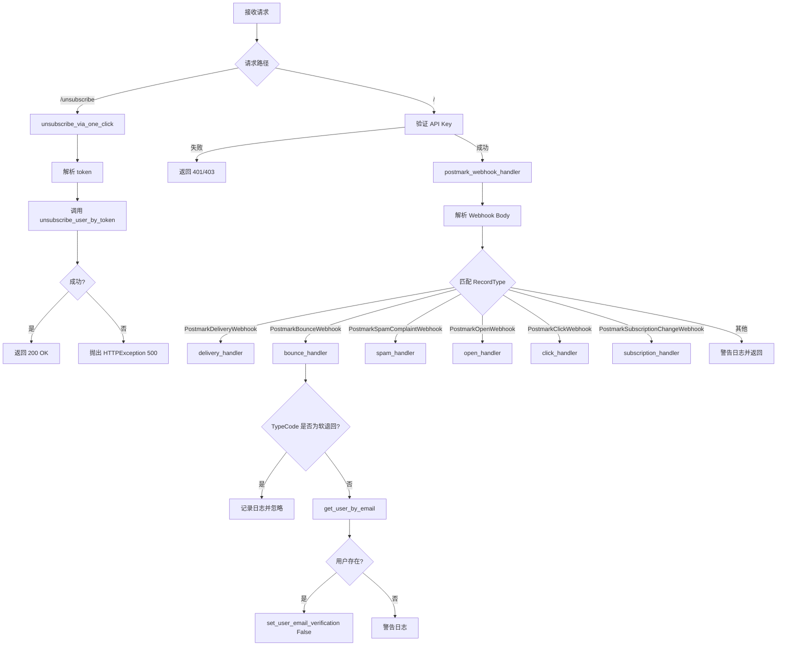
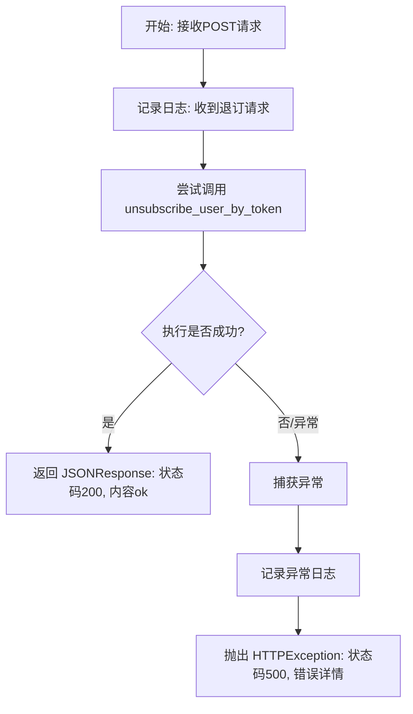
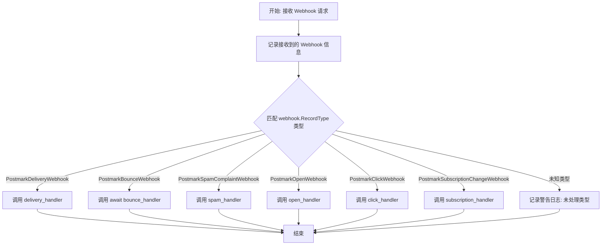
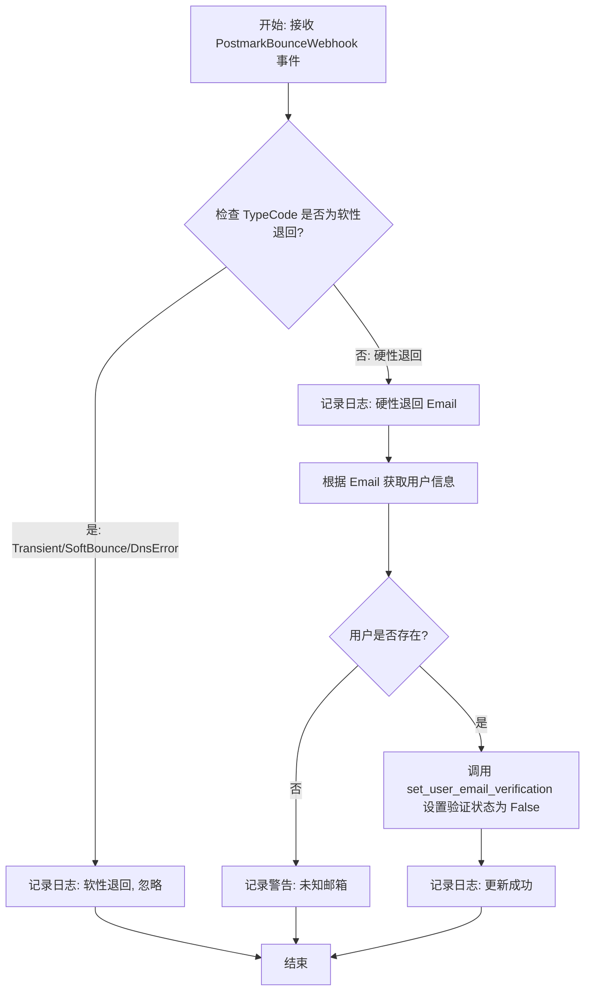
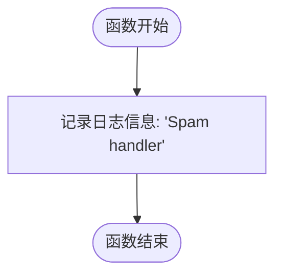
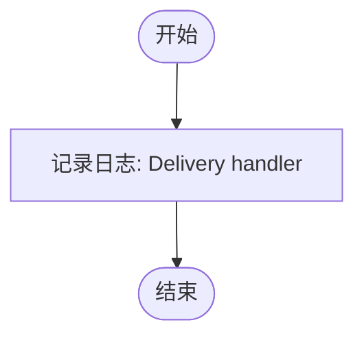
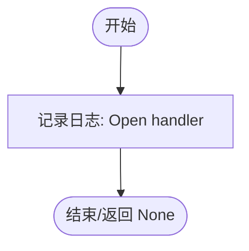
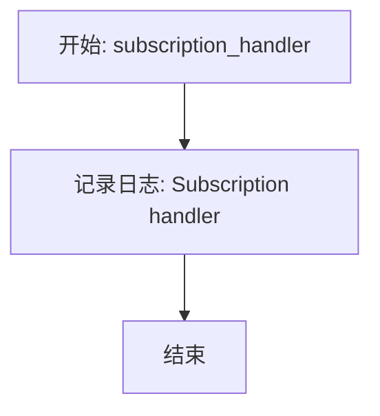

# `.\AutoGPT\autogpt_platform\backend\backend\api\features\postmark\postmark.py` 详细设计文档

该代码实现了一个 FastAPI 路由模块，用于处理来自 Postmark 邮件服务的 Webhook 通知及一键退订请求。核心功能包括验证请求来源、分发邮件事件（如投递、退回、垃圾邮件举报、打开、点击等）到对应的处理函数，并在检测到硬退回时自动更新用户邮箱验证状态，同时提供一键退订接口以处理用户取消订阅的逻辑。

## 整体流程



## 类结构

```
PostmarkWebhook (基类)
├── PostmarkDeliveryWebhook
├── PostmarkBounceWebhook
├── PostmarkSpamComplaintWebhook
├── PostmarkOpenWebhook
├── PostmarkClickWebhook
└── PostmarkSubscriptionChangeWebhook
```

## 全局变量及字段


### `logger`
    
用于记录模块运行日志、错误及调试信息的日志记录器实例。

类型：`logging.Logger`
    


### `settings`
    
应用程序的全局配置对象，用于访问系统配置及敏感信息（如 Postmark Webhook Token）。

类型：`Settings`
    


### `router`
    
FastAPI 的路由器实例，负责定义和处理与 Postmark 邮件服务相关的 Webhook 端点。

类型：`APIRouter`
    


### `postmark_api_key_auth`
    
API Key 认证器实例，用于验证请求头中的 X-Postmark-Webhook-Token 以确保请求来源的合法性。

类型：`APIKeyAuthenticator`
    


    

## 全局函数及方法


### `unsubscribe_via_one_click`

处理一键邮件退订请求，通过解析URL查询参数中的令牌，调用数据层服务取消对应用户的订阅，并返回处理结果。

参数：

- `token`：`Annotated[str, Query]`，包含在URL查询参数中的退订令牌，用于识别并验证需要取消订阅的用户。

返回值：`JSONResponse`，表示操作结果的JSON响应，成功时返回200状态码和{"status": "ok"}，失败时返回500状态码和错误详情。

#### 流程图



#### 带注释源码

```python
@router.post("/unsubscribe", summary="One Click Email Unsubscribe")
async def unsubscribe_via_one_click(token: Annotated[str, Query()]):
    # 记录接收到退订请求的信息日志
    logger.info("Received unsubscribe request from One Click Unsubscribe")
    try:
        # 调用数据层函数，根据传入的token执行用户取消订阅操作
        await unsubscribe_user_by_token(token)
    except Exception as e:
        # 捕获处理过程中的任意异常，并记录详细的错误堆栈
        logger.exception("Unsubscribe failed: %s", e)
        # 抛出HTTP 500异常，向客户端返回错误消息和提示
        raise HTTPException(
            status_code=500,
            detail={"message": str(e), "hint": "Verify Postmark token settings."},
        )
    # 操作成功，返回HTTP 200状态码及确认信息
    return JSONResponse(status_code=200, content={"status": "ok"})
```


### `postmark_webhook_handler`

该函数是处理来自 Postmark 邮件服务的 Webhook 请求的核心端点。它接收经过身份验证的 Webhook 数据，利用结构化模式匹配（Structural Pattern Matching）根据 `RecordType` 字段分发请求给对应的处理函数，涵盖了投递、退信、垃圾邮件投诉、打开、点击及订阅变更等事件类型。

参数：

- `webhook`：`Annotated[PostmarkWebhook, Body(discriminator="RecordType")]`，包含 Postmark 发送的 Webhook 负载数据的请求体，通过 `RecordType` 字段进行联合类型鉴别。

返回值：`None`，函数本身不返回具体数据，主要执行副作用操作（如日志记录和调用子处理器），FastAPI 默认返回 204 状态码。

#### 流程图



#### 带注释源码

```python
async def postmark_webhook_handler(
    webhook: Annotated[
        PostmarkWebhook,
        Body(discriminator="RecordType"), # 使用 Fastapi 的 Body 特性，根据 RecordType 自动反序列化为具体的子类
    ]
):
    # 记录接收到的 Webhook 原始信息
    logger.info(f"Received webhook from Postmark: {webhook}")
    
    # 使用 Python 3.10+ 的 match-case 语句进行类型分发
    match webhook:
        # 处理投递成功事件
        case PostmarkDeliveryWebhook():
            delivery_handler(webhook)
        # 处理退信事件（注意：bounce_handler 是异步函数，需要 await）
        case PostmarkBounceWebhook():
            await bounce_handler(webhook)
        # 处理垃圾邮件投诉事件
        case PostmarkSpamComplaintWebhook():
            spam_handler(webhook)
        # 处理邮件打开事件
        case PostmarkOpenWebhook():
            open_handler(webhook)
        # 处理邮件链接点击事件
        case PostmarkClickWebhook():
            click_handler(webhook)
        # 处理订阅状态变更事件
        case PostmarkSubscriptionChangeWebhook():
            subscription_handler(webhook)
        # 处理未知或未映射的事件类型
        case _:
            logger.warning(
                "Unhandled Postmark webhook type %s. Update handler mappings.",
                type(webhook),
            )
            return # 显式返回，结束处理
```


### `bounce_handler`

处理 Postmark 邮件退回 Webhook 事件，根据退回类型代码判断是否为硬性退回，若是则将关联用户的邮箱验证状态设置为无效。

参数：

-   `event`：`PostmarkBounceWebhook`，包含退回邮件详情（如邮箱地址、退回类型代码）的 Webhook 事件对象。

返回值：`None`，无返回值，仅执行数据库更新操作。

#### 流程图



#### 带注释源码

```python
async def bounce_handler(event: PostmarkBounceWebhook):
    # 记录接收到的退回事件详情，便于调试和追踪
    logger.info(f"Bounce handler {event=}")
    
    # 检查退回类型代码（TypeCode）是否属于暂时性或软性退回
    if event.TypeCode in [
        PostmarkBounceEnum.Transient,
        PostmarkBounceEnum.SoftBounce,
        PostmarkBounceEnum.DnsError,
    ]:
        # 如果是软性退回，仅记录日志，不修改用户邮箱验证状态，避免误判
        logger.info(
            f"Softish bounce: {event.TypeCode} for {event.Email}, not setting email verification to false"
        )
        return
    
    # 记录发生硬性退回的邮箱地址
    logger.info(f"{event.Email=}")
    
    # 根据邮箱地址在数据库中查找对应的用户记录
    user = await get_user_by_email(event.Email)
    
    # 如果系统中找不到该邮箱对应的用户，记录警告并退出
    if not user:
        logger.warning(
            "Received bounce for unknown email %s. Ensure user records are current.",
            event.Email,
        )
        return
    
    # 找到用户后，将该用户的邮箱验证状态设置为 False（标记为无效）
    await set_user_email_verification(user.id, False)
    # 记录调试日志，确认已更新用户状态
    logger.debug(f"Setting email verification to false for user: {user.id}")
```


### `spam_handler`

处理 Postmark 垃圾邮件投诉事件的处理器函数。当前实现仅为占位符，用于记录接收到了垃圾邮件投诉事件，尚未包含具体的业务逻辑处理。

参数：

-   `event`：`PostmarkSpamComplaintWebhook`，包含垃圾邮件投诉事件详细数据的对象，来源于 Postmark Webhook。

返回值：`None`，无返回值（当前实现为空）。

#### 流程图



#### 带注释源码

```python
def spam_handler(event: PostmarkSpamComplaintWebhook):
    # 记录日志，指示已进入垃圾邮件投诉处理流程
    logger.info("Spam handler")
    # 此处为占位符，未来可添加处理垃圾邮件投诉的业务逻辑
    # 例如：标记用户、暂停发送邮件等
    pass
```


### `delivery_handler`

处理来自 Postmark 的邮件投递 Webhook 事件。当前实现为一个占位符，仅记录日志。

参数：

- `event`：`PostmarkDeliveryWebhook`，包含邮件投递状态详情的 Webhook 事件数据对象。

返回值：`None`，无返回值。

#### 流程图



#### 带注释源码

```python
def delivery_handler(event: PostmarkDeliveryWebhook):
    # 记录接收到了投递处理器的请求
    logger.info("Delivery handler")
    # 当前函数为空实现，不做任何处理
    pass
```


### `open_handler`

处理来自 Postmark 的邮件打开事件（Open Webhook）的函数。当前实现仅记录日志，未包含具体的业务逻辑。

参数：

- `event`：`PostmarkOpenWebhook`，包含邮件打开事件详细信息的 Webhook 数据模型。

返回值：`None`，无返回值。

#### 流程图



#### 带注释源码

```python
def open_handler(event: PostmarkOpenWebhook):
    # 记录收到邮件打开事件的信息
    logger.info("Open handler")
    # 当前函数为空实现，不执行任何操作
    pass
```


### `click_handler`

处理来自 Postmark 的邮件点击事件。目前该函数仅记录接收到了事件，尚未实现具体的业务逻辑处理。

参数：

-   `event`：`PostmarkClickWebhook`，包含 Postmark 点击 webhook 的事件数据负载，包括点击链接、时间戳等信息。

返回值：`None`，无返回值。

#### 流程图

```mermaid
flowchart TD
    Start([开始]) --> Log[记录日志: "Click handler"]
    Log --> End([结束])
```

#### 带注释源码

```python
def click_handler(event: PostmarkClickWebhook):
    # 记录接收到点击事件的日志信息
    logger.info("Click handler")
    # 当前函数为空实现，不执行任何具体操作
    pass
```


### `subscription_handler`

处理 Postmark 订阅变更 Webhook 事件，当前实现为占位符，仅记录日志。

参数：

-  `event`：`PostmarkSubscriptionChangeWebhook`，包含订阅变更详情的 webhook 负载对象。

返回值：`None`，无返回值。

#### 流程图



#### 带注释源码

```python
def subscription_handler(event: PostmarkSubscriptionChangeWebhook):
    # 记录接收到的订阅变更事件
    logger.info("Subscription handler")
    # 当前为空实现，暂不处理具体逻辑
    pass
```


## 关键组件


### API 认证器

使用 `APIKeyAuthenticator` 验证请求头中的 `X-Postmark-Webhook-Token`，确保只有来自 Postmark 服务的合法请求才能被处理。

### Webhook 分发器

主处理入口 `/`，负责接收 Postmark 发送的 webhook 负载，通过 `match/case` 结构根据 `RecordType` 将事件分发到对应的处理函数（如退信、点击、打开等）。

### 退信处理逻辑

针对 `PostmarkBounceWebhook` 事件的特定处理，分析退信类型代码，忽略暂时性或软性退信，对于硬性退信则查找对应用户并将其邮箱验证状态设置为 False。

### 一键取消订阅端点

处理 `/unsubscribe` 请求的接口，通过查询参数中的 `token` 异步调用用户取消订阅逻辑，并处理可能的异常和日志记录。

### 用户数据交互层

与后端数据模型的交互组件，包含 `get_user_by_email` 和 `set_user_email_verification` 等函数的调用，用于维护用户数据的实时性和准确性。


## 问题及建议


### 已知问题

-   **处理函数逻辑缺失**：代码中定义了多个 Webhook 处理函数（如 `spam_handler`, `delivery_handler`, `open_handler`, `click_handler`, `subscription_handler`），但它们目前仅包含日志记录或 `pass` 语句，未实现任何实际业务逻辑，导致系统无法响应这些事件。
-   **垃圾邮件投诉未处理**：`spam_handler` 未对垃圾邮件投诉做出反应。与 `bounce_handler` 会将用户邮箱标记为未验证不同，收到垃圾邮件投诉时系统未自动取消订阅或惩罚用户，这可能影响邮件服务的信誉度。
-   **异步定义不一致**：`bounce_handler` 定义为 `async def`（因为涉及数据库操作），而其他处理函数定义为普通 `def`。这种不一致性在后续扩展功能（如为 `click_handler` 添加统计逻辑）时容易导致阻塞或需要重构。
-   **错误隔离机制不足**：在 `postmark_webhook_handler` 中调用具体处理函数时，如果某个处理函数（例如 `bounce_handler`）抛出未捕获的异常，会导致整个请求返回 500 错误。这可能导致 Postmark 认为接收端失败并进行不必要的重试，从而加重服务器负担。

### 优化建议

-   **引入消息队列解耦**：建议引入消息队列（如 Celery、Redis Streams 或 Kafka）。Webhook 接收端仅负责验证请求并将事件 payload 推送到队列，然后立即返回 200 OK。繁重的数据库操作和业务逻辑由后台 Worker 异步处理，以提高接口响应速度和系统吞吐量。
-   **实现缺失的业务逻辑**：完善 `spam_handler`，当收到垃圾邮件投诉时，应自动将用户标记为投诉状态或直接退订。同时根据业务需求补充 `open` 和 `click` 事件的统计逻辑。
-   **统一异步编程模型**：建议将所有处理函数统一修改为 `async def`，以符合 FastAPI 的异步特性，避免在未来同步数据库操作时阻塞事件循环。
-   **增强异常处理与重试策略**：在调用具体处理函数的代码外层包裹 `try...except` 块。捕获处理过程中的异常并记录详细的错误日志，但确保始终向 Postmark 返回成功的状态码（如 200 或 202），除非是请求签名验证失败。这样可以避免因业务逻辑错误触发 Webhook 重试风暴。
-   **结构化日志记录**：使用结构化日志（如 JSON 格式）替代简单的字符串日志，便于后续通过日志系统（如 ELK）对 Webhook 事件进行检索、分析和监控。


## 其它


### 设计目标与约束

**设计目标：**
1. **Webhook 高可靠性处理**：及时接收并处理来自 Postmark 的邮件事件 webhook，确保外部邮件服务状态与内部用户数据（特别是邮箱有效性状态）同步。
2. **用户状态自动维护**：通过解析邮件退回事件，自动将无效邮箱的用户标记为“未验证”，以维护系统数据的健康度。
3. **便捷退订支持**：提供“一键退订”接口，允许用户通过邮件链接快速取消订阅，提升用户体验和合规性。

**设计约束：**
1. **安全认证**：Webhook 处理接口必须验证 `X-Postmark-Webhook-Token` 以确保请求来源可信，防止伪造请求。
2. **异步处理**：所有涉及数据库 I/O 的操作（如查询用户、更新状态）必须使用异步（`async/await`）模式，以避免阻塞 FastAPI 的事件循环。
3. **退回类型区分**：必须严格区分“硬退回”和“软退回”，仅在发生硬退回（如邮件地址不存在）时修改用户状态，避免因临时网络问题错误地标记用户。
4. **幂等性考虑**：Webhook 处理逻辑应具备一定的幂等性或容错性，防止因 Postmark 重试导致的数据不一致（当前代码对同一用户的重复硬退回处理是幂等的）。

### 错误处理与异常设计

1. **Webhook 处理异常**：
   *   **策略**：采用“尽力而为”并记录日志的策略。
   *   **处理**：在主处理函数 `postmark_webhook_handler` 中，如果接收到未知的 webhook 类型，仅记录警告日志并返回 200 OK，防止 Postmark 认为处理失败而不断重试。
   *   **子处理函数异常**：例如 `bounce_handler` 中查找用户失败或数据库操作失败，捕获异常并记录日志，但通常不抛出 HTTP 异常，确保流程正常结束，返回 200 OK 给 Postmark。

2. **用户操作异常**：
   *   **策略**：采用“快速失败”策略。
   *   **处理**：在 `unsubscribe_via_one_click` 接口中，如果 `unsubscribe_user_by_token` 抛出异常，记录完整堆栈信息，并向客户端返回 HTTP 500 状态码及错误详情。

3. **认证异常**：
   *   依赖 `APIKeyAuthenticator`，如果 Token 验证失败，将由 FastAPI 安全依赖自动抛出 401 或 403 异常，阻止请求进入业务逻辑。

### 数据流

1. **Webhook 处理流**：
   *   **输入**：Postmark 服务发送 HTTP POST 请求至根路径 `/`，Header 包含认证 Token，Body 包含 JSON 数据。
   *   **验证**：`postmark_api_key_auth` 校验 Header 中的 Token。
   *   **解析**：FastAPI 利用 Pydantic 模型（通过 `discriminator="RecordType"`）根据 JSON 中的 `RecordType` 字段自动将请求体反序列化为对应的 Webhook 对象（如 `PostmarkBounceWebhook`）。
   *   **分发**：`postmark_webhook_handler` 使用 Python `match-case` 语句匹配对象类型，调用对应的 handler 函数（如 `bounce_handler`）。
   *   **业务执行**：Handler 函数调用 `backend.data.user` 模块查询用户并更新状态。
   *   **输出**：返回 HTTP 200 状态码给 Postmark。

2. **一键退订流**：
   *   **输入**：用户/客户端发送 HTTP POST 请求至 `/unsubscribe`，携带 URL 参数 `token`。
   *   **执行**：`unsubscribe_via_one_click` 读取 token，调用 `unsubscribe_user_by_token` 执行退订逻辑。
   *   **输出**：成功返回 JSON `{"status": "ok"}`；失败返回 HTTP 500 错误信息。

### 外部依赖与接口契约

1. **Postmark Webhook 服务**
   *   **类型**：外部 HTTP API 调入。
   *   **契约**：
     *   **认证方式**：Header `X-Postmark-Webhook-Token` 必须与系统配置 `settings.secrets.postmark_webhook_token` 一致。
     *   **数据格式**：JSON，需包含 `RecordType` 字段用于分发。支持的事件类型包括：`Delivery`, `Bounce`, `SpamComplaint`, `Open`, `Click`, `SubscriptionChange`。
     *   **交互协议**：POST 请求，预期响应状态码 2xx 以确认成功接收。

2. **内部数据访问层 (`backend.data.user`)**
   *   **依赖组件**：用户数据模块。
   *   **接口契约**：
     *   `async get_user_by_email(email: str) -> Optional[User]`: 根据邮箱查询用户，不存在则返回 None。
     *   `async set_user_email_verification(user_id: int, is_verified: bool)`: 更新用户的邮箱验证状态。
     *   `async unsubscribe_user_by_token(token: str)`: 根据令牌执行退订操作，失败抛出异常。

3. **配置系统 (`backend.util.settings.Settings`)**
   *   **依赖组件**：应用配置管理。
   *   **契约**：必须提供 `secrets.postmark_webhook_token` 属性用于 webhook 鉴权。

### 状态机设计

虽然本模块主要为事件驱动的无状态处理，但在 `bounce_handler` 中隐含了**用户邮箱验证状态**的状态变更逻辑：

*   **状态**: `Verified` (已验证) / `Unverified` (未验证)
*   **触发事件**:
  *   **硬退回**: `TypeCode` 为 `HardBounce`, `SpamComplaint`, `SpamNotification` 等（即非 Transient/SoftBounce/DnsError）。
  *   **软退回**: `TypeCode` 为 `Transient`, `SoftBounce`, `DnsError`。
*   **转移逻辑**:
  *   如果当前用户存在且触发 **硬退回** 事件 -> 状态转移为 `Unverified`。
  *   如果触发 **软退回** 事件 -> 状态保持 `Verified` 不变。
  *   如果触发 **退订** 事件 (`unsubscribe_user_by_token`) -> 状态转移为 `Unverified` (或相关订阅状态关闭，视具体实现而定)。

### 安全性设计

1. **Webhook 签名验证**：使用共享密钥机制验证 Postmark 服务器的身份，防止恶意攻击者伪造 webhook 请求（例如伪造退回邮件从而禁用真实用户账户）。
2. **参数校验**：利用 FastAPI 的 `Query` 和 Pydantic 模型自动校验输入参数的格式和类型，防止注入攻击或格式错误导致的程序崩溃。
3. **敏感信息保护**：Token 存储于 `Settings` 的 `secrets` 命名空间下，暗示了其敏感属性，应避免在日志中明文打印敏感字段（当前代码日志中打印了 webhook 对象，需确保 Pydantic 模型配置了适当的输出过滤）。

    