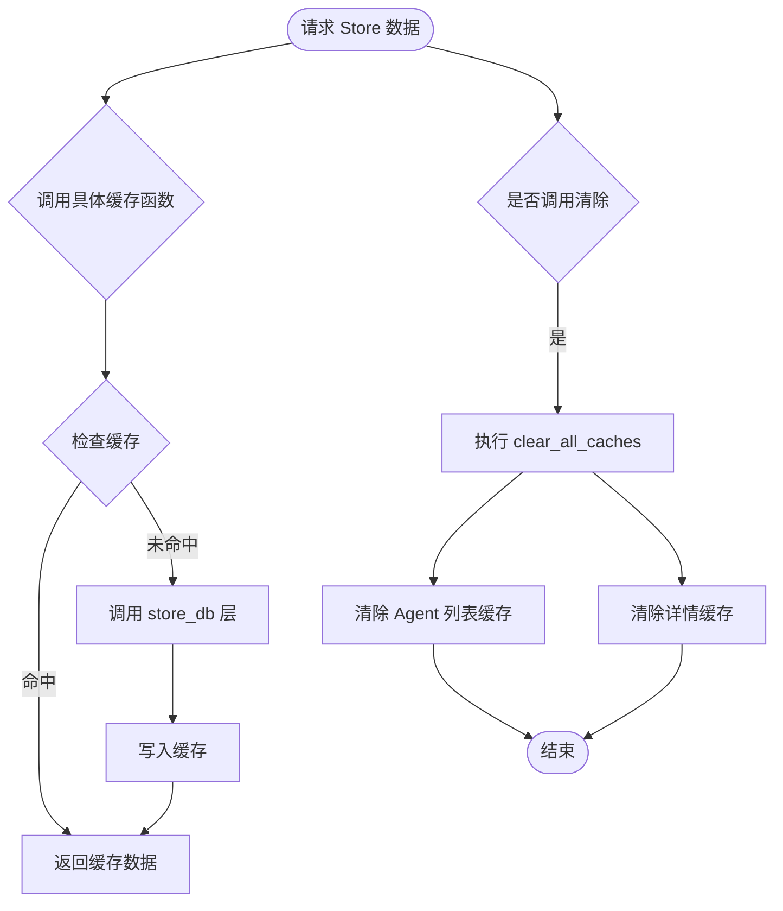
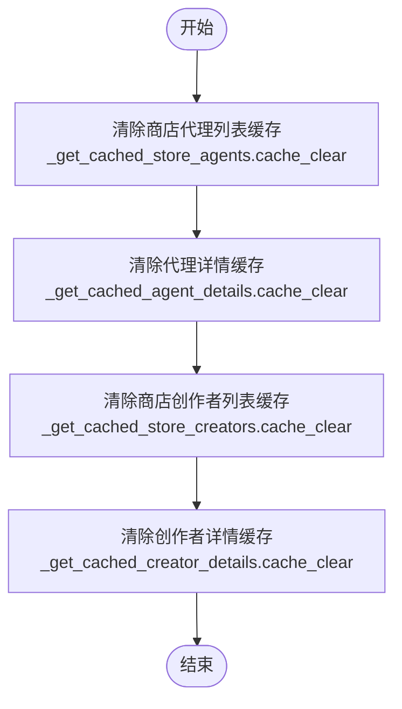
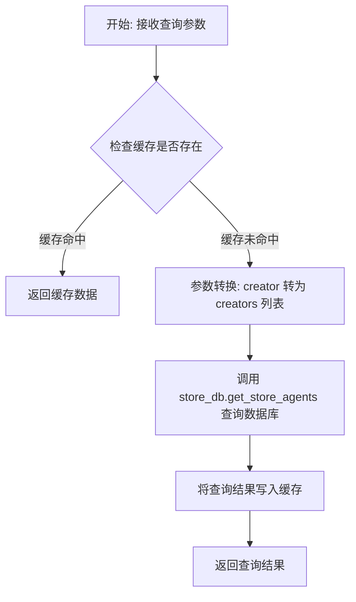

# `AutoGPT\autogpt_platform\backend\backend\api\features\store\cache.py` 详细设计文档

该模块作为 Store 数据访问层的缓存代理，通过装饰器为获取 Agent（智能体）、Creator（创作者）及其列表和详情的数据库查询提供缓存机制，以减少数据库负载并提高响应速度，同时提供清除所有缓存的功能。

## 整体流程



## 类结构

```

```

## 全局变量及字段


    

## 全局函数及方法


### `clear_all_caches`

该函数用于清除与商店代理和创作者相关的所有内部缓存，包括商店代理列表、代理详情、商店创作者列表及创作者详情的缓存，以确保系统在需要时能够从数据库重新获取最新数据。

参数：

- 无

返回值：`None`，无显式返回值。

#### 流程图



#### 带注释源码

```python
def clear_all_caches():
    """Clear all caches."""
    # 清除商店代理列表的缓存
    _get_cached_store_agents.cache_clear()
    # 清除单个代理详情的缓存
    _get_cached_agent_details.cache_clear()
    # 清除商店创作者列表的缓存
    _get_cached_store_creators.cache_clear()
    # 清除单个创作者详情的缓存
    _get_cached_creator_details.cache_clear()
```


### `_get_cached_store_agents`

这是一个带有缓存装饰器的异步辅助函数，用于获取商店中的 Agent 列表。它通过封装数据库查询逻辑，支持根据多种条件（如是否精选、创建者、排序方式、搜索词、分类）进行筛选和分页，并利用缓存机制（TTL 300秒，最大缓存条目 5000）来减少数据库访问压力。

参数：

- `featured`：`bool`，是否仅筛选精选的 Agent。
- `creator`：`str | None`，指定创建者的用户名，用于筛选特定创建者的 Agent（可选）。
- `sorted_by`：`Literal["rating", "runs", "name", "updated_at"] | None`，指定列表的排序方式，支持按评分、运行次数、名称或更新时间排序（可选）。
- `search_query`：`str | None`，搜索关键词，用于匹配 Agent 的名称或描述（可选）。
- `category`：`str | None`，指定的分类名称，用于筛选特定类别的 Agent（可选）。
- `page`：`int`，分页页码，指定要获取第几页的数据。
- `page_size`：`int`，每页的数据条目数量。

返回值：`Any`（具体类型取决于 `store_db.get_store_agents` 的实现），返回符合查询条件的 Agent 列表数据，通常包含 Agent 的详细信息及分页元数据。

#### 流程图



#### 带注释源码

```python
# Cache store agents list for 5 minutes
# Different cache entries for different query combinations
# 使用 cached 装饰器进行缓存，最大缓存 5000 条，存活时间 300 秒，启用共享缓存
@cached(maxsize=5000, ttl_seconds=300, shared_cache=True)
async def _get_cached_store_agents(
    featured: bool,
    creator: str | None,
    sorted_by: Literal["rating", "runs", "name", "updated_at"] | None,
    search_query: str | None,
    category: str | None,
    page: int,
    page_size: int,
):
    """Cached helper to get store agents."""
    # 调用数据库层函数获取数据
    # 注意：数据库层需要 creators 列表参数，因此这里将单个 creator 字符串转换为列表（如果存在）
    return await store_db.get_store_agents(
        featured=featured,
        creators=[creator] if creator else None,  # 将 creator 转换为列表格式供下游使用
        sorted_by=sorted_by,
        search_query=search_query,
        category=category,
        page=page,
        page_size=page_size,
    )
```


### `_get_cached_agent_details`

这是一个用于获取特定Agent详情的缓存辅助函数。通过装饰器实现缓存机制，以减少对数据库的直接查询，提高响应速度。

参数：

-  `username`：`str`，Agent创建者的用户名。
-  `agent_name`：`str`，Agent的名称。
-  `include_changelog`：`bool`，是否包含变更日志的标志（默认为 False）。

返回值：`Dict` 或 `Any`，从数据库获取的Agent详情数据。

#### 流程图

```mermaid
graph TD
    A[开始: _get_cached_agent_details] --> B{检查缓存 (@cached 装饰器)};
    B -- 缓存命中 --> C[返回缓存中的数据];
    B -- 缓存未命中 --> D[执行函数体];
    D --> E[调用 store_db.get_store_agent_details];
    E --> F[将结果写入缓存];
    F --> G[返回数据库查询结果];
```

#### 带注释源码

```python
# 通过装饰器启用缓存功能：最大缓存数量200，缓存时间300秒，使用共享缓存
@cached(maxsize=200, ttl_seconds=300, shared_cache=True)
async def _get_cached_agent_details(
    username: str, agent_name: str, include_changelog: bool = False
):
    """Cached helper to get agent details."""
    # 调用底层 store_db 模块的方法获取实际的 Agent 详情数据
    # 参数透传给数据库查询函数
    return await store_db.get_store_agent_details(
        username=username, agent_name=agent_name, include_changelog=include_changelog
    )
```


### `_get_cached_store_creators`

一个带有缓存机制的辅助函数，用于根据指定的分页、筛选和排序条件获取商店创建者列表。该函数使用 LRU 策略和 TTL（生存时间）来缓存数据库查询结果，以减少数据库负载并提高响应速度。

参数：

- `featured`：`bool`，标记是否只获取精选（Featured）的创建者。
- `search_query`：`str | None`，用于搜索创建者的查询字符串，支持模糊搜索。
- `sorted_by`：`Literal["agent_rating", "agent_runs", "num_agents"] | None`，排序依据的字段，可选值包括代理评分、代理运行次数或代理数量。
- `page`：`int`，当前页码。
- `page_size`：`int`，每页显示的记录数量。

返回值：`Any`（具体类型取决于 `store_db.get_store_creators` 的实现），返回数据库查询结果，通常是包含创建者信息的列表或分页对象。

#### 流程图

```mermaid
flowchart TD
    A[开始: 接收参数] --> B{检查缓存<br>@cached装饰器}
    B -- 命中 --> C[返回缓存结果]
    B -- 未命中 --> D[调用 store_db.get_store_creators]
    D --> E[等待数据库查询结果]
    E --> F[更新缓存]
    F --> G[返回查询结果]
```

#### 带注释源码

```python
# Cache creators list for 5 minutes
# 使用缓存装饰器，最大缓存200条，TTL为300秒，使用共享缓存
@cached(maxsize=200, ttl_seconds=300, shared_cache=True)
async def _get_cached_store_creators(
    featured: bool,
    search_query: str | None,
    sorted_by: Literal["agent_rating", "agent_runs", "num_agents"] | None,
    page: int,
    page_size: int,
):
    """Cached helper to get store creators."""
    # 调用数据库层获取创建者数据，并将所有传入的参数透传
    return await store_db.get_store_creators(
        featured=featured,
        search_query=search_query,
        sorted_by=sorted_by,
        page=page,
        page_size=page_size,
    )
```


### `_get_cached_creator_details`

该函数是一个带有缓存机制的异步辅助函数，用于根据用户名获取创建者的详细信息。它利用缓存装饰器将结果缓存 5 分钟（300 秒），以减少数据库查询压力。在查询数据库前，它会将用户名统一转换为小写，以确保查询的一致性。

参数：

- `username`：`str`，需要获取详情的创建者用户名。

返回值：`Any`，返回包含创建者详细信息的数据对象（具体类型取决于 `store_db.get_store_creator_details` 的实现）。

#### 流程图

```mermaid
flowchart TD
    A([开始]) --> B{检查缓存是否存在<br>@cached装饰器逻辑}
    B -- 缓存命中 --> C([返回缓存结果])
    B -- 缓存未命中 --> D[接收参数 username]
    D --> E[将 username 转换为小写<br>username.lower]
    E --> F[调用 store_db.get_store_creator_details]
    F --> G[将结果写入缓存]
    G --> H([返回数据库查询结果])
```

#### 带注释源码

```python
# Cache individual creator details for 5 minutes
# 使用 @cached 装饰器进行缓存管理
# maxsize=100: 最多缓存100个不同用户的详情
# ttl_seconds=300: 缓存存活时间为300秒（5分钟）
# shared_cache=True: 启用共享缓存
@cached(maxsize=100, ttl_seconds=300, shared_cache=True)
async def _get_cached_creator_details(username: str):
    """Cached helper to get creator details."""
    # 调用数据库层函数获取创建者详情
    # 使用 username.lower() 确保用户名大小写不敏感，统一为小写进行查询
    return await store_db.get_store_creator_details(username=username.lower())
```


## 关键组件


### Store Agents Caching Service

Implements a caching layer for agent data retrieval, optimizing database access for paginated lists and individual details. It utilizes specific TTL and size constraints to handle queries for featured agents, search results, and specific changelog data.

### Store Creators Caching Service

Implements a caching layer for creator data retrieval, supporting paginated listings and detailed profiles. It ensures consistent data access through normalization (e.g., lowercasing usernames) and applies caching constraints to minimize database load.

### Global Cache Invalidation Controller

Provides a centralized mechanism to manually purge all cached store data. This component ensures that data consistency can be immediately enforced by clearing specific caches for agents and creators, bypassing the standard TTL expiration.


## 问题及建议


### 已知问题

-   **文档与代码实现不一致**：`_get_cached_agent_details` 函数上方的注释写的是 "Cache individual agent details for 15 minutes"，但代码中实际配置的 `ttl_seconds=300`（即 5 分钟），容易导致维护混乱。
-   **用户名大小写处理不一致**：`_get_cached_creator_details` 中对 `username` 进行了 `.lower()` 处理，但在 `_get_cached_store_creators` 和 `_get_cached_agent_details` 中直接透传了 `username`。这可能导致数据库查询不一致，或者因缓存键大小写敏感而造成缓存穿透或冗余缓存。
-   **缓存失效粒度过粗**：`clear_all_caches` 函数会清空所有缓存，没有提供针对特定资源（如特定 Agent 或 Creator）的缓存失效机制。当单个数据更新时，会导致大量不必要的缓存失效。
-   **硬编码的缓存参数**：`maxsize` 和 `ttl_seconds` 等参数直接硬编码在装饰器中，缺乏灵活性，难以根据运行时环境或不同部署阶段进行调整。

### 优化建议

-   **统一输入规范化**：在调用数据库或缓存之前，统一对 `username` 等标识符字段进行规范化处理（如统一转为小写），确保缓存键的一致性和查询的准确性。
-   **实现细粒度缓存失效**：增加按特定键值（如 `username` 或 `agent_name`）清除缓存的方法，避免在数据更新时使用“全量清除”的低效策略。
-   **引入配置管理**：将缓存相关的配置（TTL、最大大小等）提取到配置文件或常量类中，便于统一管理和动态调整。
-   **增加缓存监控指标**：集成监控指标（如缓存命中率、未命中次数、加载耗时），以便评估缓存策略的有效性并进行性能调优。
-   **修正文档注释**：将代码中的注释与实际 `ttl_seconds` 参数保持一致，避免误导后续开发者。


## 其它


### 设计目标与约束

**设计目标：**
1.  **性能优化**：通过引入缓存层，减少对底层数据库（`store_db`）的频繁查询，从而降低系统响应延迟。
2.  **负载削减**：在高并发场景下，通过缓存热门数据（如 Store Agents 和 Creators 列表），减轻数据库的计算压力和 I/O 负载。
3.  **数据一致性折中**：接受短暂的数据不一致（TTL 期间），以换取极高的读取性能，适用于非强实时性要求的展示场景。

**约束条件：**
1.  **内存限制**：各缓存函数设置了 `maxsize`（如 5000, 200, 100），限制了内存中特定类型缓存对象的最大数量，超过限制将触发淘汰策略（通常为 LRU）。
2.  **时效性限制**：
    *   Agent 详情：设计目标为 15 分钟（注释所示），实际实现为 300 秒（5 分钟）。
    *   其他数据：统一为 300 秒（5 分钟）。
    *   系统必须保证在 TTL 过期后数据失效。
3.  **参数敏感性**：缓存键高度依赖于输入参数。对于列表查询（如 `featured`, `sorted_by` 等），参数组合的变化会导致缓存未命中，需控制参数组合的数量以防止缓存击穿。

### 数据流与状态机

**数据流：**
1.  **请求阶段**：外部服务调用公开的 API（该代码仅为内部实现，假设上游为 Service 层），传入查询参数（如 `username`, `page`, `category` 等）。
2.  **缓存层处理**：
    *   **键生成**：`@cached` 装饰器根据函数名和传入参数生成唯一的缓存键。
    *   **查找**：在共享缓存中查找该键是否存在且未过期。
3.  **命中/未命中分支**：
    *   **命中**：直接返回缓存中的数据，终止流程。
    *   **未命中**：调用 `store_db` 中的对应数据库查询函数。
4.  **回写阶段**：数据库返回结果后，`@cached` 装饰器将结果写入缓存，并设置 TTL。
5.  **响应阶段**：将数据返回给调用者。

**状态机（缓存条目视角）：**
*   **空闲**：缓存条目尚未被创建或已被淘汰。
*   **加载中**：首次请求发生，正在执行数据库查询（取决于 `@cached` 内部实现，可能涉及防止缓存击穿的锁机制）。
*   **活跃**：数据已缓存且未过期，可供快速读取。
*   **过期**：TTL 耗尽，数据标记为不可用，下一次访问将触发“加载中”状态并刷新数据。

### 外部依赖与接口契约

**外部依赖：**
1.  **`backend.util.cache.cached`**：
    *   **描述**：核心缓存装饰器，负责缓存逻辑的实现。
    *   **契约**：必须支持异步函数（`async def`）的包装；必须支持 `maxsize`（最大容量）、`ttl_seconds`（生存时间）和 `shared_cache`（跨进程/实例共享）参数；必须提供 `cache_clear()` 方法用于手动清理。
2.  **`.db as store_db`**：
    *   **描述**：数据持久层模块，负责实际的数据查询。
    *   **契约**：
        *   `get_store_agents`：必须接受 `featured`, `creators`, `sorted_by`, `search_query`, `category`, `page`, `page_size` 参数，并返回 Agent 列表及分页信息。
        *   `get_store_agent_details`：必须接受 `username`, `agent_name`, `include_changelog` 参数，并返回单个 Agent 的详情对象。
        *   `get_store_creators`：必须接受 `featured`, `search_query`, `sorted_by`, `page`, `page_size` 参数，并返回 Creator 列表。
        *   `get_store_creator_details`：必须接受 `username` 参数，并返回单个 Creator 的详情对象。
        *   所有接口必须是异步接口（返回 Coroutine 或 awaitable 对象）。

### 错误处理与异常设计

**异常传播策略：**
*   **数据库异常**：当前代码中，缓存函数内部直接 `await` 数据库调用，未包含 `try-except` 块。
    *   **设计行为**：如果 `store_db` 查询失败（抛出异常，如连接超时、SQL 错误），异常将直接穿透缓存层向上传播。
    *   **后果**：本次请求失败，且不会在缓存中写入错误数据（Fail-open 模式，保证下次重试可能成功）。
*   **缓存异常**：如果底层缓存存储（如 Redis 或内存结构）发生故障，由 `@cached` 装饰器决定处理方式。通常设计为降级模式，即缓存失败时直接查询数据库，或者直接抛出异常。

**手动清除机制：**
*   提供 `clear_all_caches()` 函数，显式调用底层装饰器的 `cache_clear()` 方法。这通常用于数据发布、管理员后台操作或部署时的脏数据清理，不涉及异常处理，仅为强制性状态重置。


    