# `.\AutoGPT\autogpt_platform\backend\backend\api\features\store\content_handlers.py` 详细设计文档

This code defines a pluggable system for handling different content types (store agents, blocks, documentation) and provides functionality to fetch and process content for embedding.

## 整体流程

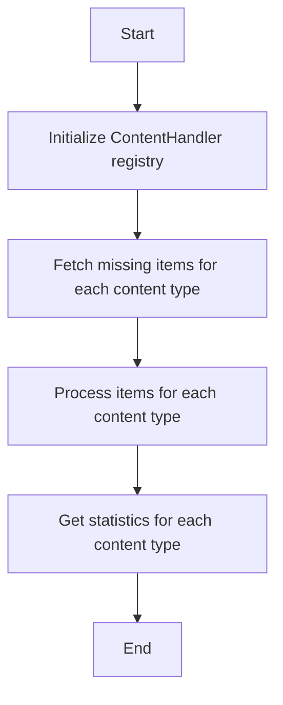

## 类结构

```
ContentHandler (抽象基类)
├── ContentItem (数据类)
├── StoreAgentHandler (具体实现)
├── BlockHandler (具体实现)
└── DocumentationHandler (具体实现)
```

## 全局变量及字段


### `logger`
    
Logger instance for logging messages.

类型：`logging.Logger`
    


### `CONTENT_HANDLERS`
    
Registry of content handlers by content type.

类型：`dict[ContentType, ContentHandler]`
    


### `ContentItem.content_id`
    
Unique identifier (DB ID or file path) for the content.

类型：`str`
    


### `ContentItem.content_type`
    
Type of the content.

类型：`ContentType`
    


### `ContentItem.searchable_text`
    
Combined text for embedding.

类型：`str`
    


### `ContentItem.metadata`
    
Content-specific metadata.

类型：`dict[str, Any]`
    


### `ContentItem.user_id`
    
For user-scoped content, the user identifier, if any.

类型：`str | None`
    
    

## 全局函数及方法


### `build_searchable_text`

This function constructs a combined text string from various parts of a store listing, such as name, description, sub-heading, and categories, to be used for embedding.

参数：

- `name`：`str`，The name of the store listing.
- `description`：`str`，The description of the store listing.
- `sub_heading`：`str`，The sub-heading of the store listing.
- `categories`：`list[str]`，The categories of the store listing.

返回值：`str`，The combined text string for embedding.

#### 流程图

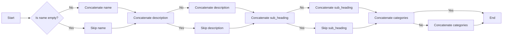

#### 带注释源码

```python
def build_searchable_text(name: str, description: str, sub_heading: str, categories: list[str]) -> str:
    """
    Constructs a combined text string from various parts of a store listing.

    Args:
        name: The name of the store listing.
        description: The description of the store listing.
        sub_heading: The sub-heading of the store listing.
        categories: The categories of the store listing.

    Returns:
        The combined text string for embedding.
    """
    parts = []
    if name:
        parts.append(name)
    if description:
        parts.append(description)
    if sub_heading:
        parts.append(sub_heading)
    if categories:
        parts.append(" ".join(categories))
    return " ".join(parts)
``` 


### `query_raw_with_schema`

查询原始数据，使用给定的SQL查询和参数。

参数：

- `sql`: `str`，SQL查询字符串，其中可以使用参数占位符（如`$1`）。
- `params`: `tuple`，包含用于执行SQL查询的参数。

返回值：`list`，包含查询结果的列表。

#### 流程图

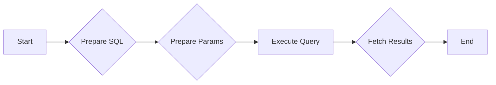

#### 带注释源码

```python
from backend.data.db import query_raw_with_schema

async def query_raw_with_schema(sql: str, params: tuple) -> list:
    # ... (源码实现)
```


### `BlockHandler.get_blocks`

This method retrieves all available block definitions from the system.

参数：

- `batch_size`: `int`，指定返回的最大条目数

返回值：`list`，包含所有可用块定义的字典，键为块ID，值为块类

#### 流程图

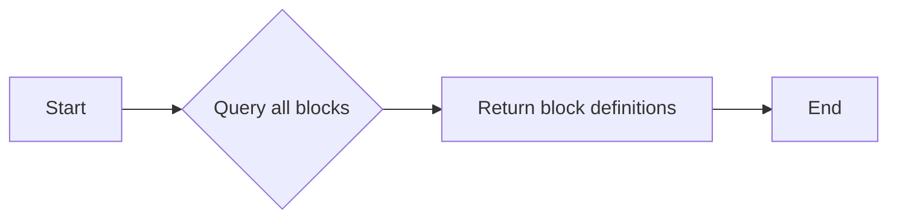

#### 带注释源码

```python
async def get_blocks(self) -> dict[str, Any]:
    """Fetch all available blocks."""
    from backend.data.block import get_blocks

    # Get all available blocks
    all_blocks = get_blocks()

    # Check which ones have embeddings
    if not all_blocks:
        return []

    block_ids = list(all_blocks.keys())

    # Query for existing embeddings
    placeholders = ",".join([f"${i+1}" for i in range(len(block_ids))])
    existing_result = await query_raw_with_schema(
        f"""
        SELECT "contentId"
        FROM {{schema_prefix}}"UnifiedContentEmbedding"
        WHERE "contentType" = 'BLOCK'::{{schema_prefix}}"ContentType"
        AND "contentId" = ANY(ARRAY[{placeholders}])
        """,
        *block_ids,
    )

    existing_ids = {row["contentId"] for row in existing_result}
    missing_blocks = [
        (block_id, block_cls)
        for block_id, block_cls in all_blocks.items()
        if block_id not in existing_ids
    ]

    # Convert to ContentItem
    items = []
    for block_id, block_cls in missing_blocks[:batch_size]:
        try:
            block_instance = block_cls()

            # Skip disabled blocks - they shouldn't be indexed
            if block_instance.disabled:
                continue

            # Build searchable text from block metadata
            parts = []
            if hasattr(block_instance, "name") and block_instance.name:
                parts.append(block_instance.name)
            if hasattr(block_instance, "description") and block_instance.description:
                parts.append(block_instance.description)
            if hasattr(block_instance, "categories") and block_instance.categories:
                # Convert BlockCategory enum to strings
                parts.append(
                    " ".join(str(cat.value) for cat in block_instance.categories)
                )

            # Add input/output schema info
            if hasattr(block_instance, "input_schema"):
                schema = block_instance.input_schema
                if hasattr(schema, "model_json_schema"):
                    schema_dict = schema.model_json_schema()
                    if "properties" in schema_dict:
                        for prop_name, prop_info in schema_dict[
                            "properties"
                        ].items():
                            if "description" in prop_info:
                                parts.append(
                                    f"{prop_name}: {prop_info['description']}"
                                )

            searchable_text = " ".join(parts)

            # Convert categories set of enums to list of strings for JSON serialization
            categories = getattr(block_instance, "categories", set())
            categories_list = (
                [cat.value for cat in categories] if categories else []
            )

            items.append(
                ContentItem(
                    content_id=block_id,
                    content_type=ContentType.BLOCK,
                    searchable_text=searchable_text,
                    metadata={
                        "name": getattr(block_instance, "name", ""),
                        "categories": categories_list,
                    },
                    user_id=None,  # Blocks are public
                )
            )
        except Exception as e:
            logger.warning(f"Failed to process block {block_id}: {e}")
            continue

    return items
```


### StoreAgentHandler.get_missing_items

Fetch approved store listings without embeddings.

参数：

- `batch_size`：`int`，Maximum number of items to return

返回值：`list[ContentItem]`，List of ContentItem objects ready for embedding

#### 流程图

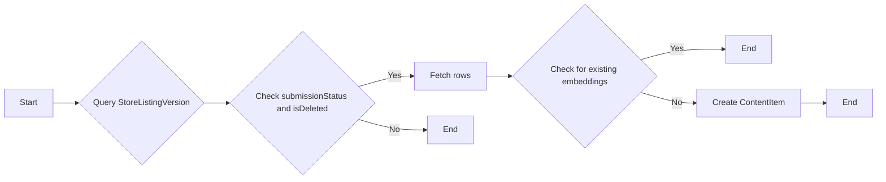

#### 带注释源码

```python
async def get_missing_items(self, batch_size: int) -> list[ContentItem]:
    """Fetch approved store listings without embeddings."""
    from backend.api.features.store.embeddings import build_searchable_text

    missing = await query_raw_with_schema(
        """
        SELECT
            slv.id,
            slv.name,
            slv.description,
            slv."subHeading",
            slv.categories
        FROM {schema_prefix}"StoreListingVersion" slv
        LEFT JOIN {schema_prefix}"UnifiedContentEmbedding" uce
            ON slv.id = uce."contentId" AND uce."contentType" = 'STORE_AGENT'::{schema_prefix}"ContentType"
        WHERE slv."submissionStatus" = 'APPROVED'
        AND slv."isDeleted" = false
        AND uce."contentId" IS NULL
        LIMIT $1
        """,
        batch_size,
    )

    return [
        ContentItem(
            content_id=row["id"],
            content_type=ContentType.STORE_AGENT,
            searchable_text=build_searchable_text(
                name=row["name"],
                description=row["description"],
                sub_heading=row["subHeading"],
                categories=row["categories"] or [],
            ),
            metadata={
                "name": row["name"],
                "categories": row["categories"] or [],
            },
            user_id=None,  # Store agents are public
        )
        for row in missing
    ]
```


### StoreAgentHandler.get_stats

Get statistics about store agent embedding coverage.

参数：

- `None`：无参数

返回值：`dict[str, int]`，Dict with keys: total, with_embeddings, without_embeddings

#### 流程图

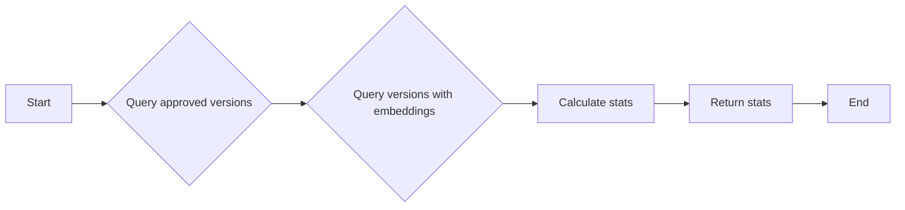

#### 带注释源码

```python
async def get_stats(self) -> dict[str, int]:
    """Get statistics about store agent embedding coverage."""
    # Count approved versions
    approved_result = await query_raw_with_schema(
        """
        SELECT COUNT(*) as count
        FROM {schema_prefix}"StoreListingVersion"
        WHERE "submissionStatus" = 'APPROVED'
        AND "isDeleted" = false
        """
    )
    total_approved = approved_result[0]["count"] if approved_result else 0

    # Count versions with embeddings
    embedded_result = await query_raw_with_schema(
        """
        SELECT COUNT(*) as count
        FROM {schema_prefix}"StoreListingVersion" slv
        JOIN {schema_prefix}"UnifiedContentEmbedding" uce ON slv.id = uce."contentId" AND uce."contentType" = 'STORE_AGENT'::{schema_prefix}"ContentType"
        WHERE slv."submissionStatus" = 'APPROVED'
        AND slv."isDeleted" = false
        """
    )
    with_embeddings = embedded_result[0]["count"] if embedded_result else 0

    return {
        "total": total_approved,
        "with_embeddings": with_embeddings,
        "without_embeddings": total_approved - with_embeddings,
    }
```


### StoreAgentHandler.get_missing_items

Fetch approved store listings without embeddings.

参数：

- `batch_size`：`int`，Maximum number of items to return

返回值：`list[ContentItem]`，List of ContentItem objects ready for embedding

#### 流程图

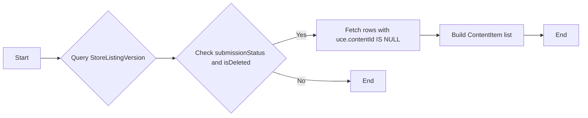

#### 带注释源码

```python
async def get_missing_items(self, batch_size: int) -> list[ContentItem]:
    """Fetch approved store listings without embeddings."""
    from backend.api.features.store.embeddings import build_searchable_text

    missing = await query_raw_with_schema(
        """
        SELECT
            slv.id,
            slv.name,
            slv.description,
            slv."subHeading",
            slv.categories
        FROM {schema_prefix}"StoreListingVersion" slv
        LEFT JOIN {schema_prefix}"UnifiedContentEmbedding" uce
            ON slv.id = uce."contentId" AND uce."contentType" = 'STORE_AGENT'::{schema_prefix}"ContentType"
        WHERE slv."submissionStatus" = 'APPROVED'
        AND slv."isDeleted" = false
        AND uce."contentId" IS NULL
        LIMIT $1
        """,
        batch_size,
    )

    return [
        ContentItem(
            content_id=row["id"],
            content_type=ContentType.STORE_AGENT,
            searchable_text=build_searchable_text(
                name=row["name"],
                description=row["description"],
                sub_heading=row["subHeading"],
                categories=row["categories"] or [],
            ),
            metadata={
                "name": row["name"],
                "categories": row["categories"] or [],
            },
            user_id=None,  # Store agents are public
        )
        for row in missing
    ]
```


### StoreAgentHandler.get_stats

Get statistics about store agent embedding coverage.

参数：

- `batch_size`: `int`，Maximum number of items to return

返回值：`dict[str, int]`，Dict with keys: total, with_embeddings, without_embeddings

#### 流程图


#### 带注释源码

```python
async def get_stats(self) -> dict[str, int]:
    """Get statistics about store agent embedding coverage."""
    # Count approved versions
    approved_result = await query_raw_with_schema(
        """
        SELECT COUNT(*) as count
        FROM {schema_prefix}"StoreListingVersion"
        WHERE "submissionStatus" = 'APPROVED'
        AND "isDeleted" = false
        """
    )
    total_approved = approved_result[0]["count"] if approved_result else 0

    # Count versions with embeddings
    embedded_result = await query_raw_with_schema(
        """
        SELECT COUNT(*) as count
        FROM {schema_prefix}"StoreListingVersion" slv
        JOIN {schema_prefix}"UnifiedContentEmbedding" uce ON slv.id = uce."contentId" AND uce."contentType" = 'STORE_AGENT'::{schema_prefix}"ContentType"
        WHERE slv."submissionStatus" = 'APPROVED'
        AND slv."isDeleted" = false
        """
    )
    with_embeddings = embedded_result[0]["count"] if embedded_result else 0

    return {
        "total": total_approved,
        "with_embeddings": with_embeddings,
        "without_embeddings": total_approved - with_embeddings,
    }
```


### BlockHandler.get_missing_items

Fetch blocks without embeddings.

参数：

- `batch_size`：`int`，Maximum number of items to return

返回值：`list[ContentItem]`，List of ContentItem objects ready for embedding

#### 流程图

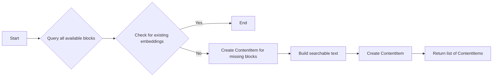

#### 带注释源码

```python
async def get_missing_items(self, batch_size: int) -> list[ContentItem]:
    """Fetch blocks without embeddings."""
    from backend.data.block import get_blocks

    # Get all available blocks
    all_blocks = get_blocks()

    # Check which ones have embeddings
    if not all_blocks:
        return []

    block_ids = list(all_blocks.keys())

    # Query for existing embeddings
    placeholders = ",".join([f"${i+1}" for i in range(len(block_ids))])
    existing_result = await query_raw_with_schema(
        f"""
        SELECT "contentId"
        FROM {{schema_prefix}}"UnifiedContentEmbedding"
        WHERE "contentType" = 'BLOCK'::{{schema_prefix}}"ContentType"
        AND "contentId" = ANY(ARRAY[{placeholders}])
        """,
        *block_ids,
    )

    existing_ids = {row["contentId"] for row in existing_result}
    missing_blocks = [
        (block_id, block_cls)
        for block_id, block_cls in all_blocks.items()
        if block_id not in existing_ids
    ]

    # Convert to ContentItem
    items = []
    for block_id, block_cls in missing_blocks[:batch_size]:
        try:
            block_instance = block_cls()

            # Skip disabled blocks - they shouldn't be indexed
            if block_instance.disabled:
                continue

            # Build searchable text from block metadata
            parts = []
            if hasattr(block_instance, "name") and block_instance.name:
                parts.append(block_instance.name)
            if hasattr(block_instance, "description") and block_instance.description:
                parts.append(block_instance.description)
            if hasattr(block_instance, "categories") and block_instance.categories:
                # Convert BlockCategory enum to strings
                parts.append(
                    " ".join(str(cat.value) for cat in block_instance.categories)
                )

            # Add input/output schema info
            if hasattr(block_instance, "input_schema"):
                schema = block_instance.input_schema
                if hasattr(schema, "model_json_schema"):
                    schema_dict = schema.model_json_schema()
                    if "properties" in schema_dict:
                        for prop_name, prop_info in schema_dict[
                            "properties"
                        ].items():
                            if "description" in prop_info:
                                parts.append(
                                    f"{prop_name}: {prop_info['description']}"
                                )

            searchable_text = " ".join(parts)

            # Convert categories set of enums to list of strings for JSON serialization
            categories = getattr(block_instance, "categories", set())
            categories_list = (
                [cat.value for cat in categories] if categories else []
            )

            items.append(
                ContentItem(
                    content_id=block_id,
                    content_type=ContentType.BLOCK,
                    searchable_text=searchable_text,
                    metadata={
                        "name": getattr(block_instance, "name", ""),
                        "categories": categories_list,
                    },
                    user_id=None,  # Blocks are public
                )
            )
        except Exception as e:
            logger.warning(f"Failed to process block {block_id}: {e}")
            continue

    return items
``` 


### BlockHandler.get_stats

Get statistics about block embedding coverage.

参数：

- `batch_size`: `int`，Maximum number of items to return

返回值：`dict[str, int]`，Dict with keys: total, with_embeddings, without_embeddings

#### 流程图

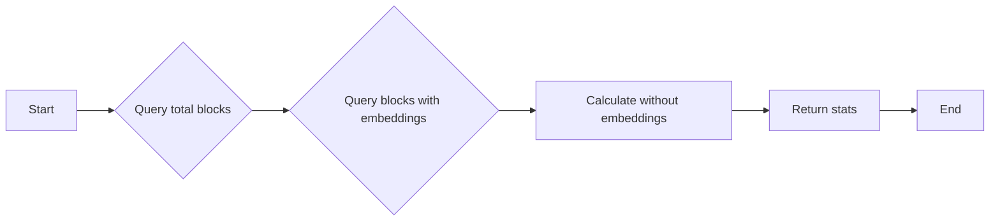

#### 带注释源码

```python
async def get_stats(self) -> dict[str, int]:
    """Get statistics about block embedding coverage."""
    from backend.data.block import get_blocks

    all_blocks = get_blocks()

    # Filter out disabled blocks - they're not indexed
    enabled_block_ids = [
        block_id
        for block_id, block_cls in all_blocks.items()
        if not block_cls().disabled
    ]
    total_blocks = len(enabled_block_ids)

    if total_blocks == 0:
        return {"total": 0, "with_embeddings": 0, "without_embeddings": 0}

    block_ids = enabled_block_ids
    placeholders = ",".join([f"${i+1}" for i in range(len(block_ids))])

    embedded_result = await query_raw_with_schema(
        f"""
        SELECT COUNT(*) as count
        FROM {{schema_prefix}}"UnifiedContentEmbedding"
        WHERE "contentType" = 'BLOCK'::{{schema_prefix}}"ContentType"
        AND "contentId" = ANY(ARRAY[{placeholders}])
        """,
        *block_ids,
    )

    with_embeddings = embedded_result[0]["count"] if embedded_result else 0

    return {
        "total": total_blocks,
        "with_embeddings": with_embeddings,
        "without_embeddings": total_blocks - with_embeddings,
    }
```


### DocumentationHandler.get_missing_items

Fetch documentation sections without embeddings.

参数：

- `batch_size`：`int`，Maximum number of items to return

返回值：`list[ContentItem]`，List of ContentItem objects ready for embedding

#### 流程图

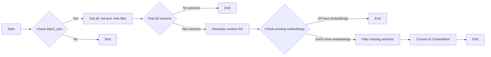

#### 带注释源码

```python
async def get_missing_items(self, batch_size: int) -> list[ContentItem]:
    """Fetch documentation sections without embeddings.

    Chunks each document by markdown headings and creates embeddings for each section.
    Content IDs use the format: 'path/to/doc.md::section_index'
    """
    docs_root = self._get_docs_root()

    if not docs_root.exists():
        logger.warning(f"Documentation root not found: {docs_root}")
        return []

    # Find all .md and .mdx files
    all_docs = list(docs_root.rglob("*.md")) + list(docs_root.rglob("*.mdx"))

    if not all_docs:
        return []

    # Build list of all sections from all documents
    all_sections: list[tuple[str, Path, MarkdownSection]] = []
    for doc_file in all_docs:
        doc_path = str(doc_file.relative_to(docs_root))
        sections = self._chunk_markdown_by_headings(doc_file)
        for section in sections:
            all_sections.append((doc_path, doc_file, section))

    if not all_sections:
        return []

    # Generate content IDs for all sections
    section_content_ids = [
        self._make_section_content_id(doc_path, section.index)
        for doc_path, _, section in all_sections
    ]

    # Check which ones have embeddings
    placeholders = ",".join([f"${i+1}" for i in range(len(section_content_ids))])
    existing_result = await query_raw_with_schema(
        f"""
        SELECT "contentId"
        FROM {{schema_prefix}}"UnifiedContentEmbedding"
        WHERE "contentType" = 'DOCUMENTATION'::{{schema_prefix}}"ContentType"
        AND "contentId" = ANY(ARRAY[{placeholders}])
        """,
        *section_content_ids,
    )

    existing_ids = {row["contentId"] for row in existing_result}

    # Filter to missing sections
    missing_sections = [
        (doc_path, doc_file, section, content_id)
        for (doc_path, doc_file, section), content_id in zip(
            all_sections, section_content_ids
        )
        if content_id not in existing_ids
    ]

    # Convert to ContentItem (up to batch_size)
    items = []
    for doc_path, doc_file, section, content_id in missing_sections[:batch_size]:
        try:
            # Get document title for context
            doc_title = self._extract_doc_title(doc_file)

            # Build searchable text with context
            # Include doc title and section title for better search relevance
            searchable_text = f"{doc_title} - {section.title}\n\n{section.content}"

            items.append(
                ContentItem(
                    content_id=content_id,
                    content_type=ContentType.DOCUMENTATION,
                    searchable_text=searchable_text,
                    metadata={
                        "doc_title": doc_title,
                        "section_title": section.title,
                        "section_index": section.index,
                        "heading_level": section.level,
                        "path": doc_path,
                    },
                    user_id=None,  # Documentation is public
                )
            )
        except Exception as e:
            logger.warning(f"Failed to process section {content_id}: {e}")
            continue

    return items
``` 


### DocumentationHandler.get_stats

Get statistics about documentation embedding coverage.

参数：

- `None`：`None`，No parameters required for this method.

返回值：`dict[str, int]`，A dictionary with keys: total, with_embeddings, without_embeddings.

#### 流程图

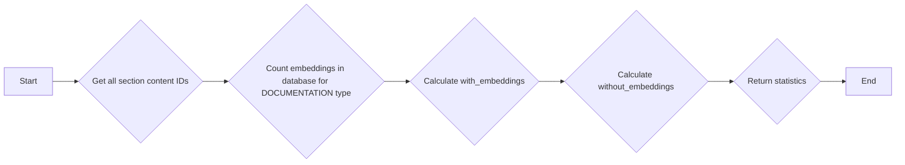

#### 带注释源码

```python
async def get_stats(self) -> dict[str, int]:
    """Get statistics about documentation embedding coverage.

    Counts sections (not documents) since each section gets its own embedding.
    """
    docs_root = self._get_docs_root()

    if not docs_root.exists():
        return {"total": 0, "with_embeddings": 0, "without_embeddings": 0}

    # Get all section content IDs
    all_section_ids = self._get_all_section_content_ids(docs_root)
    total_sections = len(all_section_ids)

    if total_sections == 0:
        return {"total": 0, "with_embeddings": 0, "without_embeddings": 0}

    # Count embeddings in database for DOCUMENTATION type
    embedded_result = await query_raw_with_schema(
        """
        SELECT COUNT(*) as count
        FROM {schema_prefix}"UnifiedContentEmbedding"
        WHERE "contentType" = 'DOCUMENTATION'::{schema_prefix}"ContentType"
        """
    )

    with_embeddings = embedded_result[0]["count"] if embedded_result else 0

    return {
        "total": total_sections,
        "with_embeddings": with_embeddings,
        "without_embeddings": total_sections - with_embeddings,
    }
```


## 关键组件


### 张量索引与惰性加载

用于高效地索引和检索张量数据，通过延迟加载减少内存消耗。

### 反量化支持

提供对反量化操作的支持，以优化模型性能和资源使用。

### 量化策略

实现量化策略，以减少模型大小和提高推理速度。


## 问题及建议


### 已知问题

-   **全局变量和函数的命名**: `logger` 和 `query_raw_with_schema` 的命名不够清晰，难以直接理解其用途。
-   **代码重复**: `StoreAgentHandler` 和 `DocumentationHandler` 类中存在大量重复代码，用于获取文档标题和分割文档。这可以通过创建一个辅助函数来减少重复。
-   **异常处理**: 在 `BlockHandler` 和 `DocumentationHandler` 中，异常处理仅记录警告，但没有提供任何恢复或回滚机制。
-   **性能**: 在 `DocumentationHandler` 中，读取所有文档和分割文档可能对性能有影响，尤其是在包含大量文档的项目中。
-   **代码风格**: 代码风格不一致，例如缩进和空格的使用。

### 优化建议

-   **重构全局变量和函数**: 使用更具描述性的命名来提高代码的可读性。
-   **减少代码重复**: 创建一个通用的函数来提取文档标题和分割文档，以减少重复代码。
-   **改进异常处理**: 在异常处理中添加恢复或回滚机制，确保系统在出现错误时能够稳定运行。
-   **优化性能**: 考虑使用异步IO或批处理技术来提高性能。
-   **统一代码风格**: 使用代码格式化工具（如 `black` 或 `autopep8`）来统一代码风格。
-   **文档处理**: 考虑使用现有的库（如 `markdown`）来处理Markdown文档，以减少自定义代码的复杂性。
-   **测试**: 为代码添加单元测试，以确保代码的正确性和稳定性。


## 其它


### 设计目标与约束

- 设计目标：
  - 提供一个可插拔的系统，支持不同内容源（存储代理、块、文档）的统一嵌入处理。
  - 为每种内容类型提供一个处理器，该处理器知道如何获取和处理其内容类型的嵌入。
  - 确保嵌入过程高效且可扩展。
  - 提供统计信息，以跟踪嵌入覆盖范围。

- 约束：
  - 处理器必须异步执行，以避免阻塞主线程。
  - 处理器必须能够处理大量数据，同时保持响应性。
  - 处理器必须能够处理各种异常情况，如文件读取错误、数据库查询错误等。

### 错误处理与异常设计

- 错误处理：
  - 使用日志记录所有异常和错误，以便进行调试和监控。
  - 在数据库查询和文件操作中捕获异常，并记录错误信息。
  - 在处理块和文档时，捕获并记录任何异常，例如属性访问错误或类型转换错误。

- 异常设计：
  - 定义自定义异常类，以处理特定类型的错误。
  - 使用try-except块来捕获和处理异常。
  - 在日志中记录异常的详细信息，包括堆栈跟踪。

### 数据流与状态机

- 数据流：
  - 数据从内容源（存储代理、块、文档）流入系统。
  - 处理器根据内容类型处理数据，并生成嵌入。
  - 嵌入数据存储在数据库中。
  - 系统提供统计信息，以跟踪嵌入覆盖范围。

- 状态机：
  - 每个处理器都维护其内部状态，例如嵌入状态和统计信息。
  - 处理器根据其状态和输入数据执行相应的操作。

### 外部依赖与接口契约

- 外部依赖：
  - 系统依赖于数据库和文件系统。
  - 系统依赖于日志记录库。

- 接口契约：
  - 处理器必须实现`ContentHandler`接口，该接口定义了必须实现的方法。
  - 处理器必须提供`content_type`属性，该属性返回处理器管理的`ContentType`。
  - 处理器必须提供`get_missing_items`和`get_stats`方法，分别用于获取缺失项和统计信息。


    