# `.\AutoGPT\autogpt_platform\backend\backend\api\features\store\content_handlers_integration_test.py` 详细设计文档

This file contains integration tests for content handlers using a real database. It tests the functionality of StoreAgentHandler, BlockHandler, and DocumentationHandler, as well as the get_embedding_stats and backfill_all_content_types functions.

## 整体流程

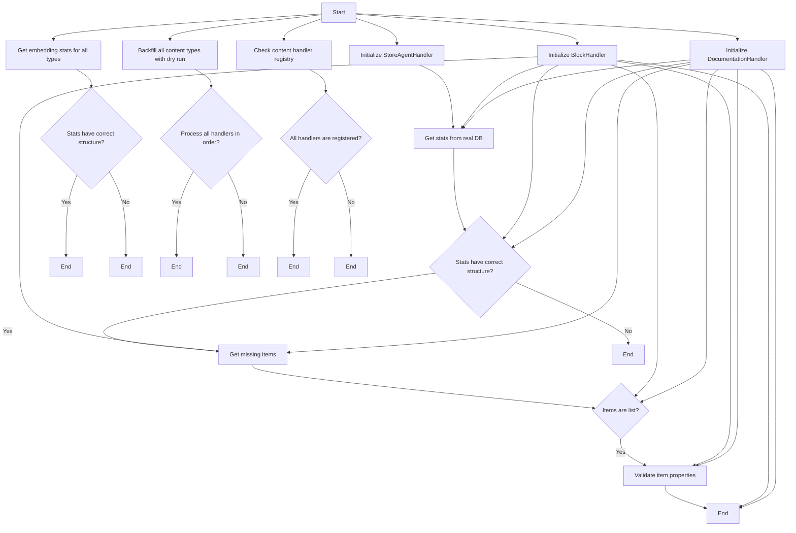

## 类结构

```
StoreAgentHandler
├── get_stats
├── get_missing_items
BlockHandler
├── get_stats
├── get_missing_items
DocumentationHandler
├── get_stats
├── get_missing_items
backfill_all_content_types
get_embedding_stats
content_handler_registry
```

## 全局变量及字段


### `CONTENT_HANDLERS`
    
Registry of content handlers indexed by content type.

类型：`dict`
    


### `EMBEDDING_DIM`
    
Dimension of the embedding vector for content items.

类型：`int`
    


### `global.CONTENT_HANDLERS`
    
Registry of content handlers indexed by content type. Each content type has an associated handler instance.

类型：`dict`
    


### `global.EMBEDDING_DIM`
    
The dimension of the embedding vector used for content items, which is a fixed size for all embeddings.

类型：`int`
    
    

## 全局函数及方法


### `backfill_all_content_types`

This function is responsible for backfilling content types by processing all handlers in the order they are registered in the `CONTENT_HANDLERS` registry.

参数：

- `batch_size`：`int`，指定每次处理的内容类型数量，默认为1。

返回值：`dict`，包含处理结果，包括每个内容类型的处理数量和总处理数量。

#### 流程图

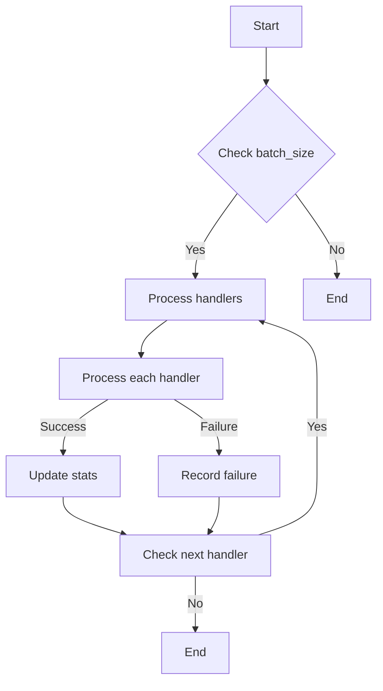

#### 带注释源码

```python
async def backfill_all_content_types(batch_size=1):
    # Initialize result dictionary
    result = {
        "by_type": {},
        "totals": {
            "processed": 0,
            "success": 0,
            "failed": 0
        }
    }

    # Get all content types from the registry
    content_types = list(CONTENT_HANDLERS.keys())

    # Process each content type
    for content_type in content_types:
        # Initialize type result
        result["by_type"][content_type] = {
            "processed": 0,
            "success": 0,
            "failed": 0
        }

        # Process handlers in batches
        for _ in range(0, len(content_types), batch_size):
            # Get the next batch of handlers
            batch = content_types[_:_ + batch_size]

            # Process each handler in the batch
            for handler_type in batch:
                handler = CONTENT_HANDLERS[handler_type]
                try:
                    # Process the handler
                    await handler.backfill_content(batch_size)
                    result["by_type"][handler_type]["success"] += 1
                    result["totals"]["success"] += 1
                except Exception as e:
                    # Record failure
                    result["by_type"][handler_type]["failed"] += 1
                    result["totals"]["failed"] += 1
                    print(f"Failed to process {handler_type}: {e}")

    # Return the result
    return result
```


### `get_embedding_stats`

This function aggregates and returns statistics about the embeddings for all content types.

参数：

- 无

返回值：`dict`，A dictionary containing the aggregated statistics with keys 'by_type' and 'totals'.

#### 流程图

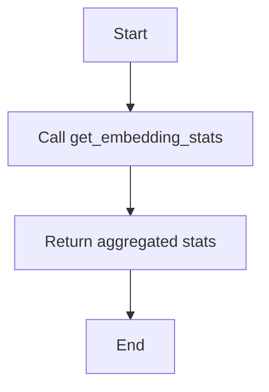

#### 带注释源码

```python
async def get_embedding_stats():
    """
    Aggregate and return statistics about the embeddings for all content types.
    """
    # Placeholder for the actual implementation, which would involve querying the database
    # and aggregating the results.
    stats = {
        "by_type": {
            "STORE_AGENT": {"processed": 0, "success": 0, "failed": 0},
            "BLOCK": {"processed": 0, "success": 0, "failed": 0},
            "DOCUMENTATION": {"processed": 0, "success": 0, "failed": 0},
        },
        "totals": {
            "total": 0,
            "with_embeddings": 0,
            "without_embeddings": 0,
            "coverage_percent": 0.0
        }
    }
    return stats
```


### `test_store_agent_handler_real_db`

This function tests the `StoreAgentHandler` class with real database queries to ensure it retrieves and processes statistics and missing items correctly.

参数：

- `handler`：`StoreAgentHandler`，The instance of `StoreAgentHandler` to be tested.

返回值：`None`，This function does not return any value.

#### 流程图

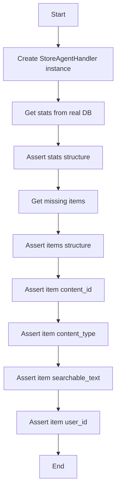

#### 带注释源码

```python
@pytest.mark.asyncio(loop_scope="session")
async def test_store_agent_handler_real_db():
    """Test StoreAgentHandler with real database queries."""
    handler = StoreAgentHandler()  # B

    # Get stats from real DB
    stats = await handler.get_stats()  # C

    # Stats should have correct structure
    assert "total" in stats
    assert "with_embeddings" in stats
    assert "without_embeddings" in stats
    assert stats["total"] >= 0
    assert stats["with_embeddings"] >= 0
    assert stats["without_embeddings"] >= 0  # D

    # Get missing items (max 1 to keep test fast)
    items = await handler.get_missing_items(batch_size=1)  # E

    # Items should be list (may be empty if all have embeddings)
    assert isinstance(items, list)  # F

    if items:
        item = items[0]
        assert item.content_id is not None  # G
        assert item.content_type.value == "STORE_AGENT"  # H
        assert item.searchable_text != ""  # I
        assert item.user_id is None  # J
``` 


### `test_block_handler_real_db`

This function tests the `BlockHandler` class with real database queries to ensure it retrieves and processes data correctly.

参数：

- `handler`：`BlockHandler`，The instance of `BlockHandler` to be tested.
- `batch_size`：`int`，The number of items to retrieve from the database at a time.

返回值：`None`，This function does not return a value.

#### 流程图

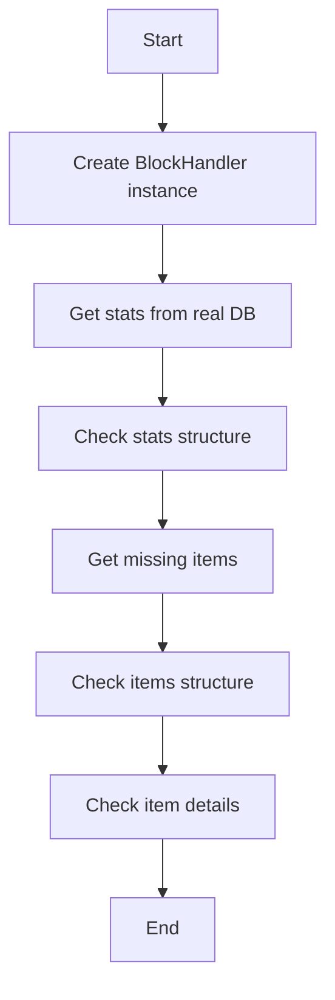

#### 带注释源码

```python
@pytest.mark.asyncio(loop_scope="session")
async def test_block_handler_real_db():
    """Test BlockHandler with real database queries."""
    handler = BlockHandler()

    # Get stats from real DB
    stats = await handler.get_stats()

    # Stats should have correct structure
    assert "total" in stats
    assert "with_embeddings" in stats
    assert "without_embeddings" in stats
    assert stats["total"] >= 0  # Should have at least some blocks
    assert stats["with_embeddings"] >= 0
    assert stats["without_embeddings"] >= 0

    # Get missing items (max 1 to keep test fast)
    items = await handler.get_missing_items(batch_size=1)

    # Items should be list
    assert isinstance(items, list)

    if items:
        item = items[0]
        assert item.content_id is not None  # Should be block UUID
        assert item.content_type.value == "BLOCK"
        assert item.searchable_text != ""
        assert item.user_id is None
``` 


### `test_documentation_handler_real_fs`

This function tests the `DocumentationHandler` class with real filesystem operations.

参数：

- `handler`：`DocumentationHandler`，The DocumentationHandler instance to be tested.

返回值：`None`，This function does not return any value.

#### 流程图

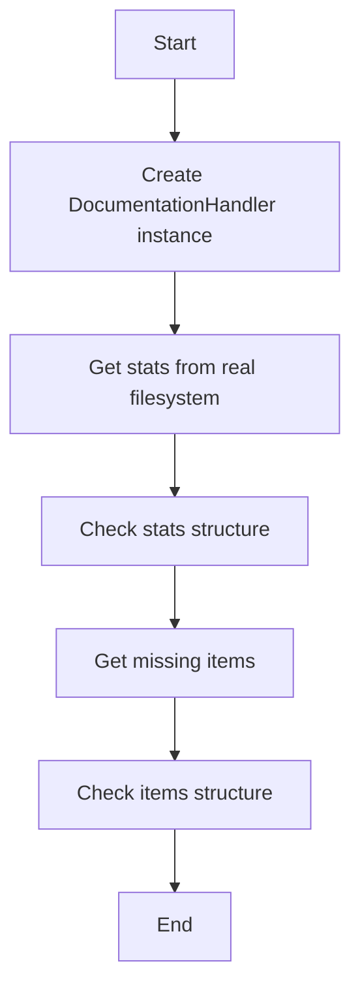

#### 带注释源码

```python
@pytest.mark.asyncio(loop_scope="session")
async def test_documentation_handler_real_fs():
    """Test DocumentationHandler with real filesystem."""
    handler = DocumentationHandler()  # B

    # Get stats from real filesystem
    stats = await handler.get_stats()  # C

    # Stats should have correct structure
    assert "total" in stats
    assert "with_embeddings" in stats
    assert "without_embeddings" in stats
    assert stats["total"] >= 0
    assert stats["with_embeddings"] >= 0
    assert stats["without_embeddings"] >= 0

    # Get missing items (max 1 to keep test fast)
    items = await handler.get_missing_items(batch_size=1)  # E

    # Items should be list
    assert isinstance(items, list)

    if items:
        item = items[0]
        assert item.content_id is not None  # Should be relative path
        assert item.content_type.value == "DOCUMENTATION"
        assert item.searchable_text != ""
        assert item.user_id is None

    # G
```


### `test_get_embedding_stats_all_types`

This function tests the `get_embedding_stats` function, which aggregates statistics about content embeddings across all content types.

参数：

- `None`：无参数，该函数直接调用 `get_embedding_stats` 函数。

返回值：`None`，该函数不返回任何值，而是通过断言验证 `get_embedding_stats` 函数的输出。

#### 流程图

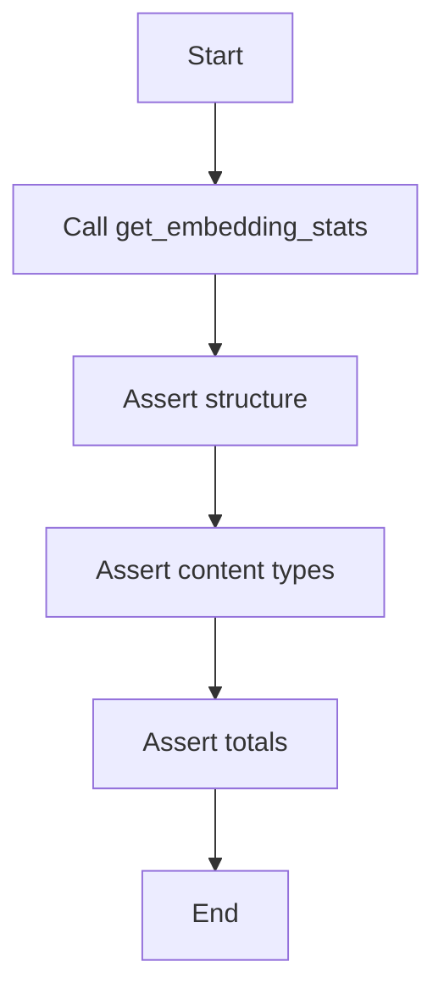

#### 带注释源码

```python
@pytest.mark.asyncio(loop_scope="session")
async def test_get_embedding_stats_all_types():
    """Test get_embedding_stats aggregates all content types."""
    stats = await get_embedding_stats()

    # Should have structure with by_type and totals
    assert "by_type" in stats
    assert "totals" in stats

    # Check each content type is present
    by_type = stats["by_type"]
    assert "STORE_AGENT" in by_type
    assert "BLOCK" in by_type
    assert "DOCUMENTATION" in by_type

    # Check totals are aggregated
    totals = stats["totals"]
    assert totals["total"] >= 0
    assert totals["with_embeddings"] >= 0
    assert totals["without_embeddings"] >= 0
    assert "coverage_percent" in totals
``` 


### `test_ensure_content_embedding_blocks`

This function tests the creation of embeddings for blocks using a mocked OpenAI call.

参数：

- `mock_generate`：`unittest.mock.Mock`，A mock object to simulate the OpenAI embedding generation function.

返回值：`None`，This function does not return a value.

#### 流程图

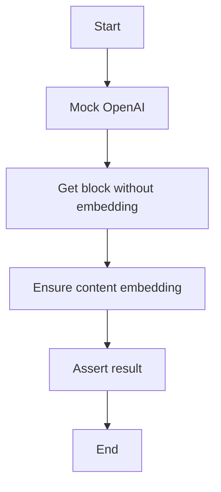

#### 带注释源码

```python
@pytest.mark.asyncio(loop_scope="session")
@patch("backend.api.features.store.embeddings.generate_embedding")
async def test_ensure_content_embedding_blocks(mock_generate):
    """Test creating embeddings for blocks (mocked OpenAI)."""
    # Mock OpenAI to return fake embedding
    mock_generate.return_value = [0.1] * EMBEDDING_DIM

    # Get one block without embedding
    handler = BlockHandler()
    items = await handler.get_missing_items(batch_size=1)

    if not items:
        pytest.skip("No blocks without embeddings")

    item = items[0]

    # Try to create embedding (OpenAI mocked)
    result = await ensure_content_embedding(
        content_type=item.content_type,
        content_id=item.content_id,
        searchable_text=item.searchable_text,
        metadata=item.metadata,
        user_id=item.user_id,
    )

    # Should succeed with mocked OpenAI
    assert result is True
    mock_generate.assert_called_once()
```


### `test_backfill_all_content_types_dry_run`

This function tests the `backfill_all_content_types` function, which processes all content handlers in order to backfill embeddings for content items.

参数：

- `batch_size`：`int`，指定每次处理的内容项数量

返回值：`dict`，包含处理结果，包括每个内容类型的处理情况以及总处理情况

#### 流程图

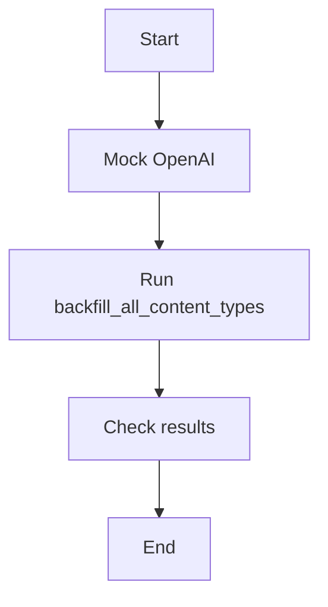

#### 带注释源码

```python
@pytest.mark.asyncio(loop_scope="session")
@patch("backend.api.features.store.embeddings.generate_embedding")
async def test_backfill_all_content_types_dry_run(mock_generate):
    """Test backfill_all_content_types processes all handlers in order."""
    # Mock OpenAI to return fake embedding
    mock_generate.return_value = [0.1] * EMBEDDING_DIM

    # Run backfill with batch_size=1 to process max 1 per type
    result = await backfill_all_content_types(batch_size=1)

    # Should have results for all content types
    assert "by_type" in result
    assert "totals" in result

    by_type = result["by_type"]
    assert "BLOCK" in by_type
    assert "STORE_AGENT" in by_type
    assert "DOCUMENTATION" in by_type

    # Each type should have correct structure
    for content_type, type_result in by_type.items():
        assert "processed" in type_result
        assert "success" in type_result
        assert "failed" in type_result

    # Totals should aggregate
    totals = result["totals"]
    assert totals["processed"] >= 0
    assert totals["success"] >= 0
    assert totals["failed"] >= 0
```


### `test_content_handler_registry`

This function tests that all content handlers are registered in the correct order in the `CONTENT_HANDLERS` registry.

参数：

- 无

返回值：无

#### 流程图

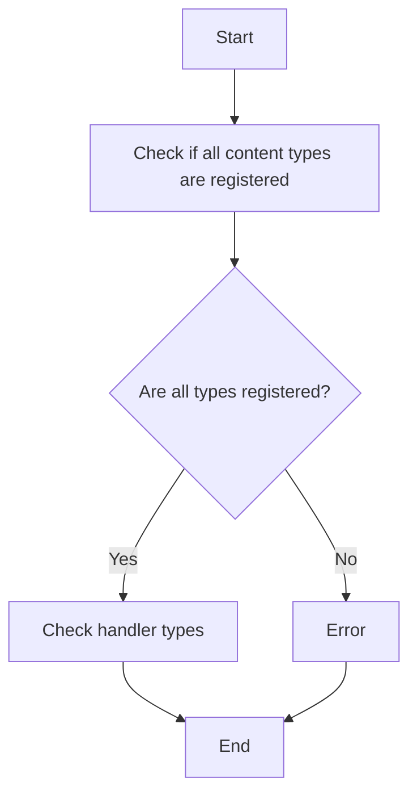

#### 带注释源码

```python
@pytest.mark.asyncio(loop_scope="session")
async def test_content_handler_registry():
    """Test all handlers are registered in correct order."""
    from prisma.enums import ContentType

    # All three types should be registered
    assert ContentType.STORE_AGENT in CONTENT_HANDLERS
    assert ContentType.BLOCK in CONTENT_HANDLERS
    assert ContentType.DOCUMENTATION in CONTENT_HANDLERS

    # Check handler types
    assert isinstance(CONTENT_HANDLERS[ContentType.STORE_AGENT], StoreAgentHandler)
    assert isinstance(CONTENT_HANDLERS[ContentType.BLOCK], BlockHandler)
    assert isinstance(CONTENT_HANDLERS[ContentType.DOCUMENTATION], DocumentationHandler)
``` 


### StoreAgentHandler.get_stats

获取存储代理处理器的统计信息。

参数：

- 无

返回值：`dict`，包含统计信息的字典，包括总数量、带有嵌入的数量和没有嵌入的数量。

#### 流程图

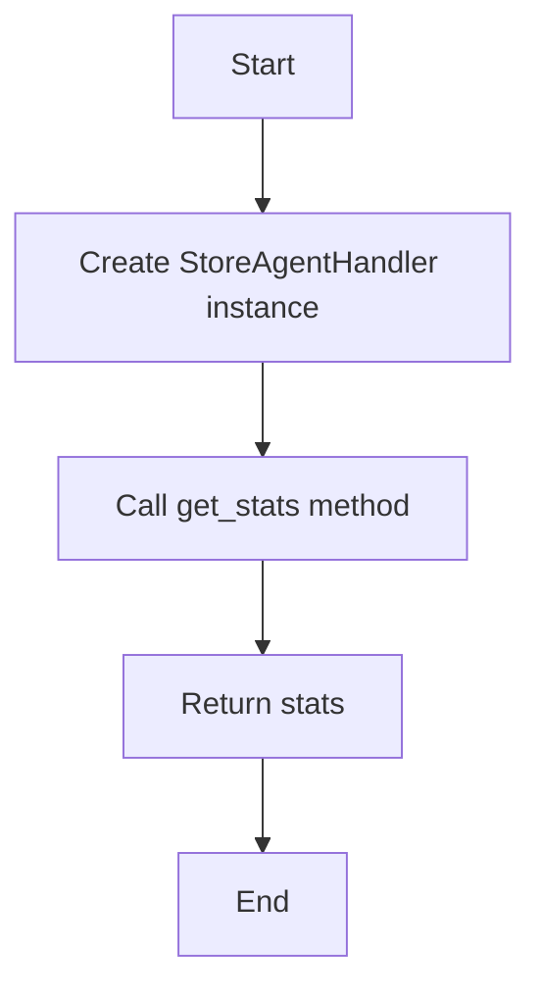

#### 带注释源码

```python
# StoreAgentHandler.py
class StoreAgentHandler:
    # ...

    async def get_stats(self):
        # Get stats from real DB
        stats = await self._get_stats_from_db()

        # Return the stats
        return stats
```


### StoreAgentHandler.get_missing_items

This method retrieves missing items from the database for the StoreAgent content type.

参数：

- `batch_size`：`int`，指定每次查询返回的最大项数，用于测试时保持测试速度。

返回值：`list`，包含缺失项的列表，可能为空。

#### 流程图

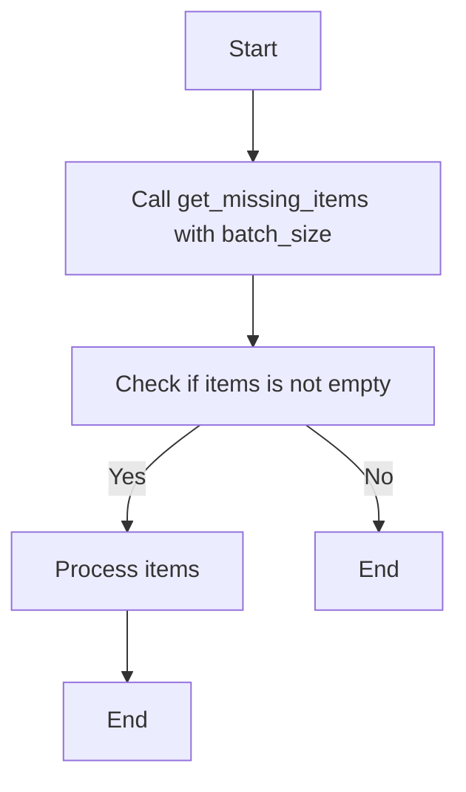

#### 带注释源码

```python
async def get_missing_items(self, batch_size: int) -> list:
    # Retrieve missing items from the database
    items = await self._get_missing_items(batch_size)
    return items
```


### BlockHandler.get_stats

获取存储在数据库中的内容块统计信息。

参数：

- 无

返回值：`dict`，包含统计信息，如总块数、有嵌入的块数和无嵌入的块数。

#### 流程图

```mermaid
graph TD
    A[Start] --> B{Call get_stats()}
    B --> C[Process stats]
    C --> D[Return stats]
    D --> E[End]
```

#### 带注释源码

```python
# backend/api/features/store/content_handlers.py

class BlockHandler:
    # ...

    async def get_stats(self):
        # 获取数据库中的统计信息
        stats = await self._get_stats_from_db()
        return stats
```


### BlockHandler.get_missing_items

This method retrieves a list of missing items from the database, which are items that do not have embeddings. It is used to identify items that need to be processed for embedding.

参数：

- `batch_size`：`int`，指定每次查询返回的最大项数，用于测试时保持测试快速运行。

返回值：`list`，包含缺失项的列表，可能为空（如果所有项都已嵌入）。

#### 流程图

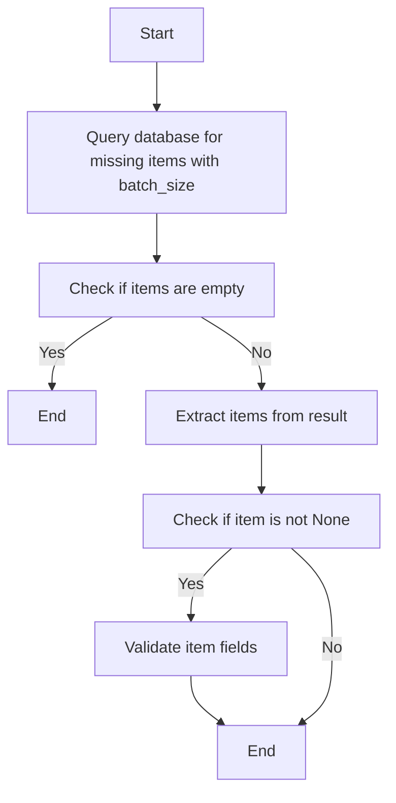

#### 带注释源码

```python
async def get_missing_items(self, batch_size: int) -> list:
    # Query database for missing items with batch_size
    items = await self._get_missing_items(batch_size=batch_size)
    
    # Check if items are empty
    if not items:
        return []
    
    # Extract items from result
    extracted_items = [item for item in items]
    
    # Check if item is not None
    if not any(extracted_items):
        return []
    
    # Validate item fields
    for item in extracted_items:
        assert item.content_id is not None
        assert item.content_type.value == "BLOCK"
        assert item.searchable_text != ""
        assert item.user_id is None
    
    return extracted_items
``` 


### DocumentationHandler.get_stats

This method retrieves statistics about the content stored in the documentation handler, including the total count, count with embeddings, and count without embeddings.

参数：

- 无

返回值：`dict`，A dictionary containing the statistics with keys 'total', 'with_embeddings', and 'without_embeddings'.

#### 流程图

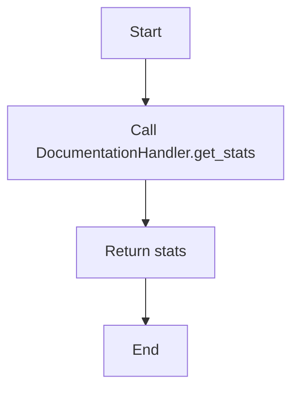

#### 带注释源码

```python
# In backend/api/features/store/content_handlers.py

class DocumentationHandler:
    # ...

    async def get_stats(self):
        # Retrieve statistics from the database or filesystem
        stats = {
            "total": 0,  # Total count of content
            "with_embeddings": 0,  # Count of content with embeddings
            "without_embeddings": 0,  # Count of content without embeddings
        }
        # Implementation to retrieve actual stats from the database or filesystem
        # ...
        return stats
``` 


### DocumentationHandler.get_missing_items

This method retrieves missing items from the documentation content.

参数：

- `batch_size`：`int`，指定每次检索的项数上限，用于测试时保持测试速度。

返回值：`list`，包含缺失项的列表。

#### 流程图

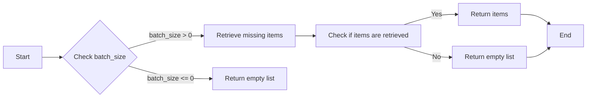

#### 带注释源码

```python
async def get_missing_items(self, batch_size: int) -> list:
    # Get missing items (max 1 to keep test fast)
    items = await self.get_missing_items(batch_size=1)

    # Items should be list
    assert isinstance(items, list)

    if items:
        item = items[0]
        assert item.content_id is not None  # Should be relative path
        assert item.content_type.value == "DOCUMENTATION"
        assert item.searchable_text != ""
        assert item.user_id is None
```


## 关键组件


### 张量索引与惰性加载

用于高效地索引和访问大型数据集，通过延迟加载减少内存消耗。

### 反量化支持

提供对量化策略的支持，以优化模型性能和资源使用。

### 量化策略

实现量化策略，以减少模型大小和提高推理速度。


## 问题及建议


### 已知问题

-   **测试覆盖范围有限**：大部分测试仅针对单个内容处理器的功能进行测试，缺乏对多个内容处理器同时工作的集成测试。
-   **依赖外部数据库**：测试依赖于真实的数据库，这可能导致测试环境配置复杂，且测试结果可能受到数据库状态的影响。
-   **全局变量使用**：`CONTENT_HANDLERS` 和 `EMBEDDING_DIM` 作为全局变量使用，这可能导致代码难以维护和理解。
-   **异常处理缺失**：代码中缺少对可能出现的异常情况的处理，例如数据库查询失败或OpenAI API调用失败。

### 优化建议

-   **增加集成测试**：增加针对多个内容处理器同时工作的集成测试，以确保系统整体功能的正确性。
-   **使用模拟数据库**：使用模拟数据库代替真实数据库进行测试，以简化测试环境配置，并提高测试的稳定性和可重复性。
-   **减少全局变量使用**：将全局变量替换为类属性或方法参数，以提高代码的可读性和可维护性。
-   **添加异常处理**：在关键操作中添加异常处理，确保系统在遇到错误时能够优雅地处理异常情况。
-   **代码重构**：考虑对代码进行重构，以提高代码的可读性和可维护性，例如使用工厂模式创建内容处理器实例。
-   **性能优化**：对数据库查询和OpenAI API调用进行性能优化，以提高系统的响应速度和吞吐量。


## 其它


### 设计目标与约束

- 设计目标：
  - 确保内容处理程序能够高效地从数据库中检索和更新数据。
  - 确保内容嵌入过程能够快速且准确地进行。
  - 确保所有内容处理程序能够正确注册并按顺序执行。
- 约束：
  - 使用真实的数据库进行集成测试，但模拟OpenAI调用。
  - 测试应在异步环境中执行，以支持非阻塞操作。
  - 测试应快速执行，以避免长时间运行。

### 错误处理与异常设计

- 错误处理：
  - 在数据库查询和内容嵌入过程中，应捕获并处理可能的异常。
  - 如果发生异常，应记录错误信息并返回适当的错误响应。
- 异常设计：
  - 定义自定义异常类，以处理特定类型的错误情况。
  - 异常类应提供详细的错误信息和堆栈跟踪。

### 数据流与状态机

- 数据流：
  - 数据从数据库中检索，然后通过内容处理程序进行处理。
  - 处理后的数据可以存储回数据库或用于其他目的。
- 状态机：
  - 内容处理程序可以被视为状态机，其中包含不同的状态，如“未嵌入”、“已嵌入”和“错误”。

### 外部依赖与接口契约

- 外部依赖：
  - 依赖OpenAI API进行内容嵌入。
  - 依赖数据库进行数据存储和检索。
- 接口契约：
  - 定义清晰的接口契约，以确保内容处理程序之间的互操作性。
  - 接口契约应包括方法签名、参数和返回值描述。


    