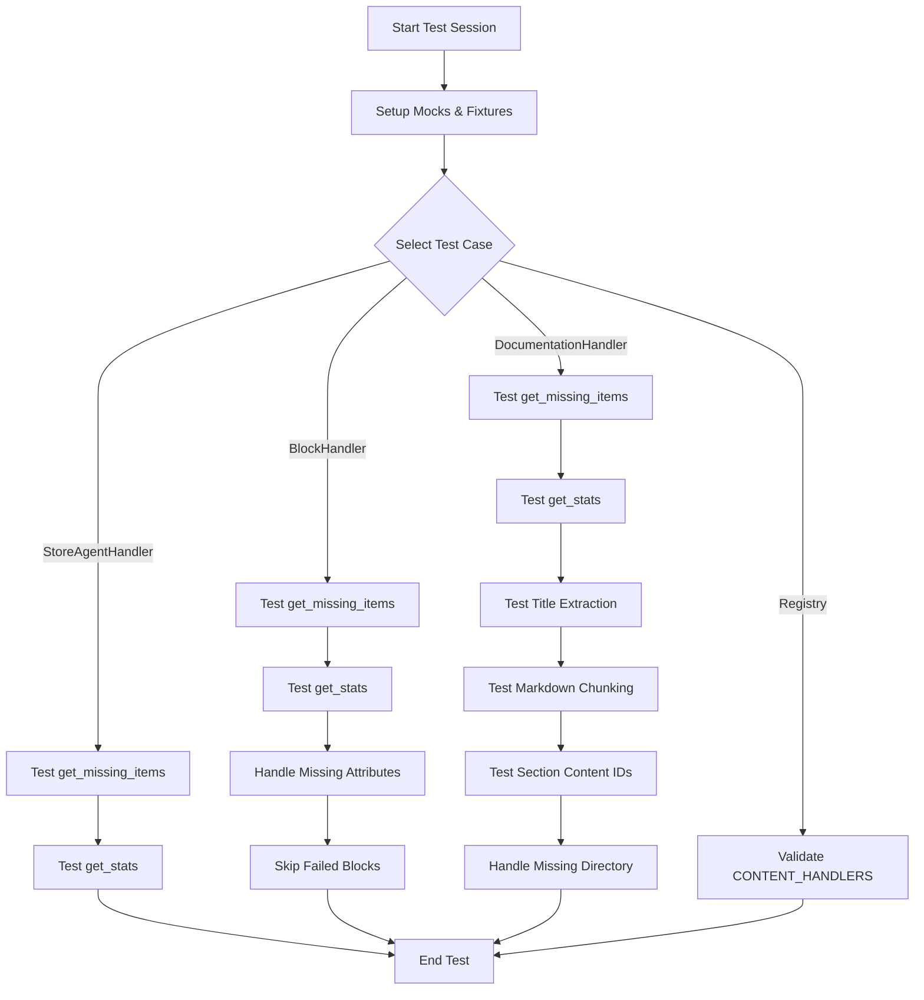
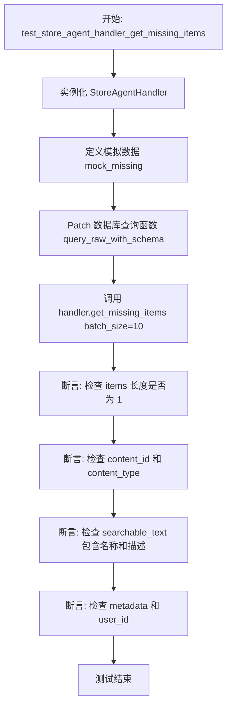
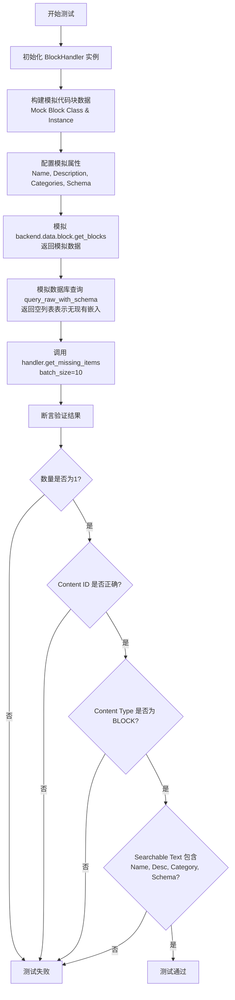
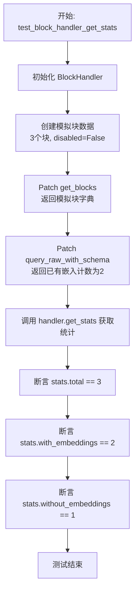
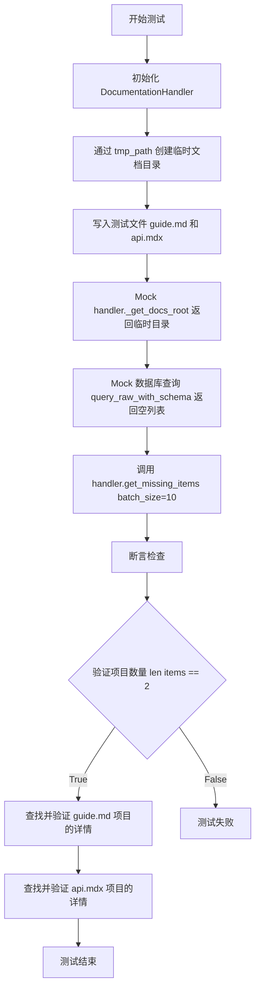
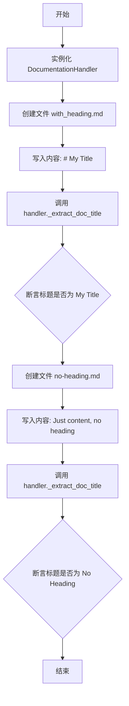
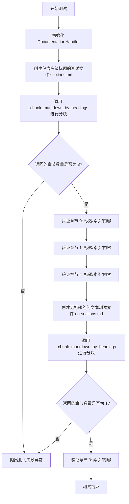
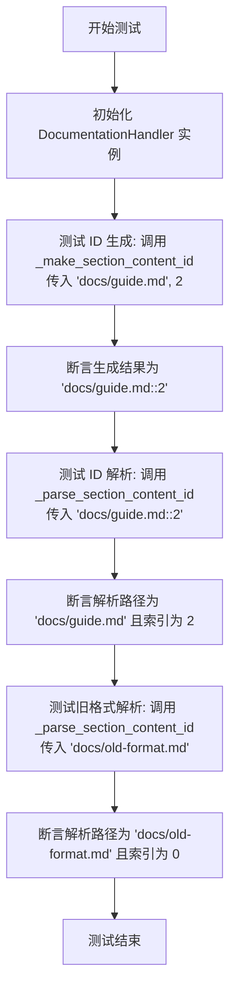
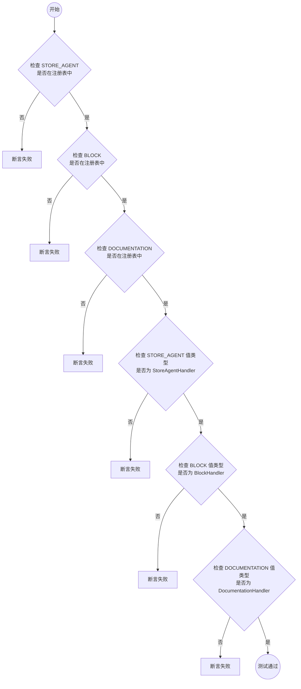
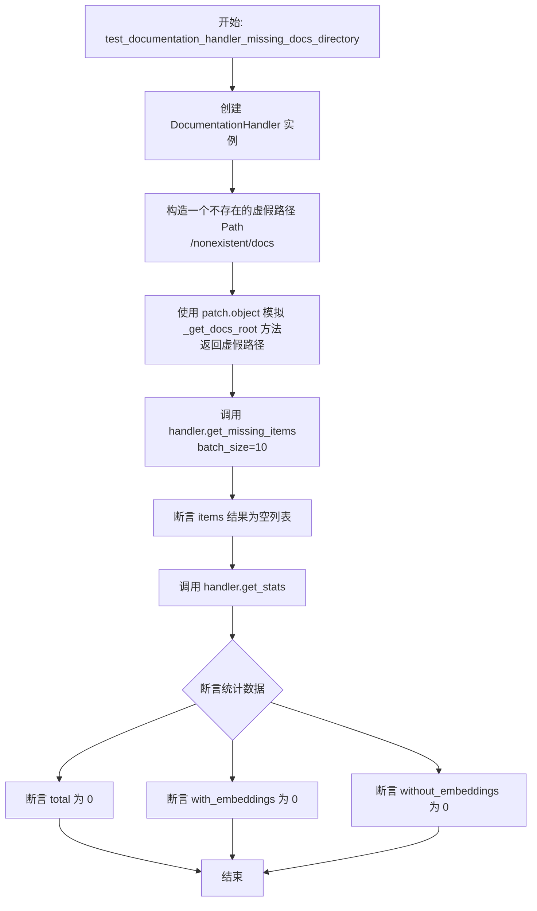

# `AutoGPT\autogpt_platform\backend\backend\api\features\store\content_handlers_test.py` 详细设计文档

该代码是一个基于 pytest 的异步端到端测试套件，旨在验证商店平台的内容处理程序。它全面测试了针对商店代理、功能代码块和文档化内容的处理程序，确保正确检索缺失项目、生成可搜索文本、计算统计信息以及通过处理程序注册表管理内容。

## 整体流程



## 类结构

```
Test Suite: Content Handlers E2E
├── StoreAgentHandler Tests
│   ├── test_store_agent_handler_get_missing_items
│   └── test_store_agent_handler_get_stats
├── BlockHandler Tests
│   ├── test_block_handler_get_missing_items
│   ├── test_block_handler_get_stats
│   ├── test_block_handler_handles_missing_attributes
│   └── test_block_handler_skips_failed_blocks
├── DocumentationHandler Tests
│   ├── test_documentation_handler_get_missing_items
│   ├── test_documentation_handler_get_stats
│   ├── test_documentation_handler_title_extraction
│   ├── test_documentation_handler_markdown_chunking
│   ├── test_documentation_handler_section_content_ids
│   └── test_documentation_handler_missing_docs_directory
└── Registry Tests
    └── test_content_handlers_registry
```

## 全局变量及字段


    

## 全局函数及方法


### `test_store_agent_handler_get_missing_items`

该测试函数用于验证 `StoreAgentHandler` 能够正确获取那些已被批准但尚未生成嵌入的代理列表，并确保返回对象的 ID、类型、可搜索文本及元数据等字段符合预期。

参数：

- `mocker`：`pytest_mock.MockerFixture`，Pytest 提供的模拟对象 fixture，用于支持测试中的 mock 操作（虽然本函数内部直接使用了 `patch`，但参数保留了 mocker）。

返回值：`None`，该函数为异步测试函数，无返回值，主要通过断言验证逻辑正确性。

#### 流程图



#### 带注释源码

```python
@pytest.mark.asyncio(loop_scope="session")
async def test_store_agent_handler_get_missing_items(mocker):
    """Test StoreAgentHandler fetches approved agents without embeddings."""
    # 1. 初始化 StoreAgentHandler 处理器实例
    handler = StoreAgentHandler()

    # 2. 模拟数据库查询返回的缺失嵌入的代理数据
    mock_missing = [
        {
            "id": "agent-1",
            "name": "Test Agent",
            "description": "A test agent",
            "subHeading": "Test heading",
            "categories": ["AI", "Testing"],
        }
    ]

    # 3. 使用 patch 替换数据库查询函数，强制返回上述模拟数据
    with patch(
        "backend.api.features.store.content_handlers.query_raw_with_schema",
        return_value=mock_missing,
    ):
        # 4. 调用 get_missing_items 方法获取缺失嵌入的项目，批次大小设为 10
        items = await handler.get_missing_items(batch_size=10)

        # 5. 验证返回列表中只包含一个项目
        assert len(items) == 1
        
        # 6. 验证内容 ID 和内容类型是否正确
        assert items[0].content_id == "agent-1"
        assert items[0].content_type == ContentType.STORE_AGENT
        
        # 7. 验证可搜索文本是否包含了代理的名称和描述
        assert "Test Agent" in items[0].searchable_text
        assert "A test agent" in items[0].searchable_text
        
        # 8. 验证元数据和用户 ID 是否正确设置
        assert items[0].metadata["name"] == "Test Agent"
        assert items[0].user_id is None
```


### `test_store_agent_handler_get_stats`

Test StoreAgentHandler returns correct stats.

参数：

-   `mocker`：`pytest_mock.MockerFixture`，pytest-mock 提供的 fixture 对象，用于模拟和修补功能。

返回值：`None`，无显式返回值，通过断言验证测试结果。

#### 流程图

```mermaid
flowchart TD
    A[开始: test_store_agent_handler_get_stats] --> B[初始化 StoreAgentHandler]
    B --> C[定义模拟数据 mock_approved: count=50]
    C --> D[定义模拟数据 mock_embedded: count=30]
    D --> E[Patch query_raw_with_schema<br/>设置 side_effect 返回模拟数据]
    E --> F[调用 handler.get_stats]
    F --> G[获取返回值 stats]
    E --> H[结束 Patch 上下文]
    G --> I[断言 stats['total'] == 50]
    I --> J[断言 stats['with_embeddings'] == 30]
    J --> K[断言 stats['without_embeddings'] == 20]
    K --> L[测试结束]
```

#### 带注释源码

```python
@pytest.mark.asyncio(loop_scope="session")
async def test_store_agent_handler_get_stats(mocker):
    """Test StoreAgentHandler returns correct stats."""
    # 初始化 StoreAgentHandler 实例
    handler = StoreAgentHandler()

    # Mock 数据库查询返回的已批准 Agent 总数
    mock_approved = [{"count": 50}]
    # Mock 数据库查询返回的已有嵌入向量的 Agent 数量
    mock_embedded = [{"count": 30}]

    # 使用 patch 替换原生的数据库查询函数 query_raw_with_schema
    # side_effect 参数使得函数在多次调用时依次返回列表中的值
    with patch(
        "backend.api.features.store.content_handlers.query_raw_with_schema",
        side_effect=[mock_approved, mock_embedded],
    ):
        # 调用 get_stats 方法获取统计数据
        stats = await handler.get_stats()

        # 断言验证：总数应为 50
        assert stats["total"] == 50
        # 断言验证：已有嵌入的数量应为 30
        assert stats["with_embeddings"] == 30
        # 断言验证：没有嵌入的数量应为 20 (50 - 30)
        assert stats["without_embeddings"] == 20
```


### `test_block_handler_get_missing_items`

该函数用于测试 `BlockHandler` 能够正确发现尚未生成嵌入向量的代码块。通过模拟后端数据源和数据库查询，验证处理程序能够过滤掉已有嵌入的块，并正确识别缺失嵌入的块，同时校验返回内容的 ID、类型、可搜索文本及元数据的准确性。

参数：

- `moker`: `Fixture`，Pytest 提供的 mocker 夹具对象，用于在测试过程中模拟外部依赖（如数据库查询和文件系统）。

返回值：`None`，该函数为测试用例，无显式返回值，通过断言验证逻辑正确性。

#### 流程图



#### 带注释源码

```python
@pytest.mark.asyncio(loop_scope="session")
async def test_block_handler_get_missing_items(mocker):
    """Test BlockHandler discovers blocks without embeddings."""
    # 1. 初始化处理器
    handler = BlockHandler()

    # 2. 模拟代码块类和实例对象
    mock_block_class = MagicMock()
    mock_block_instance = MagicMock()
    
    # 设置实例的基本属性
    mock_block_instance.name = "Calculator Block"
    mock_block_instance.description = "Performs calculations"
    mock_block_instance.categories = [MagicMock(value="MATH")]
    mock_block_instance.disabled = False
    
    # 模拟输入 Schema 的 JSON 序列化结果
    mock_block_instance.input_schema.model_json_schema.return_value = {
        "properties": {"expression": {"description": "Math expression to evaluate"}}
    }
    # 配置类调用返回实例
    mock_block_class.return_value = mock_block_instance

    # 构造模拟的代码块字典
    mock_blocks = {"block-uuid-1": mock_block_class}

    # 3. 模拟数据库查询，假设当前没有任何嵌入存在
    mock_existing = []

    # 4. 在上下文中替换真实的依赖
    with patch(
        "backend.data.block.get_blocks",
        return_value=mock_blocks,
    ):
        with patch(
            "backend.api.features.store.content_handlers.query_raw_with_schema",
            return_value=mock_existing,
        ):
            # 5. 执行获取缺失项的操作
            items = await handler.get_missing_items(batch_size=10)

            # 6. 验证返回结果
            # 检查是否找到了 1 个缺失项
            assert len(items) == 1
            # 检查 Content ID 是否正确
            assert items[0].content_id == "block-uuid-1"
            # 检查内容类型是否为 BLOCK
            assert items[0].content_type == ContentType.BLOCK
            # 检查可搜索文本是否包含名称
            assert "Calculator Block" in items[0].searchable_text
            # 检查可搜索文本是否包含描述
            assert "Performs calculations" in items[0].searchable_text
            # 检查可搜索文本是否包含类别
            assert "MATH" in items[0].searchable_text
            # 检查可搜索文本是否包含 Schema 描述信息
            assert "expression: Math expression" in items[0].searchable_text
            # 检查 user_id 是否为 None
            assert items[0].user_id is None
```


### `test_block_handler_get_stats`

该函数是一个端到端测试用例，用于验证 `BlockHandler` 类的 `get_stats` 方法是否能够准确统计块的总数、已嵌入向量化的数量以及未嵌入的数量。测试通过模拟块注册数据和数据库查询结果来断言统计逻辑的正确性。

参数：

- `mocker`：`pytest_mock.MockerFixture`，Pytest 提供的模拟对象固件，用于在测试中替换或修补对象（尽管代码中使用了 `patch`，参数保留 `mocker` 是常见的测试约定）。

返回值：`None`，测试函数通常不返回值，而是通过 `assert` 语句来验证预期结果。

#### 流程图



#### 带注释源码

```python
@pytest.mark.asyncio(loop_scope="session")
async def test_block_handler_get_stats(mocker):
    """Test BlockHandler returns correct stats."""
    # 初始化 BlockHandler 实例
    handler = BlockHandler()

    # 定义辅助函数用于生成模拟的 Block 类
    def make_mock_block_class():
        mock_class = MagicMock()
        mock_instance = MagicMock()
        # 设置实例的 disabled 属性为 False，表示块可用
        mock_instance.disabled = False
        mock_class.return_value = mock_instance
        return mock_class

    # 构造模拟的块字典，包含 3 个块
    mock_blocks = {
        "block-1": make_mock_block_class(),
        "block-2": make_mock_block_class(),
        "block-3": make_mock_block_class(),
    }

    # 模拟数据库查询结果，表示已有 2 个块具有嵌入
    mock_embedded = [{"count": 2}]

    # 替换 backend.data.block.get_blocks，使其返回构造的模拟块字典
    with patch(
        "backend.data.block.get_blocks",
        return_value=mock_blocks,
    ):
        # 替换查询函数，使其返回模拟的嵌入计数
        with patch(
            "backend.api.features.store.content_handlers.query_raw_with_schema",
            return_value=mock_embedded,
        ):
            # 调用被测试的 get_stats 方法
            stats = await handler.get_stats()

            # 验证统计总数是否正确 (预期为 3)
            assert stats["total"] == 3
            # 验证已嵌入的数量是否正确 (预期为 2)
            assert stats["with_embeddings"] == 2
            # 验证未嵌入的数量是否正确 (预期为 1，即 3 - 2)
            assert stats["without_embeddings"] == 1
```


### `test_documentation_handler_get_missing_items`

测试 `DocumentationHandler` 发现文档文件、解析内容并识别尚未生成嵌入的文档部分的能力。验证了处理程序对 Markdown/MDX 文件的解析逻辑、标题提取以及正确的 Content ID 生成。

参数：

- `tmp_path`：`pathlib.Path`，pytest 提供的临时文件路径 fixture，用于在测试期间创建模拟的文档目录和文件。
- `mocker`：`pytest_mock.MockerFixture`，pytest-mock 提供的 fixture，用于模拟对象和方法的行为。

返回值：`None`，该函数为测试函数，不返回实际业务数据，通过断言验证内部逻辑的正确性。

#### 流程图



#### 带注释源码

```python
@pytest.mark.asyncio(loop_scope="session")
async def test_documentation_handler_get_missing_items(tmp_path, mocker):
    """Test DocumentationHandler discovers docs without embeddings."""
    # 初始化待测试的处理器
    handler = DocumentationHandler()

    # 在临时目录中创建模拟的文档根目录
    docs_root = tmp_path / "docs"
    docs_root.mkdir()

    # 创建测试用的 Markdown/MDX 文件并写入内容
    (docs_root / "guide.md").write_text("# Getting Started\n\nThis is a guide.")
    (docs_root / "api.mdx").write_text("# API Reference\n\nAPI documentation.")

    # Mock 处理器的内部方法 _get_docs_root，使其返回我们创建的临时目录
    with patch.object(handler, "_get_docs_root", return_value=docs_root):
        # Mock 数据库查询函数，模拟当前没有任何嵌入数据存在（返回空列表）
        with patch(
            "backend.api.features.store.content_handlers.query_raw_with_schema",
            return_value=[],
        ):
            # 调用 get_missing_items 方法，触发发现和解析逻辑
            items = await handler.get_missing_items(batch_size=10)

            # 断言：验证发现了 2 个文档项（对应两个文件）
            assert len(items) == 2

            # 验证 guide.md 的解析结果
            # content_id 格式预期为 "文件名::章节索引"，此处为 0
            guide_item = next(
                (item for item in items if item.content_id == "guide.md::0"), None
            )
            assert guide_item is not None
            assert guide_item.content_type == ContentType.DOCUMENTATION
            # 验证 searchable_text 包含了标题和正文内容
            assert "Getting Started" in guide_item.searchable_text
            assert "This is a guide" in guide_item.searchable_text
            # 验证元数据中的文档标题提取正确
            assert guide_item.metadata["doc_title"] == "Getting Started"
            assert guide_item.user_id is None

            # 验证 api.mdx 的解析结果
            api_item = next(
                (item for item in items if item.content_id == "api.mdx::0"), None
            )
            assert api_item is not None
            assert "API Reference" in api_item.searchable_text
```


### `test_documentation_handler_get_stats`

测试 DocumentationHandler 正确计算文档统计数据（总数、已有嵌入的、没有嵌入的）。

参数：

-  `tmp_path`：`pathlib.Path`，pytest 提供的临时目录路径 fixture，用于创建测试文件。
-  `mocker`：`pytest_mock.MockerFixture`，pytest 提供的 fixture，用于模拟对象和打补丁。

返回值：`None`，该函数为测试用例，无返回值，主要通过断言验证逻辑。

#### 流程图

```mermaid
flowchart TD
    A([开始]) --> B[初始化 DocumentationHandler]
    B --> C[在 tmp_path 下创建临时 docs 目录]
    C --> D[创建三个测试文档文件 doc1.md, doc2.md, doc3.mdx]
    D --> E[模拟 handler._get_docs_root 返回临时目录]
    E --> F[模拟 query_raw_with_schema 返回已有嵌入的文档数量 count=1]
    F --> G[调用 handler.get_stats 获取统计数据]
    G --> H[断言 stats['total'] 等于 3]
    H --> I[断言 stats['with_embeddings'] 等于 1]
    I --> J[断言 stats['without_embeddings'] 等于 2]
    J --> K([结束])
```

#### 带注释源码

```python
@pytest.mark.asyncio(loop_scope="session")
async def test_documentation_handler_get_stats(tmp_path, mocker):
    """Test DocumentationHandler returns correct stats."""
    # 初始化 DocumentationHandler 实例
    handler = DocumentationHandler()

    # Create temporary docs directory
    # 在临时路径下创建 docs 目录
    docs_root = tmp_path / "docs"
    docs_root.mkdir()
    # 写入三个测试文档文件，用于测试总数统计
    (docs_root / "doc1.md").write_text("# Doc 1")
    (docs_root / "doc2.md").write_text("# Doc 2")
    (docs_root / "doc3.mdx").write_text("# Doc 3")

    # Mock embedded count query (1 doc has embedding)
    # 模拟数据库查询，假设只有 1 个文档已经生成了嵌入
    mock_embedded = [{"count": 1}]

    # 模拟 _get_docs_root 方法，使其返回我们创建的临时目录路径
    with patch.object(handler, "_get_docs_root", return_value=docs_root):
        # 模拟底层数据库查询函数，返回模拟的嵌入计数
        with patch(
            "backend.api.features.store.content_handlers.query_raw_with_schema",
            return_value=mock_embedded,
        ):
            # 调用 get_stats 方法获取统计信息
            stats = await handler.get_stats()

            # 断言：验证总文档数为 3
            assert stats["total"] == 3
            # 断言：验证已有嵌入的文档数为 1
            assert stats["with_embeddings"] == 1
            # 断言：验证未生成嵌入的文档数为 2 (3 - 1)
            assert stats["without_embeddings"] == 2
```


### `test_documentation_handler_title_extraction`

该测试函数用于验证 `DocumentationHandler` 的私有方法 `_extract_doc_title` 是否能够正确地从 Markdown 文件中提取标题。它测试了两种场景：当文件包含顶级 Markdown 标题时返回标题内容，以及当文件不包含标题时回退使用文件名（转换为 Title Case）。

参数：

-   `tmp_path`：`pathlib.Path`，由 pytest 提供的临时目录路径，用于在测试期间创建和写入测试文件。

返回值：`None`，该函数没有返回值，主要用于执行断言验证逻辑的正确性。

#### 流程图



#### 带注释源码

```python
@pytest.mark.asyncio(loop_scope="session")
async def test_documentation_handler_title_extraction(tmp_path):
    """Test DocumentationHandler extracts title from markdown heading."""
    # 初始化待测试的 DocumentationHandler 实例
    handler = DocumentationHandler()

    # 场景 1：测试包含 Markdown 标题的文档
    doc_with_heading = tmp_path / "with_heading.md"
    # 写入测试内容，包含一级标题 "# My Title"
    doc_with_heading.write_text("# My Title\n\nContent here")
    # 调用提取标题的方法
    title = handler._extract_doc_title(doc_with_heading)
    # 断言提取的标题为 "My Title"
    assert title == "My Title"

    # 场景 2：测试不包含标题的文档
    doc_without_heading = tmp_path / "no-heading.md"
    # 写入测试内容，无标题
    doc_without_heading.write_text("Just content, no heading")
    # 调用提取标题的方法
    title = handler._extract_doc_title(doc_without_heading)
    # 断言提取的标题回退为文件名格式化的 "No Heading"
    assert title == "No Heading"  # Uses filename
```


### `test_documentation_handler_markdown_chunking`

该函数用于测试 `DocumentationHandler` 中的 `_chunk_markdown_by_headings` 方法，验证其能否根据 Markdown 标题（如 H1, H2）将文档正确分割为多个逻辑章节，并确保在没有标题的情况下能将文档作为单个整体处理。

参数：

-   `tmp_path`：`pathlib.Path`，pytest 提供的临时目录路径 fixture，用于创建测试用的 Markdown 文件。

返回值：`None`，该函数为测试用例，不返回任何数值，通过 assert 语句验证逻辑正确性。

#### 流程图



#### 带注释源码

```python
@pytest.mark.asyncio(loop_scope="session")
async def test_documentation_handler_markdown_chunking(tmp_path):
    """Test DocumentationHandler chunks markdown by headings."""
    # 初始化文档处理器
    handler = DocumentationHandler()

    # 场景 1: 测试包含多个章节的文档
    doc_with_sections = tmp_path / "sections.md"
    # 写入包含一个一级标题和两个二级标题的 Markdown 内容
    doc_with_sections.write_text(
        "# Document Title\n\n"
        "Intro paragraph.\n\n"
        "## Section One\n\n"
        "Content for section one.\n\n"
        "## Section Two\n\n"
        "Content for section two.\n"
    )
    # 调用待测方法进行分块处理
    sections = handler._chunk_markdown_by_headings(doc_with_sections)

    # 验证分块结果：预期应该有 3 个块（标题/简介块 + 两个二级标题块）
    assert len(sections) == 3
    
    # 验证第一个块（标题部分）
    assert sections[0].title == "Document Title"
    assert sections[0].index == 0
    assert "Intro paragraph" in sections[0].content

    # 验证第二个块
    assert sections[1].title == "Section One"
    assert sections[1].index == 1
    assert "Content for section one" in sections[1].content

    # 验证第三个块
    assert sections[2].title == "Section Two"
    assert sections[2].index == 2
    assert "Content for section two" in sections[2].content

    # 场景 2: 测试没有标题的文档
    doc_no_sections = tmp_path / "no-sections.md"
    doc_no_sections.write_text("Just plain content without any headings.")
    sections = handler._chunk_markdown_by_headings(doc_no_sections)
    
    # 验证分块结果：没有标题时应将整个文档作为一个块
    assert len(sections) == 1
    assert sections[0].index == 0
    assert "Just plain content" in sections[0].content
```


### `test_documentation_handler_section_content_ids`

测试 DocumentationHandler 创建和解析部分内容 ID 的能力，验证标准格式（包含索引）和旧格式（不含索引）的正确性，确保 ID 生成逻辑与解析逻辑的一致性。

参数：

*   无参数

返回值：`None`，无返回值（测试函数）

#### 流程图



#### 带注释源码

```python
@pytest.mark.asyncio(loop_scope="session")
async def test_documentation_handler_section_content_ids():
    """Test DocumentationHandler creates and parses section content IDs."""
    # 初始化 DocumentationHandler 实例
    handler = DocumentationHandler()

    # 测试生成内容 ID：验证能否正确组合文档路径和章节索引
    # 输入路径 "docs/guide.md" 和索引 2
    # 预期输出格式为 "路径::索引"
    content_id = handler._make_section_content_id("docs/guide.md", 2)
    assert content_id == "docs/guide.md::2"

    # 测试解析内容 ID：验证能否正确解析包含索引的新格式 ID
    # 输入 "docs/guide.md::2"
    # 预期解析出路径 "docs/guide.md" 和索引 2
    doc_path, section_index = handler._parse_section_content_id("docs/guide.md::2")
    assert doc_path == "docs/guide.md"
    assert section_index == 2

    # 测试解析旧格式内容 ID：验证能否兼容没有索引的旧格式 ID
    # 输入 "docs/old-format.md"
    # 预期解析出路径 "docs/old-format.md"，且默认索引为 0
    doc_path, section_index = handler._parse_section_content_id("docs/old-format.md")
    assert doc_path == "docs/old-format.md"
    assert section_index == 0
```


### `test_content_handlers_registry`

该函数用于验证全局的内容处理器注册表（`CONTENT_HANDLERS`）中是否正确注册了所有预期的内容类型（Store Agent、Block、Documentation），并确保每个类型对应的值都是其对应的处理器类的实例。

参数：

-   无

返回值：`None`，如果断言失败则会抛出 `AssertionError` 异常。

#### 流程图



#### 带注释源码

```python
@pytest.mark.asyncio(loop_scope="session")
async def test_content_handlers_registry():
    """Test all content types are registered."""
    # 断言：检查 STORE_AGENT 内容类型是否已存在于 CONTENT_HANDLERS 注册表中
    assert ContentType.STORE_AGENT in CONTENT_HANDLERS
    # 断言：检查 BLOCK 内容类型是否已存在于 CONTENT_HANDLERS 注册表中
    assert ContentType.BLOCK in CONTENT_HANDLERS
    # 断言：检查 DOCUMENTATION 内容类型是否已存在于 CONTENT_HANDLERS 注册表中
    assert ContentType.DOCUMENTATION in CONTENT_HANDLERS

    # 断言：验证 STORE_AGENT 对应的实例是否为 StoreAgentHandler 类的实例
    assert isinstance(CONTENT_HANDLERS[ContentType.STORE_AGENT], StoreAgentHandler)
    # 断言：验证 BLOCK 对应的实例是否为 BlockHandler 类的实例
    assert isinstance(CONTENT_HANDLERS[ContentType.BLOCK], BlockHandler)
    # 断言：验证 DOCUMENTATION 对应的实例是否为 DocumentationHandler 类的实例
    assert isinstance(CONTENT_HANDLERS[ContentType.DOCUMENTATION], DocumentationHandler)
```


### `test_block_handler_handles_missing_attributes`

测试 BlockHandler 是否能优雅地处理缺失描述、类别或输入模式等属性的 Block 实例。

参数：

- 无

返回值：`None`，无返回值（测试函数）。

#### 流程图

```mermaid
graph TD
    A[Start] --> B[Create BlockHandler instance]
    B --> C[Create mock block class and instance]
    C --> D[Set name 'Minimal Block' and disabled False]
    D --> E[Delete description, categories, input_schema]
    E --> F[Create mock_blocks dict]
    F --> G[Patch backend.data.block.get_blocks]
    G --> H[Patch query_raw_with_schema return empty list]
    H --> I[Call handler.get_missing_items batch_size=10]
    I --> J[Assert items length is 1]
    J --> K[Assert items[0].searchable_text is 'Minimal Block']
    K --> L[End]
```

#### 带注释源码

```python
@pytest.mark.asyncio(loop_scope="session")
async def test_block_handler_handles_missing_attributes():
    """Test BlockHandler gracefully handles blocks with missing attributes."""
    # 初始化 BlockHandler 实例
    handler = BlockHandler()

    # 模拟一个 Block 类和其实例
    mock_block_class = MagicMock()
    mock_block_instance = MagicMock()
    # 设置必要的属性
    mock_block_instance.name = "Minimal Block"
    mock_block_instance.disabled = False
    # 移除可选属性以测试处理缺失属性的情况
    del mock_block_instance.description
    del mock_block_instance.categories
    del mock_block_instance.input_schema
    mock_block_class.return_value = mock_block_instance

    mock_blocks = {"block-minimal": mock_block_class}

    # Mock 掉获取 Block 的方法
    with patch(
        "backend.data.block.get_blocks",
        return_value=mock_blocks,
    ):
        # Mock 掉查询已有 embedding 的方法，返回空列表
        with patch(
            "backend.api.features.store.content_handlers.query_raw_with_schema",
            return_value=[],
        ):
            # 调用 get_missing_items 方法
            items = await handler.get_missing_items(batch_size=10)

            # 验证返回的 items 数量正确
            assert len(items) == 1
            # 验证 searchable_text 只包含名称，因为其他属性缺失
            assert items[0].searchable_text == "Minimal Block"
```


### `test_block_handler_skips_failed_blocks`

这是一个测试函数，用于验证 `BlockHandler` 在获取缺失嵌入项时，能够优雅地处理块实例化失败的情况，确保系统会跳过无法实例化的坏块，继续处理正常可用的块，从而避免整个流程崩溃。

参数：

-  该函数无参数。

返回值：`None`，该函数为单元测试，无返回值，主要通过断言来验证逻辑正确性。

#### 流程图

```mermaid
graph TD
    A[开始: test_block_handler_skips_failed_blocks] --> B[初始化 BlockHandler 实例]
    B --> C[配置 Mock: good_block (正常实例化)]
    B --> D[配置 Mock: bad_block (抛出异常)]
    C --> E[构建 mock_blocks 字典]
    D --> E
    E --> F[Patch get_blocks 返回 mock_blocks]
    F --> G[Patch query_raw_with_schema 返回空列表]
    G --> H[调用 handler.get_missing_items batch_size=10]
    H --> I{断言: 检查返回的 items 长度是否为 1}
    I -- 否 --> J[测试失败]
    I -- 是 --> K{断言: 检查 items[0].content_id 是否为 good-block}
    K -- 否 --> J
    K -- 是 --> L[测试通过: 验证成功跳过坏块]
    L --> M[结束]
```

#### 带注释源码

```python
@pytest.mark.asyncio(loop_scope="session")
async def test_block_handler_skips_failed_blocks():
    """Test BlockHandler skips blocks that fail to instantiate."""
    # 初始化被测试的处理器
    handler = BlockHandler()

    # 模拟一个正常的块类，实例化时返回包含属性的有效对象
    good_block = MagicMock()
    good_instance = MagicMock()
    good_instance.name = "Good Block"
    good_instance.description = "Works fine"
    good_instance.categories = []
    good_instance.disabled = False
    good_block.return_value = good_instance

    # 模拟一个有缺陷的块类，实例化时抛出异常
    bad_block = MagicMock()
    bad_block.side_effect = Exception("Instantiation failed")

    # 构造包含好坏两类的模拟块字典
    mock_blocks = {"good-block": good_block, "bad-block": bad_block}

    # 模拟数据库查询，假设没有现有的嵌入数据
    with patch(
        "backend.data.block.get_blocks",
        return_value=mock_blocks,
    ):
        with patch(
            "backend.api.features.store.content_handlers.query_raw_with_schema",
            return_value=[],
        ):
            # 调用获取缺失项的方法，预期不会抛出异常
            items = await handler.get_missing_items(batch_size=10)

            # 验证结果：只返回了正常的块，跳过了无法实例化的坏块
            assert len(items) == 1
            assert items[0].content_id == "good-block"
```


### `test_documentation_handler_missing_docs_directory`

优雅地测试 `DocumentationHandler` 如何处理缺失的文档目录。

参数：

*   无

返回值：`None`，测试函数，无显式返回值

#### 流程图



#### 带注释源码

```python
@pytest.mark.asyncio(loop_scope="session")
async def test_documentation_handler_missing_docs_directory():
    """Test DocumentationHandler handles missing docs directory gracefully."""
    # 初始化 DocumentationHandler 实例
    handler = DocumentationHandler()

    # Mock _get_docs_root to return non-existent path
    # 创建一个不存在的路径对象，用于模拟文档根目录缺失的情况
    fake_path = Path("/nonexistent/docs")
    
    # 使用 patch.object 替换 handler 实例的 _get_docs_root 方法
    # 使其返回上述不存在的路径，从而测试处理程序在目录不存在时的鲁棒性
    with patch.object(handler, "_get_docs_root", return_value=fake_path):
        # 调用 get_missing_items 方法，预期在目录不存在时应返回空列表
        items = await handler.get_missing_items(batch_size=10)
        # 断言返回的 items 为空，验证没有发生异常且逻辑正确
        assert items == []

        # 调用 get_stats 方法，预期在目录不存在时应返回零计数
        stats = await handler.get_stats()
        # 断言总文档数为 0
        assert stats["total"] == 0
        # 断言已嵌入的文档数为 0
        assert stats["with_embeddings"] == 0
        # 断言未嵌入的文档数为 0
        assert stats["without_embeddings"] == 0
```


## 关键组件


### StoreAgentHandler
负责处理商店代理的内容发现与元数据生成，用于获取已批准但尚无嵌入向量的代理信息。

### BlockHandler
负责处理功能块的内容发现与元数据生成，包括块的实例化、属性提取、输入模式解析以及过滤禁用或加载失败的块。

### DocumentationHandler
负责处理文档文件（Markdown/MDX）的内容发现，包括从文件系统读取文档、提取标题、按标题层级分块以及处理文档路径映射。

### CONTENT_HANDLERS
内容处理器注册表，将内容类型（如 STORE_AGENT, BLOCK, DOCUMENTATION）映射到对应的处理器实例，实现统一的内容处理入口。

### Markdown Chunking Logic (Markdown 分块逻辑)
DocumentationHandler 内部用于将文档按标题分割为多个独立段落的功能逻辑，以便对文档的各个部分进行独立的嵌入处理。

### Metadata Aggregation (元数据聚合)
用于将不同来源的属性（如名称、描述、类别、模式定义）整合为统一的 searchable_text 和 metadata 结构的通用逻辑。


## 问题及建议


### 已知问题

-   **测试对内部实现细节耦合过紧**：测试代码中大量使用 `patch` 直接模拟内部路径（如 `backend.api.features.store.content_handlers.query_raw_with_schema`）。一旦被测代码的模块结构或导入路径发生重构，这些测试将立即失效，维护成本高。
-   **隐式的宽泛异常处理风险**：`test_block_handler_skips_failed_blocks` 测试表明生产代码可能捕获了所有异常（`Exception`）以跳过失败的块。这种“静默失败”机制可能会掩盖严重的系统错误（如内存不足或权限错误），导致问题难以排查。
-   **硬编码的业务逻辑格式**：测试中直接断言特定的 ID 格式（如 `assert content_id == "guide.md::0"`）和字符串拼接结果。这意味着如果生产代码修改了 ID 生成逻辑（例如分隔符从 `::` 变为 `//`），大量的测试用例将需要修改。
-   **测试数据构造的脆弱性**：在 `test_block_handler_handles_missing_attributes` 中使用 `del` 动态删除属性来模拟缺失情况。这种“黑魔法”式的模拟方式依赖于 Mock 的具体实现细节，不如直接构造一个不包含该属性的字典或对象来得直观和稳定。

### 优化建议

-   **引入 Pytest Fixtures 消除重复代码**：建议提取 `mock_block_class`、`mock_block_instance` 等重复出现的 Mock 对象创建逻辑到 `@pytest.fixture` 中，以提高代码的可读性和复用性，减少样板代码。
-   **使用参数化测试简化多场景验证**：对于 `test_documentation_handler_title_extraction` 这类包含多种输入场景（有标题、无标题）的测试，建议使用 `@pytest.mark.parametrize` 进行重构，将输入和预期输出参数化，从而更清晰地覆盖边界条件。
-   **统一 Mock 管理策略**：代码中混用了 `mocker` (pytest-mock) 和 `unittest.mock.patch` 上下文管理器。建议统一使用 `mocker`，因为它提供了更简洁的 API（如 `mocker.patch`）且自动处理清理，代码风格会更一致。
-   **将测试数据与测试逻辑分离**：建议将硬编码的 Mock 数据（如 `mock_missing` 列表、Markdown 文本内容）提取为模块级常量或测试数据工厂类，使测试函数专注于逻辑断言而非数据构造。
-   **增强断言的鲁棒性**：在检查文本内容时（如 `assert "Getting Started" in guide_item.searchable_text`），除了简单的字符串包含检查，可以考虑定义预期的精确数据结构或使用正则表达式匹配，以确保数据格式（如多余的空格、换行符）符合预期。


## 其它


### 设计目标与约束

本测试套件旨在全面验证内容处理系统的端到端逻辑，确保系统能够准确发现、提取并格式化来自不同源头（数据库记录、动态块加载、文件系统文档）的数据以供嵌入生成使用。主要设计目标包括确保数据的高可用性、处理逻辑的鲁棒性以及统计数据的准确性。约束条件包括系统必须在异步 I/O 环境中运行，且在处理部分缺失、损坏或不可用的数据源时，必须保持稳定性，遵循“优雅降级”原则，即单个项目的处理失败不应导致整个批处理任务中断。

### 错误处理与异常设计

系统采用了防御性编程策略来处理潜在的异常情况。
1. **块实例化失败**：在 `BlockHandler` 中，如果块的实例化过程抛出异常，系统会捕获该异常并跳过该特定块，继续处理队列中的其他块，而不是中断整个流程。
2. **属性缺失处理**：针对动态加载的块，如果某些属性（如 `description`, `categories`）缺失，系统会安全地访问这些属性（代码逻辑中体现为处理缺失属性），避免 `AttributeError`，并基于现有属性生成可搜索文本。
3. **文件系统异常**：在 `DocumentationHandler` 中，如果配置的文档根目录不存在或无法访问，系统会优雅地返回空列表，而不是抛出文件未找到错误。
4. **解析回退机制**：在提取文档标题时，如果无法从 Markdown 内容中找到标题，系统会回退使用文件名作为默认标题，确保元数据的完整性。

### 数据流与状态机

数据流遵循标准的 ETL（抽取、转换、加载）模式，但在测试阶段主要关注抽取和转换：
1. **数据源发现**：
   - **Store Agent**：直接查询数据库获取已批准但尚未生成嵌入的代理记录。
   - **Block**：调用内部 API (`get_blocks`) 获取所有注册的块类。
   - **Documentation**：扫描指定文件系统目录，查找所有 Markdown 文件。
2. **数据清洗与转换**：
   - **Block**：实例化块类，聚合名称、描述、分类及输入模式定义（Schema）的描述字段，生成统一的 `searchable_text`。
   - **Documentation**：读取文件内容，按 Markdown 标题将内容分割为逻辑块，并为每个块提取标题和索引。
3. **结果封装**：所有类型的数据最终都被转换为统一的 `ContentItem` 数据结构，包含 ID、类型、搜索文本和元数据，以便后续的嵌入生成。

### 外部依赖与接口契约

系统核心功能依赖于以下外部组件和接口契约：
1. **数据库交互**：依赖 `query_raw_with_schema` 函数执行原生 SQL 查询。该接口契约假设传入的查询语句有效，并返回符合预期 JSON 结构的列表（例如包含 `id`, `name` 等字段的字典列表）。
2. **块注册表**：依赖 `backend.data.block.get_blocks`。契约规定该函数返回一个字典，其中键是字符串形式的 UUID，值是可调用的块类。
3. **文件系统**：依赖 `pathlib.Path` 进行文件 I/O 操作。契约假设操作系统提供标准的文件访问权限，且文档文件遵循 Markdown 或 MDX 格式规范。
4. **类型系统**：依赖 `prisma.enums.ContentType` 枚举来维持内容类型的一致性，确保处理器注册表 (`CONTENT_HANDLERS`) 的键值与数据库中的枚举值严格对应。

### 测试策略与覆盖范围

本文件不仅作为功能验证，也隐含了系统的测试策略文档。
1. **单元与集成结合**：使用 `unittest.mock` 隔离了数据库和文件系统依赖，模拟了各种边界条件（如空查询结果、空目录）。
2. **边界条件测试**：专门测试了文档分块逻辑（有无标题）、块属性缺失、实例化失败等边缘情况。
3. **数据一致性校验**：通过 `get_stats` 测试确保总数、已嵌入数和未嵌入数之间的数学关系正确（Total = With + Without）。

    