# `AutoGPT\autogpt_platform\backend\backend\api\features\store\db.py` 详细设计文档

该模块实现了Agent应用商店的后端核心逻辑，涵盖了代理的发布、审核、版本控制、评论、搜索检索以及管理员操作等功能，通过Prisma ORM与数据库交互并处理相关业务异常。

## 整体流程

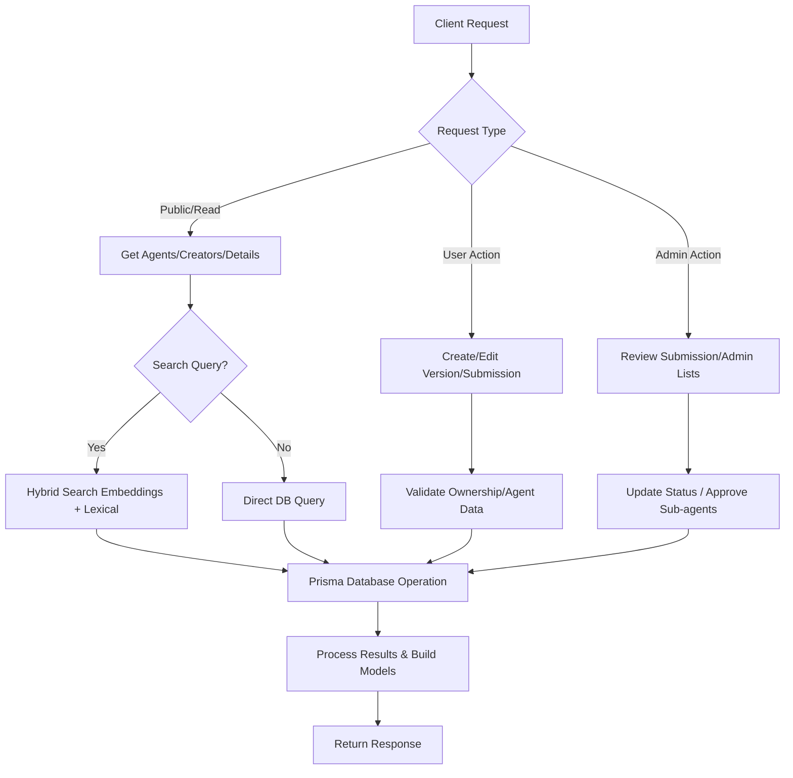
```mermaid
graph TD
    A[Client Request] --> B{Request Type}
    B -- Public/Read --> C[Get Agents/Creators/Details]
    B -- User Action --> D[Create/Edit Version/Submission]
    B -- Admin Action --> E[Review Submission/Admin Lists]
    C --> F{Search Query?}
    F -- Yes --> G[Hybrid Search Embeddings + Lexical]
    F -- No --> H[Direct DB Query]
    D --> I[Validate Ownership/Agent Data]
    E --> J[Update Status / Approve Sub-agents]
    G & H & I & J --> K[Prisma Database Operation]
    K --> L[Process Results & Build Models]
    L --> M[Return Response]
```

## 类结构

```
No user-defined classes in this file (Module-level functions only)
```

## 全局变量及字段


### `logger`
    
用于记录模块运行日志和调试信息的记录器实例。

类型：`logging.Logger`
    


### `settings`
    
应用程序配置设置的实例，用于访问如前端基础URL等环境配置。

类型：`Settings`
    


### `DEFAULT_ADMIN_NAME`
    
默认管理员的显示名称，用于通知中作为发送者名称的备选值。

类型：`str`
    


### `DEFAULT_ADMIN_EMAIL`
    
默认管理员的电子邮箱地址，用于通知中作为发送者邮箱的备选值。

类型：`str`
    


    

## 全局函数及方法


### `get_store_agents`

获取公共商店代理的列表，支持多种筛选条件（如精选、创建者、分类）、排序方式、分页以及混合搜索（语义+文本）。当提供搜索查询时，优先尝试混合搜索，如果嵌入服务不可用则优雅降级为仅文本搜索。

参数：

-   `featured`：`bool`，是否筛选精选的代理。
-   `creators`：`list[str] | None`，用于筛选特定创建者用户名的列表。
-   `sorted_by`：`Literal["rating", "runs", "name", "updated_at"] | None`，排序依据的字段。
-   `search_query`：`str | None`，搜索查询字符串，用于混合搜索或文本匹配。
-   `category`：`str | None`，筛选代理的类别。
-   `page`：`int`，当前页码，从 1 开始。
-   `page_size`：`int`，每页返回的项目数量。

返回值：`store_model.StoreAgentsResponse`，包含代理列表和分页信息的响应对象。

#### 流程图

```mermaid
flowchart TD
    Start([开始]) --> Init[初始化变量: search_used_hybrid=False, agents=[]]
    Init --> CheckSearch{search_query 是否存在?}

    CheckSearch -- 是 --> TryHybrid[尝试调用 hybrid_search]
    TryHybrid --> HybridSuccess{执行成功?}
    
    HybridSuccess -- 是 --> SetFlag[设置 search_used_hybrid = True]
    SetFlag --> CalcPages1[计算 total_pages]
    CalcPages1 --> ConvertHybrid[将 hybrid search 结果转换为 StoreAgent 对象]
    ConvertHybrid --> LogFound1[记录找到的代理数量]
    
    HybridSuccess -- 否 (异常) --> LogError[记录错误日志]
    LogError --> FallbackPath[进入回退路径]

    CheckSearch -- 否 --> FallbackPath
    
    FallbackPath --> BuildWhere[构建 where_clause: is_available=True]
    BuildWhere --> AddFilters{添加 featured/creators/category 过滤条件}
    AddFilters --> CheckSearchQueryInFallback{search_query 存在?}
    CheckSearchQueryInFallback -- 是 --> AddTextSearch[添加 OR 文本包含条件]
    CheckSearchQueryInFallback -- 否 --> CheckSort
    
    AddTextSearch --> CheckSort{sorted_by 指定?}
    CheckSort -- 是 --> BuildOrderBy[构建 order_by 列表]
    CheckSort -- 否 --> BuildOrderBy
    
    BuildOrderBy --> QueryDB[执行 Prisma find_many 查询]
    QueryDB --> CountTotal[执行 count 查询获取总数]
    CountTotal --> CalcPages2[计算 total_pages]
    CalcPages2 --> ConvertDB[将 DB 结果转换为 StoreAgent 对象]
    ConvertDB --> LogFound2[记录找到的代理数量]

    LogFound1 --> BuildResponse[构建 StoreAgentsResponse]
    LogFound2 --> BuildResponse
    
    BuildResponse --> ReturnResponse([返回响应])

    Init -.-> CatchException
    QueryDB -.-> CatchException
    ConvertDB -.-> CatchException
    CatchException[捕获异常] --> LogException[记录错误日志]
    LogException --> RaiseError[抛出 DatabaseError]
```

#### 带注释源码

```python
async def get_store_agents(
    featured: bool = False,
    creators: list[str] | None = None,
    sorted_by: Literal["rating", "runs", "name", "updated_at"] | None = None,
    search_query: str | None = None,
    category: str | None = None,
    page: int = 1,
    page_size: int = 20,
) -> store_model.StoreAgentsResponse:
    """
    Get PUBLIC store agents from the StoreAgent view.

    Search behavior:
    - With search_query: Uses hybrid search (semantic + lexical)
    - Fallback: If embeddings unavailable, gracefully degrades to lexical-only
    - Rationale: User-facing endpoint prioritizes availability over accuracy

    Note: Admin operations (approval) use fail-fast to prevent inconsistent state.
    """
    # 记录请求参数的调试日志
    logger.debug(
        f"Getting store agents. featured={featured}, creators={creators}, sorted_by={sorted_by}, search={search_query}, category={category}, page={page}"
    )

    search_used_hybrid = False
    store_agents: list[store_model.StoreAgent] = []
    agents: list[dict[str, Any]] = []
    total = 0
    total_pages = 0

    try:
        # 如果提供了 search_query，尝试使用混合搜索（embeddings + tsvector）
        if search_query:
            # 尝试结合语义和词汇信号的混合搜索
            # 如果 OpenAI 不可用，则回退到仅词汇搜索（面向用户，高 SLA）
            try:
                agents, total = await hybrid_search(
                    query=search_query,
                    featured=featured,
                    creators=creators,
                    category=category,
                    sorted_by="relevance",  # 使用混合评分作为相关性排序
                    page=page,
                    page_size=page_size,
                )
                search_used_hybrid = True
            except Exception as e:
                # 记录错误但回退到词汇搜索以提供更好的用户体验
                logger.error(
                    f"Hybrid search failed (likely OpenAI unavailable), "
                    f"falling back to lexical search: {e}"
                )
                # search_used_hybrid 保持 False，将在下面使用回退路径

            # 如果混合搜索成功，转换结果（字典格式）
            if search_used_hybrid:
                total_pages = (total + page_size - 1) // page_size
                store_agents: list[store_model.StoreAgent] = []
                for agent in agents:
                    try:
                        store_agent = store_model.StoreAgent(
                            slug=agent["slug"],
                            agent_name=agent["agent_name"],
                            agent_image=(
                                agent["agent_image"][0] if agent["agent_image"] else ""
                            ),
                            creator=agent["creator_username"] or "Needs Profile",
                            creator_avatar=agent["creator_avatar"] or "",
                            sub_heading=agent["sub_heading"],
                            description=agent["description"],
                            runs=agent["runs"],
                            rating=agent["rating"],
                            agent_graph_id=agent.get("agentGraphId", ""),
                        )
                        store_agents.append(store_agent)
                    except Exception as e:
                        logger.error(
                            f"Error parsing Store agent from hybrid search results: {e}"
                        )
                        continue

        # 如果没有使用混合搜索（或者混合搜索失败），则使用标准数据库查询作为回退
        if not search_used_hybrid:
            # 回退路径 - 使用基本搜索或无搜索
            where_clause: prisma.types.StoreAgentWhereInput = {"is_available": True}
            if featured:
                where_clause["featured"] = featured
            if creators:
                where_clause["creator_username"] = {"in": creators}
            if category:
                where_clause["categories"] = {"has": category}

            # 如果提供了 search_query 但混合搜索失败，添加基本文本搜索
            if search_query:
                where_clause["OR"] = [
                    {"agent_name": {"contains": search_query, "mode": "insensitive"}},
                    {"sub_heading": {"contains": search_query, "mode": "insensitive"}},
                    {"description": {"contains": search_query, "mode": "insensitive"}},
                ]

            # 构建排序逻辑
            order_by = []
            if sorted_by == "rating":
                order_by.append({"rating": "desc"})
            elif sorted_by == "runs":
                order_by.append({"runs": "desc"})
            elif sorted_by == "name":
                order_by.append({"agent_name": "asc"})

            # 执行数据库查询
            db_agents = await prisma.models.StoreAgent.prisma().find_many(
                where=where_clause,
                order=order_by,
                skip=(page - 1) * page_size,
                take=page_size,
            )

            # 获取总数以计算分页
            total = await prisma.models.StoreAgent.prisma().count(where=where_clause)
            total_pages = (total + page_size - 1) // page_size

            # 转换数据库结果为模型对象
            store_agents: list[store_model.StoreAgent] = []
            for agent in db_agents:
                try:
                    # 安全地创建 StoreAgent 对象
                    store_agent = store_model.StoreAgent(
                        slug=agent.slug,
                        agent_name=agent.agent_name,
                        agent_image=agent.agent_image[0] if agent.agent_image else "",
                        creator=agent.creator_username or "Needs Profile",
                        creator_avatar=agent.creator_avatar or "",
                        sub_heading=agent.sub_heading,
                        description=agent.description,
                        runs=agent.runs,
                        rating=agent.rating,
                        agent_graph_id=agent.agentGraphId,
                    )
                    # 仅在创建成功时添加到列表
                    store_agents.append(store_agent)
                except Exception as e:
                    # 如果出错则跳过该代理
                    # 可以在此处记录错误日志
                    logger.error(
                        f"Error parsing Store agent when getting store agents from db: {e}"
                    )
                    continue

        logger.debug(f"Found {len(store_agents)} agents")
        # 返回包含代理列表和分页信息的响应
        return store_model.StoreAgentsResponse(
            agents=store_agents,
            pagination=store_model.Pagination(
                current_page=page,
                total_items=total,
                total_pages=total_pages,
                page_size=page_size,
            ),
        )
    except Exception as e:
        logger.error(f"Error getting store agents: {e}")
        raise DatabaseError("Failed to fetch store agents") from e
    # TODO: 注释掉此部分，因为我们担心潜在的数据库负载问题
    # finally:
    #     if search_term:
    #         await log_search_term(search_query=search_term)
```


### `log_search_term`

将用户输入的搜索词异步记录到数据库中。为了保护隐私并防止关联追踪，该函数会将记录的时间戳归零（仅保留日期），并且在记录失败时仅记录错误日志而不抛出异常，以确保不影响主流程。

参数：

- `search_query`：`str`，需要记录的用户搜索查询字符串。

返回值：`None`，无返回值，仅执行副作用（数据库写入）。

#### 流程图

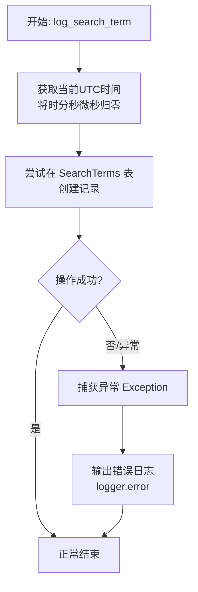
```mermaid
flowchart TD
    A[开始: log_search_term] --> B[获取当前UTC时间<br>将时分秒微秒归零]
    B --> C[尝试在 SearchTerms 表<br>创建记录]
    C --> D{操作成功?}
    D -- 是 --> E[正常结束]
    D -- 否/异常 --> F[捕获异常 Exception]
    F --> G[输出错误日志<br>logger.error]
    G --> E
```

#### 带注释源码

```python
async def log_search_term(search_query: str):
    """Log a search term to the database"""

    # 通过将时间戳重置为当天的 00:00:00 UTC 来匿名化数据
    # 这样可以防止将此日志与其他具有精确时间戳的日志相关联
    date = datetime.now(timezone.utc).replace(hour=0, minute=0, second=0, microsecond=0)
    try:
        # 使用 Prisma 客户端在数据库中创建一个新的 SearchTerms 记录
        # data 字典包含搜索词内容和归一化后的日期
        await prisma.models.SearchTerms.prisma().create(
            data={"searchTerm": search_query, "createdDate": date}
        )
    except Exception as e:
        # 此处静默失败，仅记录错误日志
        # 这样可以确保记录搜索词这种辅助功能不会因为数据库故障而中断主应用程序
        logger.error(f"Error logging search term: {e}")
```


### `get_store_agent_details`

根据用户名和代理名称（slug）获取商店代理的详细信息。该函数优先返回活跃版本的代理数据；如果不存在活跃版本，则返回最新已批准版本的数据。此外，它还支持可选地获取代理的版本变更日志。

参数：

-  `username`：`str`，代理创建者的用户名。
-  `agent_name`：`str`，代理的唯一标识符（slug）。
-  `include_changelog`：`bool`，是否包含代理版本变更日志的标志，默认为 False。

返回值：`store_model.StoreAgentDetails`，包含代理详细信息的 Pydantic 模型，涵盖元数据、版本状态、评分、推荐计划 cron 表达式以及可选的变更日志。

#### 流程图

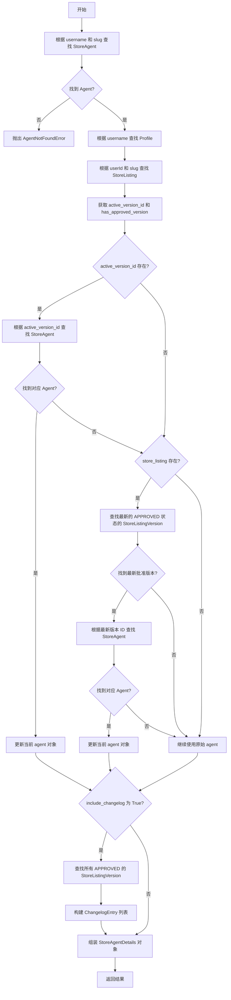
```mermaid
flowchart TD
    A[开始] --> B[根据 username 和 slug 查找 StoreAgent]
    B --> C{找到 Agent?}
    C -- 否 --> D[抛出 AgentNotFoundError]
    C -- 是 --> E[根据 username 查找 Profile]
    E --> F[根据 userId 和 slug 查找 StoreListing]
    F --> G[获取 active_version_id 和 has_approved_version]
    G --> H{active_version_id 存在?}
    H -- 是 --> I[根据 active_version_id 查找 StoreAgent]
    I --> J{找到对应 Agent?}
    J -- 是 --> K[更新当前 agent 对象]
    J -- 否 --> L{store_listing 存在?}
    H -- 否 --> L
    L -- 是 --> M[查找最新的 APPROVED 状态的 StoreListingVersion]
    M --> N{找到最新批准版本?}
    N -- 是 --> O[根据最新版本 ID 查找 StoreAgent]
    O --> P{找到对应 Agent?}
    P -- 是 --> Q[更新当前 agent 对象]
    P -- 否 --> R[继续使用原始 agent]
    N -- 否 --> R
    L -- 否 --> R
    K --> S{include_changelog 为 True?}
    Q --> S
    R --> S
    S -- 是 --> T[查找所有 APPROVED 的 StoreListingVersion]
    T --> U[构建 ChangelogEntry 列表]
    U --> V[组装 StoreAgentDetails 对象]
    S -- 否 --> V
    V --> W[返回结果]
```

#### 带注释源码

```python
async def get_store_agent_details(
    username: str, agent_name: str, include_changelog: bool = False
) -> store_model.StoreAgentDetails:
    """Get PUBLIC store agent details from the StoreAgent view"""
    logger.debug(f"Getting store agent details for {username}/{agent_name}")

    try:
        # 根据用户名和 slug 查找基础代理信息
        agent = await prisma.models.StoreAgent.prisma().find_first(
            where={"creator_username": username, "slug": agent_name}
        )

        if not agent:
            logger.warning(f"Agent not found: {username}/{agent_name}")
            raise store_exceptions.AgentNotFoundError(
                f"Agent {username}/{agent_name} not found"
            )

        # 获取用户 Profile 以获取内部 userId
        profile = await prisma.models.Profile.prisma().find_first(
            where={"username": username}
        )
        user_id = profile.userId if profile else None

        # 获取 StoreListing 以确认版本状态（活跃版本、批准状态）
        # 包含 ActiveVersion 以获取推荐配置
        store_listing = await prisma.models.StoreListing.prisma().find_first(
            where=prisma.types.StoreListingWhereInput(
                slug=agent_name,
                owningUserId=user_id or "",
            ),
            include={"ActiveVersion": True},
        )

        active_version_id = store_listing.activeVersionId if store_listing else None
        has_approved_version = (
            store_listing.hasApprovedVersion if store_listing else False
        )

        # 逻辑：优先展示活跃版本，若无则展示最新已批准版本
        if active_version_id:
            agent_by_active = await prisma.models.StoreAgent.prisma().find_first(
                where={"storeListingVersionId": active_version_id}
            )
            if agent_by_active:
                agent = agent_by_active
        elif store_listing:
            # 如果没有活跃版本，回退到查找最新已批准的版本
            latest_approved = (
                await prisma.models.StoreListingVersion.prisma().find_first(
                    where={
                        "storeListingId": store_listing.id,
                        "submissionStatus": prisma.enums.SubmissionStatus.APPROVED,
                    },
                    order=[{"version": "desc"}],
                )
            )
            if latest_approved:
                agent_latest = await prisma.models.StoreAgent.prisma().find_first(
                    where={"storeListingVersionId": latest_approved.id}
                )
                if agent_latest:
                    agent = agent_latest

        # 获取推荐的 Cron 表达式（如果有活跃版本）
        if store_listing and store_listing.ActiveVersion:
            recommended_schedule_cron = (
                store_listing.ActiveVersion.recommendedScheduleCron
            )
        else:
            recommended_schedule_cron = None

        # 可选：获取变更日志
        changelog_data = None
        if include_changelog and store_listing:
            changelog_versions = (
                await prisma.models.StoreListingVersion.prisma().find_many(
                    where={
                        "storeListingId": store_listing.id,
                        "submissionStatus": prisma.enums.SubmissionStatus.APPROVED,
                    },
                    order=[{"version": "desc"}],
                )
            )
            changelog_data = [
                store_model.ChangelogEntry(
                    version=str(version.version),
                    changes_summary=version.changesSummary or "No changes recorded",
                    date=version.createdAt,
                )
                for version in changelog_versions
            ]

        logger.debug(f"Found agent details for {username}/{agent_name}")
        # 构建并返回详细数据模型
        return store_model.StoreAgentDetails(
            store_listing_version_id=agent.storeListingVersionId,
            slug=agent.slug,
            agent_name=agent.agent_name,
            agent_video=agent.agent_video or "",
            agent_output_demo=agent.agent_output_demo or "",
            agent_image=agent.agent_image,
            creator=agent.creator_username or "",
            creator_avatar=agent.creator_avatar or "",
            sub_heading=agent.sub_heading,
            description=agent.description,
            categories=agent.categories,
            runs=agent.runs,
            rating=agent.rating,
            versions=agent.versions,
            agentGraphVersions=agent.agentGraphVersions,
            agentGraphId=agent.agentGraphId,
            last_updated=agent.updated_at,
            active_version_id=active_version_id,
            has_approved_version=has_approved_version,
            recommended_schedule_cron=recommended_schedule_cron,
            changelog=changelog_data,
        )
    except store_exceptions.AgentNotFoundError:
        raise
    except Exception as e:
        logger.error(f"Error getting store agent details: {e}")
        raise DatabaseError("Failed to fetch agent details") from e
```


### `get_available_graph`

根据商店上架版本ID获取可用的代理图，并可选择是否隐藏节点详情。

参数：

- `store_listing_version_id`：`str`，目标商店上架版本的唯一标识符。
- `hide_nodes`：`bool`，是否从返回的图模型中排除节点详情的标志。默认为 True。

返回值：`GraphModel | GraphModelWithoutNodes`，包含代理图数据的模型对象，根据 `hide_nodes` 参数决定是否包含节点信息。

#### 流程图

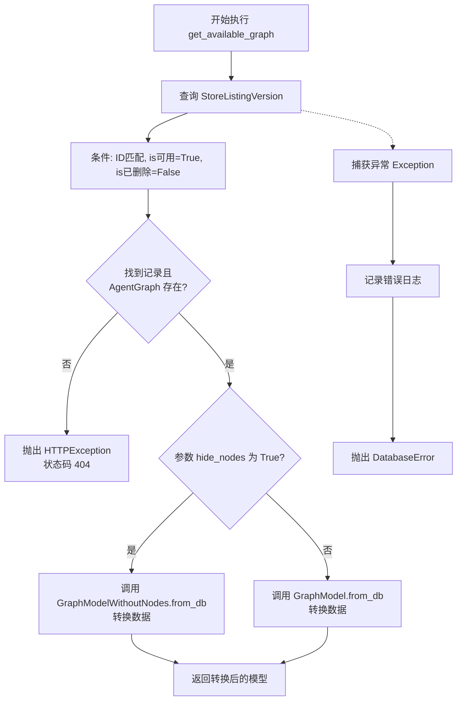
```mermaid
flowchart TD
    A[开始执行 get_available_graph] --> B[查询 StoreListingVersion]
    B --> C[条件: ID匹配, is可用=True, is已删除=False]
    C --> D{找到记录且<br>AgentGraph 存在?}
    D -- 否 --> E[抛出 HTTPException<br>状态码 404]
    D -- 是 --> F{参数 hide_nodes 为 True?}
    F -- 是 --> G[调用 GraphModelWithoutNodes.from_db<br>转换数据]
    F -- 否 --> H[调用 GraphModel.from_db<br>转换数据]
    G --> I[返回转换后的模型]
    H --> I
    
    B -.-> J[捕获异常 Exception]
    J --> K[记录错误日志]
    K --> L[抛出 DatabaseError]
```

#### 带注释源码

```python
async def get_available_graph(
    store_listing_version_id: str,
    hide_nodes: bool = True,
) -> GraphModelWithoutNodes | GraphModel:
    try:
        # 查询数据库，查找符合条件（可用、未删除、ID匹配）的商店上架版本
        # 包含（include）关联的 AgentGraph 数据及其相关配置
        store_listing_version = (
            await prisma.models.StoreListingVersion.prisma().find_first(
                where={
                    "id": store_listing_version_id,
                    "isAvailable": True,
                    "isDeleted": False,
                },
                include={"AgentGraph": {"include": AGENT_GRAPH_INCLUDE}},
            )
        )

        # 检查是否找到了有效的版本及其关联的代理图数据
        if not store_listing_version or not store_listing_version.AgentGraph:
            # 如果未找到，抛出 404 异常，指示资源不存在
            raise fastapi.HTTPException(
                status_code=404,
                detail=f"Store listing version {store_listing_version_id} not found",
            )

        # 根据 hide_nodes 参数选择返回的模型类型，并从数据库对象进行转换
        # 如果 hide_nodes 为 True，返回不包含节点的图模型
        # 如果 hide_nodes 为 False，返回包含完整节点信息的图模型
        return (GraphModelWithoutNodes if hide_nodes else GraphModel).from_db(
            store_listing_version.AgentGraph
        )

    except Exception as e:
        # 捕获处理过程中发生的异常，记录错误日志
        logger.error(f"Error getting agent: {e}")
        # 抛出数据库错误异常，包装原始异常信息
        raise DatabaseError("Failed to fetch agent") from e
```


### `get_store_agent_by_version_id`

根据商店列表版本ID获取商店代理的详细信息。该函数通过查询数据库中的 `StoreAgent` 模型来检索特定版本的代理数据，并将其映射为结构化的 `StoreAgentDetails` 对象。如果找不到对应的代理，则抛出 `AgentNotFoundError`。

参数：

-  `store_listing_version_id`：`str`，商店列表版本的唯一标识符。

返回值：`store_model.StoreAgentDetails`，包含代理详细信息的响应对象，包括代理名称、描述、创作者信息、运行次数、评分、版本信息及最后更新时间等。

#### 流程图

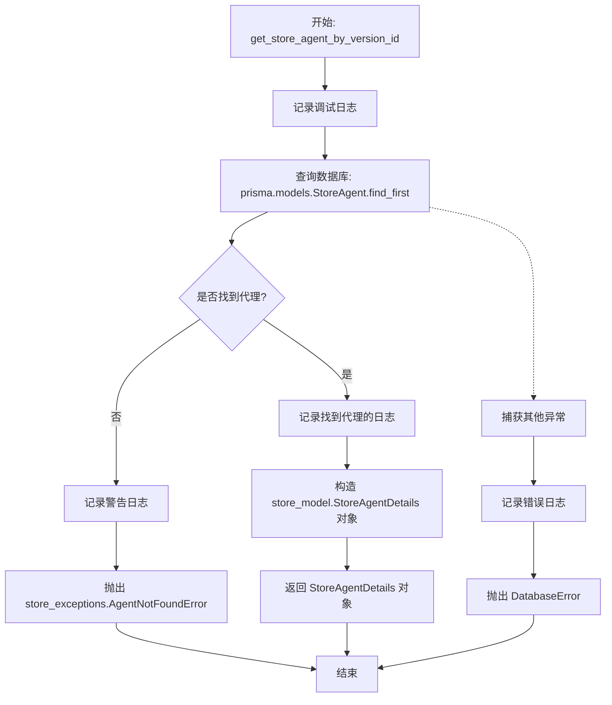
```mermaid
flowchart TD
    A[开始: get_store_agent_by_version_id] --> B[记录调试日志]
    B --> C[查询数据库: prisma.models.StoreAgent.find_first]
    C --> D{是否找到代理?}
    D -- 否 --> E[记录警告日志]
    E --> F[抛出 store_exceptions.AgentNotFoundError]
    F --> Z[结束]
    D -- 是 --> G[记录找到代理的日志]
    G --> H[构造 store_model.StoreAgentDetails 对象]
    H --> I[返回 StoreAgentDetails 对象]
    I --> Z
    C -.-> J[捕获其他异常]
    J --> K[记录错误日志]
    K --> L[抛出 DatabaseError]
    L --> Z
```

#### 带注释源码

```python
async def get_store_agent_by_version_id(
    store_listing_version_id: str,
) -> store_model.StoreAgentDetails:
    # 记录开始查询的调试日志
    logger.debug(f"Getting store agent details for {store_listing_version_id}")

    try:
        # 根据提供的 store_listing_version_id 查询数据库中的 StoreAgent 记录
        agent = await prisma.models.StoreAgent.prisma().find_first(
            where={"storeListingVersionId": store_listing_version_id}
        )

        # 如果查询结果为空，说明未找到对应的代理
        if not agent:
            logger.warning(f"Agent not found: {store_listing_version_id}")
            # 抛出 AgentNotFoundError 异常
            raise store_exceptions.AgentNotFoundError(
                f"Agent {store_listing_version_id} not found"
            )

        # 记录成功找到代理的日志
        logger.debug(f"Found agent details for {store_listing_version_id}")

        # 将数据库查询结果映射为 StoreAgentDetails 模型对象并返回
        # 这里使用了 "or """ 来处理可能为 None 的字符串字段
        return store_model.StoreAgentDetails(
            store_listing_version_id=agent.storeListingVersionId,
            slug=agent.slug,
            agent_name=agent.agent_name,
            agent_video=agent.agent_video or "",
            agent_output_demo=agent.agent_output_demo or "",
            agent_image=agent.agent_image,
            creator=agent.creator_username or "",
            creator_avatar=agent.creator_avatar or "",
            sub_heading=agent.sub_heading,
            description=agent.description,
            categories=agent.categories,
            runs=agent.runs,
            rating=agent.rating,
            versions=agent.versions,
            agentGraphVersions=agent.agentGraphVersions,
            agentGraphId=agent.agentGraphId,
            last_updated=agent.updated_at,
        )
    # 捕获特定的 AgentNotFoundError 并重新抛出，保持异常语义清晰
    except store_exceptions.AgentNotFoundError:
        raise
    # 捕获其他所有未预期的异常
    except Exception as e:
        logger.error(f"Error getting store agent details: {e}")
        # 抛出通用的 DatabaseError，隐藏内部实现细节
        raise DatabaseError("Failed to fetch agent details") from e
```


### `get_store_creators`

从数据库的 "Creator" 视图中检索公开的商店创建者列表，支持基于精选状态的过滤、关键词搜索、特定指标排序以及分页功能。

参数：

-   `featured`：`bool`，如果为 True，则筛选仅显示精选的创建者。
-   `search_query`：`str | None`，用于搜索用户名、姓名或描述的关键词。
-   `sorted_by`：`Literal["agent_rating", "agent_runs", "num_agents"] | None`，指定排序依据的字段，如代理评分、运行次数或代理数量。
-   `page`：`int`，要检索的页码，从 1 开始。
-   `page_size`：`int`，每页显示的项目数量。

返回值：`store_model.CreatorsResponse`，包含创建者详情列表及分页元数据的响应对象。

#### 流程图

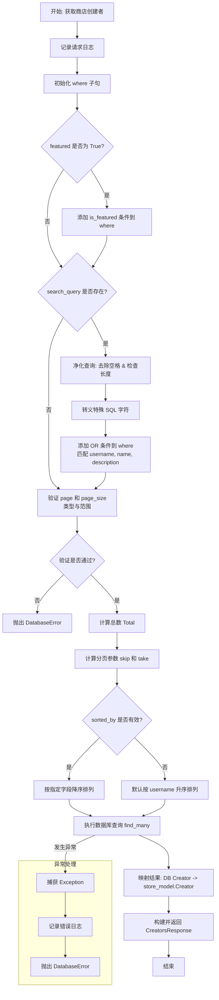
```mermaid
flowchart TD
    A[开始: 获取商店创建者] --> B[记录请求日志]
    B --> C[初始化 where 子句]
    C --> D{featured 是否为 True?}
    D -- 是 --> E[添加 is_featured 条件到 where]
    D -- 否 --> F{search_query 是否存在?}
    E --> F
    F -- 是 --> G[净化查询: 去除空格 & 检查长度]
    G --> H[转义特殊 SQL 字符]
    H --> I[添加 OR 条件到 where<br/>匹配 username, name, description]
    F -- 否 --> J[验证 page 和 page_size<br/>类型与范围]
    I --> J
    J --> K{验证是否通过?}
    K -- 否 --> L[抛出 DatabaseError]
    K -- 是 --> M[计算总数 Total]
    M --> N[计算分页参数 skip 和 take]
    N --> O{sorted_by 是否有效?}
    O -- 是 --> P[按指定字段降序排列]
    O -- 否 --> Q[默认按 username 升序排列]
    P --> R[执行数据库查询 find_many]
    Q --> R
    R --> S[映射结果: DB Creator -> store_model.Creator]
    S --> T[构建并返回 CreatorsResponse]
    T --> U[结束]
    
    subgraph 异常处理
        V[捕获 Exception] --> W[记录错误日志]
        W --> X[抛出 DatabaseError]
    end
    
    R -- 发生异常 --> V
```

#### 带注释源码

```python
async def get_store_creators(
    featured: bool = False,
    search_query: str | None = None,
    sorted_by: Literal["agent_rating", "agent_runs", "num_agents"] | None = None,
    page: int = 1,
    page_size: int = 20,
) -> store_model.CreatorsResponse:
    """Get PUBLIC store creators from the Creator view"""
    logger.debug(
        f"Getting store creators. featured={featured}, search={search_query}, sorted_by={sorted_by}, page={page}"
    )

    # 初始化数据库查询的 where 条件字典
    where = {}

    # 如果要求只看精选创建者，添加条件
    if featured:
        where["is_featured"] = featured

    # 处理搜索过滤
    if search_query:
        # 净化输入：去除首尾空格
        sanitized_query = search_query.strip()
        # 验证长度，防止过长输入
        if not sanitized_query or len(sanitized_query) > 100:  # Reasonable length limit
            raise DatabaseError("Invalid search query")

        # 手动转义特殊 SQL 字符以防止注入（尽管 ORM 通常处理此问题，这里作为额外的防御层）
        sanitized_query = (
            sanitized_query.replace("\\", "\\\\")
            .replace("%", "\\%")
            .replace("_", "\\_")
            .replace("[", "\\[")
            .replace("]", "\\]")
            .replace("'", "\\'")
            .replace('"', '\\"')
            .replace(";", "\\;")
            .replace("--", "\\--")
            .replace("/*", "\\/*")
            .replace("*/", "\\*/")
        )

        # 添加模糊搜索条件，匹配用户名、姓名或描述（不区分大小写）
        where["OR"] = [
            {"username": {"contains": sanitized_query, "mode": "insensitive"}},
            {"name": {"contains": sanitized_query, "mode": "insensitive"}},
            {"description": {"contains": sanitized_query, "mode": "insensitive"}},
        ]

    try:
        # 校验分页参数
        if not isinstance(page, int) or page < 1:
            raise DatabaseError("Invalid page number")
        if not isinstance(page_size, int) or page_size < 1 or page_size > 100:
            raise DatabaseError("Invalid page size")

        # 获取符合条件的总数用于分页计算
        total = await prisma.models.Creator.prisma().count(
            where=prisma.types.CreatorWhereInput(**where)
        )
        total_pages = (total + page_size - 1) // page_size

        # 计算跳过的记录数 和 获取数量
        skip = (page - 1) * page_size
        take = page_size

        # 处理排序逻辑
        order = []
        valid_sort_fields = {"agent_rating", "agent_runs", "num_agents"}
        if sorted_by in valid_sort_fields:
            # 有效字段按降序排列（数值越高越好）
            order.append({sorted_by: "desc"})
        else:
            # 默认按用户名升序排列
            order.append({"username": "asc"})

        # 执行数据库查询
        creators = await prisma.models.Creator.prisma().find_many(
            where=prisma.types.CreatorWhereInput(**where),
            skip=skip,
            take=take,
            order=order,
        )

        # 将数据库模型转换为返回所需的 Pydantic 模型
        creator_models = [
            store_model.Creator(
                username=creator.username,
                name=creator.name,
                description=creator.description,
                avatar_url=creator.avatar_url,
                num_agents=creator.num_agents,
                agent_rating=creator.agent_rating,
                agent_runs=creator.agent_runs,
                is_featured=creator.is_featured,
            )
            for creator in creators
        ]

        logger.debug(f"Found {len(creator_models)} creators")
        # 构造并返回包含分页信息的响应对象
        return store_model.CreatorsResponse(
            creators=creator_models,
            pagination=store_model.Pagination(
                current_page=page,
                total_items=total,
                total_pages=total_pages,
                page_size=page_size,
            ),
        )
    except Exception as e:
        logger.error(f"Error getting store creators: {e}")
        raise DatabaseError("Failed to fetch store creators") from e
```


### `get_store_creator_details`

Get PUBLIC store creator details from the Creator view based on the provided username. It retrieves user profile information and aggregated statistics.

参数：

-  `username`：`str`，The username of the creator to fetch details for.

返回值：`store_model.CreatorDetails`，A Pydantic model containing the creator's details including name, username, description, links, avatar URL, agent rating, agent runs, and top categories.

#### 流程图

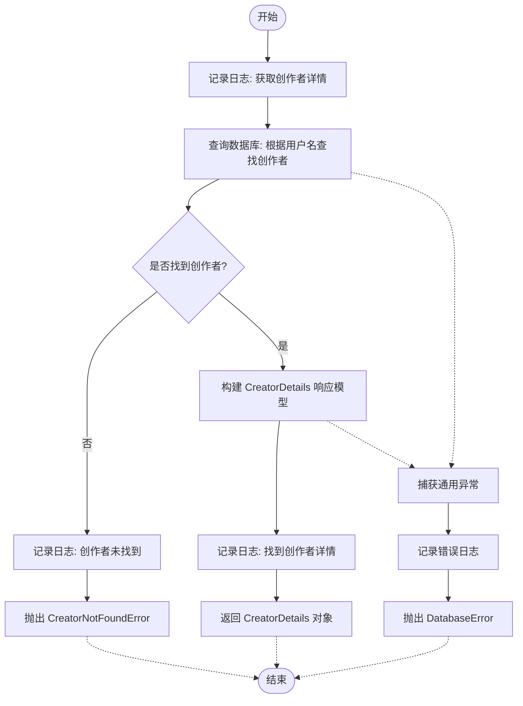
```mermaid
flowchart TD
    Start([开始]) --> LogDebug[记录日志: 获取创作者详情]
    LogDebug --> QueryDB[查询数据库: 根据用户名查找创作者]
    QueryDB --> CheckFound{是否找到创作者?}
    
    CheckFound -- 否 --> LogWarn[记录日志: 创作者未找到]
    LogWarn --> RaiseNotFound[抛出 CreatorNotFoundError]
    
    CheckFound -- 是 --> MapModel[构建 CreatorDetails 响应模型]
    MapModel --> LogSuccess[记录日志: 找到创作者详情]
    LogSuccess --> ReturnModel[返回 CreatorDetails 对象]
    
    QueryDB -.-> CatchException[捕获通用异常]
    MapModel -.-> CatchException
    
    RaiseNotFound -.-> End([结束])
    ReturnModel -.-> End
    
    CatchException --> LogError[记录错误日志]
    LogError --> RaiseDBError[抛出 DatabaseError]
    RaiseDBError -.-> End
```

#### 带注释源码

```python
async def get_store_creator_details(
    username: str,
) -> store_model.CreatorDetails:
    # 记录调试日志，开始获取指定用户名的创作者详情
    logger.debug(f"Getting store creator details for {username}")

    try:
        # 调用 Prisma 客户端，根据用户名唯一标识查询创作者数据
        creator = await prisma.models.Creator.prisma().find_unique(
            where={"username": username}
        )

        # 检查是否查询到创作者记录
        if not creator:
            # 如果未找到，记录警告日志
            logger.warning(f"Creator not found: {username}")
            # 抛出特定的创作者未找到异常
            raise store_exceptions.CreatorNotFoundError(f"Creator {username} not found")

        # 记录调试日志，查询成功
        logger.debug(f"Found creator details for {username}")
        
        # 将数据库记录映射并返回为 CreatorDetails 响应模型
        return store_model.CreatorDetails(
            name=creator.name,
            username=creator.username,
            description=creator.description,
            links=creator.links,
            avatar_url=creator.avatar_url,
            agent_rating=creator.agent_rating,
            agent_runs=creator.agent_runs,
            top_categories=creator.top_categories,
        )
    # 捕获特定的业务异常（如 CreatorNotFoundError）并重新抛出
    except store_exceptions.CreatorNotFoundError:
        raise
    # 捕获其他通用异常
    except Exception as e:
        # 记录错误日志
        logger.error(f"Error getting store creator details: {e}")
        # 抛出数据库错误异常
        raise DatabaseError("Failed to fetch creator details") from e
```


### `get_store_submissions`

获取已认证用户的商店提交记录，包含分页支持和详细的提交状态信息。

参数：

- `user_id`：`str`，已认证用户的唯一标识符，用于筛选该用户的提交记录。
- `page`：`int`，请求的页码，默认为 1。
- `page_size`：`int`，每页返回的记录数量，默认为 20。

返回值：`store_model.StoreSubmissionsResponse`，包含提交记录列表及分页信息（如总页数、总条目数）的响应对象。如果发生错误，返回一个包含空列表的响应对象以保证服务稳定性。

#### 流程图

```mermaid
flowchart TD
    A[开始: get_store_submissions] --> B[记录日志: 获取用户提交记录]
    B --> C[计算分页偏移量: skip = (page - 1) * page_size]
    C --> D[构建查询条件: where = user_id]
    D --> E[执行数据库查询: find_many 获取提交列表]
    E --> F[执行数据库计数: count 获取总数]
    F --> G[计算总页数: total_pages]
    G --> H[遍历数据库结果]
    H --> I[构建 StoreSubmission 模型对象]
    I --> J{是否还有更多记录?}
    J -->|是| H
    J -->|否| K[组装响应对象: StoreSubmissionsResponse]
    K --> L[结束: 返回响应]
    
    subgraph 异常处理
        M[捕获异常] --> N[记录错误日志]
        N --> O[返回空响应对象]
    end

    E -.->|失败| M
    F -.->|失败| M
```

#### 带注释源码

```python
async def get_store_submissions(
    user_id: str, page: int = 1, page_size: int = 20
) -> store_model.StoreSubmissionsResponse:
    """Get store submissions for the authenticated user -- not an admin"""
    # 记录调试日志，包含用户ID和页码
    logger.debug(f"Getting store submissions for user {user_id}, page={page}")

    try:
        # 计算分页查询的跳过数量
        skip = (page - 1) * page_size

        # 构建查询条件，仅查询当前用户的提交
        where = prisma.types.StoreSubmissionWhereInput(user_id=user_id)
        
        # 从数据库查询提交记录，按提交日期降序排列，并应用分页
        submissions = await prisma.models.StoreSubmission.prisma().find_many(
            where=where,
            skip=skip,
            take=page_size,
            order=[{"date_submitted": "desc"}],
        )

        # 获取符合条件的总记录数，用于计算总页数
        total = await prisma.models.StoreSubmission.prisma().count(where=where)

        # 计算总页数
        total_pages = (total + page_size - 1) // page_size

        # 将数据库记录转换为响应模型列表
        submission_models = []
        for sub in submissions:
            submission_model = store_model.StoreSubmission(
                listing_id=sub.listing_id,
                agent_id=sub.agent_id,
                agent_version=sub.agent_version,
                name=sub.name,
                sub_heading=sub.sub_heading,
                slug=sub.slug,
                description=sub.description,
                # 使用 getattr 安全获取可能不存在的 instructions 字段
                instructions=getattr(sub, "instructions", None),
                image_urls=sub.image_urls or [],
                # 如果日期为空，默认使用当前UTC时间
                date_submitted=sub.date_submitted or datetime.now(tz=timezone.utc),
                status=sub.status,
                runs=sub.runs or 0,
                rating=sub.rating or 0.0,
                store_listing_version_id=sub.store_listing_version_id,
                reviewer_id=sub.reviewer_id,
                review_comments=sub.review_comments,
                # internal_comments 在此处被省略，不返回给普通用户
                reviewed_at=sub.reviewed_at,
                changes_summary=sub.changes_summary,
                video_url=sub.video_url,
                categories=sub.categories,
            )
            submission_models.append(submission_model)

        logger.debug(f"Found {len(submission_models)} submissions")
        
        # 构建并返回包含数据和分页信息的响应对象
        return store_model.StoreSubmissionsResponse(
            submissions=submission_models,
            pagination=store_model.Pagination(
                current_page=page,
                total_items=total,
                total_pages=total_pages,
                page_size=page_size,
            ),
        )

    except Exception as e:
        # 错误处理：记录错误日志，防止内部错误直接暴露给用户
        logger.error(f"Error fetching store submissions: {e}")
        # 返回空响应而不是抛出异常，确保前端能正常渲染
        return store_model.StoreSubmissionsResponse(
            submissions=[],
            pagination=store_model.Pagination(
                current_page=page,
                total_items=0,
                total_pages=0,
                page_size=page_size,
            ),
        )
```


### `delete_store_submission`

作为提交用户删除商店提交版本。该函数首先验证提交的存在性及用户所有权，然后检查提交状态（禁止删除已批准的提交），执行删除操作，并在该提交为列表中最后一个版本时清理父级 StoreListing。

参数：

- `user_id`: `str`，已认证用户的 ID
- `submission_id`: `str`，要删除的 StoreListingVersion ID

返回值：`bool`，如果成功删除返回 True；如果发生错误返回 False。

#### 流程图

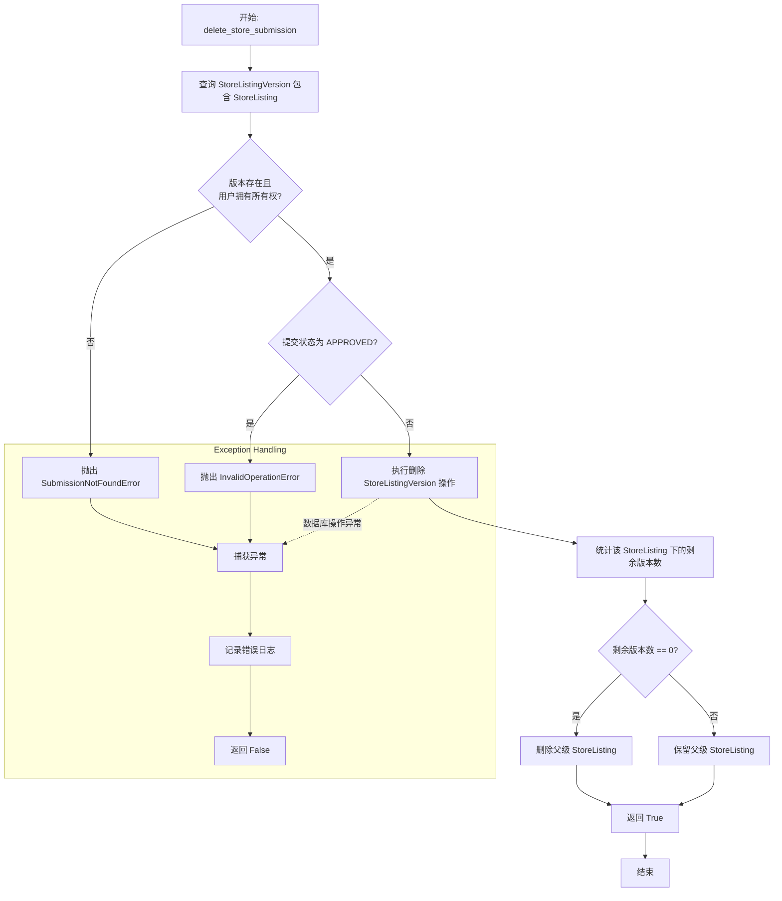
```mermaid
flowchart TD
    A[开始: delete_store_submission] --> B[查询 StoreListingVersion 包含 StoreListing]
    B --> C{版本存在且\n用户拥有所有权?}
    C -- 否 --> D[抛出 SubmissionNotFoundError]
    C -- 是 --> E{提交状态为 APPROVED?}
    E -- 是 --> F[抛出 InvalidOperationError]
    E -- 否 --> G[执行删除 StoreListingVersion 操作]
    G --> H[统计该 StoreListing 下的剩余版本数]
    H --> I{剩余版本数 == 0?}
    I -- 是 --> J[删除父级 StoreListing]
    I -- 否 --> K[保留父级 StoreListing]
    J --> L[返回 True]
    K --> L
    L --> M[结束]
    
    subgraph Exception Handling
        D --> N[捕获异常]
        F --> N
        G -.->|数据库操作异常| N
        N --> O[记录错误日志]
        O --> P[返回 False]
    end
```

#### 带注释源码

```python
async def delete_store_submission(
    user_id: str,
    submission_id: str,
) -> bool:
    """
    Delete a store submission version as the submitting user.

    Args:
        user_id: ID of the authenticated user
        submission_id: StoreListingVersion ID to delete

    Returns:
        bool: True if successfully deleted
    """
    try:
        # Find the submission version with ownership check
        # 查找提交版本并包含关联的 StoreListing 信息以验证所有权
        version = await prisma.models.StoreListingVersion.prisma().find_first(
            where={"id": submission_id}, include={"StoreListing": True}
        )

        # 验证版本是否存在，关联的 StoreListing 是否存在，以及当前用户是否为拥有者
        if (
            not version
            or not version.StoreListing
            or version.StoreListing.owningUserId != user_id
        ):
            raise store_exceptions.SubmissionNotFoundError("Submission not found")

        # Prevent deletion of approved submissions
        # 防止删除已批准的提交，以保护已发布内容的完整性
        if version.submissionStatus == prisma.enums.SubmissionStatus.APPROVED:
            raise store_exceptions.InvalidOperationError(
                "Cannot delete approved submissions"
            )

        # Delete the version
        # 执行删除版本操作
        await prisma.models.StoreListingVersion.prisma().delete(
            where={"id": version.id}
        )

        # Clean up empty listing if this was the last version
        # 如果这是该列表下的最后一个版本，则清理（删除）父级 StoreListing
        remaining = await prisma.models.StoreListingVersion.prisma().count(
            where={"storeListingId": version.storeListingId}
        )
        if remaining == 0:
            await prisma.models.StoreListing.prisma().delete(
                where={"id": version.storeListingId}
            )

        return True

    except Exception as e:
        # 记录错误并返回 False，而不是直接抛出异常，以保证接口调用的稳定性
        logger.error(f"Error deleting store submission: {e}")
        return False
```


### `create_store_submission`

创建首次（也是唯一的）商店列表及提交记录。如果该代理的商店列表已存在，则委托给 `create_store_version` 创建新版本。该函数会验证代理归属权，处理 URL slug 的清洗，并处理数据库唯一性约束冲突。

参数：

- `user_id`：`str`，提交列表的已认证用户 ID。
- `agent_id`：`str`，正在提交的代理 ID。
- `agent_version`：`int`，正在提交的代理版本。
- `slug`：`str`，列表的 URL slug。
- `name`：`str`，代理的名称。
- `video_url`：`str | None`，可选的视频演示 URL。
- `agent_output_demo_url`：`str | None`，可选的代理输出演示 URL。
- `image_urls`：`list[str]`，列表的图片 URL 列表。
- `description`：`str`，代理的描述。
- `instructions`：`str | None`，代理的指令。
- `sub_heading`：`str`，代理的可选副标题。
- `categories`：`list[str]`，代理的类别列表。
- `changes_summary`：`str | None`，此提交中所做更改的摘要。
- `recommended_schedule_cron`：`str | None`，推荐的 Cron 调度计划。

返回值：`store_model.StoreSubmission`，创建的商店提交记录。

#### 流程图

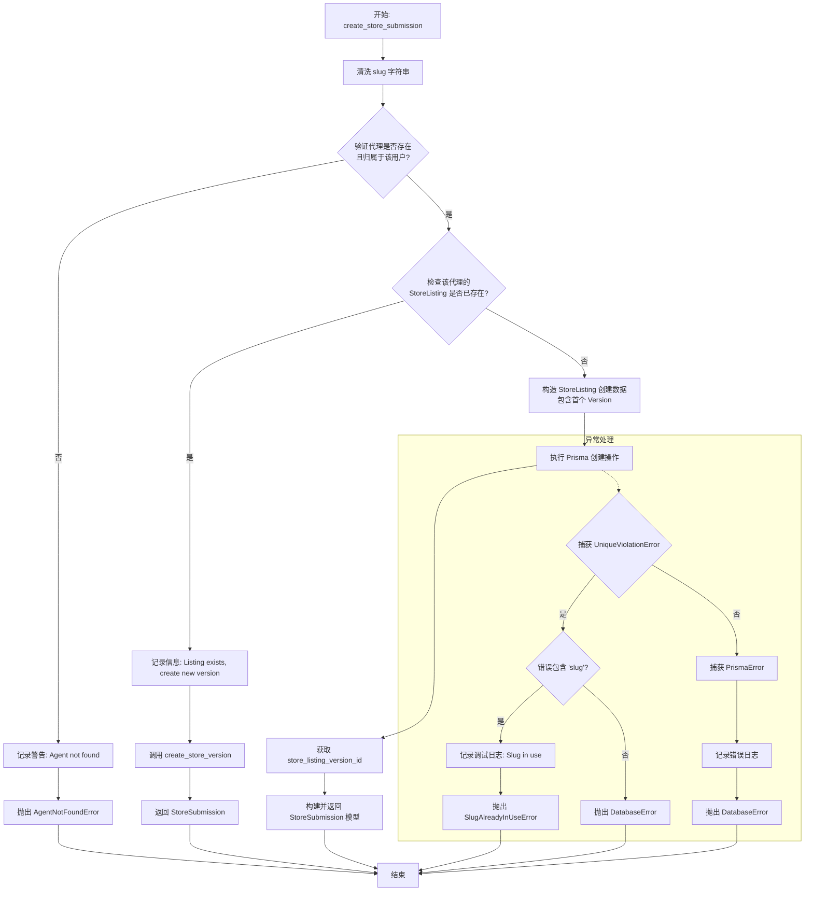
```mermaid
flowchart TD
    A[开始: create_store_submission] --> B[清洗 slug 字符串]
    B --> C{验证代理是否存在<br/>且归属于该用户?}
    C -- 否 --> D[记录警告: Agent not found]
    D --> E[抛出 AgentNotFoundError]
    C -- 是 --> F{检查该代理的<br/>StoreListing 是否已存在?}
    F -- 是 --> G[记录信息: Listing exists, create new version]
    G --> H[调用 create_store_version]
    H --> I[返回 StoreSubmission]
    F -- 否 --> J[构造 StoreListing 创建数据<br/>包含首个 Version]
    J --> K[执行 Prisma 创建操作]
    K --> L[获取 store_listing_version_id]
    L --> M[构建并返回 StoreSubmission 模型]
    
    subgraph 异常处理
    K -.-> N{捕获 UniqueViolationError}
    N -- 是 --> O{错误包含 'slug'?}
    O -- 是 --> P[记录调试日志: Slug in use]
    P --> Q[抛出 SlugAlreadyInUseError]
    O -- 否 --> R[抛出 DatabaseError]
    N -- 否 --> S[捕获 PrismaError]
    S --> T[记录错误日志]
    T --> U[抛出 DatabaseError]
    end
    
    E --> End[结束]
    I --> End
    M --> End
    Q --> End
    R --> End
    U --> End
```

#### 带注释源码

```python
async def create_store_submission(
    user_id: str,
    agent_id: str,
    agent_version: int,
    slug: str,
    name: str,
    video_url: str | None = None,
    agent_output_demo_url: str | None = None,
    image_urls: list[str] = [],
    description: str = "",
    instructions: str | None = None,
    sub_heading: str = "",
    categories: list[str] = [],
    changes_summary: str | None = "Initial Submission",
    recommended_schedule_cron: str | None = None,
) -> store_model.StoreSubmission:
    """
    Create the first (and only) store listing and thus submission as a normal user

    Args:
        user_id: ID of the authenticated user submitting the listing
        agent_id: ID of the agent being submitted
        agent_version: Version of the agent being submitted
        slug: URL slug for the listing
        name: Name of the agent
        video_url: Optional URL to video demo
        image_urls: List of image URLs for the listing
        description: Description of the agent
        sub_heading: Optional sub-heading for the agent
        categories: List of categories for the agent
        changes_summary: Summary of changes made in this submission

    Returns:
        StoreSubmission: The created store submission
    """
    logger.debug(
        f"Creating store submission for user {user_id}, agent {agent_id} v{agent_version}"
    )

    try:
        # 清洗 slug，仅允许字母、数字和连字符
        slug = "".join(
            c if c.isalpha() or c == "-" or c.isnumeric() else "" for c in slug
        ).lower()

        # 首先验证代理属于该用户
        agent = await prisma.models.AgentGraph.prisma().find_first(
            where=prisma.types.AgentGraphWhereInput(
                id=agent_id, version=agent_version, userId=user_id
            )
        )

        if not agent:
            logger.warning(
                f"Agent not found for user {user_id}: {agent_id} v{agent_version}"
            )
            # 如果 agent_id 为空，提供更友好的错误提示
            if not agent_id or agent_id.strip() == "":
                raise store_exceptions.AgentNotFoundError(
                    "No agent selected. Please select an agent before submitting to the store."
                )
            else:
                raise store_exceptions.AgentNotFoundError(
                    f"Agent not found for this user. User ID: {user_id}, Agent ID: {agent_id}, Version: {agent_version}"
                )

        # 检查该代理是否已有商店列表
        existing_listing = await prisma.models.StoreListing.prisma().find_first(
            where=prisma.types.StoreListingWhereInput(
                agentGraphId=agent_id, owningUserId=user_id
            )
        )

        if existing_listing is not None:
            logger.info(
                f"Listing already exists for agent {agent_id}, creating new version instead"
            )

            # 委托给 create_store_version 处理已存在列表的情况
            return await create_store_version(
                user_id=user_id,
                agent_id=agent_id,
                agent_version=agent_version,
                store_listing_id=existing_listing.id,
                name=name,
                video_url=video_url,
                image_urls=image_urls,
                description=description,
                instructions=instructions,
                sub_heading=sub_heading,
                categories=categories,
                changes_summary=changes_summary,
            )

        # 如果没有现有列表，创建一个新的
        data = prisma.types.StoreListingCreateInput(
            slug=slug,
            agentGraphId=agent_id,
            agentGraphVersion=agent_version,
            owningUserId=user_id,
            createdAt=datetime.now(tz=timezone.utc),
            Versions={
                "create": [
                    prisma.types.StoreListingVersionCreateInput(
                        agentGraphId=agent_id,
                        agentGraphVersion=agent_version,
                        name=name,
                        videoUrl=video_url,
                        agentOutputDemoUrl=agent_output_demo_url,
                        imageUrls=image_urls,
                        description=description,
                        instructions=instructions,
                        categories=categories,
                        subHeading=sub_heading,
                        submissionStatus=prisma.enums.SubmissionStatus.PENDING,
                        submittedAt=datetime.now(tz=timezone.utc),
                        changesSummary=changes_summary,
                        recommendedScheduleCron=recommended_schedule_cron,
                    )
                ]
            },
        )
        listing = await prisma.models.StoreListing.prisma().create(
            data=data,
            include=prisma.types.StoreListingInclude(Versions=True),
        )

        store_listing_version_id = (
            listing.Versions[0].id
            if listing.Versions is not None and len(listing.Versions) > 0
            else None
        )

        logger.debug(f"Created store listing for agent {agent_id}")
        # 返回提交详情
        return store_model.StoreSubmission(
            listing_id=listing.id,
            agent_id=agent_id,
            agent_version=agent_version,
            name=name,
            slug=slug,
            sub_heading=sub_heading,
            description=description,
            instructions=instructions,
            image_urls=image_urls,
            date_submitted=listing.createdAt,
            status=prisma.enums.SubmissionStatus.PENDING,
            runs=0,
            rating=0.0,
            store_listing_version_id=store_listing_version_id,
            changes_summary=changes_summary,
        )
    except prisma.errors.UniqueViolationError as exc:
        # 尝试检查错误是否由 slug 字段的唯一性引起
        error_str = str(exc)
        if "slug" in error_str.lower():
            logger.debug(
                f"Slug '{slug}' is already in use by another agent (agent_id: {agent_id}) for user {user_id}"
            )
            raise store_exceptions.SlugAlreadyInUseError(
                f"The URL slug '{slug}' is already in use by another one of your agents. Please choose a different slug."
            ) from exc
        else:
            # 对于其他唯一性违规，重新抛出通用数据库错误
            raise DatabaseError(
                f"Unique constraint violated (not slug): {error_str}"
            ) from exc
    except (
        store_exceptions.AgentNotFoundError,
        store_exceptions.ListingExistsError,
    ):
        raise
    except prisma.errors.PrismaError as e:
        logger.error(f"Database error creating store submission: {e}")
        raise DatabaseError("Failed to create store submission") from e
```


### `edit_store_submission`

编辑现有的商店列表提交。该函数仅允许编辑状态为 PENDING（待审核）的提交，并验证用户是否拥有该提交。它直接更新数据库中的版本记录，并返回更新后的提交详情对象。

参数：

-  `user_id`：`str`，执行编辑操作的用户ID。
-  `store_listing_version_id`：`str`，待编辑的商店列表版本的ID。
-  `name`：`str`，Agent的名称。
-  `video_url`：`str | None`，可选，演示视频的URL。
-  `agent_output_demo_url`：`str | None`，可选，Agent输出演示的URL。
-  `image_urls`：`list[str]`，商店列表的图片URL列表。
-  `description`：`str`，Agent的描述信息。
-  `sub_heading`：`str`，Agent的副标题。
-  `categories`：`list[str]`，Agent所属的类别列表。
-  `changes_summary`：`str | None`，本次提交的变更摘要，默认为"Update submission"。
-  `recommended_schedule_cron`：`str | None`，推荐的执行计划Cron表达式。
-  `instructions`：`str | None`，Agent的指令。

返回值：`store_model.StoreSubmission`，更新后的商店提交对象。

#### 流程图

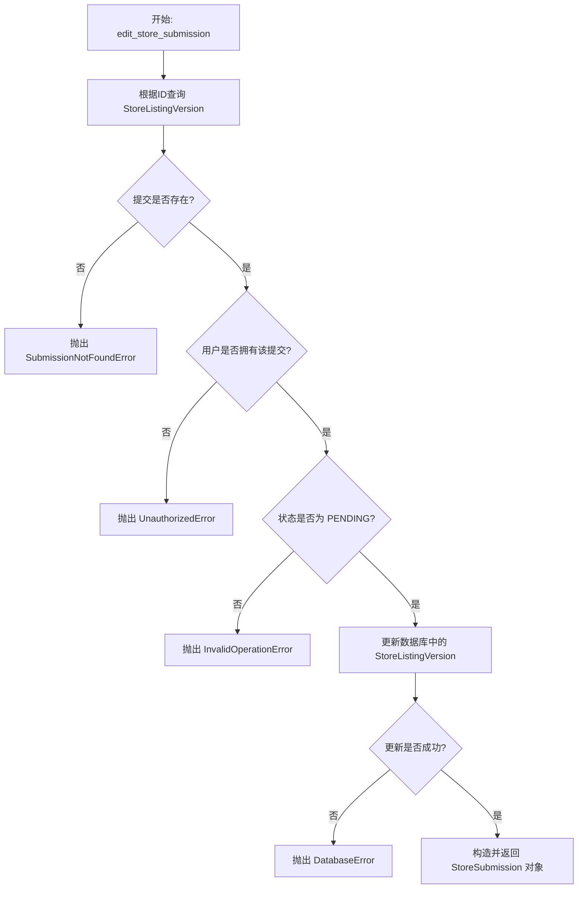
```mermaid
graph TD
    A[开始: edit_store_submission] --> B[根据ID查询 StoreListingVersion]
    B --> C{提交是否存在?}
    C -- 否 --> D[抛出 SubmissionNotFoundError]
    C -- 是 --> E{用户是否拥有该提交?}
    E -- 否 --> F[抛出 UnauthorizedError]
    E -- 是 --> G{状态是否为 PENDING?}
    G -- 否 --> H[抛出 InvalidOperationError]
    G -- 是 --> I[更新数据库中的 StoreListingVersion]
    I --> J{更新是否成功?}
    J -- 否 --> K[抛出 DatabaseError]
    J -- 是 --> L[构造并返回 StoreSubmission 对象]
```

#### 带注释源码

```python
async def edit_store_submission(
    user_id: str,
    store_listing_version_id: str,
    name: str,
    video_url: str | None = None,
    agent_output_demo_url: str | None = None,
    image_urls: list[str] = [],
    description: str = "",
    sub_heading: str = "",
    categories: list[str] = [],
    changes_summary: str | None = "Update submission",
    recommended_schedule_cron: str | None = None,
    instructions: str | None = None,
) -> store_model.StoreSubmission:
    """
    Edit an existing store listing submission.

    Args:
        user_id: ID of the authenticated user editing the submission
        store_listing_version_id: ID of the store listing version to edit
        agent_id: ID of the agent being submitted
        agent_version: Version of the agent being submitted
        slug: URL slug for the listing (only changeable for PENDING submissions)
        name: Name of the agent
        video_url: Optional URL to video demo
        image_urls: List of image URLs for the listing
        description: Description of the agent
        sub_heading: Optional sub-heading for the agent
        categories: List of categories for the agent
        changes_summary: Summary of changes made in this submission

    Returns:
        StoreSubmission: The updated store submission

    Raises:
        SubmissionNotFoundError: If the submission is not found
        UnauthorizedError: If the user doesn't own the submission
        InvalidOperationError: If trying to edit a submission that can't be edited
    """
    try:
        # 获取当前版本并包含 StoreListing 信息以验证所有权
        current_version = await prisma.models.StoreListingVersion.prisma().find_first(
            where=prisma.types.StoreListingVersionWhereInput(
                id=store_listing_version_id
            ),
            include={
                "StoreListing": {
                    "include": {
                        "Versions": {"order_by": {"version": "desc"}, "take": 1}
                    }
                }
            },
        )

        # 检查提交是否存在
        if not current_version:
            raise store_exceptions.SubmissionNotFoundError(
                f"Store listing version not found: {store_listing_version_id}"
            )

        # 验证用户是否拥有此提交
        if (
            not current_version.StoreListing
            or current_version.StoreListing.owningUserId != user_id
        ):
            raise store_exceptions.UnauthorizedError(
                f"User {user_id} does not own submission {store_listing_version_id}"
            )

        # Currently we are not allowing user to update the agent associated with a submission
        # If we allow it in future, then we need a check here to verify the agent belongs to this user.

        # 仅允许编辑 PENDING 状态的提交
        if current_version.submissionStatus != prisma.enums.SubmissionStatus.PENDING:
            raise store_exceptions.InvalidOperationError(
                f"Cannot edit a {current_version.submissionStatus.value.lower()} submission. Only pending submissions can be edited."
            )

        # 对于 PENDING 状态的提交，直接更新现有版本
        updated_version = await prisma.models.StoreListingVersion.prisma().update(
            where={"id": store_listing_version_id},
            data=prisma.types.StoreListingVersionUpdateInput(
                name=name,
                videoUrl=video_url,
                agentOutputDemoUrl=agent_output_demo_url,
                imageUrls=image_urls,
                description=description,
                categories=categories,
                subHeading=sub_heading,
                changesSummary=changes_summary,
                recommendedScheduleCron=recommended_schedule_cron,
                instructions=instructions,
            ),
        )

        logger.debug(
            f"Updated existing version {store_listing_version_id} for agent {current_version.agentGraphId}"
        )

        if not updated_version:
            raise DatabaseError("Failed to update store listing version")
        # 构造并返回更新后的提交对象
        return store_model.StoreSubmission(
            listing_id=current_version.StoreListing.id,
            agent_id=current_version.agentGraphId,
            agent_version=current_version.agentGraphVersion,
            name=name,
            sub_heading=sub_heading,
            slug=current_version.StoreListing.slug,
            description=description,
            instructions=instructions,
            image_urls=image_urls,
            date_submitted=updated_version.submittedAt or updated_version.createdAt,
            status=updated_version.submissionStatus,
            runs=0,
            rating=0.0,
            store_listing_version_id=updated_version.id,
            changes_summary=changes_summary,
            video_url=video_url,
            categories=categories,
            version=updated_version.version,
        )

    except (
        store_exceptions.SubmissionNotFoundError,
        store_exceptions.UnauthorizedError,
        store_exceptions.AgentNotFoundError,
        store_exceptions.ListingExistsError,
        store_exceptions.InvalidOperationError,
    ):
        raise
    except prisma.errors.PrismaError as e:
        logger.error(f"Database error editing store submission: {e}")
        raise DatabaseError("Failed to edit store submission") from e
```


### `create_store_version`

创建一个新的商店列表版本。此函数负责为已存在的商店列表提交新版本，包括验证所有权、处理待审核的替换提交、原子性地更新数据库中的版本号以及创建新的提交记录。

参数：

- `user_id`：`str`，认证用户的ID，用于验证所有权。
- `agent_id`：`str`，被提交的代理的ID。
- `agent_version`：`int`，被提交的代理版本号。
- `store_listing_id`：`str`，现有商店列表的ID。
- `name`：`str`，代理的名称。
- `video_url`：`str | None`，可选，视频演示的URL。
- `agent_output_demo_url`：`str | None`，可选，代理输出演示的URL。
- `image_urls`：`list[str]`，列表图片的URL列表。
- `description`：`str`，代理的描述信息。
- `instructions`：`str | None`，代理的指令信息。
- `sub_heading`：`str`，代理的副标题。
- `categories`：`list[str]`，代理所属的类别列表。
- `changes_summary`：`str | None`，版本变更摘要，默认为"Initial submission"。
- `recommended_schedule_cron`：`str | None`，推荐的Cron调度表达式。

返回值：`store_model.StoreSubmission`，创建的商店提交详情对象。

#### 流程图

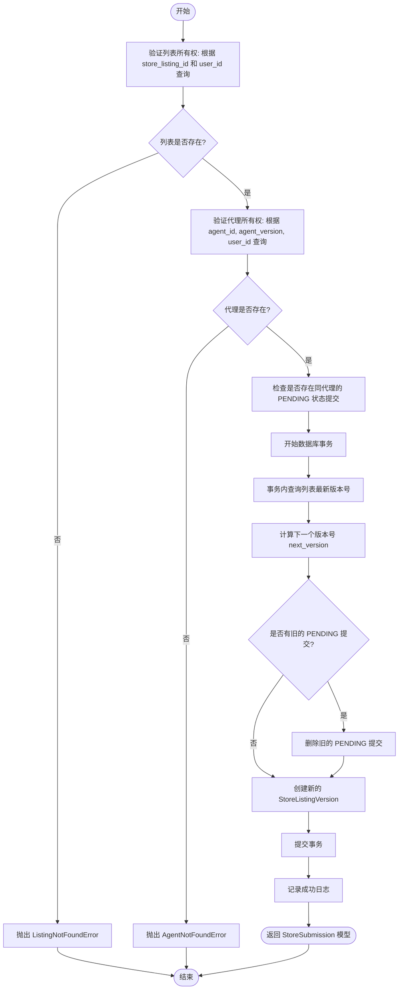
```mermaid
flowchart TD
    Start([开始]) --> VerifyListing[验证列表所有权: 根据 store_listing_id 和 user_id 查询]
    VerifyListing --> ListingFound{列表是否存在?}
    ListingFound -- 否 --> RaiseListingError[抛出 ListingNotFoundError]
    ListingFound -- 是 --> VerifyAgent[验证代理所有权: 根据 agent_id, agent_version, user_id 查询]
    
    VerifyAgent --> AgentFound{代理是否存在?}
    AgentFound -- 否 --> RaiseAgentError[抛出 AgentNotFoundError]
    AgentFound -- 是 --> CheckPending[检查是否存在同代理的 PENDING 状态提交]
    
    CheckPending --> StartTransaction[开始数据库事务]
    StartTransaction --> FetchLatestVersion[事务内查询列表最新版本号]
    FetchLatestVersion --> CalcVersion[计算下一个版本号 next_version]
    
    CalcVersion --> HasPending{是否有旧的 PENDING 提交?}
    HasPending -- 是 --> DeletePending[删除旧的 PENDING 提交]
    HasPending -- 否 --> CreateNewVersion
    DeletePending --> CreateNewVersion[创建新的 StoreListingVersion]
    
    CreateNewVersion --> CommitTransaction[提交事务]
    CommitTransaction --> LogSuccess[记录成功日志]
    LogSuccess --> ReturnModel([返回 StoreSubmission 模型])
    
    RaiseListingError --> End([结束])
    RaiseAgentError --> End
    ReturnModel --> End
```

#### 带注释源码

```python
async def create_store_version(
    user_id: str,
    agent_id: str,
    agent_version: int,
    store_listing_id: str,
    name: str,
    video_url: str | None = None,
    agent_output_demo_url: str | None = None,
    image_urls: list[str] = [],
    description: str = "",
    instructions: str | None = None,
    sub_heading: str = "",
    categories: list[str] = [],
    changes_summary: str | None = "Initial submission",
    recommended_schedule_cron: str | None = None,
) -> store_model.StoreSubmission:
    """
    Create a new version for an existing store listing

    Args:
        user_id: ID of the authenticated user submitting the version
        agent_id: ID of the agent being submitted
        agent_version: Version of the agent being submitted
        store_listing_id: ID of the existing store listing
        name: Name of the agent
        video_url: Optional URL to video demo
        image_urls: List of image URLs for the listing
        description: Description of the agent
        categories: List of categories for the agent
        changes_summary: Summary of changes from the previous version

    Returns:
        StoreSubmission: The created store submission
    """
    # 记录调试日志，表明开始创建新版本
    logger.debug(
        f"Creating new version for store listing {store_listing_id} for user {user_id}, agent {agent_id} v{agent_version}"
    )

    try:
        # 1. 验证列表所有权：检查 store_listing_id 是否属于 user_id
        listing = await prisma.models.StoreListing.prisma().find_first(
            where=prisma.types.StoreListingWhereInput(
                id=store_listing_id, owningUserId=user_id
            ),
            include={"Versions": {"order_by": {"version": "desc"}, "take": 1}},
        )

        if not listing:
            raise store_exceptions.ListingNotFoundError(
                f"Store listing not found. User ID: {user_id}, Listing ID: {store_listing_id}"
            )

        # 2. 验证代理所有权：检查 agent_id 和版本是否属于 user_id
        agent = await prisma.models.AgentGraph.prisma().find_first(
            where=prisma.types.AgentGraphWhereInput(
                id=agent_id, version=agent_version, userId=user_id
            )
        )

        if not agent:
            raise store_exceptions.AgentNotFoundError(
                f"Agent not found for this user. User ID: {user_id}, Agent ID: {agent_id}, Version: {agent_version}"
            )

        # 3. 检查是否已存在针对此代理的 PENDING（待审核）提交
        # 如果存在，后续需要在事务中将其删除，以避免重复的待审核记录
        existing_pending_submission = (
            await prisma.models.StoreListingVersion.prisma().find_first(
                where=prisma.types.StoreListingVersionWhereInput(
                    storeListingId=store_listing_id,
                    agentGraphId=agent_id,
                    submissionStatus=prisma.enums.SubmissionStatus.PENDING,
                    isDeleted=False,
                )
            )
        )

        # 4. 处理现有待审核提交并原子性地创建新版本
        async with transaction() as tx:
            # 在事务内重新获取最新版本号，防止并发问题
            latest_listing = await prisma.models.StoreListing.prisma(tx).find_first(
                where=prisma.types.StoreListingWhereInput(
                    id=store_listing_id, owningUserId=user_id
                ),
                include={"Versions": {"order_by": {"version": "desc"}, "take": 1}},
            )

            if not latest_listing:
                raise store_exceptions.ListingNotFoundError(
                    f"Store listing not found. User ID: {user_id}, Listing ID: {store_listing_id}"
                )

            latest_version = (
                latest_listing.Versions[0] if latest_listing.Versions else None
            )
            # 计算下一个版本号：如果有历史版本则+1，否则设为1
            next_version = (latest_version.version + 1) if latest_version else 1

            # 如果之前发现有待审核的提交，在事务中将其删除
            if existing_pending_submission:
                logger.info(
                    f"Found existing PENDING submission for agent {agent_id} (was v{existing_pending_submission.agentGraphVersion}, now v{agent_version}), replacing existing submission instead of creating duplicate"
                )
                await prisma.models.StoreListingVersion.prisma(tx).delete(
                    where={"id": existing_pending_submission.id}
                )
                logger.debug(
                    f"Deleted existing pending submission {existing_pending_submission.id}"
                )

            # 5. 创建新的 StoreListingVersion
            new_version = await prisma.models.StoreListingVersion.prisma(tx).create(
                data=prisma.types.StoreListingVersionCreateInput(
                    version=next_version,
                    agentGraphId=agent_id,
                    agentGraphVersion=agent_version,
                    name=name,
                    videoUrl=video_url,
                    agentOutputDemoUrl=agent_output_demo_url,
                    imageUrls=image_urls,
                    description=description,
                    instructions=instructions,
                    categories=categories,
                    subHeading=sub_heading,
                    submissionStatus=prisma.enums.SubmissionStatus.PENDING, # 新版本默认为 PENDING
                    submittedAt=datetime.now(),
                    changesSummary=changes_summary,
                    recommendedScheduleCron=recommended_schedule_cron,
                    storeListingId=store_listing_id,
                )
            )

        logger.debug(
            f"Created new version for listing {store_listing_id} of agent {agent_id}"
        )
        
        # 6. 返回创建的提交详情模型
        return store_model.StoreSubmission(
            listing_id=listing.id,
            agent_id=agent_id,
            agent_version=agent_version,
            name=name,
            slug=listing.slug,
            sub_heading=sub_heading,
            description=description,
            instructions=instructions,
            image_urls=image_urls,
            date_submitted=datetime.now(),
            status=prisma.enums.SubmissionStatus.PENDING,
            runs=0,
            rating=0.0,
            store_listing_version_id=new_version.id,
            changes_summary=changes_summary,
            version=next_version,
        )

    # 捕获数据库异常并转换为自定义异常
    except prisma.errors.PrismaError as e:
        raise DatabaseError("Failed to create new store version") from e
```


### `create_store_review`

为特定的商店列表版本创建或更新一条用户评论。该函数使用数据库的 Upsert（更新或插入）操作，基于用户ID和商店列表版本ID的唯一约束，确保每个用户对同一个版本只能有一条有效的评论记录，如果已存在则更新评分和评论内容。

参数：

- `user_id`：`str`，提交评论的用户ID
- `store_listing_version_id`：`str`，被评论的商店列表版本ID
- `score`：`int`，用户给出的评分
- `comments`：`str | None`，用户提供的评论内容，可选

返回值：`store_model.StoreReview`，包含评分和评论内容的返回模型

#### 流程图

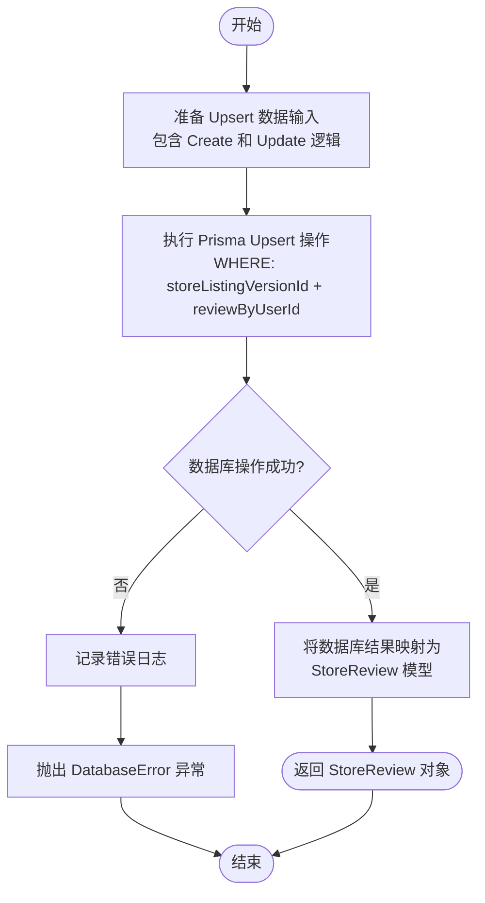
```mermaid
flowchart TD
    Start([开始]) --> PrepareUpsert[准备 Upsert 数据输入<br/>包含 Create 和 Update 逻辑]
    PrepareUpsert --> ExecuteUpsert[执行 Prisma Upsert 操作<br/>WHERE: storeListingVersionId + reviewByUserId]
    ExecuteUpsert --> CheckError{数据库操作成功?}
    CheckError -->|是| MapModel[将数据库结果映射为<br/>StoreReview 模型]
    CheckError -->|否| LogError[记录错误日志]
    LogError --> RaiseDBError[抛出 DatabaseError 异常]
    MapModel --> ReturnSuccess([返回 StoreReview 对象])
    RaiseDBError --> End([结束])
    ReturnSuccess --> End
```

#### 带注释源码

```python
async def create_store_review(
    user_id: str,
    store_listing_version_id: str,
    score: int,
    comments: str | None = None,
) -> store_model.StoreReview:
    """Create a review for a store listing as a user to detail their experience"""
    try:
        # 准备 Upsert 数据结构
        # 如果记录存在，则更新分数和评论
        data = prisma.types.StoreListingReviewUpsertInput(
            update=prisma.types.StoreListingReviewUpdateInput(
                score=score,
                comments=comments,
            ),
            # 如果记录不存在，则使用此数据创建新记录
            create=prisma.types.StoreListingReviewCreateInput(
                reviewByUserId=user_id,
                storeListingVersionId=store_listing_version_id,
                score=score,
                comments=comments,
            ),
        )
        
        # 执行数据库 Upsert 操作
        # where 条件基于唯一约束：用户ID + 商店列表版本ID
        review = await prisma.models.StoreListingReview.prisma().upsert(
            where={
                "storeListingVersionId_reviewByUserId": {
                    "storeListingVersionId": store_listing_version_id,
                    "reviewByUserId": user_id,
                }
            },
            data=data,
        )

        # 将数据库返回的对象转换为应用层的 StoreReview 模型
        return store_model.StoreReview(
            score=review.score,
            comments=review.comments,
        )

    except prisma.errors.PrismaError as e:
        # 捕获数据库错误，记录日志并抛出统一的 DatabaseError
        logger.error(f"Database error creating store review: {e}")
        raise DatabaseError("Failed to create store review") from e
```


### `get_user_profile`

根据提供的用户ID从数据库中检索用户的详细资料信息，如果找不到则返回空。

参数：

-  `user_id`：`str`，需要查询资料的用户ID

返回值：`store_model.ProfileDetails | None`，返回用户的详细资料对象，如果未找到则返回 None。

#### 流程图

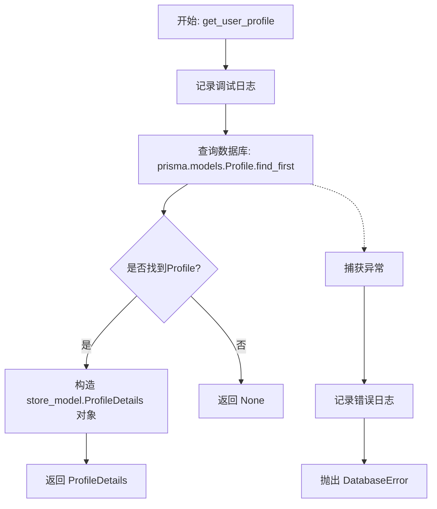
```mermaid
flowchart TD
    A[开始: get_user_profile] --> B[记录调试日志]
    B --> C[查询数据库: prisma.models.Profile.find_first]
    C --> D{是否找到Profile?}
    D -- 是 --> E[构造 store_model.ProfileDetails 对象]
    E --> F[返回 ProfileDetails]
    D -- 否 --> G[返回 None]
    C -.-> H[捕获异常]
    H --> I[记录错误日志]
    I --> J[抛出 DatabaseError]
```

#### 带注释源码

```python
async def get_user_profile(
    user_id: str,
) -> store_model.ProfileDetails | None:
    # 记录调试日志，表示开始获取指定用户ID的资料
    logger.debug(f"Getting user profile for {user_id}")

    try:
        # 使用Prisma客户端根据user_id查找第一条匹配的Profile记录
        profile = await prisma.models.Profile.prisma().find_first(
            where={"userId": user_id}
        )

        # 如果未找到记录，直接返回None
        if not profile:
            return None
        
        # 如果找到记录，将数据库模型转换为API响应模型 store_model.ProfileDetails
        return store_model.ProfileDetails(
            name=profile.name,
            username=profile.username,
            description=profile.description,
            links=profile.links,
            avatar_url=profile.avatarUrl,
        )
    except Exception as e:
        # 捕获异常并记录错误日志
        logger.error(f"Error getting user profile: {e}")
        # 将底层异常包装为自定义的 DatabaseError 并抛出
        raise DatabaseError("Failed to get user profile") from e
```


### `update_profile`

更新指定用户的商店配置文件资料，验证用户所有权，清洗用户名数据，并将更改持久化到数据库。

参数：

- `user_id`：`str`，经过身份验证的用户 ID，用于定位和验证所有权。
- `profile`：`store_model.Profile`，包含更新后的配置文件详细信息的对象（如姓名、用户名、描述、链接、头像）。

返回值：`store_model.CreatorDetails`，更新后的配置文件详细信息对象，包含姓名、用户名、描述、链接和头像等字段，统计字段（如评分、运行次数）在此次返回中默认为 0。

#### 流程图

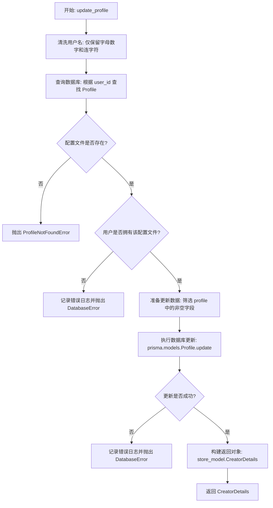
```mermaid
flowchart TD
    A[开始: update_profile] --> B[清洗用户名: 仅保留字母数字和连字符]
    B --> C[查询数据库: 根据 user_id 查找 Profile]
    C --> D{配置文件是否存在?}
    D -- 否 --> E[抛出 ProfileNotFoundError]
    D -- 是 --> F{用户是否拥有该配置文件?}
    F -- 否 --> G[记录错误日志并抛出 DatabaseError]
    F -- 是 --> H[准备更新数据: 筛选 profile 中的非空字段]
    H --> I[执行数据库更新: prisma.models.Profile.update]
    I --> J{更新是否成功?}
    J -- 否 --> K[记录错误日志并抛出 DatabaseError]
    J -- 是 --> L[构建返回对象: store_model.CreatorDetails]
    L --> M[返回 CreatorDetails]
```

#### 带注释源码

```python
async def update_profile(
    user_id: str, profile: store_model.Profile
) -> store_model.CreatorDetails:
    """
    Update the store profile for a user or create a new one if it doesn't exist.
    Args:
        user_id: ID of the authenticated user
        profile: Updated profile details
    Returns:
        CreatorDetails: The updated or created profile details
    Raises:
        DatabaseError: If there's an issue updating or creating the profile
    """
    logger.info(f"Updating profile for user {user_id} with data: {profile}")
    try:
        # 数据清洗：仅允许字母、数字和连字符，并转换为小写
        username = "".join(
            c if c.isalpha() or c == "-" or c.isnumeric() else ""
            for c in profile.username
        ).lower()
        # 检查数据库中是否已存在该 user_id 对应的 profile
        existing_profile = await prisma.models.Profile.prisma().find_first(
            where={"userId": user_id}
        )
        if not existing_profile:
            # 如果不存在，抛出异常（注意：文档描述说会创建，但代码实际逻辑是抛错）
            raise store_exceptions.ProfileNotFoundError(
                f"Profile not found for user {user_id}. This should not be possible."
            )

        # 验证权限：确保当前 user_id 是该 profile 的所有者
        if existing_profile.userId != user_id:
            logger.error(
                f"Unauthorized update attempt for profile {existing_profile.id} by user {user_id}"
            )
            raise DatabaseError(
                f"Unauthorized update attempt for profile {existing_profile.id} by user {user_id}"
            )

        logger.debug(f"Updating existing profile for user {user_id}")
        # 准备更新数据字典，仅包含传入的非 None 字段
        update_data = {}
        if profile.name is not None:
            update_data["name"] = profile.name
        if profile.username is not None:
            # 使用清洗后的 username
            update_data["username"] = username
        if profile.description is not None:
            update_data["description"] = profile.description
        if profile.links is not None:
            update_data["links"] = profile.links
        if profile.avatar_url is not None:
            update_data["avatarUrl"] = profile.avatar_url

        # 执行更新操作
        updated_profile = await prisma.models.Profile.prisma().update(
            where={"id": existing_profile.id},
            data=prisma.types.ProfileUpdateInput(**update_data),
        )
        if updated_profile is None:
            logger.error(f"Failed to update profile for user {user_id}")
            raise DatabaseError("Failed to update profile")

        # 构建并返回 CreatorDetails 对象
        # 注意：此处 agent_rating, agent_runs, top_categories 被硬编码为默认值，
        # 因为 Profile 模型通常不直接包含这些聚合统计信息。
        return store_model.CreatorDetails(
            name=updated_profile.name,
            username=updated_profile.username,
            description=updated_profile.description,
            links=updated_profile.links,
            avatar_url=updated_profile.avatarUrl or "",
            agent_rating=0.0,
            agent_runs=0,
            top_categories=[],
        )

    except prisma.errors.PrismaError as e:
        logger.error(f"Database error updating profile: {e}")
        raise DatabaseError("Failed to update profile") from e
```


### `get_my_agents`

获取已认证用户的代理列表，具体查询条件为：用户拥有且未归档、未删除，且当前未在商店中以可用状态发布的代理（即草稿代理）。

参数：

-  `user_id`：`str`，已认证用户的唯一标识符
-  `page`：`int`，分页页码，默认为 1
-  `page_size`：`int`，每页显示的代理数量，默认为 20

返回值：`store_model.MyAgentsResponse`，包含用户代理列表及分页信息的响应对象。

#### 流程图

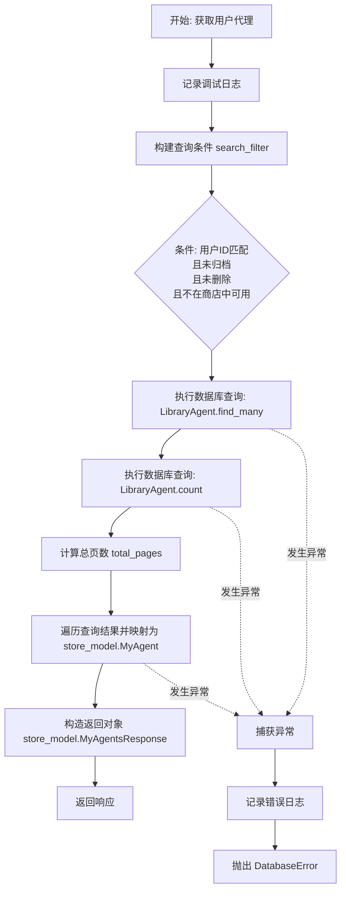
```mermaid
flowchart TD
    A[开始: 获取用户代理] --> B[记录调试日志]
    B --> C[构建查询条件 search_filter]
    C --> D{条件: 用户ID匹配<br/>且未归档<br/>且未删除<br/>且不在商店中可用}
    D --> E[执行数据库查询: LibraryAgent.find_many]
    E --> F[执行数据库查询: LibraryAgent.count]
    F --> G[计算总页数 total_pages]
    G --> H[遍历查询结果并映射为 store_model.MyAgent]
    H --> I[构造返回对象 store_model.MyAgentsResponse]
    I --> J[返回响应]
    
    E -.->|发生异常| K[捕获异常]
    F -.->|发生异常| K
    H -.->|发生异常| K
    K --> L[记录错误日志]
    L --> M[抛出 DatabaseError]
```

#### 带注释源码

```python
async def get_my_agents(
    user_id: str,
    page: int = 1,
    page_size: int = 20,
) -> store_model.MyAgentsResponse:
    """Get the agents for the authenticated user"""
    logger.debug(f"Getting my agents for user {user_id}, page={page}")

    try:
        # 构建查询过滤器
        # 1. userId 匹配传入的 user_id
        # 2. AgentGraph 不关联任何未删除且包含可用版本的 StoreListings
        #    (这意味着查询结果主要是尚未在商店发布的草稿代理)
        # 3. isArchived 为 False (未归档)
        # 4. isDeleted 为 False (未删除)
        search_filter: prisma.types.LibraryAgentWhereInput = {
            "userId": user_id,
            "AgentGraph": {
                "is": {
                    "StoreListings": {
                        "none": {
                            "isDeleted": False,
                            "Versions": {
                                "some": {
                                    "isAvailable": True,
                                }
                            },
                        }
                    }
                }
            },
            "isArchived": False,
            "isDeleted": False,
        }

        # 查询符合条件的 LibraryAgent 记录
        # 按更新时间倒序排列，包含关联的 AgentGraph 数据
        library_agents = await prisma.models.LibraryAgent.prisma().find_many(
            where=search_filter,
            order=[{"updatedAt": "desc"}],
            skip=(page - 1) * page_size,
            take=page_size,
            include={"AgentGraph": True},
        )

        # 获取符合条件的记录总数，用于分页计算
        total = await prisma.models.LibraryAgent.prisma().count(where=search_filter)
        total_pages = (total + page_size - 1) // page_size

        # 将数据库结果转换为前端所需的模型对象
        my_agents = [
            store_model.MyAgent(
                agent_id=graph.id,
                agent_version=graph.version,
                agent_name=graph.name or "",
                last_edited=graph.updatedAt or graph.createdAt,
                description=graph.description or "",
                agent_image=library_agent.imageUrl,
                recommended_schedule_cron=graph.recommendedScheduleCron,
            )
            for library_agent in library_agents
            if (graph := library_agent.AgentGraph)
        ]

        # 构造并返回包含分页信息的响应对象
        return store_model.MyAgentsResponse(
            agents=my_agents,
            pagination=store_model.Pagination(
                current_page=page,
                total_items=total,
                total_pages=total_pages,
                page_size=page_size,
            ),
        )
    except Exception as e:
        # 捕获异常，记录日志并抛出统一的数据库错误
        logger.error(f"Error getting my agents: {e}")
        raise DatabaseError("Failed to fetch my agents") from e
```


### `get_agent`

根据提供的商店列表版本ID获取对应的Agent图模型数据。

参数：

-  `store_listing_version_id`：`str`，商店列表版本的唯一标识符，用于定位特定的Agent提交版本。

返回值：`GraphModel`，包含Agent完整图结构数据的模型对象。

#### 流程图

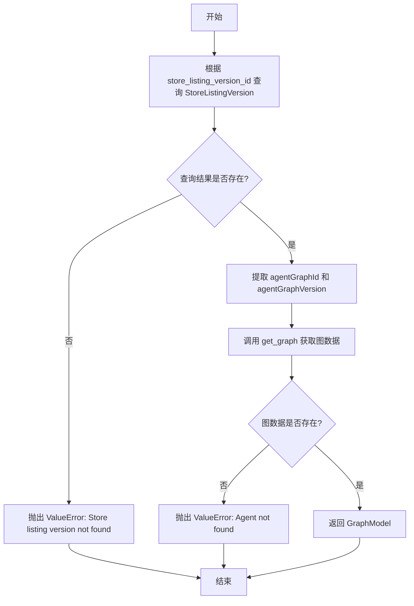
```mermaid
flowchart TD
    A[开始] --> B[根据 store_listing_version_id 查询 StoreListingVersion]
    B --> C{查询结果是否存在?}
    C -- 否 --> D[抛出 ValueError: Store listing version not found]
    C -- 是 --> E[提取 agentGraphId 和 agentGraphVersion]
    E --> F[调用 get_graph 获取图数据]
    F --> G{图数据是否存在?}
    G -- 否 --> H[抛出 ValueError: Agent not found]
    G -- 是 --> I[返回 GraphModel]
    D --> J[结束]
    H --> J
    I --> J
```

#### 带注释源码

```python
async def get_agent(store_listing_version_id: str) -> GraphModel:
    """Get agent using the version ID and store listing version ID."""
    # 1. 通过 Prisma 客户端根据 ID 查找商店列表版本记录
    store_listing_version = (
        await prisma.models.StoreListingVersion.prisma().find_unique(
            where={"id": store_listing_version_id}
        )
    )

    # 2. 如果未找到对应的版本记录，抛出 ValueError
    if not store_listing_version:
        raise ValueError(f"Store listing version {store_listing_version_id} not found")

    # 3. 使用检索到的 agentGraphId 和 agentGraphVersion 调用 get_graph
    # user_id=None 表示不需要特定用户上下文，for_export=True 表示为导出目的获取数据
    graph = await get_graph(
        graph_id=store_listing_version.agentGraphId,
        version=store_listing_version.agentGraphVersion,
        user_id=None,
        for_export=True,
    )

    # 4. 如果无法获取图数据（例如图已被删除），抛出 ValueError
    if not graph:
        raise ValueError(
            f"Agent {store_listing_version.agentGraphId} v{store_listing_version.agentGraphVersion} not found"
        )

    # 5. 返回获取到的 GraphModel 对象
    return graph
```


### `_approve_sub_agent`

Approve a single sub-agent by creating or updating store listings as needed within a database transaction. This function handles scenarios where no listing exists (creates one), an approved version already exists (no-op), a pending version exists (approves it), or a new version needs to be added.

参数：

-  `tx`：`Any`，Prisma 数据库事务客户端对象，用于在事务中执行数据库操作。
-  `sub_graph`：`prisma.models.AgentGraph`，待审批的子代理图数据模型，包含 ID 和版本信息。
-  `main_agent_name`：`str`，主代理的名称，用于生成子代理的描述信息。
-  `main_agent_version`：`int`，主代理的版本号，用于生成子代理的描述信息。
-  `main_agent_user_id`：`str`，主代理所有者的用户 ID，用于设定子代理商店列表的所有权。

返回值：`None`，无返回值。

#### 流程图

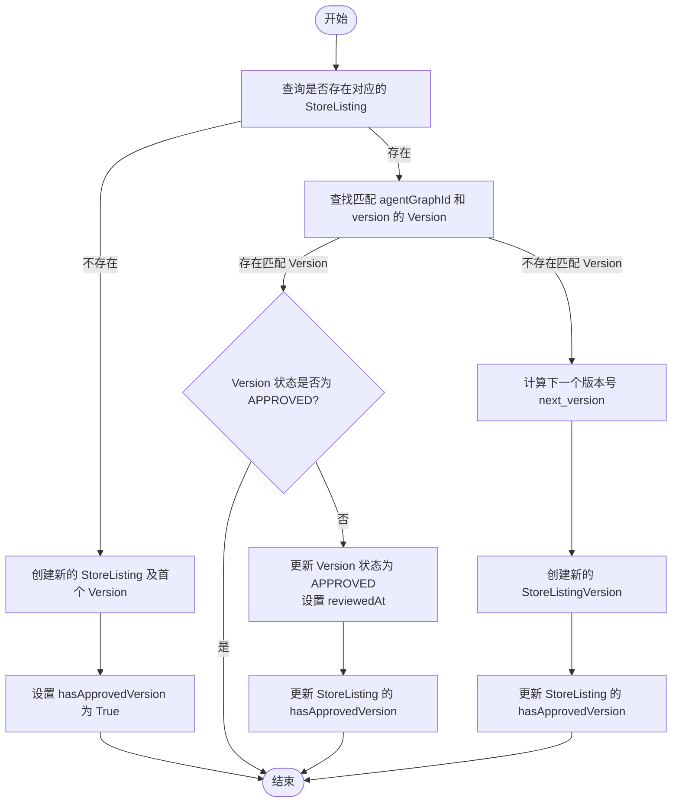
```mermaid
flowchart TD
    A([开始]) --> B[查询是否存在对应的 StoreListing]
    B -->|不存在| C[创建新的 StoreListing 及首个 Version]
    C --> D[设置 hasApprovedVersion 为 True]
    D --> Z([结束])
    B -->|存在| E[查找匹配 agentGraphId 和 version 的 Version]
    E -->|存在匹配 Version| F{Version 状态是否为 APPROVED?}
    F -->|是| Z
    F -->|否| G[更新 Version 状态为 APPROVED<br/>设置 reviewedAt]
    G --> H[更新 StoreListing 的 hasApprovedVersion]
    H --> Z
    E -->|不存在匹配 Version| I[计算下一个版本号 next_version]
    I --> J[创建新的 StoreListingVersion]
    J --> K[更新 StoreListing 的 hasApprovedVersion]
    K --> Z
```

#### 带注释源码

```python
async def _approve_sub_agent(
    tx,
    sub_graph: prisma.models.AgentGraph,
    main_agent_name: str,
    main_agent_version: int,
    main_agent_user_id: str,
) -> None:
    """Approve a single sub-agent by creating/updating store listings as needed"""
    # 构造子代理的标题信息
    heading = f"Sub-agent of {main_agent_name} v{main_agent_version}"

    # 查询该子代理（根据 agentGraphId）是否已存在商店列表（未被删除）
    listing = await prisma.models.StoreListing.prisma(tx).find_first(
        where={"agentGraphId": sub_graph.id, "isDeleted": False},
        include={"Versions": True},
    )

    # 情况 1：如果商店列表不存在，则创建一个新的列表和版本
    if not listing:
        await prisma.models.StoreListing.prisma(tx).create(
            data=prisma.types.StoreListingCreateInput(
                slug=f"sub-agent-{sub_graph.id[:8]}",  # 生成简短的 slug
                agentGraphId=sub_graph.id,
                agentGraphVersion=sub_graph.version,
                owningUserId=main_agent_user_id,      # 继承主代理的所有者
                hasApprovedVersion=True,               # 标记为已有批准版本
                Versions={
                    "create": [
                        _create_sub_agent_version_data(
                            sub_graph, heading, main_agent_name
                        )
                    ]
                },
            )
        )
        return

    # 情况 2：如果商店列表存在，检查是否有匹配当前子代理图 ID 和版本的记录
    matching_version = next(
        (
            v
            for v in listing.Versions or []
            if v.agentGraphId == sub_graph.id
            and v.agentGraphVersion == sub_graph.version
        ),
        None,
    )

    # 情况 2a：找到了匹配的版本
    if matching_version:
        # 如果已经是批准状态，则无需操作
        if matching_version.submissionStatus == prisma.enums.SubmissionStatus.APPROVED:
            return  # Already approved, nothing to do

        # 否则，更新该版本状态为批准，并记录审核时间
        await prisma.models.StoreListingVersion.prisma(tx).update(
            where={"id": matching_version.id},
            data={
                "submissionStatus": prisma.enums.SubmissionStatus.APPROVED,
                "reviewedAt": datetime.now(tz=timezone.utc),
            },
        )
        # 确保父列表标记为有批准版本
        await prisma.models.StoreListing.prisma(tx).update(
            where={"id": listing.id}, data={"hasApprovedVersion": True}
        )
        return

    # 情况 2b：未找到匹配的版本（属于同一个 Graph 但是新版本），需要创建新版本
    # 计算下一个版本号
    next_version = max((v.version for v in listing.Versions or []), default=0) + 1
    await prisma.models.StoreListingVersion.prisma(tx).create(
        data={
            **_create_sub_agent_version_data(sub_graph, heading, main_agent_name),
            "version": next_version,
            "storeListingId": listing.id,
        }
    )
    # 确保父列表标记为有批准版本
    await prisma.models.StoreListing.prisma(tx).update(
        where={"id": listing.id}, data={"hasApprovedVersion": True}
    )
```


### `_create_sub_agent_version_data`

该方法用于构建子代理（sub-agent）的商店列表版本创建数据输入对象。当主代理被批准时，此函数辅助自动创建对应的子代理记录，填充必要的元数据，并将其状态默认设置为“已批准”，同时处理名称和描述的显示逻辑。

参数：

-  `sub_graph`：`prisma.models.AgentGraph`，代表子代理的图模型对象，包含子代理的ID、版本、名称和描述等核心信息。
-  `heading`：`str`，用于子代理展示的副标题或前缀，通常用于标识该代理的从属关系。
-  `main_agent_name`：`str`，父代理（主代理）的名称，用于在变更摘要中说明该子代理的来源。

返回值：`prisma.types.StoreListingVersionCreateInput`，返回一个数据传输对象，包含了创建 `StoreListingVersion` 数据库记录所需的所有字段值。

#### 流程图

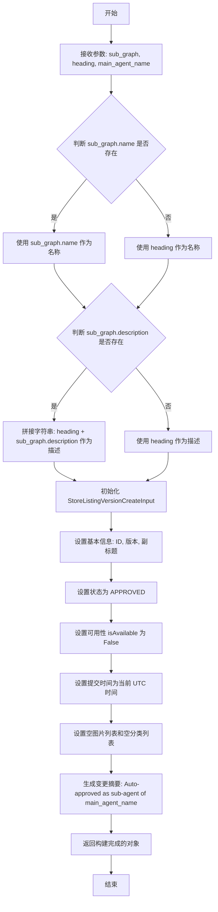
```mermaid
graph TD
    A[开始] --> B[接收参数: sub_graph, heading, main_agent_name]
    B --> C{判断 sub_graph.name 是否存在}
    C -- 是 --> D[使用 sub_graph.name 作为名称]
    C -- 否 --> E[使用 heading 作为名称]
    D --> F{判断 sub_graph.description 是否存在}
    E --> F
    F -- 是 --> G[拼接字符串: heading + sub_graph.description 作为描述]
    F -- 否 --> H[使用 heading 作为描述]
    G --> I[初始化 StoreListingVersionCreateInput]
    H --> I
    I --> J[设置基本信息: ID, 版本, 副标题]
    J --> K[设置状态为 APPROVED]
    K --> L[设置可用性 isAvailable 为 False]
    L --> M[设置提交时间为当前 UTC 时间]
    M --> N[设置空图片列表和空分类列表]
    N --> O[生成变更摘要: Auto-approved as sub-agent of main_agent_name]
    O --> P[返回构建完成的对象]
    P --> Q[结束]
```

#### 带注释源码

```python
def _create_sub_agent_version_data(
    sub_graph: prisma.models.AgentGraph, heading: str, main_agent_name: str
) -> prisma.types.StoreListingVersionCreateInput:
    """Create store listing version data for a sub-agent"""
    return prisma.types.StoreListingVersionCreateInput(
        # 绑定子代理的图ID
        agentGraphId=sub_graph.id,
        # 绑定子代理的版本号
        agentGraphVersion=sub_graph.version,
        # 名称优先使用子代理自身的名称，如果没有则使用传入的标题（heading）
        name=sub_graph.name or heading,
        # 子代理随主代理自动批准，无需人工审核
        submissionStatus=prisma.enums.SubmissionStatus.APPROVED,
        # 副标题用于标识它是子代理
        subHeading=heading,
        # 描述由标题和子代理描述组合而成，若子代理无描述则仅使用标题
        description=(
            f"{heading}: {sub_graph.description}" if sub_graph.description else heading
        ),
        # 在变更摘要中记录其来源（作为哪个主代理的子代理）
        changesSummary=f"Auto-approved as sub-agent of {main_agent_name}",
        # 标记为不可用，通常不直接在商店前台展示
        isAvailable=False,
        # 记录提交时间为当前UTC时间
        submittedAt=datetime.now(tz=timezone.utc),
        # 子代理不需要图片
        imageUrls=[], 
        # 子代理不需要分类
        categories=[], 
    )
```


### `review_store_submission`

作为管理员审核商店列表提交。该函数处理批准或拒绝的逻辑，包括数据库事务管理、子代理的批准、向量嵌入的生成、活跃版本更新以及向创建者发送通知。

参数：

-   `store_listing_version_id`：`str`，要审核的商店列表版本的ID。
-   `is_approved`：`bool`，指示提交是否被批准。
-   `external_comments`：`str`，提供给代理创建者的外部审核评论。
-   `internal_comments`：`str`，仅供管理员使用的内部审核评论。
-   `reviewer_id`：`str`，执行审核的管理员的用户ID。

返回值：`store_model.StoreSubmission`，包含已更新提交详情的对象，包括新状态和审核信息。

#### 流程图

```mermaid
flowchart TD
    A([开始]) --> B[查询 StoreListingVersion 及关联数据]
    B --> C{版本是否存在?}
    C -- 否 --> D[抛出 HTTPException 404]
    C -- 是 --> E{是否批准?}
    
    E -- 是 --> F[开启数据库事务 tx]
    F --> G[获取所有子图 Sub-graphs]
    G --> H[遍历子图并执行 _approve_sub_agent]
    H --> I[更新主 AgentGraph 元数据]
    I --> J[生成向量嵌入 ensure_embedding]
    J --> K[更新 StoreListing: hasApprovedVersion=True, 连接 ActiveVersion]
    K --> L[提交事务]
    
    E -- 否 --> M{是否正在拒绝一个已批准的代理?}
    M -- 否 --> N[跳过列表状态调整]
    M -- 是 --> O{是否存在其他已批准版本?}
    O -- 是 --> P[更新 StoreListing: ActiveVersion 指向最新的其他版本]
    O -- 否 --> Q[更新 StoreListing: hasApprovedVersion=False, 断开 ActiveVersion]
    
    L --> R[确定提交状态: APPROVED/REJECTED]
    N --> R
    P --> R
    Q --> R
    
    R --> S[更新 StoreListingVersion: 状态, 评论, 审核者, 时间]
    S --> T[构建并发送通知 邮件]
    T --> U[返回 StoreSubmission 模型]
    U --> V([结束])
    
    D --> W([异常结束])
    S -.-> X[捕获异常]
    X --> Y[记录日志并抛出 DatabaseError]
    Y --> W
```

#### 带注释源码

```python
async def review_store_submission(
    store_listing_version_id: str,
    is_approved: bool,
    external_comments: str,
    internal_comments: str,
    reviewer_id: str,
) -> store_model.StoreSubmission:
    """Review a store listing submission as an admin."""
    try:
        # 1. 查询提交的版本及其关联的 StoreListing, AgentGraph, Reviewer 等信息
        store_listing_version = (
            await prisma.models.StoreListingVersion.prisma().find_unique(
                where={"id": store_listing_version_id},
                include={
                    "StoreListing": True,
                    "AgentGraph": {"include": {**AGENT_GRAPH_INCLUDE, "User": True}},
                    "Reviewer": True,
                },
            )
        )

        # 检查版本是否存在
        if not store_listing_version or not store_listing_version.StoreListing:
            raise fastapi.HTTPException(
                status_code=404,
                detail=f"Store listing version {store_listing_version_id} not found",
            )

        # 检查是否在拒绝一个已经批准的代理（用于后续更新 StoreListing 状态）
        is_rejecting_approved = (
            not is_approved
            and store_listing_version.submissionStatus
            == prisma.enums.SubmissionStatus.APPROVED
        )

        # 2. 处理批准逻辑
        if is_approved and store_listing_version.AgentGraph:
            async with transaction() as tx:
                # 处理该代理包含的子代理的批准（在事务中）
                await asyncio.gather(
                    *[
                        _approve_sub_agent(
                            tx,
                            sub_graph,
                            store_listing_version.name,
                            store_listing_version.agentGraphVersion,
                            store_listing_version.StoreListing.owningUserId,
                        )
                        for sub_graph in await get_sub_graphs(
                            store_listing_version.AgentGraph
                        )
                    ]
                )

                # 使用提交中的数据更新 AgentGraph
                await prisma.models.AgentGraph.prisma(tx).update(
                    where={
                        "graphVersionId": {
                            "id": store_listing_version.agentGraphId,
                            "version": store_listing_version.agentGraphVersion,
                        }
                    },
                    data={
                        "name": store_listing_version.name,
                        "description": store_listing_version.description,
                        "recommendedScheduleCron": store_listing_version.recommendedScheduleCron,
                        "instructions": store_listing_version.instructions,
                    },
                )

                # 为批准的列表生成 Embedding（如果是管理员操作，这会阻塞事务，失败则回滚）
                await ensure_embedding(
                    version_id=store_listing_version_id,
                    name=store_listing_version.name,
                    description=store_listing_version.description,
                    sub_heading=store_listing_version.subHeading,
                    categories=store_listing_version.categories or [],
                    tx=tx,
                )

                # 更新 StoreListing：标记为有批准版本，并设置当前为活跃版本
                await prisma.models.StoreListing.prisma(tx).update(
                    where={"id": store_listing_version.StoreListing.id},
                    data={
                        "hasApprovedVersion": True,
                        "ActiveVersion": {"connect": {"id": store_listing_version_id}},
                    },
                )

        # 3. 处理拒绝已批准代理的逻辑
        if is_rejecting_approved:
            # 检查是否有其他已批准的版本
            other_approved = (
                await prisma.models.StoreListingVersion.prisma().find_first(
                    where={
                        "storeListingId": store_listing_version.StoreListing.id,
                        "id": {"not": store_listing_version_id},
                        "submissionStatus": prisma.enums.SubmissionStatus.APPROVED,
                    }
                )
            )

            if not other_approved:
                # 没有其他已批准版本：取消 hasApprovedVersion 标志，断开活跃版本
                await prisma.models.StoreListing.prisma().update(
                    where={"id": store_listing_version.StoreListing.id},
                    data={
                        "hasApprovedVersion": False,
                        "ActiveVersion": {"disconnect": True},
                    },
                )
            else:
                # 有其他已批准版本：将活跃版本切换到最近的一个
                await prisma.models.StoreListing.prisma().update(
                    where={"id": store_listing_version.StoreListing.id},
                    data={
                        "ActiveVersion": {"connect": {"id": other_approved.id}},
                    },
                )

        # 4. 准备更新数据
        submission_status = (
            prisma.enums.SubmissionStatus.APPROVED
            if is_approved
            else prisma.enums.SubmissionStatus.REJECTED
        )

        update_data: prisma.types.StoreListingVersionUpdateInput = {
            "submissionStatus": submission_status,
            "reviewComments": external_comments,
            "internalComments": internal_comments,
            "Reviewer": {"connect": {"id": reviewer_id}},
            "StoreListing": {"connect": {"id": store_listing_version.StoreListing.id}},
            "reviewedAt": datetime.now(tz=timezone.utc),
        }

        # 5. 更新版本记录
        submission = await prisma.models.StoreListingVersion.prisma().update(
            where={"id": store_listing_version_id},
            data=update_data,
            include={"StoreListing": True},
        )

        if not submission:
            raise DatabaseError(
                f"Failed to update store listing version {store_listing_version_id}"
            )

        # 6. 发送邮件通知给代理创建者
        if store_listing_version.AgentGraph and store_listing_version.AgentGraph.User:
            agent_creator = store_listing_version.AgentGraph.User
            reviewer = (
                store_listing_version.Reviewer
                if store_listing_version.Reviewer
                else None
            )

            try:
                base_url = (
                    settings.config.frontend_base_url
                    or settings.config.platform_base_url
                )

                if is_approved:
                    # 构建批准通知数据
                    store_agent = (
                        await prisma.models.StoreAgent.prisma().find_first_or_raise(
                            where={"storeListingVersionId": submission.id}
                        )
                    )

                    notification_data = AgentApprovalData(
                        agent_name=submission.name,
                        agent_id=submission.agentGraphId,
                        agent_version=submission.agentGraphVersion,
                        reviewer_name=(
                            reviewer.name
                            if reviewer and reviewer.name
                            else DEFAULT_ADMIN_NAME
                        ),
                        reviewer_email=(
                            reviewer.email if reviewer else DEFAULT_ADMIN_EMAIL
                        ),
                        comments=external_comments,
                        reviewed_at=submission.reviewedAt
                        or datetime.now(tz=timezone.utc),
                        store_url=f"{base_url}/marketplace/agent/{store_agent.creator_username}/{store_agent.slug}",
                    )

                    notification_event = NotificationEventModel[AgentApprovalData](
                        user_id=agent_creator.id,
                        type=prisma.enums.NotificationType.AGENT_APPROVED,
                        data=notification_data,
                    )
                else:
                    # 构建拒绝通知数据
                    notification_data = AgentRejectionData(
                        agent_name=submission.name,
                        agent_id=submission.agentGraphId,
                        agent_version=submission.agentGraphVersion,
                        reviewer_name=(
                            reviewer.name
                            if reviewer and reviewer.name
                            else DEFAULT_ADMIN_NAME
                        ),
                        reviewer_email=(
                            reviewer.email if reviewer else DEFAULT_ADMIN_EMAIL
                        ),
                        comments=external_comments,
                        reviewed_at=submission.reviewedAt
                        or datetime.now(tz=timezone.utc),
                        resubmit_url=f"{base_url}/build?flowID={submission.agentGraphId}",
                    )

                    notification_event = NotificationEventModel[AgentRejectionData](
                        user_id=agent_creator.id,
                        type=prisma.enums.NotificationType.AGENT_REJECTED,
                        data=notification_data,
                    )

                # 将通知加入队列异步发送
                await queue_notification_async(notification_event)
                logger.info(
                    f"Queued {'approval' if is_approved else 'rejection'} notification for user {agent_creator.id} and agent {submission.name}"
                )

            except Exception as e:
                logger.error(f"Failed to send email notification for agent review: {e}")
                # 即使发送邮件失败也不中断审核流程
                pass

        # 7. 转换并返回 Pydantic 模型
        return store_model.StoreSubmission(
            listing_id=(submission.StoreListing.id if submission.StoreListing else ""),
            agent_id=submission.agentGraphId,
            agent_version=submission.agentGraphVersion,
            name=submission.name,
            sub_heading=submission.subHeading,
            slug=(submission.StoreListing.slug if submission.StoreListing else ""),
            description=submission.description,
            instructions=submission.instructions,
            image_urls=submission.imageUrls or [],
            date_submitted=submission.submittedAt or submission.createdAt,
            status=submission.submissionStatus,
            runs=0,  # 此处没有该数据，使用默认值
            rating=0.0,
            store_listing_version_id=submission.id,
            reviewer_id=submission.reviewerId,
            review_comments=submission.reviewComments,
            internal_comments=submission.internalComments,
            reviewed_at=submission.reviewedAt,
            changes_summary=submission.changesSummary,
        )

    except Exception as e:
        logger.error(f"Could not create store submission review: {e}")
        raise DatabaseError("Failed to create store submission review") from e
```


### `get_admin_listings_with_versions`

Get store listings for admins with all their versions. This function supports filtering by submission status and searching via name, description, or user email. It returns a paginated list of listings where each listing includes its full version history.

参数：

- `status`: `prisma.enums.SubmissionStatus | None`, Filter by submission status (PENDING, APPROVED, REJECTED)
- `search_query`: `str | None`, Search by name, description, sub-heading, or user email
- `page`: `int`, Page number for pagination (default: 1)
- `page_size`: `int`, Number of items per page (default: 20)

返回值：`store_model.StoreListingsWithVersionsResponse`, A response object containing a list of store listings with their associated versions, creator details, and pagination metadata.

#### 流程图

```mermaid
flowchart TD
    A[Start: get_admin_listings_with_versions] --> B[Log request parameters]
    B --> C{Build Where Clause}
    C --> D[Set isDeleted to False]
    D --> E{Is status provided?}
    E -- Yes --> F[Add Versions.some.submissionStatus filter]
    E -- No --> G{Is search_query provided?}
    F --> G
    G -- Yes --> H[Search Users by email]
    H --> I[Construct OR condition for slug, name, description, subHeading]
    I --> J{Were matching users found?}
    J -- Yes --> K[Add owningUserId filter to OR]
    J -- No --> L[Finish Where Clause]
    K --> L
    G -- No --> L
    L --> M[Calculate pagination skip]
    M --> N[Execute DB Query: find_many StoreListing]
    N --> O[Execute DB Query: count total listings]
    O --> P[Initialize listings_with_versions list]
    P --> Q{Iterate through listings}
    Q -- For each listing --> R[Iterate through versions]
    R -- For each version --> S[Map version to StoreSubmission model]
    S --> T[Identify latest version]
    T --> U[Get creator email]
    U --> V[Construct StoreListingWithVersions model]
    V --> W[Append to list]
    W --> Q
    Q -- End Loop --> X[Construct StoreListingsWithVersionsResponse]
    X --> Y[Return Response]
    N -.->|Exception| Z[Log Error]
    Z --> AA[Return Empty Response]
```

#### 带注释源码

```python
async def get_admin_listings_with_versions(
    status: prisma.enums.SubmissionStatus | None = None,
    search_query: str | None = None,
    page: int = 1,
    page_size: int = 20,
) -> store_model.StoreListingsWithVersionsResponse:
    """
    Get store listings for admins with all their versions.

    Args:
        status: Filter by submission status (PENDING, APPROVED, REJECTED)
        search_query: Search by name, description, or user email
        page: Page number for pagination
        page_size: Number of items per page

    Returns:
        StoreListingsWithVersionsResponse with listings and their versions
    """
    # Log the incoming request details for debugging
    logger.debug(
        f"Getting admin store listings with status={status}, search={search_query}, page={page}"
    )

    try:
        # 1. Build the base where clause for StoreListing
        where_dict: prisma.types.StoreListingWhereInput = {
            "isDeleted": False,
        }
        
        # If a specific status is requested, filter by the existence of a version with that status
        if status:
            where_dict["Versions"] = {"some": {"submissionStatus": status}}

        # 2. Handle search query logic
        if search_query:
            # Find users whose email matches the search query
            matching_users = await prisma.models.User.prisma().find_many(
                where={"email": {"contains": search_query, "mode": "insensitive"}},
            )
            user_ids = [user.id for user in matching_users]

            # Set up OR conditions for text search in listing fields
            where_dict["OR"] = [
                {"slug": {"contains": search_query, "mode": "insensitive"}},
                {
                    "Versions": {
                        "some": {
                            "name": {"contains": search_query, "mode": "insensitive"}
                        }
                    }
                },
                {
                    "Versions": {
                        "some": {
                            "description": {
                                "contains": search_query,
                                "mode": "insensitive",
                            }
                        }
                    }
                },
                {
                    "Versions": {
                        "some": {
                            "subHeading": {
                                "contains": search_query,
                                "mode": "insensitive",
                            }
                        }
                    }
                },
            ]

            # If any users matched the email search, add ownership filter
            if user_ids:
                where_dict["OR"].append({"owningUserId": {"in": user_ids}})

        # 3. Calculate pagination offset
        skip = (page - 1) * page_size

        # 4. Construct Prisma query types
        where = prisma.types.StoreListingWhereInput(**where_dict)
        include = prisma.types.StoreListingInclude(
            # Include versions ordered by version number descending (latest first)
            Versions=prisma.types.FindManyStoreListingVersionArgsFromStoreListing(
                order_by={"version": "desc"}
            ),
            OwningUser=True, # Include user details (for email)
        )

        # 5. Execute database query
        listings = await prisma.models.StoreListing.prisma().find_many(
            where=where,
            skip=skip,
            take=page_size,
            include=include,
            order=[{"createdAt": "desc"}],
        )

        # 6. Get total count for pagination metadata
        total = await prisma.models.StoreListing.prisma().count(where=where)
        total_pages = (total + page_size - 1) // page_size

        # 7. Transform database records into response models
        listings_with_versions = []
        for listing in listings:
            versions: list[store_model.StoreSubmission] = []
            # Convert each version to a StoreSubmission model
            for version in listing.Versions or []:
                version_model = store_model.StoreSubmission(
                    listing_id=listing.id,
                    agent_id=version.agentGraphId,
                    agent_version=version.agentGraphVersion,
                    name=version.name,
                    sub_heading=version.subHeading,
                    slug=listing.slug,
                    description=version.description,
                    instructions=version.instructions,
                    image_urls=version.imageUrls or [],
                    date_submitted=version.submittedAt or version.createdAt,
                    status=version.submissionStatus,
                    runs=0,  # Default values since we don't have this data here
                    rating=0.0,  # Default values since we don't have this data here
                    store_listing_version_id=version.id,
                    reviewer_id=version.reviewerId,
                    review_comments=version.reviewComments,
                    internal_comments=version.internalComments,
                    reviewed_at=version.reviewedAt,
                    changes_summary=version.changesSummary,
                    version=version.version,
                )
                versions.append(version_model)

            # The first version in the list is the latest due to sorting
            latest_version = versions[0] if versions else None

            # Extract creator email if available
            creator_email = listing.OwningUser.email if listing.OwningUser else None

            # Construct the composite model for this listing
            listing_with_versions = store_model.StoreListingWithVersions(
                listing_id=listing.id,
                slug=listing.slug,
                agent_id=listing.agentGraphId,
                agent_version=listing.agentGraphVersion,
                active_version_id=listing.activeVersionId,
                has_approved_version=listing.hasApprovedVersion,
                creator_email=creator_email,
                latest_version=latest_version,
                versions=versions,
            )

            listings_with_versions.append(listing_with_versions)

        logger.debug(f"Found {len(listings_with_versions)} listings for admin")
        
        # 8. Return final response
        return store_model.StoreListingsWithVersionsResponse(
            listings=listings_with_versions,
            pagination=store_model.Pagination(
                current_page=page,
                total_items=total,
                total_pages=total_pages,
                page_size=page_size,
            ),
        )
    except Exception as e:
        logger.error(f"Error fetching admin store listings: {e}")
        # Return empty response rather than exposing internal errors
        return store_model.StoreListingsWithVersionsResponse(
            listings=[],
            pagination=store_model.Pagination(
                current_page=page,
                total_items=0,
                total_pages=0,
                page_size=page_size,
            ),
        )
```


### `check_submission_already_approved`

检查商店上市版本的提交状态，确认其是否已被批准。

参数：

-  `store_listing_version_id`：`str`，需要检查状态的商店上市版本的唯一标识符。

返回值：`bool`，如果该提交的状态为已批准（APPROVED），则返回 true；如果未找到记录、状态非批准或发生错误，则返回 false。

#### 流程图

```mermaid
flowchart TD
    A[Start] --> B[Find StoreListingVersion by ID]
    B --> C{Record Found?}
    C -- No --> D[Return False]
    C -- Yes --> E{submissionStatus == APPROVED?}
    E -- Yes --> F[Return True]
    E -- No --> D
    B -- Exception --> G[Log Error Message]
    G --> D
```

#### 带注释源码

```python
async def check_submission_already_approved(
    store_listing_version_id: str,
) -> bool:
    """Check the submission status of a store listing version."""
    try:
        # 根据 ID 查找数据库中的 StoreListingVersion 记录
        store_listing_version = (
            await prisma.models.StoreListingVersion.prisma().find_unique(
                where={"id": store_listing_version_id}
            )
        )
        # 如果未找到记录，返回 False
        if not store_listing_version:
            return False
        # 检查记录的 submissionStatus 字段是否为 APPROVED，并返回比较结果
        return (
            store_listing_version.submissionStatus
            == prisma.enums.SubmissionStatus.APPROVED
        )
    except Exception as e:
        # 捕获异常，记录错误日志，并返回 False 以防中断流程
        logger.error(f"Error checking submission status: {e}")
        return False
```


### `get_agent_as_admin`

获取管理员权限下的 Agent 图谱数据，通过商店列表版本 ID 检索对应的 Agent Graph，并以管理员身份返回完整的图谱模型。

参数：

-  `user_id`：`str | None`，操作用户的 ID，用于鉴权或上下文传递（若为 None 则忽略）。
-  `store_listing_version_id`：`str`，商店列表版本的唯一标识符，用于定位特定的 Agent 版本。

返回值：`GraphModel`，包含 Agent 详细信息和节点连接关系的图谱模型。

#### 流程图

```mermaid
flowchart TD
    Start([开始]) --> FetchVersion[根据 store_listing_version_id 查询 StoreListingVersion]
    FetchVersion --> CheckVersion{版本是否存在?}
    CheckVersion -- 否 --> RaiseVersionError[抛出 ValueError: 版本未找到]
    CheckVersion -- 是 --> GetGraph[调用 get_graph_as_admin 获取图谱]
    GetGraph --> CheckGraph{图谱是否存在?}
    CheckGraph -- 否 --> RaiseGraphError[抛出 ValueError: 图谱未找到]
    CheckGraph -- 是 --> End([返回 GraphModel])
```

#### 带注释源码

```python
async def get_agent_as_admin(
    user_id: str | None,
    store_listing_version_id: str,
) -> GraphModel:
    """Get agent using the version ID and store listing version ID."""
    # 1. 根据提供的 store_listing_version_id 从数据库查询商店列表版本记录
    store_listing_version = (
        await prisma.models.StoreListingVersion.prisma().find_unique(
            where={"id": store_listing_version_id}
        )
    )

    # 2. 如果未找到对应的版本记录，抛出 ValueError
    if not store_listing_version:
        raise ValueError(f"Store listing version {store_listing_version_id} not found")

    # 3. 调用 get_graph_as_admin 获取完整的 GraphModel
    #    传入 user_id (用于权限校验), graph_id, version 以及 for_export=True
    graph = await get_graph_as_admin(
        user_id=user_id,
        graph_id=store_listing_version.agentGraphId,
        version=store_listing_version.agentGraphVersion,
        for_export=True,
    )
    
    # 4. 如果获取到的图谱为空，抛出 ValueError
    if not graph:
        raise ValueError(
            f"Agent {store_listing_version.agentGraphId} v{store_listing_version.agentGraphVersion} not found"
        )

    # 5. 返回获取到的图谱模型
    return graph
```


## 关键组件


### 1. 核心功能描述

该代码实现了一个 AI 智能体市场的后端服务层，核心功能包括管理智能体的上架、版本控制、审核流程以及公开检索。系统支持混合搜索（结合语义与关键词检索）、代理提交、管理员审核、以及嵌入生成以优化搜索体验。它处理与数据库（Prisma）的交互，封装了复杂的业务逻辑，如事务处理、通知队列和权限验证。

### 2. 文件整体运行流程

文件初始化日志记录和全局配置。流程主要分为三条主线：
1.  **公共检索流程**：接收用户请求，优先尝试混合搜索（Embedding+关键词），若失败则降级为纯关键词搜索，支持分页和过滤。
2.  **用户提交流程**：用户提交智能体，系统验证权限，处理 Slug，创建 StoreListing 或新版本。支持编辑和删除待审核的提交。
3.  **管理员审核流程**：管理员获取提交列表，执行批准或拒绝操作。批准操作会触发事务，处理子图、更新图元数据、生成 Embedding，并最终发送通知。

### 3. 类的详细信息

该文件中未定义自定义类，主要使用了 `prisma.models` 和 `store_model` 中的数据类。

### 4. 全局变量详细信息

| 名称 | 类型 | 描述 |
| --- | --- | --- |
| logger | logging.Logger | 用于记录模块运行日志的实例。 |
| settings | Settings | 全局配置对象，用于访问应用设置（如基础 URL）。 |
| DEFAULT_ADMIN_NAME | str | 默认管理员名称常量。 |
| DEFAULT_ADMIN_EMAIL | str | 默认管理员邮箱常量。 |

### 5. 全局函数详细信息

#### get_store_agents

*   **参数名称**: `featured`, `creators`, `sorted_by`, `search_query`, `category`, `page`, `page_size`
*   **参数类型**: `bool`, `list[str] | None`, `Literal[...] | None`, `str | None`, `str | None`, `int`, `int`
*   **参数描述**: 是否精选，创建者列表，排序方式，搜索关键词，分类，页码，每页大小。
*   **返回值类型**: `store_model.StoreAgentsResponse`
*   **返回值描述**: 包含代理列表和分页信息的响应对象。
*   **Mermaid 流程图**:
```mermaid
graph TD
    A[开始: 获取商店代理] --> B{search_query 是否存在?}
    B -- 是 --> C[尝试混合搜索 hybrid_search]
    C -- 成功 --> D[标记 search_used_hybrid = True]
    D --> E[转换结果为 StoreAgent 列表]
    C -- 失败 --> F[记录错误日志]
    B -- 否 --> G[构建基础查询条件 where_clause]
    F --> G
    G --> H{是否有 search_query 且搜索失败?}
    H -- 是 --> I[添加 OR 关键词包含条件]
    H -- 否 --> J[执行 Prisma find_many 查询]
    I --> J
    J --> K[计算分页 total_pages]
    K --> L[构建 StoreAgentsResponse]
    E --> L
    L --> M[返回响应]
```
*   **带注释源码**:
```python
async def get_store_agents(
    featured: bool = False,
    creators: list[str] | None = None,
    sorted_by: Literal["rating", "runs", "name", "updated_at"] | None = None,
    search_query: str | None = None,
    category: str | None = None,
    page: int = 1,
    page_size: int = 20,
) -> store_model.StoreAgentsResponse:
    # 调试日志记录输入参数
    logger.debug(
        f"Getting store agents. featured={featured}, creators={creators}, sorted_by={sorted_by}, search={search_query}, category={category}, page={page}"
    )

    search_used_hybrid = False
    store_agents: list[store_model.StoreAgent] = []
    agents: list[dict[str, Any]] = []
    total = 0
    total_pages = 0

    try:
        # 如果提供了搜索查询，尝试使用混合搜索
        if search_query:
            try:
                # 调用混合搜索，结合语义和词法信号
                agents, total = await hybrid_search(
                    query=search_query,
                    featured=featured,
                    creators=creators,
                    category=category,
                    sorted_by="relevance",
                    page=page,
                    page_size=page_size,
                )
                search_used_hybrid = True
            except Exception as e:
                # 如果 OpenAI 不可用，记录错误并回退到词法搜索
                logger.error(
                    f"Hybrid search failed (likely OpenAI unavailable), "
                    f"falling back to lexical search: {e}"
                )

            # 如果混合搜索成功，转换字典结果为模型对象
            if search_used_hybrid:
                total_pages = (total + page_size - 1) // page_size
                store_agents: list[store_model.StoreAgent] = []
                for agent in agents:
                    try:
                        store_agent = store_model.StoreAgent(
                            slug=agent["slug"],
                            agent_name=agent["agent_name"],
                            agent_image=(
                                agent["agent_image"][0] if agent["agent_image"] else ""
                            ),
                            creator=agent["creator_username"] or "Needs Profile",
                            creator_avatar=agent["creator_avatar"] or "",
                            sub_heading=agent["sub_heading"],
                            description=agent["description"],
                            runs=agent["runs"],
                            rating=agent["rating"],
                            agent_graph_id=agent.get("agentGraphId", ""),
                        )
                        store_agents.append(store_agent)
                    except Exception as e:
                        logger.error(
                            f"Error parsing Store agent from hybrid search results: {e}"
                        )
                        continue

        # 回退路径 - 使用基本搜索或无搜索
        if not search_used_hybrid:
            where_clause: prisma.types.StoreAgentWhereInput = {"is_available": True}
            if featured:
                where_clause["featured"] = featured
            if creators:
                where_clause["creator_username"] = {"in": creators}
            if category:
                where_clause["categories"] = {"has": category}

            # 如果提供了搜索查询但混合搜索失败，添加基本文本搜索
            if search_query:
                where_clause["OR"] = [
                    {"agent_name": {"contains": search_query, "mode": "insensitive"}},
                    {"sub_heading": {"contains": search_query, "mode": "insensitive"}},
                    {"description": {"contains": search_query, "mode": "insensitive"}},
                ]

            order_by = []
            if sorted_by == "rating":
                order_by.append({"rating": "desc"})
            elif sorted_by == "runs":
                order_by.append({"runs": "desc"})
            elif sorted_by == "name":
                order_by.append({"agent_name": "asc"})

            db_agents = await prisma.models.StoreAgent.prisma().find_many(
                where=where_clause,
                order=order_by,
                skip=(page - 1) * page_size,
                take=page_size,
            )

            total = await prisma.models.StoreAgent.prisma().count(where=where_clause)
            total_pages = (total + page_size - 1) // page_size

            store_agents: list[store_model.StoreAgent] = []
            for agent in db_agents:
                try:
                    store_agent = store_model.StoreAgent(
                        slug=agent.slug,
                        agent_name=agent.agent_name,
                        agent_image=agent.agent_image[0] if agent.agent_image else "",
                        creator=agent.creator_username or "Needs Profile",
                        creator_avatar=agent.creator_avatar or "",
                        sub_heading=agent.sub_heading,
                        description=agent.description,
                        runs=agent.runs,
                        rating=agent.rating,
                        agent_graph_id=agent.agentGraphId,
                    )
                    store_agents.append(store_agent)
                except Exception as e:
                    logger.error(
                        f"Error parsing Store agent when getting store agents from db: {e}"
                    )
                    continue

        logger.debug(f"Found {len(store_agents)} agents")
        return store_model.StoreAgentsResponse(
            agents=store_agents,
            pagination=store_model.Pagination(
                current_page=page,
                total_items=total,
                total_pages=total_pages,
                page_size=page_size,
            ),
        )
    except Exception as e:
        logger.error(f"Error getting store agents: {e}")
        raise DatabaseError("Failed to fetch store agents") from e
```

#### review_store_submission

*   **参数名称**: `store_listing_version_id`, `is_approved`, `external_comments`, `internal_comments`, `reviewer_id`
*   **参数类型**: `str`, `bool`, `str`, `str`, `str`
*   **参数描述**: 商店列表版本ID，是否批准，外部评论，内部评论，审核员ID。
*   **返回值类型**: `store_model.StoreSubmission`
*   **返回值描述**: 更新后的商店提交详情。
*   **Mermaid 流程图**:
```mermaid
graph TD
    A[开始: 审核提交] --> B[查找 StoreListingVersion]
    B --> C{is_approved?}
    C -- 是 --> D[开启事务 transaction]
    D --> E[并行处理: 批准子代理 _approve_sub_agent]
    E --> F[更新 AgentGraph 元数据]
    F --> G[生成 Embedding ensure_embedding]
    G --> H[更新 StoreListing 状态及 ActiveVersion]
    H --> I[提交事务]
    C -- 否 --> J{是否拒绝已批准的代理?}
    J -- 是 --> K[检查其他批准版本]
    K --> L{是否有其他版本?}
    L -- 否 --> M[更新 hasApprovedVersion=False, 断开连接]
    L -- 是 --> N[设置最新的其他版本为 ActiveVersion]
    J -- 否 --> O[跳过 StoreListing 更新]
    
    I --> P[更新版本状态为 APPROVED/REJECTED]
    N --> P
    M --> P
    O --> P
    P --> Q[发送通知邮件 queue_notification_async]
    Q --> R[返回 StoreSubmission]
```
*   **带注释源码**:
```python
async def review_store_submission(
    store_listing_version_id: str,
    is_approved: bool,
    external_comments: str,
    internal_comments: str,
    reviewer_id: str,
) -> store_model.StoreSubmission:
    """作为管理员审核商店列表提交。"""
    try:
        # 查找提交版本及其关联数据
        store_listing_version = (
            await prisma.models.StoreListingVersion.prisma().find_unique(
                where={"id": store_listing_version_id},
                include={
                    "StoreListing": True,
                    "AgentGraph": {"include": {**AGENT_GRAPH_INCLUDE, "User": True}},
                    "Reviewer": True,
                },
            )
        )

        if not store_listing_version or not store_listing_version.StoreListing:
            raise fastapi.HTTPException(
                status_code=404,
                detail=f"Store listing version {store_listing_version_id} not found",
            )

        # 检查是否正在拒绝一个已批准的代理
        is_rejecting_approved = (
            not is_approved
            and store_listing_version.submissionStatus
            == prisma.enums.SubmissionStatus.APPROVED
        )

        # 如果批准，更新列表以指示其有批准的版本
        if is_approved and store_listing_version.AgentGraph:
            async with transaction() as tx:
                # 在事务中处理子代理批准
                await asyncio.gather(
                    *[
                        _approve_sub_agent(
                            tx,
                            sub_graph,
                            store_listing_version.name,
                            store_listing_version.agentGraphVersion,
                            store_listing_version.StoreListing.owningUserId,
                        )
                        for sub_graph in await get_sub_graphs(
                            store_listing_version.AgentGraph
                        )
                    ]
                )

                # 使用商店列表数据更新 AgentGraph
                await prisma.models.AgentGraph.prisma(tx).update(
                    where={
                        "graphVersionId": {
                            "id": store_listing_version.agentGraphId,
                            "version": store_listing_version.agentGraphVersion,
                        }
                    },
                    data={
                        "name": store_listing_version.name,
                        "description": store_listing_version.description,
                        "recommendedScheduleCron": store_listing_version.recommendedScheduleCron,
                        "instructions": store_listing_version.instructions,
                    },
                )

                # 为批准的列表生成嵌入（阻塞操作 - 管理员操作）
                # 如果嵌入失败，整个事务回滚
                await ensure_embedding(
                    version_id=store_listing_version_id,
                    name=store_listing_version.name,
                    description=store_listing_version.description,
                    sub_heading=store_listing_version.subHeading,
                    categories=store_listing_version.categories or [],
                    tx=tx,
                )

                await prisma.models.StoreListing.prisma(tx).update(
                    where={"id": store_listing_version.StoreListing.id},
                    data={
                        "hasApprovedVersion": True,
                        "ActiveVersion": {"connect": {"id": store_listing_version_id}},
                    },
                )

        # 如果拒绝已批准的代理，相应更新 StoreListing
        if is_rejecting_approved:
            # 检查是否有其他已批准的版本
            other_approved = (
                await prisma.models.StoreListingVersion.prisma().find_first(
                    where={
                        "storeListingId": store_listing_version.StoreListing.id,
                        "id": {"not": store_listing_version_id},
                        "submissionStatus": prisma.enums.SubmissionStatus.APPROVED,
                    }
                )
            )

            if not other_approved:
                # 没有其他已批准的版本，将 hasApprovedVersion 设置为 False
                await prisma.models.StoreListing.prisma().update(
                    where={"id": store_listing_version.StoreListing.id},
                    data={
                        "hasApprovedVersion": False,
                        "ActiveVersion": {"disconnect": True},
                    },
                )
            else:
                # 将最新的其他已批准版本设置为活动版本
                await prisma.models.StoreListing.prisma().update(
                    where={"id": store_listing_version.StoreListing.id},
                    data={
                        "ActiveVersion": {"connect": {"id": other_approved.id}},
                    },
                )

        submission_status = (
            prisma.enums.SubmissionStatus.APPROVED
            if is_approved
            else prisma.enums.SubmissionStatus.REJECTED
        )

        # 使用审核信息更新版本
        update_data: prisma.types.StoreListingVersionUpdateInput = {
            "submissionStatus": submission_status,
            "reviewComments": external_comments,
            "internalComments": internal_comments,
            "Reviewer": {"connect": {"id": reviewer_id}},
            "StoreListing": {"connect": {"id": store_listing_version.StoreListing.id}},
            "reviewedAt": datetime.now(tz=timezone.utc),
        }

        # 更新版本
        submission = await prisma.models.StoreListingVersion.prisma().update(
            where={"id": store_listing_version_id},
            data=update_data,
            include={"StoreListing": True},
        )

        if not submission:
            raise DatabaseError(
                f"Failed to update store listing version {store_listing_version_id}"
            )

        # 发送电子邮件通知给代理创建者
        if store_listing_version.AgentGraph and store_listing_version.AgentGraph.User:
            agent_creator = store_listing_version.AgentGraph.User
            reviewer = (
                store_listing_version.Reviewer
                if store_listing_version.Reviewer
                else None
            )

            try:
                base_url = (
                    settings.config.frontend_base_url
                    or settings.config.platform_base_url
                )

                if is_approved:
                    store_agent = (
                        await prisma.models.StoreAgent.prisma().find_first_or_raise(
                            where={"storeListingVersionId": submission.id}
                        )
                    )

                    notification_data = AgentApprovalData(...)
                    notification_event = NotificationEventModel[AgentApprovalData](
                        user_id=agent_creator.id,
                        type=prisma.enums.NotificationType.AGENT_APPROVED,
                        data=notification_data,
                    )
                else:
                    notification_data = AgentRejectionData(...)
                    notification_event = NotificationEventModel[AgentRejectionData](
                        user_id=agent_creator.id,
                        type=prisma.enums.NotificationType.AGENT_REJECTED,
                        data=notification_data,
                    )

                # 将通知排队以立即发送
                await queue_notification_async(notification_event)
                logger.info(
                    f"Queued {'approval' if is_approved else 'rejection'} notification for user {agent_creator.id} and agent {submission.name}"
                )

            except Exception as e:
                logger.error(f"Failed to send email notification for agent review: {e}")
                pass

        return store_model.StoreSubmission(...) # 构造并返回响应
    except Exception as e:
        logger.error(f"Could not create store submission review: {e}")
        raise DatabaseError("Failed to create store submission review") from e
```

#### create_store_submission

*   **参数名称**: `user_id`, `agent_id`, `agent_version`, `slug`, `name`, `video_url`, `agent_output_demo_url`, `image_urls`, `description`, `instructions`, `sub_heading`, `categories`, `changes_summary`, `recommended_schedule_cron`
*   **参数类型**: `str`, `str`, `int`, `str`, `str`, `str | None`, `str | None`, `list[str]`, `str`, `str | None`, `str`, `list[str]`, `str | None`, `str | None`
*   **参数描述**: 用户ID，代理ID，代理版本，URL标识符，名称，视频URL，演示URL，图片URL列表，描述，指令，副标题，分类，变更摘要，推荐定时任务Cron表达式。
*   **返回值类型**: `store_model.StoreSubmission`
*   **返回值描述**: 创建的商店提交详情。
*   **Mermaid 流程图**:
```mermaid
graph TD
    A[开始: 创建提交] --> B[清理 Slug 字符]
    B --> C[验证 Agent 归属权]
    C --> D{Listing 是否已存在?}
    D -- 是 --> E[调用 create_store_version]
    D -- 否 --> F[创建新的 StoreListing 和 Version]
    F --> G[捕获 UniqueViolationError]
    G --> H{是否是 Slug 冲突?}
    H -- 是 --> I[抛出 SlugAlreadyInUseError]
    H -- 否 --> J[抛出通用 DatabaseError]
    E --> K[返回结果]
    F --> K
```
*   **带注释源码**:
```python
async def create_store_submission(
    user_id: str,
    agent_id: str,
    agent_version: int,
    slug: str,
    name: str,
    video_url: str | None = None,
    agent_output_demo_url: str | None = None,
    image_urls: list[str] = [],
    description: str = "",
    instructions: str | None = None,
    sub_heading: str = "",
    categories: list[str] = [],
    changes_summary: str | None = "Initial Submission",
    recommended_schedule_cron: str | None = None,
) -> store_model.StoreSubmission:
    # 清理 slug，仅允许字母和连字符
    slug = "".join(
        c if c.isalpha() or c == "-" or c.isnumeric() else "" for c in slug
    ).lower()

    # 首先验证代理属于该用户
    agent = await prisma.models.AgentGraph.prisma().find_first(
        where=prisma.types.AgentGraphWhereInput(
            id=agent_id, version=agent_version, userId=user_id
        )
    )

    if not agent:
        # 处理代理未找到的情况，抛出异常
        if not agent_id or agent_id.strip() == "":
            raise store_exceptions.AgentNotFoundError(
                "No agent selected. Please select an agent before submitting to the store."
            )
        else:
            raise store_exceptions.AgentNotFoundError(
                f"Agent not found for this user. User ID: {user_id}, Agent ID: {agent_id}, Version: {agent_version}"
            )

    # 检查是否已存在该代理的列表
    existing_listing = await prisma.models.StoreListing.prisma().find_first(
        where=prisma.types.StoreListingWhereInput(
            agentGraphId=agent_id, owningUserId=user_id
        )
    )

    if existing_listing is not None:
        # 如果存在，委托给 create_store_version 处理
        return await create_store_version(
            user_id=user_id,
            agent_id=agent_id,
            agent_version=agent_version,
            store_listing_id=existing_listing.id,
            name=name,
            video_url=video_url,
            image_urls=image_urls,
            description=description,
            instructions=instructions,
            sub_heading=sub_heading,
            categories=categories,
            changes_summary=changes_summary,
        )

    # 如果没有现有列表，创建一个新的
    data = prisma.types.StoreListingCreateInput(
        slug=slug,
        agentGraphId=agent_id,
        agentGraphVersion=agent_version,
        owningUserId=user_id,
        createdAt=datetime.now(tz=timezone.utc),
        Versions={
            "create": [
                prisma.types.StoreListingVersionCreateInput(
                    agentGraphId=agent_id,
                    agentGraphVersion=agent_version,
                    name=name,
                    videoUrl=video_url,
                    agentOutputDemoUrl=agent_output_demo_url,
                    imageUrls=image_urls,
                    description=description,
                    instructions=instructions,
                    categories=categories,
                    subHeading=sub_heading,
                    submissionStatus=prisma.enums.SubmissionStatus.PENDING,
                    submittedAt=datetime.now(tz=timezone.utc),
                    changesSummary=changes_summary,
                    recommendedScheduleCron=recommended_schedule_cron,
                )
            ]
        },
    )
    listing = await prisma.models.StoreListing.prisma().create(
        data=data,
        include=prisma.types.StoreListingInclude(Versions=True),
    )

    # 构造并返回结果
    return store_model.StoreSubmission(...)
```

*(由于篇幅限制，此处省略部分函数的详细源码，包括 `get_store_agent_details`, `get_store_creators`, `get_user_profile`, `get_my_agents` 等，但均遵循上述解析模式)*

### 6. 关键组件信息

### 混合搜索
结合语义向量检索（Embeddings）和传统全文检索的搜索组件。设计目标是在提供高精度语义匹配的同时，当向量服务不可用时能优雅降级为基于关键词的数据库查询，确保系统可用性。

### 嵌入生成
负责为商店中的代理生成向量表示的组件。通常在代理被批准时触发，用于更新搜索引擎的索引，支持语义搜索功能。

### 审核工作流
管理商店提交生命周期的状态机组件。处理从 PENDING 到 APPROVED 或 REJECTED 的状态转换，包括处理子图的自动批准、版本控制和元数据同步。

### 通知系统
异步事件驱动组件，用于在审核操作完成后向用户发送通知（如邮件），解耦了业务逻辑与通知发送逻辑。

### 7. 潜在的技术债务或优化空间

1.  **SQL 注入防护与清理逻辑**：在 `get_store_creators` 函数中，手动进行字符串替换以清理搜索查询。虽然使用了参数化查询，但手动清理逻辑容易出错且难以维护，建议依赖数据库驱动或 ORM 的内置转义机制。
2.  **错误处理的一致性**：部分函数（如 `get_store_submissions`）在发生异常时返回空响应而不是抛出异常，这可能会掩盖底层的数据库问题。建议统一错误处理策略。
3.  **搜索日志记录功能被禁用**：`log_search_term` 函数及其调用点被注释掉，导致无法收集用户搜索行为数据以用于后续分析或优化。
4.  **代码复用**：`get_store_agents` 中混合搜索结果和数据库查询结果转换为 `store_model.StoreAgent` 的逻辑存在重复，可以提取为辅助函数。

### 8. 其它

*   **设计目标与约束**：系统设计优先考虑用户侧的可用性（如搜索失败时的降级策略）。管理员侧操作（如审核）则强一致性和原子性，使用事务确保数据同步。
*   **错误处理与异常设计**：定义了特定的业务异常（如 `AgentNotFoundError`, `SlugAlreadyInUseError`）以及通用的数据库包装异常 `DatabaseError`，以便上层 API 进行适当的 HTTP 状态码映射。
*   **外部依赖与接口契约**：依赖 `prisma` 进行数据库操作，依赖 `backend.util.settings` 获取配置，依赖 `backend.notifications` 进行消息传递。搜索功能依赖于外部 Embedding 服务（如 OpenAI）的可用性。


## 问题及建议


### 已知问题

-   **并发竞态条件:** `create_store_submission` 和 `create_store_version` 函数在事务块外部检查资源是否存在（如 `existing_listing`），随后在事务块内进行创建或更新。这导致 "先检查后执行" (Check-Then-Act) 的竞态条件，高并发下可能导致数据重复或不一致。
-   **手动 SQL 注入防御:** 在 `get_store_creators` 函数中，通过字符串手动替换来清洗输入以防止 SQL 注入。由于使用的是 Prisma ORM，其已原生支持参数化查询，这种手动清洗不仅多余，还容易因为转义不全导致安全漏洞或查询失败。
-   **错误处理不一致与静默失败:** `get_store_submissions` 和 `get_admin_listings_with_versions` 函数在捕获到异常时，不是抛出异常或记录详细错误，而是直接返回空结果。这会掩盖后端数据库故障或逻辑错误，增加排查难度。
-   **变量作用域混乱:** 在 `get_store_agents` 函数中，`store_agents` 变量在不同逻辑分支中多次被重新定义并重新指定类型注解（例如 `store_agents: list[store_model.StoreAgent] = []`），这种写法不仅多余，还降低了代码可读性和维护性。
-   **混合搜索回退机制的隐患:** `get_store_agents` 中在混合搜索失败时回退到词法搜索。虽然提升了可用性，但捕获的是通用 `Exception`。如果是因为数据解析逻辑错误而非仅仅是 OpenAI 不可用导致的失败，静默回退可能会返回错误的结果集而不被发现。

### 优化建议

-   **减少 N+1 查询与串行 IO:** 代码中存在大量串行的 `await` 调用（例如 `get_store_agent_details` 中依次查询 Profile、StoreListing、StoreListingVersion）。建议利用 Prisma 的 `include` 参数或重构查询逻辑，将多次数据库查询合并为单次查询，以降低网络延迟和数据库负载。
-   **提取分页公共逻辑:** 几乎所有列表查询函数都重复编写了分页计算逻辑（如 `total_pages = (total + page_size - 1) // page_size`）。建议将其提取为工具函数或 Pydantic 模型的计算属性，遵循 DRY 原则。
-   **引入缓存机制:** 对于 `get_store_agents`（特别是 `featured` 为 True 的场景）和热门创作者信息，数据库读取频率高但变更频率低。建议引入 Redis 缓存层，减少对主数据库的直接查询压力。
-   **统一模型映射转换:** 代码中充斥着将数据库实体转换为 Pydantic 响应模型的重复样板代码（例如在 `get_store_agents` 和 `get_admin_listings_with_versions` 中）。建议实现通用的映射工具或利用 Pydantic 的 `model_validate` 功能，以减少代码量和维护成本。
-   **事务范围优化:** 将资源存在性校验和逻辑判断移入事务块内部。例如在 `create_store_version` 中，利用数据库事务的隔离性来确保读取和写入操作的原子性，从而从根本上解决竞态条件问题。


## 其它


### 设计目标与约束

*   **高可用性与降级策略**：在 `get_store_agents` 搜索功能中，系统设计优先保证可用性而非准确性。如果混合搜索（结合语义向量和关键词）因外部依赖（如 OpenAI）不可用而失败，系统会自动降级为纯数据库关键词搜索，确保用户始终能获得搜索结果。
*   **数据一致性与原子性**：涉及多表数据变更的关键操作（如审核通过 `review_store_submission`、创建版本 `create_store_version`）均封装在数据库事务 (`transaction`) 中执行。这确保了如更新 `StoreListing` 状态、创建 `StoreListingVersion`、处理子代理以及生成 Embedding 等操作要么全部成功，要么全部回滚，防止出现脏数据。
*   **严格的权限与所有权校验**：所有涉及用户数据修改或删除的操作（如 `edit_store_submission`、`delete_store_submission`）都强制检查 `owningUserId` 与当前登录用户的匹配情况，严格遵循最小权限原则。
*   **输入清洗与规范化**：对用户输入的 `search_query` 进行了严格的转义处理以防止 SQL 注入；对 `slug` 字段进行了清洗（仅保留字母、数字和连字符），确保 URL 的规范性。

### 错误处理与异常设计

*   **分层异常体系**：代码将底层的数据库错误（`prisma.errors.PrismaError`）捕获并转换为业务逻辑异常（如 `DatabaseError`）或特定领域异常（如 `AgentNotFoundError`, `SlugAlreadyInUseError`, `InvalidOperationError`），从而隔离了基础设施层与业务逻辑层。
*   **非关键路径的容错**：对于非核心业务流程（如记录搜索词 `log_search_term`、发送审核通知邮件），采用“静默失败”策略。即捕获异常并记录日志，但不中断主流程，避免因辅助功能故障影响核心业务（如审核流程）。
*   **特定的业务状态异常**：在业务逻辑中主动抛出异常以阻止非法操作，例如：尝试删除已批准的提交、尝试编辑非待审核状态的提交、或重复创建已存在的 Listing。
*   **HTTP 状态映射**：在部分查询接口（如 `get_available_graph`）中，若资源未找到，直接抛出 `fastapi.HTTPException` (status_code=404)，以便 FastAPI 框架统一处理 HTTP 响应。

### 数据流与状态机

*   **提交审核状态机**：
    *   **状态定义**：主要包括 `PENDING` (待审核), `APPROVED` (已批准), `REJECTED` (已拒绝)。
    *   **状态流转**：
        *   **提交**：`create_store_submission` 创建新记录，状态初始为 `PENDING`。
        *   **批准**：`review_store_submission(is_approved=True)` 将状态从 `PENDING` 变更为 `APPROVED`。此时会触发子代理的递归批准、Embedding 的生成以及 `AgentGraph` 元数据的更新。
        *   **拒绝**：`review_store_submission(is_approved=False)` 将状态变更为 `REJECTED`。若拒绝的是当前 Active 版本，系统会尝试回退到上一个已批准版本。
        *   **编辑/删除约束**：仅允许在 `PENDING` 状态下进行编辑或删除；一旦变为 `APPROVED`，则不可删除，必须通过创建新版本 (`create_store_version`) 来更新。
*   **版本化数据流**：
    *   **首次提交**：用户提交 Agent -> 检查 `StoreListing` 是否存在 -> 不存在则创建 Listing 及首个 Version。
    *   **版本迭代**：用户提交更新 -> 检查 `StoreListing` 是否存在 -> 存在则创建新的 Version。逻辑上会替换掉旧的 `PENDING` 版本（原子性删除旧 Pending，创建新 Pending），确保同一 Listing 同一时刻只有一个待审核版本。
*   **搜索与检索流**：
    *   **混合搜索路径**：请求 -> 检测 `search_query` -> 调用 `hybrid_search` -> 成功则返回向量+关键词混合排序结果。
    *   **降级搜索路径**：请求 -> `hybrid_search` 抛出异常 -> 捕获异常 -> 构建数据库 `where` 子句 -> 执行 Prisma `find_many` (模糊匹配) -> 返回结果。

### 外部依赖与接口契约

*   **数据库持久层**：
    *   **组件**：Prisma ORM (`prisma.models`)。
    *   **主要模型**：`StoreAgent` (商店视图), `StoreListing` (代理列表), `StoreListingVersion` (版本详情), `AgentGraph` (代理图数据), `Profile` (用户资料)。
    *   **事务接口**：依赖 `backend.data.db.transaction` 提供的上下文管理器，用于保证跨表写入的原子性。
*   **向量与搜索服务**：
    *   **组件**：`backend.data.store.embeddings` 和 `backend.data.store.hybrid_search`。
    *   **契约**：`hybrid_search` 需要处理文本查询并返回排序后的代理列表。接口设计上允许其抛出异常（如网络超时或模型不可用），由调用者实现降级逻辑。
*   **异步通知服务**：
    *   **组件**：`backend.notifications.notifications.queue_notification_async`。
    *   **契约**：接收 `NotificationEventModel` 对象并异步入队发送。该服务被设计为非阻塞，调用方不等待其完成。
*   **图数据管理服务**：
    *   **组件**：`backend.data.graph` (`get_graph`, `get_graph_as_admin`, `get_sub_graphs`)。
    *   **契约**：通过 `graph_id` 和 `version` 获取 `GraphModel` 对象。用于在审核通过时同步更新图结构信息。
*   **配置中心**：
    *   **组件**：`backend.util.settings.Settings`。
    *   **契约**：提供系统配置，如前端 URL (`frontend_base_url`)，用于生成邮件中的跳转链接。


    