# `AutoGPT\autogpt_platform\backend\backend\api\features\store\db_test.py` 详细设计文档

该代码是一个基于 Pytest 和异步编程的测试套件，旨在验证数据库操作模块（.db）的功能性与安全性。它涵盖了商店代理的获取与详情查询、商店提交的创建、用户及创作者个人资料的更新与获取等核心业务逻辑，并重点测试了搜索查询中的参数化 SQL 防护以防止 SQL 注入攻击。

## 整体流程

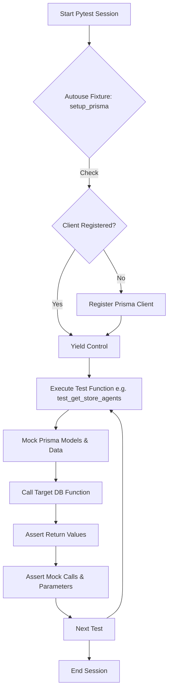

## 类结构

```
Test Module Structure
├── Functions (Tests & Fixtures)
│   ├── setup_prisma (Fixture)
│   ├── test_get_store_agents
│   ├── test_get_store_agent_details
│   ├── test_get_store_creator_details
│   ├── test_create_store_submission
│   ├── test_update_profile
│   ├── test_get_user_profile
│   ├── test_get_store_agents_with_search_parameterized
│   ├── test_get_store_agents_with_search_and_filters_parameterized
│   └── test_get_store_agents_search_category_array_injection
```

## 全局变量及字段


    

## 全局函数及方法


### `setup_prisma`

这是一个 Pytest 的自动 fixture，用于在测试执行前确保 Prisma 客户端已注册。它通过捕获客户端已注册的异常来防止重复注册错误，并在测试结束后交出控制权。

参数：

-  该函数无参数。

返回值：`None`，该函数作为一个 generator 使用 yield 暂停执行，本身不返回具体数值给测试用例。

#### 流程图

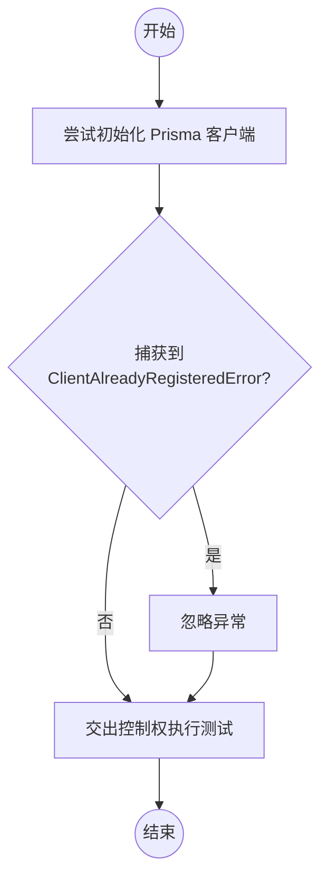

#### 带注释源码

```python
@pytest.fixture(autouse=True)
async def setup_prisma():
    # Don't register client if already registered
    # 尝试实例化 Prisma 客户端
    try:
        Prisma()
    # 如果捕获到客户端已注册的错误，则忽略，防止测试运行失败
    except prisma.errors.ClientAlreadyRegisteredError:
        pass
    # 暂停函数执行，运行测试代码，测试结束后继续执行（如果有清理代码）
    yield
```


### `test_get_store_agents`

该函数用于测试获取商店代理列表的功能，通过模拟数据库返回的数据并验证结果的正确性。

参数：

-   `mocker`：`MockFixture`，pytest-mock 提供的 fixture，用于模拟 Prisma 客户端调用。

返回值：`None`，该函数为测试函数，不返回具体值，主要通过断言验证逻辑。

#### 流程图

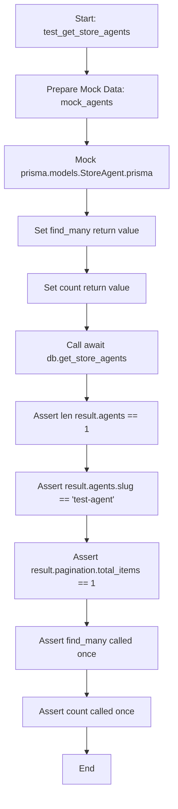

#### 带注释源码

```python
@pytest.mark.asyncio(loop_scope="session")
async def test_get_store_agents(mocker):
    # 准备模拟数据：创建一个模拟的 StoreAgent 对象列表
    mock_agents = [
        prisma.models.StoreAgent(
            listing_id="test-id",
            storeListingVersionId="version123",
            slug="test-agent",
            agent_name="Test Agent",
            agent_video=None,
            agent_image=["image.jpg"],
            featured=False,
            creator_username="creator",
            creator_avatar="avatar.jpg",
            sub_heading="Test heading",
            description="Test description",
            categories=[],
            runs=10,
            rating=4.5,
            versions=["1.0"],
            agentGraphVersions=["1"],
            agentGraphId="test-graph-id",
            updated_at=datetime.now(),
            is_available=False,
            useForOnboarding=False,
        )
    ]

    # 模拟 Prisma 客户端调用：替换 prisma.models.StoreAgent.prisma
    mock_store_agent = mocker.patch("prisma.models.StoreAgent.prisma")
    
    # 设置 find_many 方法的模拟返回值为 mock_agents
    mock_store_agent.return_value.find_many = mocker.AsyncMock(return_value=mock_agents)
    
    # 设置 count 方法的模拟返回值为 1
    mock_store_agent.return_value.count = mocker.AsyncMock(return_value=1)

    # 调用实际函数：执行 db.get_store_agents() 获取结果
    result = await db.get_store_agents()

    # 验证结果：断言返回的代理列表长度为 1
    assert len(result.agents) == 1
    
    # 验证结果：断言第一个代理的 slug 是否正确
    assert result.agents[0].slug == "test-agent"
    
    # 验证结果：断言分页信息中的总条目数是否正确
    assert result.pagination.total_items == 1

    # 验证 Mock 调用：断言 find_many 方法被调用了一次
    mock_store_agent.return_value.find_many.assert_called_once()
    
    # 验证 Mock 调用：断言 count 方法被调用了一次
    mock_store_agent.return_value.count.assert_called_once()
```


### `test_get_store_agent_details`

该测试函数用于验证 `db.get_store_agent_details` 的逻辑正确性，主要测试在获取商店代理详情时，系统能否正确识别并返回“活跃版本”的数据，而非仅仅是基础版本的数据，同时也验证了相关的数据库查询次数和参数是否正确。

参数：

- `mocker`: `MockerFixture`，pytest-mock 提供的 fixture 对象，用于模拟数据库操作和配置 Mock 对象的返回行为。

返回值：`None`，测试函数主要用于断言和验证，不直接返回业务数据。

#### 流程图

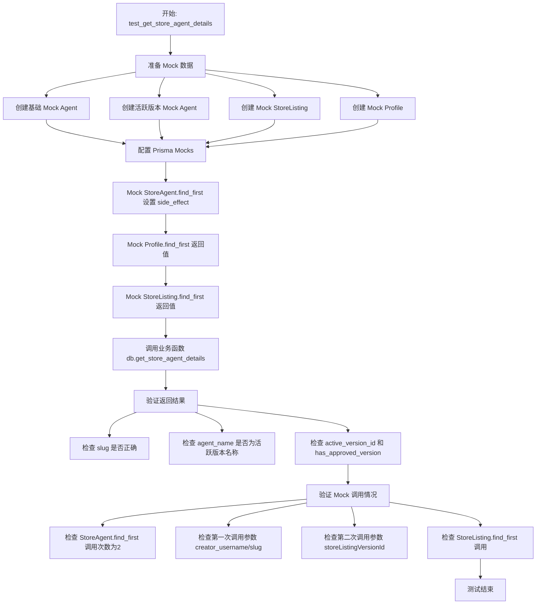

#### 带注释源码

```python
@pytest.mark.asyncio(loop_scope="session")
async def test_get_store_agent_details(mocker):
    # Mock data
    # 创建初始查询返回的基础代理数据
    mock_agent = prisma.models.StoreAgent(
        listing_id="test-id",
        storeListingVersionId="version123",
        slug="test-agent",
        agent_name="Test Agent",
        agent_video="video.mp4",
        agent_image=["image.jpg"],
        featured=False,
        creator_username="creator",
        creator_avatar="avatar.jpg",
        sub_heading="Test heading",
        description="Test description",
        categories=["test"],
        runs=10,
        rating=4.5,
        versions=["1.0"],
        agentGraphVersions=["1"],
        agentGraphId="test-graph-id",
        updated_at=datetime.now(),
        is_available=False,
        useForOnboarding=False,
    )

    # Mock active version agent (what we want to return for active version)
    # 创建预期返回的活跃版本代理数据，用于验证系统是否优先取活跃数据
    mock_active_agent = prisma.models.StoreAgent(
        listing_id="test-id",
        storeListingVersionId="active-version-id",
        slug="test-agent",
        agent_name="Test Agent Active", # 注意这里的名称不同，用于区分
        agent_video="active_video.mp4",
        agent_image=["active_image.jpg"],
        featured=False,
        creator_username="creator",
        creator_avatar="avatar.jpg",
        sub_heading="Test heading active",
        description="Test description active",
        categories=["test"],
        runs=15,
        rating=4.8,
        versions=["1.0", "2.0"],
        agentGraphVersions=["1", "2"],
        agentGraphId="test-graph-id-active",
        updated_at=datetime.now(),
        is_available=True,
        useForOnboarding=False,
    )

    # Create a mock StoreListing result
    # 创建商店列表的 Mock 对象，包含活跃版本 ID 和批准状态
    mock_store_listing = mocker.MagicMock()
    mock_store_listing.activeVersionId = "active-version-id"
    mock_store_listing.hasApprovedVersion = True
    mock_store_listing.ActiveVersion = mocker.MagicMock()
    mock_store_listing.ActiveVersion.recommendedScheduleCron = None

    # Mock StoreAgent prisma call - need to handle multiple calls
    # 对 StoreAgent 进行打补丁，因为它会被调用两次
    mock_store_agent = mocker.patch("prisma.models.StoreAgent.prisma")

    # Set up side_effect to return different results for different calls
    # 定义副作用函数，根据传入的 where 参数不同返回不同的 Mock 数据
    def mock_find_first_side_effect(*args, **kwargs):
        where_clause = kwargs.get("where", {})
        if "storeListingVersionId" in where_clause:
            # 第二次调用：查询活跃版本详情
            return mock_active_agent
        else:
            # 第一次调用：根据 creator 和 slug 查询基础信息
            return mock_agent

    mock_store_agent.return_value.find_first = mocker.AsyncMock(
        side_effect=mock_find_first_side_effect
    )

    # Mock Profile prisma call
    # 打补丁 Profile 查询
    mock_profile = mocker.MagicMock()
    mock_profile.userId = "user-id-123"
    mock_profile_db = mocker.patch("prisma.models.Profile.prisma")
    mock_profile_db.return_value.find_first = mocker.AsyncMock(
        return_value=mock_profile
    )

    # Mock StoreListing prisma call
    # 打补丁 StoreListing 查询
    mock_store_listing_db = mocker.patch("prisma.models.StoreListing.prisma")
    mock_store_listing_db.return_value.find_first = mocker.AsyncMock(
        return_value=mock_store_listing
    )

    # Call function
    # 调用实际业务函数
    result = await db.get_store_agent_details("creator", "test-agent")

    # Verify results - should use active version data
    # 断言：验证返回结果确实使用了活跃版本的数据
    assert result.slug == "test-agent"
    assert result.agent_name == "Test Agent Active"  # 验证使用了活跃版本的名称
    assert result.active_version_id == "active-version-id"
    assert result.has_approved_version is True
    assert (
        result.store_listing_version_id == "active-version-id"
    )  # 应该是活跃版本的 ID

    # Verify mocks called correctly - now expecting 2 calls
    # 断言：验证 StoreAgent 查询被调用了两次
    assert mock_store_agent.return_value.find_first.call_count == 2

    # Check the specific calls
    # 断言：验证具体的调用参数是否符合预期
    calls = mock_store_agent.return_value.find_first.call_args_list
    assert calls[0] == mocker.call(
        where={"creator_username": "creator", "slug": "test-agent"}
    )
    assert calls[1] == mocker.call(where={"storeListingVersionId": "active-version-id"})

    mock_store_listing_db.return_value.find_first.assert_called_once()
```


### `test_get_store_creator_details`

该函数用于测试获取商店创建者详情的功能，通过模拟 Prisma 数据库客户端来验证 `db.get_store_creator_details` 是否能根据用户名正确检索并返回创建者数据，同时验证数据库查询是否使用了正确的 `where` 子句。

参数：

-   `mocker`：`MockFixture`，pytest-mock 提供的 fixture，用于创建和配置模拟对象（mock），以隔离外部依赖（如数据库调用）。

返回值：`None`，测试函数通常不返回数值，成功时静默通过，失败时抛出 `AssertionError`。

#### 流程图

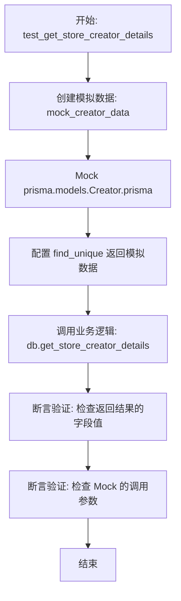

#### 带注释源码

```python
@pytest.mark.asyncio(loop_scope="session")
async def test_get_store_creator_details(mocker):
    # 准备模拟数据，创建一个 Creator 模型的实例
    mock_creator_data = prisma.models.Creator(
        name="Test Creator",
        username="creator",
        description="Test description",
        links=["link1"],
        avatar_url="avatar.jpg",
        num_agents=1,
        agent_rating=4.5,
        agent_runs=10,
        top_categories=["test"],
        is_featured=False,
    )

    # 对 prisma.models.Creator.prisma 进行 Mock，避免真实数据库操作
    mock_creator = mocker.patch("prisma.models.Creator.prisma")
    
    # 设置 find_unique 方法为异步 Mock，并配置其返回预设的模拟数据
    mock_creator.return_value.find_unique = mocker.AsyncMock()
    mock_creator.return_value.find_unique.return_value = mock_creator_data

    # 调用实际业务代码，传入用户名参数
    result = await db.get_store_creator_details("creator")

    # 验证结果：断言返回对象的各个字段与预期一致
    assert result.username == "creator"
    assert result.name == "Test Creator"
    assert result.description == "Test description"
    assert result.avatar_url == "avatar.jpg"

    # 验证行为：断言底层数据库查询方法 find_unique 被正确调用了一次
    # 并且使用了正确的查询条件 where={"username": "creator"}
    mock_creator.return_value.find_unique.assert_called_once_with(
        where={"username": "creator"}
    )
```


### `test_create_store_submission`

该函数是一个单元测试用例，用于验证创建商店提交记录（`db.create_store_submission`）的核心逻辑。它通过模拟数据库交互，检查当传入新的代理（Agent）和列表信息时，系统能否正确地查找代理图、创建商店列表，并返回预期的数据结构，同时确保相关的数据库查询方法被正确调用。

参数：

-  `moker`：`pytest_mock.MockerFixture`，用于模拟和替换数据库操作对象，以便在不连接真实数据库的情况下测试业务逻辑。

返回值：`None`，这是一个异步测试函数，主要执行断言操作以验证逻辑正确性，不返回业务数据。

#### 流程图

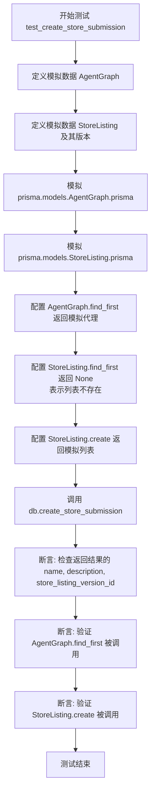

#### 带注释源码

```python
@pytest.mark.asyncio(loop_scope="session")
async def test_create_store_submission(mocker):
    # 1. 准备模拟数据：模拟代理图对象
    mock_agent = prisma.models.AgentGraph(
        id="agent-id",
        version=1,
        userId="user-id",
        createdAt=datetime.now(),
        isActive=True,
    )

    # 2. 准备模拟数据：模拟商店列表对象，包含一个待审核的版本
    mock_listing = prisma.models.StoreListing(
        id="listing-id",
        createdAt=datetime.now(),
        updatedAt=datetime.now(),
        isDeleted=False,
        hasApprovedVersion=False,
        slug="test-agent",
        agentGraphId="agent-id",
        agentGraphVersion=1,
        owningUserId="user-id",
        Versions=[
            prisma.models.StoreListingVersion(
                id="version-id",
                agentGraphId="agent-id",
                agentGraphVersion=1,
                name="Test Agent",
                description="Test description",
                createdAt=datetime.now(),
                updatedAt=datetime.now(),
                subHeading="Test heading",
                imageUrls=["image.jpg"],
                categories=["test"],
                isFeatured=False,
                isDeleted=False,
                version=1,
                storeListingId="listing-id",
                submissionStatus=prisma.enums.SubmissionStatus.PENDING,
                isAvailable=True,
            )
        ],
        useForOnboarding=False,
    )

    # 3. 模拟数据库调用：模拟 AgentGraph 模型
    mock_agent_graph = mocker.patch("prisma.models.AgentGraph.prisma")
    # 模拟 find_first 方法返回之前定义的 mock_agent
    mock_agent_graph.return_value.find_first = mocker.AsyncMock(return_value=mock_agent)

    # 4. 模拟数据库调用：模拟 StoreListing 模型
    mock_store_listing = mocker.patch("prisma.models.StoreListing.prisma")
    # 模拟 find_first 返回 None，表示该列表不存在（是新建操作）
    mock_store_listing.return_value.find_first = mocker.AsyncMock(return_value=None)
    # 模拟 create 方法返回之前定义的 mock_listing
    mock_store_listing.return_value.create = mocker.AsyncMock(return_value=mock_listing)

    # 5. 执行被测试函数：传入用户ID、代理ID、版本号及元数据
    result = await db.create_store_submission(
        user_id="user-id",
        agent_id="agent-id",
        agent_version=1,
        slug="test-agent",
        name="Test Agent",
        description="Test description",
    )

    # 6. 验证结果：检查返回对象的字段是否符合预期
    assert result.name == "Test Agent"
    assert result.description == "Test description"
    assert result.store_listing_version_id == "version-id"

    # 7. 验证交互：确保查询代理图和创建列表的方法均被正确调用
    mock_agent_graph.return_value.find_first.assert_called_once()
    mock_store_listing.return_value.create.assert_called_once()
```


### `test_update_profile`

该函数是一个异步测试用例，用于验证更新用户个人资料（`update_profile`）的功能是否正常工作。通过模拟数据库操作（查找和更新），确保在传入用户ID和个人资料数据时，能正确返回更新后的信息并触发了预期的数据库交互。

参数：

- `mocker`：`MockFixture`，pytest 提供的模拟工具，用于替换和模拟 `prisma.models.Profile.prisma` 的行为，从而在不连接真实数据库的情况下测试逻辑。

返回值：`None`，该函数作为测试用例主要用于执行断言逻辑，本身不返回业务数据。

#### 流程图

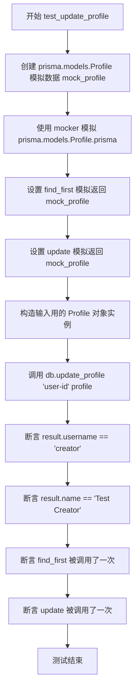

#### 带注释源码

```python
@pytest.mark.asyncio(loop_scope="session")
async def test_update_profile(mocker):
    # 模拟数据：创建一个 Prisma Profile 模型的实例，用于模拟数据库中已存在的记录
    mock_profile = prisma.models.Profile(
        id="profile-id",
        name="Test Creator",
        username="creator",
        userId="user-id",
        description="Test description",
        links=["link1"],
        avatarUrl="avatar.jpg",
        isFeatured=False,
        createdAt=datetime.now(),
        updatedAt=datetime.now(),
    )

    # 模拟 Prisma 调用：拦截 prisma.models.Profile.prisma 的调用
    mock_profile_db = mocker.patch("prisma.models.Profile.prisma")
    # 配置 find_first 方法，使其返回模拟的 profile 对象
    mock_profile_db.return_value.find_first = mocker.AsyncMock(
        return_value=mock_profile
    )
    # 配置 update 方法，使其返回模拟的 profile 对象
    mock_profile_db.return_value.update = mocker.AsyncMock(return_value=mock_profile)

    # 测试数据：构造传入被测函数的 Profile 业务对象
    profile = Profile(
        name="Test Creator",
        username="creator",
        description="Test description",
        links=["link1"],
        avatar_url="avatar.jpg",
        is_featured=False,
    )

    # 调用函数：执行实际的 db.update_profile 函数
    result = await db.update_profile("user-id", profile)

    # 验证结果：检查返回结果的用户名和名称是否符合预期
    assert result.username == "creator"
    assert result.name == "Test Creator"

    # 验证 Mock 调用：确保数据库的查找和更新操作各被调用了一次
    mock_profile_db.return_value.find_first.assert_called_once()
    mock_profile_db.return_value.update.assert_called_once()
```


### `test_get_user_profile`

该测试函数旨在验证通过用户ID获取用户资料的功能。它通过模拟 Prisma 数据库客户端的 `find_first` 方法，返回预设的 Profile 模型数据，随后调用 `db.get_user_profile` 接口，并断言返回的数据对象与预期值一致，确保逻辑正确性。

参数：

-  `mocker`：`MockFixture`，Pytest-mock 提供的 fixture，用于模拟对象和修补依赖项，以隔离被测函数与真实数据库的交互。

返回值：`None`，作为测试用例，该函数本身不返回业务数据，通过内部断言来判断测试通过与否。

#### 流程图

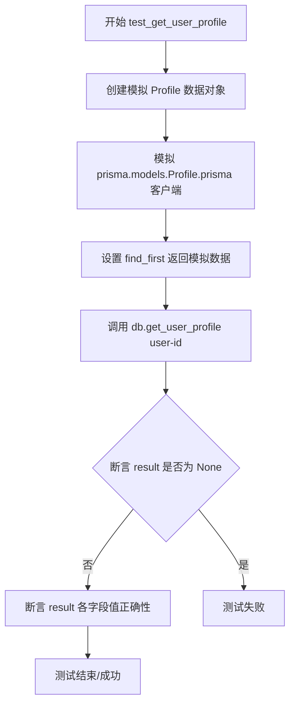

#### 带注释源码

```python
@pytest.mark.asyncio(loop_scope="session")
async def test_get_user_profile(mocker):
    # 1. 准备模拟数据：创建一个 prisma.models.Profile 实例作为模拟的数据库返回结果
    mock_profile = prisma.models.Profile(
        id="profile-id",
        name="Test User",
        username="testuser",
        description="Test description",
        links=["link1", "link2"],
        avatarUrl="avatar.jpg",
        isFeatured=False,
        createdAt=datetime.now(),
        updatedAt=datetime.now(),
        userId="user-id",
    )

    # 2. 模拟数据库层：使用 mocker 替换 prisma.models.Profile.prisma，拦截实际的数据库调用
    mock_profile_db = mocker.patch("prisma.models.Profile.prisma")
    # 配置模拟对象的行为：当调用 find_first 时，异步返回上面创建的 mock_profile
    mock_profile_db.return_value.find_first = mocker.AsyncMock(
        return_value=mock_profile
    )

    # 3. 执行被测函数：调用 db 模块中的 get_user_profile 函数，传入用户 ID
    result = await db.get_user_profile("user-id")

    # 4. 验证结果：断言返回结果不为空
    assert result is not None
    # 5. 验证数据细节：断言返回对象的各个属性值与预期的模拟数据一致
    assert result.name == "Test User"
    assert result.username == "testuser"
    assert result.description == "Test description"
    assert result.links == ["link1", "link2"]
    assert result.avatar_url == "avatar.jpg"
```


### `test_get_store_agents_with_search_parameterized`

该测试函数旨在验证当传入包含潜在 SQL 注入代码的搜索关键词时，`db.get_store_agents` 方法能够利用参数化 SQL 安全地执行查询，防止 SQL 注入攻击，确保系统安全性。

参数：

-  `mocker`：`pytest_mock.MockFixture`，Pytest 提供的 fixture，用于在测试过程中模拟对象或打桩函数调用。

返回值：`None`，测试函数主要执行逻辑验证和断言，通常不返回具体数值。

#### 流程图

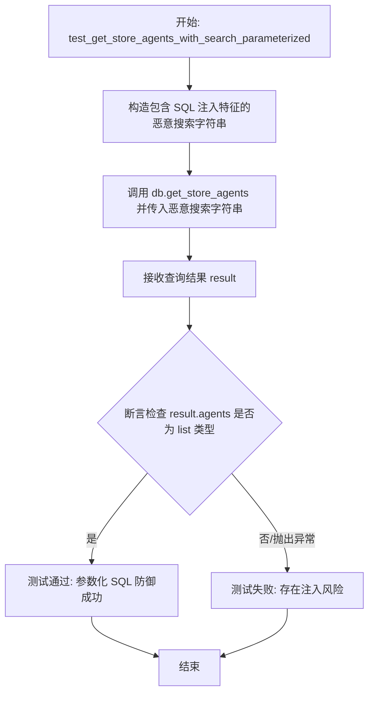

#### 带注释源码

```python
@pytest.mark.asyncio(loop_scope="session")
async def test_get_store_agents_with_search_parameterized(mocker):
    """Test that search query uses parameterized SQL - validates the fix works"""

    # 定义一个包含典型 SQL 注入语法的字符串
    # 目的是测试该字符串是否会被当作 SQL 命令执行
    malicious_search = "test'; DROP TABLE StoreAgent; --"
    
    # 调用待测函数 db.get_store_agents
    # 如果底层实现未使用参数化查询，数据库可能会抛出异常或导致数据丢失
    # 如果正确使用了参数化查询，该字符串仅作为普通文本匹配，不会产生破坏
    result = await db.get_store_agents(search_query=malicious_search)

    # 验证结果
    # 检查返回的 agents 字段是否为一个列表
    # 如果查询出错（如 SQL 语法错误），程序可能在此前抛出异常，导致测试失败
    assert isinstance(result.agents, list)
```


### `test_get_store_agents_with_search_and_filters_parameterized`

该测试函数用于验证 `db.get_store_agents` 方法在接收包含多个过滤器及潜在 SQL 注入攻击载荷的参数时，能否通过参数化查询安全执行，确保数据库操作未受恶意代码影响且返回正确类型的数据。

参数：

-   无

返回值：`None`，该函数为测试函数，主要执行断言逻辑，无显式返回值。

#### 流程图

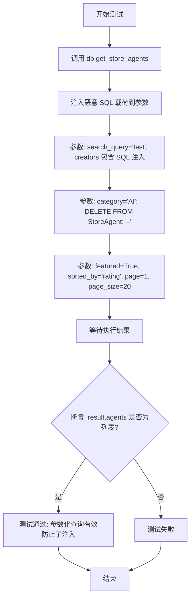

#### 带注释源码

```python
@pytest.mark.asyncio(loop_scope="session")
async def test_get_store_agents_with_search_and_filters_parameterized():
    """Test parameterized SQL with multiple filters"""

    # Call with multiple filters including potential injection attempts
    # 调用数据库函数，传入多种过滤条件。
    # 其中 creators 列表和 category 字符串包含了潜在的 SQL 注入恶意代码，用于验证参数化查询是否能安全处理。
    result = await db.get_store_agents(
        search_query="test",
        creators=["creator1'; DROP TABLE Users; --", "creator2"],
        category="AI'; DELETE FROM StoreAgent; --",
        featured=True,
        sorted_by="rating",
        page=1,
        page_size=20,
    )

    # Verify the query executed without error
    # 验证查询执行无误，断言返回结果中的 agents 字段是一个列表，
    # 这意味着查询成功执行且没有被恶意 SQL 语句破坏或报错。
    assert isinstance(result.agents, list)
```


### `test_get_store_agents_search_category_array_injection`

该函数是一个 pytest 异步测试用例，旨在验证 `db.get_store_agents` 方法在处理 `category` 参数时是否能够通过参数化查询有效防止 SQL 注入攻击。测试通过构造一个包含恶意 SQL 语句的字符串作为参数传入，并断言查询能够正常执行且返回结果符合预期类型，从而确保系统的安全性。

参数：

-  无

返回值：`None`，测试函数无返回值，通过断言语句验证功能正确性。

#### 流程图

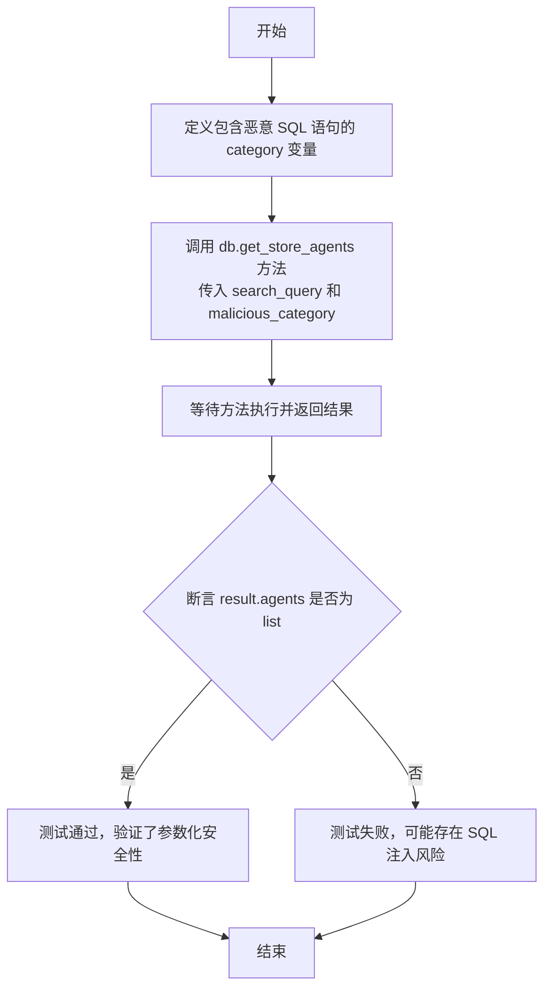

#### 带注释源码

```python
@pytest.mark.asyncio(loop_scope="session")
async def test_get_store_agents_search_category_array_injection():
    """Test that category parameter is safely passed as a parameter"""
    # 尝试通过 category 参数进行 SQL 注入
    # 构造一个包含 DROP TABLE 语句的恶意字符串
    malicious_category = "AI'; DROP TABLE StoreAgent; --"
    
    # 调用被测函数 db.get_store_agents
    # 将恶意字符串作为 category 参数传入
    result = await db.get_store_agents(
        search_query="test",
        category=malicious_category,
    )

    # 验证查询执行无误
    # 如果 SQL 注入成功，可能会抛出数据库错误或返回非预期结果
    # 这里断言返回的 agents 是列表类型，说明查询被安全执行
    # Category 应该被参数化处理，从而防止 SQL 注入
    assert isinstance(result.agents, list)
```


## 关键组件


### 商店代理查询服务

封装获取商店代理列表及详情的业务逻辑，支持通过搜索词、创建者、分类进行筛选，并处理分页、排序及活跃版本解析。

### 提交创建服务

处理新代理商店提交流程的逻辑，负责验证代理图谱的存在性，创建商店列表记录并初始化相关的版本信息。

### 用户档案管理服务

管理用户及创作者资料的读取与更新操作，涵盖个人信息的查询、修改以及用户名、头像、链接等属性的维护。

### SQL注入防护机制

通过参数化查询的方式安全地处理用户输入（如搜索关键词和分类过滤器），有效防止 SQL 注入攻击并保证数据库操作的安全性。

### 数据库ORM交互层

基于 Prisma 客户端构建的数据访问组件，负责执行底层的数据库增删改查操作，并在测试环境中通过 Mock 模拟这些交互行为。


## 问题及建议


### 已知问题

-   SQL注入测试验证逻辑被动且不充分。最后的三个测试（`test_get_store_agents_with_search_parameterized` 等）仅通过调用函数并断言返回结果为列表来验证安全性。如果攻击载荷导致数据库静默返回空结果或被应用层捕获异常后返回默认值，测试将错误地通过，而没有真正验证 SQL 查询是否使用了参数化绑定。
-   Mock 对象与具体 ORM 实现强耦合。测试代码直接对 `prisma.models` 下的具体模型进行 Patch（如 `mocker.patch("prisma.models.StoreAgent.prisma")`）。这种测试方式非常脆弱，一旦 Prisma 库升级内部结构，或者项目更换 ORM 层实现，所有相关的 Mock 逻辑都需要重写。
-   全局状态管理存在异味。`setup_prisma` fixture 中使用 `try...except` 来捕获 `ClientAlreadyRegisteredError` 以处理客户端重复注册的问题。这种通过异常来控制流程的设计不利于测试的清晰度，且在 `loop_scope="session"` 的高并发测试场景下可能掩盖潜在的连接初始化问题。

### 优化建议

-   引入测试数据工厂模式。当前代码在每个测试用例中手动构造复杂的 `prisma.models` 对象，导致大量冗余代码。建议引入 `factory_boy` 或编写辅助函数来生成标准的测试数据，以提高测试代码的可读性和可维护性。
-   使用参数化测试合并 SQL 注入测试用例。针对 SQL 注入的三个测试用例逻辑基本一致，仅输入参数不同。建议使用 `@pytest.mark.parametrize` 将它们合并为一个测试函数，覆盖不同的注入场景，从而减少重复代码并统一测试意图。
-   提升 Mock 层级以解耦 ORM 细节。不应直接 Mock Prisma ORM 的底层模型，而是 Mock 应用层 `db` 模块所依赖的数据库客户端接口或 Repository 层。这样可以隔离数据库实现细节，使测试更专注于业务逻辑的正确性。
-   增强断言以主动验证参数化查询。在 SQL 注入测试中，不应仅依赖“未抛出异常”来证明安全性。应当利用 Mock 对象（如 `mock_store_agent.return_value.find_many`）检查调用时的参数，确认查询语句与用户输入是分离的，或者验证生成的 SQL 语句结构符合预期。


## 其它


### 设计目标与约束

**设计目标**
1.  **异步数据访问**：系统旨在提供完全异步的数据库操作接口，以确保在高并发场景下（如 I/O 密集型的 Web 请求）不会阻塞事件循环，提高服务吞吐量。
2.  **模块化解耦**：通过 `db` 模块封装底层的 Prisma Client 调用，将业务逻辑与数据库持久化细节分离，便于维护和替换底层实现。
3.  **数据一致性**：确保对 Agent（代理）、Creator（创建者）、StoreListing（商店列表）等多表关联查询时的数据完整性，特别是在处理版本控制时，确保获取到正确的活跃版本数据。

**约束条件**
1.  **技术栈限制**：必须使用 `Prisma` 作为 ORM 工具，并遵循其定义的模型结构（如 `StoreAgent`, `Profile`, `AgentGraph` 等）。
2.  **测试环境约束**：数据库交互逻辑的实现必须能够被 `mocker` (unittest.mock) 成功模拟，以确保单元测试不依赖真实数据库环境即可运行。
3.  **查询安全约束**：所有的动态查询（特别是涉及搜索、过滤功能的部分）必须使用参数化查询，严格禁止字符串拼接 SQL，以防止 SQL 注入攻击。

### 错误处理与异常设计

**异常处理策略**
1.  **客户端注册冲突**：在测试初始化阶段（`setup_prisma`），系统通过捕获 `prisma.errors.ClientAlreadyRegisteredError` 来处理 Prisma Client 单例重复注册的问题，防止因 Fixture 重复执行导致的程序崩溃。
2.  **数据不存在处理**：在设计上，当查询特定资源（如 `get_store_agent_details` 或 `get_user_profile`）时，若数据库中不存在对应记录，系统倾向于返回 `None` 或空集合，或者抛出明确的 `NotFoundError`（具体由 `db` 模块实现，测试中主要验证了正常存在的情况）。测试用例 `test_create_store_submission` 展示了在 `find_first` 返回 `None` 时，逻辑应转向创建新记录。
3.  **模型验证异常**：输入数据（如创建提交或更新 Profile 时）需符合 Prisma Model 的类型约束。若类型不匹配，Prisma Client 将抛出验证错误，调用方需处理此类异常。

**关键异常点**
*   **Prisma Client 连接失败**：虽然测试中 Mock 了连接，但在实际运行中需处理数据库连接不可用的情况。
*   **唯一性约束违反**：在创建 StoreListing 或更新 Profile 时，若违反唯一性约束（如 Username 重复），需捕获并处理数据库返回的异常。

### 数据流与状态机

**数据流**
1.  **请求流入**：外部调用者（API 层）调用 `db` 模块中的函数，传递查询参数（如 `slug`, `username`）或负载对象（如 `Profile`）。
2.  **查询构建**：`db` 模块根据输入参数构建 Prisma 查询条件（`where` 子句）。
3.  **数据转换与聚合**：
    *   在 `test_get_store_agent_details` 中，数据流涉及多次查询：首先根据 `creator` 和 `slug` 查找基础 Agent 信息，然后查询 `StoreListing` 获取 `activeVersionId`，最后根据该 ID 查询活跃版本的 Agent 详细信息。
    *   数据从数据库的原始 Record 格式转换为业务对象（如 `Profile` Model 或 Pydantic 模型）。
4.  **响应流出**：处理后的数据被封装并返回给调用者。

**状态机**
*   **StoreListing Version（版本状态）**：测试中隐含了版本状态管理。`StoreListing` 拥有一个 `activeVersionId`。Agent 数据存在“当前查询版本”和“活跃版本”的区别。逻辑核心在于根据 `StoreListing` 的状态（`hasApprovedVersion`, `activeVersionId`）来决定返回哪个版本的数据。
*   **Submission Status（提交状态）**：`StoreListingVersion` 包含 `submissionStatus` 字段（测试中使用了 `PENDING` 状态），表示商店条目的审核流转状态（待审核 -> 已批准/已拒绝）。

### 外部依赖与接口契约

**外部依赖**
1.  **Prisma Client (`prisma`)**：核心依赖，负责与数据库进行所有交互（CRUD 操作）。依赖其生成的 Python 客户端代码（`prisma.models`）。
2.  **Pytest & Pytest-asyncio**：测试框架依赖，提供 `pytest.mark.asyncio` 装饰器以支持异步测试用例的执行。
3.  **Datetime 模块**：Python 标准库，用于生成和处理时间戳数据（如 `updated_at`）。
4.  **Internal Models (`Profile`)**：依赖项目内部定义的 `Profile` 模型类作为数据传输对象（DTO）。

**接口契约**
*   **`db.get_store_agents`**:
    *   **输入**: 可选的 `search_query` (str), `creators` (List[str]), `category` (str), `featured` (bool), `sorted_by` (str), `page` (int), `page_size` (int)。
    *   **输出**: 包含 `agents` (列表) 和 `pagination` (含 `total_items`) 的对象。
    *   **契约**: 必须保证输入参数（特别是搜索字符串）经过参数化处理，不直接拼接 SQL。
*   **`db.get_store_agent_details(creator, slug)`**:
    *   **输入**: `creator` (用户名), `slug` (代理标识)。
    *   **输出**: 代理详情对象。
    *   **契约**: 必须返回 `StoreListing` 当前激活版本对应的 `StoreAgent` 数据，而非简单的第一条记录。
*   **`db.create_store_submission(...)`**:
    *   **输入**: `user_id`, `agent_id`, `agent_version`, `slug`, `name`, `description` 等元数据。
    *   **输出**: 创建的 StoreListing 对象（包含生成的 ID）。
    *   **契约**: 只有在 `AgentGraph` 存在且对应 `StoreListing` 不存在（或逻辑允许创建新版本）时才执行创建。

### 安全性与合规

**1. SQL 注入防护**
系统高度关注查询安全性。测试用例 `test_get_store_agents_with_search_parameterized` 和 `test_get_store_agents_search_category_array_injection` 专门验证了在传入包含恶意 SQL 片段（如 `'; DROP TABLE...`）的 `search_query` 或 `category` 参数时，系统不会执行恶意代码，而是将其作为安全的字符串参数处理。这强制要求底层实现必须使用 Prisma 的参数绑定机制，严禁原始 SQL 拼接。

**2. 数据隔离与访问控制**
虽然代码主要关注数据访问层，但逻辑设计隐含了基于 `creator_username` 和 `userId` 的数据筛选。在 `get_store_agent_details` 和 `update_profile` 中，通过 `where` 条件限定操作范围，防止越权访问或修改不归属当前用户的数据。

**3. 敏感数据处理**
测试用例中展示了用户 ID (`userId`) 和创建者信息的处理。虽然测试数据是 Mock 的，但实际系统应确保对敏感字段（如内部 ID）的暴露受到严格控制，仅返回前端需要的展示信息（如 `username`, `avatar`）。

    