# `.\AutoGPT\autogpt_platform\backend\backend\api\features\store\embeddings.py` 详细设计文档

This service generates and stores OpenAI embeddings for various content types to enable semantic/hybrid search.

## 整体流程

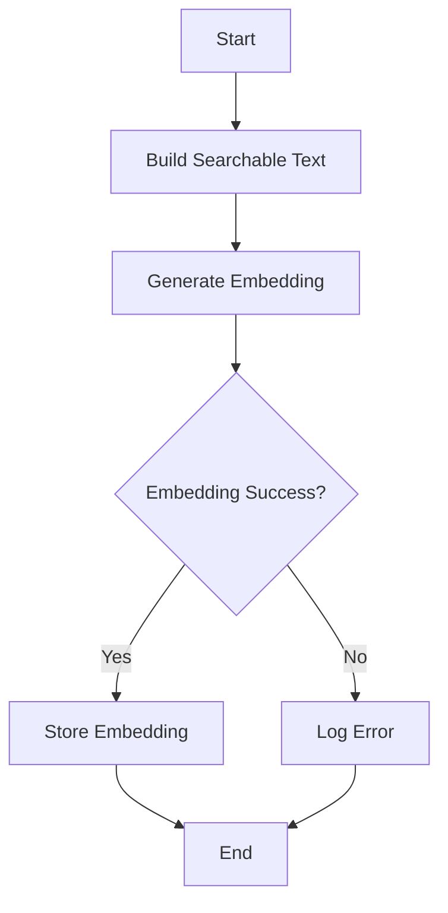

## 类结构

```
UnifiedContentEmbeddingsService (主类)
├── build_searchable_text (方法)
├── generate_embedding (异步方法)
├── store_embedding (异步方法)
├── get_embedding (异步方法)
├── get_content_embedding (异步方法)
├── ensure_embedding (异步方法)
├── delete_embedding (异步方法)
├── delete_content_embedding (异步方法)
├── get_embedding_stats (异步方法)
├── backfill_missing_embeddings (异步方法)
├── backfill_all_content_types (异步方法)
├── embed_query (异步方法)
├── embedding_to_vector_string (方法)
├── ensure_content_embedding (异步方法)
├── cleanup_orphaned_embeddings (异步方法)
├── semantic_search (异步方法)
└── logger (全局变量)
```

## 全局变量及字段


### `logger`
    
Logger instance for logging messages.

类型：`logging.Logger`
    


### `EMBEDDING_MODEL`
    
The OpenAI embedding model to use.

类型：`str`
    


### `EMBEDDING_DIM`
    
The dimension of the embedding vector for the specified model.

类型：`int`
    


### `EMBEDDING_MAX_TOKENS`
    
The maximum number of tokens allowed for embedding generation.

类型：`int`
    


### `CONTENT_HANDLERS`
    
Dictionary mapping content types to their respective handlers.

类型：`dict`
    


    

## 全局函数及方法


### `build_searchable_text`

Builds searchable text from listing version fields.

参数：

- `name`：`str`，The name of the content.
- `description`：`str`，The main content description.
- `sub_heading`：`str`，The sub-heading providing context.
- `categories`：`list[str]`，The categories of the content.

返回值：`str`，The combined string for embedding.

#### 流程图

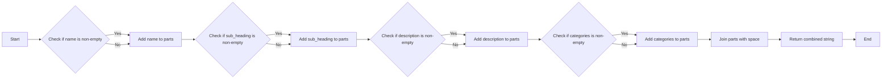

#### 带注释源码

```python
def build_searchable_text(
    name: str,
    description: str,
    sub_heading: str,
    categories: list[str],
) -> str:
    """
    Build searchable text from listing version fields.

    Combines relevant fields into a single string for embedding.
    """
    parts = []

    # Name is important - include it
    if name:
        parts.append(name)

    # Sub-heading provides context
    if sub_heading:
        parts.append(sub_heading)

    # Description is the main content
    if description:
        parts.append(description)

    # Categories help with semantic matching
    if categories:
        parts.append(" ".join(categories))

    return " ".join(parts)
```


### `generate_embedding`

Generate embedding for text using OpenAI API.

参数：

- `text`：`str`，The text to generate an embedding for.

返回值：`list[float]`，The embedding for the text.

#### 流程图

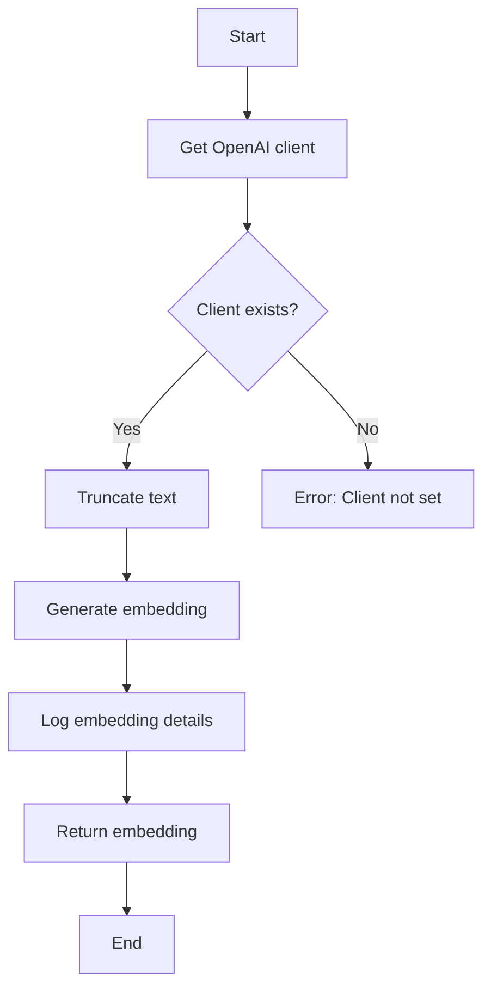

#### 带注释源码

```python
async def generate_embedding(text: str) -> list[float]:
    """
    Generate embedding for text using OpenAI API.

    Raises exceptions on failure - caller should handle.
    """
    client = get_openai_client()
    if not client:
        raise RuntimeError("openai_internal_api_key not set, cannot generate embedding")

    # Truncate text to token limit using tiktoken
    enc = encoding_for_model(EMBEDDING_MODEL)
    tokens = enc.encode(text)
    if len(tokens) > EMBEDDING_MAX_TOKENS:
        tokens = tokens[:EMBEDDING_MAX_TOKENS]
        truncated_text = enc.decode(tokens)
        logger.info(
            f"Truncated text from {len(enc.encode(text))} to {len(tokens)} tokens"
        )
    else:
        truncated_text = text

    start_time = time.time()
    response = await client.embeddings.create(
        model=EMBEDDING_MODEL,
        input=truncated_text,
    )
    latency_ms = (time.time() - start_time) * 1000

    embedding = response.data[0].embedding
    logger.info(
        f"Generated embedding: {len(embedding)} dims, "
        f"{len(tokens)} tokens, {latency_ms:.0f}ms"
    )
    return embedding
```


### `store_embedding`

Store embedding in the database.

参数：

- `version_id`：`str`，The unique identifier for the content version.
- `embedding`：`list[float]`，The embedding to store.
- `tx`：`prisma.Prisma | None`，Optional transaction client.

返回值：`bool`，True if the embedding was stored successfully, False otherwise.

#### 流程图

```mermaid
graph TD
    A[Start] --> B[Check if tx is provided]
    B -->|Yes| C[Use tx]
    B -->|No| D[Get prisma client]
    C, D --> E[Build embedding string]
    E --> F[Execute raw SQL with schema]
    F --> G[Check if result is True]
    G -->|Yes| H[Log success]
    G -->|No| I[Log failure]
    H --> J[End]
    I --> J
```

#### 带注释源码

```python
async def store_embedding(
    version_id: str,
    embedding: list[float],
    tx: prisma.Prisma | None = None,
) -> bool:
    """
    Store embedding in the database.

    BACKWARD COMPATIBILITY: Maintained for existing store listing usage.
    DEPRECATED: Use ensure_embedding() instead (includes searchable_text).
    """
    return await store_content_embedding(
        content_type=ContentType.STORE_AGENT,
        content_id=version_id,
        embedding=embedding,
        searchable_text="",  # Empty for backward compat; ensure_embedding() populates this
        metadata=None,
        user_id=None,  # Store agents are public
        tx=tx,
    )
```


### `get_embedding`

Retrieve embedding record for a listing version.

参数：

- `version_id`：`str`，The unique identifier for the listing version.

返回值：`dict[str, Any] | None`，A dictionary with the storeListingVersionId, embedding, timestamps or None if not found.

#### 流程图

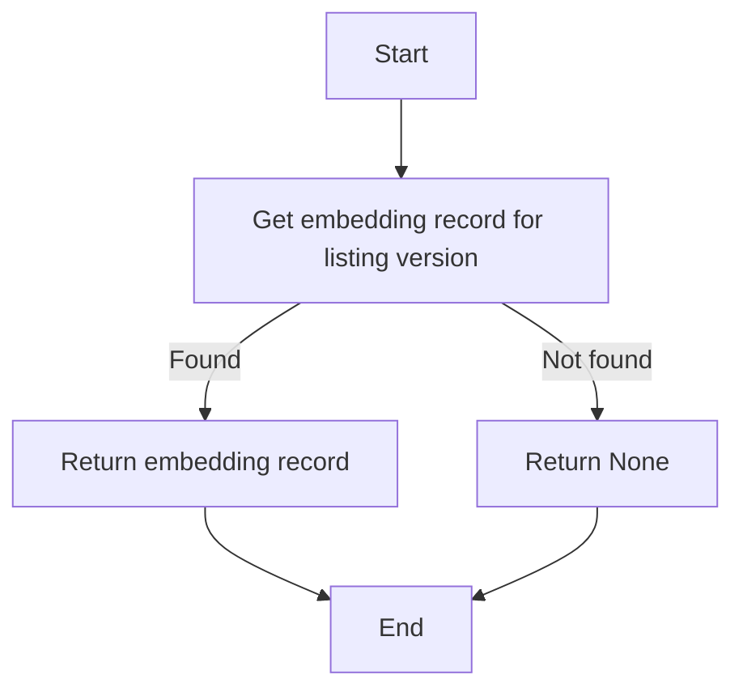

#### 带注释源码

```python
async def get_embedding(version_id: str) -> dict[str, Any] | None:
    """
    Retrieve embedding record for a listing version.

    BACKWARD COMPATIBILITY: Maintained for existing store listing usage.
    Returns dict with storeListingVersionId, embedding, timestamps or None if not found.
    """
    result = await get_content_embedding(
        ContentType.STORE_AGENT, version_id, user_id=None
    )
    if result:
        # Transform to old format for backward compatibility
        return {
            "storeListingVersionId": result["contentId"],
            "embedding": result["embedding"],
            "createdAt": result["createdAt"],
            "updatedAt": result["updatedAt"],
        }
    return None
```


### `get_content_embedding`

Retrieve embedding record for any content type.

参数：

- `content_type`：`ContentType`，The type of content (e.g., BLOCK, STORE_AGENT, DOCUMENTATION).
- `content_id`：`str`，The unique identifier for the content.
- `user_id`：`str | None`，Optional user ID. For public content (e.g., BLOCK, STORE_AGENT), pass None. For user-scoped content (e.g., LIBRARY_AGENT), pass the user's ID to avoid deleting embeddings belonging to other users.

返回值：`dict[str, Any] | None`，A dictionary with contentType, contentId, embedding, timestamps or None if not found.

#### 流程图

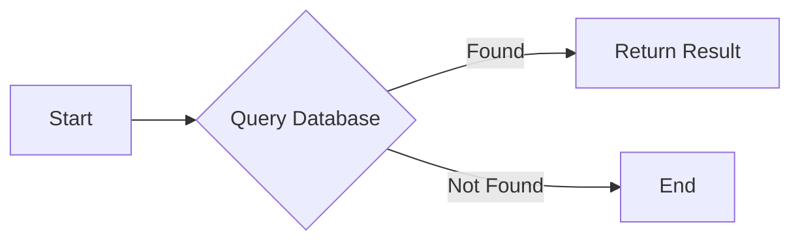

#### 带注释源码

```python
async def get_content_embedding(
    content_type: ContentType, content_id: str, user_id: str | None = None
) -> dict[str, Any] | None:
    """
    Retrieve embedding record for any content type.

    New function for unified content embedding retrieval.
    Returns dict with contentType, contentId, embedding, timestamps or None if not found.

    Raises exceptions on failure - caller should handle.
    """
    result = await query_raw_with_schema(
        """
        SELECT
            "contentType",
            "contentId",
            "userId",
            "embedding"::text as "embedding",
            "searchableText",
            "metadata",
            "createdAt",
            "updatedAt"
        FROM {schema_prefix}"UnifiedContentEmbedding"
        WHERE "contentType" = $1::{schema_prefix}"ContentType" AND "contentId" = $2 AND ("userId" = $3 OR ($3 IS NULL AND "userId" IS NULL))
        """,
        content_type,
        content_id,
        user_id,
    )

    if result and len(result) > 0:
        return result[0]
    return None
```


### `ensure_embedding`

Ensure an embedding exists for the listing version.

参数：

- `version_id`：`str`，The StoreListingVersion ID
- `name`：`str`，Agent name
- `description`：`str`，Agent description
- `sub_heading`：`str`，Agent sub-heading
- `categories`：`list[str]`，Agent categories
- `force`：`bool`，Force regeneration even if embedding exists
- `tx`：`prisma.Prisma | None`，Optional transaction client

返回值：`bool`，True if embedding exists/was created

#### 流程图

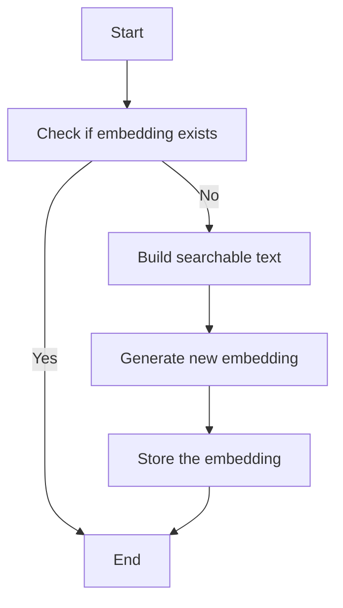

#### 带注释源码

```python
async def ensure_embedding(
    version_id: str,
    name: str,
    description: str,
    sub_heading: str,
    categories: list[str],
    force: bool = False,
    tx: prisma.Prisma | None = None,
) -> bool:
    # Check if embedding already exists
    if not force:
        existing = await get_embedding(version_id)
        if existing and existing.get("embedding"):
            logger.debug(f"Embedding for version {version_id} already exists")
            return True

    # Build searchable text for embedding
    searchable_text = build_searchable_text(name, description, sub_heading, categories)

    # Generate new embedding
    embedding = await generate_embedding(searchable_text)

    # Store the embedding with metadata using new function
    metadata = {
        "name": name,
        "subHeading": sub_heading,
        "categories": categories,
    }
    return await store_content_embedding(
        content_type=ContentType.STORE_AGENT,
        content_id=version_id,
        embedding=embedding,
        searchable_text=searchable_text,
        metadata=metadata,
        user_id=None,  # Store agents are public
        tx=tx,
    )
```


### `delete_content_embedding`

Delete embedding for any content type.

参数：

- `content_type`：`ContentType`，The type of content (STORE_AGENT, LIBRARY_AGENT, etc.)
- `content_id`：`str`，The unique identifier for the content
- `user_id`：`str | None`，Optional user ID. For public content (STORE_AGENT, BLOCK), pass None. For user-scoped content (LIBRARY_AGENT), pass the user's ID to avoid deleting embeddings belonging to other users.

返回值：`bool`，True if deletion succeeded, False otherwise

#### 流程图

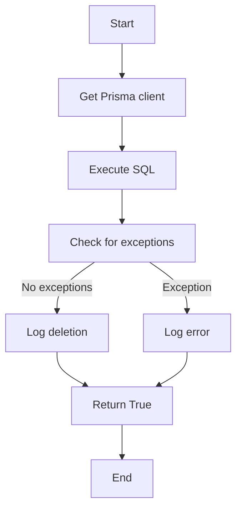

#### 带注释源码

```python
async def delete_content_embedding(
    content_type: ContentType, content_id: str, user_id: str | None = None
) -> bool:
    """
    Delete embedding for any content type.

    Args:
        content_type: The type of content (STORE_AGENT, LIBRARY_AGENT, etc.)
        content_id: The unique identifier for the content
        user_id: Optional user ID. For public content (STORE_AGENT, BLOCK), pass None.
                 For user-scoped content (LIBRARY_AGENT), pass the user's ID to avoid
                 deleting embeddings belonging to other users.

    Returns:
        True if deletion succeeded, False otherwise
    """
    try:
        client = prisma.get_client()

        await execute_raw_with_schema(
            """
            DELETE FROM {schema_prefix}"UnifiedContentEmbedding"
            WHERE "contentType" = $1::{schema_prefix}"ContentType"
              AND "contentId" = $2
              AND ("userId" = $3 OR ($3 IS NULL AND "userId" IS NULL))
            """,
            content_type,
            content_id,
            user_id,
            client=client,
        )

        user_str = f" (user: {user_id})" if user_id else ""
        logger.info(f"Deleted embedding for {content_type}:{content_id}{user_str}")
        return True

    except Exception as e:
        logger.error(f"Failed to delete embedding for {content_type}:{content_id}: {e}")
        return False
```


### `delete_content_embedding`

Delete embedding for any content type.

参数：

- `content_type`：`ContentType`，The type of content (STORE_AGENT, LIBRARY_AGENT, etc.)
- `content_id`：`str`，The unique identifier for the content
- `user_id`：`str | None`，Optional user ID. For public content (STORE_AGENT, BLOCK), pass None. For user-scoped content (LIBRARY_AGENT), pass the user's ID to avoid deleting embeddings belonging to other users.

返回值：`bool`，True if deletion succeeded, False otherwise

#### 流程图

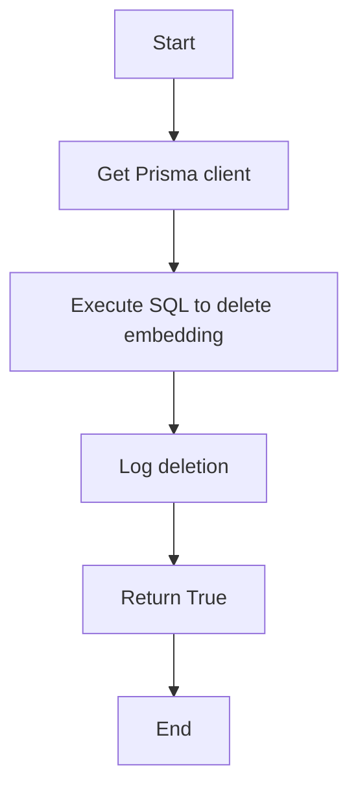

#### 带注释源码

```python
async def delete_content_embedding(
    content_type: ContentType, content_id: str, user_id: str | None = None
) -> bool:
    """
    Delete embedding for any content type.

    Args:
        content_type: The type of content (STORE_AGENT, LIBRARY_AGENT, etc.)
        content_id: The unique identifier for the content
        user_id: Optional user ID. For public content (STORE_AGENT, BLOCK), pass None.
                 For user-scoped content (LIBRARY_AGENT), pass the user's ID to avoid
                 deleting embeddings belonging to other users.

    Returns:
        True if deletion succeeded, False otherwise
    """
    try:
        client = prisma.get_client()

        await execute_raw_with_schema(
            """
            DELETE FROM {schema_prefix}"UnifiedContentEmbedding"
            WHERE "contentType" = $1::{schema_prefix}"ContentType"
              AND "contentId" = $2
              AND ("userId" = $3 OR ($3 IS NULL AND "userId" IS NULL))
            """,
            content_type,
            content_id,
            user_id,
            client=client,
        )

        user_str = f" (user: {user_id})" if user_id else ""
        logger.info(f"Deleted embedding for {content_type}:{content_id}{user_str}")
        return True

    except Exception as e:
        logger.error(f"Failed to delete embedding for {content_type}:{content_id}: {e}")
        return False
``` 


### `get_embedding_stats`

Get statistics about embedding coverage for all content types.

参数：

- `None`：`None`，No parameters required for this function.

返回值：`dict[str, Any]`，A dictionary containing stats per content type and overall totals.

#### 流程图

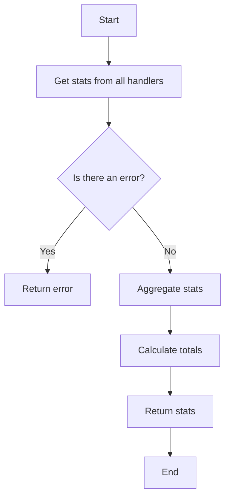

#### 带注释源码

```python
async def get_embedding_stats() -> dict[str, Any]:
    """
    Get statistics about embedding coverage for all content types.

    Returns stats per content type and overall totals.
    """
    try:
        stats_by_type = {}
        total_items = 0
        total_with_embeddings = 0
        total_without_embeddings = 0

        # Aggregate stats from all handlers
        for content_type, handler in CONTENT_HANDLERS.items():
            try:
                stats = await handler.get_stats()
                stats_by_type[content_type.value] = {
                    "total": stats["total"],
                    "with_embeddings": stats["with_embeddings"],
                    "without_embeddings": stats["without_embeddings"],
                    "coverage_percent": (
                        round(stats["with_embeddings"] / stats["total"] * 100, 1)
                        if stats["total"] > 0
                        else 0
                    ),
                }

                total_items += stats["total"]
                total_with_embeddings += stats["with_embeddings"]
                total_without_embeddings += stats["without_embeddings"]

            except Exception as e:
                logger.error(f"Failed to get stats for {content_type.value}: {e}")
                stats_by_type[content_type.value] = {
                    "total": 0,
                    "with_embeddings": 0,
                    "without_embeddings": 0,
                    "coverage_percent": 0,
                    "error": str(e),
                }

        return {
            "by_type": stats_by_type,
            "totals": {
                "total": total_items,
                "with_embeddings": total_with_embeddings,
                "without_embeddings": total_without_embeddings,
                "coverage_percent": (
                    round(total_with_embeddings / total_items * 100, 1)
                    if total_items > 0
                    else 0
                ),
            },
        }

    except Exception as e:
        logger.error(f"Failed to get embedding stats: {e}")
        return {
            "by_type": {},
            "totals": {
                "total": 0,
                "with_embeddings": 0,
                "without_embeddings": 0,
                "coverage_percent": 0,
            },
            "error": str(e),
        }
``` 


### `backfill_missing_embeddings`

Generate embeddings for approved listings that don't have them.

参数：

- `batch_size`：`int`，Number of embeddings to generate per content type

返回值：`dict`，Dict with success/failure counts aggregated across all content types

#### 流程图

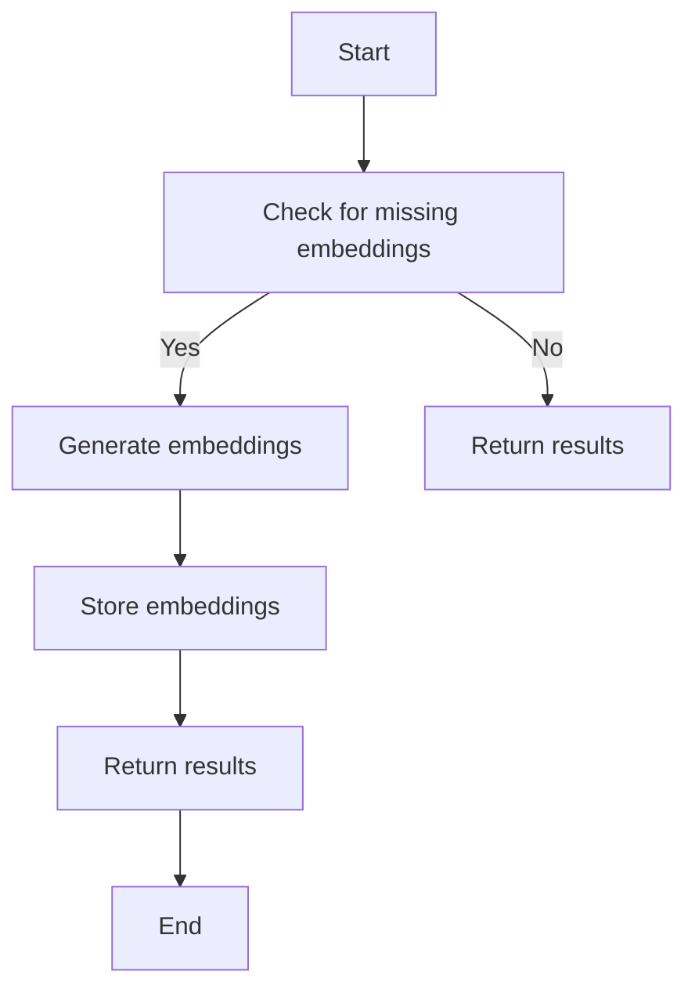

#### 带注释源码

```python
async def backfill_missing_embeddings(batch_size: int = 10) -> dict[str, Any]:
    """
    Generate embeddings for approved listings that don't have them.

    Args:
        batch_size: Number of embeddings to generate per content type

    Returns:
        Dict with success/failure counts aggregated across all content types
    """
    # Delegate to the new generic backfill system
    result = await backfill_all_content_types(batch_size)

    # Return in the old format for backward compatibility
    return result["totals"]
```


### backfill_all_content_types

#### 描述

The `backfill_all_content_types` function generates embeddings for all content types using registered handlers. It processes content types in a specific order to ensure foundational content is searchable first.

#### 参数

- `batch_size`: `int`，Number of embeddings to generate per content type

#### 返回值

- `dict[str, Any]`，Dict with stats per content type and overall totals

#### 流程图

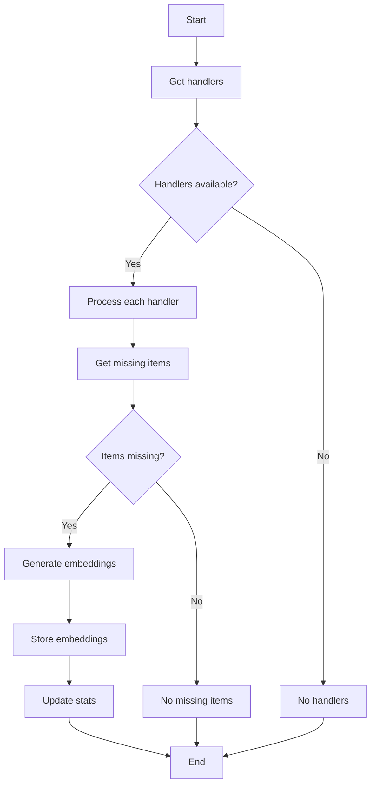

#### 带注释源码

```python
async def backfill_all_content_types(batch_size: int = 10) -> dict[str, Any]:
    """
    Generate embeddings for all content types using registered handlers.

    Processes content types in order: BLOCK → STORE_AGENT → DOCUMENTATION.
    This ensures foundational content (blocks) are searchable first.

    Args:
        batch_size: Number of embeddings to generate per content type

    Returns:
        Dict with stats per content type and overall totals
    """
    results_by_type = {}
    total_processed = 0
    total_success = 0
    total_failed = 0
    all_errors: dict[str, int] = {}  # Aggregate errors across all content types

    # Process content types in explicit order
    processing_order = [
        ContentType.BLOCK,
        ContentType.STORE_AGENT,
        ContentType.DOCUMENTATION,
    ]

    for content_type in processing_order:
        handler = CONTENT_HANDLERS.get(content_type)
        if not handler:
            logger.warning(f"No handler registered for {content_type.value}")
            continue
        try:
            logger.info(f"Processing {content_type.value} content type...")

            # Get missing items from handler
            missing_items = await handler.get_missing_items(batch_size)

            if not missing_items:
                results_by_type[content_type.value] = {
                    "processed": 0,
                    "success": 0,
                    "failed": 0,
                    "message": "No missing embeddings",
                }
                continue

            # Process embeddings concurrently for better performance
            embedding_tasks = [
                ensure_content_embedding(
                    content_type=item.content_type,
                    content_id=item.content_id,
                    searchable_text=item.searchable_text,
                    metadata=item.metadata,
                    user_id=item.user_id,
                )
                for item in missing_items
            ]

            results = await asyncio.gather(*embedding_tasks, return_exceptions=True)

            success = sum(1 for result in results if result is True)
            failed = len(results) - success

            # Aggregate errors across all content types
            if failed > 0:
                for result in results:
                    if isinstance(result, Exception):
                        error_key = f"{type(result).__name__}: {str(result)}"
                        all_errors[error_key] = all_errors.get(error_key, 0) + 1

            results_by_type[content_type.value] = {
                "processed": len(missing_items),
                "success": success,
                "failed": failed,
                "message": f"Backfilled {success} embeddings, {failed} failed",
            }

            total_processed += len(missing_items)
            total_success += success
            total_failed += failed

            logger.info(
                f"{content_type.value}: processed {len(missing_items)}, "
                f"success {success}, failed {failed}"
            )

        except Exception as e:
            logger.error(f"Failed to process {content_type.value}: {e}")
            results_by_type[content_type.value] = {
                "processed": 0,
                "success": 0,
                "failed": 0,
                "error": str(e),
            }

    # Log aggregated errors once at the end
    if all_errors:
        error_details = ", ".join(
            f"{error} ({count}x)" for error, count in all_errors.items()
        )
        logger.error(f"Embedding backfill errors: {error_details}")

    return {
        "by_type": results_by_type,
        "totals": {
            "processed": total_processed,
            "success": total_success,
            "failed": total_failed,
            "message": f"Overall: {total_success} succeeded, {total_failed} failed",
        },
    }
```


### `embed_query(query: str) -> list[float]`

Generate embedding for a search query.

参数：

- `query`：`str`，The search query string to generate an embedding for.

返回值：`list[float]`，The embedding for the search query.

#### 流程图

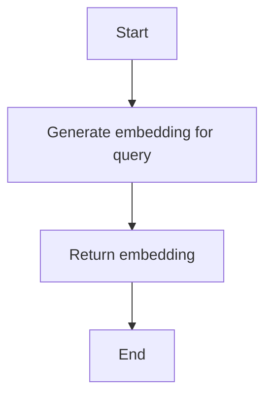

#### 带注释源码

```python
async def embed_query(query: str) -> list[float]:
    """
    Generate embedding for a search query.

    Same as generate_embedding but with clearer intent.
    Raises exceptions on failure - caller should handle.
    """
    return await generate_embedding(query)
```


### `embedding_to_vector_string`

Convert embedding list to PostgreSQL vector string format.

参数：

- `embedding`：`list[float]`，Embedding list to convert to string format.

返回值：`str`，PostgreSQL vector string representation of the embedding.

#### 流程图

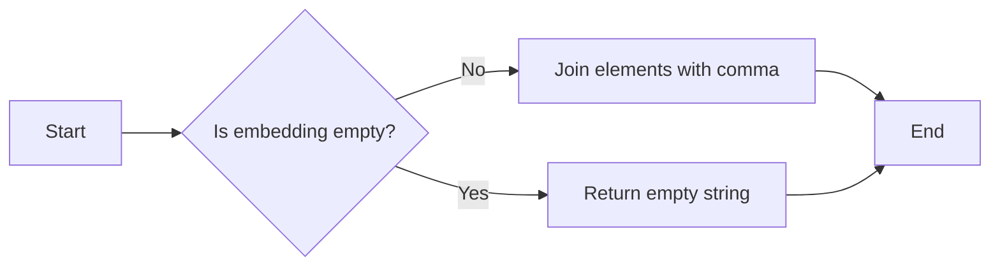

#### 带注释源码

```python
def embedding_to_vector_string(embedding: list[float]) -> str:
    """Convert embedding list to PostgreSQL vector string format."""
    return "[" + ",".join(str(x) for x in embedding) + "]"
```


### `ensure_content_embedding`

Ensure an embedding exists for any content type.

参数：

- `content_type`：`ContentType`，The content type of the content (e.g., STORE_AGENT, BLOCK, etc.)
- `content_id`：`str`，Unique identifier for the content
- `searchable_text`：`str`，Combined text for embedding generation
- `metadata`：`dict | None`，Optional metadata to store with embedding
- `force`：`bool`，Force regeneration even if embedding exists
- `tx`：`prisma.Prisma | None`，Optional transaction client

返回值：`bool`，True if embedding exists/was created

#### 流程图

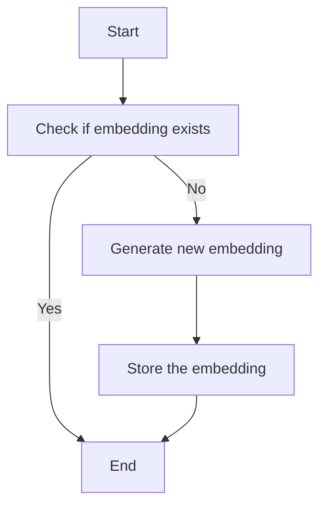

#### 带注释源码

```python
async def ensure_content_embedding(
    content_type: ContentType,
    content_id: str,
    searchable_text: str,
    metadata: dict | None = None,
    force: bool = False,
    tx: prisma.Prisma | None = None,
) -> bool:
    # Check if embedding already exists
    if not force:
        existing = await get_content_embedding(content_type, content_id)
        if existing and existing.get("embedding"):
            logger.debug(f"Embedding for {content_type}:{content_id} already exists")
            return True

    # Generate new embedding
    embedding = await generate_embedding(searchable_text)

    # Store the embedding
    return await store_content_embedding(
        content_type=content_type,
        content_id=content_id,
        embedding=embedding,
        searchable_text=searchable_text,
        metadata=metadata or {},
        user_id=user_id,
        tx=tx,
    )
```


### `cleanup_orphaned_embeddings`

Clean up embeddings for content that no longer exists or is no longer valid.

参数：

- `batch_size`：`int`，Number of embeddings to generate per content type

返回值：`dict[str, Any]`，Dict with cleanup statistics per content type

#### 流程图

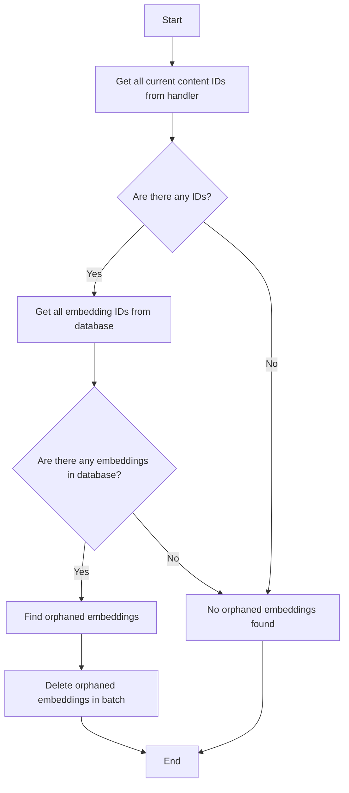

#### 带注释源码

```python
async def cleanup_orphaned_embeddings() -> dict[str, Any]:
    """
    Clean up embeddings for content that no longer exists or is no longer valid.

    Compares current content with embeddings in database and removes orphaned records:
    - STORE_AGENT: Removes embeddings for rejected/deleted store listings
    - BLOCK: Removes embeddings for blocks no longer registered
    - DOCUMENTATION: Removes embeddings for deleted doc files

    Returns:
        Dict with cleanup statistics per content type
    """
    results_by_type = {}
    total_deleted = 0

    # Cleanup orphaned embeddings for all content types
    cleanup_types = [
        ContentType.STORE_AGENT,
        ContentType.BLOCK,
        ContentType.DOCUMENTATION,
    ]

    for content_type in cleanup_types:
        try:
            handler = CONTENT_HANDLERS.get(content_type)
            if not handler:
                logger.warning(f"No handler registered for {content_type}")
                results_by_type[content_type.value] = {
                    "deleted": 0,
                    "error": "No handler registered",
                }
                continue

            # Get all current content IDs from handler
            if content_type == ContentType.STORE_AGENT:
                # Get IDs of approved store listing versions from non-deleted listings
                valid_agents = await query_raw_with_schema(
                    """
                    SELECT slv.id
                    FROM {schema_prefix}"StoreListingVersion" slv
                    JOIN {schema_prefix}"StoreListing" sl ON slv."storeListingId" = sl.id
                    WHERE slv."submissionStatus" = 'APPROVED'
                      AND slv."isDeleted" = false
                      AND sl."isDeleted" = false
                    """,
                )
                current_ids = {row["id"] for row in valid_agents}
            elif content_type == ContentType.BLOCK:
                from backend.data.block import get_blocks

                current_ids = set(get_blocks().keys())
            elif content_type == ContentType.DOCUMENTATION:
                # Use DocumentationHandler to get section-based content IDs
                from backend.api.features.store.content_handlers import (
                    DocumentationHandler,
                )

                doc_handler = CONTENT_HANDLERS.get(ContentType.DOCUMENTATION)
                if isinstance(doc_handler, DocumentationHandler):
                    docs_root = doc_handler._get_docs_root()
                    if docs_root.exists():
                        current_ids = doc_handler._get_all_section_content_ids(
                            docs_root
                        )
                    else:
                        current_ids = set()
                else:
                    current_ids = set()
            else:
                # Skip unknown content types to avoid accidental deletion
                logger.warning(
                    f"Skipping cleanup for unknown content type: {content_type}"
                )
                results_by_type[content_type.value] = {
                    "deleted": 0,
                    "error": "Unknown content type - skipped for safety",
                }
                continue

            # Get all embedding IDs from database
            db_embeddings = await query_raw_with_schema(
                """
                SELECT "contentId"
                FROM {schema_prefix}"UnifiedContentEmbedding"
                WHERE "contentType" = $1::{schema_prefix}"ContentType"
                """,
                content_type,
            )

            db_ids = {row["contentId"] for row in db_embeddings}

            # Find orphaned embeddings (in DB but not in current content)
            orphaned_ids = db_ids - current_ids

            if not orphaned_ids:
                logger.info(f"{content_type.value}: No orphaned embeddings found")
                results_by_type[content_type.value] = {
                    "deleted": 0,
                    "message": "No orphaned embeddings",
                }
                continue

            # Delete orphaned embeddings in batch for better performance
            orphaned_list = list(orphaned_ids)
            try:
                await execute_raw_with_schema(
                    """
                    DELETE FROM {schema_prefix}"UnifiedContentEmbedding"
                    WHERE "contentType" = $1::{schema_prefix}"ContentType"
                      AND "contentId" = ANY($2::text[])
                    """,
                    content_type,
                    orphaned_list,
                )
                deleted = len(orphaned_list)
            except Exception as e:
                logger.error(f"Failed to batch delete orphaned embeddings: {e}")
                deleted = 0

            logger.info(
                f"{content_type.value}: Deleted {deleted}/{len(orphaned_ids)} orphaned embeddings"
            )
            results_by_type[content_type.value] = {
                "deleted": deleted,
                "orphaned": len(orphaned_ids),
                "message": f"Deleted {deleted} orphaned embeddings",
            }

            total_deleted += deleted

        except Exception as e:
            logger.error(f"Failed to cleanup {content_type.value}: {e}")
            results_by_type[content_type.value] = {
                "deleted": 0,
                "error":


### `semantic_search`

Perform semantic search across content types using embeddings.

参数：

- `query`：`str`，The search query string.
- `content_types`：`list[ContentType] | None`，List of `ContentType` to search. Defaults to `[BLOCK, STORE_AGENT, DOCUMENTATION]`.
- `user_id`：`str | None`，Optional user ID for searching private content (library agents).
- `limit`：`int`，Maximum number of results to return (default: 20).
- `min_similarity`：`float`，Minimum cosine similarity threshold (0-1, default: 0.5).

返回值：`list[dict[str, Any]]`，List of search results with the following structure:
```json
[
    {
        "content_id": str,
        "content_type": str,  // "BLOCK", "STORE_AGENT", "DOCUMENTATION", or "LIBRARY_AGENT"
        "searchable_text": str,
        "metadata": dict,
        "similarity": float,  // Cosine similarity score (0-1)
    },
    ...
]
```

#### 流程图

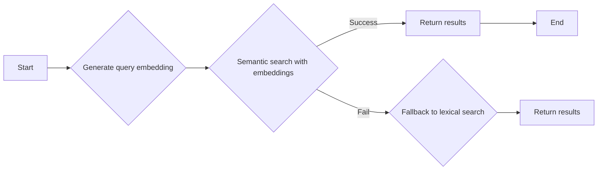

#### 带注释源码

```python
async def semantic_search(
    query: str,
    content_types: list[ContentType] | None = None,
    user_id: str | None = None,
    limit: int = 20,
    min_similarity: float = 0.5,
) -> list[dict[str, Any]]:
    # Default to searching all public content types
    if content_types is None:
        content_types = [
            ContentType.BLOCK,
            ContentType.STORE_AGENT,
            ContentType.DOCUMENTATION,
        ]

    # Validate inputs
    if not content_types:
        return []  # Empty content_types would cause invalid SQL (IN ())

    query = query.strip()
    if not query:
        return []

    if limit < 1:
        limit = 1
    if limit > 100:
        limit = 100

    # Generate query embedding
    try:
        query_embedding = await embed_query(query)
        # Semantic search with embeddings
        embedding_str = embedding_to_vector_string(query_embedding)

        # Build params in order: limit, then user_id (if provided), then content types
        params: list[Any] = [limit]
        user_filter = ""
        if user_id is not None:
            user_filter = 'AND "userId" = ${}'.format(len(params) + 1)
            params.append(user_id)

        # Add content type parameters and build placeholders dynamically
        content_type_start_idx = len(params) + 1
        content_type_placeholders = ", ".join(
            "$" + str(content_type_start_idx + i) + '::{schema_prefix}"ContentType"'
            for i in range(len(content_types))
        )
        params.extend([ct.value for ct in content_types])

        # Build min_similarity param index before appending
        min_similarity_idx = len(params) + 1
        params.append(min_similarity)

        # Use unqualified ::vector and <=> operator - pgvector is in search_path on all environments
        sql = (
            """
            SELECT
                "contentId" as content_id,
                "contentType" as content_type,
                "searchableText" as searchable_text,
                metadata,
                1 - (embedding <=> '"""
            + embedding_str
            + """'::vector) as similarity
            FROM {schema_prefix}"UnifiedContentEmbedding"
            WHERE "contentType" IN ("""
            + content_type_placeholders
            + """)
            """
            + user_filter
            + """
            AND 1 - (embedding <=> '"""
            + embedding_str
            + """'::vector) >= $"""
            + str(min_similarity_idx)
            + """
            ORDER BY similarity DESC
            LIMIT $1
        """
        )

        results = await query_raw_with_schema(sql, *params)
        return [
            {
                "content_id": row["content_id"],
                "content_type": row["content_type"],
                "searchable_text": row["searchable_text"],
                "metadata": row["metadata"],
                "similarity": float(row["similarity"]),
            }
            for row in results
        ]
    except Exception as e:
        logger.warning(f"Semantic search failed, falling back to lexical search: {e}")

    # Fallback to lexical search if embeddings unavailable

    params_lexical: list[Any] = [limit]
    user_filter = ""
    if user_id is not None:
        user_filter = 'AND "userId" = ${}'.format(len(params_lexical) + 1)
        params_lexical.append(user_id)

    # Add content type parameters and build placeholders dynamically
    content_type_start_idx = len(params_lexical) + 1
    content_type_placeholders_lexical = ", ".join(
        "$" + str(content_type_start_idx + i) + '::{schema_prefix}"ContentType"'
        for i in range(len(content_types))
    )
    params_lexical.extend([ct.value for ct in content_types])

    # Build query param index before appending
    query_param_idx = len(params_lexical) + 1
    params_lexical.append(f"%{query}%")

    # Use regular string (not f-string) for template to preserve {schema_prefix} placeholders
    sql_lexical = (


### `UnifiedContentEmbeddingsService.build_searchable_text`

Builds a searchable text string from the provided fields.

参数：

- `name`：`str`，The name of the content.
- `description`：`str`，The main content description.
- `sub_heading`：`str`，A sub-heading providing additional context.
- `categories`：`list[str]`，A list of categories associated with the content.

返回值：`str`，A combined string of the provided fields for embedding generation.

#### 流程图

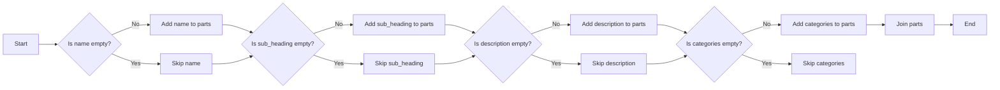

#### 带注释源码

```python
def build_searchable_text(
    name: str,
    description: str,
    sub_heading: str,
    categories: list[str],
) -> str:
    """
    Build searchable text from listing version fields.

    Combines relevant fields into a single string for embedding.
    """
    parts = []

    # Name is important - include it
    if name:
        parts.append(name)

    # Sub-heading provides context
    if sub_heading:
        parts.append(sub_heading)

    # Description is the main content
    if description:
        parts.append(description)

    # Categories help with semantic matching
    if categories:
        parts.append(" ".join(categories))

    return " ".join(parts)
```


### `generate_embedding`

Generate embedding for text using OpenAI API.

参数：

- `text`：`str`，The text to generate an embedding for.

返回值：`list[float]`，The embedding for the text.

#### 流程图

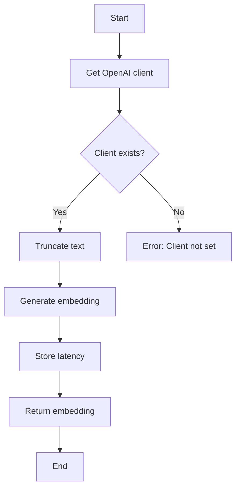

#### 带注释源码

```python
async def generate_embedding(text: str) -> list[float]:
    """
    Generate embedding for text using OpenAI API.

    Raises exceptions on failure - caller should handle.
    """
    client = get_openai_client()
    if not client:
        raise RuntimeError("openai_internal_api_key not set, cannot generate embedding")

    # Truncate text to token limit using tiktoken
    enc = encoding_for_model(EMBEDDING_MODEL)
    tokens = enc.encode(text)
    if len(tokens) > EMBEDDING_MAX_TOKENS:
        tokens = tokens[:EMBEDDING_MAX_TOKENS]
        truncated_text = enc.decode(tokens)
        logger.info(
            f"Truncated text from {len(enc.encode(text))} to {len(tokens)} tokens"
        )
    else:
        truncated_text = text

    start_time = time.time()
    response = await client.embeddings.create(
        model=EMBEDDING_MODEL,
        input=truncated_text,
    )
    latency_ms = (time.time() - start_time) * 1000

    embedding = response.data[0].embedding
    logger.info(
        f"Generated embedding: {len(embedding)} dims, "
        f"{len(tokens)} tokens, {latency_ms:.0f}ms"
    )
    return embedding
```


### `store_embedding`

Store embedding in the database.

参数：

- `version_id`：`str`，The unique identifier for the content version.
- `embedding`：`list[float]`，The embedding data to store.
- `tx`：`prisma.Prisma | None`，Optional transaction client.

返回值：`bool`，Indicates whether the embedding was stored successfully.

#### 流程图

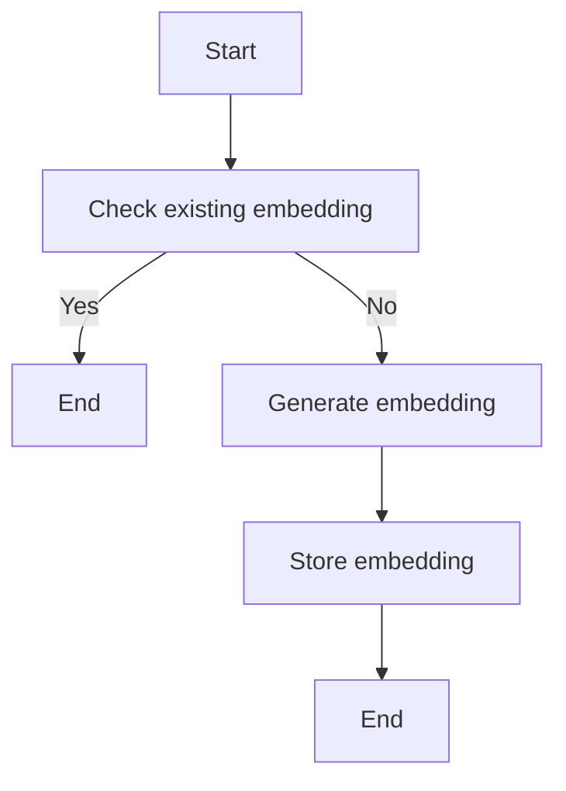

#### 带注释源码

```python
async def store_embedding(
    version_id: str,
    embedding: list[float],
    tx: prisma.Prisma | None = None,
) -> bool:
    """
    Store embedding in the database.

    Args:
        version_id: The unique identifier for the content version.
        embedding: The embedding data to store.
        tx: Optional transaction client.

    Returns:
        bool: Indicates whether the embedding was stored successfully.
    """
    return await store_content_embedding(
        content_type=ContentType.STORE_AGENT,
        content_id=version_id,
        embedding=embedding,
        searchable_text="",  # Empty for backward compat; ensure_embedding() populates this
        metadata=None,
        user_id=None,  # Store agents are public
        tx=tx,
    )
```


### `UnifiedContentEmbeddingsService.get_embedding`

Retrieve embedding record for a listing version.

参数：

- `version_id`：`str`，The StoreListingVersion ID

返回值：`dict[str, Any] | None`，A dictionary with storeListingVersionId, embedding, timestamps or None if not found.

#### 流程图

```mermaid
graph LR
A[Start] --> B{Check existing embedding}
B -->|Yes| C[End]
B -->|No| D[Build searchable text]
D --> E[Generate embedding]
E -->|Success| F[Store embedding]
F --> G[End]
E -->|Failure| H[End]
```

#### 带注释源码

```python
async def get_embedding(version_id: str) -> dict[str, Any] | None:
    """
    Retrieve embedding record for a listing version.

    BACKWARD COMPATIBILITY: Maintained for existing store listing usage.
    Returns dict with storeListingVersionId, embedding, timestamps or None if not found.
    """
    result = await get_content_embedding(
        ContentType.STORE_AGENT, version_id, user_id=None
    )
    if result:
        # Transform to old format for backward compatibility
        return {
            "storeListingVersionId": result["contentId"],
            "embedding": result["embedding"],
            "createdAt": result["createdAt"],
            "updatedAt": result["updatedAt"],
        }
    return None
```


### `UnifiedContentEmbeddingsService.get_content_embedding`

Retrieve embedding record for any content type.

参数：

- `content_type`：`ContentType`，The type of content (e.g., BLOCK, STORE_AGENT, DOCUMENTATION).
- `content_id`：`str`，The unique identifier for the content.
- `user_id`：`str | None`，Optional user ID. For public content (e.g., BLOCK, STORE_AGENT), pass None. For user-scoped content (e.g., LIBRARY_AGENT), pass the user's ID to avoid deleting embeddings belonging to other users.

返回值：`dict[str, Any] | None`，A dictionary with contentType, contentId, embedding, timestamps or None if not found.

#### 流程图

```mermaid
graph LR
A[Start] --> B{Query Embedding}
B -->|Found| C[Return Result]
B -->|Not Found| D[End]
```

#### 带注释源码

```python
async def get_content_embedding(
    content_type: ContentType, content_id: str, user_id: str | None = None
) -> dict[str, Any] | None:
    """
    Retrieve embedding record for any content type.

    New function for unified content embedding retrieval.
    Returns dict with contentType, contentId, embedding, timestamps or None if not found.

    Raises exceptions on failure - caller should handle.
    """
    result = await query_raw_with_schema(
        """
        SELECT
            "contentType",
            "contentId",
            "userId",
            "embedding"::text as "embedding",
            "searchableText",
            "metadata",
            "createdAt",
            "updatedAt"
        FROM {schema_prefix}"UnifiedContentEmbedding"
        WHERE "contentType" = $1::{schema_prefix}"ContentType" AND "contentId" = $2 AND ("userId" = $3 OR ($3 IS NULL AND "userId" IS NULL))
        """,
        content_type,
        content_id,
        user_id,
    )

    if result and len(result) > 0:
        return result[0]
    return None
```


### `ensure_embedding`

Ensure an embedding exists for the listing version.

参数：

- `version_id`：`str`，The StoreListingVersion ID
- `name`：`str`，Agent name
- `description`：`str`，Agent description
- `sub_heading`：`str`，Agent sub-heading
- `categories`：`list[str]`，Agent categories
- `force`：`bool`，Force regeneration even if embedding exists
- `tx`：`prisma.Prisma | None`，Optional transaction client

返回值：`bool`，True if embedding exists/was created

#### 流程图

```mermaid
graph TD
    A[Start] --> B[Check if embedding exists]
    B -->|Yes| C[End]
    B -->|No| D[Build searchable text]
    D --> E[Generate new embedding]
    E --> F[Store the embedding]
    F --> C
```

#### 带注释源码

```python
async def ensure_embedding(
    version_id: str,
    name: str,
    description: str,
    sub_heading: str,
    categories: list[str],
    force: bool = False,
    tx: prisma.Prisma | None = None,
) -> bool:
    # Check if embedding already exists
    if not force:
        existing = await get_embedding(version_id)
        if existing and existing.get("embedding"):
            logger.debug(f"Embedding for version {version_id} already exists")
            return True

    # Build searchable text for embedding
    searchable_text = build_searchable_text(name, description, sub_heading, categories)

    # Generate new embedding
    embedding = await generate_embedding(searchable_text)

    # Store the embedding with metadata using new function
    metadata = {
        "name": name,
        "subHeading": sub_heading,
        "categories": categories,
    }
    return await store_content_embedding(
        content_type=ContentType.STORE_AGENT,
        content_id=version_id,
        embedding=embedding,
        searchable_text=searchable_text,
        metadata=metadata,
        user_id=None,  # Store agents are public
        tx=tx,
    )
```


### `delete_content_embedding`

Delete embedding for any content type.

参数：

- `content_type`：`ContentType`，The type of content (STORE_AGENT, LIBRARY_AGENT, etc.)
- `content_id`：`str`，The unique identifier for the content
- `user_id`：`str | None`，Optional user ID. For public content (STORE_AGENT, BLOCK), pass None. For user-scoped content (LIBRARY_AGENT), pass the user's ID to avoid deleting embeddings belonging to other users.

返回值：`bool`，True if deletion succeeded, False otherwise

#### 流程图

```mermaid
graph TD
    A[Start] --> B[Get Prisma client]
    B --> C[Execute SQL to delete embedding]
    C --> D[Log deletion]
    D --> E[Return True]
    E --> F[End]
```

#### 带注释源码

```python
async def delete_content_embedding(
    content_type: ContentType, content_id: str, user_id: str | None = None
) -> bool:
    try:
        client = prisma.get_client()

        await execute_raw_with_schema(
            """
            DELETE FROM {schema_prefix}"UnifiedContentEmbedding"
            WHERE "contentType" = $1::{schema_prefix}"ContentType"
              AND "contentId" = $2
              AND ("userId" = $3 OR ($3 IS NULL AND "userId" IS NULL))
            """,
            content_type,
            content_id,
            user_id,
            client=client,
        )

        user_str = f" (user: {user_id})" if user_id else ""
        logger.info(f"Deleted embedding for {content_type}:{content_id}{user_str}")
        return True

    except Exception as e:
        logger.error(f"Failed to delete embedding for {content_type}:{content_id}: {e}")
        return False
```


### `delete_content_embedding`

Delete embedding for any content type.

参数：

- `content_type`：`ContentType`，The type of content (STORE_AGENT, LIBRARY_AGENT, etc.)
- `content_id`：`str`，The unique identifier for the content
- `user_id`：`str | None`，Optional user ID. For public content (STORE_AGENT, BLOCK), pass None. For user-scoped content (LIBRARY_AGENT), pass the user's ID to avoid deleting embeddings belonging to other users.

返回值：`bool`，True if deletion succeeded, False otherwise

#### 流程图

```mermaid
graph TD
    A[Start] --> B[Get Prisma client]
    B --> C[Execute SQL to delete embedding]
    C --> D[Log deletion]
    D --> E[Return True]
    E --> F[End]
```

#### 带注释源码

```python
async def delete_content_embedding(
    content_type: ContentType, content_id: str, user_id: str | None = None
) -> bool:
    """
    Delete embedding for any content type.

    Args:
        content_type: The type of content (STORE_AGENT, LIBRARY_AGENT, etc.)
        content_id: The unique identifier for the content
        user_id: Optional user ID. For public content (STORE_AGENT, BLOCK), pass None.
                 For user-scoped content (LIBRARY_AGENT), pass the user's ID to avoid
                 deleting embeddings belonging to other users.

    Returns:
        True if deletion succeeded, False otherwise
    """
    try:
        client = prisma.get_client()

        await execute_raw_with_schema(
            """
            DELETE FROM {schema_prefix}"UnifiedContentEmbedding"
            WHERE "contentType" = $1::{schema_prefix}"ContentType"
              AND "contentId" = $2
              AND ("userId" = $3 OR ($3 IS NULL AND "userId" IS NULL))
            """,
            content_type,
            content_id,
            user_id,
            client=client,
        )

        user_str = f" (user: {user_id})" if user_id else ""
        logger.info(f"Deleted embedding for {content_type}:{content_id}{user_str}")
        return True

    except Exception as e:
        logger.error(f"Failed to delete embedding for {content_type}:{content_id}: {e}")
        return False
```


### `UnifiedContentEmbeddingsService.get_embedding_stats`

Get statistics about embedding coverage for all content types.

参数：

- 无

返回值：`dict[str, Any]`，Returns stats per content type and overall totals.

#### 流程图

```mermaid
graph TD
    A[Start] --> B[Get stats from all handlers]
    B --> C{Is there an error?}
    C -- Yes --> D[Return error]
    C -- No --> E[Aggregate stats]
    E --> F[Calculate totals]
    F --> G[Return stats]
    G --> H[End]
```

#### 带注释源码

```python
async def get_embedding_stats() -> dict[str, Any]:
    """
    Get statistics about embedding coverage for all content types.

    Returns stats per content type and overall totals.
    """
    try:
        stats_by_type = {}
        total_items = 0
        total_with_embeddings = 0
        total_without_embeddings = 0

        # Aggregate stats from all handlers
        for content_type, handler in CONTENT_HANDLERS.items():
            try:
                stats = await handler.get_stats()
                stats_by_type[content_type.value] = {
                    "total": stats["total"],
                    "with_embeddings": stats["with_embeddings"],
                    "without_embeddings": stats["without_embeddings"],
                    "coverage_percent": (
                        round(stats["with_embeddings"] / stats["total"] * 100, 1)
                        if stats["total"] > 0
                        else 0
                    ),
                }

                total_items += stats["total"]
                total_with_embeddings += stats["with_embeddings"]
                total_without_embeddings += stats["without_embeddings"]

            except Exception as e:
                logger.error(f"Failed to get stats for {content_type.value}: {e}")
                stats_by_type[content_type.value] = {
                    "total": 0,
                    "with_embeddings": 0,
                    "without_embeddings": 0,
                    "coverage_percent": 0,
                    "error": str(e),
                }

        return {
            "by_type": stats_by_type,
            "totals": {
                "total": total_items,
                "with_embeddings": total_with_embeddings,
                "without_embeddings": total_without_embeddings,
                "coverage_percent": (
                    round(total_with_embeddings / total_items * 100, 1)
                    if total_items > 0
                    else 0
                ),
            },
        }

    except Exception as e:
        logger.error(f"Failed to get embedding stats: {e}")
        return {
            "by_type": {},
            "totals": {
                "total": 0,
                "with_embeddings": 0,
                "without_embeddings": 0,
                "coverage_percent": 0,
            },
            "error": str(e),
        }
```


### `backfill_missing_embeddings`

This function generates embeddings for approved listings that do not have them. It is a backward-compatible wrapper that delegates to `backfill_all_content_types()` to process all content types.

参数：

- `batch_size`：`int`，Number of embeddings to generate per content type

返回值：`dict`，Dict with success/failure counts aggregated across all content types

#### 流程图

```mermaid
graph TD
    A[Start] --> B[backfill_all_content_types(batch_size)]
    B --> C[Process each content type]
    C --> D[Get missing items from handler]
    D --> E[Ensure content embedding for each item]
    E --> F[Aggregate results]
    F --> G[Return results]
    G --> H[End]
```

#### 带注释源码

```python
async def backfill_missing_embeddings(batch_size: int = 10) -> dict[str, Any]:
    """
    Generate embeddings for approved listings that don't have them.

    BACKWARD COMPATIBILITY: Maintained for existing usage.
    This now delegates to backfill_all_content_types() to process all content types.

    Args:
        batch_size: Number of embeddings to generate per content type

    Returns:
        Dict with success/failure counts aggregated across all content types
    """
    # Delegate to the new generic backfill system
    result = await backfill_all_content_types(batch_size)

    # Return in the old format for backward compatibility
    return result["totals"]
```


### `backfill_all_content_types`

This function generates embeddings for all content types using registered handlers.

参数：

- `batch_size`：`int`，指定每个内容类型生成嵌入的数量。

返回值：`dict`，包含每个内容类型的统计信息和总体统计信息。

#### 流程图

```mermaid
graph TD
    A[Start] --> B[Get handlers]
    B --> C{Handlers available?}
    C -- Yes --> D[Get missing items]
    C -- No --> E[No handlers]
    D --> F[Generate embeddings]
    F --> G{Store embeddings}
    G --> H[End]
    E --> H
```

#### 带注释源码

```python
async def backfill_all_content_types(batch_size: int = 10) -> dict[str, Any]:
    """
    Generate embeddings for all content types using registered handlers.

    Args:
        batch_size: Number of embeddings to generate per content type

    Returns:
        Dict with stats per content type and overall totals
    """
    results_by_type = {}
    total_processed = 0
    total_success = 0
    total_failed = 0
    all_errors: dict[str, int] = {}  # Aggregate errors across all content types

    # Process content types in explicit order
    processing_order = [
        ContentType.BLOCK,
        ContentType.STORE_AGENT,
        ContentType.DOCUMENTATION,
    ]

    for content_type in processing_order:
        handler = CONTENT_HANDLERS.get(content_type)
        if not handler:
            logger.warning(f"No handler registered for {content_type.value}")
            continue
        try:
            logger.info(f"Processing {content_type.value} content type...")

            # Get missing items from handler
            missing_items = await handler.get_missing_items(batch_size)

            if not missing_items:
                results_by_type[content_type.value] = {
                    "processed": 0,
                    "success": 0,
                    "failed": 0,
                    "message": "No missing embeddings",
                }
                continue

            # Process embeddings concurrently for better performance
            embedding_tasks = [
                ensure_content_embedding(
                    content_type=item.content_type,
                    content_id=item.content_id,
                    searchable_text=item.searchable_text,
                    metadata=item.metadata,
                    user_id=item.user_id,
                )
                for item in missing_items
            ]

            results = await asyncio.gather(*embedding_tasks, return_exceptions=True)

            success = sum(1 for result in results if result is True)
            failed = len(results) - success

            # Aggregate errors across all content types
            if failed > 0:
                for result in results:
                    if isinstance(result, Exception):
                        error_key = f"{type(result).__name__}: {str(result)}"
                        all_errors[error_key] = all_errors.get(error_key, 0) + 1

            results_by_type[content_type.value] = {
                "processed": len(missing_items),
                "success": success,
                "failed": failed,
                "message": f"Backfilled {success} embeddings, {failed} failed",
            }

            total_processed += len(missing_items)
            total_success += success
            total_failed += failed

            logger.info(
                f"{content_type.value}: processed {len(missing_items)}, "
                f"success {success}, failed {failed}"
            )

        except Exception as e:
            logger.error(f"Failed to process {content_type.value}: {e}")
            results_by_type[content_type.value] = {
                "processed": 0,
                "success": 0,
                "failed": 0,
                "error": str(e),
            }

    # Log aggregated errors once at the end
    if all_errors:
        error_details = ", ".join(
            f"{error} ({count}x)" for error, count in all_errors.items()
        )
        logger.error(f"Embedding backfill errors: {error_details}")

    return {
        "by_type": results_by_type,
        "totals": {
            "processed": total_processed,
            "success": total_success,
            "failed": total_failed,
            "message": f"Overall: {total_success} succeeded, {total_failed} failed",
        },
    }
``` 


### `embed_query(query: str) -> list[float]`

Generate embedding for a search query.

参数：

- `query`：`str`，The search query string to generate an embedding for.

返回值：`list[float]`，The embedding for the search query.

#### 流程图

```mermaid
graph TD
    A[Start] --> B[Generate embedding for query]
    B --> C[Return embedding]
    C --> D[End]
```

#### 带注释源码

```python
async def embed_query(query: str) -> list[float]:
    """
    Generate embedding for a search query.

    Same as generate_embedding but with clearer intent.
    Raises exceptions on failure - caller should handle.
    """
    return await generate_embedding(query)
```


### `embedding_to_vector_string`

Convert embedding list to PostgreSQL vector string format.

参数：

- `embedding`：`list[float]`，Embedding list to convert to vector string format.

返回值：`str`，PostgreSQL vector string representation of the embedding list.

#### 流程图

```mermaid
graph LR
A[Start] --> B[Input embedding list]
B --> C[Convert to string]
C --> D[Format as PostgreSQL vector string]
D --> E[Return vector string]
E --> F[End]
```

#### 带注释源码

```python
def embedding_to_vector_string(embedding: list[float]) -> str:
    """Convert embedding list to PostgreSQL vector string format."""
    return "[" + ",".join(str(x) for x in embedding) + "]"
```


### `ensure_content_embedding`

Ensure an embedding exists for any content type.

参数：

- `content_type`：`ContentType`，The content type of the content (e.g., STORE_AGENT, BLOCK, etc.)
- `content_id`：`str`，Unique identifier for the content
- `searchable_text`：`str`，Combined text for embedding generation
- `metadata`：`dict | None`，Optional metadata to store with embedding
- `force`：`bool`，Force regeneration even if embedding exists
- `tx`：`prisma.Prisma | None`，Optional transaction client

返回值：`bool`，True if embedding exists/was created

#### 流程图

```mermaid
graph TD
    A[Start] --> B{Check if embedding exists}
    B -->|Yes| C[End]
    B -->|No| D[Generate new embedding]
    D --> E[Store the embedding]
    E --> C
```

#### 带注释源码

```python
async def ensure_content_embedding(
    content_type: ContentType,
    content_id: str,
    searchable_text: str,
    metadata: dict | None = None,
    force: bool = False,
    tx: prisma.Prisma | None = None,
) -> bool:
    # Check if embedding already exists
    if not force:
        existing = await get_content_embedding(content_type, content_id, user_id)
        if existing and existing.get("embedding"):
            logger.debug(f"Embedding for {content_type}:{content_id} already exists")
            return True

    # Generate new embedding
    embedding = await generate_embedding(searchable_text)

    # Store the embedding
    return await store_content_embedding(
        content_type=content_type,
        content_id=content_id,
        embedding=embedding,
        searchable_text=searchable_text,
        metadata=metadata or {},
        user_id=user_id,
        tx=tx,
    )
```


### `cleanup_orphaned_embeddings`

Clean up embeddings for content that no longer exists or is no longer valid.

参数：

- `batch_size`：`int`，Number of embeddings to generate per content type

返回值：`dict[str, Any]`，Dict with cleanup statistics per content type

#### 流程图

```mermaid
graph TD
    A[Start] --> B[Get all current content IDs from handler]
    B --> C{Are there any current content IDs?}
    C -- Yes --> D[Get all embedding IDs from database]
    C -- No --> E[No current content IDs]
    D --> F{Are there any embedding IDs?}
    F -- Yes --> G[Find orphaned embeddings]
    F -- No --> H[No embedding IDs]
    G --> I[Delete orphaned embeddings in batch]
    I --> J[End]
    E --> J
    H --> J
```

#### 带注释源码

```python
async def cleanup_orphaned_embeddings() -> dict[str, Any]:
    """
    Clean up embeddings for content that no longer exists or is no longer valid.

    Compares current content with embeddings in database and removes orphaned records:
    - STORE_AGENT: Removes embeddings for rejected/deleted store listings
    - BLOCK: Removes embeddings for blocks no longer registered
    - DOCUMENTATION: Removes embeddings for deleted doc files

    Returns:
        Dict with cleanup statistics per content type
    """
    results_by_type = {}
    total_deleted = 0

    # Cleanup orphaned embeddings for all content types
    cleanup_types = [
        ContentType.STORE_AGENT,
        ContentType.BLOCK,
        ContentType.DOCUMENTATION,
    ]

    for content_type in cleanup_types:
        try:
            handler = CONTENT_HANDLERS.get(content_type)
            if not handler:
                logger.warning(f"No handler registered for {content_type}")
                results_by_type[content_type.value] = {
                    "deleted": 0,
                    "error": "No handler registered",
                }
                continue

            # Get all current content IDs from handler
            if content_type == ContentType.STORE_AGENT:
                # Get IDs of approved store listing versions from non-deleted listings
                valid_agents = await query_raw_with_schema(
                    """
                    SELECT slv.id
                    FROM {schema_prefix}"StoreListingVersion" slv
                    JOIN {schema_prefix}"StoreListing" sl ON slv."storeListingId" = sl.id
                    WHERE slv."submissionStatus" = 'APPROVED'
                      AND slv."isDeleted" = false
                      AND sl."isDeleted" = false
                    """,
                )
                current_ids = {row["id"] for row in valid_agents}
            elif content_type == ContentType.BLOCK:
                from backend.data.block import get_blocks

                current_ids = set(get_blocks().keys())
            elif content_type == ContentType.DOCUMENTATION:
                # Use DocumentationHandler to get section-based content IDs
                from backend.api.features.store.content_handlers import (
                    DocumentationHandler,
                )

                doc_handler = CONTENT_HANDLERS.get(ContentType.DOCUMENTATION)
                if isinstance(doc_handler, DocumentationHandler):
                    docs_root = doc_handler._get_docs_root()
                    if docs_root.exists():
                        current_ids = doc_handler._get_all_section_content_ids(
                            docs_root
                        )
                    else:
                        current_ids = set()
                else:
                    current_ids = set()
            else:
                # Skip unknown content types to avoid accidental deletion
                logger.warning(
                    f"Skipping cleanup for unknown content type: {content_type}"
                )
                results_by_type[content_type.value] = {
                    "deleted": 0,
                    "error": "Unknown content type - skipped for safety",
                }
                continue

            # Get all embedding IDs from database
            db_embeddings = await query_raw_with_schema(
                """
                SELECT "contentId"
                FROM {schema_prefix}"UnifiedContentEmbedding"
                WHERE "contentType" = $1::{schema_prefix}"ContentType"
                """,
                content_type,
            )

            db_ids = {row["contentId"] for row in db_embeddings}

            # Find orphaned embeddings (in DB but not in current content)
            orphaned_ids = db_ids - current_ids

            if not orphaned_ids:
                logger.info(f"{content_type.value}: No orphaned embeddings found")
                results_by_type[content_type.value] = {
                    "deleted": 0,
                    "message": "No orphaned embeddings",
                }
                continue

            # Delete orphaned embeddings in batch for better performance
            orphaned_list = list(orphaned_ids)
            try:
                await execute_raw_with_schema(
                    """
                    DELETE FROM {schema_prefix}"UnifiedContentEmbedding"
                    WHERE "contentType" = $1::{schema_prefix}"ContentType"
                      AND "contentId" = ANY($2::text[])
                    """,
                    content_type,
                    orphaned_list,
                )
                deleted = len(orphaned_list)
            except Exception as e:
                logger.error(f"Failed to batch delete orphaned embeddings: {e}")
                deleted = 0

            logger.info(
                f"{content_type.value}: Deleted {deleted}/{len(orphaned_ids)} orphaned embeddings"
            )
            results_by_type[content_type.value] = {
                "deleted": deleted,
                "orphaned": len(orphaned_ids),
                "message": f"Deleted {deleted} orphaned embeddings",
            }

            total_deleted += deleted

        except Exception as e:
            logger.error(f"Failed to cleanup {content_type.value}: {e}")
            results_by_type[content_type.value


### `UnifiedContentEmbeddingsService.semantic_search`

This function performs semantic search across content types using embeddings. It generates an embedding for the search query and performs vector similarity search on the `UnifiedContentEmbedding` table. If embedding generation fails, it falls back to lexical search on `searchableText`.

参数：

- `query`：`str`，The search query string.
- `content_types`：`list[ContentType] | None`，List of `ContentType` to search. Defaults to `[BLOCK, STORE_AGENT, DOCUMENTATION]`.
- `user_id`：`str | None`，Optional user ID for searching private content (library agents).
- `limit`：`int`，Maximum number of results to return (default: 20).
- `min_similarity`：`float`，Minimum cosine similarity threshold (0-1, default: 0.5).

返回值：`list[dict[str, Any]]`，List of search results with the following structure:
```json
[
    {
        "content_id": str,
        "content_type": str,  // "BLOCK", "STORE_AGENT", "DOCUMENTATION", or "LIBRARY_AGENT"
        "searchable_text": str,
        "metadata": dict,
        "similarity": float,  // Cosine similarity score (0-1)
    },
    ...
]
```

#### 流程图

```mermaid
graph LR
A[Start] --> B{Generate query embedding}
B -->|Success| C[Perform vector similarity search]
B -->|Failure| D[Perform lexical search on searchableText]
C --> E{Filter results by similarity threshold}
E -->|Yes| F[Return search results]
E -->|No| G[End]
D --> E
```

#### 带注释源码

```python
async def semantic_search(
    query: str,
    content_types: list[ContentType] | None = None,
    user_id: str | None = None,
    limit: int = 20,
    min_similarity: float = 0.5,
) -> list[dict[str, Any]]:
    # Default to searching all public content types
    if content_types is None:
        content_types = [
            ContentType.BLOCK,
            ContentType.STORE_AGENT,
            ContentType.DOCUMENTATION,
        ]

    # Validate inputs
    if not content_types:
        return []  # Empty content_types would cause invalid SQL (IN ())

    query = query.strip()
    if not query:
        return []

    if limit < 1:
        limit = 1
    if limit > 100:
        limit = 100

    # Generate query embedding
    try:
        query_embedding = await embed_query(query)
        # Semantic search with embeddings
        embedding_str = embedding_to_vector_string(query_embedding)

        # Build params in order: limit, then user_id (if provided), then content types
        params: list[Any] = [limit]
        user_filter = ""
        if user_id is not None:
            user_filter = 'AND "userId" = ${}'.format(len(params) + 1)
            params.append(user_id)

        # Add content type parameters and build placeholders dynamically
        content_type_start_idx = len(params) + 1
        content_type_placeholders = ", ".join(
            "$" + str(content_type_start_idx + i) + '::{schema_prefix}"ContentType"'
            for i in range(len(content_types))
        )
        params.extend([ct.value for ct in content_types])

        # Build min_similarity param index before appending
        min_similarity_idx = len(params) + 1
        params.append(min_similarity)

        # Use unqualified ::vector and <=> operator - pgvector is in search_path on all environments
        sql = (
            """
            SELECT
                "contentId" as content_id,
                "contentType" as content_type,
                "searchableText" as searchable_text,
                metadata,
                1 - (embedding <=> '"""
            + embedding_str
            + """'::vector) as similarity
            FROM {schema_prefix}"UnifiedContentEmbedding"
            WHERE "contentType" IN ("""
            + content_type_placeholders
            + """)
            """
            + user_filter
            + """
            AND 1 - (embedding <=> '"""
            + embedding_str
            + """'::vector) >= $"""
            + str(min_similarity_idx)
            + """
            ORDER BY similarity DESC
            LIMIT $1
        """
        )

        results = await query_raw_with_schema(sql, *params)
        return [
            {
                "content_id": row["content_id"],
                "content_type": row["content_type"],
                "searchable_text": row["searchable_text"],
                "metadata": row["metadata"],
                "similarity": float(row["similarity"]),
            }
            for row in results
        ]
    except Exception as e:
        logger.warning(f"Semantic search failed, falling back to lexical search: {e}")

    # Fallback to lexical search if embeddings unavailable

    params_lexical: list[Any] = [limit]
    user_filter = ""
    if user_id is not None:
        user_filter = 'AND "userId" = ${}'.format(len(params_lexical) + 1)
        params_lexical.append(user_id)

    # Add content type parameters and build placeholders dynamically
    content_type_start_idx = len(params_lexical) + 1
    content_type_placeholders_lexical = ", ".join(
        "$" + str(content_type_start_idx + i) + '::{schema_prefix}"ContentType"'
        for i in range(len(content_types))
    )
    params_lexical.extend([ct

## 关键组件


### 张量索引与惰性加载

张量索引与惰性加载是用于高效存储和检索大规模张量数据的机制，通过仅在需要时加载数据来减少内存消耗和提高性能。

### 反量化支持

反量化支持是指系统能够处理和转换量化数据，以便在量化过程中进行优化和加速。

### 量化策略

量化策略是指用于将浮点数模型转换为低精度定点数模型的算法和过程，以提高模型的效率和性能。


## 问题及建议


### 已知问题

-   **全局变量和函数依赖性**：代码中存在多个全局变量和函数，如 `logger`, `EMBEDDING_MODEL`, `EMBEDDING_DIM`, `EMBEDDING_MAX_TOKENS`, `get_openai_client`, `execute_raw_with_schema`, `query_raw_with_schema` 等，这些全局变量和函数的修改可能会影响到整个系统的行为，增加了代码维护的难度。
-   **异常处理**：代码中存在一些异常处理，但并非所有函数都进行了异常处理，这可能导致运行时错误难以追踪和调试。
-   **代码重复**：在 `ensure_content_embedding` 和 `ensure_embedding` 函数中存在大量重复代码，可以考虑提取公共逻辑以减少代码重复。
-   **性能问题**：在 `backfill_all_content_types` 函数中，对每个内容类型都进行了单独的查询和处理，这可能导致性能瓶颈，特别是在处理大量数据时。

### 优化建议

-   **模块化**：将全局变量和函数封装到模块中，减少全局变量的使用，提高代码的可维护性。
-   **异常处理**：对所有可能抛出异常的函数进行异常处理，确保系统的健壮性。
-   **代码重构**：对重复的代码进行重构，提取公共逻辑，减少代码冗余。
-   **性能优化**：在 `backfill_all_content_types` 函数中，可以考虑使用批处理和并发处理来提高性能。
-   **代码注释**：增加代码注释，解释代码的功能和逻辑，提高代码的可读性。
-   **单元测试**：编写单元测试，确保代码的正确性和稳定性。
-   **文档**：编写详细的文档，包括代码的功能、使用方法和维护指南。


## 其它


### 设计目标与约束

- **设计目标**:
  - 提供一个统一的嵌入生成和存储服务，支持多种内容类型（如商店列表、块、文档、库代理）。
  - 实现语义/混合搜索，以增强搜索体验。
  - 提供高效的嵌入生成和存储机制，以支持大规模数据。
  - 确保向后兼容性，支持现有商店列表的使用。

- **约束**:
  - 使用OpenAI API进行嵌入生成。
  - 使用Prisma ORM进行数据库操作。
  - 确保嵌入生成和存储的效率。
  - 确保向后兼容性，不中断现有功能。

### 错误处理与异常设计

- **错误处理**:
  - 使用try-except块捕获可能发生的异常。
  - 记录错误日志，以便于问题追踪和调试。
  - 在必要时抛出异常，由调用者处理。

- **异常设计**:
  - 定义自定义异常类，以提供更具体的错误信息。
  - 异常类应包含错误代码、错误消息和可能的解决方案。

### 数据流与状态机

- **数据流**:
  - 用户查询通过API传入。
  - 查询嵌入生成。
  - 嵌入存储在数据库中。
  - 查询嵌入检索。
  - 查询结果返回给用户。

- **状态机**:
  - 嵌入生成状态机：包括生成、存储、检索和删除状态。
  - 查询处理状态机：包括查询解析、嵌入生成、相似度计算和结果返回状态。

### 外部依赖与接口契约

- **外部依赖**:
  - OpenAI API
  - Prisma ORM
  - Tiktoken库

- **接口契约**:
  - API接口应遵循RESTful设计原则。
  - API响应应包含适当的HTTP状态码和错误信息。
  - API文档应详细说明每个接口的参数和返回值。


    