# `AutoGPT\autogpt_platform\backend\backend\api\features\store\embeddings_e2e_test.py` 详细设计文档

该代码包含用于向量嵌入的存储、检索、删除以及混合搜索功能的端到端集成测试，通过连接真实数据库来验证 SQL 查询的正确性和搜索逻辑的有效性。

## 整体流程

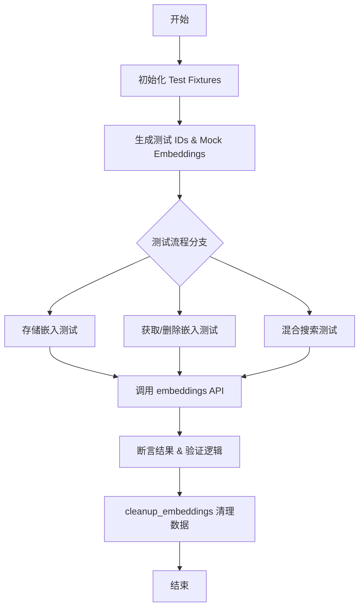

## 类结构

```
test_search_and_embeddings.py (模块)
├── Test Fixtures (测试夹具)
│   ├── test_content_id
│   ├── test_user_id
│   ├── mock_embedding
│   ├── similar_embedding
│   ├── different_embedding
│   └── cleanup_embeddings
├── Store Content Embedding Tests (存储测试组)
├── Get Content Embedding Tests (获取测试组)
├── Delete Content Embedding Tests (删除测试组)
├── Unified Hybrid Search Tests (统一混合搜索测试组)
└── Hybrid Search (Store Agents) Tests (商店代理搜索测试组)
```

## 全局变量及字段


    

## 全局函数及方法


### `test_content_id`

这是一个 Pytest 测试夹具，用于为每个测试用例生成唯一的内容标识符（ID），以确保测试之间的数据隔离，防止数据冲突。

参数：

- 无

返回值：`str`，生成的包含 UUID 的唯一内容 ID 字符串。

#### 流程图

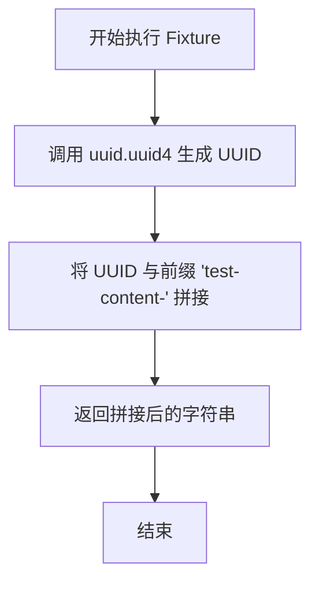

#### 带注释源码

```python
@pytest.fixture
def test_content_id() -> str:
    """Generate unique content ID for test isolation."""
    # 使用 uuid4 生成随机唯一标识符，并拼接固定前缀，确保测试数据易于识别且互不干扰
    return f"test-content-{uuid.uuid4()}"
```


### `test_user_id`

这是一个 Pytest fixture，用于生成唯一的用户 ID 字符串，确保每个测试用例在数据隔离性方面不会互相干扰。

参数：

-  无

返回值：`str`，格式为 "test-user-{UUID}" 的唯一字符串。

#### 流程图

```mermaid
graph TD
    A[开始] --> B[生成 UUID v4]
    B --> C[格式化字符串 f'test-user-{uuid}']
    C --> D[返回唯一用户 ID 字符串]
    D --> E[结束]
```

#### 带注释源码

```python
@pytest.fixture
def test_user_id() -> str:
    """Generate unique user ID for test isolation."""
    # 调用 uuid.uuid4() 生成一个随机的通用唯一标识符
    # 使用 f-string 将其格式化为以 "test-user-" 开头的字符串
    return f"test-user-{uuid.uuid4()}"
```


### `mock_embedding`

生成一个用于测试的模拟嵌入向量，并将其归一化为单位长度，以满足余弦相似度计算的要求。

参数：

无

返回值：`list[float]`，返回一个归一化后的浮点数列表，表示模拟的嵌入向量。

#### 流程图

```mermaid
flowchart TD
    A[Start mock_embedding] --> B[Import math module]
    B --> C[Generate raw vector<br/>float(i % 10) / 10.0 for i in range(EMBEDDING_DIM)]
    C --> D[Calculate magnitude<br/>sqrt(sum(x * x for x in raw))]
    D --> E[Normalize vector<br/>x / magnitude for x in raw]
    E --> F[Return normalized list]
```

#### 带注释源码

```python
@pytest.fixture
def mock_embedding() -> list[float]:
    """Generate a mock embedding vector."""
    # 导入 math 库用于后续计算平方根
    import math

    # 生成原始嵌入向量：根据 EMBEDDING_DIM 创建一个列表
    # 值为 i % 10 的浮点数形式 (0.0 到 0.0 的循环模式)
    raw = [float(i % 10) / 10.0 for i in range(EMBEDDING_DIM)]
    
    # 计算向量的模长 - 即各分量平方和的平方根
    # 这是余弦相似度计算所需的归一化步骤
    magnitude = math.sqrt(sum(x * x for x in raw))
    
    # 返回归一化后的向量 - 将每个分量除以模长，使向量长度为 1
    return [x / magnitude for x in raw]
```


### `similar_embedding`

这是一个 pytest fixture，用于生成一个与标准模拟嵌入向量（mock_embedding）相似但在数值上略有差异的归一化嵌入向量，通常用于测试相似度搜索算法。

参数：

无

返回值：`list[float]`，返回一个经过单位长度归一化的浮点数列表，表示生成的嵌入向量。

#### 流程图

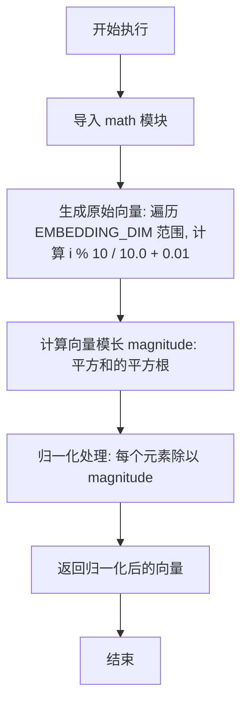

#### 带注释源码

```python
@pytest.fixture
def similar_embedding() -> list[float]:
    """Generate an embedding similar to mock_embedding."""
    import math

    # Similar but slightly different values
    # 生成原始向量数据：通过对10取模生成序列，并加上0.01以产生微小偏差
    raw = [float(i % 10) / 10.0 + 0.01 for i in range(EMBEDDING_DIM)]
    
    # Normalize to unit length (required for cosine similarity)
    # 计算向量的欧几里得范数（模长/幅值），用于后续归一化
    magnitude = math.sqrt(sum(x * x for x in raw))
    
    # 返回归一化后的向量：将每个分量除以模长，使向量成为单位向量
    return [x / magnitude for x in raw]
```


### `different_embedding`

生成一个与基准向量(mock_embedding)模式相反且归一化的嵌入向量，用于测试差异性。

参数：

无

返回值：`list[float]`，返回一个归一化的浮点数列表，表示生成的与基准向量差异巨大的嵌入向量。

#### 流程图

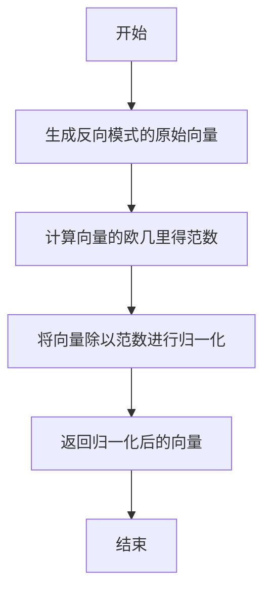

#### 带注释源码

```python
@pytest.fixture
def different_embedding() -> list[float]:
    """Generate an embedding very different from mock_embedding."""
    import math

    # Reversed pattern to be maximally different
    # 生成原始向量：使用与 mock_embedding 相反的模式
    # mock_embedding 的模式是 i % 10，这里使用 (EMBEDDING_DIM - i) % 10
    # 这会导致向量在数值分布上与 mock_embedding 完全相反，从而最小化余弦相似度
    raw = [float((EMBEDDING_DIM - i) % 10) / 10.0 for i in range(EMBEDDING_DIM)]
    
    # Normalize to unit length (required for cosine similarity)
    # 计算向量的模长，确保后续归一化
    magnitude = math.sqrt(sum(x * x for x in raw))
    
    # 归一化向量，使其成为单位向量，这是计算余弦相似度的前提
    return [x / magnitude for x in raw]
```


### `cleanup_embeddings`

这是一个 Pytest 异步夹具，用于管理测试期间创建的嵌入数据的生命周期。它生成一个列表供测试用例记录创建的内容，并在测试结束后自动遍历该列表，从数据库中删除相应的嵌入数据，以确保测试环境的隔离性和清洁。

参数：

- `server`：`Any`，测试服务器实例夹具（由测试框架注入，用于提供测试运行时的上下文或依赖）。

返回值：`AsyncGenerator[list[tuple[ContentType, str, str | None]], None]`，生成一个异步生成器，产生一个包含元组（内容类型, 内容ID, 用户ID）的列表。

#### 流程图

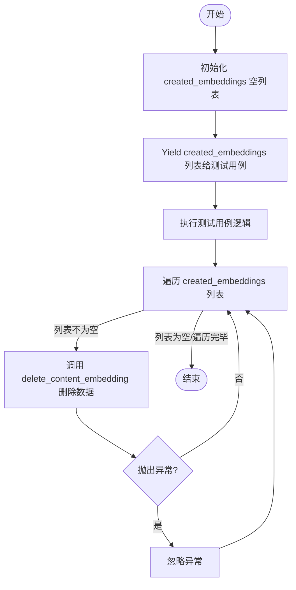

#### 带注释源码

```python
@pytest.fixture
async def cleanup_embeddings(
    server,  # 注入的 server 夹具，用于测试环境依赖
) -> AsyncGenerator[list[tuple[ContentType, str, str | None]], None]:
    """
    Fixture that tracks created embeddings and cleans them up after tests.

    Yields a list to which tests can append (content_type, content_id, user_id) tuples.
    """
    # 初始化一个空列表，用于存储测试期间创建的需要后续清理的嵌入数据元组
    created_embeddings: list[tuple[ContentType, str, str | None]] = []
    
    # 将列表的控制权交给测试用例，测试代码可以向其中追加数据
    yield created_embeddings

    # Cleanup all created embeddings
    # 测试执行完毕后的清理逻辑
    for content_type, content_id, user_id in created_embeddings:
        try:
            # 尝试从数据库中删除对应的嵌入记录
            await embeddings.delete_content_embedding(content_type, content_id, user_id)
        except Exception:
            pass  # Ignore cleanup errors (忽略清理过程中的任何错误，防止因清理失败影响测试结果)
```


### `test_store_content_embedding_store_agent`

验证存储 `STORE_AGENT` 内容类型的嵌入向量及其后续检索功能，确保数据被正确持久化且字段内容符合预期。

参数：

- `server`：`Any`，测试服务器 fixture，用于提供测试运行的应用上下文或数据库连接。
- `test_content_id`：`str`，生成的唯一内容标识符，用于确保测试之间的数据隔离。
- `mock_embedding`：`list[float]`，生成的标准化模拟嵌入向量，用于代表内容的特征。
- `cleanup_embeddings`：`list`，用于追踪测试期间创建的嵌入记录的列表，以便在测试结束后进行清理。

返回值：`None`，该函数为异步测试函数，不返回业务数据，仅通过断言验证逻辑正确性。

#### 流程图

```mermaid
flowchart TD
    A[开始: test_store_content_embedding_store_agent] --> B[将 (STORE_AGENT, test_content_id, None) 添加到清理列表]
    B --> C[调用 embeddings.store_content_embedding 存储数据]
    C --> D{断言: 返回结果是否为 True}
    D -- 否 --> E[测试失败: 抛出断言错误]
    D -- 是 --> F[调用 embeddings.get_content_embedding 检索数据]
    F --> G{断言: 检索结果 stored 是否非空}
    G -- 否 --> E
    G -- 是 --> H{断言: 验证 contentId, contentType, searchableText}
    H -- 失败 --> E
    H -- 通过 --> I[测试结束: 清理资源]
```

#### 带注释源码

```python
@pytest.mark.asyncio(loop_scope="session")
async def test_store_content_embedding_store_agent(
    server,
    test_content_id: str,
    mock_embedding: list[float],
    cleanup_embeddings: list,
):
    """Test storing embedding for STORE_AGENT content type."""
    # 将测试数据元组添加到清理列表中，确保测试完成后删除该数据
    cleanup_embeddings.append((ContentType.STORE_AGENT, test_content_id, None))

    # 调用存储函数，保存 STORE_AGENT 类型的嵌入向量及相关元数据
    # user_id 为 None 表示该 Agent 是公开的
    result = await embeddings.store_content_embedding(
        content_type=ContentType.STORE_AGENT,
        content_id=test_content_id,
        embedding=mock_embedding,
        searchable_text="AI assistant for productivity tasks",
        metadata={"name": "Test Agent", "categories": ["productivity"]},
        user_id=None,  # Store agents are public
    )

    # 验证存储操作是否成功返回
    assert result is True

    # 验证阶段：从数据库中检索刚存储的嵌入数据
    stored = await embeddings.get_content_embedding(
        ContentType.STORE_AGENT, test_content_id, user_id=None
    )
    
    # 断言检索到的数据存在
    assert stored is not None
    
    # 断言检索到的关键字段值与存储时一致
    assert stored["contentId"] == test_content_id
    assert stored["contentType"] == "STORE_AGENT"
    assert stored["searchableText"] == "AI assistant for productivity tasks"
```


### `test_store_content_embedding_block`

Test storing embedding for BLOCK content type.

参数：

- `server`：`Any`，pytest fixture 提供的服务器实例。
- `test_content_id`：`str`，用于测试的唯一内容 ID。
- `mock_embedding`：`list[float]`，模拟的嵌入向量数据。
- `cleanup_embeddings`：`list`，用于追踪测试数据以便后续清理的列表。

返回值：`None`，该函数为测试函数，通过断言验证逻辑，不直接返回值。

#### 流程图

```mermaid
graph TD
    A[开始] --> B[追加清理元组到 cleanup_embeddings]
    B --> C[调用 embeddings.store_content_embedding 存储 Block 嵌入]
    C --> D{存储返回值为 True?}
    D -- 否 --> E[断言失败: 测试未通过]
    D -- 是 --> F[调用 embeddings.get_content_embedding 获取数据]
    F --> G{获取的数据 stored 不为 None?}
    G -- 否 --> E
    G -- 是 --> H{stored['contentType'] 等于 'BLOCK'?}
    H -- 否 --> E
    H -- 是 --> I[测试通过]
```

#### 带注释源码

```python
@pytest.mark.asyncio(loop_scope="session")
async def test_store_content_embedding_block(
    server,
    test_content_id: str,
    mock_embedding: list[float],
    cleanup_embeddings: list,
):
    """Test storing embedding for BLOCK content type."""
    # 将当前测试的内容信息添加到清理列表中，以便测试结束后自动删除
    cleanup_embeddings.append((ContentType.BLOCK, test_content_id, None))

    # 调用嵌入存储功能，存储一个 BLOCK 类型的嵌入
    # 包含模拟向量、可搜索文本和元数据
    result = await embeddings.store_content_embedding(
        content_type=ContentType.BLOCK,
        content_id=test_content_id,
        embedding=mock_embedding,
        searchable_text="HTTP request block for API calls",
        metadata={"name": "HTTP Request Block"},
        user_id=None,  # Blocks are public
    )

    # 验证存储操作是否成功返回 True
    assert result is True

    # 尝试从数据库中检索刚才存储的嵌入数据
    stored = await embeddings.get_content_embedding(
        ContentType.BLOCK, test_content_id, user_id=None
    )
    
    # 验证检索到的数据不为空
    assert stored is not None
    
    # 验证检索到的数据中 contentType 字段确实为 "BLOCK"
    assert stored["contentType"] == "BLOCK"
```


### `test_store_content_embedding_documentation`

Test storing embedding for DOCUMENTATION content type. This test verifies that the system can correctly store and retrieve documentation embeddings, ensuring the content type, ID, and associated metadata are preserved in the database.

参数：

- `server`：`Fixture`，Test server fixture providing the application context and database connection.
- `test_content_id`：`str`，Generated unique content ID for test isolation.
- `mock_embedding`：`list[float]`，Mock normalized embedding vector to be stored.
- `cleanup_embeddings`：`list`，List tracking created embeddings for cleanup after the test.

返回值：`None`，No return value; raises `AssertionError` if the test fails.

#### 流程图

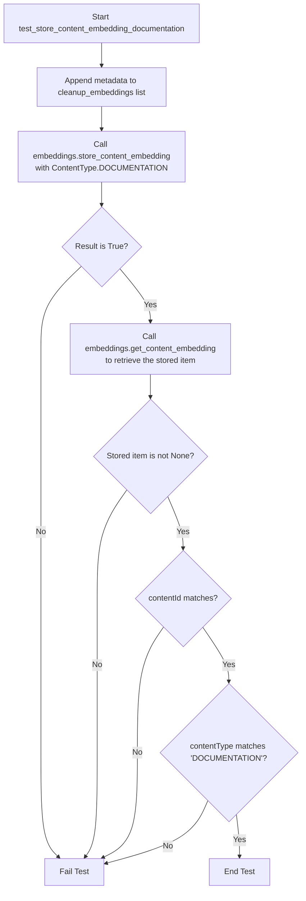

#### 带注释源码

```python
@pytest.mark.asyncio(loop_scope="session")
async def test_store_content_embedding_documentation(
    server,
    test_content_id: str,
    mock_embedding: list[float],
    cleanup_embeddings: list,
):
    """Test storing embedding for DOCUMENTATION content type."""
    # Register the embedding in the cleanup list to ensure it is removed after the test
    cleanup_embeddings.append((ContentType.DOCUMENTATION, test_content_id, None))

    # Execute the storage function with specific documentation details
    result = await embeddings.store_content_embedding(
        content_type=ContentType.DOCUMENTATION,
        content_id=test_content_id,
        embedding=mock_embedding,
        searchable_text="Getting started guide for AutoGPT platform",
        metadata={"title": "Getting Started", "url": "/docs/getting-started"},
        user_id=None,  # Docs are public
    )

    # Verify that the storage operation reported success
    assert result is True

    # Retrieve the stored embedding from the database to verify persistence
    stored = await embeddings.get_content_embedding(
        ContentType.DOCUMENTATION, test_content_id, user_id=None
    )

    # Assert that the embedding exists in the database
    assert stored is not None
    # Assert that the content ID was stored correctly
    assert stored["contentId"] == test_content_id
    # Assert that the content type was stored correctly as a string
    assert stored["contentType"] == "DOCUMENTATION"
```


### `test_store_content_embedding_upsert`

测试针对同一内容ID存储两次嵌入向量时，系统会执行更新（upsert）操作而不是创建重复记录。它验证了第二次存储相同ID的内容时，数据会被覆盖而非重复插入。

参数：

- `server`：`Any`，测试服务器夹具，提供应用程序上下文或客户端实例。
- `test_content_id`：`str`，被测试内容的唯一标识符。
- `mock_embedding`：`list[float]`，用于存储的模拟嵌入向量（已归一化）。
- `cleanup_embeddings`：`list`，用于跟踪创建的嵌入向量以便测试后进行清理的列表。

返回值：`None`，这是一个测试函数，不返回任何值。

#### 流程图

```mermaid
flowchart TD
    A([开始测试]) --> B[将 (ContentType.BLOCK, test_content_id, None) 添加到清理列表]
    B --> C[第一次调用 store_content_embedding<br/>文本为 'Original text']
    C --> D{第一次存储是否成功?}
    D -- 否 --> E([测试失败])
    D -- 是 --> F[第二次调用 store_content_embedding<br/>文本为 'Updated text'<br/>模拟 Upsert 操作]
    F --> G{第二次存储是否成功?}
    G -- 否 --> E
    G -- 是 --> H[调用 get_content_embedding 获取记录]
    H --> I{获取的 searchableText<br/>是否为 'Updated text'?}
    I -- 否 --> E
    I -- 是 --> J([测试通过])
```

#### 带注释源码

```python
@pytest.mark.asyncio(loop_scope="session")
async def test_store_content_embedding_upsert(
    server,
    test_content_id: str,
    mock_embedding: list[float],
    cleanup_embeddings: list,
):
    """Test that storing embedding twice updates instead of duplicates."""
    # 步骤 1: 将测试数据注册到清理列表中，确保测试结束后删除
    cleanup_embeddings.append((ContentType.BLOCK, test_content_id, None))

    # 步骤 2: 第一次存储嵌入向量，使用初始文本 "Original text"
    result1 = await embeddings.store_content_embedding(
        content_type=ContentType.BLOCK,
        content_id=test_content_id,
        embedding=mock_embedding,
        searchable_text="Original text",
        metadata={"version": 1},
        user_id=None,
    )
    assert result1 is True  # 验证第一次存储成功

    # 步骤 3: 第二次存储嵌入向量，使用相同的 content_id 但更新文本为 "Updated text"
    # 预期行为：系统应识别到 ID 已存在，并执行更新而非插入
    result2 = await embeddings.store_content_embedding(
        content_type=ContentType.BLOCK,
        content_id=test_content_id,
        embedding=mock_embedding,
        searchable_text="Updated text",
        metadata={"version": 2},
        user_id=None,
    )
    assert result2 is True  # 验证第二次调用成功

    # 步骤 4: 验证数据库中只有一条记录，且内容已更新
    stored = await embeddings.get_content_embedding(
        ContentType.BLOCK, test_content_id, user_id=None
    )
    assert stored is not None  # 确保记录存在
    assert stored["searchableText"] == "Updated text"  # 关键断言：文本必须是更新的文本，证明发生了 Upsert
```


### `test_get_content_embedding_not_found`

该测试函数用于验证当尝试从数据库中检索一个不存在的嵌入向量时，系统能够正确处理并返回 `None`，而不会抛出异常。

参数：

-   `server`：`Any`，Pytest 提供的 fixture，代表测试服务器实例或数据库连接上下文，用于执行测试操作。

返回值：`None`，该函数是一个测试用例，主要执行断言逻辑，无实际返回值。

#### 流程图

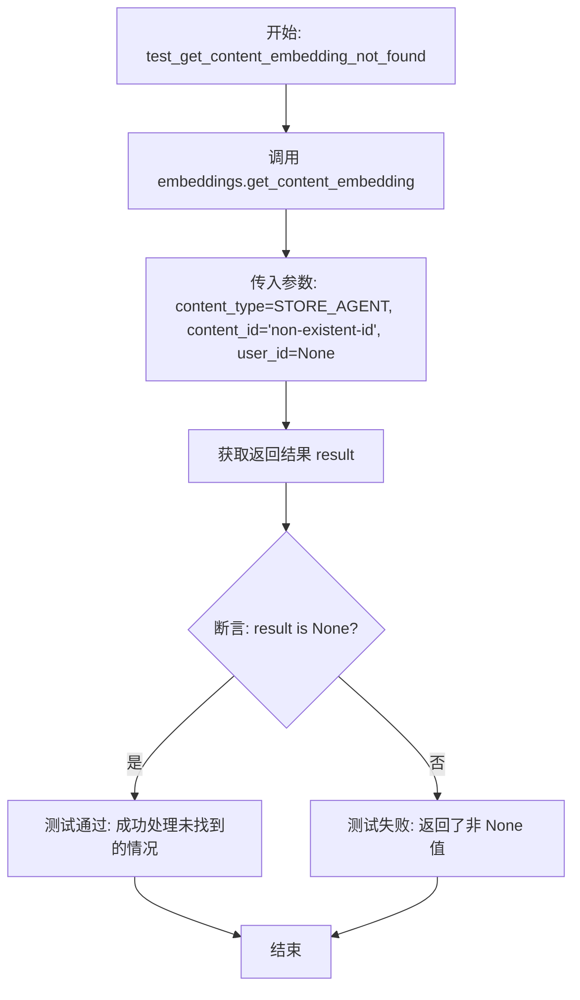

#### 带注释源码

```python
@pytest.mark.asyncio(loop_scope="session")
async def test_get_content_embedding_not_found(server):
    """Test retrieving non-existent embedding returns None."""
    # 调用 get_content_embedding 方法，传入一个不存在的 content_id 'non-existent-id'
    # 预期结果是数据库中没有该记录
    result = await embeddings.get_content_embedding(
        ContentType.STORE_AGENT, "non-existent-id", user_id=None
    )
    # 断言返回的结果为 None，验证系统对“记录不存在”情况的处理逻辑
    assert result is None
```


### `test_get_content_embedding_with_metadata`

测试元数据是否能够正确地随内容嵌入一起存储和检索。该函数首先准备测试数据并注册清理任务，然后调用存储接口保存包含元数据的嵌入向量，接着通过检索接口获取该数据，最后断言获取到的元数据字段与预期一致。

参数：

- `server`：`Any`，测试服务器 fixture，用于提供测试环境上下文。
- `test_content_id`：`str`，生成用于测试隔离的内容 ID。
- `mock_embedding`：`list[float]`，模拟的嵌入向量，用于存储测试。
- `cleanup_embeddings`：`list`，用于跟踪已创建嵌入的列表，以便测试后进行清理。

返回值：`None`，该函数为异步测试函数，主要用于验证逻辑，不返回业务数据。

#### 流程图

```mermaid
flowchart TD
    A[开始] --> B[注册清理任务: 将 test_content_id 加入 cleanup_embeddings]
    B --> C[准备测试元数据 metadata]
    C --> D[调用 store_content_embedding 存储嵌入及元数据]
    D --> E[调用 get_content_embedding 获取嵌入数据]
    E --> F{获取结果是否为 None?}
    F -- 是 --> G[测试失败/报错]
    F -- 否 --> H[断言 metadata.name 等于 'Test Agent']
    H --> I[断言 metadata.categories 等于 ['ai', 'productivity']]
    I --> J[断言 metadata.customField 等于 123]
    J --> K[测试通过/结束]
```

#### 带注释源码

```python
@pytest.mark.asyncio(loop_scope="session")
async def test_get_content_embedding_with_metadata(
    server,
    test_content_id: str,
    mock_embedding: list[float],
    cleanup_embeddings: list,
):
    """Test that metadata is correctly stored and retrieved."""
    # 将本次测试的内容 ID 加入清理列表，确保测试结束后删除数据
    cleanup_embeddings.append((ContentType.STORE_AGENT, test_content_id, None))

    # 定义预期的元数据对象，包含字符串、列表和数字等多种类型
    metadata = {
        "name": "Test Agent",
        "subHeading": "A test agent",
        "categories": ["ai", "productivity"],
        "customField": 123,
    }

    # 调用存储函数，将嵌入向量和元数据写入数据库
    await embeddings.store_content_embedding(
        content_type=ContentType.STORE_AGENT,
        content_id=test_content_id,
        embedding=mock_embedding,
        searchable_text="test",
        metadata=metadata,
        user_id=None,
    )

    # 调用获取函数，根据 content_id 从数据库读取数据
    stored = await embeddings.get_content_embedding(
        ContentType.STORE_AGENT, test_content_id, user_id=None
    )

    # 验证数据是否存在
    assert stored is not None
    # 验证元数据中的具体字段值是否与存入时一致
    assert stored["metadata"]["name"] == "Test Agent"
    assert stored["metadata"]["categories"] == ["ai", "productivity"]
    assert stored["metadata"]["customField"] == 123
```


### `test_delete_content_embedding`

测试删除嵌入内容的功能，验证数据是否已从数据库中移除。

参数：

- `server`：`Any`，提供测试环境和数据库连接的服务器 fixture。
- `test_content_id`：`str`，用于测试的唯一内容 ID。
- `mock_embedding`：`list[float]`，用于存储的模拟嵌入向量。

返回值：`None`，无返回值。

#### 流程图

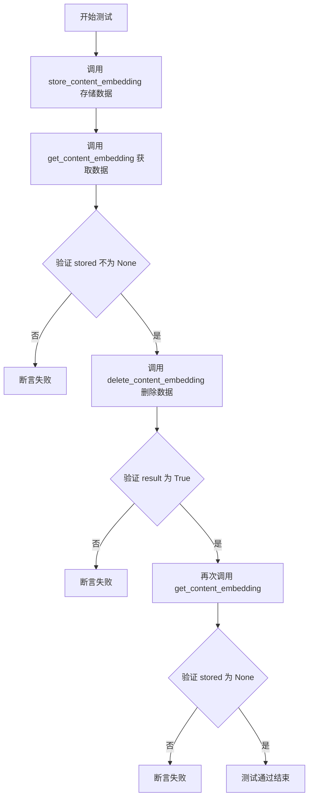

#### 带注释源码

```python
@pytest.mark.asyncio(loop_scope="session")
async def test_delete_content_embedding(
    server,
    test_content_id: str,
    mock_embedding: list[float],
):
    """Test deleting embedding removes it from database."""
    # Store embedding
    # 步骤 1: 先在数据库中存储一个嵌入数据
    await embeddings.store_content_embedding(
        content_type=ContentType.BLOCK,
        content_id=test_content_id,
        embedding=mock_embedding,
        searchable_text="To be deleted",
        metadata=None,
        user_id=None,
    )

    # Verify it exists
    # 步骤 2: 验证数据确实已经存在
    stored = await embeddings.get_content_embedding(
        ContentType.BLOCK, test_content_id, user_id=None
    )
    assert stored is not None

    # Delete it
    # 步骤 3: 调用删除接口删除该数据
    result = await embeddings.delete_content_embedding(
        ContentType.BLOCK, test_content_id, user_id=None
    )
    assert result is True

    # Verify it's gone
    # 步骤 4: 再次尝试获取数据，验证数据已被删除，结果应为 None
    stored = await embeddings.get_content_embedding(
        ContentType.BLOCK, test_content_id, user_id=None
    )
    assert stored is None
```


### `test_delete_content_embedding_not_found`

测试删除一个不存在的 embedding，确保操作成功且不抛出错误。这验证了删除操作在记录不存在时的幂等性或安全处理机制。

参数：

-   `server`：`Fixture`，提供测试服务器环境和数据库连接的 pytest fixture。

返回值：`None`，该函数为测试函数，无返回值。

#### 流程图

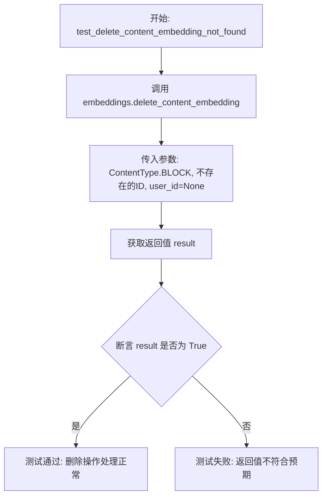

#### 带注释源码

```python
@pytest.mark.asyncio(loop_scope="session")
async def test_delete_content_embedding_not_found(server):
    """Test deleting non-existent embedding doesn't error."""
    # 调用删除函数，传入一个不存在的 content ID
    # 预期系统应优雅处理，不抛出异常
    result = await embeddings.delete_content_embedding(
        ContentType.BLOCK, "non-existent-id", user_id=None
    )
    # 断言返回值为 True，表示即使没有记录被删除，操作也视为成功
    assert result is True
```


### `test_unified_hybrid_search_finds_matching_content`

该测试用例用于验证统一混合搜索功能（`unified_hybrid_search`）能否正确检索到与查询词匹配的多类型内容。测试通过创建包含特定关键词（"writing"）的 Store Agent、Block 和 Documentation 三种类型的测试数据，执行搜索操作，并断言结果中包含预期的内容 ID，从而确保搜索功能在跨内容类型场景下的有效性。

参数：

-  `server`：`Any`，Pytest fixture，提供测试服务器或数据库连接的上下文。
-  `mock_embedding`：`list[float]`，模拟的嵌入向量数据，用于存储测试内容的向量表示。
-  `cleanup_embeddings`：`list`，Pytest fixture，用于追踪测试期间创建的嵌入数据，以便在测试结束后进行清理。

返回值：`None`，该函数为异步测试函数，无返回值，主要通过断言来验证逻辑。

#### 流程图

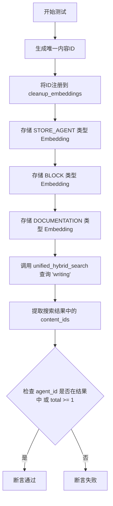

#### 带注释源码

```python
@pytest.mark.asyncio(loop_scope="session")
async def test_unified_hybrid_search_finds_matching_content(
    server,
    mock_embedding: list[float],
    cleanup_embeddings: list,
):
    """Test unified search finds content matching the query."""
    # 1. 为每种内容类型生成唯一的 ID，以避免与现有数据冲突
    agent_id = f"test-agent-{uuid.uuid4()}"
    block_id = f"test-block-{uuid.uuid4()}"
    doc_id = f"test-doc-{uuid.uuid4()}"

    # 2. 将生成的 ID 注册到清理列表中，确保测试后删除
    cleanup_embeddings.append((ContentType.STORE_AGENT, agent_id, None))
    cleanup_embeddings.append((ContentType.BLOCK, block_id, None))
    cleanup_embeddings.append((ContentType.DOCUMENTATION, doc_id, None))

    # 3. 存储 STORE_AGENT 类型的 embedding，包含 "writing" 关键词
    await embeddings.store_content_embedding(
        content_type=ContentType.STORE_AGENT,
        content_id=agent_id,
        embedding=mock_embedding,
        searchable_text="AI writing assistant for blog posts",
        metadata={"name": "Writing Assistant"},
        user_id=None,
    )

    # 4. 存储 BLOCK 类型的 embedding，包含 "writing" 关键词
    await embeddings.store_content_embedding(
        content_type=ContentType.BLOCK,
        content_id=block_id,
        embedding=mock_embedding,
        searchable_text="Text generation block for creative writing",
        metadata={"name": "Text Generator"},
        user_id=None,
    )

    # 5. 存储 DOCUMENTATION 类型的 embedding，包含 "writing" 关键词
    await embeddings.store_content_embedding(
        content_type=ContentType.DOCUMENTATION,
        content_id=doc_id,
        embedding=mock_embedding,
        searchable_text="How to use writing blocks in AutoGPT",
        metadata={"title": "Writing Guide"},
        user_id=None,
    )

    # 6. 执行统一混合搜索，查询 "writing"
    # 预期应能找到上述存储的三条记录
    results, total = await unified_hybrid_search(
        query="writing",
        page=1,
        page_size=20,
    )

    # 7. 验证搜索结果
    content_ids = [r["content_id"] for r in results]
    # 断言：agent_id 必须在结果中，或者总数至少大于等于1（利用词汇搜索兜底）
    assert agent_id in content_ids or total >= 1  # Lexical search should find it
```


### `test_unified_hybrid_search_filter_by_content_type`

该测试函数验证了统一混合搜索功能（`unified_hybrid_search`）能否根据指定的内容类型（如 `BLOCK`）正确过滤搜索结果。它通过创建不同类型的测试数据（Agent 和 Block），在搜索时限定只返回 Block 类型的结果，并断言返回的所有结果均符合该类型约束，从而确保过滤逻辑的有效性。

参数：

- `server`：`Any` (Fixture)，提供测试服务器实例或数据库连接上下文。
- `mock_embedding`：`list[float]`，用于测试的模拟嵌入向量。
- `cleanup_embeddings`：`list`，用于跟踪并在测试结束后清理创建的嵌入数据的列表。

返回值：`None`，该函数为测试用例，无返回值，通过断言验证结果。

#### 流程图

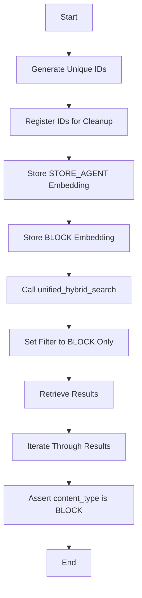

#### 带注释源码

```python
@pytest.mark.asyncio(loop_scope="session")
async def test_unified_hybrid_search_filter_by_content_type(
    server,
    mock_embedding: list[float],
    cleanup_embeddings: list,
):
    """Test unified search can filter by content type."""
    # 生成唯一的测试 ID，以避免与其他测试数据冲突
    agent_id = f"test-agent-{uuid.uuid4()}"
    block_id = f"test-block-{uuid.uuid4()}"

    # 将生成的 ID 加入清理列表，确保测试后数据被删除
    cleanup_embeddings.append((ContentType.STORE_AGENT, agent_id, None))
    cleanup_embeddings.append((ContentType.BLOCK, block_id, None))

    # 存储一个 STORE_AGENT 类型的嵌入，使用特定的搜索文本
    await embeddings.store_content_embedding(
        content_type=ContentType.STORE_AGENT,
        content_id=agent_id,
        embedding=mock_embedding,
        searchable_text="unique_search_term_xyz123",
        metadata={},
        user_id=None,
    )

    # 存储一个 BLOCK 类型的嵌入，使用与 Agent 相同的搜索文本
    await embeddings.store_content_embedding(
        content_type=ContentType.BLOCK,
        content_id=block_id,
        embedding=mock_embedding,
        searchable_text="unique_search_term_xyz123",
        metadata={},
        user_id=None,
    )

    # 执行统一混合搜索，查询该特定文本，但限制只返回 BLOCK 类型的结果
    results, total = await unified_hybrid_search(
        query="unique_search_term_xyz123",
        content_types=[ContentType.BLOCK],
        page=1,
        page_size=20,
    )

    # 验证逻辑：遍历所有返回的结果，断言其 content_type 必须为 "BLOCK"
    # 这确保了 Agent 类型的数据被正确过滤掉了
    for r in results:
        assert r["content_type"] == "BLOCK"
```


### `test_unified_hybrid_search_empty_query`

验证统一混合搜索函数在查询字符串为空时的鲁棒性。该测试确保当传入空字符串作为查询参数时，函数能正确处理并返回空的结果集和零的总数，而不是抛出异常或返回无效数据。

参数：

-  `server`：`Any`，由 pytest 提供的测试服务器 fixture，用于提供测试运行时的上下文环境（如数据库连接或应用实例）。

返回值：`None`，该函数为测试用例，无返回值，通过断言（assert）来验证逻辑正确性。

#### 流程图

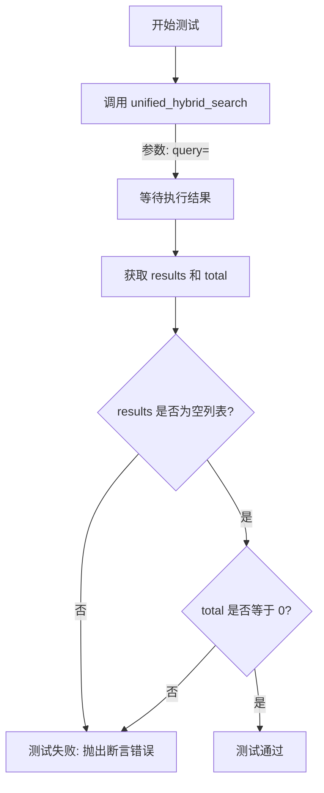

#### 带注释源码

```python
@pytest.mark.asyncio(loop_scope="session")
async def test_unified_hybrid_search_empty_query(server):
    """
    测试当查询字符串为空时，统一混合搜索返回空结果。
    """
    # 调用统一混合搜索函数，传入空字符串作为查询参数
    results, total = await unified_hybrid_search(
        query="",     # 空查询字符串
        page=1,
        page_size=20,
    )

    # 验证返回的结果列表确实为空
    assert results == []
    # 验证返回的总计数确实为0
    assert total == 0
```


### `test_unified_hybrid_search_pagination`

测试统一混合搜索的分页机制是否正确工作，确保分页查询的总数一致，且不同页返回的结果互不重叠。

参数：

-  `server`：`Any`，测试服务器实例 fixture，提供数据库连接等测试环境支持。
-  `mock_embedding`：`list[float]`，模拟的嵌入向量，用于存储测试数据。
-  `cleanup_embeddings`：`list`，用于追踪测试过程中创建的嵌入数据，以便在测试结束后进行清理。

返回值：`None`，该函数为异步测试函数，无显式返回值。

#### 流程图

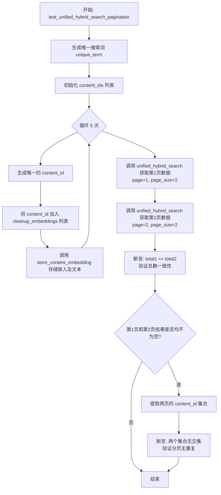

#### 带注释源码

```python
@pytest.mark.asyncio(loop_scope="session")
async def test_unified_hybrid_search_pagination(
    server,
    mock_embedding: list[float],
    cleanup_embeddings: list,
):
    """Test unified search pagination works correctly."""
    # 生成一个唯一的搜索词，确保测试数据与数据库中现有数据隔离
    unique_term = f"xyzpagtest{uuid.uuid4().hex[:8]}"

    # 创建多个测试条目（5个）
    content_ids = []
    for i in range(5):
        # 为每个条目生成唯一ID
        content_id = f"test-pagination-{uuid.uuid4()}"
        content_ids.append(content_id)
        # 将条目信息加入清理列表，确保测试后删除
        cleanup_embeddings.append((ContentType.BLOCK, content_id, None))

        # 存储嵌入向量，搜索文本包含唯一的搜索词和索引号
        await embeddings.store_content_embedding(
            content_type=ContentType.BLOCK,
            content_id=content_id,
            embedding=mock_embedding,
            searchable_text=f"{unique_term} item number {i}",
            metadata={"index": i},
            user_id=None,
        )

    # 获取第一页数据，每页大小为 2
    page1_results, total1 = await unified_hybrid_search(
        query=unique_term,
        content_types=[ContentType.BLOCK],
        page=1,
        page_size=2,
    )

    # 获取第二页数据，每页大小为 2
    page2_results, total2 = await unified_hybrid_search(
        query=unique_term,
        content_types=[ContentType.BLOCK],
        page=2,
        page_size=2,
    )

    # 断言：两次查询的总数应当一致
    assert total1 == total2

    # 断言：如果两页都有数据，它们的内容ID集合应当不相交（无重复数据）
    if len(page1_results) > 0 and len(page2_results) > 0:
        page1_ids = {r["content_id"] for r in page1_results}
        page2_ids = {r["content_id"] for r in page2_results}
        # 使用 isdisjoint 检查两个集合是否没有共同元素
        assert page1_ids.isdisjoint(page2_ids)
```


### `test_unified_hybrid_search_min_score_filtering`

验证统一混合搜索功能是否正确应用 `min_score`（最小分数）阈值来过滤低相关性结果的测试函数。

参数：

-   `server`：`Any`，Pytest fixture 提供的服务器测试实例，用于建立测试环境上下文。
-   `mock_embedding`：`list[float]`，Fixture 提供的模拟嵌入向量，用于存储测试数据。
-   `cleanup_embeddings`：`list`，Fixture 提供的列表，用于跟踪并在测试结束后清理生成的嵌入数据。

返回值：`None`，该函数为异步测试用例，执行断言逻辑后无显式返回值。

#### 流程图

```mermaid
graph TD
    A[开始: test_unified_hybrid_search_min_score_filtering] --> B[生成唯一的 content_id]
    B --> C[将 content_id 加入 cleanup_embeddings 列表]
    C --> D[调用 store_content_embedding 存储与搜索词无关的内容]
    D --> E[调用 unified_hybrid_search 设置 min_score 为 0.9]
    E --> F[获取高阈值搜索结果 results_high]
    F --> G[调用 unified_hybrid_search 设置 min_score 为 0.01]
    G --> H[获取低阈值搜索结果 results_low]
    H --> I[断言: len(results_high) <= len(results_low)]
    I --> J[测试结束]
```

#### 带注释源码

```python
@pytest.mark.asyncio(loop_scope="session")
async def test_unified_hybrid_search_min_score_filtering(
    server,
    mock_embedding: list[float],
    cleanup_embeddings: list,
):
    """Test unified search respects min_score threshold."""
    # 生成唯一的测试内容ID，确保测试隔离
    content_id = f"test-minscore-{uuid.uuid4()}"
    
    # 将生成的ID记录到清理列表中，以便测试结束后删除数据
    cleanup_embeddings.append((ContentType.BLOCK, content_id, None))

    # 向数据库存储一条嵌入记录，内容是关于“bananas”（香蕉）
    # 而后续搜索将使用“quantum computing algorithms”（量子计算算法）
    # 两者预期关联度很低
    await embeddings.store_content_embedding(
        content_type=ContentType.BLOCK,
        content_id=content_id,
        embedding=mock_embedding,
        searchable_text="completely unrelated content about bananas",
        metadata={},
        user_id=None,
    )

    # 第一次搜索：使用非常高的 min_score (0.9)
    # 预期由于内容不相关，分数会很低，因此高阈值会过滤掉大部分结果
    results_high, _ = await unified_hybrid_search(
        query="quantum computing algorithms",
        content_types=[ContentType.BLOCK],
        min_score=0.9,  # Very high threshold
        page=1,
        page_size=20,
    )

    # 第二次搜索：使用非常低的 min_score (0.01)
    # 预期低阈值会包含更多结果，包括关联度低的内容
    results_low, _ = await unified_hybrid_search(
        query="quantum computing algorithms",
        content_types=[ContentType.BLOCK],
        min_score=0.01,  # Very low threshold
        page=1,
        page_size=20,
    )

    # 断言：高阈值过滤后的结果数量应当小于或等于低阈值过滤后的结果数量
    # 这验证了 min_score 参数确实起到了过滤作用
    assert len(results_high) <= len(results_low)
```


### `test_hybrid_search_store_agents_sql_valid`

该函数用于测试针对 Store Agents 的混合搜索（hybrid_search）功能是否能够无错误地执行 SQL 查询。它验证了底层数据库交互的语法正确性和运行时稳定性，即使在未找到匹配结果的情况下，也不应抛出异常。

参数：

-   `server`：`Any`，Pytest 提供的测试服务器 fixture 对象，用于初始化测试环境。

返回值：`None`，该函数为异步测试函数，无显式返回值，主要通过断言验证行为。

#### 流程图

```mermaid
flowchart TD
    A[Start Test] --> B[Call hybrid_search<br/>query='test agent', page=1, page_size=20]
    B --> C[Receive results and total]
    C --> D[Assert results is instance of list]
    D --> E[Assert total is instance of int]
    E --> F[Assert total is greater than or equal to 0]
    F --> G[Test Passes / End]
```

#### 带注释源码

```python
@pytest.mark.asyncio(loop_scope="session")
async def test_hybrid_search_store_agents_sql_valid(server):
    """Test that hybrid_search SQL executes without errors."""
    # 调用混合搜索函数，使用通用查询参数。
    # 此步骤主要为了触发底层的 SQL 查询执行，验证 SQL 语法是否正确，不会抛出数据库异常。
    results, total = await hybrid_search(
        query="test agent",
        page=1,
        page_size=20,
    )

    # 断言查询返回的 results 对象是一个列表，确保数据结构符合预期。
    # Should not raise - verifies SQL is valid
    assert isinstance(results, list)
    
    # 断言返回的 total 对象是一个整数，确保分页总数统计正常。
    assert isinstance(total, int)
    
    # 断言总数是非负数，符合逻辑。
    assert total >= 0
```


### `test_hybrid_search_with_filters`

该测试函数旨在验证混合搜索功能（`hybrid_search`）在应用多种筛选条件（如精选状态、创建者、类别等）时，其生成的 SQL 查询是否合法且能正常执行，同时确保返回的数据结构符合预期。

参数：

-   `server`：`Any`，测试用的服务器 fixture 实例，提供数据库连接或应用上下文支持。

返回值：`None`，该函数不直接返回业务数据，主要通过断言验证 SQL 执行的有效性。

#### 流程图

```mermaid
flowchart TD
    A[开始: test_hybrid_search_with_filters] --> B[调用 hybrid_search 函数]
    B --> C[传入复杂筛选参数: query, featured, creators, category, page, page_size]
    C --> D[等待异步执行完成]
    D --> E[接收返回值: results 列表 和 total 总数]
    E --> F{断言检查}
    F -- isinstance results list --> G[验证通过: SQL 逻辑有效]
    F -- isinstance total int --> G
    G --> H[测试结束]
```

#### 带注释源码

```python
@pytest.mark.asyncio(loop_scope="session")
async def test_hybrid_search_with_filters(server):
    """
    Test hybrid_search with various filter options.
    测试带有各种筛选选项的混合搜索功能，验证 SQL 执行不报错且返回格式正确。
    """
    # Test with all filter types
    # 使用所有类型的筛选器调用混合搜索，以测试 SQL 的有效性和逻辑正确性
    results, total = await hybrid_search(
        query="productivity",          # 搜索查询关键词
        featured=True,                 # 筛选条件：仅显示精选项
        creators=["test-creator"],     # 筛选条件：指定创建者列表
        category="productivity",       # 筛选条件：指定类别
        page=1,                        # 分页参数：当前页码
        page_size=10,                  # 分页参数：每页条目数
    )

    # Should not raise - verifies filter SQL is valid
    # 如果上述 SQL 执行没有抛出异常，则证明筛选逻辑的 SQL 语句语法正确。
    # 这里进一步验证返回值的类型是否符合预期。
    assert isinstance(results, list)  # 断言：结果集应当是一个列表
    assert isinstance(total, int)     # 断言：总数应当是一个整数
```


### `test_hybrid_search_pagination`

测试 `hybrid_search` 函数的分页功能，通过请求第一页和第二页的数据，验证返回结果的类型是否正确以及总数统计是否逻辑一致。

参数：

- `server`：`Any`，Pytest 提供的服务器 fixture，用于初始化测试环境或提供客户端实例。

返回值：`None`，该函数为测试函数，无显式返回值，通过断言验证逻辑。

#### 流程图

```mermaid
flowchart TD
    A[Start test_hybrid_search_pagination] --> B[Call hybrid_search page=1 page_size=5]
    B --> C[Call hybrid_search page=2 page_size=5]
    C --> D[Assert results1 type is list]
    D --> E[Assert results2 type is list]
    E --> F[Assert total1 type is int]
    F --> G[Assert total2 type is int]
    G --> H{Is results1 not empty?}
    H -- Yes --> I[Assert total1 > 0]
    H -- No --> J[End]
    I --> J
```

#### 带注释源码

```python
@pytest.mark.asyncio(loop_scope="session")
async def test_hybrid_search_pagination(server):
    """Test hybrid_search pagination."""
    # 请求第一页数据，每页大小为 5，查询关键词为 "agent"
    results1, total1 = await hybrid_search(
        query="agent",
        page=1,
        page_size=5,
    )

    # 请求第二页数据，每页大小为 5，查询关键词为 "agent"
    results2, total2 = await hybrid_search(
        query="agent",
        page=2,
        page_size=5,
    )

    # 验证 SQL 执行未报错，并检查返回的数据类型
    # 确保返回的结果是列表
    assert isinstance(results1, list)
    assert isinstance(results2, list)
    # 确保返回的总数是整数
    assert isinstance(total1, int)
    assert isinstance(total2, int)

    # 如果第一页有结果，则总数 total1 应该大于 0
    # 注意：如果第二页没有结果，total2 可能为 0（受 COUNT(*) OVER 限制）
    if results1:
        assert total1 > 0
```


### `test_all_content_types_searchable`

该函数是一个测试用例，旨在验证系统支持的所有内容类型（STORE_AGENT, BLOCK, DOCUMENTATION）在进行混合搜索时，SQL 查询能够正确执行且不会产生错误。

参数：

-   `server`：`Any`，测试服务器 fixture，提供测试环境上下文。

返回值：`None`，无返回值。

#### 流程图

```mermaid
flowchart TD
    A([开始]) --> B[遍历内容类型列表]
    B --> C{是否有更多类型?}
    C -- 是 --> D[调用 unified_hybrid_search]
    D --> E[断言 results 是列表类型]
    E --> F[断言 total 是整数类型]
    F --> B
    C -- 否 --> G([结束])
```

#### 带注释源码

```python
@pytest.mark.asyncio(loop_scope="session")
async def test_all_content_types_searchable(server):
    """Test that all content types can be searched without SQL errors."""
    # 遍历所有定义的内容类型枚举值
    for content_type in [
        ContentType.STORE_AGENT,
        ContentType.BLOCK,
        ContentType.DOCUMENTATION,
    ]:
        # 针对当前内容类型执行统一混合搜索
        # 使用固定的查询词和分页参数
        results, total = await unified_hybrid_search(
            query="test",
            content_types=[content_type],
            page=1,
            page_size=10,
        )

        # 断言搜索结果不为抛出异常，且返回的数据类型符合预期
        # 确保查询逻辑对每种内容类型均有效
        assert isinstance(results, list)
        assert isinstance(total, int)
```


### `test_multiple_content_types_searchable`

这是一个端到端测试函数，用于验证统一混合搜索功能（`unified_hybrid_search`）能否在同时指定多种内容类型（如 BLOCK 和 DOCUMENTATION）的情况下正确执行，并确保返回的结果符合预期的数据结构，且不会引发 SQL 错误。

参数：

- `server`：`Fixture`，Pytest 测试固件，提供测试服务器环境或数据库连接上下文。

返回值：`None`，该函数为测试用例，无返回值，主要通过断言验证逻辑正确性。

#### 流程图

```mermaid
flowchart TD
    A[开始测试: test_multiple_content_types_searchable] --> B[调用 unified_hybrid_search 函数]
    B --> C[传入参数: query='test', content_types=[BLOCK, DOCUMENTATION]]
    C --> D[等待异步执行并获取 results 和 total]
    D --> E[断言检查: results 是否为 list 类型]
    E -- 是 --> F[断言检查: total 是否为 int 类型]
    E -- 否 --> G[测试失败: 抛出 AssertionError]
    F -- 是 --> H[测试通过: 结束]
    F -- 否 --> I[测试失败: 抛出 AssertionError]
```

#### 带注释源码

```python
@pytest.mark.asyncio(loop_scope="session")
async def test_multiple_content_types_searchable(server):
    """Test searching multiple content types at once."""
    # 调用统一混合搜索接口，传入关键词 "test"
    # 并指定同时搜索 BLOCK 和 DOCUMENTATION 两种内容类型
    # 目的是验证底层 SQL 查询能否正确处理多类型过滤
    results, total = await unified_hybrid_search(
        query="test",
        content_types=[ContentType.BLOCK, ContentType.DOCUMENTATION],
        page=1,
        page_size=20,
    )

    # 验证搜索结果集必须是一个列表
    # Should not raise
    assert isinstance(results, list)
    
    # 验证总命中数必须是一个整数
    assert isinstance(total, int)
```


### `test_search_all_content_types_default`

Test searching all content types (default behavior).

参数：

- `server`：`Fixture`，The server fixture instance provided by pytest, used to enable the test context.

返回值：`None`，No explicit return value; performs assertions to verify the search function handles default content type filtering correctly without raising errors.

#### 流程图

```mermaid
flowchart TD
    A["Start"] --> B["Execute unified_hybrid_search<br/>query='test', content_types=None, page=1, page_size=20"]
    B --> C["Receive results list and total count"]
    C --> D{Check results type}
    D -- "is list" --> E{Check total type}
    D -- "not list" --> F["Test Fails"]
    E -- "is int" --> G["Test Passes"]
    E -- "not int" --> F
    G --> H["End"]
    F --> H
```

#### 带注释源码

```python
@pytest.mark.asyncio(loop_scope="session")
async def test_search_all_content_types_default(server):
    """Test searching all content types (default behavior)."""
    # 调用统一混合搜索函数，传入 content_types=None
    # 目的是验证当不指定内容类型时，函数能正确处理并返回所有类型的结果
    results, total = await unified_hybrid_search(
        query="test",
        content_types=None,  # Should search all
        page=1,
        page_size=20,
    )

    # Should not raise
    # 断言返回的结果是一个列表
    assert isinstance(results, list)
    # 断言返回的总数是一个整数
    assert isinstance(total, int)
```


## 关键组件


### Embedding Storage Management

Manages the persistence, retrieval, update, and deletion of vector embeddings, searchable text, and metadata for different content types, ensuring data consistency and supporting upserts for updates.

### Unified Hybrid Search Engine

A search engine that performs hybrid semantic and lexical searches across disparate content types (STORE_AGENT, BLOCK, DOCUMENTATION), supporting query filtering, pagination, and relevance score thresholds.

### Agent-Specific Hybrid Search

A specialized search component tailored for store agents, enabling content discovery with specific filters such as featured status, creators, and categories.

### Vector Embedding Normalization

A mechanism that handles the mathematical normalization of raw vectors to unit length, a prerequisite for accurate cosine similarity calculations within the database.

### Asynchronous Test Fixtures

A utility suite supporting test isolation by generating unique identifiers, automatically creating normalized test data, and managing asynchronous database cleanup post-execution to prevent state pollution.


## 问题及建议


### 已知问题

-   **测试断言逻辑存在缺陷导致假阳性**：在 `test_unified_hybrid_search_finds_matching_content` 中，断言 `assert agent_id in content_ids or total >= 1` 使用了 `or` 逻辑。这意味着如果数据库中存在历史脏数据（total >= 1），即使当前测试插入的数据未被检索到，测试也会通过。这掩盖了检索逻辑可能存在的问题，降低了测试的有效性。
-   **清理机制静默失败可能掩盖数据问题**：`cleanup_embeddings` fixture 中的清理逻辑使用了 `try...except Exception: pass`。如果删除操作失败（例如由于数据库连接问题、约束冲突或权限问题），异常会被忽略。这不仅导致测试数据残留在数据库中，还可能引起后续测试的数据污染，且难以排查。
-   **端到端测试依赖外部环境导致不稳定**：测试直接依赖真实的数据库连接 (`server` fixture)。这种集成测试执行速度较慢，且极易受到数据库状态、网络延迟或并发测试的影响，导致构建流程的不稳定。
-   **硬编码的向量生成逻辑缺乏语义**：`mock_embedding` 等 fixture 使用简单的模运算生成向量，虽然在数学上满足归一化要求，但在测试“相似度”时，这种生成的向量在语义空间中的分布是人工且随意的，可能无法有效模拟真实的向量搜索场景（例如测试 `similar_embedding` 时，0.01 的偏移量在维度极高时可能对余弦相似度影响极小）。

### 优化建议

-   **使用参数化测试减少代码冗余**：`test_store_content_embedding_store_agent`、`test_store_content_embedding_block` 和 `test_store_content_embedding_documentation` 这三个测试用例的逻辑完全一致，仅 `ContentType` 不同。建议使用 `@pytest.mark.parametrize` 将它们合并为一个参数化测试，大幅减少重复代码并提高可维护性。
-   **引入事务回滚机制代替手动删除**：建议修改 `cleanup_embeddings` 或 `server` fixture 的实现，利用数据库事务在测试开始时开启事务，测试结束后直接回滚，而不是执行 `delete` 操作。这能显著提高测试速度，保证原子性，并彻底避免清理失败带来的数据残留问题。
-   **封装通用的测试辅助函数**：代码中存在大量重复的“存储嵌入 -> 获取嵌入 -> 断言字段”的模式。建议封装如 `assert_store_and_retrieve(content_type, ...)` 之类的辅助函数，使测试用例更专注于业务逻辑的验证而非繁琐的赋值和断言过程。
-   **增强断言的严格性以确保隔离性**：移除搜索测试中的宽泛断言（如 `or total >= 1`）。应断言搜索结果中严格包含当前测试生成的 ID，或者在使用真实数据库前先清空相关表，确保测试的独立性和准确性。
-   **改进向量生成策略以提高测试置信度**：对于测试相似度的场景（`similar_embedding`），建议构建具有明确几何关系的向量（例如单位向量与已知方向的向量），或者允许注入特定的向量值，以便更精确地验证距离计算和阈值过滤逻辑，而不是依赖简单的数值偏移。


## 其它


### 设计目标与约束

**设计目标：**
1.  **端到端验证**：通过直接连接真实数据库，验证 `embeddings` 和 `hybrid_search` 模块的 SQL 逻辑、数据存储及检索功能的正确性，确保查询语句在实际数据库环境中能按预期执行。
2.  **全面覆盖**：覆盖内容嵌入的生命周期管理，包括存储、更新、检索和删除；同时验证混合搜索在不同内容类型（Store Agent, Block, Documentation）下的查询准确性和分页逻辑。
3.  **测试隔离**：确保每个测试用例独立运行，通过生成唯一标识符和自动清理机制，防止测试数据污染数据库或影响其他测试用例。

**约束条件：**
1.  **异步执行环境**：所有测试必须在异步事件循环中运行（`loop_scope="session"`），以适配后端服务的异步 I/O 模型。
2.  **向量归一化**：所有用于测试的 Mock 嵌入向量必须经过数学归一化处理（单位长度），以符合数据库中余弦相似度计算的要求，否则会导致搜索功能异常。
3.  **数据库依赖**：测试套件依赖于外部 `server` fixture 提供的数据库连接，无法在无数据库环境下运行。
4.  **唯一性约束**：测试数据（Content ID）必须全局唯一，避免主键冲突导致的数据覆盖错误。

### 外部依赖与接口契约

**外部依赖：**
1.  **测试框架**：`pytest` 和 `pytest-asyncio`，提供异步测试能力和 fixture 管理。
2.  **数据库客户端**：`prisma` (Prisma Python Client)，用于类型安全的数据库操作及枚举类型（`ContentType`）的定义。
3.  **业务逻辑模块**：
    *   `backend.api.features.store.embeddings`：提供 `store_content_embedding`, `get_content_embedding`, `delete_content_embedding` 等核心操作。
    *   `backend.api.features.store.hybrid_search`：提供 `hybrid_search`, `unified_hybrid_search` 等检索功能。

**接口契约：**
1.  **存储接口**：`store_content_embedding` 接受 `content_type`, `content_id`, `embedding`, `searchable_text`, `metadata`, `user_id` 参数，并约定返回布尔值表示操作成功与否。测试验证了其对相同 ID 的 Upsert（更新）行为。
2.  **检索接口**：`get_content_embedding` 约定在数据不存在时返回 `None`，存在时返回包含 `contentId`, `contentType`, `searchableText`, `metadata` 等字段的字典对象。
3.  **搜索接口**：`unified_hybrid_search` 和 `hybrid_search` 约定返回元组 `(results, total)`，其中 `results` 为结果列表，`total` 为整数。测试验证了其对 `query`, `content_types`, `page`, `page_size`, `min_score` 等参数的响应契约。

### 数据流与状态管理

**数据流：**
1.  **初始化阶段**：通过 `test_content_id` 和 `mock_embedding` 等 fixtures 生成符合约束的测试数据（唯一的 ID 和归一化的向量）。
2.  **执行阶段**：
    *   **写入流**：调用 `store_content_embedding` 将数据写入数据库；若再次调用相同 ID 的数据，验证 Upsert 逻辑是否正确覆盖旧数据。
    *   **读取流**：调用 `get_content_embedding` 或 `unified_hybrid_search`，数据库执行 SQL 查询并返回数据流。
    *   **校验流**：测试断言捕获返回数据，验证其字段值、类型及数量是否符合预期。
3.  **清理阶段**：利用 `cleanup_embeddings` fixture 收集所有已创建数据的元数据，在测试执行完毕后遍历调用 `delete_content_embedding`，将数据从数据库中移除，恢复环境初始状态。

**状态管理：**
*   **生命周期状态**：测试追踪了一个内容记录从“不存在” -> “已存储” -> “已更新” -> “已删除”的完整状态转换。
*   **事务与隔离**：虽然代码层面未显式使用数据库事务回滚，但通过生成不重复的 UUID 和显式的 Delete 操作，实现了逻辑上的数据隔离。

### 异常处理与容错机制

**异常处理策略：**
1.  **静默失败**：在 `cleanup_embeddings` fixture 中，清理操作被包裹在 `try-except` 块中。如果在清理阶段发生异常（例如网络中断或记录已被删除），异常会被捕获并忽略，防止清理失败导致整个测试套件报错退出，保证后续测试不受影响。
2.  **幂等性保证**：`delete_content_embedding` 的测试用例验证了删除不存在的记录时返回 `True` 且不抛出异常，保证了接口的幂等性。

**容错设计：**
1.  **Mock 向量容错**：Mock 嵌入向量生成器包含归一化逻辑，防止因向量模长不为 1 导致的余弦相似度计算错误，从而保证搜索测试的稳定性。
2.  **结果为空处理**：测试专门包含了查询为空字符串或不存在的 ID 的场景，验证系统在无数据情况下返回空列表或 `None`，而不是抛出未处理的异常。

    