# `.\AutoGPT\autogpt_platform\backend\backend\api\features\store\embeddings_schema_test.py` 详细设计文档

This file contains integration tests for embeddings with schema handling, verifying that embeddings operations work correctly across different database schemas.

## 整体流程

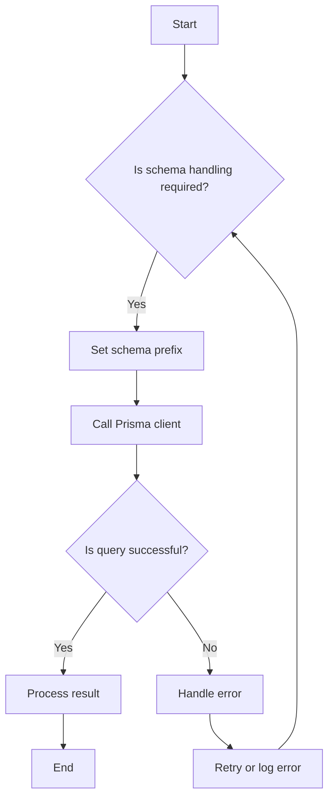

## 类结构

```
Embeddings (主测试模块)
├── test_store_content_embedding_with_schema (存储内容嵌入)
│   ├── mock_schema (模拟数据库模式)
│   ├── mock_get_client (模拟获取客户端)
│   └── store_content_embedding (存储内容嵌入函数)
├── test_get_content_embedding_with_schema (获取内容嵌入)
│   ├── mock_schema
│   ├── mock_get_client
│   └── get_content_embedding (获取内容嵌入函数)
├── test_delete_content_embedding_with_schema (删除内容嵌入)
│   ├── mock_schema
│   ├── mock_get_client
│   └── delete_content_embedding (删除内容嵌入函数)
├── test_get_embedding_stats_with_schema (获取嵌入统计)
│   ├── mock_handler (模拟处理器)
│   └── get_embedding_stats (获取嵌入统计函数)
├── test_backfill_missing_embeddings_with_schema (填充缺失嵌入)
│   ├── ContentItem (内容项)
│   ├── mock_handler
│   └── backfill_missing_embeddings (填充缺失嵌入函数)
├── test_ensure_content_embedding_with_schema (确保内容嵌入存在)
│   ├── mock_schema
│   ├── mock_get
│   ├── mock_generate
│   └── ensure_content_embedding (确保内容嵌入存在函数)
├── test_backward_compatibility_store_embedding (存储嵌入向后兼容)
│   ├── mock_store (模拟存储)
│   └── store_embedding (存储嵌入函数)
├── test_backward_compatibility_get_embedding (获取嵌入向后兼容)
│   ├── mock_get
│   └── get_embedding (获取嵌入函数)
└── test_schema_handling_error_cases (处理模式错误情况)
    ├── mock_schema
    ├── mock_get_client
    └── store_content_embedding
```

## 全局变量及字段


### `ContentType`
    
Enumeration for content types.

类型：`enum`
    


### `EMBEDDING_DIM`
    
The dimension of the embedding vector.

类型：`int`
    


### `AsyncMock`
    
Mock object for asynchronous functions.

类型：`class`
    


### `MagicMock`
    
Mock object for arbitrary objects.

类型：`class`
    


### `patch`
    
Context manager for patching objects.

类型：`function`
    


### `pytest`
    
Python testing framework.

类型：`module`
    


### `mock_schema`
    
Mock object for database schema retrieval.

类型：`MagicMock`
    


### `mock_get_client`
    
Mock object for Prisma client retrieval.

类型：`MagicMock`
    


### `mock_client`
    
Mock object for Prisma client.

类型：`AsyncMock`
    


### `mock_handler`
    
Mock object for content handler.

类型：`MagicMock`
    


### `mock_item`
    
Mock object for content item.

类型：`ContentItem`
    


### `mock_generate`
    
Mock object for embedding generation.

类型：`MagicMock`
    


### `mock_store`
    
Mock object for embedding storage.

类型：`MagicMock`
    


### `mock_get`
    
Mock object for embedding retrieval.

类型：`MagicMock`
    


### `mock_store`
    
Mock object for embedding storage again.

类型：`MagicMock`
    


### `mock_get`
    
Mock object for embedding retrieval again.

类型：`MagicMock`
    


### `prisma.enums.ContentType`
    
Enumeration for content types.

类型：`enum`
    


### `backend.api.features.store.embeddings.EMBEDDING_DIM`
    
The dimension of the embedding vector.

类型：`int`
    


### `unittest.mock.AsyncMock`
    
Mock object for asynchronous functions.

类型：`class`
    


### `unittest.mock.MagicMock`
    
Mock object for arbitrary objects.

类型：`class`
    


### `unittest.mock.patch`
    
Context manager for patching objects.

类型：`function`
    


### `pytest.pytest`
    
Python testing framework.

类型：`module`
    


### `unittest.mock.mock_schema`
    
Mock object for database schema retrieval.

类型：`MagicMock`
    


### `unittest.mock.mock_get_client`
    
Mock object for Prisma client retrieval.

类型：`MagicMock`
    


### `unittest.mock.mock_client`
    
Mock object for Prisma client.

类型：`AsyncMock`
    


### `unittest.mock.mock_handler`
    
Mock object for content handler.

类型：`MagicMock`
    


### `backend.api.features.store.content_handlers.mock_item`
    
Mock object for content item.

类型：`ContentItem`
    


### `unittest.mock.mock_generate`
    
Mock object for embedding generation.

类型：`MagicMock`
    


### `unittest.mock.mock_store`
    
Mock object for embedding storage.

类型：`MagicMock`
    


### `unittest.mock.mock_get`
    
Mock object for embedding retrieval.

类型：`MagicMock`
    


### `unittest.mock.mock_store`
    
Mock object for embedding storage again.

类型：`MagicMock`
    


### `unittest.mock.mock_get`
    
Mock object for embedding retrieval again.

类型：`MagicMock`
    
    

## 全局函数及方法

### `embeddings.store_content_embedding`

#### 描述

该函数用于存储内容嵌入，包括内容类型、内容ID、嵌入向量、可搜索文本、元数据和用户ID。

#### 参数

- `content_type`：`ContentType`，内容类型
- `content_id`：`str`，内容ID
- `embedding`：`list`，嵌入向量
- `searchable_text`：`str`，可搜索文本
- `metadata`：`dict`，元数据
- `user_id`：`Optional[int]`，用户ID

#### 返回值

- `bool`，存储操作是否成功

#### 流程图

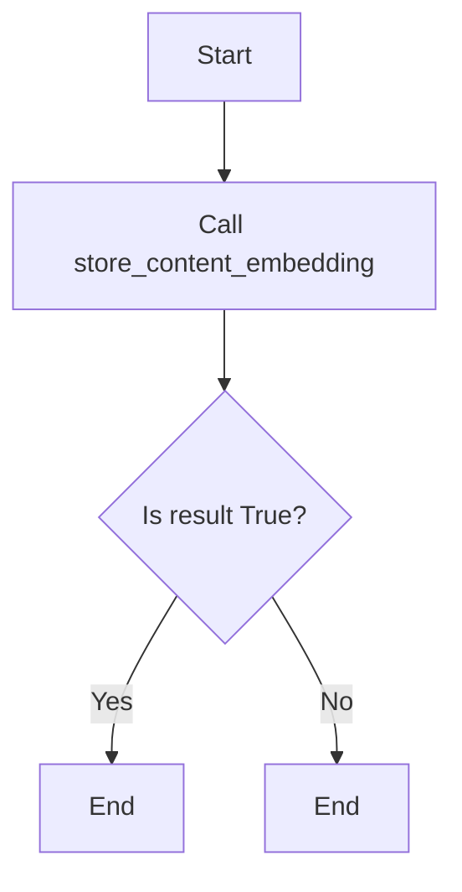

#### 带注释源码

```python
async def store_content_embedding(
    content_type: ContentType,
    content_id: str,
    embedding: list,
    searchable_text: str,
    metadata: dict,
    user_id: Optional[int] = None,
) -> bool:
    # Implementation of the function
    pass
```

### get_content_embedding

该函数用于检索特定内容类型的嵌入信息。

参数：

- `content_type`：`ContentType`，指定要检索的内容类型。
- `content_id`：`str`，指定要检索的内容ID。
- `user_id`：`Optional[int]`，可选参数，指定用户ID。

返回值：`Optional[dict]`，包含嵌入信息的字典，如果未找到则返回`None`。

#### 流程图

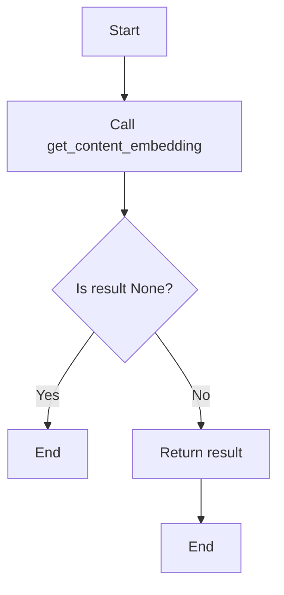

#### 带注释源码

```python
from prisma.enums import ContentType

async def get_content_embedding(content_type: ContentType, content_id: str, user_id: Optional[int] = None) -> Optional[dict]:
    # ... (省略其他代码)

    with patch("prisma.get_client") as mock_get_client:
        mock_client = AsyncMock()
        mock_client.query_raw.return_value = [
            {
                "contentType": "STORE_AGENT",
                "contentId": "test-id",
                "userId": None,
                "embedding": "[0.1, 0.2]",
                "searchableText": "test",
                "metadata": {},
                "createdAt": "2024-01-01",
                "updatedAt": "2024-01-01",
            }
        ]
        mock_get_client.return_value = mock_client

        result = await embeddings.get_content_embedding(
            ContentType.STORE_AGENT,
            "test-id",
            user_id=None,
        )

        # Verify the query was called
        assert mock_client.query_raw.called

        # Get the SQL query that was executed
        call_args = mock_client.query_raw.call_args
        sql_query = call_args[0][0]

        # Verify schema prefix is in the query
        assert '"platform"."UnifiedContentEmbedding"' in sql_query

        # Verify result
        assert result is not None
        assert result["contentId"] == "test-id"
```


### `embeddings.delete_content_embedding`

删除指定内容类型的嵌入。

参数：

- `content_type`：`ContentType`，指定要删除的嵌入的内容类型。
- `content_id`：`str`，指定要删除的嵌入的内容ID。

返回值：`bool`，如果删除成功则返回`True`，否则返回`False`。

#### 流程图

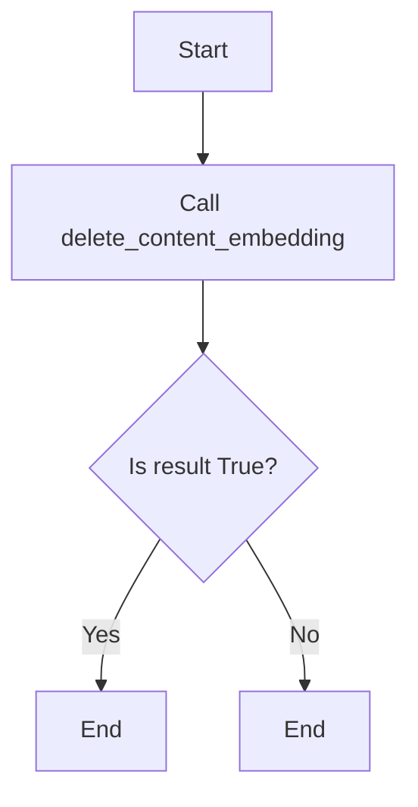

#### 带注释源码

```python
# 删除指定内容类型的嵌入
async def delete_content_embedding(content_type: ContentType, content_id: str) -> bool:
    # 构建SQL查询
    query = f"DELETE FROM \"UnifiedContentEmbedding\" WHERE \"contentType\" = %s AND \"contentId\" = %s"
    # 执行SQL查询
    result = await self.client.execute_raw(query, [content_type.value, content_id])
    # 返回删除结果
    return result
```


### get_embedding_stats

该函数用于获取嵌入统计信息，包括总嵌入数量、具有嵌入的数量、没有嵌入的数量以及嵌入覆盖率百分比。

#### 参数

- `None`：无参数

#### 返回值

- `dict`：包含嵌入统计信息的字典

#### 流程图

```mermaid
graph TD
    A[Start] --> B{Call get_stats()}
    B --> C[Get stats]
    C --> D[Return stats]
    D --> E[End]
```

#### 带注释源码

```python
@pytest.mark.asyncio(loop_scope="session")
@pytest.mark.integration
async def test_get_embedding_stats_with_schema():
    """Test embedding statistics with proper schema handling via content handlers."""
    # Mock handler to return stats
    mock_handler = MagicMock()
    mock_handler.get_stats = AsyncMock(
        return_value={
            "total": 100,
            "with_embeddings": 80,
            "without_embeddings": 20,
        }
    )

    with patch(
        "backend.api.features.store.embeddings.CONTENT_HANDLERS",
        {ContentType.STORE_AGENT: mock_handler},
    ):
        result = await embeddings.get_embedding_stats()

        # Verify handler was called
        mock_handler.get_stats.assert_called_once()

        # Verify new result structure
        assert "by_type" in result
        assert "totals" in result
        assert result["totals"]["total"] == 100
        assert result["totals"]["with_embeddings"] == 80
        assert result["totals"]["without_embeddings"] == 20
        assert result["totals"]["coverage_percent"] == 80.0
```

### backfill_missing_embeddings

#### 描述

The `backfill_missing_embeddings` function is designed to backfill missing embeddings for content items by using content handlers to identify items without embeddings and then generating and storing new embeddings for them.

#### 参数

- `batch_size`：`int`，指定每次处理的内容项数量。

#### 返回值

- `dict`，包含处理结果，包括已处理数量、成功数量和失败数量。

#### 流程图

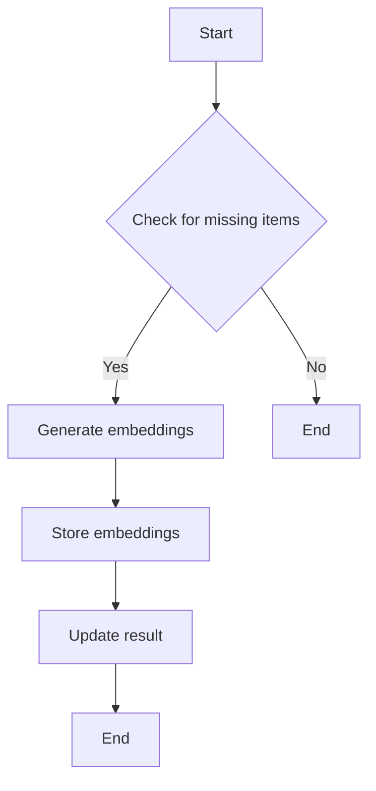

#### 带注释源码

```python
@pytest.mark.asyncio(loop_scope="session")
@pytest.mark.integration
async def test_backfill_missing_embeddings_with_schema():
    """Test backfilling embeddings via content handlers."""
    from backend.api.features.store.content_handlers import ContentItem

    # Create mock content item
    mock_item = ContentItem(
        content_id="version-1",
        content_type=ContentType.STORE_AGENT,
        searchable_text="Test Agent Test description",
        metadata={"name": "Test Agent"},
    )

    # Mock handler
    mock_handler = MagicMock()
    mock_handler.get_missing_items = AsyncMock(return_value=[mock_item])

    with patch(
        "backend.api.features.store.embeddings.CONTENT_HANDLERS",
        {ContentType.STORE_AGENT: mock_handler},
    ):
        with patch(
            "backend.api.features.store.embeddings.generate_embedding",
            return_value=[0.1] * EMBEDDING_DIM,
        ):
            with patch(
                "backend.api.features.store.embeddings.store_content_embedding",
                return_value=True,
            ):
                result = await embeddings.backfill_missing_embeddings(batch_size=10)

                # Verify handler was called
                mock_handler.get_missing_items.assert_called_once_with(10)

                # Verify results
                assert result["processed"] == 1
                assert result["success"] == 1
                assert result["failed"] == 0
```


### `embeddings.ensure_content_embedding`

确保存在内容嵌入。

参数：

- `content_type`：`ContentType`，内容类型。
- `content_id`：`str`，内容ID。
- `searchable_text`：`str`，可搜索文本。
- `metadata`：`dict`，元数据。
- `user_id`：`Optional[int]`，用户ID。
- `force`：`bool`，是否强制生成嵌入。

返回值：`bool`，操作成功与否。

#### 流程图

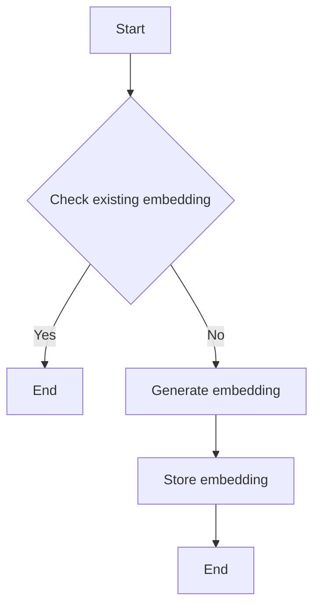

#### 带注释源码

```python
async def ensure_content_embedding(
    content_type: ContentType,
    content_id: str,
    searchable_text: str,
    metadata: dict,
    user_id: Optional[int] = None,
    force: bool = False,
) -> bool:
    # Check if an existing embedding exists
    existing_embedding = await get_content_embedding(content_type, content_id, user_id)
    if existing_embedding or force:
        # Generate a new embedding
        embedding = await generate_embedding(searchable_text, metadata)
        # Store the new embedding
        await store_content_embedding(content_type, content_id, embedding, searchable_text, metadata, user_id)
        return True
    return False
```


### `embeddings.store_embedding`

#### 描述

该函数用于存储内容嵌入，它接受嵌入数据和相关元数据，并将其存储到数据库中。

#### 参数

- `content_type`：`ContentType`，指定内容的类型。
- `content_id`：`str`，指定内容的唯一标识符。
- `embedding`：`list`，包含嵌入数据的列表。
- `searchable_text`：`str`，指定可搜索的文本。
- `metadata`：`dict`，包含额外的元数据。
- `user_id`：`Optional[int]`，可选的用户ID。

#### 返回值

- `bool`，表示操作是否成功。

#### 流程图


#### 带注释源码

```python
from prisma.enums import ContentType

async def store_content_embedding(
    content_type: ContentType,
    content_id: str,
    embedding: list,
    searchable_text: str,
    metadata: dict,
    user_id: Optional[int] = None,
) -> bool:
    # Implementation of the function
    pass
```

### get_content_embedding

该函数用于检索特定内容类型的嵌入信息。

参数：

- `ContentType`: `ContentType`，指定内容类型
- `content_id`: `str`，指定内容ID
- `user_id`: `Optional[int]`，可选的用户ID

返回值：`Optional[dict]`，包含嵌入信息的字典，如果未找到则返回`None`

#### 流程图

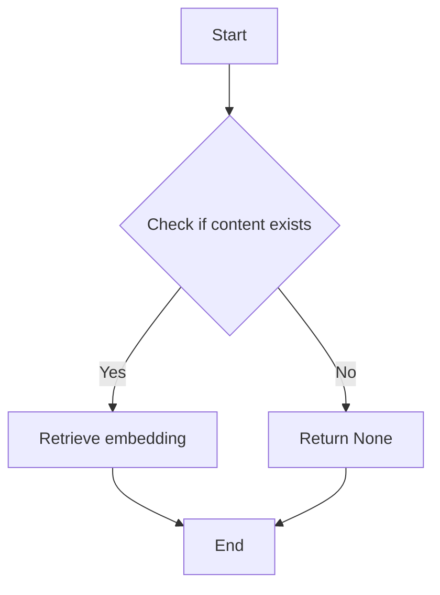

#### 带注释源码

```python
@pytest.mark.asyncio(loop_scope="session")
@pytest.mark.integration
async def test_get_content_embedding_with_schema():
    """Test retrieving embeddings with proper schema handling."""
    with patch("backend.data.db.get_database_schema") as mock_schema:
        mock_schema.return_value = "platform"

        with patch("prisma.get_client") as mock_get_client:
            mock_client = AsyncMock()
            mock_client.query_raw.return_value = [
                {
                    "contentType": "STORE_AGENT",
                    "contentId": "test-id",
                    "userId": None,
                    "embedding": "[0.1, 0.2]",
                    "searchableText": "test",
                    "metadata": {},
                    "createdAt": "2024-01-01",
                    "updatedAt": "2024-01-01",
                }
            ]
            mock_get_client.return_value = mock_client

            result = await embeddings.get_content_embedding(
                ContentType.STORE_AGENT,
                "test-id",
                user_id=None,
            )

            # Verify the query was called
            assert mock_client.query_raw.called

            # Get the SQL query that was executed
            call_args = mock_client.query_raw.call_args
            sql_query = call_args[0][0]

            # Verify schema prefix is in the query
            assert '"platform"."UnifiedContentEmbedding"' in sql_query

            # Verify result
            assert result is not None
            assert result["contentId"] == "test-id"
```


### `embeddings.test_store_content_embedding_with_schema`

This function tests the storing of content embeddings with proper schema handling.

参数：

- `content_type`：`ContentType`，The type of content being stored.
- `content_id`：`str`，The unique identifier for the content.
- `embedding`：`list`，The embedding vector for the content.
- `searchable_text`：`str`，The searchable text associated with the content.
- `metadata`：`dict`，Additional metadata associated with the content.
- `user_id`：`Optional[int]`，The user ID associated with the content.

返回值：`bool`，Indicates whether the embedding was stored successfully.

#### 流程图

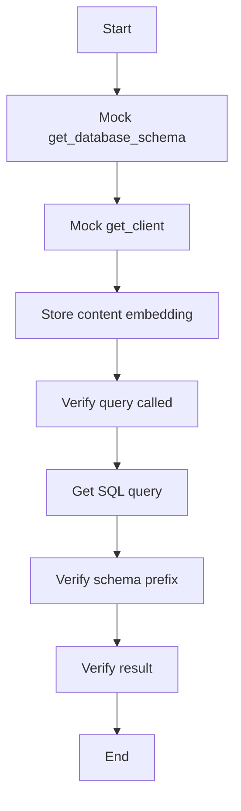

#### 带注释源码

```python
@pytest.mark.asyncio(loop_scope="session")
@pytest.mark.integration
async def test_store_content_embedding_with_schema():
    """Test storing embeddings with proper schema handling."""
    with patch("backend.data.db.get_database_schema") as mock_schema:
        mock_schema.return_value = "platform"

        with patch("prisma.get_client") as mock_get_client:
            mock_client = AsyncMock()
            mock_get_client.return_value = mock_client

            result = await embeddings.store_content_embedding(
                content_type=ContentType.STORE_AGENT,
                content_id="test-id",
                embedding=[0.1] * EMBEDDING_DIM,
                searchable_text="test text",
                metadata={"test": "data"},
                user_id=None,
            )

            # Verify the query was called
            assert mock_client.execute_raw.called

            # Get the SQL query that was executed
            call_args = mock_client.execute_raw.call_args
            sql_query = call_args[0][0]

            # Verify schema prefix is in the query
            assert '"platform"."UnifiedContentEmbedding"' in sql_query

            # Verify result
            assert result is True
```


### `embeddings.get_content_embedding`

This function retrieves the embedding for a given content ID and content type, with proper schema handling.

参数：

- `ContentType`: `ContentType`，The content type of the embedding to retrieve.
- `content_id`: `str`，The ID of the content for which to retrieve the embedding.
- `user_id`: `Optional[int]`，The ID of the user associated with the embedding (optional).

返回值：`Optional[dict]`，A dictionary containing the embedding information if found, otherwise `None`.

#### 流程图

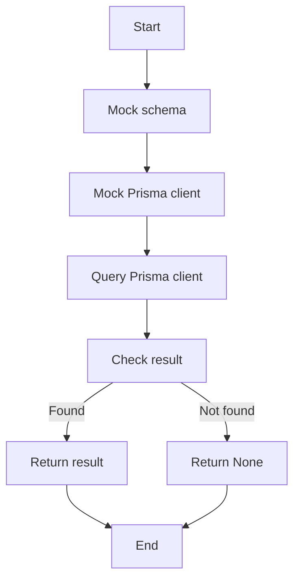

#### 带注释源码

```python
@pytest.mark.asyncio(loop_scope="session")
@pytest.mark.integration
async def test_get_content_embedding_with_schema():
    """Test retrieving embeddings with proper schema handling."""
    with patch("backend.data.db.get_database_schema") as mock_schema:
        mock_schema.return_value = "platform"

        with patch("prisma.get_client") as mock_get_client:
            mock_client = AsyncMock()
            mock_client.query_raw.return_value = [
                {
                    "contentType": "STORE_AGENT",
                    "contentId": "test-id",
                    "userId": None,
                    "embedding": "[0.1, 0.2]",
                    "searchableText": "test",
                    "metadata": {},
                    "createdAt": "2024-01-01",
                    "updatedAt": "2024-01-01",
                }
            ]
            mock_get_client.return_value = mock_client

            result = await embeddings.get_content_embedding(
                ContentType.STORE_AGENT,
                "test-id",
                user_id=None,
            )

            # Verify the query was called
            assert mock_client.query_raw.called

            # Get the SQL query that was executed
            call_args = mock_client.query_raw.call_args
            sql_query = call_args[0][0]

            # Verify schema prefix is in the query
            assert '"platform"."UnifiedContentEmbedding"' in sql_query

            # Verify result
            assert result is not None
            assert result["contentId"] == "test-id"
``` 


### `test_delete_content_embedding_with_schema`

This function tests the deletion of content embeddings with proper schema handling.

参数：

- `ContentType.STORE_AGENT`：`ContentType`，The content type of the embedding to be deleted.
- `content_id`：`str`，The ID of the content to be deleted.

返回值：`bool`，Indicates whether the deletion was successful.

#### 流程图

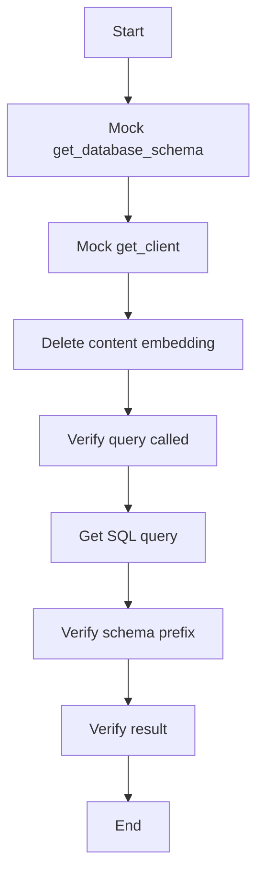

#### 带注释源码

```python
@pytest.mark.asyncio(loop_scope="session")
@pytest.mark.integration
async def test_delete_content_embedding_with_schema():
    """Test deleting embeddings with proper schema handling."""
    with patch("backend.data.db.get_database_schema") as mock_schema:
        mock_schema.return_value = "platform"

        with patch("prisma.get_client") as mock_get_client:
            mock_client = AsyncMock()
            mock_get_client.return_value = mock_client

            result = await embeddings.delete_content_embedding(
                ContentType.STORE_AGENT,
                "test-id",
            )

            # Verify the query was called
            assert mock_client.execute_raw.called

            # Get the SQL query that was executed
            call_args = mock_client.execute_raw.call_args
            sql_query = call_args[0][0]

            # Verify schema prefix is in the query
            assert '"platform"."UnifiedContentEmbedding"' in sql_query

            # Verify result
            assert result is True
```


### `embeddings.get_embedding_stats`

获取嵌入统计信息。

参数：

- `None`：`None`，无参数，该函数通过全局变量`CONTENT_HANDLERS`获取嵌入统计信息。

返回值：`dict`，包含嵌入统计信息，如总嵌入数、有嵌入的数、无嵌入的数和覆盖率百分比。

#### 流程图

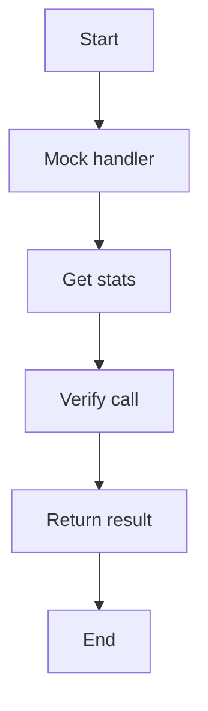

#### 带注释源码

```python
@pytest.mark.asyncio(loop_scope="session")
@pytest.mark.integration
async def test_get_embedding_stats_with_schema():
    """Test embedding statistics with proper schema handling via content handlers."""
    # Mock handler to return stats
    mock_handler = MagicMock()
    mock_handler.get_stats = AsyncMock(
        return_value={
            "total": 100,
            "with_embeddings": 80,
            "without_embeddings": 20,
        }
    )

    with patch(
        "backend.api.features.store.embeddings.CONTENT_HANDLERS",
        {ContentType.STORE_AGENT: mock_handler},
    ):
        result = await embeddings.get_embedding_stats()

        # Verify handler was called
        mock_handler.get_stats.assert_called_once()

        # Verify new result structure
        assert "by_type" in result
        assert "totals" in result
        assert result["totals"]["total"] == 100
        assert result["totals"]["with_embeddings"] == 80
        assert result["totals"]["without_embeddings"] == 20
        assert result["totals"]["coverage_percent"] == 80.0
```


### test_backfill_missing_embeddings_with_schema

This function tests the backfilling of missing embeddings via content handlers.

参数：

- `batch_size`：`int`，The number of items to process in each batch.

返回值：`dict`，A dictionary containing the results of the backfill operation.

#### 流程图

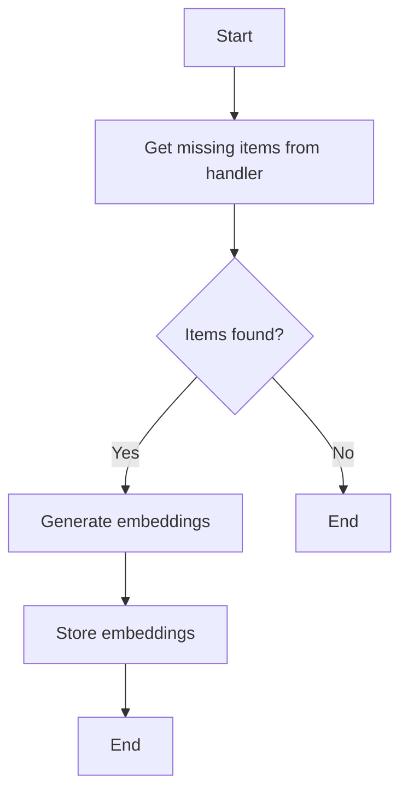

#### 带注释源码

```python
@pytest.mark.asyncio(loop_scope="session")
@pytest.mark.integration
async def test_backfill_missing_embeddings_with_schema():
    """Test backfilling embeddings via content handlers."""

    from backend.api.features.store.content_handlers import ContentItem

    # Create mock content item
    mock_item = ContentItem(
        content_id="version-1",
        content_type=ContentType.STORE_AGENT,
        searchable_text="Test Agent Test description",
        metadata={"name": "Test Agent"},
    )

    # Mock handler
    mock_handler = MagicMock()
    mock_handler.get_missing_items = AsyncMock(return_value=[mock_item])

    with patch(
        "backend.api.features.store.embeddings.CONTENT_HANDLERS",
        {ContentType.STORE_AGENT: mock_handler},
    ):
        with patch(
            "backend.api.features.store.embeddings.generate_embedding",
            return_value=[0.1] * EMBEDDING_DIM,
        ):
            with patch(
                "backend.api.features.store.embeddings.store_content_embedding",
                return_value=True,
            ):
                result = await embeddings.backfill_missing_embeddings(batch_size=10)

                # Verify handler was called
                mock_handler.get_missing_items.assert_called_once_with(10)

                # Verify results
                assert result["processed"] == 1
                assert result["success"] == 1
                assert result["failed"] == 0
```


### `embeddings.ensure_content_embedding`

确保存在内容嵌入。

参数：

- `content_type`：`ContentType`，内容类型。
- `content_id`：`str`，内容ID。
- `searchable_text`：`str`，可搜索文本。
- `metadata`：`dict`，元数据。
- `user_id`：`Optional[int]`，用户ID。
- `force`：`bool`，是否强制生成嵌入。

返回值：`bool`，操作成功与否。

#### 流程图


#### 带注释源码

```python
@pytest.mark.asyncio(loop_scope="session")
@pytest.mark.integration
async def test_ensure_content_embedding_with_schema():
    """Test ensuring embeddings exist with proper schema handling."""
    with patch("backend.data.db.get_database_schema") as mock_schema:
        mock_schema.return_value = "platform"

        with patch(
            "backend.api.features.store.embeddings.get_content_embedding"
        ) as mock_get:
            # Simulate no existing embedding
            mock_get.return_value = None

            with patch(
                "backend.api.features.store.embeddings.generate_embedding"
            ) as mock_generate:
                mock_generate.return_value = [0.1] * EMBEDDING_DIM

                with patch(
                    "backend.api.features.store.embeddings.store_content_embedding"
                ) as mock_store:
                    mock_store.return_value = True

                    result = await embeddings.ensure_content_embedding(
                        content_type=ContentType.STORE_AGENT,
                        content_id="test-id",
                        searchable_text="test text",
                        metadata={"test": "data"},
                        user_id=None,
                        force=False,
                    )

                    # Verify the flow
                    assert mock_get.called
                    assert mock_generate.called
                    assert mock_store.called
                    assert result is True
```


### test_backward_compatibility_store_embedding

This function tests the backward compatibility wrapper for the `store_embedding` method.

参数：

- `version_id`：`str`，The version ID of the content to store the embedding for.
- `embedding`：`list`，The embedding data to store.
- `tx`：`Any`，The transaction object (optional).

返回值：`bool`，Indicates whether the embedding was stored successfully.

#### 流程图

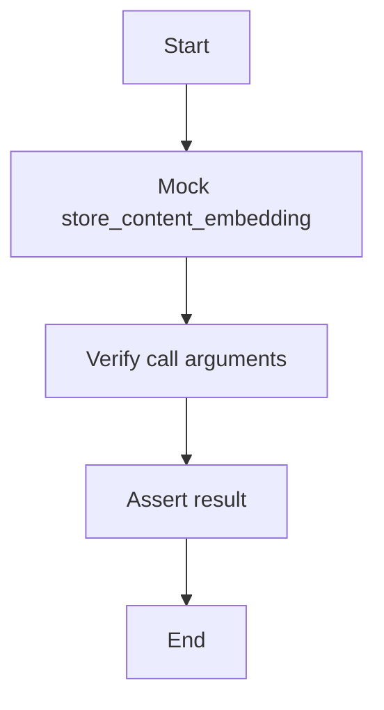

#### 带注释源码

```python
@pytest.mark.asyncio(loop_scope="session")
@pytest.mark.integration
async def test_backward_compatibility_store_embedding():
    """Test backward compatibility wrapper for store_embedding."""
    with patch(
        "backend.api.features.store.embeddings.store_content_embedding"
    ) as mock_store:
        mock_store.return_value = True

        result = await embeddings.store_embedding(
            version_id="test-version-id",
            embedding=[0.1] * EMBEDDING_DIM,
            tx=None,
        )

        # Verify it calls the new function with correct parameters
        assert mock_store.called
        call_args = mock_store.call_args

        assert call_args[1]["content_type"] == ContentType.STORE_AGENT
        assert call_args[1]["content_id"] == "test-version-id"
        assert call_args[1]["user_id"] is None
        assert result is True
```

### test_backward_compatibility_get_embedding

This function tests the backward compatibility wrapper for `get_embedding`. It ensures that the wrapper correctly calls the new `get_content_embedding` function and transforms the result to the old format.

参数：

- `content_id`：`str`，The ID of the content to retrieve the embedding for.

返回值：`dict` or `None`，The embedding data in the old format or `None` if the embedding does not exist.

#### 流程图

```mermaid
graph TD
    A[Start] --> B[Call get_content_embedding(content_id)]
    B --> C{Is result None?}
    C -- Yes --> D[Return None]
    C -- No --> E[Transform result to old format]
    E --> F[Return transformed result]
    F --> G[End]
```

#### 带注释源码

```python
@pytest.mark.asyncio(loop_scope="session")
@pytest.mark.integration
async def test_backward_compatibility_get_embedding():
    with patch(
        "backend.api.features.store.embeddings.get_content_embedding"
    ) as mock_get:
        mock_get.return_value = {
            "contentType": "STORE_AGENT",
            "contentId": "test-version-id",
            "embedding": "[0.1, 0.2]",
            "createdAt": "2024-01-01",
            "updatedAt": "2024-01-01",
        }

        result = await embeddings.get_embedding("test-version-id")

        # Verify it calls the new function
        assert mock_get.called

        # Verify it transforms to old format
        assert result is not None
        assert result["storeListingVersionId"] == "test-version-id"
        assert "embedding" in result
```

### test_schema_handling_error_cases

This function tests the error handling in schema-aware operations. It verifies that an exception is raised when a database error occurs during schema-aware operations.

参数：

- `content_type`：`ContentType`，The content type of the embedding.
- `content_id`：`str`，The ID of the content.
- `embedding`：`list`，The embedding data.
- `searchable_text`：`str`，The searchable text associated with the content.
- `metadata`：`dict`，The metadata associated with the content.
- `user_id`：`str`，The ID of the user performing the operation.

返回值：`None`，This function does not return a value.

#### 流程图

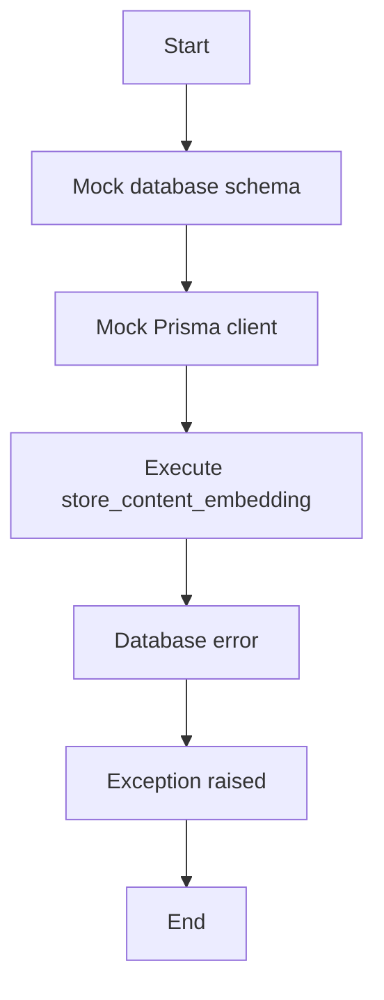

#### 带注释源码

```python
@pytest.mark.asyncio(loop_scope="session")
@pytest.mark.integration
async def test_schema_handling_error_cases():
    """Test error handling in schema-aware operations."""
    with patch("backend.data.db.get_database_schema") as mock_schema:
        mock_schema.return_value = "platform"

        with patch("prisma.get_client") as mock_get_client:
            mock_client = AsyncMock()
            mock_client.execute_raw.side_effect = Exception("Database error")
            mock_get_client.return_value = mock_client

            # Should raise exception on error
            with pytest.raises(Exception, match="Database error"):
                await embeddings.store_content_embedding(
                    content_type=ContentType.STORE_AGENT,
                    content_id="test-id",
                    embedding=[0.1] * EMBEDDING_DIM,
                    searchable_text="test",
                    metadata=None,
                    user_id=None,
                )
```

## 关键组件


### 张量索引与惰性加载

张量索引与惰性加载是用于高效处理大型数据集的关键组件，它允许在需要时才加载数据，从而减少内存消耗和提高性能。

### 反量化支持

反量化支持是用于将量化后的模型转换回原始精度模型的功能，这对于模型部署和验证至关重要。

### 量化策略

量化策略是用于优化模型性能和减少模型大小的方法，它通过减少模型中使用的数值精度来实现。


## 问题及建议


### 已知问题

-   **测试覆盖率不足**：代码中包含多个测试用例，但可能没有覆盖所有可能的边缘情况和异常情况。
-   **依赖性测试**：测试依赖于模拟数据库客户端和数据库模式，这可能限制了测试的真实性和可靠性。
-   **异常处理**：虽然测试用例中包含了对数据库错误的模拟，但实际代码中可能需要更详细的异常处理逻辑。
-   **代码重复**：`store_content_embedding`、`get_content_embedding`和`delete_content_embedding`方法在多个测试用例中被重复调用，这可能导致代码维护困难。

### 优化建议

-   **增加测试覆盖率**：编写更多的测试用例，包括对异常情况和边缘情况的测试，以确保代码的健壮性。
-   **使用真实的数据库**：在可能的情况下，使用真实的数据库进行测试，以提高测试的真实性和可靠性。
-   **改进异常处理**：在代码中实现更详细的异常处理逻辑，以便在出现错误时提供更清晰的错误信息。
-   **减少代码重复**：将重复的测试逻辑提取到单独的函数或类中，以减少代码重复并提高可维护性。
-   **代码审查**：定期进行代码审查，以发现潜在的问题和改进空间。
-   **性能优化**：分析代码的性能瓶颈，并对其进行优化，以提高系统的响应速度和效率。
-   **文档更新**：更新文档，以反映代码的当前状态和最佳实践。


## 其它


### 设计目标与约束

- 设计目标：
  - 确保嵌入操作在不同数据库模式之间正确工作。
  - 提供向后兼容性，支持旧版本接口。
  - 确保错误处理和异常设计，以防止数据损坏或丢失。
  - 提供数据流和状态机，以跟踪嵌入操作的状态。
  - 确保外部依赖和接口契约清晰定义，以便与其他系统集成。

- 约束：
  - 必须使用异步编程模式，以支持非阻塞操作。
  - 必须与现有的数据库架构兼容。
  - 必须遵循代码质量标准，包括代码可读性和可维护性。

### 错误处理与异常设计

- 错误处理：
  - 使用try-except块捕获和处理可能发生的异常。
  - 在数据库操作失败时抛出异常，并记录错误信息。
  - 提供清晰的错误消息，以便于调试和用户反馈。

### 数据流与状态机

- 数据流：
  - 数据从客户端传入，经过验证和处理。
  - 处理后的数据存储在数据库中。
  - 数据可以通过API检索。

- 状态机：
  - 每个嵌入操作都有明确的状态，如“未处理”、“处理中”、“成功”和“失败”。
  - 状态机跟踪每个操作的状态，并确保数据的一致性。

### 外部依赖与接口契约

- 外部依赖：
  - 依赖Prisma数据库客户端进行数据库操作。
  - 依赖`unittest.mock`模块进行单元测试。

- 接口契约：
  - 定义清晰的API接口，包括参数和返回值。
  - 确保接口契约与其他系统兼容。


    