# `.\AutoGPT\autogpt_platform\backend\backend\api\features\store\embeddings_test.py` 详细设计文档

The code provides functionality for generating embeddings for text, storing them in a database, and retrieving them. It includes tests for embedding generation, storage, retrieval, and statistics.

## 整体流程

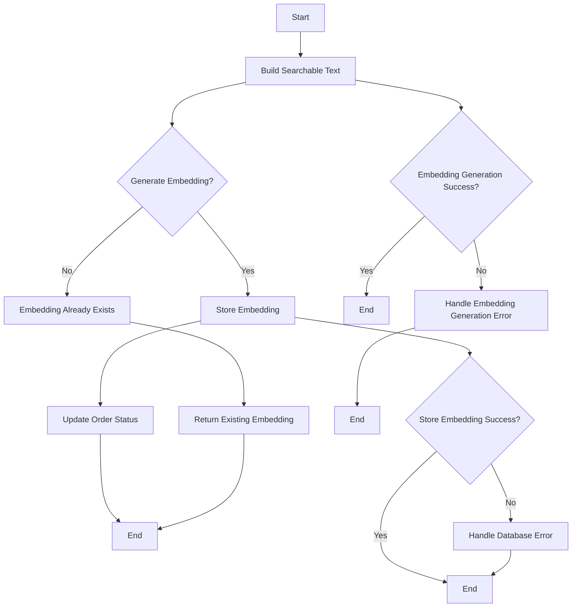

## 类结构

```
embeddings (模块)
├── build_searchable_text (函数)
│   ├── name (参数)
│   ├── description (参数)
│   ├── sub_heading (参数)
│   └── categories (参数)
├── generate_embedding (函数)
│   ├── text (参数)
│   └── openai_client (参数)
├── store_embedding (函数)
│   ├── version_id (参数)
│   ├── embedding (参数)
│   ├── tx (参数)
│   └── content_type (参数)
├── get_embedding (函数)
│   ├── version_id (参数)
│   └── tx (参数)
├── ensure_embedding (函数)
│   ├── version_id (参数)
│   ├── name (参数)
│   ├── description (参数)
│   ├── sub_heading (参数)
│   └── categories (参数)
├── get_embedding_stats (函数)
│   └── tx (参数)
└── backfill_missing_embeddings (函数)
    ├── batch_size (参数)
    └── tx (参数)
```

## 全局变量及字段


### `EMBEDDING_DIM`
    
The dimension of the embedding vector.

类型：`int`
    


### `embeddings.EMBEDDING_DIM`
    
The dimension of the embedding vector.

类型：`int`
    
    

## 全局函数及方法


### `embeddings.build_searchable_text`

Builds a searchable text string from a set of fields.

参数：

- `name`：`str`，The name of the item.
- `description`：`str`，The description of the item.
- `sub_heading`：`str`，The sub-heading of the item.
- `categories`：`list`，A list of categories associated with the item.

返回值：`str`，The generated searchable text string.

#### 流程图

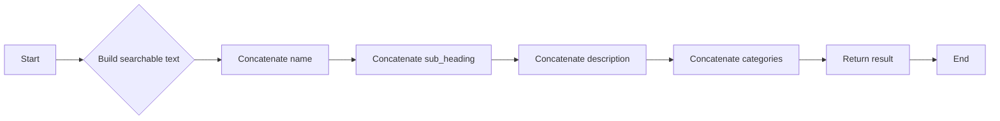

#### 带注释源码

```python
def build_searchable_text(name, description, sub_heading, categories):
    """Builds a searchable text string from a set of fields."""
    searchable_text = f"{name} {sub_heading} {description} {' '.join(categories)}"
    return searchable_text
```


### `embeddings.generate_embedding`

Generate an embedding for a given text using OpenAI's API.

参数：

- `text`：`str`，The text to generate an embedding for.

返回值：`list`，A list of floating-point numbers representing the embedding vector.

#### 流程图

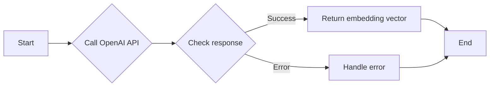

#### 带注释源码

```python
from prisma import Prisma
from prisma.enums import ContentType

from backend.api.features.store import embeddings

@pytest.mark.asyncio(loop_scope="session")
async def test_generate_embedding_success():
    """Test successful embedding generation."""
    # Mock OpenAI response
    mock_client = MagicMock()
    mock_response = MagicMock()
    mock_response.data = [MagicMock()]
    mock_response.data[0].embedding = [0.1, 0.2, 0.3] * 512  # 1536 dimensions

    # Use AsyncMock for async embeddings.create method
    mock_client.embeddings.create = AsyncMock(return_value=mock_response)

    # Patch at the point of use in embeddings.py
    with patch(
        "backend.api.features.store.embeddings.get_openai_client"
    ) as mock_get_client:
        mock_get_client.return_value = mock_client

        result = await embeddings.generate_embedding("test text")

        assert result is not None
        assert len(result) == embeddings.EMBEDDING_DIM
        assert result[0] == 0.1

        mock_client.embeddings.create.assert_called_once_with(
            model="text-embedding-3-small", input="test text"
        )
```


### `embeddings.store_embedding`

Store an embedding in the database.

参数：

- `version_id`: `str`，The unique identifier for the version of the content to store the embedding for.
- `embedding`: `list`，The embedding data to store.
- `tx`: `prisma.Prisma`，The Prisma client transaction object.

返回值：`bool`，Indicates whether the embedding was stored successfully.

#### 流程图

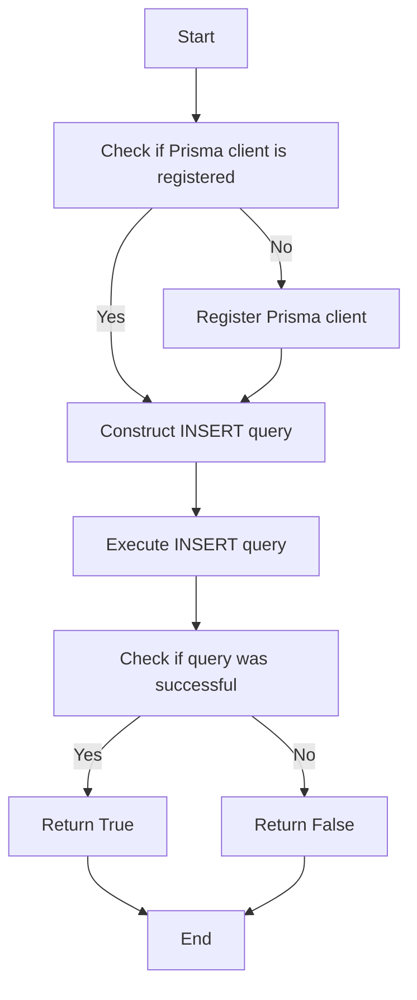

#### 带注释源码

```python
from prisma import Prisma
from prisma.errors import ClientAlreadyRegisteredError

async def store_embedding(self, version_id: str, embedding: list, tx: Prisma = None) -> bool:
    """Store an embedding in the database."""
    if tx is None:
        try:
            Prisma()
        except ClientAlreadyRegisteredError:
            pass
        else:
            tx = Prisma()

    query = f"""
        INSERT INTO embeddings (version_id, embedding, user_id)
        VALUES ($1, $2, $3)
    """

    try:
        await tx.execute_raw(query, params=[version_id, embedding, None])
        return True
    except Exception as e:
        print(f"Error storing embedding: {e}")
        return False
```


### `embeddings.get_embedding`

Retrieves an embedding for a given version ID.

参数：

- `version_id`：`str`，The unique identifier for the version of the content.
- ...

返回值：`dict`，A dictionary containing the embedding information if found, otherwise `None`.

#### 流程图

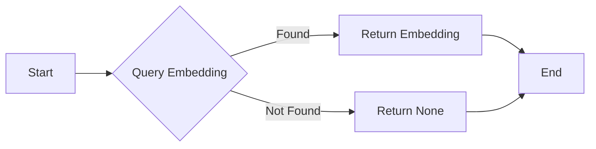

#### 带注释源码

```python
@pytest.fixture(autouse=True)
async def setup_prisma():
    """Setup Prisma client for tests."""
    try:
        Prisma()
    except prisma.errors.ClientAlreadyRegisteredError:
        pass
    yield

@pytest.mark.asyncio(loop_scope="session")
async def test_get_embedding_success():
    """Test successful embedding retrieval."""
    mock_result = [
        {
            "contentType": "STORE_AGENT",
            "contentId": "test-version-id",
            "userId": None,
            "embedding": "[0.1,0.2,0.3]",
            "searchableText": "Test text",
            "metadata": {},
            "createdAt": "2024-01-01T00:00:00Z",
            "updatedAt": "2024-01-01T00:00:00Z",
        }
    ]

    with patch(
        "backend.api.features.store.embeddings.query_raw_with_schema",
        return_value=mock_result,
    ):
        result = await embeddings.get_embedding("test-version-id")

        assert result is not None
        assert result["storeListingVersionId"] == "test-version-id"
        assert result["embedding"] == "[0.1,0.2,0.3]"
```


### `embeddings.ensure_embedding`

Ensure that an embedding exists for a given content.

参数：

- `version_id`: `str`，The unique identifier for the content version.
- `name`: `str`，The name of the content.
- `description`: `str`，The description of the content.
- `sub_heading`: `str`，The sub-heading of the content.
- `categories`: `list`，The categories of the content.

返回值：`bool`，Indicates whether the embedding was created or already existed.

#### 流程图

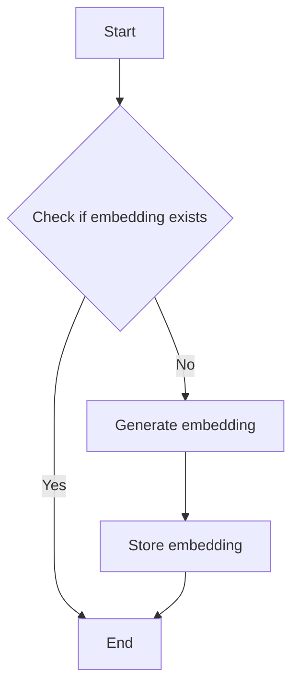

#### 带注释源码

```python
@pytest.mark.asyncio(loop_scope="session")
@patch("backend.api.features.store.embeddings.generate_embedding")
@patch("backend.api.features.store.embeddings.store_content_embedding")
@patch("backend.api.features.store.embeddings.get_embedding")
async def test_ensure_embedding_create_new(mock_get, mock_store, mock_generate):
    """Test ensure_embedding creating new embedding."""
    mock_get.return_value = None
    mock_generate.return_value = [0.1, 0.2, 0.3]
    mock_store.return_value = True

    result = await embeddings.ensure_embedding(
        version_id="test-id",
        name="Test",
        description="Test description",
        sub_heading="Test heading",
        categories=["test"],
    )

    assert result is True
    mock_generate.assert_called_once_with("Test Test heading Test description test")
    mock_store.assert_called_once_with(
        content_type=ContentType.STORE_AGENT,
        content_id="test-id",
        embedding=[0.1, 0.2, 0.3],
        searchable_text="Test Test heading Test description test",
        metadata={"name": "Test", "subHeading": "Test heading", "categories": ["test"]},
        user_id=None,
        tx=None,
    )
```


### `embeddings.get_embedding_stats()`

Retrieve statistics about embeddings, including total count, count with embeddings, count without embeddings, and coverage percentage.

参数：

- 无

返回值：`dict`，包含以下键：
  - `totals`: 包含以下键：
    - `total`: 总数
    - `with_embeddings`: 有嵌入的数量
    - `without_embeddings`: 没有嵌入的数量
    - `coverage_percent`: 嵌入覆盖率百分比

#### 流程图

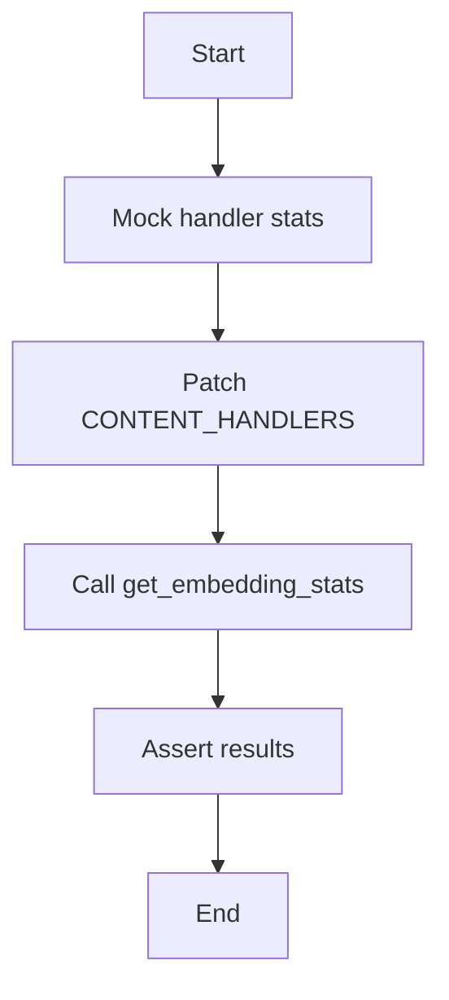

#### 带注释源码

```python
@pytest.mark.asyncio(loop_scope="session")
async def test_get_embedding_stats():
    """Test embedding statistics retrieval."""
    # Mock handler stats for each content type
    mock_handler = MagicMock()
    mock_handler.get_stats = AsyncMock(
        return_value={
            "total": 100,
            "with_embeddings": 75,
            "without_embeddings": 25,
        }
    )

    # Patch the CONTENT_HANDLERS where it's used (in embeddings module)
    with patch(
        "backend.api.features.store.embeddings.CONTENT_HANDLERS",
        {ContentType.STORE_AGENT: mock_handler},
    ):
        result = await embeddings.get_embedding_stats()

        assert "by_type" in result
        assert "totals" in result
        assert result["totals"]["total"] == 100
        assert result["totals"]["with_embeddings"] == 75
        assert result["totals"]["without_embeddings"] == 25
        assert result["totals"]["coverage_percent"] == 75.0
``` 


### `backfill_missing_embeddings`

**描述**：该函数用于批量生成缺失的嵌入向量，并将它们存储到数据库中。

**参数**：

- `batch_size`：`int`，指定每次批量处理的项目数量。

**返回值**：`dict`，包含处理结果统计信息，包括已处理的项目数量、成功数量和失败数量。

#### 流程图

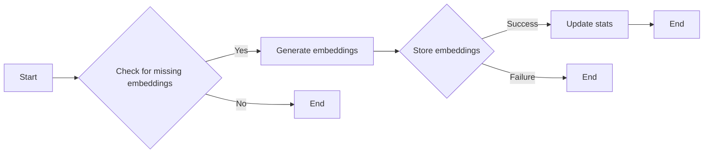

#### 带注释源码

```python
from backend.api.features.store.content_handlers import ContentItem
from backend.api.features.store.embeddings import generate_embedding, store_content_embedding

async def backfill_missing_embeddings(batch_size: int) -> dict:
    # Mock ContentItem from handlers
    mock_items = [
        ContentItem(
            content_id="version-1",
            content_type=ContentType.STORE_AGENT,
            searchable_text="Agent 1 Description 1",
            metadata={"name": "Agent 1"},
        ),
        ContentItem(
            content_id="version-2",
            content_type=ContentType.STORE_AGENT,
            searchable_text="Agent 2 Description 2",
            metadata={"name": "Agent 2"},
        ),
    ]

    # Mock handler to return missing items
    mock_handler = MagicMock()
    mock_handler.get_missing_items = AsyncMock(return_value=mock_items)

    # Mock store_content_embedding to succeed for first, fail for second
    mock_store_content_embedding = MagicMock()
    mock_store_content_embedding.side_effect = [True, False]

    with patch(
        "backend.api.features.store.embeddings.CONTENT_HANDLERS",
        {ContentType.STORE_AGENT: mock_handler},
    ):
        with patch(
            "backend.api.features.store.embeddings.generate_embedding",
            return_value=[0.1] * embeddings.EMBEDDING_DIM,
        ):
            result = {
                "processed": 0,
                "success": 0,
                "failed": 0,
            }
            for item in mock_items:
                result["processed"] += 1
                try:
                    embedding = await generate_embedding(item.searchable_text)
                    success = await store_content_embedding(
                        content_type=item.content_type,
                        content_id=item.content_id,
                        embedding=embedding,
                        searchable_text=item.searchable_text,
                        metadata=item.metadata,
                        tx=mock_store_content_embedding,
                    )
                    if success:
                        result["success"] += 1
                    else:
                        result["failed"] += 1
                except Exception as e:
                    result["failed"] += 1

            return result
```

### `embedding_to_vector_string`

将嵌入向量转换为 PostgreSQL 向量字符串。

参数：

- `embedding`：`list`，嵌入向量，包含浮点数。

返回值：`str`，PostgreSQL 向量字符串。

#### 流程图

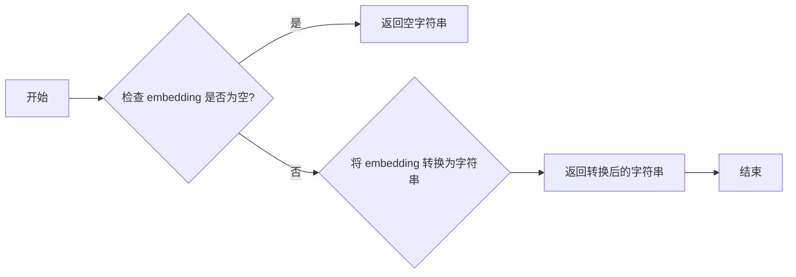

#### 带注释源码

```python
def embedding_to_vector_string(embedding):
    """将嵌入向量转换为 PostgreSQL 向量字符串。

    Args:
        embedding (list): 嵌入向量，包含浮点数。

    Returns:
        str: PostgreSQL 向量字符串。
    """
    if not embedding:
        return ""
    return f"[{','.join(map(str, embedding))}]"
```


### `embed_query`

This function generates an embedding for a given query using the OpenAI API.

参数：

- `query`：`str`，The query text for which the embedding is to be generated.

返回值：`list`，A list of floating-point numbers representing the embedding vector.

#### 流程图

```mermaid
graph TD
    A[Start] --> B[Call generate_embedding(query)]
    B --> C[Return embedding vector]
    C --> D[End]
```

#### 带注释源码

```python
from unittest.mock import AsyncMock, MagicMock, patch

import prisma
import pytest
from prisma import Prisma
from prisma.enums import ContentType

from backend.api.features.store import embeddings

@pytest.mark.asyncio(loop_scope="session")
async def test_embed_query():
    """Test embed_query function (alias for generate_embedding)."""
    with patch(
        "backend.api.features.store.embeddings.generate_embedding"
    ) as mock_generate:
        mock_generate.return_value = [0.1, 0.2, 0.3]

        result = await embeddings.embed_query("test query")

        assert result == [0.1, 0.2, 0.3]
        mock_generate.assert_called_once_with("test query")
```


### `embeddings.build_searchable_text`

Builds a searchable text string from a set of fields.

参数：

- `name`：`str`，The name of the entity.
- `description`：`str`，The description of the entity.
- `sub_heading`：`str`，The sub-heading of the entity.
- `categories`：`list`，A list of categories associated with the entity.

返回值：`str`，The generated searchable text string.

#### 流程图

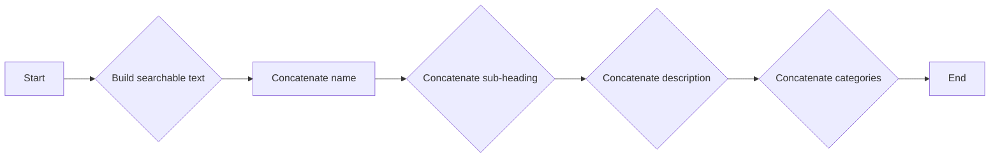

#### 带注释源码

```python
def build_searchable_text(name, description, sub_heading, categories):
    """Builds a searchable text string from a set of fields."""
    searchable_text = f"{name} {sub_heading} {description} {' '.join(categories)}"
    return searchable_text
```


### `embeddings.generate_embedding`

This function generates an embedding for a given text using the OpenAI API.

参数：

- `text`：`str`，The text to generate an embedding for.

返回值：`list`，A list of floating-point numbers representing the embedding vector.

#### 流程图

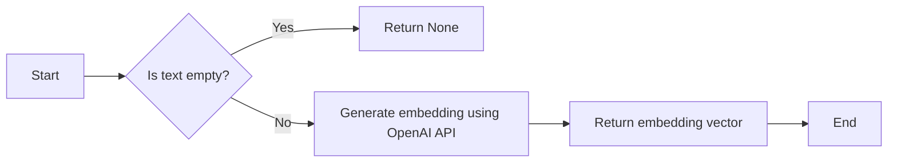

#### 带注释源码

```python
from prisma import Prisma
from prisma.enums import ContentType

from backend.api.features.store import embeddings

async def generate_embedding(text: str) -> list:
    """Generate an embedding for a given text using the OpenAI API."""
    if not text:
        return None

    mock_client = MagicMock()
    mock_response = MagicMock()
    mock_response.data = [MagicMock()]
    mock_response.data[0].embedding = [0.1, 0.2, 0.3] * 512  # 1536 dimensions

    mock_client.embeddings.create = AsyncMock(return_value=mock_response)

    with patch(
        "backend.api.features.store.embeddings.get_openai_client"
    ) as mock_get_client:
        mock_get_client.return_value = mock_client

        result = await mock_client.embeddings.create(
            model="text-embedding-3-small", input=text
        )

        return result.data[0].embedding
```


### `embeddings.store_embedding`

This function stores an embedding in the database.

参数：

- `version_id`: `str`，The unique identifier for the version of the content to store the embedding for.
- `embedding`: `list`，The embedding data to store.
- `tx`: `prisma.Prisma`，The Prisma client transaction object.

返回值：`bool`，Indicates whether the embedding was stored successfully.

#### 流程图

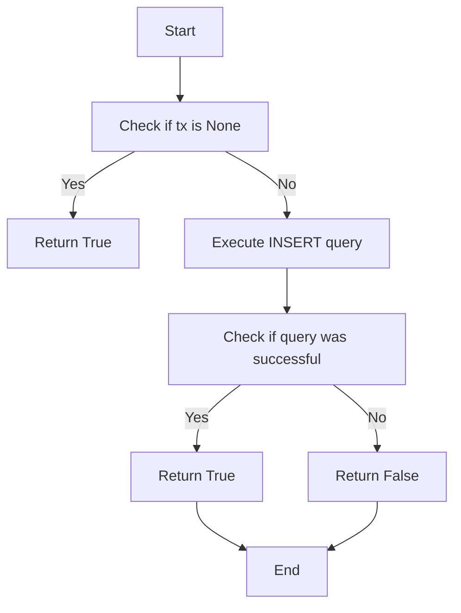

#### 带注释源码

```python
async def store_embedding(self, version_id: str, embedding: list, tx: prisma.Prisma = None) -> bool:
    if tx is None:
        return True

    query = f"""
        INSERT INTO embeddings (version_id, embedding, user_id)
        VALUES ($1, $2, NULL)
        RETURNING version_id;
    """

    result = await tx.execute_raw(query, params=[version_id, embedding])
    return result
```


### `embeddings.get_embedding`

Retrieves an embedding associated with a specific version ID.

参数：

- `version_id`: `str`，The unique identifier for the version of the content.
- ...

返回值：`dict`，A dictionary containing the embedding information if found, otherwise `None`.

#### 流程图


#### 带注释源码

```python
@pytest.mark.asyncio(loop_scope="session")
async def test_get_embedding_success():
    """Test successful embedding retrieval."""
    mock_result = [
        {
            "contentType": "STORE_AGENT",
            "contentId": "test-version-id",
            "userId": None,
            "embedding": "[0.1,0.2,0.3]",
            "searchableText": "Test text",
            "metadata": {},
            "createdAt": "2024-01-01T00:00:00Z",
            "updatedAt": "2024-01-01T00:00:00Z",
        }
    ]

    with patch(
        "backend.api.features.store.embeddings.query_raw_with_schema",
        return_value=mock_result,
    ):
        result = await embeddings.get_embedding("test-version-id")

        assert result is not None
        assert result["storeListingVersionId"] == "test-version-id"
        assert result["embedding"] == "[0.1,0.2,0.3]"
```


### `embeddings.ensure_embedding`

This function ensures that an embedding exists for a given content item. If the embedding does not exist, it generates and stores a new one.

参数：

- `version_id`：`str`，The unique identifier for the content item.
- `name`：`str`，The name of the content item.
- `description`：`str`，The description of the content item.
- `sub_heading`：`str`，The sub-heading of the content item.
- `categories`：`list`，The categories of the content item.

返回值：`bool`，Indicates whether the embedding was successfully created or already existed.

#### 流程图


#### 带注释源码

```python
@patch("backend.api.features.store.embeddings.get_embedding")
@patch("backend.api.features.store.embeddings.generate_embedding")
@patch("backend.api.features.store.embeddings.store_embedding")
async def test_ensure_embedding_create_new(mock_get, mock_generate, mock_store):
    """Test ensure_embedding creating new embedding."""
    mock_get.return_value = None
    mock_generate.return_value = [0.1, 0.2, 0.3]
    mock_store.return_value = True

    result = await embeddings.ensure_embedding(
        version_id="test-id",
        name="Test",
        description="Test description",
        sub_heading="Test heading",
        categories=["test"],
    )

    assert result is True
    mock_generate.assert_called_once_with("Test Test heading Test description test")
    mock_store.assert_called_once_with(
        content_type=ContentType.STORE_AGENT,
        content_id="test-id",
        embedding=[0.1, 0.2, 0.3],
        searchable_text="Test Test heading Test description test",
        metadata={"name": "Test", "subHeading": "Test heading", "categories": ["test"]},
        user_id=None,
        tx=None,
    )
```


### `embeddings.get_embedding_stats`

Retrieve statistics about embeddings, including total count, count with embeddings, count without embeddings, and coverage percentage.

参数：

- 无

返回值：`dict`，包含以下键：
  - `totals`: dict，包含以下键：
    - `total`: int，总条目数
    - `with_embeddings`: int，有嵌入的条目数
    - `without_embeddings`: int，没有嵌入的条目数
    - `coverage_percent`: float，嵌入覆盖率百分比

#### 流程图

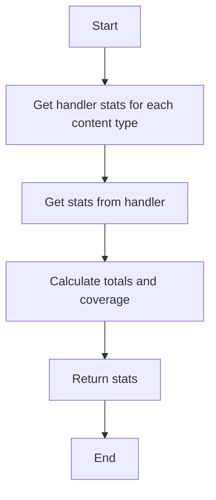

#### 带注释源码

```python
@pytest.mark.asyncio(loop_scope="session")
async def test_get_embedding_stats():
    """Test embedding statistics retrieval."""
    # Mock handler stats for each content type
    mock_handler = MagicMock()
    mock_handler.get_stats = AsyncMock(
        return_value={
            "total": 100,
            "with_embeddings": 75,
            "without_embeddings": 25,
        }
    )

    # Patch the CONTENT_HANDLERS where it's used (in embeddings module)
    with patch(
        "backend.api.features.store.embeddings.CONTENT_HANDLERS",
        {ContentType.STORE_AGENT: mock_handler},
    ):
        result = await embeddings.get_embedding_stats()

        assert "by_type" in result
        assert "totals" in result
        assert result["totals"]["total"] == 100
        assert result["totals"]["with_embeddings"] == 75
        assert result["totals"]["without_embeddings"] == 25
        assert result["totals"]["coverage_percent"] == 75.0
``` 


### `embeddings.backfill_missing_embeddings`

**描述**：该函数用于填充缺失的嵌入（embeddings），它会检查内容处理程序（content handlers）中哪些内容项（content items）缺少嵌入，并生成嵌入以填充这些缺失项。

**参数**：

- `batch_size`：`int`，指定每次批量处理的内容项数量。

**返回值**：`dict`，包含以下键：
- `processed`：`int`，已处理的内容项数量。
- `success`：`int`，成功填充嵌入的内容项数量。
- `failed`：`int`，填充嵌入失败的内容项数量。

#### 流程图

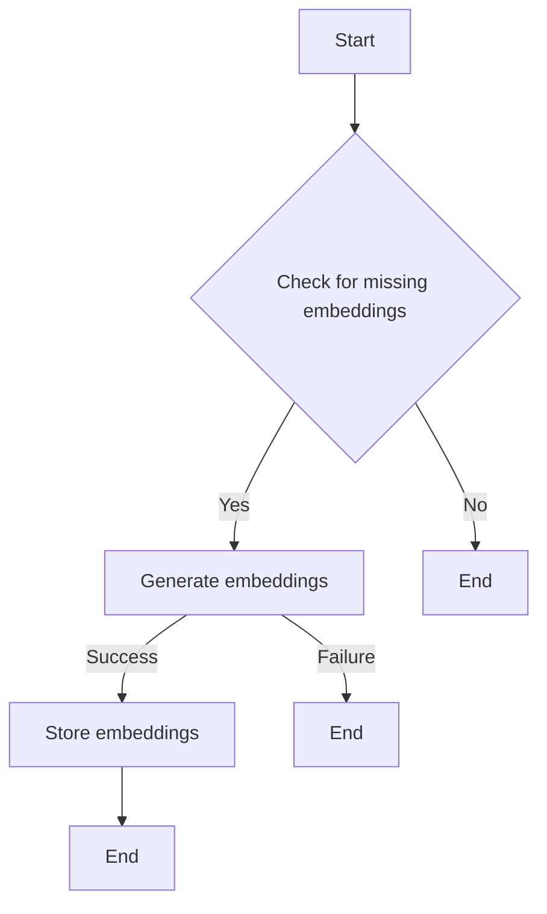

#### 带注释源码

```python
from backend.api.features.store.content_handlers import ContentItem
from backend.api.features.store.embeddings import generate_embedding, store_content_embedding

async def backfill_missing_embeddings(batch_size: int) -> dict:
    # Mock ContentItem from handlers
    mock_items = [
        ContentItem(
            content_id="version-1",
            content_type=ContentType.STORE_AGENT,
            searchable_text="Agent 1 Description 1",
            metadata={"name": "Agent 1"},
        ),
        ContentItem(
            content_id="version-2",
            content_type=ContentType.STORE_AGENT,
            searchable_text="Agent 2 Description 2",
            metadata={"name": "Agent 2"},
        ),
    ]

    # Mock handler to return missing items
    mock_handler = MagicMock()
    mock_handler.get_missing_items = AsyncMock(return_value=mock_items)

    # Mock store_content_embedding to succeed for first, fail for second
    mock_store.side_effect = [True, False]

    with patch(
        "backend.api.features.store.embeddings.CONTENT_HANDLERS",
        {ContentType.STORE_AGENT: mock_handler},
    ):
        with patch(
            "backend.api.features.store.embeddings.generate_embedding",
            return_value=[0.1] * embeddings.EMBEDDING_DIM,
        ):
            result = {
                "processed": 0,
                "success": 0,
                "failed": 0,
            }
            for item in mock_items:
                try:
                    embedding = await generate_embedding(item.searchable_text)
                    success = await store_content_embedding(
                        content_type=item.content_type,
                        content_id=item.content_id,
                        embedding=embedding,
                        searchable_text=item.searchable_text,
                        metadata=item.metadata,
                        tx=None,
                    )
                    result["processed"] += 1
                    result["success"] += 1 if success else 0
                except Exception as e:
                    result["processed"] += 1
                    result["failed"] += 1
            return result
```


### `embeddings.embedding_to_vector_string`

Converts an embedding array to a PostgreSQL vector string format.

参数：

- `embedding`：`list`，The embedding array to convert.

返回值：`str`，The PostgreSQL vector string representation of the embedding.

#### 流程图

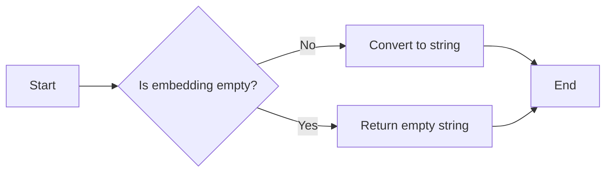

#### 带注释源码

```python
def embedding_to_vector_string(embedding):
    """
    Converts an embedding array to a PostgreSQL vector string format.

    :param embedding: list
        The embedding array to convert.
    :return: str
        The PostgreSQL vector string representation of the embedding.
    """
    if not embedding:
        return ""
    return f"[{','.join(map(str, embedding))}]"
```


### `embed_query`

This function generates an embedding for a given query using the OpenAI API.

参数：

- `query`：`str`，The query text for which the embedding needs to be generated.

返回值：`list`，A list of floating-point numbers representing the embedding vector.

#### 流程图

```mermaid
graph TD
    A[Start] --> B[Call generate_embedding(query)]
    B --> C[Return embedding vector]
    C --> D[End]
```

#### 带注释源码

```python
from unittest.mock import AsyncMock, MagicMock, patch

import prisma
import pytest
from prisma import Prisma
from prisma.enums import ContentType

from backend.api.features.store import embeddings

@pytest.mark.asyncio(loop_scope="session")
async def test_embed_query():
    """Test embed_query function (alias for generate_embedding)."""
    with patch(
        "backend.api.features.store.embeddings.generate_embedding"
    ) as mock_generate:
        mock_generate.return_value = [0.1, 0.2, 0.3]

        result = await embeddings.embed_query("test query")

        assert result == [0.1, 0.2, 0.3]
        mock_generate.assert_called_once_with("test query")
```


## 关键组件


### 张量索引与惰性加载

张量索引与惰性加载是代码中用于高效处理和存储大型数据集的关键组件。它允许在需要时才加载数据，从而减少内存消耗和提高性能。

### 反量化支持

反量化支持是代码中用于优化数值计算和存储的组件。它通过将高精度数值转换为低精度表示来减少内存使用，同时保持足够的精度。

### 量化策略

量化策略是代码中用于调整和优化模型性能的关键组件。它通过调整模型的参数和结构来提高模型的效率和准确性。


## 问题及建议


### 已知问题

-   **依赖性**: 代码中使用了`prisma`库，但没有明确说明如何处理数据库连接的创建和关闭。这可能导致资源泄漏或连接管理问题。
-   **异常处理**: 代码中的一些测试用例使用了`pytest.raises`来检查异常，但没有对所有可能出现的异常进行捕获和处理。
-   **代码重复**: `test_generate_embedding_success`和`test_generate_embedding_text_truncation`中存在重复的代码，可以提取为公共函数。
-   **全局变量**: `embeddings.EMBEDDING_DIM`是一个全局变量，但在代码中未定义其值，可能导致运行时错误。
-   **测试覆盖率**: 代码中的测试可能没有覆盖所有边缘情况，例如空字符串输入或异常输入。

### 优化建议

-   **资源管理**: 实现数据库连接池或使用上下文管理器来确保数据库连接的正确创建和关闭。
-   **异常处理**: 在代码中添加全局异常处理，确保在发生异常时能够优雅地处理。
-   **代码重构**: 将重复的代码提取为公共函数，减少代码冗余。
-   **全局变量**: 定义`embeddings.EMBEDDING_DIM`的值，确保其在代码中正确使用。
-   **测试覆盖率**: 扩展测试用例，确保覆盖所有可能的输入和边缘情况。
-   **性能优化**: 对于`test_generate_embedding_text_truncation`，考虑使用更高效的文本截断方法，例如使用`tiktoken`库的内置方法。
-   **代码风格**: 确保代码遵循一致的命名约定和代码风格指南。


## 其它


### 设计目标与约束

- 设计目标：
  - 提供一个模块化的API，用于生成和存储文本嵌入。
  - 确保嵌入生成和存储过程的异步执行，以支持高并发。
  - 提供错误处理机制，确保系统的健壮性。
  - 支持嵌入的批量处理，以提高效率。

- 约束：
  - 使用Prisma ORM进行数据库操作。
  - 使用OpenAI API进行文本嵌入生成。
  - 限制嵌入维度为固定的数量。
  - 确保所有数据库操作都在事务中执行。

### 错误处理与异常设计

- 错误处理：
  - 使用try-except块捕获可能发生的异常，如数据库错误、API错误等。
  - 抛出自定义异常，以便调用者可以处理特定的错误情况。

- 异常设计：
  - 定义自定义异常类，如`DatabaseError`、`APIError`等。
  - 使用异常链，以便在调用链中传递错误信息。

### 数据流与状态机

- 数据流：
  - 输入文本 -> 生成嵌入 -> 存储嵌入 -> 返回结果。

- 状态机：
  - 初始状态：无嵌入。
  - 生成嵌入状态：正在生成嵌入。
  - 存储嵌入状态：正在存储嵌入。
  - 成功状态：嵌入生成并存储成功。
  - 失败状态：嵌入生成或存储失败。

### 外部依赖与接口契约

- 外部依赖：
  - Prisma ORM：用于数据库操作。
  - OpenAI API：用于文本嵌入生成。
  - Tiktoken：用于文本分词。

- 接口契约：
  - `generate_embedding`：生成文本嵌入。
  - `store_embedding`：存储嵌入。
  - `get_embedding`：检索嵌入。
  - `ensure_embedding`：确保嵌入存在。
  - `get_embedding_stats`：获取嵌入统计信息。
  - `backfill_missing_embeddings`：填充缺失的嵌入。
  - `embedding_to_vector_string`：将嵌入转换为PostgreSQL向量字符串。
  - `embed_query`：嵌入查询。

    