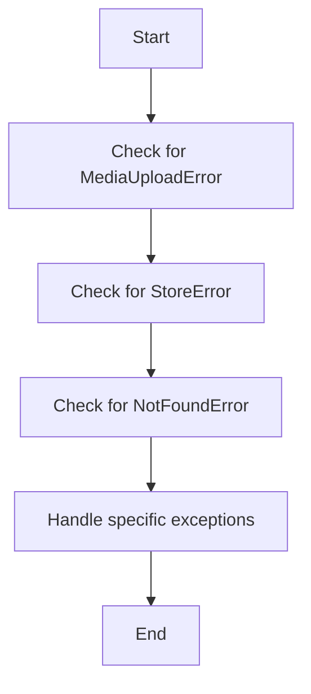

# `.\AutoGPT\autogpt_platform\backend\backend\api\features\store\exceptions.py` 详细设计文档

This code defines a set of custom exceptions for various error conditions that may occur during media upload, storage operations, and other related processes.

## 整体流程



## 类结构

```
MediaUploadError (抽象基类)
├── InvalidFileTypeError
├── FileSizeTooLargeError
├── FileReadError
├── StorageConfigError
├── StorageUploadError
├── VirusDetectedError
├── VirusScanError
└── StoreError (抽象基类)
    ├── AgentNotFoundError
    ├── CreatorNotFoundError
    ├── ListingExistsError
    ├── ProfileNotFoundError
    ├── ListingNotFoundError
    ├── SubmissionNotFoundError
    ├── InvalidOperationError
    └── UnauthorizedError
        └── SlugAlreadyInUseError
```

## 全局变量及字段


### `VirusDetectedError.threat_name`
    
The name of the detected threat in the uploaded file.

类型：`str`
    


### `VirusDetectedError.message`
    
The custom error message, if provided, otherwise a default message indicating a virus has been detected.

类型：`str | None`
    
    

## 全局函数及方法


## 关键组件


### 张量索引与惰性加载

用于高效地处理大型数据集，通过延迟加载和索引优化数据访问。

### 反量化支持

提供对量化策略的反量化支持，以优化模型性能。

### 量化策略

实现不同的量化策略，以减少模型大小和提高推理速度。


## 问题及建议


### 已知问题

-   **异常层次结构单一性**：所有的异常类都继承自`ValueError`或`NotFoundError`，这可能导致异常处理不够灵活，难以区分不同类型的错误。
-   **异常信息重复**：多个异常类（如`MediaUploadError`和`StoreError`）都包含类似的错误信息，这可能导致代码冗余。
-   **异常描述不够具体**：一些异常类的描述不够具体，例如`InvalidOperationError`，没有明确说明无效操作的具体原因。

### 优化建议

-   **引入更细粒度的异常类**：根据不同的错误类型创建更具体的异常类，以便于异常处理和调试。
-   **合并重复的异常信息**：对于具有相似错误信息的异常类，可以考虑合并它们，或者使用一个通用的错误信息，并通过额外的参数提供更详细的错误描述。
-   **增加异常描述的详细性**：为每个异常类提供更详细的描述，包括错误原因和可能的解决方案。
-   **考虑使用自定义异常类**：对于一些常见的错误情况，可以考虑定义自定义异常类，以便于代码的可读性和维护性。
-   **异常链**：在抛出异常时，考虑使用异常链来传递原始异常信息，以便于追踪错误来源。
-   **文档化异常**：为每个异常类编写详细的文档，包括异常的用途、参数和示例代码。


## 其它


### 设计目标与约束

- 设计目标：
  - 提供一套全面的异常处理机制，以处理媒体上传、存储和商店操作中的各种错误情况。
  - 确保异常信息清晰，便于调试和用户理解。
  - 保持异常类结构清晰，易于扩展和维护。

- 约束：
  - 异常类应遵循PEP 8编码规范。
  - 异常类应提供足够的参数，以便在日志记录和错误处理时提供详细信息。

### 错误处理与异常设计

- 错误处理策略：
  - 使用自定义异常类来处理特定类型的错误。
  - 异常类应继承自适当的基类，以保持异常层次结构的清晰性。

- 异常设计：
  - `MediaUploadError`：媒体上传错误的基础类。
  - `StoreError`：存储相关错误的基础类。
  - `NotFoundError`：当资源未找到时抛出的异常。
  - `ValueError`：当输入值无效时抛出的异常。

### 数据流与状态机

- 数据流：
  - 用户上传文件 -> 文件处理 -> 存储文件 -> 返回结果或错误。

- 状态机：
  - 文件上传状态：上传中、上传成功、上传失败。
  - 存储状态：存储中、存储成功、存储失败。

### 外部依赖与接口契约

- 外部依赖：
  - `backend.util.exceptions`：包含自定义异常类。

- 接口契约：
  - 异常类应提供明确的错误信息和必要的上下文数据。
  - 异常类应遵循异常处理的最佳实践，以便于集成和扩展。


    