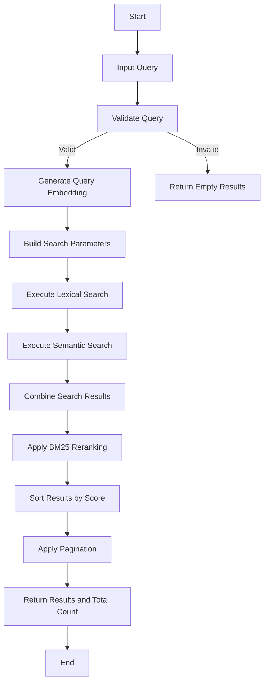
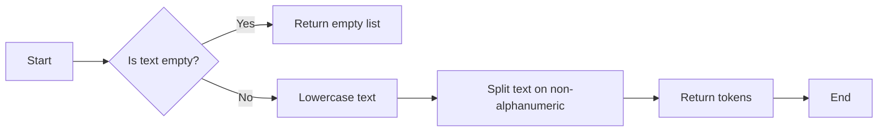
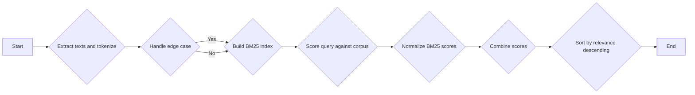
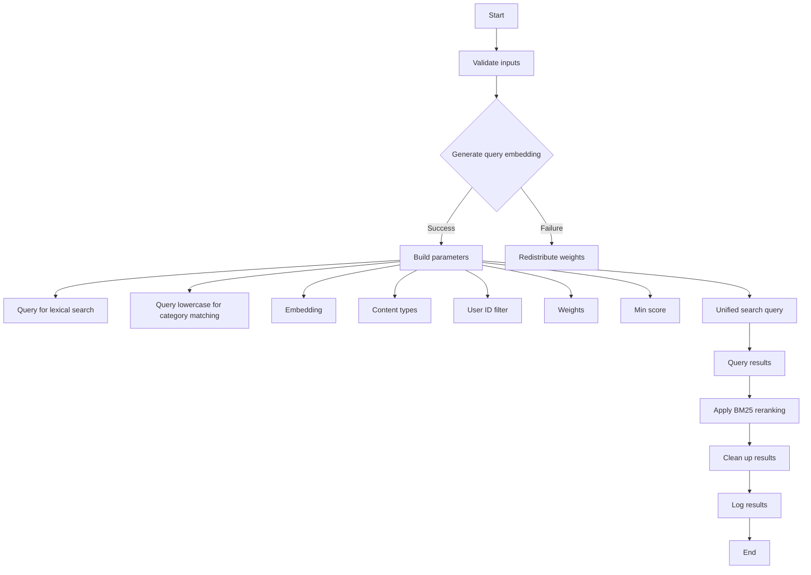
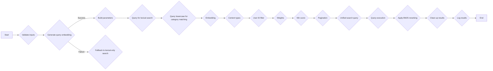
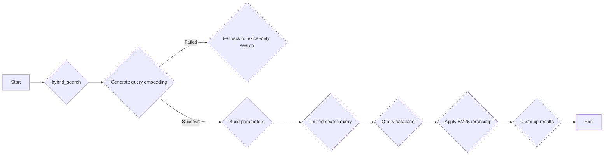
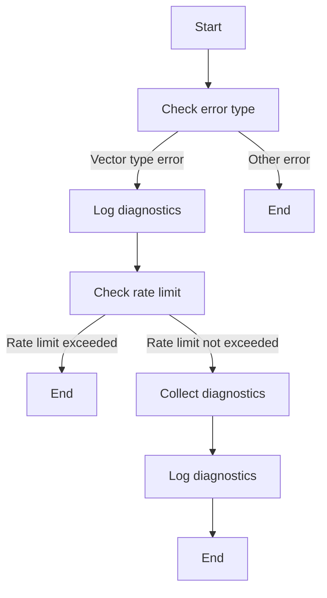
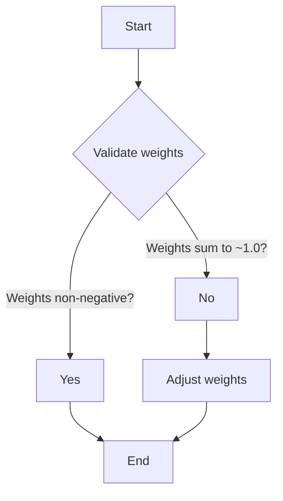

# `.\AutoGPT\autogpt_platform\backend\backend\api\features\store\hybrid_search.py` 详细设计文档

The code implements a unified hybrid search system that combines semantic (embedding) and lexical (tsvector) search for improved relevance across various content types, including agents, blocks, and documents. It also includes BM25 reranking for enhanced lexical relevance.

## 整体流程



## 类结构

```
UnifiedSearchWeights (Dataclass)
├── StoreAgentSearchWeights (Dataclass)
│   ├── semantic
│   ├── lexical
│   ├── category
│   ├── recency
│   └── popularity
│   └── ...
└── ... 
```

## 全局变量及字段


### `logger`
    
Logger instance for logging messages.

类型：`logging.Logger`
    


### `DEFAULT_UNIFIED_WEIGHTS`
    
Default weights for unified search.

类型：`UnifiedSearchWeights`
    


### `DEFAULT_MIN_SCORE`
    
Default minimum relevance score threshold for unified search.

类型：`float`
    


### `DEFAULT_STORE_AGENT_MIN_SCORE`
    
Default minimum relevance score threshold for store agent search.

类型：`float`
    


### `_VECTOR_DIAG_INTERVAL_SECONDS`
    
Interval in seconds for logging vector error diagnostics.

类型：`int`
    


### `_last_vector_diag_time`
    
Timestamp of the last vector error diagnostics log.

类型：`float`
    


### `UnifiedSearchWeights.semantic`
    
Weight for semantic search in unified search.

类型：`float`
    


### `UnifiedSearchWeights.lexical`
    
Weight for lexical search in unified search.

类型：`float`
    


### `UnifiedSearchWeights.category`
    
Weight for category match in unified search.

类型：`float`
    


### `UnifiedSearchWeights.recency`
    
Weight for recency in unified search.

类型：`float`
    


### `StoreAgentSearchWeights.semantic`
    
Weight for semantic search in store agent search.

类型：`float`
    


### `StoreAgentSearchWeights.lexical`
    
Weight for lexical search in store agent search.

类型：`float`
    


### `StoreAgentSearchWeights.category`
    
Weight for category match in store agent search.

类型：`float`
    


### `StoreAgentSearchWeights.recency`
    
Weight for recency in store agent search.

类型：`float`
    


### `StoreAgentSearchWeights.popularity`
    
Weight for popularity in store agent search.

类型：`float`
    


### `UnifiedSearchWeights.semantic`
    
Weight for semantic search in unified search.

类型：`float`
    


### `UnifiedSearchWeights.lexical`
    
Weight for lexical search in unified search.

类型：`float`
    


### `UnifiedSearchWeights.category`
    
Weight for category match in unified search.

类型：`float`
    


### `UnifiedSearchWeights.recency`
    
Weight for recency in unified search.

类型：`float`
    


### `UnifiedSearchWeights.semantic`
    
Weight for semantic search in unified search.

类型：`float`
    


### `UnifiedSearchWeights.lexical`
    
Weight for lexical search in unified search.

类型：`float`
    


### `UnifiedSearchWeights.category`
    
Weight for category match in unified search.

类型：`float`
    


### `UnifiedSearchWeights.recency`
    
Weight for recency in unified search.

类型：`float`
    


### `StoreAgentSearchWeights.semantic`
    
Weight for semantic search in store agent search.

类型：`float`
    


### `StoreAgentSearchWeights.lexical`
    
Weight for lexical search in store agent search.

类型：`float`
    


### `StoreAgentSearchWeights.category`
    
Weight for category match in store agent search.

类型：`float`
    


### `StoreAgentSearchWeights.recency`
    
Weight for recency in store agent search.

类型：`float`
    


### `StoreAgentSearchWeights.popularity`
    
Weight for popularity in store agent search.

类型：`float`
    


### `UnifiedSearchWeights.semantic`
    
Weight for semantic search in unified search.

类型：`float`
    


### `UnifiedSearchWeights.lexical`
    
Weight for lexical search in unified search.

类型：`float`
    


### `UnifiedSearchWeights.category`
    
Weight for category match in unified search.

类型：`float`
    


### `UnifiedSearchWeights.recency`
    
Weight for recency in unified search.

类型：`float`
    
    

## 全局函数及方法


### tokenize

Simple tokenizer for BM25 - lowercase and split on non-alphanumeric.

参数：

- `text`：`str`，The text to tokenize.

返回值：`list[str]`，List of tokens extracted from the text.

#### 流程图



#### 带注释源码

```python
def tokenize(text: str) -> list[str]:
    """Simple tokenizer for BM25 - lowercase and split on non-alphanumeric."""
    if not text:
        return []
    # Lowercase and split on non-alphanumeric characters
    tokens = re.findall(r"\b\w+\b", text.lower())
    return tokens
```


### bm25_rerank

**描述**

Reranks search results using BM25 to improve lexical relevance, especially for exact term matches.

**参数**

- `query`：`str`，The search query.
- `results`：`list[dict[str, Any]]`，List of result dicts with `text_field` and `original_score_field`.
- `text_field`：`str`，Field name containing the text to score (default: "searchable_text").
- `bm25_weight`：`float`，Weight for BM25 score (0-1). Original score gets (1 - bm25_weight) (default: 0.3).
- `original_score_field`：`str`，Field name containing the original score (default: "combined_score").

**返回值**

`list[dict[str, Any]]`，Results list sorted by combined score (BM25 + original).

#### 流程图



#### 带注释源码

```python
def bm25_rerank(
    query: str,
    results: list[dict[str, Any]],
    text_field: str = "searchable_text",
    bm25_weight: float = 0.3,
    original_score_field: str = "combined_score",
) -> list[dict[str, Any]]:
    """
    Rerank search results using BM25.

    Args:
        query: The search query
        results: List of result dicts with text_field and original_score_field
        text_field: Field name containing the text to score
        bm25_weight: Weight for BM25 score (0-1). Original score gets (1 - bm25_weight)
        original_score_field: Field name containing the original score

    Returns:
        Results list sorted by combined score (BM25 + original)
    """
    if not results or not query:
        return results

    # Extract texts and tokenize
    corpus = [tokenize(r.get(text_field, "") or "") for r in results]

    # Handle edge case where all documents are empty
    if all(len(doc) == 0 for doc in corpus):
        return results

    # Build BM25 index
    bm25 = BM25Okapi(corpus)

    # Score query against corpus
    query_tokens = tokenize(query)
    if not query_tokens:
        return results

    bm25_scores = bm25.get_scores(query_tokens)

    # Normalize BM25 scores to 0-1 range
    max_bm25 = max(bm25_scores) if max(bm25_scores) > 0 else 1.0
    normalized_bm25 = [s / max_bm25 for s in bm25_scores]

    # Combine scores
    original_weight = 1.0 - bm25_weight
    for i, result in enumerate(results):
        original_score = result.get(original_score_field, 0) or 0
        result["bm25_score"] = normalized_bm25[i]
        final_score = (
            original_weight * original_score + bm25_weight * normalized_bm25[i]
        )
        result["final_score"] = final_score
        result["relevance"] = final_score

    # Sort by relevance descending
    results.sort(key=lambda x: x.get("relevance", 0), reverse=True)

    return results
```

### unified_hybrid_search

This function performs a unified hybrid search across all content types using both semantic (embedding) and lexical (tsvector) signals.

#### 参数

- `query`：`str`，The search query string.
- `content_types`：`list[ContentType] | None`，List of content types to search. Defaults to all public types.
- `category`：`str | None`，Filter by category (for content types that support it).
- `page`：`int`，Page number (1-indexed).
- `page_size`：`int`，Results per page.
- `weights`：`UnifiedSearchWeights | None`，Custom weights for search signals.
- `min_score`：`float | None`，Minimum relevance score threshold (0-1).
- `user_id`：`str | None`，User ID for searching private content (library agents).

#### 返回值

- `tuple[list[dict[str, Any]], int]`，Tuple of (results list, total count).

#### 流程图



#### 带注释源码

```python
async def unified_hybrid_search(
    query: str,
    content_types: list[ContentType] | None = None,
    category: str | None = None,
    page: int = 1,
    page_size: int = 20,
    weights: UnifiedSearchWeights | None = None,
    min_score: float | None = None,
    user_id: str | None = None,
) -> tuple[list[dict[str, Any]], int]:
    # Validate inputs
    query = query.strip()
    if not query:
        return [], 0

    if page < 1:
        page = 1
    if page_size < 1:
        page_size = 1
    if page_size > 100:
        page_size = 100

    if content_types is None:
        content_types = [
            ContentType.STORE_AGENT,
            ContentType.BLOCK,
            ContentType.DOCUMENTATION,
        ]

    if weights is None:
        weights = DEFAULT_UNIFIED_WEIGHTS
    if min_score is None:
        min_score = DEFAULT_MIN_SCORE

    offset = (page - 1) * page_size

    # Generate query embedding with graceful degradation
    try:
        query_embedding = await embed_query(query)
    except Exception as e:
        logger.warning(
            f"Failed to generate query embedding - falling back to lexical-only search: {e}. "
            "Check that openai_internal_api_key is configured and OpenAI API is accessible."
        )
        query_embedding = [0.0] * EMBEDDING_DIM
        # Redistribute semantic weight to lexical
        total_non_semantic = weights.lexical + weights.category + weights.recency
        if total_non_semantic > 0:
            factor = 1.0 / total_non_semantic
            weights = UnifiedSearchWeights(
                semantic=0.0,
                lexical=weights.lexical * factor,
                category=weights.category * factor,
                recency=weights.recency * factor,
            )
        else:
            weights = UnifiedSearchWeights(
                semantic=0.0, lexical=1.0, category=0.0, recency=0.0
            )

    # Build parameters
    params: list[Any] = []
    param_idx = 1

    # Query for lexical search
    params.append(query)
    query_param = f"${param_idx}"
    param_idx += 1

    # Query lowercase for category matching
    params.append(query.lower())
    query_lower_param = f"${param_idx}"
    param_idx += 1

    embedding_str = embedding_to_vector_string(query_embedding)
    params.append(embedding_str)
    embedding_param = f"${param_idx}"
    param_idx += 1

    # Content types
    content_type_values = [ct.value for ct in content_types]
    params.append(content_type_values)
    content_types_param = f"${param_idx}"
    param_idx += 1

    # User ID filter (for private content)
    user_filter = ""
    if user_id is not None:
        params.append(user_id)
        user_filter = f'AND (uce."userId" = ${param_idx} OR uce."userId" IS NULL)'
        param_idx += 1
    else:
        user_filter = 'AND uce."userId" IS NULL'

    # Weights
    params.append(weights.semantic)
    w_semantic = f"${param_idx}"
    param_idx += 1

    params.append(weights.lexical)
    w_lexical = f"${param_idx}"
    param_idx += 1

    params.append(weights.category)
    w_category = f"${param_idx}"
    param_idx += 1

    params.append(weights.recency)
    w_recency = f"${param_idx}"
    param_idx += 1

    # Min score
    params.append(min_score)
    min_score_param = f"${param_idx}"
    param_idx += 1

    # Pagination
    params.append(page_size)
    limit_param = f"${param_idx}"
    param_idx += 1

    params.append(offset)
    offset_param = f"${param_idx}"
    param_idx += 1

    # Unified search query on UnifiedContentEmbedding
    sql_query = f"""
        WITH candidates AS (
            -- Lexical matches (uses GIN index on search column)
            SELECT uce.id, uce."contentType", uce."contentId"
            FROM {{schema_prefix}}"UnifiedContentEmbedding" uce
            WHERE uce."contentType" = ANY({content_types_param}::{{schema_prefix}}"ContentType"[])
            {user_filter}
            AND uce.search @@ plainto_tsquery('english', {query_param})

            UNION

            -- Semantic matches (uses HNSW index on embedding)
            (
                SELECT uce.id, uce."contentType", uce."contentId"
                FROM {{schema_prefix}}"UnifiedContentEmbedding" uce
                WHERE uce."contentType" = ANY({content_types_param}::{{schema_prefix}}"ContentType"[])
                {user_filter}
                ORDER BY uce.embedding <=> {embedding_param}::vector
                LIMIT 200
            )
        ),
        search_scores AS (
            SELECT
                uce."contentType" as content_type,
                uce."contentId" as content_id,
                uce."searchableText" as searchable_text,
                uce.metadata,
                uce."updatedAt" as updated_at,
                -- Semantic score: cosine similarity (1 - distance)
                COALESCE(1 - (uce.embedding <=> {embedding_param}::vector), 0) as semantic_score,
                -- Lexical score: ts_rank_cd
                COALESCE(ts_rank_cd(uce.search, plainto_tsquery('english', {query_param})), 0) as lexical_raw,
                -- Category match from metadata
                CASE
                    WHEN uce.metadata ? 'categories' AND EXISTS (
                        SELECT 1 FROM jsonb_array_elements_text(uce.metadata->'categories') cat
                        WHERE LOWER(cat) LIKE '%' || {query_lower_param} || '%'
                    )
                    THEN 1.0
                    ELSE 0.0
                END as category_score,
                -- Recency score: linear decay over 90 days
                GREATEST(0, 1 - EXTRACT(EPOCH FROM (NOW() - uce."updatedAt")) / (90 * 24 * 3600)) as recency_score
            FROM candidates c
            INNER JOIN {{schema_prefix}}"UnifiedContentEmbedding" uce ON c.id = uce.id
        ),
        max_lexical AS (
            SELECT GREATEST(MAX(lexical_raw), 0.001) as max_val FROM search_scores
        ),
        normalized AS (
            SELECT
                ss.*,
                ss.lexical_raw / ml.max_val as lexical_score
            FROM search_scores ss
            CROSS JOIN max_lexical ml
        ),
        scored AS (
            SELECT
                content_type,
                content_id,
                searchable_text,
                metadata,
                updated_at,
                semantic_score,
                lexical_score,
                category_score,
                recency_score,
                (
                    {w_semantic} * semantic_score +
                    {w_lexical}

### unified_hybrid_search

#### 描述

The `unified_hybrid_search` function performs a unified hybrid search across all content types using both semantic (vector) and lexical (tsvector) signals.

#### 参数

- `query`: `str`，The search query string.
- `content_types`: `list[ContentType] | None`，List of content types to search. Defaults to all public types.
- `category`: `str | None`，Filter by category (for content types that support it).
- `page`: `int`，Page number (1-indexed).
- `page_size`: `int`，Results per page.
- `weights`: `UnifiedSearchWeights | None`，Custom weights for search signals.
- `min_score`: `float | None`，Minimum relevance score threshold (0-1).
- `user_id`: `str | None`，User ID for searching private content (library agents).

#### 返回值

- `tuple[list[dict[str, Any]], int]`，Tuple of (results list, total count).

#### 流程图



#### 带注释源码

```python
async def unified_hybrid_search(
    query: str,
    content_types: list[ContentType] | None = None,
    category: str | None = None,
    page: int = 1,
    page_size: int = 20,
    weights: UnifiedSearchWeights | None = None,
    min_score: float | None = None,
    user_id: str | None = None,
) -> tuple[list[dict[str, Any]], int]:
    # Validate inputs
    query = query.strip()
    if not query:
        return [], 0

    # ... (rest of the function)
```

### hybrid_search_simple

#### 描述

`hybrid_search_simple` 函数是一个简化版的混合搜索函数，专门用于商店代理的搜索。它接受一个查询字符串和分页参数，然后返回搜索结果和总结果数。

#### 参数

- `query`：`str`，搜索查询字符串。
- `page`：`int`，当前页码（默认为1）。
- `page_size`：`int`，每页的结果数量（默认为20）。

#### 返回值

- 返回一个元组，包含两个元素：
  - `list[dict[str, Any]]`：搜索结果列表。
  - `int`：总结果数。

#### 流程图



#### 带注释源码

```python
async def hybrid_search_simple(
    query: str,
    page: int = 1,
    page_size: int = 20,
) -> tuple[list[dict[str, Any]], int]:
    """Simplified hybrid search for store agents."""
    return await hybrid_search(query=query, page=page, page_size=page_size)
```

### _log_vector_error_diagnostics

#### 描述

该函数用于在发生特定类型的错误（如向量类型不存在）时记录诊断信息。它包括检查搜索路径、当前模式、用户信息以及pgvector扩展的安装状态。此外，它还实现了速率限制，以避免日志记录过于频繁。

#### 参数

- `error`：`Exception`，表示发生的错误。

#### 返回值

无返回值。

#### 流程图



#### 带注释源码

```python
async def _log_vector_error_diagnostics(error: Exception) -> None:
    global _last_vector_diag_time

    # Check if this is the vector type error
    error_str = str(error).lower()
    if not (
        "type" in error_str and "vector" in error_str and "does not exist" in error_str
    ):
        return

    # Rate limit: only log once per interval
    now = time.time()
    if now - _last_vector_diag_time < _VECTOR_DIAG_INTERVAL_SECONDS:
        return
    _last_vector_diag_time = now

    try:
        diagnostics: dict[str, object] = {}

        try:
            search_path_result = await query_raw_with_schema("SHOW search_path")
            diagnostics["search_path"] = search_path_result
        except Exception as e:
            diagnostics["search_path"] = f"Error: {e}"

        try:
            schema_result = await query_raw_with_schema("SELECT current_schema()")
            diagnostics["current_schema"] = schema_result
        except Exception as e:
            diagnostics["current_schema"] = f"Error: {e}"

        try:
            user_result = await query_raw_with_schema(
                "SELECT current_user, session_user, current_database()"
            )
            diagnostics["user_info"] = user_result
        except Exception as e:
            diagnostics["user_info"] = f"Error: {e}"

        try:
            # Check pgvector extension installation (cluster-wide, stable info)
            ext_result = await query_raw_with_schema(
                "SELECT extname, extversion, nspname as schema "
                "FROM pg_extension e "
                "JOIN pg_namespace n ON e.extnamespace = n.oid "
                "WHERE extname = 'vector'"
            )
            diagnostics["pgvector_extension"] = ext_result
        except Exception as e:
            diagnostics["pgvector_extension"] = f"Error: {e}"

        logger.error(
            f"Vector type error diagnostics:\n"
            f"  Error: {error}\n"
            f"  search_path: {diagnostics.get('search_path')}\n"
            f"  current_schema: {diagnostics.get('current_schema')}\n"
            f"  user_info: {diagnostics.get('user_info')}\n"
            f"  pgvector_extension: {diagnostics.get('pgvector_extension')}"
        )
    except Exception as diag_error:
        logger.error(f"Failed to collect vector error diagnostics: {diag_error}")
```


### UnifiedSearchWeights.__post_init__

This method validates that the weights for the unified search are non-negative and sum to approximately 1.0.

参数：

- `self`：`UnifiedSearchWeights`，The instance of the class being initialized.

返回值：无

#### 流程图



#### 带注释源码

```python
def __post_init__(self):
    """Validate weights are non-negative and sum to approximately 1.0."""
    total = self.semantic + self.lexical + self.category + self.recency

    if any(
        w < 0 for w in [self.semantic, self.lexical, self.category, self.recency]
    ):
        raise ValueError("All weights must be non-negative")

    if not (0.99 <= total <= 1.01):
        raise ValueError(f"Weights must sum to ~1.0, got {total:.3f}")
```


### StoreAgentSearchWeights.__post_init__

This method validates the weights for the StoreAgentSearchWeights class, ensuring that all weights are non-negative and that their sum is approximately 1.0.

参数：

- `self`：`UnifiedSearchWeights`，The instance of the StoreAgentSearchWeights class.

返回值：无

#### 流程图


#### 带注释源码

```python
def __post_init__(self):
    """Validate weights are non-negative and sum to approximately 1.0."""
    total = (
        self.semantic
        + self.lexical
        + self.category
        + self.recency
        + self.popularity
    )
    if any(
        w < 0
        for w in [
            self.semantic,
            self.lexical,
            self.category,
            self.recency,
            self.popularity,
        ]
    ):
        raise ValueError("All weights must be non-negative")
    if not (0.99 <= total <= 1.01):
        raise ValueError(f"Weights must sum to ~1.0, got {total:.3f}")
```


## 关键组件


### 张量索引与惰性加载

张量索引与惰性加载是代码中用于高效检索和存储嵌入向量数据的组件。它通过仅在需要时加载和检索数据来优化内存使用和性能。

### 反量化支持

反量化支持是代码中用于将量化后的模型转换为原始浮点模型的功能。这允许模型在量化后仍然能够进行精确的计算。

### 量化策略

量化策略是代码中用于将浮点模型转换为低精度整数模型的方法。这可以减少模型的内存占用和加速模型的推理速度。


## 问题及建议


### 已知问题

-   **代码复杂度**：代码中存在大量的SQL查询和复杂的逻辑，这可能导致代码难以维护和理解。
-   **错误处理**：错误处理主要集中在日志记录，缺乏对异常的详细处理和用户友好的错误信息。
-   **性能**：代码中使用了大量的数据库查询和复杂的计算，可能存在性能瓶颈。
-   **代码重复**：在`unified_hybrid_search`和`hybrid_search`函数中存在大量重复的代码，可以考虑提取公共逻辑。
-   **全局变量**：使用了全局变量`logger`和`_last_vector_diag_time`，这可能导致代码难以测试和重用。

### 优化建议

-   **重构代码**：将复杂的逻辑分解为更小的函数，提高代码的可读性和可维护性。
-   **改进错误处理**：增加异常处理逻辑，提供更详细的错误信息和用户友好的错误提示。
-   **性能优化**：对数据库查询进行优化，例如使用索引、减少查询次数等。考虑使用缓存来提高性能。
-   **减少代码重复**：提取公共逻辑到单独的函数或模块中，减少代码重复。
-   **使用依赖注入**：避免使用全局变量，使用依赖注入来管理依赖关系，提高代码的可测试性和可重用性。
-   **代码审查**：定期进行代码审查，确保代码质量。
-   **单元测试**：编写单元测试来确保代码的正确性和稳定性。
-   **文档**：编写详细的文档，包括代码的功能、使用方法和维护指南。


## 其它


### 设计目标与约束

- 设计目标：
  - 实现一个统一的混合搜索功能，结合语义搜索和词法搜索，提高所有内容类型的搜索相关性。
  - 提供对特定内容类型（如代理、块、文档）的搜索支持。
  - 支持对搜索结果进行排序和分页。
  - 提供对搜索权重和最小分数阈值的配置选项。
  - 支持对搜索结果进行BM25重排序，以提高词法相关性。
- 约束：
  - 搜索功能必须与现有的数据库和API集成。
  - 搜索功能必须高效，能够处理大量数据。
  - 搜索功能必须易于维护和扩展。

### 错误处理与异常设计

- 错误处理：
  - 搜索过程中可能出现的错误，如查询失败、数据库连接问题等，将被捕获并记录到日志中。
  - 如果发生异常，将重新抛出异常，以便调用者可以处理。
- 异常设计：
  - 使用try-except块来捕获和处理可能发生的异常。
  - 使用logging模块记录错误和异常信息。

### 数据流与状态机

- 数据流：
  - 用户输入搜索查询。
  - 搜索查询被发送到数据库进行搜索。
  - 搜索结果被返回给用户。
- 状态机：
  - 搜索过程包括以下状态：初始化、搜索、排序、分页、返回结果。

### 外部依赖与接口契约

- 外部依赖：
  - rank_bm25库：用于BM25重排序。
  - prisma库：用于数据库操作。
  - dataclasses库：用于数据类定义。
  - typing库：用于类型注解。
- 接口契约：
  - 搜索函数接受查询字符串、内容类型、类别、页面、页面大小、权重和最小分数阈值作为参数。
  - 搜索函数返回搜索结果列表和总计数。


    