# `AutoGPT\autogpt_platform\backend\backend\api\features\store\hybrid_search_test.py` 详细设计文档

Integration test suite for hybrid search functionality, verifying database schema handling, custom weights, filtering, pagination, error handling, and graceful degradation across different content types.

## 整体流程

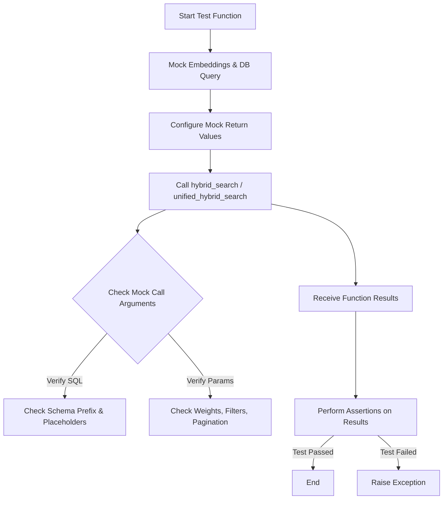

## 类结构

```

```

## 全局变量及字段


    

## 全局函数及方法


### `test_hybrid_search_with_schema_handling`

这是一个异步集成测试函数，用于验证混合搜索功能是否正确处理数据库架构前缀，确保查询在不同数据库架构下能够正确执行并返回预期结果。

参数：

无

返回值：`None`，测试函数主要用于断言验证，不返回业务数据。

#### 流程图

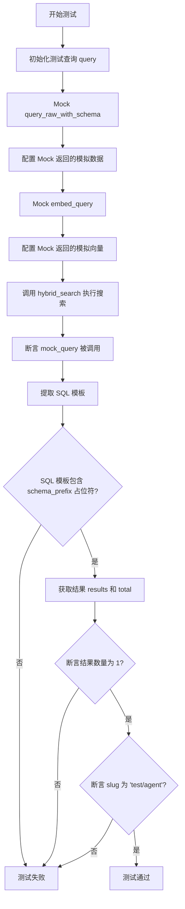

#### 带注释源码

```python
@pytest.mark.asyncio(loop_scope="session") # 标记为异步测试，并指定事件循环范围为session级别
@pytest.mark.integration # 标记为集成测试
async def test_hybrid_search_with_schema_handling():
    """Test that hybrid search correctly handles database schema prefixes."""
    # 定义测试用的查询字符串
    query = "test agent"

    # 使用 patch 模拟数据库查询函数 query_raw_with_schema
    # 这样可以避免真实连接数据库，专注于测试逻辑
    with patch(
        "backend.api.features.store.hybrid_search.query_raw_with_schema"
    ) as mock_query:
        # 配置 Mock 对象的返回值，模拟数据库查询返回的一条记录
        mock_query.return_value = [
            {
                "slug": "test/agent",
                "agent_name": "Test Agent",
                "agent_image": "test.png",
                "creator_username": "test",
                "creator_avatar": "avatar.png",
                "sub_heading": "Test sub-heading",
                "description": "Test description",
                "runs": 10,
                "rating": 4.5,
                "categories": ["test"],
                "featured": False,
                "is_available": True,
                "updated_at": "2024-01-01T00:00:00Z",
                "combined_score": 0.8,       # 综合得分
                "semantic_score": 0.7,       # 语义得分
                "lexical_score": 0.6,        # 词汇得分
                "category_score": 0.5,       # 分类得分
                "recency_score": 0.4,        # 时间得分
                "total_count": 1,            # 总命中数
            }
        ]

        # 使用 patch 模拟文本向量化函数 embed_query
        with patch(
            "backend.api.features.store.hybrid_search.embed_query"
        ) as mock_embed:
            # 配置 Mock 对象返回固定维度的模拟向量
            mock_embed.return_value = [0.1] * embeddings.EMBEDDING_DIM  # Mock embedding

            # 调用实际待测的 hybrid_search 函数
            results, total = await hybrid_search(
                query=query,
                page=1,
                page_size=20,
            )

            # 验证：断言模拟的数据库查询函数确实被调用了
            assert mock_query.called
            # 验证：检查 SQL 模板中是否使用了 schema_prefix 占位符
            # 这是为了确认 SQL 语句能够动态适配不同的数据库架构（如 public, platform 等）
            call_args = mock_query.call_args
            sql_template = call_args[0][0]
            assert "{schema_prefix}" in sql_template

            # 验证：断言返回结果的列表长度为 1
            assert len(results) == 1
            # 验证：断言总命中数为 1
            assert total == 1
            # 验证：断言第一条结果的 slug 字段正确
            assert results[0]["slug"] == "test/agent"
```


### `test_hybrid_search_with_public_schema`

该测试函数旨在验证当数据库 Schema 设置为 'public'（即不需要 Schema 前缀）时，混合搜索功能是否能正确执行并返回预期的空结果。

参数：

- 无

返回值：`None`，作为测试函数，主要通过断言验证行为，无显式返回值。

#### 流程图

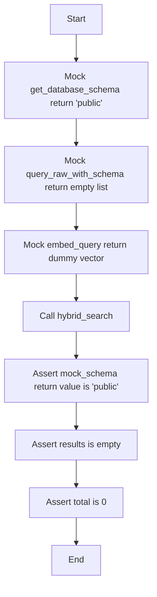

#### 带注释源码

```python
@pytest.mark.asyncio(loop_scope="session")
@pytest.mark.integration
async def test_hybrid_search_with_public_schema():
    """Test hybrid search when using public schema (no prefix needed)."""
    # 模拟数据库 schema 获取函数，强制返回 "public" 字符串
    with patch("backend.data.db.get_database_schema") as mock_schema:
        mock_schema.return_value = "public"

        # 模拟数据库原始查询执行函数，返回空列表，模拟无数据场景
        with patch(
            "backend.api.features.store.hybrid_search.query_raw_with_schema"
        ) as mock_query:
            mock_query.return_value = []

            # 模拟查询文本向量化函数，返回一个固定维度的全 0.1 向量
            with patch(
                "backend.api.features.store.hybrid_search.embed_query"
            ) as mock_embed:
                mock_embed.return_value = [0.1] * embeddings.EMBEDDING_DIM

                # 调用核心的 hybrid_search 函数进行测试
                results, total = await hybrid_search(
                    query="test",
                    page=1,
                    page_size=20,
                )

                # 验证：断言 mock_schema 的配置确实为 "public"
                assert mock_schema.return_value == "public"

                # 验证：断言函数返回的结果列表为空
                assert results == []
                # 验证：断言返回的总数为 0
                assert total == 0
```


### `test_hybrid_search_with_custom_schema`

测试在使用自定义模式（例如 'platform'）时的混合搜索功能，验证系统能正确处理非默认的数据库模式前缀。

参数：

-  无

返回值：`None`，测试函数通过断言验证结果，无直接返回值。

#### 流程图

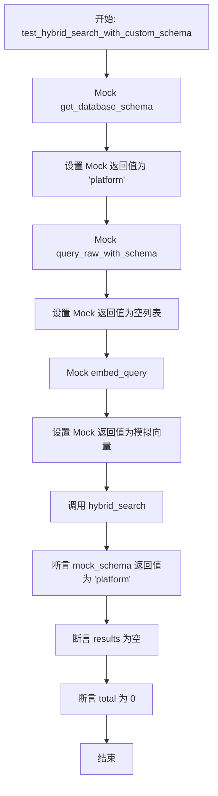

#### 带注释源码

```python
@pytest.mark.asyncio(loop_scope="session")
@pytest.mark.integration
async def test_hybrid_search_with_custom_schema():
    """Test hybrid search when using custom schema (e.g., 'platform')."""
    # 模拟 get_database_schema 函数，使其返回自定义的 schema 名称 'platform'
    with patch("backend.data.db.get_database_schema") as mock_schema:
        mock_schema.return_value = "platform"

        # 模拟执行原生 SQL 查询的函数 query_raw_with_schema
        with patch(
            "backend.api.features.store.hybrid_search.query_raw_with_schema"
        ) as mock_query:
            # 模拟数据库返回空结果
            mock_query.return_value = []

            # 模拟生成查询嵌入向量的函数 embed_query
            with patch(
                "backend.api.features.store.hybrid_search.embed_query"
            ) as mock_embed:
                # 返回一个指定维度的模拟向量
                mock_embed.return_value = [0.1] * embeddings.EMBEDDING_DIM

                # 调用待测的 hybrid_search 函数
                results, total = await hybrid_search(
                    query="test",
                    page=1,
                    page_size=20,
                )

                # 验证 mock_schema 的设置是否正确，确保测试是在 'platform' 模式下进行的
                assert mock_schema.return_value == "platform"

                # 验证在自定义模式下，混合搜索能正常工作并返回预期的空结果
                assert results == []
                assert total == 0
```


### `test_hybrid_search_without_embeddings`

测试混合搜索函数在嵌入生成服务失败或不可用时，能够优雅降级并基于词汇（关键词）搜索返回有效结果的功能。

参数：

返回值：`None`，该函数作为测试用例，用于验证系统逻辑，不返回具体业务数据。

#### 流程图

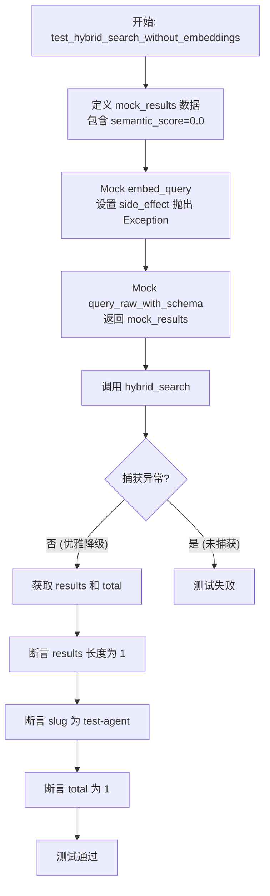

#### 带注释源码

```python
@pytest.mark.asyncio(loop_scope="session")
@pytest.mark.integration
async def test_hybrid_search_without_embeddings():
    """Test hybrid search gracefully degrades when embeddings are unavailable."""
    # 1. 准备模拟数据库返回的结果
    # 注意 semantic_score 被设置为 0.0，因为没有生成 embedding
    mock_results = [
        {
            "slug": "test-agent",
            "agent_name": "Test Agent",
            "agent_image": "test.png",
            "creator_username": "creator",
            "creator_avatar": "avatar.png",
            "sub_heading": "Test heading",
            "description": "Test description",
            "runs": 100,
            "rating": 4.5,
            "categories": ["AI"],
            "featured": False,
            "is_available": True,
            "updated_at": "2025-01-01T00:00:00Z",
            "semantic_score": 0.0,  # Zero because no embedding
            "lexical_score": 0.5,
            "category_score": 0.0,
            "recency_score": 0.1,
            "popularity_score": 0.2,
            "combined_score": 0.3,
            "total_count": 1,
        }
    ]

    # 2. 使用 patch 替换 embed_query 函数
    with patch("backend.api.features.store.hybrid_search.embed_query") as mock_embed:
        with patch(
            "backend.api.features.store.hybrid_search.query_raw_with_schema"
        ) as mock_query:
            # 3. 模拟 embedding 生成失败，抛出异常
            mock_embed.side_effect = Exception("Embedding generation failed")
            # 设置数据库查询返回模拟数据
            mock_query.return_value = mock_results

            # 4. 调用 hybrid_search
            # 预期行为：不应抛出异常，而是优雅降级（使用关键词搜索）
            results, total = await hybrid_search(
                query="test",
                page=1,
                page_size=20,
            )

            # 5. 验证结果
            # 即使没有 embeddings，也应返回结果
            assert len(results) == 1
            assert results[0]["slug"] == "test-agent"
            assert total == 1
```


### `test_hybrid_search_with_filters`

该函数用于验证混合搜索功能在应用多种过滤器（如特色状态、特定创建者、分类）时的行为，确保这些过滤参数能够被正确构造并传递给底层的数据库查询函数。

参数：

-  `无参数`：`None`，这是一个测试函数，不接受任何参数。

返回值：`None`，无显式返回值。函数通过断言来验证逻辑是否正确，若断言失败则抛出异常。

#### 流程图

```mermaid
graph TD
    A[开始: test_hybrid_search_with_filters] --> B[Mock 数据库查询函数 query_raw_with_schema]
    B --> C[Mock 向量嵌入函数 embed_query]
    C --> D[调用 hybrid_search 并传入过滤器参数]
    D --> D1[参数包括: featured=True, creators=['user1', 'user2'], category='productivity']
    D1 --> E[获取 mock_query 的调用参数]
    E --> F[提取参数列表 排除 SQL 模板]
    F --> G{验证参数长度 >= 4}
    G -->|是| H[断言通过: 过滤器已正确应用]
    G -->|否| I[断言失败]
    H --> J[测试结束]
    I --> J
```

#### 带注释源码

```python
@pytest.mark.asyncio(loop_scope="session")
@pytest.mark.integration
async def test_hybrid_search_with_filters():
    """Test hybrid search with various filters."""
    # Patch (模拟) 底层的数据库查询函数，拦截实际的数据库操作
    with patch(
        "backend.api.features.store.hybrid_search.query_raw_with_schema"
    ) as mock_query:
        # 设置模拟查询返回空列表
        mock_query.return_value = []

        # Patch (模拟) 向量嵌入生成函数
        with patch(
            "backend.api.features.store.hybrid_search.embed_query"
        ) as mock_embed:
            # 设置模拟返回一个固定维度的向量
            mock_embed.return_value = [0.1] * embeddings.EMBEDDING_DIM

            # 执行混合搜索，传入测试用的过滤条件
            # Test with featured filter
            results, total = await hybrid_search(
                query="test",
                featured=True,           # 特色过滤器
                creators=["user1", "user2"], # 创建者列表过滤器
                category="productivity",  # 分类过滤器
                page=1,
                page_size=10,
            )

            # Verify filters were applied in the query
            # 获取模拟对象的调用参数，以便验证参数传递是否正确
            call_args = mock_query.call_args
            params = call_args[0][1:]  # 跳过第一个参数（SQL 模板），获取实际传入的参数列表

            # Should have query, query_lower, creators array, category
            # 断言参数列表中至少包含 4 个参数（对应 query, query_lower, creators, category）
            # 这间接验证了过滤器逻辑是否被正确触发并传递到了查询层
            assert len(params) >= 4
```


### `test_hybrid_search_weights`

Test hybrid search with custom weights.

参数：

-  `None`：`None`，该函数是一个测试函数，无显式输入参数。

返回值：`None`，不返回任何值，主要用于断言验证逻辑正确性。

#### 流程图

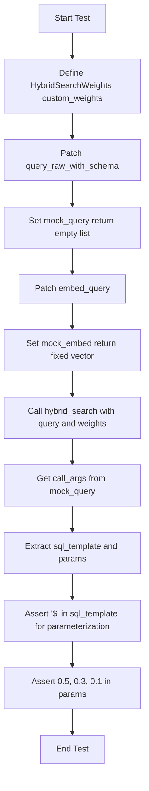

#### 带注释源码

```python
@pytest.mark.asyncio(loop_scope="session")
@pytest.mark.integration
async def test_hybrid_search_weights():
    """Test hybrid search with custom weights."""
    # 定义自定义搜索权重配置
    custom_weights = HybridSearchWeights(
        semantic=0.5,
        lexical=0.3,
        category=0.1,
        recency=0.1,
        popularity=0.0,
    )

    # 模拟原始数据库查询函数
    with patch(
        "backend.api.features.store.hybrid_search.query_raw_with_schema"
    ) as mock_query:
        # 模拟返回空结果集
        mock_query.return_value = []

        # 模拟嵌入向量生成函数
        with patch(
            "backend.api.features.store.hybrid_search.embed_query"
        ) as mock_embed:
            # 模拟返回固定维度的向量
            mock_embed.return_value = [0.1] * embeddings.EMBEDDING_DIM

            # 调用混合搜索函数，传入自定义权重
            results, total = await hybrid_search(
                query="test",
                weights=custom_weights,
                page=1,
                page_size=20,
            )

            # 获取模拟函数的调用参数
            call_args = mock_query.call_args
            sql_template = call_args[0][0]
            params = call_args[0][1:]  # 获取所有传递的参数

            # 验证 SQL 模板使用了参数化查询（防止SQL注入，确认非字符串拼接）
            assert "$" in sql_template  # Verify parameterization is used

            # 验证自定义权重确实被包含在传递给数据库的参数中
            assert 0.5 in params  # semantic weight
            assert 0.3 in params  # lexical weight
            assert 0.1 in params  # category and recency weights
```


### `test_hybrid_search_min_score_filtering`

这是一个集成测试函数，用于验证混合搜索功能是否正确处理最小分数阈值。该测试模拟数据库查询和嵌入生成，检查当提供 `min_score` 参数时，生成的 SQL 查询是否包含相应的过滤条件（`combined_score >=`）以及参数是否被正确传递。

参数：

-   无

返回值：`None`，该函数为测试用例，没有返回值，主要通过断言验证行为。

#### 流程图

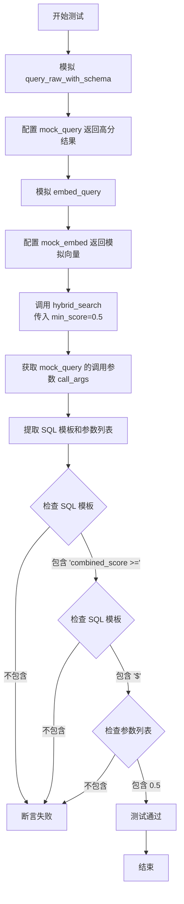

#### 带注释源码

```python
@pytest.mark.asyncio(loop_scope="session")
@pytest.mark.integration
async def test_hybrid_search_min_score_filtering():
    """Test hybrid search minimum score threshold."""
    # Mock the database query function to intercept SQL execution
    with patch(
        "backend.api.features.store.hybrid_search.query_raw_with_schema"
    ) as mock_query:
        # Return mock results with varying scores
        mock_query.return_value = [
            {
                "slug": "high-score/agent",
                "agent_name": "High Score Agent",
                "combined_score": 0.8,
                "total_count": 1,
                # ... other fields
            }
        ]

        # Mock the embedding generation function
        with patch(
            "backend.api.features.store.hybrid_search.embed_query"
        ) as mock_embed:
            mock_embed.return_value = [0.1] * embeddings.EMBEDDING_DIM

            # Execute the hybrid search function with a custom min_score
            results, total = await hybrid_search(
                query="test",
                min_score=0.5,  # High threshold
                page=1,
                page_size=20,
            )

            # Verify min_score was applied in query
            call_args = mock_query.call_args
            sql_template = call_args[0][0]
            params = call_args[0][1:]  # Get all parameters

            # Check that SQL uses parameterized min_score
            assert "combined_score >=" in sql_template
            assert "$" in sql_template  # Verify parameterization

            # Check that custom min_score is in the params
            assert 0.5 in params
```


### `test_hybrid_search_pagination`

测试混合搜索的分页功能。该测试验证了分页逻辑是否在 SQL 层面（通过 LIMIT/OFFSET）正确执行，并确保 BM25 重排序应用于分页后的结果。

参数：

-   无参数

返回值：`None`，测试函数无显式返回值，主要用于断言验证逻辑正确性。

#### 流程图

```mermaid
flowchart TD
    A[开始测试] --> B[构造模拟数据 mock_results<br/>包含 10 条记录及 total_count=25]
    B --> C[配置 Mock 对象<br/>query_raw_with_schema 与 embed_query]
    C --> D[调用 hybrid_search<br/>query='test', page=2, page_size=10]
    D --> E{断言验证}
    E -->|断言 len(results) == 10| F[验证当前页数据量]
    E -->|断言 total == 25| G[验证总记录数]
    F --> H[提取 mock_query 调用参数]
    G --> H
    H --> I{断言参数正确性}
    I -->|断言 page_size_param == 10| J[验证 LIMIT 参数]
    I -->|断言 offset_param == 10| K[验证 OFFSET 参数<br/>(2-1)*10]
    J --> L[测试通过]
    K --> L
```

#### 带注释源码

```python
@pytest.mark.asyncio(loop_scope="session")
@pytest.mark.integration
async def test_hybrid_search_pagination():
    """Test hybrid search pagination.

    Pagination happens in SQL (LIMIT/OFFSET), then BM25 reranking is applied
    to the paginated results.
    """
    # 1. 准备模拟数据：模拟 SQL 查询第 2 页时返回的数据
    # 这里的 total_count=25 模拟了 SQL 窗口函数 COUNT(*) OVER() 的结果
    mock_results = [
        {
            "slug": f"agent-{i}",
            "agent_name": f"Agent {i}",
            "agent_image": "test.png",
            "creator_username": "test",
            "creator_avatar": "avatar.png",
            "sub_heading": "Test",
            "description": "Test description",
            "runs": 100 - i,
            "rating": 4.5,
            "categories": ["test"],
            "featured": False,
            "is_available": True,
            "updated_at": "2024-01-01T00:00:00Z",
            "searchable_text": f"Agent {i} test description",
            "combined_score": 0.9 - (i * 0.01),
            "semantic_score": 0.7,
            "lexical_score": 0.6,
            "category_score": 0.5,
            "recency_score": 0.4,
            "popularity_score": 0.3,
            "total_count": 25,  # 表示数据库中总共有 25 条符合条件的记录
        }
        for i in range(10)  # SQL 返回当前页的大小，即 10 条
    ]

    # 2. Mock 数据库查询执行函数
    with patch(
        "backend.api.features.store.hybrid_search.query_raw_with_schema"
    ) as mock_query:
        mock_query.return_value = mock_results

        # 3. Mock 嵌入向量生成函数
        with patch(
            "backend.api.features.store.hybrid_search.embed_query"
        ) as mock_embed:
            mock_embed.return_value = [0.1] * embeddings.EMBEDDING_DIM

            # 4. 执行混合搜索，请求第 2 页，每页 10 条
            # 预期逻辑：OFFSET = (page - 1) * page_size = (2 - 1) * 10 = 10
            results, total = await hybrid_search(
                query="test",
                page=2,
                page_size=10,
            )

            # 5. 验证返回结果是否符合预期
            assert len(results) == 10  # 当前页应包含 10 个结果
            assert total == 25         # 总数应与 mock 数据中的 total_count 一致

            # 6. 验证底层 SQL 查询是否正确使用了分页参数
            call_args = mock_query.call_args
            params = call_args[0] # 获取调用参数元组
            
            # 假设最后两个参数分别对应 SQL 中的 LIMIT 和 OFFSET
            page_size_param = params[-2]
            offset_param = params[-1]
            
            assert page_size_param == 10 # 断言 LIMIT 为 10
            assert offset_param == 10     # 断言 OFFSET 为 10
```


### `test_hybrid_search_error_handling`

Verify that the hybrid search function correctly propagates exceptions when encountering database connection errors.

参数：

返回值：`None`，测试函数不返回值。

#### 流程图

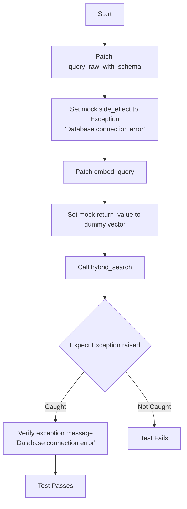

#### 带注释源码

```python
@pytest.mark.asyncio(loop_scope="session")
@pytest.mark.integration
async def test_hybrid_search_error_handling():
    """Test hybrid search error handling."""
    # Patch the raw SQL query execution function
    with patch(
        "backend.api.features.store.hybrid_search.query_raw_with_schema"
    ) as mock_query:
        # Simulate a database connection error by raising an exception
        mock_query.side_effect = Exception("Database connection error")

        # Patch the text embedding generation function
        with patch(
            "backend.api.features.store.hybrid_search.embed_query"
        ) as mock_embed:
            # Return a valid dummy vector so the error is isolated to the DB query
            mock_embed.return_value = [0.1] * embeddings.EMBEDDING_DIM

            # Assert that calling hybrid_search raises the expected Exception
            with pytest.raises(Exception) as exc_info:
                await hybrid_search(
                    query="test",
                    page=1,
                    page_size=20,
                )

            # Verify that the exception message matches the simulated error
            assert "Database connection error" in str(exc_info.value)
```


### `test_unified_hybrid_search_basic`

该函数是一个集成测试用例，旨在验证基本的统一混合搜索功能是否能够跨所有内容类型（如 STORE_AGENT 和 BLOCK）正常工作，并返回正确格式的结果及总数。

参数：

-   无参数。

返回值：`None`，该函数不返回具体数值，而是通过断言验证逻辑正确性。

#### 流程图

```mermaid
flowchart TD
    A[开始执行测试] --> B[定义模拟数据 mock_results<br/>包含 STORE_AGENT 和 BLOCK]
    B --> C[启动 patch 上下文<br/>模拟 query_raw_with_schema]
    C --> D[启动 patch 上下文<br/>模拟 embed_query]
    D --> E[配置模拟返回值<br/>mock_query 返回数据, mock_embed 返回向量]
    E --> F[调用 unified_hybrid_search<br/>传入 query='test', page=1 等]
    F --> G[等待执行并获取 results 和 total]
    G --> H{断言检查}
    H --> I[验证 len(results) == 2]
    H --> J[验证 total == 2]
    H --> K[验证 results[0]['content_type'] == 'STORE_AGENT']
    H --> L[验证 results[1]['content_type'] == 'BLOCK']
    I --> M[测试通过]
    J --> M
    K --> M
    L --> M
```

#### 带注释源码

```python
@pytest.mark.asyncio(loop_scope="session")
@pytest.mark.integration
async def test_unified_hybrid_search_basic():
    """Test basic unified hybrid search across all content types."""
    # 1. 准备模拟的数据库返回结果，包含两种不同类型的内容
    mock_results = [
        {
            "content_type": "STORE_AGENT",
            "content_id": "agent-1",
            "searchable_text": "Test Agent Description",
            "metadata": {"name": "Test Agent"},
            "updated_at": "2025-01-01T00:00:00Z",
            "semantic_score": 0.7,
            "lexical_score": 0.8,
            "category_score": 0.5,
            "recency_score": 0.3,
            "combined_score": 0.6,
            "total_count": 2,
        },
        {
            "content_type": "BLOCK",
            "content_id": "block-1",
            "searchable_text": "Test Block Description",
            "metadata": {"name": "Test Block"},
            "updated_at": "2025-01-01T00:00:00Z",
            "semantic_score": 0.6,
            "lexical_score": 0.7,
            "category_score": 0.4,
            "recency_score": 0.2,
            "combined_score": 0.5,
            "total_count": 2,
        },
    ]

    # 2. 模拟底层的原始数据库查询函数
    with patch(
        "backend.api.features.store.hybrid_search.query_raw_with_schema"
    ) as mock_query:
        # 3. 模拟生成查询向量的嵌入函数
        with patch(
            "backend.api.features.store.hybrid_search.embed_query"
        ) as mock_embed:
            # 设置 mock 返回值：查询返回预设结果，嵌入返回固定维度向量
            mock_query.return_value = mock_results
            mock_embed.return_value = [0.1] * embeddings.EMBEDDING_DIM

            # 4. 调用被测试的统一混合搜索函数
            results, total = await unified_hybrid_search(
                query="test",
                page=1,
                page_size=20,
            )

            # 5. 验证返回结果的完整性
            assert len(results) == 2
            assert total == 2
            # 验证返回结果的内容类型顺序和内容是否正确
            assert results[0]["content_type"] == "STORE_AGENT"
            assert results[1]["content_type"] == "BLOCK"
```


### `test_unified_hybrid_search_filter_by_content_type`

该函数是一个集成测试，旨在验证统一混合搜索（`unified_hybrid_search`）在根据特定内容类型（如 `ContentType.BLOCK`）进行过滤时是否正常工作，确保底层数据库查询能正确接收和应用内容类型参数。

参数：

-   无参数

返回值：`None`，测试函数不返回值，主要通过断言（assert）验证逻辑正确性。

#### 流程图

```mermaid
flowchart TD
    A[开始测试] --> B[定义模拟数据库结果 mock_results]
    B --> C[模拟 patch query_raw_with_schema]
    C --> D[模拟 patch embed_query]
    D --> E[调用 unified_hybrid_search<br/>传入 query 和 content_types]
    E --> F[获取 mock_query 的调用参数 call_args]
    F --> G[断言 params 中包含 ['BLOCK']]
    G -- 成功 --> H[断言结果数量 len(results) == 1]
    H --> I[断言总数 total == 1]
    I --> J[测试结束]
    G -- 失败 --> K[抛出异常]
```

#### 带注释源码

```python
@pytest.mark.asyncio(loop_scope="session")
@pytest.mark.integration
async def test_unified_hybrid_search_filter_by_content_type():
    """Test unified search filtering by specific content types."""
    # 1. 准备模拟数据，模拟数据库返回的结果，包含 BLOCK 类型的内容
    mock_results = [
        {
            "content_type": "BLOCK",
            "content_id": "block-1",
            "searchable_text": "Test Block",
            "metadata": {},
            "updated_at": "2025-01-01T00:00:00Z",
            "semantic_score": 0.7,
            "lexical_score": 0.8,
            "category_score": 0.0,
            "recency_score": 0.3,
            "combined_score": 0.5,
            "total_count": 1,
        },
    ]

    # 2. 模拟数据库原始查询函数，使其返回预定义的 mock_results
    with patch(
        "backend.api.features.store.hybrid_search.query_raw_with_schema"
    ) as mock_query:
        # 3. 模拟嵌入生成函数，使其返回一个固定维度的向量
        with patch(
            "backend.api.features.store.hybrid_search.embed_query"
        ) as mock_embed:
            mock_query.return_value = mock_results
            mock_embed.return_value = [0.1] * embeddings.EMBEDDING_DIM

            # 4. 调用被测试的 unified_hybrid_search 函数
            # 传入 content_types=[ContentType.BLOCK] 以测试过滤功能
            results, total = await unified_hybrid_search(
                query="test",
                content_types=[ContentType.BLOCK],
                page=1,
                page_size=20,
            )

            # 5. 验证：检查 content_types 参数是否正确传递给了底层数据库查询
            call_args = mock_query.call_args
            params = call_args[0][1:]
            # 断言参数列表中包含 ["BLOCK"]
            assert ["BLOCK"] in params

            # 6. 验证：检查返回结果的正确性
            assert len(results) == 1
            assert total == 1
```


### `test_unified_hybrid_search_with_user_id`

这是一个用于测试统一混合搜索功能在涉及用户ID（user_id）时的集成测试用例。它验证当传入 `user_id` 时，底层生成的 SQL 查询是否正确包含了用户权限过滤相关的逻辑（即检查 SQL 模板和参数传递是否正确），以确保能够检索到特定用户的私有内容。

参数：

-  无参数

返回值：`None`，该函数为测试用例，通过断言验证逻辑，不返回计算结果。

#### 流程图

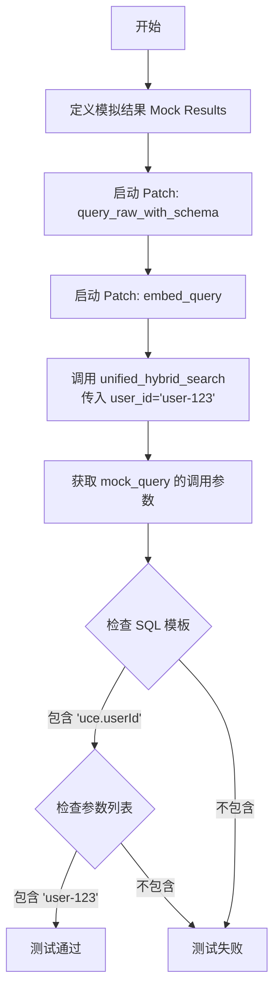

#### 带注释源码

```python
@pytest.mark.asyncio(loop_scope="session")
@pytest.mark.integration
async def test_unified_hybrid_search_with_user_id():
    """Test unified search with user_id for private content."""
    # 1. 准备模拟返回结果，模拟从数据库查询到的私有内容
    mock_results = [
        {
            "content_type": "STORE_AGENT",
            "content_id": "agent-1",
            "searchable_text": "My Private Agent",
            "metadata": {},
            "updated_at": "2025-01-01T00:00:00Z",
            "semantic_score": 0.7,
            "lexical_score": 0.8,
            "category_score": 0.0,
            "recency_score": 0.3,
            "combined_score": 0.6,
            "total_count": 1,
        },
    ]

    # 2. 使用 patch 模拟底层数据库查询函数 query_raw_with_schema
    with patch(
        "backend.api.features.store.hybrid_search.query_raw_with_schema"
    ) as mock_query:
        # 3. 使用 patch 模拟嵌入生成函数 embed_query
        with patch(
            "backend.api.features.store.hybrid_search.embed_query"
        ) as mock_embed:
            # 设置模拟返回值
            mock_query.return_value = mock_results
            mock_embed.return_value = [0.1] * embeddings.EMBEDDING_DIM

            # 4. 调用被测函数 unified_hybrid_search，传入 user_id 参数
            results, total = await unified_hybrid_search(
                query="test",
                user_id="user-123",
                page=1,
                page_size=20,
            )

            # 5. 验证：检查 SQL 生成逻辑是否包含了 user_id 相关的过滤条件
            call_args = mock_query.call_args
            sql_template = call_args[0][0]
            params = call_args[0][1:]

            # 断言 SQL 模板中存在对应的字段引用
            assert 'uce."userId"' in sql_template
            # 断言参数列表中正确传递了具体的 user_id 值
            assert "user-123" in params
```


### `test_unified_hybrid_search_custom_weights`

Test unified search with custom weights.

参数：

无参数

返回值：`None`，该函数为测试函数，无显式返回值。

#### 流程图

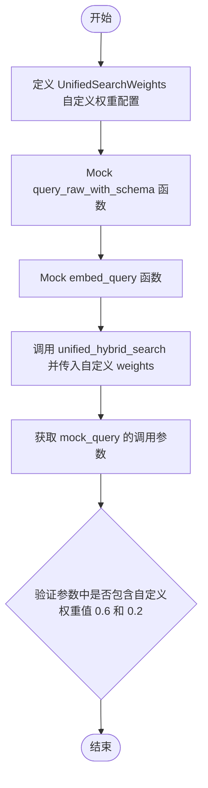

#### 带注释源码

```python
@pytest.mark.asyncio(loop_scope="session")
@pytest.mark.integration
async def test_unified_hybrid_search_custom_weights():
    """Test unified search with custom weights."""
    # 定义自定义的搜索权重配置
    custom_weights = UnifiedSearchWeights(
        semantic=0.6,
        lexical=0.2,
        category=0.1,
        recency=0.1,
    )

    # 模拟数据库原始查询函数，避免真实数据库交互
    with patch(
        "backend.api.features.store.hybrid_search.query_raw_with_schema"
    ) as mock_query:
        mock_query.return_value = []

        # 模拟向量嵌入生成函数
        with patch(
            "backend.api.features.store.hybrid_search.embed_query"
        ) as mock_embed:
            mock_embed.return_value = [0.1] * embeddings.EMBEDDING_DIM

            # 执行统一混合搜索，传入自定义权重
            results, total = await unified_hybrid_search(
                query="test",
                weights=custom_weights,
                page=1,
                page_size=20,
            )

            # 验证调用：获取 mock 函数接收到的参数
            call_args = mock_query.call_args
            params = call_args[0][1:]  # 获取除 SQL 模板外的参数

            # 断言：验证自定义权重 0.6 (semantic) 被包含在查询参数中
            assert 0.6 in params  # semantic weight
            # 断言：验证自定义权重 0.2 (lexical) 被包含在查询参数中
            assert 0.2 in params  # lexical weight
```


### `test_unified_hybrid_search_graceful_degradation`

测试当嵌入服务不可用时，统一混合搜索功能能够优雅降级，仍能返回基于关键词的搜索结果。

参数：

-   `无`：`None`，该函数为 pytest 异步测试函数，无显式输入参数。

返回值：`None`，该函数不返回业务数据，主要通过断言验证系统行为。

#### 流程图

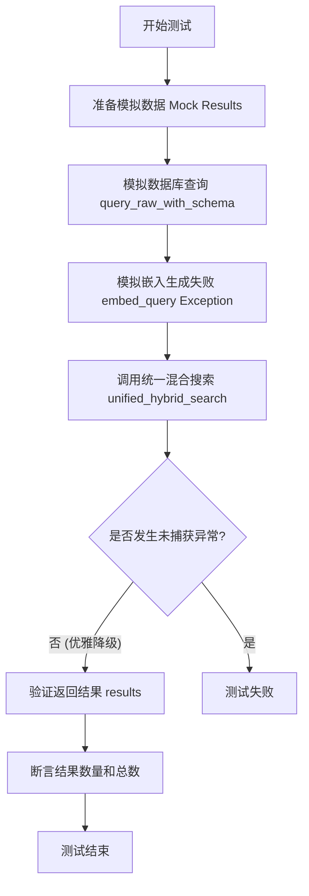

#### 带注释源码

```python
@pytest.mark.asyncio(loop_scope="session")
@pytest.mark.integration
async def test_unified_hybrid_search_graceful_degradation():
    """Test unified search gracefully degrades when embeddings unavailable."""
    # 准备模拟的数据库返回结果，模拟没有嵌入分数的情况
    mock_results = [
        {
            "content_type": "DOCUMENTATION",
            "content_id": "doc-1",
            "searchable_text": "API Documentation",
            "metadata": {},
            "updated_at": "2025-01-01T00:00:00Z",
            "semantic_score": 0.0,  # 由于没有嵌入，语义评分为0
            "lexical_score": 0.8,   # 依赖关键词评分
            "category_score": 0.0,
            "recency_score": 0.2,
            "combined_score": 0.5,
            "total_count": 1,
        },
    ]

    # 开始模拟上下文，替换数据库查询函数
    with patch(
        "backend.api.features.store.hybrid_search.query_raw_with_schema"
    ) as mock_query:
        # 替换嵌入生成函数
        with patch(
            "backend.api.features.store.hybrid_search.embed_query"
        ) as mock_embed:
            # 设置数据库查询的返回值为模拟数据
            mock_query.return_value = mock_results
            # 设置嵌入生成函数抛出异常，模拟服务不可用的情况
            mock_embed.side_effect = Exception("Embedding generation failed")

            # 调用被测函数 unified_hybrid_search
            # 预期行为：函数内部捕获异常，不会导致程序崩溃，且能返回基于其他维度的搜索结果
            results, total = await unified_hybrid_search(
                query="test",
                page=1,
                page_size=20,
            )

            # 验证：即使嵌入生成失败，依然返回了结果列表
            assert len(results) == 1
            # 验证：总数正确
            assert total == 1
```


### `test_unified_hybrid_search_empty_query`

该函数是一个集成测试用例，旨在验证当向统一混合搜索功能（`unified_hybrid_search`）传入空查询字符串时，系统能否正确处理而不抛出异常，并返回空的搜索结果集及零计数。

参数：

*   无

返回值：`None`，这是一个测试函数，主要用于执行断言逻辑，不返回业务数据。

#### 流程图

```mermaid
flowchart TD
    A[开始: test_unified_hybrid_search_empty_query] --> B[调用 unified_hybrid_search]
    B --> C[传入参数: query='', page=1, page_size=20]
    C --> D[获取返回值 results, total]
    D --> E{断言 results == []}
    E -- False --> F[测试失败: 结果列表非空]
    E -- True --> G{断言 total == 0}
    G -- False --> H[测试失败: 总数非零]
    G -- True --> I[测试通过]
    F --> J[结束]
    H --> J
    I --> J
```

#### 带注释源码

```python
@pytest.mark.asyncio(loop_scope="session")
@pytest.mark.integration
async def test_unified_hybrid_search_empty_query():
    """Test unified search with empty query returns empty results."""
    # 调用统一混合搜索函数，传入空字符串作为查询参数
    # 验证函数在遇到空查询时不会报错，而是返回空结果
    results, total = await unified_hybrid_search(
        query="",        # 空查询字符串
        page=1,
        page_size=20,
    )

    # 验证返回的结果列表确实为空
    assert results == []
    # 验证返回的总计数确实为0
    assert total == 0
```


### `test_unified_hybrid_search_pagination`

测试统一混合搜索的分页功能。验证在模拟环境中，分页参数（page和page_size）是否正确转换为SQL的LIMIT和OFFSET，并确保返回的结果数量和总数符合预期。

参数：

-   无参数 (此为单元测试函数，不接受直接参数)

返回值：`None`，该函数通过断言验证逻辑，无显式返回值。

#### 流程图

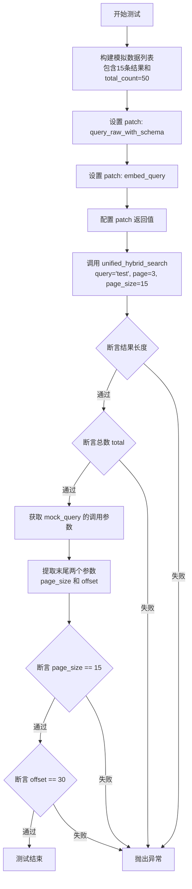

#### 带注释源码

```python
@pytest.mark.asyncio(loop_scope="session")
@pytest.mark.integration
async def test_unified_hybrid_search_pagination():
    """Test unified search pagination with BM25 reranking.

    Pagination happens in SQL (LIMIT/OFFSET), then BM25 reranking is applied
    to the paginated results.
    """
    # 1. 准备模拟数据：生成15条模拟的搜索结果，模拟SQL返回一页数据的情况
    mock_results = [
        {
            "content_type": "STORE_AGENT",
            "content_id": f"agent-{i}",
            "searchable_text": f"Agent {i} description",
            "metadata": {"name": f"Agent {i}"},
            "updated_at": "2025-01-01T00:00:00Z",
            "semantic_score": 0.7,
            "lexical_score": 0.8 - (i * 0.01),
            "category_score": 0.5,
            "recency_score": 0.3,
            "combined_score": 0.6 - (i * 0.01),
            "total_count": 50,  # 模拟总共有50条记录
        }
        for i in range(15)  # SQL returns page_size results
    ]

    # 2. 开始打补丁，模拟数据库查询和嵌入查询
    with patch(
        "backend.api.features.store.hybrid_search.query_raw_with_schema"
    ) as mock_query:
        with patch(
            "backend.api.features.store.hybrid_search.embed_query"
        ) as mock_embed:
            # 设置模拟返回值
            mock_query.return_value = mock_results
            mock_embed.return_value = [0.1] * embeddings.EMBEDDING_DIM

            # 3. 调用被测函数：请求第3页，每页15条
            results, total = await unified_hybrid_search(
                query="test",
                page=3,
                page_size=15,
            )

            # 4. 验证返回的结果列表长度是否等于 page_size
            assert len(results) == 15
            # 5. 验证返回的总记录数是否等于 mock 数据中的 total_count
            assert total == 50  # Total from SQL COUNT(*) OVER()

            # 6. 验证传递给底层数据库查询的参数是否包含正确的分页信息
            call_args = mock_query.call_args
            params = call_args[0]
            # 假设最后两个参数分别是 limit (page_size) 和 offset
            # Last two params are page_size and offset
            page_size_param = params[-2]
            offset_param = params[-1]
            
            # 7. 断言 SQL 参数中的 limit 大小
            assert page_size_param == 15
            # 8. 断言 SQL 参数中的 offset 计算 (页码-1 * 每页大小) = (3-1)*15 = 30
            assert offset_param == 30  # (page 3 - 1) * 15
```


### `test_unified_hybrid_search_schema_prefix`

该测试函数用于验证统一混合搜索功能在构建 SQL 查询时，是否正确包含了数据库模式前缀占位符 `{schema_prefix}`，以确保查询能够适配不同的数据库模式（Schema）。

参数：

*   (无)

返回值：`None`，这是一个异步测试函数，通过断言验证逻辑，没有显式返回值。

#### 流程图

```mermaid
graph TD
    A[开始: test_unified_hybrid_search_schema_prefix] --> B[Mock query_raw_with_schema]
    B --> C[Mock embed_query]
    C --> D[设置 Mock 返回值]
    D --> E[调用 unified_hybrid_search]
    E --> F[获取 Mock 的调用参数 call_args]
    F --> G[提取 SQL 模板字符串]
    G --> H{断言: 包含 '{schema_prefix}'?}
    H -- 否 --> I[测试失败]
    H -- 是 --> J{断言: 包含 'UnifiedContentEmbedding'?}
    J -- 否 --> I
    J -- 是 --> K[测试通过]
```

#### 带注释源码

```python
@pytest.mark.asyncio(loop_scope="session")
@pytest.mark.integration
async def test_unified_hybrid_search_schema_prefix():
    """Test unified search uses schema_prefix placeholder."""
    # 模拟底层的数据库查询函数，以便拦截传入的 SQL 语句
    with patch(
        "backend.api.features.store.hybrid_search.query_raw_with_schema"
    ) as mock_query:
        # 模拟查询嵌入向量的函数
        with patch(
            "backend.api.features.store.hybrid_search.embed_query"
        ) as mock_embed:
            # 设置模拟返回值：查询返回空列表，嵌入向量返回固定长度的浮点数数组
            mock_query.return_value = []
            mock_embed.return_value = [0.1] * embeddings.EMBEDDING_DIM

            # 执行被测试的统一混合搜索函数
            await unified_hybrid_search(
                query="test",
                page=1,
                page_size=20,
            )

            # 获取被 mock 函数的调用参数
            call_args = mock_query.call_args
            # 提取第一个参数（即 SQL 模板字符串）
            sql_template = call_args[0][0]

            # 验证 1：SQL 模板中是否包含 {schema_prefix} 占位符，用于动态替换 Schema
            assert "{schema_prefix}" in sql_template
            # 验证 2：SQL 模板中是否引用了正确的表名 "UnifiedContentEmbedding"
            assert '"UnifiedContentEmbedding"' in sql_template
```


## 关键组件


### Schema Handling

实现动态数据库 Schema 前缀注入机制，支持在不同 Schema（如 public, platform）下执行查询，确保多租户或多环境部署的兼容性。

### Weighted Hybrid Scoring

提供可配置的权重策略（`HybridSearchWeights` 和 `UnifiedSearchWeights`），允许自定义语义、词法、类别、新鲜度及流行度在最终排序中的权重占比，实现灵活的搜索相关性调节。

### Unified Content Search

聚合多种内容类型（如 STORE_AGENT, BLOCK, DOCUMENTATION）的搜索结果，通过统一接口返回跨类型的混合检索数据。

### Graceful Degradation

具备降级处理能力，当向量嵌入服务不可用时，自动回退至基于关键词的词法搜索，确保搜索服务的可用性。

### Advanced Filtering & Pagination

支持基于特定字段（如作者、类别、精选状态）的复杂过滤逻辑，并在数据库层面结合 LIMIT/OFFSET 实现高效的分页查询。


## 问题及建议


### 已知问题

-   **集成测试模拟粒度过粗**：测试标记为 `@pytest.mark.integration`，但使用了 `patch` 模拟了底层数据库查询函数 `query_raw_with_schema`。这实际上将其变成了单元测试，无法验证生成的 SQL 语句的语法正确性、Schema 前缀替换逻辑的真实性以及数据库连接的实际行为。
-   **缺乏结果排序验证**：混合搜索的核心功能是根据分数对结果进行排序（例如 BM25 重排序或 combined_score）。当前的测试仅验证了结果的数量和内容的存在，缺少对结果列表排序顺序的断言，无法保证权值调整或算法变动后的排序逻辑正确性。
-   **测试数据存在冗余**：Mock 的返回结果字典结构复杂且在多个测试用例中重复定义。如果数据库 Schema 发生变更，需要同步修改多处代码，增加了维护成本。
-   **异常处理测试过于宽泛**：在 `test_hybrid_search_error_handling` 中使用了通用的 `Exception` 进行捕获和断言。实际生产环境中应区分不同类型的异常（如连接错误、查询语法错误、超时等），通用的异常处理掩盖了对特定错误场景的精确验证。

### 优化建议

-   **引入真实数据库环境进行集成测试**：建议使用 Testcontainers 或内存数据库（如 SQLite 仅用于 SQL 语法验证，尽管 PostgreSQL 更合适）搭建真实的测试环境。移除对 `query_raw_with_schema` 的 Mock，直接执行 SQL，以验证 SQL 模板语法、参数绑定以及 Schema 前缀（`public` vs `platform`）是否正确应用。
-   **封装测试数据生成 Fixture**：利用 Pytest 的 `fixture` 功能封装 Mock 数据的生成逻辑。将通用的 Agent、Block 等数据结构定义为工厂函数，便于统一管理和修改，减少代码重复。
-   **增加排序逻辑的断言**：在测试用例中增加对返回结果 `results` 列表的排序校验。例如，断言 `results[i]['combined_score'] >= results[i+1]['combined_score']`，确保评分机制和排序逻辑符合预期。
-   **定义具体的异常类型体系**：在后端代码中定义明确的业务异常类（如 `DatabaseQueryError`, `EmbeddingServiceUnavailableError`）。在测试中模拟抛出这些特定异常，并验证系统是否能针对不同错误类型进行正确的处理或降级。
-   **增强 SQL 参数化验证的健壮性**：目前的参数验证仅通过字符串包含检查（`assert "$" in sql_template` 或 `assert 0.5 in params`）来确认参数化。建议改进 Mock 对象或使用参数匹配工具，更严格地验证 SQL 参数的类型和位置绑定是否正确，防止 SQL 注入或参数错位。


## 其它


### 设计目标与约束

*   **Schema 多租户兼容性**：核心设计目标之一是确保混合搜索功能能够适配不同的数据库 Schema（如 `public` 或自定义的 `platform`）。系统通过 SQL 模板中的 `{schema_prefix}` 占位符动态注入前缀，要求 SQL 执行层必须正确解析并替换该占位符，以保证查询在正确的 Schema 下执行。
*   **评分算法的灵活性**：系统设计支持通过 `HybridSearchWeights` 和 `UnifiedSearchWeights` 动态调整搜索权重的语义、词汇、分类、时效性和流行度权重。约束条件是权重之和通常需合理分配，且 SQL 查询必须使用参数化查询（如 `$1`, `$2`）来传递这些权重，以确保安全性并避免 SQL 注入。
*   **鲁棒性与降级策略**：设计目标要求系统在依赖服务（如 Embedding 生成服务）不可用时能够优雅降级，而不阻断主流程。具体表现为当 `embed_query` 抛出异常时，系统应捕获异常并将语义相关度置为 0，仅依赖词汇和其他维度返回结果。
*   **分页与性能约束**：分页逻辑必须在数据库层面通过 `LIMIT` 和 `OFFSET` 实现，且支持计算总数（`total_count`）。BM25 重排序应用于分页后的结果集，这约束了搜索结果的全局排序精度，但在大数据量下保证了查询性能。

### 错误处理与异常设计

*   **Embedding 服务异常处理**：测试代码明确验证了 `embed_query` 抛出 `Exception`（如 "Embedding generation failed"）时的行为。设计预期是该异常不应导致整个搜索请求失败，而是触发降级逻辑，继续执行数据库查询，并在返回结果中将 `semantic_score` 设为 0。
*   **数据库连接异常**：对于底层的 `query_raw_with_schema` 调用，如果发生数据库层面的错误（如连接失败），设计上是直接向上抛出异常，由上层调用者（如 API 层）进行捕获和处理，测试用例 `test_hybrid_search_error_handling` 验证了异常能正确传播。
*   **空输入处理**：对于 `unified_hybrid_search`，当传入空字符串查询时，设计直接返回空结果集和 0 总数，避免执行无效的数据库查询。
*   **Mock 异常模拟**：在测试环境中，通过 `side_effect` 模拟异常来验证系统的容错边界，确保生产环境中的错误处理逻辑符合预期。

### 数据流与状态机

*   **数据流向**：
    1.  **输入阶段**：接收查询字符串（`query`）、分页参数（`page`, `page_size`）、过滤条件（`featured`, `creators`, `category`）及权重配置。
    2.  **预处理阶段**：尝试调用 Embedding 服务将 Query 转换为向量。如果失败，记录状态并继续。
    3.  **查询构建阶段**：根据输入参数构建 SQL 模板，注入 Schema 前缀，并将向量（如有）、权重、过滤条件和分页参数作为参数化输入传递给数据库。
    4.  **执行与获取阶段**：数据库执行混合检索（向量检索 + 全文检索 + 过滤），返回原始记录及各项评分。
    5.  **后处理与输出阶段**：将数据库结果映射为标准化的字典格式，计算并返回最终结果列表及总命中数。
*   **状态转换**：
    *   **Normal State (正常状态)**：Embedding 生成成功，所有评分组件（语义、词汇等）均参与计算。
    *   **Degraded State (降级状态)**：Embedding 生成失败，系统自动切换至该状态，语义评分失效，仅依靠词汇评分和其他元数据评分进行排序。
    *   **Empty State (空状态)**：查询参数为空或数据库无匹配结果，返回空列表。

### 外部依赖与接口契约

*   **`backend.api.features.store.hybrid_search.hybrid_search`**：
    *   **契约**：异步函数，输入包含搜索查询、分页、权重对象及过滤选项。输出为元组 `(List[Dict], int)`，分别代表结果列表和总条数。
    *   **依赖**：内部依赖 `embed_query` 生成向量，依赖 `query_raw_with_schema` 执行原生 SQL。
*   **`backend.api.features.store.hybrid_search.unified_hybrid_search`**：
    *   **契约**：异步函数，支持跨内容类型（如 Agent, Block, Documentation）的统一搜索。接受 `content_types` 列表和 `user_id` 进行权限隔离。输出格式与 `hybrid_search` 一致，但字典结构包含通用的 `content_type` 和 `content_id` 字段。
*   **`backend.api.features.store.embeddings.embed_query`**：
    *   **契约**：接收文本字符串，返回浮点数列表（`List[float]`），维度需与 `embeddings.EMBEDDING_DIM` 一致。在测试中常被 Mock 以返回固定向量或模拟异常。
*   **`backend.api.features.store.hybrid_search.query_raw_with_schema`**：
    *   **契约**：接收 SQL 模板字符串和参数列表。SQL 模板必须包含 `{schema_prefix}` 作为表名前缀占位符。返回数据库查询的原始行列表。
*   **`prisma.enums.ContentType`**：
    *   **契约**：枚举类型，用于在统一搜索中指定过滤的内容类型（如 `STORE_AGENT`, `BLOCK`, `DOCUMENTATION`）。

    