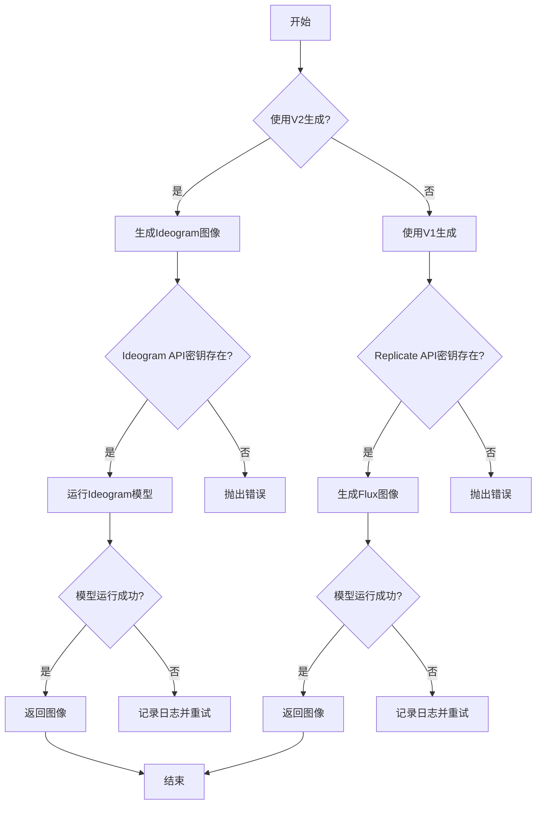
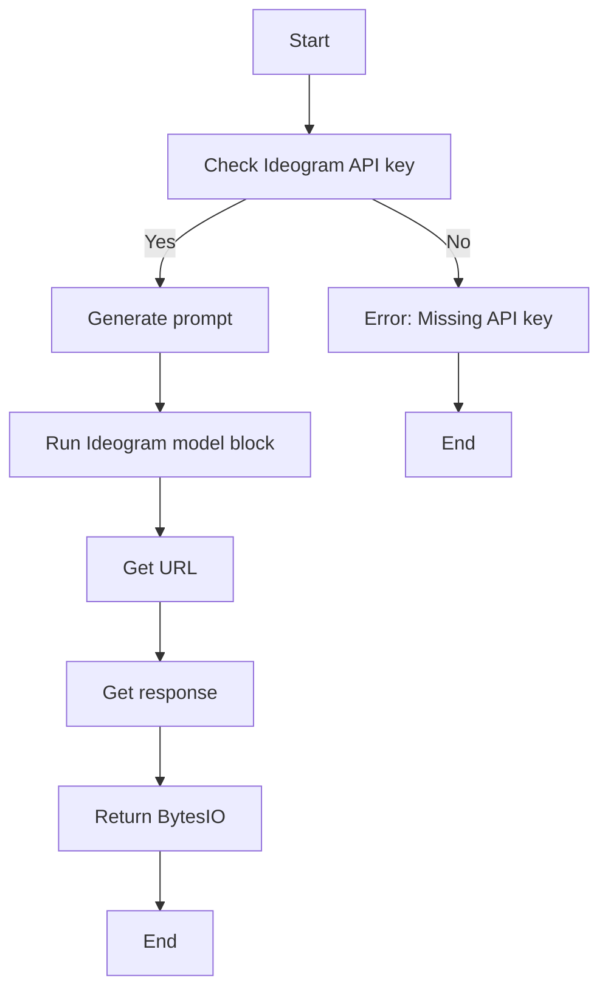
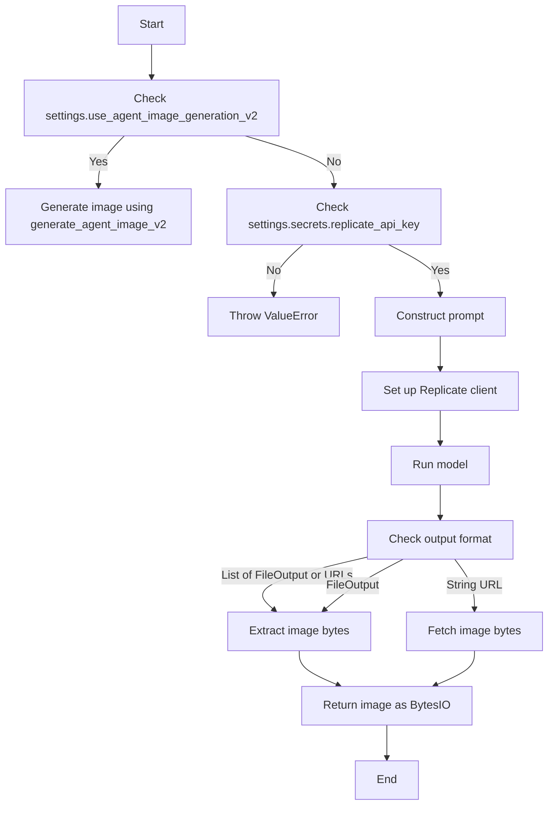
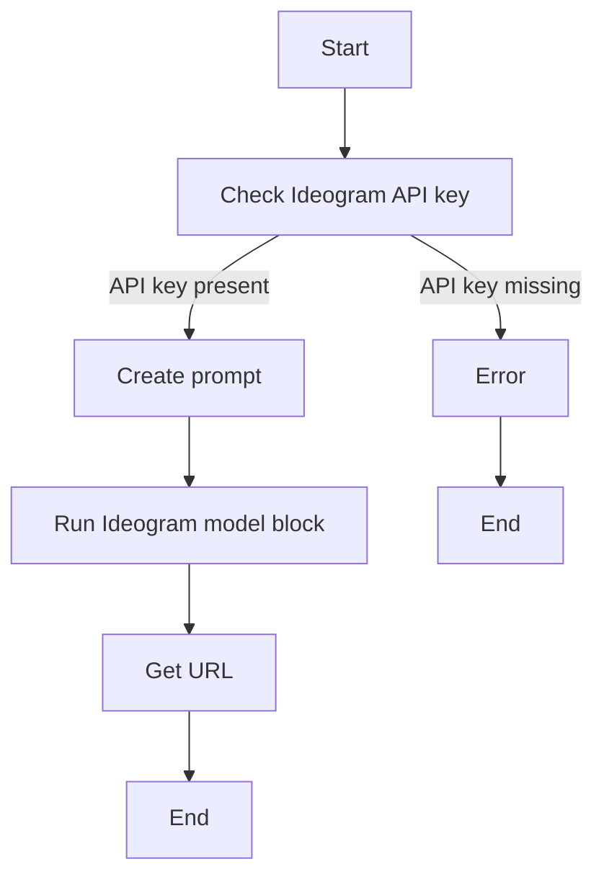
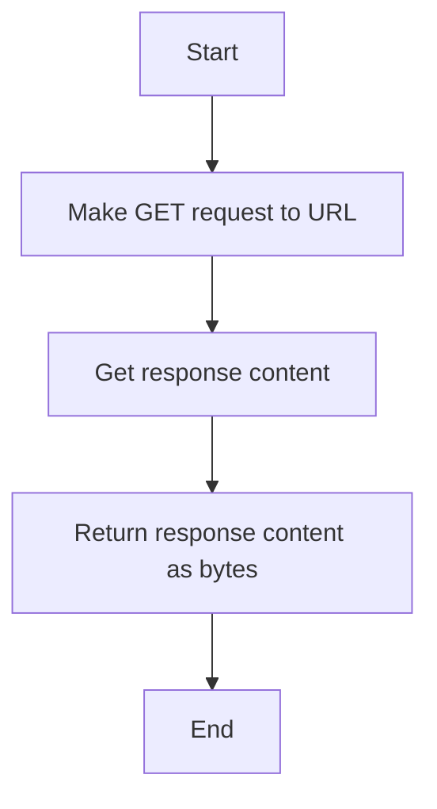

# `.\AutoGPT\autogpt_platform\backend\backend\api\features\store\image_gen.py` 详细设计文档

This code generates images for agents using either an Ideogram model or a Flux model via the Replicate API, based on the agent's metadata.

## 整体流程



## 类结构

```
ImageSize (枚举)
ImageStyle (枚举)
IdeogramModelBlock (类)
CredentialsMetaInput (类)
ProviderName (枚举)
MagicPromptOption (枚举)
StyleType (枚举)
UpscaleOption (枚举)
Requests (类)
Settings (类)
ImageSize.LANDSCAPE
ImageStyle.DIGITAL_ART
ideogram_credentials (全局变量)
logger (全局变量)
settings (全局变量)
```

## 全局变量及字段


### `ideogram_credentials`
    
Credentials for the Ideogram API.

类型：`ideogram_credentials`
    


### `logger`
    
Logger instance for logging messages.

类型：`logging.Logger`
    


### `settings`
    
Settings object containing configuration settings.

类型：`backend.util.settings.Settings`
    


### `ImageSize.LANDSCAPE`
    
Enum value representing landscape image size (1024x768).

类型：`str`
    


### `ImageStyle.DIGITAL_ART`
    
Enum value representing digital art style.

类型：`str`
    


### `CredentialsMetaInput.id`
    
ID of the credentials.

类型：`str`
    


### `CredentialsMetaInput.provider`
    
Provider of the credentials.

类型：`str`
    


### `CredentialsMetaInput.title`
    
Title of the credentials.

类型：`str`
    


### `CredentialsMetaInput.type`
    
Type of the credentials.

类型：`str`
    


### `ProviderName.IDEOGRAM`
    
Enum value representing the Ideogram provider.

类型：`str`
    


### `MagicPromptOption.OFF`
    
Enum value representing the Magic Prompt Option turned off.

类型：`str`
    


### `StyleType.AUTO`
    
Enum value representing the automatic style type.

类型：`str`
    


### `UpscaleOption.NO_UPSCALE`
    
Enum value representing no upscale option.

类型：`str`
    


### `CredentialsMetaInput.id`
    
ID of the credentials.

类型：`str`
    


### `CredentialsMetaInput.provider`
    
Provider of the credentials.

类型：`str`
    


### `CredentialsMetaInput.title`
    
Title of the credentials.

类型：`str`
    


### `CredentialsMetaInput.type`
    
Type of the credentials.

类型：`str`
    
    

## 全局函数及方法


### `generate_agent_image_v2`

Generate an image for an agent using Ideogram model.

参数：

- `graph`：`GraphBaseMeta | AgentGraph`，The agent to generate an image for
- `credentials`：`CredentialsMetaInput`，The credentials for the Ideogram API
- `prompt`：`str`，The prompt to generate the image
- `ideogram_model_name`：`IdeogramModelName`，The name of the Ideogram model to use
- `aspect_ratio`：`AspectRatio`，The aspect ratio of the image
- `magic_prompt_option`：`MagicPromptOption`，The magic prompt option to use
- `style_type`：`StyleType`，The style type of the image
- `upscale`：`UpscaleOption`，The upscale option for the image
- `color_palette_name`：`ColorPalettePreset`，The name of the color palette to use
- `custom_color_palette`：`list`，The custom color palette to use
- `seed`：`int`，The seed for the image generation
- `negative_prompt`：`str`，The negative prompt to use

返回值：`io.BytesIO`，The generated image as bytes

#### 流程图



#### 带注释源码

```python
async def generate_agent_image_v2(graph: GraphBaseMeta | AgentGraph) -> io.BytesIO:
    if not ideogram_credentials.api_key:
        raise ValueError("Missing Ideogram API key")

    name = graph.name
    description = f"{name} ({graph.description})" if graph.description else name

    prompt = (
        "Create a visually striking retro-futuristic vector pop art illustration "
        f'prominently featuring "{name}" in bold typography. The image clearly and '
        f"literally depicts a {description}, along with recognizable objects directly "
        f"associated with the primary function of a {name}. "
        f"Ensure the imagery is concrete, intuitive, and immediately understandable, "
        f"clearly conveying the purpose of a {name}. "
        "Maintain vibrant, limited-palette colors, sharp vector lines, "
        "geometric shapes, flat illustration techniques, and solid colors "
        "without gradients or shading. Preserve a retro-futuristic aesthetic "
        "influenced by mid-century futurism and 1960s psychedelia, "
        "prioritizing clear visual storytelling and thematic clarity above all else."
    )

    custom_colors = [
        "#000030",
        "#1C0C47",
        "#9900FF",
        "#4285F4",
        "#FFFFFF",
    ]

    url = await IdeogramModelBlock().run_once(
        IdeogramModelBlock.Input(
            credentials=CredentialsMetaInput(
                id=ideogram_credentials.id,
                provider=ProviderName.IDEOGRAM,
                title=ideogram_credentials.title,
                type=ideogram_credentials.type,
            ),
            prompt=prompt,
            ideogram_model_name=IdeogramModelName.V3,
            aspect_ratio=AspectRatio.ASPECT_16_9,
            magic_prompt_option=MagicPromptOption.OFF,
            style_type=StyleType.AUTO,
            upscale=UpscaleOption.NO_UPSCALE,
            color_palette_name=ColorPalettePreset.NONE,
            custom_color_palette=custom_colors,
            seed=None,
            negative_prompt=None,
        ),
        "result",
        credentials=ideogram_credentials,
    )
    response = await Requests().get(url)
    return io.BytesIO(response.content)
```


### `generate_agent_image_v2`

Generate an image for an agent using Ideogram model.

参数：

- `graph`：`GraphBaseMeta | AgentGraph`，The agent to generate an image for

返回值：`io.BytesIO`，The generated image as bytes

#### 流程图

```mermaid
graph TD
    A[Start] --> B[Check settings.config.use_agent_image_generation_v2]
    B -- Yes --> C[Generate image using generate_agent_image_v2]
    B -- No --> D[Generate image using generate_agent_image_v1]
    C --> E[Check ideogram_credentials.api_key]
    E -- Yes --> F[Create prompt]
    E -- No --> G[Error: Missing Ideogram API key]
    F --> H[Run IdeogramModelBlock.run_once]
    H --> I[Get response]
    I --> J[Return io.BytesIO(response.content)]
    G --> K[End]
    D --> L[End]
```

#### 带注释源码

```python
async def generate_agent_image_v2(graph: GraphBaseMeta | AgentGraph) -> io.BytesIO:
    """
    Generate an image for an agent using Ideogram model.
    Returns:
        str: The URL of the generated image
    """
    if not ideogram_credentials.api_key:
        raise ValueError("Missing Ideogram API key")

    name = graph.name
    description = f"{name} ({graph.description})" if graph.description else name

    prompt = (
        "Create a visually striking retro-futuristic vector pop art illustration "
        f'prominently featuring "{name}" in bold typography. The image clearly and '
        f"literally depicts a {description}, along with recognizable objects directly "
        f"associated with the primary function of a {name}. "
        f"Ensure the imagery is concrete, intuitive, and immediately understandable, "
        f"clearly conveying the purpose of a {name}. "
        "Maintain vibrant, limited-palette colors, sharp vector lines, "
        "geometric shapes, flat illustration techniques, and solid colors "
        "without gradients or shading. Preserve a retro-futuristic aesthetic "
        "influenced by mid-century futurism and 1960s psychedelia, "
        "prioritizing clear visual storytelling and thematic clarity above all else."
    )

    custom_colors = [
        "#000030",
        "#1C0C47",
        "#9900FF",
        "#4285F4",
        "#FFFFFF",
    ]

    # Run the Ideogram model block with the specified parameters
    url = await IdeogramModelBlock().run_once(
        IdeogramModelBlock.Input(
            credentials=CredentialsMetaInput(
                id=ideogram_credentials.id,
                provider=ProviderName.IDEOGRAM,
                title=ideogram_credentials.title,
                type=ideogram_credentials.type,
            ),
            prompt=prompt,
            ideogram_model_name=IdeogramModelName.V3,
            aspect_ratio=AspectRatio.ASPECT_16_9,
            magic_prompt_option=MagicPromptOption.OFF,
            style_type=StyleType.AUTO,
            upscale=UpscaleOption.NO_UPSCALE,
            color_palette_name=ColorPalettePreset.NONE,
            custom_color_palette=custom_colors,
            seed=None,
            negative_prompt=None,
        ),
        "result",
        credentials=ideogram_credentials,
    )
    response = await Requests().get(url)
    return io.BytesIO(response.content)
```


### `generate_agent_image_v1`

Generate an image for an agent using Flux model via Replicate API.

参数：

- `agent`：`GraphBaseMeta | AgentGraph`，The agent to generate an image for

返回值：`io.BytesIO`，The generated image as bytes

#### 流程图



#### 带注释源码

```python
async def generate_agent_image_v1(agent: GraphBaseMeta | AgentGraph) -> io.BytesIO:
    """
    Generate an image for an agent using Flux model via Replicate API.

    Args:
        agent (GraphBaseMeta | AgentGraph): The agent to generate an image for

    Returns:
        io.BytesIO: The generated image as bytes
    """
    try:
        if not settings.secrets.replicate_api_key:
            raise ValueError("Missing Replicate API key in settings")

        # Construct prompt from agent details
        prompt = (
            "Create a visually engaging app store thumbnail for the AI agent "
            "that highlights what it does in a clear and captivating way:\n"
            f"- **Name**: {agent.name}\n"
            f"- **Description**: {agent.description}\n"
            f"Focus on showcasing its core functionality with an appealing design."
        )

        # Set up Replicate client
        client = ReplicateClient(api_token=settings.secrets.replicate_api_key)

        # Model parameters
        input_data = {
            "prompt": prompt,
            "width": 1024,
            "height": 768,
            "aspect_ratio": "4:3",
            "output_format": "jpg",
            "output_quality": 90,
            "num_inference_steps": 30,
            "guidance": 3.5,
            "negative_prompt": "blurry, low quality, distorted, deformed",
            "disable_safety_checker": True,
        }

        try:
            # Run model
            output = client.run("black-forest-labs/flux-1.1-pro", input=input_data)

            # Depending on the model output, extract the image URL or bytes
            # If the output is a list of FileOutput or URLs
            if isinstance(output, list) and output:
                if isinstance(output[0], FileOutput):
                    image_bytes = output[0].read()
                else:
                    # If it's a URL string, fetch the image bytes
                    result_url = output[0]
                    response = await Requests().get(result_url)
                    image_bytes = response.content
            elif isinstance(output, FileOutput):
                image_bytes = output.read()
            elif isinstance(output, str):
                # Output is a URL
                response = await Requests().get(output)
                image_bytes = response.content
            else:
                raise RuntimeError("Unexpected output format from the model.")

            return io.BytesIO(image_bytes)

        except ReplicateError as e:
            if e.status == 401:
                raise RuntimeError("Invalid Replicate API token") from e
            raise RuntimeError(f"Replicate API error: {str(e)}") from e

    except Exception as e:
        logger.exception("Failed to generate agent image")
        raise RuntimeError(f"Image generation failed: {str(e)}")
```


### IdeogramModelBlock.run_once

Run the Ideogram model block with the specified parameters.

参数：

- `input`: `IdeogramModelBlock.Input`，The input parameters for the Ideogram model block.
- `output`: `str`，The output key to use for the result.
- `credentials`: `CredentialsMetaInput`，The credentials to use for the Ideogram model block.

返回值：`str`，The URL of the generated image.

#### 流程图



#### 带注释源码

```python
async def run_once(self, input: IdeogramModelBlock.Input, output: str, credentials: CredentialsMetaInput) -> str:
    """
    Run the Ideogram model block with the specified parameters.

    Args:
        input (IdeogramModelBlock.Input): The input parameters for the Ideogram model block.
        output (str): The output key to use for the result.
        credentials (CredentialsMetaInput): The credentials to use for the Ideogram model block.

    Returns:
        str: The URL of the generated image.
    """
    if not ideogram_credentials.api_key:
        raise ValueError("Missing Ideogram API key")

    name = graph.name
    description = f"{name} ({graph.description})" if graph.description else name

    prompt = (
        "Create a visually striking retro-futuristic vector pop art illustration "
        f'prominently featuring "{name}" in bold typography. The image clearly and '
        f"literally depicts a {description}, along with recognizable objects directly "
        f"associated with the primary function of a {name}. "
        f"Ensure the imagery is concrete, intuitive, and immediately understandable, "
        f"clearly conveying the purpose of a {name}. "
        "Maintain vibrant, limited-palette colors, sharp vector lines, "
        "geometric shapes, flat illustration techniques, and solid colors "
        "without gradients or shading. Preserve a retro-futuristic aesthetic "
        "influenced by mid-century futurism and 1960s psychedelia, "
        "prioritizing clear visual storytelling and thematic clarity above all else."
    )

    custom_colors = [
        "#000030",
        "#1C0C47",
        "#9900FF",
        "#4285F4",
        "#FFFFFF",
    ]

    url = await IdeogramModelBlock().run_once(
        IdeogramModelBlock.Input(
            credentials=CredentialsMetaInput(
                id=ideogram_credentials.id,
                provider=ProviderName.IDEOGRAM,
                title=ideogram_credentials.title,
                type=ideogram_credentials.type,
            ),
            prompt=prompt,
            ideogram_model_name=IdeogramModelName.V3,
            aspect_ratio=AspectRatio.ASPECT_16_9,
            magic_prompt_option=MagicPromptOption.OFF,
            style_type=StyleType.AUTO,
            upscale=UpscaleOption.NO_UPSCALE,
            color_palette_name=ColorPalettePreset.NONE,
            custom_color_palette=custom_colors,
            seed=None,
            negative_prompt=None,
        ),
        "result",
        credentials=ideogram_credentials,
    )
    response = await Requests().get(url)
    return io.BytesIO(response.content)
```


### Requests.get

This function is used to make a GET request to a specified URL and return the response content as bytes.

参数：

- `url`：`str`，The URL to which the GET request is made.
- ...

返回值：`io.BytesIO`，The response content as bytes.

#### 流程图



#### 带注释源码

```python
async def get(self, url: str) -> io.BytesIO:
    # Make GET request to the specified URL
    response = requests.get(url)
    # Return the response content as bytes
    return io.BytesIO(response.content)
```


## 关键组件


### 张量索引与惰性加载

用于高效地索引和访问大型数据集，同时延迟加载数据以减少内存消耗。

### 反量化支持

提供对反量化操作的支持，允许在量化过程中进行反向操作。

### 量化策略

定义了量化策略，用于在模型训练和推理过程中调整模型参数的精度。


## 问题及建议


### 已知问题

-   **API Key 验证**: 代码中在 `generate_agent_image_v2` 和 `generate_agent_image_v1` 函数中分别检查了 Ideogram API key 和 Replicate API key 的存在，但没有实现一个统一的机制来处理这些密钥的验证和存储，这可能导致密钥泄露或管理困难。
-   **错误处理**: 代码中使用了 `try-except` 块来捕获异常，但异常处理不够详细，例如在 `generate_agent_image_v1` 函数中，捕获了所有异常，但没有针对不同类型的异常进行不同的处理。
-   **代码重复**: `generate_agent_image_v2` 和 `generate_agent_image_v1` 函数中存在大量的代码重复，特别是在处理图像生成的逻辑上。
-   **日志记录**: 代码中使用了 `logger.exception` 来记录异常，但没有记录一些关键的信息，如请求的 URL 或请求的状态码，这可能会影响问题的诊断。

### 优化建议

-   **统一密钥管理**: 实现一个统一的密钥管理机制，例如使用环境变量或配置文件来存储 API 密钥，并确保这些密钥不会被硬编码在代码中。
-   **细化错误处理**: 根据不同的异常类型实现更细化的错误处理逻辑，例如对于 API 错误，可以尝试重新发送请求或通知用户。
-   **减少代码重复**: 通过提取公共逻辑到单独的函数或类中，减少 `generate_agent_image_v2` 和 `generate_agent_image_v1` 函数中的代码重复。
-   **增强日志记录**: 在日志记录中包含更多详细信息，如请求的 URL、状态码、请求头和响应体，以便于问题的诊断和调试。
-   **异步请求优化**: 在 `generate_agent_image_v1` 函数中，使用异步请求时，可以考虑使用连接池来提高性能。
-   **错误反馈**: 对于用户请求，提供更清晰的错误反馈，例如在 API 错误时提供具体的错误信息。


## 其它


### 设计目标与约束

- 设计目标：
  - 提供一个模块化的图像生成服务，支持不同类型的图像生成。
  - 确保图像生成的质量和一致性。
  - 提供灵活的配置选项，以适应不同的使用场景。
- 约束：
  - 必须使用 Ideogram 和 Replicate API 进行图像生成。
  - 需要处理 API 错误和异常情况。
  - 必须遵守 API 的使用限制和速率限制。

### 错误处理与异常设计

- 错误处理：
  - 缺少 API 密钥时抛出 `ValueError`。
  - API 认证失败时抛出 `RuntimeError`。
  - API 调用失败时抛出 `RuntimeError`。
  - 未知错误时记录异常并抛出 `RuntimeError`。
- 异常设计：
  - 使用 `try-except` 块捕获和处理可能的异常。
  - 使用日志记录异常信息，以便于问题追踪和调试。

### 数据流与状态机

- 数据流：
  - 用户请求生成图像。
  - 根据请求类型，选择不同的图像生成方法。
  - 调用 Ideogram 或 Replicate API 生成图像。
  - 将生成的图像返回给用户。
- 状态机：
  - 无状态设计，每个函数独立处理其输入和输出。

### 外部依赖与接口契约

- 外部依赖：
  - Prisma ORM 用于数据库操作。
  - Replicate API 用于图像生成。
  - Ideogram API 用于图像生成。
- 接口契约：
  - Ideogram API：提供图像生成接口，包括输入参数和输出格式。
  - Replicate API：提供图像生成接口，包括输入参数和输出格式。
  - Prisma ORM：提供数据库操作接口。


    