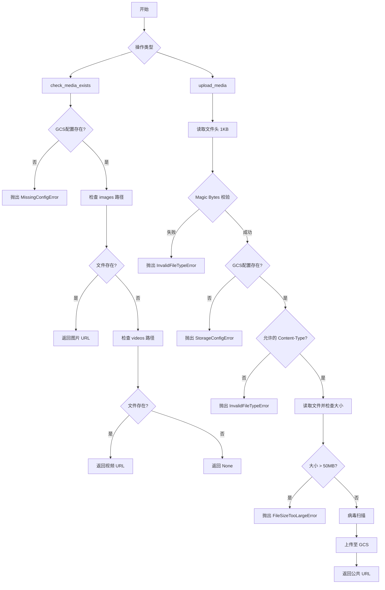
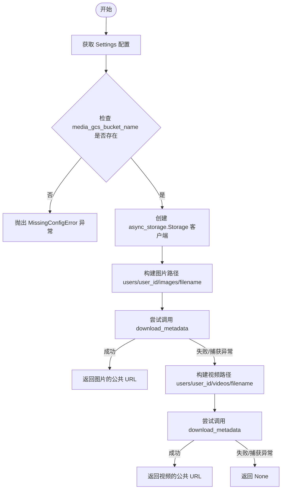
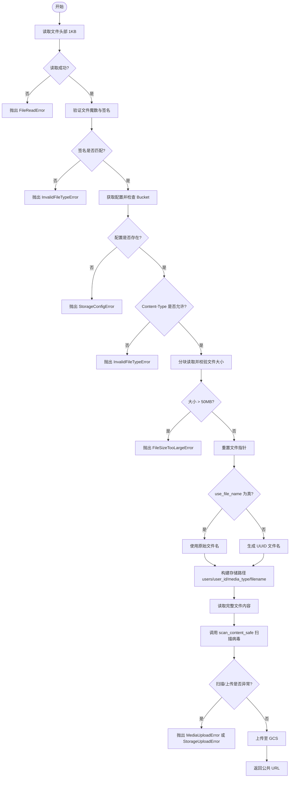

# `AutoGPT\autogpt_platform\backend\backend\api\features\store\media.py` 详细设计文档

该模块负责处理媒体文件的上传与存储管理，集成了 Google Cloud Storage (GCS)。主要功能包括验证文件类型（通过 Magic Bytes 检查）、限制文件大小、执行病毒扫描、检查文件是否存在以及上传文件并返回公共访问 URL。

## 整体流程



## 类结构

```
N/A (该模块不包含类定义，仅包含全局常量和函数)
```

## 全局变量及字段


### `logger`
    
用于记录模块运行状态、错误及调试信息的日志记录器实例。

类型：`logging.Logger`
    


### `ALLOWED_IMAGE_TYPES`
    
允许上传的图片MIME类型集合，包含jpeg、png、gif和webp格式。

类型：`set[str]`
    


### `ALLOWED_VIDEO_TYPES`
    
允许上传的视频MIME类型集合，包含mp4和webm格式。

类型：`set[str]`
    


### `MAX_FILE_SIZE`
    
允许上传的文件最大体积限制，当前设置为50MB。

类型：`int`
    


    

## 全局函数及方法


### `check_media_exists`

检查指定用户的媒体文件是否存在于 Google Cloud Storage (GCS) 中。函数会依次尝试在用户的图片目录和视频目录中查找该文件。如果找到文件，则返回其公共访问 URL；如果未找到或发生特定错误，则返回 None。

参数：

- `user_id`：`str`，上传文件的用户 ID
- `filename`：`str`，要检查的文件名

返回值：`str | None`，如果 blob 存在则返回其公共 URL (String)，否则返回 None。

#### 流程图



#### 带注释源码

```python
async def check_media_exists(user_id: str, filename: str) -> str | None:
    """
    Check if a media file exists in storage for the given user.
    Tries both images and videos directories.

    Args:
        user_id (str): ID of the user who uploaded the file
        filename (str): Name of the file to check

    Returns:
        str | None: URL of the blob if it exists, None otherwise
    """
    # 初始化设置以访问配置
    settings = Settings()
    
    # 验证 GCS 存储桶名称是否已配置，未配置则抛出配置缺失错误
    if not settings.config.media_gcs_bucket_name:
        raise MissingConfigError("GCS media bucket is not configured")

    # 使用异步上下文管理器建立与 GCS 的连接
    async with async_storage.Storage() as async_client:
        bucket_name = settings.config.media_gcs_bucket_name

        # 步骤 1: 检查图片目录
        image_path = f"users/{user_id}/images/{filename}"
        try:
            # 尝试下载元数据以验证文件是否存在
            await async_client.download_metadata(bucket_name, image_path)
            # 如果成功，构造并返回公共 URL
            return f"https://storage.googleapis.com/{bucket_name}/{image_path}"
        except Exception:
            # 文件不存在或发生错误，忽略异常并继续检查视频
            pass

        # 步骤 2: 检查视频目录
        video_path = f"users/{user_id}/videos/{filename}"
        try:
            # 尝试下载元数据以验证文件是否存在
            await async_client.download_metadata(bucket_name, video_path)
            # 如果成功，构造并返回公共 URL
            return f"https://storage.googleapis.com/{bucket_name}/{video_path}"
        except Exception:
            # 文件不存在，忽略异常
            pass

        # 如果两个位置都未找到文件，返回 None
        return None
```


### `upload_media`

该函数负责异步将用户的媒体文件（图片或视频）上传至 Google Cloud Storage (GCS)。在上传过程中，它会读取文件的“魔数”来验证文件签名是否与声明的 Content-Type 匹配，检查文件大小是否超过限制（50MB），调用病毒扫描程序确保文件安全，并最终根据配置生成唯一文件名或保留原文件名存储，返回可公开访问的 URL。

参数：

-  `user_id`：`str`，上传文件所属用户的唯一标识符，用于构建存储路径。
-  `file`：`fastapi.UploadFile`，FastAPI 提供的上传文件对象，包含文件流和元数据。
-  `use_file_name`：`bool`，是否使用原始文件名。默认为 False，即生成 UUID 作为文件名；设为 True 时保留客户端上传的文件名。

返回值：`str`，上传成功后媒体文件在 Google Cloud Storage 上的公共访问 URL。

#### 流程图



#### 带注释源码

```python
async def upload_media(
    user_id: str, file: fastapi.UploadFile, use_file_name: bool = False
) -> str:
    # 读取文件内容用于深度验证，先读取前1KB用于检查文件头魔数
    try:
        content = await file.read(1024)  # Read first 1KB for validation
        await file.seek(0)  # Reset file pointer
    except Exception as e:
        logger.error(f"Error reading file content: {str(e)}")
        raise store_exceptions.FileReadError("Failed to read file content") from e

    # 验证文件签名/魔数，确保文件类型与Content-Type一致，防止伪造扩展名攻击
    if file.content_type in ALLOWED_IMAGE_TYPES:
        # Check image file signatures
        if content.startswith(b"\xff\xd8\xff"):  # JPEG
            if file.content_type != "image/jpeg":
                raise store_exceptions.InvalidFileTypeError(
                    "File signature does not match content type"
                )
        elif content.startswith(b"\x89PNG\r\n\x1a\n"):  # PNG
            if file.content_type != "image/png":
                raise store_exceptions.InvalidFileTypeError(
                    "File signature does not match content type"
                )
        elif content.startswith(b"GIF87a") or content.startswith(b"GIF89a"):  # GIF
            if file.content_type != "image/gif":
                raise store_exceptions.InvalidFileTypeError(
                    "File signature does not match content type"
                )
        elif content.startswith(b"RIFF") and content[8:12] == b"WEBP":  # WebP
            if file.content_type != "image/webp":
                raise store_exceptions.InvalidFileTypeError(
                    "File signature does not match content type"
                )
        else:
            raise store_exceptions.InvalidFileTypeError("Invalid image file signature")

    elif file.content_type in ALLOWED_VIDEO_TYPES:
        # Check video file signatures
        if content.startswith(b"\x00\x00\x00") and (content[4:8] == b"ftyp"):  # MP4
            if file.content_type != "video/mp4":
                raise store_exceptions.InvalidFileTypeError(
                    "File signature does not match content type"
                )
        elif content.startswith(b"\x1a\x45\xdf\xa3"):  # WebM
            if file.content_type != "video/webm":
                raise store_exceptions.InvalidFileTypeError(
                    "File signature does not match content type"
                )
        else:
            raise store_exceptions.InvalidFileTypeError("Invalid video file signature")

    settings = Settings()

    # 在进行任何文件处理之前检查必要的配置项
    if not settings.config.media_gcs_bucket_name:
        logger.error("Missing GCS bucket name setting")
        raise store_exceptions.StorageConfigError(
            "Missing storage bucket configuration"
        )

    try:
        # 验证文件类型，如果未指定则默认为 image/jpeg
        content_type = file.content_type
        if content_type is None:
            content_type = "image/jpeg"

        if (
            content_type not in ALLOWED_IMAGE_TYPES
            and content_type not in ALLOWED_VIDEO_TYPES
        ):
            logger.warning(f"Invalid file type attempted: {content_type}")
            raise store_exceptions.InvalidFileTypeError(
                f"File type not supported. Must be jpeg, png, gif, webp, mp4 or webm. Content type: {content_type}"
            )

        # 验证文件大小，分块读取以避免内存溢出，限制为 50MB
        file_size = 0
        chunk_size = 8192  # 8KB chunks

        try:
            while chunk := await file.read(chunk_size):
                file_size += len(chunk)
                if file_size > MAX_FILE_SIZE:
                    logger.warning(f"File size too large: {file_size} bytes")
                    raise store_exceptions.FileSizeTooLargeError(
                        "File too large. Maximum size is 50MB"
                    )
        except store_exceptions.FileSizeTooLargeError:
            raise
        except Exception as e:
            logger.error(f"Error reading file chunks: {str(e)}")
            raise store_exceptions.FileReadError("Failed to read uploaded file") from e

        # 重置文件指针以便后续完整读取
        await file.seek(0)

        # 生成唯一文件名
        filename = file.filename or ""
        file_ext = os.path.splitext(filename)[1].lower()
        if use_file_name:
            unique_filename = filename
        else:
            unique_filename = f"{uuid.uuid4()}{file_ext}"

        # 构建存储路径
        media_type = "images" if content_type in ALLOWED_IMAGE_TYPES else "videos"
        storage_path = f"users/{user_id}/{media_type}/{unique_filename}"

        try:
            # 使用异步客户端上传
            async with async_storage.Storage() as async_client:
                bucket_name = settings.config.media_gcs_bucket_name

                file_bytes = await file.read()
                # 执行病毒扫描
                await scan_content_safe(file_bytes, filename=unique_filename)

                # Upload using pure async client
                await async_client.upload(
                    bucket_name, storage_path, file_bytes, content_type=content_type
                )

                # Construct public URL
                public_url = (
                    f"https://storage.googleapis.com/{bucket_name}/{storage_path}"
                )

                logger.info(f"Successfully uploaded file to: {storage_path}")
                return public_url

        except Exception as e:
            logger.error(f"GCS storage error: {str(e)}")
            raise store_exceptions.StorageUploadError(
                "Failed to upload file to storage"
            ) from e

    except store_exceptions.MediaUploadError:
        raise
    except Exception as e:
        logger.exception("Unexpected error in upload_media")
        raise store_exceptions.MediaUploadError(
            "Unexpected error during media upload"
        ) from e
```


## 关键组件


### 文件类型验证与签名校验

通过读取文件头魔术字节来验证文件内容的真实性，确保其与声明的 MIME 类型（如 JPEG, PNG, MP4 等）一致，防止恶意文件伪装上传。

### 异步云存储集成

利用 `gcloud.aio.storage` 库实现与 Google Cloud Storage (GCS) 的非阻塞交互，包括检查文件元数据是否存在、执行异步文件上传以及生成公开访问 URL。

### 安全扫描与大小限制

在文件持久化前集成病毒扫描功能，并通过流式分块读取机制强制执行 50MB 的文件大小上限，以保障存储系统的安全性和资源利用率。

### 用户媒体路径组织策略

根据用户 ID 和文件类型（图片或视频）动态构建结构化的存储路径，将媒体资源隔离存储于 `users/{user_id}/images/` 或 `users/{user_id}/videos/` 目录下。


## 问题及建议


### 已知问题

-   **内存溢出风险**：在 `upload_media` 函数中，使用 `file_bytes = await file.read()` 将整个文件内容一次性读入内存。虽然当前限制为 50MB，但在高并发上传场景下，这会消耗大量服务器内存，可能导致 OOM（内存溢出）。
-   **异常处理掩盖真实错误**：在 `check_media_exists` 函数中，使用了宽泛的 `except Exception` 来捕获文件不存在的逻辑。这会导致如果发生真正的网络错误、权限错误或存储服务异常，也会被静默忽略，仅返回 `None`，增加了排查问题的难度。
-   **冗余的文件读取操作**：`upload_media` 函数对文件进行了多次读取：首先读取 1KB 用于签名验证，随后分块读取计算大小，最后全量读取用于上传和扫描。这种重复的 I/O 操作增加了上传延迟。
-   **硬编码的文件签名检查**：代码中手动实现了针对 JPEG、PNG、GIF 等格式的 Magic Bytes 检查。这种方式代码冗长、维护困难，且容易遗漏格式或因格式更新而出错。
-   **配置实例化低效**：在每次函数调用时都执行 `Settings()`，这可能导致重复的配置解析或环境变量读取开销。

### 优化建议

-   **引入流式上传与处理**：改造 `upload_media` 以支持流式处理。直接将文件流传递给 GCS 客户端和病毒扫描器，避免将全量文件加载到内存中。
-   **优化客户端生命周期管理**：`async_storage.Storage` 客户端应作为全局单例或通过 Fastapi 的 `Depends` 依赖注入管理，以便复用 HTTP 连接池，减少建立连接的开销。
-   **使用专用库进行文件类型检测**：建议使用成熟的第三方库（如 `python-magic` 或 `filetype`）替代手动的字节签名检查，以提高代码的简洁性、准确性和可维护性。
-   **细化异常捕获**：在 `check_media_exists` 中，应仅捕获“文件不存在”（如 Google Cloud 的 `NotFound` 异常），将其他异常（如网络错误、认证错误）向上抛出，以便上层进行正确的错误处理和日志记录。
-   **异步化病毒扫描**：如果病毒扫描服务响应较慢或资源消耗大，建议将其放入后台任务队列（如 Celery）中异步执行，从而避免阻塞上传接口的响应，提升用户体验。


## 其它


### 设计目标与约束

该模块旨在提供一个安全、异步的媒体文件管理服务，支持文件的上传与存在性检查。设计遵循以下目标与约束：

1.  **异步非阻塞 I/O**：所有 I/O 操作（包括存储交互和文件读取）必须使用 `async/await` 模式，以确保在 FastAPI 等异步框架中不会阻塞事件循环，维持高并发性能。
2.  **数据安全与完整性**：严格验证文件类型，不仅检查 MIME 类型，还通过检查文件头（魔术字节）来防止类型混淆攻击。所有上传文件必须通过病毒扫描才能落地存储。
3.  **资源限制**：为了防止资源耗尽攻击，强制限制上传文件的最大体积为 50MB，并限制允许的媒体格式为 JPEG, PNG, GIF, WebP, MP4, WebM。
4.  **存储依赖**：系统强依赖 Google Cloud Storage (GCS) 作为持久化层，要求 `Settings` 中必须配置有效的 `media_gcs_bucket_name`，否则服务将拒绝运行。

### 错误处理与异常设计

模块采用了分层错误处理策略，将底层的技术错误转化为业务逻辑层可理解的异常，并确保适当的日志记录：

1.  **自定义异常体系**：定义了一组继承自 `MediaUploadError` 的特定异常，用于精确描述失败原因。包括：
    *   `FileReadError`：文件读取失败（IO 错误或指针操作失败）。
    *   `InvalidFileTypeError`：文件签名与声明的 Content-Type 不匹配，或文件类型不在白名单内。
    *   `FileSizeTooLargeError`：文件体积超过 50MB 限制。
    *   `StorageConfigError`：缺少必要的存储桶配置。
    *   `StorageUploadError`：与 GCS 交互时的网络或服务端错误。
2.  **异常传播机制**：底层库抛出的通用异常（如 GCS 连接错误、OS 错误）被捕获并包装为上述自定义异常，同时保留原始异常链以便调试。
3.  **日志记录**：所有错误路径均包含 `logger.error` 或 `logger.warning`，记录上下文信息（如文件名、用户 ID、具体错误信息），但不暴露敏感的系统内部细节给调用方。
4.  **配置校验**：在执行耗时操作前（如文件流读取），优先检查配置完整性（如 Bucket Name），遵循“快速失败”（Fail-Fast）原则。

### 数据流与状态机

数据在 `upload_media` 函数中的流转经历一系列严格的状态转换，确保只有合规的数据最终进入存储系统：

1.  **接收状态**：
    *   输入：FastAPI 的 `UploadFile` 对象。
    *   动作：读取文件头部 1KB 数据。
2.  **校验状态**：
    *   **类型校验**：比对文件头魔术字节与 `content_type`。如果不匹配或不在 `ALLOWED_*_TYPES` 中，流转至异常终止状态。
    *   **大小校验**：流式读取文件块（8KB/块），累加大小。若超过 `MAX_FILE_SIZE`，流转至异常终止状态。
3.  **安全扫描状态**：
    *   动作：文件指针归零，读取全部字节，调用 `scan_content_safe`。
    *   转换：若扫描发现威胁，抛出异常（具体逻辑依赖外部扫描器实现），终止流程。
4.  **持久化状态**：
    *   动作：生成 UUID 文件名，构建 GCS 路径（`users/{user_id}/images|videos/...`），通过 `gcloud.aio` 异步上传。
5.  **完成状态**：
    *   输出：返回 GCS 公共访问 URL。
    *   副作用：记录成功日志。

### 外部依赖与接口契约

本模块与几个关键的外部组件和库进行交互，定义了严格的接口契约：

1.  **Google Cloud Storage (via `gcloud.aio`)**：
    *   **契约**：提供一个符合 `gcloud.aio.storage.Storage` 接口的异步客户端。
    *   **依赖**：需要 `Settings.config.media_gcs_bucket_name` 提供有效的存储桶名称。`upload` 方法接受 `(bucket, path, data, content_type)` 并上传数据；`download_metadata` 用于检查文件存在性。
2.  **配置中心 (`backend.util.settings.Settings`)**：
    *   **契约**：必须是一个单例或可实例化的对象，提供 `.config.media_gcs_bucket_name` 属性。
3.  **病毒扫描器 (`backend.util.virus_scanner.scan_content_safe`)**：
    *   **契约**：异步函数，接收 `bytes` 类型的文件数据和 `str` 类型的文件名。若文件包含恶意软件，预期抛出异常；否则静默返回。
4.  **Web 框架 (`fastapi.UploadFile`)**：
    *   **契约**：传入的对象必须实现异步文件协议，提供 `.content_type` (str), `.filename` (str | None), `.read(size)`, `.seek(offset)` 方法。

### 安全与合规

考虑到媒体文件处理的高风险性，模块实施了多层安全防御：

1.  **MIME 类型混淆防护**：不信任客户端提供的 `Content-Type`，强制校验二进制文件头（如 JPEG 的 `0xFFD8FF`），确保扩展名和内容实际格式一致。
2.  **恶意软件防护**：集成病毒扫描接口，在文件写入不可变存储之前进行拦截，防止恶意文件分发。
3.  **数据隔离**：通过路径构造逻辑 `users/{user_id}/media_type/` 实现基于用户的逻辑命名空间隔离，便于访问控制和审计。
4.  **资源限制**：通过显式的文件大小阈值（50MB）防止存储服务被大文件拒绝服务攻击。

    