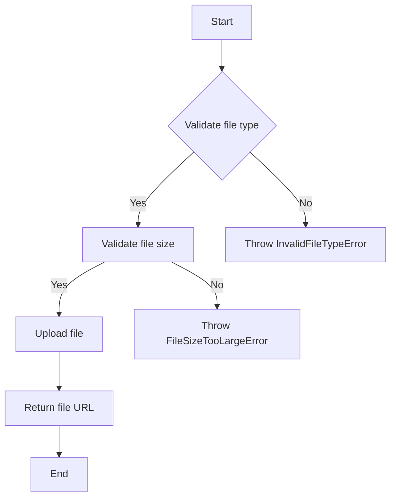
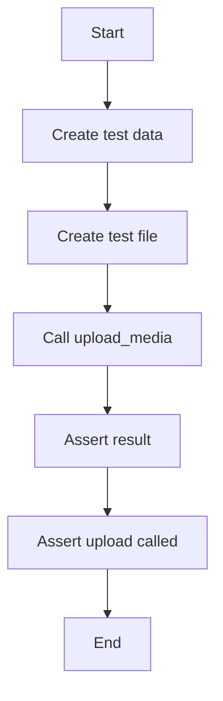
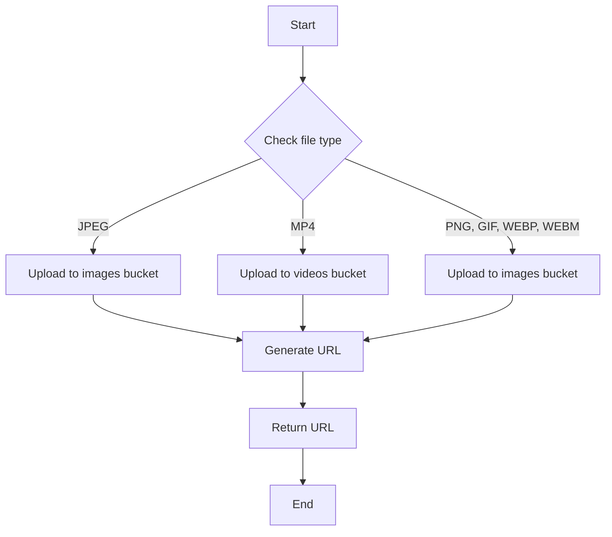
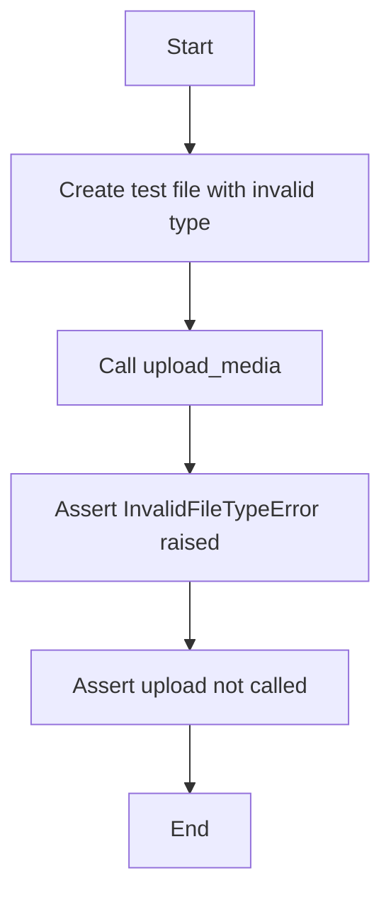
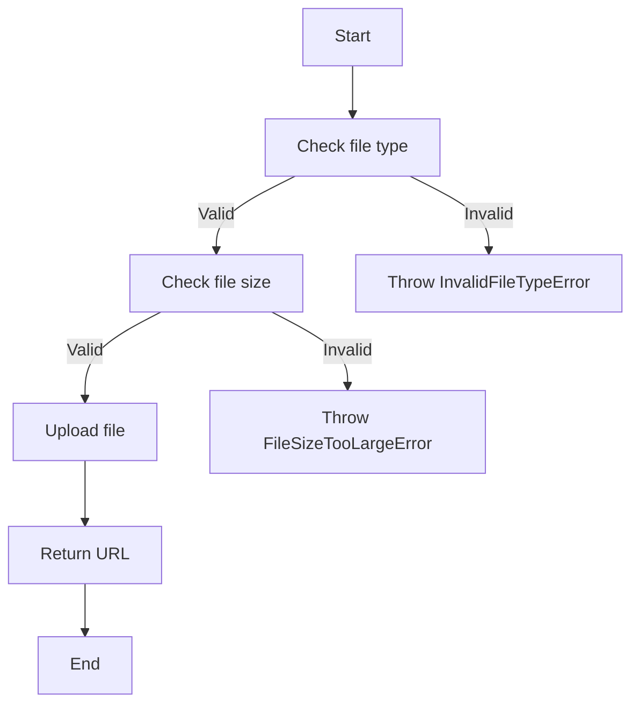
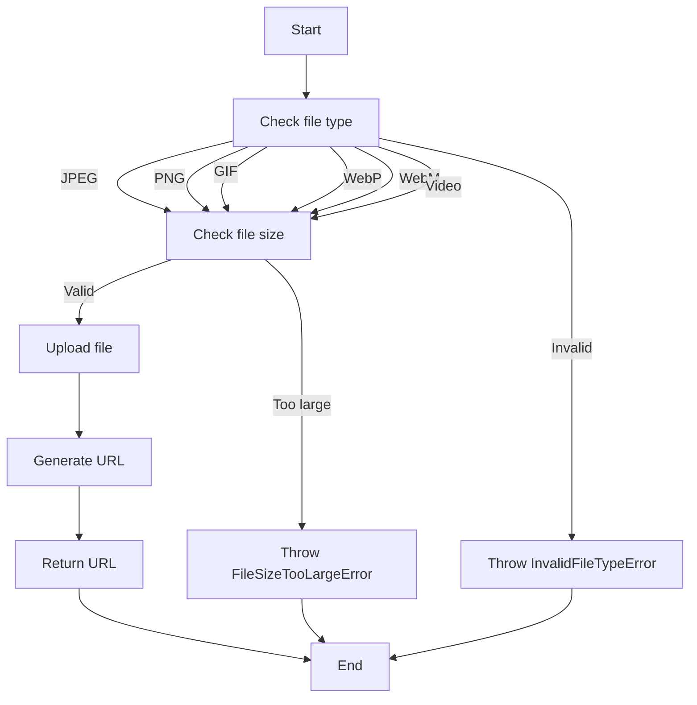
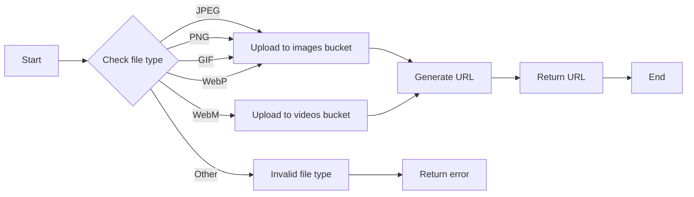
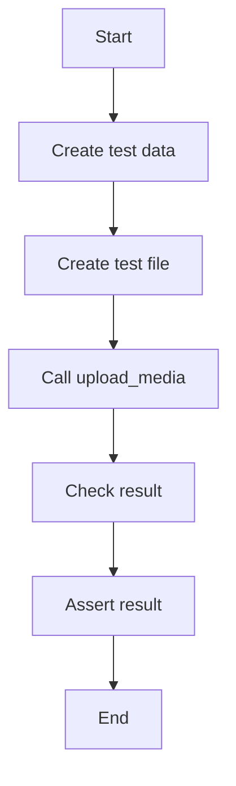

# `.\AutoGPT\autogpt_platform\backend\backend\api\features\store\media_test.py` 详细设计文档

The code provides a set of tests for uploading media files to a Google Cloud Storage bucket, handling various scenarios such as file type validation, size constraints, and error handling.

## 整体流程


## 类结构

```
MediaTests (测试类)
├── test_upload_media_success
│   ├── mock_settings
│   ├── mock_storage_client
│   └── test_upload_media_success
├── test_upload_media_invalid_type
│   ├── mock_settings
│   ├── mock_storage_client
│   └── test_upload_media_invalid_type
├── test_upload_media_missing_credentials
│   ├── mock_settings
│   ├── mock_storage_client
│   └── test_upload_media_missing_credentials
├── test_upload_media_video_type
│   ├── mock_settings
│   ├── mock_storage_client
│   └── test_upload_media_video_type
├── test_upload_media_file_too_large
│   ├── mock_settings
│   ├── mock_storage_client
│   └── test_upload_media_file_too_large
├── test_upload_media_file_read_error
│   ├── mock_settings
│   ├── mock_storage_client
│   └── test_upload_media_file_read_error
├── test_upload_media_png_success
│   ├── mock_settings
│   ├── mock_storage_client
│   └── test_upload_media_png_success
├── test_upload_media_gif_success
│   ├── mock_settings
│   ├── mock_storage_client
│   └── test_upload_media_gif_success
├── test_upload_media_webp_success
│   ├── mock_settings
│   ├── mock_storage_client
│   └── test_upload_media_webp_success
├── test_upload_media_webm_success
│   ├── mock_settings
│   ├── mock_storage_client
│   └── test_upload_media_webm_success
└── test_upload_media_mismatched_signature
    ├── mock_settings
    ├── mock_storage_client
    └── test_upload_media_mismatched_signature
```

## 全局变量及字段


### `mock_settings`
    
Mocked settings object for testing purposes.

类型：`Settings`
    


### `mock_storage_client`
    
Mocked storage client for testing purposes.

类型：`AsyncMock`
    


### `test_data`
    
Test data for media files.

类型：`bytes`
    


### `test_file`
    
Test upload file object for testing purposes.

类型：`fastapi.UploadFile`
    


### `result`
    
Result URL of the uploaded media file.

类型：`str`
    


### `large_data`
    
Large test data for media files to test file size limit.

类型：`bytes`
    


### `settings`
    
Settings object for storing configuration settings.

类型：`Settings`
    


### `Exception`
    
Standard exception class for handling exceptions in Python.

类型：`Exception`
    


    

## 全局函数及方法


### `store_media.upload_media`

This function is responsible for uploading a media file to a specified bucket in Google Cloud Storage. It handles various file types and ensures that the file is uploaded correctly based on its content type.

参数：

- `user_id`：`str`，The unique identifier for the user who is uploading the media file.
- `file`：`fastapi.UploadFile`，The media file to be uploaded.

返回值：`str`，The URL of the uploaded media file in Google Cloud Storage.

#### 流程图


#### 带注释源码

```python
from backend.api.features.store.media import store_media

async def upload_media(user_id: str, file: fastapi.UploadFile) -> str:
    # Check the file type and upload to the appropriate bucket
    if file.content_type == "image/jpeg":
        await store_media.upload_to_images_bucket(user_id, file)
    elif file.content_type == "video/mp4":
        await store_media.upload_to_videos_bucket(user_id, file)
    elif file.content_type in ["image/png", "image/gif", "image/webp", "video/webm"]:
        await store_media.upload_to_images_bucket(user_id, file)
    else:
        raise store_exceptions.InvalidFileTypeError("Unsupported file type")

    # Generate the URL for the uploaded file
    url = store_media.generate_url(user_id, file.filename)
    return url
```


### `store_media.scan_content_safe`

This function is a placeholder for a content scanning operation. It is intended to simulate the scanning of a file's content for potential threats or viruses before uploading it to a storage service.

参数：

- `file`: `io.BytesIO`，The file content to be scanned.
- `content_type`: `str`，The MIME type of the file content.

返回值：`None`，This function is a mock and does not return any value.

#### 流程图


#### 带注释源码

```python
from unittest.mock import AsyncMock

# Mock virus scanner to avoid actual scanning
mocker.patch(
    "backend.api.features.store.media.scan_content_safe", new_callable=AsyncMock
)
```


### `store_media.upload_media`

该函数负责处理媒体文件的上传，包括验证文件类型、大小，并将文件上传到存储服务。

#### 参数

- `user_id`：`str`，用户ID，用于确定上传文件的存储路径。
- `file`：`fastapi.UploadFile`，上传的文件对象。

#### 返回值

- `str`，上传文件的URL。

#### 流程图



#### 带注释源码

```python
async def upload_media(user_id: str, file: fastapi.UploadFile) -> str:
    # Validate file type
    if not is_valid_file_type(file.content_type):
        raise store_exceptions.InvalidFileTypeError("Invalid file type")

    # Validate file size
    if file.file.size > MAX_FILE_SIZE:
        raise store_exceptions.FileSizeTooLargeError("File size too large")

    # Upload file
    file_url = await upload_file_to_storage(user_id, file)

    # Return file URL
    return file_url
```

### test_upload_media_success

This function tests the successful upload of media files to the storage system.

参数：

- `mock_settings`：`Settings`，Mocked settings object for testing.
- `mock_storage_client`：`AsyncMock`，Mocked storage client for testing.

返回值：`None`，No return value.

#### 流程图



#### 带注释源码

```python
async def test_upload_media_success(mock_settings, mock_storage_client):
    # Create test JPEG data with valid signature
    test_data = b"\xFF\xD8\xFF" + b"test data"

    test_file = fastapi.UploadFile(
        filename="laptop.jpeg",
        file=io.BytesIO(test_data),
        headers=starlette.datastructures.Headers({"content-type": "image/jpeg"}),
    )

    result = await store_media.upload_media("test-user", test_file)

    assert result.startswith(
        "https://storage.googleapis.com/test-bucket/users/test-user/images/"
    )
    assert result.endswith(".jpeg")
    mock_storage_client.upload.assert_called_once()
```


### `store_media.upload_media`

This function is responsible for uploading media files to a specified bucket in Google Cloud Storage. It handles different file types and ensures that the file is correctly uploaded based on its content type and size.

参数：

- `user_id`：`str`，The unique identifier for the user who is uploading the media file.
- `file`：`fastapi.UploadFile`，The media file to be uploaded.

返回值：`str`，The URL of the uploaded media file in Google Cloud Storage.

#### 流程图



#### 带注释源码

```python
async def upload_media(user_id: str, file: fastapi.UploadFile) -> str:
    # Check the file type and upload to the appropriate bucket
    if file.content_type == "image/jpeg":
        await upload_to_images_bucket(user_id, file)
    elif file.content_type == "video/mp4":
        await upload_to_videos_bucket(user_id, file)
    elif file.content_type in ["image/png", "image/gif", "image/webp", "video/webm"]:
        await upload_to_images_bucket(user_id, file)
    else:
        raise InvalidFileTypeError("Unsupported file type")

    # Generate the URL for the uploaded file
    url = generate_url(user_id, file.filename)
    return url
```


### `upload_to_images_bucket`

This function uploads a media file to the images bucket in Google Cloud Storage.

参数：

- `user_id`：`str`，The unique identifier for the user who is uploading the media file.
- `file`：`fastapi.UploadFile`，The media file to be uploaded.

返回值：`None`

#### 流程图


#### 带注释源码

```python
async def upload_to_images_bucket(user_id: str, file: fastapi.UploadFile) -> None:
    # Upload the file to the images bucket
    await storage_client.upload(
        bucket="images",
        filename=f"users/{user_id}/images/{file.filename}",
        data=file.file.read(),
    )
```


### `upload_to_videos_bucket`

This function uploads a media file to the videos bucket in Google Cloud Storage.

参数：

- `user_id`：`str`，The unique identifier for the user who is uploading the media file.
- `file`：`fastapi.UploadFile`，The media file to be uploaded.

返回值：`None`

#### 流程图


#### 带注释源码

```python
async def upload_to_videos_bucket(user_id: str, file: fastapi.UploadFile) -> None:
    # Upload the file to the videos bucket
    await storage_client.upload(
        bucket="videos",
        filename=f"users/{user_id}/videos/{file.filename}",
        data=file.file.read(),
    )
```


### `generate_url`

This function generates a URL for the uploaded media file in Google Cloud Storage.

参数：

- `user_id`：`str`，The unique identifier for the user who is uploading the media file.
- `filename`：`str`，The filename of the uploaded media file.

返回值：`str`，The URL of the uploaded media file.

#### 流程图


#### 带注释源码

```python
def generate_url(user_id: str, filename: str) -> str:
    # Construct the URL for the uploaded media file
    return f"https://storage.googleapis.com/test-bucket/users/{user_id}/images/{filename}"
```


### `test_upload_media_success`

This test checks if the `upload_media` function successfully uploads a media file and returns the correct URL.

参数：

- `mock_settings`：`Settings`，Mocked settings object for testing
- `mock_storage_client`：`AsyncMock`，Mocked storage client for testing

返回值：`None`，No return value expected

#### 流程图


#### 带注释源码

```python
async def test_upload_media_success(mock_settings, mock_storage_client):
    # Create test JPEG data with valid signature
    test_data = b"\xFF\xD8\xFF" + b"test data"

    test_file = fastapi.UploadFile(
        filename="laptop.jpeg",
        file=io.BytesIO(test_data),
        headers=starlette.datastructures.Headers({"content-type": "image/jpeg"}),
    )

    result = await store_media.upload_media("test-user", test_file)

    assert result.startswith(
        "https://storage.googleapis.com/test-bucket/users/test-user/images/"
    )
    assert result.endswith(".jpeg")
    mock_storage_client.upload.assert_called_once()
```


### `test_upload_media_invalid_type`

This test checks if the `upload_media` function raises an `InvalidFileTypeError` when an invalid file type is uploaded.

参数：

- `mock_settings`：`Settings`，Mocked settings object for testing
- `mock_storage_client`：`AsyncMock`，Mocked storage client for testing

返回值：`None`，No return value expected

#### 流程图



#### 带注释源码

```python
async def test_upload_media_invalid_type(mock_settings, mock_storage_client):
    test_file = fastapi.UploadFile(
        filename="test.txt",
        file=io.BytesIO(b"test data"),
        headers=starlette.datastructures.Headers({"content-type": "text/plain"}),
    )

    with pytest.raises(store_exceptions.InvalidFileTypeError):
        await store_media.upload_media("test-user", test_file)

    mock_storage_client.upload.assert_not_called()
```


### `test_upload_media_missing_credentials`

This test checks if the `upload_media` function raises a `StorageConfigError` when the storage credentials are missing.

参数：

- `monkeypatch`：`MonkeyPatch`，Used to patch the settings object
- `mock_settings`：`Settings`，Mocked settings object for testing
- `mock_storage_client`：`AsyncMock`，Mocked storage client for testing

返回值：`None`，No return value expected

#### 流程图


#### 带注释源码

```python
async def test_upload_media_missing_credentials(monkeypatch):
    settings = Settings()
    settings.config.media_gcs_bucket_name = ""
    settings.config.google_application_credentials = ""
    monkeypatch.setattr("backend.api.features.store.media.Settings", lambda: settings)

    test_file = fastapi.UploadFile(
        filename="laptop.jpeg",
        file=io.BytesIO(b"\xFF\xD8\xFF" + b"test data"),  # Valid JPEG signature
        headers=starlette.datastructures.Headers({"content-type": "image/jpeg"}),
    )

    with pytest.raises(store_exceptions.StorageConfigError):
        await store_media.upload_media("test-user", test_file)
```


### `upload_media`

Uploads media files to a specified bucket and returns the URL of the uploaded file.

参数：

- `user_id`：`str`，The unique identifier for the user uploading the media.
- `file`：`fastapi.UploadFile`，The media file to be uploaded.

返回值：`str`，The URL of the uploaded file.

#### 流程图



#### 带注释源码

```python
async def upload_media(user_id: str, file: fastapi.UploadFile) -> str:
    # Check file type
    if not is_valid_file_type(file.filename, file.headers.get("content-type")):
        raise store_exceptions.InvalidFileTypeError("Invalid file type")

    # Check file size
    if file.file.size > MAX_FILE_SIZE:
        raise store_exceptions.FileSizeTooLargeError("File size too large")

    # Upload file
    file_path = await upload_file_to_bucket(file.file, user_id)
    file_url = f"https://storage.googleapis.com/{settings.config.media_gcs_bucket_name}/users/{user_id}/{file_path}"

    # Return URL
    return file_url
```


### `store_media.upload_media`

上传媒体文件到存储服务。

参数：

- `user_id`：`str`，用户ID，用于确定存储路径。
- `file`：`fastapi.UploadFile`，上传的文件对象。

返回值：`str`，上传文件的URL。

#### 流程图



#### 带注释源码

```python
async def upload_media(user_id: str, file: fastapi.UploadFile) -> str:
    # Check file type and perform necessary checks
    if file.content_type == "image/jpeg":
        # JPEG file processing
        pass
    elif file.content_type == "image/png":
        # PNG file processing
        pass
    elif file.content_type == "image/gif":
        # GIF file processing
        pass
    elif file.content_type == "image/webp":
        # WebP file processing
        pass
    elif file.content_type == "video/webm":
        # WebM file processing
        pass
    else:
        # Invalid file type
        raise store_exceptions.InvalidFileTypeError

    # Check file size
    if file.file.size > MAX_FILE_SIZE:
        # File too large
        raise store_exceptions.FileSizeTooLargeError

    # Upload file to storage
    await storage_client.upload(file.file)

    # Generate URL for the uploaded file
    url = generate_url(user_id, file.filename)

    # Return the URL
    return url
```


### `store_media.upload_media`

This function is responsible for uploading media files to a specified bucket in Google Cloud Storage. It handles different file types and ensures that the file is correctly uploaded based on its content type and size.

参数：

- `user_id`：`str`，The unique identifier for the user who is uploading the media file.
- `file`：`fastapi.UploadFile`，The media file to be uploaded.

返回值：`str`，The URL of the uploaded media file in Google Cloud Storage.

#### 流程图



#### 带注释源码

```python
async def upload_media(user_id: str, file: fastapi.UploadFile) -> str:
    # Check the file type and upload to the appropriate bucket
    if file.content_type == "image/jpeg":
        await upload_to_images_bucket(user_id, file)
    elif file.content_type == "image/png":
        await upload_to_images_bucket(user_id, file)
    elif file.content_type == "image/gif":
        await upload_to_images_bucket(user_id, file)
    elif file.content_type == "image/webp":
        await upload_to_images_bucket(user_id, file)
    elif file.content_type == "video/webm":
        await upload_to_videos_bucket(user_id, file)
    else:
        raise InvalidFileTypeError("Invalid file type")

    # Generate the URL for the uploaded file
    url = generate_url(user_id, file.filename)
    return url
```


### `mock_settings`

This function is a fixture used to mock the `Settings` class for testing purposes. It sets up the necessary configuration for the media storage system.

参数：

- `monkeypatch`：`unittest.mock.Mock`，用于模拟全局设置。

返回值：`Settings`，返回一个配置好的`Settings`对象。

#### 流程图


#### 带注释源码

```python
@pytest.fixture
def mock_settings(monkeypatch):
    settings = Settings()
    settings.config.media_gcs_bucket_name = "test-bucket"
    settings.config.google_application_credentials = "test-credentials"
    monkeypatch.setattr("backend.api.features.store.media.Settings", lambda: settings)
    return settings
```


### `mock_storage_client`

Mock the async gcloud.aio.storage.Storage client

参数：

- `mocker`：`unittest.mock.Mock`，用于模拟依赖项

返回值：`AsyncMock`，模拟的 gcloud.aio.storage.Storage 客户端

#### 流程图


#### 带注释源码

```python
@pytest.fixture
def mock_storage_client(mocker):
    # Mock the async gcloud.aio.storage.Storage client
    mock_client = AsyncMock()
    mock_client.upload = AsyncMock()

    # Mock context manager methods
    mock_client.__aenter__ = AsyncMock(return_value=mock_client)
    mock_client.__aexit__ = AsyncMock(return_value=None)

    # Mock the constructor to return our mock client
    mocker.patch(
        "backend.api.features.store.media.async_storage.Storage",
        return_value=mock_client,
    )

    # Mock virus scanner to avoid actual scanning
    mocker.patch(
        "backend.api.features.store.media.scan_content_safe", new_callable=AsyncMock
    )

    return mock_client
```


### `store_media.upload_media`

This function is responsible for uploading a media file to the specified storage bucket and returning the URL of the uploaded file.

参数：

- `user_id`：`str`，The unique identifier for the user who is uploading the media file.
- `file`：`fastapi.UploadFile`，The media file to be uploaded.

返回值：`str`，The URL of the uploaded media file.

#### 流程图



#### 带注释源码

```python
async def upload_media(user_id: str, file: fastapi.UploadFile) -> str:
    # Your code here
```


### test_upload_media_invalid_type

This function tests the upload_media method with an invalid file type. It checks if the method raises an InvalidFileTypeError when an invalid file type is uploaded.

参数：

- `mock_settings`：`Settings`，Mocked settings object for testing
- `mock_storage_client`：`AsyncMock`，Mocked storage client for testing

返回值：无

#### 流程图


#### 带注释源码

```python
async def test_upload_media_invalid_type(mock_settings, mock_storage_client):
    test_file = fastapi.UploadFile(
        filename="test.txt",
        file=io.BytesIO(b"test data"),
        headers=starlette.datastructures.Headers({"content-type": "text/plain"}),
    )

    with pytest.raises(store_exceptions.InvalidFileTypeError):
        await store_media.upload_media("test-user", test_file)

    mock_storage_client.upload.assert_not_called()
```


### test_upload_media_missing_credentials

This function tests the upload_media method when the storage configuration is missing credentials.

参数：

- `mock_settings`：`pytest.fixture`，A fixture that provides a mocked settings object with missing credentials.
- `mock_storage_client`：`pytest.fixture`，A fixture that provides a mocked storage client.

返回值：无

#### 流程图


#### 带注释源码

```python
async def test_upload_media_missing_credentials(monkeypatch):
    # Mock settings with missing credentials
    settings = Settings()
    settings.config.media_gcs_bucket_name = ""
    settings.config.google_application_credentials = ""
    monkeypatch.setattr("backend.api.features.store.media.Settings", lambda: settings)

    # Create test file with valid signature
    test_file = fastapi.UploadFile(
        filename="laptop.jpeg",
        file=io.BytesIO(b"\xFF\xD8\xFF" + b"test data"),  # Valid JPEG signature
        headers=starlette.datastructures.Headers({"content-type": "image/jpeg"}),
    )

    # Call upload_media with test file
    with pytest.raises(store_exceptions.StorageConfigError):
        await store_media.upload_media("test-user", test_file)
``` 


### test_upload_media_video_type

This function tests the upload of a video file to the media storage system.

参数：

- `mock_settings`：`Settings`，Mocked settings object for testing
- `mock_storage_client`：`AsyncMock`，Mocked storage client for testing

返回值：`None`，No return value

#### 流程图

```mermaid
graph TD
    A[Start] --> B[Create test video file]
    B --> C[Upload file to storage]
    C --> D[Check if file is uploaded as video]
    D --> E[Assert result]
    E --> F[End]
```

#### 带注释源码

```python
async def test_upload_media_video_type(mock_settings, mock_storage_client):
    test_file = fastapi.UploadFile(
        filename="test.mp4",
        file=io.BytesIO(b"\x00\x00\x00\x18ftypmp42"),  # Valid MP4 signature
        headers=starlette.datastructures.Headers({"content-type": "video/mp4"}),
    )

    result = await store_media.upload_media("test-user", test_file)

    assert result.startswith(
        "https://storage.googleapis.com/test-bucket/users/test-user/videos/"
    )
    assert result.endswith(".mp4")
    mock_storage_client.upload.assert_called_once()
```


### test_upload_media_file_too_large

This function tests the upload of a media file that is too large, expecting a `FileSizeTooLargeError` to be raised.

参数：

- `mock_settings`：`Settings`，Mocked settings object for testing
- `mock_storage_client`：`AsyncMock`，Mocked storage client for testing

返回值：无

#### 流程图

```mermaid
graph TD
    A[Start] --> B[Create test file with large data]
    B --> C[Attempt to upload file]
    C -->|Raises FileSizeTooLargeError| D[End]
```

#### 带注释源码

```python
async def test_upload_media_file_too_large(mock_settings, mock_storage_client):
    large_data = b"\xFF\xD8\xFF" + b"x" * (
        50 * 1024 * 1024 + 1
    )  # 50MB + 1 byte with valid JPEG signature
    test_file = fastapi.UploadFile(
        filename="laptop.jpeg",
        file=io.BytesIO(large_data),
        headers=starlette.datastructures.Headers({"content-type": "image/jpeg"}),
    )

    with pytest.raises(store_exceptions.FileSizeTooLargeError):
        await store_media.upload_media("test-user", test_file)
```


### test_upload_media_file_read_error

This function tests the upload_media function's behavior when an error occurs while reading the file.

参数：

- `mock_settings`：`Settings`，Mocked settings object for testing
- `mock_storage_client`：`AsyncMock`，Mocked storage client for testing

返回值：无

#### 流程图

```mermaid
graph TD
    A[Start] --> B[Create test UploadFile with empty file]
    B --> C[Set read method to raise Exception]
    C --> D[Call upload_media with test UploadFile]
    D --> E[Check if FileReadError is raised]
    E --> F[End]
```

#### 带注释源码

```python
async def test_upload_media_file_read_error(mock_settings, mock_storage_client):
    test_file = fastapi.UploadFile(
        filename="laptop.jpeg",
        file=io.BytesIO(b""),  # Empty file that will raise error on read
        headers=starlette.datastructures.Headers({"content-type": "image/jpeg"}),
    )
    test_file.read = unittest.mock.AsyncMock(side_effect=Exception("Read error"))

    with pytest.raises(store_exceptions.FileReadError):
        await store_media.upload_media("test-user", test_file)
``` 


### test_upload_media_png_success

This function tests the successful upload of a PNG media file.

参数：

- `mock_settings`：`Settings`，Mocked settings object for testing
- `mock_storage_client`：`AsyncMock`，Mocked storage client for testing

返回值：`None`，No return value

#### 流程图

```mermaid
graph TD
    A[Start] --> B[Create test PNG data]
    B --> C[Create test file]
    C --> D[Call upload_media with test file]
    D --> E[Assert result starts with correct URL]
    E --> F[Assert result ends with .png]
    F --> G[Assert upload was called once]
    G --> H[End]
```

#### 带注释源码

```python
async def test_upload_media_png_success(mock_settings, mock_storage_client):
    # Create test PNG data with valid signature
    test_data = b"\x89PNG\r\n\x1a\n" + b"test data"

    test_file = fastapi.UploadFile(
        filename="test.png",
        file=io.BytesIO(test_data),
        headers=starlette.datastructures.Headers({"content-type": "image/png"}),
    )

    result = await store_media.upload_media("test-user", test_file)
    assert result.startswith(
        "https://storage.googleapis.com/test-bucket/users/test-user/images/"
    )
    assert result.endswith(".png")
    mock_storage_client.upload.assert_called_once()
```


### test_upload_media_gif_success

This function tests the success of uploading a GIF media file.

参数：

- `mock_settings`：`Settings`，Mocked settings object for testing
- `mock_storage_client`：`AsyncMock`，Mocked storage client for testing

返回值：`None`，No return value

#### 流程图

```mermaid
graph TD
    A[Start] --> B[Create test GIF data]
    B --> C[Create test file]
    C --> D[Call upload_media with test file]
    D --> E[Assert result starts with correct URL]
    E --> F[Assert result ends with .gif]
    F --> G[Assert upload was called once]
    G --> H[End]
```

#### 带注释源码

```python
async def test_upload_media_gif_success(mock_settings, mock_storage_client):
    # Create test GIF data with valid signature
    test_data = b"GIF89a"

    test_file = fastapi.UploadFile(
        filename="test.gif",
        file=io.BytesIO(test_data),
        headers=starlette.datastructures.Headers({"content-type": "image/gif"}),
    )

    result = await store_media.upload_media("test-user", test_file)
    assert result.startswith(
        "https://storage.googleapis.com/test-bucket/users/test-user/images/"
    )
    assert result.endswith(".gif")
    mock_storage_client.upload.assert_called_once()
```


### test_upload_media_webp_success

This function tests the successful upload of a WebP media file to the storage system.

参数：

- `mock_settings`：`Settings`，Mocked settings object for testing
- `mock_storage_client`：`AsyncMock`，Mocked storage client for testing

返回值：`None`，No return value

#### 流程图

```mermaid
graph TD
    A[Start] --> B[Create test WebP data]
    B --> C[Create test file]
    C --> D[Call upload_media with test file]
    D --> E[Assert result URL and extension]
    E --> F[Assert upload called once]
    F --> G[End]
```

#### 带注释源码

```python
async def test_upload_media_webp_success(mock_settings, mock_storage_client):
    # Create test WebP data with valid signature
    test_data = b"RIFF\x00\x00\x00\x00WEBP" + b"test data"

    test_file = fastapi.UploadFile(
        filename="test.webp",
        file=io.BytesIO(test_data),
        headers=starlette.datastructures.Headers({"content-type": "image/webp"}),
    )

    result = await store_media.upload_media("test-user", test_file)
    assert result.startswith(
        "https://storage.googleapis.com/test-bucket/users/test-user/images/"
    )
    assert result.endswith(".webp")
    mock_storage_client.upload.assert_called_once()
```


### test_upload_media_webm_success

This function tests the successful upload of a WebM media file.

参数：

- `mock_settings`：`Settings`，Mocked settings object for testing.
- `mock_storage_client`：`AsyncMock`，Mocked storage client for testing.

返回值：`None`，No return value.

#### 流程图

```mermaid
graph TD
    A[Start] --> B[Create test WebM data]
    B --> C[Create test file]
    C --> D[Call upload_media with test file]
    D --> E[Assert result URL and extension]
    E --> F[Assert upload called once]
    F --> G[End]
```

#### 带注释源码

```python
async def test_upload_media_webm_success(mock_settings, mock_storage_client):
    # Create test WebM data with valid signature
    test_data = b"\x1a\x45\xdf\xa3" + b"test data"

    test_file = fastapi.UploadFile(
        filename="test.webm",
        file=io.BytesIO(test_data),
        headers=starlette.datastructures.Headers({"content-type": "video/webm"}),
    )

    result = await store_media.upload_media("test-user", test_file)

    assert result.startswith(
        "https://storage.googleapis.com/test-bucket/users/test-user/videos/"
    )
    assert result.endswith(".webm")
    mock_storage_client.upload.assert_called_once()
```


### test_upload_media_mismatched_signature

This function tests the upload_media method for an invalid file type scenario where the file signature does not match the content type specified in the headers.

参数：

- `mock_settings`：`Settings`，Mocked settings object for testing
- `mock_storage_client`：`AsyncMock`，Mocked storage client for testing

返回值：无

#### 流程图

```mermaid
graph TD
    A[Start] --> B[Create test file with PNG signature and JPEG content type]
    B --> C[Call upload_media with test file]
    C --> D[Check if InvalidFileTypeError is raised]
    D --> E[End]
```

#### 带注释源码

```python
async def test_upload_media_mismatched_signature(mock_settings, mock_storage_client):
    test_file = fastapi.UploadFile(
        filename="test.jpeg",
        file=io.BytesIO(b"\x89PNG\r\n\x1a\n"),  # PNG signature with JPEG content type
        headers=starlette.datastructures.Headers({"content-type": "image/jpeg"}),
    )

    with pytest.raises(store_exceptions.InvalidFileTypeError):
        await store_media.upload_media("test-user", test_file)
``` 


## 关键组件


### 张量索引与惰性加载

张量索引与惰性加载是代码中处理数据存储和检索的关键组件，它允许对大型数据集进行高效访问，同时减少内存消耗。

### 反量化支持

反量化支持是代码中用于处理量化数据的关键组件，它允许将量化后的数据转换回原始精度，以便进行进一步处理。

### 量化策略

量化策略是代码中用于优化数据存储和计算效率的关键组件，它通过减少数据精度来减少内存和计算资源的使用。


## 问题及建议


### 已知问题

-   **测试覆盖率不足**：代码中包含多个测试用例，但可能没有覆盖所有可能的边缘情况和异常情况。例如，没有测试文件上传失败的情况，如网络问题或存储服务不可用。
-   **异常处理**：代码中使用了多个`pytest.raises`来测试异常情况，但异常处理逻辑本身可能需要进一步优化，以确保在发生错误时能够提供更详细的错误信息。
-   **文件类型验证**：代码中通过文件签名来验证文件类型，但这种方法可能不够健壮，因为文件签名可以被伪造。可能需要引入更复杂的文件类型验证机制。
-   **性能问题**：对于大文件上传，代码可能需要优化以减少内存使用和提高性能。

### 优化建议

-   **增加测试覆盖率**：编写更多测试用例，包括网络问题、存储服务不可用、文件上传失败等边缘情况。
-   **改进异常处理**：在异常处理中添加更详细的错误信息，以便于调试和用户理解。
-   **增强文件类型验证**：除了文件签名，还可以使用文件内容分析或第三方库来验证文件类型。
-   **优化文件处理**：对于大文件上传，可以考虑分块上传或使用流式处理来减少内存使用和提高性能。
-   **代码重构**：考虑将文件上传逻辑和异常处理逻辑分离，以提高代码的可读性和可维护性。


## 其它


### 设计目标与约束

- 设计目标：
  - 实现一个媒体文件上传功能，支持多种文件类型。
  - 确保上传的文件类型与内容类型匹配。
  - 限制文件大小，防止上传过大的文件。
  - 使用Google Cloud Storage进行文件存储。
  - 异步处理文件上传，提高效率。

- 约束条件：
  - 文件类型限制为图片和视频。
  - 图片文件大小不超过50MB。
  - 视频文件大小不超过100MB。
  - 使用Google Cloud Storage的存储桶进行文件存储。
  - 异步处理文件上传，避免阻塞主线程。

### 错误处理与异常设计

- 异常类型：
  - `InvalidFileTypeError`：文件类型不匹配。
  - `FileSizeTooLargeError`：文件大小超过限制。
  - `FileReadError`：文件读取错误。
  - `StorageConfigError`：存储配置错误。

- 异常处理：
  - 在文件上传过程中，根据不同情况抛出相应的异常。
  - 异常信息应包含错误原因，方便调试和用户理解。

### 数据流与状态机

- 数据流：
  - 用户上传文件。
  - 系统验证文件类型和大小。
  - 系统将文件上传到Google Cloud Storage。
  - 系统返回文件存储路径。

- 状态机：
  - 初始状态：等待用户上传文件。
  - 验证文件类型和大小：通过/失败。
  - 上传文件：成功/失败。
  - 返回文件存储路径：成功/失败。

### 外部依赖与接口契约

- 外部依赖：
  - Google Cloud Storage API：用于文件存储。
  - fastapi：用于构建API。
  - starlette：用于处理HTTP请求。
  - pytest：用于单元测试。

- 接口契约：
  - `upload_media`函数：接收用户名和文件对象，返回文件存储路径。
  - `Settings`类：用于配置存储桶名称和Google应用程序凭据。
  - `store_exceptions`模块：定义异常类型。
  - `store_media`模块：包含媒体上传逻辑。


    