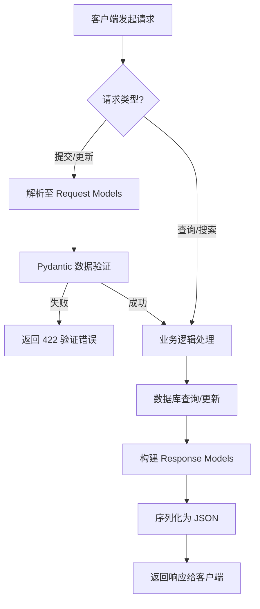

# `AutoGPT\autogpt_platform\backend\backend\api\features\store\model.py` 详细设计文档

该代码文件定义了一系列基于 Pydantic 的数据传输对象（DTO），用于规范化 Agent Store（代理商店）系统中的 API 请求与响应数据结构，涵盖了用户代理、商店上架、创作者信息、提交审核、版本控制及统一搜索等核心业务实体的数据验证与序列化。

## 整体流程



## 类结构

```
Pydantic BaseModel (根基类)
├── ChangelogEntry
├── MyAgent
├── MyAgentsResponse
├── StoreAgent
├── StoreAgentsResponse
├── StoreAgentDetails
├── Creator
├── CreatorsResponse
├── CreatorDetails
├── Profile
├── StoreSubmission
├── StoreSubmissionsResponse
├── StoreListingWithVersions
├── StoreListingsWithVersionsResponse
├── StoreSubmissionRequest
├── StoreSubmissionEditRequest
├── ProfileDetails
├── StoreReview
├── StoreReviewCreate
├── ReviewSubmissionRequest
├── UnifiedSearchResult
└── UnifiedSearchResponse
```

## 全局变量及字段


### `ChangelogEntry.version`
    
The version string of the changelog entry.

类型：`str`
    


### `ChangelogEntry.changes_summary`
    
A summary of changes in this version.

类型：`str`
    


### `ChangelogEntry.date`
    
The date and time of the changelog entry.

类型：`datetime.datetime`
    


### `MyAgent.agent_id`
    
Unique identifier for the agent.

类型：`str`
    


### `MyAgent.agent_version`
    
The version number of the agent.

类型：`int`
    


### `MyAgent.agent_name`
    
The display name of the agent.

类型：`str`
    


### `MyAgent.agent_image`
    
URL or path to the agent's image or avatar.

类型：`str | None`
    


### `MyAgent.description`
    
A description of what the agent does.

类型：`str`
    


### `MyAgent.last_edited`
    
Timestamp of the last edit to the agent.

类型：`datetime.datetime`
    


### `MyAgent.recommended_schedule_cron`
    
Recommended cron expression for scheduling the agent.

类型：`str | None`
    


### `MyAgentsResponse.agents`
    
List of agent objects.

类型：`list[MyAgent]`
    


### `MyAgentsResponse.pagination`
    
Pagination metadata for the list of agents.

类型：`Pagination`
    


### `StoreAgent.slug`
    
URL-friendly identifier for the store agent.

类型：`str`
    


### `StoreAgent.agent_name`
    
The name of the agent listed in the store.

类型：`str`
    


### `StoreAgent.agent_image`
    
URL of the agent's image.

类型：`str`
    


### `StoreAgent.creator`
    
The name of the agent's creator.

类型：`str`
    


### `StoreAgent.creator_avatar`
    
URL of the creator's avatar.

类型：`str`
    


### `StoreAgent.sub_heading`
    
A short sub-heading or tagline for the agent.

类型：`str`
    


### `StoreAgent.description`
    
Detailed description of the agent.

类型：`str`
    


### `StoreAgent.runs`
    
Number of times the agent has been run.

类型：`int`
    


### `StoreAgent.rating`
    
Average rating of the agent.

类型：`float`
    


### `StoreAgent.agent_graph_id`
    
ID of the agent graph associated with this listing.

类型：`str`
    


### `StoreAgentsResponse.agents`
    
List of store agent objects.

类型：`list[StoreAgent]`
    


### `StoreAgentsResponse.pagination`
    
Pagination metadata for the store agents list.

类型：`Pagination`
    


### `StoreAgentDetails.store_listing_version_id`
    
Unique ID for this specific version of the store listing.

类型：`str`
    


### `StoreAgentDetails.slug`
    
URL slug for the store listing.

类型：`str`
    


### `StoreAgentDetails.agent_name`
    
Name of the agent.

类型：`str`
    


### `StoreAgentDetails.agent_video`
    
URL of the video demonstrating the agent.

类型：`str`
    


### `StoreAgentDetails.agent_output_demo`
    
URL or content of an output demo.

类型：`str`
    


### `StoreAgentDetails.agent_image`
    
List of image URLs for the agent.

类型：`list[str]`
    


### `StoreAgentDetails.creator`
    
Name of the creator.

类型：`str`
    


### `StoreAgentDetails.creator_avatar`
    
URL of the creator's avatar.

类型：`str`
    


### `StoreAgentDetails.sub_heading`
    
Sub-heading for the listing.

类型：`str`
    


### `StoreAgentDetails.description`
    
Full description of the agent.

类型：`str`
    


### `StoreAgentDetails.instructions`
    
Instructions on how to use the agent.

类型：`str | None`
    


### `StoreAgentDetails.categories`
    
List of categories the agent belongs to.

类型：`list[str]`
    


### `StoreAgentDetails.runs`
    
Total run count for the agent.

类型：`int`
    


### `StoreAgentDetails.rating`
    
Average rating of the agent.

类型：`float`
    


### `StoreAgentDetails.versions`
    
List of version identifiers.

类型：`list[str]`
    


### `StoreAgentDetails.agentGraphVersions`
    
List of agent graph version identifiers.

类型：`list[str]`
    


### `StoreAgentDetails.agentGraphId`
    
ID of the agent graph.

类型：`str`
    


### `StoreAgentDetails.last_updated`
    
Timestamp of the last update.

类型：`datetime.datetime`
    


### `StoreAgentDetails.recommended_schedule_cron`
    
Recommended cron schedule for the agent.

类型：`str | None`
    


### `StoreAgentDetails.active_version_id`
    
ID of the currently active version.

类型：`str | None`
    


### `StoreAgentDetails.has_approved_version`
    
Flag indicating if there is an approved version.

类型：`bool`
    


### `StoreAgentDetails.changelog`
    
List of changelog entries for the agent.

类型：`list[ChangelogEntry] | None`
    


### `Creator.name`
    
The creator's display name.

类型：`str`
    


### `Creator.username`
    
The creator's unique username.

类型：`str`
    


### `Creator.description`
    
A short bio or description of the creator.

类型：`str`
    


### `Creator.avatar_url`
    
URL of the creator's profile picture.

类型：`str`
    


### `Creator.num_agents`
    
The number of agents created by this user.

类型：`int`
    


### `Creator.agent_rating`
    
The average rating of the creator's agents.

类型：`float`
    


### `Creator.agent_runs`
    
The total number of runs for the creator's agents.

类型：`int`
    


### `Creator.is_featured`
    
Flag indicating if the creator is featured.

类型：`bool`
    


### `CreatorsResponse.creators`
    
List of creator objects.

类型：`List[Creator]`
    


### `CreatorsResponse.pagination`
    
Pagination metadata for the creators list.

类型：`Pagination`
    


### `CreatorDetails.name`
    
The creator's display name.

类型：`str`
    


### `CreatorDetails.username`
    
The creator's unique username.

类型：`str`
    


### `CreatorDetails.description`
    
Detailed description of the creator.

类型：`str`
    


### `CreatorDetails.links`
    
List of links to the creator's profiles or websites.

类型：`list[str]`
    


### `CreatorDetails.avatar_url`
    
URL of the creator's avatar.

类型：`str`
    


### `CreatorDetails.agent_rating`
    
Average rating of the creator's agents.

类型：`float`
    


### `CreatorDetails.agent_runs`
    
Total runs of the creator's agents.

类型：`int`
    


### `CreatorDetails.top_categories`
    
List of top categories the creator contributes to.

类型：`list[str]`
    


### `Profile.name`
    
The user's profile name.

类型：`str`
    


### `Profile.username`
    
The user's unique username.

类型：`str`
    


### `Profile.description`
    
Profile description or bio.

类型：`str`
    


### `Profile.links`
    
List of user profile links.

类型：`list[str]`
    


### `Profile.avatar_url`
    
URL of the user's avatar.

类型：`str`
    


### `Profile.is_featured`
    
Whether the profile is featured.

类型：`bool`
    


### `StoreSubmission.listing_id`
    
Unique ID for the store listing.

类型：`str`
    


### `StoreSubmission.agent_id`
    
ID of the agent being submitted.

类型：`str`
    


### `StoreSubmission.agent_version`
    
Version number of the agent being submitted.

类型：`int`
    


### `StoreSubmission.name`
    
Name of the agent submission.

类型：`str`
    


### `StoreSubmission.sub_heading`
    
Sub-heading for the submission.

类型：`str`
    


### `StoreSubmission.slug`
    
URL slug for the submission.

类型：`str`
    


### `StoreSubmission.description`
    
Description of the submission.

类型：`str`
    


### `StoreSubmission.instructions`
    
Instructions for the agent.

类型：`str | None`
    


### `StoreSubmission.image_urls`
    
List of image URLs.

类型：`list[str]`
    


### `StoreSubmission.date_submitted`
    
Timestamp when the submission was created.

类型：`datetime.datetime`
    


### `StoreSubmission.status`
    
Current status of the submission.

类型：`prisma.enums.SubmissionStatus`
    


### `StoreSubmission.runs`
    
Number of runs (usage statistics).

类型：`int`
    


### `StoreSubmission.rating`
    
Rating of the submission.

类型：`float`
    


### `StoreSubmission.store_listing_version_id`
    
ID of the store listing version.

类型：`str | None`
    


### `StoreSubmission.version`
    
Actual version number from the database.

类型：`int | None`
    


### `StoreSubmission.reviewer_id`
    
ID of the reviewer who processed the submission.

类型：`str | None`
    


### `StoreSubmission.review_comments`
    
Comments visible to the creator.

类型：`str | None`
    


### `StoreSubmission.internal_comments`
    
Private notes for administrators.

类型：`str | None`
    


### `StoreSubmission.reviewed_at`
    
Timestamp when the review was completed.

类型：`datetime.datetime | None`
    


### `StoreSubmission.changes_summary`
    
Summary of changes made in this submission.

类型：`str | None`
    


### `StoreSubmission.video_url`
    
URL of a demonstration video.

类型：`str | None`
    


### `StoreSubmission.agent_output_demo_url`
    
URL of an output demonstration.

类型：`str | None`
    


### `StoreSubmission.categories`
    
List of categories associated with the submission.

类型：`list[str]`
    


### `StoreSubmissionsResponse.submissions`
    
List of store submission objects.

类型：`list[StoreSubmission]`
    


### `StoreSubmissionsResponse.pagination`
    
Pagination metadata for the submissions list.

类型：`Pagination`
    


### `StoreListingWithVersions.listing_id`
    
Unique ID of the store listing.

类型：`str`
    


### `StoreListingWithVersions.slug`
    
URL slug for the listing.

类型：`str`
    


### `StoreListingWithVersions.agent_id`
    
ID of the associated agent.

类型：`str`
    


### `StoreListingWithVersions.agent_version`
    
Version number of the agent.

类型：`int`
    


### `StoreListingWithVersions.active_version_id`
    
ID of the currently active version.

类型：`str | None`
    


### `StoreListingWithVersions.has_approved_version`
    
Whether the listing has an approved version.

类型：`bool`
    


### `StoreListingWithVersions.creator_email`
    
Email address of the creator.

类型：`str | None`
    


### `StoreListingWithVersions.latest_version`
    
The latest submission object.

类型：`StoreSubmission | None`
    


### `StoreListingWithVersions.versions`
    
List of all submission versions.

类型：`list[StoreSubmission]`
    


### `StoreListingsWithVersionsResponse.listings`
    
List of store listings with version history.

类型：`list[StoreListingWithVersions]`
    


### `StoreListingsWithVersionsResponse.pagination`
    
Pagination metadata for the listings list.

类型：`Pagination`
    


### `StoreSubmissionRequest.agent_id`
    
ID of the agent to submit.

类型：`str`
    


### `StoreSubmissionRequest.agent_version`
    
Version of the agent to submit.

类型：`int`
    


### `StoreSubmissionRequest.slug`
    
URL slug for the listing.

类型：`str`
    


### `StoreSubmissionRequest.name`
    
Name of the agent.

类型：`str`
    


### `StoreSubmissionRequest.sub_heading`
    
Sub-heading for the listing.

类型：`str`
    


### `StoreSubmissionRequest.video_url`
    
URL of the demonstration video.

类型：`str | None`
    


### `StoreSubmissionRequest.agent_output_demo_url`
    
URL of the output demonstration.

类型：`str | None`
    


### `StoreSubmissionRequest.image_urls`
    
List of image URLs.

类型：`list[str]`
    


### `StoreSubmissionRequest.description`
    
Description of the agent.

类型：`str`
    


### `StoreSubmissionRequest.instructions`
    
Usage instructions.

类型：`str | None`
    


### `StoreSubmissionRequest.categories`
    
List of categories.

类型：`list[str]`
    


### `StoreSubmissionRequest.changes_summary`
    
Summary of changes.

类型：`str | None`
    


### `StoreSubmissionRequest.recommended_schedule_cron`
    
Recommended cron schedule.

类型：`str | None`
    


### `StoreSubmissionEditRequest.name`
    
Updated name of the agent.

类型：`str`
    


### `StoreSubmissionEditRequest.sub_heading`
    
Updated sub-heading.

类型：`str`
    


### `StoreSubmissionEditRequest.video_url`
    
Updated video URL.

类型：`str | None`
    


### `StoreSubmissionEditRequest.agent_output_demo_url`
    
Updated output demo URL.

类型：`str | None`
    


### `StoreSubmissionEditRequest.image_urls`
    
Updated list of image URLs.

类型：`list[str]`
    


### `StoreSubmissionEditRequest.description`
    
Updated description.

类型：`str`
    


### `StoreSubmissionEditRequest.instructions`
    
Updated instructions.

类型：`str | None`
    


### `StoreSubmissionEditRequest.categories`
    
Updated list of categories.

类型：`list[str]`
    


### `StoreSubmissionEditRequest.changes_summary`
    
Summary of changes made in the edit.

类型：`str | None`
    


### `StoreSubmissionEditRequest.recommended_schedule_cron`
    
Updated recommended cron schedule.

类型：`str | None`
    


### `ProfileDetails.name`
    
User's name.

类型：`str`
    


### `ProfileDetails.username`
    
User's username.

类型：`str`
    


### `ProfileDetails.description`
    
User's profile description.

类型：`str`
    


### `ProfileDetails.links`
    
User's profile links.

类型：`list[str]`
    


### `ProfileDetails.avatar_url`
    
URL of the user's avatar.

类型：`str | None`
    


### `StoreReview.score`
    
The review score.

类型：`int`
    


### `StoreReview.comments`
    
Text comments for the review.

类型：`str | None`
    


### `StoreReviewCreate.store_listing_version_id`
    
ID of the store listing version being reviewed.

类型：`str`
    


### `StoreReviewCreate.score`
    
The score given in the review.

类型：`int`
    


### `StoreReviewCreate.comments`
    
Comments associated with the review.

类型：`str | None`
    


### `ReviewSubmissionRequest.store_listing_version_id`
    
ID of the submission being reviewed.

类型：`str`
    


### `ReviewSubmissionRequest.is_approved`
    
Whether the submission is approved.

类型：`bool`
    


### `ReviewSubmissionRequest.comments`
    
Comments visible to the creator.

类型：`str`
    


### `ReviewSubmissionRequest.internal_comments`
    
Internal comments for admins.

类型：`str | None`
    


### `UnifiedSearchResult.content_type`
    
Type of the content (e.g., STORE_AGENT, BLOCK).

类型：`str`
    


### `UnifiedSearchResult.content_id`
    
Unique ID of the content.

类型：`str`
    


### `UnifiedSearchResult.searchable_text`
    
Text content used for searching.

类型：`str`
    


### `UnifiedSearchResult.metadata`
    
Additional metadata about the content.

类型：`dict | None`
    


### `UnifiedSearchResult.updated_at`
    
Timestamp of last update.

类型：`datetime.datetime | None`
    


### `UnifiedSearchResult.combined_score`
    
Combined hybrid search score.

类型：`float | None`
    


### `UnifiedSearchResult.semantic_score`
    
Semantic (vector) search score.

类型：`float | None`
    


### `UnifiedSearchResult.lexical_score`
    
Lexical (keyword) search score.

类型：`float | None`
    


### `UnifiedSearchResponse.results`
    
List of unified search results.

类型：`list[UnifiedSearchResult]`
    


### `UnifiedSearchResponse.pagination`
    
Pagination metadata for search results.

类型：`Pagination`
    
    

## 全局函数及方法


## 关键组件


### Agent 核心数据模型

定义了 Agent 的核心属性与展示结构，涵盖了用户视角的 Agent、商店列表视图及详情视图，包括版本号、媒体资源、评分、运行统计及调度配置。

### 提交与审核流程模型

管理 Agent 提交至商店的完整生命周期数据结构，包含提交状态、版本详情、审核人意见（对外可见与内部备注）、审核时间戳及批准标志。

### 用户与创作者画像模型

描述用户、创作者及其公开档案的详细信息，包含头像、简介、外部链接、是否精选标识以及基于 Agent 生态的统计数据（如评分、运行次数、Agent 数量）。

### 统一搜索与发现模型

支持跨内容类型（Agent、Block、文档）的统一混合搜索结果封装，包含综合评分、语义评分、词法评分及搜索文本，用于实现内容检索功能。

### 版本控制与变更日志模型

管理 Agent 的版本历史记录与变更日志，支持多版本展示、更新摘要及版本审批状态追踪。

### 通用分页响应模型

为各类列表型 API 提供标准化的响应容器，统一集成 Pagination 组件以处理分页逻辑。


## 问题及建议


### 已知问题

-   **命名风格不统一**：代码中混合使用了 Python 风格的蛇形命名（如 `agent_name`）和 JavaScript/前端风格的驼峰命名（如 `agentGraphId`, `agentGraphVersions`）。这种不一致性违反了 PEP 8 规范，可能导致序列化/反序列化配置的混淆，并降低代码可读性。
-   **校验逻辑不一致**：`StoreSubmissionRequest` 类中对部分字段（如 `agent_id`, `agent_version`）使用了 `pydantic.Field` 进行了长度和范围约束，但 `StoreSubmissionEditRequest` 类中对应的字段（如 `name`）缺少相同的校验约束。这可能导致编辑接口接收到不符合创建规则的数据。
-   **类型安全性不足**：`UnifiedSearchResult` 类中的 `content_type` 字段被定义为普通的 `str`，其依赖注释来约束取值范围（"STORE_AGENT, BLOCK, DOCUMENTATION"）。这缺乏编译时或运行时的强类型检查，容易引发拼写错误或非法值输入。
-   **字段文档缺失**：除了 `StoreSubmissionRequest` 等少数类外，大部分类的字段缺少 `description` 描述。这限制了基于该模型自动生成 API 文档的质量和完整性。
-   **空值处理策略不统一**：在部分模型中，字符串类型的默认值混合使用了空字符串 `""`（如 `StoreSubmissionRequest` 中的 `description`）和 `None`（如 `instructions`）。这种不一致会增加业务逻辑层处理空值时的复杂度（例如判断时需同时考虑 `None` 和空串）。

### 优化建议

-   **统一命名规范并使用别名**：将所有类字段统一修改为 `snake_case` 命名（如 `agent_graph_id`），并利用 Pydantic 的 `Field(alias="...")` 或 `model_config`（Populate by name）功能来适配前端 API 期望的 `camelCase` 格式，从而保持后端代码的整洁性和规范性。
-   **引入枚举类型**：将 `UnifiedSearchResult` 中的 `content_type` 以及其他可能存在固定选项的字段定义为 `enum.Enum` 或 `Literal` 类型，以确保取值的安全性和代码的可维护性。
-   **抽取公共基类与验证器**：创建包含通用字段（如分页对象 `pagination`）或通用验证逻辑的基类（如 `BaseResponse`, `BaseAgentRequest`），或者将复用的校验逻辑抽取为 `Annotated` 类型，以消除代码重复并确保校验逻辑的一致性。
-   **完善字段描述与元数据**：为所有类的字段补充 `description` 属性，详细说明字段的业务含义、格式要求和示例值，以便于生成高质量的 OpenAPI/Swagger 文档。
-   **标准化默认值策略**：制定统一的默认值策略，建议对于非必填的字符串字段统一默认为 `None`，并在序列化时配置为 `None` 值输出为空字符串（如果前端需要），或者在业务层统一处理，避免模型层混合使用 `None` 和 `""`。


## 其它


### 设计目标与约束

本设计旨在定义一套严格的数据契约，用于规范系统内部的 Agent 商店相关数据交换。主要目标包括：

1.  **类型安全与数据完整性**：利用 Pydantic 的类型强制和验证机制，确保所有传入和传出的数据符合预期的结构和类型，减少运行时错误。
2.  **API 契约标准化**：为前端客户端和后端服务提供明确的数据结构定义，确保接口的稳定性。
3.  **业务规则内嵌**：通过 `pydantic.Field` 将基本的业务逻辑约束（如 `agent_version` 必须大于 0）内嵌在数据模型层，实现数据的自动校验。
4.  **扩展性设计**：模型设计预留了可选字段（如 `agent_image`、`instructions`），以便在不破坏现有结构的情况下支持未来的功能扩展。

**约束条件**：
*   所有模型必须继承自 `pydantic.BaseModel`。
*   日期时间字段统一使用 `datetime.datetime` 类型。
*   列表响应必须包含 `Pagination` 元数据以支持分页逻辑。
*   枚举类型必须引用自 `prisma.enums` 以保证与数据库层的一致性。

### 错误处理与异常设计

由于本模块主要由数据传输对象组成，错误处理主要集中在数据验证阶段：

1.  **验证异常**：当客户端提交的数据不符合模型定义时（例如 `agent_version` 小于等于 0，或缺少必填字段 `agent_id`），Pydantic 会自动抛出 `ValidationError`。
2.  **错误响应映射**：通常由框架中间件捕获上述 `ValidationError`，并将其转换为 HTTP 422 Unprocessable Entity 响应返回给客户端，错误详情中包含具体字段及失败原因。
3.  **类型转换异常**：对于类型不匹配的数据（如将字符串传递给整数类型），Pydantic 会尝试自动转换；若转换失败，同样触发验证错误。
4.  **空值处理**：显式定义了 `str | None` 或 `int | None` 的字段允许传递 `null` 值，未标记为 Optional 的字段若缺失则视为错误。

### 数据流与状态机

本文件定义的数据模型支撑了 Agent 商店的核心业务流程：

1.  **Agent 提交与审核流**：
    *   **初始状态**：用户创建 `StoreSubmissionRequest` 提交 Agent。
    *   **审核状态**：后台管理员通过 `ReviewSubmissionRequest` 对提交物进行审核，修改 `StoreSubmission` 中的 `status`（引用自 `prisma.enums.SubmissionStatus`）。
    *   **发布状态**：审核通过后，数据转化为 `StoreAgent` 或 `StoreAgentDetails`，在商店公开展示。
2.  **数据流转方向**：
    *   **请求流**：客户端 -> [Request Model] -> 服务层（业务逻辑）-> 数据库。
    *   **响应流**：数据库 -> 服务层 -> [Response Model] -> 客户端。
3.  **版本控制**：`StoreListingWithVersions` 和 `StoreAgentDetails` 模型暗示了版本管理机制，即 Agent 存在多个版本（`versions` 列表），但只有一个活跃版本（`active_version_id`）。

### 外部依赖与接口契约

本模块依赖于以下外部库和模块，构成了系统的接口契约基础：

1.  **`pydantic`**：
    *   **契约**：作为数据验证的核心引擎。所有模型类必须遵守 Pydantic 的序列化和反序列化规则。
    *   **版本**：暗示使用 Pydantic V2（基于 `list[Type]` 和 `|` 联合类型的语法特征）。
2.  **`prisma.enums`**：
    *   **契约**：直接引用 Prisma ORM 生成的枚举类型（如 `SubmissionStatus`），确保业务逻辑层的枚举值与数据库持久层的枚举定义严格一致，避免映射错误。
3.  **`backend.util.models.Pagination`**：
    *   **契约**：依赖内部通用模型 `Pagination`。该模块必须提供包含分页信息（如 `total`, `page`, `page_size`）的标准结构，所有列表响应模型（`*Response` 类）均嵌入此结构。
4.  **`datetime` 与 `typing`**：
    *   **契约**：使用 Python 标准库进行类型注解，确保与 Python 3.9+ 的类型系统兼容。

    