# `.\AutoGPT\autogpt_platform\backend\backend\api\features\store\model_test.py` 详细设计文档

This code defines a set of classes and functions for managing store agents, creators, and submissions, including pagination and response objects.

## 整体流程

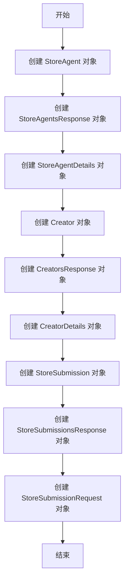

## 类结构

```
store_model (模块)
├── Pagination (类)
│   ├── total_items (字段)
│   ├── total_pages (字段)
│   ├── current_page (字段)
│   └── page_size (字段)
├── StoreAgent (类)
│   ├── slug (字段)
│   ├── agent_name (字段)
│   ├── agent_image (字段)
│   ├── creator (字段)
│   ├── creator_avatar (字段)
│   ├── sub_heading (字段)
│   ├── description (字段)
│   ├── runs (字段)
│   ├── rating (字段)
│   └── agent_graph_id (字段)
├── StoreAgentsResponse (类)
│   ├── agents (字段)
│   └── pagination (字段)
├── StoreAgentDetails (类)
│   ├── store_listing_version_id (字段)
│   ├── slug (字段)
│   ├── agent_name (字段)
│   ├── agent_video (字段)
│   ├── agent_output_demo (字段)
│   ├── agent_image (字段)
│   ├── creator (字段)
│   ├── creator_avatar (字段)
│   ├── sub_heading (字段)
│   ├── description (字段)
│   ├── categories (字段)
│   ├── runs (字段)
│   ├── rating (字段)
│   ├── versions (字段)
│   ├── agentGraphVersions (字段)
│   └── agentGraphId (字段)
├── Creator (类)
│   ├── agent_rating (字段)
│   ├── agent_runs (字段)
│   ├── name (字段)
│   ├── username (字段)
│   ├── description (字段)
│   ├── avatar_url (字段)
│   ├── num_agents (字段)
│   └── is_featured (字段)
├── CreatorsResponse (类)
│   ├── creators (字段)
│   └── pagination (字段)
├── CreatorDetails (类)
│   ├── name (字段)
│   ├── username (字段)
│   ├── description (字段)
│   ├── links (字段)
│   ├── avatar_url (字段)
│   ├── agent_rating (字段)
│   ├── agent_runs (字段)
│   └── top_categories (字段)
├── StoreSubmission (类)
│   ├── listing_id (字段)
│   ├── agent_id (字段)
│   ├── agent_version (字段)
│   ├── sub_heading (字段)
│   ├── name (字段)
│   ├── slug (字段)
│   ├── description (字段)
│   ├── image_urls (字段)
│   ├── date_submitted (字段)
│   ├── status (字段)
│   ├── runs (字段)
│   └── rating (字段)
├── StoreSubmissionsResponse (类)
│   ├── submissions (字段)
│   └── pagination (字段)
└── StoreSubmissionRequest (类)
    ├── agent_id (字段)
    ├── agent_version (字段)
    ├── slug (字段)
    ├── name (字段)
    ├── sub_heading (字段)
    ├── video_url (字段)
    ├── image_urls (字段)
    ├── description (字段)
    └── categories (字段)
```

## 全局变量及字段


### `Pagination.total_items`
    
Total number of items in the collection.

类型：`int`
    


### `Pagination.total_pages`
    
Total number of pages in the collection.

类型：`int`
    


### `Pagination.current_page`
    
The current page number.

类型：`int`
    


### `Pagination.page_size`
    
The number of items per page.

类型：`int`
    


### `StoreAgent.slug`
    
Unique identifier for the store agent.

类型：`str`
    


### `StoreAgent.agent_name`
    
Name of the store agent.

类型：`str`
    


### `StoreAgent.agent_image`
    
Image URL for the store agent.

类型：`str`
    


### `StoreAgent.creator`
    
Creator of the store agent.

类型：`str`
    


### `StoreAgent.creator_avatar`
    
Avatar URL of the creator.

类型：`str`
    


### `StoreAgent.sub_heading`
    
Subheading for the store agent description.

类型：`str`
    


### `StoreAgent.description`
    
Description of the store agent.

类型：`str`
    


### `StoreAgent.runs`
    
Number of runs for the store agent.

类型：`int`
    


### `StoreAgent.rating`
    
Rating of the store agent.

类型：`float`
    


### `StoreAgent.agent_graph_id`
    
Graph ID associated with the store agent.

类型：`str`
    


### `StoreAgentsResponse.agents`
    
List of store agents in the response.

类型：`list`
    


### `StoreAgentsResponse.pagination`
    
Pagination information for the store agents.

类型：`Pagination`
    


### `StoreAgentDetails.store_listing_version_id`
    
Version ID of the store listing.

类型：`str`
    


### `StoreAgentDetails.agent_video`
    
Video URL for the store agent.

类型：`str`
    


### `StoreAgentDetails.agent_output_demo`
    
Output demo URL for the store agent.

类型：`str`
    


### `StoreAgentDetails.agent_image`
    
List of image URLs for the store agent.

类型：`list`
    


### `StoreAgentDetails.creator`
    
Creator of the store agent.

类型：`str`
    


### `StoreAgentDetails.creator_avatar`
    
Avatar URL of the creator.

类型：`str`
    


### `StoreAgentDetails.sub_heading`
    
Subheading for the store agent description.

类型：`str`
    


### `StoreAgentDetails.description`
    
Description of the store agent.

类型：`str`
    


### `StoreAgentDetails.categories`
    
List of categories associated with the store agent.

类型：`list`
    


### `StoreAgentDetails.versions`
    
List of versions associated with the store agent.

类型：`list`
    


### `StoreAgentDetails.agentGraphVersions`
    
List of graph versions associated with the store agent.

类型：`list`
    


### `StoreAgentDetails.agentGraphId`
    
Graph ID associated with the store agent.

类型：`str`
    


### `StoreAgentDetails.last_updated`
    
Last updated timestamp for the store agent details.

类型：`datetime`
    


### `Creator.agent_rating`
    
Rating of the creator's agents.

类型：`float`
    


### `Creator.agent_runs`
    
Number of runs for the creator's agents.

类型：`int`
    


### `Creator.name`
    
Name of the creator.

类型：`str`
    


### `Creator.username`
    
Username of the creator.

类型：`str`
    


### `Creator.description`
    
Description of the creator.

类型：`str`
    


### `Creator.avatar_url`
    
Avatar URL of the creator.

类型：`str`
    


### `Creator.num_agents`
    
Number of agents created by the creator.

类型：`int`
    


### `Creator.is_featured`
    
Flag indicating if the creator is featured.

类型：`bool`
    


### `CreatorsResponse.creators`
    
List of creators in the response.

类型：`list`
    


### `CreatorsResponse.pagination`
    
Pagination information for the creators.

类型：`Pagination`
    


### `CreatorDetails.name`
    
Name of the creator.

类型：`str`
    


### `CreatorDetails.username`
    
Username of the creator.

类型：`str`
    


### `CreatorDetails.description`
    
Description of the creator.

类型：`str`
    


### `CreatorDetails.links`
    
List of links associated with the creator.

类型：`list`
    


### `CreatorDetails.avatar_url`
    
Avatar URL of the creator.

类型：`str`
    


### `CreatorDetails.agent_rating`
    
Rating of the creator's agents.

类型：`float`
    


### `CreatorDetails.agent_runs`
    
Number of runs for the creator's agents.

类型：`int`
    


### `CreatorDetails.top_categories`
    
List of top categories associated with the creator's agents.

类型：`list`
    


### `StoreSubmission.listing_id`
    
ID of the store listing.

类型：`str`
    


### `StoreSubmission.agent_id`
    
ID of the store agent.

类型：`str`
    


### `StoreSubmission.agent_version`
    
Version of the store agent.

类型：`int`
    


### `StoreSubmission.sub_heading`
    
Subheading for the store submission.

类型：`str`
    


### `StoreSubmission.name`
    
Name of the store submission.

类型：`str`
    


### `StoreSubmission.slug`
    
Unique identifier for the store submission.

类型：`str`
    


### `StoreSubmission.description`
    
Description of the store submission.

类型：`str`
    


### `StoreSubmission.image_urls`
    
List of image URLs for the store submission.

类型：`list`
    


### `StoreSubmission.date_submitted`
    
Date and time when the store submission was submitted.

类型：`datetime`
    


### `StoreSubmission.status`
    
Status of the store submission.

类型：`prisma.enums.SubmissionStatus`
    


### `StoreSubmission.runs`
    
Number of runs for the store submission.

类型：`int`
    


### `StoreSubmission.rating`
    
Rating of the store submission.

类型：`float`
    


### `StoreSubmissionsResponse.submissions`
    
List of store submissions in the response.

类型：`list`
    


### `StoreSubmissionsResponse.pagination`
    
Pagination information for the store submissions.

类型：`Pagination`
    


### `StoreSubmissionRequest.agent_id`
    
ID of the store agent.

类型：`str`
    


### `StoreSubmissionRequest.agent_version`
    
Version of the store agent.

类型：`int`
    


### `StoreSubmissionRequest.slug`
    
Unique identifier for the store submission.

类型：`str`
    


### `StoreSubmissionRequest.name`
    
Name of the store submission.

类型：`str`
    


### `StoreSubmissionRequest.sub_heading`
    
Subheading for the store submission.

类型：`str`
    


### `StoreSubmissionRequest.video_url`
    
Video URL for the store submission.

类型：`str`
    


### `StoreSubmissionRequest.image_urls`
    
List of image URLs for the store submission.

类型：`list`
    


### `StoreSubmissionRequest.description`
    
Description of the store submission.

类型：`str`
    


### `StoreSubmissionRequest.categories`
    
List of categories associated with the store submission.

类型：`list`
    
    

## 全局函数及方法


### test_pagination

测试分页功能，确保分页对象属性设置正确。

参数：

- 无

返回值：无

#### 流程图

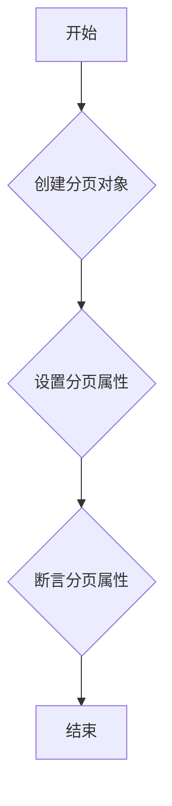

#### 带注释源码

```python
def test_pagination():
    # 创建分页对象
    pagination = store_model.Pagination(
        total_items=100, total_pages=5, current_page=2, page_size=20
    )
    # 断言分页属性
    assert pagination.total_items == 100
    assert pagination.total_pages == 5
    assert pagination.current_page == 2
    assert pagination.page_size == 20
``` 


### test_store_agent

创建一个 StoreAgent 对象并验证其属性。

参数：

- `slug`：`str`，StoreAgent 的唯一标识符。
- `agent_name`：`str`，StoreAgent 的名称。
- `agent_image`：`str`，StoreAgent 的图片链接。
- `creator`：`str`，创建 StoreAgent 的用户名。
- `creator_avatar`：`str`，创建 StoreAgent 的用户头像链接。
- `sub_heading`：`str`，StoreAgent 的副标题。
- `description`：`str`，StoreAgent 的描述。
- `runs`：`int`，StoreAgent 的运行次数。
- `rating`：`float`，StoreAgent 的评分。
- `agent_graph_id`：`str`，StoreAgent 的图形 ID。

返回值：无

#### 流程图

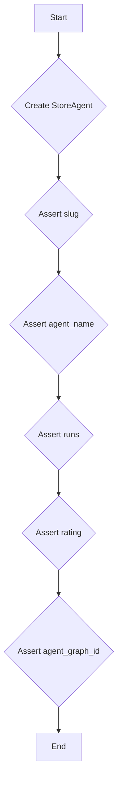

#### 带注释源码

```python
def test_store_agent():
    agent = store_model.StoreAgent(
        slug="test-agent",
        agent_name="Test Agent",
        agent_image="test.jpg",
        creator="creator1",
        creator_avatar="avatar.jpg",
        sub_heading="Test subheading",
        description="Test description",
        runs=50,
        rating=4.5,
        agent_graph_id="test-graph-id",
    )
    assert agent.slug == "test-agent"
    assert agent.agent_name == "Test Agent"
    assert agent.runs == 50
    assert agent.rating == 4.5
    assert agent.agent_graph_id == "test-graph-id"
```


### test_store_agents_response

This function tests the `StoreAgentsResponse` object to ensure that it correctly initializes and validates the response data.

参数：

- `response`：`store_model.StoreAgentsResponse`，The `StoreAgentsResponse` object to be tested.

返回值：`None`，This function does not return any value.

#### 流程图

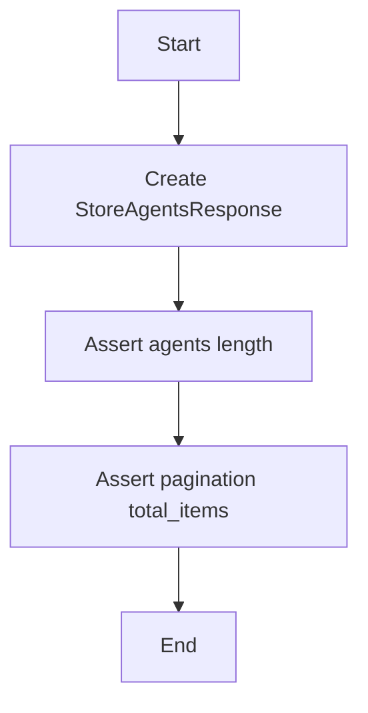

#### 带注释源码

```python
def test_store_agents_response():
    response = store_model.StoreAgentsResponse(
        agents=[
            store_model.StoreAgent(
                slug="test-agent",
                agent_name="Test Agent",
                agent_image="test.jpg",
                creator="creator1",
                creator_avatar="avatar.jpg",
                sub_heading="Test subheading",
                description="Test description",
                runs=50,
                rating=4.5,
                agent_graph_id="test-graph-id",
            )
        ],
        pagination=store_model.Pagination(
            total_items=1, total_pages=1, current_page=1, page_size=20
        ),
    )
    assert len(response.agents) == 1
    assert response.pagination.total_items == 1
```


### test_store_agent_details

This function tests the `StoreAgentDetails` object by creating an instance with various attributes and asserting that the values are set correctly.

参数：

- `details`：`store_model.StoreAgentDetails`，The `StoreAgentDetails` object to be tested.

返回值：无

#### 流程图

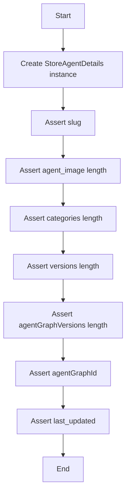

#### 带注释源码

```python
def test_store_agent_details():
    # Create StoreAgentDetails instance
    details = store_model.StoreAgentDetails(
        store_listing_version_id="version123",
        slug="test-agent",
        agent_name="Test Agent",
        agent_video="video.mp4",
        agent_output_demo="demo.mp4",
        agent_image=["image1.jpg", "image2.jpg"],
        creator="creator1",
        creator_avatar="avatar.jpg",
        sub_heading="Test subheading",
        description="Test description",
        categories=["cat1", "cat2"],
        runs=50,
        rating=4.5,
        versions=["1.0", "2.0"],
        agentGraphVersions=["1", "2"],
        agentGraphId="test-graph-id",
        last_updated=datetime.datetime.now(),
    )
    
    # Assert slug
    assert details.slug == "test-agent"
    
    # Assert agent_image length
    assert len(details.agent_image) == 2
    
    # Assert categories length
    assert len(details.categories) == 2
    
    # Assert versions length
    assert len(details.versions) == 2
    
    # Assert agentGraphVersions length
    assert len(details.agentGraphVersions) == 2
    
    # Assert agentGraphId
    assert details.agentGraphId == "test-graph-id"
    
    # Assert last_updated
    assert details.last_updated is not None
``` 


### test_creator

创建一个`Creator`对象并验证其属性。

参数：

- `agent_rating`：`float`，代理评分
- `agent_runs`：`int`，代理运行次数
- `name`：`str`，创建者名称
- `username`：`str`，创建者用户名
- `description`：`str`，创建者描述
- `avatar_url`：`str`，创建者头像URL
- `num_agents`：`int`，创建者拥有的代理数量
- `is_featured`：`bool`，是否为特色创建者

返回值：`None`，无返回值

#### 流程图

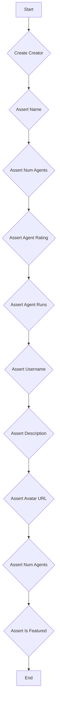

#### 带注释源码

```python
def test_creator():
    creator = store_model.Creator(
        agent_rating=4.8,
        agent_runs=1000,
        name="Test Creator",
        username="creator1",
        description="Test description",
        avatar_url="avatar.jpg",
        num_agents=5,
        is_featured=False,
    )
    assert creator.name == "Test Creator"
    assert creator.num_agents == 5
    assert creator.agent_rating == 4.8
    assert creator.agent_runs == 1000
    assert creator.username == "creator1"
    assert creator.description == "Test description"
    assert creator.avatar_url == "avatar.jpg"
    assert creator.is_featured == False
``` 


### test_creators_response

This function tests the `CreatorsResponse` object, which is a response model containing a list of creators and pagination information.

参数：

- `response`：`store_model.CreatorsResponse`，The `CreatorsResponse` object to be tested.

返回值：`None`，This function does not return any value.

#### 流程图

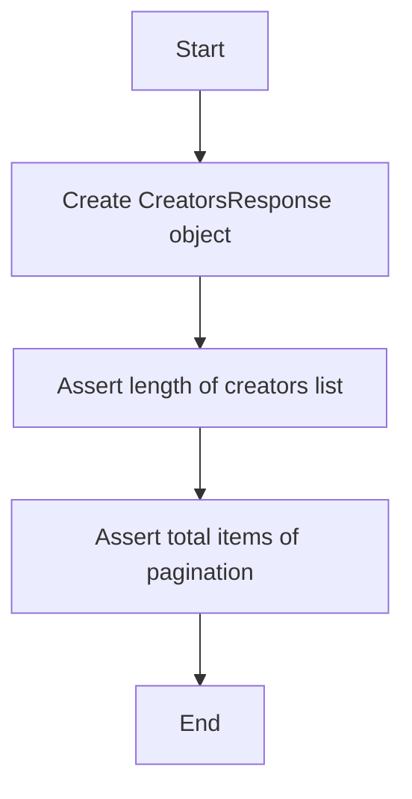

#### 带注释源码

```python
def test_creators_response():
    response = store_model.CreatorsResponse(
        creators=[
            store_model.Creator(
                agent_rating=4.8,
                agent_runs=1000,
                name="Test Creator",
                username="creator1",
                description="Test description",
                avatar_url="avatar.jpg",
                num_agents=5,
                is_featured=False,
            )
        ],
        pagination=store_model.Pagination(
            total_items=1, total_pages=1, current_page=1, page_size=20
        ),
    )
    assert len(response.creators) == 1
    assert response.pagination.total_items == 1
```


### test_creator_details

This function tests the creation of a `CreatorDetails` object and asserts its properties.

参数：

- `details`：`store_model.CreatorDetails`，The `CreatorDetails` object to be tested.

返回值：`None`，No return value.

#### 流程图

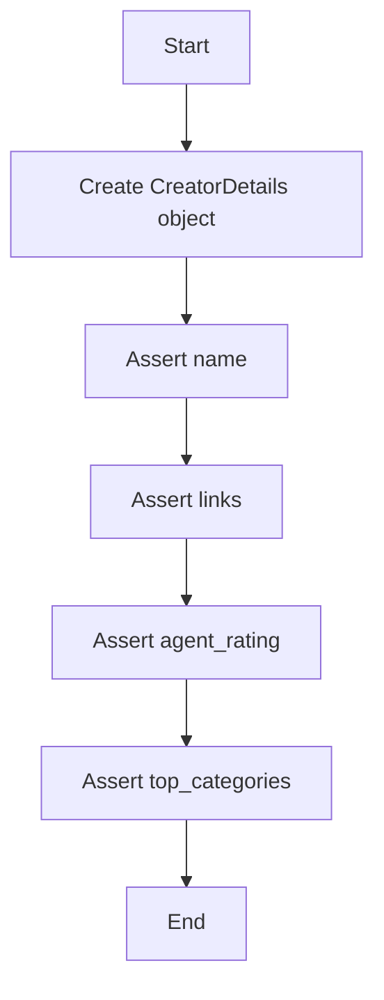

#### 带注释源码

```python
def test_creator_details():
    details = store_model.CreatorDetails(
        name="Test Creator",
        username="creator1",
        description="Test description",
        links=["link1.com", "link2.com"],
        avatar_url="avatar.jpg",
        agent_rating=4.8,
        agent_runs=1000,
        top_categories=["cat1", "cat2"],
    )
    assert details.name == "Test Creator"
    assert len(details.links) == 2
    assert details.agent_rating == 4.8
    assert len(details.top_categories) == 2
``` 


### test_store_submission

This function tests the creation and validation of a `StoreSubmission` object.

参数：

- `submission`: `store_model.StoreSubmission`，A `StoreSubmission` object to be tested.

返回值：`None`，No return value, the function asserts the correctness of the `StoreSubmission` object.

#### 流程图

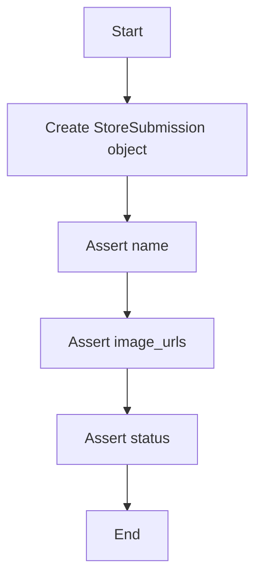

#### 带注释源码

```python
def test_store_submission():
    submission = store_model.StoreSubmission(
        listing_id="listing123",
        agent_id="agent123",
        agent_version=1,
        sub_heading="Test subheading",
        name="Test Agent",
        slug="test-agent",
        description="Test description",
        image_urls=["image1.jpg", "image2.jpg"],
        date_submitted=datetime.datetime(2023, 1, 1),
        status=prisma.enums.SubmissionStatus.PENDING,
        runs=50,
        rating=4.5,
    )
    assert submission.name == "Test Agent"
    assert len(submission.image_urls) == 2
    assert submission.status == prisma.enums.SubmissionStatus.PENDING
```


### test_store_submissions_response

This function tests the `StoreSubmissionsResponse` object, which is used to represent a response containing a list of submissions and pagination information.

参数：

- `response`：`store_model.StoreSubmissionsResponse`，The `StoreSubmissionsResponse` object to be tested.

返回值：无，This function does not return any value. It only asserts the correctness of the `StoreSubmissionsResponse` object.

#### 流程图

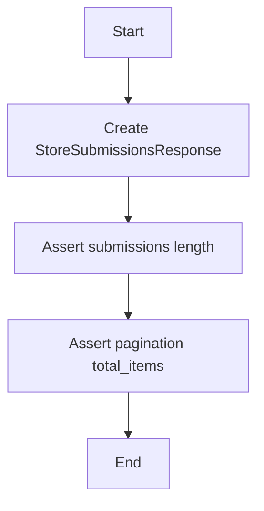

#### 带注释源码

```python
def test_store_submissions_response():
    response = store_model.StoreSubmissionsResponse(
        submissions=[
            store_model.StoreSubmission(
                listing_id="listing123",
                agent_id="agent123",
                agent_version=1,
                sub_heading="Test subheading",
                name="Test Agent",
                slug="test-agent",
                description="Test description",
                image_urls=["image1.jpg"],
                date_submitted=datetime.datetime(2023, 1, 1),
                status=prisma.enums.SubmissionStatus.PENDING,
                runs=50,
                rating=4.5,
            )
        ],
        pagination=store_model.Pagination(
            total_items=1, total_pages=1, current_page=1, page_size=20
        ),
    )
    assert len(response.submissions) == 1
    assert response.pagination.total_items == 1
``` 


### test_store_submission_request

测试存储提交请求的功能。

参数：

- `agent_id`：`str`，提交请求的代理ID。
- `agent_version`：`int`，提交请求的代理版本。
- `slug`：`str`，提交请求的代理别名。
- `name`：`str`，提交请求的代理名称。
- `sub_heading`：`str`，提交请求的副标题。
- `video_url`：`str`，提交请求的视频URL。
- `image_urls`：`list`，提交请求的图片URL列表。
- `description`：`str`，提交请求的描述。
- `categories`：`list`，提交请求的分类列表。

返回值：无

#### 流程图

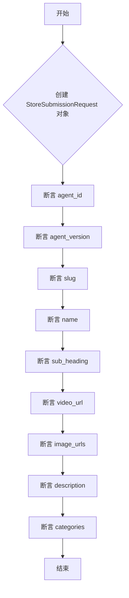

#### 带注释源码

```python
def test_store_submission_request():
    request = store_model.StoreSubmissionRequest(
        agent_id="agent123",
        agent_version=1,
        slug="test-agent",
        name="Test Agent",
        sub_heading="Test subheading",
        video_url="video.mp4",
        image_urls=["image1.jpg", "image2.jpg"],
        description="Test description",
        categories=["cat1", "cat2"],
    )
    assert request.agent_id == "agent123"
    assert request.agent_version == 1
    assert len(request.image_urls) == 2
    assert len(request.categories) == 2
``` 


## 关键组件


### 张量索引与惰性加载

张量索引与惰性加载是代码中处理数据访问和存储的关键组件，用于高效地访问和更新大型数据集，同时减少内存消耗。

### 反量化支持

反量化支持是代码中用于处理量化数据的关键组件，它允许对量化数据进行反量化操作，以便进行更精确的数据处理和分析。

### 量化策略

量化策略是代码中用于处理量化数据的关键组件，它定义了如何将浮点数数据转换为低精度表示，以减少内存和计算需求。


## 问题及建议


### 已知问题

-   **全局变量和函数缺失**：代码中未定义任何全局变量或函数，这可能导致代码的可重用性和模块化程度较低。
-   **测试用例的覆盖率**：虽然代码中包含了一些测试用例，但可能没有覆盖所有可能的边界情况和异常情况。
-   **代码复用性**：代码中存在重复的构造函数调用和断言，这可以通过抽象和封装来提高代码的复用性。

### 优化建议

-   **引入全局变量和函数**：根据需要引入全局变量和函数，以提高代码的可重用性和模块化。
-   **增加测试用例**：增加更多的测试用例，包括边界情况和异常情况，以确保代码的健壮性。
-   **代码重构**：重构代码，减少重复的构造函数调用和断言，提高代码的复用性和可读性。
-   **使用设计模式**：考虑使用设计模式，如工厂模式或单例模式，来管理对象的创建和生命周期。
-   **日志记录**：引入日志记录机制，以便于调试和监控应用程序的运行状态。
-   **异常处理**：改进异常处理机制，确保在发生错误时能够优雅地处理异常，并提供有用的错误信息。
-   **代码审查**：定期进行代码审查，以确保代码质量并遵循最佳实践。


## 其它


### 设计目标与约束

- 设计目标：确保代码的可读性、可维护性和可扩展性。
- 约束条件：遵循Python编程规范，使用Prisma ORM进行数据库操作。

### 错误处理与异常设计

- 使用try-except语句捕获和处理可能出现的异常。
- 定义自定义异常类，以便更清晰地表示错误情况。

### 数据流与状态机

- 数据流：数据从用户输入到数据库存储的过程。
- 状态机：定义对象的状态转换逻辑，例如提交状态的变化。

### 外部依赖与接口契约

- 外部依赖：Prisma ORM、datetime模块。
- 接口契约：定义与外部系统交互的接口规范。

### 测试用例

- 测试用例：确保代码按照预期工作，包括单元测试和集成测试。

### 性能优化

- 性能优化：分析代码性能瓶颈，进行优化。

### 安全性

- 安全性：确保代码的安全性，防止SQL注入等安全漏洞。

### 代码风格与规范

- 代码风格：遵循PEP 8编程规范。
- 规范：使用适当的命名约定和代码组织结构。

### 文档与注释

- 文档：编写详细的文档，包括设计文档、用户手册和API文档。
- 注释：在代码中添加必要的注释，提高代码可读性。

### 代码复用

- 代码复用：提取可复用的代码片段，提高代码质量。

### 代码审查

- 代码审查：定期进行代码审查，确保代码质量。

### 版本控制

- 版本控制：使用Git进行版本控制，确保代码的可追踪性和可回滚性。

### 部署与维护

- 部署：定义部署流程，确保代码顺利部署到生产环境。
- 维护：定期进行代码维护，修复bug和优化性能。


    