# `.\AutoGPT\autogpt_platform\backend\backend\api\features\store\routes.py` 详细设计文档

This code defines a FastAPI application that provides endpoints for managing user profiles, agents, creators, and store submissions. It includes functionalities for retrieving, updating, and searching for profiles, agents, and creators, as well as handling submissions and cache metrics.

## 整体流程

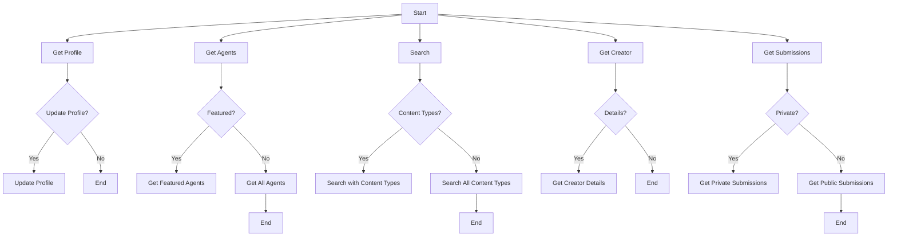

## 类结构

```
FastAPI Application (Main)
├── Profile Endpoints
│   ├── get_profile
│   └── update_or_create_profile
├── Agent Endpoints
│   ├── get_agents
│   ├── get_agent
│   ├── get_graph_meta_by_store_listing_version_id
│   └── get_store_agent
├── Search Endpoints
│   ├── unified_search
│   └── create_review
├── Creator Endpoints
│   ├── get_creators
│   └── get_creator
├── Store Submissions Endpoints
│   ├── get_my_agents
│   ├── delete_submission
│   ├── get_submissions
│   ├── create_submission
│   ├── edit_submission
│   ├── upload_submission_media
│   └── generate_image
└── Cache Management Endpoints
    └── get_cache_metrics
```

## 全局变量及字段


### `logger`
    
Logger instance for logging messages.

类型：`logging.Logger`
    


### `router`
    
FastAPI router for defining endpoints.

类型：`fastapi.APIRouter`
    


### `store_cache`
    
Module containing cache related functions.

类型：`module`
    


### `store_db`
    
Module containing database related functions.

类型：`module`
    


### `store_hybrid_search`
    
Module containing hybrid search related functions.

类型：`module`
    


### `store_image_gen`
    
Module containing image generation related functions.

类型：`module`
    


### `store_media`
    
Module containing media related functions.

类型：`module`
    


### `store_model`
    
Module containing data models for the store.

类型：`module`
    


### `ProfileDetails`
    
Model for user profile details.

类型：`store_model.ProfileDetails`
    


### `CreatorDetails`
    
Model for creator details.

类型：`store_model.CreatorDetails`
    


### `StoreAgentsResponse`
    
Model for store agents response.

类型：`store_model.StoreAgentsResponse`
    


### `UnifiedSearchResponse`
    
Model for unified search response.

类型：`store_model.UnifiedSearchResponse`
    


### `StoreReview`
    
Model for store review.

类型：`store_model.StoreReview`
    


### `CreatorsResponse`
    
Model for creators response.

类型：`store_model.CreatorsResponse`
    


### `MyAgentsResponse`
    
Model for my agents response.

类型：`store_model.MyAgentsResponse`
    


### `StoreSubmissionsResponse`
    
Model for store submissions response.

类型：`store_model.StoreSubmissionsResponse`
    


### `StoreSubmission`
    
Model for store submission.

类型：`store_model.StoreSubmission`
    


### `StoreSubmissionRequest`
    
Model for store submission request.

类型：`store_model.StoreSubmissionRequest`
    


### `StoreSubmissionEditRequest`
    
Model for store submission edit request.

类型：`store_model.StoreSubmissionEditRequest`
    


### `ProfileDetails.name`
    
Name of the profile.

类型：`str`
    


### `ProfileDetails.fields`
    
List of fields in the profile.

类型：`list`
    


### `ProfileDetails.methods`
    
List of methods in the profile.

类型：`list`
    


### `CreatorDetails.name`
    
Name of the creator.

类型：`str`
    


### `CreatorDetails.fields`
    
List of fields in the creator details.

类型：`list`
    


### `CreatorDetails.methods`
    
List of methods in the creator details.

类型：`list`
    


### `StoreAgentsResponse.name`
    
Name of the store agents response.

类型：`str`
    


### `StoreAgentsResponse.fields`
    
List of fields in the store agents response.

类型：`list`
    


### `StoreAgentsResponse.methods`
    
List of methods in the store agents response.

类型：`list`
    


### `UnifiedSearchResponse.name`
    
Name of the unified search response.

类型：`str`
    


### `UnifiedSearchResponse.fields`
    
List of fields in the unified search response.

类型：`list`
    


### `UnifiedSearchResponse.methods`
    
List of methods in the unified search response.

类型：`list`
    


### `StoreReview.name`
    
Name of the store review.

类型：`str`
    


### `StoreReview.fields`
    
List of fields in the store review.

类型：`list`
    


### `StoreReview.methods`
    
List of methods in the store review.

类型：`list`
    


### `CreatorsResponse.name`
    
Name of the creators response.

类型：`str`
    


### `CreatorsResponse.fields`
    
List of fields in the creators response.

类型：`list`
    


### `CreatorsResponse.methods`
    
List of methods in the creators response.

类型：`list`
    


### `MyAgentsResponse.name`
    
Name of the my agents response.

类型：`str`
    


### `MyAgentsResponse.fields`
    
List of fields in the my agents response.

类型：`list`
    


### `MyAgentsResponse.methods`
    
List of methods in the my agents response.

类型：`list`
    


### `StoreSubmissionsResponse.name`
    
Name of the store submissions response.

类型：`str`
    


### `StoreSubmissionsResponse.fields`
    
List of fields in the store submissions response.

类型：`list`
    


### `StoreSubmissionsResponse.methods`
    
List of methods in the store submissions response.

类型：`list`
    


### `StoreSubmission.name`
    
Name of the store submission.

类型：`str`
    


### `StoreSubmission.fields`
    
List of fields in the store submission.

类型：`list`
    


### `StoreSubmission.methods`
    
List of methods in the store submission.

类型：`list`
    


### `StoreSubmissionRequest.name`
    
Name of the store submission request.

类型：`str`
    


### `StoreSubmissionRequest.fields`
    
List of fields in the store submission request.

类型：`list`
    


### `StoreSubmissionRequest.methods`
    
List of methods in the store submission request.

类型：`list`
    


### `StoreSubmissionEditRequest.name`
    
Name of the store submission edit request.

类型：`str`
    


### `StoreSubmissionEditRequest.fields`
    
List of fields in the store submission edit request.

类型：`list`
    


### `StoreSubmissionEditRequest.methods`
    
List of methods in the store submission edit request.

类型：`list`
    
    

## 全局函数及方法

### `{get_profile}`

Get the profile details for the authenticated user.

参数：

- `user_id`：`str`，The ID of the authenticated user

返回值：`store_model.ProfileDetails`，The profile details of the authenticated user

#### 流程图

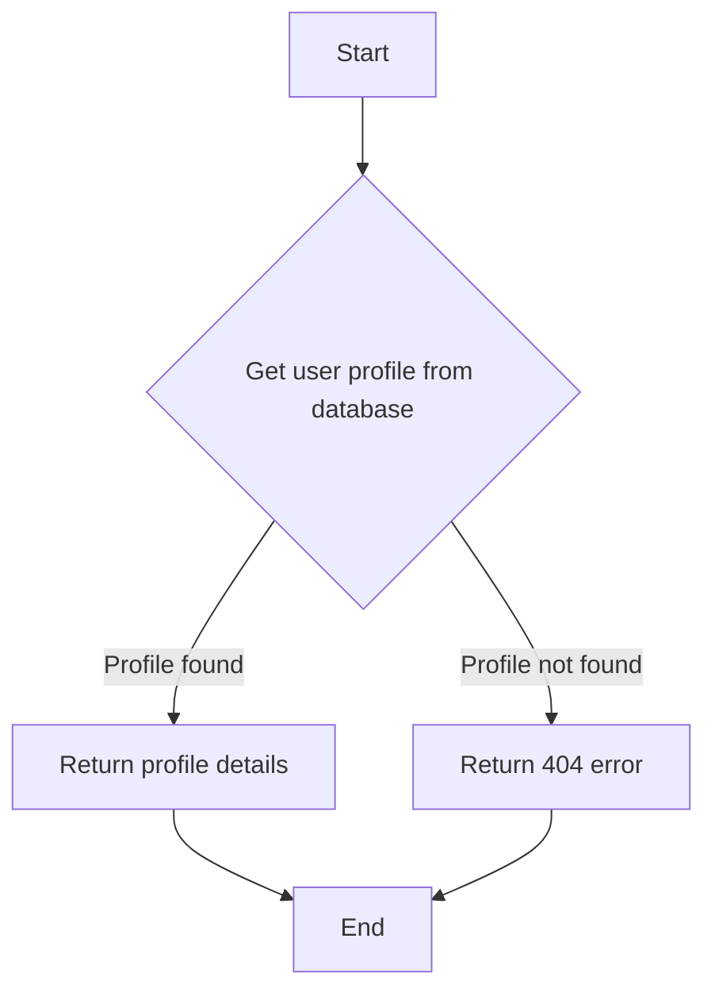

#### 带注释源码

```python
@router.get(
    "/profile",
    summary="Get user profile",
    tags=["store", "private"],
    dependencies=[fastapi.Security(autogpt_libs.auth.requires_user)],
    response_model=store_model.ProfileDetails,
)
async def get_profile(
    user_id: str = fastapi.Security(autogpt_libs.auth.get_user_id),
):
    """
    Get the profile details for the authenticated user.
    Cached for 1 hour per user.
    """
    profile = await store_db.get_user_profile(user_id)
    if profile is None:
        return fastapi.responses.JSONResponse(
            status_code=404,
            content={"detail": "Profile not found"},
        )
    return profile
```

### `{update_or_create_profile}`

Update the store profile for the authenticated user.

参数：

- `profile`：`store_model.Profile`，The updated profile details
- `user_id`：`str`，ID of the authenticated user

返回值：`store_model.CreatorDetails`，The updated profile

#### 流程图

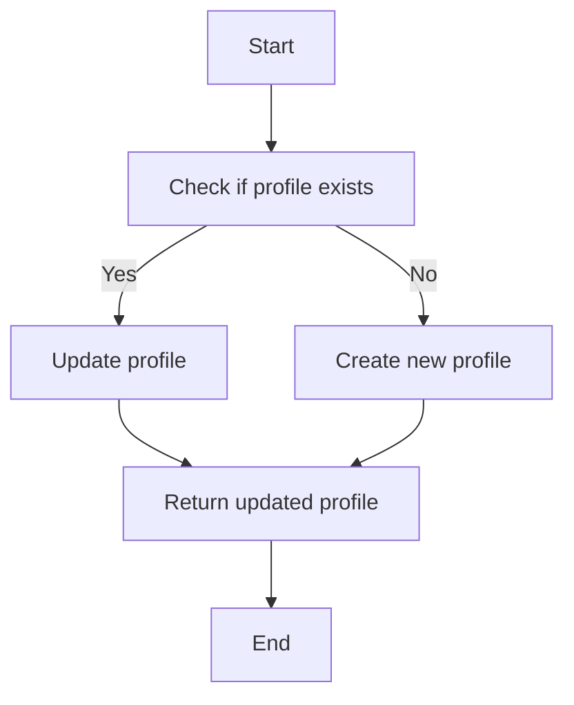

#### 带注释源码

```python
@router.post(
    "/profile",
    summary="Update user profile",
    tags=["store", "private"],
    dependencies=[fastapi.Security(autogpt_libs.auth.requires_user)],
    response_model=store_model.CreatorDetails,
)
async def update_or_create_profile(
    profile: store_model.Profile,
    user_id: str = fastapi.Security(autogpt_libs.auth.get_user_id),
):
    """
    Update the store profile for the authenticated user.

    Args:
        profile (Profile): The updated profile details
        user_id (str): ID of the authenticated user

    Returns:
        CreatorDetails: The updated profile

    Raises:
        HTTPException: If there is an error updating the profile
    """
    updated_profile = await store_db.update_profile(user_id=user_id, profile=profile)
    return updated_profile
```

### `{get_agents}`

Get a paginated list of agents from the store with optional filtering and sorting.

参数：

- `featured`：`bool`，Filter to only show featured agents. Defaults to False.
- `creator`：`str | None`，Filter agents by creator username. Defaults to None.
- `sorted_by`：`Literal["rating", "runs", "name", "updated_at"] | None`，Sort agents by "runs" or "rating". Defaults to None.
- `search_query`：`str | None`，Search agents by name, subheading and description. Defaults to None.
- `category`：`str | None`，Filter agents by category. Defaults to None.
- `page`：`int`，Page number for pagination. Defaults to 1.
- `page_size`：`int`，Number of agents per page. Defaults to 20.

返回值：`StoreAgentsResponse`，Paginated list of agents matching the filters

#### 流程图

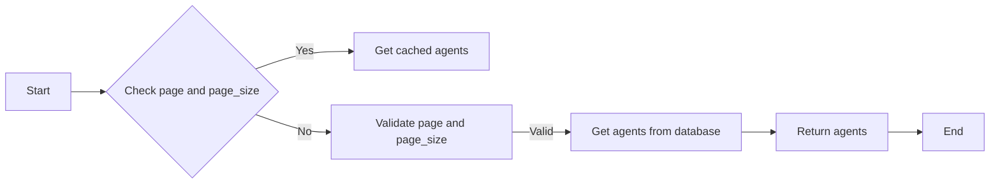

#### 带注释源码

```python
@router.get(
    "/agents",
    summary="List store agents",
    tags=["store", "public"],
    response_model=store_model.StoreAgentsResponse,
)
async def get_agents(
    featured: bool = False,
    creator: str | None = None,
    sorted_by: Literal["rating", "runs", "name", "updated_at"] | None = None,
    search_query: str | None = None,
    category: str | None = None,
    page: int = 1,
    page_size: int = 20,
):
    """
    Get a paginated list of agents from the store with optional filtering and sorting.

    Args:
        featured (bool, optional): Filter to only show featured agents. Defaults to False.
        creator (str | None, optional): Filter agents by creator username. Defaults to None.
        sorted_by (str | None, optional): Sort agents by "runs" or "rating". Defaults to None.
        search_query (str | None, optional): Search agents by name, subheading and description. Defaults to None.
        category (str | None, optional): Filter agents by category. Defaults to None.
        page (int, optional): Page number for pagination. Defaults to 1.
        page_size (int, optional): Number of agents per page. Defaults to 20.

    Returns:
        StoreAgentsResponse: Paginated list of agents matching the filters

    Raises:
        HTTPException: If page or page_size are less than 1
    """
    if page < 1:
        raise fastapi.HTTPException(
            status_code=422, detail="Page must be greater than 0"
        )

    if page_size < 1:
        raise fastapi.HTTPException(
            status_code=422, detail="Page size must be greater than 0"
        )

    agents = await store_cache._get_cached_store_agents(
        featured=featured,
        creator=creator,
        sorted_by=sorted_by,
        search_query=search_query,
        category=category,
        page=page,
        page_size=page_size,
    )
    return agents
```

### get_agent

#### 描述

This function retrieves specific agent details from the store. It is used on the AgentDetails Page and returns the store listing agents details.

#### 参数

- `username`：`str`，The username of the agent creator.
- `agent_name`：`str`，The name/slug of the agent.
- `include_changelog`：`bool`，Optional flag to include the changelog in the response. Defaults to `False`.

#### 返回值

- `store_model.StoreAgentDetails`：The details of the requested agent.

#### 流程图

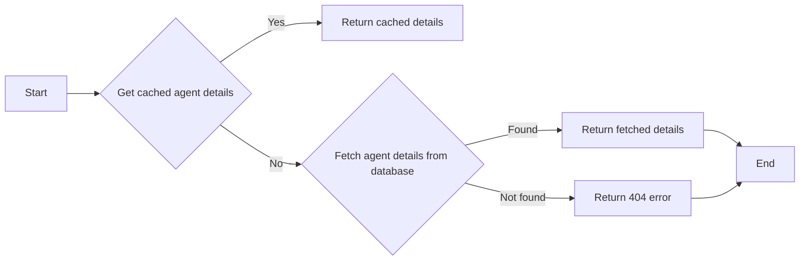

#### 带注释源码

```python
@router.get(
    "/agents/{username}/{agent_name}",
    summary="Get specific agent",
    tags=["store", "public"],
    response_model=store_model.StoreAgentDetails,
)
async def get_agent(
    username: str,
    agent_name: str,
    include_changelog: bool = fastapi.Query(default=False),
):
    """
    This is only used on the AgentDetails Page.

    It returns the store listing agents details.
    """
    username = urllib.parse.unquote(username).lower()
    # URL decode the agent name since it comes from the URL path
    agent_name = urllib.parse.unquote(agent_name).lower()
    agent = await store_cache._get_cached_agent_details(
        username=username, agent_name=agent_name, include_changelog=include_changelog
    )
    return agent
```

### get_graph_meta_by_store_listing_version_id

#### 描述

获取由 Store 列表版本 ID 指定的 Agent 图。

#### 参数

- `store_listing_version_id`：`str`，存储列表版本的唯一标识符。

#### 返回值

- `backend.data.graph.GraphModelWithoutNodes`，不包含节点的图模型。

#### 流程图

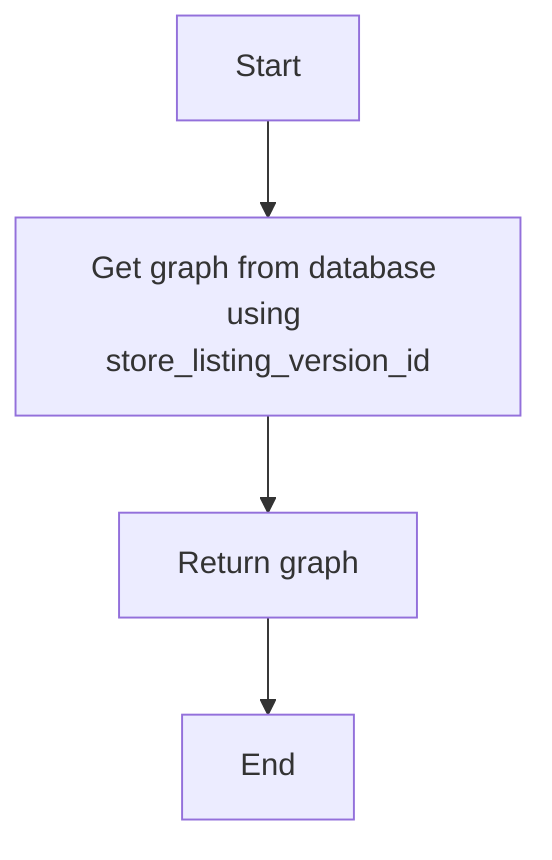

#### 带注释源码

```python
@router.get(
    "/graph/{store_listing_version_id}",
    summary="Get agent graph",
    tags=["store"],
    dependencies=[fastapi.Security(autogpt_libs.auth.requires_user)],
)
async def get_graph_meta_by_store_listing_version_id(
    store_listing_version_id: str,
) -> backend.data.graph.GraphModelWithoutNodes:
    """
    Get Agent Graph from Store Listing Version ID.
    """
    graph = await store_db.get_available_graph(store_listing_version_id)
    return graph
```

### `{get_store_agent}`

Get Store Agent Details from Store Listing Version ID.

参数：

- `store_listing_version_id`：`str`，The ID of the store listing version to get the agent details for.

返回值：`store_model.StoreAgentDetails`，The details of the store agent.

#### 流程图

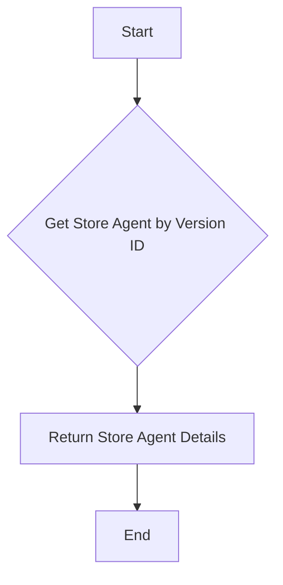

#### 带注释源码

```python
@router.get(
    "/agents/{store_listing_version_id}",
    summary="Get agent by version",
    tags=["store"],
    dependencies=[fastapi.Security(autogpt_libs.auth.requires_user)],
    response_model=store_model.StoreAgentDetails,
)
async def get_store_agent(store_listing_version_id: str):
    """
    Get Store Agent Details from Store Listing Version ID.
    """
    agent = await store_db.get_store_agent_by_version_id(store_listing_version_id)

    return agent
```

### create_review

#### 描述

Create a review for a store agent.

#### 参数

- `username`：`str`，Creator's username
- `agent_name`：`str`，Name/slug of the agent
- `review`：`store_model.StoreReviewCreate`，Review details including score and optional comments
- `user_id`：`str`，ID of authenticated user creating the review

#### 返回值

- `store_model.StoreReview`：The created review

#### 流程图

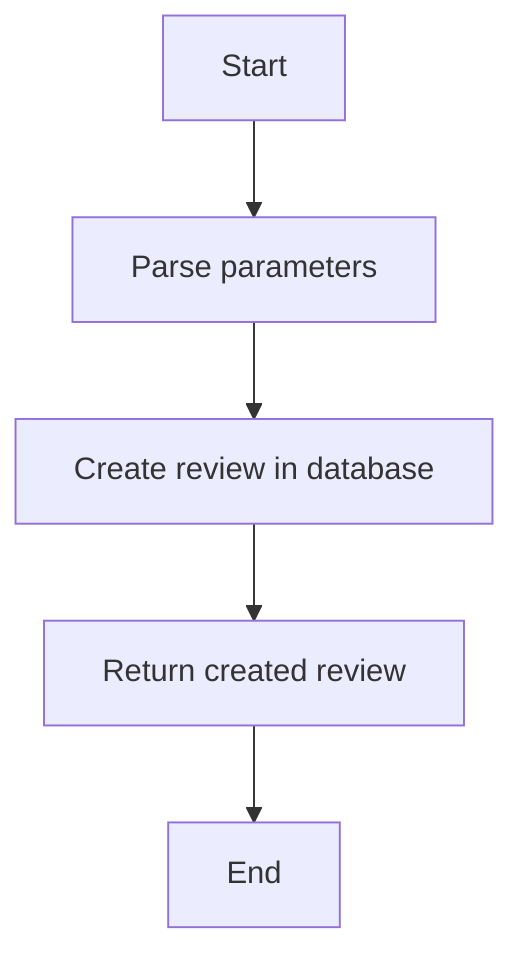

#### 带注释源码

```python
@router.post(
    "/agents/{username}/{agent_name}/review",
    summary="Create agent review",
    tags=["store"],
    dependencies=[fastapi.Security(autogpt_libs.auth.requires_user)],
    response_model=store_model.StoreReview,
)
async def create_review(
    username: str,
    agent_name: str,
    review: store_model.StoreReviewCreate,
    user_id: str = fastapi.Security(autogpt_libs.auth.get_user_id),
):
    """
    Create a review for a store agent.

    Args:
        username: Creator's username
        agent_name: Name/slug of the agent
        review: Review details including score and optional comments
        user_id: ID of authenticated user creating the review

    Returns:
        The created review
    """
    username = urllib.parse.unquote(username).lower()
    agent_name = urllib.parse.unquote(agent_name).lower()
    # Create the review
    created_review = await store_db.create_store_review(
        user_id=user_id,
        store_listing_version_id=review.store_listing_version_id,
        score=review.score,
        comments=review.comments,
    )

    return created_review
```

### `{get_creators}`

This function retrieves a list of store creators based on optional filtering and sorting criteria.

#### 参数

- `featured`：`bool`，Indicates whether to limit the list to only featured creators. Defaults to `False`.
- `search_query`：`str | None`，A search query string to filter creators based on their profile description. Defaults to `None`.
- `sorted_by`：`Literal["agent_rating", "agent_runs", "num_agents"] | None`，Indicates the sorting criteria for the creators list. Defaults to `None`.
- `page`：`int`，The page number for pagination. Defaults to `1`.
- `page_size`：`int`，The number of creators per page. Defaults to `20`.

#### 返回值

- `store_model.CreatorsResponse`：A paginated list of creators matching the filters.

#### 流程图

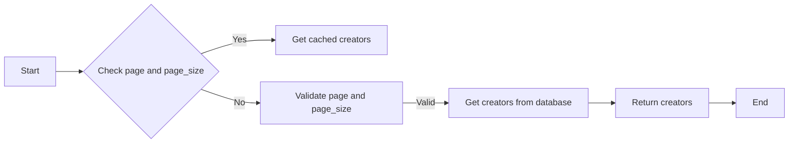

#### 带注释源码

```python
@router.get(
    "/creators",
    summary="List store creators",
    tags=["store", "public"],
    response_model=store_model.CreatorsResponse,
)
async def get_creators(
    featured: bool = False,
    search_query: str | None = None,
    sorted_by: Literal["agent_rating", "agent_runs", "num_agents"] | None = None,
    page: int = 1,
    page_size: int = 20,
):
    """
    This is needed for:
    - Home Page Featured Creators
    - Search Results Page

    ---

    To support this functionality we need:
    - featured: bool - to limit the list to just featured agents
    - search_query: str - vector search based on the creators profile description.
    - sorted_by: [agent_rating, agent_runs] -
    """
    if page < 1:
        raise fastapi.HTTPException(
            status_code=422, detail="Page must be greater than 0"
        )

    if page_size < 1:
        raise fastapi.HTTPException(
            status_code=422, detail="Page size must be greater than 0"
        )

    creators = await store_cache._get_cached_store_creators(
        featured=featured,
        search_query=search_query,
        sorted_by=sorted_by,
        page=page,
        page_size=page_size,
    )
    return creators
```

### `{get_creator}`

Get the details of a creator.

参数：

- `{username}`：`str`，Creator's username

返回值：`store_model.CreatorDetails`，The details of the creator

#### 流程图

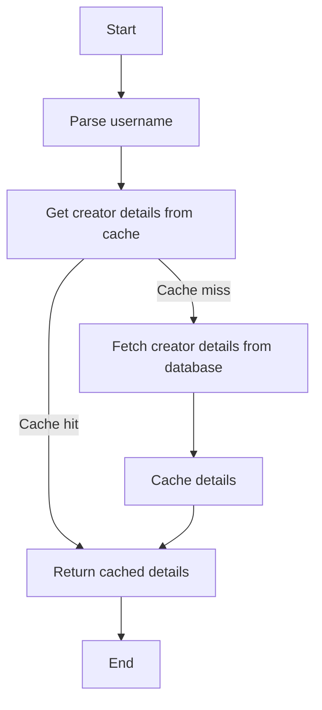

#### 带注释源码

```python
@router.get(
    "/creator/{username}",
    summary="Get creator details",
    tags=["store", "public"],
    response_model=store_model.CreatorDetails,
)
async def get_creator(
    username: str,
):
    """
    Get the details of a creator.
    - Creator Details Page
    """
    username = urllib.parse.unquote(username).lower()
    creator = await store_cache._get_cached_creator_details(username=username)
    return creator
```

### get_my_agents

#### 描述

This function retrieves a paginated list of agents owned by the authenticated user.

#### 参数

- `user_id`：`str`，The ID of the authenticated user.
- `page`：`int`，The page number for pagination. Defaults to 1.
- `page_size`：`int`，The number of agents per page. Defaults to 20.

#### 返回值

- `store_model.MyAgentsResponse`：A paginated list of agents owned by the authenticated user.

#### 流程图

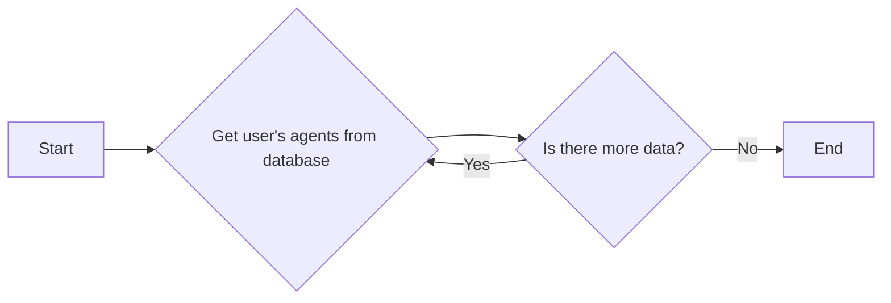

#### 带注释源码

```python
@router.get(
    "/myagents",
    summary="Get my agents",
    tags=["store", "private"],
    dependencies=[fastapi.Security(autogpt_libs.auth.requires_user)],
    response_model=store_model.MyAgentsResponse,
)
async def get_my_agents(
    user_id: str = fastapi.Security(autogpt_libs.auth.get_user_id),
    page: typing.Annotated[int, fastapi.Query(ge=1)] = 1,
    page_size: typing.Annotated[int, fastapi.Query(ge=1)] = 20,
):
    """
    Get user's own agents.
    """
    agents = await store_db.get_my_agents(user_id, page=page, page_size=page_size)
    return agents
```

### delete_submission

#### 描述

Delete a store listing submission.

#### 参数

- `submission_id`：`str`，The ID of the submission to be deleted
- `user_id`：`str`，ID of the authenticated user

#### 返回值

- `bool`：True if the submission was successfully deleted, False otherwise

#### 流程图

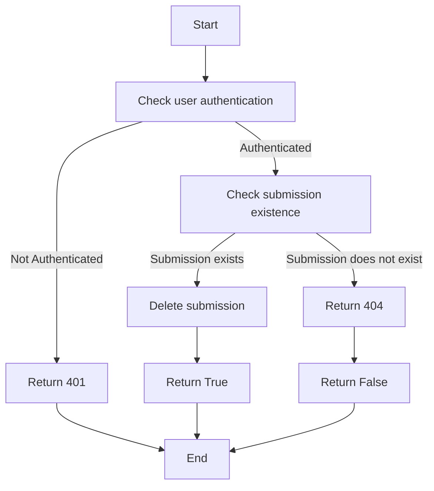

#### 带注释源码

```python
@router.delete(
    "/submissions/{submission_id}",
    summary="Delete store submission",
    tags=["store", "private"],
    dependencies=[fastapi.Security(autogpt_libs.auth.requires_user)],
    response_model=bool,
)
async def delete_submission(
    submission_id: str,
    user_id: str = fastapi.Security(autogpt_libs.auth.get_user_id),
):
    """
    Delete a store listing submission.

    Args:
        user_id (str): ID of the authenticated user
        submission_id (str): ID of the submission to be deleted

    Returns:
        bool: True if the submission was successfully deleted, False otherwise
    """
    result = await store_db.delete_store_submission(
        user_id=user_id,
        submission_id=submission_id,
    )

    return result
```

### get_submissions

#### 描述

Get a paginated list of store submissions for the authenticated user.

#### 参数

- `user_id`：`str`，The ID of the authenticated user
- `page`：`int`，Page number for pagination. Defaults to 1.
- `page_size`：`int`，Number of submissions per page. Defaults to 20.

#### 返回值

- `StoreSubmissionsResponse`：Paginated list of store submissions

#### 流程图

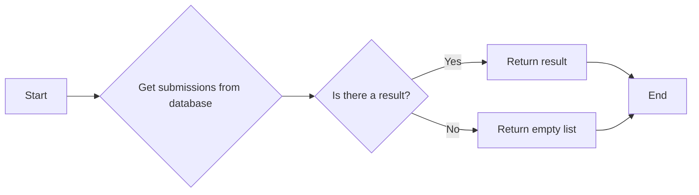

#### 带注释源码

```python
@router.get(
    "/submissions",
    summary="List my submissions",
    tags=["store", "private"],
    dependencies=[fastapi.Security(autogpt_libs.auth.requires_user)],
    response_model=store_model.StoreSubmissionsResponse,
)
async def get_submissions(
    user_id: str = fastapi.Security(autogpt_libs.auth.get_user_id),
    page: int = 1,
    page_size: int = 20,
):
    """
    Get a paginated list of store submissions for the authenticated user.

    Args:
        user_id (str): ID of the authenticated user
        page (int, optional): Page number for pagination. Defaults to 1.
        page_size (int, optional): Number of submissions per page. Defaults to 20.

    Returns:
        StoreSubmissionsResponse: Paginated list of store submissions

    Raises:
        HTTPException: If page or page_size are less than 1
    """
    if page < 1:
        raise fastapi.HTTPException(
            status_code=422, detail="Page must be greater than 0"
        )

    if page_size < 1:
        raise fastapi.HTTPException(
            status_code=422, detail="Page size must be greater than 0"
        )
    listings = await store_db.get_store_submissions(
        user_id=user_id,
        page=page,
        page_size=page_size,
    )
    return listings
```

### create_submission

#### 描述

Create a new store listing submission.

#### 参数

- `submission_request`：`StoreSubmissionRequest`，The submission details
- `user_id`：`str`，ID of the authenticated user submitting the listing

#### 返回值

- `StoreSubmission`：The created store submission

#### 流程图

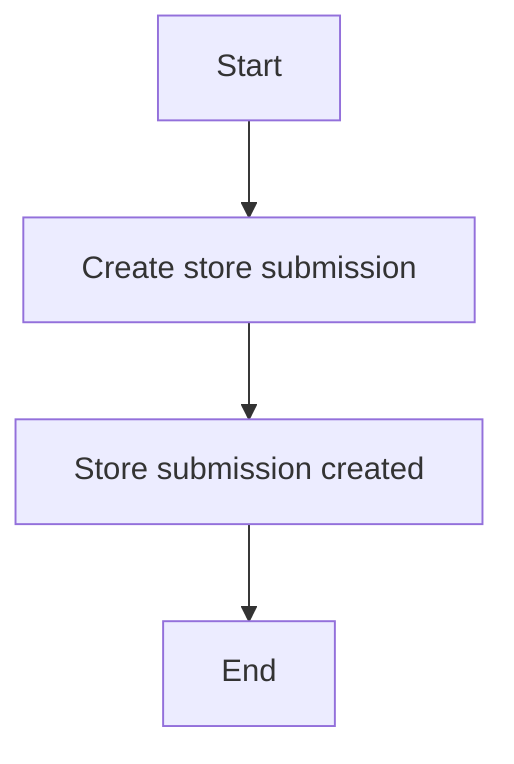

#### 带注释源码

```python
@router.post(
    "/submissions",
    summary="Create store submission",
    tags=["store", "private"],
    dependencies=[fastapi.Security(autogpt_libs.auth.requires_user)],
    response_model=store_model.StoreSubmission,
)
async def create_submission(
    submission_request: store_model.StoreSubmissionRequest,
    user_id: str = fastapi.Security(autogpt_libs.auth.get_user_id),
):
    """
    Create a new store listing submission.

    Args:
        submission_request (StoreSubmissionRequest): The submission details
        user_id (str): ID of the authenticated user submitting the listing

    Returns:
        StoreSubmission: The created store submission

    Raises:
        HTTPException: If there is an error creating the submission
    """
    result = await store_db.create_store_submission(
        user_id=user_id,
        agent_id=submission_request.agent_id,
        agent_version=submission_request.agent_version,
        slug=submission_request.slug,
        name=submission_request.name,
        video_url=submission_request.video_url,
        agent_output_demo_url=submission_request.agent_output_demo_url,
        image_urls=submission_request.image_urls,
        description=submission_request.description,
        instructions=submission_request.instructions,
        sub_heading=submission_request.sub_heading,
        categories=submission_request.categories,
        changes_summary=submission_request.changes_summary or "Initial Submission",
        recommended_schedule_cron=submission_request.recommended_schedule_cron,
    )

    return result
```

### `{edit_submission}`

Edit an existing store listing submission.

参数：

- `store_listing_version_id`：`str`，The ID of the store listing version to edit
- `submission_request`：`StoreSubmissionEditRequest`，The updated submission details
- `user_id`：`str`，ID of the authenticated user editing the listing

返回值：`StoreSubmission`，The updated store submission

#### 流程图

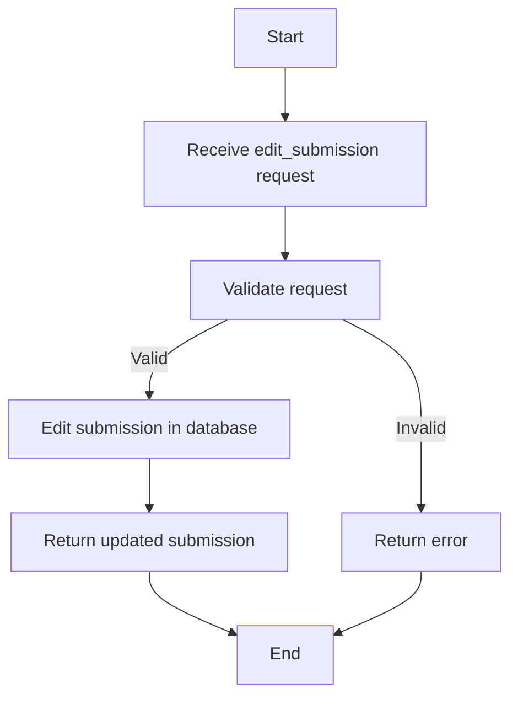

#### 带注释源码

```python
@router.put(
    "/submissions/{store_listing_version_id}",
    summary="Edit store submission",
    tags=["store", "private"],
    dependencies=[fastapi.Security(autogpt_libs.auth.requires_user)],
    response_model=store_model.StoreSubmission,
)
async def edit_submission(
    store_listing_version_id: str,
    submission_request: store_model.StoreSubmissionEditRequest,
    user_id: str = fastapi.Security(autogpt_libs.auth.get_user_id),
):
    """
    Edit an existing store listing submission.

    Args:
        store_listing_version_id (str): ID of the store listing version to edit
        submission_request (StoreSubmissionEditRequest): The updated submission details
        user_id (str): ID of the authenticated user editing the listing

    Returns:
        StoreSubmission: The updated store submission

    Raises:
        HTTPException: If there is an error editing the submission
    """
    result = await store_db.edit_store_submission(
        user_id=user_id,
        store_listing_version_id=store_listing_version_id,
        name=submission_request.name,
        video_url=submission_request.video_url,
        agent_output_demo_url=submission_request.agent_output_demo_url,
        image_urls=submission_request.image_urls,
        description=submission_request.description,
        instructions=submission_request.instructions,
        sub_heading=submission_request.sub_heading,
        categories=submission_request.categories,
        changes_summary=submission_request.changes_summary,
        recommended_schedule_cron=submission_request.recommended_schedule_cron,
    )

    return result
```

### upload_submission_media

#### 描述

Upload media (images/videos) for a store listing submission.

#### 参数

- `file`：`UploadFile`，The media file to upload
- `user_id`：`str`，ID of the authenticated user uploading the media

#### 返回值

- `str`：URL of the uploaded media file

#### 流程图

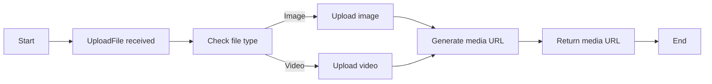

#### 带注释源码

```python
@router.post(
    "/submissions/media",
    summary="Upload submission media",
    tags=["store", "private"],
    dependencies=[fastapi.Security(autogpt_libs.auth.requires_user)],
)
async def upload_submission_media(
    file: fastapi.UploadFile,
    user_id: str = fastapi.Security(autogpt_libs.auth.get_user_id),
):
    """
    Upload media (images/videos) for a store listing submission.

    Args:
        file (UploadFile): The media file to upload
        user_id (str): ID of the authenticated user uploading the media

    Returns:
        str: URL of the uploaded media file

    Raises:
        HTTPException: If there is an error uploading the media
    """
    media_url = await store_media.upload_media(user_id=user_id, file=file)
    return media_url
```

### generate_image

#### 描述

Generate an image for a store listing submission.

#### 参数

- `agent_id`：`str`，The ID of the agent to generate an image for.

#### 返回值

- `fastapi.responses.Response`，JSON containing the URL of the generated image.

#### 流程图

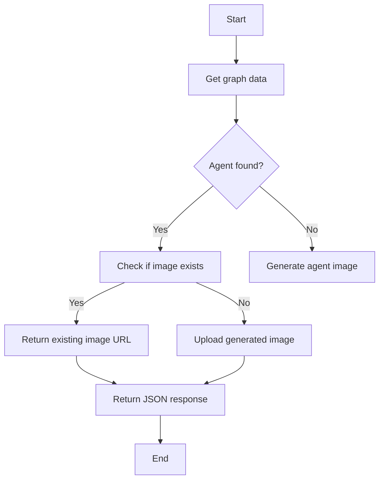

#### 带注释源码

```python
@router.post(
    "/submissions/generate_image",
    summary="Generate submission image",
    tags=["store", "private"],
    dependencies=[fastapi.Security(autogpt_libs.auth.requires_user)],
)
async def generate_image(
    agent_id: str,
    user_id: str = fastapi.Security(autogpt_libs.auth.get_user_id),
) -> fastapi.responses.Response:
    """
    Generate an image for a store listing submission.

    Args:
        agent_id (str): ID of the agent to generate an image for
        user_id (str): ID of the authenticated user

    Returns:
        JSONResponse: JSON containing the URL of the generated image
    """
    agent = await backend.data.graph.get_graph(
        graph_id=agent_id, version=None, user_id=user_id
    )

    if not agent:
        raise fastapi.HTTPException(
            status_code=404, detail=f"Agent with ID {agent_id} not found"
        )
    # Use .jpeg here since we are generating JPEG images
    filename = f"agent_{agent_id}.jpeg"

    existing_url = await store_media.check_media_exists(user_id, filename)
    if existing_url:
        logger.info(f"Using existing image for agent {agent_id}")
        return fastapi.responses.JSONResponse(content={"image_url": existing_url})
    # Generate agent image as JPEG
    image = await store_image_gen.generate_agent_image(agent=agent)

    # Create UploadFile with the correct filename and content_type
    image_file = fastapi.UploadFile(
        file=image,
        filename=filename,
    )

    image_url = await store_media.upload_media(
        user_id=user_id, file=image_file, use_file_name=True
    )

    return fastapi.responses.JSONResponse(content={"image_url": image_url})
```

### download_agent_file

#### 描述

Download the agent file by streaming its content.

#### 参数

- `store_listing_version_id`：`str`，The ID of the agent to download

#### 返回值

- `fastapi.responses.FileResponse`：A streaming response containing the agent's graph data.

#### 流程图

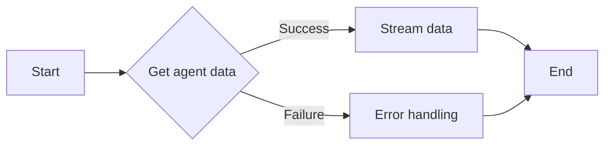

#### 带注释源码

```python
@router.get(
    "/download/agents/{store_listing_version_id}",
    summary="Download agent file",
    tags=["store", "public"],
)
async def download_agent_file(
    store_listing_version_id: str = fastapi.Path(
        ..., description="The ID of the agent to download"
    ),
) -> fastapi.responses.FileResponse:
    """
    Download the agent file by streaming its content.

    Args:
        store_listing_version_id (str): The ID of the agent to download

    Returns:
        StreamingResponse: A streaming response containing the agent's graph data.

    Raises:
        HTTPException: If the agent is not found or an unexpected error occurs.
    """
    graph_data = await store_db.get_agent(store_listing_version_id)
    file_name = f"agent_{graph_data.id}_v{graph_data.version or 'latest'}.json"

    # Sending graph as a stream (similar to marketplace v1)
    with tempfile.NamedTemporaryFile(
        mode="w", suffix=".json", delete=False
    ) as tmp_file:
        tmp_file.write(backend.util.json.dumps(graph_data))
        tmp_file.flush()

        return fastapi.responses.FileResponse(
            tmp_file.name, filename=file_name, media_type="application/json"
        )
```

### get_cache_metrics

#### 描述

获取缓存指标，以 Prometheus 格式返回。

#### 参数

- 无

#### 返回值

- `str`：Prometheus 格式的指标文本

#### 流程图

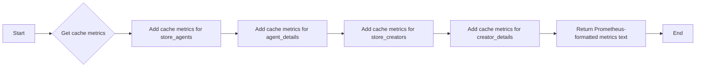

#### 带注释源码

```python
@router.get(
    "/metrics/cache",
    summary="Get cache metrics in Prometheus format",
    tags=["store", "metrics"],
    response_class=fastapi.responses.PlainTextResponse,
)
async def get_cache_metrics():
    """
    Get cache metrics in Prometheus text format.

    Returns Prometheus-compatible metrics for monitoring cache performance.
    Metrics include size, maxsize, TTL, and hit rate for each cache.

    Returns:
        str: Prometheus-formatted metrics text
    """
    metrics = []

    # Helper to add metrics for a cache
    def add_cache_metrics(cache_name: str, cache_func):
        info = cache_func.cache_info()
        # Cache size metric (dynamic - changes as items are cached/expired)
        metrics.append(f'store_cache_entries{{cache="{cache_name}"}} {info["size"]}')
        # Cache utilization percentage (dynamic - useful for monitoring)
        utilization = (
            (info["size"] / info["maxsize"] * 100) if info["maxsize"] > 0 else 0
        )
        metrics.append(
            f'store_cache_utilization_percent{{cache="{cache_name}"}} {utilization:.2f}'
        )

    # Add metrics for each cache
    add_cache_metrics("store_agents", store_cache._get_cached_store_agents)
    add_cache_metrics("agent_details", store_cache._get_cached_agent_details)
    add_cache_metrics("store_creators", store_cache._get_cached_store_creators)
    add_cache_metrics("creator_details", store_cache._get_cached_creator_details)

    # Add metadata/help text at the beginning
    prometheus_output = [
        "# HELP store_cache_entries Number of entries currently in cache",
        "# TYPE store_cache_entries gauge",
        "# HELP store_cache_utilization_percent Cache utilization as percentage (0-100)",
        "# TYPE store_cache_utilization_percent gauge",
        "",  # Empty line before metrics
    ]
    prometheus_output.extend(metrics)

    return "\n".join(prometheus_output)
```

### get_profile

**描述**

Get the profile details for the authenticated user.

**参数**

- `user_id`: `str`，The ID of the authenticated user

**返回值**

- `store_model.ProfileDetails`，The profile details of the authenticated user

#### 流程图

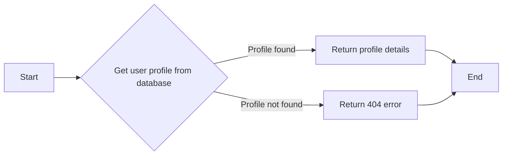

#### 带注释源码

```python
@router.get(
    "/profile",
    summary="Get user profile",
    tags=["store", "private"],
    dependencies=[fastapi.Security(autogpt_libs.auth.requires_user)],
    response_model=store_model.ProfileDetails,
)
async def get_profile(
    user_id: str = fastapi.Security(autogpt_libs.auth.get_user_id),
):
    """
    Get the profile details for the authenticated user.
    Cached for 1 hour per user.
    """
    profile = await store_db.get_user_profile(user_id)
    if profile is None:
        return fastapi.responses.JSONResponse(
            status_code=404,
            content={"detail": "Profile not found"},
        )
    return profile
```

### `{update_or_create_profile}`

Update the store profile for the authenticated user.

参数：

- `profile`：`store_model.Profile`，The updated profile details
- `user_id`：`str`，ID of the authenticated user

返回值：`store_model.CreatorDetails`，The updated profile

#### 流程图

```mermaid
graph TD
    A[Start] --> B[Get user profile from database]
    B -->|Profile found| C[Return profile]
    B -->|Profile not found| D[Return 404 error]
    C --> E[End]
    D --> E
```

#### 带注释源码

```python
@router.post(
    "/profile",
    summary="Update user profile",
    tags=["store", "private"],
    dependencies=[fastapi.Security(autogpt_libs.auth.requires_user)],
    response_model=store_model.CreatorDetails,
)
async def update_or_create_profile(
    profile: store_model.Profile,
    user_id: str = fastapi.Security(autogpt_libs.auth.get_user_id),
):
    """
    Update the store profile for the authenticated user.

    Args:
        profile (Profile): The updated profile details
        user_id (str): ID of the authenticated user

    Returns:
        CreatorDetails: The updated profile

    Raises:
        HTTPException: If there is an error updating the profile
    """
    updated_profile = await store_db.update_profile(user_id=user_id, profile=profile)
    return updated_profile
```

### get_agents

#### 描述

Get a paginated list of agents from the store with optional filtering and sorting.

#### 参数

- `featured`：`bool`，Filter to only show featured agents. Defaults to False.
- `creator`：`str | None`，Filter agents by creator username. Defaults to None.
- `sorted_by`：`Literal["rating", "runs", "name", "updated_at"] | None`，Sort agents by "runs" or "rating". Defaults to None.
- `search_query`：`str | None`，Search agents by name, subheading and description. Defaults to None.
- `category`：`str | None`，Filter agents by category. Defaults to None.
- `page`：`int`，Page number for pagination. Defaults to 1.
- `page_size`：`int`，Number of agents per page. Defaults to 20.

#### 返回值

- `StoreAgentsResponse`：Paginated list of agents matching the filters

#### 流程图

```mermaid
graph LR
A[Start] --> B{Check page and page_size}
B -->|Yes| C[Get cached agents]
B -->|No| D[Validate page and page_size]
D -->|Valid| E[Get agents from database]
E --> F[Return agents]
F --> G[End]
```

#### 带注释源码

```python
@router.get(
    "/agents",
    summary="List store agents",
    tags=["store", "public"],
    response_model=store_model.StoreAgentsResponse,
)
async def get_agents(
    featured: bool = False,
    creator: str | None = None,
    sorted_by: Literal["rating", "runs", "name", "updated_at"] | None = None,
    search_query: str | None = None,
    category: str | None = None,
    page: int = 1,
    page_size: int = 20,
):
    """
    Get a paginated list of agents from the store with optional filtering and sorting.
    """
    if page < 1:
        raise fastapi.HTTPException(
            status_code=422, detail="Page must be greater than 0"
        )

    if page_size < 1:
        raise fastapi.HTTPException(
            status_code=422, detail="Page size must be greater than 0"
        )

    agents = await store_cache._get_cached_store_agents(
        featured=featured,
        creator=creator,
        sorted_by=sorted_by,
        search_query=search_query,
        category=category,
        page=page,
        page_size=page_size,
    )
    return agents
```

### unified_search

#### 描述

This function performs a unified search across all content types (store agents, blocks, documentation) using hybrid search. It combines semantic (embedding-based) and lexical (text-based) search for the best results.

#### 参数

- `query`：`str`，The search query string.
- `content_types`：`list[str] | None`，Optional list of content types to filter by (STORE_AGENT, BLOCK, DOCUMENTATION). If not specified, searches all.
- `page`：`int`，Page number for pagination (default 1).
- `page_size`：`int`，Number of results per page (default 20).
- `user_id`：`str | None`，Optional authenticated user ID (for user-scoped content in future).

#### 返回值

- `UnifiedSearchResponse`：Paginated list of search results with relevance scores.

#### 流程图

```mermaid
graph LR
A[Start] --> B{Perform unified hybrid search}
B --> C{Convert results to response model}
C --> D[End]
```

#### 带注释源码

```python
@router.get(
    "/search",
    summary="Unified search across all content types",
    tags=["store", "public"],
    response_model=store_model.UnifiedSearchResponse,
)
async def unified_search(
    query: str,
    content_types: list[str] | None = fastapi.Query(
        default=None,
        description="Content types to search: STORE_AGENT, BLOCK, DOCUMENTATION. If not specified, searches all.",
    ),
    page: int = 1,
    page_size: int = 20,
    user_id: str | None = fastapi.Security(
        autogpt_libs.auth.get_optional_user_id, use_cache=False
    ),
):
    """
    Search across all content types (store agents, blocks, documentation) using hybrid search.

    Combines semantic (embedding-based) and lexical (text-based) search for best results.

    Args:
        query: The search query string
        content_types: Optional list of content types to filter by (STORE_AGENT, BLOCK, DOCUMENTATION)
        page: Page number for pagination (default 1)
        page_size: Number of results per page (default 20)
        user_id: Optional authenticated user ID (for user-scoped content in future)

    Returns:
        UnifiedSearchResponse: Paginated list of search results with relevance scores
    """
    if page < 1:
        raise fastapi.HTTPException(
            status_code=422, detail="Page must be greater than 0"
        )

    if page_size < 1:
        raise fastapi.HTTPException(
            status_code=422, detail="Page size must be greater than 0"
        )

    # Convert string content types to enum
    content_type_enums: list[prisma.enums.ContentType] | None = None
    if content_types:
        try:
            content_type_enums = [prisma.enums.ContentType(ct) for ct in content_types]
        except ValueError as e:
            raise fastapi.HTTPException(
                status_code=422,
                detail=f"Invalid content type. Valid values: STORE_AGENT, BLOCK, DOCUMENTATION. Error: {e}",
            )

    # Perform unified hybrid search
    results, total = await store_hybrid_search.unified_hybrid_search(
        query=query,
        content_types=content_type_enums,
        user_id=user_id,
        page=page,
        page_size=page_size,
    )

    # Convert results to response model
    search_results = [
        store_model.UnifiedSearchResult(
            content_type=r["content_type"],
            content_id=r["content_id"],
            searchable_text=r.get("searchable_text", ""),
            metadata=r.get("metadata"),
            updated_at=r.get("updated_at"),
            combined_score=r.get("combined_score"),
            semantic_score=r.get("semantic_score"),
            lexical_score=r.get("lexical_score"),
        )
        for r in results
    ]

    total_pages = (total + page_size - 1) // page_size if total > 0 else 0

    return store_model.UnifiedSearchResponse(
        results=search_results,
        pagination=Pagination(
            total_items=total,
            total_pages=total_pages,
            current_page=page,
            page_size=page_size,
        ),
    )
```

### create_review

#### 描述

Create a review for a store agent.

#### 参数

- `username`：`str`，Creator's username
- `agent_name`：`str`，Name/slug of the agent
- `review`：`store_model.StoreReviewCreate`，Review details including score and optional comments
- `user_id`：`str`，ID of authenticated user creating the review

#### 返回值

- `store_model.StoreReview`：The created review

#### 流程图

```mermaid
graph TD
    A[Start] --> B[Parse parameters]
    B --> C[Create review in database]
    C --> D[Return created review]
    D --> E[End]
```

#### 带注释源码

```python
@router.post(
    "/agents/{username}/{agent_name}/review",
    summary="Create agent review",
    tags=["store"],
    dependencies=[fastapi.Security(autogpt_libs.auth.requires_user)],
    response_model=store_model.StoreReview,
)
async def create_review(
    username: str,
    agent_name: str,
    review: store_model.StoreReviewCreate,
    user_id: str = fastapi.Security(autogpt_libs.auth.get_user_id),
):
    """
    Create a review for a store agent.

    Args:
        username: Creator's username
        agent_name: Name/slug of the agent
        review: Review details including score and optional comments
        user_id: ID of authenticated user creating the review

    Returns:
        The created review
    """
    username = urllib.parse.unquote(username).lower()
    agent_name = urllib.parse.unquote(agent_name).lower()
    # Create the review
    created_review = await store_db.create_store_review(
        user_id=user_id,
        store_listing_version_id=review.store_listing_version_id,
        score=review.score,
        comments=review.comments,
    )

    return created_review
```

### `{get_creators}`

Get the list of store creators.

参数：

- `{featured}`：`bool`，Indicates whether to filter the list to only show featured creators.
- `{search_query}`：`str | None`，Optional search query based on the creators' profile description.
- `{sorted_by}`：`Literal["agent_rating", "agent_runs", "num_agents"] | None`，Optional sorting criteria.
- `{page}`：`int`，Page number for pagination.
- `{page_size}`：`int`，Number of creators per page.

返回值：`store_model.CreatorsResponse`，A paginated list of creators matching the filters.

#### 流程图

```mermaid
graph LR
A[Get creators] --> B{Is featured?}
B -- Yes --> C[Get featured creators]
B -- No --> D{Is search query provided?}
D -- Yes --> E[Search creators by query]
D -- No --> F{Is sorted by provided?}
F -- Yes --> G[Sort creators by criteria]
F -- No --> H[Get all creators]
C --> I[Return creators]
E --> I
G --> I
H --> I
```

#### 带注释源码

```python
@router.get(
    "/creators",
    summary="List store creators",
    tags=["store", "public"],
    response_model=store_model.CreatorsResponse,
)
async def get_creators(
    featured: bool = False,
    search_query: str | None = None,
    sorted_by: Literal["agent_rating", "agent_runs", "num_agents"] | None = None,
    page: int = 1,
    page_size: int = 20,
):
    """
    This is needed for:
    - Home Page Featured Creators
    - Search Results Page

    ---

    To support this functionality we need:
    - featured: bool - to limit the list to just featured agents
    - search_query: str - vector search based on the creators profile description.
    - sorted_by: [agent_rating, agent_runs] -
    """
    if page < 1:
        raise fastapi.HTTPException(
            status_code=422, detail="Page must be greater than 0"
        )

    if page_size < 1:
        raise fastapi.HTTPException(
            status_code=422, detail="Page size must be greater than 0"
        )

    creators = await store_cache._get_cached_store_creators(
        featured=featured,
        search_query=search_query,
        sorted_by=sorted_by,
        page=page,
        page_size=page_size,
    )
    return creators
```

### get_my_agents

Get user's own agents.

参数：

- `user_id`：`str`，Authenticated user ID
- `page`：`int`，Page number for pagination (default 1)
- `page_size`：`int`，Number of agents per page (default 20)

返回值：`store_model.MyAgentsResponse`，Paginated list of user's own agents

#### 流程图

```mermaid
graph TD
    A[Start] --> B[Get user's own agents from database]
    B --> C[Check if agents exist]
    C -->|Yes| D[Format and return agents]
    C -->|No| E[Return 404 error]
    D --> F[End]
    E --> F
```

#### 带注释源码

```python
@router.get(
    "/myagents",
    summary="Get my agents",
    tags=["store", "private"],
    dependencies=[fastapi.Security(autogpt_libs.auth.requires_user)],
    response_model=store_model.MyAgentsResponse,
)
async def get_my_agents(
    user_id: str = fastapi.Security(autogpt_libs.auth.get_user_id),
    page: typing.Annotated[int, fastapi.Query(ge=1)] = 1,
    page_size: typing.Annotated[int, fastapi.Query(ge=1)] = 20,
):
    """
    Get user's own agents.
    """
    agents = await store_db.get_my_agents(user_id, page=page, page_size=page_size)
    return agents
```

### `{get_submissions}`

Get a paginated list of store submissions for the authenticated user.

参数：

- `user_id`：`str`，The ID of the authenticated user
- `page`：`int`，Page number for pagination. Defaults to 1.
- `page_size`：`int`，Number of submissions per page. Defaults to 20.

返回值：`store_model.StoreSubmissionsResponse`，Paginated list of store submissions

#### 流程图

```mermaid
graph TD
    A[Start] --> B{Check page and page_size}
    B -- Yes --> C[Fetch submissions from database]
    B -- No --> D[Return HTTPException]
    C --> E[Return submissions]
    E --> F[End]
```

#### 带注释源码

```python
@router.get(
    "/submissions",
    summary="List my submissions",
    tags=["store", "private"],
    dependencies=[fastapi.Security(autogpt_libs.auth.requires_user)],
    response_model=store_model.StoreSubmissionsResponse,
)
async def get_submissions(
    user_id: str = fastapi.Security(autogpt_libs.auth.get_user_id),
    page: int = 1,
    page_size: int = 20,
):
    """
    Get a paginated list of store submissions for the authenticated user.

    Args:
        user_id (str): ID of the authenticated user
        page (int, optional): Page number for pagination. Defaults to 1.
        page_size (int, optional): Number of submissions per page. Defaults to 20.

    Returns:
        StoreSubmissionsResponse: Paginated list of store submissions

    Raises:
        HTTPException: If page or page_size are less than 1
    """
    if page < 1:
        raise fastapi.HTTPException(
            status_code=422, detail="Page must be greater than 0"
        )

    if page_size < 1:
        raise fastapi.HTTPException(
            status_code=422, detail="Page size must be greater than 0"
        )
    listings = await store_db.get_store_submissions(
        user_id=user_id,
        page=page,
        page_size=page_size,
    )
    return listings
```

### `create_submission`

**描述**

Create a new store listing submission.

**参数**

- `submission_request`：`StoreSubmissionRequest`，The submission details
- `user_id`：`str`，ID of the authenticated user submitting the listing

**返回值**

- `StoreSubmission`：The created store submission

#### 流程图

```mermaid
graph TD
    A[Start] --> B[Create store submission]
    B --> C[StoreSubmission]
    C --> D[End]
```

#### 带注释源码

```python
@router.post(
    "/submissions",
    summary="Create store submission",
    tags=["store", "private"],
    dependencies=[fastapi.Security(autogpt_libs.auth.requires_user)],
    response_model=store_model.StoreSubmission,
)
async def create_submission(
    submission_request: store_model.StoreSubmissionRequest,
    user_id: str = fastapi.Security(autogpt_libs.auth.get_user_id),
):
    """
    Create a new store listing submission.

    Args:
        submission_request (StoreSubmissionRequest): The submission details
        user_id (str): ID of the authenticated user submitting the listing

    Returns:
        StoreSubmission: The created store submission

    Raises:
        HTTPException: If there is an error creating the submission
    """
    result = await store_db.create_store_submission(
        user_id=user_id,
        agent_id=submission_request.agent_id,
        agent_version=submission_request.agent_version,
        slug=submission_request.slug,
        name=submission_request.name,
        video_url=submission_request.video_url,
        agent_output_demo_url=submission_request.agent_output_demo_url,
        image_urls=submission_request.image_urls,
        description=submission_request.description,
        instructions=submission_request.instructions,
        sub_heading=submission_request.sub_heading,
        categories=submission_request.categories,
        changes_summary=submission_request.changes_summary or "Initial Submission",
        recommended_schedule_cron=submission_request.recommended_schedule_cron,
    )

    return result
```

### `{create_submission}`

Create a new store listing submission.

参数：

- `submission_request`：`StoreSubmissionRequest`，The submission details
- `user_id`：`str`，ID of the authenticated user submitting the listing

返回值：`StoreSubmission`，The created store submission

#### 流程图

```mermaid
graph TD
    A[Start] --> B[Receive StoreSubmissionRequest]
    B --> C[Validate submission_request]
    C -->|Valid| D[Create store submission in database]
    D --> E[Return created store submission]
    E --> F[End]
    C -->|Invalid| G[Return error]
    G --> F
```

#### 带注释源码

```python
@router.post(
    "/submissions",
    summary="Create store submission",
    tags=["store", "private"],
    dependencies=[fastapi.Security(autogpt_libs.auth.requires_user)],
    response_model=store_model.StoreSubmission,
)
async def create_submission(
    submission_request: store_model.StoreSubmissionRequest,
    user_id: str = fastapi.Security(autogpt_libs.auth.get_user_id),
):
    """
    Create a new store listing submission.

    Args:
        submission_request (StoreSubmissionRequest): The submission details
        user_id (str): ID of the authenticated user submitting the listing

    Returns:
        StoreSubmission: The created store submission

    Raises:
        HTTPException: If there is an error creating the submission
    """
    result = await store_db.create_store_submission(
        user_id=user_id,
        agent_id=submission_request.agent_id,
        agent_version=submission_request.agent_version,
        slug=submission_request.slug,
        name=submission_request.name,
        video_url=submission_request.video_url,
        agent_output_demo_url=submission_request.agent_output_demo_url,
        image_urls=submission_request.image_urls,
        description=submission_request.description,
        instructions=submission_request.instructions,
        sub_heading=submission_request.sub_heading,
        categories=submission_request.categories,
        changes_summary=submission_request.changes_summary or "Initial Submission",
        recommended_schedule_cron=submission_request.recommended_schedule_cron,
    )

    return result
```

### `{类名}.{方法名}`

`edit_submission` 方法用于编辑现有的商店列表提交。

参数：

- `store_listing_version_id`：`str`，商店列表版本的 ID，用于标识要编辑的提交。
- `submission_request`：`StoreSubmissionEditRequest`，包含更新后的提交详细信息。
- `user_id`：`str`，认证用户的 ID，用于验证用户权限。

返回值：`StoreSubmission`，更新后的商店提交。

#### 流程图

```mermaid
graph TD
    A[Start] --> B[Receive store_listing_version_id]
    B --> C[Receive submission_request]
    C --> D[Receive user_id]
    D --> E[Validate user_id]
    E -->|Valid| F[Edit store submission in database]
    F --> G[Return updated StoreSubmission]
    G --> H[End]
    E -->|Invalid| I[Return HTTPException]
    I --> J[End]
```

#### 带注释源码

```python
@router.put(
    "/submissions/{store_listing_version_id}",
    summary="Edit store submission",
    tags=["store", "private"],
    dependencies=[fastapi.Security(autogpt_libs.auth.requires_user)],
    response_model=store_model.StoreSubmission,
)
async def edit_submission(
    store_listing_version_id: str,
    submission_request: store_model.StoreSubmissionEditRequest,
    user_id: str = fastapi.Security(autogpt_libs.auth.get_user_id),
):
    """
    Edit an existing store listing submission.

    Args:
        store_listing_version_id (str): ID of the store listing version to edit
        submission_request (StoreSubmissionEditRequest): The updated submission details
        user_id (str): ID of the authenticated user editing the listing

    Returns:
        StoreSubmission: The updated store submission

    Raises:
        HTTPException: If there is an error editing the submission
    """
    result = await store_db.edit_store_submission(
        user_id=user_id,
        store_listing_version_id=store_listing_version_id,
        name=submission_request.name,
        video_url=submission_request.video_url,
        agent_output_demo_url=submission_request.agent_output_demo_url,
        image_urls=submission_request.image_urls,
        description=submission_request.description,
        instructions=submission_request.instructions,
        sub_heading=submission_request.sub_heading,
        categories=submission_request.categories,
        changes_summary=submission_request.changes_summary,
        recommended_schedule_cron=submission_request.recommended_schedule_cron,
    )

    return result
```

## 关键组件


### 张量索引与惰性加载

张量索引与惰性加载是代码中用于高效处理大规模数据集的关键组件。它允许在需要时才加载数据，从而减少内存消耗并提高性能。

### 反量化支持

反量化支持是代码中用于处理量化数据的关键组件。它允许在量化过程中进行反向操作，以便在需要时恢复原始数据。

### 量化策略

量化策略是代码中用于优化模型性能的关键组件。它通过减少模型中使用的精度来减少模型大小和计算需求，从而提高模型在资源受限环境中的效率。


## 问题及建议


### 已知问题

-   **缓存依赖**: 代码中使用了多个缓存函数，但没有明确说明缓存失效策略和缓存更新机制。这可能导致数据不一致或过时。
-   **错误处理**: 代码中存在一些潜在的异常点，例如在处理缓存和数据库操作时，但没有提供详细的异常处理逻辑。
-   **代码复用**: 部分功能（如上传媒体、生成图像）在多个端点中重复实现，可以考虑提取为通用函数以提高代码复用性。
-   **安全性**: 代码中使用了`urllib.parse.unquote`来解码URL参数，但没有考虑安全性问题，例如防止注入攻击。
-   **性能**: 代码中使用了大量的异步操作，但没有进行性能测试，可能存在性能瓶颈。

### 优化建议

-   **缓存管理**: 实现明确的缓存失效策略和更新机制，确保数据的一致性和时效性。
-   **错误处理**: 增加详细的异常处理逻辑，确保在出现错误时能够给出清晰的错误信息，并采取相应的措施。
-   **代码复用**: 将重复的功能提取为通用函数，减少代码冗余，提高代码可维护性。
-   **安全性**: 对输入进行严格的验证，防止注入攻击等安全问题。
-   **性能测试**: 对代码进行性能测试，找出性能瓶颈，并进行优化。
-   **文档**: 增加详细的文档说明，包括代码结构、功能描述、接口文档等，方便其他开发者理解和维护代码。
-   **单元测试**: 编写单元测试，确保代码质量，提高代码的可维护性。
-   **日志记录**: 增加日志记录，方便问题追踪和调试。


## 其它


### 设计目标与约束

- 设计目标：
  - 提供一个高效、可扩展的API服务，用于管理商店中的内容，包括用户资料、代理、创作者和提交。
  - 实现统一的搜索功能，支持对商店代理、块和文档进行搜索。
  - 提供缓存机制，以提高性能和响应速度。
  - 确保API的安全性，通过身份验证和授权机制保护敏感数据。

- 约束：
  - API必须遵循RESTful架构原则。
  - 使用FastAPI框架进行开发，以实现高性能和易于维护的API。
  - 使用Prisma ORM进行数据库操作，以确保数据的一致性和完整性。
  - 使用缓存机制来减少数据库访问，提高性能。
  - API必须支持分页和过滤功能，以提供灵活的数据访问。

### 错误处理与异常设计

- 错误处理：
  - 使用FastAPI的异常处理机制来捕获和处理异常。
  - 定义自定义异常类，以提供更具体的错误信息。
  - 返回适当的HTTP状态码和错误消息，以便客户端可以正确处理错误。

- 异常设计：
  - 定义异常类，如`HTTPException`，用于处理常见的HTTP错误。
  - 定义自定义异常类，如`ProfileNotFoundException`，用于处理特定于应用程序的错误。

### 数据流与状态机

- 数据流：
  - 用户请求API，API处理请求并返回响应。
  - 数据在数据库和缓存之间流动，以支持快速访问和更新。
  - 使用事件驱动模型来处理异步操作，如文件上传和图像生成。

- 状态机：
  - 定义状态机来管理商店提交的状态，例如“草稿”、“审核中”和“发布”。

### 外部依赖与接口契约

- 外部依赖：
  - FastAPI框架
  - Prisma ORM
  - logging模块
  - urllib.parse模块
  - typing模块

- 接口契约：
  - 定义清晰的API接口文档，包括请求和响应格式。
  - 使用OpenAPI规范来描述API接口，以便客户端可以轻松地生成代码。
  - 确保API接口的一致性和稳定性，以支持第三方集成。

    