# `.\AutoGPT\autogpt_platform\backend\backend\api\features\store\routes_test.py` 详细设计文档

该代码文件是基于 pytest 和 fastapi.testclient 的测试套件，旨在验证与“商店”模块相关的 API 路由的正确性，涵盖了获取代理人列表、代理人详情、创作者列表、创作者详情以及提交记录的分页、筛选和参数验证功能。

## 整体流程

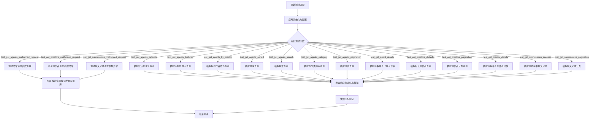

## 类结构

```
No Classes Defined (Test Functions Only)
```

## 全局变量及字段


### `FIXED_NOW`
    
用于确保测试可重现性的固定时间戳，设置为2023年1月1日，以避免测试结果因执行时间不同而变化。

类型：`datetime.datetime`
    


    

## 全局函数及方法


### `setup_app_auth`

Setup auth overrides for all tests in this module

参数：

- `mock_jwt_user`：`dict`，包含模拟用户认证信息的 fixture，用于替换真实的 JWT payload 获取逻辑。

返回值：`Generator`，用于管理测试前后的依赖项覆盖生命周期（设置与清理）。

#### 流程图

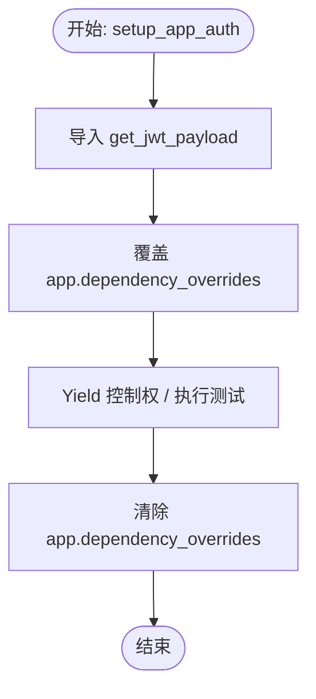

#### 带注释源码

```python
@pytest.fixture(autouse=True)
def setup_app_auth(mock_jwt_user):
    """Setup auth overrides for all tests in this module"""
    # 导入需要被覆盖的依赖项：JWT payload 获取函数
    from autogpt_libs.auth.jwt_utils import get_jwt_payload

    # 使用 mock 数据覆盖 FastAPI 应用的依赖项
    # 这样在测试中调用需要认证的接口时，会使用模拟的用户数据而非真实鉴权
    app.dependency_overrides[get_jwt_payload] = mock_jwt_user["get_jwt_payload"]
    yield  # 暂停执行，运行测试用例
    
    # 测试结束后清理，恢复默认的依赖项设置，避免影响其他测试
    app.dependency_overrides.clear()
```


### `test_get_agents_defaults`

该函数通过模拟数据库返回一个空列表和分页信息，对代理列表接口的默认请求进行测试，验证了接口返回的HTTP状态码、分页数据结构、数据库调用参数是否符合预期，并对响应数据进行快照比对。

参数：

-  `mocker`：`pytest_mock.MockFixture`，pytest_mock 提供的 fixture，用于模拟对象和函数（此处用于替换数据库调用）。
-  `snapshot`：`Snapshot`，pytest-snapshot 插件提供的 fixture，用于比对测试结果与预存的快照文件。

返回值：`None`，该函数为测试函数，主要用于断言验证，不返回任何有效值。

#### 流程图

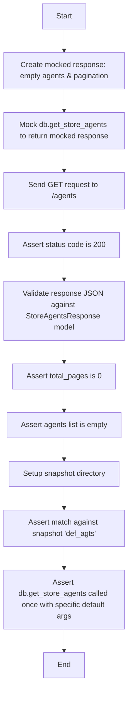

#### 带注释源码

```python
def test_get_agents_defaults(
    mocker: pytest_mock.MockFixture,
    snapshot: Snapshot,
) -> None:
    # 构造一个模拟的返回值，包含空的代理列表和默认分页信息
    mocked_value = store_model.StoreAgentsResponse(
        agents=[],
        pagination=store_model.Pagination(
            current_page=0,
            total_items=0,
            total_pages=0,
            page_size=10,
        ),
    )
    # 模拟数据库调用 'backend.api.features.store.db.get_store_agents'，使其返回上面构造的模拟值
    mock_db_call = mocker.patch("backend.api.features.store.db.get_store_agents")
    mock_db_call.return_value = mocked_value
    # 使用测试客户端向 /agents 发送 GET 请求
    response = client.get("/agents")
    # 断言响应状态码为 200
    assert response.status_code == 200

    # 验证返回的 JSON 数据是否符合 StoreAgentsResponse 模型
    data = store_model.StoreAgentsResponse.model_validate(response.json())
    # 断言分页中的总页数为 0
    assert data.pagination.total_pages == 0
    # 断言代理列表为空
    assert data.agents == []

    # 配置快照保存目录
    snapshot.snapshot_dir = "snapshots"
    # 将响应 JSON 序列化并断言与快照 'def_agts' 匹配
    snapshot.assert_match(json.dumps(response.json(), indent=2), "def_agts")
    # 断言数据库函数被调用了一次，且参数符合默认预期（无筛选条件，第1页，每页20条）
    mock_db_call.assert_called_once_with(
        featured=False,
        creators=None,
        sorted_by=None,
        search_query=None,
        category=None,
        page=1,
        page_size=20,
    )
```


### `test_get_agents_featured`

该测试函数用于验证当请求带有 `featured=true` 查询参数的 `/agents` 接口时，应用能够正确模拟数据库调用，并返回预期的精选代理数据，同时验证了数据库调用参数的正确性。

参数：

-   `mocker`：`pytest_mock.MockFixture`，用于模拟（Mock）数据库调用行为，隔离测试环境。
-   `snapshot`：`Snapshot`，用于执行快照测试，确保响应结构符合预期。

返回值：`None`，该函数主要用于执行断言，不返回任何值。

#### 流程图

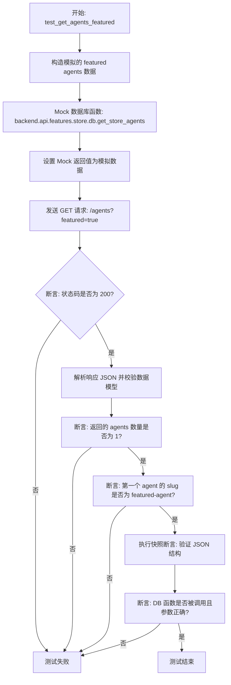

#### 带注释源码

```python
def test_get_agents_featured(
    mocker: pytest_mock.MockFixture,
    snapshot: Snapshot,
) -> None:
    # 1. 准备模拟的返回数据，包含一个精选代理和分页信息
    mocked_value = store_model.StoreAgentsResponse(
        agents=[
            store_model.StoreAgent(
                slug="featured-agent",
                agent_name="Featured Agent",
                agent_image="featured.jpg",
                creator="creator1",
                creator_avatar="avatar1.jpg",
                sub_heading="Featured agent subheading",
                description="Featured agent description",
                runs=100,
                rating=4.5,
                agent_graph_id="test-graph-1",
            )
        ],
        pagination=store_model.Pagination(
            current_page=1,
            total_items=1,
            total_pages=1,
            page_size=20,
        ),
    )
    # 2. 使用 mocker 替换真实的数据库调用函数 'get_store_agents'
    mock_db_call = mocker.patch("backend.api.features.store.db.get_store_agents")
    # 3. 指定模拟函数的返回值为上面准备的 mocked_value
    mock_db_call.return_value = mocked_value
    
    # 4. 调用测试客户端发送 GET 请求，查询精选代理
    response = client.get("/agents?featured=true")
    
    # 5. 断言 HTTP 响应状态码为 200 (OK)
    assert response.status_code == 200
    
    # 6. 将返回的 JSON 数据解析为 Pydantic 模型进行验证
    data = store_model.StoreAgentsResponse.model_validate(response.json())
    
    # 7. 断言返回的代理列表中包含 1 个代理
    assert len(data.agents) == 1
    # 8. 断言该代理的 slug 为 "featured-agent"
    assert data.agents[0].slug == "featured-agent"
    
    # 9. 配置快照目录并进行快照匹配，防止响应结构意外变更
    snapshot.snapshot_dir = "snapshots"
    snapshot.assert_match(json.dumps(response.json(), indent=2), "feat_agts")
    
    # 10. 验证底层数据库函数是否被正确调用了一次，且参数包含了 featured=True
    mock_db_call.assert_called_once_with(
        featured=True,
        creators=None,
        sorted_by=None,
        search_query=None,
        category=None,
        page=1,
        page_size=20,
    )
```


### `test_get_agents_by_creator`

该函数是一个测试用例，用于验证通过特定创建者（creator）筛选获取 Agents 列表的功能，检查 API 端点能否正确处理查询参数并返回预期的数据结构。

参数：

-  `mocker`: `pytest_mock.MockFixture`，用于模拟（Mock）数据库调用的 pytest fixture。
-  `snapshot`: `Snapshot`，用于进行快照测试的 pytest fixture，确保输出与预期一致。

返回值：`None`，该函数为测试用例，没有返回值，主要通过断言来验证逻辑。

#### 流程图

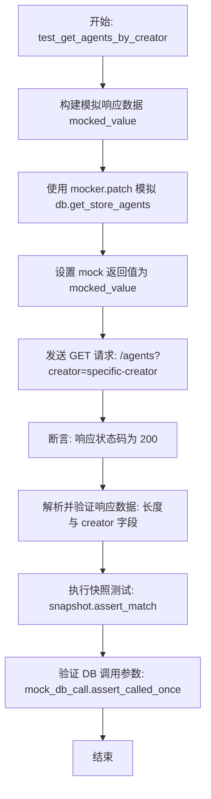

#### 带注释源码

```python
def test_get_agents_by_creator(
    mocker: pytest_mock.MockFixture,
    snapshot: Snapshot,
) -> None:
    # 1. 准备模拟数据：构造一个包含特定创建者 agent 的 StoreAgentsResponse 对象
    mocked_value = store_model.StoreAgentsResponse(
        agents=[
            store_model.StoreAgent(
                slug="creator-agent",
                agent_name="Creator Agent",
                agent_image="agent.jpg",
                creator="specific-creator",
                creator_avatar="avatar.jpg",
                sub_heading="Creator agent subheading",
                description="Creator agent description",
                runs=50,
                rating=4.0,
                agent_graph_id="test-graph-2",
            )
        ],
        pagination=store_model.Pagination(
            current_page=1,
            total_items=1,
            total_pages=1,
            page_size=20,
        ),
    )
    # 2. 模拟数据库调用：替换后端数据库函数以返回准备好的模拟数据
    mock_db_call = mocker.patch("backend.api.features.store.db.get_store_agents")
    mock_db_call.return_value = mocked_value
    
    # 3. 发送测试请求：调用获取 agents 的接口，并传递 creator 参数
    response = client.get("/agents?creator=specific-creator")
    
    # 4. 基础断言：检查 HTTP 状态码是否为 200
    assert response.status_code == 200
    
    # 5. 数据验证：解析 JSON 响应并验证返回的数据内容
    data = store_model.StoreAgentsResponse.model_validate(response.json())
    assert len(data.agents) == 1
    assert data.agents[0].creator == "specific-creator"
    
    # 6. 快照测试：将 JSON 响应格式化并与历史快照文件对比
    snapshot.snapshot_dir = "snapshots"
    snapshot.assert_match(json.dumps(response.json(), indent=2), "agts_by_creator")
    
    # 7. 行为验证：确保底层数据库函数被调用时传入了正确的过滤参数（如 creators 列表）
    mock_db_call.assert_called_once_with(
        featured=False,
        creators=["specific-creator"],
        sorted_by=None,
        search_query=None,
        category=None,
        page=1,
        page_size=20,
    )
```


### `test_get_agents_sorted`

测试通过`sorted_by`参数（具体为按运行次数`runs`排序）获取代理列表的API端点功能，验证响应状态码、数据内容、快照匹配以及后端数据库调用参数的正确性。

参数：

-  `mocker`：`pytest_mock.MockFixture`，Pytest提供的模拟 fixture，用于替换数据库调用。
-  `snapshot`：`Snapshot`，Pytest提供的快照 fixture，用于验证API响应是否符合预期的快照文件。

返回值：`None`，该函数为测试函数，不返回数值，主要通过断言验证行为。

#### 流程图

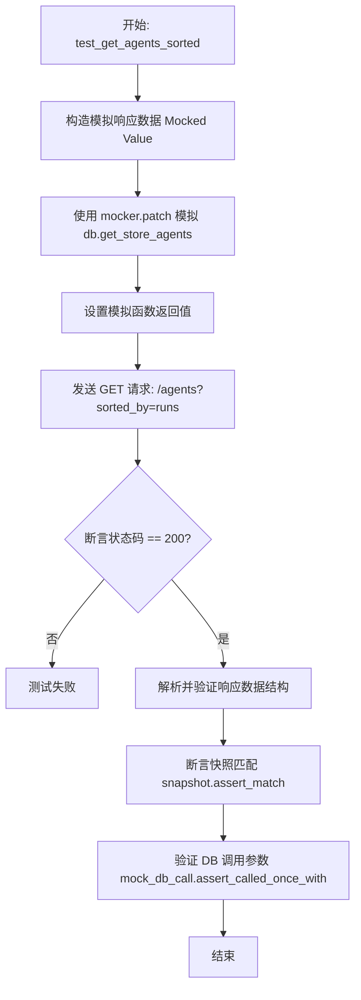

#### 带注释源码

```python
def test_get_agents_sorted(
    mocker: pytest_mock.MockFixture,
    snapshot: Snapshot,
) -> None:
    # 1. 准备模拟数据：构建一个包含按运行次数排序的代理的响应对象
    mocked_value = store_model.StoreAgentsResponse(
        agents=[
            store_model.StoreAgent(
                slug="top-agent",
                agent_name="Top Agent",
                agent_image="top.jpg",
                creator="creator1",
                creator_avatar="avatar1.jpg",
                sub_heading="Top agent subheading",
                description="Top agent description",
                runs=1000,
                rating=5.0,
                agent_graph_id="test-graph-3",
            )
        ],
        pagination=store_model.Pagination(
            current_page=1,
            total_items=1,
            total_pages=1,
            page_size=20,
        ),
    )
    # 2. 模拟数据库调用：替换后端数据库获取代理的方法
    mock_db_call = mocker.patch("backend.api.features.store.db.get_store_agents")
    # 3. 设置模拟返回值：当被调用时返回准备好的 mocked_value
    mock_db_call.return_value = mocked_value
    # 4. 发送请求：客户端发送 GET 请求，带上排序参数 sorted_by=runs
    response = client.get("/agents?sorted_by=runs")
    # 5. 验证状态码：断言请求成功
    assert response.status_code == 200

    # 6. 验证数据内容：解析 JSON 并检查代理列表长度及具体数值
    data = store_model.StoreAgentsResponse.model_validate(response.json())
    assert len(data.agents) == 1
    assert data.agents[0].runs == 1000
    # 7. 快照验证：将 JSON 响应格式化并与预存的快照文件进行对比
    snapshot.snapshot_dir = "snapshots"
    snapshot.assert_match(json.dumps(response.json(), indent=2), "agts_sorted")
    # 8. 验证调用参数：确保数据库函数被正确调用，且排序参数传递无误
    mock_db_call.assert_called_once_with(
        featured=False,
        creators=None,
        sorted_by="runs",
        search_query=None,
        category=None,
        page=1,
        page_size=20,
    )
```


### `test_get_agents_search`

该函数是一个单元测试，用于验证代理搜索接口（`/agents`）在接收搜索查询参数时的行为。它模拟数据库返回数据，发送带有 `search_query` 的 GET 请求，校验返回的状态码、数据内容（特别是搜索词匹配）、快照一致性，并确认底层数据库调用参数的正确性。

参数：

-  `mocker`：`pytest_mock.MockFixture`，Pytest 提供的 fixture，用于模拟（mock）对象和函数。
-  `snapshot`：`Snapshot`，来自 pytest-snapshot 插件的 fixture，用于将输出与预先保存的快照进行比对。

返回值：`None`，该函数为测试函数，不返回具体数值，主要通过断言来验证行为。

#### 流程图

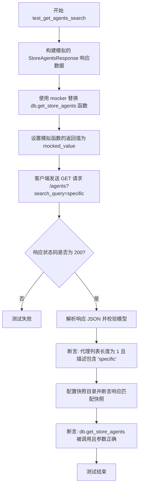

#### 带注释源码

```python
def test_get_agents_search(
    mocker: pytest_mock.MockFixture,
    snapshot: Snapshot,
) -> None:
    # 1. 准备模拟数据：创建一个包含特定搜索词 "specific" 的 StoreAgentsResponse 对象
    mocked_value = store_model.StoreAgentsResponse(
        agents=[
            store_model.StoreAgent(
                slug="search-agent",
                agent_name="Search Agent",
                agent_image="search.jpg",
                creator="creator1",
                creator_avatar="avatar1.jpg",
                sub_heading="Search agent subheading",
                description="Specific search term description",
                runs=75,
                rating=4.2,
                agent_graph_id="test-graph-search",
            )
        ],
        pagination=store_model.Pagination(
            current_page=1,
            total_items=1,
            total_pages=1,
            page_size=20,
        ),
    )
    # 2. 模拟数据库调用：替换实际的数据库查询函数，避免在测试中连接数据库
    mock_db_call = mocker.patch("backend.api.features.store.db.get_store_agents")
    mock_db_call.return_value = mocked_value
    
    # 3. 发送请求：调用 /agents 接口并传递 search_query 参数
    response = client.get("/agents?search_query=specific")
    
    # 4. 验证状态码：断言 HTTP 响应状态码为 200
    assert response.status_code == 200

    # 5. 验证响应数据：解析 JSON 并校验数据结构及搜索词是否存在于描述中
    data = store_model.StoreAgentsResponse.model_validate(response.json())
    assert len(data.agents) == 1
    assert "specific" in data.agents[0].description.lower()
    
    # 6. 快照测试：确保响应格式与预期快照一致，防止意外的接口变更
    snapshot.snapshot_dir = "snapshots"
    snapshot.assert_match(json.dumps(response.json(), indent=2), "agts_search")
    
    # 7. 验证调用参数：确认数据库查询函数被正确调用，并传递了预期的过滤参数
    mock_db_call.assert_called_once_with(
        featured=False,
        creators=None,
        sorted_by=None,
        search_query="specific",
        category=None,
        page=1,
        page_size=20,
    )
```


### `test_get_agents_category`

测试根据特定类别查询参数检索代理列表的 API 端点。它通过模拟数据库调用来验证响应数据、分页元数据和快照匹配，确保类别过滤逻辑正确地将参数传递给数据访问层。

参数：

-  `mocker`：`pytest_mock.MockFixture`，用于模拟对象和修补库功能的 pytest fixture。
-  `snapshot`：`Snapshot`，用于捕获和断言测试输出（通常是 JSON 响应）的 pytest fixture。

返回值：`None`，该函数为测试用例，不返回任何值，仅进行断言。

#### 流程图

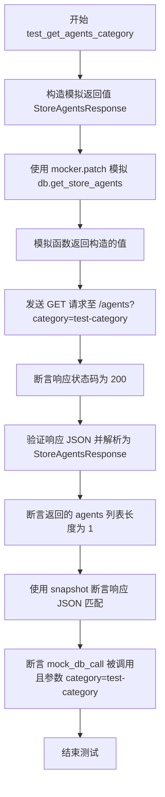

#### 带注释源码

```python
def test_get_agents_category(
    mocker: pytest_mock.MockFixture,
    snapshot: Snapshot,
) -> None:
    # 1. 准备模拟的返回数据，包含一个代理对象和分页信息
    mocked_value = store_model.StoreAgentsResponse(
        agents=[
            store_model.StoreAgent(
                slug="category-agent",
                agent_name="Category Agent",
                agent_image="category.jpg",
                creator="creator1",
                creator_avatar="avatar1.jpg",
                sub_heading="Category agent subheading",
                description="Category agent description",
                runs=60,
                rating=4.1,
                agent_graph_id="test-graph-category",
            )
        ],
        pagination=store_model.Pagination(
            current_page=1,
            total_items=1,
            total_pages=1,
            page_size=20,
        ),
    )
    # 2. 模拟后端数据库访问函数，避免真实数据库调用
    mock_db_call = mocker.patch("backend.api.features.store.db.get_store_agents")
    mock_db_call.return_value = mocked_value
    # 3. 发送带有 category 查询参数的 GET 请求
    response = client.get("/agents?category=test-category")
    # 4. 验证 HTTP 状态码是否为 200 (成功)
    assert response.status_code == 200
    # 5. 解析并验证响应体数据结构
    data = store_model.StoreAgentsResponse.model_validate(response.json())
    assert len(data.agents) == 1
    # 6. 验证响应内容是否与快照文件一致 (用于回归测试)
    snapshot.snapshot_dir = "snapshots"
    snapshot.assert_match(json.dumps(response.json(), indent=2), "agts_category")
    # 7. 验证底层数据库调用是否使用了正确的过滤参数 (category="test-category")
    mock_db_call.assert_called_once_with(
        featured=False,
        creators=None,
        sorted_by=None,
        search_query=None,
        category="test-category",
        page=1,
        page_size=20,
    )
```


### `test_get_agents_pagination`

该测试函数用于验证 `/agents` 接口在接收到分页查询参数（`page` 和 `page_size`）时的行为，确保返回的响应包含正确的数据条目数、当前页码、每页大小以及正确的总页数和总条目数，并验证后端数据库调用参数的正确性。

参数：

- `mocker`：`pytest_mock.MockFixture`，用于模拟（Mock）数据库调用，隔离外部依赖。
- `snapshot`：`Snapshot`，用于对 API 返回的 JSON 结构进行快照比对，确保输出格式稳定。

返回值：`None`，该函数为测试用例，主要执行断言逻辑，不返回业务数据。

#### 流程图

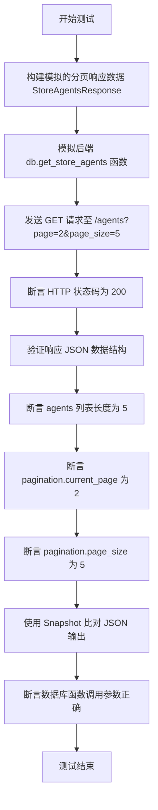

#### 带注释源码

```python
def test_get_agents_pagination(
    mocker: pytest_mock.MockFixture,
    snapshot: Snapshot,
) -> None:
    # 1. 准备模拟的返回数据：模拟包含5个Agent的列表，以及特定的分页元数据（第2页，每页5条，共15条）
    mocked_value = store_model.StoreAgentsResponse(
        agents=[
            store_model.StoreAgent(
                slug=f"agent-{i}",
                agent_name=f"Agent {i}",
                agent_image=f"agent{i}.jpg",
                creator="creator1",
                creator_avatar="avatar1.jpg",
                sub_heading=f"Agent {i} subheading",
                description=f"Agent {i} description",
                runs=i * 10,
                rating=4.0,
                agent_graph_id="test-graph-2",
            )
            for i in range(5)
        ],
        pagination=store_model.Pagination(
            current_page=2,
            total_items=15,
            total_pages=3,
            page_size=5,
        ),
    )
    
    # 2. 模拟数据库函数，使其返回上面构造的数据
    mock_db_call = mocker.patch("backend.api.features.store.db.get_store_agents")
    mock_db_call.return_value = mocked_value
    
    # 3. 发送带分页参数的GET请求
    response = client.get("/agents?page=2&page_size=5")
    
    # 4. 验证请求成功
    assert response.status_code == 200
    
    # 5. 验证返回数据结构
    data = store_model.StoreAgentsResponse.model_validate(response.json())
    
    # 6. 断言分页逻辑是否按预期执行
    assert len(data.agents) == 5
    assert data.pagination.current_page == 2
    assert data.pagination.page_size == 5
    
    # 7. 使用快照测试确保JSON输出格式不变
    snapshot.snapshot_dir = "snapshots"
    snapshot.assert_match(json.dumps(response.json(), indent=2), "agts_pagination")
    
    # 8. 验证后端是否被正确调用，且参数包含了请求的分页信息
    mock_db_call.assert_called_once_with(
        featured=False,
        creators=None,
        sorted_by=None,
        search_query=None,
        category=None,
        page=2,
        page_size=5,
    )
```


### `test_get_agents_malformed_request`

该函数用于测试当向获取 agents 列表的 API 发送格式错误的请求参数（例如无效的分页参数）时，系统的行为是否符合预期。它验证了 API 能够正确拦截负数页码、零页面大小以及非数值参数，并返回 HTTP 422（Unprocessable Entity）状态码，同时确保在此类验证失败的情况下不会触发后端数据库查询。

参数：

-  `mocker`：`pytest_mock.MockFixture`，Pytest 的 mocker 夹具，用于模拟和打补丁对象，以验证函数调用情况。

返回值：`None`，无显式返回值。

#### 流程图

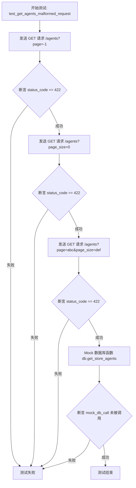

#### 带注释源码

```python
def test_get_agents_malformed_request(mocker: pytest_mock.MockFixture):
    # Test with invalid page number
    # 测试场景1：使用负数作为页码，预期返回 422 错误
    response = client.get("/agents?page=-1")
    assert response.status_code == 422

    # Test with invalid page size
    # 测试场景2：使用 0 作为页面大小，预期返回 422 错误
    response = client.get("/agents?page_size=0")
    assert response.status_code == 422

    # Test with non-numeric values
    # 测试场景3：使用非数字字符串作为分页参数，预期返回 422 错误
    response = client.get("/agents?page=abc&page_size=def")
    assert response.status_code == 422

    # Verify no DB calls were made
    # 验证环节：确保在请求验证失败的情况下，没有调用数据库查询函数
    # 这验证了输入验证发生在数据库交互层之前
    mock_db_call = mocker.patch("backend.api.features.store.db.get_store_agents")
    mock_db_call.assert_not_called()
```


### `test_get_agent_details`

该函数是一个单元测试，用于测试获取特定 Agent 详情的 API 端点。它模拟数据库返回的数据，通过测试客户端发起 HTTP GET 请求，验证响应的状态码、数据内容、快照一致性以及后端数据库调用参数的正确性。

参数：

-  `mocker`：`pytest_mock.MockFixture`，Pytest 的 fixture，用于模拟（mock）外部依赖和函数调用。
-  `snapshot`：`Snapshot`，Pytest 的 fixture，用于执行快照测试，对比输出是否符合预期。

返回值：`None`，该函数不返回任何值，主要用于执行测试断言。

#### 流程图

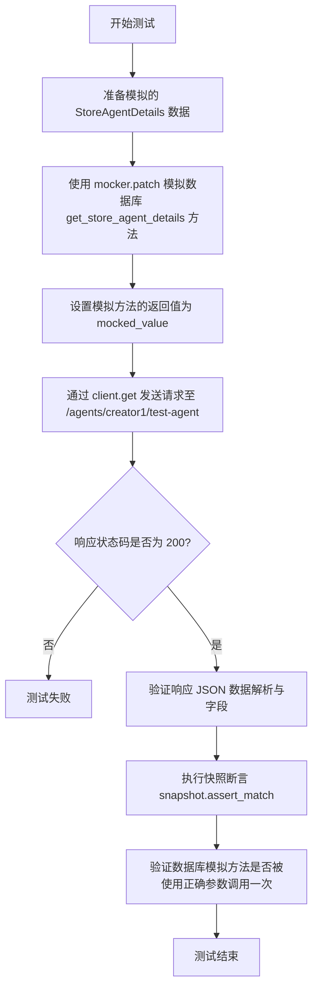

#### 带注释源码

```python
def test_get_agent_details(
    mocker: pytest_mock.MockFixture,
    snapshot: Snapshot,
) -> None:
    # 1. 准备模拟返回的 Agent 详细数据对象
    mocked_value = store_model.StoreAgentDetails(
        store_listing_version_id="test-version-id",
        slug="test-agent",
        agent_name="Test Agent",
        agent_video="video.mp4",
        agent_output_demo="demo.mp4",
        agent_image=["image1.jpg", "image2.jpg"],
        creator="creator1",
        creator_avatar="avatar1.jpg",
        sub_heading="Test agent subheading",
        description="Test agent description",
        categories=["category1", "category2"],
        runs=100,
        rating=4.5,
        versions=["1.0.0", "1.1.0"],
        agentGraphVersions=["1", "2"],
        agentGraphId="test-graph-id",
        last_updated=FIXED_NOW,
    )
    
    # 2. 模拟后端数据库调用 'backend.api.features.store.db.get_store_agent_details'
    mock_db_call = mocker.patch("backend.api.features.store.db.get_store_agent_details")
    mock_db_call.return_value = mocked_value

    # 3. 发送 GET 请求获取特定 Agent 详情
    response = client.get("/agents/creator1/test-agent")
    
    # 4. 断言 HTTP 响应状态码为 200
    assert response.status_code == 200

    # 5. 验证响应数据能否正确解析为模型，并检查关键字段
    data = store_model.StoreAgentDetails.model_validate(response.json())
    assert data.agent_name == "Test Agent"
    assert data.creator == "creator1"
    
    # 6. 使用快照测试确保响应 JSON 格式内容符合预期
    snapshot.snapshot_dir = "snapshots"
    snapshot.assert_match(json.dumps(response.json(), indent=2), "agt_details")
    
    # 7. 验证底层数据库函数是否被预期的参数调用了一次
    mock_db_call.assert_called_once_with(
        username="creator1", agent_name="test-agent", include_changelog=False
    )
```


### `test_get_creators_defaults`

该函数用于测试获取创作者列表接口（`/creators`）在默认参数情况下的行为，验证API能正确返回空的创作者列表和分页信息，并确保后端数据库调用时使用了正确的默认参数。

参数：

-  `mocker`：`pytest_mock.MockFixture`，用于模拟（mock）后端数据库调用，隔离测试环境。
-  `snapshot`：`Snapshot`，用于对API响应结果进行快照断言，确保输出格式的一致性。

返回值：`None`，该函数为测试函数，无返回值，主要通过断言验证逻辑。

#### 流程图

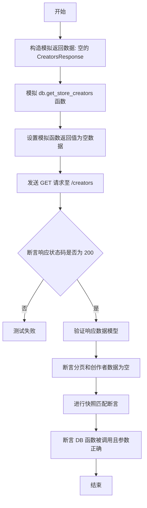

#### 带注释源码

```python
def test_get_creators_defaults(
    mocker: pytest_mock.MockFixture,
    snapshot: Snapshot,
) -> None:
    # 构造一个模拟的空响应对象，包含空的创作者列表和初始分页信息
    mocked_value = store_model.CreatorsResponse(
        creators=[],
        pagination=store_model.Pagination(
            current_page=0,
            total_items=0,
            total_pages=0,
            page_size=10,
        ),
    )
    # 模拟数据库访问函数 backend.api.features.store.db.get_store_creators
    mock_db_call = mocker.patch("backend.api.features.store.db.get_store_creators")
    # 设置模拟函数的返回值为上面构造的空响应对象
    mock_db_call.return_value = mocked_value

    # 调用客户端发送 GET 请求到 /creators 端点，不带任何查询参数
    response = client.get("/creators")
    # 断言 HTTP 响应状态码为 200 (OK)
    assert response.status_code == 200

    # 使用 Pydantic 模型验证响应的 JSON 数据
    data = store_model.CreatorsResponse.model_validate(response.json())
    # 断言返回的分页总页数为 0
    assert data.pagination.total_pages == 0
    # 断言返回的创作者列表为空
    assert data.creators == []
    
    # 配置快照目录并对 JSON 响应进行快照断言，确保未来改动不会意外影响输出格式
    snapshot.snapshot_dir = "snapshots"
    snapshot.assert_match(json.dumps(response.json(), indent=2), "def_creators")
    
    # 验证底层数据库函数被调用了一次，且使用了预期的默认参数
    mock_db_call.assert_called_once_with(
        featured=False, search_query=None, sorted_by=None, page=1, page_size=20
    )
```


### `test_get_creators_pagination`

该函数用于测试获取创作者列表API接口的分页功能。它验证了当请求指定页码和页面大小时，后端能够正确处理请求，返回符合预期分页元数据和内容数量的响应，并确保数据库调用参数正确。

参数：

-  `mocker`：`pytest_mock.MockFixture`，Pytest的Mock夹具，用于模拟数据库调用行为。
-  `snapshot`：`Snapshot`，Pytest的快照夹具，用于验证API响应的JSON结构是否符合预期快照。

返回值：`None`，该函数为测试函数，不返回任何值，主要通过断言验证逻辑。

#### 流程图

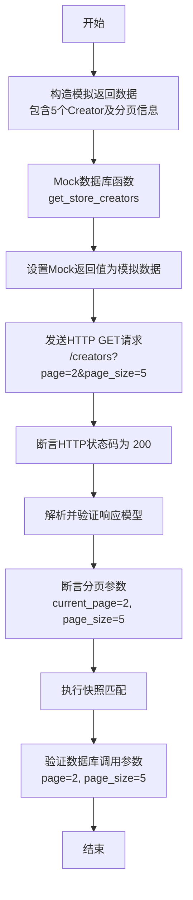

#### 带注释源码

```python
def test_get_creators_pagination(
    mocker: pytest_mock.MockFixture,
    snapshot: Snapshot,
) -> None:
    # 1. 准备模拟的返回数据，包含5个Creator对象和分页元数据
    mocked_value = store_model.CreatorsResponse(
        creators=[
            store_model.Creator(
                name=f"Creator {i}",
                username=f"creator{i}",
                description=f"Creator {i} description",
                avatar_url=f"avatar{i}.jpg",
                num_agents=1,
                agent_rating=4.5,
                agent_runs=100,
                is_featured=False,
            )
            for i in range(5)
        ],
        pagination=store_model.Pagination(
            current_page=2,
            total_items=15,
            total_pages=3,
            page_size=5,
        ),
    )
    # 2. 模拟数据库查询函数 get_store_creators
    mock_db_call = mocker.patch("backend.api.features.store.db.get_store_creators")
    # 3. 设置模拟函数的返回值为上面构造的数据
    mock_db_call.return_value = mocked_value

    # 4. 使用测试客户端发送带有分页参数的GET请求
    response = client.get("/creators?page=2&page_size=5")
    # 5. 验证HTTP响应状态码为200
    assert response.status_code == 200

    # 6. 验证返回的JSON数据符合 CreatorsResponse 模型
    data = store_model.CreatorsResponse.model_validate(response.json())
    # 7. 断言返回的创作者数量为5
    assert len(data.creators) == 5
    # 8. 断言分页信息正确（当前页为2，每页大小为5）
    assert data.pagination.current_page == 2
    assert data.pagination.page_size == 5
    
    # 9. 配置快照目录并进行快照匹配，确保响应结构未改变
    snapshot.snapshot_dir = "snapshots"
    snapshot.assert_match(json.dumps(response.json(), indent=2), "creators_pagination")
    
    # 10. 验证数据库函数被正确调用，且传入的参数符合预期
    mock_db_call.assert_called_once_with(
        featured=False, search_query=None, sorted_by=None, page=2, page_size=5
    )
```


### `test_get_creators_malformed_request`

该函数用于测试当获取创建者列表的 API 接收到格式错误的请求参数（如负数页码、零页大小或非数字字符）时，是否能正确返回 HTTP 422 状态码，并确保在这些验证失败的情况下未执行数据库查询。

参数：

- `mocker`：`pytest_mock.MockFixture`，用于模拟对象和验证调用的 pytest fixture。

返回值：`None`，该函数通过断言验证测试结果，不返回任何值。

#### 流程图

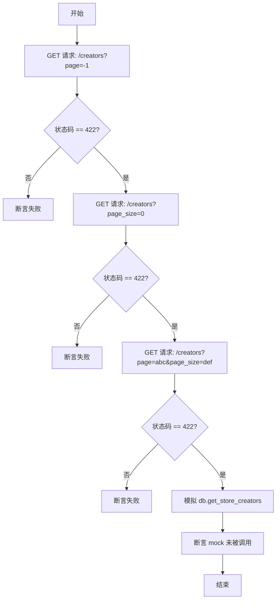

#### 带注释源码

```python
def test_get_creators_malformed_request(mocker: pytest_mock.MockFixture):
    # 测试无效的页码（负数）
    response = client.get("/creators?page=-1")
    assert response.status_code == 422  # 期望返回 Unprocessable Entity

    # 测试无效的页大小（0）
    response = client.get("/creators?page_size=0")
    assert response.status_code == 422  # 期望返回 Unprocessable Entity

    # 测试非数字参数
    response = client.get("/creators?page=abc&page_size=def")
    assert response.status_code == 422  # 期望返回 Unprocessable Entity

    # 验证没有进行任何数据库调用
    mock_db_call = mocker.patch("backend.api.features.store.db.get_store_creators")
    mock_db_call.assert_not_called()
```


### `test_get_creator_details`

该函数是一个测试用例，旨在验证获取特定创建者详情的 API 端点 (`/creator/{username}`) 的功能正确性。它通过模拟数据库调用，构造预期的返回数据，向测试客户端发送 GET 请求，并断言响应的状态码、数据结构、关键字段以及快照一致性，同时确认后端数据库调用参数符合预期。

参数：

-  `mocker`：`pytest_mock.MockFixture`，Pytest 提供的 mock fixture，用于模拟（patch）数据库调用函数。
-  `snapshot`：`Snapshot`，用于快照测试的 fixture，用于比对该次响应与预设的快照数据是否一致。

返回值：`None`，该函数为测试用例，主要用于断言验证，无显式业务返回值。

#### 流程图

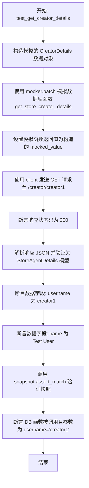

#### 带注释源码

```python
def test_get_creator_details(
    mocker: pytest_mock.MockFixture,
    snapshot: Snapshot,
) -> None:
    # 1. 准备模拟数据：构建一个 CreatorDetails 对象，包含创建者的详细信息
    mocked_value = store_model.CreatorDetails(
        name="Test User",
        username="creator1",
        description="Test creator description",
        links=["link1.com", "link2.com"],
        avatar_url="avatar.jpg",
        agent_rating=4.8,
        agent_runs=1000,
        top_categories=["category1", "category2"],
    )
    
    # 2. 模拟数据库调用：替换后端数据库函数，避免进行真实数据库操作
    mock_db_call = mocker.patch(
        "backend.api.features.store.db.get_store_creator_details"
    )
    # 3. 设置模拟函数的返回值
    mock_db_call.return_value = mocked_value

    # 4. 发送请求：使用测试客户端请求特定创建者的详情接口
    response = client.get("/creator/creator1")
    
    # 5. 验证状态码：断言 HTTP 响应状态为 200 OK
    assert response.status_code == 200

    # 6. 验证数据模型：将响应 JSON 解析为 Pydantic 模型并验证
    data = store_model.CreatorDetails.model_validate(response.json())
    # 7. 断言关键字段内容：检查用户名是否正确
    assert data.username == "creator1"
    # 8. 断言关键字段内容：检查创建者名称是否正确
    assert data.name == "Test User"
    
    # 9. 快照测试：配置快照目录并断言响应 JSON 与保存的快照一致
    snapshot.snapshot_dir = "snapshots"
    snapshot.assert_match(json.dumps(response.json(), indent=2), "creator_details")
    
    # 10. 验证调用情况：断言数据库函数被且仅被调用一次，且参数正确
    mock_db_call.assert_called_once_with(username="creator1")
```


### `test_get_submissions_success`

该测试用例验证了在用户成功获取提交列表时的行为。通过模拟数据库返回值，它向 '/submissions' 端点发送请求，检查 HTTP 状态码、响应数据的结构（包括具体字段和分页）、以及快照匹配情况，并确认了底层数据库调用是否使用了正确的用户ID和分页参数。

参数：

- `mocker`：`pytest_mock.MockFixture`，Pytest fixture，用于模拟对象和打补丁。
- `snapshot`：`Snapshot`，Pytest fixture，用于快照测试以验证输出一致性。
- `test_user_id`：`str`，Pytest fixture，代表当前测试用户的ID。

返回值：`None`，该函数为测试用例，无返回值，主要通过断言验证行为。

#### 流程图

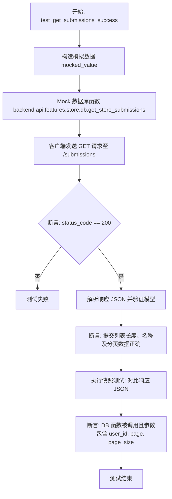

#### 带注释源码

```python
def test_get_submissions_success(
    mocker: pytest_mock.MockFixture,
    snapshot: Snapshot,
    test_user_id: str,
) -> None:
    # 1. 准备模拟的数据库返回数据，包含一个已批准的提交和分页信息
    mocked_value = store_model.StoreSubmissionsResponse(
        submissions=[
            store_model.StoreSubmission(
                listing_id="test-listing-id",
                name="Test Agent",
                description="Test agent description",
                image_urls=["test.jpg"],
                date_submitted=FIXED_NOW,
                status=prisma.enums.SubmissionStatus.APPROVED,
                runs=50,
                rating=4.2,
                agent_id="test-agent-id",
                agent_version=1,
                sub_heading="Test agent subheading",
                slug="test-agent",
                video_url="test.mp4",
                categories=["test-category"],
            )
        ],
        pagination=store_model.Pagination(
            current_page=1,
            total_items=1,
            total_pages=1,
            page_size=20,
        ),
    )
    # 2. 模拟后端数据库调用函数，指定其返回值
    mock_db_call = mocker.patch("backend.api.features.store.db.get_store_submissions")
    mock_db_call.return_value = mocked_value

    # 3. 发送 GET 请求获取提交列表
    response = client.get("/submissions")
    # 4. 验证 HTTP 状态码为 200
    assert response.status_code == 200

    # 5. 验证响应数据模型
    data = store_model.StoreSubmissionsResponse.model_validate(response.json())
    # 6. 断言提交列表数量和具体名称
    assert len(data.submissions) == 1
    assert data.submissions[0].name == "Test Agent"
    # 7. 断言分页信息
    assert data.pagination.current_page == 1
    
    # 8. 配置快照目录并进行快照断言，确保响应格式未变更
    snapshot.snapshot_dir = "snapshots"
    snapshot.assert_match(json.dumps(response.json(), indent=2), "sub_success")
    
    # 9. 验证数据库函数是否被正确调用，包含正确的用户ID和默认分页参数
    mock_db_call.assert_called_once_with(user_id=test_user_id, page=1, page_size=20)
```


### `test_get_submissions_pagination`

该函数用于测试获取商店提交记录（submissions）列表时的分页功能。它模拟了数据库返回包含特定分页元数据的场景，验证 API 端点在接收到分页查询参数（`page` 和 `page_size`）时，能否正确解析参数、返回预期的数据结构及分页详情，并确保底层服务被以正确的参数调用。

参数：

-  `mocker`：`pytest_mock.MockFixture`，Pytest 的 mocker 固件，用于模拟（patch）数据库调用函数。
-  `snapshot`：`Snapshot`，用于快照测试的固件，验证响应数据是否符合预期格式。
-  `test_user_id`：`str`，测试用的用户 ID 固件，模拟当前登录用户的身份。

返回值：`None`，该函数为测试用例，没有返回值，主要通过断言（assert）验证结果。

#### 流程图

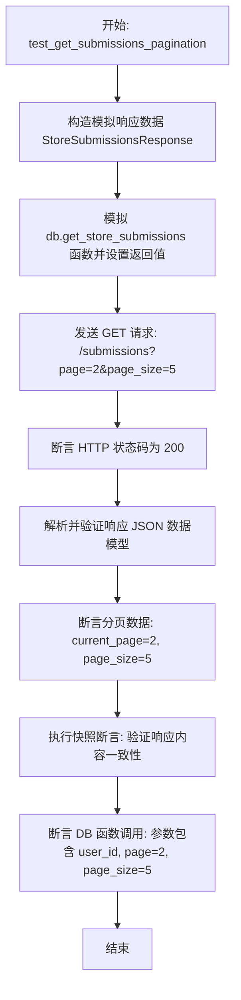

#### 带注释源码

```python
def test_get_submissions_pagination(
    mocker: pytest_mock.MockFixture,
    snapshot: Snapshot,
    test_user_id: str,
) -> None:
    # 1. 准备模拟的数据库返回数据
    # 创建一个空的提交列表，并设置特定的分页元数据（当前页2，总条目10，总页数2，每页5条）
    mocked_value = store_model.StoreSubmissionsResponse(
        submissions=[],
        pagination=store_model.Pagination(
            current_page=2,
            total_items=10,
            total_pages=2,
            page_size=5,
        ),
    )
    # 2. 使用 mocker 替换实际的数据库调用函数
    mock_db_call = mocker.patch("backend.api.features.store.db.get_store_submissions")
    mock_db_call.return_value = mocked_value

    # 3. 发送带有分页参数的 GET 请求
    response = client.get("/submissions?page=2&page_size=5")
    
    # 4. 验证响应状态码是否为 200 (OK)
    assert response.status_code == 200

    # 5. 验证响应数据的结构是否符合 Pydantic 模型
    data = store_model.StoreSubmissionsResponse.model_validate(response.json())
    
    # 6. 验证返回的分页信息是否与请求参数一致
    assert data.pagination.current_page == 2
    assert data.pagination.page_size == 5
    
    # 7. 使用快照验证完整的 JSON 响应结构
    snapshot.snapshot_dir = "snapshots"
    snapshot.assert_match(json.dumps(response.json(), indent=2), "sub_pagination")
    
    # 8. 验证底层数据库函数是否被正确调用
    # 确保传入的参数包含了测试用户 ID 以及正确的分页参数
    mock_db_call.assert_called_once_with(user_id=test_user_id, page=2, page_size=5)
```


### `test_get_submissions_malformed_request`

Tests the `/submissions` API endpoint with malformed query parameters (invalid page numbers, invalid page sizes, and non-numeric values) to ensure that the request validation layer correctly rejects the input with a 422 Unprocessable Entity status code and that no database calls are made during these scenarios.

参数：

-  `mocker`：`pytest_mock.MockFixture`，Pytest fixture provided by pytest-mock for mocking and patching objects.

返回值：`None`，This is a test function and does not return a value. It performs assertions to verify behavior.

#### 流程图

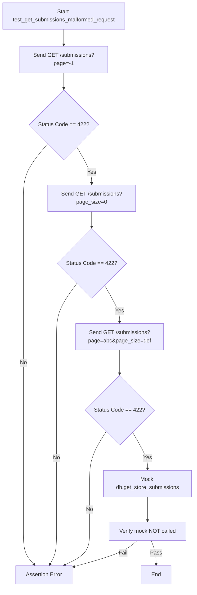

#### 带注释源码

```python
def test_get_submissions_malformed_request(mocker: pytest_mock.MockFixture):
    # Test with invalid page number (negative value)
    # Expects validation to fail before reaching the database logic
    response = client.get("/submissions?page=-1")
    assert response.status_code == 422

    # Test with invalid page size (zero)
    # Page size should be a positive integer
    response = client.get("/submissions?page_size=0")
    assert response.status_code == 422

    # Test with non-numeric values for page and page_size
    # Expects type validation to fail
    response = client.get("/submissions?page=abc&page_size=def")
    assert response.status_code == 422

    # Verify no DB calls were made
    # Ensures that the request validation layer is working correctly
    # and prevents invalid data from reaching the service layer
    mock_db_call = mocker.patch("backend.api.features.store.db.get_store_submissions")
    mock_db_call.assert_not_called()
```


## 关键组件


### Store API Router
包含处理 Agents、Creators 和 Submissions 相关 HTTP 请求端点的 FastAPI 路由器组件。

### Mock Database Layer
测试基础设施组件，通过模拟数据库函数调用来隔离路由逻辑，提供确定性的测试数据。

### Authentication Dependency Override
测试配置组件，用于覆盖应用的 JWT 认证依赖，以模拟用户身份并绕过真实的安全检查。

### Pagination System
核心功能组件，负责将 Agents、Creators 和 Submissions 列表分割为页面，由 `page` 和 `page_size` 参数控制。

### Filtering and Search Mechanism
核心功能组件，允许根据特定条件（如 featured、creator、category 或 search_query）筛选资源。

### Pydantic Data Models
数据契约组件，定义 API 请求和响应的结构（例如 `StoreAgentsResponse`、`StoreAgentDetails`）。

### Snapshot Test Utility
质量保证组件，用于将 API 响应与存储的快照进行匹配，以检测意外的输出格式变更。


## 问题及建议


### 已知问题

-   **代码重复严重**：针对畸形请求的测试函数（`test_get_agents_malformed_request`、`test_get_creators_malformed_request`、`test_get_submissions_malformed_request`）逻辑几乎完全一致，违反了 DRY（Don't Repeat Yourself）原则，增加了维护成本。
-   **配置冗余**：在每个测试函数中重复设置 `snapshot.snapshot_dir = "snapshots"`，导致测试代码充斥着非核心逻辑的配置语句，且修改配置时需改动多处。
-   **Mock 路径硬编码**：使用字符串字面量指定 Mock 路径（如 `"backend.api.features.store.db.get_store_agents"`），这种“魔术字符串”在项目重构或模块移动时极易失效，且 IDE 难以进行静态检查和重构。
-   **测试数据构造繁琐**：手动构建复杂的 Pydantic 模型（如 `StoreAgentsResponse`、`Pagination` 等）作为 Mock 返回值，代码冗长且可读性差，容易分散对测试核心逻辑的关注。

### 优化建议

-   **使用参数化测试**：利用 `pytest.mark.parametrize` 将针对不同端点（agents, creators, submissions）的畸形请求测试合并为一个参数化测试函数，统一验证输入校验逻辑。
-   **集中配置管理**：将快照目录配置移至 `conftest.py` 的 pytest fixture 中，或配置在 `pyproject.toml`/`pytest.ini` 中，从源头消除测试代码中的重复配置。
-   **引入数据工厂或 Fixture**：使用 `factory_boy` 或编写辅助 Fixture 来生成标准的测试数据模型（如 `mock_agent_response`、`mock_creator_response`），简化 Mock 数据的构造过程。
-   **封装 Mock 逻辑**：为常用的数据库调用 Mock（如 `db.get_store_agents`）创建专用的 Fixture，避免在每个测试中重复编写 `mocker.patch` 和返回值设置逻辑。
-   **提取公共断言逻辑**：将分页信息校验、响应状态码校验等通用断言封装为辅助函数，进一步提高测试代码的简洁性和可读性。


## 其它


### 设计目标与约束

**设计目标：**
1.  **功能验证**：确保 Store 模块的核心 API 端点（包括获取 Agents、Creators 和 Submissions）在不同查询参数（如搜索、排序、分页、筛选）下的行为符合预期。
2.  **回归测试**：通过 Snapshot（快照）测试机制，锁定 API 响应的 JSON 结构，防止未来的代码变更意外修改响应格式。
3.  **隔离性**：测试不应依赖真实的后端数据库或真实的认证服务，所有外部交互必须被模拟。

**约束：**
1.  **Mock 强制**：数据库调用 (`backend.api.features.store.db.*`) 必须被 `mocker.patch` 替换，严禁在测试中产生真实的 I/O 操作。
2.  **时间固定**：使用 `FIXED_NOW` (2023-01-01) 作为固定时间戳，确保涉及时间字段的测试结果可复现，不受测试执行时间影响。
3.  **认证覆盖**：利用 FastAPI 的 `dependency_overrides` 机制，强制替换 `get_jwt_payload` 为 Mock 函数，以通过认证检查。
4.  **参数验证**：API 层必须严格校验分页参数（如 `page` 不能小于 1，`page_size` 不能小于 1），期望返回 HTTP 422 状态码。

### 错误处理与异常设计

**输入验证错误：**
*   **设计策略**：依赖 FastAPI 的自动请求验证机制（基于 Pydantic 模型）。
*   **测试用例**：显式测试了分页参数的边界情况（负数、零、非数字字符串），期望后端返回 `422 Unprocessable Entity` 状态码。
*   **处理逻辑**：当参数验证失败时，FastAPI 自动拦截请求并返回错误详情，测试代码验证 `response.status_code == 422` 并断言数据库函数未被调用（`assert_not_called`），确保错误发生在业务逻辑之前。

**业务逻辑异常：**
*   **模拟策略**：由于数据库层被完全模拟，本测试代码不直接处理数据库连接错误或查询异常。这假设了路由层的错误处理逻辑已在其他地方测试，或者路由层仅在 DB 抛出异常时返回 500。
*   **状态码断言**：对于成功的业务逻辑路径，统一断言 `response.status_code == 200`。

### 数据流与状态机

**数据流：**
1.  **请求发起**：测试代码使用 `fastapi.testclient.TestClient` 发起 HTTP 请求（GET 请求）。
2.  **认证拦截**：请求经过 FastAPI 的依赖注入系统。由于 `app.dependency_overrides` 已被配置，`get_jwt_payload` 被替换为 Mock 对象，直接返回预设的用户信息，跳过真实 JWT 解析。
3.  **路由处理**：请求到达 `store_routes.router` 中对应的端点处理函数。
4.  **业务逻辑模拟**：处理函数调用 `backend.api.features.store.db` 模块中的函数（如 `get_store_agents`）。由于这些函数已被 `mocker.patch` 拦截，返回预先构造的 Mock 数据（`store_model` 对象）。
5.  **响应序列化**：FastAPI 将 Mock 返回的 Pydantic 模型序列化为 JSON 格式。
6.  **结果验证**：
    *   **结构验证**：测试代码将 JSON 解析回 Pydantic 模型进行字段断言。
    *   **快照验证**：使用 `snapshot.assert_match` 对比当前 JSON 输出与历史快照文件，确保结构一致性。

**状态管理：**
*   **无状态设计**：API 本身是无状态的，每个请求独立处理。
*   **应用级状态**：`app` 实例在模块加载时创建。`setup_app_auth` fixture 利用 `yield` 机制在测试前后清理 `dependency_overrides`，确保测试之间的认证 Mock 配置互不污染。

### 外部依赖与接口契约

**内部模块依赖（通过 Mock 模拟）：**
1.  **数据库访问层 (`backend.api.features.store.db`)**
    *   `get_store_agents`:
        *   **契约**: 接收 `featured`, `creators`, `sorted_by`, `search_query`, `category`, `page`, `page_size` 参数，返回 `StoreAgentsResponse`。
    *   `get_store_agent_details`:
        *   **契约**: 接收 `username`, `agent_name`, `include_changelog` 参数，返回 `StoreAgentDetails`。
    *   `get_store_creators`:
        *   **契约**: 接收 `featured`, `search_query`, `sorted_by`, `page`, `page_size` 参数，返回 `CreatorsResponse`。
    *   `get_store_creator_details`:
        *   **契约**: 接收 `username` 参数，返回 `CreatorDetails`。
    *   `get_store_submissions`:
        *   **契约**: 接收 `user_id`, `page`, `page_size` 参数，返回 `StoreSubmissionsResponse`。

2.  **认证与授权 (`autogpt_libs.auth.jwt_utils`)**
    *   `get_jwt_payload`:
        *   **契约**: 通常解析 HTTP Header 中的 JWT Token 并返回 Payload 对象。在测试中被 Mock，返回预设的字典数据（通过 `mock_jwt_user` fixture 注入）。

**库依赖：**
*   **FastAPI**: 提供路由、依赖注入和测试客户端。
*   **Pydantic (via `store_model`)**: 定义数据模型的契约，确保输入输出的数据结构严格。
*   **pytest-snapshot**: 提供快照测试能力，用于验证 JSON 输出的一致性契约。

    