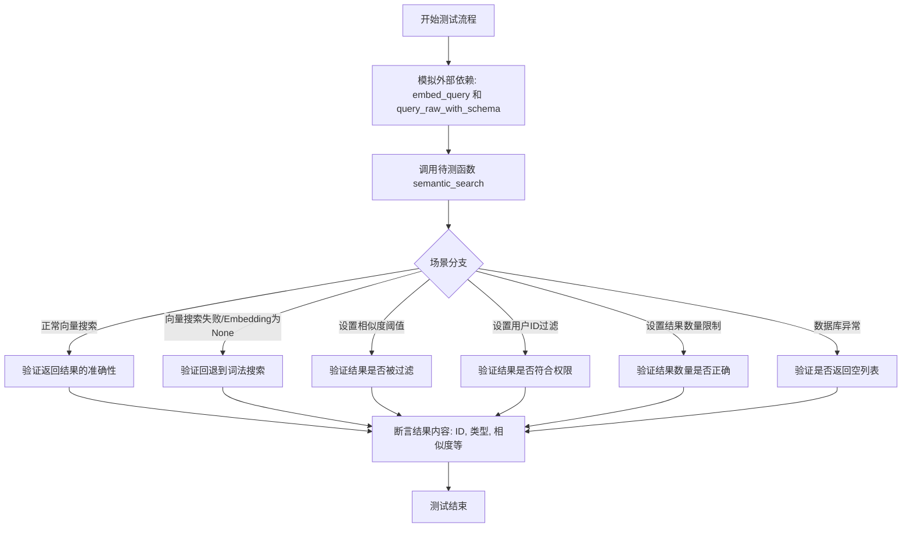
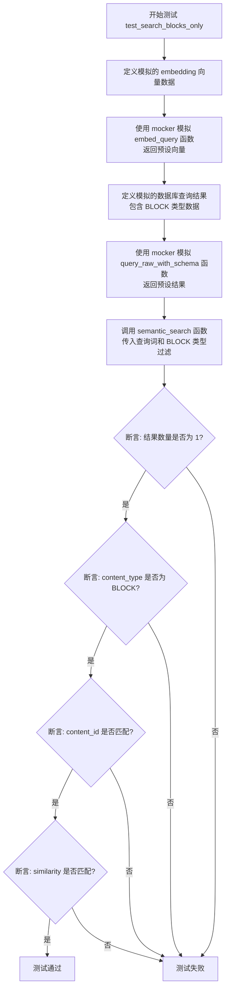
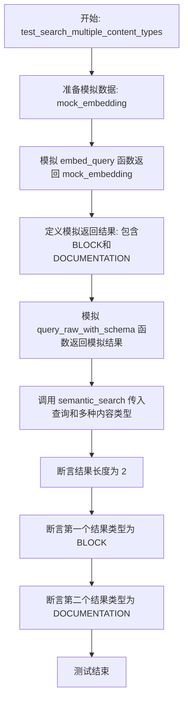
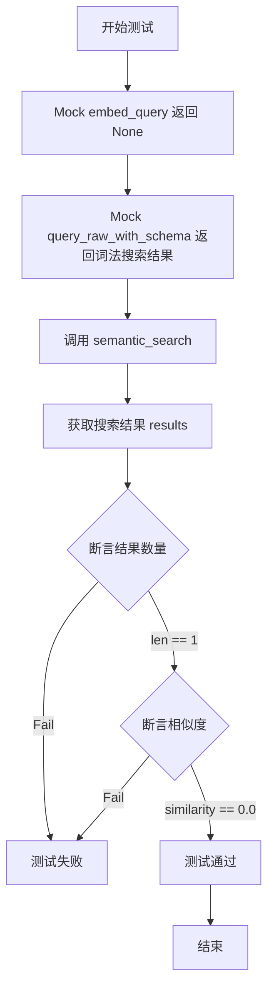
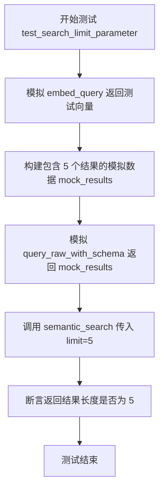
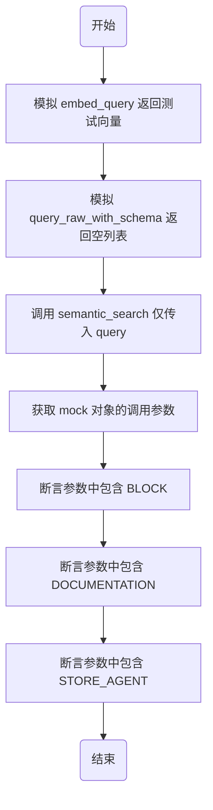
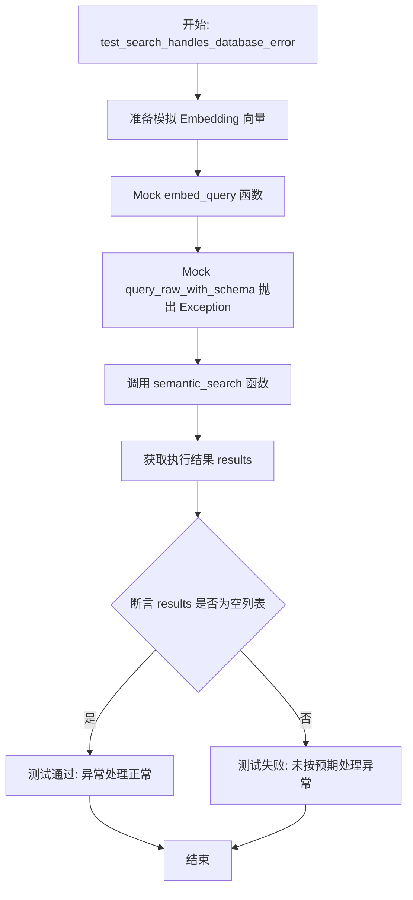

# `AutoGPT\autogpt_platform\backend\backend\api\features\store\semantic_search_test.py` 详细设计文档

该文件包含针对语义搜索功能的集成测试用例，用于验证 semantic_search 函数在不同场景下的行为，包括搜索特定内容类型、多类型搜索、相似度阈值过滤、向量搜索失败后的词法搜索回退、空查询处理、用户ID过滤、结果限制、默认内容类型以及数据库错误处理。

## 整体流程



## 类结构

```
No classes defined (Test File)
Global Functions
├── test_search_blocks_only
├── test_search_multiple_content_types
├── test_search_with_min_similarity_threshold
├── test_search_fallback_to_lexical
├── test_search_empty_query
├── test_search_with_user_id_filter
├── test_search_limit_parameter
├── test_search_default_content_types
└── test_search_handles_database_error
```

## 全局变量及字段


### `EMBEDDING_DIM`
    
表示用于语义搜索的嵌入向量的维度大小。

类型：`int`
    


### `ContentType`
    
定义不同内容类型（如 BLOCK、DOCUMENTATION 等）的枚举，用于在搜索时进行内容类型过滤。

类型：`Enum`
    


    

## 全局函数及方法


### `semantic_search`

该函数是一个异步搜索接口，旨在通过向量嵌入技术执行语义搜索。它支持对多种内容类型（如代码块、文档、代理等）进行检索，允许根据相似度阈值、用户ID及结果数量限制进行过滤。若向量嵌入服务不可用，函数具备回退到词法搜索的能力，并能优雅地处理空查询及数据库异常。

参数：

-   `query`：`str`，待搜索的查询字符串，用于生成嵌入向量或执行词法匹配。
-   `content_types`：`List[ContentType]` (可选)，用于限定搜索范围的内容类型列表（如 BLOCK, DOCUMENTATION 等），默认包含 BLOCK, STORE_AGENT 和 DOCUMENTATION。
-   `min_similarity`：`float` (可选)，搜索结果的最小相似度阈值，低于此分数的结果将被过滤掉。
-   `user_id`：`str` (可选)，用户标识符，用于筛选特定用户的私有内容。
-   `limit`：`int` (可选)，返回结果的最大数量限制。

返回值：`List[Dict[str, Any]]`，包含搜索结果的列表。每个结果是一个字典，通常包含 `content_id`、`content_type`、`searchable_text`、`metadata` 和 `similarity` 字段。如果查询为空或发生错误，返回空列表。

#### 流程图

```mermaid
graph TD
    A[开始 semantic_search] --> B{Query 是否为空或仅空格?}
    B -- 是 --> C[返回空列表 []]
    B -- 否 --> D[调用 embed_query 获取向量]
    D --> E{向量生成是否成功?}
    E -- 失败/返回 None --> F[执行词法搜索模式]
    E -- 成功 --> G[执行向量搜索模式]
    F --> H[构建查询 SQL<br/>应用 content_types, user_id, limit]
    G --> H
    H --> I[调用 query_raw_with_schema 执行查询]
    I --> J{执行过程中发生异常?}
    J -- 是 --> C
    J -- 否 --> K[返回搜索结果列表]
```

#### 带注释源码

*注意：由于提供的代码是测试代码，以下是结合测试用例推断出的函数实现逻辑，用于说明其工作原理。*

```python
async def semantic_search(
    query: str,
    content_types: Optional[List[ContentType]] = None,
    min_similarity: float = 0.0,
    user_id: Optional[str] = None,
    limit: int = 10
) -> List[Dict[str, Any]]:
    """
    执行语义搜索，支持向量搜索和词法搜索回退。
    """
    # 1. 处理空查询
    if not query or not query.strip():
        return []

    # 2. 设置默认内容类型
    # 测试用例 test_search_default_content_types 表明默认包括 BLOCK, STORE_AGENT, DOCUMENTATION
    if content_types is None:
        content_types = [ContentType.BLOCK, ContentType.STORE_AGENT, ContentType.DOCUMENTATION]

    try:
        # 3. 尝试获取查询的向量嵌入
        embedding = await embed_query(query)

        # 4. 根据是否获取到向量决定搜索策略
        if embedding is None:
            # 向量获取失败，回退到词法搜索
            # 此时 similarity 通常为 0.0
            search_query = _build_lexical_search_query(query, content_types, user_id, limit)
        else:
            # 向量获取成功，执行语义搜索
            # 此时会应用 min_similarity 过滤
            search_query = _build_vector_search_query(embedding, content_types, user_id, min_similarity, limit)

        # 5. 执行数据库查询
        results = await query_raw_with_schema(search_query)
        
        # 确保相似度过滤 (取决于数据库层是否处理，此处做防御性过滤)
        if min_similarity > 0.0:
            results = [r for r in results if r.get("similarity", 0) >= min_similarity]

        return results

    except Exception as e:
        # 6. 异常处理
        # 测试用例 test_search_handles_database_error 表明错误时应返回空列表
        return []
```


### `test_search_blocks_only`

该函数是一个异步单元测试，旨在验证 `semantic_search` 函数在特定场景下的表现：即仅搜索 "BLOCK" 类型的内容。测试通过模拟外部依赖（嵌入生成和数据库查询），断言返回结果的正确性，包括结果数量、内容类型、ID 及相似度评分。

参数：

-   `mocker`：`pytest_mock.MockerFixture`，用于模拟（Mock）外部函数和对象，以便隔离测试环境。在此测试中，它用于替换 `embed_query` 和 `query_raw_with_schema` 的实现。

返回值：`None`，该函数为测试用例，不返回业务数据，通过内部的 `assert` 语句来验证逻辑是否符合预期。

#### 流程图



#### 带注释源码

```python
@pytest.mark.asyncio
async def test_search_blocks_only(mocker):
    """Test searching only BLOCK content type."""
    # 步骤 1: 准备模拟的 Embedding 向量，维度与系统常量 EMBEDDING_DIM 一致
    mock_embedding = [0.1] * EMBEDDING_DIM
    
    # 步骤 2: 模拟 embed_query 函数，使其在调用时返回上述向量
    # 这样测试就不需要真正去计算文本向量
    mocker.patch(
        "backend.api.features.store.embeddings.embed_query",
        return_value=mock_embedding,
    )

    # 步骤 3: 准备模拟的数据库查询结果，模拟一个 BLOCK 类型的记录
    mock_results = [
        {
            "content_id": "block-123",
            "content_type": "BLOCK",
            "searchable_text": "Calculator Block - Performs arithmetic operations",
            "metadata": {"name": "Calculator", "categories": ["Math"]},
            "similarity": 0.85,
        }
    ]
    
    # 步骤 4: 模拟数据库查询函数 query_raw_with_schema，使其返回上述结果
    mocker.patch(
        "backend.api.features.store.embeddings.query_raw_with_schema",
        return_value=mock_results,
    )

    # 步骤 5: 执行被测函数 semantic_search
    # 传入查询文本和限定内容类型为 [ContentType.BLOCK]
    results = await semantic_search(
        query="calculate numbers",
        content_types=[ContentType.BLOCK],
    )

    # 步骤 6: 验证结果是否符合预期
    assert len(results) == 1                      # 验证返回结果数量
    assert results[0]["content_type"] == "BLOCK"  # 验证内容类型过滤生效
    assert results[0]["content_id"] == "block-123"# 验证 ID 正确性
    assert results[0]["similarity"] == 0.85       # 验证相似度分值
```


### `test_search_multiple_content_types`

该函数是一个异步测试用例，旨在验证语义搜索功能在同时搜索多种内容类型（BLOCK 和 DOCUMENTATION）时的表现。通过模拟嵌入生成和数据库查询结果，确保系统能够正确返回并识别不同类型的数据。

参数：

-  `mocker`：`pytest_mock.MockerFixture`，用于模拟外部依赖项（如嵌入生成和数据库查询），以隔离测试环境。

返回值：`None`，该函数为测试用例，主要执行断言逻辑，无返回值。

#### 流程图



#### 带注释源码

```python
@pytest.mark.asyncio
async def test_search_multiple_content_types(mocker):
    """Test searching multiple content types simultaneously."""
    # 1. 准备模拟的嵌入向量数据
    mock_embedding = [0.1] * EMBEDDING_DIM
    
    # 2. 模拟 embed_query 函数，使其返回预设的嵌入向量
    mocker.patch(
        "backend.api.features.store.embeddings.embed_query",
        return_value=mock_embedding,
    )

    # 3. 准备模拟的数据库查询结果，包含 BLOCK 和 DOCUMENTATION 两种类型
    mock_results = [
        {
            "content_id": "block-123",
            "content_type": "BLOCK",
            "searchable_text": "Calculator Block",
            "metadata": {},
            "similarity": 0.85,
        },
        {
            "content_id": "doc-456",
            "content_type": "DOCUMENTATION",
            "searchable_text": "How to use Calculator",
            "metadata": {},
            "similarity": 0.75,
        },
    ]
    
    # 4. 模拟 query_raw_with_schema 函数，使其返回预设的查询结果
    mocker.patch(
        "backend.api.features.store.embeddings.query_raw_with_schema",
        return_value=mock_results,
    )

    # 5. 调用 semantic_search 函数，传入查询词和多种内容类型
    results = await semantic_search(
        query="calculator",
        content_types=[ContentType.BLOCK, ContentType.DOCUMENTATION],
    )

    # 6. 验证：断言返回结果数量为 2
    assert len(results) == 2
    # 7. 验证：断言第一个结果的类型为 BLOCK
    assert results[0]["content_type"] == "BLOCK"
    # 8. 验证：断言第二个结果的类型为 DOCUMENTATION
    assert results[1]["content_type"] == "DOCUMENTATION"
```


### `test_search_with_min_similarity_threshold`

该函数是一个异步测试用例，旨在验证 `semantic_search` 功能在设置了最小相似度阈值（`min_similarity`）时，能够正确过滤掉相似度低于该阈值的结果，仅保留满足条件的搜索结果。

参数：

-   `mocker`：`pytest_mock.MockerFixture`，Pytest 提供的 fixture 对象，用于模拟外部依赖和打补丁，以隔离测试环境。

返回值：`None`，这是一个测试函数，不返回具体的业务数据，主要通过断言来验证行为是否符合预期。

#### 流程图

```mermaid
graph TD
    A[开始测试 test_search_with_min_similarity_threshold] --> B[Mock embed_query 返回模拟向量]
    B --> C[Mock query_raw_with_schema 返回模拟结果<br/>similarity=0.85]
    C --> D[调用 semantic_search<br/>传入 min_similarity=0.7]
    D --> E[断言结果数量 len(results) == 1]
    E --> F{断言相似度结果<br/>results[0]['similarity'] >= 0.7}
    F -- 成功 --> G[测试通过]
    F -- 失败 --> H[测试失败]
```

#### 带注释源码

```python
@pytest.mark.asyncio
async def test_search_with_min_similarity_threshold(mocker):
    """Test that results below min_similarity are filtered out."""
    # 创建一个模拟的嵌入向量，维度为 EMBEDDING_DIM
    mock_embedding = [0.1] * EMBEDDING_DIM
    
    # 打补丁 mock 掉 embed_query 函数，使其返回模拟的嵌入向量
    mocker.patch(
        "backend.api.features.store.embeddings.embed_query",
        return_value=mock_embedding,
    )

    # 定义模拟的数据库查询结果
    # 只包含一个相似度为 0.85 的结果，用于测试当阈值为 0.7 时是否保留
    mock_results = [
        {
            "content_id": "block-123",
            "content_type": "BLOCK",
            "searchable_text": "Calculator Block",
            "metadata": {},
            "similarity": 0.85,
        }
    ]
    
    # 打补丁 mock 掉 query_raw_with_schema 函数，使其返回上述模拟结果
    mocker.patch(
        "backend.api.features.store.embeddings.query_raw_with_schema",
        return_value=mock_results,
    )

    # 调用待测的 semantic_search 函数
    # 传入查询词、内容类型以及最小相似度阈值 0.7
    results = await semantic_search(
        query="calculate",
        content_types=[ContentType.BLOCK],
        min_similarity=0.7,
    )

    # 断言：验证返回的结果列表长度为 1
    assert len(results) == 1
    # 断言：验证返回的结果相似度确实大于或等于阈值 0.7
    assert results[0]["similarity"] >= 0.7
```


### `test_search_fallback_to_lexical`

测试当嵌入生成失败或不可用时，语义搜索功能是否能够正确回退到词法搜索（基于文本匹配的搜索）。

参数：

-   `mocker`：`MockFixture`，Pytest-mock 提供的 fixture，用于模拟（patch）外部依赖函数。

返回值：`None`，该函数为测试用例，无返回值，通过断言验证逻辑正确性。

#### 流程图



#### 带注释源码

```python
@pytest.mark.asyncio
async def test_search_fallback_to_lexical(mocker):
    """Test fallback to lexical search when embeddings fail."""
    # 模拟 embed_query 函数返回 None，模拟嵌入生成服务不可用或失败的情况
    mocker.patch(
        "backend.api.features.store.embeddings.embed_query",
        return_value=None,
    )

    # 准备模拟的词法搜索结果
    # 注意：这里的 similarity 被显式设置为 0.0，表示这不是基于语义向量的匹配结果
    mock_lexical_results = [
        {
            "content_id": "block-123",
            "content_type": "BLOCK",
            "searchable_text": "Calculator Block performs calculations",
            "metadata": {},
            "similarity": 0.0,
        }
    ]
    
    # 模拟 query_raw_with_schema 函数，使其返回上述词法搜索结果
    # 这模拟了在无法进行向量检索时，数据库执行的文本匹配查询
    mocker.patch(
        "backend.api.features.store.embeddings.query_raw_with_schema",
        return_value=mock_lexical_results,
    )

    # 调用待测函数 semantic_search
    # 由于 embed_query 返回 None，预期逻辑应切换到词法搜索路径
    results = await semantic_search(
        query="calculator",
        content_types=[ContentType.BLOCK],
    )

    # 验证：确保返回了搜索结果（不是空列表）
    assert len(results) == 1
    
    # 验证：确保结果的相似度为 0.0，确认确实回退到了词法搜索模式
    assert results[0]["similarity"] == 0.0  # Lexical search returns 0 similarity
```


### `test_search_empty_query`

测试当查询字符串为空或仅包含空白字符时，语义搜索功能能否正确返回空结果列表。

参数：

- 无

返回值：`None`，该函数为测试函数，无显式返回值，主要用于断言验证逻辑。

#### 流程图

```mermaid
flowchart TD
    Start((开始)) --> Call1[调用 semantic_search, query=\"\"]
    Call1 --> Assert1{断言 results == []}
    Assert1 -- 失败 --> Fail((测试失败))
    Assert1 -- 通过 --> Call2[调用 semantic_search, query=\"   \"]
    Call2 --> Assert2{断言 results == []}
    Assert2 -- 失败 --> Fail
    Assert2 -- 通过 --> Pass((测试通过))
    Pass --> End((结束))
    Fail --> End
```

#### 带注释源码

```python
@pytest.mark.asyncio
async def test_search_empty_query():
    """Test that empty query returns no results."""
    # 测试传入空字符串时，期望 semantic_search 返回空列表
    results = await semantic_search(query="")
    assert results == []

    # 测试传入仅包含空格的字符串时，期望 semantic_search 返回空列表
    results = await semantic_search(query="   ")
    assert results == []
```


### `test_search_with_user_id_filter`

该函数是一个测试用例，用于验证 `semantic_search` 函数在提供 `user_id` 参数时，能够正确地针对私有内容（具体为 `LIBRARY_AGENT` 类型）执行搜索过滤逻辑。它通过模拟嵌入生成和数据库查询结果，确保搜索功能能够结合用户ID上下文返回正确的个性化结果。

参数：

-   `mocker`：`pytest_mock.MockerFixture`，pytest-mock 提供的 fixture，用于模拟（mock）外部依赖函数的行为。

返回值：`None`，该函数为异步测试函数，主要用于执行断言验证逻辑，不返回具体数值。

#### 流程图

```mermaid
graph TD
    A[开始: test_search_with_user_id_filter] --> B[准备 mock_embedding 数据]
    B --> C[打补丁 embed_query 返回 mock_embedding]
    C --> D[准备 mock_results 数据<br/>包含 LIBRARY_AGENT 类型内容]
    D --> E[打补丁 query_raw_with_schema 返回 mock_results]
    E --> F[调用 semantic_search 函数<br/>传入 query, content_types, user_id]
    F --> G[获取搜索结果 results]
    G --> H{断言 results 长度是否为 1}
    H -- 是 --> I[断言 results[0] content_type 是否为 LIBRARY_AGENT]
    I --> J[测试通过/结束]
    H -- 否 --> K[测试失败]
```

#### 带注释源码

```python
@pytest.mark.asyncio
async def test_search_with_user_id_filter(mocker):
    """Test searching with user_id filter for private content."""
    # 1. 准备模拟的嵌入向量数据
    mock_embedding = [0.1] * EMBEDDING_DIM
    
    # 2. 打补丁 替换实际的嵌入生成逻辑，使其返回预设的模拟数据
    mocker.patch(
        "backend.api.features.store.embeddings.embed_query",
        return_value=mock_embedding,
    )

    # 3. 准备模拟的数据库查询返回结果，包含一个私有代理
    mock_results = [
        {
            "content_id": "agent-789",
            "content_type": "LIBRARY_AGENT",
            "searchable_text": "My Custom Agent",
            "metadata": {},
            "similarity": 0.9,
        }
    ]
    
    # 4. 打补丁 query_raw_with_schema 替换实际的数据库查询逻辑，使其返回预设结果
    mocker.patch(
        "backend.api.features.store.embeddings.query_raw_with_schema",
        return_value=mock_results,
    )

    # 5. 调用被测函数 semantic_search，传入查询文本、内容类型过滤器和用户ID
    results = await semantic_search(
        query="custom agent",
        content_types=[ContentType.LIBRARY_AGENT],
        user_id="user-123",
    )

    # 6. 断言：验证返回结果的数量是否符合预期（应为1条）
    assert len(results) == 1
    # 7. 断言：验证返回结果的内容类型是否为 LIBRARY_AGENT
    assert results[0]["content_type"] == "LIBRARY_AGENT"
```


### `test_search_limit_parameter`

Test that limit parameter correctly limits results.

参数：

- `mocker`：`MockFixture`，pytest-mock 提供的 fixture，用于模拟对象和函数。

返回值：`None`，该函数主要用于执行断言，不返回任何值。

#### 流程图



#### 带注释源码

```python
@pytest.mark.asyncio
async def test_search_limit_parameter(mocker):
    """Test that limit parameter correctly limits results."""
    # 模拟 embed_query 以返回一个测试嵌入向量
    mock_embedding = [0.1] * EMBEDDING_DIM
    mocker.patch(
        "backend.api.features.store.embeddings.embed_query",
        return_value=mock_embedding,
    )

    # 返回 5 个结果的模拟数据
    mock_results = [
        {
            "content_id": f"block-{i}",
            "content_type": "BLOCK",
            "searchable_text": f"Block {i}",
            "metadata": {},
            "similarity": 0.8,
        }
        for i in range(5)
    ]
    # 模拟数据库查询函数 query_raw_with_schema
    mocker.patch(
        "backend.api.features.store.embeddings.query_raw_with_schema",
        return_value=mock_results,
    )

    # 调用 semantic_search 函数，并设置 limit 参数为 5
    results = await semantic_search(
        query="block",
        content_types=[ContentType.BLOCK],
        limit=5,
    )

    # 断言返回的结果数量确实为 5，验证 limit 参数生效
    assert len(results) == 5
```


### `test_search_default_content_types`

该函数用于验证在未显式指定 `content_types` 参数的情况下，`semantic_search` 函数是否默认包含 `BLOCK`、`STORE_AGENT` 和 `DOCUMENTATION` 三种内容类型。

参数：

-   `mocker`：`pytest_mock.MockerFixture`，Pytest 提供的 fixture 对象，用于模拟（mock）外部依赖和函数调用。

返回值：`None`，该函数为异步测试函数，不直接返回值，通过断言来验证行为是否符合预期。

#### 流程图



#### 带注释源码

```python
@pytest.mark.asyncio
async def test_search_default_content_types(mocker):
    """Test that default content_types includes BLOCK, STORE_AGENT, and DOCUMENTATION."""
    # 1. 准备测试用的模拟嵌入向量
    mock_embedding = [0.1] * EMBEDDING_DIM
    
    # 2. 模拟 embed_query 函数，使其返回固定的嵌入向量，避免实际生成向量
    mocker.patch(
        "backend.api.features.store.embeddings.embed_query",
        return_value=mock_embedding,
    )

    # 3. 模拟 query_raw_with_schema 函数，返回空列表
    #    保存 mock 对象到 mock_query_raw 变量以便后续检查调用参数
    mock_query_raw = mocker.patch(
        "backend.api.features.store.embeddings.query_raw_with_schema",
        return_value=[],
    )

    # 4. 调用待测函数 semantic_search
    #    关键点：仅传入 query="test"，不传入 content_types 参数，以测试默认值逻辑
    await semantic_search(query="test")

    # 5. 验证阶段：检查生成的 SQL 查询参数中是否包含了预期的默认内容类型
    call_args = mock_query_raw.call_args
    
    # 验证 BLOCK 类型在查询参数中
    assert "BLOCK" in str(call_args)
    # 验证 DOCUMENTATION 类型在查询参数中
    assert "DOCUMENTATION" in str(call_args)
    # 验证 STORE_AGENT 类型在查询参数中
    assert "STORE_AGENT" in str(call_args)
```


### `test_search_handles_database_error`

测试语义搜索功能在数据库查询发生异常时是否能优雅处理并返回空列表。

参数：

-  `mocker`：`pytest fixture`，用于模拟外部依赖和打补丁的 pytest fixture 对象。

返回值：`None`，测试函数本身不返回值，主要通过断言验证系统行为。

#### 流程图



#### 带注释源码

```python
@pytest.mark.asyncio
async def test_search_handles_database_error(mocker):
    """Test that database errors are handled gracefully."""
    # 1. 准备模拟的 Embedding 向量数据
    mock_embedding = [0.1] * EMBEDDING_DIM
    
    # 2. 使用 mocker 替换 embed_query 函数，使其返回模拟向量
    mocker.patch(
        "backend.api.features.store.embeddings.embed_query",
        return_value=mock_embedding,
    )

    # 3. 使用 mocker 替换 query_raw_with_schema 函数，模拟数据库连接失败抛出异常
    mocker.patch(
        "backend.api.features.store.embeddings.query_raw_with_schema",
        side_effect=Exception("Database connection failed"),
    )

    # 4. 调用待测函数 semantic_search
    results = await semantic_search(
        query="test",
        content_types=[ContentType.BLOCK],
    )

    # 5. 断言：验证在数据库报错的情况下，函数返回空列表而不是崩溃
    assert results == []
```


## 关键组件


### Semantic Search Orchestrator
核心协调组件，负责整合嵌入生成、数据库查询、结果过滤及异常处理逻辑，以提供统一的语义搜索接口。

### Embedding Generation Service
负责将自然语言查询转换为向量表示的外部依赖服务，在不可用时（返回 None）触发降级机制。

### Hybrid Database Query Interface
封装底层数据库交互逻辑的接口组件，支持执行基于向量相似度的语义检索以及基于文本匹配的词汇检索，并处理原始结果映射。

### Lexical Search Fallback Mechanism
容错组件，当嵌入服务不可用或失败时，自动切换回传统的词汇搜索模式，确保系统功能可用性。

### Result Filtering and Validation Engine
处理搜索结果的业务逻辑组件，负责根据内容类型（ContentType）、最小相似度阈值（min_similarity）、用户权限（user_id）及返回数量限制（limit）对结果进行筛选和校验。

### Global Error Handling Wrapper
系统稳定性组件，用于捕获数据库连接失败等运行时异常，并确保在发生错误时优雅地返回空列表，防止服务崩溃。


## 问题及建议


### 已知问题

-   **静默失败掩盖错误**：在 `test_search_handles_database_error` 测试中，当数据库连接失败（抛出 Exception）时，函数返回空列表。这种“静默失败”机制会掩盖基础设施问题，导致用户误以为是查询无结果，而不是系统故障，极大地增加了排查问题的难度。
-   **词义搜索回退评分机制缺陷**：根据 `test_search_fallback_to_lexical`，当向量搜索不可用时回退到词法搜索，返回结果的相似度被硬编码为 `0.0`。这种评分方式使得词法搜索结果在排序上永远劣于任何语义搜索结果，且无法与真实的语义评分进行有效的混合排序（Hybrid Search）。
-   **硬编码的业务默认值**：测试 `test_search_default_content_types` 揭示了默认搜索类型被硬编码在代码逻辑中。这种硬编码降低了系统的灵活性，添加新的内容类型需要修改核心代码。

### 优化建议

-   **完善异常处理与传播**：建议将数据库错误或 Embedding 服务错误向上抛出，或返回包含错误详情的特定结构（如 `Result.err()`），而不是吞掉异常返回空列表，以便上层中间件能够记录日志或向客户端返回正确的 HTTP 状态码（如 503）。
-   **引入 Embedding 缓存层**：由于 `embed_query` 调用通常涉及昂贵的模型推理或网络请求，建议引入缓存层（如 Redis）存储常用查询的向量。相同的查询字符串应直接命中缓存，减少计算延迟和 API 成本。
-   **优化混合搜索评分策略**：改进回退机制或混合搜索策略。对于词法搜索结果，应根据文本匹配度（如 BM25 或 TF-IDF）计算归一化的相似度分数，或者使用 Reciprocal Rank Fusion (RRF) 算法，将词法分数与语义分数融合，而非简单地设为 0。
-   **配置化默认参数**：将默认的 `content_types`（BLOCK, STORE_AGENT, DOCUMENTATION）移至配置文件或环境变量中，实现业务配置的动态加载，避免每次调整默认搜索范围都需要重新部署代码。


## 其它


### 设计目标与约束

**设计目标：**

1.  **混合搜索能力**：系统旨在提供基于语义向量的高级搜索功能，同时具备在向量服务不可用时回退到基于词法的全文搜索的能力，确保服务的高可用性。
2.  **多类型内容检索**：支持同时或单独检索多种内容类型（如 Block, Documentation, Store Agent 等），满足不同场景下的数据查询需求。
3.  **高鲁棒性**：系统设计需具备防御性编程思维，能够处理空查询、数据库连接失败、嵌入生成失败等异常情况，而不会导致服务崩溃，而是返回安全默认值（如空列表）。

**约束：**

1.  **维度一致性**：嵌入向量的维度必须与常量 `EMBEDDING_DIM` 严格匹配，否则将导致搜索失败。
2.  **异步环境**：所有搜索操作必须在异步 I/O 环境下执行（基于 `pytest.mark.asyncio`），以适应高并发的 Web 应用场景。
3.  **依赖隔离**：测试和运行依赖于 `prisma` 客户端的枚举类型，数据库访问层必须通过 `query_raw_with_schema` 接口进行抽象。

### 错误处理与异常设计

**错误处理策略：**

1.  **数据库异常处理**：
    *   **机制**：当底层的 `query_raw_with_schema` 执行过程中抛出异常（如连接失败、SQL 语法错误）时，系统捕获该异常。
    *   **后果**：不向上层抛出错误，而是返回一个空列表 `[]`，防止前端展示堆栈信息或白屏。

2.  **嵌入服务降级**：
    *   **机制**：当 `embed_query` 函数返回 `None`（表示嵌入服务不可用或超时）时，系统触发降级逻辑。
    *   **后果**：自动切换至词法搜索模式。在词法搜索模式下，结果的 `similarity` 字段将被标记为 `0.0`，表明该结果未经过语义相似度计算。

3.  **输入验证**：
    *   **空查询处理**：如果输入的 `query` 为空字符串或仅包含空白字符，函数直接返回空列表 `[]`，避免无效的数据库查询消耗资源。

**异常设计边界：**

*   不处理内存溢出（OOM）等系统级灾难性故障，这类故障应由容器编排或操作系统级别处理。
*   对于无效的 `ContentType` 枚举值，依赖 Python 的类型检查机制在运行前拦截。

### 数据流与状态机

**数据流图：**

```mermaid
graph TD
    A[开始: 接收查询请求] --> B{检查 Query 是否为空?}
    B -- 是 --> C[返回空列表 []]
    B -- 否 --> D[调用 embed_query 生成向量]
    D --> E{向量生成成功?}
    E -- 是 (返回向量) --> F[执行语义相似度搜索]
    E -- 否 (返回 None) --> G[执行词法回退搜索]
    F --> H[获取原始数据库结果]
    G --> H
    H --> I[应用过滤器: min_similarity]
    I --> J[应用过滤器: user_id]
    J --> K[应用限制: limit 参数]
    K --> L[返回最终结果列表]
```

**状态描述：**

1.  **Input Validation State (输入验证状态)**：检查查询字符串的有效性。
2.  **Embedding State (嵌入状态)**：尝试将文本转化为向量。这是一个暂态，决定了后续走语义分支还是词法分支。
3.  **Querying State (查询状态)**：与数据库交互，执行 SQL 查询。
4.  **Post-Processing State (后处理状态)**：对结果集进行内存中的过滤（相似度截断、用户权限过滤、分页限制）。

### 外部依赖与接口契约

**外部依赖：**

1.  **`backend.api.features.store.embeddings.embed_query`**
    *   **描述**：负责将文本查询转换为高维向量。
    *   **契约**：输入为 `str`，输出为 `List[float]`（维度必须等于 `EMBEDDING_DIM`）或 `None`。

2.  **`backend.api.features.store.embeddings.query_raw_with_schema`**
    *   **描述**：执行原始 SQL 查询并返回结构化结果。
    *   **契约**：接收 SQL 语句和参数，返回 `List[Dict]`。字典必须包含键：`content_id`, `content_type`, `searchable_text`, `metadata`, `similarity`。

3.  **`prisma.enums.ContentType`**
    *   **描述**：定义允许的内容类型枚举。
    *   **契约**：枚举值包括 `BLOCK`, `DOCUMENTATION`, `STORE_AGENT`, `LIBRARY_AGENT` 等。

**接口契约 (Interface Contract - `semantic_search`)：**

*   **函数名**：`semantic_search`
*   **输入参数**：
    *   `query` (str): 用户搜索文本。
    *   `content_types` (List[ContentType], 可选): 筛选的内容类型列表。
    *   `user_id` (str, 可选): 用于权限过滤的用户 ID。
    *   `min_similarity` (float, 可选): 相似度阈值 (0.0 - 1.0)。
    *   `limit` (int, 可选): 返回结果的最大数量。
*   **返回值**：`List[Dict]`
    *   每个字典包含搜索到的内容详情。
    *   若发生错误或无结果，返回空列表。

### 安全性与合规性

1.  **用户隔离**：
    *   通过 `user_id` 参数确保搜索操作的上下文隔离。在多租户环境中，这是防止数据越权访问的关键机制。测试用例 `test_search_with_user_id_filter` 验证了这一点，确保用户只能检索到其有权限访问的 `LIBRARY_AGENT` 或其他私有内容。

2.  **注入防护**：
    *   虽然底层使用了 `query_raw_with_schema`（通常暗示原生 SQL），但测试中使用了 Mock 对象。设计上应确保所有传入的参数（特别是 `query` 和 `user_id`）在进入数据库层前经过严格的参数化处理，以防止 SQL 注入攻击。

3.  **数据隐私**：
    *   返回的数据中包含 `metadata` 字段。设计需确保该字段不会意外暴露敏感信息（如哈希密码、内部 ID 等），应在数据库查询层面或返回结果前进行字段过滤。

### 可扩展性与性能考量

1.  **分页与限制 (Limit)**：
    *   `limit` 参数直接控制返回的数据量。为了防止大结果集导致的内存溢出和网络拥塞，必须强制执行默认的最大 `limit` 值，即使调用方未显式指定。

2.  **相似度阈值优化**：
    *   `min_similarity` 允许客户端过滤低相关性结果。这在性能上是有益的，因为它可以减少网络传输的数据量，并在应用层提前截断不必要的数据处理。

3.  **异步非阻塞 I/O**：
    *   使用 `async/await` 模式是高并发场景下的最佳实践。它允许在等待数据库或嵌入服务响应时，释放事件循环线程去处理其他请求，从而显著提高系统的吞吐量。

4.  **未来扩展点**：
    *   **重排序**：当前流程未包含重排序步骤。未来可在数据库检索后引入基于更复杂模型（如 Cross-Encoder）的重排序机制，以提升精度。
    *   **缓存层**：对于高频重复的查询（如 "calculator"），可以在 `semantic_search` 入口处增加缓存层（如 Redis），直接返回历史结果，减轻数据库和嵌入服务的压力。

    