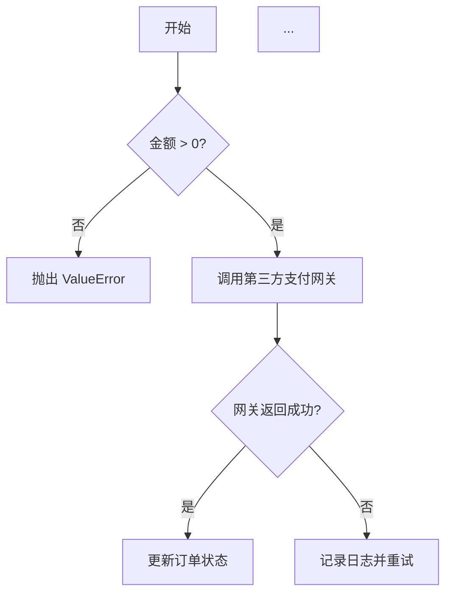
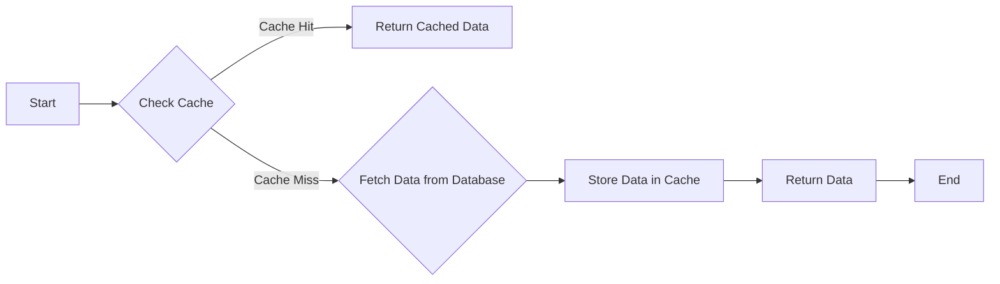
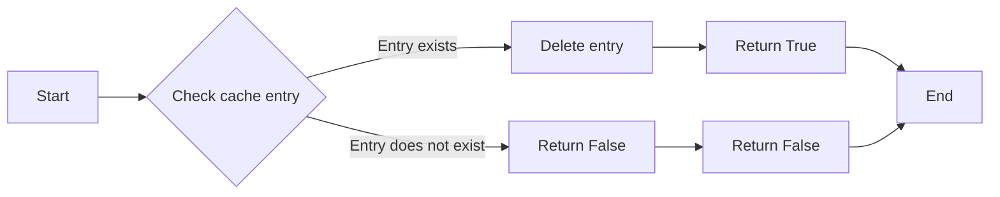
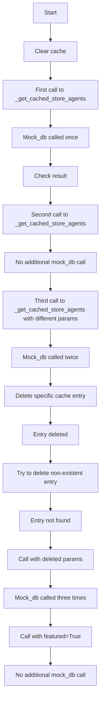
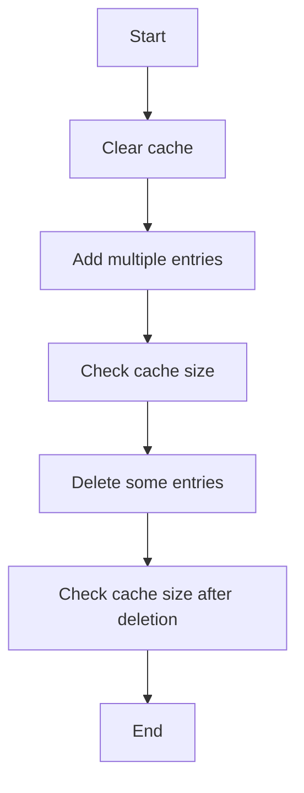

# `.\AutoGPT\autogpt_platform\backend\backend\api\features\store\test_cache_delete.py` 详细设计文档

This file contains a test suite for verifying the cache deletion functionality in store routes, ensuring specific cache entries can be deleted while preserving others.

## 整体流程



## 类结构

```
TestCacheDeletion (测试类)
├── test_store_agents_cache_delete (测试方法)
│   ├── mock_response (模拟响应)
│   ├── mock_db (模拟数据库)
│   ├── store_cache._get_cached_store_agents.cache_clear (清除缓存)
│   ├── store_cache._get_cached_store_agents (获取缓存)
│   └── store_cache._get_cached_store_agents.cache_delete (删除缓存)
└── test_cache_info_after_deletions (测试缓存信息)
    ├── store_cache._get_cached_store_agents.cache_clear (清除缓存)
    ├── store_cache._get_cached_store_agents (获取缓存)
    └── store_cache._get_cached_store_agents.cache_delete (删除缓存)
```

## 全局变量及字段


### `store_cache`
    
Module containing cache-related functions and classes.

类型：`module`
    


### `_get_cached_store_agents`
    
Function to retrieve cached store agents data.

类型：`function`
    


### `cache_clear`
    
Function to clear the cache.

类型：`function`
    


### `cache_delete`
    
Function to delete specific cache entries.

类型：`function`
    


### `cache_info`
    
Function to get cache information.

类型：`function`
    


### `mock_db`
    
Mock object for the database function get_store_agents.

类型：`AsyncMock`
    


### `mock_response`
    
Mock response object for the database function get_store_agents.

类型：`StoreAgentsResponse`
    


### `pytest`
    
Pytest module for running tests.

类型：`module`
    


### `__file__`
    
The path to the current file.

类型：`str`
    


### `__main__`
    
The main module for running the script directly.

类型：`module`
    


### `StoreAgentsResponse.agents`
    
List of store agents in the response.

类型：`list of StoreAgent`
    


### `StoreAgentsResponse.pagination`
    
Pagination information for the response.

类型：`Pagination`
    


### `StoreAgent.slug`
    
Unique identifier for the store agent.

类型：`str`
    


### `StoreAgent.agent_name`
    
Name of the store agent.

类型：`str`
    


### `StoreAgent.agent_image`
    
Image URL for the store agent.

类型：`str`
    


### `StoreAgent.creator`
    
Creator of the store agent.

类型：`str`
    


### `StoreAgent.creator_avatar`
    
Avatar URL for the creator of the store agent.

类型：`str`
    


### `StoreAgent.sub_heading`
    
Sub-heading for the store agent.

类型：`str`
    


### `StoreAgent.description`
    
Description of the store agent.

类型：`str`
    


### `StoreAgent.runs`
    
Number of runs for the store agent.

类型：`int`
    


### `StoreAgent.rating`
    
Rating of the store agent.

类型：`float`
    


### `StoreAgent.agent_graph_id`
    
Graph ID for the store agent.

类型：`str`
    


### `Pagination.total_items`
    
Total number of items in the pagination.

类型：`int`
    


### `Pagination.total_pages`
    
Total number of pages in the pagination.

类型：`int`
    


### `Pagination.current_page`
    
Current page number in the pagination.

类型：`int`
    


### `Pagination.page_size`
    
Number of items per page in the pagination.

类型：`int`
    
    

## 全局函数及方法


### store_cache._get_cached_store_agents

This function retrieves cached store agents based on the provided parameters. If the cache does not contain the requested data, it fetches it from the database.

参数：

- `featured`: `bool`，Indicates whether the store agents are featured or not.
- `creator`: `str`，The creator of the store agents.
- `sorted_by`: `str`，The field to sort the store agents by.
- `search_query`: `str`，The search query for the store agents.
- `category`: `str`，The category of the store agents.
- `page`: `int`，The page number of the store agents.
- `page_size`: `int`，The number of store agents per page.

返回值：`StoreAgentsResponse`，A response object containing the store agents and pagination information.

#### 流程图



#### 带注释源码

```python
async def _get_cached_store_agents(
    featured: bool,
    creator: str,
    sorted_by: str,
    search_query: str,
    category: str,
    page: int,
    page_size: int,
) -> StoreAgentsResponse:
    # Check if the data is in the cache
    cache_key = f"{featured}_{creator}_{sorted_by}_{search_query}_{category}_{page}_{page_size}"
    cached_data = self.cache.get(cache_key)
    if cached_data:
        return cached_data

    # Fetch data from the database if not in cache
    response = await self.db.get_store_agents(
        featured=featured,
        creator=creator,
        sorted_by=sorted_by,
        search_query=search_query,
        category=category,
        page=page,
        page_size=page_size,
    )

    # Store the data in the cache
    self.cache.set(cache_key, response)

    return response
```


### store_cache._get_cached_store_agents.cache_delete

This function is used to delete a specific cache entry based on the provided parameters.

参数：

- `featured`: `bool`，Indicates whether the cache entry is for featured agents.
- `creator`: `str`，The creator of the agents.
- `sorted_by`: `str`，The sorting criteria for the agents.
- `search_query`: `str`，The search query for the agents.
- `category`: `str`，The category of the agents.
- `page`: `int`，The page number of the agents.
- `page_size`: `int`，The number of agents per page.

返回值：`bool`，Indicates whether the cache entry was successfully deleted.

#### 流程图



#### 带注释源码

```python
# Delete specific cache entry
deleted = store_cache._get_cached_store_agents.cache_delete(
    featured=False,
    creator=None,
    sorted_by=None,
    search_query="test",
    category=None,
    page=1,
    page_size=20,
)
assert deleted is True  # Entry was deleted
```


### store_cache._get_cached_store_agents.cache_delete

This function is used to delete a specific cache entry based on the provided parameters.

参数：

- `featured`: `bool`，Indicates whether the cache entry is for featured agents.
- `creator`: `str`，The creator of the agents.
- `sorted_by`: `str`，The sorting criteria for the agents.
- `search_query`: `str`，The search query for the agents.
- `category`: `str`，The category of the agents.
- `page`: `int`，The page number of the agents.
- `page_size`: `int`，The number of agents per page.

返回值：`bool`，Indicates whether the cache entry was successfully deleted.

#### 流程图


#### 带注释源码

```python
# Delete specific cache entry
deleted = store_cache._get_cached_store_agents.cache_delete(
    featured=False,
    creator=None,
    sorted_by=None,
    search_query="test",
    category=None,
    page=1,
    page_size=20,
)
assert deleted is True  # Entry was deleted
```


### test_store_agents_cache_delete

This function tests the cache deletion functionality for specific agent list cache entries in store routes.

参数：

- `mock_response`：`StoreAgentsResponse`，Mocked database response containing agent information
- `mock_db`：`AsyncMock`，Mocked database function to simulate database calls

返回值：无

#### 流程图



#### 带注释源码

```python
@patch(
    "backend.api.features.store.db.get_store_agents",
    new_callable=AsyncMock,
    return_value=mock_response,
)
async def test_store_agents_cache_delete(self, mock_db):
    # Clear cache first
    store_cache._get_cached_store_agents.cache_clear()

    # First call - should hit database
    result1 = await store_cache._get_cached_store_agents(
        featured=False,
        creator=None,
        sorted_by=None,
        search_query="test",
        category=None,
        page=1,
        page_size=20,
    )
    assert mock_db.call_count == 1
    assert result1.agents[0].agent_name == "Test Agent"

    # Second call with same params - should use cache
    await store_cache._get_cached_store_agents(
        featured=False,
        creator=None,
        sorted_by=None,
        search_query="test",
        category=None,
        page=1,
        page_size=20,
    )
    assert mock_db.call_count == 1  # No additional DB call

    # Third call with different params - should hit database
    await store_cache._get_cached_store_agents(
        featured=True,  # Different param
        creator=None,
        sorted_by=None,
        search_query="test",
        category=None,
        page=1,
        page_size=20,
    )
    assert mock_db.call_count == 2  # New DB call

    # Delete specific cache entry
    deleted = store_cache._get_cached_store_agents.cache_delete(
        featured=False,
        creator=None,
        sorted_by=None,
        search_query="test",
        category=None,
        page=1,
        page_size=20,
    )
    assert deleted is True  # Entry was deleted

    # Try to delete non-existent entry
    deleted = store_cache._get_cached_store_agents.cache_delete(
        featured=False,
        creator="nonexistent",
        sorted_by=None,
        search_query="test",
        category=None,
        page=1,
        page_size=20,
    )
    assert deleted is False  # Entry didn't exist

    # Call with deleted params - should hit database again
    await store_cache._get_cached_store_agents(
        featured=False,
        creator=None,
        sorted_by=None,
        search_query="test",
        category=None,
        page=1,
        page_size=20,
    )
    assert mock_db.call_count == 3  # New DB call after deletion

    # Call with featured=True - should still be cached
    await store_cache._get_cached_store_agents(
        featured=True,
        creator=None,
        sorted_by=None,
        search_query="test",
        category=None,
        page=1,
        page_size=20,
    )
    assert mock_db.call_count == 3  # No additional DB call
```


### test_cache_info_after_deletions

Test that cache_info correctly reflects deletions.

参数：

- ...

返回值：`None`，No return value, it's a test function

#### 流程图



#### 带注释源码

```python
@ pytest.mark.asyncio
async def test_cache_info_after_deletions(self):
    """Test that cache_info correctly reflects deletions."""
    # Clear all caches first
    store_cache._get_cached_store_agents.cache_clear()

    mock_response = StoreAgentsResponse(
        agents=[],
        pagination=Pagination(
            total_items=0,
            total_pages=1,
            current_page=1,
            page_size=20,
        ),
    )

    with patch(
        "backend.api.features.store.db.get_store_agents",
        new_callable=AsyncMock,
        return_value=mock_response,
    ):
        # Add multiple entries
        for i in range(5):
            await store_cache._get_cached_store_agents(
                featured=False,
                creator=f"creator{i}",
                sorted_by=None,
                search_query=None,
                category=None,
                page=1,
                page_size=20,
            )

        # Check cache size
        info = store_cache._get_cached_store_agents.cache_info()
        assert info["size"] == 5

        # Delete some entries
        for i in range(2):
            deleted = store_cache._get_cached_store_agents.cache_delete(
                featured=False,
                creator=f"creator{i}",
                sorted_by=None,
                search_query=None,
                category=None,
                page=1,
                page_size=20,
            )
            assert deleted is True

        # Check cache size after deletion
        info = store_cache._get_cached_store_agents.cache_info()
        assert info["size"] == 3
``` 


## 关键组件


### 张量索引与惰性加载

用于在缓存中高效检索和存储数据，通过延迟加载减少数据库访问。

### 反量化支持

允许对缓存数据进行量化处理，优化存储和检索性能。

### 量化策略

定义了缓存数据的量化方法和规则，以适应不同的使用场景和性能需求。


## 问题及建议


### 已知问题

-   **全局变量和函数的可见性**：`store_cache`模块中的`_get_cached_store_agents`函数和`cache_clear`、`cache_delete`方法被用作全局函数，这可能导致代码难以维护和理解，特别是在大型项目中。
-   **测试代码的覆盖率**：虽然代码中包含了一些测试用例，但可能没有覆盖所有可能的边缘情况，例如缓存删除操作对后续缓存操作的影响。
-   **异常处理**：代码中没有显示异常处理逻辑，如果数据库调用失败或缓存操作失败，可能会引发未处理的异常。

### 优化建议

-   **封装全局函数**：将全局函数封装在类中，提高代码的可读性和可维护性。
-   **增加测试覆盖率**：编写更多的测试用例，以确保代码在各种情况下都能正常工作。
-   **添加异常处理**：在关键操作中添加异常处理逻辑，确保在出现错误时能够优雅地处理异常。
-   **使用更具体的缓存键**：在缓存删除操作中使用更具体的缓存键，以避免误删除不相关的缓存条目。
-   **性能优化**：考虑使用更高效的缓存策略，例如基于时间或事件的缓存失效机制，以减少不必要的数据库访问。


## 其它


### 设计目标与约束

- 设计目标：
  - 确保缓存删除功能能够正确地删除指定的缓存条目，同时保留其他缓存条目。
  - 确保缓存信息能够正确反映删除操作的结果。
  - 确保缓存删除操作能够处理复杂的参数组合。

- 约束：
  - 缓存删除操作必须高效，以减少对数据库的访问。
  - 缓存删除操作必须能够处理大量数据。
  - 缓存删除操作必须能够处理并发请求。

### 错误处理与异常设计

- 错误处理：
  - 当尝试删除不存在的缓存条目时，应返回False。
  - 当缓存操作失败时，应抛出异常。

- 异常设计：
  - 使用try-except块来捕获和处理可能发生的异常。
  - 定义自定义异常类以提供更具体的错误信息。

### 数据流与状态机

- 数据流：
  - 用户请求缓存数据。
  - 系统检查缓存中是否存在请求的数据。
  - 如果数据存在，则从缓存中返回数据。
  - 如果数据不存在，则从数据库中获取数据，并将其存储在缓存中。
  - 用户请求删除缓存条目。
  - 系统执行删除操作，并更新缓存信息。

- 状态机：
  - 缓存状态：未命中、已命中、已删除。

### 外部依赖与接口契约

- 外部依赖：
  - 数据库接口：用于从数据库获取数据。
  - 缓存接口：用于存储和检索缓存数据。

- 接口契约：
  - 数据库接口应提供异步方法以支持异步操作。
  - 缓存接口应提供缓存清除、缓存删除和缓存信息获取的方法。


    