# `AutoGPT\autogpt_platform\backend\backend\api\features\v1.py` 详细设计文档

该文件定义了基于 FastAPI 的后端 API 路由，涵盖了身份验证、用户引导、区块管理、文件上传、信用额度与支付、图（智能体）生命周期、执行管理与监控、定时任务以及 API 密钥管理等核心功能。

## 整体流程

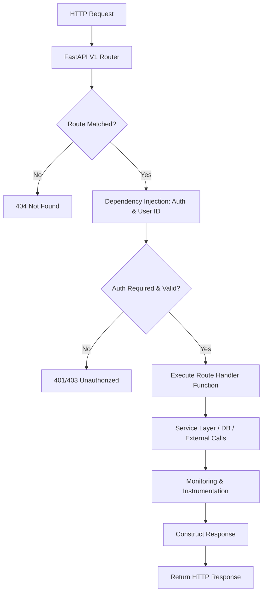

## 类结构

```
Pydantic BaseModel (Data Models)
├── OnboardingStatusResponse
├── ShareRequest
├── ShareResponse
└── ScheduleCreationRequest
Typing TypedDict
└── DeleteGraphResponse
```

## 全局变量及字段


### `settings`
    
应用程序的全局配置设置实例

类型：`Settings`
    


### `logger`
    
用于记录日志的 Logger 实例

类型：`logging.Logger`
    


### `v1_router`
    
API v1 版本的路由器，用于定义和分组 API 路径

类型：`fastapi.APIRouter`
    


### `OnboardingStatusResponse.is_onboarding_enabled`
    
指示是否启用了传统的新手引导流程

类型：`bool`
    


### `OnboardingStatusResponse.is_chat_enabled`
    
指示是否为用户启用了聊天功能

类型：`bool`
    


### `DeleteGraphResponse.version_counts`
    
被删除的图版本的数量

类型：`int`
    


### `ShareResponse.share_url`
    
用于访问共享执行的 URL

类型：`str`
    


### `ShareResponse.share_token`
    
用于标识共享执行的唯一令牌

类型：`str`
    


### `ScheduleCreationRequest.graph_version`
    
要调度执行的图的版本号

类型：`Optional[int]`
    


### `ScheduleCreationRequest.name`
    
调度任务的名称

类型：`str`
    


### `ScheduleCreationRequest.cron`
    
定义执行时间的 Cron 表达式

类型：`str`
    


### `ScheduleCreationRequest.inputs`
    
执行图所需的输入数据

类型：`dict[str, Any]`
    


### `ScheduleCreationRequest.credentials`
    
执行图所需的凭据元数据

类型：`dict[str, CredentialsMetaInput]`
    


### `ScheduleCreationRequest.timezone`
    
用户时区，用于解析 Cron 表达式，默认为 UTC

类型：`Optional[str]`
    
    

## 全局函数及方法


### `_create_file_size_error`

生成用于指示文件大小超出限制的标准 HTTP 异常对象。

参数：

- `size_bytes`：`int`，触发错误的文件实际大小（单位：字节）。
- `max_size_mb`：`int`，系统允许的最大文件大小（单位：兆字节）。

返回值：`HTTPException`，包含状态码 400 和详细错误信息的 FastAPI HTTPException 对象。

#### 流程图

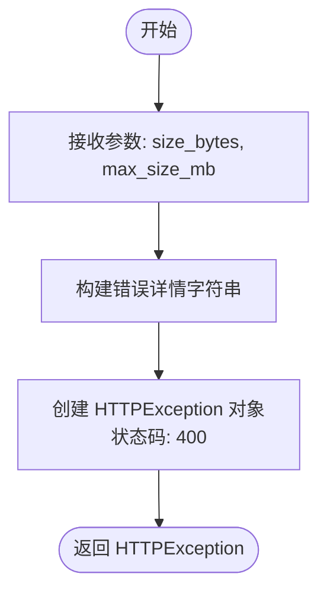

#### 带注释源码

```python
def _create_file_size_error(size_bytes: int, max_size_mb: int) -> HTTPException:
    """创建标准化的文件大小错误响应。"""
    # 返回一个 HTTPException 实例，状态码设为 400 (Bad Request)
    # detail 字段包含具体的文件大小和最大限制信息，便于客户端展示
    return HTTPException(
        status_code=400,
        detail=f"File size ({size_bytes} bytes) exceeds the maximum allowed size of {max_size_mb}MB",
    )
```


### `_compute_blocks_sync`

同步函数，用于计算并序列化所有可用区块的数据，包括实例化区块、计算成本以及转换为 JSON 格式。

参数：

（无）

返回值：`str`，包含所有区块详细信息及其计算成本的 JSON 字符串。

#### 流程图

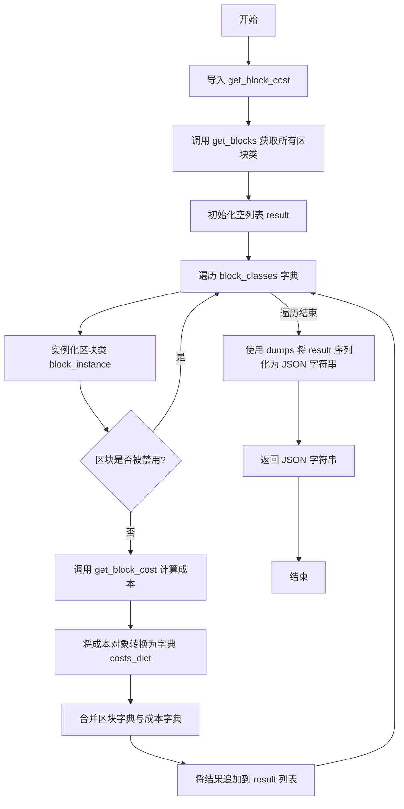

#### 带注释源码

```python
def _compute_blocks_sync() -> str:
    """
    Synchronous function to compute blocks data.
    This does the heavy lifting: instantiate 226+ blocks, compute costs, serialize.
    """
    # 局部导入以避免潜在的循环依赖
    from backend.data.credit import get_block_cost

    # 获取所有已注册的区块类
    block_classes = get_blocks()
    result = []

    # 遍历每个区块类
    for block_class in block_classes.values():
        # 实例化区块对象
        block_instance = block_class()
        
        # 仅处理未禁用的区块
        if not block_instance.disabled:
            # 计算区块的执行成本
            costs = get_block_cost(block_instance)
            # 将 BlockCost BaseModel 对象转换为字典，以便进行 JSON 序列化
            costs_dict = [
                cost.model_dump() if isinstance(cost, BaseModel) else cost
                for cost in costs
            ]
            # 将区块数据字典与成本字典合并，并添加到结果列表中
            result.append({**block_instance.to_dict(), "costs": costs_dict})

    # 使用自定义的 JSON 工具将结果列表序列化为字符串
    return dumps(result)
```


### `_get_cached_blocks`

该函数是一个异步的缓存代理函数，用于获取并返回所有可用 Block 的数据。它通过装饰器 `@cached` 提供缓存机制（TTL 为 3600 秒），防止缓存击穿。当缓存未命中时，它会在线程池中执行耗时的同步计算任务（`_compute_blocks_sync`），生成包含 Block 配置及成本信息的 JSON 字符串，从而避免阻塞主事件循环。

参数：

-  该函数无参数。

返回值：`str`，包含所有 Block 详细信息（如 ID、名称、输入/输出模式及成本）的序列化 JSON 字符串。

#### 流程图

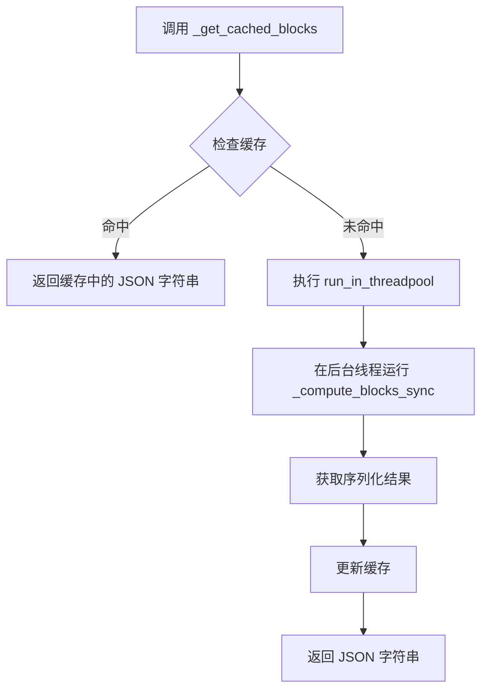

#### 带注释源码

```python
@cached(ttl_seconds=3600)  # 使用缓存装饰器，设置生存时间为 3600 秒（1小时）
async def _get_cached_blocks() -> str:
    """
    Async cached function with thundering herd protection.
    On cache miss: runs heavy work in thread pool
    On cache hit: returns cached string immediately (no thread pool needed)
    """
    # Only run in thread pool on cache miss - cache hits return immediately
    # 如果缓存未命中，将同步的繁重计算任务 _compute_blocks_sync 放入线程池执行
    # 这样可以避免计算密集型任务阻塞 FastAPI 的异步事件循环
    return await run_in_threadpool(_compute_blocks_sync)
```


### `get_or_create_user_route`

这是一个 FastAPI 路由端点，用于处理认证用户的获取或创建逻辑。它通过解析 JWT Token 获取用户数据载荷（Payload），调用后端服务确保该用户存在于系统中（如果不存在则创建），最后将用户对象序列化为字典返回。

参数：

- `user_data`：`dict`，从 JWT Token 中解析出的用户数据载荷，包含用户的身份信息（如 subject、email 等）。

返回值：`dict`，用户对象的字典表示，包含用户的详细属性。

#### 流程图

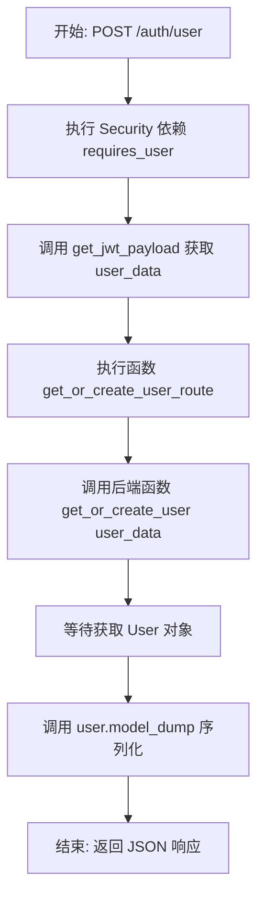

#### 带注释源码

```python
@v1_router.post(
    "/auth/user",
    summary="Get or create user",
    tags=["auth"],
    dependencies=[Security(requires_user)], # 依赖项：确保请求包含有效的认证用户
)
async def get_or_create_user_route(user_data: dict = Security(get_jwt_payload)):
    # 调用数据层函数获取或创建用户，传入从JWT解析的user_data
    user = await get_or_create_user(user_data)
    
    # 将返回的User Pydantic模型转换为字典，以便FastAPI序列化为JSON响应
    return user.model_dump()
```


### `update_user_email_route`

该路由处理更新已认证用户电子邮件地址的请求。它利用安全依赖从请求上下文中提取用户ID，从请求体中获取新的电子邮件地址，调用后端数据层函数执行更新操作，最后返回包含新电子邮件地址的字典以确认操作成功。

参数：

- `user_id`：`Annotated[str, Security(get_user_id)]`，通过安全依赖项自动提取的当前认证用户的唯一标识符。
- `email`：`str`，用户想要设置的新电子邮件地址，从请求体中解析。

返回值：`dict[str, str]`，包含更新后的电子邮件地址的字典，键为 "email"。

#### 流程图

```mermaid
flowchart TD
    A[开始: 接收 POST /auth/user/email 请求] --> B[安全校验: Security(requires_user)]
    B --> C[获取 user_id: Security(get_user_id)]
    C --> D[解析 email: Body(...)]
    D --> E[调用 update_user_email user_id, email]
    E --> F[等待数据库/存储层更新完成]
    F --> G[返回响应: {"email": email}]
    G --> H[结束]
```

#### 带注释源码

```python
@v1_router.post(
    "/auth/user/email",
    summary="Update user email",
    tags=["auth"],
    # 依赖项：确保请求来自已认证用户
    dependencies=[Security(requires_user)],
)
async def update_user_email_route(
    # 参数：从请求上下文中提取的已认证用户 ID
    user_id: Annotated[str, Security(get_user_id)], 
    # 参数：从请求体中提取的新邮件地址
    email: str = Body(...)
) -> dict[str, str]:
    # 调用数据层函数异步更新用户邮箱
    await update_user_email(user_id, email)

    # 返回更新后的邮件地址字典
    return {"email": email}
```


### `get_user_timezone_route`

获取用户时区设置。

参数：

- `user_data`：`dict`，从JWT令牌中提取的用户载荷，包含用于识别或创建用户的数据。

返回值：`TimezoneResponse`，包含用户时区字符串的响应对象。

#### 流程图

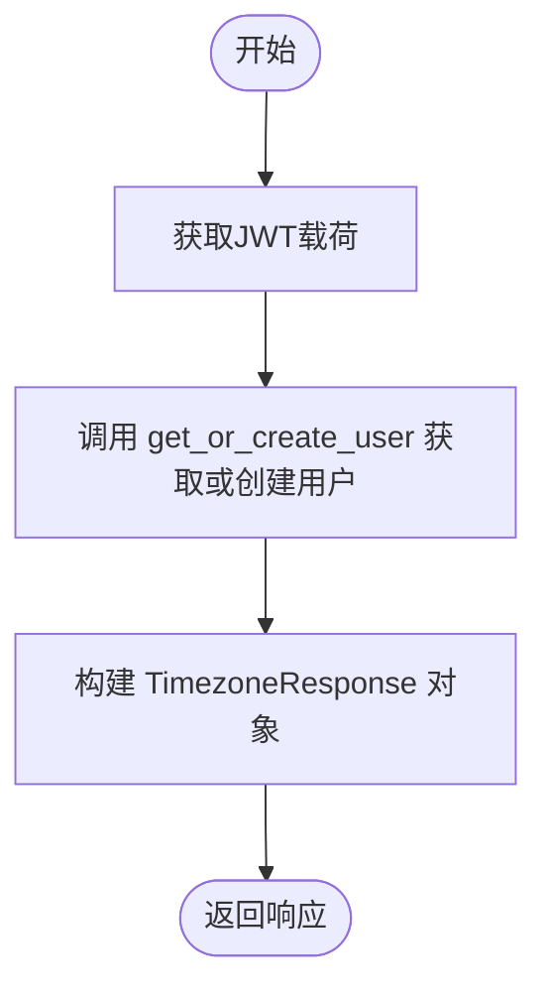

#### 带注释源码

```python
@v1_router.get(
    "/auth/user/timezone",
    summary="Get user timezone",
    tags=["auth"],
    dependencies=[Security(requires_user)], # 依赖项：确保需要用户认证
)
async def get_user_timezone_route(
    user_data: dict = Security(get_jwt_payload), # 参数：从JWT安全依赖中获取用户数据字典
) -> TimezoneResponse:
    """Get user timezone setting."""
    # 根据JWT载荷获取用户信息（如果用户不存在则创建），返回User对象
    user = await get_or_create_user(user_data)
    # 返回包含用户时区信息的TimezoneResponse对象
    return TimezoneResponse(timezone=user.timezone)
```


### `update_user_timezone_route`

更新用户时区的API路由处理函数。该接口接收包含IANA时区标识符的请求，验证用户身份后更新数据库中的用户时区设置，并返回更新后的时区信息。

参数：

- `user_id`：`Annotated[str, Security(get_user_id)]`，从JWT令牌中提取的用户ID，用于标识要更新时区的目标用户。
- `request`：`UpdateTimezoneRequest`，请求体对象，包含新的时区信息（timezone字段）。

返回值：`TimezoneResponse`，包含更新后的用户时区字符串的响应对象。

#### 流程图

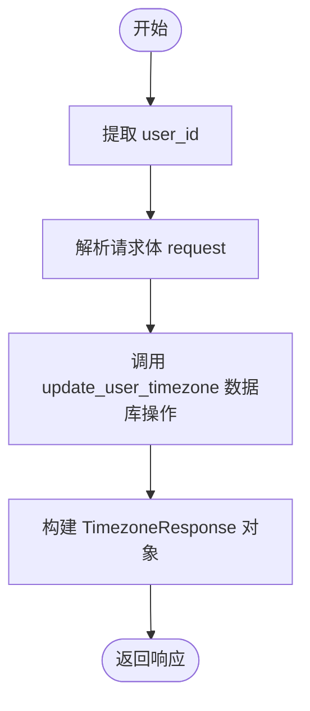

#### 带注释源码

```python
@v1_router.post(
    "/auth/user/timezone",
    summary="Update user timezone",
    tags=["auth"],
    dependencies=[Security(requires_user)],
)
async def update_user_timezone_route(
    user_id: Annotated[str, Security(get_user_id)], # 从安全上下文中获取用户ID
    request: UpdateTimezoneRequest # 接收包含时区信息的请求体
) -> TimezoneResponse:
    """Update user timezone. The timezone should be a valid IANA timezone identifier."""
    # 调用数据层方法更新用户时区，并将请求中的时区转换为字符串传入
    user = await update_user_timezone(user_id, str(request.timezone))
    # 返回包含更新后时区的响应模型
    return TimezoneResponse(timezone=user.timezone)
```


### `get_preferences`

获取用户通知偏好的API端点。该函数通过用户ID从数据层检索当前用户的通知设置配置。

参数：

-   `user_id`：`Annotated[str, Security(get_user_id)]`，经过身份验证的用户ID，通过安全依赖从JWT令牌中提取。

返回值：`NotificationPreference`，包含用户当前通知偏好设置的数据模型对象。

#### 流程图

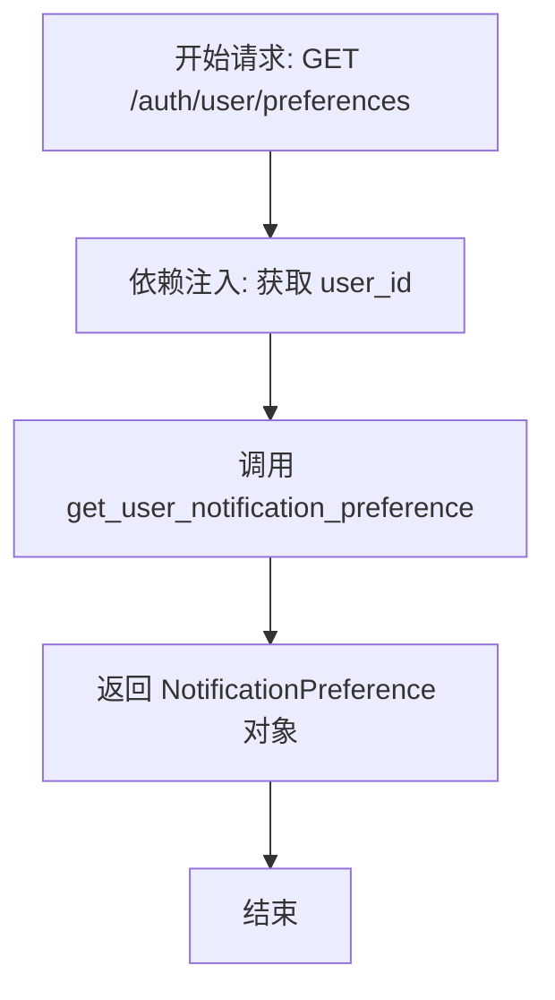

#### 带注释源码

```python
@v1_router.get(
    "/auth/user/preferences", # API路由路径
    summary="Get notification preferences", # API摘要说明
    tags=["auth"], # API标签分组
    dependencies=[Security(requires_user)], # 安全依赖，要求用户登录
)
async def get_preferences(
    user_id: Annotated[str, Security(get_user_id)], # 参数：从JWT上下文中提取的用户ID
) -> NotificationPreference: # 返回类型：NotificationPreference模型
    # 调用数据层方法获取用户的通知偏好设置
    preferences = await get_user_notification_preference(user_id)
    # 返回获取到的偏好设置对象
    return preferences
```


### `update_preferences`

该函数用于更新已认证用户的通知偏好设置。它通过接收包含用户ID（通过JWT自动提取）和新偏好配置的请求，调用底层服务更新数据，并返回更新后的用户偏好对象。

参数：

- `user_id`：`Annotated[str, Security(get_user_id)]`，从JWT令牌中解析出的当前用户ID，用于指定更新哪个用户的偏好。
- `preferences`：`NotificationPreferenceDTO = Body(...)`，请求体中包含的通知偏好数据传输对象，定义了用户希望开启或关闭的具体通知类型。

返回值：`NotificationPreference`，更新后的用户通知偏好对象，反映了最新的设置状态。

#### 流程图

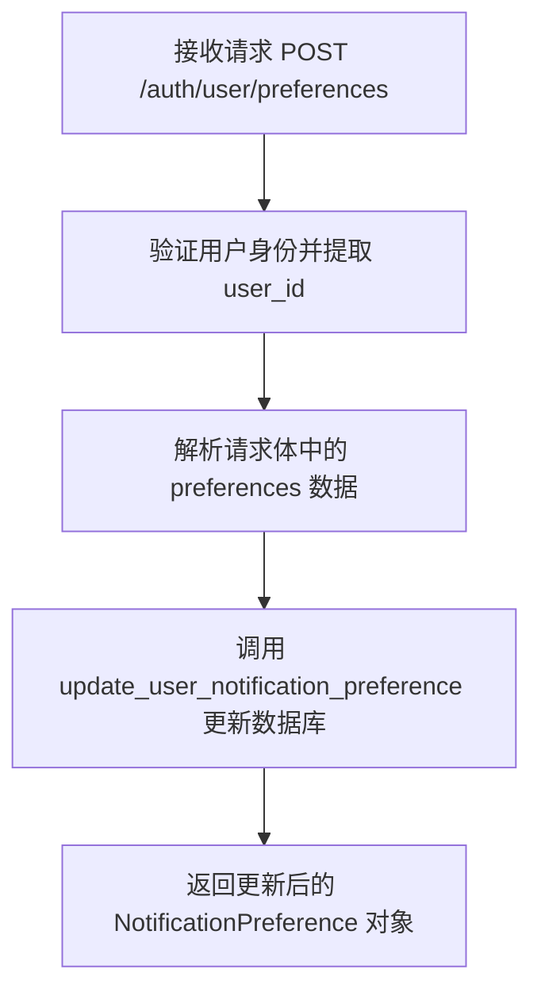

#### 带注释源码

```python
@v1_router.post(
    "/auth/user/preferences",
    summary="Update notification preferences",
    tags=["auth"],
    dependencies=[Security(requires_user)],
)
async def update_preferences(
    user_id: Annotated[str, Security(get_user_id)],
    preferences: NotificationPreferenceDTO = Body(...),
) -> NotificationPreference:
    # 调用数据层逻辑，根据用户ID更新通知偏好设置
    output = await update_user_notification_preference(user_id, preferences)
    # 返回更新后的偏好设置信息
    return output
```


### `get_onboarding`

这是一个异步API端点函数，用于获取并返回特定用户的当前引导状态。

参数：

-  `user_id`：`Annotated[str, Security(get_user_id)]`，经过身份验证的用户的ID，由FastAPI的Security依赖项自动从请求上下文中提取。

返回值：`UserOnboarding`，包含用户引导进度和相关信息的Pydantic模型对象。

#### 流程图

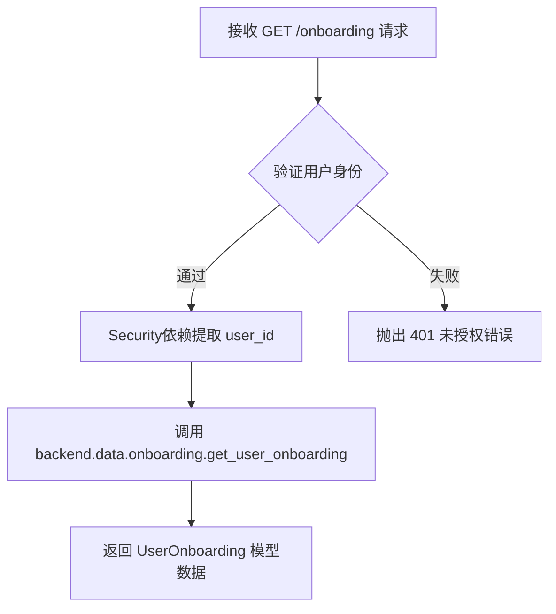

#### 带注释源码

```python
@v1_router.get(
    "/onboarding",
    summary="Onboarding state",
    tags=["onboarding"],
    dependencies=[Security(requires_user)], # 依赖项：要求用户必须登录
    response_model=UserOnboarding, # 响应模型：定义为 UserOnboarding 类型
)
async def get_onboarding(user_id: Annotated[str, Security(get_user_id)]):
    """
    获取用户的引导状态。
    
    Args:
        user_id: 从JWT Token中解析出的用户唯一标识符。
        
    Returns:
        UserOnboarding: 包含用户引导步骤完成情况的数据对象。
    """
    # 调用数据处理层的函数获取用户引导状态并返回
    return await get_user_onboarding(user_id)
```


### `update_onboarding`

更新用户的入门引导状态。该接口接收当前用户的ID和更新数据，调用数据层逻辑来保存用户的入门进度，并返回更新后的完整状态。

参数：

-  `user_id`：`Annotated[str, Security(get_user_id)]`，经过身份验证的用户的唯一标识符，从JWT令牌中提取。
-  `data`：`UserOnboardingUpdate`，包含用户入门引导更新信息的请求体，例如已完成的步骤等。

返回值：`UserOnboarding`，更新后的用户入门引导状态对象。

#### 流程图

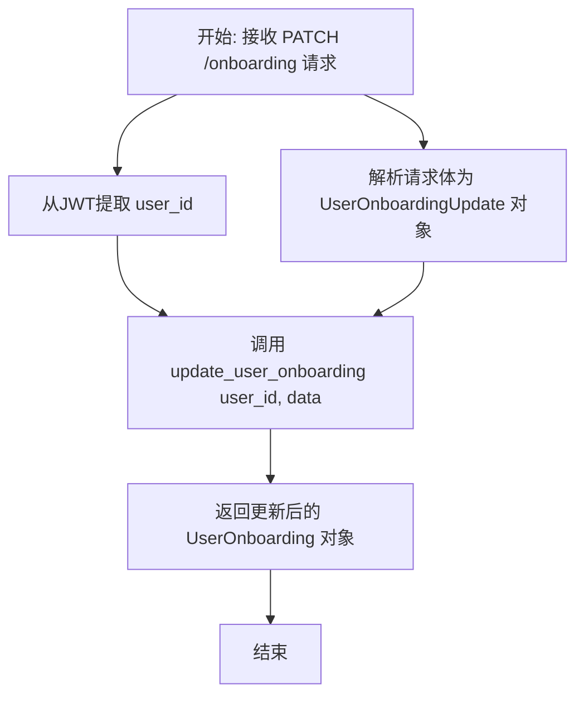

#### 带注释源码

```python
async def update_onboarding(
    user_id: Annotated[str, Security(get_user_id)], data: UserOnboardingUpdate
):
    # 调用后端数据层的函数 update_user_onboarding
    # 传入用户ID和更新数据，执行具体的更新逻辑
    return await update_user_onboarding(user_id, data)
```


### `onboarding_complete_step`

该函数是一个API路由处理程序，用于接收前端请求并将用户指定的引导步骤标记为已完成。它会验证传入的步骤是否合法，然后调用后端逻辑完成更新。

参数：

-  `user_id`：`Annotated[str, Security(get_user_id)]`，从请求的安全上下文中提取的用户唯一标识符。
-  `step`：`FrontendOnboardingStep`，前端发送的需要标记为已完成的引导步骤标识符，通常作为请求体传递。

返回值：`Any`，返回后端服务 `complete_onboarding_step` 调用的结果，通常包含更新后的用户引导状态或成功确认。

#### 流程图

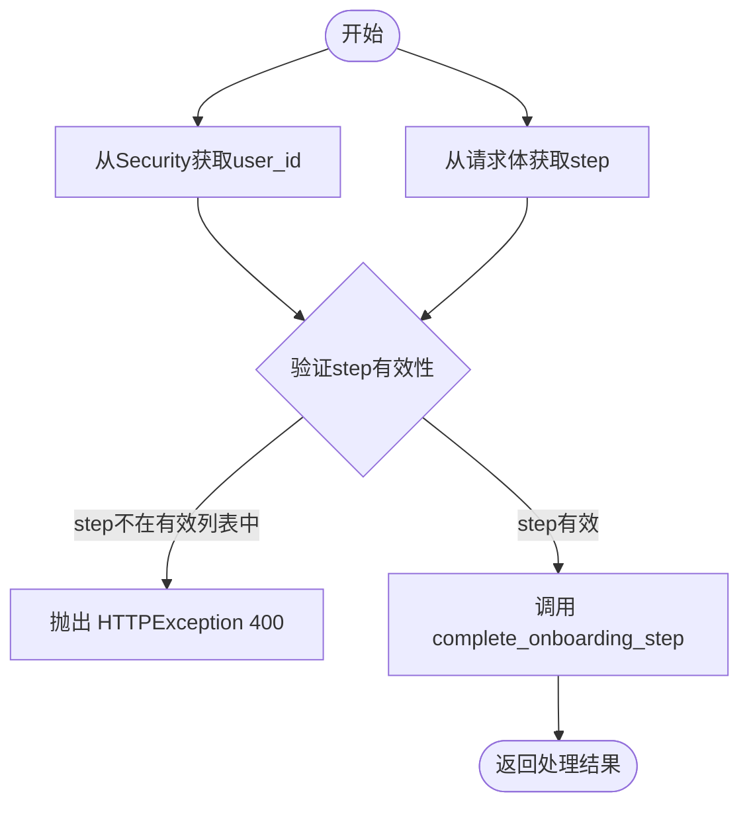

#### 带注释源码

```python
async def onboarding_complete_step(
    user_id: Annotated[str, Security(get_user_id)], step: FrontendOnboardingStep
):
    # 检查传入的 step 是否是 FrontendOnboardingStep 类型注解中定义的有效参数之一
    if step not in get_args(FrontendOnboardingStep):
        # 如果步骤无效，抛出 400 错误，提示 Invalid onboarding step
        raise HTTPException(status_code=400, detail="Invalid onboarding step")
    # 调用数据层的 complete_onboarding_step 函数，传入用户ID和步骤，完成数据库更新
    return await complete_onboarding_step(user_id, step)
```


### `get_onboarding_agents`

获取推荐的引导代理列表，该列表通过调用数据层函数 `get_recommended_agents` 根据用户ID获取，用于向用户展示建议使用的Agent。

参数：

- `user_id`：`Annotated[str, Security(get_user_id)]`，请求用户的唯一标识符，通过安全依赖从JWT令牌中自动提取。

返回值：`list[StoreAgentDetails]`，包含推荐引导代理详细信息的列表。

#### 流程图

```mermaid
flowchart TD
    A[客户端发起请求 GET /onboarding/agents] --> B[Security依赖: requires_user 验证用户身份]
    B -->|验证通过| C[Security依赖: get_user_id 提取 user_id]
    C --> D[执行函数 get_onboarding_agents]
    D --> E[调用 get_recommended_agents user_id]
    E -->|返回数据| F[返回响应 list[StoreAgentDetails]]
```

#### 带注释源码

```python
@v1_router.get(
    "/onboarding/agents",
    summary="Recommended onboarding agents",
    tags=["onboarding"],
    dependencies=[Security(requires_user)],
)
async def get_onboarding_agents(
    user_id: Annotated[str, Security(get_user_id)],
) -> list[StoreAgentDetails]:
    # 调用数据层函数获取推荐的Agent列表
    return await get_recommended_agents(user_id)
```


### `is_onboarding_enabled`

该函数用于检查当前用户的引导流程是否启用。它会优先检查“聊天”功能是否已为用户启用；如果聊天功能已启用，则禁用旧版的引导流程。

参数：

-  `user_id`：`Annotated[str, Security(get_user_id)]`，用户ID，通过FastAPI的Security依赖注入自动获取，用于鉴权和特定用户的功能检查。

返回值：`OnboardingStatusResponse`，包含两个字段的响应对象：`is_onboarding_enabled`（旧版引导是否启用）和 `is_chat_enabled`（聊天功能是否启用）。

#### 流程图

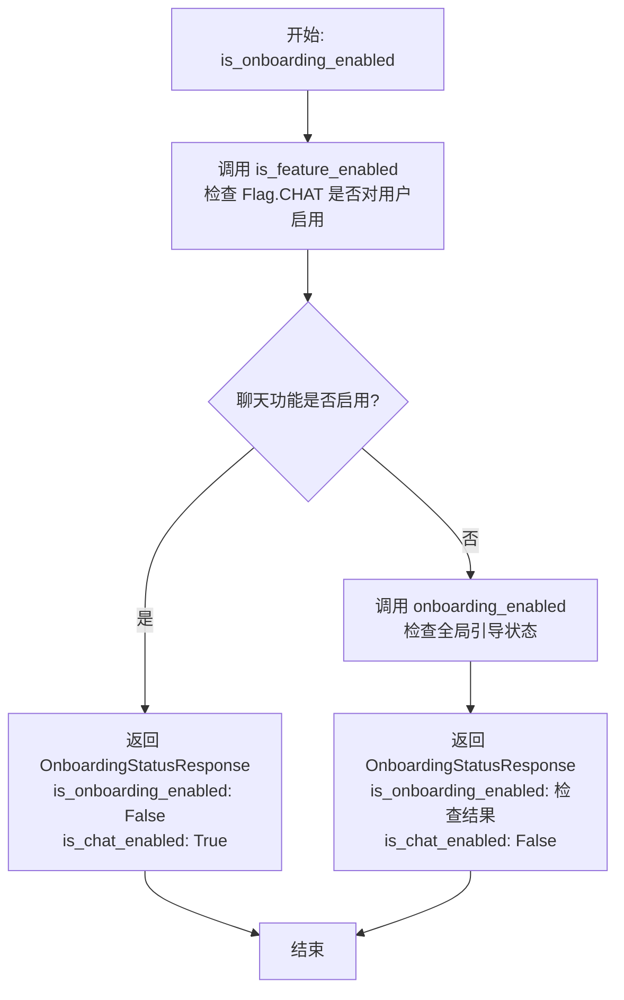

#### 带注释源码

```python
@v1_router.get(
    "/onboarding/enabled",
    summary="Is onboarding enabled",
    tags=["onboarding", "public"],
    response_model=OnboardingStatusResponse,
)
async def is_onboarding_enabled(
    user_id: Annotated[str, Security(get_user_id)],
) -> OnboardingStatusResponse:
    # 检查用户的聊天功能是否已启用
    is_chat_enabled = await is_feature_enabled(Flag.CHAT, user_id, False)

    # 如果聊天功能已启用，则跳过旧版引导流程
    if is_chat_enabled:
        return OnboardingStatusResponse(
            is_onboarding_enabled=False,
            is_chat_enabled=True,
        )

    # 否则，检查全局引导开关状态
    return OnboardingStatusResponse(
        is_onboarding_enabled=await onboarding_enabled(),
        is_chat_enabled=False,
    )
```


### `reset_onboarding`

重置当前用户的引导流程进度，使其能够重新开始体验引导流程。

参数：

- `user_id`：`str`，通过安全上下文获取的已认证用户的ID。

返回值：`UserOnboarding`，重置后的用户引导状态对象。

#### 流程图

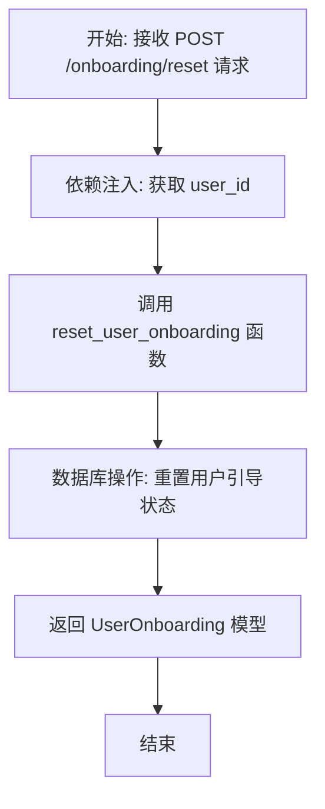

#### 带注释源码

```python
@v1_router.post(
    "/onboarding/reset",
    summary="Reset onboarding progress",
    tags=["onboarding"],
    dependencies=[Security(requires_user)],
    response_model=UserOnboarding,
)
async def reset_onboarding(user_id: Annotated[str, Security(get_user_id)]):
    # 调用后端逻辑函数重置指定用户的引导状态
    return await reset_user_onboarding(user_id)
```


### `get_graph_blocks`

获取系统中所有可用图块的列表，返回包含块信息和成本的JSON响应。该函数通过缓存机制优化性能，仅在缓存未命中时进行耗时的块实例化和成本计算。

参数：

- `无`

返回值：`Response`，包含序列化后的块数据和成本信息的JSON响应对象。

#### 流程图

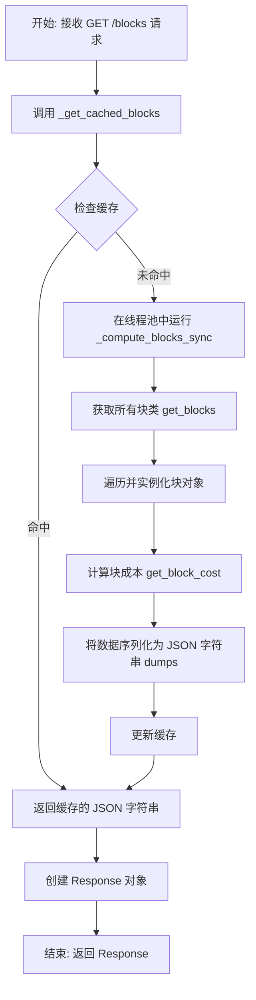

#### 带注释源码

```python
@v1_router.get(
    path="/blocks",
    summary="List available blocks",
    tags=["blocks"],
    dependencies=[Security(requires_user)],
    responses={
        200: {
            "description": "Successful Response",
            "content": {
                "application/json": {
                    "schema": {
                        "items": {"additionalProperties": True, "type": "object"},
                        "type": "array",
                        "title": "Response Getv1List Available Blocks",
                    }
                }
            },
        }
    },
)
async def get_graph_blocks() -> Response:
    # 获取缓存的区块数据内容。
    # 如果缓存命中，则立即返回字符串；
    # 如果缓存未命中，则在线程池中执行繁重的计算任务（_compute_blocks_sync）。
    content = await _get_cached_blocks()
    
    # 返回 FastAPI 的 Response 对象，包含获取到的内容，
    # 并明确指定媒体类型为 application/json。
    return Response(
        content=content,
        media_type="application/json",
    )
```


### `execute_graph_block`

该函数是处理单个图块执行请求的API端点，核心功能是接收前端发送的块ID和输入数据，验证块及用户的有效性与权限，调用指定块的异步执行逻辑，收集执行输出，记录执行耗时与状态监控指标，并最终返回执行结果或抛出相应的异常处理。

参数：

-  `block_id`：`str`，路径参数，指定要执行的图块的唯一标识符。
-  `data`：`BlockInput`，请求体参数，包含执行该图块所需的输入数据。
-  `user_id`：`Annotated[str, Security(get_user_id)]`，依赖注入参数，通过安全校验获取的当前请求用户的ID。

返回值：`CompletedBlockOutput`，包含图块执行完成后产生的所有输出数据的字典结构。

#### 流程图

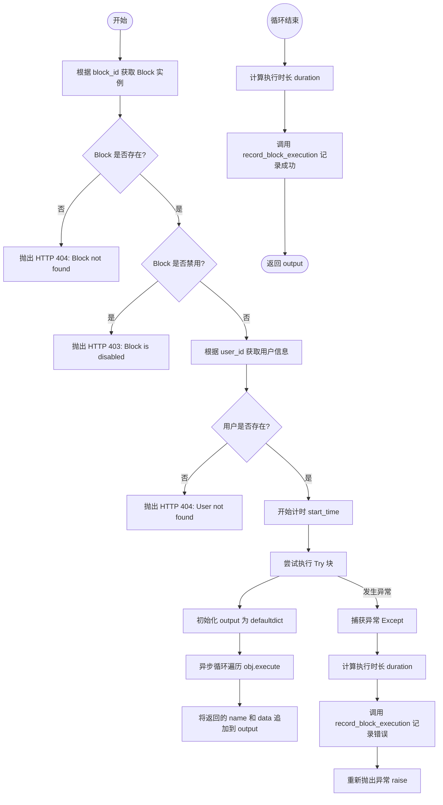

#### 带注释源码

```python
async def execute_graph_block(
    block_id: str, data: BlockInput, user_id: Annotated[str, Security(get_user_id)]
) -> CompletedBlockOutput:
    # 1. 根据 block_id 获取对应的 Block 类实例
    obj = get_block(block_id)
    # 2. 校验 Block 是否存在，不存在则返回 404
    if not obj:
        raise HTTPException(status_code=404, detail=f"Block #{block_id} not found.")
    # 3. 校验 Block 是否被禁用，禁用则返回 403
    if obj.disabled:
        raise HTTPException(status_code=403, detail=f"Block #{block_id} is disabled.")

    # 4. 获取并校验用户信息
    user = await get_user_by_id(user_id)
    if not user:
        raise HTTPException(status_code=404, detail="User not found.")

    # 5. 记录开始时间用于监控耗时
    start_time = time.time()
    try:
        # 6. 初始化输出收集器，使用 defaultdict 方便按名称列表追加数据
        output = defaultdict(list)
        # 7. 异步执行 Block 的 execute 方法，并收集生成的输出数据
        async for name, data in obj.execute(
            data,
            user_id=user_id,
            # 注意：直接执行块时不可用 graph_exec_id 和 graph_id
        ):
            output[name].append(data)

        # 8. 记录成功执行的监控指标（类型、状态、耗时）
        duration = time.time() - start_time
        block_type = obj.__class__.__name__
        record_block_execution(
            block_type=block_type, status="success", duration=duration
        )

        # 9. 返回收集到的输出结果
        return output
    except Exception:
        # 10. 捕获异常并记录失败的监控指标（类型、状态、耗时）
        duration = time.time() - start_time
        block_type = obj.__class__.__name__
        record_block_execution(block_type=block_type, status="error", duration=duration)
        # 11. 重新抛出异常由 FastAPI 全局异常处理器处理
        raise
```


### `upload_file`

该函数负责处理用户文件上传请求，支持将文件存储到云端（如GCS、S3、Azure）或在未配置云存储时回退到Base64 Data URI格式。在处理过程中，它会校验文件大小限制和过期时间，读取内容后执行病毒扫描，最终返回包含文件访问路径或数据URI及元数据的响应对象。

参数：

-   `user_id`：`Annotated[str, Security(get_user_id)]`，当前请求用户的唯一标识符，用于鉴权和存储路径隔离。
-   `file`：`UploadFile`，待上传的文件对象，包含文件流和元数据。
-   `provider`：`str`，云存储提供商名称（例如 "gcs", "s3", "azure"），默认为 "gcs"。
-   `expiration_hours`：`int`，文件链接的有效期（小时），必须在1到48之间，默认为24。

返回值：`UploadFileResponse`，包含文件URI（云端路径或Data URI）、文件名、大小、内容类型及过期时间的响应对象。

#### 流程图

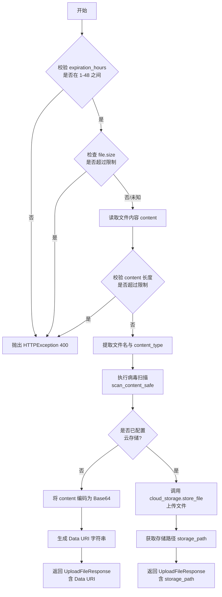

#### 带注释源码

```python
async def upload_file(
    user_id: Annotated[str, Security(get_user_id)],
    file: UploadFile = File(...),
    provider: str = "gcs",
    expiration_hours: int = 24,
) -> UploadFileResponse:
    """
    Upload a file to cloud storage and return a storage key that can be used
    with FileStoreBlock and AgentFileInputBlock.

    Args:
        file: The file to upload
        user_id: The user ID
        provider: Cloud storage provider ("gcs", "s3", "azure")
        expiration_hours: Hours until file expires (1-48)

    Returns:
        Dict containing the cloud storage path and signed URL
    """
    # 1. 校验过期时间参数范围
    if expiration_hours < 1 or expiration_hours > 48:
        raise HTTPException(
            status_code=400, detail="Expiration hours must be between 1 and 48"
        )

    # 2. 校验文件大小限制（先读取设置，再尝试从header获取大小）
    max_size_mb = settings.config.upload_file_size_limit_mb
    max_size_bytes = max_size_mb * 1024 * 1024

    # 尝试直接从header获取大小以避免读取内存
    if hasattr(file, "size") and file.size is not None and file.size > max_size_bytes:
        raise _create_file_size_error(file.size, max_size_mb)

    # 3. 读取文件内容
    content = await file.read()
    content_size = len(content)

    # 二次校验文件大小（防止header缺失或错误）
    if content_size > max_size_bytes:
        raise _create_file_size_error(content_size, max_size_mb)

    # 4. 提取文件元信息
    file_name = file.filename or "uploaded_file"
    content_type = file.content_type or "application/octet-stream"

    # 5. 安全扫描：检查文件内容是否安全
    await scan_content_safe(content, filename=file_name)

    # 6. 获取云存储处理器并检查配置
    cloud_storage = await get_cloud_storage_handler()
    
    # 如果未配置云存储桶，则回退到 Base64 Data URI 方案
    if not cloud_storage.config.gcs_bucket_name:
        # 编码为 Base64
        base64_content = base64.b64encode(content).decode("utf-8")
        # 拼接 Data URI
        data_uri = f"data:{content_type};base64,{base64_content}"

        return UploadFileResponse(
            file_uri=data_uri,
            file_name=file_name,
            size=content_size,
            content_type=content_type,
            expires_in_hours=expiration_hours,
        )

    # 7. 如果已配置云存储，则上传文件并获取路径
    storage_path = await cloud_storage.store_file(
        content=content,
        filename=file_name,
        provider=provider,
        expiration_hours=expiration_hours,
        user_id=user_id,
    )

    return UploadFileResponse(
        file_uri=storage_path,
        file_name=file_name,
        size=content_size,
        content_type=content_type,
        expires_in_hours=expiration_hours,
    )
```


### `get_user_credits`

该函数用于获取已认证用户的当前积分余额。

参数：

- `user_id`：`str`，从安全上下文中提取的已认证用户的唯一标识符。

返回值：`dict[str, int]`，包含用户当前积分余额的字典，键为 "credits"，值为积分数量。

#### 流程图

```mermaid
flowchart TD
    A[开始: 接收 GET /credits 请求] --> B[提取用户ID<br/>user_id]
    B --> C[获取用户积分模型<br/>await get_user_credit_model]
    C --> D[查询当前积分余额<br/>await model.get_credits]
    D --> E[构建响应字典<br/>{'credits': amount}]
    E --> F[返回响应]
```

#### 带注释源码

```python
@v1_router.get(
    path="/credits",
    tags=["credits"],
    summary="Get user credits",
    dependencies=[Security(requires_user)],
)
async def get_user_credits(
    user_id: Annotated[str, Security(get_user_id)],
) -> dict[str, int]:
    # 根据用户ID获取对应的积分模型实例（处理不同的后端存储逻辑）
    user_credit_model = await get_user_credit_model(user_id)
    # 调用模型方法获取积分，并返回格式化后的字典
    return {"credits": await user_credit_model.get_credits(user_id)}
```


### `request_top_up`

该函数用于处理用户的信用额度充值请求，通过创建支付意图并生成支付结账链接返回给客户端。

参数：

- `request`: `RequestTopUp`, 包含用户请求充值的金额信息。
- `user_id`: `Annotated[str, Security(get_user_id)]`, 当前发起请求的用户的唯一标识，通过JWT安全认证获取。

返回值：`dict[str, str]`, 包含支付网关（如Stripe）生成的结账链接，键名为 `checkout_url`。

#### 流程图

```mermaid
flowchart TD
    A[开始: 接收请求] --> B[提取User ID]
    B --> C[获取用户信用模型 UserCreditModel]
    C --> D[调用 top_up_intent<br>生成支付意图]
    D --> E[获取 checkout_url]
    E --> F[返回 {checkout_url: ...}]
    F --> G[结束]
```

#### 带注释源码

```python
async def request_top_up(
    request: RequestTopUp, user_id: Annotated[str, Security(get_user_id)]
):
    # 获取当前用户的信用模型实例，用于管理用户的信用和支付操作
    user_credit_model = await get_user_credit_model(user_id)
    
    # 调用模型的 top_up_intent 方法，根据用户ID和请求的充值金额创建支付意图
    # 并返回用于前端跳转的支付结账URL
    checkout_url = await user_credit_model.top_up_intent(user_id, request.credit_amount)
    
    # 将结账URL包装在字典中返回给客户端
    return {"checkout_url": checkout_url}
```


### `refund_top_up`

该函数用于处理特定交易的退款请求，通过调用用户信用模型的退款方法来执行退款操作。

参数：

- `user_id`：`str`，通过身份验证依赖注入获取的用户ID。
- `transaction_key`：`str`，路径参数，指定需要退款的交易键。
- `metadata`：`dict[str, str]`，请求体参数，包含与退款相关的元数据信息。

返回值：`int`，退款操作的结果，通常代表退款的金额。

#### 流程图

```mermaid
flowchart TD
    Start([开始]) --> GetModel[获取用户信用模型 get_user_credit_model]
    GetModel --> CallRefund[调用模型退款方法 top_up_refund]
    CallRefund --> Return([返回退款结果])
```

#### 带注释源码

```python
@v1_router.post(
    path="/credits/{transaction_key}/refund",  # API路径，包含transaction_key作为路径参数
    summary="Refund credit transaction",      # 接口摘要：退款信用交易
    tags=["credits"],                         # 分组标签：credits
    dependencies=[Security(requires_user)],   # 依赖项：要求用户认证
)
async def refund_top_up(
    user_id: Annotated[str, Security(get_user_id)], # 从JWT中提取并注入当前用户ID
    transaction_key: str,                            # 路径参数：交易的唯一标识
    metadata: dict[str, str],                        # 请求体参数：退款相关的元数据
) -> int:
    # 获取当前用户的信用模型实例
    user_credit_model = await get_user_credit_model(user_id)
    
    # 调用模型层的退款方法，传入用户ID、交易键和元数据，并返回结果
    return await user_credit_model.top_up_refund(user_id, transaction_key, metadata)
```


### `fulfill_checkout`

该函数用于处理用户信用结账会话的完成，通常是支付成功后的回调处理，用于更新用户的信用余额。

参数：

- `user_id`：`Annotated[str, Security(get_user_id)]`，当前经过身份验证的用户ID。

返回值：`Response`，表示结账处理成功的 HTTP 200 响应。

#### 流程图

```mermaid
graph TD
    A[开始] --> B[获取用户信用模型]
    B --> C[调用 fulfill_checkout 方法处理结账逻辑]
    C --> D[返回 HTTP 200 状态码]
    D --> E[结束]
```

#### 带注释源码

```python
@v1_router.patch(
    path="/credits",
    summary="Fulfill checkout session",
    tags=["credits"],
    dependencies=[Security(requires_user)],
)
async def fulfill_checkout(user_id: Annotated[str, Security(get_user_id)]):
    # 获取当前用户的信用模型实例
    user_credit_model = await get_user_credit_model(user_id)
    # 执行结账完成逻辑（例如验证支付并增加用户余额）
    await user_credit_model.fulfill_checkout(user_id=user_id)
    # 返回 HTTP 200 响应表示操作成功
    return Response(status_code=200)
```


### `configure_user_auto_top_up`

配置用户的自动充值规则，包括阈值和充值金额。如果当前余额低于设定的阈值，则立即执行一次充值操作，并将新的配置保存到数据库。

参数：

-  `request`：`AutoTopUpConfig`，包含自动充值的阈值和金额配置的请求体。
-  `user_id`：`Annotated[str, Security(get_user_id)]`，经过身份验证的用户的唯一标识符。

返回值：`str`，操作成功的提示消息。

#### 流程图

```mermaid
graph TD
    A[开始: configure_user_auto_top_up] --> B{检查 threshold < 0?}
    B -->|是| C[抛出 HTTP 422: Threshold must be greater than 0]
    B -->|否| D{检查 amount < 500 且 amount != 0?}
    D -->|是| E[抛出 HTTP 422: Amount must be >= 500]
    D -->|否| F{检查 amount != 0 且 amount < threshold?}
    F -->|是| G[抛出 HTTP 422: Amount must be >= threshold]
    F -->|否| H[获取 UserCreditModel]
    H --> I[获取当前用户余额 current_balance]
    I --> J{current_balance < threshold?}
    J -->|是| K[执行充值: top_up_credits]
    J -->|否| L[执行空操作: top_up_credits]
    K --> M[保存自动充值配置: set_auto_top_up]
    L --> M
    M --> N[返回: Auto top-up settings updated]
    N --> O[结束]
```

#### 带注释源码

```python
async def configure_user_auto_top_up(
    request: AutoTopUpConfig, user_id: Annotated[str, Security(get_user_id)]
) -> str:
    # 校验阈值必须为正数
    if request.threshold < 0:
        raise HTTPException(status_code=422, detail="Threshold must be greater than 0")
    # 校验充值金额：如果不为0，则最小必须为500
    if request.amount < 500 and request.amount != 0:
        raise HTTPException(
            status_code=422, detail="Amount must be greater than or equal to 500"
        )
    # 校验充值金额必须大于等于阈值（当金额不为0时）
    if request.amount != 0 and request.amount < request.threshold:
        raise HTTPException(
            status_code=422, detail="Amount must be greater than or equal to threshold"
        )

    # 获取用户信用模型
    user_credit_model = await get_user_credit_model(user_id)
    # 获取当前用户信用余额
    current_balance = await user_credit_model.get_credits(user_id)

    # 如果当前余额低于设定阈值，触发立即充值
    if current_balance < request.threshold:
        await user_credit_model.top_up_credits(user_id, request.amount)
    else:
        # 如果余额充足，调用充值接口但传入0，可能用于重置某种状态或保持逻辑一致
        await user_credit_model.top_up_credits(user_id, 0)

    # 更新数据库中的自动充值配置
    await set_auto_top_up(
        user_id, AutoTopUpConfig(threshold=request.threshold, amount=request.amount)
    )
    return "Auto top-up settings updated"
```


### `get_user_auto_top_up`

获取用户的自动充值配置信息的接口函数。

参数：

- `user_id`：`Annotated[str, Security(get_user_id)]`，从JWT令牌中提取的用户ID。

返回值：`AutoTopUpConfig`，包含自动充值阈值和金额的配置对象。

#### 流程图

```mermaid
flowchart TD
    A["开始: 接收 GET /credits/auto-top-up 请求"] --> B["身份验证: 从 Security(get_user_id) 提取 user_id"]
    B --> C["业务逻辑: 调用 get_auto_top_up(user_id)"]
    C --> D["结束: 返回 AutoTopUpConfig 对象"]
```

#### 带注释源码

```python
@v1_router.get(
    path="/credits/auto-top-up",
    summary="Get auto top up",
    tags=["credits"],
    dependencies=[Security(requires_user)], # 依赖项：要求用户必须登录
)
async def get_user_auto_top_up(
    user_id: Annotated[str, Security(get_user_id)], # 参数：通过安全依赖注入的用户ID
) -> AutoTopUpConfig: # 返回值类型：自动充值配置模型
    # 调用数据层函数获取用户的自动充值配置并返回
    return await get_auto_top_up(user_id)
```


### `stripe_webhook`

处理来自 Stripe 的 Webhook 事件，验证请求签名以确保安全性，并根据不同的事件类型（如结账会话完成、支付成功、退款或争议创建）触发相应的积分扣减或充值逻辑。

参数：

-   `request`：`Request`，FastAPI 请求对象，包含原始请求体和 HTTP 头部信息（用于获取 Stripe 签名）。

返回值：`Response`，HTTP 响应对象，状态码 200，表示 Webhook 事件处理成功。

#### 流程图

```mermaid
flowchart TD
    A[开始: stripe_webhook] --> B[获取原始请求体 payload]
    B --> C[获取请求头中的 stripe-signature]
    C --> D{验证签名并构建事件}
    D -- 失败: ValueError --> E[抛出 HTTP 400: Invalid payload]
    D -- 失败: SignatureVerificationError --> F[抛出 HTTP 400: Invalid signature]
    D -- 成功 --> G[检查 event 类型]
    
    G -- checkout.session.completed 或 checkout.session.async_payment_succeeded --> H[调用 UserCredit.fulfill_checkout 处理订单]
    G -- charge.dispute.created --> I[调用 UserCredit.handle_dispute 处理争议]
    G -- refund.created 或 charge.dispute.closed --> J[调用 UserCredit.deduct_credits 扣除积分]
    
    H --> K[返回 Response 200]
    I --> K
    J --> K
```

#### 带注释源码

```python
@v1_router.post(
    path="/credits/stripe_webhook", summary="Handle Stripe webhooks", tags=["credits"]
)
async def stripe_webhook(request: Request):
    # 获取原始请求体，用于签名验证
    payload = await request.body()
    # 从请求头中获取 Stripe 的签名标识
    sig_header = request.headers.get("stripe-signature")

    try:
        # 使用 Stripe SDK 验证签名并构造事件对象
        # 这一步确保请求确实来自 Stripe，防止伪造请求
        event = stripe.Webhook.construct_event(
            payload, sig_header, settings.secrets.stripe_webhook_secret
        )
    except ValueError as e:
        # 载荷无效（非 JSON 格式等）
        raise HTTPException(
            status_code=400, detail=f"Invalid payload: {str(e) or type(e).__name__}"
        )
    except stripe.SignatureVerificationError as e:
        # 签名验证失败（密钥不匹配或重放攻击等）
        raise HTTPException(
            status_code=400, detail=f"Invalid signature: {str(e) or type(e).__name__}"
        )

    # 处理结账会话完成或异步支付成功事件
    # 通常用于用户完成支付后，给用户账户增加积分
    if (
        event["type"] == "checkout.session.completed"
        or event["type"] == "checkout.session.async_payment_succeeded"
    ):
        # 从事件数据中获取 session ID 并执行充值履约逻辑
        await UserCredit().fulfill_checkout(session_id=event["data"]["object"]["id"])

    # 处理争议创建事件
    # 当用户发起拒付或争议时，可能需要冻结或扣除积分
    if event["type"] == "charge.dispute.created":
        await UserCredit().handle_dispute(event["data"]["object"])

    # 处理退款创建或争议关闭事件
    # 针对退款或争议解决的后续处理，调整用户积分余额
    if event["type"] == "refund.created" or event["type"] == "charge.dispute.closed":
        await UserCredit().deduct_credits(event["data"]["object"])

    # 返回 200 状态码，告知 Stripe 服务器已成功接收事件
    return Response(status_code=200)
```


### `manage_payment_method`

该函数用于生成并返回用户管理支付方式的链接（通常是 Stripe Billing Portal 的 URL），允许用户更新支付信息或查看历史账单。

参数：

- `user_id`：`Annotated[str, Security(get_user_id)]`，经过身份验证的用户 ID，通过 FastAPI 安全依赖注入获取。

返回值：`dict[str, str]`，包含一个键值对，其中键为 "url"，值为用于管理支付方法的会话链接。

#### 流程图

```mermaid
graph TD
    A[开始] --> B[获取用户ID user_id]
    B --> C[调用 get_user_credit_model 获取用户信用模型]
    C --> D[调用 user_credit_model.create_billing_portal_session 创建计费门户会话]
    D --> E[返回包含 URL 的字典]
    E --> F[结束]
```

#### 带注释源码

```python
async def manage_payment_method(
    user_id: Annotated[str, Security(get_user_id)],
) -> dict[str, str]:
    # 获取当前用户的信用模型实例，用于处理与用户信用和支付相关的逻辑
    user_credit_model = await get_user_credit_model(user_id)
    
    # 调用信用模型的方法创建 Stripe Billing Portal 的会话 URL
    # 该 URL 允许用户管理其保存的支付方式、查看发票等
    return {"url": await user_credit_model.create_billing_portal_session(user_id)}
```


### `get_credit_history`

该接口用于获取当前认证用户的信用交易历史记录。它支持通过时间戳、交易类型以及记录数量限制来过滤和分页查询交易流水。

参数：
-   `user_id`：`Annotated[str, Security(get_user_id)]`，从认证上下文中提取的用户唯一标识符。
-   `transaction_time`：`datetime | None`，可选参数，作为查询的时间上限，用于分页获取特定时间点之前的历史记录。
-   `transaction_type`：`str | None`，可选参数，用于筛选特定类型的交易（如充值、扣除等）。
-   `transaction_count_limit`：`int`，单次请求返回的最大交易记录数量，默认为 100，必须在 1 到 1000 之间。

返回值：`TransactionHistory`，包含用户信用交易历史记录列表的响应对象。

#### 流程图

```mermaid
flowchart TD
    Start([开始: 获取信用历史请求]) --> Validate{验证 transaction_count_limit<br/>范围是否为 1-1000?}
    Validate -- 否 --> Error[抛出 ValueError 异常]
    Validate -- 是 --> GetModel[获取用户信用模型实例<br/>get_user_credit_model]
    GetModel --> FetchHistory[调用模型获取历史记录<br/>get_transaction_history]
    FetchHistory --> End([结束: 返回 TransactionHistory])
```

#### 带注释源码

```python
async def get_credit_history(
    user_id: Annotated[str, Security(get_user_id)],
    transaction_time: datetime | None = None,
    transaction_type: str | None = None,
    transaction_count_limit: int = 100,
) -> TransactionHistory:
    # 验证请求的限制数量是否在合理范围内，防止查询过大导致性能问题
    if transaction_count_limit < 1 or transaction_count_limit > 1000:
        raise ValueError("Transaction count limit must be between 1 and 1000")

    # 获取当前用户的信用模型实例
    user_credit_model = await get_user_credit_model(user_id)
    
    # 调用模型层的方法查询交易历史，传入用户ID及过滤参数
    return await user_credit_model.get_transaction_history(
        user_id=user_id,
        transaction_time_ceiling=transaction_time,
        transaction_count_limit=transaction_count_limit,
        transaction_type=transaction_type,
    )
```


### `get_refund_requests`

该函数用于获取当前认证用户的退款请求列表。它首先通过用户ID获取对应的用户积分模型，然后调用该模型的方法查询并返回所有的退款请求记录。

参数：

- `user_id`：`Annotated[str, Security(get_user_id)]`，认证用户的唯一标识符，通过FastAPI的Security依赖项自动从JWT中提取。

返回值：`list[RefundRequest]`，包含用户所有退款请求对象的列表。

#### 流程图

```mermaid
flowchart TD
    A[开始: 接收 GET /credits/refunds 请求] --> B[从安全上下文中提取 user_id]
    B --> C[调用 get_user_credit_model 获取用户积分模型]
    C --> D[调用 user_credit_model.get_refund_requests 查询退款数据]
    D --> E[返回 list[RefundRequest] 结果]
```

#### 带注释源码

```python
@v1_router.get(
    path="/credits/refunds",
    tags=["credits"],
    summary="Get refund requests",
    dependencies=[Security(requires_user)],
)
async def get_refund_requests(
    user_id: Annotated[str, Security(get_user_id)],
) -> list[RefundRequest]:
    # 根据提供的 user_id 获取用户积分管理的模型实例
    user_credit_model = await get_user_credit_model(user_id)
    # 调用模型实例的方法，检索并返回该用户的所有退款请求
    return await user_credit_model.get_refund_requests(user_id)
```


### `list_graphs`

该函数是一个FastAPI的GET接口处理器，用于检索并返回当前认证用户的活跃图（Graph）元数据列表。它通过分页查询数据库，默认返回第一页的最多250个“活跃”状态的图。

参数：

-   `user_id`：`Annotated[str, Security(get_user_id)]`，通过 FastAPI 的 Security 依赖注入机制获取当前认证用户的 ID。

返回值：`Sequence[graph_db.GraphMeta]`，返回一个包含图元数据对象的序列，这些图属于指定用户且状态为活跃。

#### 流程图

```mermaid
graph TD
    A[开始: 接收 GET /graphs 请求] --> B[通过 Security 依赖获取 user_id]
    B --> C[调用 graph_db.list_graphs_paginated]
    C --> D[传入参数: user_id, page=1, page_size=250, filter_by='active']
    D --> E[获取分页查询结果 paginated_result]
    E --> F[提取并返回 result.graphs 列表]
```

#### 带注释源码

```python
@v1_router.get(
    path="/graphs",
    summary="List user graphs",
    tags=["graphs"],
    dependencies=[Security(requires_user)], # 依赖项：要求用户必须登录
)
async def list_graphs(
    user_id: Annotated[str, Security(get_user_id)], # 参数：从认证上下文中提取的用户ID
) -> Sequence[graph_db.GraphMeta]:
    # 调用数据库层的方法分页获取用户的图列表
    # filter_by="active" 表示只查询活跃状态的图
    paginated_result = await graph_db.list_graphs_paginated(
        user_id=user_id,
        page=1,
        page_size=250,
        filter_by="active",
    )
    # 返回查询结果中的图数据列表
    return paginated_result.graphs
```


### `get_graph`

根据 Graph ID 和可选的版本号获取特定的 Graph 对象。此端点对应两个路由：获取当前活动的 Graph 版本，或获取指定的历史版本。该函数会确保获取包含子图的完整数据，以支持构建完整的凭据输入架构，若找不到 Graph 则返回 404 错误。

参数：

- `graph_id`：`str`，需要获取的图表的唯一标识符（路径参数）。
- `user_id`：`Annotated[str, Security(get_user_id)]`，当前请求用户的 ID，用于鉴权和数据隔离（由安全依赖注入）。
- `version`：`int | None`，可选参数，指定要获取的图表版本号。如果未提供，默认获取活动版本。
- `for_export`：`bool`，可选参数，指示是否以导出模式获取图表数据，默认为 `False`。

返回值：`graph_db.GraphModel`，包含图表结构、元数据及子图信息的数据库模型对象。

#### 流程图

```mermaid
flowchart TD
    Start[开始: 获取图表] --> Input[接收请求参数: graph_id, user_id, version, for_export]
    Input --> DB_Call[调用 graph_db.get_graph<br>include_subgraphs=True]
    DB_Call --> Check_Null{Graph 对象是否存在?}
    Check_Null -- 否 --> Throw_Error[抛出 HTTPException 404<br>详情: Graph not found]
    Check_Null -- 是 --> Return_Result[返回 graph_db.GraphModel]
    Throw_Error --> End[结束]
    Return_Result --> End
```

#### 带注释源码

```python
async def get_graph(
    graph_id: str,
    user_id: Annotated[str, Security(get_user_id)],
    version: int | None = None,
    for_export: bool = False,
) -> graph_db.GraphModel:
    # 从数据库检索图表，强制包含子图信息（include_subgraphs=True），
    # 这是为了能够构建完整的凭据输入模式
    graph = await graph_db.get_graph(
        graph_id,
        version,
        user_id=user_id,
        for_export=for_export,
        include_subgraphs=True,  # needed to construct full credentials input schema
    )
    # 验证图表是否存在，如果不存在则抛出 404 Not Found 异常
    if not graph:
        raise HTTPException(status_code=404, detail=f"Graph #{graph_id} not found.")
    return graph
```


### `get_graph_all_versions`

获取指定图的所有版本的列表。

参数：

-   `graph_id`：`str`，图的唯一标识符，通过 URL 路径参数传递。
-   `user_id`：`Annotated[str, Security(get_user_id)]`，当前认证用户的 ID，通过安全依赖注入获取。

返回值：`Sequence[graph_db.GraphModel]`，包含该图所有版本的 GraphModel 对象序列。

#### 流程图

```mermaid
graph TD
    A[开始: 接收请求] --> B[从路径参数获取 graph_id]
    B --> C[从依赖注入获取 user_id]
    C --> D[调用 graph_db.get_graph_all_versions 获取数据]
    D --> E{检查结果是否为空}
    E -- 是 --> F[抛出 HTTPException 状态码 404]
    E -- 否 --> G[返回 graphs 数据]
```

#### 带注释源码

```python
@v1_router.get(
    path="/graphs/{graph_id}/versions",
    summary="Get all graph versions",
    tags=["graphs"],
    dependencies=[Security(requires_user)],
)
async def get_graph_all_versions(
    graph_id: str, user_id: Annotated[str, Security(get_user_id)]
) -> Sequence[graph_db.GraphModel]:
    # 调用数据库层方法，根据 graph_id 和 user_id 获取该图的所有版本
    graphs = await graph_db.get_graph_all_versions(graph_id, user_id=user_id)
    
    # 如果未找到任何版本的图，抛出 404 异常
    if not graphs:
        raise HTTPException(status_code=404, detail=f"Graph #{graph_id} not found.")
    
    # 返回获取到的图版本列表
    return graphs
```


### `create_new_graph`

该方法是一个异步的 FastAPI 路由处理函数，负责接收用户提交的图数据，创建新的图模型，执行必要的验证、ID 重新分配、数据库持久化操作，并将新图激活和添加到用户的库中。此外，它还处理了特定来源（如 builder）的入职状态更新。

参数：

-  `create_graph`：`CreateGraph`，包含待创建的图结构及相关元数据的请求体对象。
-  `user_id`：`Annotated[str, Security(get_user_id)]`，当前认证用户的唯一标识符，通过安全依赖注入获取。

返回值：`graph_db.GraphModel`，表示创建完成并已激活的图模型对象。

#### 流程图

```mermaid
graph TD
    A[开始: 接收请求] --> B[调用 make_graph_model 创建图实例]
    B --> C[调用 reassign_ids 重新分配节点和图ID]
    C --> D[调用 validate_graph 验证图结构]
    D --> E[调用 graph_db.create_graph 持久化图数据]
    E --> F[调用 library_db.create_library_agent 添加到用户库]
    F --> G[调用 on_graph_activate 激活图]
    G --> H{检查 create_graph.source 是否为 builder}
    H -- 是 --> I[调用 complete_onboarding_step 完成入职步骤]
    H -- 否 --> J[跳过入职步骤]
    I --> K[返回 activated_graph]
    J --> K
```

#### 带注释源码

```python
@v1_router.post(
    path="/graphs",
    summary="Create new graph",
    tags=["graphs"],
    dependencies=[Security(requires_user)],
)
async def create_new_graph(
    create_graph: CreateGraph,
    user_id: Annotated[str, Security(get_user_id)],
) -> graph_db.GraphModel:
    # 根据输入数据构建图模型对象
    graph = graph_db.make_graph_model(create_graph.graph, user_id)
    # 为图及其内部节点重新分配唯一ID，并强制重新分配图ID
    graph.reassign_ids(user_id=user_id, reassign_graph_id=True)
    # 验证图的结构是否有效（非运行时验证）
    graph.validate_graph(for_run=False)

    # 将图数据保存到数据库
    await graph_db.create_graph(graph, user_id=user_id)
    # 在用户的代理库中创建对应的代理记录
    await library_db.create_library_agent(graph, user_id)
    # 执行图激活相关的钩子和逻辑（如调度器更新等）
    activated_graph = await on_graph_activate(graph, user_id=user_id)

    # 如果图的来源是 'builder'，则标记用户完成相应的入职步骤
    if create_graph.source == "builder":
        await complete_onboarding_step(user_id, OnboardingStep.BUILDER_SAVE_AGENT)

    # 返回激活后的图对象
    return activated_graph
```


### `delete_graph`

该函数是一个异步的API端点处理函数，用于根据用户ID和图ID永久删除指定的图及其所有关联的版本数据。在删除之前，它会检查是否存在活动版本的图，如果存在，则先调用图去激活的生命周期钩子以执行清理操作，最后执行数据库层面的删除并返回被删除的版本数量。

参数：

-  `graph_id`：`str`，需要删除的图的唯一标识符，来源于URL路径参数。
-  `user_id`：`str`，当前请求用户的ID，通过安全认证依赖注入，用于鉴权和数据隔离。

返回值：`DeleteGraphResponse`，一个包含 `version_counts` 字段的字典（TypedDict），表示成功删除的图版本数量。

#### 流程图

```mermaid
flowchart TD
    A([开始: delete_graph]) --> B[获取当前用户ID]
    B --> C[尝试获取图的活动版本<br>graph_db.get_graph]
    C -- 存在活动版本 --> D[执行图去激活逻辑<br>on_graph_deactivate]
    C -- 不存在活动版本 --> E[执行图删除操作<br>graph_db.delete_graph]
    D --> E
    E --> F[构造返回结果<br>包含删除版本数量]
    F --> G([结束: 返回 DeleteGraphResponse])
```

#### 带注释源码

```python
@v1_router.delete(
    path="/graphs/{graph_id}",
    summary="Delete graph permanently",
    tags=["graphs"],
    dependencies=[Security(requires_user)],
)
async def delete_graph(
    graph_id: str, user_id: Annotated[str, Security(get_user_id)]
) -> DeleteGraphResponse:
    # 尝试获取该图的活动版本（version=None 表示获取当前激活的版本）
    if active_version := await graph_db.get_graph(
        graph_id=graph_id, version=None, user_id=user_id
    ):
        # 如果存在活动版本，触发图生命周期去激活钩子
        # 用于处理与图相关的清理任务，如停止调度器、更新缓存等
        await on_graph_deactivate(active_version, user_id=user_id)

    # 调用数据库层方法执行删除操作，并返回删除的版本数量
    return {"version_counts": await graph_db.delete_graph(graph_id, user_id=user_id)}
```


### `update_graph`

该函数用于更新现有的 Graph，实际上是通过创建一个新的 Graph 版本来实现的。它会验证 ID 一致性，自动递增版本号，处理 Graph 的模型构建与验证，并根据 Graph 的激活状态触发相应的生命周期钩子（如激活新版本并停用旧版本），最终返回包含子图的完整更新后 Graph 对象。

参数：

-  `graph_id`：`str`，URL 路径参数，指定要更新的 Graph 的唯一标识符。
-  `graph`：`graph_db.Graph`，请求体参数，包含 Graph 的新数据结构。
-  `user_id`：`Annotated[str, Security(get_user_id)]`，从安全上下文中提取的用户 ID，用于权限控制和所有权验证。

返回值：`graph_db.GraphModel`，更新并保存后的 Graph 模型对象，包含完整的 Graph 数据及子图信息。

#### 流程图

```mermaid
graph TD
    A[开始: update_graph] --> B{检查 Graph ID 是否匹配?}
    B -- 否 --> C[抛出 HTTPException 400]
    B -- 是 --> D[获取所有现有版本]
    D --> E{是否存在现有版本?}
    E -- 否 --> F[抛出 HTTPException 404]
    E -- 是 --> G[计算新版本号: max_version + 1]
    G --> H[确定当前激活的版本]
    H --> I[创建 GraphModel 实例]
    I --> J[重新分配 IDs (user_id, 不重设 graph_id)]
    J --> K[验证 Graph 结构]
    K --> L[在数据库中创建新 Graph 版本]
    L --> M{新版本是否激活?}
    M -- 是 --> N[更新 Library Agent 版本和设置]
    N --> O[执行 on_graph_activate 钩子]
    O --> P[设置数据库中的激活版本]
    P --> Q{是否存在旧的激活版本?}
    Q -- 是 --> R[执行 on_graph_deactivate 钩子]
    Q -- 否 --> S[结束分支]
    M -- 否 --> S
    R --> S
    S --> T[重新获取 Graph (包含子图)]
    T --> U[断言 Graph 存在]
    U --> V[返回 GraphModel]
    V --> W[结束]
```

#### 带注释源码

```python
@v1_router.put(
    path="/graphs/{graph_id}",
    summary="Update graph version",
    tags=["graphs"],
    dependencies=[Security(requires_user)],
)
async def update_graph(
    graph_id: str,
    graph: graph_db.Graph,
    user_id: Annotated[str, Security(get_user_id)],
) -> graph_db.GraphModel:
    # 1. 校验请求体中的 graph.id 是否与 URL 路径中的 graph_id 一致
    if graph.id and graph.id != graph_id:
        raise HTTPException(400, detail="Graph ID does not match ID in URI")

    # 2. 获取该 graph_id 的所有历史版本，以确定新版本号和当前激活状态
    existing_versions = await graph_db.get_graph_all_versions(graph_id, user_id=user_id)
    if not existing_versions:
        raise HTTPException(404, detail=f"Graph #{graph_id} not found")

    # 3. 计算新版本号：当前最大版本号 + 1
    graph.version = max(g.version for g in existing_versions) + 1
    # 4. 找出当前的激活版本，以便后续可能的停用操作
    current_active_version = next((v for v in existing_versions if v.is_active), None)

    # 5. 将 Graph 数据转换为模型对象，并重新分配内部节点 ID
    graph = graph_db.make_graph_model(graph, user_id)
    graph.reassign_ids(user_id=user_id, reassign_graph_id=False)
    # 6. 验证 Graph 结构的有效性（非运行时验证）
    graph.validate_graph(for_run=False)

    # 7. 将新版本持久化到数据库
    new_graph_version = await graph_db.create_graph(graph, user_id=user_id)

    # 8. 如果新版本被标记为激活，则处理激活逻辑
    if new_graph_version.is_active:
        # 更新 Library Agent 中的版本和设置引用
        await library_db.update_library_agent_version_and_settings(
            user_id, new_graph_version
        )
        # 触发 Graph 激活生命周期钩子
        new_graph_version = await on_graph_activate(new_graph_version, user_id=user_id)
        # 在数据库中显式设置该版本为激活状态
        await graph_db.set_graph_active_version(
            graph_id=graph_id, version=new_graph_version.version, user_id=user_id
        )
        # 如果之前有激活的版本，则触发旧版本的停用钩子
        if current_active_version:
            await on_graph_deactivate(current_active_version, user_id=user_id)

    # 9. 重新获取 Graph 数据，确保包含完整的子图信息
    new_graph_version_with_subgraphs = await graph_db.get_graph(
        graph_id,
        new_graph_version.version,
        user_id=user_id,
        include_subgraphs=True,
    )
    # 10. 确保数据存在，返回结果
    assert new_graph_version_with_subgraphs
    return new_graph_version_with_subgraphs
```


### `set_graph_active_version`

该函数用于将指定图表的特定版本设置为活跃版本。它会验证目标版本是否存在，触发新版本的激活钩子和旧版本的停用钩子，并更新数据库中的状态以及用户的代理库信息。

参数：

- `graph_id`：`str`，图表的唯一标识符。
- `request_body`：`SetGraphActiveVersion`，请求体对象，包含 `active_graph_version` 字段以指定要激活的版本号。
- `user_id`：`Annotated[str, Security(get_user_id)]`，执行该操作的认证用户 ID。

返回值：`None`，表示操作成功完成（通常返回 204 No Content）。

#### 流程图

```mermaid
flowchart TD
    A[开始: set_graph_active_version] --> B[从 request_body 获取 active_graph_version]
    B --> C[调用 graph_db.get_graph 获取新版本图表]
    C --> D{新版本图表是否存在?}
    D -- 否 --> E[抛出 HTTPException 404]
    D -- 是 --> F[调用 graph_db.get_graph 获取当前活跃图表]
    F --> G[调用 on_graph_activate 激活新图表]
    G --> H[调用 graph_db.set_graph_active_version 更新数据库状态]
    H --> I[调用 library_db.update_library_agent_version_and_settings 更新库信息]
    I --> J{当前活跃图表是否存在且版本不同?}
    J -- 是 --> K[调用 on_graph_deactivate 停用旧版本]
    J -- 否 --> L[结束]
    K --> L
```

#### 带注释源码

```python
@v1_router.put(
    path="/graphs/{graph_id}/versions/active",
    summary="Set active graph version",
    tags=["graphs"],
    dependencies=[Security(requires_user)],
)
async def set_graph_active_version(
    graph_id: str,
    request_body: SetGraphActiveVersion,
    user_id: Annotated[str, Security(get_user_id)],
):
    # 从请求体中提取目标活跃版本号
    new_active_version = request_body.active_graph_version
    
    # 从数据库获取指定版本的图表对象
    new_active_graph = await graph_db.get_graph(
        graph_id, new_active_version, user_id=user_id
    )
    
    # 如果目标图表版本不存在，则返回 404 错误
    if not new_active_graph:
        raise HTTPException(404, f"Graph #{graph_id} v{new_active_version} not found")

    # 获取当前活跃的图表对象（如果存在）
    current_active_graph = await graph_db.get_graph(
        graph_id=graph_id,
        version=None,  # None 表示获取当前活跃版本
        user_id=user_id,
    )

    # 首先处理新图表的激活逻辑，以确保连续性（例如注册到调度器）
    await on_graph_activate(new_active_graph, user_id=user_id)
    
    # 在数据库中更新图表的活跃版本状态
    await graph_db.set_graph_active_version(
        graph_id=graph_id,
        version=new_active_version,
        user_id=user_id,
    )

    # 更新用户的代理库，确保其与新的活跃版本同步
    await library_db.update_library_agent_version_and_settings(
        user_id, new_active_graph
    )

    # 如果存在之前的活跃版本且版本号不同，则处理旧版本的停用逻辑
    if current_active_graph and current_active_graph.version != new_active_version:
        # 处理之前活跃版本的停用
        await on_graph_deactivate(current_active_graph, user_id=user_id)
```


### `update_graph_settings`

Update graph settings for the user's library agent.

参数：

- `graph_id`: `str`, The ID of the graph to update settings for, extracted from the URL path.
- `settings`: `GraphSettings`, The new settings configuration to apply to the graph, passed in the request body.
- `user_id`: `Annotated[str, Security(get_user_id)]`, The ID of the authenticated user, injected via security dependency.

返回值：`GraphSettings`, The validated updated graph settings object.

#### 流程图

```mermaid
flowchart TD
    A[Start: update_graph_settings] --> B[Get library_agent by graph_id]
    B --> C{Agent found?}
    C -- No --> D[Raise HTTPException 404]
    C -- Yes --> E[Update library_agent settings in DB]
    E --> F[Validate updated settings]
    F --> G[Return GraphSettings]
    G --> H[End]
```

#### 带注释源码

```python
async def update_graph_settings(
    graph_id: str,
    settings: GraphSettings,
    user_id: Annotated[str, Security(get_user_id)],
) -> GraphSettings:
    """Update graph settings for the user's library agent."""
    # Retrieve the library agent associated with the specific graph_id and user_id
    library_agent = await library_db.get_library_agent_by_graph_id(
        graph_id=graph_id, user_id=user_id
    )
    # If no such agent exists in the user's library, return a 404 Not Found error
    if not library_agent:
        raise HTTPException(404, f"Graph #{graph_id} not found in user's library")

    # Update the library agent's settings in the database using the agent's ID and user ID
    updated_agent = await library_db.update_library_agent(
        library_agent_id=library_agent.id,
        user_id=user_id,
        settings=settings,
    )

    # Validate the updated settings using the Pydantic model and return them
    return GraphSettings.model_validate(updated_agent.settings)
```


### `execute_graph`

这是一个异步函数，用于执行指定版本的图（代理）。它首先验证用户的信用余额是否充足，然后调用执行工具将图执行任务添加到队列中，记录执行指标，并根据执行来源更新用户的新手引导状态。

参数：

- `graph_id`：`str`，要执行的图的ID。
- `user_id`：`Annotated[str, Security(get_user_id)]`，当前经过身份验证的用户ID。
- `inputs`：`Annotated[dict[str, Any], Body(..., embed=True, default_factory=dict)]`，执行图所需的输入数据。
- `credentials_inputs`：`Annotated[dict[str, CredentialsMetaInput], Body(..., embed=True, default_factory=dict)]`，图中块执行所需的凭据元数据。
- `source`：`Annotated[GraphExecutionSource | None, Body(embed=True)]`（默认值为 `None`），执行请求的来源（例如 "library" 或 "builder"），用于跟踪分析。
- `graph_version`：`Optional[int]`（默认值为 `None`），要执行的图的特定版本。
- `preset_id`：`Optional[str]`（默认值为 `None`），用于执行配置的预设ID。

返回值：`execution_db.GraphExecutionMeta`，包含已启动的图执行的元数据信息。

#### 流程图

```mermaid
graph TD
    A[开始: execute_graph] --> B[获取用户信用模型]
    B --> C[获取当前余额]
    C --> D{余额是否 <= 0?}
    D -- 是 --> E[抛出 HTTPException 402: 余额不足]
    D -- 否 --> F[尝试调用 execution_utils.add_graph_execution]
    F --> G{执行是否成功?}
    G -- 捕获到 GraphValidationError --> H[记录验证错误指标]
    H --> I[抛出 HTTPException 400: 包含验证详情]
    G -- 捕获到其他异常 --> J[记录通用错误指标]
    J --> K[重新抛出异常]
    G -- 成功 --> L[记录成功执行指标]
    L --> M[完成重新运行代理引导步骤]
    M --> N{检查 source 参数}
    N -- 'library' --> O[完成 MARKETPLACE_RUN_AGENT 引导步骤]
    N -- 'builder' --> P[完成 BUILDER_RUN_AGENT 引导步骤]
    N -- 其他/None --> Q[跳过特定引导步骤]
    O --> R[返回执行结果]
    P --> R
    Q --> R
```

#### 带注释源码

```python
async def execute_graph(
    graph_id: str,
    user_id: Annotated[str, Security(get_user_id)],
    inputs: Annotated[dict[str, Any], Body(..., embed=True, default_factory=dict)],
    credentials_inputs: Annotated[
        dict[str, CredentialsMetaInput], Body(..., embed=True, default_factory=dict)
    ],
    source: Annotated[GraphExecutionSource | None, Body(embed=True)] = None,
    graph_version: Optional[int] = None,
    preset_id: Optional[str] = None,
) -> execution_db.GraphExecutionMeta:
    # 获取用户信用模型并检查余额
    user_credit_model = await get_user_credit_model(user_id)
    current_balance = await user_credit_model.get_credits(user_id)
    
    # 如果余额不足，抛出 402 支付错误
    if current_balance <= 0:
        raise HTTPException(
            status_code=402,
            detail="Insufficient balance to execute the agent. Please top up your account.",
        )

    try:
        # 调用工具函数添加图执行任务
        result = await execution_utils.add_graph_execution(
            graph_id=graph_id,
            user_id=user_id,
            inputs=inputs,
            preset_id=preset_id,
            graph_version=graph_version,
            graph_credentials_inputs=credentials_inputs,
        )
        
        # 记录成功的图执行指标
        record_graph_execution(graph_id=graph_id, status="success", user_id=user_id)
        record_graph_operation(operation="execute", status="success")
        
        # 更新用户引导状态：完成重新运行代理步骤
        await complete_re_run_agent(user_id, graph_id)
        
        # 根据来源更新特定的引导步骤
        if source == "library":
            await complete_onboarding_step(
                user_id, OnboardingStep.MARKETPLACE_RUN_AGENT
            )
        elif source == "builder":
            await complete_onboarding_step(user_id, OnboardingStep.BUILDER_RUN_AGENT)
            
        return result
        
    except GraphValidationError as e:
        # 捕获图验证错误，记录指标并返回结构化错误信息
        record_graph_execution(
            graph_id=graph_id, status="validation_error", user_id=user_id
        )
        record_graph_operation(operation="execute", status="validation_error")
        # 返回前端可解析的结构化验证错误
        raise HTTPException(
            status_code=400,
            detail={
                "type": "validation_error",
                "message": e.message,
                # TODO: 仅在用户有权限时返回节点特定错误
                "node_errors": e.node_errors,
            },
        )
    except Exception:
        # 捕获其他所有异常，记录错误指标并向上抛出
        record_graph_execution(graph_id=graph_id, status="error", user_id=user_id)
        record_graph_operation(operation="execute", status="error")
        raise
```


### `stop_graph_run`

该函数是一个FastAPI路由处理程序，用于接收并处理停止指定图执行实例的请求，通过调用内部逻辑终止正在运行或排队中的任务，并返回被停止执行的元数据。

参数：

- `graph_id`：`str`，要停止执行的图的唯一标识符，来源于URL路径参数。
- `graph_exec_id`：`str`，特定的图执行实例ID，来源于URL路径参数。
- `user_id`：`str`，当前认证用户的ID，通过安全依赖注入。

返回值：`execution_db.GraphExecutionMeta | None`，返回被停止执行的元数据对象；如果未找到执行或停止失败，则返回None。

#### 流程图

```mermaid
graph TD
    A[开始: 接收POST请求] --> B[提取路径参数 graph_id 和 graph_exec_id]
    B --> C[通过安全依赖获取 user_id]
    C --> D[调用内部函数 _stop_graph_run]
    D --> E{检查执行结果 res}
    E -- res 为空或 None --> F[返回 None]
    E -- res 有效 --> G[返回 res 列表中的第一个元素 res[0]]
    F --> H[结束]
    G --> H
```

#### 带注释源码

```python
@v1_router.post(
    path="/graphs/{graph_id}/executions/{graph_exec_id}/stop",
    summary="Stop graph execution",
    tags=["graphs"],
    dependencies=[Security(requires_user)], # 依赖项：要求用户认证
)
async def stop_graph_run(
    graph_id: str, graph_exec_id: str, user_id: Annotated[str, Security(get_user_id)]
) -> execution_db.GraphExecutionMeta | None:
    # 调用内部辅助函数 _stop_graph_run 执行实际的停止逻辑
    # 传入用户ID、图ID和执行ID以定位特定任务
    res = await _stop_graph_run(
        user_id=user_id,
        graph_id=graph_id,
        graph_exec_id=graph_exec_id,
    )
    
    # 如果结果为空（可能执行不存在或已经结束），返回 None
    if not res:
        return None
    
    # 返回结果列表中的第一个元素，即被停止的执行元数据
    return res[0]
```


### `_stop_graph_run`

该函数用于停止符合条件的图执行任务。它会查询数据库中处于未完成、排队或运行状态的图执行记录，并并发地发起停止这些执行的请求，最后返回被停止的执行元数据列表。

参数：

- `user_id`：`str`，请求停止操作的用户ID。
- `graph_id`：`Optional[str]`，可选参数，用于筛选特定图的执行实例。
- `graph_exec_id`：`Optional[str]`，可选参数，用于筛选特定的图执行ID。

返回值：`list[execution_db.GraphExecutionMeta]`，返回被停止执行的元数据列表。

#### 流程图

```mermaid
flowchart TD
    A[开始: _stop_graph_run] --> B[调用 execution_db.get_graph_executions]
    B --> C[筛选状态: INCOMPLETE, QUEUED, RUNNING]
    C --> D{是否有符合条件的执行?}
    D -- 否 --> E[返回空列表]
    D -- 是 --> F[遍历执行列表, 创建停止任务]
    F --> G[使用 asyncio.gather 并发执行停止任务]
    G --> H[返回原执行元数据列表]
```

#### 带注释源码

```python
async def _stop_graph_run(
    user_id: str,
    graph_id: Optional[str] = None,
    graph_exec_id: Optional[str] = None,
) -> list[execution_db.GraphExecutionMeta]:
    # 1. 从数据库获取符合条件的图执行记录
    # 筛选条件包括用户ID、图ID、执行ID，且状态必须为未完成、排队或运行中
    graph_execs = await execution_db.get_graph_executions(
        user_id=user_id,
        graph_id=graph_id,
        graph_exec_id=graph_exec_id,
        statuses=[
            execution_db.ExecutionStatus.INCOMPLETE,
            execution_db.ExecutionStatus.QUEUED,
            execution_db.ExecutionStatus.RUNNING,
        ],
    )
    
    # 2. 为每个执行实例准备停止任务
    # execution_utils.stop_graph_execution 返回的是一个协程对象
    stopped_execs = [
        execution_utils.stop_graph_execution(graph_exec_id=exec.id, user_id=user_id)
        for exec in graph_execs
    ]
    
    # 3. 并发执行所有的停止操作，等待所有任务完成
    await asyncio.gather(*stopped_execs)
    
    # 4. 返回被停止的执行元数据列表
    return graph_execs
```


### `list_graphs_executions`

该函数用于获取当前认证用户的所有图执行记录的元数据列表。它默认获取第一页的数据（最多250条），并根据功能标志（Feature Flags）过滤掉禁用特性的相关统计信息（如活动摘要）。

参数：

- `user_id`：`str`，通过安全依赖注入获取的当前认证用户ID。

返回值：`list[execution_db.GraphExecutionMeta]`，返回经过过滤的用户图执行元数据列表。

#### 流程图

```mermaid
graph TD
    Start([Start]) --> DBQuery[调用 execution_db.get_graph_executions_paginated<br/>user_id, page=1, page_size=250]
    DBQuery --> Extract[从 paginated_result 中提取 executions 列表]
    Extract --> Filter[调用 hide_activity_summaries_if_disabled<br/>进行功能标志过滤]
    Filter --> End([返回过滤后的 executions 列表])
```

#### 带注释源码

```python
@v1_router.get(
    path="/executions",
    summary="List all executions",
    tags=["graphs"],
    dependencies=[Security(requires_user)],
)
async def list_graphs_executions(
    user_id: Annotated[str, Security(get_user_id)],
) -> list[execution_db.GraphExecutionMeta]:
    # 步骤 1: 调用数据库层获取分页的执行记录
    # 这里固定获取第1页，每页最大250条记录
    paginated_result = await execution_db.get_graph_executions_paginated(
        user_id=user_id,
        page=1,
        page_size=250,
    )

    # 步骤 2: 根据功能标志过滤执行记录
    # 例如，如果 AI_ACTIVITY_STATUS 功能未启用，则隐藏活动摘要等敏感或受限字段
    filtered_executions = await hide_activity_summaries_if_disabled(
        paginated_result.executions, user_id
    )
    # 步骤 3: 返回过滤后的执行列表
    return filtered_executions
```


### `list_graph_executions`

获取特定图ID的执行历史记录，支持分页查询，并根据功能标志过滤敏感信息（如活动摘要），同时负责检查并更新用户引导状态。

参数：

-   `graph_id`：`str`，要查询执行记录的图的ID。
-   `user_id`：`Annotated[str, Security(get_user_id)]`，当前请求的认证用户ID。
-   `page`：`int`，页码（从1开始索引），默认为1。
-   `page_size`：`int`，每页返回的执行记录数量，默认为25，最小1，最大100。

返回值：`execution_db.GraphExecutionsPaginated`，包含过滤后的图执行元数据列表及分页信息的响应对象。

#### 流程图

```mermaid
flowchart TD
    A[Start] --> B[Call get_graph_executions_paginated<br/>Fetch raw execution data]
    B --> C[Call hide_activity_summaries_if_disabled<br/>Filter executions based on Feature Flags]
    C --> D[Call get_user_onboarding<br/>Get current user onboarding state]
    D --> E{Check Onboarding Logic:<br/>Is onboardingAgentExecutionId in current list?}
    E -- No --> F[Construct Response Object]
    E -- Yes --> G{Is GET_RESULTS step<br/>already completed?}
    G -- Yes --> F
    G -- No --> H[Call complete_onboarding_step<br/>Mark GET_RESULTS as complete]
    H --> F
    F --> I[Return GraphExecutionsPaginated]
    I --> J[End]
```

#### 带注释源码

```python
@v1_router.get(
    path="/graphs/{graph_id}/executions",
    summary="List graph executions",
    tags=["graphs"],
    dependencies=[Security(requires_user)],
)
async def list_graph_executions(
    graph_id: str,
    user_id: Annotated[str, Security(get_user_id)],
    page: int = Query(1, ge=1, description="Page number (1-indexed)"),
    page_size: int = Query(
        25, ge=1, le=100, description="Number of executions per page"
    ),
) -> execution_db.GraphExecutionsPaginated:
    # 从数据库获取分页的执行记录
    paginated_result = await execution_db.get_graph_executions_paginated(
        graph_id=graph_id,
        user_id=user_id,
        page=page,
        page_size=page_size,
    )

    # 根据功能标志过滤执行记录（例如隐藏AI活动状态摘要）
    filtered_executions = await hide_activity_summaries_if_disabled(
        paginated_result.executions, user_id
    )
    
    # 获取用户引导状态
    onboarding = await get_user_onboarding(user_id)
    
    # 检查是否需要完成特定的引导步骤：如果引导代理的执行ID在当前列表中，且该步骤未完成
    if (
        onboarding.onboardingAgentExecutionId
        and onboarding.onboardingAgentExecutionId
        in [exec.id for exec in filtered_executions]
        and OnboardingStep.GET_RESULTS not in onboarding.completedSteps
    ):
        # 标记"获取结果"引导步骤为已完成
        await complete_onboarding_step(user_id, OnboardingStep.GET_RESULTS)

    # 构造并返回响应，包含过滤后的执行列表和原始分页信息
    return execution_db.GraphExecutionsPaginated(
        executions=filtered_executions, pagination=paginated_result.pagination
    )
```


### `hide_activity_summaries_if_disabled`

该函数用于根据功能标志的状态，处理图执行元数据列表。如果特定用户的 `AI_ACTIVITY_STATUS` 功能未启用，它会遍历列表并移除每个执行对象统计数据中的活动摘要和分数，以确保前端不会展示这些未授权的功能数据。

参数：

-  `executions`：`list[execution_db.GraphExecutionMeta]`，待处理的图执行元数据对象列表。
-  `user_id`：`str`，用户ID，用于检查特定用户的功能标志启用状态。

返回值：`list[execution_db.GraphExecutionMeta]`，返回处理后的图执行元数据列表。如果功能已启用则返回原列表，否则返回经过过滤、移除了活动统计数据后的副本列表。

#### 流程图

```mermaid
flowchart TD
    A[开始] --> B[检查 Flag.AI_ACTIVITY_STATUS 是否启用]
    B -- 是 --> C[返回原始 executions 列表]
    B -- 否 --> D[初始化 filtered_executions 列表]
    D --> E{遍历 executions 列表}
    E -- 还有下一个执行对象 --> F[获取当前 execution]
    F --> G{execution.stats 是否存在?}
    G -- 是 --> H[调用 stats.without_activity_features 过滤数据]
    H --> I[使用 model_copy 更新 execution.stats]
    G -- 否 --> J[保持 execution 不变]
    I --> K[将处理后的 execution 加入 filtered_executions]
    J --> K
    K --> E
    E -- 遍历结束 --> L[返回 filtered_executions]
    C --> M[结束]
    L --> M
```

#### 带注释源码

```python
async def hide_activity_summaries_if_disabled(
    executions: list[execution_db.GraphExecutionMeta], user_id: str
) -> list[execution_db.GraphExecutionMeta]:
    """如果 AI_ACTIVITY_STATUS 功能被禁用，则隐藏活动摘要和分数。"""
    # 检查该用户是否启用了 AI_ACTIVITY_STATUS 功能标志
    if await is_feature_enabled(Flag.AI_ACTIVITY_STATUS, user_id):
        return executions  # 如果功能已启用，直接返回原列表，不做任何修改

    # 如果功能禁用，则过滤掉活动相关特性
    filtered_executions = []
    for execution in executions:
        # 检查执行对象是否有统计数据
        if execution.stats:
            # 调用 stats 对象的方法移除活动特性
            filtered_stats = execution.stats.without_activity_features()
            # 使用 Pydantic 的 model_copy 方法创建执行对象的副本，并更新 stats 字段
            execution = execution.model_copy(update={"stats": filtered_stats})
        # 将处理后的对象（无论是否被修改）加入新列表
        filtered_executions.append(execution)
    return filtered_executions
```


### `get_graph_execution`

该接口用于获取特定图执行的详细信息。它会根据执行ID和图ID查询数据库，验证用户对相关图及执行的访问权限，同时会根据功能标志配置过滤敏感的统计数据（如活动摘要），并在满足特定条件时自动完成用户的入职步骤。

参数：

-  `graph_id`：`str`，要查询的图ID，路径参数。
-  `graph_exec_id`：`str`，要查询的图执行记录ID，路径参数。
-  `user_id`：`Annotated[str, Security(get_user_id)]`，当前经过身份验证的用户ID，通过安全依赖注入获取。

返回值：`execution_db.GraphExecution | execution_db.GraphExecutionWithNodes`，返回包含执行详情及节点执行数据的对象，如果功能标志未启用，则不包含敏感的统计信息。

#### 流程图

```mermaid
flowchart TD
    A[开始: 获取图执行详情] --> B[调用 DB 获取执行记录]
    B --> C{执行存在且 graph_id 匹配?}
    C -- 否 --> D[抛出 HTTPException 404<br>Execution not found]
    C -- 是 --> E[调用 DB 验证图是否存在]
    E --> F{图是否存在?}
    F -- 否 --> G[抛出 HTTPException 404<br>Graph not found]
    F -- 是 --> H[调用 hide_activity_summary_if_disabled]
    H --> I{AI_ACTIVITY_STATUS 功能是否启用?}
    I -- 否 --> J[从 stats 中移除活动摘要和分数]
    I -- 是 --> K[保留原始 stats 数据]
    J --> L[获取用户入职状态]
    K --> L
    L --> M{是否为入职执行且未完成 GET_RESULTS?}
    M -- 是 --> N[标记完成 GET_RESULTS 入职步骤]
    M -- 否 --> O[跳过]
    N --> P[返回处理后的执行结果]
    O --> P
```

#### 带注释源码

```python
@v1_router.get(
    path="/graphs/{graph_id}/executions/{graph_exec_id}",
    summary="Get execution details",
    tags=["graphs"],
    dependencies=[Security(requires_user)],
)
async def get_graph_execution(
    graph_id: str,
    graph_exec_id: str,
    user_id: Annotated[str, Security(get_user_id)],
) -> execution_db.GraphExecution | execution_db.GraphExecutionWithNodes:
    # 从数据库获取图执行详情，包含节点执行数据
    result = await execution_db.get_graph_execution(
        user_id=user_id,
        execution_id=graph_exec_id,
        include_node_executions=True,
    )
    
    # 验证执行记录是否存在，以及其 graph_id 是否与路径参数匹配
    if not result or result.graph_id != graph_id:
        raise HTTPException(
            status_code=404, detail=f"Graph execution #{graph_exec_id} not found."
        )

    # 验证该图是否存在且用户有权限访问
    if not await graph_db.get_graph(
        graph_id=result.graph_id,
        version=result.graph_version,
        user_id=user_id,
    ):
        raise HTTPException(
            status_code=HTTP_404_NOT_FOUND, detail=f"Graph #{graph_id} not found"
        )

    # 根据功能标志过滤数据
    # 如果 AI_ACTIVITY_STATUS 功能未启用，则隐藏统计数据中的活动摘要和分数
    result = await hide_activity_summary_if_disabled(result, user_id)
    
    # 检查入职状态
    onboarding = await get_user_onboarding(user_id)
    # 如果当前执行是入职引导中的执行，且用户尚未完成获取结果步骤
    if (
        onboarding.onboardingAgentExecutionId == graph_exec_id
        and OnboardingStep.GET_RESULTS not in onboarding.completedSteps
    ):
        # 自动完成获取结果的入职步骤
        await complete_onboarding_step(user_id, OnboardingStep.GET_RESULTS)

    return result
```


### `hide_activity_summary_if_disabled`

该函数用于根据特定功能标志的启用状态，对图执行对象中的活动摘要和评分进行过滤或隐藏。如果用户未启用 `AI_ACTIVITY_STATUS` 功能，则会返回一个清洗后的执行对象副本，移除相关的统计数据；否则返回原对象。

参数：

- `execution`：`execution_db.GraphExecution | execution_db.GraphExecutionWithNodes`，包含活动统计信息的图执行元数据对象。
- `user_id`：`str`，用于检查功能标志权限的用户ID。

返回值：`execution_db.GraphExecution | execution_db.GraphExecutionWithNodes`，如果功能已禁用且存在统计数据，则返回移除了活动特征的执行对象副本；否则返回原始执行对象。

#### 流程图

```mermaid
graph TD
    A[开始: hide_activity_summary_if_disabled] --> B{用户是否启用 AI_ACTIVITY_STATUS?}
    B -- 是 --> C[返回原始 execution 对象]
    B -- 否 --> D{execution.stats 是否存在?}
    D -- 否 --> C
    D -- 是 --> E[调用 stats.without_activity_features 过滤数据]
    E --> F[使用 model_copy 创建副本并更新 stats]
    F --> G[返回修改后的 execution 对象]
```

#### 带注释源码

```python
async def hide_activity_summary_if_disabled(
    execution: execution_db.GraphExecution | execution_db.GraphExecutionWithNodes,
    user_id: str,
) -> execution_db.GraphExecution | execution_db.GraphExecutionWithNodes:
    """Hide activity summary and score for a single execution if AI_ACTIVITY_STATUS feature is disabled."""
    
    # 检查特定用户是否启用了 AI_ACTIVITY_STATUS 功能标志
    if await is_feature_enabled(Flag.AI_ACTIVITY_STATUS, user_id):
        return execution  # 如果功能已启用，直接返回原始对象

    # 如果功能未启用，则过滤掉活动特征
    if execution.stats:
        # 调用 stats 对象的方法生成移除了活动特征的新统计数据
        filtered_stats = execution.stats.without_activity_features()
        # 创建执行对象的深拷贝，并更新其中的 stats 字段为过滤后的数据
        return execution.model_copy(update={"stats": filtered_stats})
    
    # 如果执行对象中没有 stats 数据，直接返回原始对象
    return execution
```


### `delete_graph_execution`

该函数用于处理删除特定图执行记录的API请求，根据提供的执行ID和认证用户ID从数据库中永久删除对应的执行记录。

参数：

-   `graph_exec_id`：`str`，要删除的图执行记录的唯一标识符，通过URL路径传递。
-   `user_id`：`Annotated[str, Security(get_user_id)]`，当前发起请求的认证用户ID，用于权限验证。

返回值：`None`，表示操作成功，通常伴随 HTTP 204 No Content 状态码。

#### 流程图

```mermaid
flowchart TD
    A[开始: 接收删除请求] --> B[解析路径参数 graph_exec_id]
    B --> C[从安全上下文获取 user_id]
    C --> D[调用 execution_db.delete_graph_execution]
    D --> E[返回 HTTP 204 No Content]
    E --> F[结束]
```

#### 带注释源码

```python
@v1_router.delete(
    path="/executions/{graph_exec_id}",
    summary="Delete graph execution",
    tags=["graphs"],
    dependencies=[Security(requires_user)],
    status_code=HTTP_204_NO_CONTENT,
)
async def delete_graph_execution(
    graph_exec_id: str,
    user_id: Annotated[str, Security(get_user_id)],
) -> None:
    # 调用数据库层方法，根据执行ID和用户ID删除执行记录
    await execution_db.delete_graph_execution(
        graph_exec_id=graph_exec_id, user_id=user_id
    )
```


### `enable_execution_sharing`

启用特定图执行的共享功能，生成唯一的分享令牌并构建访问URL。

参数：

-  `graph_id`：`Annotated[str, Path]`，路径参数，表示需要共享的图ID。
-  `graph_exec_id`：`Annotated[str, Path]`，路径参数，表示需要共享的图执行记录ID。
-  `user_id`：`Annotated[str, Security(get_user_id)]`，当前经过身份验证的用户ID，用于验证执行权限。
-  `_body`：`ShareRequest`，请求体（当前为空模型，默认为实例化对象，预留用于未来扩展）。

返回值：`ShareResponse`，包含生成的 `share_url` 和 `share_token` 的响应对象。

#### 流程图

```mermaid
flowchart TD
    A[开始: enable_execution_sharing] --> B[根据 user_id 和 graph_exec_id 获取执行记录]
    B --> C{执行记录是否存在?}
    C -- 否 --> D[抛出 HTTPException 404: Execution not found]
    C -- 是 --> E[生成唯一 UUID 作为 share_token]
    E --> F[更新数据库: 设置共享状态、Token和时间]
    F --> G[获取前端配置 frontend_base_url]
    G --> H[拼接分享链接 share_url]
    H --> I[返回 ShareResponse 对象]
```

#### 带注释源码

```python
@v1_router.post(
    "/graphs/{graph_id}/executions/{graph_exec_id}/share",
    dependencies=[Security(requires_user)],
)
async def enable_execution_sharing(
    graph_id: Annotated[str, Path],
    graph_exec_id: Annotated[str, Path],
    user_id: Annotated[str, Security(get_user_id)],
    _body: ShareRequest = Body(default=ShareRequest()),
) -> ShareResponse:
    """Enable sharing for a graph execution."""
    # 1. 验证执行记录：确保该执行属于当前用户
    execution = await execution_db.get_graph_execution(
        user_id=user_id, execution_id=graph_exec_id
    )
    if not execution:
        # 如果找不到记录，抛出404错误
        raise HTTPException(status_code=404, detail="Execution not found")

    # 2. 生成分享凭证：创建一个唯一的UUID作为分享令牌
    share_token = str(uuid.uuid4())

    # 3. 持久化状态：更新数据库中的执行记录，标记为已共享并保存令牌和时间戳
    await execution_db.update_graph_execution_share_status(
        execution_id=graph_exec_id,
        user_id=user_id,
        is_shared=True,
        share_token=share_token,
        shared_at=datetime.now(timezone.utc),
    )

    # 4. 构建返回对象：使用配置的前端域名和令牌生成完整的分享链接
    frontend_url = settings.config.frontend_base_url or "http://localhost:3000"
    share_url = f"{frontend_url}/share/{share_token}"

    # 5. 返回响应：包含分享链接和令牌
    return ShareResponse(share_url=share_url, share_token=share_token)
```


### `disable_execution_sharing`

该函数用于禁用特定图执行的共享功能。它首先验证请求的用户是否拥有该执行记录的所有权，随后调用数据库层清除共享令牌和共享状态，并返回 HTTP 204 状态码。

参数：

- `graph_id`：`Annotated[str, Path]`，图ID，用于指定共享所属的图（URL路径参数）。
- `graph_exec_id`：`Annotated[str, Path]`，图执行ID，用于指定要取消共享的具体执行记录（URL路径参数）。
- `user_id`：`Annotated[str, Security(get_user_id)]`，当前经过身份验证的用户ID，用于验证权限。

返回值：`None`，操作成功时返回 HTTP 204 No Content 状态。

#### 流程图

```mermaid
graph TD
    Start([开始]) --> GetExec[调用 execution_db.get_graph_execution 获取执行记录]
    GetExec --> CheckExec{执行记录存在且属于该用户?}
    CheckExec -- 否 --> Raise404[抛出 HTTPException 404 Not Found]
    CheckExec -- 是 --> UpdateStatus[调用 execution_db.update_graph_execution_share_status 清除共享信息]
    UpdateStatus --> SetStatus[设置 is_shared=False, share_token=None, shared_at=None]
    SetStatus --> Return204([返回 204 No Content])
```

#### 带注释源码

```python
@v1_router.delete(
    "/graphs/{graph_id}/executions/{graph_exec_id}/share",
    status_code=HTTP_204_NO_CONTENT,
    dependencies=[Security(requires_user)],
)
async def disable_execution_sharing(
    graph_id: Annotated[str, Path],
    graph_exec_id: Annotated[str, Path],
    user_id: Annotated[str, Security(get_user_id)],
) -> None:
    """Disable sharing for a graph execution."""
    # 从数据库中获取执行记录，同时通过 user_id 验证所有权
    execution = await execution_db.get_graph_execution(
        user_id=user_id, execution_id=graph_exec_id
    )
    if not execution:
        # 如果找不到执行记录或用户无权访问，返回 404 错误
        raise HTTPException(status_code=404, detail="Execution not found")

    # 更新数据库，移除共享相关信息（置空 Token 和时间，标记为非共享）
    await execution_db.update_graph_execution_share_status(
        execution_id=graph_exec_id,
        user_id=user_id,
        is_shared=False,
        share_token=None,
        shared_at=None,
    )
```


### `get_shared_execution`

该函数是一个公开的API端点处理程序，用于根据分享令牌获取已分享的图执行详情，无需用户身份验证。它首先验证令牌的有效性，如果有效则返回执行数据，否则返回404错误。

参数：

- `share_token`：`Annotated[str, Path(pattern=r"^[0-9a-f]{8}-[0-9a-f]{4}-[0-9a-f]{4}-[0-9a-f]{4}-[0-9a-f]{12}$")]`，用于标识共享图执行的唯一令牌（UUID格式），从URL路径中获取。

返回值：`execution_db.SharedExecutionResponse`，包含已分享的图执行详细信息的响应对象。

#### 流程图

```mermaid
flowchart TD
    Start([开始]) --> ReceiveToken[接收 share_token 参数]
    ReceiveToken --> QueryDB[调用 execution_db.get_graph_execution_by_share_token]
    QueryDB --> CheckExist{查询结果是否存在?}
    CheckExist -- 否 --> Raise404[抛出 HTTPException 404 Not Found]
    CheckExist -- 是 --> ReturnData[返回 execution 数据]
    Raise404 --> End([结束])
    ReturnData --> End
```

#### 带注释源码

```python
@v1_router.get("/public/shared/{share_token}")
async def get_shared_execution(
    share_token: Annotated[
        str,
        Path(pattern=r"^[0-9a-f]{8}-[0-9a-f]{4}-[0-9a-f]{4}-[0-9a-f]{4}-[0-9a-f]{12}$"),
    ],
) -> execution_db.SharedExecutionResponse:
    """Get a shared graph execution by share token (no auth required)."""
    # 根据分享令牌从数据库获取对应的图执行记录
    execution = await execution_db.get_graph_execution_by_share_token(share_token)
    
    # 如果未找到对应的执行记录，则抛出 404 HTTP 异常
    if not execution:
        raise HTTPException(status_code=404, detail="Shared execution not found")

    # 返回获取到的执行记录
    return execution
```


### `create_graph_execution_schedule`

该函数用于处理创建图（Graph）执行计划的API请求。它首先验证指定的图版本是否存在，然后确定用户时区（优先使用请求参数中的时区，其次使用用户配置中的时区，最后默认为UTC），接着调用调度器客户端添加执行计划，将下一次运行时间转换为用户本地时区，并更新用户的新手引导状态。

参数：

- `user_id`：`str`，当前请求用户的ID（通过JWT安全验证获取）。
- `graph_id`：`str`，需要被执行调度的图的ID。
- `schedule_params`：`ScheduleCreationRequest`，包含调度详细信息的请求体，包括图版本、计划名称、Cron表达式、输入数据、凭证信息以及可选的时区。

返回值：`scheduler.GraphExecutionJobInfo`，包含已创建的调度任务信息，特别是下一次运行时间（已转换为用户时区）。

#### 流程图

```mermaid
flowchart TD
    A[开始: 创建图执行计划] --> B[根据 graph_id 和 version 获取图信息]
    B --> C{图是否存在?}
    C -- 否 --> D[抛出 HTTPException 404]
    C -- 是 --> E{请求中是否包含时区?}
    E -- 是 --> F[使用请求中的时区]
    E -- 否 --> G[获取用户信息]
    G --> H[获取用户配置时区或默认UTC]
    F --> I[调用调度器客户端 add_execution_schedule]
    H --> I
    I --> J[接收调度结果]
    J --> K{结果包含下次运行时间?}
    K -- 是 --> L[将下次运行时间转换为用户时区]
    K -- 否 --> M[保持结果不变]
    L --> N[更新用户新手引导步骤: SCHEDULE_AGENT]
    M --> N
    N --> O[返回调度信息]
```

#### 带注释源码

```python
@v1_router.post(
    path="/graphs/{graph_id}/schedules",
    summary="Create execution schedule",
    tags=["schedules"],
    dependencies=[Security(requires_user)],
)
async def create_graph_execution_schedule(
    user_id: Annotated[str, Security(get_user_id)],
    graph_id: str = Path(..., description="ID of the graph to schedule"),
    schedule_params: ScheduleCreationRequest = Body(),
) -> scheduler.GraphExecutionJobInfo:
    # 步骤 1: 从数据库获取指定版本的图信息，验证图是否存在且属于当前用户
    graph = await graph_db.get_graph(
        graph_id=graph_id,
        version=schedule_params.graph_version,
        user_id=user_id,
    )
    if not graph:
        # 如果图不存在，返回 404 错误
        raise HTTPException(
            status_code=404,
            detail=f"Graph #{graph_id} v{schedule_params.graph_version} not found.",
        )

    # 步骤 2: 确定调度使用的时区
    # 如果请求体中指定了时区，则优先使用
    if schedule_params.timezone:
        user_timezone = schedule_params.timezone
    else:
        # 否则，从用户资料中获取时区，如果用户不存在或未设置时区，则默认为 UTC
        user = await get_user_by_id(user_id)
        user_timezone = get_user_timezone_or_utc(user.timezone if user else None)

    # 步骤 3: 调用调度器客户端添加执行计划
    result = await get_scheduler_client().add_execution_schedule(
        user_id=user_id,
        graph_id=graph_id,
        graph_version=graph.version,
        name=schedule_params.name,
        cron=schedule_params.cron,
        input_data=schedule_params.inputs,
        input_credentials=schedule_params.credentials,
        user_timezone=user_timezone,
    )

    # 步骤 4: 将结果中的下次运行时间（UTC）转换为用户时区，以便前端展示
    if result.next_run_time:
        result.next_run_time = convert_utc_time_to_user_timezone(
            result.next_run_time, user_timezone
        )

    # 步骤 5: 更新用户的新手引导状态，标记已完成了“代理调度”步骤
    await complete_onboarding_step(user_id, OnboardingStep.SCHEDULE_AGENT)

    # 步骤 6: 返回调度结果信息
    return result
```


### `list_graph_execution_schedules`

该函数用于获取指定图的所有执行计划列表。它通过用户身份认证后，根据图ID检索并返回相关的调度任务信息。

参数：

- `user_id`：`Annotated[str, Security(get_user_id)]`，通过安全依赖注入获取的用户ID，用于标识当前操作用户。
- `graph_id`：`str`，从URL路径参数中获取的图ID，用于指定查询哪个图的执行计划。

返回值：`list[scheduler.GraphExecutionJobInfo]`，返回一个包含图执行任务信息的列表，每个元素包含调度ID、 cron表达式、下次运行时间等详情。

#### 流程图

```mermaid
graph TD
    Start([开始]) --> Auth[获取并验证用户身份]
    Auth --> GetGraphId[从路径参数获取 graph_id]
    GetGraphId --> GetScheduler[获取调度器客户端实例]
    GetScheduler --> FetchSchedules[调用 get_execution_schedules 获取计划]
    FetchSchedules --> Return[返回执行计划列表]
    Return --> End([结束])
```

#### 带注释源码

```python
@v1_router.get(
    path="/graphs/{graph_id}/schedules",
    summary="List execution schedules for a graph",
    tags=["schedules"],
    dependencies=[Security(requires_user)],
)
async def list_graph_execution_schedules(
    user_id: Annotated[str, Security(get_user_id)],
    graph_id: str = Path(),
) -> list[scheduler.GraphExecutionJobInfo]:
    # 获取调度器客户端，并调用其方法获取特定用户ID和图ID的执行计划
    return await get_scheduler_client().get_execution_schedules(
        user_id=user_id,
        graph_id=graph_id,
    )
```


### `list_all_graphs_execution_schedules`

列出当前用户所有的图执行计划（Schedule）。

参数：
- `user_id`：`Annotated[str, Security(get_user_id)]`，当前登录用户的唯一标识，通过安全依赖自动解析获取。

返回值：`list[scheduler.GraphExecutionJobInfo]`，返回包含该用户所有图执行计划详细信息的列表。

#### 流程图

```mermaid
flowchart TD
    A[开始接收请求] --> B[通过 Security 依赖获取 user_id]
    B --> C[调用 get_scheduler_client 获取调度器客户端实例]
    C --> D[调用客户端的 get_execution_schedules 方法<br>传入 user_id]
    D --> E[返回查询到的计划列表]
    E --> F[结束]
```

#### 带注释源码

```python
@v1_router.get(
    path="/schedules",
    summary="List execution schedules for a user",
    tags=["schedules"],
    dependencies=[Security(requires_user)],
)
async def list_all_graphs_execution_schedules(
    user_id: Annotated[str, Security(get_user_id)],
) -> list[scheduler.GraphExecutionJobInfo]:
    # 获取调度器客户端实例，并根据用户ID查询所有的执行计划
    return await get_scheduler_client().get_execution_schedules(user_id=user_id)
```


### `delete_graph_execution_schedule`

用于删除特定图执行计划的异步API端点。

参数：

-   `user_id`：`Annotated[str, Security(get_user_id)]`，经过身份验证的用户的ID。
-   `schedule_id`：`str`，要从路径参数中提取的计划ID。

返回值：`dict[str, Any]`，包含已删除计划ID的确认字典。

#### 流程图

```mermaid
flowchart TD
    A([开始]) --> B[调用 get_scheduler_client().delete_schedule]
    B --> C{操作是否成功?}
    C -- 抛出 NotFoundError 异常 --> D[返回 HTTP 404 异常<br/>Schedule not found]
    C -- 成功 --> E[返回字典 {\"id\": schedule_id}]
    D --> F([结束])
    E --> F
```

#### 带注释源码

```python
@v1_router.delete(
    path="/schedules/{schedule_id}",  # API路径，包含schedule_id参数
    summary="Delete execution schedule",
    tags=["schedules"],
    dependencies=[Security(requires_user)],  # 依赖项：要求用户认证
)
async def delete_graph_execution_schedule(
    user_id: Annotated[str, Security(get_user_id)],  # 从认证信息中获取用户ID
    schedule_id: str = Path(..., description="ID of the schedule to delete"),  # 从URL路径获取计划ID
) -> dict[str, Any]:
    try:
        # 尝试通过调度器客户端删除指定用户的计划
        await get_scheduler_client().delete_schedule(schedule_id, user_id=user_id)
    except NotFoundError:
        # 如果计划未找到，抛出404错误
        raise HTTPException(
            status_code=HTTP_404_NOT_FOUND,
            detail=f"Schedule #{schedule_id} not found",
        )
    # 返回包含被删除计划ID的字典作为成功响应
    return {"id": schedule_id}
```


### `create_api_key`

创建一个新的API密钥。该接口接收包含密钥名称、权限和描述的请求对象，结合当前认证用户的ID，通过数据库服务生成新的API密钥，并返回包含密钥元数据及明文密钥（仅在创建时返回一次）的响应。

参数：

- `request`：`CreateAPIKeyRequest`，创建API密钥的请求体，包含密钥名称、权限列表及描述信息。
- `user_id`：`Annotated[str, Security(get_user_id)]`，当前操作用户的ID，通过FastAPI安全依赖自动获取。

返回值：`CreateAPIKeyResponse`，包含创建后的API密钥信息对象及明文密钥字符串的响应对象。

#### 流程图

```mermaid
graph TD
    A[开始: create_api_key] --> B[接收请求参数 request 和 user_id]
    B --> C[调用 api_key_db.create_api_key<br>name=request.name<br>user_id=user_id<br>permissions=request.permissions<br>description=request.description]
    C --> D[获取返回结果 api_key_info 和 plain_text_key]
    D --> E[实例化 CreateAPIKeyResponse<br>api_key=api_key_info<br>plain_text_key=plain_text_key]
    E --> F[返回 CreateAPIKeyResponse 对象]
```

#### 带注释源码

```python
@v1_router.post(
    "/api-keys",
    summary="Create new API key",
    tags=["api-keys"],
    dependencies=[Security(requires_user)],
)
async def create_api_key(
    request: CreateAPIKeyRequest, user_id: Annotated[str, Security(get_user_id)]
) -> CreateAPIKeyResponse:
    """Create a new API key"""
    # 调用数据库层的 create_api_key 方法，传入请求中的名称、用户ID、权限和描述
    api_key_info, plain_text_key = await api_key_db.create_api_key(
        name=request.name,
        user_id=user_id,
        permissions=request.permissions,
        description=request.description,
    )
    # 返回响应对象，包含生成的API密钥信息和明文密钥
    return CreateAPIKeyResponse(api_key=api_key_info, plain_text_key=plain_text_key)
```


### `get_api_keys`

该函数用于获取并返回当前认证用户的所有API密钥列表。

参数：

- `user_id`：`Annotated[str, Security(get_user_id)]`，通过FastAPI的Security依赖注入机制自动提取的当前认证用户的ID。

返回值：`list[api_key_db.APIKeyInfo]`，返回一个包含API密钥信息对象的列表，每个对象包含密钥的元数据（不包含明文密钥）。

#### 流程图

```mermaid
graph TD
    A[开始: 接收 GET /api-keys 请求] --> B[执行依赖注入: Security(get_user_id)]
    B --> C[获取 user_id]
    C --> D[调用数据库服务: api_key_db.list_user_api_keys]
    D --> E[数据库查询该用户的所有API密钥]
    E --> F[返回查询结果列表]
    F --> G[结束: 响应 HTTP 200]
```

#### 带注释源码

```python
@v1_router.get(
    "/api-keys",
    summary="List user API keys",
    tags=["api-keys"],
    dependencies=[Security(requires_user)], # 依赖项：要求用户必须认证
)
async def get_api_keys(
    user_id: Annotated[str, Security(get_user_id)], # 自动从JWT Token中解析用户ID
) -> list[api_key_db.APIKeyInfo]:
    """List all API keys for the user"""
    # 调用数据库层方法查询属于该用户的API密钥列表
    return await api_key_db.list_user_api_keys(user_id)
```


### `get_api_key`

该函数用于根据提供的密钥ID和当前认证用户的身份，从数据库中检索特定API密钥的详细信息。如果密钥不存在或与用户不匹配，则返回404错误。

参数：

- `key_id`：`str`，需要查询的API密钥的唯一标识符（路径参数）。
- `user_id`：`Annotated[str, Security(get_user_id)]`，通过安全依赖注入的当前认证用户ID，用于确保查询权限。

返回值：`api_key_db.APIKeyInfo`，包含所请求API密钥详细信息的对象。

#### 流程图

```mermaid
flowchart TD
    Start([Start]) --> Input[接收 key_id 和 user_id]
    Input --> DB[调用 api_key_db.get_api_key_by_id 查询数据库]
    DB --> Check{查询结果是否存在?}
    Check -- 否 --> Exception[抛出 HTTPException 状态码 404]
    Check -- 是 --> Return([返回 API Key 信息对象])
```

#### 带注释源码

```python
@v1_router.get(
    "/api-keys/{key_id}",
    summary="Get specific API key",
    tags=["api-keys"],
    dependencies=[Security(requires_user)],
)
async def get_api_key(
    key_id: str, user_id: Annotated[str, Security(get_user_id)]
) -> api_key_db.APIKeyInfo:
    """Get a specific API key"""
    # 根据提供的 key_id 和当前 user_id 从数据库获取 API Key 信息
    api_key = await api_key_db.get_api_key_by_id(key_id, user_id)
    
    # 如果查询结果为空，说明不存在该 Key 或无权访问，抛出 404 异常
    if not api_key:
        raise HTTPException(status_code=404, detail="API key not found")
    
    # 返回查询到的 API Key 信息对象
    return api_key
```


### `delete_api_key`

该函数用于撤销指定的 API Key，使其失效。

参数：

- `key_id`: `str`，要撤销的 API Key 的唯一标识符。
- `user_id`: `Annotated[str, Security(get_user_id)]`，当前认证用户的 ID，通过 FastAPI 依赖注入获取。

返回值：`api_key_db.APIKeyInfo`，包含被撤销的 API Key 详细信息的对象。

#### 流程图

```mermaid
flowchart TD
    A[开始: delete_api_key] --> B[接收路径参数 key_id]
    B --> C[通过依赖注入获取 user_id]
    C --> D[调用 api_key_db.revoke_api_key<br/>执行撤销逻辑]
    D --> E[返回 APIKeyInfo 对象]
    E --> F[结束]
```

#### 带注释源码

```python
@v1_router.delete(
    "/api-keys/{key_id}",
    summary="Revoke API key",
    tags=["api-keys"],
    dependencies=[Security(requires_user)],
)
async def delete_api_key(
    key_id: str, user_id: Annotated[str, Security(get_user_id)]
) -> api_key_db.APIKeyInfo:
    """Revoke an API key"""
    # 调用数据访问层方法，根据 key_id 和 user_id 撤销对应的 API Key
    return await api_key_db.revoke_api_key(key_id, user_id)
```


### `suspend_key`

该接口用于暂停指定的 API Key，使其暂时失效。它会验证用户身份，并调用数据库层更新指定 Key 的状态为暂停。

参数：

-  `key_id`：`str`，要暂停的 API 密钥的唯一标识符，通过 URL 路径参数传入。
-  `user_id`：`Annotated[str, Security(get_user_id)]`，当前经过身份验证的用户 ID，由 FastAPI 的安全依赖自动从 JWT 令牌中解析并注入。

返回值：`api_key_db.APIKeyInfo`，表示被暂停后的 API 密钥详细信息的对象。

#### 流程图

```mermaid
graph TD
    Start([开始]) --> ReceiveRequest[接收 POST 请求 /api-keys/{key_id}/suspend]
    ReceiveRequest --> Auth[Security 验证用户身份并提取 user_id]
    Auth --> ExtractKeyID[从 URL 路径提取 key_id]
    ExtractKeyID --> CallDB[调用 api_key_db.suspend_api_key]
    CallDB --> UpdateDB[数据库更新 Key 状态为 Suspended]
    UpdateDB --> ReturnInfo[返回更新后的 APIKeyInfo 对象]
    ReturnInfo --> End([结束])
```

#### 带注释源码

```python
@v1_router.post(
    "/api-keys/{key_id}/suspend",
    summary="Suspend API key",
    tags=["api-keys"],
    dependencies=[Security(requires_user)], # 依赖项：要求用户必须登录
)
async def suspend_key(
    key_id: str, user_id: Annotated[str, Security(get_user_id)]
) -> api_key_db.APIKeyInfo:
    """Suspend an API key"""
    # 调用数据库层的方法，根据 key_id 和 user_id 暂停对应的 API 密钥
    return await api_key_db.suspend_api_key(key_id, user_id)
```


### `update_permissions`

更新指定 API Key 的权限信息。

参数：

-  `key_id`：`str`，API Key 的唯一标识符，用于指定要更新权限的目标密钥。
-  `request`：`UpdatePermissionsRequest`，包含需要更新的权限配置数据的请求体。
-  `user_id`：`Annotated[str, Security(get_user_id)]`，当前认证用户的 ID，用于校验用户是否有权操作该 API Key。

返回值：`api_key_db.APIKeyInfo`，更新后的 API Key 详细信息对象。

返回值描述：包含更新后的权限列表及其他元数据的 API Key 信息对象。

#### 流程图

```mermaid
flowchart TD
    Start([开始]) --> Receive[接收 PUT 请求]
    Receive --> Verify[验证用户身份及权限]
    Verify --> UpdateDB[调用 api_key_db.update_api_key_permissions]
    UpdateDB --> ReturnResult[返回更新后的 APIKeyInfo]
    ReturnResult --> End([结束])
```

#### 带注释源码

```python
@v1_router.put(
    "/api-keys/{key_id}/permissions",
    summary="Update key permissions",
    tags=["api-keys"],
    dependencies=[Security(requires_user)],
)
async def update_permissions(
    key_id: str,
    request: UpdatePermissionsRequest,
    user_id: Annotated[str, Security(get_user_id)],
) -> api_key_db.APIKeyInfo:
    """Update API key permissions"""
    # 调用数据层方法更新指定 API Key 的权限
    return await api_key_db.update_api_key_permissions(
        key_id, user_id, request.permissions
    )
```


## 关键组件


### API Router
The central FastAPI router instance that aggregates and exposes all version 1 backend endpoints for the application.

### Authentication & User Management
Handles user authentication, identity verification via JWT, and the management of user profile settings such as email, timezone, and notification preferences.

### User Onboarding
Manages the state and progression of the user onboarding process, including step completion, agent recommendations, and feature flag checks for new users.

### Blocks Registry
Provides endpoints to retrieve the list of available functional blocks, utilizing heavy lifting computations in a thread pool and caching mechanisms to optimize performance, as well as executing individual blocks.

### File Upload System
Manages the secure upload of files to cloud storage providers (GCS, S3, Azure), including file size validation, virus scanning, and URI generation.

### Credits & Payment Integration
Integrates with Stripe to manage user credit balances, handle payment top-ups, process webhooks, configure auto-top-up rules, and retrieve transaction history.

### Graph Lifecycle Management
Handles the full lifecycle of agent graphs, including creating, versioning, updating, deleting, activating, and setting graph configurations and permissions.

### Graph Execution Engine
Orchestrates the execution of agent graphs, monitors execution status, manages execution stopping, handles result sharing via tokens, and filters execution data based on feature flags.

### Scheduler
Interfaces with the backend scheduler to create, list, and delete cron-based execution schedules for specific graphs, handling user timezone conversions.

### API Key Management
Provides CRUD operations for API keys, including creation, listing, revocation, suspension, and granular permission updates for user access control.


## 问题及建议


### 已知问题

-   **文件上传内存风险**：`upload_file` 函数使用 `await file.read()` 将整个文件读入内存。如果配置的文件大小限制较大（例如 100MB+），在高并发场景下极易导致服务器内存耗尽（OOM），引发 DoS 攻击风险。
-   **硬编码的回退 URL**：`enable_execution_sharing` 函数中，`frontend_url` 在配置缺失时回退为 `"http://localhost:3000"`。在生产环境中若配置项丢失，用户将收到无法访问的内网链接，严重影响功能可用性。
-   **资源浪费的处理顺序**：在 `upload_file` 中，病毒扫描操作在检查云存储配置之前执行。如果云存储未配置，系统仍会消耗 CPU 资源进行扫描，随后才进行 Base64 编码回退（Base64 编码本身也很耗时），对于最终会被拒绝或无法有效存储的大文件来说，这是资源浪费。
-   **宽泛的异常捕获**：`execute_graph` 和 `execute_graph_block` 中使用了 `except Exception` 捕获所有异常。虽然记录了日志，但这种做法可能掩盖了底层库抛出的特定系统级错误（如数据库连接中断、键盘中断等），不利于精细化的错误处理和排查。

### 优化建议

-   **模块化拆分**：当前 `v1_router` 文件过于庞大，混合了认证、图执行、额度、入职、计划任务等多个域的逻辑。建议将其拆分为多个子路由模块（如 `auth_router.py`, `graphs_router.py`, `credits_router.py`），通过 `APIRouter.include_router` 组合，以提高代码的可维护性和可读性。
-   **基于事件的解耦**：`execute_graph` 函数中直接调用了 `complete_onboarding_step`，导致“执行”与“入职”两个业务强耦合。建议引入事件总线，在图执行成功后发布事件，由入职模块订阅该事件来更新状态，实现业务逻辑的解耦。
-   **流式文件上传**：针对大文件上传，建议使用流式处理（SpooledTemporaryFile 或分块读取），避免将整个文件内容加载到内存中，直接将数据流传输给存储服务或病毒扫描器，显著降低内存占用。
-   **特征标志性能优化**：`hide_activity_summaries_if_disabled` 函数中对每个执行结果进行 `model_copy`。若返回列表较大，频繁的对象复制会增加 CPU 和 GC 压力。此外，应确保 `is_feature_enabled` 调用使用了缓存（或请求级上下文），避免在循环或过滤操作中重复查询数据库。
-   **常量与枚举管理**：代码中存在大量魔术字符串（如 `"gcs"`, `"http://localhost:3000"`, Stripe 的事件类型字符串）。建议将其提取为全局常量或枚举类，集中在配置文件中管理，避免拼写错误并便于统一修改。
-   **类型安全增强**：在 `execute_graph` 等接口中，部分参数使用了 `dict[str, Any]`。建议定义严格的 Pydantic 模型来描述输入数据结构，利用 FastAPI 的自动校验功能，在入口处拦截非法数据，减少运行时错误。


## 其它


### 设计目标与约束

**设计目标：**
1.  **模块化与可维护性**：通过 FastAPI 将不同业务领域（如认证、区块、图执行、积分、入职引导）划分为清晰的路由模块，便于独立开发和维护。
2.  **高性能与响应性**：利用 `asyncio` 处理 I/O 密集型操作（如数据库查询、外部 API 调用），并通过 `run_in_threadpool` 处理 CPU 密集型操作（如计算区块成本），结合缓存机制（`@cached`）减少重复计算，确保高并发下的响应速度。
3.  **安全性**：强制要求绝大多数端点通过用户认证（`Security(requires_user)`）；实施文件上传限制与病毒扫描；对支付交易进行签名验证；敏感操作（如支付管理）通过安全令牌或会话处理。
4.  **可观测性**：集成监控埋点（`record_graph_execution`, `record_block_execution`），记录关键操作的执行状态、耗时和结果，便于系统监控和问题排查。
5.  **用户体验**：提供入职引导流程，通过步骤跟踪帮助用户熟悉系统；支持时区个性化设置；提供结构化的错误信息以便前端友好展示。

**设计约束：**
1.  **认证约束**：除了公开端点（如 `/public/shared/{share_token}` 和部分入职检查接口），所有 API 必须包含有效的用户身份凭证。
2.  **资源限制**：
    *   文件上传大小受 `upload_file_size_limit_mb` 限制，且过期时间限制在 1-48 小时之间。
    *   积分自动充值金额必须大于等于 500 且大于等于阈值。
    *   交易历史查询限制在 1-1000 条之间。
3.  **数据一致性**：图 的版本控制必须严格遵循 `version` 递增规则；激活新版本图时，必须确保旧版本（如果存在）被正确停用，且库中的引用保持同步。
4.  **外部服务依赖**：部分功能（如文件存储、支付）依赖于外部服务（GCS/S3, Stripe）的可用性。若云存储未配置，系统应能优雅降级（如回退到 Base64 Data URI）。
5.  **功能开关控制**：特定功能（如 `CHAT`, `AI_ACTIVITY_STATUS`）受后端 Feature Flag 控制，API 需根据开关状态动态返回或隐藏相关数据。

### 错误处理与异常设计

**总体策略**：系统采用 FastAPI 标准的 `HTTPException` 进行错误响应，结合 Python 标准异常处理和日志记录。

**关键异常场景设计**：
1.  **客户端输入错误 (4xx)**：
    *   **400 Bad Request**：用于无效的业务逻辑请求，如文件大小超限（`_create_file_size_error`）、积分不足、无效的入职步骤、参数校验失败等。
    *   **401 Unauthorized / 403 Forbidden**：虽然由 `requires_user` 依赖处理，但在特定业务逻辑中（如执行已禁用的 Block）也会显式抛出 403。
    *   **404 Not Found**：请求的资源（如 Graph、Block、Execution、API Key）不存在时抛出。
    *   **422 Unprocessable Entity**：请求体格式正确但语义错误（如自动充值金额配置不合理）。
2.  **业务逻辑异常**：
    *   **GraphValidationError**：在执行图时捕获，转换为带有结构化细节（`node_errors`）的 400 错误响应，帮助前端定位具体的节点错误。
3.  **外部服务异常**：
    *   **Stripe 错误**：处理 `stripe.SignatureVerificationError` 和 `ValueError`，捕获无效的 Webhook 签名或负载，返回 400 错误。
4.  **服务器内部错误 (5xx)**：
    *   未预期的异常会被 FastAPI 全局处理器捕获，返回 500 错误。关键路径（如 Block 执行、Graph 执行）在捕获异常后会记录监控指标（`status="error"`）并重新抛出异常。

**监控与日志**：
*   所有失败的操作（如 Block 执行报错、Graph 验证失败）都会通过 `record_block_execution` 或 `record_graph_execution` 记录状态为 "error" 或 "validation_error" 及其耗时，用于后期分析。
*   使用标准 Python `logging` 模块记录异常堆栈。

### 数据流与状态机

**核心数据流**：
1.  **请求处理流**：`Client Request` -> `FastAPI Router` -> `Dependency Injection (Auth/Validation)` -> `Route Handler` -> `Business Logic Layer (backend.data.*)` -> `Database/External Services` -> `Response`。
2.  **文件上传流**：`Client Upload` -> `Size Check` -> `Virus Scan` -> `Cloud Storage (GCS/S3)` or `Base64 Encoding` -> `Return File URI/URL`。
3.  **图执行流**：`Execute Request` -> `Credit Check` -> `Graph Validation` -> `Scheduler/Executor Submission` -> `Status Tracking (Running/Completed)` -> `Result Retrieval`。

**状态机设计**：
1.  **图执行状态**：
    *   **QUEUED / INCOMPLETE / RUNNING**：表示执行处于活动或待处理状态。
    *   **Transition to STOPPED**：通过 `stop_graph_run` 接口触发，将上述状态转换为停止状态。
    *   **Transition to COMPLETED**：由 Executor 完成任务后更新。
2.  **入职引导状态**：
    *   状态由 `UserOnboarding` 模型维护，包含 `completedSteps` 集合。
    *   **Transitions**：通过 `complete_onboarding_step` 触发，将特定步骤（如 `BUILDER_SAVE_AGENT`, `SCHEDULE_AGENT`）加入已完成集合。系统根据当前完成状态决定是否推荐特定代理或显示特定引导。
3.  **图版本与激活状态**：
    *   **Active Version**：每个图在同一时间只能有一个激活版本（`is_active=True`）。
    *   **Transition**：设置新版本为激活时，系统自动将旧激活版本的 `is_active` 置为 `False`，并触发相应的 `on_graph_activate` 和 `on_graph_deactivate` 钩子。

### 外部依赖与接口契约

**1. Stripe (支付服务)**
*   **接口契约**：
    *   **Webhook 接收**：`POST /credits/stripe_webhook`。要求请求体为原始 JSON，Header 包含 `stripe-signature`。
    *   **验证逻辑**：使用 `settings.secrets.stripe_webhook_secret` 验证签名，确保请求来自 Stripe。
    *   **事件处理**：监听 `checkout.session.completed`, `charge.dispute.created`, `refund.created` 等事件以触发积分发放或扣除。

**2. Cloud Storage (文件存储 - GCS/S3/Azure)**
*   **接口契约**：
    *   **抽象接口**：`get_cloud_storage_handler()` 返回存储处理器。
    *   **方法契约**：`store_file(content, filename, provider, expiration_hours, user_id)`。
    *   **预期行为**：返回可访问的文件路径或 URI。若配置缺失，需优雅降级。

**3. Scheduler (任务调度器)**
*   **接口契约**：
    *   **客户端获取**：`get_scheduler_client()`。
    *   **方法契约**：
        *   `add_execution_schedule(...)`: 接受 graph_id, cron 表达式, inputs 等参数，返回 `GraphExecutionJobInfo` (包含下次运行时间)。
        *   `get_execution_schedules(...)`: 查询用户的调度任务列表。
        *   `delete_schedule(schedule_id, user_id)`: 删除指定任务，若不存在抛出 `NotFoundError`。

**4. Monitoring/Observability (监控系统)**
*   **接口契约**：
    *   **函数**：`record_block_execution(block_type, status, duration)`, `record_graph_execution(graph_id, status, user_id)`, `record_graph_operation(operation, status)`。
    *   **契约**：无返回值，主要副作用为发送指标到监控后端（如 Prometheus/DataDog）。

**5. Database (内部数据访问层)**
*   **接口契约**：
    *   依赖 `backend.data.*` 模块（如 `graph_db`, `execution_db`, `user_db`）。
    *   **一致性要求**：所有写操作应遵循数据库事务模型，确保数据的原子性。例如，更新图的激活版本和更新库中的代理版本应在同一个逻辑事务中完成（尽管代码中使用了异步顺序调用，需确保业务上的一致性）。

    