# `AutoGPT\autogpt_platform\backend\backend\api\features\v1_test.py` 详细设计文档

该文件是基于 pytest 和 FastAPI TestClient 的 API v1 端点测试套件，涵盖了用户认证、图块执行、用户积分管理（包括自动充值）、图的增删改查以及文件上传功能的单元测试与集成测试，并包含对异常处理、验证逻辑和外部依赖 Mock 的验证。

## 整体流程

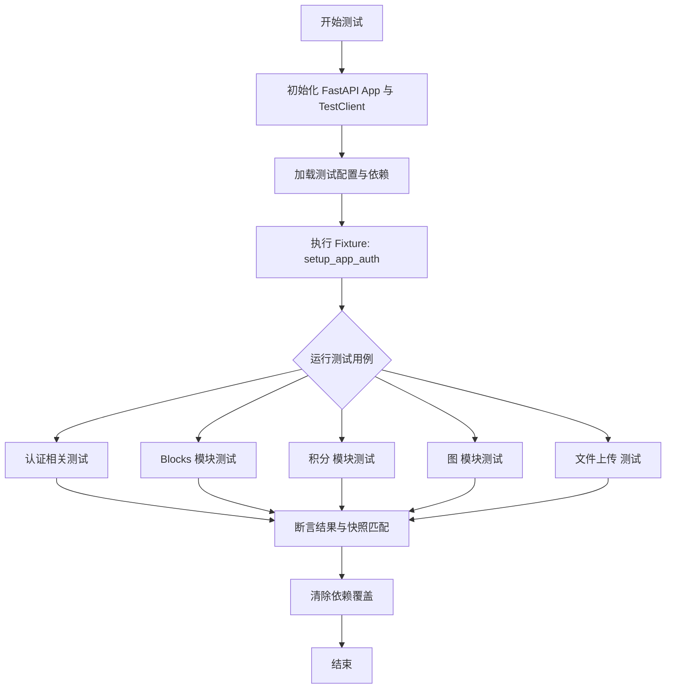

## 类结构

```
Test Module (test_api_features.py)
├── Global Variables
│   ├── app
│   └── client
└── Functions (Tests & Fixtures)
    ├── Fixtures
    │   └── setup_app_auth
    └── Test Cases
        ├── test_get_or_create_user_route
        ├── test_update_user_email_route
        ├── test_get_graph_blocks
        ├── test_execute_graph_block
        ├── test_execute_graph_block_not_found
        ├── test_get_user_credits
        ├── test_request_top_up
        ├── test_get_auto_top_up
        ├── test_configure_auto_top_up
        ├── test_configure_auto_top_up_validation_errors
        ├── test_get_graphs
        ├── test_get_graph
        ├── test_get_graph_not_found
        ├── test_delete_graph
        ├── test_invalid_json_request
        ├── test_missing_required_field
        ├── test_upload_file_success
        ├── test_upload_file_no_filename
        ├── test_upload_file_invalid_expiration
        ├── test_upload_file_virus_scan_failure
        ├── test_upload_file_cloud_storage_failure
        ├── test_upload_file_size_limit_exceeded
        └── test_upload_file_gcs_not_configured_fallback
```

## 全局变量及字段


### `app`
    
The main FastAPI application instance used for testing the API routes.

类型：`fastapi.FastAPI`
    


### `client`
    
The TestClient instance used to simulate HTTP requests against the FastAPI app.

类型：`fastapi.testclient.TestClient`
    


    

## 全局函数及方法


### `setup_app_auth`

这是一个 Pytest 的自动 Fixture，用于为当前模块的所有测试设置全局认证覆盖，通过将 FastAPI 应用的 JWT payload 获取依赖替换为模拟对象，从而绕过真实的身份验证逻辑。

参数：

-   `mock_jwt_user`：`dict`，包含模拟 JWT payload 获取函数 (`get_jwt_payload`) 的 Fixture 对象。
-   `setup_test_user`：`Any`，用于在数据库中预先创建测试用户的 Fixture 对象（隐式依赖，用于确保数据环境就绪）。

返回值：`Generator[None, None, None]`，生成器对象，用于管理测试设置的上下文和清理工作。

#### 流程图

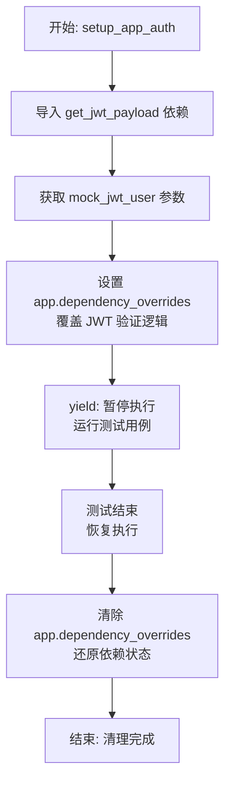

#### 带注释源码

```python
@pytest.fixture(autouse=True)
def setup_app_auth(mock_jwt_user, setup_test_user):
    """Setup auth overrides for all tests in this module"""
    # 导入需要被替换的 FastAPI 依赖项：获取 JWT Payload 的函数
    from autogpt_libs.auth.jwt_utils import get_jwt_payload

    # setup_test_user fixture 已在之前执行，用户已在数据库中创建
    # 它返回的 user_id 在此不需要 await，此处仅确保执行顺序

    # 使用 mock_jwt_user 提供的模拟函数覆盖应用中的真实依赖
    # 这样在测试调用需要认证的接口时，会直接使用模拟数据，跳过真实鉴权
    app.dependency_overrides[get_jwt_payload] = mock_jwt_user["get_jwt_payload"]
    
    # 挂起当前函数，将控制权交给测试用例执行
    yield
    
    # 测试用例执行完毕后，清理环境
    # 清除所有依赖覆盖，避免对后续测试产生影响
    app.dependency_overrides.clear()
```


### `test_get_or_create_user_route`

该函数用于测试认证端点中的获取或创建用户功能。它通过模拟后端逻辑，发送POST请求到`/auth/user`，并验证响应状态码及返回的数据结构是否符合预期快照。

参数：

-  `mocker`：`pytest_mock.MockFixture`，Pytest mock fixture，用于模拟后端服务的`get_or_create_user`函数。
-  `configured_snapshot`：`Snapshot`，快照测试工具，用于比对的API响应数据与预存的快照是否一致。
-  `test_user_id`：`str`，测试用的用户ID字符串，通常由Fixture提供。

返回值：`None`，该函数为测试用例，不返回值，通过断言验证逻辑正确性。

#### 流程图

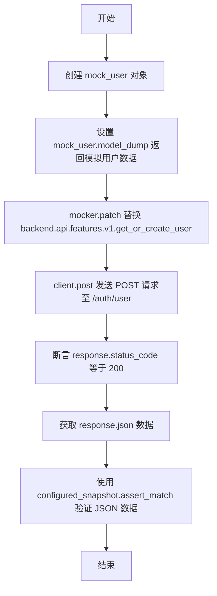

#### 带注释源码

```python
def test_get_or_create_user_route(
    mocker: pytest_mock.MockFixture,
    configured_snapshot: Snapshot,
    test_user_id: str,
) -> None:
    """Test get or create user endpoint"""
    # 创建一个模拟的用户对象
    mock_user = Mock()
    # 配置模拟对象的 model_dump 方法，使其返回包含 id, email, name 的字典
    mock_user.model_dump.return_value = {
        "id": test_user_id,
        "email": "test@example.com",
        "name": "Test User",
    }

    # 使用 mocker.patch 替换后端路径下的 get_or_create_user 函数，
    # 使其在调用时直接返回上面创建的 mock_user
    mocker.patch(
        "backend.api.features.v1.get_or_create_user",
        return_value=mock_user,
    )

    # 使用测试客户端向 /auth/user 发送 POST 请求
    response = client.post("/auth/user")

    # 断言响应状态码为 200
    assert response.status_code == 200
    # 解析响应的 JSON 数据
    response_data = response.json()

    # 使用快照工具断言响应数据与 "auth_user" 快照匹配
    configured_snapshot.assert_match(
        json.dumps(response_data, indent=2, sort_keys=True),
        "auth_user",
    )
```


### `test_update_user_email_route`

该函数用于测试更新用户邮箱的 API 端点，通过模拟后端逻辑并验证 HTTP 响应状态码及数据内容来确保功能的正确性，同时使用快照测试来记录和比对响应结构。

参数：

-  `mocker`：`pytest_mock.MockFixture`，用于模拟（Mock）后端业务逻辑，在此测试中模拟 `update_user_email` 函数返回空值。
-  `snapshot`：`Snapshot`，用于快照测试，将响应数据的 JSON 结构与预存的快照文件进行比对。

返回值：`None`，该函数为测试用例，主要执行断言逻辑，无返回值。

#### 流程图

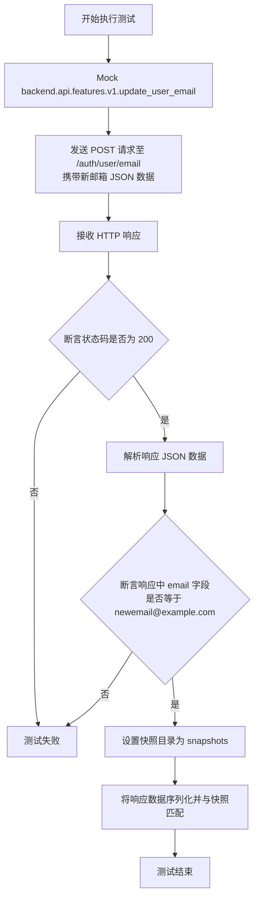

#### 带注释源码

```python
def test_update_user_email_route(
    mocker: pytest_mock.MockFixture,
    snapshot: Snapshot,
) -> None:
    """Test update user email endpoint"""
    # 模拟后端的 update_user_email 函数，使其返回 None
    # 这样可以在不接触真实数据库的情况下测试 API 路由层
    mocker.patch(
        "backend.api.features.v1.update_user_email",
        return_value=None,
    )

    # 使用测试客户端向 /auth/user/email 端点发送 POST 请求
    # 请求体为 JSON 字符串 "newemail@example.com"
    response = client.post("/auth/user/email", json="newemail@example.com")

    # 断言响应状态码为 200，表示请求成功
    assert response.status_code == 200
    
    # 获取响应的 JSON 数据
    response_data = response.json()
    
    # 断言返回的数据中 email 字段确实更新为了新邮箱
    assert response_data["email"] == "newemail@example.com"

    # 设置快照文件的存储目录
    snapshot.snapshot_dir = "snapshots"
    
    # 将格式化后的响应数据与快照文件进行匹配
    # 用于检测 API 响应结构是否发生了非预期的变更
    snapshot.assert_match(
        json.dumps(response_data, indent=2, sort_keys=True),
        "auth_email",
    )
```


### `test_get_graph_blocks`

该函数是一个单元测试用例，旨在验证获取图 blocks 列表的 API 端点功能。通过 Mock（模拟）block 数据检索和成本计算函数，模拟后端逻辑，发送 GET 请求到 `/blocks` 路由，并验证返回的 HTTP 状态码、响应数据的结构及内容是否符合预期，同时使用快照测试确保输出的一致性。

参数：

- `mocker`：`pytest_mock.MockFixture`，Pytest fixture，用于在测试过程中动态替换（打补丁）模块中的函数或对象，以便隔离测试逻辑。
- `snapshot`：`Snapshot`，Pytest fixture，用于获取和比较快照数据，确保 API 响应格式在不同版本间保持稳定。

返回值：`None`，该函数主要用于执行断言逻辑，不返回具体数值。

#### 流程图

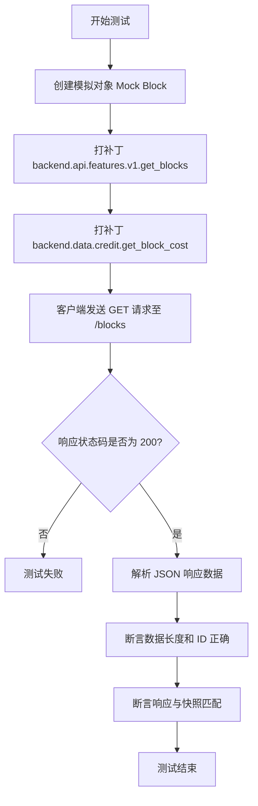

#### 带注释源码

```python
def test_get_graph_blocks(
    mocker: pytest_mock.MockFixture,
    snapshot: Snapshot,
) -> None:
    """Test get blocks endpoint""" # 文档字符串，描述测试目的

    # 1. 创建一个模拟的 Block 对象
    mock_block = Mock()
    # 配置该对象的 to_dict 方法返回特定数据结构
    mock_block.to_dict.return_value = {
        "id": "test-block",
        "name": "Test Block",
        "description": "A test block",
        "disabled": False,
    }
    # 设置基本属性
    mock_block.id = "test-block"
    mock_block.disabled = False

    # 2. 使用 mocker 打补丁替换 backend.api.features.v1.get_blocks
    # 使其返回包含模拟 block 的字典，而不是调用真实的数据库查询
    mocker.patch(
        "backend.api.features.v1.get_blocks",
        return_value={"test-block": lambda: mock_block},
    )

    # 3. 使用 mocker 打补丁替换 backend.data.credit.get_block_cost
    # 模拟 block 的成本计算结果
    mocker.patch(
        "backend.data.credit.get_block_cost",
        return_value=[{"cost": 10, "type": "credit"}],
    )

    # 4. 调用测试客户端发送 GET 请求到 /blocks 端点
    response = client.get("/blocks")

    # 5. 断言 HTTP 响应状态码为 200 (OK)
    assert response.status_code == 200
    # 获取响应的 JSON 数据
    response_data = response.json()
    # 断言返回的列表长度为 1
    assert len(response_data) == 1
    # 断言第一个元素的 id 为 "test-block"
    assert response_data[0]["id"] == "test-block"

    # 6. 设置快照目录并断言响应数据与已保存的快照文件匹配
    snapshot.snapshot_dir = "snapshots"
    snapshot.assert_match(
        json.dumps(response_data, indent=2, sort_keys=True),
        "blks_all",
    )
```


### `test_execute_graph_block`

测试执行块的 API 端点，验证其是否能正确处理输入并返回预期的输出流，同时模拟块执行逻辑和用户上下文。

参数：

-  `mocker`：`pytest_mock.MockFixture`，用于模拟对象和打补丁的 pytest fixture。
-  `snapshot`：`Snapshot`，用于断言响应数据与预存快照一致的 pytest fixture。

返回值：`None`，该函数为测试用例，通过断言验证结果，无返回值。

#### 流程图

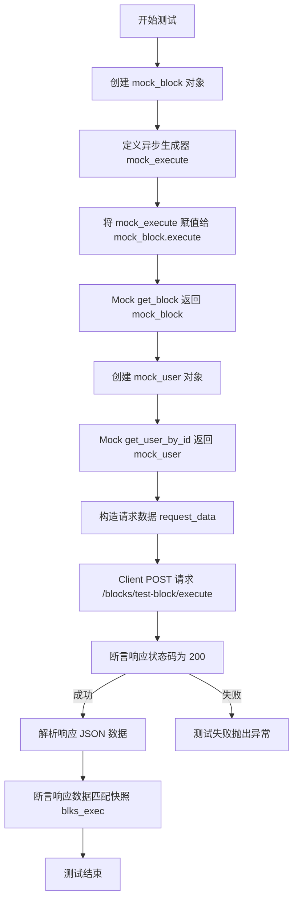

#### 带注释源码

```python
def test_execute_graph_block(
    mocker: pytest_mock.MockFixture,
    snapshot: Snapshot,
) -> None:
    """Test execute block endpoint"""
    # 创建一个模拟的 Block 对象，并设置其未被禁用
    mock_block = Mock()
    mock_block.disabled = False

    # 定义一个异步生成器函数，模拟 Block 的执行过程，产生两组输出数据
    async def mock_execute(*args, **kwargs):
        yield "output1", {"data": "result1"}
        yield "output2", {"data": "result2"}

    # 将模拟的执行函数赋值给 mock_block
    mock_block.execute = mock_execute

    # 打补丁，当调用 get_block 时返回上面创建的 mock_block
    mocker.patch(
        "backend.api.features.v1.get_block",
        return_value=mock_block,
    )

    # 模拟用户对象，用于用户上下文
    mock_user = Mock()
    mock_user.timezone = "UTC"

    # 打补丁，当调用 get_user_by_id 时返回 mock_user
    mocker.patch(
        "backend.api.features.v1.get_user_by_id",
        return_value=mock_user,
    )

    # 准备 POST 请求的数据
    request_data = {
        "input_name": "test_input",
        "input_value": "test_value",
    }

    # 发送 POST 请求到执行块的端点
    response = client.post("/blocks/test-block/execute", json=request_data)

    # 断言 HTTP 响应状态码为 200 (OK)
    assert response.status_code == 200
    # 获取响应的 JSON 数据
    response_data = response.json()

    # 设置快照目录并断言响应数据与快照 'blks_exec' 匹配
    snapshot.snapshot_dir = "snapshots"
    snapshot.assert_match(
        json.dumps(response_data, indent=2, sort_keys=True),
        "blks_exec",
    )
```


### `test_execute_graph_block_not_found`

该测试函数用于验证当尝试通过 API 执行一个不存在的图块时，系统能够正确返回 HTTP 404 Not Found 状态码，并在响应详情中包含相应的错误提示信息。

参数：

-  `mocker`：`pytest_mock.MockFixture`，用于模拟后端依赖函数行为的测试 fixture。

返回值：`None`，该函数为测试用例，通过断言验证行为，无返回值。

#### 流程图

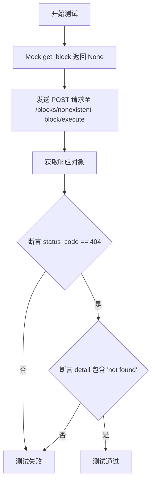

#### 带注释源码

```python
def test_execute_graph_block_not_found(
    mocker: pytest_mock.MockFixture,
) -> None:
    """Test execute block with non-existent block"""
    # 使用 mocker 补丁替换 'backend.api.features.v1.get_block' 函数
    # 模拟该函数返回 None，表示未找到对应的 Block
    mocker.patch(
        "backend.api.features.v1.get_block",
        return_value=None,
    )

    # 使用测试客户端向不存在的 Block ID 'nonexistent-block' 发送执行请求
    # 请求体为空字典 json={}
    response = client.post("/blocks/nonexistent-block/execute", json={})

    # 断言响应状态码为 404，验证资源未找到的处理逻辑
    assert response.status_code == 404
    # 断言响应 JSON 数据中的 'detail' 字段包含 "not found" 字符串
    # 验证错误信息内容的准确性
    assert "not found" in response.json()["detail"]
```


### `test_get_user_credits`

测试获取用户积分端点，通过模拟积分模型服务并验证HTTP响应状态码及返回数据的正确性。

参数：

-   `mocker`：`pytest_mock.MockFixture`，用于创建和配置模拟对象（Mock）以及进行依赖打补丁（patch）的Pytest fixture。
-   `snapshot`：`Snapshot`，用于捕获API响应数据并与快照文件进行比对的Pytest fixture。

返回值：`None`，测试函数主要执行断言逻辑，不返回具体数值。

#### 流程图

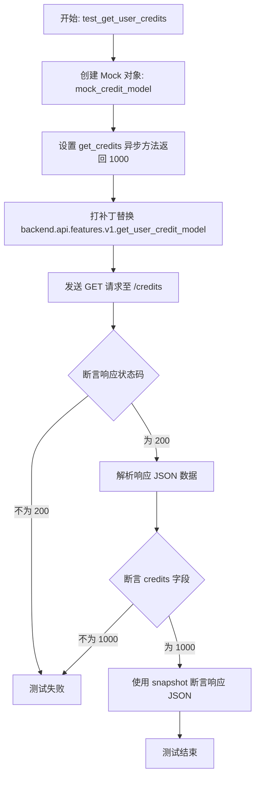

#### 带注释源码

```python
def test_get_user_credits(
    mocker: pytest_mock.MockFixture,
    snapshot: Snapshot,
) -> None:
    """Test get user credits endpoint"""
    # 1. 创建模拟的积分模型对象
    mock_credit_model = Mock()
    # 2. 配置模拟对象的异步方法 get_credits，使其返回 1000 积分
    mock_credit_model.get_credits = AsyncMock(return_value=1000)
    
    # 3. 使用 mocker 打补丁，替换实际的 get_user_credit_model 函数，
    #    使其返回我们创建的 mock_credit_model，从而避免真实数据库或API调用
    mocker.patch(
        "backend.api.features.v1.get_user_credit_model",
        return_value=mock_credit_model,
    )

    # 4. 使用测试客户端发送 GET 请求到 /credits 端点
    response = client.get("/credits")

    # 5. 断言 HTTP 状态码为 200 (OK)
    assert response.status_code == 200
    
    # 6. 解析响应体为 JSON 格式
    response_data = response.json()
    
    # 7. 断言响应数据中的 credits 字段值为 1000
    assert response_data["credits"] == 1000

    # 8. 使用 snapshot 断言工具，将格式化后的响应数据保存为快照或与已有快照比对
    snapshot.snapshot_dir = "snapshots"
    snapshot.assert_match(
        json.dumps(response_data, indent=2, sort_keys=True),
        "cred_bal",
    )
```


### `test_request_top_up`

测试请求充值端点的功能，通过模拟用户信用模型来生成支付意图，验证API返回正确的结账链接，并使用快照确认响应数据的结构。

参数：

-  `mocker`：`pytest_mock.MockFixture`，用于模拟和修补对象及方法的Pytest夹具。
-  `snapshot`：`Snapshot`，用于进行快照测试以验证数据结构的Pytest夹具。

返回值：`None`，该函数为测试函数，不返回任何值。

#### 流程图

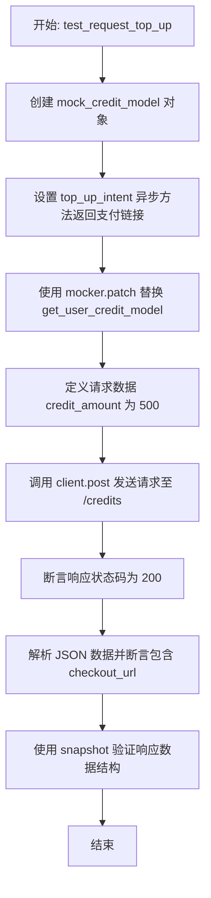

#### 带注释源码

```python
def test_request_top_up(
    mocker: pytest_mock.MockFixture,
    snapshot: Snapshot,
) -> None:
    """Test request top up endpoint"""
    # 创建一个模拟的信用模型对象
    mock_credit_model = Mock()
    # 模拟 top_up_intent 异步方法，返回一个假的支付结账 URL
    mock_credit_model.top_up_intent = AsyncMock(
        return_value="https://checkout.example.com/session123"
    )
    # 对 backend.api.features.v1.get_user_credit_model 进行打补丁
    # 使其返回我们创建的模拟对象，从而绕过真实的数据库/API调用
    mocker.patch(
        "backend.api.features.v1.get_user_credit_model",
        return_value=mock_credit_model,
    )

    # 准备 POST 请求的数据，充值金额为 500
    request_data = {"credit_amount": 500}

    # 使用测试客户端向 /credits 端点发送 POST 请求
    response = client.post("/credits", json=request_data)

    # 断言 HTTP 响应状态码为 200 (成功)
    assert response.status_code == 200
    # 获取响应的 JSON 数据
    response_data = response.json()
    # 断言响应数据中包含 'checkout_url' 字段
    assert "checkout_url" in response_data

    # 配置快照存储目录，并验证响应数据是否与快照一致
    snapshot.snapshot_dir = "snapshots"
    snapshot.assert_match(
        json.dumps(response_data, indent=2, sort_keys=True),
        "cred_topup_req",
    )
```


### `test_get_auto_top_up`

该函数是一个单元测试用例，用于测试获取自动充值配置的 API 端点。通过模拟后端服务返回预设的配置数据，验证接口返回的 HTTP 状态码、JSON 数据格式的正确性，并利用快照测试机制确保输出的一致性。

参数：

-  `mocker`：`pytest_mock.MockFixture`，用于模拟（打补丁）外部依赖和函数行为的 pytest-mock 夹具。
-  `snapshot`：`Snapshot`，用于捕获和比对响应数据快照的测试工具对象。

返回值：`None`，这是一个测试函数，不返回任何值。

#### 流程图

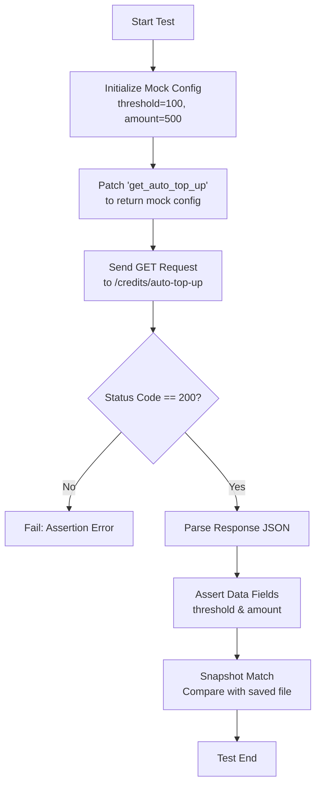

#### 带注释源码

```python
def test_get_auto_top_up(
    mocker: pytest_mock.MockFixture,
    snapshot: Snapshot,
) -> None:
    """Test get auto top-up configuration endpoint"""
    # 1. 创建一个模拟的自动充值配置对象，设定阈值为100，充值金额为500
    mock_config = AutoTopUpConfig(threshold=100, amount=500)

    # 2. 使用 mocker 替换后端逻辑中的 'get_auto_top_up' 函数
    #    使其直接返回上面创建的 mock_config，从而隔离真实的数据库或业务逻辑
    mocker.patch(
        "backend.api.features.v1.get_auto_top_up",
        return_value=mock_config,
    )

    # 3. 使用测试客户端向自动充值配置端点发送 GET 请求
    response = client.get("/credits/auto-top-up")

    # 4. 验证 HTTP 响应状态码是否为 200 (OK)
    assert response.status_code == 200
    response_data = response.json()

    # 5. 验证响应体 JSON 数据中的字段值是否符合预期
    assert response_data["threshold"] == 100
    assert response_data["amount"] == 500

    # 6. 使用 snapshot 断言工具
    #    将格式化后的 JSON 数据与预存的快照文件进行对比，确保 API 输出格式未发生意外变更
    snapshot.snapshot_dir = "snapshots"
    snapshot.assert_match(
        json.dumps(response_data, indent=2, sort_keys=True),
        "cred_topup_cfg",
    )
```


### `test_configure_auto_top_up`

测试自动充值配置端点（/credits/auto-top-up），通过模拟后端服务来验证是否能成功更新设置，该测试主要用于捕捉枚举类型转换错误。

参数：

-   `mocker`：`pytest_mock.MockFixture`，pytest-mock 提供的 fixture，用于模拟对象和补丁。
-   `snapshot`：`Snapshot`，pytest-snapshot 提供的 fixture，用于快照测试（虽然在本函数体中未显式调用）。

返回值：`None`，该函数为测试函数，无返回值。

#### 流程图

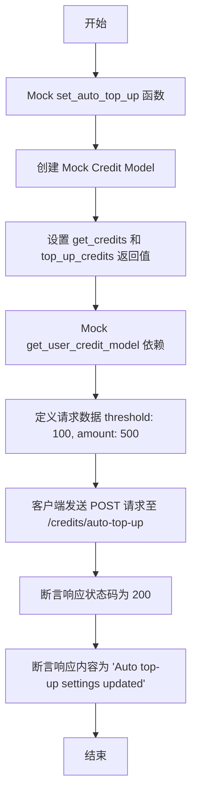

#### 带注释源码

```python
def test_configure_auto_top_up(
    mocker: pytest_mock.MockFixture,
    snapshot: Snapshot,
) -> None:
    """Test configure auto top-up endpoint - this test would have caught the enum casting bug"""
    # 模拟 set_auto_top_up 函数以避免数据库操作，使其返回 None
    mocker.patch(
        "backend.api.features.v1.set_auto_top_up",
        return_value=None,
    )

    # 模拟 Credit Model 以避免 Stripe API 调用
    mock_credit_model = mocker.AsyncMock()
    # 设置当前余额低于阈值的场景
    mock_credit_model.get_credits.return_value = 50  
    mock_credit_model.top_up_credits.return_value = None

    # 模拟 get_user_credit_model 依赖，返回上面创建的 mock 对象
    mocker.patch(
        "backend.api.features.v1.get_user_credit_model",
        return_value=mock_credit_model,
    )

    # 准备测试请求数据
    request_data = {
        "threshold": 100,
        "amount": 500,
    }

    # 发送 POST 请求配置自动充值
    response = client.post("/credits/auto-top-up", json=request_data)

    # 断言：在修复后的代码中应成功返回 200，此前会因为枚举转换错误失败
    assert response.status_code == 200
    assert response.json() == "Auto top-up settings updated"
```


### `test_configure_auto_top_up_validation_errors`

该函数用于测试自动充值配置端点的验证逻辑，确保在输入负阈值、金额过小等无效数据时返回 HTTP 422 错误，而在金额为 0 等特定有效场景下返回成功。

参数：

- `mocker`：`pytest_mock.MockFixture`，用于模拟测试过程中依赖的对象和函数。

返回值：`None`，该函数为测试函数，通过断言验证行为，无返回值。

#### 流程图

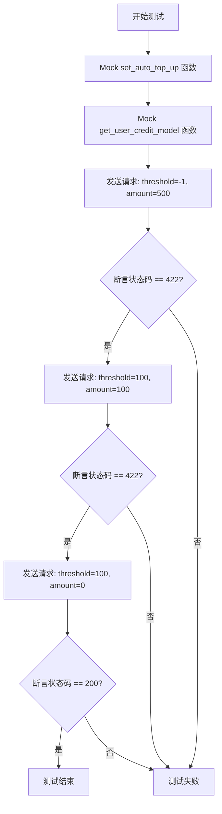

#### 带注释源码

```python
def test_configure_auto_top_up_validation_errors(
    mocker: pytest_mock.MockFixture,
) -> None:
    """Test configure auto top-up endpoint validation"""
    # Mock set_auto_top_up to avoid database operations for successful case
    # 模拟 set_auto_top_up 以避免在成功情况下进行数据库操作
    mocker.patch("backend.api.features.v1.set_auto_top_up")

    # Mock credit model to avoid Stripe API calls for the successful case
    # 模拟信用模型以避免在成功情况下调用 Stripe API
    mock_credit_model = mocker.AsyncMock()
    mock_credit_model.get_credits.return_value = 50
    mock_credit_model.top_up_credits.return_value = None

    mocker.patch(
        "backend.api.features.v1.get_user_credit_model",
        return_value=mock_credit_model,
    )

    # Test negative threshold
    # 测试负数阈值，预期返回 422 验证错误
    response = client.post(
        "/credits/auto-top-up", json={"threshold": -1, "amount": 500}
    )
    assert response.status_code == 422  # Validation error

    # Test amount too small (but not 0)
    # 测试金额过小（非0），预期返回 422 验证错误
    response = client.post(
        "/credits/auto-top-up", json={"threshold": 100, "amount": 100}
    )
    assert response.status_code == 422  # Validation error

    # Test amount = 0 (should be allowed)
    # 测试金额为 0（应该被允许），预期返回 200 成功
    response = client.post("/credits/auto-top-up", json={"threshold": 100, "amount": 0})
    assert response.status_code == 200  # Should succeed
```


### `test_get_graphs`

该函数用于测试获取图表列表的API端点（GET /graphs），通过模拟数据库返回数据来验证接口的响应状态码、JSON数据结构以及快照匹配。

参数：

-  `mocker`：`pytest_mock.MockFixture`，用于模拟后端函数行为的pytest fixture。
-  `snapshot`：`Snapshot`，用于对响应数据进行快照断言的pytest fixture。
-  `test_user_id`：`str`，测试用户的ID，用于构建测试数据。

返回值：`None`，该函数为单元测试，无返回值。

#### 流程图

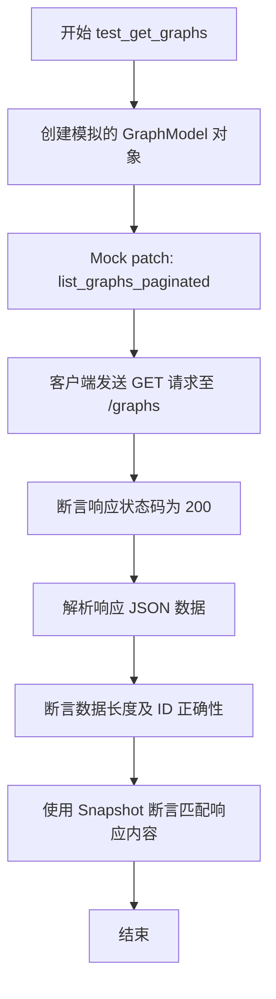

#### 带注释源码

```python
def test_get_graphs(
    mocker: pytest_mock.MockFixture,
    snapshot: Snapshot,
    test_user_id: str,
) -> None:
    """Test get graphs endpoint"""
    # 创建一个模拟的 GraphModel 对象，设置预期的属性值
    mock_graph = GraphModel(
        id="graph-123",
        version=1,
        is_active=True,
        name="Test Graph",
        description="A test graph",
        user_id=test_user_id,
        created_at=datetime(2025, 9, 4, 13, 37),
    )

    # 使用 mocker 模拟后端数据库查询函数 list_graphs_paginated
    # 使其返回一个包含上述模拟图的 Mock 对象
    mocker.patch(
        "backend.data.graph.list_graphs_paginated",
        return_value=Mock(graphs=[mock_graph]),
    )

    # 调用测试客户端发送 GET 请求到 /graphs 路由
    response = client.get("/graphs")

    # 验证 HTTP 响应状态码是否为 200 (OK)
    assert response.status_code == 200
    response_data = response.json()
    
    # 验证返回数据的列表长度是否为 1，且第一个元素的 ID 是否正确
    assert len(response_data) == 1
    assert response_data[0]["id"] == "graph-123"

    # 配置快照目录并断言响应 JSON 数据与预存快照匹配
    snapshot.snapshot_dir = "snapshots"
    snapshot.assert_match(
        json.dumps(response_data, indent=2, sort_keys=True),
        "grphs_all",
    )
```


### `test_get_graph`

该函数用于测试获取单个图（Graph）信息的 API 端点。它通过模拟数据库返回数据，发送 HTTP GET 请求，并验证响应状态码、数据内容以及快照匹配情况。

参数：

- `mocker`：`pytest_mock.MockFixture`，Pytest 的 fixture，用于模拟（打补丁）外部依赖和函数调用。
- `snapshot`：`Snapshot`，Pytest 的 fixture，用于将输出结果与预存的快照进行比对以确保数据格式正确。
- `test_user_id`：`str`，测试用户的 ID，用于构建模拟的 GraphModel 数据。

返回值：`None`，该函数为测试用例，不返回具体值，主要通过断言验证逻辑。

#### 流程图

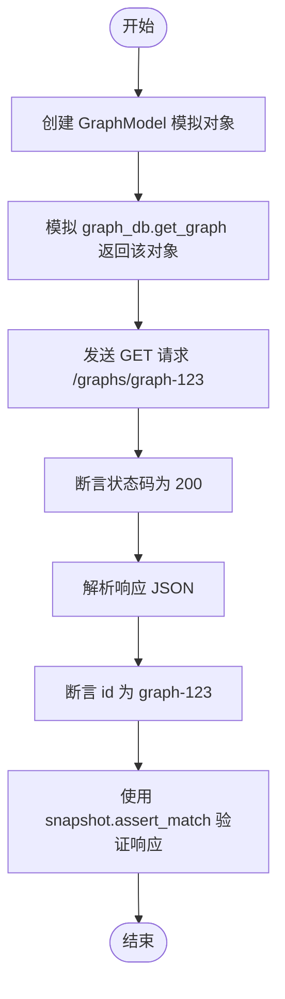

#### 带注释源码

```python
def test_get_graph(
    mocker: pytest_mock.MockFixture,
    snapshot: Snapshot,
    test_user_id: str,
) -> None:
    """Test get single graph endpoint"""
    # 1. 创建一个模拟的 GraphModel 对象，用于后续的数据库模拟返回
    mock_graph = GraphModel(
        id="graph-123",
        version=1,
        is_active=True,
        name="Test Graph",
        description="A test graph",
        user_id=test_user_id,
        created_at=datetime(2025, 9, 4, 13, 37),
    )

    # 2. 使用 mocker 打补丁，替换实际的数据库查询函数 graph_db.get_graph
    # 使其直接返回上面创建的 mock_graph，避免真实数据库操作
    mocker.patch(
        "backend.api.features.v1.graph_db.get_graph",
        return_value=mock_graph,
    )

    # 3. 使用测试客户端向 /graphs/graph-123 发送 GET 请求
    response = client.get("/graphs/graph-123")

    # 4. 断言响应状态码为 200，表示请求成功
    assert response.status_code == 200
    # 5. 将响应体解析为 JSON 格式
    response_data = response.json()
    # 6. 断言返回数据中的 id 字段符合预期
    assert response_data["id"] == "graph-123"

    # 7. 配置快照目录，并将格式化后的 JSON 数据与快照文件进行比对
    # 用于检测 API 返回结构是否发生非预期变更
    snapshot.snapshot_dir = "snapshots"
    snapshot.assert_match(
        json.dumps(response_data, indent=2, sort_keys=True),
        "grph_single",
    )
```


### `test_get_graph_not_found`

Test get graph with non-existent ID（测试获取不存在ID的图）。

参数：

-  `mocker`：`pytest_mock.MockFixture`，Pytest fixture用于模拟对象和函数。

返回值：`None`，无返回值（测试函数）。

#### 流程图

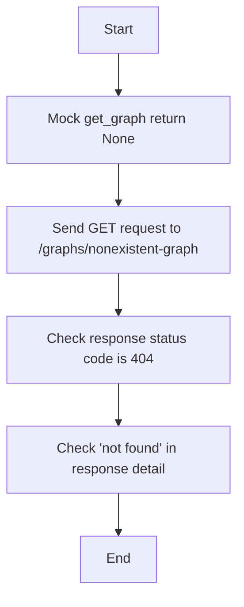

#### 带注释源码

```python
def test_get_graph_not_found(
    mocker: pytest_mock.MockFixture,
) -> None:
    """Test get graph with non-existent ID"""
    # 模拟 graph_db.get_graph 函数返回 None，模拟图未找到的情况
    mocker.patch(
        "backend.api.features.v1.graph_db.get_graph",
        return_value=None,
    )

    # 向客户端发送 GET 请求，访问一个不存在的图 ID
    response = client.get("/graphs/nonexistent-graph")

    # 断言响应状态码为 404
    assert response.status_code == 404
    # 断言响应详情中包含 "not found" 字符串
    assert "not found" in response.json()["detail"]
```


### `test_delete_graph`

测试删除图（Graph）的 API 端点，通过模拟数据库操作来验证删除请求的状态码、返回数据（版本计数）以及响应快照。

参数：

-  `mocker`：`pytest_mock.MockFixture`，由 pytest-mocker 提供的 fixture，用于模拟对象和打补丁。
-  `snapshot`：`Snapshot`，由 pytest-snapshot 提供的 fixture，用于验证响应数据的快照一致性。
-  `test_user_id`：`str`，测试用户的 ID 字符串。

返回值：`None`，测试函数通常无返回值，主要通过断言验证行为。

#### 流程图

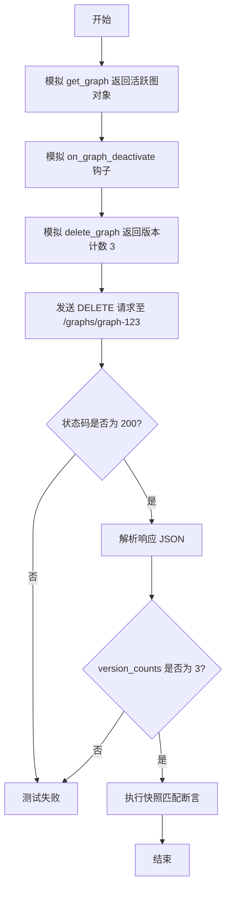

#### 带注释源码

```python
def test_delete_graph(
    mocker: pytest_mock.MockFixture,
    snapshot: Snapshot,
    test_user_id: str,
) -> None:
    """Test delete graph endpoint"""
    # 1. 准备模拟数据：创建一个处于活跃状态的 GraphModel 对象
    mock_graph = GraphModel(
        id="graph-123",
        version=1,
        is_active=True,
        name="Test Graph",
        description="A test graph",
        user_id=test_user_id,
        created_at=datetime(2025, 9, 4, 13, 37),
    )

    # 2. 模拟数据库获取图的操作，返回上面创建的 mock_graph
    mocker.patch(
        "backend.api.features.v1.graph_db.get_graph",
        return_value=mock_graph,
    )
    
    # 3. 模拟图停用的回调函数，避免执行实际业务逻辑
    mocker.patch(
        "backend.api.features.v1.on_graph_deactivate",
        return_value=None,
    )
    
    # 4. 模拟删除图的操作，返回被删除的版本数量 (3)
    mocker.patch(
        "backend.api.features.v1.graph_db.delete_graph",
        return_value=3,  # Number of versions deleted
    )

    # 5. 发送 DELETE 请求到测试客户端
    response = client.delete("/graphs/graph-123")

    # 6. 验证 HTTP 状态码为 200
    assert response.status_code == 200
    
    # 7. 验证返回的 JSON 数据中 version_counts 字段是否为 3
    response_data = response.json()
    assert response_data["version_counts"] == 3

    # 8. 验证响应数据是否符合预期快照
    snapshot.snapshot_dir = "snapshots"
    snapshot.assert_match(
        json.dumps(response_data, indent=2, sort_keys=True),
        "grphs_del",
    )
```


### `test_invalid_json_request`

该函数用于测试 API 端点在接收到格式错误的 JSON 请求体时的行为，验证系统是否能正确返回 HTTP 422 Unprocessable Entity 状态码。

参数：

-   该函数无参数。

返回值：`None`，该函数为测试函数，主要执行断言逻辑，不返回具体数值。

#### 流程图

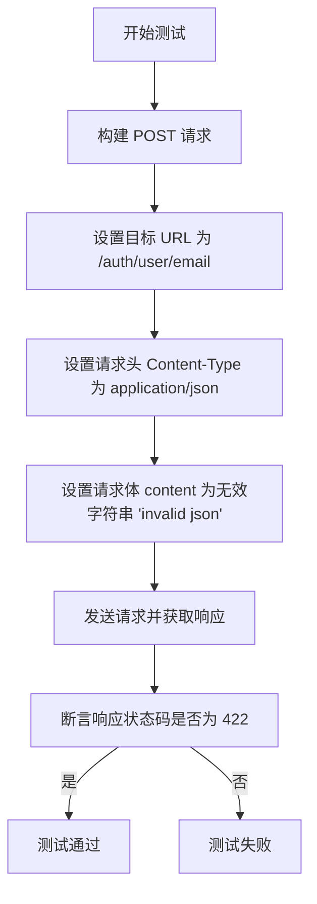

#### 带注释源码

```python
def test_invalid_json_request() -> None:
    """Test endpoint with invalid JSON"""
    # 使用测试客户端向指定端点发送 POST 请求
    response = client.post(
        "/auth/user/email",             # 目标路由路径
        content="invalid json",         # 请求体内容，设置为无效的 JSON 字符串
        headers={"Content-Type": "application/json"}, # 声明内容类型为 JSON，形成格式不匹配
    )
    # 验证响应状态码是否为 422 (Unprocessable Entity)，表示无法处理的请求体
    assert response.status_code == 422
```


### `test_missing_required_field`

该函数是一个测试用例，旨在验证API端点在接收到缺少必填字段的请求时的行为。它通过向`/credits`端点发送一个空的JSON请求体，来模拟用户未提供`credit_amount`等必要参数的场景，并断言服务器应返回HTTP 422（Unprocessable Entity）状态码，以表明请求格式验证失败。

参数：

*   (无)

返回值：`None`，该函数作为测试用例不返回业务数据，仅执行断言逻辑。

#### 流程图

```mermaid
graph TD
    A[开始测试] --> B[调用 client.post 发送请求]
    B --> C[目标路径: /credits]
    C --> D[请求体: 空字典 json={}]
    D --> E[获取 HTTP 响应对象]
    E --> F[断言 response.status_code 等于 422]
    F --> G[测试结束]
```

#### 带注释源码

```python
def test_missing_required_field() -> None:
    """Test endpoint with missing required field"""
    # 使用全局测试客户端 client 向 /credits 路由发送 POST 请求
    # json={} 表示请求体为空，根据业务逻辑，credit_amount 是必填字段
    response = client.post("/credits", json={})  # Missing credit_amount

    # 断言响应的状态码为 422
    # HTTP 422 状态码表示服务器理解请求的内容类型，但无法处理其中的指令（通常指语义错误或验证失败）
    assert response.status_code == 422
```


### `test_upload_file_success`

该测试函数用于验证文件上传功能的成功场景。它模拟了用户上传文本文件的过程，通过 Mock 病毒扫描服务和云存储处理器，验证 `upload_file` 函数是否能正确处理文件内容、生成正确的 URI、返回准确的文件元数据（如大小、类型、过期时间），并确保外部依赖（扫描、存储）被正确调用。

参数：

-  `test_user_id`：`str`，用于模拟已认证用户的 ID，通常由 pytest fixture 提供。

返回值：`None`，这是一个测试函数，不返回具体值，通过断言来验证逻辑正确性。

#### 流程图

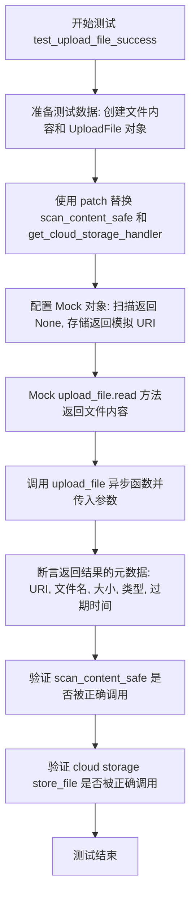

#### 带注释源码

```python
@pytest.mark.asyncio
async def test_upload_file_success(test_user_id: str):
    """Test successful file upload."""
    # 1. 准备测试数据：创建模拟的二进制文件内容和 UploadFile 对象
    file_content = b"test file content"
    file_obj = BytesIO(file_content)
    upload_file_mock = UploadFile(
        filename="test.txt",
        file=file_obj,
        headers=starlette.datastructures.Headers({"content-type": "text/plain"}),
    )

    # 2. 使用 patch 上下文管理器替换外部依赖
    with patch("backend.api.features.v1.scan_content_safe") as mock_scan, patch(
        "backend.api.features.v1.get_cloud_storage_handler"
    ) as mock_handler_getter:

        # 3. 配置 Mock 对象的行为
        # 模拟病毒扫描通过，返回 None
        mock_scan.return_value = None
        
        # 模拟云存储处理器，使其 store_file 方法返回一个模拟的 GCS URI
        mock_handler = AsyncMock()
        mock_handler.store_file.return_value = "gcs://test-bucket/uploads/123/test.txt"
        mock_handler_getter.return_value = mock_handler

        # 模拟 UploadFile 的 read 异步方法，使其返回预设的文件内容
        upload_file_mock.read = AsyncMock(return_value=file_content)

        # 4. 调用被测函数 upload_file
        result = await upload_file(
            file=upload_file_mock,
            user_id=test_user_id,
            provider="gcs",
            expiration_hours=24,
        )

        # 5. 验证返回结果的各个字段是否符合预期
        assert result.file_uri == "gcs://test-bucket/uploads/123/test.txt"
        assert result.file_name == "test.txt"
        assert result.size == len(file_content)
        assert result.content_type == "text/plain"
        assert result.expires_in_hours == 24

        # 6. 验证病毒扫描函数是否被正确调用了一次，且参数正确
        mock_scan.assert_called_once_with(file_content, filename="test.txt")

        # 7. 验证云存储的 store_file 方法是否被正确调用了一次，且参数正确
        mock_handler.store_file.assert_called_once_with(
            content=file_content,
            filename="test.txt",
            provider="gcs",
            expiration_hours=24,
            user_id=test_user_id,
        )
```


### `test_upload_file_no_filename`

测试在文件对象中未提供文件名时的文件上传逻辑，验证系统是否能正确处理文件名为 `None` 的情况，包括生成默认文件名和内容类型处理。

参数：

-  `test_user_id`：`str`，测试用的模拟用户ID。

返回值：`None`，该函数为 pytest 测试用例，无返回值，通过断言验证逻辑正确性。

#### 流程图

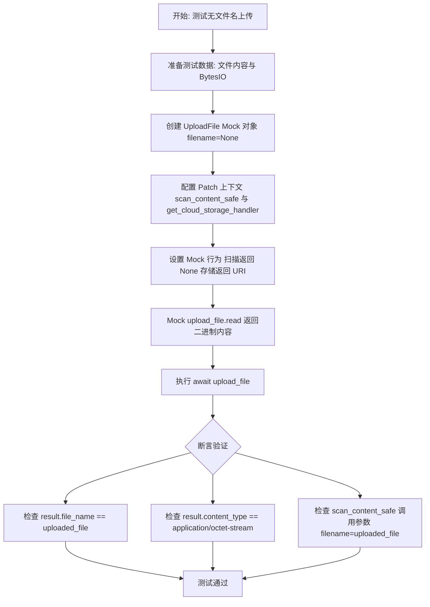

#### 带注释源码

```python
@pytest.mark.asyncio
async def test_upload_file_no_filename(test_user_id: str):
    """Test file upload without filename."""
    # 准备测试用的二进制文件内容
    file_content = b"test content"
    # 创建内存中的文件对象
    file_obj = BytesIO(file_content)
    
    # 构造模拟的 UploadFile 对象，核心测试点是将 filename 显式设置为 None
    upload_file_mock = UploadFile(
        filename=None,
        file=file_obj,
        headers=starlette.datastructures.Headers(
            {"content-type": "application/octet-stream"}
        ),
    )

    # 使用 patch 装饰器上下文模拟依赖的外部服务
    with patch("backend.api.features.v1.scan_content_safe") as mock_scan, patch(
        "backend.api.features.v1.get_cloud_storage_handler"
    ) as mock_handler_getter:

        # 模拟病毒扫描服务返回 None，表示内容安全
        mock_scan.return_value = None
        
        # 模拟云存储处理器
        mock_handler = AsyncMock()
        # 模拟 store_file 方法返回的 URI，包含预期的默认文件名 "uploaded_file"
        mock_handler.store_file.return_value = (
            "gcs://test-bucket/uploads/123/uploaded_file"
        )
        mock_handler_getter.return_value = mock_handler

        # 模拟文件读取操作，异步返回文件内容
        upload_file_mock.read = AsyncMock(return_value=file_content)

        # 调用实际的上传函数进行测试
        result = await upload_file(file=upload_file_mock, user_id=test_user_id)

        # 断言：验证返回结果中的文件名是否为系统生成的默认名 "uploaded_file"
        assert result.file_name == "uploaded_file"
        
        # 断言：验证内容类型是否正确保留了默认的 application/octet-stream
        assert result.content_type == "application/octet-stream"

        # 断言：验证病毒扫描函数是否被调用，且调用时使用了默认文件名 "uploaded_file"
        # 这确认了当 filename 为 None 时，后端逻辑生成了默认文件名传递给安全扫描
        mock_scan.assert_called_once_with(file_content, filename="uploaded_file")
```


### `test_upload_file_invalid_expiration`

该函数是一个异步测试用例，用于验证当文件上传请求中包含无效的过期时间（过短或过长）时，`upload_file` 接口是否能正确抛出带有状态码 400 和相应错误提示的 `HTTPException`。

参数：

-  `test_user_id`：`str`，测试用的用户 ID，由 fixture 注入。

返回值：`None`，该函数为测试用例，无直接返回值，主要通过断言验证行为。

#### 流程图

```mermaid
flowchart TD
    A[开始] --> B[创建 Mock 文件对象]
    B --> C{测试场景 1: expiration_hours=0}
    C --> D[调用 upload_file]
    D --> E[捕获 HTTPException]
    E --> F{断言状态码是否为 400?}
    F -- 是 --> G{断言错误信息包含<br>'between 1 and 48'?}
    G -- 是 --> H{测试场景 2: expiration_hours=49}
    H --> I[调用 upload_file]
    I --> J[捕获 HTTPException]
    J --> K{断言状态码是否为 400?}
    K -- 是 --> L{断言错误信息包含<br>'between 1 and 48'?}
    L -- 是 --> M[测试结束]
```

#### 带注释源码

```python
@pytest.mark.asyncio
async def test_upload_file_invalid_expiration(test_user_id: str):
    """Test file upload with invalid expiration hours."""
    # 准备测试数据：创建一个模拟的文件对象
    file_obj = BytesIO(b"content")
    upload_file_mock = UploadFile(
        filename="test.txt",
        file=file_obj,
        headers=starlette.datastructures.Headers({"content-type": "text/plain"}),
    )

    # 场景 1：测试过期时间过短 (0 小时)
    # 期望抛出 HTTPException
    with pytest.raises(HTTPException) as exc_info:
        await upload_file(
            file=upload_file_mock, user_id=test_user_id, expiration_hours=0
        )
    # 验证异常的状态码为 400
    assert exc_info.value.status_code == 400
    # 验证异常详情包含范围提示
    assert "between 1 and 48" in exc_info.value.detail

    # 场景 2：测试过期时间过长 (49 小时)
    # 期望抛出 HTTPException
    with pytest.raises(HTTPException) as exc_info:
        await upload_file(
            file=upload_file_mock, user_id=test_user_id, expiration_hours=49
        )
    # 验证异常的状态码为 400
    assert exc_info.value.status_code == 400
    # 验证异常详情包含范围提示
    assert "between 1 and 48" in exc_info.value.detail
```


### `test_upload_file_virus_scan_failure`

该函数用于测试文件上传功能在遇到病毒扫描失败（例如检测到病毒）时的异常处理逻辑，确保系统能够正确抛出 `RuntimeError` 异常。

参数：

- `test_user_id`：`str`，用于测试模拟用户上下文的用户ID。

返回值：`None`，无返回值（测试函数）。

#### 流程图

```mermaid
graph TD
    A[开始测试] --> B[创建模拟文件内容: malicious content]
    B --> C[初始化 UploadFile 对象 virus.txt]
    C --> D[patch mock scan_content_safe]
    D --> E[设置 mock_scan.side_effect 为 RuntimeError]
    E --> F[设置 upload_file_mock.read 模拟返回文件内容]
    F --> G[调用 upload_file 函数]
    G --> H{是否抛出 RuntimeError?}
    H -- 是 --> I[断言异常信息为 Virus detected!]
    I --> J[测试通过]
    H -- 否 --> K[测试失败]
    J --> L[结束]
    K --> L
```

#### 带注释源码

```python
@pytest.mark.asyncio
async def test_upload_file_virus_scan_failure(test_user_id: str):
    """Test file upload when virus scan fails."""
    # 1. 准备测试数据，模拟包含恶意内容的文件
    file_content = b"malicious content"
    file_obj = BytesIO(file_content)
    upload_file_mock = UploadFile(
        filename="virus.txt",
        file=file_obj,
        headers=starlette.datastructures.Headers({"content-type": "text/plain"}),
    )

    # 2. 使用 patch 上下文管理器替换后端的病毒扫描函数
    with patch("backend.api.features.v1.scan_content_safe") as mock_scan:
        # 3. 配置 mock 对象，使其在被调用时抛出 RuntimeError，模拟检测到病毒的场景
        mock_scan.side_effect = RuntimeError("Virus detected!")

        # 4. 模拟文件读取操作，返回之前定义的恶意内容
        upload_file_mock.read = AsyncMock(return_value=file_content)

        # 5. 执行测试断言：验证调用 upload_file 时是否抛出了预期的 RuntimeError，并且消息匹配
        with pytest.raises(RuntimeError, match="Virus detected!"):
            await upload_file(file=upload_file_mock, user_id=test_user_id)
```


### `test_upload_file_cloud_storage_failure`

Test file upload when cloud storage fails.

参数：

-  `test_user_id`：`str`，The ID of the test user used as a fixture.

返回值：`None`，No explicit return value; the function asserts that a `RuntimeError` is raised during the upload process.

#### 流程图

```mermaid
graph TD
    A[Start] --> B[Prepare test data: file_content, file_obj, upload_file_mock]
    B --> C[Patch scan_content_safe to return None]
    C --> D[Patch get_cloud_storage_handler to return mock_handler]
    D --> E[Configure mock_handler.store_file side_effect to RuntimeError]
    E --> F[Mock upload_file_mock.read to return file_content]
    F --> G[Call upload_file function]
    G --> H{RuntimeError raised?}
    H -- Yes --> I[Assert exception message matches 'Storage error!']
    H -- No --> J[Test Fails]
    I --> K[End]
```

#### 带注释源码

```python
@pytest.mark.asyncio
async def test_upload_file_cloud_storage_failure(test_user_id: str):
    """Test file upload when cloud storage fails."""
    # 1. 准备测试文件内容
    file_content = b"test content"
    file_obj = BytesIO(file_content)
    
    # 2. 创建模拟的上传文件对象
    upload_file_mock = UploadFile(
        filename="test.txt",
        file=file_obj,
        headers=starlette.datastructures.Headers({"content-type": "text/plain"}),
    )

    # 3. 使用 patch 模拟外部依赖
    with patch("backend.api.features.v1.scan_content_safe") as mock_scan, patch(
        "backend.api.features.v1.get_cloud_storage_handler"
    ) as mock_handler_getter:

        # 4. 配置病毒扫描模拟为通过
        mock_scan.return_value = None
        
        # 5. 创建并配置云存储处理程序模拟
        mock_handler = AsyncMock()
        # 6. 设置 store_file 方法抛出 RuntimeError 以模拟存储失败
        mock_handler.store_file.side_effect = RuntimeError("Storage error!")
        mock_handler_getter.return_value = mock_handler

        # 7. 模拟文件读取操作
        upload_file_mock.read = AsyncMock(return_value=file_content)

        # 8. 调用被测函数并断言抛出了预期的 RuntimeError
        with pytest.raises(RuntimeError, match="Storage error!"):
            await upload_file(file=upload_file_mock, user_id=test_user_id)
```


### `test_upload_file_size_limit_exceeded`

该函数用于测试当上传的文件大小超过系统限制（默认为256MB）时，API端点是否会正确抛出HTTP 400异常，并返回相应的错误信息。

参数：

- `test_user_id`：`str`，用于测试的用户ID（通过pytest fixture注入）。

返回值：`None`，该函数是一个测试用例，不返回业务数据，通过断言验证行为。

#### 流程图

```mermaid
graph TD
    A[开始] --> B[创建大文件内容: 257MB]
    B --> C[初始化 BytesIO 对象]
    C --> D[构建 UploadFile Mock 对象]
    D --> E[设置 Mock read 方法返回大文件内容]
    E --> F[调用 upload_file 并预期抛出异常]
    F --> G{捕获 HTTPException?}
    G -- 否 --> H[测试失败]
    G -- 是 --> I[断言状态码为 400]
    I --> J[断言错误详情包含 'exceeds the maximum allowed size of 256MB']
    J --> K[测试通过/结束]
```

#### 带注释源码

```python
@pytest.mark.asyncio
async def test_upload_file_size_limit_exceeded(test_user_id: str):
    """Test file upload when file size exceeds the limit."""
    # 1. 准备测试数据：创建一个超过默认限制的文件内容 (257MB)
    # 默认限制通常为 256MB，这里构造 257MB 的数据
    large_file_content = b"x" * (257 * 1024 * 1024)  # 257MB
    
    # 2. 将内容封装到内存文件对象 BytesIO 中
    file_obj = BytesIO(large_file_content)
    
    # 3. 创建 FastAPI 的 UploadFile Mock 对象
    upload_file_mock = UploadFile(
        filename="large_file.txt",
        file=file_obj,
        headers=starlette.datastructures.Headers({"content-type": "text/plain"}),
    )

    # 4. Mock UploadFile 的 read 方法，使其返回大文件内容
    upload_file_mock.read = AsyncMock(return_value=large_file_content)

    # 5. 执行测试：预期调用 upload_file 会抛出 HTTPException
    with pytest.raises(HTTPException) as exc_info:
        await upload_file(file=upload_file_mock, user_id=test_user_id)

    # 6. 验证异常状态码为 400 (Bad Request)
    assert exc_info.value.status_code == 400
    
    # 7. 验证异常详情中包含关于大小限制的错误提示
    assert "exceeds the maximum allowed size of 256MB" in exc_info.value.detail
```


### `test_upload_file_gcs_not_configured_fallback`

测试当 Google Cloud Storage (GCS) 未配置时，文件上传功能是否能正确回退到使用 base64 编码的数据 URI，并验证相关的安全扫描和存储逻辑是否符合预期。

参数：

-   `test_user_id`：`str`，用于测试的测试用户 ID，模拟认证用户的身份。

返回值：`None`，该函数是一个测试用例，通过断言验证逻辑，不返回具体数值。

#### 流程图

```mermaid
graph TD
    A[开始测试] --> B[创建模拟文件对象 UploadFile]
    B --> C[补丁 scan_content_safe 模拟安全扫描]
    C --> D[补丁 get_cloud_storage_handler 获取存储处理器]
    D --> E[设置模拟处理器 GCS bucket 为空以模拟未配置]
    E --> F[调用 upload_file 执行上传逻辑]
    F --> G[断言验证结果元数据 文件名 大小等]
    G --> H{断言 file_uri 是否为预期 base64 格式}
    H --> |是| I[断言 scan_content_safe 被调用]
    H --> |否| X[测试失败]
    I --> J{断言 store_file 未被调用}
    J --> |未被调用| Y[测试通过]
    J --> |被调用| X
```

#### 带注释源码

```python
@pytest.mark.asyncio
async def test_upload_file_gcs_not_configured_fallback(test_user_id: str):
    """Test file upload fallback to base64 when GCS is not configured."""
    # 1. 准备测试数据：文件内容和模拟的 UploadFile 对象
    file_content = b"test file content"
    file_obj = BytesIO(file_content)
    upload_file_mock = UploadFile(
        filename="test.txt",
        file=file_obj,
        headers=starlette.datastructures.Headers({"content-type": "text/plain"}),
    )

    # 2. 使用 patch 模拟外部依赖
    with patch("backend.api.features.v1.scan_content_safe") as mock_scan, patch(
        "backend.api.features.v1.get_cloud_storage_handler"
    ) as mock_handler_getter:

        mock_scan.return_value = None
        mock_handler = AsyncMock()
        # 模拟 GCS 未配置的场景：将 bucket 名称设为空
        mock_handler.config.gcs_bucket_name = "" 
        mock_handler_getter.return_value = mock_handler

        # 模拟文件读取操作
        upload_file_mock.read = AsyncMock(return_value=file_content)

        # 3. 调用实际的 upload_file 函数
        result = await upload_file(file=upload_file_mock, user_id=test_user_id)

        # 4. 验证回退行为：检查返回对象的元数据
        assert result.file_name == "test.txt"
        assert result.size == len(file_content)
        assert result.content_type == "text/plain"
        assert result.expires_in_hours == 24

        # 5. 验证核心回退逻辑：file_uri 应该是 base64 编码的 data URI
        expected_data_uri = "data:text/plain;base64,dGVzdCBmaWxlIGNvbnRlbnQ="
        assert result.file_uri == expected_data_uri

        # 6. 验证病毒扫描仍然被执行
        mock_scan.assert_called_once_with(file_content, filename="test.txt")

        # 7. 验证云存储的 store_file 方法未被调用，确认使用了回退机制
        mock_handler.store_file.assert_not_called()
```


## 关键组件


### API 测试客户端
使用 `fastapi.testclient` 模拟 HTTP 请求以测试 API 端点，无需运行实际服务器。

### 认证中间件模拟
通过 `dependency_overrides` 覆盖 JWT 验证逻辑，为所有测试注入模拟的用户认证上下文。

### Block 执行逻辑
测试 Block 组件的检索、执行流程（输入输出处理）以及相关的成本计算功能。

### 积分与支付模型
处理用户积分余额查询、充值意图生成（Stripe 集成）、自动充值配置的读取与验证逻辑。

### 图数据管理
负责 GraphModel 的数据获取、分页列表展示、单图详情查询及软删除操作。

### 文件上传与安全存储
管理文件上传流程，包含病毒扫描、云存储（GCS）交互、文件大小限制校验以及 Base64 降级存储策略。


## 问题及建议


### 已知问题

-   **大文件测试导致的内存溢出风险**：在 `test_upload_file_size_limit_exceeded` 测试用例中，代码在内存中直接创建了一个 257MB 的字节串 (`b"x" * (257 * 1024 * 1024)`) 来测试文件大小限制。这种做法会显著增加测试进程的内存消耗，在资源受限的 CI/CD 环境或并发执行测试时极易导致内存溢出（OOM）失败。
-   **测试策略不一致**：文件中大部分测试使用 `fastapi.testclient.TestClient` 对 HTTP 端点进行集成测试，而文件上传相关的测试（`test_upload_file_*`）则直接调用导入的 `upload_file` 异步函数并手动 Mock 依赖。这种混合策略使得测试套件难以维护，且直接调用函数测试无法覆盖 FastAPI 的请求序列化、反序列化及中间件逻辑。
-   **Mock 对象与内部实现强耦合**：测试中大量使用 `Mock` 对象并手动指定返回值（如 `mock_user.model_dump.return_value = ...`），这与特定版本的 Pydantic 或 ORM 方法紧密耦合。一旦被测对象的序列化方法发生变化（例如从 `model_dump` 变更为 `dict` 或其他序列化协议），这些测试将会意外失败。

### 优化建议

-   **模拟大文件测试**：修改 `test_upload_file_size_limit_exceeded`，不要在内存中生成真实的超大文件数据。建议使用 `unittest.mock.MagicMock` 来模拟 `UploadFile` 对象的 `read` 方法或 `file` 属性的行为，或者使用 `io.BytesIO` 结合 Mock 模拟大尺寸读取，使其仅返回少量数据但报告较大的文件大小，从而既测试了边界检查逻辑又不消耗真实内存。
-   **使用参数化测试简化验证逻辑**：将 `test_configure_auto_top_up_validation_errors` 中的多个独立验证场景（负阈值、小额金额、0金额）重构为使用 `@pytest.mark.parametrize` 装饰器。这样可以减少重复代码，并清晰地列出所有测试用例的输入和预期输出。
-   **提取公共 Fixtures**：将重复创建的 `GraphModel`、`UploadFile` 以及 `datetime` 对象提取为 `conftest.py` 中的 Fixtures 或类内部的 `setup_method`。例如，多个测试中硬编码了 `datetime(2025, 9, 4, 13, 37)`，应统一为一个 Fixture 以便于维护。
-   **统一快照配置**：目前每个使用 Snapshot 的测试函数中都包含 `snapshot.snapshot_dir = "snapshots"`。建议将此配置移至 `conftest.py` 中的 Fixture 或者通过配置文件全局设置，以消除代码冗余。
-   **统一测试风格**：建议将 `upload_file` 相关的异步函数调用测试改为通过 `TestClient` 进行端到端测试。如果必须进行单元测试，应确保文档明确区分集成测试与单元测试的范围。


## 其它


### 设计目标与约束

1.  **设计目标**：
    *   **API 契约验证**：通过单元测试确保 API 端点（Auth, Blocks, Credits, Graphs, Files）的请求和响应符合预期的 JSON 结构和业务逻辑。
    *   **隔离性测试**：利用 `mocker` 和 `patch` 对外部依赖（如数据库、Stripe、GCS、病毒扫描服务）进行 Mock，确保测试仅关注应用层逻辑，不受外部服务不稳定性的影响。
    *   **全场景覆盖**：覆盖成功路径、资源未找到（404）、参数校验失败（422）以及业务逻辑异常（400）等场景。
    *   **状态一致性验证**：使用 `pytest-snapshot` 确保输出结构的稳定性，防止意外的 API 变动。

2.  **设计约束**：
    *   **认证强制**：所有 API 端点默认需要认证，通过 `setup_app_auth` fixture 自动注入 Mock 的 JWT payload。
    *   **文件上传限制**：文件大小限制为 256MB，过期时间必须在 1 到 48 小时之间。
    *   **存储降级策略**：当 Google Cloud Storage (GCS) 未配置时，系统应自动降级使用 Base64 编码存储文件内容。
    *   **安全性要求**：所有上传文件必须经过安全扫描，未通过扫描的文件禁止存储。

### 错误处理与异常设计

1.  **HTTP 状态码规范**：
    *   **200 OK**：请求成功，数据已返回或操作已执行。
    *   **404 Not Found**：请求的资源（如特定的 Graph ID 或 Block ID）不存在。
    *   **422 Unprocessable Entity**：请求参数校验失败，例如 JSON 格式错误、缺少必填字段（`credit_amount`）、数值超出允许范围（自动充值的负数阈值）。
    *   **400 Bad Request**：业务逻辑层面的非法请求，例如文件大小超过限制、过期时间不在有效范围内、文件上传过程中发生安全或存储错误。

2.  **异常处理机制**：
    *   **业务异常捕获**：在文件上传流程中，捕获 `RuntimeError`（如病毒扫描失败 "Virus detected!" 或存储错误 "Storage error!"）并抛出对应的 HTTPException 或直接向上传播，确保错误信息透明。
    *   **Pydantic/FastAPI 校验**：依赖框架自动处理的数据类型校验错误，自动返回 422 状态码。
    *   **Mock 异常模拟**：测试中主动模拟下游服务抛出异常，以验证上层逻辑的错误恢复能力（如 `test_upload_file_virus_scan_failure`）。

### 数据流与状态机

1.  **文件上传数据流**：
    *   **输入**：客户端发送包含文件的 POST 请求。
    *   **校验状态**：
        1.  检查 `expiration_hours` 是否在 [1, 48] 范围内，否则抛出 400 错误。
        2.  检查文件大小是否 < 256MB，否则抛出 400 错误。
    *   **扫描状态**：调用 `scan_content_safe` 进行病毒扫描。如果扫描抛出异常，流程终止并报错。
    *   **存储决策状态**：
        *   *分支 A (GCS)*：如果配置了 GCS Bucket，调用 `store_file` 上传至云端，返回 GCS URI。
        *   *分支 B (Fallback)*：如果未配置 GCS，将文件内容编码为 Base64 字符串，生成 `data:[mime-type];base64,...` 格式的 URI。
    *   **结束状态**：返回包含 `file_uri`, `file_name`, `size` 等信息的 UploadFileResponse 对象。

2.  **自动充值配置状态机**：
    *   **初始状态**：接收包含 `threshold` 和 `amount` 的配置请求。
    *   **校验状态**：
        *   如果 `amount` 为 0，视为关闭自动充值，允许通过。
        *   如果 `amount` 过小（非 0）或 `threshold` 为负数，拦截并返回 422 错误。
    *   **执行状态**：调用 `set_auto_top_up` 保存配置。
    *   **结算模拟状态**（在测试逻辑中）：模拟当前余额低于阈值，触发 `top_up_credits`，验证充值逻辑是否通畅。

### 外部依赖与接口契约

1.  **认证服务**：
    *   **组件**：`autogpt_libs.auth.jwt_utils.get_jwt_payload`
    *   **契约**：测试通过覆盖依赖注入，返回固定的 Mock 用户数据，模拟已登录用户上下文。

2.  **数据持久层**：
    *   **组件**：`backend.data.graph`, `backend.api.features.v1` (各类 get/set 函数)
    *   **契约**：
        *   `list_graphs_paginated`: 返回包含 GraphModel 列表的对象。
        *   `get_or_create_user`: 返回包含用户 ID, 邮箱, 名称的 User 对象。
        *   `get_block`: 返回可执行 Block 对象或 None。

3.  **支付与信用系统**：
    *   **组件**：`backend.data.credit.get_user_credit_model`
    *   **契约**：
        *   `get_credits`: 异步返回当前积分余额。
        *   `top_up_intent`: 异步返回 Stripe 结账 URL 字符串。

4.  **基础设施服务**：
    *   **组件**：`backend.api.features.v1.get_cloud_storage_handler`
    *   **契约**：
        *   提供 `store_file` 异步方法，接收 `content`, `filename`, `provider` 等参数，返回存储 URI。
        *   包含配置属性 `gcs_bucket_name`，用于判断是否启用云存储。

5.  **安全服务**：
    *   **组件**：`backend.api.features.v1.scan_content_safe`
    *   **契约**：接收文件二进制内容和文件名，执行扫描，若无异常则返回 `None`，若发现威胁则抛出 `RuntimeError`。

### 安全性与合规性

1.  **内容安全**：
    *   **强制扫描**：所有上传文件必须通过 `scan_content_safe` 接口的安全检查，任何检测到的恶意内容（病毒）都会导致上传失败。
    *   **安全隔离**：测试环境通过 Mock 扫描接口，避免了在测试运行时产生实际的安全检查开销或误报。

2.  **访问控制**：
    *   **JWT 验证**：系统强制所有测试接口通过 `setup_app_auth` 进行用户身份注入，模拟生产环境中的 JWT 验证机制，确保未授权请求被拦截。
    *   **用户隔离**：Graph 和 Credit 操作均绑定 `test_user_id`，测试数据严格隔离，防止越权访问。

3.  **数据保护**：
    *   **临时存储**：文件上传支持设置 `expiration_hours`（1-48小时），确保文件链接的时效性，符合数据最小化保留原则。
    *   **存储回退**：在没有配置对象存储（GCS）的情况下，系统设计为使用 Base64 内存存储，这在生产环境中可能仅适用于小文件或临时场景，但在测试中保证了功能的完整性。

    