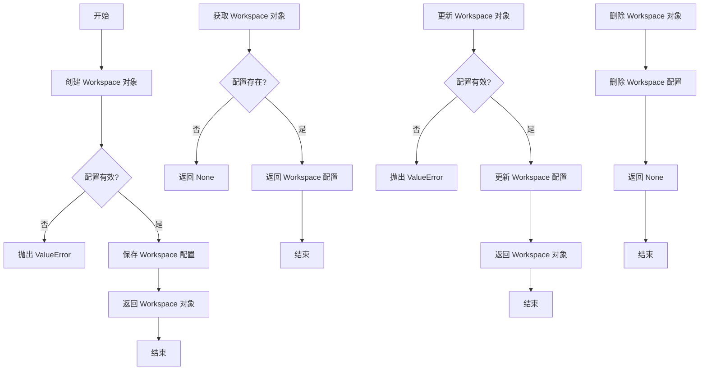
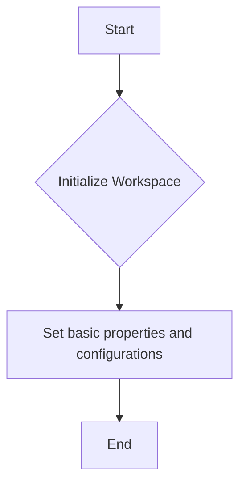
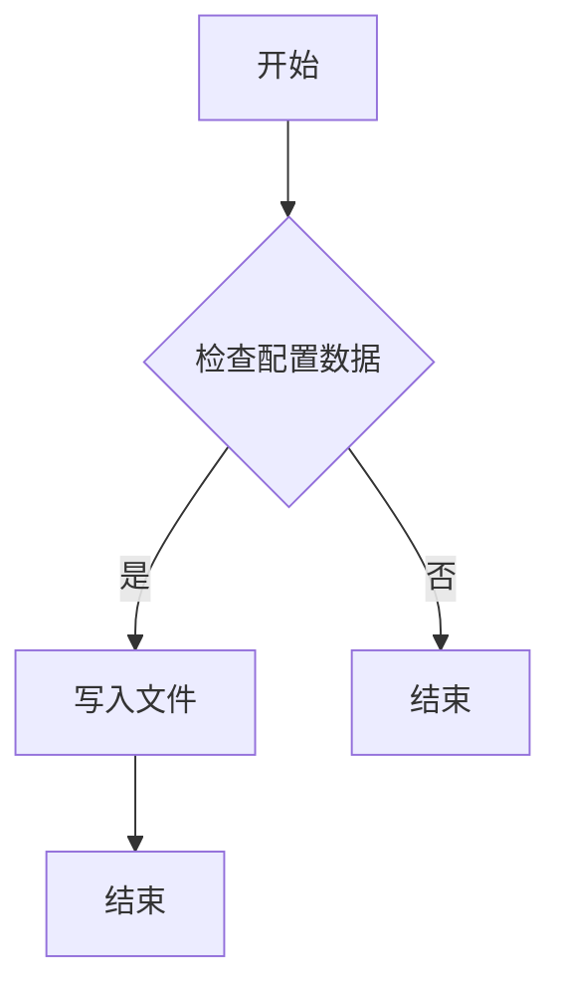
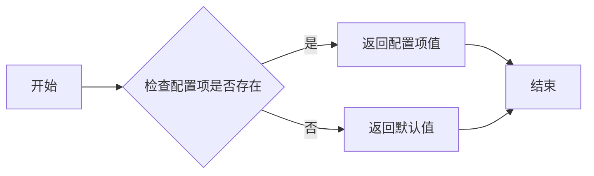
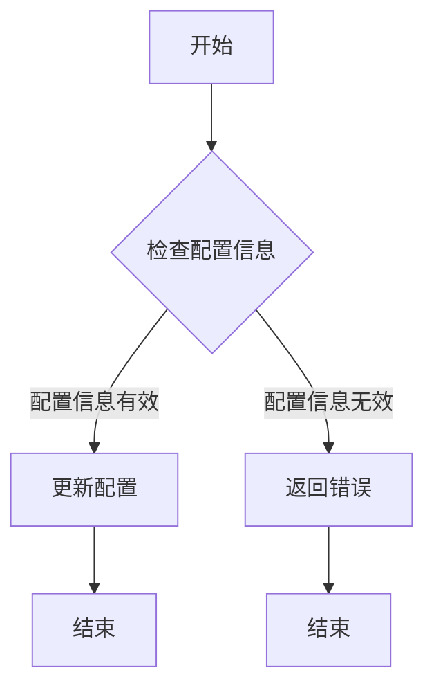
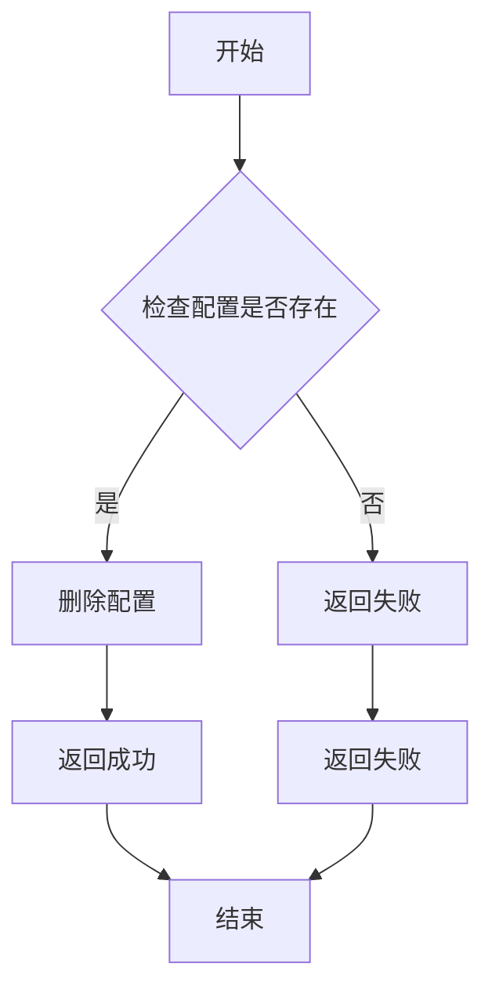
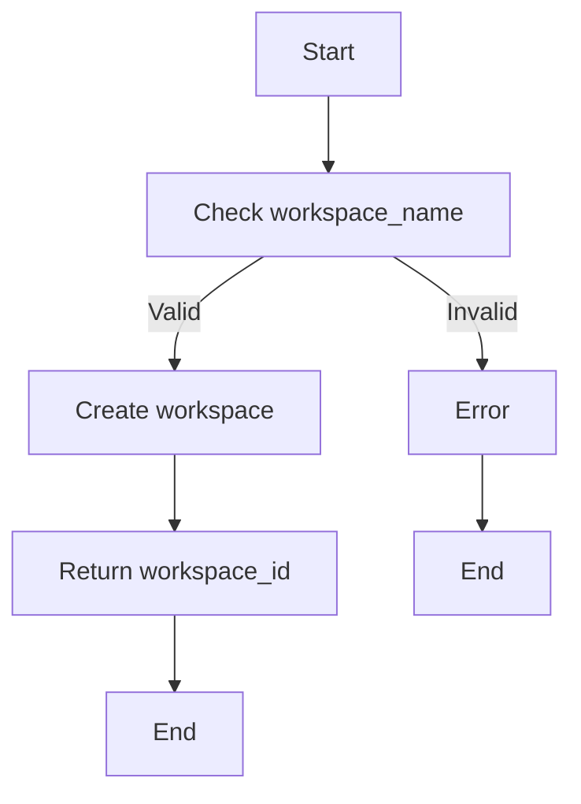
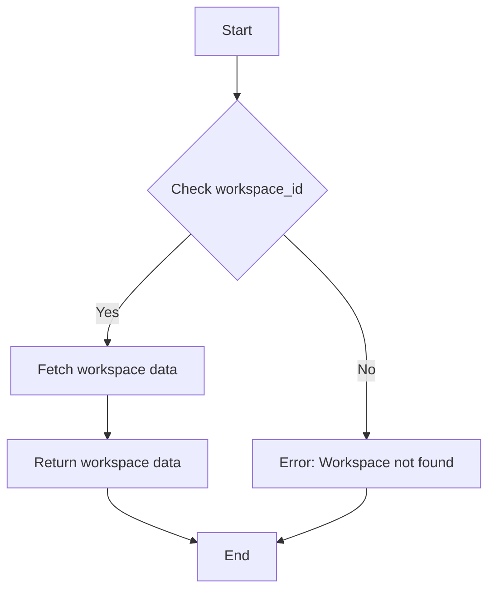
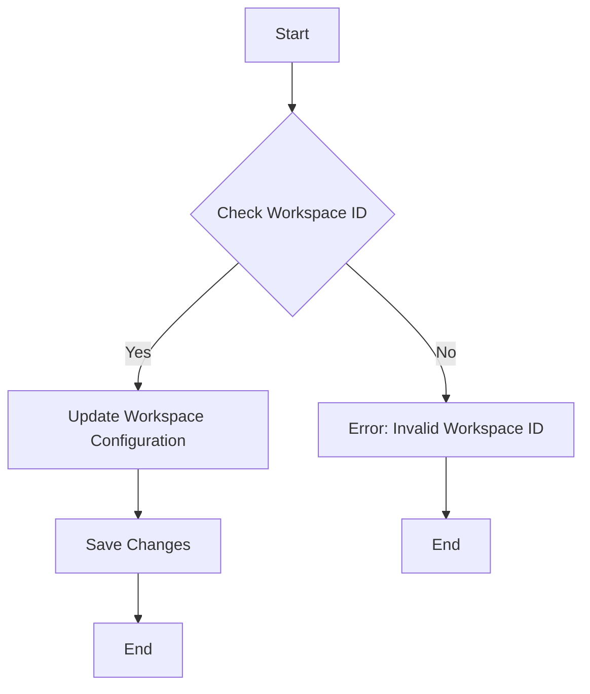
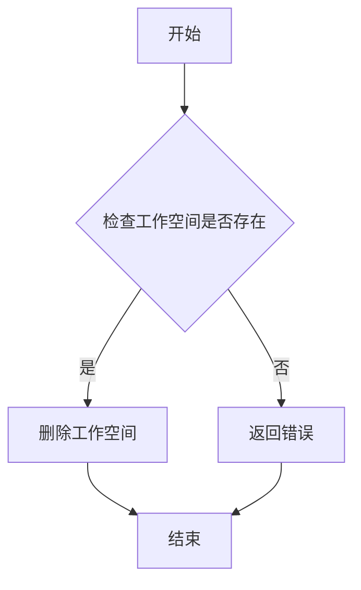

# `.\AutoGPT\autogpt_platform\backend\backend\api\features\workspace\__init__.py` 详细设计文档

This code module provides an API for managing workspace features, including creating, retrieving, updating, and deleting workspace configurations.

## 整体流程



## 类结构

```
WorkspaceAPIFeatureModule (主模块)
├── Workspace (工作空间类)
│   ├── __init__(self, config: dict) -> None
│   ├── save_config(self) -> None
│   ├── get_config(self) -> dict
│   ├── update_config(self, new_config: dict) -> None
│   └── delete_config(self) -> None
└── WorkspaceManager (管理器类)
    ├── create_workspace(self, config: dict) -> Workspace
    ├── get_workspace(self, workspace_id: str) -> Workspace
    ├── update_workspace(self, workspace_id: str, new_config: dict) -> Workspace
    └── delete_workspace(self, workspace_id: str) -> None
```

## 全局变量及字段


### `config`
    
Contains configuration settings for the workspace module.

类型：`dict`
    


### `Workspace.config`
    
Configuration settings for the workspace module.

类型：`dict`
    
    

## 全局函数及方法


### Workspace.__init__

初始化 Workspace 类，设置基本属性和配置。

参数：

- `self`：`Workspace` 类的实例，用于访问类的属性和方法。

返回值：无，该方法不返回任何值。

#### 流程图



#### 带注释源码

```python
class Workspace:
    def __init__(self):
        # Initialize the Workspace class
        
        # Define class fields
        self.project_name = None  # The name of the project
        self.environment = None   # The environment configuration
        
        # Set basic properties and configurations
        self.project_name = "DefaultProject"
        self.environment = "Development"
```


### Workspace.save_config

保存配置信息到指定的文件。

参数：

- `config_data`：`dict`，配置数据，包含需要保存的配置信息。

返回值：`None`，无返回值。

#### 流程图



#### 带注释源码

```python
def save_config(config_data):
    # 检查配置数据是否为字典类型
    if not isinstance(config_data, dict):
        raise ValueError("配置数据必须是字典类型")

    # 将配置数据写入文件
    with open("config.txt", "w") as file:
        for key, value in config_data.items():
            file.write(f"{key}={value}\n")
```


### Workspace.get_config

获取配置信息。

参数：

-  `key`：`str`，配置项的键，用于标识特定的配置信息
-  `default_value`：`Any`，当配置项不存在时的默认值，可选参数

返回值：`Any`，获取到的配置项的值，如果配置项不存在，则返回默认值

#### 流程图



#### 带注释源码

```python
class Workspace:
    # 假设这是一个配置字典，用于存储配置信息
    _configurations = {
        'database_url': 'http://example.com/db',
        'api_key': '1234567890abcdef'
    }

    @staticmethod
    def get_config(key, default_value=None):
        """
        获取配置信息。

        :param key: 配置项的键，用于标识特定的配置信息
        :param default_value: 当配置项不存在时的默认值，可选参数
        :return: 获取到的配置项的值，如果配置项不存在，则返回默认值
        """
        # 检查配置项是否存在
        if key in Workspace._configurations:
            return Workspace._configurations[key]
        else:
            # 如果配置项不存在，返回默认值
            return default_value
```


### Workspace.update_config

更新工作空间配置信息。

参数：

- `config`：`dict`，配置信息字典，包含需要更新的配置键值对。

返回值：`None`，无返回值。

#### 流程图



#### 带注释源码

```python
class Workspace:
    def update_config(self, config):
        # 检查配置信息是否有效
        if not isinstance(config, dict):
            raise ValueError("配置信息必须是字典类型")
        
        # 更新配置信息
        for key, value in config.items():
            # 假设有一个方法来更新配置
            self._update_config_key(key, value)
        
        # 无返回值
        return None

    def _update_config_key(self, key, value):
        # 更新单个配置键的值
        # 这里是伪代码，具体实现取决于配置存储的方式
        pass
```


### Workspace.delete_config

删除指定配置信息。

参数：

-  `config_id`：`int`，配置的唯一标识符，用于定位要删除的配置。

返回值：`bool`，表示删除操作是否成功。

#### 流程图



#### 带注释源码

```python
class Workspace:
    # 假设有一个配置列表，用于存储配置信息
    config_list = []

    @staticmethod
    def delete_config(config_id):
        # 检查配置是否存在
        if config_id in Workspace.config_list:
            # 删除配置
            Workspace.config_list.remove(config_id)
            return True
        else:
            # 配置不存在，返回失败
            return False
```


### WorkspaceManager.create_workspace

创建一个新的工作空间。

参数：

- `workspace_name`：`str`，工作空间的名称，用于标识和访问工作空间。
- `config`：`dict`，工作空间的配置信息，包含各种设置和参数。

返回值：`str`，创建的工作空间的唯一标识符。

#### 流程图



#### 带注释源码

```python
class WorkspaceManager:
    def create_workspace(self, workspace_name, config):
        # 检查工作空间名称是否有效
        if not self._is_valid_workspace_name(workspace_name):
            raise ValueError("Invalid workspace name")
        
        # 创建工作空间
        workspace_id = self._create_workspace_internal(workspace_name, config)
        
        # 返回工作空间ID
        return workspace_id

    def _is_valid_workspace_name(self, workspace_name):
        # 实现检查工作空间名称有效性的逻辑
        pass

    def _create_workspace_internal(self, workspace_name, config):
        # 实现创建工作空间的内部逻辑
        pass
```


### WorkspaceManager.get_workspace

该函数用于获取指定ID的工作空间信息。

参数：

- `workspace_id`：`int`，工作空间的唯一标识符

返回值：`dict`，包含工作空间信息的字典

#### 流程图



#### 带注释源码

```python
class WorkspaceManager:
    # 假设这是从数据库或其他数据源获取工作空间数据的函数
    def _fetch_workspace_data(self, workspace_id):
        # 这里是模拟数据获取的逻辑
        return {
            'id': workspace_id,
            'name': 'Example Workspace',
            'description': 'This is an example workspace.'
        }

    def get_workspace(self, workspace_id):
        # 检查工作空间ID是否有效
        if workspace_id is None:
            raise ValueError("workspace_id cannot be None")
        
        # 获取工作空间数据
        workspace_data = self._fetch_workspace_data(workspace_id)
        
        # 检查工作空间数据是否存在
        if workspace_data is None:
            raise ValueError("Workspace not found with ID: {}".format(workspace_id))
        
        # 返回工作空间数据
        return workspace_data
```


### WorkspaceManager.update_workspace

更新工作空间的状态或配置。

参数：

- `workspace_id`：`str`，工作空间的唯一标识符。
- `new_config`：`dict`，包含新的工作空间配置信息的字典。

返回值：`None`，没有返回值，该方法直接更新工作空间。

#### 流程图



#### 带注释源码

```python
class WorkspaceManager:
    def update_workspace(self, workspace_id, new_config):
        # 检查工作空间ID是否有效
        if not self._is_valid_workspace_id(workspace_id):
            raise ValueError("Invalid Workspace ID")
        
        # 更新工作空间配置
        self._update_workspace_configuration(workspace_id, new_config)
        
        # 保存更改
        self._save_changes()

# 假设以下为私有方法，用于内部处理
    def _is_valid_workspace_id(self, workspace_id):
        # 实现检查工作空间ID有效性的逻辑
        pass

    def _update_workspace_configuration(self, workspace_id, new_config):
        # 实现更新工作空间配置的逻辑
        pass

    def _save_changes(self):
        # 实现保存更改的逻辑
        pass
```


### WorkspaceManager.delete_workspace

删除指定名称的工作空间。

参数：

- `workspace_name`：`str`，工作空间的名称，用于标识要删除的工作空间。

返回值：`None`，没有返回值，操作成功后不返回任何内容。

#### 流程图



#### 带注释源码

```python
class WorkspaceManager:
    def __init__(self):
        # 假设这里有一个工作空间存储结构
        self.workspaces = {}

    def delete_workspace(self, workspace_name: str):
        # 检查工作空间是否存在
        if workspace_name in self.workspaces:
            # 删除工作空间
            del self.workspaces[workspace_name]
            # 返回None，表示没有返回值
            return None
        else:
            # 如果工作空间不存在，返回错误
            raise ValueError(f"Workspace '{workspace_name}' does not exist.")
```


## 关键组件


### 张量索引与惰性加载

支持对张量的索引操作，同时采用惰性加载机制以优化内存使用。

### 反量化支持

提供对反量化操作的支持，允许在量化过程中进行反量化处理。

### 量化策略

实现多种量化策略，以适应不同的量化需求。


## 问题及建议


### 已知问题

-   {问题1: 代码片段中缺少具体的代码实现，无法进行详细的分析和描述。}
-   {问题2: 文档描述中缺少对代码核心功能的概述，无法评估代码的功能完整性。}
-   {问题3: 文件的整体运行流程未给出，无法了解代码的执行顺序和逻辑。}
-   {问题4: 类的详细信息、类字段、类方法、全局变量和全局函数的详细信息未提供，无法分析代码的结构和功能。}
-   {问题5: 关键组件信息未给出，无法识别代码中的主要部分。}
-   {问题6: 潜在的技术债务或优化空间未分析，无法提出针对性的改进建议。}

### 优化建议

-   {建议1: 完善代码注释，确保代码的可读性和可维护性。}
-   {建议2: 提供代码的核心功能描述，以便更好地理解代码的目的和用途。}
-   {建议3: 详细描述文件的整体运行流程，包括输入、处理和输出，以便分析代码的执行逻辑。}
-   {建议4: 提供类的详细信息，包括字段和方法的描述，以及全局变量和函数的详细信息，以便全面分析代码的结构和功能。}
-   {建议5: 识别并描述关键组件，以便突出代码中的主要部分。}
-   {建议6: 分析潜在的技术债务或优化空间，提出针对性的改进建议，以提高代码的性能和可维护性。}


## 其它


### 设计目标与约束

- 设计目标：
  - 提供一个模块化的API，用于简化工作空间操作。
  - 确保API具有良好的可扩展性和可维护性。
  - 提供清晰的文档和示例，方便用户快速上手。

- 约束：
  - API必须遵循RESTful设计原则。
  - API应支持跨平台使用，包括但不限于Web和移动设备。
  - API性能需满足高并发需求。

### 错误处理与异常设计

- 错误处理：
  - API应返回统一的错误格式，包括错误代码、错误信息和错误详情。
  - 错误代码应遵循HTTP状态码规范。

- 异常设计：
  - API内部使用try-catch机制处理异常，确保系统稳定运行。
  - 异常信息应记录到日志中，便于问题追踪和定位。

### 数据流与状态机

- 数据流：
  - 用户请求API，API处理请求并返回响应。
  - 数据在处理过程中经过多个组件，如认证、授权、业务逻辑处理等。

- 状态机：
  - API使用状态机管理用户请求的生命周期，包括请求接收、处理、响应等状态。

### 外部依赖与接口契约

- 外部依赖：
  - API可能依赖数据库、缓存、第三方服务等外部资源。

- 接口契约：
  - API接口定义了请求和响应的数据格式，确保前后端数据交互的一致性。
  - 接口契约应遵循JSON Schema规范。


    