# `.\AutoGPT\autogpt_platform\backend\backend\api\features\workspace\routes.py` 详细设计文档

This code defines API routes for managing user file storage, including downloading files from a workspace.

## 整体流程

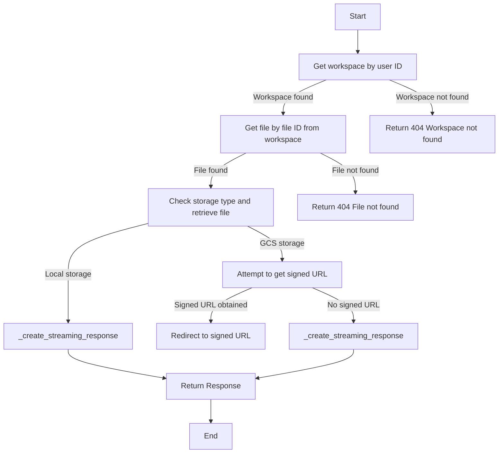

## 类结构

```
fastapi.APIRouter
├── _sanitize_filename_for_header
├── _create_streaming_response
├── _create_file_download_response
└── download_file
```

## 全局变量及字段


### `logger`
    
Logger instance for logging messages.

类型：`logging.Logger`
    


### `router`
    
API router for workspace routes.

类型：`fastapi.APIRouter`
    


### `filename`
    
Filename to be sanitized for use in headers.

类型：`str`
    


### `content`
    
File content to be streamed in response.

类型：`bytes`
    


### `file`
    
File object representing the workspace file.

类型：`backend.data.workspace.WorkspaceFile`
    


### `user_id`
    
User ID for the authenticated user.

类型：`str`
    


### `file_id`
    
ID of the file to be downloaded.

类型：`str`
    


### `logging.Logger.logger`
    
Logger instance for logging messages.

类型：`logging.Logger`
    


### `fastapi.APIRouter.router`
    
API router for workspace routes.

类型：`fastapi.APIRouter`
    


### `function.filename`
    
Filename to be sanitized for use in headers.

类型：`str`
    


### `function.content`
    
File content to be streamed in response.

类型：`bytes`
    


### `function.file`
    
File object representing the workspace file.

类型：`backend.data.workspace.WorkspaceFile`
    


### `function.user_id`
    
User ID for the authenticated user.

类型：`str`
    


### `function.file_id`
    
ID of the file to be downloaded.

类型：`str`
    
    

## 全局函数及方法


### `get_user_id`

获取当前用户的ID。

参数：

- `user_id`：`str`，当前用户的ID。

返回值：`str`，当前用户的ID。

#### 流程图

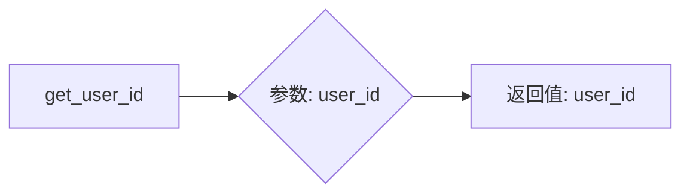

#### 带注释源码

```python
def get_user_id(user_id: str) -> str:
    # This function is a placeholder for the actual implementation
    # which would retrieve the user ID from the authentication system.
    return user_id
```

由于代码中并没有实际的 `get_user_id` 函数实现，以上仅为根据函数签名推测的流程图和源码。实际的实现可能涉及数据库查询、认证系统交互等操作。


### `requires_user`

`requires_user` is a dependency function used in FastAPI to ensure that a user is authenticated before accessing a protected route.

参数：

- `request`: `fastapi.Request`，The incoming HTTP request object. It is used to extract the user information from the request.

返回值：`None`，This function does not return any value. It is used to enforce authentication by raising an exception if the user is not authenticated.

#### 流程图

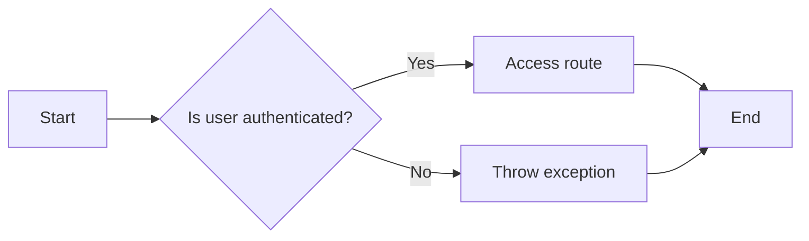

#### 带注释源码

```python
from fastapi import HTTPException

def requires_user(request: fastapi.Request):
    # Check if the user is authenticated
    if not request.authenticated:
        # If not, raise an exception
        raise HTTPException(status_code=401, detail="Unauthorized")
```


### `get_workspace`

获取指定用户的文件存储空间信息。

参数：

- `user_id`：`str`，用户的唯一标识符。

返回值：`None`，如果未找到工作空间，则返回`None`。

#### 流程图

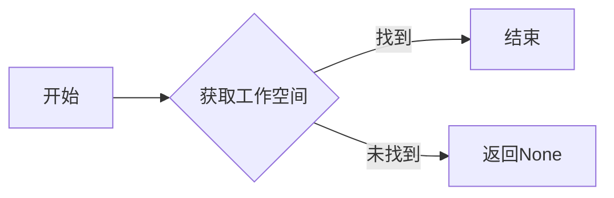

#### 带注释源码

```python
from backend.data.workspace import get_workspace

async def get_workspace(user_id: str) -> None:
    # 获取指定用户的文件存储空间信息
    # ...
```


### `get_workspace_file`

获取指定ID的工作空间文件。

参数：

- `file_id`：`str`，文件ID，用于标识要获取的文件。
- `workspace_id`：`str`，工作空间ID，用于标识文件所属的工作空间。

返回值：`File`，`File`对象，包含文件的相关信息，如文件名、存储路径、MIME类型等。

#### 流程图

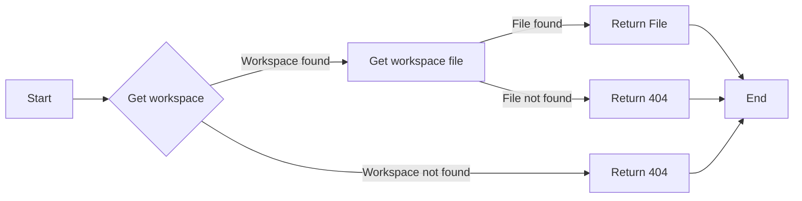

#### 带注释源码

```python
# backend.data.workspace.py

from typing import Optional

class File:
    def __init__(self, name: str, storagePath: str, mimeType: str):
        self.name = name
        self.storagePath = storagePath
        self.mimeType = mimeType

async def get_workspace_file(file_id: str, workspace_id: str) -> Optional[File]:
    # Implementation to retrieve a file from the workspace by file ID
    # This is a placeholder for the actual implementation
    pass
```


### `_create_streaming_response`

创建一个用于文件内容的流式响应。

参数：

- `content`：`bytes`，文件内容。
- `file`：`File`，文件对象，包含文件的相关信息。

返回值：`Response`，`Response`对象，包含文件内容、媒体类型和内容长度。

#### 流程图


#### 带注释源码

```python
# backend.util.workspace_storage.py

from fastapi.responses import Response

def _create_streaming_response(content: bytes, file) -> Response:
    """Create a streaming response for file content."""
    return Response(
        content=content,
        media_type=file.mimeType,
        headers={
            "Content-Disposition": _sanitize_filename_for_header(file.name),
            "Content-Length": str(len(content)),
        },
    )
```


### `_create_file_download_response`

创建一个用于下载工作空间文件的响应。

参数：

- `file`：`File`，文件对象，包含文件的相关信息。

返回值：`Response`，`Response`对象，包含文件内容、媒体类型、内容长度和内容处置。

#### 流程图

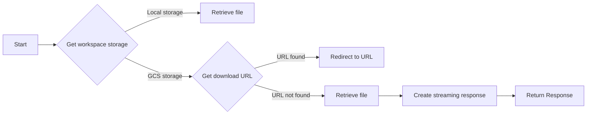

#### 带注释源码

```python
# backend.util.workspace_storage.py

from fastapi.responses import RedirectResponse, Response
from typing import Optional

async def _create_file_download_response(file) -> Response:
    """
    Create a download response for a workspace file.

    Handles both local storage (direct streaming) and GCS (signed URL redirect
    with fallback to streaming).
    """
    storage = await get_workspace_storage()

    # For local storage, stream the file directly
    if file.storagePath.startswith("local://"):
        content = await storage.retrieve(file.storagePath)
        return _create_streaming_response(content, file)

    # For GCS, try to redirect to signed URL, fall back to streaming
    try:
        url = await storage.get_download_url(file.storagePath, expires_in=300)
        # If we got back an API path (fallback), stream directly instead
        if url.startswith("/api/"):
            content = await storage.retrieve(file.storagePath)
            return _create_streaming_response(content, file)
        return fastapi.responses.RedirectResponse(url=url, status_code=302)
    except Exception as e:
        # Log the signed URL failure with context
        logger.error(
            f"Failed to get signed URL for file {file.id} "
            f"(storagePath={file.storagePath}): {e}",
            exc_info=True,
        )
        # Fall back to streaming directly from GCS
        try:
            content = await storage.retrieve(file.storagePath)
            return _create_streaming_response(content, file)
        except Exception as fallback_error:
            logger.error(
                f"Fallback streaming also failed for file {file.id} "
                f"(storagePath={file.storagePath}): {fallback_error}",
                exc_info=True,
            )
            raise
```


### `get_workspace_storage`

获取工作空间存储的配置信息。

参数：

- `user_id`：`str`，用户ID，用于获取用户的工作空间信息。

返回值：`Storage`，工作空间存储配置信息。

#### 流程图

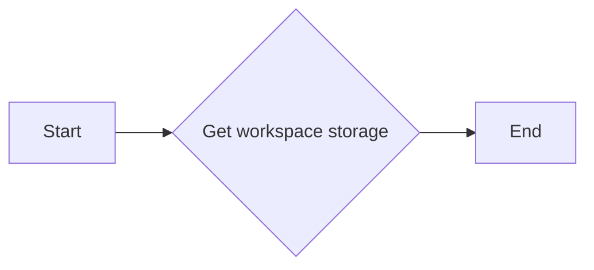

#### 带注释源码

```python
# from backend.util.workspace_storage import get_workspace_storage

async def get_workspace_storage():
    # This function is assumed to be defined in the workspace_storage module
    # and it retrieves the storage configuration for the workspace.
    # The actual implementation details are not shown here as they are part of the
    # external module 'backend.util.workspace_storage'.
    pass
```

[Note: The actual implementation of `get_workspace_storage` is not provided in the given code snippet, so the source code is a placeholder indicating where the function would be defined.] 


### download_file

Download a file by its ID.

参数：

- `user_id`：`str`，The user ID associated with the file.
- `file_id`：`str`，The unique identifier of the file to be downloaded.

返回值：`Response`，A streaming or redirect response containing the file content.

#### 流程图

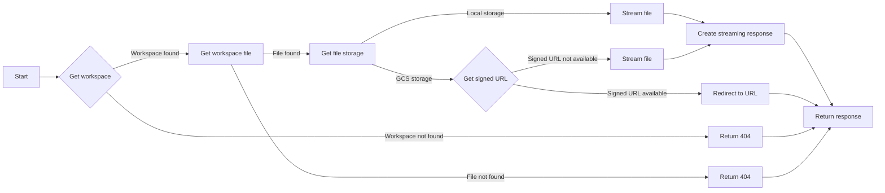

#### 带注释源码

```python
async def download_file(
    user_id: Annotated[str, fastapi.Security(get_user_id)],
    file_id: str,
) -> Response:
    """
    Download a file by its ID.

    Returns the file content directly or redirects to a signed URL for GCS.
    """
    workspace = await get_workspace(user_id)
    if workspace is None:
        raise fastapi.HTTPException(status_code=404, detail="Workspace not found")

    file = await get_workspace_file(file_id, workspace.id)
    if file is None:
        raise fastapi.HTTPException(status_code=404, detail="File not found")

    return await _create_file_download_response(file)
```


### `_sanitize_filename_for_header`

Sanitize filename for Content-Disposition header to prevent header injection.

参数：

- `filename`：`str`，The original filename to be sanitized.

返回值：`str`，The sanitized filename suitable for the Content-Disposition header.

#### 流程图

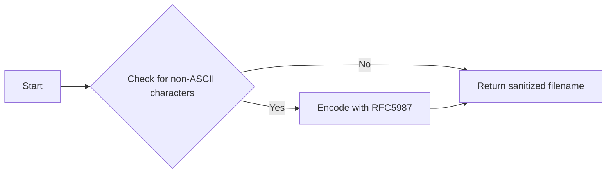

#### 带注释源码

```python
def _sanitize_filename_for_header(filename: str) -> str:
    """
    Sanitize filename for Content-Disposition header to prevent header injection.

    Removes/replaces characters that could break the header or inject new headers.
    Uses RFC5987 encoding for non-ASCII characters.
    """
    # Remove CR, LF, and null bytes (header injection prevention)
    sanitized = re.sub(r"[\r\n\x00]", "", filename)
    # Escape quotes
    sanitized = sanitized.replace('"', '\\"')
    # For non-ASCII, use RFC5987 filename* parameter
    # Check if filename has non-ASCII characters
    try:
        sanitized.encode("ascii")
        return f'attachment; filename="{sanitized}"'
    except UnicodeEncodeError:
        # Use RFC5987 encoding for UTF-8 filenames
        encoded = quote(sanitized, safe="")
        return f"attachment; filename*=UTF-8''{encoded}"
```


### fastapi.responses.RedirectResponse

This function creates a redirect response that redirects the user to a specified URL.

参数：

- `url`：`str`，The URL to redirect to.
- `status_code`：`int`，The HTTP status code to use for the redirect. Default is 302.

返回值：`Response`，A redirect response object.

#### 流程图

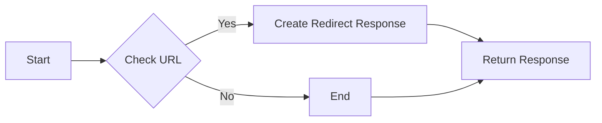

#### 带注释源码

```python
from fastapi.responses import RedirectResponse

def _create_file_download_response(file) -> Response:
    """
    Create a download response for a workspace file.

    Handles both local storage (direct streaming) and GCS (signed URL redirect
    with fallback to streaming).
    """
    storage = await get_workspace_storage()

    # For local storage, stream the file directly
    if file.storagePath.startswith("local://"):
        content = await storage.retrieve(file.storagePath)
        return _create_streaming_response(content, file)

    # For GCS, try to redirect to signed URL, fall back to streaming
    try:
        url = await storage.get_download_url(file.storagePath, expires_in=300)
        # If we got back an API path (fallback), stream directly instead
        if url.startswith("/api/"):
            content = await storage.retrieve(file.storagePath)
            return _create_streaming_response(content, file)
        return fastapi.responses.RedirectResponse(url=url, status_code=302)
    except Exception as e:
        # Log the signed URL failure with context
        logger.error(
            f"Failed to get signed URL for file {file.id} "
            f"(storagePath={file.storagePath}): {e}",
            exc_info=True,
        )
        # Fall back to streaming directly from GCS
        try:
            content = await storage.retrieve(file.storagePath)
            return _create_streaming_response(content, file)
        except Exception as fallback_error:
            logger.error(
                f"Fallback streaming also failed for file {file.id} "
                f"(storagePath={file.storagePath}): {fallback_error}",
                exc_info=True,
            )
            raise
```


### download_file

Download a file by its ID.

参数：

- `user_id`：`str`，The user ID obtained from the security dependency.
- `file_id`：`str`，The ID of the file to be downloaded.

返回值：`Response`，A streaming or redirect response containing the file content or a signed URL for GCS.

#### 流程图

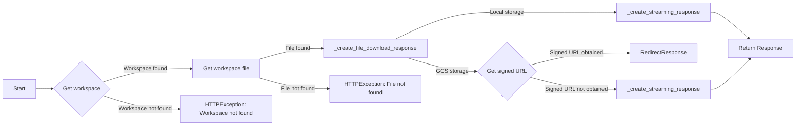

#### 带注释源码

```python
@router.get(
    "/files/{file_id}/download",
    summary="Download file by ID",
)
async def download_file(
    user_id: Annotated[str, fastapi.Security(get_user_id)],
    file_id: str,
) -> Response:
    """
    Download a file by its ID.

    Returns the file content directly or redirects to a signed URL for GCS.
    """
    workspace = await get_workspace(user_id)
    if workspace is None:
        raise fastapi.HTTPException(status_code=404, detail="Workspace not found")

    file = await get_workspace_file(file_id, workspace.id)
    if file is None:
        raise fastapi.HTTPException(status_code=404, detail="File not found")

    return await _create_file_download_response(file)
```


### download_file

Download a file by its ID.

参数：

- `user_id`：`str`，The user ID obtained from the security dependency.
- `file_id`：`str`，The ID of the file to be downloaded.

返回值：`Response`，A response object containing the file content or a redirect to a signed URL for GCS.

#### 流程图

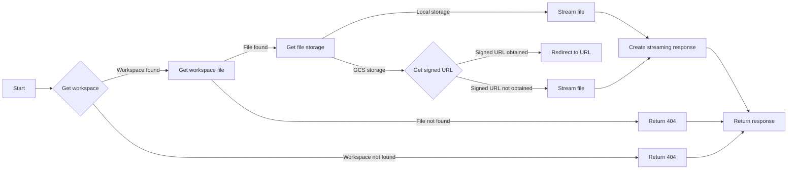

#### 带注释源码

```python
async def download_file(
    user_id: Annotated[str, fastapi.Security(get_user_id)],
    file_id: str,
) -> Response:
    """
    Download a file by its ID.

    Returns the file content directly or redirects to a signed URL for GCS.
    """
    workspace = await get_workspace(user_id)
    if workspace is None:
        raise fastapi.HTTPException(status_code=404, detail="Workspace not found")

    file = await get_workspace_file(file_id, workspace.id)
    if file is None:
        raise fastapi.HTTPException(status_code=404, detail="File not found")

    return await _create_file_download_response(file)
```


## 关键组件


### 张量索引与惰性加载

用于在文件存储系统中高效地索引和访问文件，通过惰性加载减少内存消耗。

### 反量化支持

提供对量化策略的反量化支持，以便在需要时将量化后的数据转换回原始数据格式。

### 量化策略

实现量化策略，用于优化数据存储和传输效率，通过减少数据精度来降低资源消耗。


## 问题及建议


### 已知问题

-   **依赖注入**: 代码中使用了`get_user_id`和`requires_user`依赖项，但没有明确说明这些依赖项是如何被注入的。这可能导致代码难以测试和重用。
-   **错误处理**: 当获取签名URL失败时，代码会记录错误并回退到直接流式传输文件。然而，如果回退也失败，代码会抛出异常。这可能需要更细粒度的错误处理来避免中断整个应用程序。
-   **异常传播**: 代码中使用了`raise`来传播异常，但没有提供任何关于异常类型的上下文。这可能会使调试和错误处理变得更加困难。
-   **日志记录**: 虽然代码中使用了日志记录，但没有提供关于日志级别的信息。这可能导致日志信息丢失或过多。
-   **性能**: 对于大型文件，直接从存储中检索并流式传输可能会导致性能问题。可以考虑使用流式传输或分块传输来提高性能。

### 优化建议

-   **依赖注入**: 使用依赖注入框架（如Pydantic或Django的依赖注入系统）来管理依赖项，以便更容易地进行测试和重用。
-   **错误处理**: 实现更细粒度的错误处理，例如，对于不同的错误类型返回不同的HTTP状态码或错误消息。
-   **异常传播**: 使用更具体的异常类型来传播异常，并提供有关异常的更多信息，以便更容易地进行调试。
-   **日志记录**: 指定日志级别，并确保记录足够的信息来帮助诊断问题。
-   **性能**: 对于大型文件，考虑使用流式传输或分块传输来提高性能，并减少内存消耗。
-   **代码复用**: 将重复的代码（如文件流式传输逻辑）提取到单独的函数或类中，以提高代码的可维护性和可读性。
-   **安全性**: 检查和验证所有输入，以防止注入攻击和其他安全漏洞。


## 其它


### 设计目标与约束

- 设计目标：
  - 提供一个安全的API接口，用于管理用户文件存储。
  - 支持本地存储和GCS存储。
  - 提供文件下载功能，支持流式传输和重定向到签名URL。
  - 确保文件名在Content-Disposition头中安全编码。

- 约束：
  - 必须使用FastAPI框架。
  - 必须使用autogpt_libs库中的认证依赖。
  - 必须处理异常情况，如文件不存在或无法获取签名URL。

### 错误处理与异常设计

- 错误处理：
  - 如果工作空间或文件不存在，返回404错误。
  - 如果无法获取签名URL或流式传输失败，记录错误并返回500错误。

- 异常设计：
  - 使用FastAPI的HTTPException来处理特定错误情况。
  - 使用try-except块来捕获并处理可能发生的异常。

### 数据流与状态机

- 数据流：
  - 用户请求下载文件。
  - API验证用户身份并获取工作空间信息。
  - API获取文件信息。
  - 根据存储类型，API处理文件下载（本地或GCS）。

- 状态机：
  - 无状态设计，每个请求独立处理。

### 外部依赖与接口契约

- 外部依赖：
  - FastAPI框架。
  - autogpt_libs库。
  - backend模块中的数据存储和工具函数。

- 接口契约：
  - API端点定义了输入参数和输出响应。
  - 使用FastAPI的依赖注入系统来处理认证和用户ID。
  - 使用FastAPI的响应类来创建和返回HTTP响应。


    