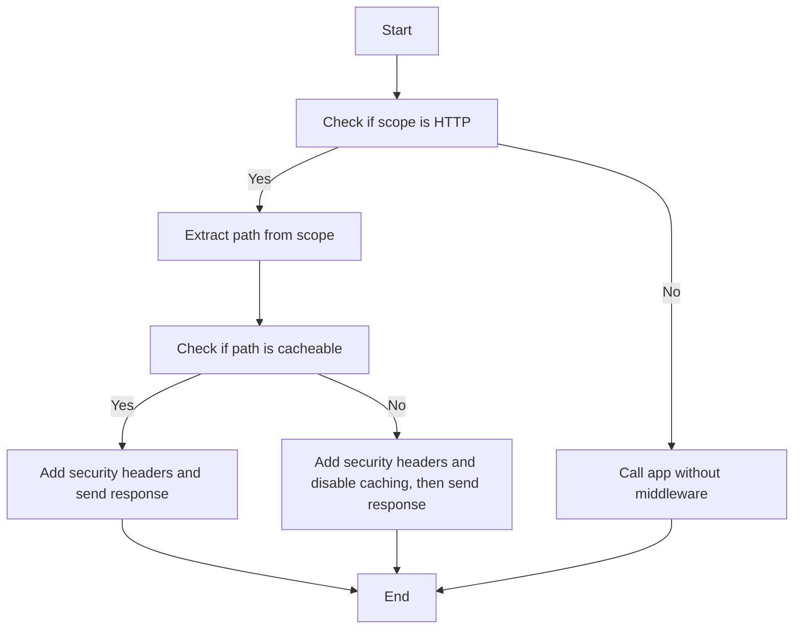
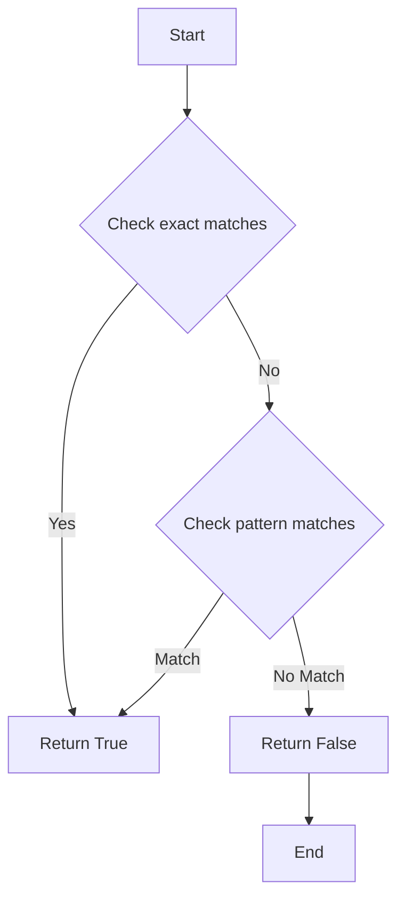
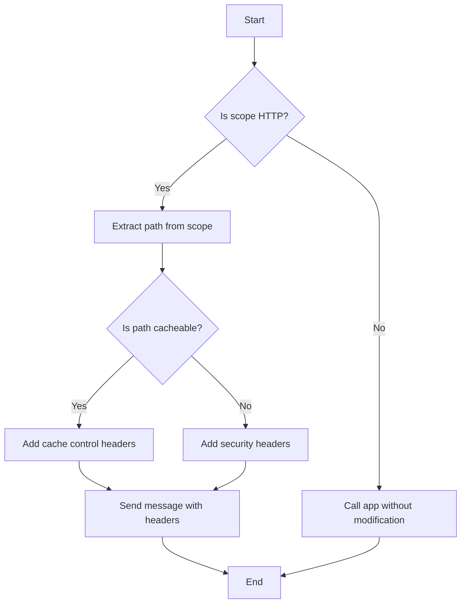

# `.\AutoGPT\autogpt_platform\backend\backend\api\middleware\security.py` 详细设计文档

The code implements a middleware class that adds security headers to HTTP responses, with caching disabled by default for all endpoints except those explicitly allowed.

## 整体流程



## 类结构

```
SecurityHeadersMiddleware (Middleware class)
├── CACHEABLE_PATHS (Set[str])
│   ├── /static
│   ├── /_next/static
│   ├── /assets
│   ├── /images
│   ├── /css
│   ├── /js
│   ├── /fonts
│   ├── /api/health
│   ├── /api/v1/health
│   ├── /api/status
│   ├── /api/blocks
│   ├── /api/v1/blocks
│   ├── /api/store/agents
│   ├── /api/v1/store/agents
│   ├── /api/store/categories
│   ├── /api/v1/store/categories
│   ├── /api/store/featured
│   ├── /api/v1/store/featured
│   ├── /api/graphs/templates
│   ├── /api/v1/graphs/templates
│   ├── /api/docs
│   ├── /api/v1/docs
│   ├── /docs
│   ├── /swagger
│   ├── /openapi.json
│   ├── /favicon.ico
│   ├── /manifest.json
│   ├── /robots.txt
│   └── /sitemap.xml
├── cacheable_patterns (List[re.Pattern])
├── exact_paths (Set[str])
└── app (ASGIApp)
```

## 全局变量及字段


### `CACHEABLE_PATHS`
    
A set of paths that are allowed to be cached.

类型：`Set[str]`
    


### `cacheable_patterns`
    
A list of compiled regex patterns for wildcard matching of cacheable paths.

类型：`List[re.Pattern]`
    


### `exact_paths`
    
A set of exact paths that are allowed to be cached.

类型：`Set[str]`
    


### `app`
    
The ASGI application instance that is wrapped by this middleware.

类型：`ASGIApp`
    


### `SecurityHeadersMiddleware.CACHEABLE_PATHS`
    
A set of paths that are allowed to be cached.

类型：`Set[str]`
    


### `SecurityHeadersMiddleware.cacheable_patterns`
    
A list of compiled regex patterns for wildcard matching of cacheable paths.

类型：`List[re.Pattern]`
    


### `SecurityHeadersMiddleware.exact_paths`
    
A set of exact paths that are allowed to be cached.

类型：`Set[str]`
    


### `SecurityHeadersMiddleware.app`
    
The ASGI application instance that is wrapped by this middleware.

类型：`ASGIApp`
    
    

## 全局函数及方法


### `SecurityHeadersMiddleware.is_cacheable_path`

Check if the given path is allowed to be cached.

参数：

- `path`：`str`，The path to check for cacheability.

返回值：`bool`，Returns `True` if the path is allowed to be cached, otherwise `False`.

#### 流程图



#### 带注释源码

```python
def is_cacheable_path(self, path: str) -> bool:
    """Check if the given path is allowed to be cached."""
    # Check exact matches first
    for cacheable_path in self.exact_paths:
        if path.startswith(cacheable_path):
            return True

    # Check pattern matches
    for pattern in self.cacheable_patterns:
        if pattern.match(path):
            return True

    return False
```


### `SecurityHeadersMiddleware.__call__`

The `__call__` method is the entry point for the ASGI middleware implementation, which adds security headers to HTTP responses.

参数：

- `scope`：`Scope`，The scope of the request, which contains information about the request and response.
- `receive`：`Receive`，An asynchronous generator that yields incoming messages.
- `send`：`Send`，An asynchronous generator that sends outgoing messages.

返回值：`None`，This method does not return any value.

#### 流程图


#### 带注释源码

```python
async def __call__(self, scope: Scope, receive: Receive, send: Send) -> None:
    """Pure ASGI middleware implementation for better performance than BaseHTTPMiddleware."""
    if scope["type"] != "http":
        await self.app(scope, receive, send)
        return

    # Extract path from scope
    path = scope["path"]

    async def send_wrapper(message: Message) -> None:
        if message["type"] == "http.response.start":
            # Add security headers to the response
            headers = dict(message.get("headers", []))

            # Add general security headers (HTTP spec requires proper capitalization)
            headers[b"X-Content-Type-Options"] = b"nosniff"
            headers[b"X-Frame-Options"] = b"DENY"
            headers[b"X-XSS-Protection"] = b"1; mode=block"
            headers[b"Referrer-Policy"] = b"strict-origin-when-cross-origin"

            # Add noindex header for shared execution pages
            if "/public/shared" in path:
                headers[b"X-Robots-Tag"] = b"noindex, nofollow"

            # Default: Disable caching for all endpoints
            # Only allow caching for explicitly permitted paths
            if not self.is_cacheable_path(path):
                headers[b"Cache-Control"] = (
                    b"no-store, no-cache, must-revalidate, private"
                )
                headers[b"Pragma"] = b"no-cache"
                headers[b"Expires"] = b"0"

            # Convert headers back to list format
            message["headers"] = list(headers.items())

        await send(message)
```


### SecurityHeadersMiddleware.__init__

This method initializes the `SecurityHeadersMiddleware` class by setting the provided ASGI application and compiling regex patterns for wildcard matching.

参数：

- `app`：`ASGIApp`，The ASGI application to wrap with security headers.
- ...

返回值：无

#### 流程图

```mermaid
classDiagram
    SecurityHeadersMiddleware <|-- ASGIApp
    SecurityHeadersMiddleware {
        +app: ASGIApp
        +cacheable_patterns: List[re.compile]
        +exact_paths: Set[str]
    }
    SecurityHeadersMiddleware "initializes" SecurityHeadersMiddleware
    SecurityHeadersMiddleware "sets" app
    SecurityHeadersMiddleware "compiles" cacheable_patterns
    SecurityHeadersMiddleware "sets" exact_paths
```

#### 带注释源码

```python
def __init__(self, app: ASGIApp):
    self.app = app  # Set the ASGI application
    # Compile regex patterns for wildcard matching
    self.cacheable_patterns = [
        re.compile(pattern.replace("*", "[^/]+"))
        for pattern in self.CACHEABLE_PATHS
        if "*" in pattern
    ]
    self.exact_paths = {path for path in self.CACHEABLE_PATHS if "*" not in path}
```


### SecurityHeadersMiddleware.is_cacheable_path

Check if the given path is allowed to be cached.

参数：

- `path`：`str`，The path to check for cacheability.

返回值：`bool`，Returns `True` if the path is allowed to be cached, otherwise `False`.

#### 流程图


#### 带注释源码

```python
def is_cacheable_path(self, path: str) -> bool:
    """Check if the given path is allowed to be cached."""
    # Check exact matches first
    for cacheable_path in self.exact_paths:
        if path.startswith(cacheable_path):
            return True

    # Check pattern matches
    for pattern in self.cacheable_patterns:
        if pattern.match(path):
            return True

    return False
```


### SecurityHeadersMiddleware.__call__

The `__call__` method of the `SecurityHeadersMiddleware` class is an ASGI middleware implementation that adds security headers to HTTP responses.

参数：

- `scope`：`Scope`，The scope of the request, which contains information about the request and response.
- `receive`：`Receive`，An asynchronous generator that yields messages to be sent to the client.
- `send`：`Send`，An asynchronous generator that yields messages to be sent to the server.

返回值：`None`，This method does not return a value.

#### 流程图



#### 带注释源码

```python
async def __call__(self, scope: Scope, receive: Receive, send: Send) -> None:
    """Pure ASGI middleware implementation for better performance than BaseHTTPMiddleware."""
    if scope["type"] != "http":
        await self.app(scope, receive, send)
        return

    # Extract path from scope
    path = scope["path"]

    async def send_wrapper(message: Message) -> None:
        if message["type"] == "http.response.start":
            # Add security headers to the response
            headers = dict(message.get("headers", []))

            # Add general security headers (HTTP spec requires proper capitalization)
            headers[b"X-Content-Type-Options"] = b"nosniff"
            headers[b"X-Frame-Options"] = b"DENY"
            headers[b"X-XSS-Protection"] = b"1; mode=block"
            headers[b"Referrer-Policy"] = b"strict-origin-when-cross-origin"

            # Add noindex header for shared execution pages
            if "/public/shared" in path:
                headers[b"X-Robots-Tag"] = b"noindex, nofollow"

            # Default: Disable caching for all endpoints
            # Only allow caching for explicitly permitted paths
            if not self.is_cacheable_path(path):
                headers[b"Cache-Control"] = (
                    b"no-store, no-cache, must-revalidate, private"
                )
                headers[b"Pragma"] = b"no-cache"
                headers[b"Expires"] = b"0"

            # Convert headers back to list format
            message["headers"] = list(headers.items())

        await send(message)
```


## 关键组件


### 张量索引与惰性加载

用于实现高效的数据访问，通过延迟加载数据来减少内存占用。

### 反量化支持

提供对反量化操作的支持，以优化性能和资源使用。

### 量化策略

定义量化策略，用于在量化过程中调整模型参数，以适应特定硬件和性能要求。


## 问题及建议


### 已知问题

-   **缓存策略过于严格**：默认情况下禁用缓存，这可能会对性能产生负面影响，尤其是在高流量网站上。可能需要更灵活的缓存策略，以允许对某些资源进行缓存以提高性能。
-   **正则表达式匹配效率**：使用正则表达式来匹配缓存路径可能会影响性能，尤其是在高并发情况下。可以考虑使用更高效的数据结构，如前缀树（Trie）。
-   **代码可读性**：代码中存在一些复杂的逻辑，如正则表达式的使用和缓存路径的匹配，这可能会降低代码的可读性和可维护性。

### 优化建议

-   **引入缓存策略配置**：允许配置哪些路径可以缓存，以及缓存的具体设置，如缓存时间等。
-   **优化路径匹配**：使用前缀树或其他高效的数据结构来存储和匹配缓存路径，以提高匹配效率。
-   **代码重构**：对复杂的逻辑进行重构，增加注释，以提高代码的可读性和可维护性。
-   **单元测试**：为代码添加单元测试，以确保缓存策略的正确性和代码的稳定性。
-   **性能监控**：引入性能监控工具，以监控中间件对性能的影响，并根据监控结果进行优化。

## 其它


### 设计目标与约束

- 设计目标：确保所有响应都包含安全头部，并允许特定路径进行缓存。
- 约束：遵守HTTP规范，确保安全头部正确设置，并处理缓存控制。

### 错误处理与异常设计

- 错误处理：如果中间件在处理过程中遇到错误，它将记录错误并继续处理请求。
- 异常设计：使用try-except块捕获可能发生的异常，并记录异常信息。

### 数据流与状态机

- 数据流：请求通过中间件，安全头部被添加到响应中，然后发送回客户端。
- 状态机：中间件没有状态机，它是一个简单的处理流程。

### 外部依赖与接口契约

- 外部依赖：依赖Starlette框架的ASGIApp接口。
- 接口契约：中间件通过ASGI协议与Starlette框架交互。

### 安全头部设置

- X-Content-Type-Options: 防止浏览器尝试猜测响应的内容类型。
- X-Frame-Options: 防止页面被其他页面框架嵌入。
- X-XSS-Protection: 防止跨站脚本攻击。
- Referrer-Policy: 控制发送到服务器的HTTP Referer头部。
- Cache-Control: 控制缓存行为。

### 缓存控制逻辑

- 默认禁用缓存。
- 对于允许缓存的路径，设置适当的缓存控制头部。

### 中间件集成

- 中间件作为Starlette应用的顶层组件集成，确保所有响应都经过处理。


    