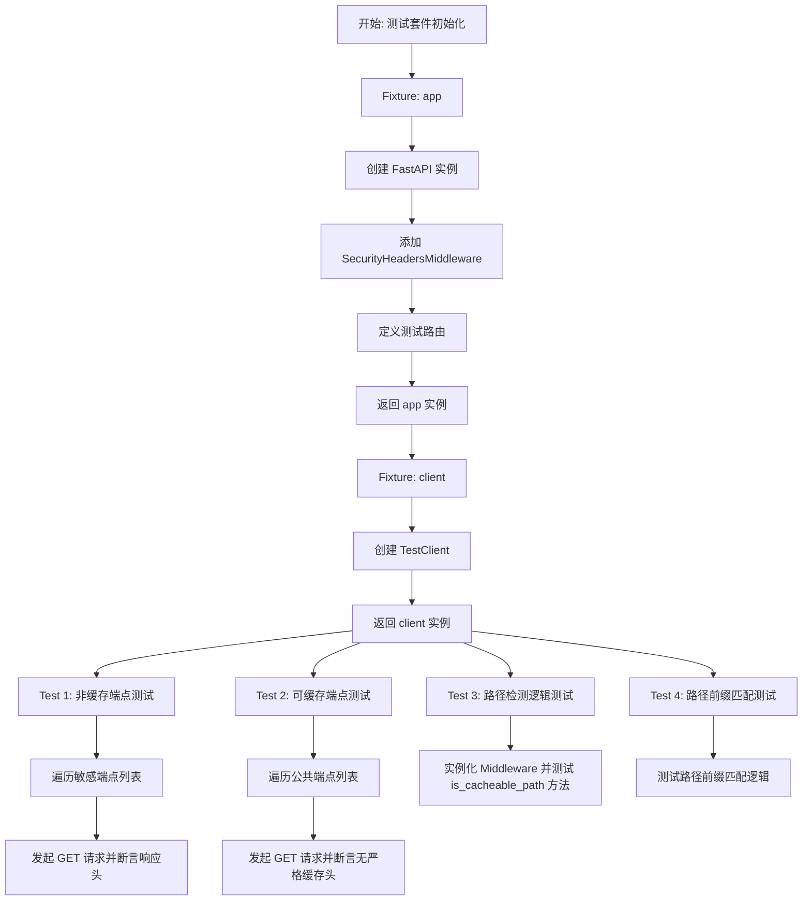
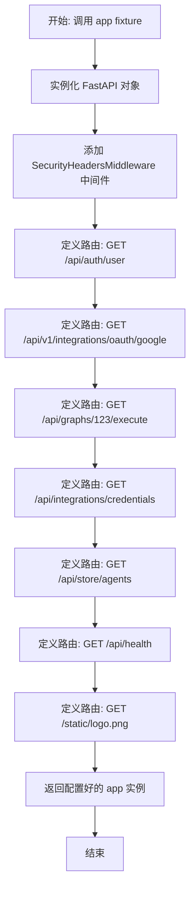
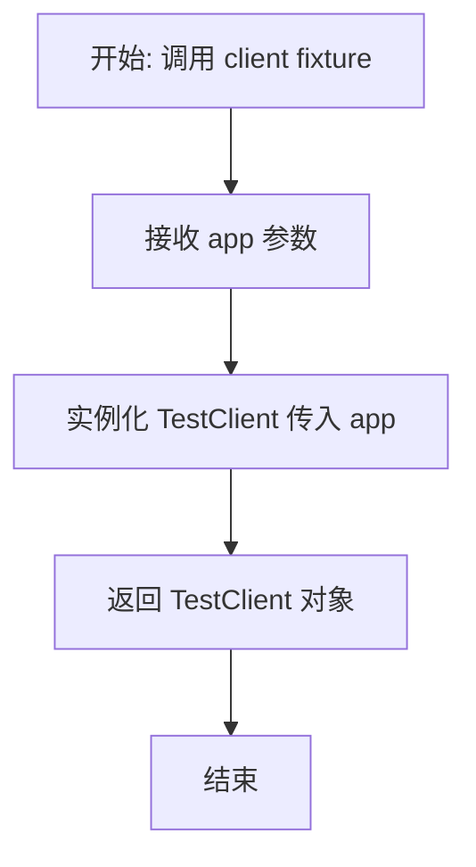
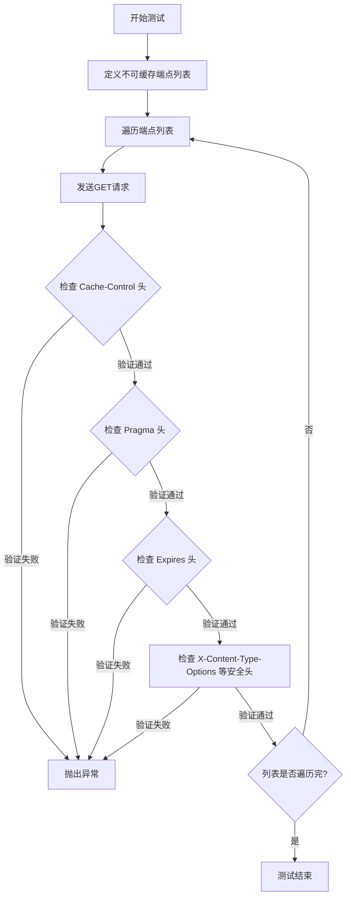
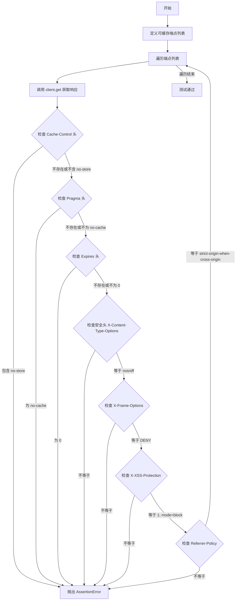
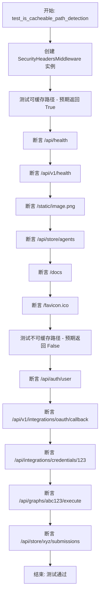
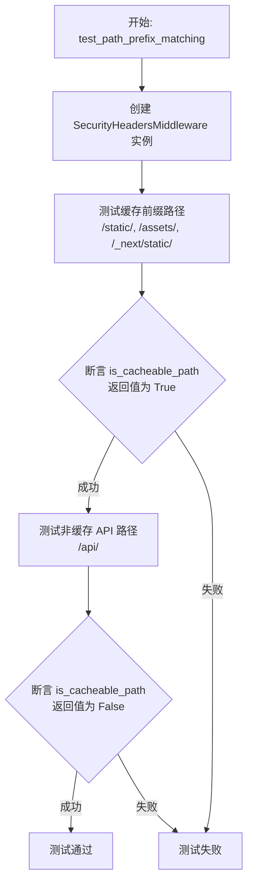

# `AutoGPT\autogpt_platform\backend\backend\api\middleware\security_test.py` 详细设计文档

该代码是一个基于 pytest 的测试文件，用于验证 SecurityHeadersMiddleware 中间件的功能。它通过模拟 FastAPI 应用和测试客户端，检查中间件是否针对不同的 API 端点（如用户认证、OAuth 回调、静态文件等）正确应用了 HTTP 安全头（X-Frame-Options, X-Content-Type-Options 等）和缓存控制策略（Cache-Control, Pragma 等）。

## 整体流程



## 类结构

```
test_security_headers.py (模块)
├── Fixtures
│   ├── app
│   └── client
└── Test Functions
    ├── test_non_cacheable_endpoints_have_cache_control_headers
    ├── test_cacheable_endpoints_dont_have_cache_control_headers
    ├── test_is_cacheable_path_detection
    └── test_path_prefix_matching
```

## 全局变量及字段


    

## 全局函数及方法


### `app`

这是一个 Pytest fixture 函数，用于创建一个配置了安全中间件（`SecurityHeadersMiddleware`）和多个模拟 API 端点的测试用 FastAPI 应用程序实例，主要用于验证安全头部的行为。

参数：

无

返回值：`FastAPI`，已配置中间件和测试路由的 FastAPI 应用实例。

#### 流程图



#### 带注释源码

```python
@pytest.fixture
def app():
    """Create a test FastAPI app with security middleware."""
    # 1. 创建 FastAPI 应用实例
    app = FastAPI()
    
    # 2. 添加安全头部中间件，用于自动添加安全相关的 HTTP 响应头
    app.add_middleware(SecurityHeadersMiddleware)

    # 3. 定义测试端点：获取用户信息 (非缓存)
    @app.get("/api/auth/user")
    def get_user():
        return {"user": "test"}

    # 4. 定义测试端点：OAuth Google (非缓存)
    @app.get("/api/v1/integrations/oauth/google")
    def oauth_endpoint():
        return {"oauth": "data"}

    # 5. 定义测试端点：执行图谱 (非缓存)
    @app.get("/api/graphs/123/execute")
    def execute_graph():
        return {"execution": "data"}

    # 6. 定义测试端点：获取凭证 (敏感信息，非缓存)
    @app.get("/api/integrations/credentials")
    def get_credentials():
        return {"credentials": "sensitive"}

    # 7. 定义测试端点：存储代理列表 (可缓存)
    @app.get("/api/store/agents")
    def store_agents():
        return {"agents": "public list"}

    # 8. 定义测试端点：健康检查 (可缓存)
    @app.get("/api/health")
    def health_check():
        return {"status": "ok"}

    # 9. 定义测试端点：静态文件 (可缓存)
    @app.get("/static/logo.png")
    def static_file():
        return {"static": "content"}

    # 10. 返回构建完成的应用实例供测试使用
    return app
```


### `client`

这是一个 Pytest fixture，用于基于提供的 FastAPI 应用实例创建并返回一个测试客户端，以便在测试中模拟 HTTP 请求。

参数：

- `app`：`FastAPI`，由 `app` fixture 提供的 FastAPI 应用实例，该实例已配置好安全中间件和路由。

返回值：`TestClient`，用于模拟 HTTP 请求的测试客户端对象。

#### 流程图



#### 带注释源码

```python
@pytest.fixture
def client(app):
    """Create a test client."""
    # 接收 app fixture 传入的 FastAPI 应用实例
    # 并使用它初始化 TestClient，用于后续的测试模拟请求
    return TestClient(app)
```


### `test_non_cacheable_endpoints_have_cache_control_headers`

该测试函数用于验证被标记为不可缓存的API端点（如用户认证、OAuth回调等）在HTTP响应中正确设置了禁止缓存的`Cache-Control`、`Pragma`及`Expires`头部，同时确保通用的安全响应头（如`X-Frame-Options`等）也符合预期配置。

参数：

- `client`：`TestClient`，用于发送模拟HTTP请求的测试客户端实例。

返回值：`None`，无返回值，通过断言验证逻辑正确性。

#### 流程图



#### 带注释源码

```python
def test_non_cacheable_endpoints_have_cache_control_headers(client):
    """Test that non-cacheable endpoints (most endpoints) have proper cache control headers."""
    # 定义预期不可缓存的端点列表
    non_cacheable_endpoints = [
        "/api/auth/user",
        "/api/v1/integrations/oauth/google",
        "/api/graphs/123/execute",
        "/api/integrations/credentials",
    ]

    # 遍历每个端点进行验证
    for endpoint in non_cacheable_endpoints:
        # 使用测试客户端发送GET请求
        response = client.get(endpoint)

        # 检查缓存控制头部是否存在并符合预期（默认行为）
        # 验证 Cache-Control: no-store, no-cache, must-revalidate, private
        assert (
            response.headers["Cache-Control"]
            == "no-store, no-cache, must-revalidate, private"
        )
        # 验证 Pragma: no-cache (HTTP/1.0 兼容)
        assert response.headers["Pragma"] == "no-cache"
        # 验证 Expires: 0 (表示立即过期)
        assert response.headers["Expires"] == "0"

        # 检查通用的安全头部是否正确设置
        # 防止MIME类型嗅探
        assert response.headers["X-Content-Type-Options"] == "nosniff"
        # 防止点击劫持
        assert response.headers["X-Frame-Options"] == "DENY"
        # XSS保护
        assert response.headers["X-XSS-Protection"] == "1; mode=block"
        # 控制Referrer信息泄露
        assert response.headers["Referrer-Policy"] == "strict-origin-when-cross-origin"
```


### `test_cacheable_endpoints_dont_have_cache_control_headers`

该测试函数用于验证显式标记为可缓存的端点（如健康检查、静态资源或公共列表API）不会包含限制性的缓存控制头（如 `no-store`, `no-cache`），同时确保这些端点仍然保留了必要的通用安全响应头。

参数：

-   `client`：`TestClient`，通过 pytest fixture 注入的测试客户端实例，用于模拟对 FastAPI 应用的 HTTP 请求。

返回值：`None`，该函数主要用于执行断言逻辑，无返回值。

#### 流程图



#### 带注释源码

```python
def test_cacheable_endpoints_dont_have_cache_control_headers(client):
    """Test that explicitly cacheable endpoints don't have restrictive cache control headers."""
    # 定义预期可缓存的端点列表，这些端点不应包含禁止缓存的头信息
    cacheable_endpoints = [
        "/api/store/agents",
        "/api/health",
        "/static/logo.png",
    ]

    for endpoint in cacheable_endpoints:
        # 向当前端点发送模拟 GET 请求
        response = client.get(endpoint)

        # 验证：应不包含限制性的缓存控制头
        
        # 检查 Cache-Control 头：要么不存在，要么其值中不包含 "no-store"
        assert (
            "Cache-Control" not in response.headers
            or "no-store" not in response.headers.get("Cache-Control", "")
        )
        # 检查 Pragma 头：要么不存在，要么其值不等于 "no-cache"
        assert (
            "Pragma" not in response.headers
            or response.headers.get("Pragma") != "no-cache"
        )
        # 检查 Expires 头：要么不存在，要么其值不等于 "0"
        assert (
            "Expires" not in response.headers or response.headers.get("Expires") != "0"
        )

        # 验证：即使允许缓存，通用安全头依然应该存在且值正确
        assert response.headers["X-Content-Type-Options"] == "nosniff"
        assert response.headers["X-Frame-Options"] == "DENY"
        assert response.headers["X-XSS-Protection"] == "1; mode=block"
        assert response.headers["Referrer-Policy"] == "strict-origin-when-cross-origin"
```


### `test_is_cacheable_path_detection`

该函数用于测试 `SecurityHeadersMiddleware` 中判断路径是否可缓存的逻辑。它验证了中间件能够正确识别预定义的可缓存路径（如健康检查、静态资源、文档等）返回 True，同时确保其他 API 路径（特别是涉及认证、凭证和执行的敏感路径）被正确识别为不可缓存，返回 False。

参数：

-  无

返回值：`None`，测试函数不返回具体值，通过断言成功表示测试通过，若断言失败则抛出异常。

#### 流程图



#### 带注释源码

```python
def test_is_cacheable_path_detection():
    """Test the path detection logic."""
    # 初始化中间件实例，传入一个空的 Starlette 应用
    middleware = SecurityHeadersMiddleware(Starlette())

    # 测试可缓存路径（白名单）
    # 验证健康检查端点被识别为可缓存
    assert middleware.is_cacheable_path("/api/health")
    assert middleware.is_cacheable_path("/api/v1/health")
    # 验证静态文件路径被识别为可缓存
    assert middleware.is_cacheable_path("/static/image.png")
    # 验证公共商店代理列表被识别为可缓存
    assert middleware.is_cacheable_path("/api/store/agents")
    # 验证文档和图标路径被识别为可缓存
    assert middleware.is_cacheable_path("/docs")
    assert middleware.is_cacheable_path("/favicon.ico")

    # 测试不可缓存路径（其他所有路径）
    # 验证用户认证端点不可缓存
    assert not middleware.is_cacheable_path("/api/auth/user")
    # 验证 OAuth 回调端点不可缓存
    assert not middleware.is_cacheable_path("/api/v1/integrations/oauth/callback")
    # 验证敏感凭证端点不可缓存
    assert not middleware.is_cacheable_path("/api/integrations/credentials/123")
    # 验证图谱执行端点不可缓存
    assert not middleware.is_cacheable_path("/api/graphs/abc123/execute")
    # 验证商店提交子路径不可缓存（即使父级 /api/store/agents 可缓存，子路径不应匹配）
    assert not middleware.is_cacheable_path("/api/store/xyz/submissions")
```


### `test_path_prefix_matching`

该测试函数用于验证 `SecurityHeadersMiddleware` 中间件的路由前缀匹配逻辑，确保以特定前缀（如 `/static/`、`/assets/` 等）开头的路径被正确识别为可缓存路径，而常规 API 路径则被识别为不可缓存。

参数：

-   无

返回值：`None`，该函数作为测试用例，无返回值，通过断言验证逻辑正确性。

#### 流程图



#### 带注释源码

```python
def test_path_prefix_matching():
    """Test that path prefix matching works correctly."""
    # 初始化中间件，传入 Starlette 实例作为应用
    middleware = SecurityHeadersMiddleware(Starlette())

    # 测试以缓存前缀开头的路径是否被判定为可缓存
    # 包含常见的静态资源路径前缀
    assert middleware.is_cacheable_path("/static/css/style.css")
    assert middleware.is_cacheable_path("/static/js/app.js")
    assert middleware.is_cacheable_path("/assets/images/logo.png")
    assert middleware.is_cacheable_path("/_next/static/chunks/main.js")

    # 测试其他 API 路径默认是否被判定为不可缓存
    # 确保动态数据接口不被标记为缓存路径
    assert not middleware.is_cacheable_path("/api/users/profile")
    assert not middleware.is_cacheable_path("/api/v1/private/data")
    assert not middleware.is_cacheable_path("/api/billing/subscription")
```


## 关键组件


### SecurityHeadersMiddleware
一个用于 FastAPI/Starlette 应用的中间件，负责自动注入标准安全响应头（如 X-Frame-Options, X-Content-Type-Options）并根据请求路径动态配置缓存控制策略。

### 路径可缓存性检测
一种基于路径前缀和匹配规则（如 `/static`, `/api/health`）来区分可缓存与不可缓存端点的逻辑机制，用于决定是否应用严格的无缓存指令。

### HTTP 安全头
一组用于增强 Web 应用安全性的 HTTP 响应头，包括 X-Frame-Options（防止点击劫持）、X-Content-Type-Options（防止 MIME 嗅探）、X-XSS-Protection 和 Referrer-Policy。

### 动态缓存控制策略
根据端点性质动态调整缓存控制头的机制，对敏感或动态数据端点强制实施 `no-store, no-cache` 策略，而对静态资源或公开列表端点放宽限制。


## 问题及建议


### 已知问题

-   **测试了实现细节而非行为**: `test_is_cacheable_path` 和 `test_path_prefix_matching` 直接实例化中间件并调用 `is_cacheable_path` 方法。这属于白盒测试，耦合了中间件的内部实现。如果未来重构内部逻辑（例如改用正则或改变方法名），即使外部行为（HTTP响应头）正确，测试也会失败。
-   **测试数据维护成本高**: 在 `test_non_cacheable_endpoints_have_cache_control_headers` 等函数中，URL路径以硬编码列表形式维护。随着API的扩展，手动同步更新这些列表容易遗漏或出错，导致测试覆盖不全。
-   **断言值硬编码**: 测试代码中直接重复编写了大量的Header值（如 `"X-Frame-Options": "DENY"` 和 `"Cache-Control": "..."`）。如果安全策略调整，需要在多处代码中进行修改，维护性差。

### 优化建议

-   **使用 `pytest.mark.parametrize` 简化代码**: 针对多个端点执行相同断言的场景，应使用参数化测试。这可以大幅减少代码重复，清晰地区分测试用例输入与预期结果，且能更精确地定位失败用例。
-   **提取配置常量**: 将预期的Header值和策略定义为模块级常量或配置对象。例如定义 `EXPECTED_SECURITY_HEADERS` 和 `NON_CACHEABLE_HEADERS`，在测试中引用这些常量，实现“单一数据源”管理，方便统一修改。
-   **增强边界条件覆盖**: 当前测试未覆盖URL尾部斜杠（如 `/api/health/`）、大小写差异（如 `/API/Health`）或特殊字符的情况。建议补充这些边缘用例，以验证中间件路由匹配的健壮性。
-   **采用黑盒测试策略**: 优先通过 `TestClient` 发送请求并验证响应头来测试中间件，避免直接调用中间件实例的内部方法。如果路径匹配逻辑复杂，建议将其提取为独立的纯函数进行单元测试，而中间件测试仅关注集成后的HTTP效果。


## 其它


### 设计目标与约束

**设计目标**：
1.  **安全性增强**：确保所有 API 响应包含标准的安全 HTTP 头（如 `X-Frame-Options`, `X-Content-Type-Options` 等），以防止点击劫持、MIME 类型嗅探和跨站脚本攻击（XSS）。
2.  **精细化缓存控制**：根据端点的性质实施差异化的缓存策略。对于包含敏感数据或动态内容的端点（如 `/api/auth/user`），强制设置严格的缓存控制头（`no-store`, `no-cache`），防止客户端或中间代理缓存敏感信息；对于公共资源或健康检查端点（如 `/static/`, `/api/health`），允许浏览器或 CDN 缓存以优化性能。

**约束**：
1.  **路径白名单机制**：缓存策略基于路径前缀匹配（如 `/static/`, `/api/store/agents`），只有明确列入白名单的路径才允许缓存，所有其他路径默认视为不可缓存，遵循“默认安全”原则。
2.  **中间件透明性**：中间件必须无侵入地修改响应头，不得影响响应体的内容或原有的业务逻辑。
3.  **框架兼容性**：必须兼容 FastAPI 和 Starlette 的应用生命周期，通过标准的 ASGI 中间件接口工作。

### 错误处理与异常设计

**测试验证层面的异常处理**：
本代码作为测试套件，其“错误处理”主要体现在对不符合预期的响应进行断言失败。
1.  **缺失头部检测**：如果中间件未能正确注入必需的安全头或缓存控制头，测试用例中的 `assert` 语句将触发 `AssertionError`，明确指出缺失的头部名称和期望值。
2.  **路径匹配逻辑验证**：通过直接调用 `middleware.is_cacheable_path` 方法，验证路径解析逻辑的鲁棒性，确保不存在因路径格式错误导致的意外缓存授权。

**中间件预期行为（基于测试推断）**：
1.  **容错性**：中间件在处理响应时，即使响应对象中已存在某些头部，也应能按照策略进行覆盖或合并（测试中明确检查了头部必须等于特定值）。
2.  **非阻塞流**：中间件不应拦截或修改响应体内容，仅操作头部字典。如果头部设置抛出异常，应向上传播以触发 HTTP 500 错误，而不是静默失败。

### 数据流与状态机

**数据流**：
1.  **请求阶段**：客户端发起 HTTP 请求（GET/POST 等）到达 FastAPI 应用。
2.  **路由处理**：应用根据 URL 路径匹配到对应的路由处理函数（如 `get_user`），生成业务数据响应。
3.  **中间件拦截（出站）**：响应返回过程中，经过 `SecurityHeadersMiddleware`。
4.  **路径判定**：中间件提取请求路径，调用 `is_cacheable_path(path)` 进行判定。
5.  **头部注入**：
    *   **通用安全头注入**：无论路径如何，均注入 `X-Content-Type-Options: nosniff`, `X-Frame-Options: DENY` 等。
    *   **缓存头注入**：如果路径判定为非缓存，注入 `Cache-Control: no-store...`；否则，跳过缓存限制头的注入。
6.  **响应返回**：最终带有修改后头部的 HTTP 响应发送给客户端。

**状态机**：
中间件内部无持久化状态机，核心逻辑表现为一个基于输入路径的纯函数判定：
*   **状态 1 (Cacheable)**：路径匹配白名单（如 `/static/*`） -> 输出宽松缓存策略 + 通用安全头。
*   **状态 2 (Non-Cacheable)**：路径未匹配白名单（默认状态） -> 输出严格禁止缓存策略 + 通用安全头。

### 外部依赖与接口契约

**外部依赖**：
1.  **FastAPI / Starlette**：核心 Web 框架，提供 `ASGIApp`, `Request`, `Response` 基础数据结构。
2.  **Pytest**：测试框架，提供 Fixture 机制和断言库。
3.  **backend.api.middleware.security.SecurityHeadersMiddleware**：被测的核心中间件类，提供 `is_cacheable_path` 方法供内部逻辑调用。

**接口契约**：
1.  **中间件初始化契约**：
    *   `SecurityHeadersMiddleware(app)`：接收一个 `Starlette` 或 `FastAPI` 应用实例作为参数，并返回一个包装后的 ASGI 应用。
2.  **路径检测契约**：
    *   `is_cacheable_path(path: str) -> bool`：输入为请求路径字符串，输出为布尔值。若路径以 `/api/health`, `/static/`, `/api/store/agents` 等前缀开头，应返回 `True`；否则返回 `False`。
3.  **HTTP 响应头契约**：
    *   **安全头**：所有响应必须包含：
        *   `X-Content-Type-Options`: `nosniff`
        *   `X-Frame-Options`: `DENY`
        *   `X-XSS-Protection`: `1; mode=block`
        *   `Referrer-Policy`: `strict-origin-when-cross-origin`
    *   **缓存头（不可缓存路径）**：
        *   `Cache-Control`: `no-store, no-cache, must-revalidate, private`
        *   `Pragma`: `no-cache`
        *   `Expires`: `0`

### 测试策略与覆盖范围

**测试策略**：
采用 **黑盒测试** 与 **白盒测试** 相结合的策略。
1.  **端到端测试 (E2E)**：通过 `TestClient` 模拟完整的 HTTP 请求-响应循环，验证中间件在真实应用环境下的行为。覆盖了不可缓存端点和可缓存端点的正向和反向场景。
2.  **单元测试**：直接实例化中间件对象，隔离测试 `is_cacheable_path` 方法的逻辑正确性，覆盖了前缀匹配、完全匹配及不匹配的各种边界情况。

**覆盖范围**：
1.  **功能覆盖**：覆盖了安全头的注入、缓存控制头的条件注入、以及基于路径前缀的缓存策略判定逻辑。
2.  **路径覆盖**：
    *   **敏感数据路径**：用户信息、OAuth 凭据、Graph 执行、集成凭证。
    *   **公共资源路径**：静态文件（CSS/JS/Image）、Agent 列表、健康检查端点。
3.  **逻辑分支覆盖**：
    *   验证了非缓存路径必须包含特定 Cache-Control 值。
    *   验证了可缓存路径不得包含 `no-store` 等指令。
    *   验证了路径匹配的模糊匹配能力（如 `/static/css/style.css`）。


    