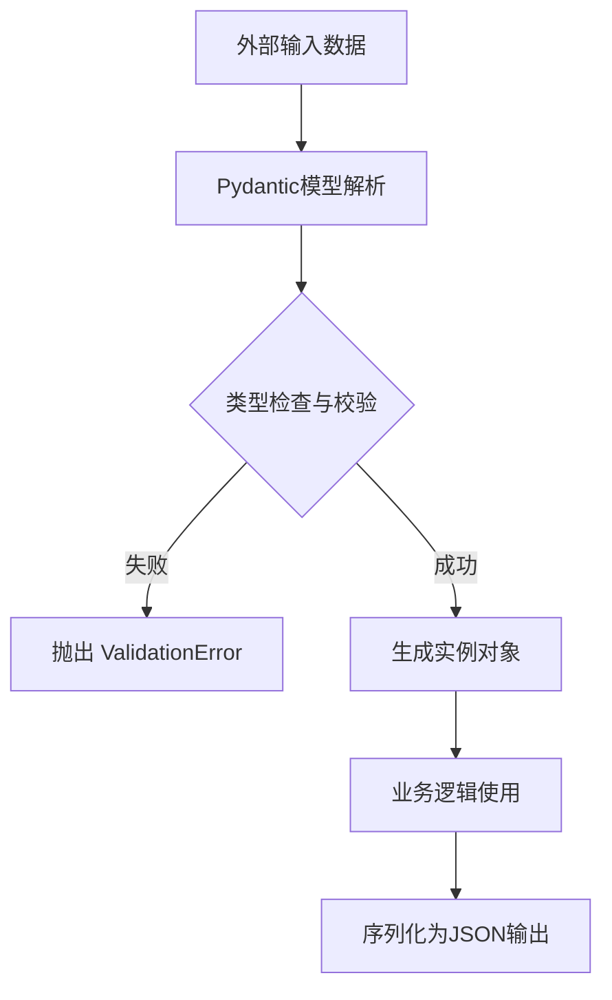

# `AutoGPT\autogpt_platform\backend\backend\api\model.py` 详细设计文档

该代码定义了后端系统的核心数据模型与接口契约，包含 WebSocket 通信协议（方法、消息结构）、图管理（创建、版本控制）、API 密钥管理、充值请求、文件上传响应、时区配置以及通知系统的 Pydantic 数据模型。

## 整体流程



## 类结构

```
Enum (WSMethod)
Literal (GraphCreationSource)
Literal (GraphExecutionSource)
Pydantic.BaseModel
├── WSMessage
├── WSSubscribeGraphExecutionRequest
├── WSSubscribeGraphExecutionsRequest
├── CreateGraph
├── CreateAPIKeyRequest
├── CreateAPIKeyResponse
├── SetGraphActiveVersion
├── UpdatePermissionsRequest
├── RequestTopUp
├── UploadFileResponse
├── TimezoneResponse
├── UpdateTimezoneRequest
├── NotificationPayload
│   └── OnboardingNotificationPayload
```

## 全局变量及字段


### `GraphCreationSource`
    
Type alias for the source of graph creation, limited to 'builder' or 'upload'.

类型：`Literal["builder", "upload"]`
    


### `GraphExecutionSource`
    
Type alias for the source of graph execution, limited to 'builder', 'library', or 'onboarding'.

类型：`Literal["builder", "library", "onboarding"]`
    


### `WSMethod.SUBSCRIBE_GRAPH_EXEC`
    
Enum member representing the method to subscribe to a specific graph execution.

类型：`WSMethod`
    


### `WSMethod.SUBSCRIBE_GRAPH_EXECS`
    
Enum member representing the method to subscribe to executions of a specific graph.

类型：`WSMethod`
    


### `WSMethod.UNSUBSCRIBE`
    
Enum member representing the method to unsubscribe from a channel or event.

类型：`WSMethod`
    


### `WSMethod.GRAPH_EXECUTION_EVENT`
    
Enum member representing an event message related to graph execution.

类型：`WSMethod`
    


### `WSMethod.NODE_EXECUTION_EVENT`
    
Enum member representing an event message related to node execution.

类型：`WSMethod`
    


### `WSMethod.NOTIFICATION`
    
Enum member representing a general notification message.

类型：`WSMethod`
    


### `WSMethod.ERROR`
    
Enum member representing an error message.

类型：`WSMethod`
    


### `WSMethod.HEARTBEAT`
    
Enum member representing a heartbeat signal for connection liveness.

类型：`WSMethod`
    


### `WSMessage.method`
    
The WebSocket method defining the type of message or action.

类型：`WSMethod`
    


### `WSMessage.data`
    
The payload of the message, which can be a dictionary, list, string, or None.

类型：`Optional[dict[str, Any] | list[Any] | str]`
    


### `WSMessage.success`
    
Indicates whether the operation associated with the message was successful.

类型：`bool | None`
    


### `WSMessage.channel`
    
The channel identifier for subscription-based messaging.

类型：`str | None`
    


### `WSMessage.error`
    
An error message string providing details about a failure.

类型：`str | None`
    


### `WSSubscribeGraphExecutionRequest.graph_exec_id`
    
The unique identifier of the graph execution to subscribe to.

类型：`str`
    


### `WSSubscribeGraphExecutionsRequest.graph_id`
    
The unique identifier of the graph to subscribe for execution events.

类型：`str`
    


### `CreateGraph.graph`
    
The Graph object containing the structure and data to be created.

类型：`Graph`
    


### `CreateGraph.source`
    
The origin or source context for the graph creation.

类型：`GraphCreationSource | None`
    


### `CreateAPIKeyRequest.name`
    
The display name for the new API key.

类型：`str`
    


### `CreateAPIKeyRequest.permissions`
    
A list of permissions assigned to the new API key.

类型：`list[APIKeyPermission]`
    


### `CreateAPIKeyRequest.description`
    
An optional description of the API key's purpose.

类型：`Optional[str]`
    


### `CreateAPIKeyResponse.api_key`
    
Object containing the metadata of the created API key.

类型：`APIKeyInfo`
    


### `CreateAPIKeyResponse.plain_text_key`
    
The plain text value of the API key, shown only once upon creation.

类型：`str`
    


### `SetGraphActiveVersion.active_graph_version`
    
The version number of the graph to set as the active version.

类型：`int`
    


### `UpdatePermissionsRequest.permissions`
    
The updated list of permissions to apply.

类型：`list[APIKeyPermission]`
    


### `RequestTopUp.credit_amount`
    
The amount of credits to request for a top-up.

类型：`int`
    


### `UploadFileResponse.file_uri`
    
The URI where the uploaded file can be accessed.

类型：`str`
    


### `UploadFileResponse.file_name`
    
The original name of the uploaded file.

类型：`str`
    


### `UploadFileResponse.size`
    
The size of the uploaded file in bytes.

类型：`int`
    


### `UploadFileResponse.content_type`
    
The MIME content type of the uploaded file.

类型：`str`
    


### `UploadFileResponse.expires_in_hours`
    
The number of hours before the uploaded file URI expires.

类型：`int`
    


### `TimezoneResponse.timezone`
    
The user's timezone, which can be a valid IANA name or 'not-set'.

类型：`TimeZoneName | str`
    


### `UpdateTimezoneRequest.timezone`
    
The IANA timezone name to set for the user.

类型：`TimeZoneName`
    


### `NotificationPayload.type`
    
The type identifier of the notification.

类型：`str`
    


### `NotificationPayload.event`
    
The specific event identifier triggering the notification.

类型：`str`
    


### `NotificationPayload.model_config`
    
Configuration for the Pydantic model, allowing extra fields.

类型：`pydantic.ConfigDict`
    


### `OnboardingNotificationPayload.step`
    
The current step in the onboarding process.

类型：`OnboardingStep | None`
    
    

## 全局函数及方法


## 关键组件


### WebSocket 通信协议定义

定义了 WebSocket 交互的方法枚举（`WSMethod`）、通用消息结构（`WSMessage`）以及订阅图执行的请求模型，构成了客户端与服务器实时通信的基础契约。

### 图（Graph）管理模型

包含图创建（`CreateGraph`）、激活版本设置（`SetGraphActiveVersion`）以及图创建和执行来源的类型定义，用于支撑图的整个生命周期管理。

### API 密钥与权限管理

定义了 API 密钥的创建请求（`CreateAPIKeyRequest`）、创建响应（`CreateAPIKeyResponse`）以及权限更新请求（`UpdatePermissionsRequest`），用于处理外部调用者的身份认证与授权。

### 用户配置与账户操作

包含时区的设置请求（`UpdateTimezoneRequest`）与响应（`TimezoneResponse`）、信用充值请求（`RequestTopUp`）以及文件上传响应（`UploadFileResponse`），用于管理用户个人偏好和账户资源。

### 通知系统载荷

定义了基础的通知载荷模型（`NotificationPayload`）及其针对新手引导场景的扩展模型（`OnboardingNotificationPayload`），支持灵活的事件分发和状态通知。


## 问题及建议


### 已知问题

-   `WSMessage` 类的字段设计存在潜在逻辑冲突，`success` 和 `error` 字段均为可选，且缺乏互斥校验，可能导致消息中同时存在成功状态和错误信息的情况。
-   `TimezoneResponse` 和 `UpdateTimezoneRequest` 在 `timezone` 字段类型定义上存在不一致。响应允许 `str`（可能包含 "not-set"），而请求强制为 `TimeZoneName`，这可能导致客户端无法直接使用响应数据发起新的更新请求。
-   `CreateAPIKeyResponse` 中包含敏感字段 `plain_text_key`。若该模型对象被意外记录日志或在调试输出中序列化，会导致 API 密钥泄露的安全风险。

### 优化建议

-   针对 `WSMessage` 的 `data` 字段使用 Pydantic 的 `Discriminated Unions`（可辨识联合）或 `Tagged Unions`，利用 `method` 字段作为鉴别器，将 `data` 的类型从 `Any` 细化为具体的请求/响应模型，以利用静态类型检查和运行时验证。
-   为所有 Pydantic 模型的字段添加 `Field(description=...)` 描述信息，以便自动生成更完善的 API 文档（如 OpenAPI/Swagger），提升接口可读性和可维护性。
-   在 `CreateAPIKeyResponse` 中对 `plain_text_key` 字段配置 `Field(exclude=True)` 或在 `model_config` 中设置，确保在默认序列化或日志输出时不包含该敏感信息。
-   优化 `TimezoneResponse` 的类型定义，通过 Pydantic 验证器 (`field_validator`) 确保允许的 `str` 仅限于特定值（如 "not-set"），而非任意字符串，增强数据完整性。


## 其它


### 设计目标与约束

**设计目标**：
1.  **类型安全与数据完整性**：利用 Pydantic 模型对输入输出数据进行严格验证，确保 WebSocket 消息和 HTTP 请求/响应的数据结构符合预期，减少运行时错误。
2.  **通信协议标准化**：定义统一的 WebSocket 消息结构（`WSMessage`）和标准的枚举方法（`WSMethod`），以便前后端能够一致地解析和处理实时通信事件。
3.  **模块化与扩展性**：通过清晰的类定义和 Literal 类型约束，支持未来添加新的图执行源、API 权限类型或通知事件，同时保持核心逻辑的稳定。

**约束条件**：
1.  **库依赖**：必须依赖 `pydantic` 进行数据模型的定义和序列化，依赖 `prisma.enums` 获取数据库枚举状态。
2.  **类型一致性**：所有涉及时间、图 ID、权限等字段必须严格遵循内部模块（如 `TimeZoneName`, `Graph`, `APIKeyPermission`）定义的类型接口。
3.  **兼容性**：WebSocket 消息体必须包含 `method` 字段，且数据载荷（`data`）需兼容字典、列表或字符串类型，以适应不同场景下的传输需求。

### 外部依赖与接口契约

**外部库依赖**：
1.  **`pydantic`**：提供 `BaseModel` 基类，负责数据验证、序列化和 JSON Schema 生成。所有请求/响应模型均继承自此类。
2.  **`prisma.enums`**：提供 `OnboardingStep` 枚举，用于定义用户引导流程的状态，确保与数据库状态机保持同步。
3.  **`typing`**：提供类型注解支持（如 `Any`, `Literal`, `Optional`），增强代码可读性和静态检查能力。

**内部模块接口契约**：
1.  **`backend.data.graph.Graph`**：`CreateGraph` 模型依赖于 `Graph` 类型，契约要求传入的图对象必须符合内部 Graph 结构定义。
2.  **`backend.data.auth.api_key`**：提供 `APIKeyInfo` 和 `APIKeyPermission`，API 密钥管理相关的请求（`CreateAPIKeyRequest`, `UpdatePermissionsRequest`）必须使用这些已定义的权限类型。
3.  **`backend.util.timezone_name.TimeZoneName`**：时区相关模型（`TimezoneResponse`, `UpdateTimezoneRequest`）约束输入值为有效的 IANA 时区名称。

### 数据流与状态机

**WebSocket 通信数据流**：
1.  **订阅阶段**：客户端发送 `WSMessage`，method 为 `SUBSCRIBE_GRAPH_EXEC` 或 `SUBSCRIBE_GRAPH_EXECS`，携带 `WSSubscribeGraphExecutionRequest` 或 `WSSubscribeGraphExecutionsRequest` 数据。
2.  **事件推送阶段**：服务端根据订阅内容，主动推送 `WSMessage`，method 为 `GRAPH_EXECUTION_EVENT`（图执行事件）、`NODE_EXECUTION_EVENT`（节点执行事件）或 `NOTIFICATION`（通知）。
3.  **心跳保活**：双方定期发送 method 为 `HEARTBEAT` 的消息以维持连接。
4.  **取消订阅**：客户端发送 method 为 `UNSUBSCRIBE` 的消息终止数据流。

**状态流转（图执行）**：
*   **图状态**：通过 `GraphCreationSource` 和 `GraphExecutionSource` 标记图的来源和触发场景（构建器、库、引导流程）。
*   **引导状态**：`OnboardingNotificationPayload` 包含 `step` 字段，表示用户当前所处的引导步骤（如 `OnboardingStep`），状态随用户操作推进。

**HTTP 交互数据流**：
*   **请求/响应**：针对 API 密钥创建、文件上传、时区设置等操作，遵循标准的 HTTP Request/Response 模式。例如，发送 `CreateAPIKeyRequest`，接收包含 `plain_text_key` 的 `CreateAPIKeyResponse`。

### 错误处理与异常设计

**数据验证异常**：
*   机制：利用 Pydantic 的自动验证机制。当传入的 JSON 数据不符合模型定义（如缺少必填字段、类型不匹配、枚举值无效）时，Pydantic 会抛出 `ValidationError`。
*   处理策略：在 API 层或 WebSocket 处理层捕获这些异常，并将其转换为友好的错误信息返回给客户端。

**业务级错误反馈**：
*   **WebSocket 错误**：`WSMessage` 类中显式定义了 `error` (str) 和 `success` (bool | None) 字段。当服务端处理请求失败时，将构造 method 为 `ERROR` 的消息或在这些字段中填充错误详情，通知客户端。
*   **API 错误**：虽然代码主要展示数据模型，但通常 HTTP 响应会遵循 RESTful 风格的错误码（如 400, 401, 500）结合模型中的错误描述进行反馈。

**特殊处理**：
*   **时区容错**：`TimezoneResponse` 允许 `"not-set"` 字符串作为特殊值，以处理用户未设置时区的边界情况。
*   **动态字段**：`NotificationPayload` 使用 `model_config = pydantic.ConfigDict(extra="allow")` 允许接收未在模型中显式定义的额外字段，防止因通知内容扩展而导致的解析错误。

### 数据模型关系

1.  **容器与载荷**：
    *   `WSMessage` 是通用的 WebSocket 消息容器。其 `data` 字段在特定 method 下（如订阅请求）对应具体的 Pydantic 模型（如 `WSSubscribeGraphExecutionRequest`），但在定义层面保持为 `Optional[dict | list | str]` 以提供灵活性。
2.  **请求与响应对**：
    *   API 操作通常成对出现。例如 `CreateAPIKeyRequest`（包含权限列表）对应 `CreateAPIKeyResponse`（包含生成的密钥信息）；`UpdateTimezoneRequest` 对应 `TimezoneResponse`。
3.  **继承与扩展**：
    *   `OnboardingNotificationPayload` 继承自 `NotificationPayload`，并扩展了 `step` 字段，体现了通知系统的多态性，即基础通知属性与特定业务场景（引导）属性的分离。
4.  **类型别名与引用**：
    *   `GraphCreationSource` 和 `GraphExecutionSource` 定义了字面量类型，被 `CreateGraph` 等模型引用，强制限制了数据的来源范围，增强了系统的语义约束。

    