# `AutoGPT\autogpt_platform\backend\backend\api\rest_api.py` 详细设计文档

该文件作为 AutoGPT Agent Server 的主入口，使用 FastAPI 框架构建，负责配置中间件、注册路由、处理异常、管理数据库连接与服务生命周期（如启动与关闭时的资源清理），并最终通过 Uvicorn 启动 HTTP 服务以处理 API 请求。

## 整体流程

```mermaid
graph TD
    A[Start: Import modules] --> B[Initialize Settings & Logger]
    B --> C[Define Helper Context Managers]
    C --> D[Create FastAPI 'app' Instance]
    D --> E[Add Middleware: Security, GZip]
    E --> F[Configure OpenAPI & Exception Handlers]
    F --> G[Include Feature Routers]
    G --> H[Mount External APIs]
    H --> I[Define Health Check Endpoint]
    I --> J[AgentServer.run: Start Uvicorn Server]
    J --> K[Lifespan Startup: DB Connect, Migrations, Thread Pool]
    K --> L[Handle Incoming Requests]
    L --> M[AgentServer Test Methods (if called)]
    M --> N[Lifespan Shutdown: Stop Consumers, Disconnect DB]
    N --> O[End]
```

## 类结构

```
AgentServer (backend.util.service.AppProcess)
├── run
├── test_execute_graph
├── test_get_graph
├── test_create_graph
├── test_get_graph_run_status
├── test_delete_graph
├── test_get_presets
├── test_get_preset
├── test_create_preset
├── test_update_preset
├── test_delete_preset
├── test_execute_preset
├── test_create_store_listing
├── test_review_store_listing
├── test_create_credentials
└── set_test_dependency_overrides
```

## 全局变量及字段


### `settings`
    
应用程序全局配置设置实例，用于加载和管理环境配置。

类型：`backend.util.settings.Settings`
    


### `logger`
    
标准日志记录器实例，用于记录应用程序的运行信息和错误。

类型：`logging.Logger`
    


### `docs_url`
    
Swagger UI 文档的 URL 路径，仅在本地环境下启用。

类型：`Optional[str]`
    


### `app`
    
核心 FastAPI 应用程序实例，封装了所有路由、中间件和生命周期管理。

类型：`fastapi.FastAPI`
    


    

## 全局函数及方法


### `launch_darkly_context`

这是一个上下文管理器，用于管理 LaunchDarkly 特性标志服务的生命周期。如果当前运行环境不是本地环境（LOCAL），则负责初始化 LaunchDarkly 客户端，并在上下文退出时确保关闭客户端；如果是本地环境，则跳过初始化和关闭步骤。

参数：

-  无

返回值：`Generator`，用作上下文管理器，负责控制 LaunchDarkly 服务的启停。

#### 流程图

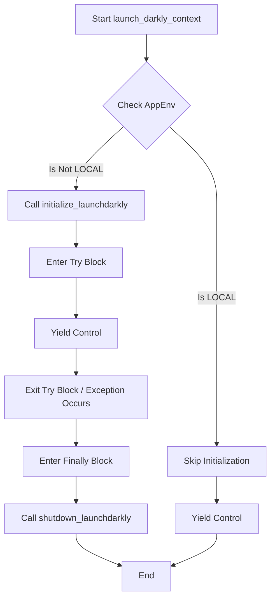

#### 带注释源码

```python
@contextlib.contextmanager
def launch_darkly_context():
    # 检查应用配置中的环境变量是否不等于 LOCAL (本地环境)
    if settings.config.app_env != backend.util.settings.AppEnvironment.LOCAL:
        # 如果不是本地环境，初始化 LaunchDarkly SDK
        initialize_launchdarkly()
        try:
            # 将控制权交还给 with 语句块，执行主逻辑
            yield
        finally:
            # 无论 with 语句块中是否发生异常，最终都会执行关闭 LaunchDarkly 的操作
            shutdown_launchdarkly()
    else:
        # 如果是本地环境，不进行任何初始化，直接交还控制权
        yield
```


### `lifespan_context`

该函数是一个异步上下文管理器，负责管理 FastAPI 应用程序的启动和关闭生命周期。它处理数据库连接、线程池配置、数据迁移、服务初始化（如 LaunchDarkly 和聊天消费者）以及在应用关闭时的资源清理工作。

参数：

- `app`：`fastapi.FastAPI`，FastAPI 应用程序实例，用于 lifespan 事件的绑定。

返回值：`AsyncGenerator`，异步生成器对象，用于在启动和关闭阶段之间挂起执行。

#### 流程图

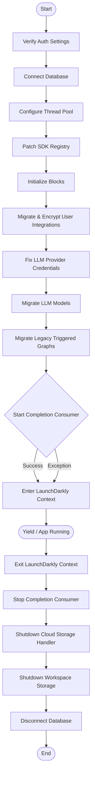

#### 带注释源码

```python
@contextlib.asynccontextmanager
async def lifespan_context(app: fastapi.FastAPI):
    # 1. 验证认证设置，确保服务启动前的配置正确
    verify_auth_settings()

    # 2. 连接数据库
    await backend.data.db.connect()

    # 3. 配置线程池以优化 FastAPI 同步操作性能
    # 关键：FastAPI 会在线程池中运行所有同步函数（非 async def 的函数）
    # 默认池大小为 40，高并发下可能成为瓶颈
    config = backend.util.settings.Config()
    try:
        import anyio.to_thread

        anyio.to_thread.current_default_thread_limiter().total_tokens = (
            config.fastapi_thread_pool_size
        )
        logger.info(
            f"Thread pool size set to {config.fastapi_thread_pool_size} for sync endpoint/dependency performance"
        )
    except (ImportError, AttributeError) as e:
        logger.warning(f"Could not configure thread pool size: {e}")
        # 如果配置失败，继续执行但不进行线程池配置

    # 4. 确保在初始化块之前修补 SDK 自动注册
    from backend.sdk.registry import AutoRegistry

    AutoRegistry.patch_integrations()

    # 5. 初始化数据块
    await backend.data.block.initialize_blocks()

    # 6. 迁移并加密用户集成数据
    await backend.data.user.migrate_and_encrypt_user_integrations()
    # 7. 修复 LLM 提供商凭据
    await backend.data.graph.fix_llm_provider_credentials()
    # 8. 迁移 LLM 模型
    await backend.data.graph.migrate_llm_models(DEFAULT_LLM_MODEL)
    # 9. 迁移旧版触发的图数据
    await backend.integrations.webhooks.utils.migrate_legacy_triggered_graphs()

    # 10. 启动聊天完成消费者（用于 Redis Streams 通知）
    try:
        await start_completion_consumer()
    except Exception as e:
        logger.warning(f"Could not start chat completion consumer: {e}")

    # 11. 进入 LaunchDarkly 上下文管理器（仅在非本地环境初始化）
    # 此时应用正式启动，开始处理请求
    with launch_darkly_context():
        yield

    # --- 应用关闭阶段 ---
    # Yield 之后，应用停止接收新请求，开始清理资源

    # 12. 停止聊天完成消费者
    try:
        await stop_completion_consumer()
    except Exception as e:
        logger.warning(f"Error stopping chat completion consumer: {e}")

    # 13. 关闭云存储处理器
    try:
        await shutdown_cloud_storage_handler()
    except Exception as e:
        logger.warning(f"Error shutting down cloud storage handler: {e}")

    # 14. 关闭工作区存储
    try:
        await shutdown_workspace_storage()
    except Exception as e:
        logger.warning(f"Error shutting down workspace storage: {e}")

    # 15. 断开数据库连接
    await backend.data.db.disconnect()
```


### `custom_generate_unique_id`

该函数用于为 FastAPI 应用程序的 OpenAPI 规范生成清晰、格式化的唯一操作 ID（Operation ID）。它通过组合 HTTP 请求方法、路由标签和摘要信息，生成符合 `{method}{tag}{summary}` 格式的标识符。

参数：

-  `route`：`APIRoute`，表示 API 路由的 FastAPI 对象，包含该路由的元数据，如方法、标签、摘要和名称等。

返回值：`str`，生成的用于 OpenAPI 规范的唯一操作 ID 字符串。

#### 流程图

```mermaid
flowchart TD
    A[开始: 接收 APIRoute 对象] --> B{route.tags 或 route.methods 是否为空?}
    B -- 是 --> C[返回 route.name]
    B -- 否 --> D[获取 HTTP 方法<br/>list(route.methods)[0].lower()]
    D --> E[获取第一个标签<br/>route.tags[0]]
    E --> F{标签是否为 Enum 类型?}
    F -- 是 --> G[tag_str = first_tag.name]
    F -- 否 --> H[tag_str = str(first_tag)]
    G --> I[格式化标签<br/>按下划线分割并首字母大写后拼接]
    H --> I
    I --> J[获取摘要<br/>优先使用 route.summary 否则 route.name]
    J --> K[格式化摘要<br/>按下划线分割并首字母大写后拼接]
    K --> L{格式化后的 tag 是否为空?}
    L -- 是 --> M[返回 method + summary]
    L -- 否 --> N[返回 method + tag + summary]
```

#### 带注释源码

```python
def custom_generate_unique_id(route: APIRoute):
    """Generate clean operation IDs for OpenAPI spec following the format:
    {method}{tag}{summary}
    """
    # 检查路由是否包含标签或方法。如果缺失，则直接使用路由名称作为 ID
    if not route.tags or not route.methods:
        return f"{route.name}"

    # 提取 HTTP 方法（如 GET, POST），并转换为小写
    method = list(route.methods)[0].lower()
    
    # 获取路由的第一个标签，用于分组标识
    first_tag = route.tags[0]
    
    # 如果标签是枚举类型，则取其名称；否则转换为字符串
    if isinstance(first_tag, Enum):
        tag_str = first_tag.name
    else:
        tag_str = str(first_tag)

    # 将标签字符串格式化为帕斯卡命名法（PascalCase）
    # 例如: "v1_routes" -> "V1Routes"
    tag = "".join(word.capitalize() for word in tag_str.split("_"))  # v1/v2

    # 确定摘要部分：优先使用 route.summary，如果不存在则回退到 route.name
    # 摘要用于区分同一组下的不同操作
    summary = (
        route.summary if route.summary else route.name
    )  # need to be unique, a different version could have the same summary
    
    # 将摘要字符串格式化为帕斯卡命名法（PascalCase）
    summary = "".join(word.capitalize() for word in str(summary).split("_"))

    # 拼接最终的操作 ID
    if tag:
        return f"{method}{tag}{summary}"
    else:
        return f"{method}{summary}"
```


### `handle_internal_http_error`

这是一个工厂函数，用于生成 FastAPI 的异常处理器。它旨在标准化应用中内部 HTTP 错误的响应格式和日志记录行为，允许调用者自定义返回的 HTTP 状态码以及是否记录详细的错误堆栈信息。

参数：

- `status_code`：`int`，HTTP 响应状态码，默认为 500。
- `log_error`：`bool`，是否记录详细的异常日志（包括堆栈信息），默认为 True。

返回值：`Callable`，返回一个 FastAPI 兼容的异常处理函数，该函数接收 `request` 和 `exc` 并返回 `JSONResponse`。

#### 流程图

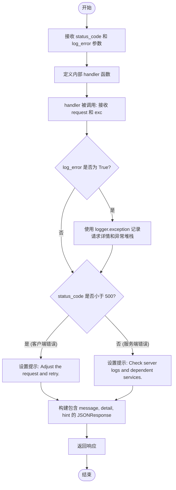

#### 带注释源码

```python
def handle_internal_http_error(status_code: int = 500, log_error: bool = True):
    """
    生成一个标准的 FastAPI 异常处理函数。
    
    Args:
        status_code: 需要返回的 HTTP 状态码。
        log_error: 是否在日志中记录完整的异常信息。
    """
    def handler(request: fastapi.Request, exc: Exception):
        # 如果配置了需要记录日志，则记录完整的异常堆栈和请求上下文
        if log_error:
            logger.exception(
                "%s %s failed. Investigate and resolve the underlying issue: %s",
                request.method,
                request.url.path,
                exc,
                exc_info=exc,
            )

        # 根据状态码类型生成用户友好的提示信息
        # 4xx 错误通常建议客户端调整请求，5xx 错误建议检查服务器端
        hint = (
            "Adjust the request and retry."
            if status_code < 500
            else "Check server logs and dependent services."
        )
        
        # 返回标准化的 JSON 错误响应
        return fastapi.responses.JSONResponse(
            content={
                "message": f"Failed to process {request.method} {request.url.path}",
                "detail": str(exc),
                "hint": hint,
            },
            status_code=status_code,
        )

    return handler
```


### `validation_error_handler`

该函数是一个自定义的FastAPI异常处理器，专门用于捕获和处理请求数据验证失败时抛出的异常（如`RequestValidationError`或`pydantic.ValidationError`）。它记录详细的错误日志，提取具体的验证错误详情，并返回一个包含错误信息和提示的标准化JSON响应，状态码为422。

参数：

- `request`：`fastapi.Request`，代表传入的 HTTP 请求对象，用于获取请求方法和路径等信息。
- `exc`：`Exception`，在请求验证过程中捕获到的异常实例。

返回值：`fastapi.responses.Response`，返回一个包含错误详情的HTTP响应对象，状态码为422，内容类型为`application/json`。

#### 流程图

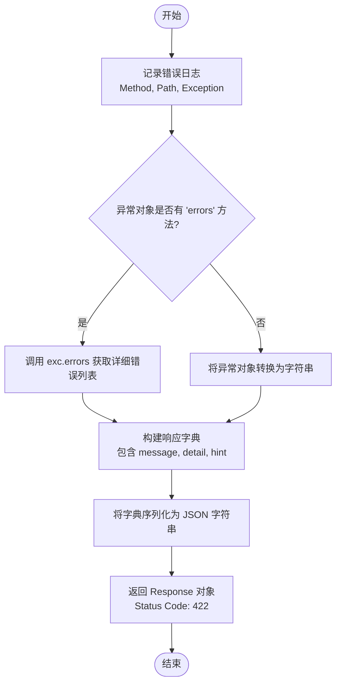

#### 带注释源码

```python
async def validation_error_handler(
    request: fastapi.Request, exc: Exception
) -> fastapi.responses.Response:
    # 记录验证失败的日志，包含HTTP方法、路径和具体的异常信息
    logger.error(
        "Validation failed for %s %s: %s. Fix the request payload and try again.",
        request.method,
        request.url.path,
        exc,
    )
    # 定义错误变量，类型可能为列表（Pydantic错误详情）或字符串
    errors: list | str
    # 检查异常对象是否具有 errors 方法（典型的 Pydantic 验证错误特征）
    if hasattr(exc, "errors"):
        errors = exc.errors()  # type: ignore[call-arg]
    else:
        errors = str(exc)

    # 构造标准的响应内容体
    response_content = {
        "message": f"Invalid data for {request.method} {request.url.path}",
        "detail": errors,
        "hint": "Ensure the request matches the API schema.",
    }

    # 将字典内容序列化为 JSON 格式字符串
    content_json = json.dumps(response_content)

    # 返回状态码为 422 (Unprocessable Entity) 的响应对象
    return fastapi.responses.Response(
        content=content_json,
        status_code=422,
        media_type="application/json",
    )
```


### `health`

该函数是一个FastAPI的GET请求端点，用于执行服务健康检查，主要验证数据库连接是否处于活跃状态。

参数：

-   无

返回值：`dict[str, str]`，返回包含服务状态信息的字典，若健康则返回 `{"status": "healthy"}`。

#### 流程图

```mermaid
flowchart TD
    Start([开始]) --> CheckDB{数据库是否已连接?}
    CheckDB -- 否 --> RaiseError[抛出 UnhealthyServiceError 异常]
    RaiseError --> EndError([结束/错误])
    CheckDB -- 是 --> ReturnSuccess[返回 {"status": "healthy"}]
    ReturnSuccess --> EndSuccess([结束/成功])
```

#### 带注释源码

```python
@app.get(path="/health", tags=["health"], dependencies=[])  # 定义路由为 GET /health，归类标签为 health
async def health():
    # 检查后端数据库连接状态
    if not backend.data.db.is_connected():
        # 如果数据库未连接，抛出 UnhealthyServiceError 异常
        # 该异常通常会被全局异常处理器捕获并转换为 HTTP 503 响应
        raise UnhealthyServiceError("Database is not connected")
    # 如果数据库连接正常，返回包含健康状态的字典
    return {"status": "healthy"}
```


### `AgentServer.run`

该方法负责初始化并启动 Uvicorn ASGI 服务器，为 FastAPI 应用提供服务。它包括配置跨域资源共享（CORS）中间件，根据操作系统环境优化事件循环策略（如使用 uvloop），并设置相关的性能参数（如 HTTP 解析器和 WebSocket 支持）。

参数：

- `self`：`AgentServer`，类的实例引用。

返回值：`None`，该方法启动阻塞式的服务器进程，直到服务停止才会返回。

#### 流程图

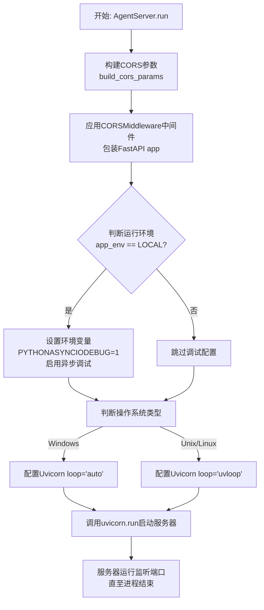

#### 带注释源码

```python
    def run(self):
        # 1. 根据配置构建 CORS (跨域资源共享) 参数
        cors_params = build_cors_params(
            settings.config.backend_cors_allow_origins,
            settings.config.app_env,
        )

        # 2. 使用 Starlette 的 CORS 中间件包装 FastAPI 应用实例
        #    这允许服务器处理来自不同源的跨域请求
        server_app = starlette.middleware.cors.CORSMiddleware(
            app=app,
            **cors_params,
            allow_credentials=True,  # 允许携带凭证
            allow_methods=["*"],      # 允许所有 HTTP 方法
            allow_headers=["*"],      # 允许所有 HTTP 请求头
        )

        # 3. 仅在本地开发环境下进行特定调试配置
        #    注意：并非所有 uvicorn 版本都支持 debug 参数，故通过环境变量设置
        if settings.config.app_env == backend.util.settings.AppEnvironment.LOCAL:
            import os

            # 启用 asyncio 的调试模式，有助于发现异步任务中的问题
            os.environ["PYTHONASYNCIODEBUG"] = "1"

        # 4. 配置并运行 Uvicorn 服务器
        #    参考 Kludex FastAPI 性能优化建议
        uvicorn.run(
            app=server_app,
            host=settings.config.agent_api_host,  # 监听地址
            port=settings.config.agent_api_port,  # 监听端口
            log_config=None,
            # 使用 httptools 库进行 HTTP 解析（需安装），性能优于默认解析器
            http="httptools",
            # 仅在非 Windows 系统（如 Linux/macOS）上使用 uvloop，提供更高性能的异步事件循环
            loop="uvloop" if platform.system() != "Windows" else "auto",
            # 禁用 WebSocket 支持，因为该服务不包含 WebSocket 端点，以减少资源占用
            ws="none",
        )
```


### `AgentServer.test_execute_graph`

该方法是 `AgentServer` 类中的一个静态辅助方法，主要用于测试或内部调用。它封装了执行图（Graph）的逻辑，将传入的参数（如图ID、用户ID、版本及输入数据）处理后，转发给后端 V1 API 的核心执行函数 `backend.api.features.v1.execute_graph`，并处理了默认输入值和凭据输入。

参数：

- `graph_id`：`str`，要执行的图的唯一标识符。
- `user_id`：`str`，发起执行请求的用户唯一标识符。
- `graph_version`：`Optional[int]`，要执行的图的特定版本号，默认为 `None`。
- `node_input`：`Optional[dict[str, Any]]`，图执行所需的输入数据字典，默认为 `None`。

返回值：`Any`，后端 `execute_graph` 函数执行后返回的结果，通常包含执行状态、节点输出等信息。

#### 流程图

```mermaid
graph TD
    A[开始: AgentServer.test_execute_graph] --> B[接收参数: graph_id, user_id, graph_version, node_input]
    B --> C{检查 node_input 是否为 None}
    C -- 是 (Yes) --> D[设置 inputs 为空字典 {}]
    C -- 否 --> E[设置 inputs 为 node_input]
    D --> F[设置 credentials_inputs 为空字典 {}]
    E --> F
    F --> G[调用 backend.api.features.v1.execute_graph]
    G --> H[返回执行结果]
    H --> I[结束]
```

#### 带注释源码

```python
    @staticmethod
    async def test_execute_graph(
        graph_id: str,
        user_id: str,
        graph_version: Optional[int] = None,
        node_input: Optional[dict[str, Any]] = None,
    ):
        # 调用后端 v1 API 的 execute_graph 方法来实际执行图
        # 如果 node_input 为 None，则使用空字典 {} 作为默认输入
        # credentials_inputs 显式设置为空字典，表示测试环境下不使用额外的凭据输入
        return await backend.api.features.v1.execute_graph(
            user_id=user_id,
            graph_id=graph_id,
            graph_version=graph_version,
            inputs=node_input or {},
            credentials_inputs={},
        )
```


### `AgentServer.test_get_graph`

该方法是一个静态辅助方法，用于获取指定用户的特定版本图的数据。它直接委托给后端 API 的 v1 功能模块 `backend.api.features.v1.get_graph` 执行实际的检索逻辑，主要用于测试或内部服务调用。

参数：

- `graph_id`：`str`，要检索的图的唯一标识符。
- `graph_version`：`int`，要检索的图的版本号。
- `user_id`：`str`，发起请求的用户的唯一标识符。
- `for_export`：`bool`，（默认为 `False`）一个标志，指示是否为了导出而获取图数据。

返回值：`Any`（通常为字典或 Pydantic 模型），返回指定图的数据结构，包含图的元数据、节点和边等信息。

#### 流程图

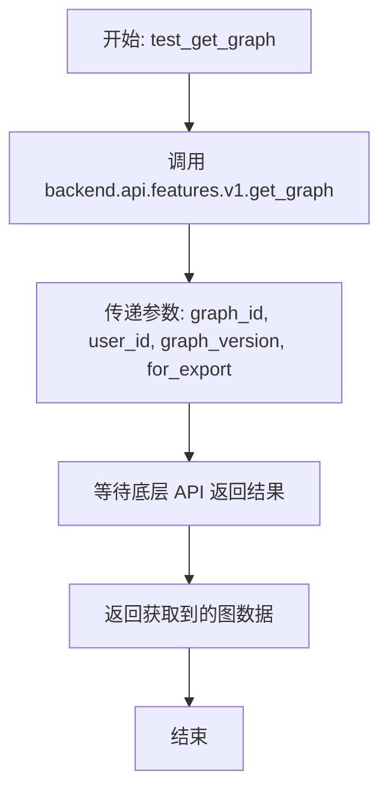

#### 带注释源码

```python
    @staticmethod
    async def test_get_graph(
        graph_id: str,
        graph_version: int,
        user_id: str,
        for_export: bool = False,
    ):
        # 直接调用 v1 版本的 API 功能来获取图数据
        # 将所有传入参数原样转发给处理函数
        return await backend.api.features.v1.get_graph(
            graph_id, user_id, graph_version, for_export
        )
```


### `AgentServer.test_create_graph`

该方法是用于测试或内部调用创建图的静态方法。它接收包含图结构信息的对象和用户ID，委托给`backend.api.features.v1`模块中的`create_new_graph`函数来执行实际的创建逻辑并返回结果。

参数：

- `create_graph`: `backend.api.features.v1.CreateGraph`，包含待创建图的详细信息（如节点、边、名称等）的数据模型对象。
- `user_id`: `str`，发起创建请求的用户标识符。

返回值：`Any`，图创建操作的结果（通常是创建后的图数据对象或API响应）。

#### 流程图

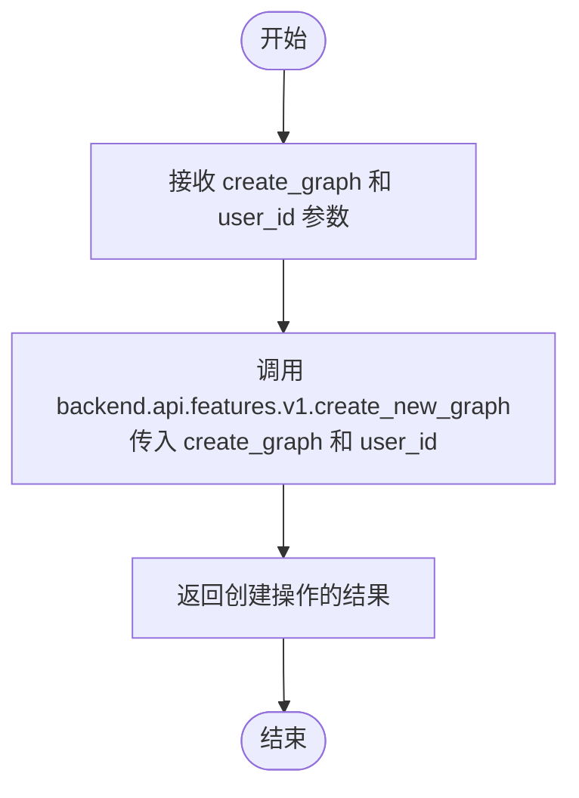

#### 带注释源码

```python
    @staticmethod
    async def test_create_graph(
        create_graph: backend.api.features.v1.CreateGraph, # 参数：包含图创建数据的对象
        user_id: str, # 参数：用户ID
    ):
        # 调用 v1 API 模块的 create_new_graph 函数执行创建操作，并直接返回结果
        return await backend.api.features.v1.create_new_graph(create_graph, user_id)
```


### `AgentServer.test_get_graph_run_status`

该方法用于获取指定图执行（Graph Execution）的运行状态。它通过调用数据层接口查询执行元数据，如果执行记录不存在则抛出异常，否则返回该执行的状态。

参数：

- `graph_exec_id`: `str`，图执行的唯一标识符。
- `user_id`: `str`，请求操作的用户ID，用于鉴权和数据隔离。

返回值：`str`，图执行的运行状态。

#### 流程图

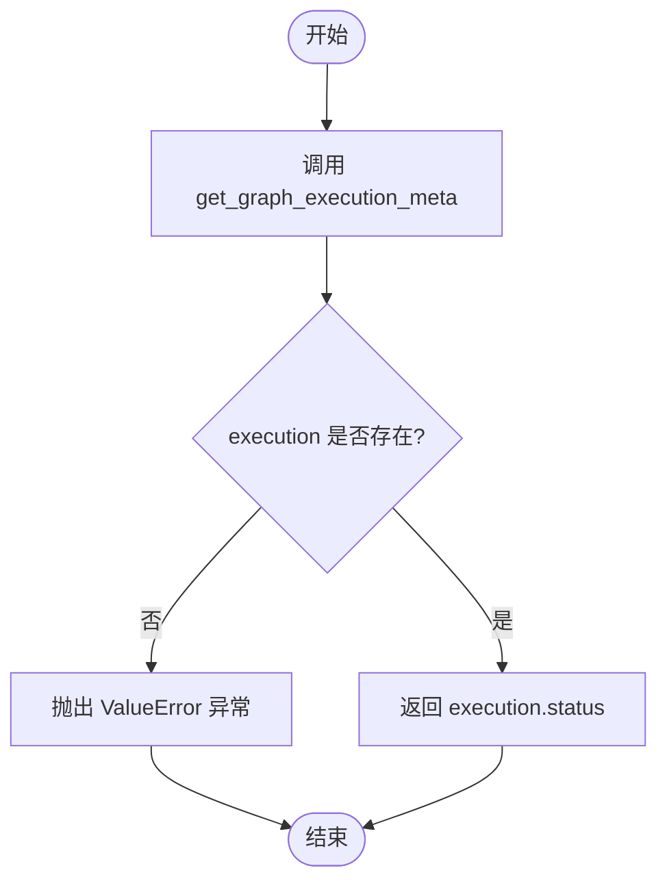

#### 带注释源码

```python
    @staticmethod
    async def test_get_graph_run_status(graph_exec_id: str, user_id: str):
        # 从数据层导入获取图执行元数据的函数
        from backend.data.execution import get_graph_execution_meta

        # 根据用户ID和执行ID异步获取执行元数据对象
        execution = await get_graph_execution_meta(
            user_id=user_id, execution_id=graph_exec_id
        )
        # 检查获取到的执行对象是否为空
        if not execution:
            # 如果未找到对应的执行记录，抛出数值错误异常
            raise ValueError(f"Execution {graph_exec_id} not found")
        
        # 返回执行对象中的状态属性
        return execution.status
```


### `AgentServer.test_delete_graph`

该方法用于在测试运行后进行清理操作，主要通过先删除与图关联的库代理记录，然后再删除图本身来实现环境的重置。

参数：

-  `graph_id`：`str`，要删除的图的唯一标识符。
-  `user_id`：`str`，执行删除操作的用户标识。

返回值：`Any`，返回后端图删除操作的结果（通常为删除确认或被删除的数据对象）。

#### 流程图

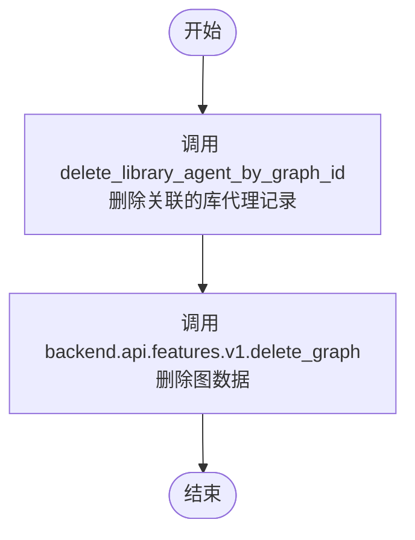

#### 带注释源码

```python
    @staticmethod
    async def test_delete_graph(graph_id: str, user_id: str):
        """Used for clean-up after a test run"""
        # 第一步：根据 graph_id 和 user_id 删除库中关联的 Agent 记录
        await backend.api.features.library.db.delete_library_agent_by_graph_id(
            graph_id=graph_id, user_id=user_id
        )
        # 第二步：调用 v1 API 的 delete_graph 方法删除核心图数据，并返回结果
        return await backend.api.features.v1.delete_graph(graph_id, user_id)
```


### `AgentServer.test_get_presets`

该方法是 `AgentServer` 类中的一个静态辅助方法，用于直接调用底层逻辑获取指定用户的预设列表。它封装了对 `backend.api.features.library.routes.presets.list_presets` 的调用，主要用于内部测试或直接服务访问场景。

参数：

- `user_id`：`str`，执行查询操作的用户唯一标识符。
- `page`：`int`，分页查询的页码，默认值为 1。
- `page_size`：`int`，每页返回的记录数量，默认值为 10。

返回值：`Any`（通常为列表或分页对象），返回由底层 `list_presets` 函数产生的预设列表数据。

#### 流程图

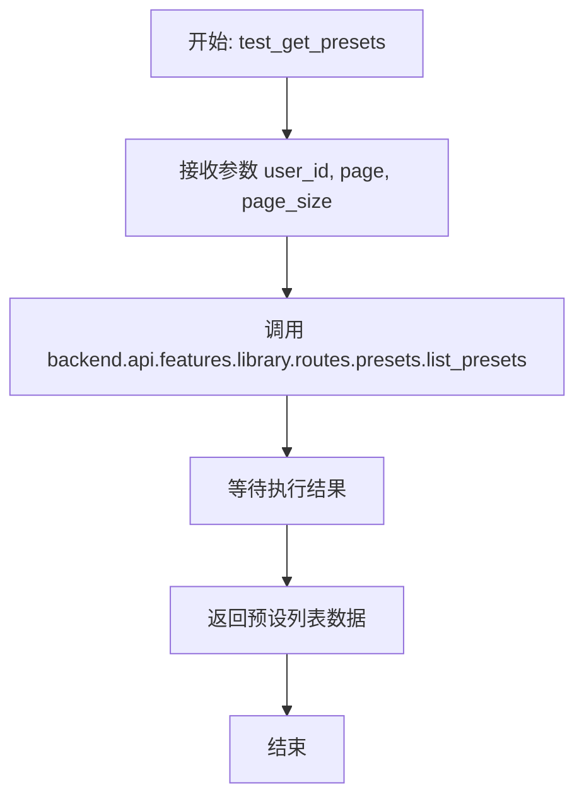

#### 带注释源码

```python
    @staticmethod
    async def test_get_presets(user_id: str, page: int = 1, page_size: int = 10):
        # 调用后端库路由中的 list_presets 函数
        # 传入用户ID、页码和每页大小以获取预设列表
        return await backend.api.features.library.routes.presets.list_presets(
            user_id=user_id, page=page, page_size=page_size
        )
```


### `AgentServer.test_get_preset`

该方法是一个静态方法，用于通过预设ID和用户ID获取特定的库代理预设信息。它实际上是后端预设路由获取功能的封装，方便在测试或其他上下文中调用。

参数：

- `preset_id`: `str`，要获取的预设的唯一标识符。
- `user_id`: `str`，发起请求的用户的唯一标识符，用于权限验证或数据过滤。

返回值：`Any`，返回由 `backend.api.features.library.routes.presets.get_preset` 方法返回的结果，通常为包含预设详细信息的对象或字典。

#### 流程图

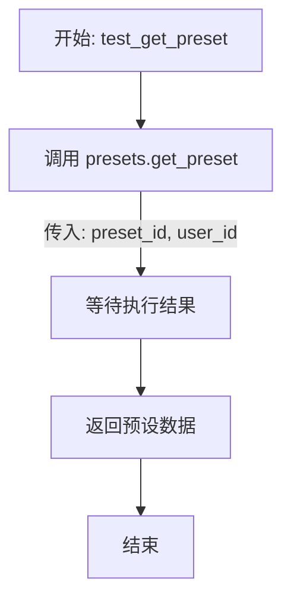

#### 带注释源码

```python
    @staticmethod
    async def test_get_preset(preset_id: str, user_id: str):
        # 调用 library routes 中的 presets 模块的 get_preset 方法
        # 传入预设ID和用户ID，异步获取预设详情
        return await backend.api.features.library.routes.presets.get_preset(
            preset_id=preset_id, user_id=user_id
        )
```


### `AgentServer.test_create_preset`

该方法是一个静态异步方法，用于创建一个新的库代理预设（Library Agent Preset）。它充当后端 API 功能的包装器，将接收到的预设数据和用户ID传递给库路由中的预设处理器以执行实际的创建操作。

参数：

- `preset`：`backend.api.features.library.model.LibraryAgentPresetCreatable`，包含创建新预设所需的数据模型对象，描述了预设的各项属性。
- `user_id`：`str`，执行创建操作的用户的唯一标识符。

返回值：`Any`，返回`backend.api.features.library.routes.presets.create_preset`函数的执行结果，通常为创建成功的预设对象或相关信息。

#### 流程图

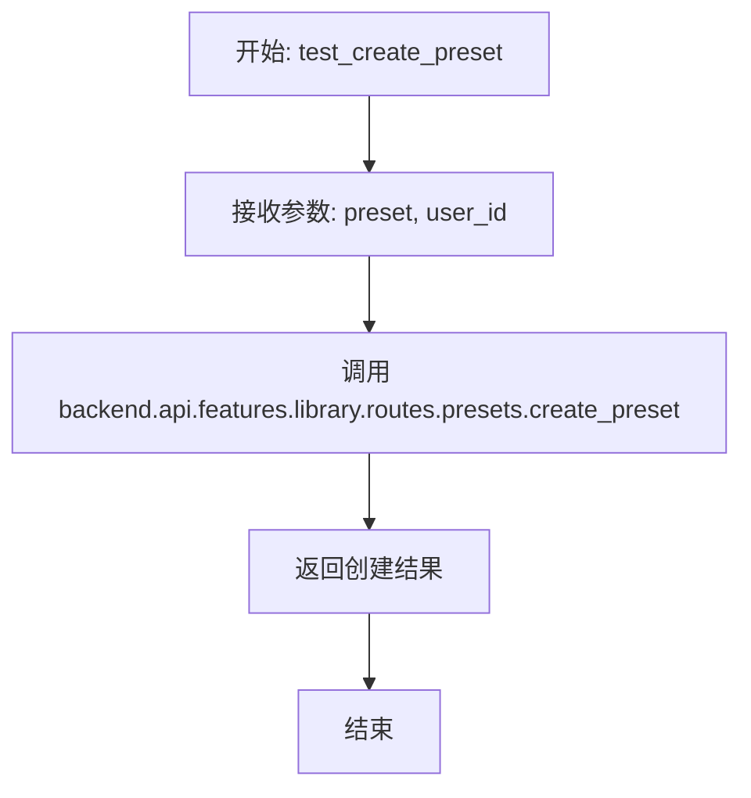

#### 带注释源码

```python
    @staticmethod
    async def test_create_preset(
        preset: backend.api.features.library.model.LibraryAgentPresetCreatable,
        user_id: str,
    ):
        # 调用库路由中的预设处理函数，传入预设数据和用户ID，执行创建逻辑
        return await backend.api.features.library.routes.presets.create_preset(
            preset=preset, user_id=user_id
        )
```


### `AgentServer.test_update_preset`

该方法是 `AgentServer` 类中的一个静态异步方法，用于更新特定的代理预设。它充当测试接口或包装器，将请求参数直接传递给后端核心逻辑层 `backend.api.features.library.routes.presets` 中的 `update_preset` 函数执行实际的数据更新操作。

参数：

- `preset_id`：`str`，需要更新的预设的 ID。
- `preset`：`backend.api.features.library.model.LibraryAgentPresetUpdatable`，包含更新数据的可变字段模型对象。
- `user_id`：`str`，执行更新操作的用户 ID。

返回值：`Any`（通常为更新后的预设对象或操作成功的确认信息），由底层 `backend.api.features.library.routes.presets.update_preset` 函数返回。

#### 流程图

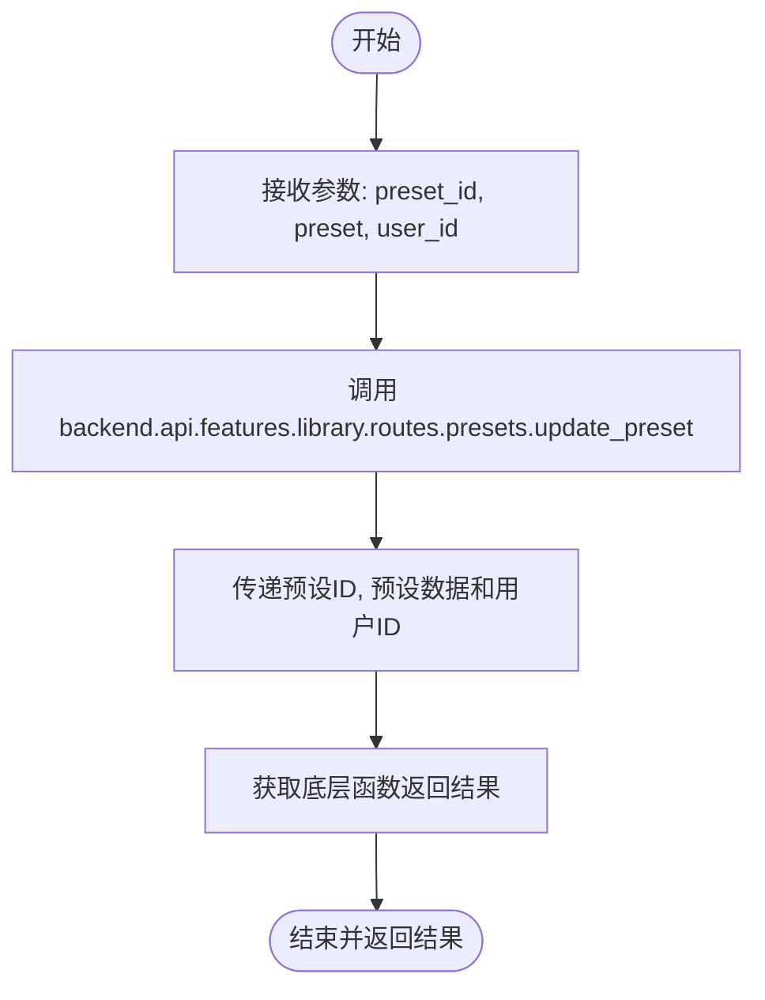

#### 带注释源码

```python
    @staticmethod
    async def test_update_preset(
        preset_id: str,
        preset: backend.api.features.library.model.LibraryAgentPresetUpdatable,
        user_id: str,
    ):
        # 直接调用 library routes 中的 update_preset 方法处理更新逻辑
        return await backend.api.features.library.routes.presets.update_preset(
            preset_id=preset_id, preset=preset, user_id=user_id
        )
```


### `AgentServer.test_delete_preset`

这是一个静态异步方法，用于删除指定的预设（Preset）。该方法主要作为底层 API 路由调用的包装器，接收预设 ID 和用户 ID，并将删除请求委托给 `backend.api.features.library.routes.presets` 模块中的 `delete_preset` 函数执行，通常用于测试环境或内部服务调用。

参数：

-   `preset_id`：`str`，需要被删除的预设的唯一标识符。
-   `user_id`：`str`，发起删除请求的用户标识符，用于权限验证和操作审计。

返回值：`Any`，返回底层 `delete_preset` 函数的执行结果（通常为删除成功的确认信息或被删除的对象数据）。

#### 流程图

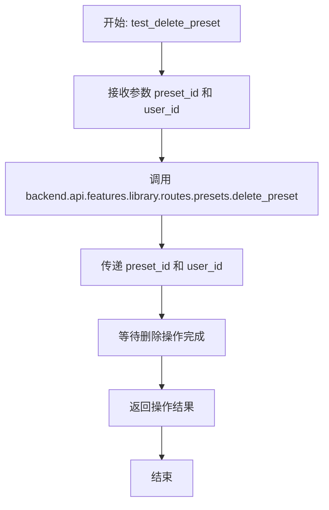

#### 带注释源码

```python
    @staticmethod
    async def test_delete_preset(preset_id: str, user_id: str):
        # 调用 backend.api.features.library.routes.presets 模块中的 delete_preset 函数
        # 执行实际的预设删除逻辑，并传入预设ID和用户ID
        return await backend.api.features.library.routes.presets.delete_preset(
            preset_id=preset_id, user_id=user_id
        )
```


### `AgentServer.test_execute_preset`

这是一个用于测试或程序化调用的静态方法，旨在执行指定的预设代理。它通过调用后端API功能模块中的预设执行逻辑，传入预设ID、用户ID及输入数据，并显式地将凭证输入设为空，来触发预设图的运行。

参数：

-   `preset_id`：`str`，要执行的预设代理的唯一标识符。
-   `user_id`：`str`，发起执行请求的用户唯一标识符。
-   `inputs`：`Optional[dict[str, Any]]`，传递给预设执行节点的输入数据字典。如果为None，默认使用空字典。

返回值：`Any`，预设执行的结果对象（具体类型由被调用的 `execute_preset` 函数决定，通常包含执行状态或输出数据）。

#### 流程图

```mermaid
graph TD
    A[开始: test_execute_preset] --> B{检查 inputs}
    B -- inputs 为 None --> C[设置 inputs = {}]
    B -- inputs 不为 None --> D[保留原 inputs]
    C --> E[调用 presets.execute_preset]
    D --> E
    E --> F[返回执行结果]
    F --> G[结束]
```

#### 带注释源码

```python
    @staticmethod
    async def test_execute_preset(
        preset_id: str,
        user_id: str,
        inputs: Optional[dict[str, Any]] = None,
    ):
        # 调用 library 路由模块中的 presets.execute_preset 方法执行预设
        return await backend.api.features.library.routes.presets.execute_preset(
            preset_id=preset_id,      # 传入预设ID
            user_id=user_id,          # 传入用户ID
            inputs=inputs or {},      # 传入输入数据，若为None则使用空字典
            credential_inputs={},     # 显式传入空的凭证输入
        )
```


### `AgentServer.test_create_store_listing`

该方法是一个用于测试的静态方法，其主要功能是接收用户的商店提交请求和用户ID，并将创建商店Listing的具体逻辑委托给后端存储路由处理函数（`backend.api.features.store.routes.create_submission`）执行，最后返回执行结果。

参数：

- `request`: `backend.api.features.store.model.StoreSubmissionRequest`，包含商店提交请求所需数据的对象，通常包含代理的元数据、描述、版本等信息。
- `user_id`: `str`，发起请求的操作用户ID，用于权限验证和资源归属。

返回值：`Any`（具体类型取决于`create_submission`的实现），返回后端商店路由处理函数执行创建操作后的结果，通常包含创建成功的资源信息或确认状态。

#### 流程图

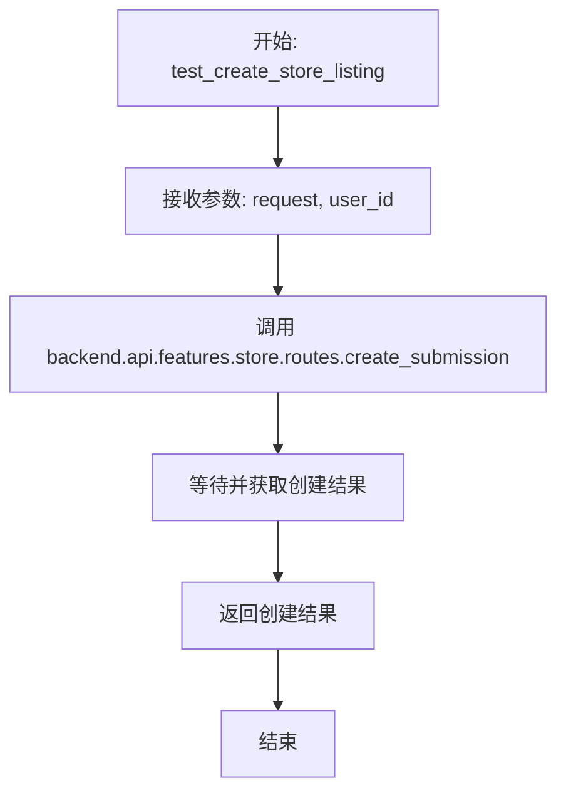

#### 带注释源码

```python
    @staticmethod
    async def test_create_store_listing(
        request: backend.api.features.store.model.StoreSubmissionRequest, user_id: str
    ):
        # 直接调用后端商店路由模块中的 create_submission 函数
        # 将请求对象和用户ID传递下去，由该函数负责具体的业务逻辑（如验证、入库等）
        return await backend.api.features.store.routes.create_submission(
            request, user_id
        )
```


### `AgentServer.test_review_store_listing`

该方法是 `AgentServer` 类中的一个静态测试辅助方法，用于代理处理商店列表的审核请求。它接收审核请求对象和用户ID，将其转发至后台管理路由服务进行处理，并返回处理结果。

参数：

- `request`：`backend.api.features.store.model.ReviewSubmissionRequest`，包含审核商店提交所需的请求数据，包括商店列表版本ID及审核状态（如批准或拒绝）等信息。
- `user_id`：`str`，执行审核操作的用户的唯一标识符。

返回值：`Any`（具体类型取决于 `backend.api.features.admin.store_admin_routes.review_submission` 的实现），表示审核操作的结果，通常包含更新后的提交信息或操作状态。

#### 流程图

```mermaid
flowchart TD
    Start([开始: test_review_store_listing]) --> Input[接收 request 和 user_id]
    Input --> Extract[从 request 中获取 store_listing_version_id]
    Extract --> CallInvoke[调用 backend.api.features.admin.store_admin_routes.review_submission]
    CallInvoke -- 传入参数 --> Params[store_listing_version_id, request, user_id]
    Params --> Result[获取执行结果]
    Result --> End([返回结果])
```

#### 带注释源码

```python
    @staticmethod
    async def test_review_store_listing(
        request: backend.api.features.store.model.ReviewSubmissionRequest,
        user_id: str,
    ):
        # 调用后台管理路由中的 review_submission 函数来处理具体的审核逻辑
        # 传递提取出的 store_listing_version_id、原始请求对象以及用户ID
        return await backend.api.features.admin.store_admin_routes.review_submission(
            request.store_listing_version_id, request, user_id
        )
```


### `AgentServer.test_create_credentials`

用于测试或内部逻辑的静态方法，尝试为指定用户和提供商创建凭证。如果创建过程中发生异常，该方法会记录错误并回退策略，通过ID检索现有的凭证对象。

参数：

- `user_id`：`str`，用户的唯一标识符，用于关联凭证归属。
- `provider`：`ProviderName`，集成服务的提供商名称，指定凭证的类型或来源。
- `credentials`：`Credentials`，包含凭证具体信息的数据模型对象。

返回值：`Credentials`，操作成功后返回新创建的凭证对象；若创建失败则返回获取到的现有凭证对象。

#### 流程图

```mermaid
flowchart TD
    Start((开始)) --> TryCreate[尝试调用 create_credentials]
    TryCreate --> CheckSuccess{创建是否成功?}
    CheckSuccess -- 是 --> ReturnCreated[返回新创建的 Credentials]
    CheckSuccess -- 否/抛出异常 --> LogError[记录错误日志 logger.error]
    LogError --> Fallback[调用 get_credential 获取现有凭证]
    Fallback --> ReturnExisting[返回现有的 Credentials]
    ReturnCreated --> End((结束))
    ReturnExisting --> End
```

#### 带注释源码

```python
    @staticmethod
    async def test_create_credentials(
        user_id: str,
        provider: ProviderName,
        credentials: Credentials,
    ) -> Credentials:
        # 导入路由层的相关处理函数，避免循环依赖或按需加载
        from .features.integrations.router import create_credentials, get_credential

        try:
            # 尝试为指定用户和提供商创建新的凭证
            return await create_credentials(
                user_id=user_id, provider=provider, credentials=credentials
            )
        except Exception as e:
            # 如果创建失败（例如凭证已存在或服务不可用），捕获异常并记录日志
            logger.error(f"Error creating credentials: {e}")
            
            # 容错机制：回退以获取现有的凭证
            return await get_credential(
                provider=provider,
                user_id=user_id,
                cred_id=credentials.id,
            )
```


### `AgentServer.set_test_dependency_overrides`

该方法用于为全局 FastAPI 应用程序实例设置或更新依赖项覆盖（dependency overrides）。这通常在测试环境中使用，用于将生产环境的实际服务（如数据库连接、认证服务等）替换为模拟对象（Mock），以便隔离测试环境。

参数：

-  `overrides`：`dict`，包含依赖项覆盖规则的字典，键为原始依赖项，值为替换后的实现。

返回值：`None`，该方法不返回任何值，直接修改全局 FastAPI 应用实例的状态。

#### 流程图

```mermaid
graph TD
    A[开始: set_test_dependency_overrides] --> B[接收 overrides 字典]
    B --> C[访问全局 FastAPI app 实例]
    C --> D[调用 app.dependency_overrides.update]
    D --> E[将 overrides 合并至现有覆盖配置]
    E --> F[结束: 完成依赖注入替换]
```

#### 带注释源码

```python
    def set_test_dependency_overrides(self, overrides: dict):
        # 获取全局 FastAPI app 实例的 dependency_overrides 属性
        # 并调用 update 方法，将传入的 overrides 字典合并进去
        # 这允许测试代码动态替换 FastAPI 的依赖注入项，实现 Mock
        app.dependency_overrides.update(overrides)
```


## 关键组件


### FastAPI Application Instance & Middleware
管理核心应用创建，集成安全头、GZip 压缩等中间件，并定制 OpenAPI 规范生成。

### Lifespan Event Manager
控制应用程序的启动和关闭序列，处理数据库连接、数据迁移、功能标志初始化和后台消费者等资源。

### Global Exception Handlers
定义统一的错误处理策略，将域特定错误（如 PrismaError 或 ValidationError）转换为带有日志记录的标准 HTTP JSON 响应。

### API Router Integration
将来自各种子模块（如 v1、store、builder、chat 和 admin）的不同端点聚合到主应用命名空间中。

### AgentServer Runtime
通过 uvicorn 提供应用执行包装器，管理服务器配置、CORS 策略和平台特定的性能调整。


## 问题及建议


### 已知问题

-   **生产与测试代码耦合**：`AgentServer` 类中包含了大量以 `test_` 开头的静态方法（如 `test_execute_graph`）。这违反了单一职责原则，将测试辅助功能与服务器启动逻辑混合，增加了生产代码的复杂度和维护成本。
-   **生命周期内执行数据库迁移**：在 `lifespan_context` 启动阶段执行了多项数据库迁移操作（如 `migrate_and_encrypt_user_integrations`）。在应用启动时进行数据库迁移存在风险，若迁移失败或耗时过长，将导致服务不可用或启动超时。
-   **异常处理掩盖真实错误**：在 `test_create_credentials` 方法中，捕获了所有异常（`Exception`）并在日志记录后静默回退去获取现有凭证，这会掩盖创建凭证时发生的实际错误，导致调试困难。
-   **线程池配置的软失败**：配置 `anyio` 线程池大小的代码块捕获了异常并仅记录警告。若配置失败，系统将继续使用默认的较小线程池，导致在高并发下出现性能瓶颈（注释中已标明 CRITICAL）。
-   **全局状态修改风险**：`AgentServer.set_test_dependency_overrides` 方法直接修改了全局 `app` 对象的 `dependency_overrides`。这种全局状态修改方式在并发测试或复杂场景下容易导致状态污染。

### 优化建议

-   **剥离测试逻辑**：将 `AgentServer` 类中的所有 `test_*` 方法移动到专门的测试辅助模块或测试客户端类中，保持生产代码的纯净性。
-   **迁移流程外部化**：将数据库迁移和修复脚本从 FastAPI 的 `lifespan` 事件中移除，改为作为独立的 CI/CD 步骤或容器启动前的 Init Container 执行，确保服务启动的快速和可靠。
-   **改进线程池配置健壮性**：确保线程池配置的必要依赖（如 `anyio`）始终存在，或者在配置失败时抛出明确的错误而非静默降级，以避免未知的性能降级。
-   **模块化路由注册**：使用配置列表（如包含路由、前缀、标签的字典列表）来统一管理 `app.include_router`，减少重复代码，便于路由的统一管理和扩展。
-   **增强异常日志上下文**：在全局异常处理器 `handle_internal_http_error` 中增加对请求追踪 ID（Trace ID）的日志记录，以便在分布式系统中快速定位问题。
-   **严格化凭证创建逻辑**：修改 `test_create_credentials` 中的异常处理逻辑，区分创建失败和已存在的场景，避免在真正的创建失败时掩盖问题。


## 其它


### 设计目标与约束

1. **高性能并发处理**：通过配置 `anyio` 线程池限制器（`fastapi_thread_pool_size`），优化同步端点和依赖项的执行性能，解决默认线程池（40个线程）在高并发下的瓶颈。在生产环境中优先使用 `uvloop` 和 `httptools` 以提升 IO 性能。
2. **模块化与可扩展性**：采用 FastAPI 的路由机制将不同功能域（如 v1, store, builder, chat, admin）解耦，支持独立开发和维护。通过 `AgentServer` 类封装服务进程，便于测试和部署。
3. **环境感知配置**：依据 `AppEnvironment`（LOCAL/PRODUCTION）动态调整行为。例如：仅在非 LOCAL 环境初始化 LaunchDarkly 特性开关；仅在 LOCAL 环境暴露 Swagger 文档（`/docs`）和启用 asyncio 调试模式。
4. **可观测性**：集成 Prometheus 监控（`instrument_fastapi`），在 `/metrics` 端点暴露服务指标，利用结构化日志记录关键操作和错误。

### 外部依赖与接口契约

1. **核心依赖**：
   - **FastAPI & Uvicorn**：Web 框架及 ASGI 服务器。
   - **Prisma**：数据库 ORM，用于执行数据库迁移、连接及查询操作。
   - **Redis**：用于消息队列（如 Chat Completion Consumer），处理异步通知。
   - **LaunchDarkly**：特性标志管理服务，用于灰度发布和动态配置。
2. **接口契约**：
   - **RESTful API**：遵循 OpenAPI 3.0 规范，自动生成文档。自定义了 Operation ID 生成规则（`{method}{tag}{summary}`）以保持 API 版本兼容性。
   - **通信格式**：统一使用 JSON 进行数据交换。错误响应包含 `message`, `detail`, `hint` 字段。
   - **认证**：集成 `autogpt_libs.auth`，支持基于 Token 的认证，并在 OpenAPI Schema 中明确标注需要认证的端点。
3. **数据存储契约**：依赖 `backend.data.db` 管理数据库连接生命周期，启动时执行数据迁移（`migrate_and_encrypt_user_integrations`, `migrate_llm_models` 等）。

### 错误处理与异常设计

1. **全局异常拦截**：通过 `app.add_exception_handler` 注册了多个全局异常处理器，将底层异常转换为标准的 HTTP 响应。
2. **异常映射策略**：
   - **4xx 客户端错误**：
     - `NotFoundError` -> 404（不记录错误堆栈，避免日志污染）。
     - `NotAuthorizedError` -> 403。
     - `RequestValidationError` / `pydantic.ValidationError` -> 422（返回具体的字段校验错误信息）。
     - `ValueError` -> 400。
   - **5xx 服务端错误**：
     - `PrismaError` -> 500（记录详细堆栈，提示检查数据库和服务依赖）。
     - `MissingConfigError` -> 503（服务不可用）。
     - 通用 `Exception` -> 500（兜底处理）。
3. **标准化错误响应**：统一返回结构：
   ```json
   {
     "message": "操作上下文描述",
     "detail": "具体错误信息或堆栈摘要",
     "hint": "用户建议操作"
   }
   ```

### 数据流与状态机

1. **请求生命周期**：
   - **进入**：HTTP 请求 -> CORS 中间件 -> Security Headers 中间件 -> GZip 压缩中间件。
   - **处理**：路由匹配 -> 依赖注入（含权限校验） -> 业务逻辑处理（同步函数运行于线程池，异步函数运行于事件循环）。
   - **响应**：结果序列化（JSON） -> GZip 压缩（可选） -> 返回客户端。
2. **应用生命周期状态**：
   - **Startup（启动态）**：验证 Auth 设置 -> 连接数据库 -> 初始化线程池 -> 注册 SDK 补丁 -> 初始化 Blocks -> 执行数据迁移 -> 启动 Redis Consumer -> 初始化 LaunchDarkly。
   - **Running（运行态）**：接受并处理请求，Prometheus 持续采集指标。
   - **Shutdown（关闭态）**：停止 Redis Consumer -> 关闭云存储句柄 -> 关闭工作区存储句柄 -> 断开数据库连接 -> 销毁 LaunchDarkly 实例。
3. **后台任务状态**：Chat Completion Consumer 作为后台任务运行，维持对 Redis Stream 的监听状态，直到应用关闭时触发停止信号。

### 安全与权限设计

1. **跨域资源共享 (CORS)**：使用 `starlette.middleware.cors.CORSMiddleware`，根据配置 `backend_cors_allow_origins` 动态设置允许的源。生产环境严格限制，本地环境允许所有源。
2. **安全头**：添加 `SecurityHeadersMiddleware`，自动注入如 `X-Content-Type-Options`, `X-Frame-Options` 等 HTTP 安全头，防止 XSS 和点击劫持。
3. **认证机制**：依赖 `autogpt_libs.auth` 进行身份验证。通过 `add_auth_responses_to_openapi` 自动为受保护的路由添加 401 响应定义，确保 API 文档的准确性。
4. **数据校验**：所有输入参数通过 Pydantic 模型进行严格校验，防止注入攻击和非法数据输入。敏感操作（如执行 Graph、删除 Graph）均需验证 User ID 及权限。


    