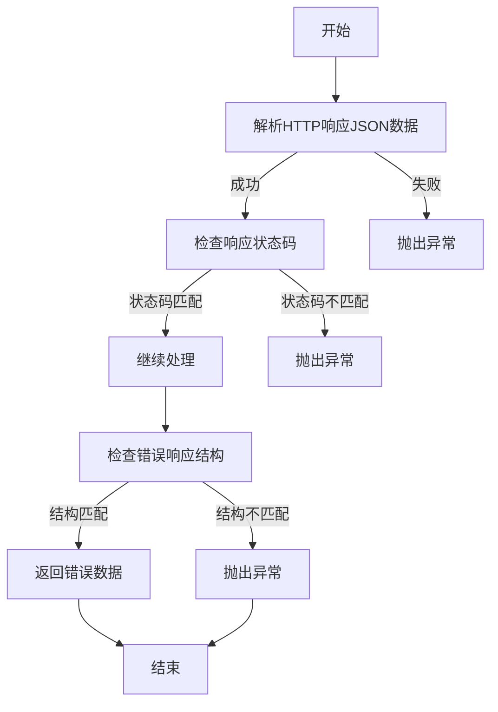
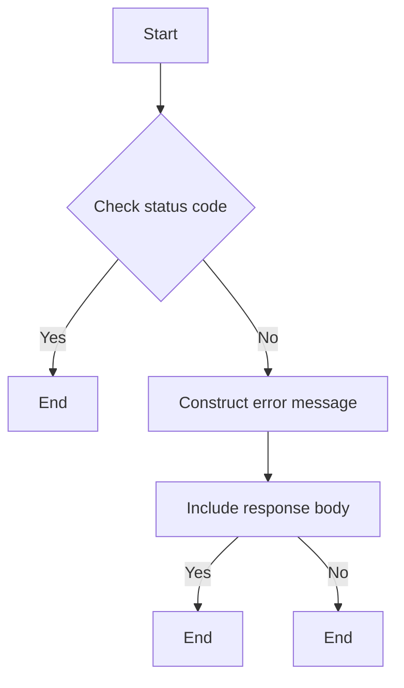
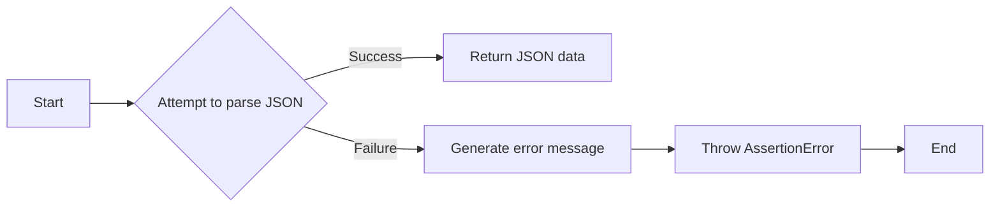
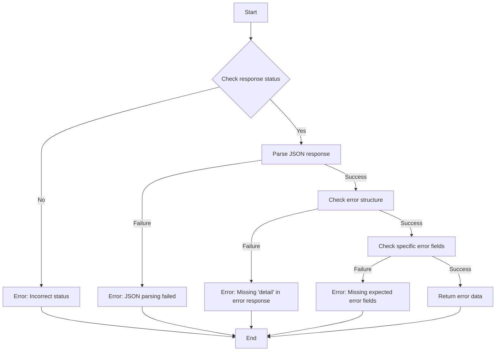
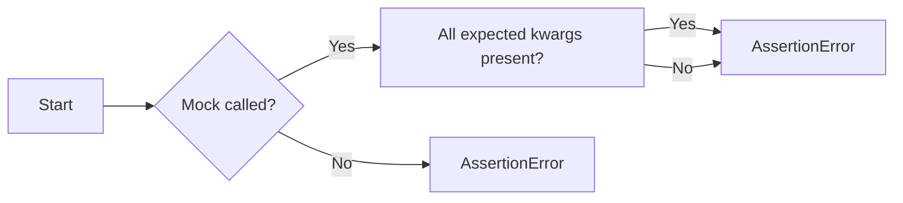
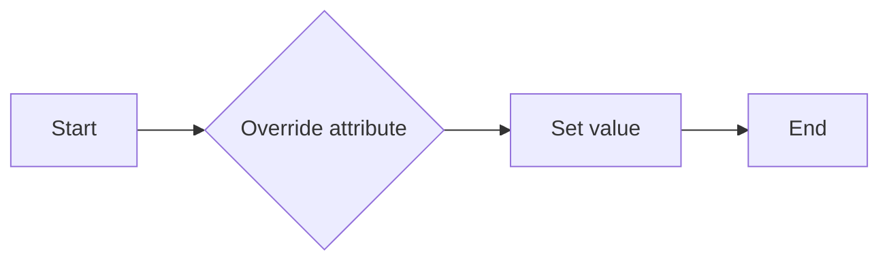
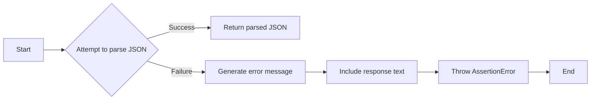
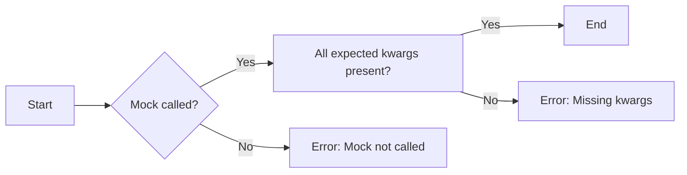

# `.\AutoGPT\autogpt_platform\backend\backend\api\test_helpers.py` 详细设计文档

This code provides helper functions for improved test assertions and error handling, including JSON parsing, response status assertions, and mock object assertions.

## 整体流程



## 类结构

```
HelperFunctions (工具类)
├── assert_response_status (方法)
│   ├── response (HTTP响应对象)
│   ├── expected_status (期望状态码, 默认200)
│   └── error_context (错误上下文, 可选)
├── safe_parse_json (方法)
│   ├── response (HTTP响应对象)
│   └── error_context (错误上下文, 可选)
├── assert_error_response_structure (方法)
│   ├── response (HTTP响应对象)
│   ├── expected_status (期望状态码, 默认422)
│   └── expected_error_fields (期望错误字段列表, 可选)
├── assert_mock_called_with_partial (方法)
│   ├── mock_obj (模拟对象)
│   └── expected_kwargs (期望关键字参数)
└── override_config (上下文管理器)
    ├── settings (设置对象)
    ├── attribute (配置属性名)
    └── value (临时值)
```

## 全局变量及字段


### `response`
    
The HTTP response object

类型：`Any`
    


### `expected_status`
    
Expected status code

类型：`int`
    


### `error_context`
    
Optional context to include in error message

类型：`Optional[str]`
    


### `settings`
    
The settings object containing .config

类型：`Any`
    


### `attribute`
    
The config attribute name to override

类型：`str`
    


### `value`
    
The temporary value to set

类型：`Any`
    


    

## 全局函数及方法


### assert_response_status

Assert response status with helpful error message.

参数：

- `response`：`Any`，The HTTP response object
- `expected_status`：`int`，Expected status code，默认值为200
- `error_context`：`Optional[str]`，Optional context to include in error message

返回值：`None`，No return value, raises an `AssertionError` if the status is not as expected

#### 流程图



#### 带注释源码

```python
def assert_response_status(
    response: Any, expected_status: int = 200, error_context: Optional[str] = None
) -> None:
    """Assert response status with helpful error message.

    Args:
        response: The HTTP response object
        expected_status: Expected status code
        error_context: Optional context to include in error message
    """
    if response.status_code != expected_status:
        error_msg = f"Expected status {expected_status}, got {response.status_code}"
        if error_context:
            error_msg = f"{error_context}: {error_msg}"

        # Try to include response body in error
        try:
            body = response.json()
            error_msg += f"\nResponse body: {json.dumps(body, indent=2)}"
        except Exception:
            error_msg += f"\nResponse text: {response.text}"

        raise AssertionError(error_msg)
```


### safe_parse_json

Safely parse JSON response with error handling.

参数：

- `response`：`Any`，The HTTP response object
- `error_context`：`Optional[str]`，Optional context for error messages

返回值：`Dict[str, Any]`，Parsed JSON data

#### 流程图



#### 带注释源码

```python
def safe_parse_json(
    response: Any, error_context: Optional[str] = None
) -> Dict[str, Any]:
    """Safely parse JSON response with error handling.

    Args:
        response: The HTTP response object
        error_context: Optional context for error messages

    Returns:
        Parsed JSON data

    Raises:
        AssertionError: If JSON parsing fails
    """
    try:
        return response.json()
    except Exception as e:
        error_msg = f"Failed to parse JSON response: {e}"
        if error_context:
            error_msg = f"{error_context}: {error_msg}"
        error_msg += f"\nResponse text: {response.text[:500]}"
        raise AssertionError(error_msg)
```


### assert_error_response_structure

Assert error response has expected structure.

参数：

- `response`：`Any`，The HTTP response object
- `expected_status`：`int`，Expected error status code，默认值为 422
- `expected_error_fields`：`Optional[list[str]]`，List of expected fields in error detail，可选参数

返回值：`Dict[str, Any]`，Parsed error response

#### 流程图



#### 带注释源码

```python
def assert_error_response_structure(
    response: Any,
    expected_status: int = 422,
    expected_error_fields: Optional[list[str]] = None,
) -> Dict[str, Any]:
    """Assert error response has expected structure.

    Args:
        response: The HTTP response object
        expected_status: Expected error status code
        expected_error_fields: List of expected fields in error detail

    Returns:
        Parsed error response
    """
    assert_response_status(response, expected_status, "Error response check")

    error_data = safe_parse_json(response, "Error response parsing")

    # Check basic error structure
    assert "detail" in error_data, f"Missing 'detail' in error response: {error_data}"

    # Check specific error fields if provided
    if expected_error_fields:
        detail = error_data["detail"]
        if isinstance(detail, list):
            # FastAPI validation errors
            for error in detail:
                assert "loc" in error, f"Missing 'loc' in error: {error}"
                assert "msg" in error, f"Missing 'msg' in error: {error}"
                assert "type" in error, f"Missing 'type' in error: {error}"

    return error_data
```


### assert_mock_called_with_partial

Assert mock was called with expected keyword arguments (partial match).

参数：

- `mock_obj`：`Any`，The mock object to check. This is the object that was used to simulate a method call.
- `**expected_kwargs`：`Any`，Expected keyword arguments. These are the arguments that are expected to be passed to the mock object when it is called.

返回值：`None`，This function does not return a value. It raises an `AssertionError` if the assertion fails.

#### 流程图



#### 带注释源码

```python
def assert_mock_called_with_partial(mock_obj: Any, **expected_kwargs: Any) -> None:
    """Assert mock was called with expected kwargs (partial match).

    Args:
        mock_obj: The mock object to check
        **expected_kwargs: Expected keyword arguments
    """
    assert mock_obj.called, f"Mock {mock_obj} was not called"

    actual_kwargs = mock_obj.call_args.kwargs if mock_obj.call_args else {}

    for key, expected_value in expected_kwargs.items():
        assert (
            key in actual_kwargs
        ), f"Missing key '{key}' in mock call. Actual keys: {list(actual_kwargs.keys())}"
        assert (
            actual_kwargs[key] == expected_value
        ), f"Mock called with {key}={actual_kwargs[key]}, expected {expected_value}"
```


### `override_config`

Temporarily overrides a configuration attribute for testing.

参数：

- `settings`：`Any`，The settings object containing `.config`
- `attribute`：`str`，The config attribute name to override
- `value`：`Any`，The temporary value to set

返回值：`None`，No return value, the context manager yields control back to the caller after the block is executed

#### 流程图



#### 带注释源码

```python
@contextmanager
def override_config(settings: Any, attribute: str, value: Any) -> Iterator[None]:
    """Temporarily override a config attribute for testing.

    Warning: Directly mutates settings.config. If config is reloaded or cached
    elsewhere during the test, side effects may leak. Use with caution in
    parallel tests or when config is accessed globally.

    Args:
        settings: The settings object containing .config
        attribute: The config attribute name to override
        value: The temporary value to set

    Returns:
        None
    """
    original = getattr(settings.config, attribute)
    setattr(settings.config, attribute, value)
    try:
        yield
    finally:
        setattr(settings.config, attribute, original)
```


### assert_response_status

Assert response status with helpful error message.

参数：

- `response`：`Any`，The HTTP response object
- `expected_status`：`int`，Expected status code，默认值为200
- `error_context`：`Optional[str]`，Optional context to include in error message

返回值：`None`，No return value, raises an `AssertionError` if the status code does not match the expected status.

#### 流程图


#### 带注释源码

```python
def assert_response_status(
    response: Any, expected_status: int = 200, error_context: Optional[str] = None
) -> None:
    """Assert response status with helpful error message.

    Args:
        response: The HTTP response object
        expected_status: Expected status code
        error_context: Optional context to include in error message
    """
    if response.status_code != expected_status:
        error_msg = f"Expected status {expected_status}, got {response.status_code}"
        if error_context:
            error_msg = f"{error_context}: {error_msg}"

        # Try to include response body in error
        try:
            body = response.json()
            error_msg += f"\nResponse body: {json.dumps(body, indent=2)}"
        except Exception:
            error_msg += f"\nResponse text: {response.text}"

        raise AssertionError(error_msg)
```


### safe_parse_json

Safely parse JSON response with error handling.

参数：

- `response`：`Any`，The HTTP response object
- `error_context`：`Optional[str]`，Optional context for error messages

返回值：`Dict[str, Any]`，Parsed JSON data

#### 流程图



#### 带注释源码

```python
def safe_parse_json(
    response: Any, error_context: Optional[str] = None
) -> Dict[str, Any]:
    """Safely parse JSON response with error handling.

    Args:
        response: The HTTP response object
        error_context: Optional context for error messages

    Returns:
        Parsed JSON data

    Raises:
        AssertionError: If JSON parsing fails
    """
    try:
        return response.json()
    except Exception as e:
        error_msg = f"Failed to parse JSON response: {e}"
        if error_context:
            error_msg = f"{error_context}: {error_msg}"
        error_msg += f"\nResponse text: {response.text[:500]}"
        raise AssertionError(error_msg)
```


### assert_error_response_structure

Assert error response has expected structure.

参数：

- `response`：`Any`，The HTTP response object
- `expected_status`：`int`，Expected error status code，默认值为 422
- `expected_error_fields`：`Optional[list[str]]`，List of expected fields in error detail，可选参数

返回值：`Dict[str, Any]`，Parsed error response

#### 流程图


#### 带注释源码

```python
def assert_error_response_structure(
    response: Any,
    expected_status: int = 422,
    expected_error_fields: Optional[list[str]] = None,
) -> Dict[str, Any]:
    """Assert error response has expected structure.

    Args:
        response: The HTTP response object
        expected_status: Expected error status code
        expected_error_fields: List of expected fields in error detail

    Returns:
        Parsed error response
    """
    assert_response_status(response, expected_status, "Error response check")

    error_data = safe_parse_json(response, "Error response parsing")

    # Check basic error structure
    assert "detail" in error_data, f"Missing 'detail' in error response: {error_data}"

    # Check specific error fields if provided
    if expected_error_fields:
        detail = error_data["detail"]
        if isinstance(detail, list):
            # FastAPI validation errors
            for error in detail:
                assert "loc" in error, f"Missing 'loc' in error: {error}"
                assert "msg" in error, f"Missing 'msg' in error: {error}"
                assert "type" in error, f"Missing 'type' in error: {error}"

    return error_data
```


### assert_mock_called_with_partial

Assert mock was called with expected keyword arguments (partial match).

参数：

- `mock_obj`：`Any`，The mock object to check. This is the object that was created using the `unittest.mock` library's `Mock` class or similar.
- `**expected_kwargs`：`Any`，Expected keyword arguments. These are the arguments that the mock was expected to be called with. They can be specified as keyword arguments.

返回值：`None`，This function does not return a value. It raises an `AssertionError` if the assertion fails.

#### 流程图



#### 带注释源码

```python
def assert_mock_called_with_partial(mock_obj: Any, **expected_kwargs: Any) -> None:
    """Assert mock was called with expected kwargs (partial match).

    Args:
        mock_obj: The mock object to check
        **expected_kwargs: Expected keyword arguments

    Raises:
        AssertionError: If the mock was not called or if any expected kwargs are missing or have incorrect values
    """
    assert mock_obj.called, f"Mock {mock_obj} was not called"

    actual_kwargs = mock_obj.call_args.kwargs if mock_obj.call_args else {}

    for key, expected_value in expected_kwargs.items():
        assert (
            key in actual_kwargs
        ), f"Missing key '{key}' in mock call. Actual keys: {list(actual_kwargs.keys())}"
        assert (
            actual_kwargs[key] == expected_value
        ), f"Mock called with {key}={actual_kwargs[key]}, expected {expected_value}"
```


### `override_config`

Temporarily overrides a configuration attribute for testing.

参数：

- `settings`：`Any`，The settings object containing `.config`
- `attribute`：`str`，The config attribute name to override
- `value`：`Any`，The temporary value to set

返回值：`None`，No return value, the context manager yields control back to the caller after the block is executed

#### 流程图


#### 带注释源码

```python
@contextmanager
def override_config(settings: Any, attribute: str, value: Any) -> Iterator[None]:
    """Temporarily override a config attribute for testing.

    Warning: Directly mutates settings.config. If config is reloaded or cached
    elsewhere during the test, side effects may leak. Use with caution in
    parallel tests or when config is accessed globally.

    Args:
        settings: The settings object containing .config
        attribute: The config attribute name to override
        value: The temporary value to set

    Yields:
        None
    """
    original = getattr(settings.config, attribute)
    setattr(settings.config, attribute, value)
    try:
        yield
    finally:
        setattr(settings.config, attribute, original)
```


## 关键组件


### 张量索引与惰性加载

用于在测试中模拟张量索引操作，支持惰性加载，以优化内存使用。

### 反量化支持

提供对反量化操作的支持，允许在测试中模拟量化过程。

### 量化策略

定义量化策略，用于在测试中模拟量化操作，以验证量化后的模型表现。


## 问题及建议


### 已知问题

-   **全局变量和函数的复用性**：代码中存在一些全局函数和变量，如`assert_response_status`、`safe_parse_json`、`assert_error_response_structure`和`assert_mock_called_with_partial`，这些函数在多个测试用例中重复使用。如果测试用例的结构或逻辑发生变化，这些函数可能需要修改，这可能导致维护成本增加。
-   **异常处理**：在`safe_parse_json`函数中，异常处理仅捕获了一般异常，这可能隐藏了其他潜在的错误。建议捕获更具体的异常类型，以便更好地诊断问题。
-   **配置覆盖的副作用**：`override_config`上下文管理器直接修改`settings.config`对象，这可能导致测试之间的副作用。如果配置对象被其他测试或系统使用，这可能会引起不可预见的问题。
-   **代码可读性**：代码中的一些函数和变量命名可能不够清晰，这可能会影响代码的可读性和可维护性。

### 优化建议

-   **封装测试逻辑**：考虑将重复使用的测试逻辑封装到单独的测试类或模块中，这样可以提高代码的复用性，并减少全局变量的使用。
-   **改进异常处理**：在`safe_parse_json`函数中，捕获更具体的异常类型，例如`json.JSONDecodeError`，以便更好地处理JSON解析错误。
-   **避免直接修改全局配置**：如果可能，避免使用`override_config`上下文管理器直接修改全局配置。可以考虑使用依赖注入或模拟来代替。
-   **改进命名**：对函数和变量使用更清晰、更具描述性的命名，以提高代码的可读性。
-   **单元测试**：为这些函数编写单元测试，以确保它们按预期工作，并在未来的修改中保持其功能。

## 其它


### 设计目标与约束

- 设计目标：
  - 提供一组辅助函数，用于增强测试断言和错误处理。
  - 确保测试中的HTTP响应状态和结构符合预期。
  - 提供一个上下文管理器来临时覆盖配置属性，以便于测试。

- 约束：
  - 函数应尽可能通用，以适应不同的测试场景。
  - 函数应提供清晰的错误消息，以便于调试。
  - 上下文管理器应小心使用，避免在并行测试或全局配置访问中产生副作用。

### 错误处理与异常设计

- 错误处理：
  - 使用`AssertionError`来报告不符合预期的条件。
  - 在解析JSON时，如果发生异常，将提供详细的错误消息，包括响应文本的前500个字符。

- 异常设计：
  - `assert_response_status`：如果响应状态不符合预期，则抛出`AssertionError`。
  - `safe_parse_json`：如果JSON解析失败，则抛出`AssertionError`。
  - `assert_error_response_structure`：如果错误响应结构不符合预期，则抛出`AssertionError`。

### 数据流与状态机

- 数据流：
  - 辅助函数接收HTTP响应对象，并对其进行检查和处理。
  - `assert_response_status`检查响应状态。
  - `safe_parse_json`尝试解析JSON响应。
  - `assert_error_response_structure`检查错误响应的结构。

- 状态机：
  - 没有明确的状态机，因为函数主要是用于检查和断言。

### 外部依赖与接口契约

- 外部依赖：
  - `json`：用于解析和生成JSON数据。
  - `contextlib`：用于创建上下文管理器。

- 接口契约：
  - 辅助函数的参数和返回值类型明确定义，以确保函数的正确使用。
  - `assert_response_status`、`safe_parse_json`和`assert_error_response_structure`依赖于HTTP响应对象。


    