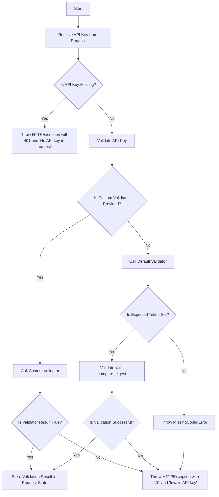
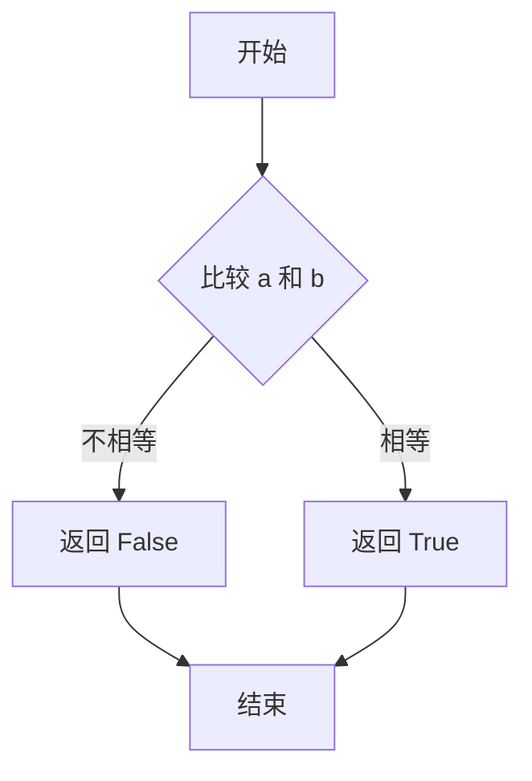
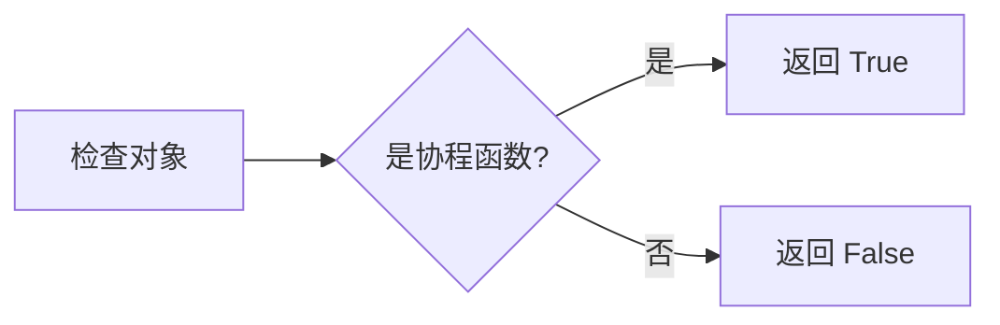
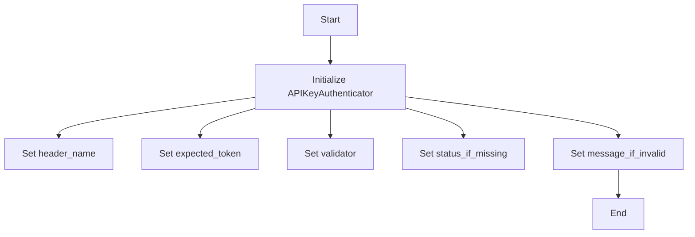
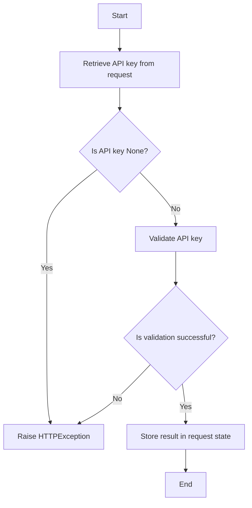
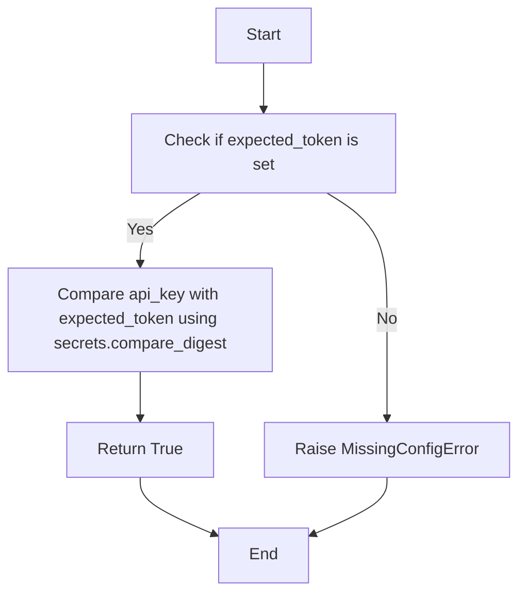

# `.\AutoGPT\autogpt_platform\backend\backend\api\utils\api_key_auth.py` 详细设计文档

The code provides a configurable API key authenticator for FastAPI applications, supporting custom validation functions for API key verification.

## 整体流程



## 类结构

```
APIKeyAuthenticator (Class)
├── header_name (str)
│   ├── expected_token (Optional[str])
│   ├── custom_validator (Optional[Callable])
│   ├── status_if_missing (int)
│   └── message_if_invalid (str)
└── super().__init__(name=header_name, scheme_name=f"{__class__.__name__}-{header_name}", auto_error=False)
```

## 全局变量及字段


### `logger`
    
Logger instance for the module.

类型：`logging.Logger`
    


### `HTTP_401_UNAUTHORIZED`
    
HTTP status code for unauthorized access.

类型：`int`
    


### `APIKeyAuthenticator`
    
The main class for API key authentication in FastAPI applications.

类型：`APIKeyAuthenticator`
    


### `header_name`
    
The name of the header containing the API key.

类型：`str`
    


### `expected_token`
    
The expected API key value for simple token matching.

类型：`Optional[str]`
    


### `custom_validator`
    
Custom validation function for API key validation.

类型：`Optional[Callable[[str], Any] | Callable[[str], Awaitable[Any]]]`
    


### `status_if_missing`
    
HTTP status code to use for validation errors.

类型：`int`
    


### `message_if_invalid`
    
Error message to return when validation fails.

类型：`str`
    


### `APIKeyAuthenticator.header_name`
    
The name of the header containing the API key.

类型：`str`
    


### `APIKeyAuthenticator.expected_token`
    
The expected API key value for simple token matching.

类型：`Optional[str]`
    


### `APIKeyAuthenticator.custom_validator`
    
Custom validation function for API key validation.

类型：`Optional[Callable[[str], Any] | Callable[[str], Awaitable[Any]]]`
    


### `APIKeyAuthenticator.status_if_missing`
    
HTTP status code to use for validation errors.

类型：`int`
    


### `APIKeyAuthenticator.message_if_invalid`
    
Error message to return when validation fails.

类型：`str`
    
    

## 全局函数及方法


### secrets.compare_digest

`secrets.compare_digest` 是一个用于安全比较字符串的函数。

参数：

- `a`：`str`，要比较的第一个字符串。
- `b`：`str`，要比较的第二个字符串。

参数描述：

- `a` 和 `b` 是要比较的两个字符串。

返回值：`bool`

返回值描述：

- 如果两个字符串相等，则返回 `True`；否则返回 `False`。

#### 流程图



#### 带注释源码

```
try:
    return secrets.compare_digest(api_key, self.expected_token)
except TypeError as e:
    # If value is not an ASCII string, compare_digest raises a TypeError
    logger.warning(f"{self.model.name} API key check failed: {e}")
    return False
```


### inspect.iscoroutinefunction

检查给定的对象是否是协程函数。

参数：

- `obj`：`Any`，要检查的对象。

返回值：`bool`，如果对象是协程函数，则返回 `True`，否则返回 `False`。

#### 流程图



#### 带注释源码

```python
def iscoroutinefunction(obj):
    """
    Check if the given object is a coroutine function.

    Args:
        obj: Any, the object to check.

    Returns:
        bool: True if the object is a coroutine function, False otherwise.
    """
    return inspect.iscoroutinefunction(obj)
```


### `APIKeyAuthenticator.__init__`

初始化 `APIKeyAuthenticator` 类。

参数：

- `header_name`：`str`，API密钥头部的名称。
- `expected_token`：`Optional[str]`，预期的API密钥值，用于简单的令牌匹配。
- `validator`：`Optional[Callable[[str], Any] | Callable[[str], Awaitable[Any]]]`，自定义验证函数，它接受一个API密钥字符串，并返回一个布尔值，表示该字符串是否是有效的API密钥。可以是异步的。
- `status_if_missing`：`int`，如果请求中缺少API密钥时使用的HTTP状态码。
- `message_if_invalid`：`str`，当验证失败时返回的错误消息。

返回值：无

#### 流程图

```mermaid
classDiagram
    APIKeyAuthenticator <|-- APIKeyHeader
    APIKeyAuthenticator {
        +header_name: str
        +expected_token: Optional[str]
        +custom_validator: Optional[Callable[[str], Any] | Callable[[str], Awaitable[Any]]]
        +status_if_missing: int
        +message_if_invalid: str
        +__init__(header_name: str, expected_token: Optional[str], validator: Optional[Callable[[str], Any] | Callable[[str], Awaitable[Any]]], status_if_missing: int, message_if_invalid: str)
        +__call__(request: Request): Any
        +default_validator(api_key: str): bool
    }
```

#### 带注释源码

```python
def __init__(
    self,
    header_name: str,
    expected_token: Optional[str] = None,
    validator: Optional[
        Callable[[str], Any] | Callable[[str], Awaitable[Any]]
    ] = None,
    status_if_missing: int = HTTP_401_UNAUTHORIZED,
    message_if_invalid: str = "Invalid API key",
):
    super().__init__(
        name=header_name,
        scheme_name=f"{__class__.__name__}-{header_name}",
        auto_error=False,
    )
    self.expected_token = expected_token
    self.custom_validator = validator
    self.status_if_missing = status_if_missing
    self.message_if_invalid = message_if_invalid
```


### APIKeyAuthenticator.__init__

This method initializes an instance of the `APIKeyAuthenticator` class, setting up the necessary configurations for API key authentication in a FastAPI application.

参数：

- `header_name`：`str`，The name of the header containing the API key. This is the name of the header that will be used to extract the API key from the incoming request.
- `expected_token`：`Optional[str]`，The expected API key value for simple token matching. This is the value that the API key in the request header should match for successful authentication.
- `validator`：`Optional[Callable[[str], Any] | Callable[[str], Awaitable[Any]]]`，Custom validation function that takes an API key string and returns a truthy value if and only if the passed string is a valid API key. This function can be asynchronous.
- `status_if_missing`：`int`，HTTP status code to use for validation errors. Defaults to `HTTP_401_UNAUTHORIZED`.
- `message_if_invalid`：`str`，Error message to return when validation fails. Defaults to "Invalid API key".

返回值：`None`，This method does not return a value; it initializes the object.

#### 流程图



#### 带注释源码

```python
def __init__(
    self,
    header_name: str,
    expected_token: Optional[str] = None,
    validator: Optional[
        Callable[[str], Any] | Callable[[str], Awaitable[Any]]
    ] = None,
    status_if_missing: int = HTTP_401_UNAUTHORIZED,
    message_if_invalid: str = "Invalid API key",
):
    super().__init__(
        name=header_name,
        scheme_name=f"{__class__.__name__}-{header_name}",
        auto_error=False,
    )
    self.expected_token = expected_token
    self.custom_validator = validator
    self.status_if_missing = status_if_missing
    self.message_if_invalid = message_if_invalid
```


### APIKeyAuthenticator.__call__

This method is an asynchronous coroutine that performs API key authentication on a given request. It retrieves the API key from the request headers, validates it using a custom validator or a default validator, and raises an HTTP exception if the validation fails.

参数：

- `request`：`Request`，The request object containing the headers to be authenticated.

返回值：`Any`，The result of the validation process, which can be a boolean, a custom object, or `None`.

#### 流程图



#### 带注释源码

```python
async def __call__(self, request: Request) -> Any:
    api_key = await super().__call__(request)
    if api_key is None:
        raise HTTPException(
            status_code=self.status_if_missing, detail="No API key in request"
        )

    # Use custom validation if provided, otherwise use default equality check
    validator = self.custom_validator or self.default_validator
    result = (
        await validator(api_key)
        if inspect.iscoroutinefunction(validator)
        else validator(api_key)
    )

    if not result:
        raise HTTPException(
            status_code=self.status_if_missing, detail=self.message_if_invalid
        )

    # Store validation result in request state if it's not just a boolean
    if result is not True:
        request.state.api_key = result

    return result
``` 


### APIKeyAuthenticator.default_validator

This method is the default validation function used by the `APIKeyAuthenticator` class when no custom validator is provided. It checks if the provided API key matches the expected token using `secrets.compare_digest` for security reasons.

参数：

- `api_key`：`str`，The API key provided in the request header.

返回值：`bool`，Returns `True` if the API key matches the expected token, otherwise `False`.

#### 流程图



#### 带注释源码

```
async def default_validator(self, api_key: str) -> bool:
    if not self.expected_token:
        raise MissingConfigError(
            f"{self.__class__.__name__}.expected_token is not set; "
            "either specify it or provide a custom validator"
        )
    try:
        return secrets.compare_digest(api_key, self.expected_token)
    except TypeError as e:
        # If value is not an ASCII string, compare_digest raises a TypeError
        logger.warning(f"{self.model.name} API key check failed: {e}")
        return False
```


## 关键组件


### 张量索引与惰性加载

支持对张量进行索引和惰性加载，以优化内存使用和提高性能。

### 反量化支持

提供反量化功能，允许在量化过程中对模型进行反向量化。

### 量化策略

实现多种量化策略，包括全精度到低精度转换，以及动态量化等。


## 问题及建议


### 已知问题

-   **依赖注入不足**：代码中直接使用了`secrets.compare_digest`和`logger.warning`，这些依赖没有通过依赖注入的方式提供，可能会影响代码的可测试性和可维护性。
-   **异常处理**：`MissingConfigError`异常在`default_validator`中抛出，但没有在类外部进行捕获和处理，这可能导致异常没有被正确处理。
-   **代码重复**：`default_validator`方法中存在重复的配置错误检查逻辑，这可以通过提取公共逻辑来避免。
-   **异步函数的返回值**：`default_validator`方法在`return`语句中返回`False`，但在`except`块中返回`False`，这可能导致异常处理逻辑与正常逻辑混淆。

### 优化建议

-   **依赖注入**：将`secrets`和`logger`通过构造函数注入，以便于测试和配置管理。
-   **异常处理**：在类外部捕获和处理`MissingConfigError`，确保异常被正确处理。
-   **代码重构**：将配置错误检查逻辑提取到一个单独的方法中，避免代码重复。
-   **异步函数的返回值**：确保`default_validator`方法在所有情况下都有明确的返回值，避免逻辑混淆。


## 其它


### 设计目标与约束

- 设计目标：
  - 提供一个灵活的API密钥认证器，支持自定义验证函数。
  - 确保API密钥验证的可靠性和安全性。
  - 与FastAPI框架无缝集成。
- 约束：
  - 必须支持简单的密钥匹配和自定义数据库验证。
  - 必须处理异常情况，如缺少配置或无效的API密钥。

### 错误处理与异常设计

- 错误处理：
  - 使用HTTP异常来处理认证失败的情况。
  - 对于自定义验证函数，如果返回False，则抛出HTTP异常。
- 异常设计：
  - `MissingConfigError`：当`.expected_token`未设置时抛出。
  - `HTTPException`：当API密钥缺失或无效时抛出。

### 数据流与状态机

- 数据流：
  - 请求到达FastAPI应用。
  - 应用调用`APIKeyAuthenticator`进行认证。
  - 如果API密钥缺失，抛出HTTP异常。
  - 如果API密钥有效，继续处理请求。
- 状态机：
  - 初始状态：请求未认证。
  - 认证成功：请求已认证。
  - 认证失败：请求被拒绝。

### 外部依赖与接口契约

- 外部依赖：
  - FastAPI框架。
  - Starlette框架。
  - `secrets`模块。
- 接口契约：
  - `APIKeyHeader`：FastAPI的API密钥头部认证器。
  - `Request`：FastAPI的请求对象。
  - `HTTPException`：FastAPI的HTTP异常。
  - `Callable`：Python的可调用对象类型。

    