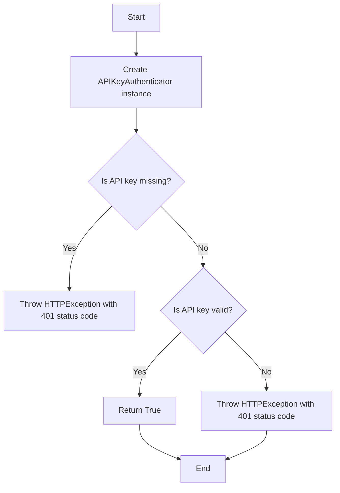
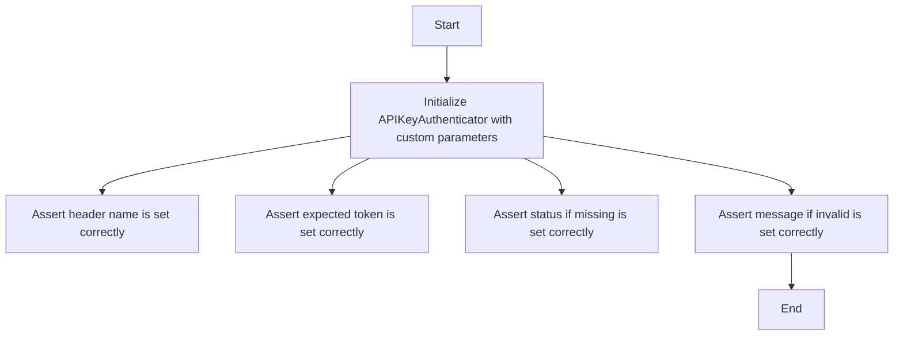
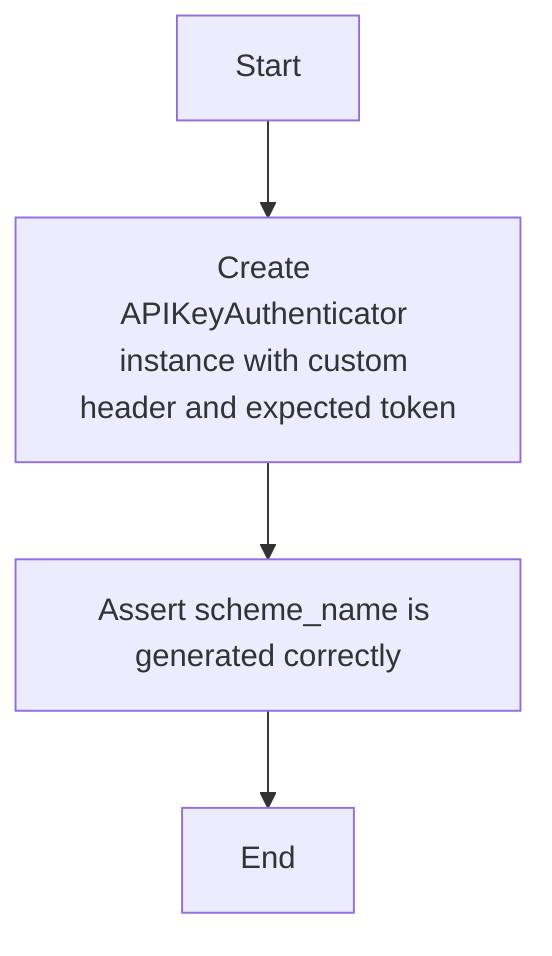
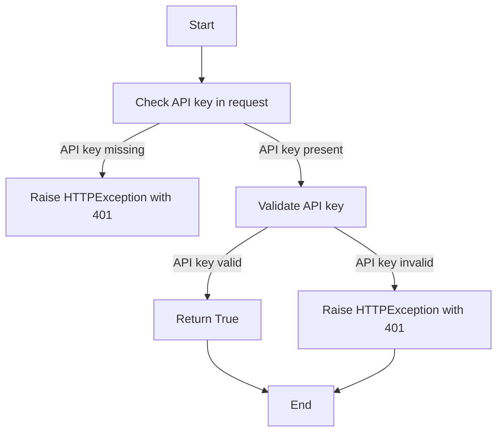
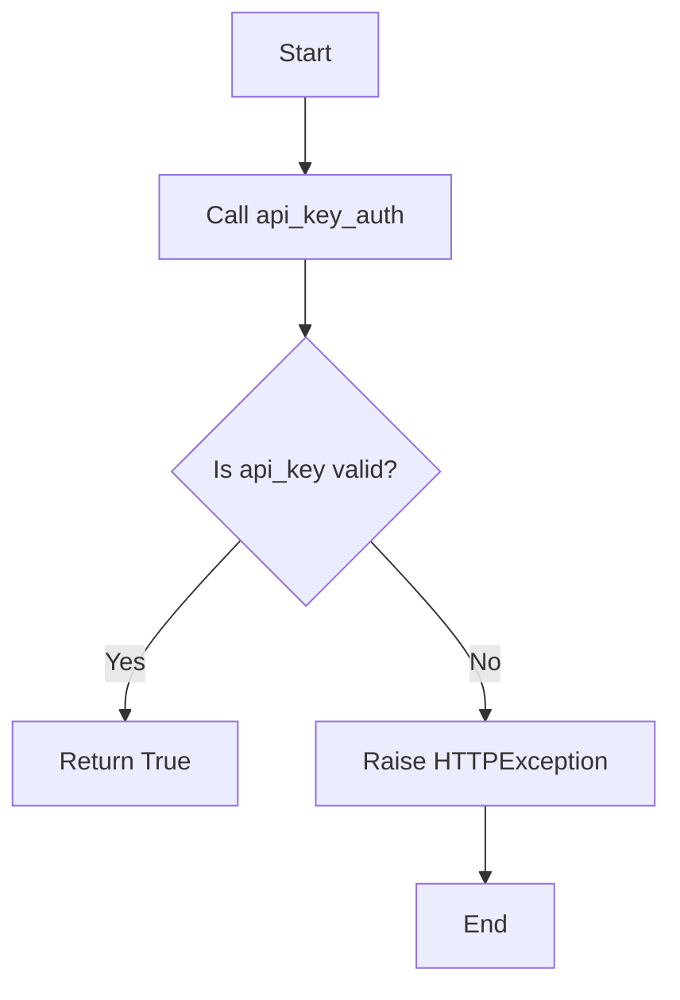
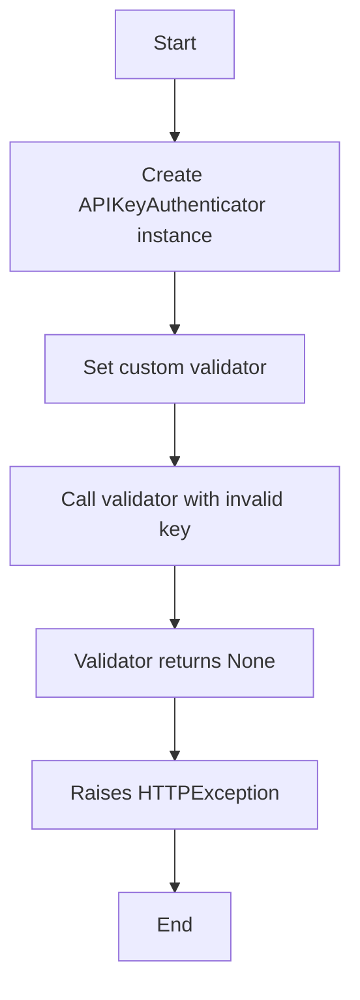
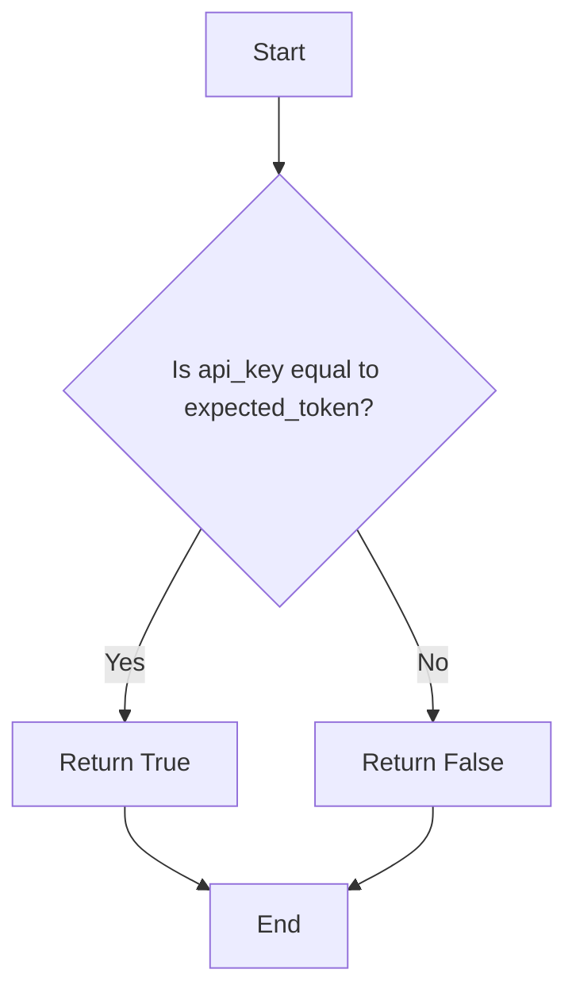
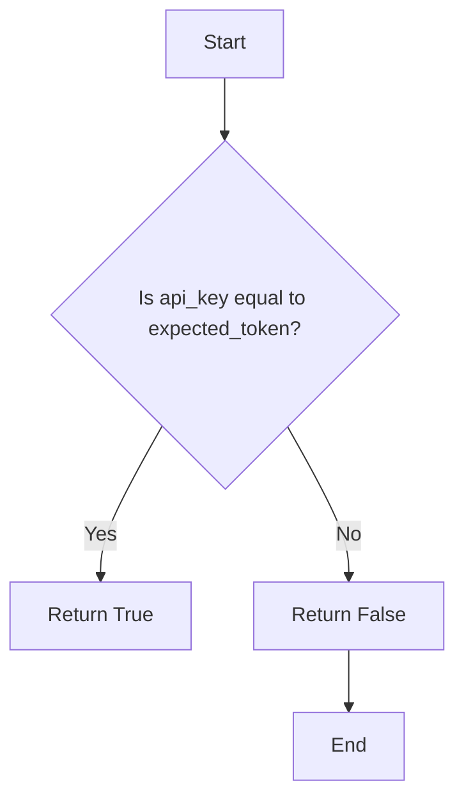
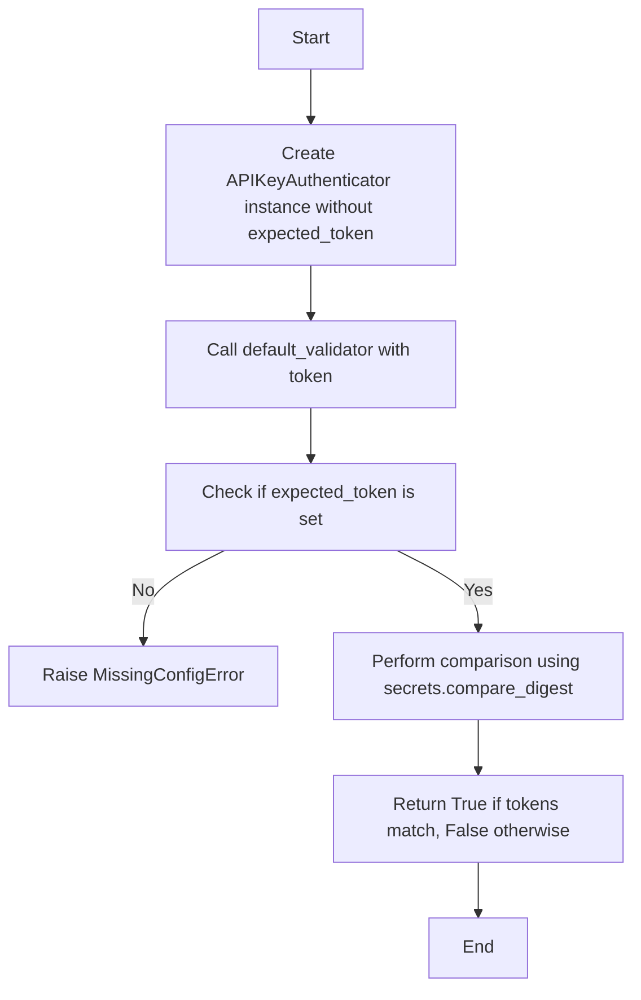

# `.\AutoGPT\autogpt_platform\backend\backend\api\utils\api_key_auth_test.py` 详细设计文档

This file contains unit tests for the APIKeyAuthenticator class, which is responsible for authenticating API requests using API keys.

## 整体流程



## 类结构

```
APIKeyAuthenticator (类)
├── __init__(header_name, expected_token, custom_validator, status_if_missing, message_if_invalid)
│   ├── model
│   ├── expected_token
│   ├── custom_validator
│   ├── status_if_missing
│   └── message_if_invalid
└── __call__(request)
```

## 全局变量及字段


### `model`
    
The name of the header that contains the API key.

类型：`str`
    


### `expected_token`
    
The expected value of the API key for successful authentication.

类型：`str`
    


### `custom_validator`
    
A custom validator function that checks the validity of the API key.

类型：`callable`
    


### `status_if_missing`
    
The HTTP status code to return if the API key is missing from the request.

类型：`int`
    


### `message_if_invalid`
    
The message to return if the API key is invalid.

类型：`str`
    


### `APIKeyAuthenticator.model`
    
The name of the header that contains the API key.

类型：`str`
    


### `APIKeyAuthenticator.expected_token`
    
The expected value of the API key for successful authentication.

类型：`str`
    


### `APIKeyAuthenticator.custom_validator`
    
A custom validator function that checks the validity of the API key.

类型：`callable`
    


### `APIKeyAuthenticator.status_if_missing`
    
The HTTP status code to return if the API key is missing from the request.

类型：`int`
    


### `APIKeyAuthenticator.message_if_invalid`
    
The message to return if the API key is invalid.

类型：`str`
    
    

## 全局函数及方法


### test_init_with_expected_token

This function tests the initialization of the `APIKeyAuthenticator` class with an expected token.

参数：

- `auth`：`APIKeyAuthenticator`，The instance of APIKeyAuthenticator to be tested.

返回值：`None`，This function does not return a value.

#### 流程图

```mermaid
graph TD
    A[Start] --> B[Create APIKeyAuthenticator instance with expected_token]
    B --> C[Assert auth.model.name == "X-API-Key"]
    B --> D[Assert auth.expected_token == "test-token"]
    B --> E[Assert auth.custom_validator is None]
    B --> F[Assert auth.status_if_missing == HTTP_401_UNAUTHORIZED]
    B --> G[Assert auth.message_if_invalid == "Invalid API key"]
    G --> H[End]
```

#### 带注释源码

```python
def test_init_with_expected_token():
    """Test initialization with expected token."""
    auth = APIKeyAuthenticator(header_name="X-API-Key", expected_token="test-token")

    assert auth.model.name == "X-API-Key"
    assert auth.expected_token == "test-token"
    assert auth.custom_validator is None
    assert auth.status_if_missing == HTTP_401_UNAUTHORIZED
    assert auth.message_if_invalid == "Invalid API key"
``` 


### test_init_with_custom_validator

This function tests the initialization of the `APIKeyAuthenticator` class with a custom validator.

参数：

- `validator`：`Callable[[str], bool]`，A custom validator function that takes an API key as input and returns a boolean indicating whether the key is valid.

返回值：`None`，This function does not return a value.

#### 流程图

```mermaid
graph TD
    A[Start] --> B[Initialize APIKeyAuthenticator with custom validator]
    B --> C[Assert model name is "Authorization"]
    B --> D[Assert expected_token is None]
    B --> E[Assert custom_validator is validator]
    B --> F[Assert status_if_missing is HTTP_401_UNAUTHORIZED]
    B --> G[Assert message_if_invalid is "Invalid API key"]
    G --> H[End]
```

#### 带注释源码

```python
def test_init_with_custom_validator():
    """Test initialization with custom validator."""

    def validator(key: str) -> bool:
        return True

    auth = APIKeyAuthenticator(header_name="Authorization", validator=validator)

    assert auth.model.name == "Authorization"
    assert auth.expected_token is None
    assert auth.custom_validator == validator
    assert auth.status_if_missing == HTTP_401_UNAUTHORIZED
    assert auth.message_if_invalid == "Invalid API key"
```


### test_init_with_custom_parameters

This function tests the initialization of the `APIKeyAuthenticator` class with custom parameters, including the header name, expected token, status code if the key is missing, and the message if the key is invalid.

参数：

- `auth`: `APIKeyAuthenticator`，The `APIKeyAuthenticator` instance to be tested.
- `mock_request`: `Mock`, A mock request object used to simulate a request with custom headers.

返回值：`None`，This function does not return a value.

#### 流程图



#### 带注释源码

```python
def test_init_with_custom_parameters():
    """Test initialization with custom status and message."""
    auth = APIKeyAuthenticator(
        header_name="X-Custom-Key",
        expected_token="token",
        status_if_missing=HTTP_403_FORBIDDEN,
        message_if_invalid="Access denied",
    )

    assert auth.model.name == "X-Custom-Key"
    assert auth.expected_token == "token"
    assert auth.status_if_missing == HTTP_403_FORBIDDEN
    assert auth.message_if_invalid == "Access denied"
```


### test_scheme_name_generation

This function tests that the `scheme_name` is generated correctly for an `APIKeyAuthenticator` instance.

参数：

- `auth`：`APIKeyAuthenticator`，The `APIKeyAuthenticator` instance to test.

返回值：`None`，No return value.

#### 流程图



#### 带注释源码

```python
def test_scheme_name_generation():
    """Test that scheme_name is generated correctly."""
    auth = APIKeyAuthenticator(header_name="X-Custom-Header", expected_token="token")

    assert auth.scheme_name == "APIKeyAuthenticator-X-Custom-Header"
``` 


### test_api_key_missing

This function tests the behavior of the `APIKeyAuthenticator` class when the API key is missing from the request.

参数：

- `api_key_auth`：`APIKeyAuthenticator`，An instance of the `APIKeyAuthenticator` class with a custom validator.
- `mock_request`：`Mock`，A mock request object used to simulate an API request.

返回值：`None`，This function does not return a value.

#### 流程图



#### 带注释源码

```python
@pytest.mark.asyncio
async def test_api_key_missing(api_key_auth, mock_request):
    """Test behavior when API key is missing from request."""
    # Mock the parent class method to return None (no API key)
    with pytest.raises(HTTPException) as exc_info:
        await api_key_auth(mock_request)

    assert exc_info.value.status_code == HTTP_401_UNAUTHORIZED
    assert exc_info.value.detail == "No API key in request"
```


### test_api_key_valid

This function tests the behavior of the `APIKeyAuthenticator` class when an invalid API key is provided.

参数：

- `api_key_auth`: `APIKeyAuthenticator`，An instance of the `APIKeyAuthenticator` class to be tested.
- `mock_request`: `Mock`, A mock request object to simulate the incoming request.

返回值：`None`，No return value, the function raises an `HTTPException` if the API key is invalid.

#### 流程图



#### 带注释源码

```python
@pytest.mark.asyncio
async def test_api_key_invalid(api_key_auth, mock_request):
    """Test behavior with invalid API key."""
    # Mock the parent class to return an invalid API key
    with patch.object(
        api_key_auth.__class__.__bases__[0], "__call__", return_value="invalid-token"
    ):
        with pytest.raises(HTTPException) as exc_info:
            await api_key_auth(mock_request)

    assert exc_info.value.status_code == HTTP_401_UNAUTHORIZED
    assert exc_info.value.detail == "Invalid API key"
```


### test_api_key_invalid

This function tests the behavior of the APIKeyAuthenticator class when an invalid API key is provided in the request.

参数：

- `api_key_auth`：`APIKeyAuthenticator`，An instance of the APIKeyAuthenticator class with a predefined expected token.
- `mock_request`：`Mock`，A mock request object used to simulate an incoming request.

返回值：`None`，This function does not return a value.

#### 流程图

```mermaid
graph TD
    A[Start] --> B[Create APIKeyAuthenticator instance]
    B --> C[Mock request object]
    C --> D[Set invalid API key in request]
    D --> E[Call APIKeyAuthenticator with mock request]
    E --> F[Check if HTTPException is raised]
    F --> G[Assert status code is 401]
    G --> H[Assert detail is "Invalid API key"]
    H --> I[End]
```

#### 带注释源码

```python
@pytest.mark.asyncio
async def test_api_key_invalid(api_key_auth, mock_request):
    """Test behavior with invalid API key."""
    # Mock the parent class to return an invalid API key
    with patch.object(
        api_key_auth.__class__.__bases__[0], "__call__", return_value="invalid-token"
    ):
        with pytest.raises(HTTPException) as exc_info:
            await api_key_auth(mock_request)

    assert exc_info.value.status_code == HTTP_401_UNAUTHORIZED
    assert exc_info.value.detail == "Invalid API key"
```


### test_custom_status_and_message

This function tests the behavior of the `APIKeyAuthenticator` class when custom status codes and messages are provided.

参数：

- `mock_request`：`Mock(spec=Request)`，A mock request object used to simulate API requests.
- `api_key_auth`：`APIKeyAuthenticator`，An instance of `APIKeyAuthenticator` with custom status and message settings.

返回值：`None`，This function does not return a value.

#### 流程图

```mermaid
graph TD
    A[Start] --> B[Create APIKeyAuthenticator with custom status and message]
    B --> C[Attempt to authenticate with missing API key]
    C --> D[Raises HTTPException with status code 403 and message "No API key in request"]
    C --> E[Attempt to authenticate with invalid API key]
    E --> F[Raises HTTPException with status code 403 and message "Access forbidden"]
```

#### 带注释源码

```python
@pytest.mark.asyncio
async def test_custom_status_and_message(mock_request):
    """Test custom status code and message."""
    auth = APIKeyAuthenticator(
        header_name="X-API-Key",
        expected_token="valid-token",
        status_if_missing=HTTP_403_FORBIDDEN,
        message_if_invalid="Access forbidden",
    )

    # Test missing key
    with pytest.raises(HTTPException) as exc_info:
        await auth(mock_request)

    assert exc_info.value.status_code == HTTP_403_FORBIDDEN
    assert exc_info.value.detail == "No API key in request"

    # Test invalid key
    with patch.object(
        auth.__class__.__bases__[0], "__call__", return_value="invalid-token"
    ):
        with pytest.raises(HTTPException) as exc_info:
            await auth(mock_request)

    assert exc_info.value.status_code == HTTP_403_FORBIDDEN
    assert exc_info.value.detail == "Access forbidden"
```


### test_custom_sync_validator

This function tests the behavior of the `APIKeyAuthenticator` class when using a custom synchronous validator.

参数：

- `api_key_auth_custom_validator`：`APIKeyAuthenticator`，An instance of `APIKeyAuthenticator` with a custom synchronous validator.
- `mock_request`：`Mock`，A mock request object used to simulate an API request.

返回值：`None`，This function does not return a value.

#### 流程图

```mermaid
graph TD
    A[Start] --> B[Create APIKeyAuthenticator instance with custom validator]
    B --> C[Mock parent class __call__ to return "custom-valid-key"]
    C --> D[Call api_key_auth_custom_validator with mock_request]
    D --> E[Assert result is True]
    E --> F[End]
```

#### 带注释源码

```python
@pytest.mark.asyncio
async def test_custom_sync_validator(api_key_auth_custom_validator, mock_request):
    """Test with custom synchronous validator."""
    # Mock the parent class to return the API key
    with patch.object(
        api_key_auth_custom_validator.__class__.__bases__[0],
        "__call__",
        return_value="custom-valid-key",
    ):
        result = await api_key_auth_custom_validator(mock_request)

    assert result is True
```


### test_custom_sync_validator_invalid

This function tests the behavior of the `APIKeyAuthenticator` class when a custom synchronous validator is provided and the API key is invalid.

参数：

- `api_key_auth_custom_validator`：`APIKeyAuthenticator`，An instance of `APIKeyAuthenticator` with a custom synchronous validator.
- `mock_request`：`Mock`，A mock request object used to simulate an API request.

返回值：`None`，This function raises an `HTTPException` with a status code of `HTTP_401_UNAUTHORIZED` and a detail message "Invalid API key".

#### 流程图

```mermaid
graph TD
    A[Start] --> B[Call api_key_auth_custom_validator(mock_request)]
    B --> C[Check if __call__ returns "invalid-key"]
    C -->|Yes| D[Raises HTTPException with status code 401 and detail "Invalid API key"]
    C -->|No| E[End]
    D --> F[End]
```

#### 带注释源码

```python
@pytest.mark.asyncio
async def test_custom_sync_validator_invalid(api_key_auth_custom_validator, mock_request):
    with patch.object(
        api_key_auth_custom_validator.__class__.__bases__[0],
        "__call__",
        return_value="invalid-key",
    ):
        with pytest.raises(HTTPException) as exc_info:
            await api_key_auth_custom_validator(mock_request)

    assert exc_info.value.status_code == HTTP_401_UNAUTHORIZED
    assert exc_info.value.detail == "Invalid API key"
```


### test_custom_async_validator

This function tests the behavior of the `APIKeyAuthenticator` class when using a custom asynchronous validator.

参数：

- `api_key_auth_async_validator`：`APIKeyAuthenticator`，An instance of `APIKeyAuthenticator` with a custom asynchronous validator.
- `mock_request`：`Mock`，A mock request object used to simulate an API request.

返回值：`None`，This function does not return a value.

#### 流程图

```mermaid
graph TD
    A[Start] --> B[Create APIKeyAuthenticator instance with async validator]
    B --> C[Mock APIKeyAuthenticator to return "async-valid-key"]
    C --> D[Call APIKeyAuthenticator with mock_request]
    D --> E[Assert result is True]
    E --> F[End]
```

#### 带注释源码

```python
@pytest.mark.asyncio
async def test_custom_async_validator(api_key_auth_async_validator, mock_request):
    """Test with custom async validator."""
    with patch.object(
        api_key_auth_async_validator.__class__.__bases__[0],
        "__call__",
        return_value="async-valid-key",
    ):
        result = await api_key_auth_async_validator(mock_request)
        assert result is True
```


### test_custom_async_validator_invalid

This function tests the behavior of the `APIKeyAuthenticator` class when using a custom asynchronous validator with an invalid API key.

参数：

- `api_key_auth_async_validator`：`APIKeyAuthenticator`，An instance of `APIKeyAuthenticator` with a custom asynchronous validator.
- `mock_request`：`Mock`，A mock request object used to simulate an API request.

返回值：`None`，This function does not return a value.

#### 流程图

```mermaid
graph TD
    A[Start] --> B[Create APIKeyAuthenticator instance with custom async validator]
    B --> C[Create mock request object]
    C --> D[Set invalid API key in mock request]
    D --> E[Call APIKeyAuthenticator with mock request]
    E --> F[Check if HTTPException is raised]
    F --> G[Assert HTTP status code is 401]
    G --> H[Assert error detail is "Invalid API key"]
    H --> I[End]
```

#### 带注释源码

```python
@pytest.mark.asyncio
async def test_custom_async_validator_invalid(
    api_key_auth_async_validator, mock_request
):
    """Test custom async validator with invalid key."""
    with patch.object(
        api_key_auth_async_validator.__class__.__bases__[0],
        "__call__",
        return_value="invalid-key",
    ):
        with pytest.raises(HTTPException) as exc_info:
            await api_key_auth_async_validator(mock_request)

    assert exc_info.value.status_code == HTTP_401_UNAUTHORIZED
    assert exc_info.value.detail == "Invalid API key"
```


### test_validator_returns_object

This function tests the behavior of the `APIKeyAuthenticator` class when the validator returns an object instead of a boolean.

参数：

- `api_key_auth_object_validator`：`APIKeyAuthenticator`，An instance of `APIKeyAuthenticator` with a custom validator that returns an object.
- `mock_request`：`Mock`，A mock request object used to simulate an API request.

返回值：`None`，This test does not return any value.

#### 流程图

```mermaid
graph TD
    A[Start] --> B[Create APIKeyAuthenticator instance]
    B --> C[Set custom validator to return object]
    C --> D[Mock __call__ method to return "user-key"]
    D --> E[Call APIKeyAuthenticator with mock_request]
    E --> F[Assert result is {"user_id": "123", "permissions": ["read", "write"]}]
    F --> G[Assert mock_request.state.api_key is {"user_id": "123", "permissions": ["read", "write"]}]
    G --> H[End]
```

#### 带注释源码

```python
@pytest.mark.asyncio
async def test_validator_returns_object(api_key_auth_object_validator, mock_request):
    """Test validator that returns an object instead of boolean."""
    with patch.object(
        api_key_auth_object_validator.__class__.__bases__[0],
        "__call__",
        return_value="user-key",
    ):
        result = await api_key_auth_object_validator(mock_request)

        expected_result = {"user_id": "123", "permissions": ["read", "write"]}
        assert result == expected_result
        # Verify the object is stored in request state
        assert mock_request.state.api_key == expected_result
``` 


### test_validator_returns_none

This test checks the behavior of the validator when it returns `None`.

参数：

- `api_key_auth_object_validator`：`APIKeyAuthenticator`，An instance of `APIKeyAuthenticator` with a custom validator that returns an object or `None`.
- `mock_request`：`Mock`，A mock request object used to simulate an API request.

返回值：`None`，No return value is specified for this test.

#### 流程图



#### 带注释源码

```python
@pytest.mark.asyncio
async def test_validator_returns_none(api_key_auth_object_validator, mock_request):
    """Test validator that returns None (falsy)."""
    with patch.object(
        api_key_auth_object_validator.__class__.__bases__[0],
        "__call__",
        return_value="invalid-key",
    ):
        with pytest.raises(HTTPException) as exc_info:
            await api_key_auth_object_validator(mock_request)

    assert exc_info.value.status_code == HTTP_401_UNAUTHORIZED
    assert exc_info.value.detail == "Invalid API key"
```


### test_validator_database_lookup_simulation

This function tests the behavior of the `APIKeyAuthenticator` class when using a database lookup validator.

参数：

- `mock_request`：`Mock(spec=Request)`，A mock request object used to simulate a request with an API key.
- `valid_api_keys`：`dict`，A dictionary containing valid API keys and their corresponding user information.
- `db_validator`：`async def(api_key: str) -> Optional[dict]`，An asynchronous function that simulates a database lookup for API keys.
- `auth`：`APIKeyAuthenticator`，An instance of `APIKeyAuthenticator` with the database lookup validator.

返回值：`None`，This function does not return a value.

#### 流程图

```mermaid
graph TD
    A[Start] --> B[Create APIKeyAuthenticator with db_validator]
    B --> C[Set mock_request]
    C --> D[Call auth(mock_request)]
    D --> E[Check if api_key is "key123"]
    E -->|Yes| F[Check if user is active]
    F -->|Yes| G[Store user info in mock_request.state.api_key]
    F -->|No| H[Raise HTTPException with status code 401]
    E -->|No| I[Check if api_key is "key456"]
    I -->|Yes| J[Check if user is active]
    J -->|No| H
    I -->|No| K[Check if api_key is "nonexistent"]
    K -->|Yes| H
    H --> L[End]
```

#### 带注释源码

```python
@pytest.mark.asyncio
async def test_validator_database_lookup_simulation(mock_request):
    """Test simulation of database lookup validator."""
    # Simulate database records
    valid_api_keys = {
        "key123": {"user_id": "user1", "active": True},
        "key456": {"user_id": "user2", "active": False},
    }

    async def db_validator(api_key: str):
        record = valid_api_keys.get(api_key)
        return record if record and record["active"] else None

    auth = APIKeyAuthenticator(header_name="X-API-Key", validator=db_validator)

    # Test valid active key
    with patch.object(auth.__class__.__bases__[0], "__call__", return_value="key123"):
        result = await auth(mock_request)
        assert result == {"user_id": "user1", "active": True}
        assert mock_request.state.api_key == {"user_id": "user1", "active": True}

    # Test inactive key
    mock_request.state = Mock()  # Reset state
    with patch.object(auth.__class__.__bases__[0], "__call__", return_value="key456"):
        with pytest.raises(HTTPException):
            await auth(mock_request)

    # Test non-existent key
    with patch.object(
        auth.__class__.__bases__[0], "__call__", return_value="nonexistent"
    ):
        with pytest.raises(HTTPException):
            await auth(mock_request)
```


### test_default_validator_key_valid

This function tests the default validator of the APIKeyAuthenticator class to ensure it correctly validates the API key against the expected token.

参数：

- `api_key`: `str`，The API key to be validated.
- ...

返回值：`bool`，Indicates whether the API key is valid or not.

#### 流程图



#### 带注释源码

```python
@pytest.mark.asyncio
async def test_default_validator_key_valid(api_key_auth):
    """
    Test default validator with valid token.
    """
    result = await api_key_auth.default_validator("test-secret-token")
    assert result is True
``` 


### test_default_validator_key_invalid

This function tests the default validator of the `APIKeyAuthenticator` class to ensure it correctly validates the API key against the expected token.

参数：

- `api_key`: `str`，The API key to be validated.
- ...

返回值：`bool`，Indicates whether the API key is valid or not.

#### 流程图



#### 带注释源码

```python
@pytest.mark.asyncio
async def test_default_validator_key_invalid(api_key_auth):
    """
    Test default validator with invalid token.
    """
    result = await api_key_auth.default_validator("wrong-token")
    assert result is False
```


### test_default_validator_missing_expected_token

This function tests the behavior of the default validator when the `expected_token` is not set in the `APIKeyAuthenticator` class.

参数：

- `auth`：`APIKeyAuthenticator`，The `APIKeyAuthenticator` instance to be tested.
- `token`：`str`，The token to be validated.

返回值：`None`，No return value.

#### 流程图



#### 带注释源码

```python
@pytest.mark.asyncio
async def test_default_validator_missing_expected_token():
    """Test default validator when expected_token is not set."""
    auth = APIKeyAuthenticator(header_name="X-API-Key")

    with pytest.raises(MissingConfigError) as exc_info:
        await auth.default_validator("any-token")

    assert "expected_token is not set" in str(exc_info.value)
    assert "either specify it or provide a custom validator" in str(exc_info.value)
```


### test_default_validator_uses_constant_time_comparison

This function tests that the default validator of the APIKeyAuthenticator class uses `secrets.compare_digest` for timing attack protection.

参数：

- `api_key_auth`：`APIKeyAuthenticator`，An instance of APIKeyAuthenticator to be tested.

返回值：`None`，This function does not return any value.

#### 流程图

```mermaid
graph TD
    A[Start] --> B[Mock secrets.compare_digest]
    B --> C[Call api_key_auth.default_validator("test-token")]
    C --> D[Assert secrets.compare_digest was called once]
    D --> E[End]
```

#### 带注释源码

```python
@pytest.mark.asyncio
async def test_default_validator_uses_constant_time_comparison(api_key_auth):
    """
    Test that default validator uses secrets.compare_digest for timing attack protection
    """
    with patch("secrets.compare_digest") as mock_compare:
        mock_compare.return_value = True

        await api_key_auth.default_validator("test-token")

        mock_compare.assert_called_once_with("test-token", "test-secret-token")
``` 


### test_api_key_empty

This function tests the behavior of the APIKeyAuthenticator class when an empty string is provided as the API key.

参数：

- `mock_request`：`Mock(spec=Request)`，A mock request object used to simulate a request with an empty API key.

返回值：`None`，This function does not return a value.

#### 流程图

```mermaid
graph TD
    A[Start] --> B[Create APIKeyAuthenticator instance]
    B --> C[Set API key to empty string]
    C --> D[Call APIKeyAuthenticator with mock_request]
    D --> E[Check if API key is empty]
    E --> F[If empty, raise HTTPException with status code 401 and detail "Invalid API key"]
    F --> G[End]
```

#### 带注释源码

```python
@pytest.mark.asyncio
async def test_api_key_empty(mock_request):
    """Test behavior with empty string API key."""
    auth = APIKeyAuthenticator(header_name="X-API-Key", expected_token="valid-token")

    with patch.object(auth.__class__.__bases__[0], "__call__", return_value=""):
        with pytest.raises(HTTPException) as exc_info:
            await auth(mock_request)

        assert exc_info.value.status_code == HTTP_401_UNAUTHORIZED
        assert exc_info.value.detail == "Invalid API key"
``` 


### test_api_key_whitespace_only

This function tests the behavior of the APIKeyAuthenticator class when an API key with only whitespace characters is provided.

参数：

- `mock_request`：`Mock(spec=Request)`，A mock request object used to simulate an API request.

返回值：`None`，This function does not return any value.

#### 流程图

```mermaid
graph TD
    A[Start] --> B[Create APIKeyAuthenticator instance]
    B --> C[Set API key with only whitespace characters]
    C --> D[Call APIKeyAuthenticator with mock_request]
    D --> E[Check if HTTPException is raised]
    E --> F[End]
```

#### 带注释源码

```python
@pytest.mark.asyncio
async def test_api_key_whitespace_only(mock_request):
    """Test behavior with whitespace-only API key."""
    auth = APIKeyAuthenticator(header_name="X-API-Key", expected_token="valid-token")

    with patch.object(
        auth.__class__.__bases__[0], "__call__", return_value="   \t\n  "
    ):
        with pytest.raises(HTTPException) as exc_info:
            await auth(mock_request)

        assert exc_info.value.status_code == HTTP_401_UNAUTHORIZED
        assert exc_info.value.detail == "Invalid API key"
```


### test_api_key_very_long

This function tests the behavior of the APIKeyAuthenticator class when an extremely long API key is provided, which is used to simulate potential denial-of-service (DoS) protection.

参数：

- `mock_request`：`Mock(spec=Request)`，A mock request object used to simulate an API request.

返回值：`None`，This test does not return any value.

#### 流程图

```mermaid
graph TD
    A[Start] --> B[Create APIKeyAuthenticator instance]
    B --> C[Set long API key]
    C --> D[Call APIKeyAuthenticator with mock_request]
    D --> E[Check for HTTPException]
    E --> F[Assert status code is 401]
    F --> G[End]
```

#### 带注释源码

```python
@pytest.mark.asyncio
async def test_api_key_very_long(mock_request):
    """Test behavior with extremely long API key (potential DoS protection)."""
    auth = APIKeyAuthenticator(header_name="X-API-Key", expected_token="valid-token")

    # Create a very long API key (10MB)
    long_api_key = "a" * (10 * 1024 * 1024)

    with patch.object(
        auth.__class__.__bases__[0], "__call__", return_value=long_api_key
    ):
        with pytest.raises(HTTPException) as exc_info:
            await auth(mock_request)

        assert exc_info.value.status_code == HTTP_401_UNAUTHORIZED
        assert exc_info.value.detail == "Invalid API key"
``` 


### test_api_key_with_null_bytes

This function tests the behavior of the APIKeyAuthenticator class when an API key containing null bytes is provided.

参数：

- `mock_request`：`Mock(spec=Request)`，A mock request object used to simulate an API request.
- `auth`：`APIKeyAuthenticator`，An instance of the APIKeyAuthenticator class with a predefined expected token.
- `api_key_with_null`：`str`，A string representing an API key containing null bytes.

返回值：`None`，This function does not return a value.

#### 流程图

```mermaid
graph TD
    A[Start] --> B[Create APIKeyAuthenticator instance]
    B --> C[Set expected token]
    C --> D[Set API key with null bytes]
    D --> E[Call APIKeyAuthenticator with mock request]
    E --> F[Check for HTTPException]
    F --> G[Assert status code is 401]
    G --> H[Assert detail is "Invalid API key"]
    H --> I[End]
```

#### 带注释源码

```python
@pytest.mark.asyncio
async def test_api_key_with_null_bytes(mock_request, auth):
    """Test behavior with API key containing null bytes."""
    auth = APIKeyAuthenticator(header_name="X-API-Key", expected_token="valid-token")

    api_key_with_null = "valid\x00token"

    with patch.object(
        auth.__class__.__bases__[0], "__call__", return_value=api_key_with_null
    ):
        with pytest.raises(HTTPException) as exc_info:
            await auth(mock_request)

        assert exc_info.value.status_code == HTTP_401_UNAUTHORIZED
        assert exc_info.value.detail == "Invalid API key"
``` 


### test_api_key_with_control_characters

This function tests the behavior of the APIKeyAuthenticator class when an API key containing control characters is provided.

参数：

- `mock_request`：`Mock(spec=Request)`，A mock request object used to simulate an API request.
- `auth`：`APIKeyAuthenticator`，An instance of the APIKeyAuthenticator class with a predefined expected token.
- `api_key_with_control`：`str`，An API key containing control characters.

返回值：`None`，This function does not return a value.

#### 流程图

```mermaid
graph TD
    A[Start] --> B[Create APIKeyAuthenticator instance]
    B --> C[Set API key with control characters]
    C --> D[Attempt to authenticate with the API key]
    D --> E[Check if the API key is invalid]
    E --> F[Throw HTTPException with status code 401 and detail "Invalid API key"]
    F --> G[End]
```

#### 带注释源码

```python
@pytest.mark.asyncio
async def test_api_key_with_control_characters(mock_request, auth):
    """Test behavior with API key containing control characters."""
    auth = APIKeyAuthenticator(header_name="X-API-Key", expected_token="valid-token")
    # API key with various control characters
    api_key_with_control = "valid\r\n\t\x1b[31mtoken"
    with patch.object(
        auth.__class__.__bases__[0], "__call__", return_value=api_key_with_control
    ):
        with pytest.raises(HTTPException) as exc_info:
            await auth(mock_request)
        assert exc_info.value.status_code == HTTP_401_UNAUTHORIZED
        assert exc_info.value.detail == "Invalid API key"
```


### test_api_key_with_unicode_characters

This function tests the behavior of the APIKeyAuthenticator class when a Unicode character is present in the API key.

参数：

- `mock_request`：`Mock(spec=Request)`，A mock request object used to simulate an API request.
- `api_key_auth`：`APIKeyAuthenticator`，An instance of the APIKeyAuthenticator class with a predefined expected token.

返回值：`None`，This function does not return a value.

#### 流程图

```mermaid
graph TD
    A[Start] --> B[Create APIKeyAuthenticator instance]
    B --> C[Set Unicode API key]
    C --> D[Call APIKeyAuthenticator with mock request]
    D --> E[Check if API key is valid]
    E -->|Yes| F[End]
    E -->|No| G[ Raise HTTPException ]
    G --> H[End]
```

#### 带注释源码

```python
@pytest.mark.asyncio
async def test_api_key_with_unicode_characters(mock_request, api_key_auth):
    """Test behavior with Unicode characters in API key."""
    auth = APIKeyAuthenticator(header_name="X-API-Key", expected_token="valid-token")

    # API key with Unicode characters
    unicode_api_key = "validтокен🔑"

    with patch.object(
        auth.__class__.__bases__[0], "__call__", return_value=unicode_api_key
    ):
        with pytest.raises(HTTPException) as exc_info:
            await auth(mock_request)

        assert exc_info.value.status_code == HTTP_401_UNAUTHORIZED
        assert exc_info.value.detail == "Invalid API key"
``` 


### test_api_key_with_unicode_characters_normalization_attack

This function tests that Unicode normalization doesn't bypass API key validation.

参数：

- `mock_request`：`Mock(spec=Request)`，A mock request object used to simulate an API request.

返回值：`None`，This function raises an `HTTPException` with a status code of `HTTP_401_UNAUTHORIZED` and a detail message "Invalid API key" if the API key is not valid.

#### 流程图

```mermaid
graph TD
    A[Start] --> B[Create APIKeyAuthenticator instance]
    B --> C[Set expected_token to "café"]
    C --> D[Set __call__ to return "cafe\u0301"]
    D --> E[Call APIKeyAuthenticator with mock_request]
    E --> F[Check if __call__ returns "cafe\u0301"]
    F --> G[If true, raise HTTPException with status code 401 and detail "Invalid API key"]
    G --> H[End]
```

#### 带注释源码

```python
@pytest.mark.asyncio
async def test_api_key_with_unicode_characters_normalization_attack(mock_request):
    """Test that Unicode normalization doesn't bypass validation."""
    # Create auth with composed Unicode character
    auth = APIKeyAuthenticator(
        header_name="X-API-Key", expected_token="café"  # é is composed
    )

    # Try with decomposed version (c + a + f + e + ´)
    decomposed_key = "cafe\u0301"  # é as combining character

    with patch.object(
        auth.__class__.__bases__[0], "__call__", return_value=decomposed_key
    ):
        # Should fail because secrets.compare_digest doesn't normalize
        with pytest.raises(HTTPException) as exc_info:
            await auth(mock_request)

        assert exc_info.value.status_code == HTTP_401_UNAUTHORIZED
        assert exc_info.value.detail == "Invalid API key"
``` 


### test_api_key_with_binary_data

This function tests the behavior of the APIKeyAuthenticator class when presented with binary data in the API key.

参数：

- `mock_request`：`Mock(spec=Request)`，A mock request object used to simulate an API request.
- `api_key_auth`：`APIKeyAuthenticator`，An instance of the APIKeyAuthenticator class with a predefined expected token.
- `binary_api_key`：`str`，A string representation of binary data that might cause encoding issues.

返回值：`None`，This test does not return any value.

#### 流程图

```mermaid
graph TD
    A[Start] --> B[Create APIKeyAuthenticator instance]
    B --> C[Set binary_api_key to APIKeyAuthenticator]
    C --> D[Attempt to authenticate mock_request with APIKeyAuthenticator]
    D --> E[Check if authentication fails]
    E --> F[End]
```

#### 带注释源码

```python
@pytest.mark.asyncio
async def test_api_key_with_binary_data(mock_request, api_key_auth):
    """Test behavior with binary data in API key."""
    auth = APIKeyAuthenticator(header_name="X-API-Key", expected_token="valid-token")

    # Binary data that might cause encoding issues
    binary_api_key = bytes([0xFF, 0xFE, 0xFD, 0xFC, 0x80, 0x81]).decode(
        "latin1", errors="ignore"
    )

    with patch.object(
        auth.__class__.__bases__[0], "__call__", return_value=binary_api_key
    ):
        with pytest.raises(HTTPException) as exc_info:
            await auth(mock_request)

        assert exc_info.value.status_code == HTTP_401_UNAUTHORIZED
        assert exc_info.value.detail == "Invalid API key"
```


### test_api_key_with_regex_dos_attack_pattern

This function tests the behavior of the APIKeyAuthenticator class when presented with an API key that contains a pattern that could potentially cause a Denial of Service (DoS) attack due to regex processing.

参数：

- `mock_request`：`Mock(spec=Request)`，A mock request object used to simulate an API request.
- `api_key_auth`：`APIKeyAuthenticator`，An instance of the APIKeyAuthenticator class with a predefined expected token.

返回值：`None`，This function raises an HTTPException with a status code of 401 (Unauthorized) and a detail message "Invalid API key" if the API key is invalid.

#### 流程图

```mermaid
graph TD
    A[Start] --> B[Create APIKeyAuthenticator instance]
    B --> C[Set API key to a regex DoS attack pattern]
    C --> D[Attempt to authenticate with the API key]
    D --> E[Check if the API key is valid]
    E -->|Yes| F[Authentication successful]
    E -->|No| G[HTTPException with status 401 and message "Invalid API key"]
    G --> H[End]
    F --> H
```

#### 带注释源码

```python
@pytest.mark.asyncio
async def test_api_key_with_regex_dos_attack_pattern(mock_request, api_key_auth):
    """Test behavior with API key of repeated characters (pattern attack)."""
    auth = APIKeyAuthenticator(header_name="X-API-Key", expected_token="valid-token")

    # Pattern that might cause regex DoS in poorly implemented validators
    repeated_key = "a" * 1000 + "b" * 1000 + "c" * 1000

    with patch.object(
        auth.__class__.__bases__[0], "__call__", return_value=repeated_key
    ):
        with pytest.raises(HTTPException) as exc_info:
            await auth(mock_request)

        assert exc_info.value.status_code == HTTP_401_UNAUTHORIZED
        assert exc_info.value.detail == "Invalid API key"
``` 


### test_api_keys_with_newline_variations

This function tests the behavior of the APIKeyAuthenticator class when different newline characters are present in the API key.

参数：

- `mock_request`：`Mock(spec=Request)`，A mock request object used to simulate API requests.
- `auth`：`APIKeyAuthenticator`，An instance of the APIKeyAuthenticator class with a predefined expected token.

返回值：`None`，This function does not return any value.

#### 流程图

```mermaid
graph TD
    A[Start] --> B[Create APIKeyAuthenticator instance]
    B --> C[Define newline variations]
    C --> D[Loop through each variation]
    D --> E[Set API key with newline variation]
    E --> F[Call APIKeyAuthenticator with mock request]
    F --> G[Check for HTTPException]
    G --> H[Assert status code and detail]
    H --> I[End loop]
    I --> J[End]
```

#### 带注释源码

```python
@pytest.mark.asyncio
async def test_api_keys_with_newline_variations(mock_request, auth):
    """Test different newline characters in API key."""
    auth = APIKeyAuthenticator(header_name="X-API-Key", expected_token="valid-token")

    newline_variations = [
        "valid\ntoken",  # Unix newline
        "valid\r\ntoken",  # Windows newline
        "valid\rtoken",  # Mac newline
        "valid\x85token",  # NEL (Next Line)
        "valid\x0Btoken",  # Vertical Tab
        "valid\x0Ctoken",  # Form Feed
    ]

    for api_key in newline_variations:
        with patch.object(
            auth.__class__.__bases__[0], "__call__", return_value=api_key
        ):
            with pytest.raises(HTTPException) as exc_info:
                await auth(mock_request)

            assert exc_info.value.status_code == HTTP_401_UNAUTHORIZED
            assert exc_info.value.detail == "Invalid API key"
```


### APIKeyAuthenticator.__init__

初始化APIKeyAuthenticator类，设置认证所需的配置。

参数：

- `header_name`：`str`，API请求头中包含API密钥的字段名称。
- `expected_token`：`str`，预期的API密钥值。
- `validator`：`callable`，用于验证API密钥的函数。
- `status_if_missing`：`int`，当请求中缺少API密钥时返回的HTTP状态码。
- `message_if_invalid`：`str`，当API密钥无效时返回的错误消息。

返回值：无

#### 流程图

```mermaid
graph LR
A[初始化] --> B{设置header_name}
B --> C{设置expected_token}
C --> D{设置validator}
D --> E{设置status_if_missing}
E --> F{设置message_if_invalid}
F --> G[完成初始化]
```

#### 带注释源码

```python
def __init__(self, header_name: str, expected_token: str = None, validator: callable = None,
             status_if_missing: int = HTTP_401_UNAUTHORIZED, message_if_invalid: str = "Invalid API key"):
    self.model = header_name
    self.expected_token = expected_token
    self.custom_validator = validator
    self.status_if_missing = status_if_missing
    self.message_if_invalid = message_if_invalid
```


### APIKeyAuthenticator.__call__

This method is the entry point for the APIKeyAuthenticator class to perform API key authentication on a given request.

参数：

- `request`：`Request`，The request object to be authenticated.

返回值：`bool`，Indicates whether the authentication was successful or not.

#### 流程图

```mermaid
graph TD
    A[Start] --> B{Is API key present?}
    B -- Yes --> C[Validate API key]
    B -- No --> D[Return 401 Unauthorized]
    C -- Valid --> E[Return True]
    C -- Invalid --> F[Return 401 Unauthorized]
    E --> G[End]
    F --> G
```

#### 带注释源码

```python
from fastapi import HTTPException, Request
from starlette.status import HTTP_401_UNAUTHORIZED

class APIKeyAuthenticator:
    # ... other class methods and attributes ...

    async def __call__(self, request: Request) -> bool:
        # Check if API key is present in the request headers
        api_key = request.headers.get(self.model.name)
        if not api_key:
            raise HTTPException(status_code=HTTP_401_UNAUTHORIZED, detail="No API key in request")

        # Validate the API key
        if await self.default_validator(api_key):
            return True
        else:
            raise HTTPException(status_code=HTTP_401_UNAUTHORIZED, detail="Invalid API key")
```


## 关键组件


### 张量索引与惰性加载

张量索引与惰性加载是深度学习框架中常用的技术，用于高效地处理大型数据集。它允许在需要时才计算数据，从而减少内存消耗和提高计算效率。

### 反量化支持

反量化支持是深度学习模型优化的一种技术，它将量化后的模型转换回浮点模型，以便进行进一步的分析或训练。

### 量化策略

量化策略是深度学习模型压缩和加速的一种方法，它通过将模型的权重和激活值从浮点数转换为低精度整数来减少模型大小和计算量。


## 问题及建议


### 已知问题

-   **代码重复**: `test_api_key_missing`, `test_api_key_valid`, 和 `test_api_key_invalid` 函数在测试 API 密钥缺失、有效和无效的情况下有大量重复代码。可以考虑使用一个通用的测试函数来减少重复。
-   **异常处理**: 在 `test_api_key_missing` 和 `test_api_key_invalid` 中，使用 `pytest.raises` 来检查异常。这可能导致测试不够清晰，因为异常处理通常与业务逻辑相关，而不是测试逻辑。
-   **测试覆盖**: 代码中缺少对 API 密钥验证失败时返回特定错误消息的测试。
-   **性能问题**: `test_api_key_very_long` 测试中创建了一个非常长的 API 密钥，这可能会影响测试执行时间。可以考虑使用更短的字符串来模拟这种情况。

### 优化建议

-   **重构测试**: 将 `test_api_key_missing`, `test_api_key_valid`, 和 `test_api_key_invalid` 重构为一个通用的测试函数，该函数接受不同的参数来模拟不同的测试情况。
-   **改进异常处理**: 使用更具体的异常类型，或者检查返回值而不是抛出异常，以使测试更清晰。
-   **增加测试覆盖**: 添加测试来验证 API 密钥验证失败时返回的错误消息是否符合预期。
-   **优化性能**: 使用更短的字符串来模拟长 API 密钥的情况，以减少测试执行时间。
-   **代码审查**: 对代码进行审查，以确保所有测试都遵循最佳实践，并且没有遗漏重要的测试场景。


## 其它


### 设计目标与约束

- 设计目标：
  - 实现一个API密钥认证器，用于验证请求中的API密钥是否有效。
  - 提供自定义验证器功能，允许用户定义自己的验证逻辑。
  - 确保认证过程高效且安全，防止常见的安全攻击。
- 约束：
  - 必须使用FastAPI框架。
  - 必须使用Starlette库。
  - 必须使用pytest进行单元测试。

### 错误处理与异常设计

- 错误处理：
  - 当API密钥缺失时，抛出HTTP 401 Unauthorized异常。
  - 当API密钥无效时，抛出HTTP 401 Unauthorized异常。
  - 当自定义验证器抛出异常时，抛出HTTP 401 Unauthorized异常。
- 异常设计：
  - 定义自定义异常类，用于处理特定的认证错误。

### 数据流与状态机

- 数据流：
  - 请求到达API端点。
  - 从请求头中提取API密钥。
  - 使用验证器验证API密钥。
  - 根据验证结果返回相应的HTTP状态码。
- 状态机：
  - 初始化状态：API密钥未验证。
  - 验证成功状态：API密钥有效。
  - 验证失败状态：API密钥无效。

### 外部依赖与接口契约

- 外部依赖：
  - FastAPI框架。
  - Starlette库。
  - pytest库。
- 接口契约：
  - API密钥认证器接口定义了初始化和验证方法。
  - 自定义验证器接口定义了验证方法。


    