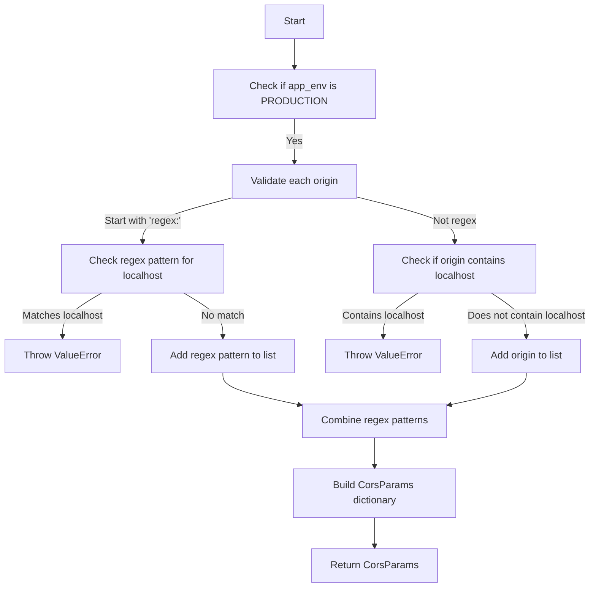

# `.\AutoGPT\autogpt_platform\backend\backend\api\utils\cors.py` 详细设计文档

The code defines a function to build CORS (Cross-Origin Resource Sharing) parameters for a web application, handling origin validation and regex pattern matching specifically for production environments.

## 整体流程



## 类结构

```
CorsParams (TypedDict)
├── allow_origins (List[str])
│   ├── origin1
│   ├── origin2
│   └── ...
└── allow_origin_regex (str | None)
    └── regex_pattern
```

## 全局变量及字段


### `origins`
    
A sequence of origin strings that may include regex patterns or simple origins.

类型：`Sequence[str]`
    


### `app_env`
    
The application environment, which can be PRODUCTION or DEVELOPMENT.

类型：`AppEnvironment`
    


### `allow_origins`
    
A list of allowed origins that do not match regex patterns.

类型：`List[str]`
    


### `regex_patterns`
    
A list of regex patterns for allowed origins.

类型：`List[str]`
    


### `allow_origin_regex`
    
A compiled regex pattern that matches allowed origins, or None if no regex patterns are used.

类型：`str | None`
    


### `CorsParams.allow_origins`
    
A list of allowed origins that do not match regex patterns.

类型：`List[str]`
    


### `CorsParams.allow_origin_regex`
    
A compiled regex pattern that matches allowed origins, or None if no regex patterns are used.

类型：`str | None`
    
    

## 全局函数及方法


### build_cors_params

The `build_cors_params` function constructs CORS (Cross-Origin Resource Sharing) parameters based on a list of origins and the application environment. It validates and formats the origins to be used in a CORS policy.

参数：

- `origins`：`Sequence[str]`，A sequence of origin strings that may include regular expressions prefixed with "regex:".
- `app_env`：`AppEnvironment`，The application environment which can be either production or development.

返回值：`CorsParams`，A dictionary containing the list of allowed origins and an optional regular expression for matching origins.

#### 流程图

```mermaid
graph TD
    A[Start] --> B[Check if app_env is PRODUCTION]
    B -->|Yes| C[Iterate over origins]
    B -->|No| D[Iterate over origins]
    C -->|Origin starts with "regex:"| E[Compile regex pattern]
    C -->|Origin does not start with "regex:"| F[Check for localhost/127.0.0.1]
    D -->|Origin starts with "regex:"| E[Compile regex pattern]
    D -->|Origin does not start with "regex:"| G[Add origin to allow_origins]
    E -->|Regex matches localhost/127.0.0.1| H[Raise ValueError]
    E -->|Regex does not match localhost/127.0.0.1| I[Add pattern to regex_patterns]
    F -->|Origin contains localhost/127.0.0.1| J[Raise ValueError]
    F -->|Origin does not contain localhost/127.0.0.1| K[Add origin to allow_origins]
    G --> L[Add origin to allow_origins]
    H --> M[End]
    I --> N[Add pattern to regex_patterns]
    J --> M[End]
    K --> L[Add origin to allow_origins]
    L --> O[Construct allow_origin_regex]
    M --> O[End]
    N --> O[End]
    O --> P[Return CorsParams]
    P --> Q[End]
```

#### 带注释源码

```python
def build_cors_params(origins: Sequence[str], app_env: AppEnvironment) -> CorsParams:
    allow_origins: List[str] = []
    regex_patterns: List[str] = []

    if app_env == AppEnvironment.PRODUCTION:
        for origin in origins:
            if origin.startswith("regex:"):
                pattern = origin[len("regex:") :]
                pattern_lower = pattern.lower()
                if "localhost" in pattern_lower or "127.0.0.1" in pattern_lower:
                    raise ValueError(
                        f"Production environment cannot allow localhost origins via regex: {pattern}"
                    )
                try:
                    compiled = re.compile(pattern)
                    test_urls = [
                        "http://localhost:3000",
                        "http://127.0.0.1:3000",
                        "https://localhost:8000",
                        "https://127.0.0.1:8000",
                    ]
                    for test_url in test_urls:
                        if compiled.search(test_url):
                            raise ValueError(
                                f"Production regex pattern matches localhost/127.0.0.1: {pattern}"
                            )
                except re.error:
                    pass
                continue

            lowered = origin.lower()
            if "localhost" in lowered or "127.0.0.1" in lowered:
                raise ValueError(
                    "Production environment cannot allow localhost origins"
                )

    for origin in origins:
        if origin.startswith("regex:"):
            regex_patterns.append(origin[len("regex:") :])
        else:
            allow_origins.append(origin)

    allow_origin_regex = None
    if regex_patterns:
        if len(regex_patterns) == 1:
            allow_origin_regex = f"^(?:{regex_patterns[0]})$"
        else:
            combined_pattern = "|".join(f"(?:{pattern})" for pattern in regex_patterns)
            allow_origin_regex = f"^(?:{combined_pattern})$"

    return {
        "allow_origins": allow_origins,
        "allow_origin_regex": allow_origin_regex,
    }
```


## 关键组件


### 张量索引与惰性加载

张量索引与惰性加载是处理大型数据集时提高性能的关键技术，它允许在需要时才计算数据，从而减少内存消耗和提高处理速度。

### 反量化支持

反量化支持是代码中实现的一种特性，它允许在运行时动态调整量化参数，以适应不同的量化需求。

### 量化策略

量化策略是用于优化模型性能的一种技术，它通过减少模型中数值的精度来减少模型大小和计算量，从而提高模型在资源受限环境中的运行效率。


## 问题及建议


### 已知问题

-   **硬编码的测试URLs**: 代码中硬编码了测试URLs来检查正则表达式是否匹配localhost或127.0.0.1。这可能导致维护困难，因为如果测试环境或服务器的URL发生变化，代码也需要相应更新。
-   **重复检查**: 对于每个origin，代码都进行了两次检查：一次是检查是否以"regex:"开头，另一次是检查是否包含"localhost"或"127.0.0.1"。这种重复检查可能会降低性能。
-   **异常处理**: 当正则表达式编译失败时，代码仅捕获异常并继续执行。这可能隐藏了潜在的错误，因为编译失败可能意味着正则表达式格式不正确。

### 优化建议

-   **使用配置文件**: 将测试URLs移至配置文件中，这样如果URL发生变化，只需更新配置文件，而不需要修改代码。
-   **合并检查**: 将检查是否以"regex:"开头和检查是否包含"localhost"或"127.0.0.1"的逻辑合并，以减少重复代码和提高效率。
-   **增强异常处理**: 当正则表达式编译失败时，记录详细的错误信息，并抛出异常或返回错误，以便调用者可以处理这种情况。
-   **代码重构**: 考虑将正则表达式的编译和测试逻辑封装到一个单独的函数中，以提高代码的可读性和可维护性。
-   **性能优化**: 如果在生产环境中频繁调用此函数，考虑使用缓存来存储编译后的正则表达式，以避免重复编译。


## 其它


### 设计目标与约束

- 设计目标：确保跨源资源共享（CORS）策略的安全性和灵活性，同时支持生产环境和开发环境的不同需求。
- 约束：生产环境中不允许通过正则表达式允许localhost或127.0.0.1，开发环境则没有此限制。

### 错误处理与异常设计

- 错误处理：当检测到生产环境中的正则表达式匹配localhost或127.0.0.1时，抛出`ValueError`异常。
- 异常设计：定义了`ValueError`异常，用于指示非法的源或正则表达式。

### 数据流与状态机

- 数据流：输入为源列表和应用程序环境，输出为CORS参数字典。
- 状态机：无状态机，函数直接处理输入并返回结果。

### 外部依赖与接口契约

- 外部依赖：依赖于`re`模块进行正则表达式匹配，依赖于`AppEnvironment`枚举来区分环境。
- 接口契约：`build_cors_params`函数定义了输入和输出的契约，确保正确处理CORS参数。


    