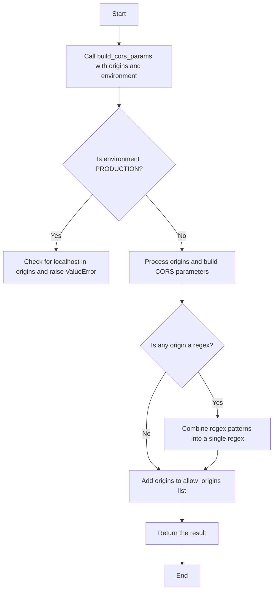
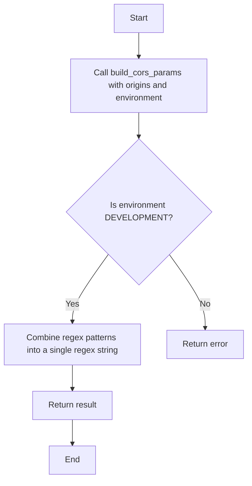
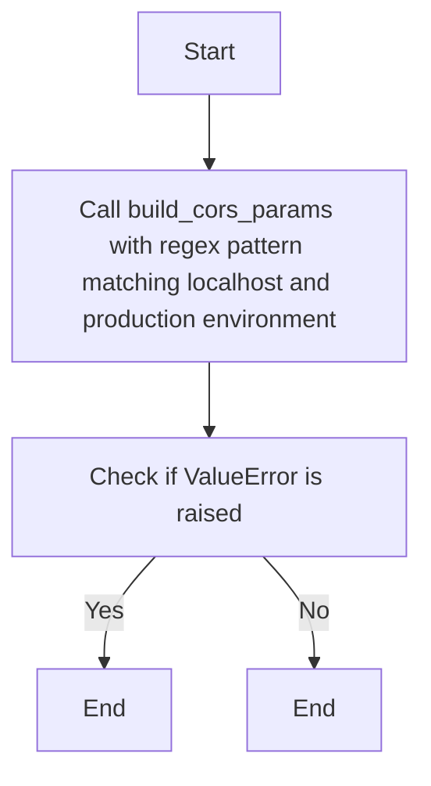
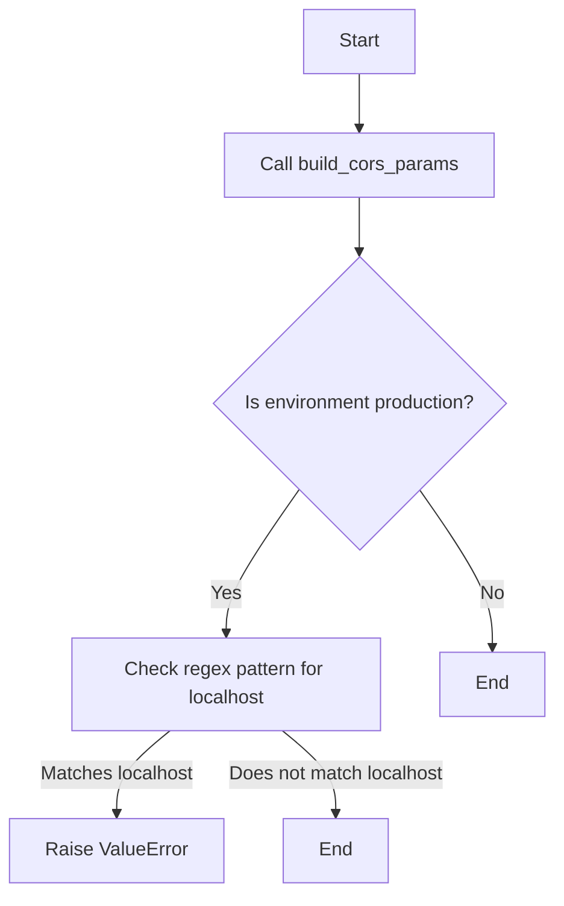
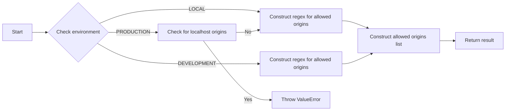

# `.\AutoGPT\autogpt_platform\backend\backend\api\utils\cors_test.py` 详细设计文档

The code defines a series of tests for a function that builds CORS (Cross-Origin Resource Sharing) parameters based on a list of origins and an application environment.

## 整体流程



## 类结构

```
TestSuite (Abstract Base Class)
├── build_cors_params (Function)
│   ├── origins (List[str])
│   └── environment (AppEnvironment)
│       └── result (Dict[str, str])
└── TestCases (Concrete Test Classes)
    ├── test_build_cors_params_splits_regex_patterns
    ├── test_build_cors_params_combines_multiple_regex_patterns
    ├── test_build_cors_params_blocks_localhost_literal_in_production
    ├── test_build_cors_params_blocks_localhost_regex_in_production
    ├── test_build_cors_params_blocks_case_insensitive_localhost_regex
    └── test_build_cors_params_blocks_regex_matching_localhost_at_runtime
```

## 全局变量及字段


### `origins`
    
A list of origin strings or regex patterns.

类型：`List[str]`
    


### `environment`
    
The application environment in which CORS parameters are being built.

类型：`AppEnvironment`
    


### `result`
    
The result dictionary containing CORS parameters.

类型：`Dict[str, str]`
    


### `build_cors_params.origins`
    
A list of origin strings or regex patterns that are used to build CORS parameters.

类型：`List[str]`
    


### `build_cors_params.environment`
    
The application environment that determines the CORS policy to be applied.

类型：`AppEnvironment`
    


### `build_cors_params.result`
    
The result dictionary that contains the CORS parameters to be used in the response headers.

类型：`Dict[str, str]`
    
    

## 全局函数及方法


### test_build_cors_params_splits_regex_patterns

This function tests the `build_cors_params` function with a list of origins that includes both literal and regex patterns, and checks if the resulting CORS parameters are correctly split into allow origins and allow origin regex.

参数：

- `origins`：`List[str]`，A list of origin strings, which can be either literal URLs or regex patterns.
- `AppEnvironment`：`AppEnvironment`，The application environment in which the CORS parameters are being built.

返回值：`None`，This function does not return any value.

#### 流程图

```mermaid
graph TD
    A[Start] --> B[Call build_cors_params with origins and AppEnvironment]
    B --> C{Check if result["allow_origins"] == ["https://app.example.com"]}
    C -->|Yes| D[End]
    C -->|No| E[Error]
    E --> F[End]
```

#### 带注释源码

```python
def test_build_cors_params_splits_regex_patterns() -> None:
    origins = [
        "https://app.example.com",
        "regex:https://.*\\.example\\.com",
    ]

    result = build_cors_params(origins, AppEnvironment.LOCAL)

    assert result["allow_origins"] == ["https://app.example.com"]
    assert result["allow_origin_regex"] == "^(?:https://.*\\.example\\.com)$"
```


### test_build_cors_params_combines_multiple_regex_patterns

This function tests the `build_cors_params` function to ensure that it correctly combines multiple regex patterns into a single regex string when provided with regex pattern origins in a development environment.

参数：

- `origins`：`List[str]`，A list of origin strings, which can be either literal URLs or regex patterns.
- `environment`：`AppEnvironment`，The application environment in which the CORS parameters are being built.

返回值：`None`，This function does not return any value.

#### 流程图



#### 带注释源码

```python
def test_build_cors_params_combines_multiple_regex_patterns() -> None:
    origins = [
        "regex:https://alpha.example.com",
        "regex:https://beta.example.com",
    ]

    result = build_cors_params(origins, AppEnvironment.DEVELOPMENT)

    assert result["allow_origins"] == []
    assert result["allow_origin_regex"] == (
        "^(?:(?:https://alpha.example.com)|(?:https://beta.example.com))$"
    )
```


### test_build_cors_params_blocks_localhost_literal_in_production

This function tests that the `build_cors_params` function raises a `ValueError` when attempting to include a literal "localhost" origin in production environment.

参数：

- origins：`List[str]`，A list of origin strings or regex patterns representing the allowed origins.
- environment：`AppEnvironment`，The application environment (development, staging, production, etc.).

返回值：`None`，This function does not return any value.

#### 流程图

```mermaid
graph TD
    A[Start] --> B[Call build_cors_params with origins and production environment]
    B --> C{Is origin "localhost"?}
    C -- Yes --> D[Throw ValueError]
    C -- No --> E[End]
```

#### 带注释源码

```
def test_build_cors_params_blocks_localhost_literal_in_production() -> None:
    with pytest.raises(ValueError):
        build_cors_params(["http://localhost:3000"], AppEnvironment.PRODUCTION)
```


### test_build_cors_params_blocks_localhost_regex_in_production

This function tests that the `build_cors_params` function raises a `ValueError` when a regex pattern in the origins list matches "localhost" in production environment.

参数：

- origins：`List[str]`，A list of origin strings, which can be either literal URLs or regex patterns.
- environment：`AppEnvironment`，The application environment, which can be one of the values from the `AppEnvironment` enum.

返回值：`None`，This function does not return any value.

#### 流程图



#### 带注释源码

```python
def test_build_cors_params_blocks_localhost_regex_in_production() -> None:
    with pytest.raises(ValueError):
        build_cors_params(["regex:https://.*localhost.*"], AppEnvironment.PRODUCTION)
```


### test_build_cors_params_blocks_case_insensitive_localhost_regex

This function tests the behavior of the `build_cors_params` function when a case-insensitive regex pattern that matches "localhost" is provided in production environment.

参数：

- origins：`List[str]`，A list of origin strings or regex patterns.
- environment：`AppEnvironment`，The application environment.

返回值：`None`，This function does not return any value.

#### 流程图

```mermaid
graph TD
    A[Start] --> B[Call build_cors_params]
    B --> C{Is environment production?}
    C -- Yes --> D[Raises ValueError with message "localhost origins via regex"]
    C -- No --> E[End]
```

#### 带注释源码

```python
def test_build_cors_params_blocks_case_insensitive_localhost_regex() -> None:
    with pytest.raises(ValueError, match="localhost origins via regex"):
        build_cors_params(["regex:https://(?i)LOCALHOST.*"], AppEnvironment.PRODUCTION)
```


### test_build_cors_params_blocks_regex_matching_localhost_at_runtime

This function tests that the `build_cors_params` function raises a `ValueError` when a regex pattern matches "localhost" at runtime in production environment.

参数：

- origins：`List[str]`，A list of origin strings or regex patterns.
- environment：`AppEnvironment`，The application environment.

返回值：`None`，This function does not return any value.

#### 流程图



#### 带注释源码

```python
def test_build_cors_params_blocks_regex_matching_localhost_at_runtime() -> None:
    with pytest.raises(ValueError, match="matches localhost"):
        build_cors_params(["regex:https?://.*:3000"], AppEnvironment.PRODUCTION)
```


### build_cors_params

The `build_cors_params` function is designed to generate CORS (Cross-Origin Resource Sharing) parameters based on a list of origins and an application environment. It constructs a dictionary with allowed origins and a regex pattern for matching allowed origins.

参数：

- `origins`：`List[str]`，A list of origins that are allowed to access the resource. This can include literal URLs or regex patterns.
- `environment`：`AppEnvironment`，The current application environment, which determines the CORS policy.

返回值：`Dict[str, str]`，A dictionary containing the allowed origins and the regex pattern for matching allowed origins.

#### 流程图



#### 带注释源码

```python
def build_cors_params(origins: List[str], environment: AppEnvironment) -> Dict[str, str]:
    if environment == AppEnvironment.PRODUCTION:
        for origin in origins:
            if "localhost" in origin or "LOCALHOST" in origin:
                raise ValueError("localhost origins are not allowed in production")
    
    allow_origin_regex = ""
    allow_origins = []
    for origin in origins:
        if origin.startswith("regex:"):
            allow_origin_regex += f"|(?:{origin[7:]})"
        else:
            allow_origins.append(origin)
    
    if allow_origin_regex:
        allow_origin_regex = f"^(?:{allow_origin_regex[2:]})$"
    
    return {
        "allow_origins": allow_origins,
        "allow_origin_regex": allow_origin_regex
    }
```


## 关键组件


### 张量索引与惰性加载

支持对张量的索引操作，并在需要时才加载张量数据，以优化内存使用。

### 反量化支持

提供对反量化操作的支持，允许在量化过程中进行逆量化操作。

### 量化策略

实现多种量化策略，以适应不同的应用场景和性能需求。


## 问题及建议


### 已知问题

-   **代码重复**：`build_cors_params` 函数在多个测试用例中被重复调用，这可能导致维护成本增加。
-   **异常处理**：虽然代码中使用了 `pytest.raises` 来测试异常情况，但异常处理逻辑可能需要更详细的描述，以便于理解在何种情况下会抛出异常。
-   **正则表达式复杂性**：正则表达式可能过于复杂，难以理解和维护，特别是在处理复杂的匹配模式时。

### 优化建议

-   **提取公共代码**：将 `build_cors_params` 函数的调用提取到一个单独的测试函数中，以减少代码重复。
-   **文档化异常**：在代码注释或文档中详细说明每种异常情况及其触发条件。
-   **简化正则表达式**：如果可能，尝试简化正则表达式，以提高代码的可读性和可维护性。
-   **单元测试覆盖**：确保所有可能的输入和输出情况都被单元测试覆盖，包括边界情况和异常情况。
-   **代码审查**：进行代码审查，以发现潜在的问题并提高代码质量。


## 其它


### 设计目标与约束

- 设计目标：确保API能够正确处理CORS（跨源资源共享）参数，同时提供灵活性和安全性。
- 约束：遵守CORS规范，确保本地开发环境和生产环境的安全配置。

### 错误处理与异常设计

- 错误处理：当传入的本地主机地址或与本地主机相关的正则表达式时，抛出`ValueError`异常。
- 异常设计：使用`pytest.raises`来测试异常情况，确保异常被正确抛出。

### 数据流与状态机

- 数据流：输入为源地址列表和应用程序环境，输出为CORS参数字典。
- 状态机：无状态机，函数直接处理输入并返回结果。

### 外部依赖与接口契约

- 外部依赖：依赖于`AppEnvironment`类和`build_cors_params`函数。
- 接口契约：`build_cors_params`函数定义了输入和输出的契约，包括参数类型和返回值类型。


    