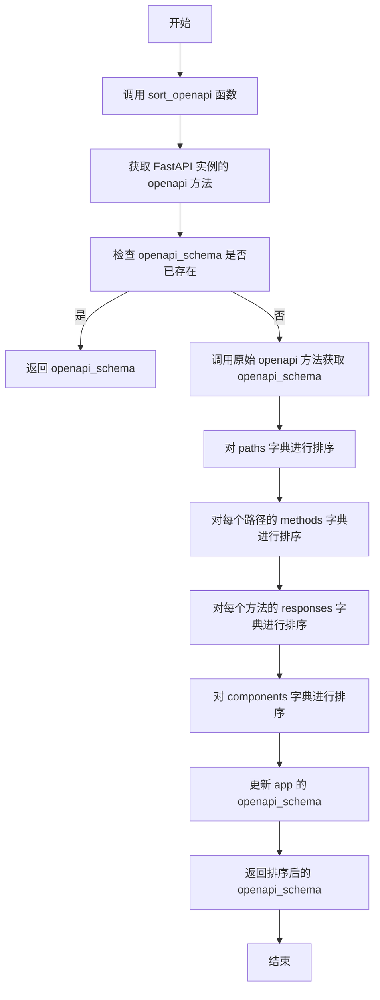

# `.\AutoGPT\autogpt_platform\backend\backend\api\utils\openapi.py` 详细设计文档

The code provides a function to sort the endpoints, schemas, and responses in a FastAPI application's openapi() method output.

## 整体流程



## 类结构

```
FastAPI (应用实例)
```

## 全局变量及字段


### `app`
    
The FastAPI instance that the function is applied to.

类型：`FastAPI`
    


### `openapi_schema`
    
The schema of the OpenAPI documentation for the FastAPI instance.

类型：`dict`
    


### `wrapped_openapi`
    
The original openapi method of the FastAPI instance.

类型：`function`
    


### `custom_openapi`
    
The custom openapi method that sorts the endpoints, schemas, and responses of the FastAPI instance.

类型：`function`
    


### `FastAPI.openapi_schema`
    
The schema of the OpenAPI documentation for the FastAPI instance, which includes sorted endpoints, schemas, and responses.

类型：`dict`
    
    

## 全局函数及方法


### sort_openapi

Sorts the endpoints, schemas, and responses of a FastAPI instance.

参数：

- `app`：`FastAPI`，The FastAPI instance to be patched.

返回值：`None`，This function does not return any value.

#### 流程图

```mermaid
graph TD
    A[Start] --> B[Check if app.openapi_schema is set]
    B -->|Yes| C[Return app.openapi_schema]
    B -->|No| D[Call wrapped_openapi()]
    D --> E[Sort "paths" in openapi_schema]
    E --> F[Sort "methods" in each "path"]
    F --> G[Sort "responses" in each "method"]
    G --> H[Sort "components" in openapi_schema]
    H --> I[Set app.openapi_schema to sorted openapi_schema]
    I --> J[Return openapi_schema]
    J --> K[End]
```

#### 带注释源码

```python
from fastapi import FastAPI

def sort_openapi(app: FastAPI) -> None:
    """
    Patch a FastAPI instance's `openapi()` method to sort the endpoints,
    schemas, and responses.
    """
    wrapped_openapi = app.openapi

    def custom_openapi():
        if app.openapi_schema:
            return app.openapi_schema

        openapi_schema = wrapped_openapi()

        # Sort endpoints
        openapi_schema["paths"] = dict(sorted(openapi_schema["paths"].items()))

        # Sort endpoints -> methods
        for p in openapi_schema["paths"].keys():
            openapi_schema["paths"][p] = dict(
                sorted(openapi_schema["paths"][p].items())
            )

            # Sort endpoints -> methods -> responses
            for m in openapi_schema["paths"][p].keys():
                openapi_schema["paths"][p][m]["responses"] = dict(
                    sorted(openapi_schema["paths"][p][m]["responses"].items())
                )

        # Sort schemas and responses as well
        for k in openapi_schema["components"].keys():
            openapi_schema["components"][k] = dict(
                sorted(openapi_schema["components"][k].items())
            )

        app.openapi_schema = openapi_schema
        return openapi_schema

    app.openapi = custom_openapi
```


### custom_openapi()

该函数用于修改FastAPI实例的`openapi()`方法，以对端点、模式和响应进行排序。

参数：

- `app`：`FastAPI`，FastAPI应用实例

返回值：`None`，无返回值

#### 流程图

```mermaid
graph TD
    A[Start] --> B[Check if app.openapi_schema is not None]
    B -->|Yes| C[Return app.openapi_schema]
    B -->|No| D[Call wrapped_openapi()]
    D --> E[Sort endpoints]
    E --> F[Sort endpoints -> methods]
    F --> G[Sort endpoints -> methods -> responses]
    G --> H[Sort schemas and responses]
    H --> I[Set app.openapi_schema to openapi_schema]
    I --> J[Return openapi_schema]
    J --> K[End]
```

#### 带注释源码

```python
def custom_openapi():
    if app.openapi_schema:
        return app.openapi_schema

    openapi_schema = wrapped_openapi()

    # Sort endpoints
    openapi_schema["paths"] = dict(sorted(openapi_schema["paths"].items()))

    # Sort endpoints -> methods
    for p in openapi_schema["paths"].keys():
        openapi_schema["paths"][p] = dict(
            sorted(openapi_schema["paths"][p].items())
        )

        # Sort endpoints -> methods -> responses
        for m in openapi_schema["paths"][p].keys():
            openapi_schema["paths"][p][m]["responses"] = dict(
                sorted(openapi_schema["paths"][p][m]["responses"].items())
            )

    # Sort schemas and responses as well
    for k in openapi_schema["components"].keys():
        openapi_schema["components"][k] = dict(
            sorted(openapi_schema["components"][k].items())
        )

    app.openapi_schema = openapi_schema
    return openapi_schema
```


### sort_openapi

Patch a FastAPI instance's `openapi()` method to sort the endpoints, schemas, and responses.

参数：

- `app`：`FastAPI`，The FastAPI instance to patch.

返回值：`None`，No return value, the method modifies the `openapi()` method of the `app` instance directly.

#### 流程图

```mermaid
graph TD
    A[Start] --> B[Check if app.openapi_schema is set]
    B -->|Yes| C[Return app.openapi_schema]
    B -->|No| D[Call wrapped_openapi()]
    D --> E[Sort endpoints]
    E --> F[Sort endpoints -> methods]
    F --> G[Sort endpoints -> methods -> responses]
    G --> H[Sort schemas and responses]
    H --> I[Set app.openapi_schema]
    I --> J[Return openapi_schema]
    J --> K[End]
```

#### 带注释源码

```python
from fastapi import FastAPI

def sort_openapi(app: FastAPI) -> None:
    """
    Patch a FastAPI instance's `openapi()` method to sort the endpoints,
    schemas, and responses.
    """
    wrapped_openapi = app.openapi

    def custom_openapi():
        if app.openapi_schema:
            return app.openapi_schema

        openapi_schema = wrapped_openapi()

        # Sort endpoints
        openapi_schema["paths"] = dict(sorted(openapi_schema["paths"].items()))

        # Sort endpoints -> methods
        for p in openapi_schema["paths"].keys():
            openapi_schema["paths"][p] = dict(
                sorted(openapi_schema["paths"][p].items())
            )

            # Sort endpoints -> methods -> responses
            for m in openapi_schema["paths"][p].keys():
                openapi_schema["paths"][p][m]["responses"] = dict(
                    sorted(openapi_schema["paths"][p][m]["responses"].items())
                )

        # Sort schemas and responses as well
        for k in openapi_schema["components"].keys():
            openapi_schema["components"][k] = dict(
                sorted(openapi_schema["components"][k].items())
            )

        app.openapi_schema = openapi_schema
        return openapi_schema

    app.openapi = custom_openapi
```


## 关键组件


### 张量索引与惰性加载

张量索引与惰性加载是深度学习框架中处理大型数据集时常用的技术，它允许在需要时才加载数据，从而减少内存消耗。

### 反量化支持

反量化支持是深度学习模型优化中的一种技术，它允许模型在量化过程中保持较高的精度。

### 量化策略

量化策略是深度学习模型优化中的一种方法，它通过减少模型中权重和激活值的精度来减少模型的存储和计算需求。


## 问题及建议


### 已知问题

-   {问题1}：代码中使用了`sorted`函数对字典进行排序，这可能会影响性能，特别是当字典非常大时。`sorted`函数会创建一个排序后的列表，然后再将原始字典的键值对重新赋值到新的字典中，这个过程可能会消耗较多的内存和时间。
-   {问题2}：代码中直接修改了`app.openapi_schema`属性，这可能会导致外部对`openapi_schema`的依赖出现不一致的情况，尤其是在多线程环境中。
-   {问题3}：代码没有处理可能出现的异常，例如`openapi_schema`可能不存在或者其结构不符合预期。

### 优化建议

-   {建议1}：考虑使用更高效的数据结构，如`collections.OrderedDict`，它可以在保持元素插入顺序的同时提供快速的查找和更新。
-   {建议2}：使用锁或其他同步机制来确保在多线程环境中对`app.openapi_schema`的修改是线程安全的。
-   {建议3}：添加异常处理逻辑，确保在`openapi_schema`不存在或结构不正确时能够优雅地处理异常。
-   {建议4}：考虑将排序逻辑封装成一个独立的函数，这样可以在需要时重用，并提高代码的可读性和可维护性。
-   {建议5}：如果排序是可选的，可以考虑将排序功能作为一个配置选项，而不是默认行为，以减少不必要的性能开销。


## 其它


### 设计目标与约束

- 设计目标：确保FastAPI应用中的OpenAPI文档的端点、模式、响应等有序排列，提高文档的可读性和维护性。
- 约束条件：必须兼容FastAPI框架，不修改其核心功能，仅扩展`openapi()`方法。

### 错误处理与异常设计

- 错误处理：当排序过程中出现异常（如数据类型不匹配、键不存在等），应捕获异常并记录错误信息，避免程序崩溃。
- 异常设计：定义自定义异常类，用于处理排序过程中可能出现的特定错误。

### 数据流与状态机

- 数据流：输入为FastAPI应用实例，输出为排序后的OpenAPI文档。
- 状态机：无状态机设计，程序执行顺序为：调用`custom_openapi()` -> 排序端点、模式、响应 -> 更新`openapi_schema`。

### 外部依赖与接口契约

- 外部依赖：依赖FastAPI框架，无其他外部依赖。
- 接口契约：遵循FastAPI框架的`openapi()`方法接口契约，扩展其功能。

### 安全性与权限控制

- 安全性：无敏感数据操作，无需考虑安全性问题。
- 权限控制：无权限控制需求，适用于所有用户。

### 测试与验证

- 测试：编写单元测试，验证排序功能是否按预期工作。
- 验证：通过实际应用场景验证排序功能的有效性。

### 性能优化

- 性能优化：考虑排序算法的效率，避免对性能产生负面影响。

### 代码风格与规范

- 代码风格：遵循PEP 8编码规范，保持代码可读性和可维护性。
- 规范：使用适当的命名规范，避免使用缩写和缩略语。

### 维护与更新

- 维护：定期检查代码，修复潜在问题，确保兼容性。
- 更新：根据FastAPI框架的更新，及时调整代码，保持功能完整性。


    