# `AutoGPT\autogpt_platform\backend\backend\api\ws_api.py` 详细设计文档

该代码实现了一个基于 FastAPI 的 WebSocket 服务器，用于提供实时的图执行和通知订阅服务。它集成了 JWT 用户认证、Redis 事件总线广播机制以及连接管理器，支持客户端订阅特定图执行事件、批量订阅图执行记录、取消订阅以及心跳检测，并通过 Prometheus 进行监控。

## 整体流程

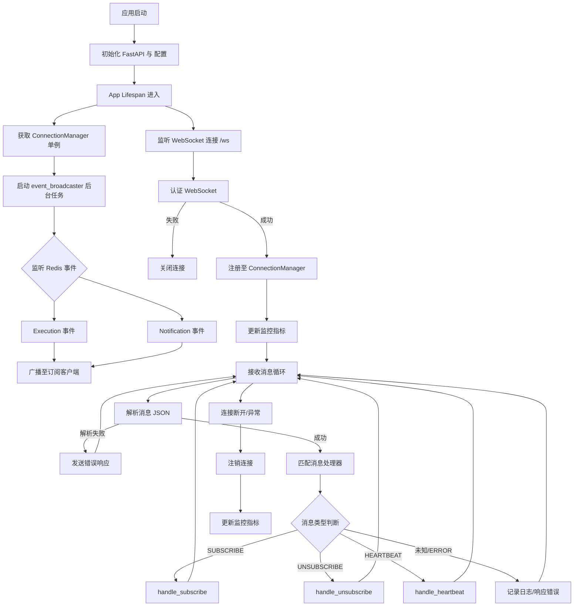

## 类结构

```
AppProcess (外部依赖类)
└── WebsocketServer
typing.Protocol
└── WSMessageHandler (消息处理协议)
```

## 全局变量及字段


### `logger`
    
用于记录模块运行时日志的日志记录器实例。

类型：`logging.Logger`
    


### `settings`
    
应用程序全局配置设置的单例实例。

类型：`Settings`
    


### `docs_url`
    
API 文档的访问路径，仅在本地环境配置下显示，否则为 None。

类型：`str | None`
    


### `app`
    
核心 FastAPI 应用实例，负责处理 WebSocket 连接和生命周期事件。

类型：`FastAPI`
    


### `_connection_manager`
    
全局单例的连接管理器缓存，用于管理和分发 WebSocket 连接。

类型：`ConnectionManager | None`
    


### `_MSG_HANDLERS`
    
WebSocket 消息方法与对应异步处理函数之间的路由映射字典。

类型：`dict[WSMethod, WSMessageHandler]`
    


    

## 全局函数及方法


### `lifespan`

FastAPI 应用程序的生命周期上下文管理器，负责在应用启动时初始化并启动后台事件广播任务，并在应用关闭时处理相关资源的清理。

参数：

-  `app`：`FastAPI`，FastAPI 应用程序实例

返回值：`AsyncGenerator`，一个异步生成器，在启动逻辑执行完毕后交出控制权，并在应用关闭时结束。

#### 流程图

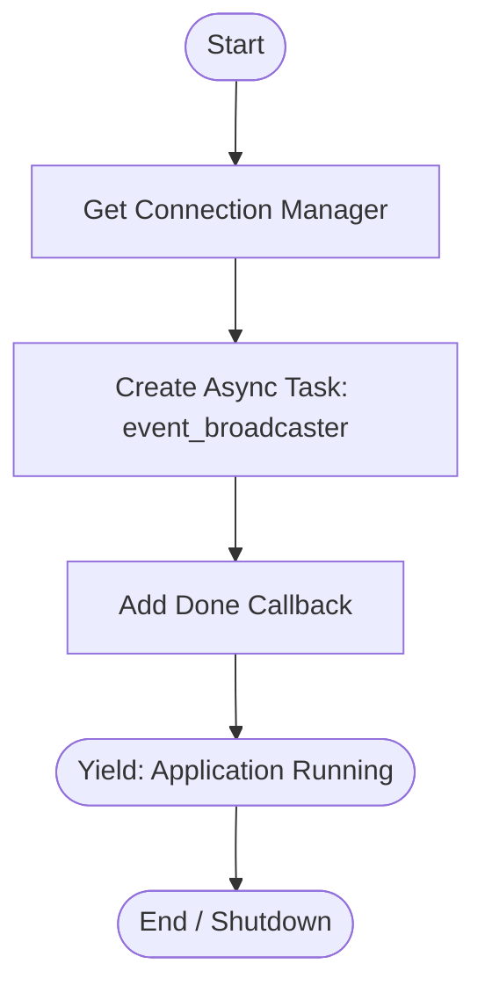

#### 带注释源码

```python
@asynccontextmanager
async def lifespan(app: FastAPI):
    # 获取全局 WebSocket 连接管理器实例，用于管理客户端连接
    manager = get_connection_manager()
    
    # 创建并启动一个后台任务，用于从 Redis 总线接收事件并广播给 WebSocket 客户端
    fut = asyncio.create_task(event_broadcaster(manager))
    
    # 为后台任务添加回调函数，当任务完成（包括异常退出）时记录日志
    fut.add_done_callback(lambda _: logger.info("Event broadcaster stopped"))
    
    # 暂停执行，将控制权交给 FastAPI 应用，应用进入运行状态
    yield
    # 代码执行到此处意味着应用正在关闭（上下文退出），由于使用了 asyncio.create_task，
    # 通常依赖事件循环关闭来清理后台任务，或者依赖 event_broadcaster 内部的 finally 块清理资源
```


### `get_connection_manager`

该函数实现了连接管理器的单例模式（Singleton Pattern），通过延迟初始化确保在应用程序生命周期内，全局范围内只存在一个连接管理器实例，用于统一管理 WebSocket 连接。

参数：

- 无

返回值：`ConnectionManager`，返回全局唯一的连接管理器实例。

#### 流程图

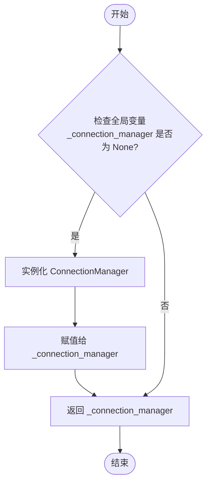

#### 带注释源码

```python
def get_connection_manager():
    # 声明使用全局变量 _connection_manager，以便在函数内部对其进行修改
    global _connection_manager
    # 检查全局变量是否为 None（即尚未初始化）
    if _connection_manager is None:
        # 如果为 None，则创建 ConnectionManager 的新实例
        # 采用延迟加载策略，确保只有在第一次需要时才创建实例
        _connection_manager = ConnectionManager()
    # 返回该全局实例
    return _connection_manager
```


### `event_broadcaster`

该函数作为WebSocket服务器的后台核心任务，持续监听Redis总线上的执行事件和通知事件，并将这些消息通过连接管理器实时广播给所有已连接的WebSocket客户端。

参数：

-  `manager`：`ConnectionManager`，用于管理活跃WebSocket连接及消息分发的连接管理器实例。

返回值：`None`，该函数为一个无限循环的异步任务，主要用于持续监听和转发，无直接返回值。

#### 流程图

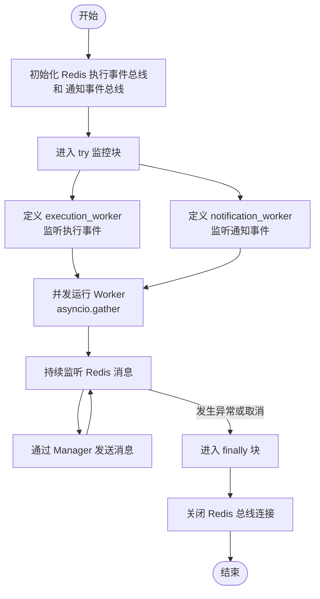

#### 带注释源码

```python
@continuous_retry()  # 使用重试机制装饰器，确保任务异常中断后能够自动重启
async def event_broadcaster(manager: ConnectionManager):
    # 初始化执行事件总线，用于接收图执行相关的更新
    execution_bus = AsyncRedisExecutionEventBus()
    # 初始化通知事件总线，用于接收用户相关的系统通知
    notification_bus = AsyncRedisNotificationEventBus()

    try:

        # 定义内部协程：专门处理执行事件的消费与转发
        async def execution_worker():
            # 监听所有通道（通配符 *），循环获取消息
            async for event in execution_bus.listen("*"):
                # 通过管理器将执行更新发送给订阅了相关图执行的客户端
                await manager.send_execution_update(event)

        # 定义内部协程：专门处理通知消息的消费与转发
        async def notification_worker():
            # 监听所有通道（通配符 *），循环获取消息
            async for notification in notification_bus.listen("*"):
                # 通过管理器将通知发送给特定的用户
                await manager.send_notification(
                    user_id=notification.user_id,
                    payload=notification.payload,
                )

        # 并发启动两个监听 Worker，使系统能同时处理执行流和通知流
        await asyncio.gather(execution_worker(), notification_worker())
    finally:
        # 确保无论任务如何退出（正常或异常），都关闭 Redis PubSub 连接
        # 防止连接泄漏导致资源耗尽
        await execution_bus.close()
        await notification_bus.close()
```


### `authenticate_websocket`

该函数用于对传入的 WebSocket 连接进行身份验证。它会检查配置中的认证开关，如果启用则从查询参数中提取 Token 进行解析和验证，最后返回用户标识。

参数：

- `websocket`：`WebSocket`，代表传入 WebSocket 连接的 FastAPI WebSocket 对象。

返回值：`str`，认证成功返回用户 ID，认证失败或 Token 无效时返回空字符串。

#### 流程图

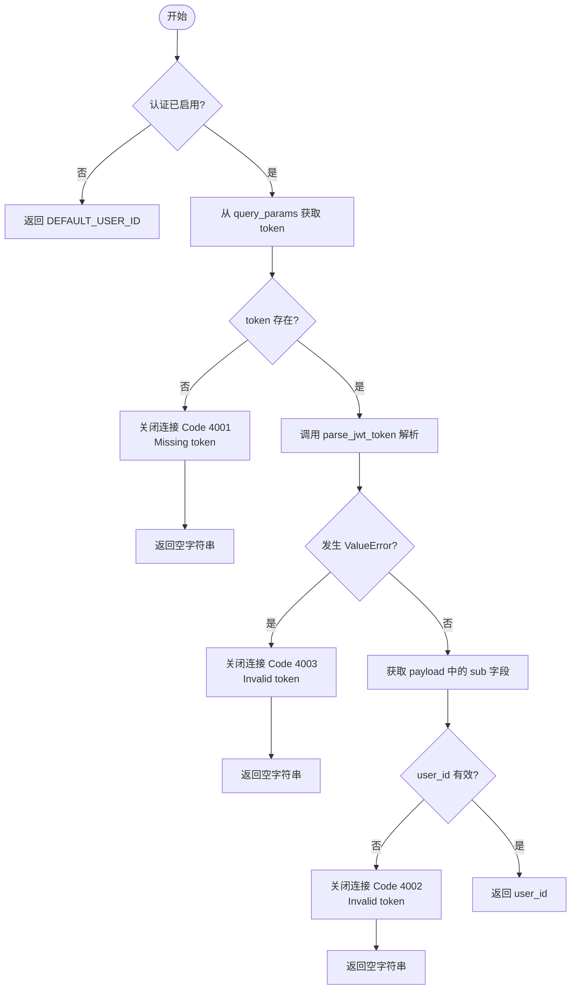

#### 带注释源码

```python
async def authenticate_websocket(websocket: WebSocket) -> str:
    # 检查配置中是否启用了认证
    if not settings.config.enable_auth:
        return DEFAULT_USER_ID

    # 从 WebSocket 连接的查询参数中获取 'token'
    token = websocket.query_params.get("token")
    if not token:
        # 如果未提供 token，关闭连接并返回错误码 4001
        await websocket.close(code=4001, reason="Missing authentication token")
        return ""

    try:
        # 解析 JWT Token
        payload = parse_jwt_token(token)
        user_id = payload.get("sub")
        if not user_id:
            # 如果 payload 中没有 'sub' (subject) 字段，视为无效 token，关闭连接并返回错误码 4002
            await websocket.close(code=4002, reason="Invalid token")
            return ""
        return user_id
    except ValueError:
        # 捕获 Token 解析过程中的异常（如格式错误、签名无效等），关闭连接并返回错误码 4003
        await websocket.close(code=4003, reason="Invalid token")
        return ""
```


### `handle_subscribe`

处理来自客户端的 WebSocket 订阅请求，根据请求的方法类型（订阅单个执行或订阅图的所有执行）验证数据并在连接管理器中注册订阅，随后返回订阅结果。

参数：

- `connection_manager`：`ConnectionManager`，用于管理活跃 WebSocket 连接及订阅关系的连接管理器实例。
- `websocket`：`WebSocket`，当前客户端的 WebSocket 连接对象，用于发送响应数据。
- `user_id`：`str`，发起订阅请求的用户唯一标识符。
- `message`：`WSMessage`，解析后的 WebSocket 消息对象，包含订阅方法（`method`）和载荷数据（`data`）。

返回值：`None`，该函数为异步处理函数，不直接返回值，而是通过 `websocket` 对象向客户端发送响应消息。

#### 流程图

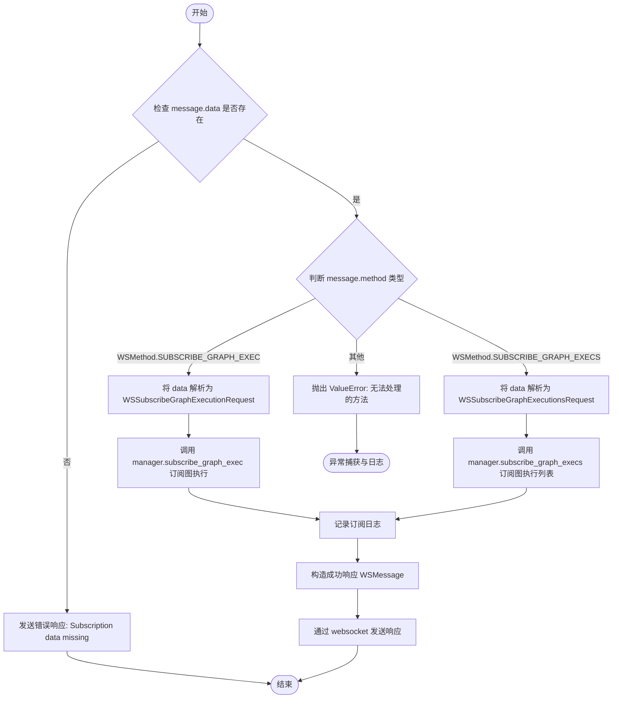

#### 带注释源码

```python
async def handle_subscribe(
    connection_manager: ConnectionManager,
    websocket: WebSocket,
    user_id: str,
    message: WSMessage,
):
    # 1. 检查消息载荷数据是否存在
    if not message.data:
        await websocket.send_text(
            WSMessage(
                method=WSMethod.ERROR,
                success=False,
                error="Subscription data missing",
            ).model_dump_json()
        )
        return

    # Verify that user has read access to graph (目前为注释掉的权限检查逻辑)
    # if not get_db_client().get_graph(
    #     graph_id=sub_req.graph_id,
    #     version=sub_req.graph_version,
    #     user_id=user_id,
    # ):
    #     await websocket.send_text(
    #         WsMessage(
    #             method=Methods.ERROR,
    #             success=False,
    #             error="Access denied",
    #         ).model_dump_json()
    #     )
    #     return

    # 2. 根据不同的订阅方法类型进行分发处理
    if message.method == WSMethod.SUBSCRIBE_GRAPH_EXEC:
        # 解析特定图执行订阅请求
        sub_req = WSSubscribeGraphExecutionRequest.model_validate(message.data)
        # 在连接管理器中注册订阅，获取频道键
        channel_key = await connection_manager.subscribe_graph_exec(
            user_id=user_id,
            graph_exec_id=sub_req.graph_exec_id,
            websocket=websocket,
        )

    elif message.method == WSMethod.SUBSCRIBE_GRAPH_EXECS:
        # 解析特定图的所有执行订阅请求
        sub_req = WSSubscribeGraphExecutionsRequest.model_validate(message.data)
        # 在连接管理器中注册订阅，获取频道键
        channel_key = await connection_manager.subscribe_graph_execs(
            user_id=user_id,
            graph_id=sub_req.graph_id,
            websocket=websocket,
        )

    else:
        # 如果传入的方法无法处理，抛出异常
        raise ValueError(
            f"{handle_subscribe.__name__} can't handle '{message.method}' messages"
        )

    # 3. 记录调试日志并发送成功响应
    logger.debug(f"New subscription on channel {channel_key} for user #{user_id}")
    await websocket.send_text(
        WSMessage(
            method=message.method,
            success=True,
            channel=channel_key,
        ).model_dump_json()
    )
```


### `handle_unsubscribe`

该函数用于处理WebSocket客户端发送的取消订阅请求，主要负责验证请求数据，从连接管理器中移除对应的图执行订阅，并向客户端返回操作结果。

参数：

-  `connection_manager`：`ConnectionManager`，负责管理WebSocket连接和订阅关系的全局连接管理器。
-  `websocket`：`WebSocket`，当前发起请求的WebSocket连接实例。
-  `user_id`：`str`，发起请求用户的唯一标识符。
-  `message`：`WSMessage`，客户端发送的原始WebSocket消息对象，包含取消订阅所需的数据。

返回值：`None`，该函数为异步处理函数，无直接返回值，操作结果通过WebSocket发送给客户端。

#### 流程图

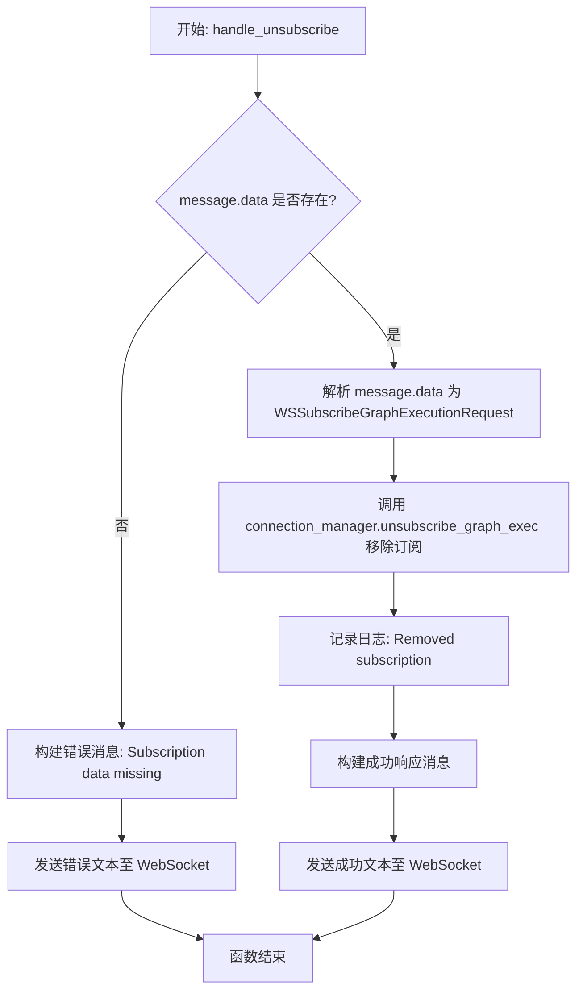

#### 带注释源码

```python
async def handle_unsubscribe(
    connection_manager: ConnectionManager,
    websocket: WebSocket,
    user_id: str,
    message: WSMessage,
):
    # 检查消息数据是否存在，如果缺失则返回错误
    if not message.data:
        await websocket.send_text(
            WSMessage(
                method=WSMethod.ERROR,
                success=False,
                error="Subscription data missing",
            ).model_dump_json()
        )
        return

    # 使用 Pydantic 验证并解析消息数据为取消订阅请求对象
    unsub_req = WSSubscribeGraphExecutionRequest.model_validate(message.data)
    
    # 调用连接管理器执行实际的取消订阅逻辑，并获取频道键
    channel_key = await connection_manager.unsubscribe_graph_exec(
        user_id=user_id,
        graph_exec_id=unsub_req.graph_exec_id,
        websocket=websocket,
    )

    # 记录调试日志，表示订阅已移除
    logger.debug(f"Removed subscription on channel {channel_key} for user #{user_id}")
    
    # 向客户端发送取消订阅成功的确认消息
    await websocket.send_text(
        WSMessage(
            method=WSMethod.UNSUBSCRIBE,
            success=True,
            channel=channel_key,
        ).model_dump_json()
    )
```


### `handle_heartbeat`

处理 WebSocket 心跳消息，向客户端发送 "pong" 响应以维持连接活性并确认服务端可用性。

参数：

- `connection_manager`：`ConnectionManager`，管理所有活跃 WebSocket 连接的实例（当前实现中未直接使用，但符合处理程序协议）。
- `websocket`：`WebSocket`，当前客户端的 WebSocket 连接实例，用于发送响应。
- `user_id`：`str`，发起心跳请求的经过身份验证的用户 ID（当前实现中未直接使用）。
- `message`：`WSMessage`，解析后的 WebSocket 消息对象（当前实现中未直接使用）。

返回值：`None`，无显式返回值，通过 WebSocket 异步发送响应。

#### 流程图

```mermaid
flowchart TD
    Start([开始]) --> SendResponse[通过 websocket 发送 JSON 响应]
    SendResponse --> End([结束])

    SendResponse -- Payload --> PayloadData{"method": "HEARTBEAT", "data": "pong", "success": True}
```

#### 带注释源码

```python
async def handle_heartbeat(
    connection_manager: ConnectionManager,
    websocket: WebSocket,
    user_id: str,
    message: WSMessage,
):
    # 构建响应数据并通过 WebSocket 连接发送 JSON 格式的 "pong" 消息
    # 用于告知客户端连接仍然活跃
    await websocket.send_json(
        {
            "method": WSMethod.HEARTBEAT.value,  # 消息方法为心跳
            "data": "pong",                      # 响应内容
            "success": True,                     # 操作成功标识
        }
    )
```


### `websocket_router`

该函数是WebSocket服务的核心端点，负责处理WebSocket连接的完整生命周期，包括身份验证、连接注册、消息循环接收、将消息分发至对应的处理器、捕获异常以及连接断开后的清理工作。

参数：

- `websocket`：`WebSocket`，FastAPI 提供的 WebSocket 连接实例，用于与客户端进行双向通信。
- `manager`：`ConnectionManager`，通过依赖注入获取的连接管理器实例，负责维护活跃连接和订阅状态。

返回值：`None`，该函数无返回值，主要副作用体现在与客户端的交互及管理器状态的变更。

#### 流程图

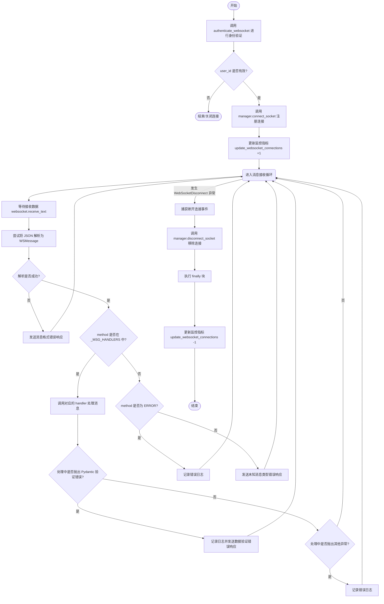

#### 带注释源码

```python
@app.websocket("/ws")
async def websocket_router(
    websocket: WebSocket, manager: ConnectionManager = Depends(get_connection_manager)
):
    # 1. 身份验证：验证 WebSocket 连接中的 Token，获取用户 ID
    user_id = await authenticate_websocket(websocket)
    if not user_id:
        return  # 如果验证失败，直接返回（通常会由 authenticate_websocket 关闭连接）

    # 2. 连接管理：将验证通过的 WebSocket 连接注册到管理器中
    await manager.connect_socket(websocket, user_id=user_id)

    # 3. 监控更新：增加当前用户的 WebSocket 连接计数
    update_websocket_connections(user_id, 1)

    try:
        # 4. 消息循环：持续监听客户端发送的消息
        while True:
            # 接收文本消息
            data = await websocket.receive_text()
            try:
                # 尝试将接收到的 JSON 数据解析为 WSMessage 模型
                message = WSMessage.model_validate_json(data)
            except pydantic.ValidationError as e:
                # 解析失败：记录错误并返回格式错误信息
                logger.error(
                    "Invalid WebSocket message from user #%s: %s",
                    user_id,
                    e,
                )
                await websocket.send_text(
                    WSMessage(
                        method=WSMethod.ERROR,
                        success=False,
                        error=("Invalid message format. Review the schema and retry"),
                    ).model_dump_json()
                )
                continue

            try:
                # 5. 消息路由：检查消息类型是否存在对应的处理器
                if message.method in _MSG_HANDLERS:
                    # 调用对应的处理函数（如 handle_subscribe, handle_heartbeat 等）
                    await _MSG_HANDLERS[message.method](
                        connection_manager=manager,
                        websocket=websocket,
                        user_id=user_id,
                        message=message,
                    )
                    continue
            except pydantic.ValidationError as e:
                # 处理器内部数据验证失败
                logger.error(
                    "Validation error while handling '%s' for user #%s: %s",
                    message.method.value,
                    user_id,
                    e,
                )
                await websocket.send_text(
                    WSMessage(
                        method=WSMethod.ERROR,
                        success=False,
                        error="Invalid message data. Refer to the API schema",
                    ).model_dump_json()
                )
                continue
            except Exception as e:
                # 处理器内部发生其他未捕获异常
                logger.error(
                    f"Error while handling '{message.method.value}' message "
                    f"for user #{user_id}: {e}"
                )
                continue

            # 6. 未知消息处理：如果没有对应的处理器
            if message.method == WSMethod.ERROR:
                # 如果是错误类型的消息，仅记录日志
                logger.error(f"WebSocket Error message received: {message.data}")

            else:
                # 其他未知类型，发送错误响应
                logger.warning(
                    f"Unknown WebSocket message type {message.method} received: "
                    f"{message.data}"
                )
                await websocket.send_text(
                    WSMessage(
                        method=WSMethod.ERROR,
                        success=False,
                        error="Message type is not processed by the server",
                    ).model_dump_json()
                )

    except WebSocketDisconnect:
        # 7. 连接断开处理：捕获客户端断开连接异常
        manager.disconnect_socket(websocket, user_id=user_id)
        logger.debug("WebSocket client disconnected")
    finally:
        # 8. 清理工作：无论是否异常，都更新监控指标（减少连接数）
        update_websocket_connections(user_id, -1)
```


### `health`

该函数是一个异步的HTTP GET请求处理器，用于作为服务的健康检查端点，向调用者返回当前服务的运行状态。

参数：

*   无参数

返回值：`dict[str, str]`，包含服务健康状态信息的字典，键为"status"，值为"healthy"。

#### 流程图

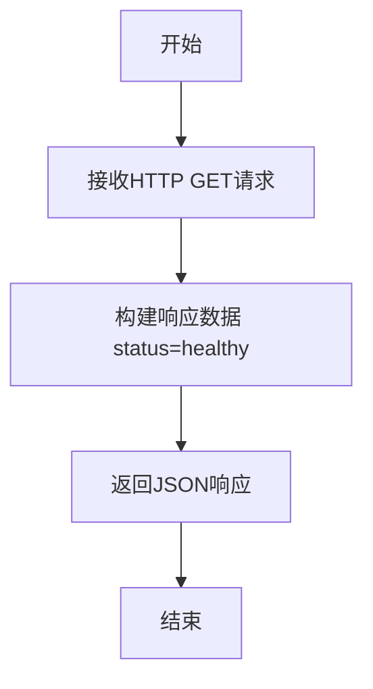

#### 带注释源码

```python
@app.get("/")
async def health():
    # 返回包含健康状态的字典，用于负载均衡器或容器编排系统检查服务存活状态
    return {"status": "healthy"}
```


### `WebsocketServer.run`

该方法用于启动并运行 WebSocket 服务器。它负责配置跨域资源共享（CORS）策略，将其应用于 FastAPI 应用实例，并使用 Uvicorn 作为 ASGI 服务器来托管应用，监听指定的主机和端口以处理 WebSocket 连接。

参数：

- `self`：`WebsocketServer`，类实例本身

返回值：`None`，无返回值，该函数是一个阻塞调用，会持续运行直至服务器停止。

#### 流程图

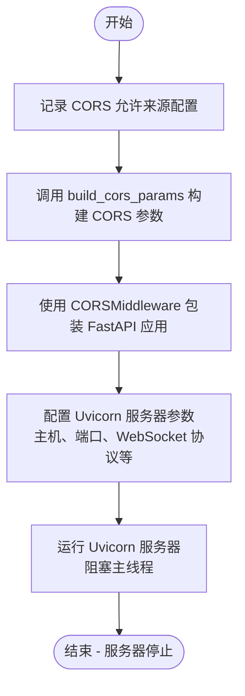

#### 带注释源码

```python
    def run(self):
        # 记录当前配置的 CORS 允许来源，便于调试和追踪
        logger.info(f"CORS allow origins: {settings.config.backend_cors_allow_origins}")

        # 根据配置的允许来源和应用环境构建 CORS 中间件所需的参数
        cors_params = build_cors_params(
            settings.config.backend_cors_allow_origins,
            settings.config.app_env,
        )

        # 使用 Starlette 的 CORSMiddleware 包装 FastAPI 应用
        # 允许携带凭证、任意方法和任意请求头，以支持跨域 WebSocket 请求
        server_app = CORSMiddleware(
            app=app,
            **cors_params,
            allow_credentials=True,
            allow_methods=["*"],
            allow_headers=["*"],
        )

        # 使用 Uvicorn 运行封装后的应用
        # Config().websocket_server_host 和 port 指定了监听地址
        # ws="websockets-sansio" 指定了 WebSocket 的实现库
        # log_config=None 表示使用应用自定义的日志配置而非 Uvicorn 默认配置
        uvicorn.run(
            server_app,
            host=Config().websocket_server_host,
            port=Config().websocket_server_port,
            ws="websockets-sansio",
            log_config=None,
        )
```


### `WSMessageHandler.__call__`

定义了 WebSocket 消息处理器的接口协议（Protocol）。该规范要求任何实现此协议的处理器必须是一个异步可调用对象，能够接收连接管理器、具体的 WebSocket 连接实例、用户 ID 以及解析后的消息对象，并执行相应的处理逻辑（如订阅、取消订阅或心跳响应）。

参数：

- `connection_manager`：`ConnectionManager`，负责管理所有活跃 WebSocket 连接及订阅关系的管理器实例。
- `websocket`：`WebSocket`，代表当前客户端连接的 Starlette/FastAPI WebSocket 实例。
- `user_id`：`str`，经过身份验证的当前用户的唯一标识符。
- `message`：`WSMessage`，已解析并验证过的 WebSocket 消息对象，包含方法类型和数据负载。

返回值：`Coroutine[Any, Any, None]`，异步函数通常不返回具体值（返回 None），主要产生副作用（如发送响应或修改状态）。

#### 流程图

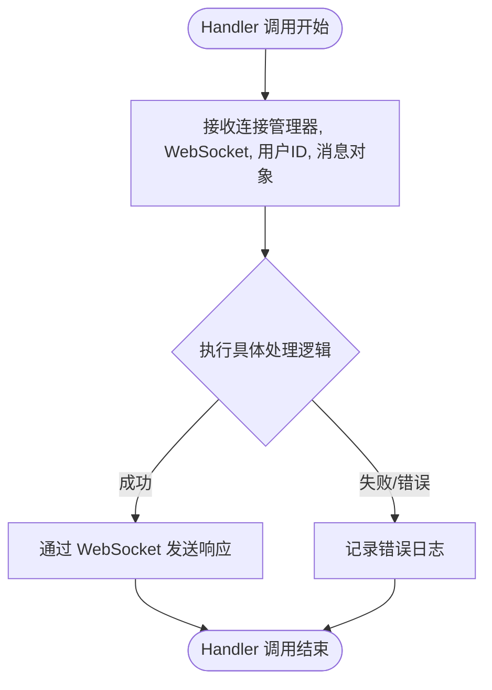

#### 带注释源码

```python
class WSMessageHandler(Protocol):
    """
    WebSocket 消息处理器的协议定义。
    使用 typing.Protocol 定义结构化子类型，用于类型检查，
    确保所有注册的消息处理函数都遵循相同的签名。
    """
    async def __call__(
        self,
        connection_manager: ConnectionManager,  # 连接管理器，用于处理订阅/取消订阅等全局操作
        websocket: WebSocket,                  # 当前的 WebSocket 连接对象，用于向客户端发送数据
        user_id: str,                          # 发送消息的用户 ID，用于权限控制或路由
        message: WSMessage,                    # 解析后的消息对象，包含 method 和 data
    ): ...
```

## 关键组件


### ConnectionManager
Manages active WebSocket connections and the routing of real-time messages to specific users or subscriptions.

### EventBroadcaster
A background task that listens to Redis event buses (execution and notification) and broadcasts updates to the ConnectionManager.

### WebSocketRouter
The core FastAPI endpoint handler that manages the WebSocket connection lifecycle, authentication, and message dispatching logic.

### WebSocketAuthentication
Validates JWT tokens from connection query parameters to authorize user access and retrieve user identities.

### MessageHandlers
A set of asynchronous functions implementing the specific business logic for processing different WebSocket methods like subscription, unsubscription, and heartbeat.


## 问题及建议


### 已知问题

-   `handle_subscribe` 函数中关键的权限校验逻辑被注释掉，导致任何认证用户均可订阅任意 Graph 执行状态，存在严重的数据泄露安全风险。
-   使用全局变量 `_connection_manager` 管理连接状态。这种模式在单进程环境下可行，但严重降低了代码的可测试性，且不符合 FastAPI 的依赖注入最佳实践。
-   `handle_unsubscribe` 方法复用了订阅请求模型 `WSSubscribeGraphExecutionRequest` 进行数据验证。如果取消订阅所需的字段与订阅不同，这种复用会导致接口语义不清和验证逻辑混乱。
-   缺乏对“僵尸连接”的主动清理机制。虽然服务端响应了心跳，但 `ConnectionManager` 内部未实现基于超时的自动断开逻辑，客户端异常断网可能导致连接对象在内存中长时间残留。
-   `event_broadcaster` 函数中 `finally` 块关闭 Redis 连接是好的实践，但依赖 `@continuous_retry` 装饰器进行无限重试。如果 Redis 服务永久不可用，可能导致后台任务陷入高频重试死循环，消耗 CPU 资源。

### 优化建议

-   恢复并实现权限校验逻辑。取消 `handle_subscribe` 中的注释，集成数据库或缓存服务以验证用户对特定 Graph 的读取权限。
-   重构连接管理器的生命周期。移除全局变量 `_connection_manager`，利用 FastAPI 的 `lifespan` 上下文管理器初始化实例并存入 `app.state`，或通过 `Depends` 注入，以支持多实例部署和单元测试。
-   引入断路器机制。对于 `event_broadcaster` 中的 Redis 连接，建议在重试逻辑中加入断路器，当检测到下游服务持续不可用时暂停重试，避免资源耗尽。
-   优化错误处理与监控。在 `websocket_router` 的 `except Exception` 块中，除了记录日志，建议集成 Sentry 或 OpenTelemetry 进行错误上报与告警，防止关键错误被静默吞没。
-   细化数据模型定义。为取消订阅操作创建独立的 Pydantic 模型（如 `WSUnsubscribeRequest`），使接口契约更加清晰，降低客户端调用复杂度。
-   改进消息分发逻辑。利用 Python 3.10+ 的 `match-case` 语句替代字典查找 `_MSG_HANDLERS`，以提升代码的可读性和扩展性。


## 其它


### 设计目标与约束

1.  **实时性与低延迟**：作为 WebSocket 服务器，核心目标是实现服务端到客户端的实时消息推送（如执行状态更新、通知），必须最小化消息从 Redis Pub/Sub 到 WebSocket 客户端的传输延迟。
2.  **高并发与连接管理**：需能够处理大量的并发 WebSocket 连接，并有效管理每个连接的生命周期（连接、认证、订阅、断开），避免资源泄漏。
3.  **可靠性保障**：通过 `continuous_retry` 机制确保广播任务的持续运行，即使出现临时故障也能自动恢复。
4.  **环境约束**：
    *   **本地环境**：允许访问 Swagger 文档 (`/docs`) 并暴露 Prometheus 指标端点。
    *   **生产/非本地环境**：隐藏文档，根据配置决定是否暴露指标端点，且必须开启 CORS 保护。
5.  **安全性**：强制 WebSocket 连接进行身份验证（JWT），除非在配置中显式禁用 (`enable_auth` 禁用)。必须支持跨域资源共享 (CORS) 策略的动态配置。

### 错误处理与异常设计

1.  **身份验证错误**：
    *   在 `authenticate_websocket` 中，如果 Token 缺失、无效或解析失败，服务器会立即关闭 WebSocket 连接，并使用特定的状态码（4001, 4002, 4003）和原因告知客户端。
2.  **消息验证错误**：
    *   使用 Pydantic 进行 JSON 反序列化和数据验证。如果客户端发送的消息格式不符合 `WSMessage` 模型，或者在处理请求（如订阅）时数据不符合特定请求模型，服务器捕获 `pydantic.ValidationError`。
    *   错误响应不中断连接，而是返回一个包含 `method: WSMethod.ERROR` 和错误详情的 JSON 消息给客户端，记录日志后继续监听下一条消息。
3.  **业务逻辑与运行时错误**：
    *   在消息处理器中，捕获通用的 `Exception`，防止因单个消息处理失败导致整个 WebSocket 连接断开。错误仅记录日志。
    *   如果收到未知的消息类型，服务器记录警告并返回错误消息。
4.  **资源清理与连接中断**：
    *   监听 `WebSocketDisconnect` 异常以执行清理逻辑（从 `ConnectionManager` 移除连接、更新 Prometheus 指标）。
    *   使用 `try...finally` 块确保 Redis Pub/Sub 连接在广播任务停止或异常退出时被正确关闭，防止连接泄漏。

### 数据流与状态机

**1. 数据流**

*   **下行数据流 (Server -> Client)**：
    1.  后端服务产生事件（执行事件、通知事件）。
    2.  事件发布到 Redis Pub/Sub 频道。
    3.  `event_broadcaster` 协程从 Redis 订阅并监听事件。
    4.  `event_broadcaster` 调用 `ConnectionManager` 的方法 (`send_execution_update`, `send_notification`)。
    5.  `ConnectionManager` 根据订阅关系，将数据发送给匹配的活跃 WebSocket 连接。

*   **上行数据流 (Client -> Server)**：
    1.  客户端通过 WebSocket 发送 JSON 文本。
    2.  `websocket_router` 接收文本并解析为 `WSMessage` 对象。
    3.  路由器根据 `message.method` 查找 `_MSG_HANDLERS` 映射表。
    4.  对应的 Handler 函数执行业务逻辑（如修改 `ConnectionManager` 中的订阅状态）。
    5.  Handler 返回响应消息给客户端。

**2. WebSocket 连接状态机**

*   **Idle (空闲)**: 初始状态，等待连接建立。
*   **Authenticating (认证中)**: 连接建立后，调用 `authenticate_websocket`。
    *   *失败*: 转至 **Closed (已关闭)**。
    *   *成功*: 转至 **Connected (已连接)**，更新连接计数指标。
*   **Connected (已连接)**: 进入主循环，等待接收消息。
    *   *接收消息*: 验证并分发处理，保持 **Connected** 状态。
    *   *发生不可恢复错误或客户端主动断开*: 转至 **Cleaning (清理中)**。
*   **Cleaning (清理中)**: 触发 `finally` 块，从管理器移除连接，更新指标。
*   **Closed (已关闭)**: 连接彻底终止。

### 外部依赖与接口契约

1.  **Redis Pub/Sub (异步事件总线)**
    *   **接口契约**: 依赖 `AsyncRedisExecutionEventBus` 和 `AsyncRedisNotificationEventBus`。
    *   **操作**: 必须支持 `listen(channel)` 异步迭代器和 `close()` 方法。`event_broadcaster` 订阅通配符频道 `*` 以获取所有事件。
2.  **JWT 认证服务**
    *   **接口契约**: 依赖 `autogpt_libs.auth.jwt_utils.parse_jwt_token`。
    *   **输入**: Base64 编码的 JWT 字符串。
    *   **输出**: 包含 `sub` (Subject, 即 User ID) 声明的字典 Payload。
    *   **异常**: Token 无效或格式错误时抛出 `ValueError`。
3.  **WebSocket 客户端**
    *   **连接契约**: 必须在连接 URL 的查询参数中提供 `token`（除非禁用认证）。
    *   **消息契约**:
        *   发送消息必须符合 `WSMessage` JSON Schema：包含 `method` (枚举值), `data` (对象), `id` (可选)。
        *   订阅消息 (`SUBSCRIBE_GRAPH_EXEC` 等) 的 `data` 字段必须包含对应的 ID（如 `graph_exec_id`）。
        *   必须能够处理服务器返回的 `WSMethod.ERROR` 类型的错误消息。
4.  **配置系统**
    *   依赖 `backend.util.settings.Settings` 提供应用环境 (`app_env`)、CORS 配置 (`backend_cors_allow_origins`)、认证开关 (`enable_auth`) 及服务器监听地址/端口。
5.  **监控系统**
    *   依赖 `backend.monitoring.instrumentation`，约定应用需暴露 `/metrics` 端点（本地环境）以供 Prometheus 抓取，并调用 `update_websocket_connections` 更新连接数 Gauge 指标。

    