# `AutoGPT\autogpt_platform\backend\backend\api\ws_api_test.py` 详细设计文档

该文件是一个基于 Pytest 的 WebSocket API 测试套件，旨在验证 WebSocket 服务器的启动配置（如 CORS 和生产环境安全检查）、WebSocket 路由的消息处理逻辑（订阅与取消订阅）、以及异常处理和错误响应机制的正确性。

## 整体流程

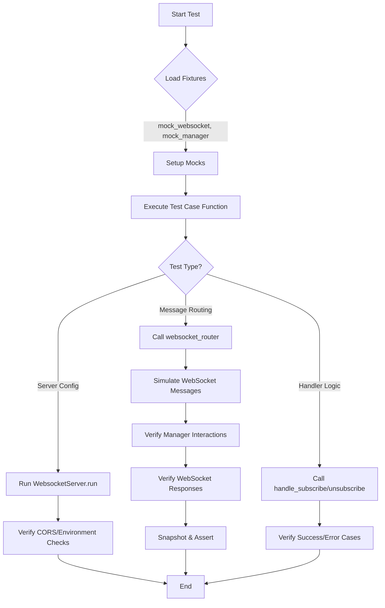

## 类结构

```
test_ws_api.py (Module)
├── Fixtures
│   ├── mock_websocket
│   └── mock_manager
├── Server Config Tests
│   ├── test_websocket_server_uses_cors_helper
│   └── test_websocket_server_blocks_localhost_in_production
└── Message Logic Tests
    ├── test_websocket_router_subscribe
    ├── test_websocket_router_unsubscribe
    ├── test_websocket_router_invalid_method
    ├── test_handle_subscribe_success
    ├── test_handle_subscribe_missing_data
    ├── test_handle_unsubscribe_success
    └── test_handle_unsubscribe_missing_data
```

## 全局变量及字段


    

## 全局函数及方法


### `mock_websocket`

这是一个 Pytest 测试夹具，用于创建一个模拟的 WebSocket 对象，以便在单元测试中模拟 FastAPI WebSocket 连接，而无需建立真实的网络连接。它配置了必要的属性以适应认证和连接管理逻辑。

参数：

返回值：`AsyncMock`，返回一个模拟的 WebSocket 对象，该对象遵循 `WebSocket` 的规范，并包含一个初始化为空字典的 `query_params` 属性。

#### 流程图

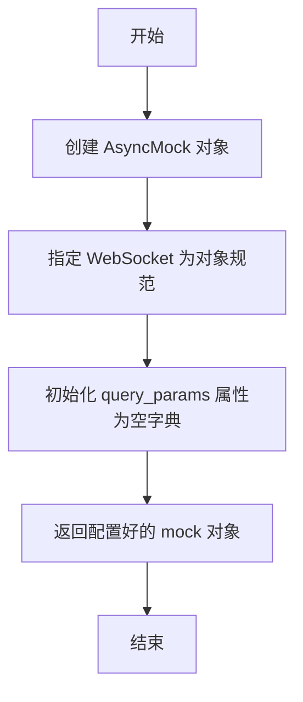

#### 带注释源码

```python
@pytest.fixture
def mock_websocket() -> AsyncMock:
    # 使用 WebSocket 类作为规范创建 AsyncMock 实例
    # 这使得 mock 对象在类型检查和属性调用时表现得像一个真实的 WebSocket 对象
    mock = AsyncMock(spec=WebSocket)
    
    # 添加 query_params 属性并初始化为空字典
    # 这是必要的，因为原始的 WebSocket 或 Mock 可能不包含此属性，
    # 而测试中的认证逻辑可能会访问它
    mock.query_params = {}  
    
    # 返回构建好的模拟对象供测试使用
    return mock
```


### `mock_manager`

这是一个 Pytest fixture，用于创建一个基于 `ConnectionManager` 类规范的 `AsyncMock` 对象。它主要用于在 WebSocket 相关的单元测试中模拟连接管理器的行为，以便在不依赖实际连接管理逻辑的情况下，验证路由函数和处理函数对管理器方法的调用情况。

参数：

-  无

返回值：`AsyncMock`，一个模拟 `ConnectionManager` 接口的异步 mock 对象。

#### 流程图

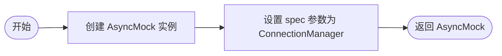

#### 带注释源码

```python
@pytest.fixture
def mock_manager() -> AsyncMock:
    # 创建并返回一个 AsyncMock 对象
    # spec=ConnectionManager 确保 mock 对象具有与 ConnectionManager 相同的属性和方法签名
    return AsyncMock(spec=ConnectionManager)
```


### `test_websocket_server_uses_cors_helper`

该测试函数用于验证 `WebsocketServer` 在启动时是否正确调用了 CORS 辅助函数（`build_cors_params`），并确保基于配置参数正确初始化了 `CORSMiddleware`。

参数：

-   `moker`：`FixtureRequest`，Pytest-mock 提供的 fixture，用于模拟（mock）外部依赖和函数调用。

返回值：`None`，该函数为测试用例，无返回值，主要通过断言验证行为。

#### 流程图

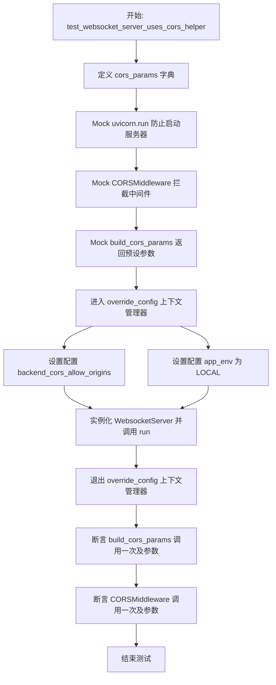

#### 带注释源码

```python
def test_websocket_server_uses_cors_helper(moker) -> None:
    # 定义预期的 CORS 配置参数
    cors_params = {
        "allow_origins": ["https://app.example.com"],
        "allow_origin_regex": None,
    }
    # Mock uvicorn.run 以防止实际启动服务器
    mocker.patch("backend.api.ws_api.uvicorn.run")
    # Mock CORSMiddleware 以验证其是否被正确调用
    cors_middleware = mocker.patch(
        "backend.api.ws_api.CORSMiddleware", return_value=object()
    )
    # Mock build_cors_params 辅助函数，使其返回预设的 cors_params
    build_cors = mocker.patch(
        "backend.api.ws_api.build_cors_params", return_value=cors_params
    )

    # 使用 override_config 上下文管理器临时覆盖配置项
    with override_config(
        settings, "backend_cors_allow_origins", cors_params["allow_origins"]
    ), override_config(settings, "app_env", AppEnvironment.LOCAL):
        # 在被覆盖的配置下运行 WebSocket 服务器
        WebsocketServer().run()

    # 验证 build_cors_params 是否被正确调用，参数包含允许的源和环境变量
    build_cors.assert_called_once_with(
        cors_params["allow_origins"], AppEnvironment.LOCAL
    )
    # 验证 CORSMiddleware 是否被正确调用，检查传递的参数是否符合预期
    cors_middleware.assert_called_once_with(
        app=websocket_app,
        allow_origins=cors_params["allow_origins"],
        allow_origin_regex=cors_params["allow_origin_regex"],
        allow_credentials=True,
        allow_methods=["*"],
        allow_headers=["*"],
    )
```


### `test_websocket_server_blocks_localhost_in_production`

该测试函数用于验证在生产环境配置下，如果 CORS 允许源列表中包含 localhost 地址，WebSocket 服务器在启动时会抛出 ValueError 异常，从而防止不安全的本地连接在生产环境中生效。

参数：

- `mocker`：`pytest_mock.MockerFixture`，Pytest 提供的 fixture，用于动态模拟（mock）对象和函数。

返回值：`None`，该函数为单元测试，无返回值。

#### 流程图

```mermaid
graph TD
    A[开始] --> B[模拟 uvicorn.run 阻止实际启动]
    B --> C[设置配置: CORS 允许源为 localhost:3000]
    C --> D[设置配置: 环境为 PRODUCTION]
    D --> E[调用 WebsocketServer().run]
    E --> F{是否抛出 ValueError?}
    F -- 是 --> G[测试通过]
    F -- 否 --> H[测试失败]
    G --> I[结束]
    H --> I
```

#### 带注释源码

```python
def test_websocket_server_blocks_localhost_in_production(mocker) -> None:
    # 模拟 uvicorn.run 函数，防止在测试过程中真正启动服务器
    mocker.patch("backend.api.ws_api.uvicorn.run")

    # 使用上下文管理器临时覆盖配置项
    with override_config(
        settings, "backend_cors_allow_origins", ["http://localhost:3000"]  # 设置允许的源为本地地址
    ), override_config(settings, "app_env", AppEnvironment.PRODUCTION):  # 设置环境为生产环境
        # 预期代码块会抛出 ValueError 异常
        # 如果不抛出异常，则测试失败，验证了生产环境禁止 localhost 的安全逻辑
        with pytest.raises(ValueError):
            WebsocketServer().run()
```


### `test_websocket_router_subscribe`

该函数是一个基于 pytest 的异步测试用例，旨在验证 WebSocket 路由器正确处理客户端的图形执行订阅请求。测试模拟了 WebSocket 连接、认证、消息接收（订阅请求及断开连接），并断言连接管理器正确执行了连接、订阅逻辑，同时验证了服务器返回的 JSON 响应格式和内容是否符合预期，最后确保连接断开时的清理工作被正确调用。

参数：

- `mock_websocket`：`AsyncMock`，用于模拟 FastAPI 的 WebSocket 连接对象，预设接收文本和断开连接的行为。
- `mock_manager`：`AsyncMock`，用于模拟连接管理器对象，用于验证连接、订阅和断开方法的调用情况。
- `snapshot`：`Snapshot`，用于捕获和比对服务器响应的 JSON 快照，确保输出格式稳定。
- `mocker`：`MockerFixture`，用于 patch（模拟）外部依赖函数，如认证函数。

返回值：`None`，该函数为测试函数，不返回业务数据，通过断言验证逻辑正确性。

#### 流程图

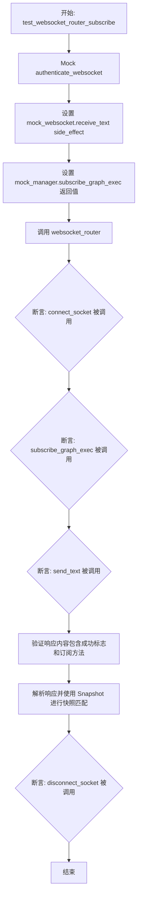

#### 带注释源码

```python
@pytest.mark.asyncio
async def test_websocket_router_subscribe(
    mock_websocket: AsyncMock, mock_manager: AsyncMock, snapshot: Snapshot, mocker
) -> None:
    # 1. 模拟认证函数，使其返回默认用户ID，确保认证步骤通过
    mocker.patch(
        "backend.api.ws_api.authenticate_websocket", return_value=DEFAULT_USER_ID
    )

    # 2. 配置模拟 WebSocket 接收文本的行为：
    #    - 第一次调用返回订阅图执行的 JSON 消息
    #    - 第二次调用触发 WebSocketDisconnect 异常，模拟客户端断开
    mock_websocket.receive_text.side_effect = [
        WSMessage(
            method=WSMethod.SUBSCRIBE_GRAPH_EXEC,
            data={"graph_exec_id": "test-graph-exec-1"},
        ).model_dump_json(),
        WebSocketDisconnect(),
    ]
    # 3. 配置连接管理器的订阅方法返回值，模拟订阅成功
    mock_manager.subscribe_graph_exec.return_value = (
        f"{DEFAULT_USER_ID}|graph_exec#test-graph-exec-1"
    )

    # 4. 调用实际的 websocket_router 函数，传入模拟对象进行测试
    await websocket_router(
        cast(WebSocket, mock_websocket), cast(ConnectionManager, mock_manager)
    )

    # 5. 验证阶段：断言连接管理器的方法调用情况
    #    - 验证连接方法是否被以正确的参数调用一次
    mock_manager.connect_socket.assert_called_once_with(
        mock_websocket, user_id=DEFAULT_USER_ID
    )
    #    - 验证订阅方法是否被以正确的参数调用一次
    mock_manager.subscribe_graph_exec.assert_called_once_with(
        user_id=DEFAULT_USER_ID,
        graph_exec_id="test-graph-exec-1",
        websocket=mock_websocket,
    )
    #    - 验证是否向客户端发送了文本响应
    mock_websocket.send_text.assert_called_once()
    
    # 6. 验证响应消息内容的正确性
    assert (
        '"method":"subscribe_graph_execution"'
        in mock_websocket.send_text.call_args[0][0]
    )
    assert '"success":true' in mock_websocket.send_text.call_args[0][0]

    # 7. 使用快照测试：捕获发送的消息，格式化后与预期快照文件进行对比
    #    这确保了响应的结构不会发生意外变更
    sent_message = mock_websocket.send_text.call_args[0][0]
    parsed_message = json.loads(sent_message)
    snapshot.snapshot_dir = "snapshots"
    snapshot.assert_match(json.dumps(parsed_message, indent=2, sort_keys=True), "sub")

    # 8. 验证 WebSocket 断开连接时，连接管理器的清理方法是否被调用
    mock_manager.disconnect_socket.assert_called_once_with(
        mock_websocket, user_id=DEFAULT_USER_ID
    )
```


### `test_websocket_router_unsubscribe`

测试WebSocket路由器处理取消订阅消息的能力。该测试模拟了客户端发送取消订阅请求以及随后的连接断开动作，验证了连接管理器是否正确执行了取消订阅逻辑、WebSocket是否按预期发送了包含成功状态的响应消息、响应消息的具体内容是否符合快照标准，以及在流程结束后连接是否被正确清理。

参数：

-  `mock_websocket`：`AsyncMock`，模拟的WebSocket客户端连接对象，用于模拟接收和发送消息。
-  `mock_manager`：`AsyncMock`，模拟的连接管理器对象，用于验证订阅/取消订阅等管理方法的调用情况。
-  `snapshot`：`Snapshot`，快照测试工具对象，用于比对实际响应消息与预期快照是否一致。
-  `mocker`：`pytest_mock.MockerFixture`，Pytest提供的Mock装置，用于替换（Patch）外部依赖函数的行为。

返回值：`None`，该函数为测试用例，不返回业务数据，主要通过断言来验证系统行为是否符合预期。

#### 流程图

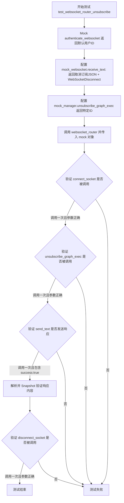

#### 带注释源码

```python
@pytest.mark.asyncio
async def test_websocket_router_unsubscribe(
    mock_websocket: AsyncMock, mock_manager: AsyncMock, snapshot: Snapshot, mocker
) -> None:
    # Mock the authenticate_websocket function to ensure it returns a valid user_id
    # 模拟认证函数，使其返回默认用户ID，确保后续逻辑能通过认证检查
    mocker.patch(
        "backend.api.ws_api.authenticate_websocket", return_value=DEFAULT_USER_ID
    )

    # 设置WebSocket接收文本的副作用：先收到取消订阅消息，随后触发断开连接
    mock_websocket.receive_text.side_effect = [
        WSMessage(
            method=WSMethod.UNSUBSCRIBE,
            data={"graph_exec_id": "test-graph-exec-1"},
        ).model_dump_json(),
        WebSocketDisconnect(),
    ]
    # 模拟连接管理器的取消订阅方法返回值
    mock_manager.unsubscribe_graph_exec.return_value = (
        f"{DEFAULT_USER_ID}|graph_exec#test-graph-exec-1"
    )

    # 调用被测的 websocket_router 函数，传入模拟的 WebSocket 和 ConnectionManager
    await websocket_router(
        cast(WebSocket, mock_websocket), cast(ConnectionManager, mock_manager)
    )

    # 验证：connect_socket 方法是否被调用了一次，且使用了正确的 user_id
    mock_manager.connect_socket.assert_called_once_with(
        mock_websocket, user_id=DEFAULT_USER_ID
    )
    # 验证：unsubscribe_graph_exec 方法是否被调用了一次，且参数正确
    mock_manager.unsubscribe_graph_exec.assert_called_once_with(
        user_id=DEFAULT_USER_ID,
        graph_exec_id="test-graph-exec-1",
        websocket=mock_websocket,
    )
    # 验证：WebSocket 是否发送了文本响应
    mock_websocket.send_text.assert_called_once()
    # 验证：发送的响应内容包含正确的 method 和 success 状态
    assert '"method":"unsubscribe"' in mock_websocket.send_text.call_args[0][0]
    assert '"success":true' in mock_websocket.send_text.call_args[0][0]

    # Capture and snapshot the WebSocket response message
    # 获取发送的消息内容并进行快照比对，确保响应格式未发生意外变更
    sent_message = mock_websocket.send_text.call_args[0][0]
    parsed_message = json.loads(sent_message)
    snapshot.snapshot_dir = "snapshots"
    snapshot.assert_match(json.dumps(parsed_message, indent=2, sort_keys=True), "unsub")

    # 验证：disconnect_socket 方法是否被调用了一次，确保连接被正确清理
    mock_manager.disconnect_socket.assert_called_once_with(
        mock_websocket, user_id=DEFAULT_USER_ID
    )
```


### `test_websocket_router_invalid_method`

该函数是一个测试用例，旨在验证当 WebSocket 客户端发送了一个无效的方法（例如，本应由服务端发送的 `GRAPH_EXECUTION_EVENT` 事件被客户端发送过来）时，`websocket_router` 是否能正确处理并返回错误响应，同时确保连接最终被正确断开。

参数：

- `mock_websocket`：`AsyncMock`，模拟 FastAPI 的 WebSocket 连接对象，用于模拟发送和接收消息的行为。
- `mock_manager`：`AsyncMock`，模拟连接管理器 (`ConnectionManager`) 对象，用于验证连接的建立与断开等管理逻辑的调用情况。
- `mocker`：`MockFixture`，pytest-mock 提供的 fixture，用于模拟（patch）外部依赖函数或对象，如 `authenticate_websocket`。

返回值：`None`，该函数作为测试用例，没有返回值，主要通过断言来验证行为。

#### 流程图

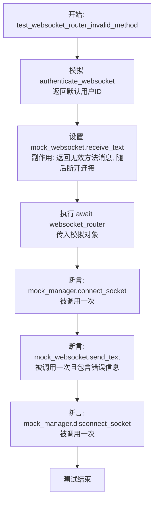

#### 带注释源码

```python
@pytest.mark.asyncio
async def test_websocket_router_invalid_method(
    mock_websocket: AsyncMock, mock_manager: AsyncMock, mocker
) -> None:
    # 模拟 authenticate_websocket 函数，使其绕过认证并返回默认的用户 ID
    mocker.patch(
        "backend.api.ws_api.authenticate_websocket", return_value=DEFAULT_USER_ID
    )

    # 设置 WebSocket 接收文本的副作用
    # 第一次接收返回一个无效的 WSMessage (GRAPH_EXECUTION_EVENT 通常不应由客户端发起)
    # 第二次接收触发 WebSocketDisconnect 异常，模拟客户端断开
    mock_websocket.receive_text.side_effect = [
        WSMessage(method=WSMethod.GRAPH_EXECUTION_EVENT).model_dump_json(),
        WebSocketDisconnect(),
    ]

    # 调用被测函数 websocket_router，传入模拟的 WebSocket 和 Manager
    await websocket_router(
        cast(WebSocket, mock_websocket), cast(ConnectionManager, mock_manager)
    )

    # 验证连接管理器的 connect_socket 方法是否被正确调用一次
    mock_manager.connect_socket.assert_called_once_with(
        mock_websocket, user_id=DEFAULT_USER_ID
    )
    
    # 验证 WebSocket 是否发送了一次文本响应
    mock_websocket.send_text.assert_called_once()
    
    # 验证发送的响应中包含错误方法标识 ("method":"error")
    assert '"method":"error"' in mock_websocket.send_text.call_args[0][0]
    
    # 验证发送的响应中包含失败状态 ("success":false)
    assert '"success":false' in mock_websocket.send_text.call_args[0][0]
    
    # 验证在处理结束后，连接管理器的 disconnect_socket 方法是否被调用以清理资源
    mock_manager.disconnect_socket.assert_called_once_with(
        mock_websocket, user_id=DEFAULT_USER_ID
    )
```


### `test_handle_subscribe_success`

该测试用例用于验证在提供有效数据的情况下，`handle_subscribe` 函数能否正确处理图执行订阅请求。测试通过模拟 WebSocket 和连接管理器，调用目标处理函数，并断言管理器的订阅方法被正确触发，同时 WebSocket 返回了包含正确方法和成功标志的响应消息。

参数：

-  `mock_websocket`：`AsyncMock`，模拟的 WebSocket 连接对象，用于测试 WebSocket 交互。
-  `mock_manager`：`AsyncMock`，模拟的连接管理器对象，用于测试业务逻辑中的管理器调用。

返回值：`None`，该函数为测试用例，主要用于验证逻辑，不返回业务数据。

#### 流程图

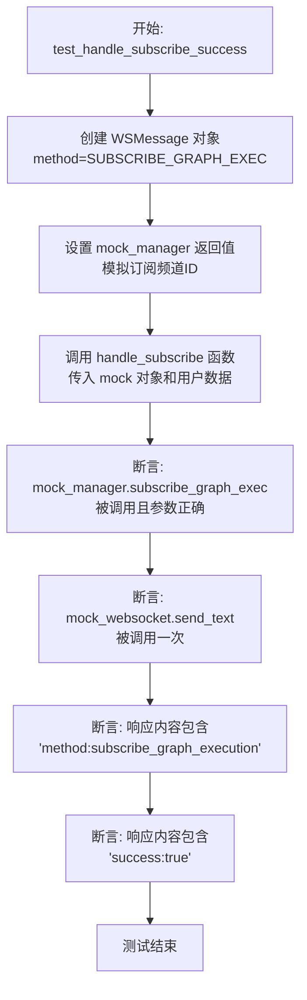

#### 带注释源码

```python
    # 标记为异步测试函数，接受模拟的 WebSocket 和连接管理器作为参数
    @pytest.mark.asyncio
    async def test_handle_subscribe_success(
        mock_websocket: AsyncMock, mock_manager: AsyncMock
    ) -> None:
        # 准备测试数据：创建一个订阅图执行的 WebSocket 消息对象
        message = WSMessage(
            method=WSMethod.SUBSCRIBE_GRAPH_EXEC,
            data={"graph_exec_id": "test-graph-exec-id"},
        )
        # 准备 Mock 对象行为：设置连接管理器的订阅方法返回值，模拟订阅成功
        mock_manager.subscribe_graph_exec.return_value = (
            "user-1|graph_exec#test-graph-exec-id"
        )

        # 执行操作：调用 handle_subscribe 函数处理消息
        await handle_subscribe(
            connection_manager=cast(ConnectionManager, mock_manager),
            websocket=cast(WebSocket, mock_websocket),
            user_id="user-1",
            message=message,
        )

        # 验证结果：检查连接管理器的订阅方法是否被以正确的参数调用了一次
        mock_manager.subscribe_graph_exec.assert_called_once_with(
            user_id="user-1",
            graph_exec_id="test-graph-exec-id",
            websocket=mock_websocket,
        )
        # 验证结果：检查 WebSocket 是否发送了文本响应
        mock_websocket.send_text.assert_called_once()
        # 验证结果：检查响应消息中是否包含预期的方法名 'subscribe_graph_execution'
        assert (
            '"method":"subscribe_graph_execution"'
            in mock_websocket.send_text.call_args[0][0]
        )
        # 验证结果：检查响应消息中是否包含成功标志 'success':true
        assert '"success":true' in mock_websocket.send_text.call_args[0][0]
```


### `test_handle_subscribe_missing_data`

该测试函数用于验证当发送给 `handle_subscribe` 的订阅消息缺少必要的 `data` 字段（即 `graph_exec_id`）时，系统是否能正确处理该异常情况，确保不执行实际的订阅逻辑，并通过 WebSocket 向客户端返回一个包含错误信息和失败状态的消息。

参数：

-   `mock_websocket`：`AsyncMock`，用于模拟 WebSocket 连接对象的 Mock 对象，用于模拟客户端连接和捕获发送的消息。
-   `mock_manager`：`AsyncMock`，用于模拟连接管理器（ConnectionManager）的 Mock 对象，用于验证订阅方法是否被调用。

返回值：`None`，该函数是一个测试用例，没有返回值，主要通过断言来验证行为。

#### 流程图

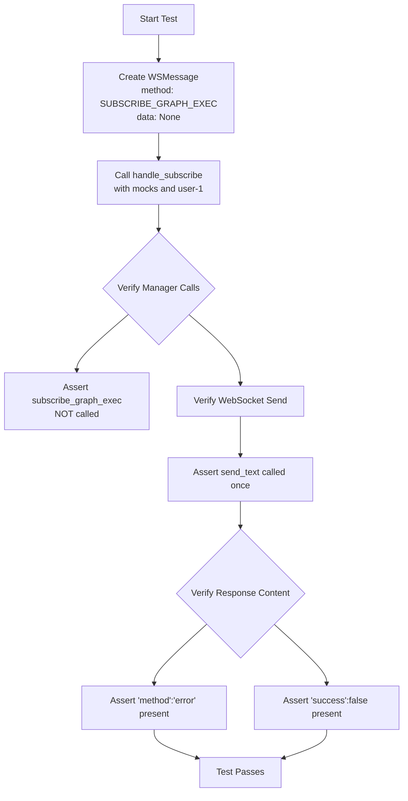

#### 带注释源码

```python
@pytest.mark.asyncio
async def test_handle_subscribe_missing_data(
    mock_websocket: AsyncMock, mock_manager: AsyncMock
) -> None:
    # 构造测试数据：创建一个 SUBSCRIBE_GRAPH_EXEC 类型的消息，但故意不包含 data 字段
    message = WSMessage(method=WSMethod.SUBSCRIBE_GRAPH_EXEC)

    # 调用被测函数 handle_subscribe
    await handle_subscribe(
        connection_manager=cast(ConnectionManager, mock_manager),
        websocket=cast(WebSocket, mock_websocket),
        user_id="user-1",
        message=message,
    )

    # 断言 1: 验证由于缺少数据，管理器的 subscribe_graph_exec 方法不应被调用
    mock_manager.subscribe_graph_exec.assert_not_called()
    
    # 断言 2: 验证 WebSocket 对象的 send_text 方法被调用了一次
    mock_websocket.send_text.assert_called_once()
    
    # 断言 3: 验证发送的消息内容包含 "method":"error"，表明返回了错误类型
    assert '"method":"error"' in mock_websocket.send_text.call_args[0][0]
    
    # 断言 4: 验证发送的消息内容包含 "success":false，表明操作失败
    assert '"success":false' in mock_websocket.send_text.call_args[0][0]
```


### `test_handle_unsubscribe_success`

该函数是一个异步测试用例，用于验证当收到包含有效数据的取消订阅消息时，`handle_unsubscribe` 函数能否正确处理请求，即成功调用连接管理器的取消订阅方法，并通过 WebSocket 返回成功的响应消息。

参数：

- `mock_websocket`：`AsyncMock`，模拟的 WebSocket 连接对象，用于模拟客户端交互及验证发送的消息。
- `mock_manager`：`AsyncMock`，模拟的连接管理器对象，用于验证订阅状态管理的方法是否被正确调用。

返回值：`None`，该函数主要用于断言和验证逻辑，不返回具体数值。

#### 流程图

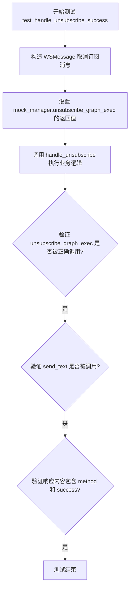

#### 带注释源码

```python
@pytest.mark.asyncio
async def test_handle_unsubscribe_success(
    mock_websocket: AsyncMock, mock_manager: AsyncMock
) -> None:
    # 构造一个包含取消订阅方法和有效数据的 WebSocket 消息对象
    message = WSMessage(
        method=WSMethod.UNSUBSCRIBE, data={"graph_exec_id": "test-graph-exec-id"}
    )
    # 设置模拟连接管理器中取消订阅方法的返回值，模拟成功操作
    mock_manager.unsubscribe_graph_exec.return_value = (
        "user-1|graph_exec#test-graph-exec-id"
    )

    # 调用实际的处理函数 handle_unsubscribe，传入模拟对象和消息
    await handle_unsubscribe(
        connection_manager=cast(ConnectionManager, mock_manager),
        websocket=cast(WebSocket, mock_websocket),
        user_id="user-1",
        message=message,
    )

    # 断言：验证连接管理器的取消订阅方法是否被调用了一次，且参数正确
    mock_manager.unsubscribe_graph_exec.assert_called_once_with(
        user_id="user-1",
        graph_exec_id="test-graph-exec-id",
        websocket=mock_websocket,
    )
    # 断言：验证 WebSocket 是否发送了一次文本消息
    mock_websocket.send_text.assert_called_once()
    # 断言：验证发送的消息中包含取消订阅的方法名和成功状态标识
    assert '"method":"unsubscribe"' in mock_websocket.send_text.call_args[0][0]
    assert '"success":true' in mock_websocket.send_text.call_args[0][0]
```


### `test_handle_unsubscribe_missing_data`

测试用例，用于验证当收到缺少必要数据字段的取消订阅消息时的行为。确保取消订阅逻辑被跳过，并返回错误响应。

参数：

-   `mock_websocket`：`AsyncMock`，模拟的 WebSocket 连接对象，用于测试交互。
-   `mock_manager`：`AsyncMock`，模拟的连接管理器对象，用于验证业务逻辑调用。

返回值：`None`，该函数为异步测试函数，无返回值。

#### 流程图

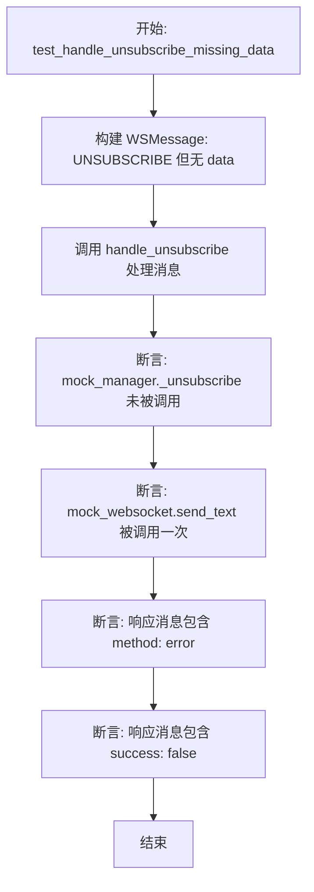

#### 带注释源码

```python
@pytest.mark.asyncio
async def test_handle_unsubscribe_missing_data(
    mock_websocket: AsyncMock, mock_manager: AsyncMock
) -> None:
    # 构建一个 WebSocket 消息，方法为 UNSUBSCRIBE，但不包含 data 字段
    message = WSMessage(method=WSMethod.UNSUBSCRIBE)

    # 调用 handle_unsubscribe 函数，传入模拟的连接管理器、WebSocket、用户 ID 和不完整的消息
    await handle_unsubscribe(
        connection_manager=cast(ConnectionManager, mock_manager),
        websocket=cast(WebSocket, mock_websocket),
        user_id="user-1",
        message=message,
    )

    # 验证：由于缺少数据，连接管理器的取消订阅方法（此处代码引用了 _unsubscribe）不应被调用
    mock_manager._unsubscribe.assert_not_called()
    
    # 验证：WebSocket 应该向客户端发送一条文本响应
    mock_websocket.send_text.assert_called_once()
    
    # 验证：发送的消息中包含错误方法标识 "method":"error"
    assert '"method":"error"' in mock_websocket.send_text.call_args[0][0]
    
    # 验证：发送的消息中包含操作失败标识 "success":false
    assert '"success":false' in mock_websocket.send_text.call_args[0][0]
```


## 关键组件


### WebsocketServer
负责WebSocket服务器的初始化与运行，核心功能包括加载应用环境配置、应用CORS安全策略以及启动Uvicorn服务。

### ConnectionManager
WebSocket连接的状态管理器，负责处理用户连接的建立与断开，以及维护图执行任务的订阅与取消订阅关系。

### WebSocketRouter
WebSocket消息的路由与分发中心，负责验证用户身份、解析客户端消息并根据消息方法类型将请求调度至对应的处理器。

### Message Handlers
具体的业务逻辑处理组件，包含 `handle_subscribe` 和 `handle_unsubscribe` 等函数，用于执行图执行的订阅、取消订阅操作及错误校验。

### CORS Configuration
跨域资源共享配置组件，根据应用运行环境（如本地开发或生产环境）动态设置允许的请求源、方法和头部，增强接口安全性。


## 问题及建议


### 已知问题

-   **测试目标不一致**：在 `test_handle_unsubscribe_missing_data` 中，代码断言了 `mock_manager._unsubscribe.assert_not_called()`，而在 `test_handle_unsubscribe_success` 中断言的是 `mock_manager.unsubscribe_graph_exec`。这表明测试代码可能针对了错误的（可能是私有的或非预期的）方法，导致测试逻辑不可靠。
-   **脆弱的字符串断言**：多处测试（如 `test_websocket_router_subscribe`）使用 `assert '"method":"subscribe_graph_execution"' in ...` 这种字符串子串匹配来验证 JSON 响应。这种方式依赖于 JSON 的具体字符串格式（包括引号、空格等），任何序列化格式的变化都会导致测试失败，维护性差。
-   **冗余的测试逻辑**：在使用了 Snapshot（快照）测试的用例中，依然保留了手动解析 JSON 并进行字符串匹配的逻辑。这种双重验证不仅增加了代码量，还可能导致维护时的不一致（修改了快照但未修改字符串断言，反之亦然）。
-   **硬编码的 Mock 属性**：`mock_websocket` fixture 中通过 `mock.query_params = {}` 手动添加属性。这种硬编码方式隐藏了 WebSocket 对象的接口要求，如果实际代码对 `query_params` 有更复杂的类型或内容要求，Mock 可能无法有效模拟真实场景。

### 优化建议

-   **使用参数化测试**：利用 `@pytest.mark.parametrize` 重构 `test_handle_subscribe_success`、`test_handle_unsubscribe_success` 及其对应的 `missing_data` 测试。这两组测试的逻辑结构高度相似，参数化可以显著减少重复代码，提高测试集的简洁性。
-   **采用结构化 JSON 验证**：将字符串子串匹配改为对解析后的 JSON 对象进行字段断言（例如 `assert parsed_message["method"] == "subscribe_graph_execution"`）。这能消除对序列化格式的依赖，使测试意图更清晰、更稳定。
-   **统一 Mock 接口调用**：修正 `test_handle_unsubscribe_missing_data` 中的断言，确保其验证的是公共接口 `unsubscribe_graph_exec` 而非私有方法 `_unsubscribe`，或者确认被测函数是否错误地调用了私有方法，以保证测试的有效性。
-   **集中配置快照路径**：将 `snapshot.snapshot_dir = "snapshots"` 的设置移至 `conftest.py` 或 pytest 配置文件中，避免在每个测试用例中重复编写，便于统一管理。
-   **移除快照测试中的冗余断言**：在已经通过 Snapshot 完整验证消息结构的测试用例中，移除针对同一消息的手动字符串断言，仅保留针对特定关键业务逻辑（如 ID、成功状态）的轻量级断言，以平衡测试覆盖率和维护成本。


## 其它


### 设计目标与约束

1.  **环境安全约束**：系统根据 `AppEnvironment` 区分运行环境。在生产（`PRODUCTION`）模式下，严格禁止将 `localhost` 作为允许的 CORS 来源，以防止安全风险。
2.  **数据完整性约束**：WebSocket 通信协议强制要求消息结构的严格校验。请求必须符合 `WSMessage` 格式，且特定方法（如 `SUBSCRIBE_GRAPH_EXEC`）必须在 `data` 字段中包含必填项（如 `graph_exec_id`）。缺失必填数据将直接拒绝处理并返回错误。

### 错误处理与异常设计

1.  **启动时配置校验**：在服务器启动阶段，如果配置项（如 CORS 设置）不满足当前环境的安全要求（例如生产环境包含 localhost），系统将抛出 `ValueError` 异常，阻止服务启动。
2.  **WebSocket 业务逻辑错误**：运行时产生的业务逻辑错误（如未知的请求方法、缺少必要参数）不会导致程序崩溃或直接关闭连接。相反，系统会捕获这些错误，并通过 WebSocket 发送标准化的 JSON 错误响应（包含 `"method": "error"` 和 `"success": false`），允许客户端进行后续处理。
3.  **连接中断处理**：系统设计了对 `WebSocketDisconnect` 异常的捕获机制，确保在客户端意外断开或连接中断时，能够触发清理流程（如调用 `ConnectionManager.disconnect_socket`），释放相关资源。

### 外部依赖与接口契约

1.  **FastAPI WebSocket**：核心依赖 FastAPI 的 `WebSocket` 类。代码依赖其 `receive_text()` 方法接收数据，`send_text()` 方法发送数据，以及 `query_params` 属性进行初步的参数获取。
2.  **ConnectionManager**：内部依赖组件，用于管理 WebSocket 连接池和订阅关系。接口契约包含 `connect_socket`（建立连接）、`disconnect_socket`（断开连接）、`subscribe_graph_exec`（订阅图执行事件）和 `unsubscribe_graph_exec`（取消订阅）等方法。
3.  **认证接口**：依赖 `authenticate_websocket` 函数对连接进行鉴权，该接口需返回有效的用户 ID（`user_id`）字符串作为后续操作的上下文。
4.  **消息协议契约**：
    *   **入站**：JSON 格式，需包含 `method`（枚举类型，如 `subscribe_graph_exec`）和 `data`（载荷数据）。
    *   **出站**：JSON 格式，响应中必须包含 `method`（对应的操作名或 "error"）、`success`（布尔值，表示操作是否成功）以及相关的 `data`。

### 数据流与状态机

1.  **连接生命周期状态机**：
    *   **连接建立**：WebSocket 握手完成。
    *   **认证与注册**：调用 `authenticate_websocket` 验证身份，随后调用 `ConnectionManager.connect_socket` 将连接加入管理池。
    *   **消息循环处理**：循环调用 `receive_text` 接收消息 -> 解析 JSON -> 根据 `WSMethod` 路由至对应的处理函数（`handle_subscribe` 或 `handle_unsubscribe`） -> 处理业务逻辑（如更新订阅关系） -> 调用 `send_text` 返回结果。
    *   **断开连接**：捕获 `WebSocketDisconnect` 或循环结束 -> 调用 `ConnectionManager.disconnect_socket` 移除连接 -> 状态终止。
2.  **订阅状态流转**：用户连接后可处于“未订阅”或“已订阅特定图执行”的状态。系统通过 `ConnectionManager` 维护用户 ID 与图执行 ID（`graph_exec_id`）的映射关系。`subscribe` 操作将连接与特定 ID 绑定，而 `unsubscribe` 操作解绑该关系。

    