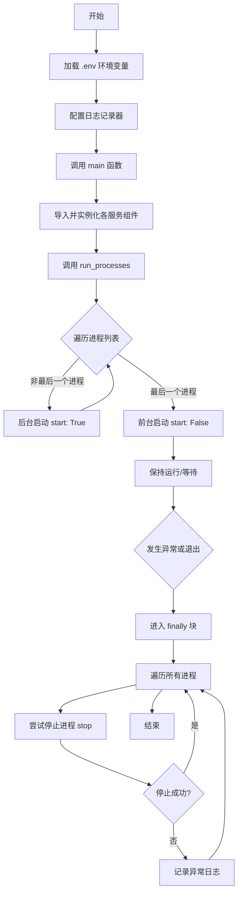
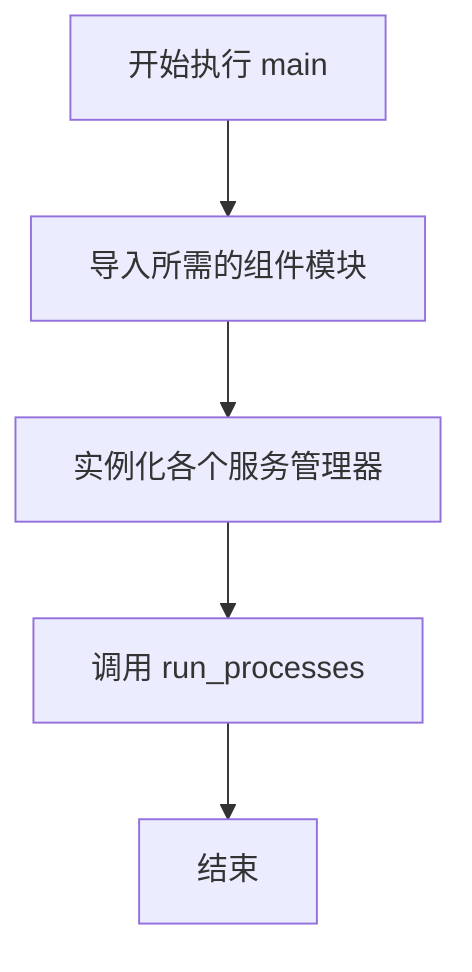

# `AutoGPT\autogpt_platform\backend\backend\app.py` 详细设计文档

该代码是 AutoGPT-server 应用程序的主入口，负责加载环境变量并编排多个核心服务进程（包括数据库、调度器、通知、WebSocket、REST API 及执行管理器）的启动。它定义了一个进程管理机制，确保除了最后一个主进程在前台运行外，其他所有进程都在后台并发启动，并提供了统一的异常捕获与进程停止清理逻辑。

## 整体流程



## 类结构

```

```

## 全局变量及字段


### `logger`
    
该模块的日志记录器实例，用于记录程序运行过程中的信息、警告及错误。

类型：`logging.Logger`
    


    

## 全局函数及方法


### `run_processes`

执行应用中的所有进程，最后一个进程在前台运行，其余进程在后台运行。包含增强的错误处理和进程生命周期管理。

参数：

- `processes`：`"AppProcess"`，一系列需要执行的应用进程对象。
- `kwargs`：`dict`，传递给每个进程 `start` 方法的额外关键字参数。

返回值：`None`，该函数没有返回值。

#### 流程图

```mermaid
graph TD
    A[开始执行 run_processes] --> B[进入 Try 块]
    B --> C[遍历进程列表 processes[:-1]]
    C --> D{是否遍历完前置进程?}
    D -- 否 --> E[调用 process.start background=True kwargs]
    E --> C
    D -- 是 --> F[获取最后一个进程 processes[-1]]
    F --> G[调用 process.start background=False kwargs]
    G --> H[执行完毕或发生异常 进入 Finally 块]
    H --> I[遍历所有进程]
    I --> J{是否遍历完所有进程?}
    J -- 否 --> K[调用 process.stop]
    K --> L{是否抛出异常?}
    L -- 是 --> M[记录错误日志 logger.exception]
    L -- 否 --> I
    J -- 是 --> N[结束]
```

#### 带注释源码

```python
def run_processes(*processes: "AppProcess", **kwargs):
    """
    执行应用中的所有进程。最后一个进程在前台运行。
    包含增强的错误处理和进程生命周期管理。
    """
    try:
        # 在后台运行除最后一个进程外的所有进程。
        # processes[:-1] 切片获取除最后一个之外的所有进程。
        for process in processes[:-1]:
            # 启动进程，background=True 表示在后台线程/进程中运行，不阻塞主线程。
            process.start(background=True, **kwargs)

        # 在前台运行最后一个进程。
        # background=False 会阻塞当前线程，直到该进程结束或出错。
        processes[-1].start(background=False, **kwargs)
    finally:
        # 无论前面的代码是否成功执行，finally 块确保所有进程都会被尝试停止。
        # 这是为了防止僵尸进程或资源未释放。
        for process in processes:
            try:
                # 尝试优雅地停止进程。
                process.stop()
            except Exception as e:
                # 如果停止过程中发生异常，捕获并记录日志，避免中断其他进程的清理工作。
                logger.exception(f"[{process.service_name}] unable to stop: {e}")
```


### `main`

初始化并启动 AutoGPT-server 所需的所有进程，包括 REST API、WebSocket API、数据库管理、执行管理和调度器等核心组件。

参数：

- `kwargs`：`dict`，传递给底层进程启动方法的关键字参数。

返回值：`None`，无返回值。

#### 流程图



#### 带注释源码

```python
def main(**kwargs):
    """
    Run all the processes required for the AutoGPT-server (REST and WebSocket APIs).
    """

    # 延迟导入，确保模块加载顺序正确并避免潜在的循环依赖
    from backend.api.rest_api import AgentServer
    from backend.api.ws_api import WebsocketServer
    from backend.executor import DatabaseManager, ExecutionManager, Scheduler
    from backend.notifications import NotificationManager

    # 调用 run_processes 函数启动所有服务
    # 参数包括：
    # - DatabaseManager: 数据库管理器，设置日志级别为 warning
    # - Scheduler: 任务调度器
    # - NotificationManager: 通知管理器
    # - WebsocketServer: WebSocket API 服务器
    # - AgentServer: REST API 服务器
    # - ExecutionManager: 执行管理器
    # 前五个进程将在后台运行，ExecutionManager 将在前台运行（作为最后一个参数）
    run_processes(
        DatabaseManager().set_log_level("warning"),
        Scheduler(),
        NotificationManager(),
        WebsocketServer(),
        AgentServer(),
        ExecutionManager(),
        **kwargs,
    )
```


## 关键组件


### 进程生命周期管理 (run_processes)
负责编排应用程序的启动流程，将除最后一个进程外的所有进程在后台运行，最后一个进程在前台运行，并包含异常处理逻辑以确保所有进程在退出时能被正确停止。

### 应用程序入口点 (main)
AutoGPT-Server 的主启动函数，负责按顺序初始化并聚合 REST API、WebSocket、数据库管理器、执行管理器、调度器和通知管理器等核心组件。

### REST API 服务
提供 HTTP 接口服务，处理外部客户端的 RESTful 请求，是 AutoGPT-Server 与外部交互的主要入口之一。

### WebSocket 服务
提供实时双向通信接口，处理 WebSocket 连接，用于服务端与客户端之间的实时数据推送和交互。

### 执行管理器
负责任务的执行逻辑，代理具体的操作执行过程。

### 数据库管理器
负责数据库连接和操作管理，处理数据的持久化存储，并在此处被配置了日志级别。

### 调度器
负责任务的调度逻辑，管理和分发待执行的任务。

### 通知管理器
负责系统内外的通知发送，处理告警或状态更新的消息推送。


## 问题及建议


### 已知问题

-   **缺乏显式的依赖管理与启动顺序控制**：`run_processes` 函数和 `main` 函数依赖实例化的列表顺序来决定启动顺序。如果 `AgentServer` 或 `WebsocketServer` 依赖于 `ExecutionManager` 或 `Scheduler` 的完全就绪，当前的顺序可能会导致启动时的竞态条件或调用失败。
-   **关闭顺序逻辑存在缺陷**：在 `finally` 块中，进程停止的顺序是按照列表正序（`DatabaseManager` -> ... -> `ExecutionManager`）执行的。在微服务或进程组架构中，通常应该逆序停止（先停止依赖者，再停止被依赖者）。当前逻辑可能导致被依赖的服务（如数据库管理器）先关闭，导致依赖它的服务（如执行管理器）在关闭时报错。
-   **硬编码的配置信息**：`DatabaseManager().set_log_level("warning")` 直接在代码中硬编码了日志级别。这降低了代码在不同环境（开发、测试、生产）之间的灵活性，且修改需要重新部署代码。
-   **缺乏健壮的信号处理机制**：代码仅依赖 `try...finally` 进行清理。如果接收到 SIGTERM 信号，且前台进程（`ExecutionManager`）处于阻塞状态且未正确处理中断信号，可能会导致程序无法优雅退出，或者后台进程无法被及时清理。
-   **组件耦合度高**：`main` 函数直接导入并实例化了所有具体组件，使得该入口点难以复用（例如，难以单独运行测试环境或仅启动部分服务）。

### 优化建议

-   **引入基于 DAG 的生命周期管理**：实现一个生命周期管理器，允许每个 `AppProcess` 声明其依赖项。系统根据依赖关系图（DAG）自动计算正确的启动顺序和逆序的关闭顺序，确保依赖安全。
-   **使用上下文管理器（Context Manager）**：建议 `AppProcess` 类实现 `__enter__` 和 `__exit__` 方法，利用 Python 的 `with` 语句或上下文管理工具来确保资源的自动获取和释放，使代码结构更清晰，异常处理更安全。
-   **配置外部化**：将日志级别、进程启动参数等配置项移至配置文件（如 YAML、JSON）或环境变量中。在 `main` 函数中读取配置并动态注入，提高环境适应能力。
-   **实现显式的信号捕获与处理**：注册 `signal.SIGINT` 和 `signal.SIGTERM` 处理函数。当接收到终止信号时，设置一个停止标志位或直接调用 `run_processes` 的清理逻辑，确保所有进程能优雅地停止。
-   **采用依赖注入或工厂模式**：解耦 `main` 函数与具体组件的实现。可以使用工厂函数或依赖注入容器来创建进程实例，从而支持根据不同的配置启动不同的进程组合。


## 其它


### 设计目标与约束

该代码旨在作为 AutoGPT-server 应用程序的统一启动器和编排器。其核心目标是以特定的顺序初始化并管理多个后台服务（数据库、调度器、通知）和用户界面服务（REST、WebSocket）的生命周期。

**设计目标：**
1. **统一入口：** 提供单一的 `main()` 函数来启动整个系统的所有组件。
2. **优雅的生命周期管理：** 确保在程序退出或发生错误时，所有已启动的进程都能被正确停止，释放资源。
3. **灵活的进程编排：** 支持同时运行多个后台进程，并保持最后一个进程（通常是主服务）在前台运行以维持会话。

**约束：**
1. **接口依赖：** 所有传入 `run_processes` 的对象必须隐式遵循 `AppProcess` 接口协议，即必须实现 `start(background=True/False, **kwargs)` 和 `stop()` 方法。
2. **延迟导入：** 为避免循环依赖及加快启动速度，具体的业务模块（如 `AgentServer`）在函数内部进行局部导入。
3. **阻塞特性：** 程序的执行流最终会被最后一个前台进程阻塞，直到该进程结束。

### 错误处理与异常设计

代码采用了“尽力而为”的资源清理策略，确保即使在部分组件失败的情况下，系统也能尝试进行有序关闭。

1. **启动阶段异常：**
   - `run_processes` 使用 `try...finally` 结构包裹启动逻辑。
   - 如果任何一个后台进程启动失败，或者最后一个前台进程启动失败，异常会向上抛出，中断后续进程的启动，直接跳转到 `finally` 块。
   
2. **停止阶段异常：**
   - 在 `finally` 块中，代码遍历所有进程列表并调用 `stop()`。
   - 停止操作被包裹在独立的 `try...except` 块中。
   - **容错机制：** 如果某个进程的 `stop()` 方法抛出异常，该异常会被捕获并记录日志（`logger.exception`），而不会中断循环，确保后续的其他进程也能执行停止操作。
   - **日志记录：** 所有的停止失败都会记录具体的进程名称（`service_name`）和错误详情，便于运维排查。

### 外部依赖与接口契约

该模块依赖于特定的外部库和内部接口契约。

**外部库依赖：**
- `logging`: Python 标准库，用于记录运行时信息和异常。
- `dotenv` (python-dotenv): 用于从 `.env` 文件中加载环境变量，必须在应用逻辑开始前调用 `load_dotenv()`。

**接口契约 (`AppProcess` Protocol):**
虽然代码使用了 `TYPE_CHECKING` 进行类型提示，但在运行时，传入 `run_processes` 的对象必须符合以下隐式契约：
- **`start(background: bool, **kwargs)`**:
  - **参数**: `background` 为布尔值，指示是否在后台线程/进程中运行；`kwargs` 为传递给进程的额外配置。
  - **行为**: 如果 `background` 为 `True`，应非阻塞地启动服务；如果为 `False`，应阻塞当前线程直到服务结束。
- **`stop()`**:
  - **行为**: 执行清理操作，终止服务，释放资源。该操作必须是幂等的或安全的，即使进程未完全启动也能被调用。
- **`service_name` (属性)**:
  - **类型**: `str`
  - **用途**: 用于日志记录，标识具体的进程名称。

**内部模块依赖：**
程序依赖于 `backend` 包下的多个具体实现模块，包括：
- `backend.api.rest_api.AgentServer`
- `backend.api.ws_api.WebsocketServer`
- `backend.executor.DatabaseManager`
- `backend.executor.ExecutionManager`
- `backend.executor.Scheduler`
- `backend.notifications.NotificationManager`

### 并发与执行模型

程序采用了“主从/前台后台”混合的并发模型来组织服务。

1. **后台进程:**
   - 列表中的前 N-1 个进程被标记为后台进程。
   - 这些进程通常负责辅助任务，如数据库维护、任务调度、通知发送等。
   - 通过 `process.start(background=True)` 调用，预期它们会启动独立的线程、协程或子进程，并立即返回控制权。

2. **前台进程:**
   - 列表中的最后一个进程（通常是 `AgentServer` 或 `ExecutionManager`）作为前台进程运行。
   - 通过 `process.start(background=False)` 调用，该调用会阻塞主线程。
   - 这种设计将应用程序的生命周期绑定到前台进程上：当前台进程退出（无论是正常关闭还是崩溃）时，主线程结束，触发 `finally` 块进而关闭所有后台进程。

3. **顺序启动:**
   - 进程严格按照传入列表的顺序依次启动。这允许控制依赖关系（例如：先启动 `DatabaseManager`，再启动依赖它的 `AgentServer`）。

### 配置管理

配置管理采用了环境变量注入与动态参数传递相结合的方式。

1. **环境变量加载:**
   - 脚本入口处立即调用 `load_dotenv()`。这意味着所有配置项（如数据库连接字符串、API 端口等）预期存储在项目根目录的 `.env` 文件中。

2. **动态参数传递 (`**kwargs`):**
   - `main` 函数接收 `**kwargs` 并将其透传给 `run_processes`。
   - `run_processes` 进一步将这些参数传递给每个进程的 `start` 方法。
   - 这允许在不修改代码的情况下，通过命令行参数或调用逻辑动态覆盖进程配置（例如：临时修改日志级别、端口等）。

3. **实例级配置:**
   - 在 `main` 函数中，代码展示了实例级的特定配置。例如：`DatabaseManager().set_log_level("warning")`。这种硬编码配置用于设定那些不应由环境变量覆盖的默认行为，确保关键组件（如数据库）在启动时不会产生过多的日志噪音。
    