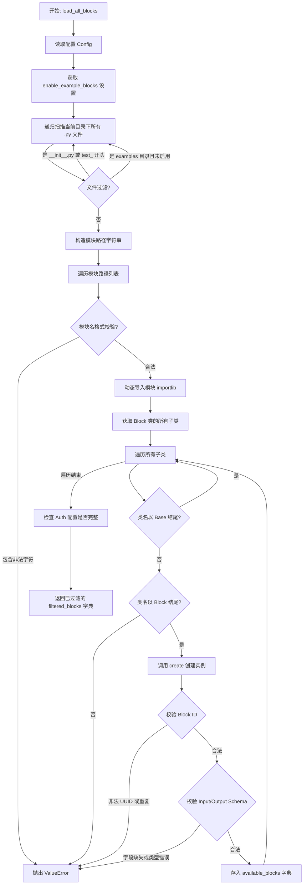
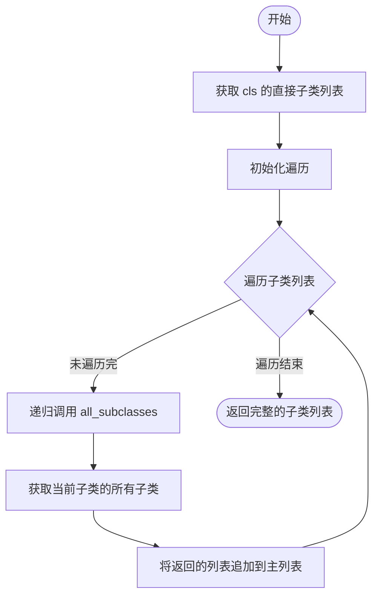

# `.\AutoGPT\autogpt_platform\backend\backend\blocks\__init__.py` 详细设计文档

该文件主要负责动态发现、加载和验证系统中的所有'Block'（功能块）组件，通过扫描特定目录下的模块、递归查找Block类的子类，并对类名、ID唯一性、输入输出Schema的完整性及字段类型进行严格校验，最后根据配置和授权状态过滤并返回可用的Block类集合。

## 整体流程

```mermaid
graph TD
    A[开始] --> B{检查缓存 ttl_seconds=3600}
    B -- 缓存未命中 --> C[读取配置 Config]
    C --> D[扫描当前目录及子目录文件]
    D --> E[过滤非目标文件 __init__, test_, examples]
    E --> F[构建模块路径字符串]
    F --> G{验证模块名称格式}
    G -- 非法 --> H[抛出 ValueError]
    G -- 合法 --> I[动态导入模块 importlib]
    I --> J[获取 Block 类的所有子类]
    J --> K[遍历所有子类]
    K --> L{类名以 Base 结尾?}
    L -- 是 --> M[跳过该类]
    L -- 否 --> N{类名以 Block 结尾?}
    N -- 否 --> O[抛出 ValueError]
    N -- 是 --> P[调用 block_cls.create() 获取实例]
    P --> Q{检查 ID 是否为有效 UUID}
    Q -- 否 --> R[抛出 ValueError]
    Q -- 是 --> S{检查 ID 是否重复}
    S -- 是 --> T[抛出 ValueError]
    S -- 否 --> U[验证 Input/Output Schema]
    U --> V{验证字段注解和 SchemaField 定义}
    V -- 失败 --> W[抛出 ValueError]
    V -- 成功 --> X[验证 error 字段和布尔字段默认值]
    X -- 失败 --> Y[抛出 ValueError]
    X -- 成功 --> Z[添加至可用块字典 available_blocks]
    Z --> K
    M --> K
    K --> AA[遍历结束]
    AA --> AB[遍历 available_blocks]
    AB --> AC{检查授权配置 is_block_auth_configured}
    AC -- 未配置 --> AD[过滤掉该 Block]
    AC -- 已配置 --> AE[保留该 Block]
    AE --> AB
    AB --> AF[返回过滤后的 Block 字典]
```

## 类结构

```
No classes defined in this file
```

## 全局变量及字段


### `logger`
    
日志记录器实例，用于记录模块运行时的信息和错误。

类型：`logging.Logger`
    


### `T`
    
泛型类型变量，用于在类型注解中表示任意类型。

类型：`TypeVar`
    


    

## 全局函数及方法


### `load_all_blocks`

该函数用于动态发现、加载、验证并返回所有可用的 Block 类，支持根据配置过滤示例块，并校验块的 ID、Schema 结构及认证配置。

参数：

-  无

返回值：`dict[str, type["Block"]]`，一个包含所有有效且认证配置已完成的 Block 类的字典，键为 Block 的 ID，值为 Block 的类类型。

#### 流程图



#### 带注释源码

```python
@cached(ttl_seconds=3600)
def load_all_blocks() -> dict[str, type["Block"]]:
    from backend.data.block import Block
    from backend.util.settings import Config

    # 检查配置，确认是否需要加载示例块
    config = Config()
    load_examples = config.enable_example_blocks

    # 动态加载 backend.blocks 下的所有模块
    current_dir = Path(__file__).parent
    modules = []
    
    # 递归查找当前目录下的所有 Python 文件
    for f in current_dir.rglob("*.py"):
        # 跳过非文件、__init__.py 文件和测试文件
        if not f.is_file() or f.name == "__init__.py" or f.name.startswith("test_"):
            continue

        # 如果未启用加载示例，则跳过 examples 目录
        relative_path = f.relative_to(current_dir)
        if not load_examples and relative_path.parts[0] == "examples":
            continue

        # 将文件路径转换为模块导入路径 (例如: path.to.module)
        module_path = str(relative_path)[:-3].replace(os.path.sep, ".")
        modules.append(module_path)

    # 遍历并导入所有找到的模块
    for module in modules:
        # 校验模块名称格式：必须小写，仅含字母、数字和下划线
        if not re.match("^[a-z0-9_.]+$", module):
            raise ValueError(
                f"Block module {module} error: module name must be lowercase, "
                "and contain only alphanumeric characters and underscores."
            )

        # 动态执行模块导入，触发模块内的 Block 类注册
        importlib.import_module(f".{module}", package=__name__)

    # 从已导入的模块中收集所有 Block 子类
    available_blocks: dict[str, type["Block"]] = {}
    for block_cls in all_subclasses(Block):
        class_name = block_cls.__name__

        # 跳过抽象基类 (通常以 Base 结尾)
        if class_name.endswith("Base"):
            continue

        # 强制要求具体 Block 类必须以 Block 结尾
        if not class_name.endswith("Block"):
            raise ValueError(
                f"Block class {class_name} does not end with 'Block'. "
                "If you are creating an abstract class, "
                "please name the class with 'Base' at the end"
            )

        # 创建 Block 实例以进行校验
        block = block_cls.create()

        # 校验 Block ID 是否为有效的 UUID 字符串 (36字符)
        if not isinstance(block.id, str) or len(block.id) != 36:
            raise ValueError(
                f"Block ID {block.name} error: {block.id} is not a valid UUID"
            )

        # 检查 Block ID 是否重复
        if block.id in available_blocks:
            raise ValueError(
                f"Block ID {block.name} error: {block.id} is already in use"
            )

        input_schema = block.input_schema.model_fields
        output_schema = block.output_schema.model_fields

        # 确保输出 schema 中的 `error` 字段是字符串类型
        if "error" in output_schema and output_schema["error"].annotation is not str:
            raise ValueError(
                f"{block.name} `error` field in output_schema must be a string"
            )

        # 确保 input_schema 和 output_schema 中的所有字段都已注解且定义为 SchemaField
        for field_name, field in [*input_schema.items(), *output_schema.items()]:
            if field.annotation is None:
                raise ValueError(
                    f"{block.name} has a field {field_name} that is not annotated"
                )
            if field.json_schema_extra is None:
                raise ValueError(
                    f"{block.name} has a field {field_name} not defined as SchemaField"
                )

        # 检查布尔类型字段是否具有默认值 (True 或 False)
        for field in block.input_schema.model_fields.values():
            if field.annotation is bool and field.default not in (True, False):
                raise ValueError(
                    f"{block.name} has a boolean field with no default value"
                )

        # 将校验通过的 Block 类加入字典
        available_blocks[block.id] = block_cls

    # 过滤掉认证配置不完整的块 (例如缺少 OAuth 密钥)
    from backend.data.block import is_block_auth_configured

    filtered_blocks = {}
    for block_id, block_cls in available_blocks.items():
        if is_block_auth_configured(block_cls):
            filtered_blocks[block_id] = block_cls

    return filtered_blocks
```


### `all_subclasses`

递归获取指定类的所有子类（包括间接子类）。

参数：

- `cls`：`type[T]`，需要查找子类的基类类型。

返回值：`list[type[T]]`，包含基类及其所有层级子类的类型列表。

#### 流程图



#### 带注释源码

```python
def all_subclasses(cls: type[T]) -> list[type[T]]:
    # 获取当前类的直接子类列表
    subclasses = cls.__subclasses__()
    # 遍历每一个直接子类
    for subclass in subclasses:
        # 递归调用自身，获取当前子类的所有子类，并合并到总列表中
        subclasses += all_subclasses(subclass)
    # 返回包含所有层级的子类列表
    return subclasses
```


## 关键组件


### 动态Block加载与注册

负责扫描、实例化并注册所有Block类的核心函数，集成了缓存机制以优化性能，并协调后续的验证与过滤流程。

### 模块发现引擎

通过递归遍历文件系统定位Python模块，处理路径转换与命名规范校验，并根据配置动态决定是否排除测试或示例模块。

### Block契约验证

对加载的Block类执行严格的静态分析，验证类命名后缀、UUID格式、输入输出Schema的字段注解完整性以及布尔字段的默认值设置。

### 认证与可用性过滤

根据后端配置（如OAuth密钥）检查每个Block的认证配置是否完整，剔除因缺少必要凭据而无法运行的Block。

### 递归类继承查找器

辅助工具函数，用于递归地获取指定基类的所有子类，确保能够遍历深度继承结构中找到所有的Block实现。

### 结果缓存机制

利用缓存装饰器对加载结果进行缓存（TTL为一小时），避免频繁的文件系统扫描和模块导入开销，提升系统启动和响应速度。


## 问题及建议


### 已知问题

-   Block ID 验证逻辑不够严谨，仅检查长度（36字符）而非 UUID 格式，导致可能接受非法字符串。
-   加载过程中调用了 `block_cls.create()` 进行实例化以获取属性，这意味着 Block 的构造函数必须极其轻量。若构造逻辑涉及网络请求或重计算，将严重影响加载性能。
-   目录扫描逻辑中硬编码了 `parts[0] == "examples"` 的判断，对目录结构的耦合度过高，缺乏灵活性。
-   缓存 TTL 设置为固定 1 小时（3600秒）。在运行期间动态修改配置（如启用示例或添加鉴权密钥）后，无法立即生效，必须等待缓存过期或重启服务。
-   动态导入模块 (`importlib.import_module`) 会执行模块内的全局代码，若存在副作用（如打印日志、建立连接），在缓存失效重建时会对系统造成不可控影响。

### 优化建议

-   推荐使用 `__init_subclass__` 或元类模式实现 Block 类的自动注册。这样可以避免运行时递归遍历 `__subclasses__` 和文件系统扫描，提升启动速度并降低复杂度。
-   将 `id`、`input_schema`、`output_schema` 等元数据定义为类属性而非实例属性，从而避免调用 `block_cls.create()`，消除对 Block 构造函数性能的依赖。
-   将模块扫描规则（如需跳过的目录、命名规范）提取到配置文件中，代替代码中的硬编码逻辑。
-   使用标准库 `uuid` 模块对 ID 进行解析校验，确保其符合 UUID 标准，而非简单检查长度。
-   提供手动清除缓存或基于文件系统事件（如 `watchdog`）的缓存失效机制，以便在配置变更或代码更新时能够热加载。


## 其它


### 设计目标与约束

**设计目标：**
1.  **动态发现与加载**：系统旨在自动扫描并加载指定目录（`backend/blocks`）下的所有功能模块，无需手动注册，实现插件式的扩展能力。
2.  **严格的类型与契约验证**：在加载过程中对代码结构和元数据进行严格校验，确保所有 Block 类符合系统定义的规范（如命名约定、UUID 格式、Schema 定义等），防止运行时错误。
3.  **性能优化**：通过引入缓存机制（TTL=3600秒），避免频繁的文件系统扫描和模块导入开销，提升系统启动和响应速度。
4.  **环境感知配置**：支持根据系统配置（如 `enable_example_blocks`）动态决定是否加载示例模块，增强部署的灵活性。

**设计约束：**
1.  **命名规范约束**：
    *   模块文件名必须仅包含小写字母、数字和下划线。
    *   具体实现类名必须以 `Block` 结尾，抽象基类名必须以 `Base` 结尾。
2.  **数据结构约束**：
    *   Block 实例必须拥有唯一的 36 位 UUID 字符串作为 `id`。
    *   `input_schema` 和 `output_schema` 的字段必须显式注解类型，且必须使用 `SchemaField` 定义元数据。
    *   布尔类型字段必须提供默认值（`True` 或 `False`）。
3.  **部署约束**：依赖特定的目录结构（相对于当前文件的路径）和 Python 包的导入机制。

### 错误处理与异常设计

**异常处理策略：**
代码采用“快速失败”（Fail-Fast）策略，在加载阶段一旦发现不符合规范的 Block 或模块，立即抛出 `ValueError` 中断加载流程，并记录错误信息，防止无效或不完整的 Block 进入系统运行时。

**主要异常场景：**
1.  **模块命名错误**：当模块名包含非法字符（非小写字母数字或下划线）时，抛出 `ValueError`，提示模块命名规范错误。
2.  **类命名规范错误**：
    *   Block 类名不以 `Block` 结尾且不以 `Base` 结尾时，抛出 `ValueError`，提示类命名错误。
    *   类名为 `*Base` 时会被自动过滤，不作为可用 Block 加载。
3.  **ID 冲突与格式错误**：
    *   Block ID 不是 36 位字符串（非 UUID 格式）时，抛出 `ValueError`。
    *   Block ID 在系统中已存在重复时，抛出 `ValueError`。
4.  **Schema 定义错误**：
    *   输出或输出 Schema 中包含未注解的字段时，抛出 `ValueError`。
    *   字段未定义为 `SchemaField`（即 `json_schema_extra` 为空）时，抛出 `ValueError`。
    *   `output_schema` 中的 `error` 字段类型不为 `str` 时，抛出 `ValueError`。
    *   布尔字段缺少默认值时，抛出 `ValueError`。

**日志记录：**
使用 Python 标准库 `logging` 记录模块加载过程中的信息。虽然上述逻辑中直接抛出异常，但在实际运行中，调用方（通常在应用启动时）应捕获这些异常并记录详细的堆栈信息，以便开发者快速定位无效的 Block 代码。

### 数据流与处理逻辑

该模块的数据流是一个线性的处理管道，将文件系统资源转换为内存中的可用 Block 类映射。

1.  **输入阶段**：
    *   **文件系统扫描**：遍历 `backend/blocks` 目录及其子目录下的 `.py` 文件。
    *   **配置注入**：读取系统配置 `Config.enable_example_blocks`，决定是否排除 `examples` 目录。

2.  **转换与加载阶段**：
    *   **路径解析**：将文件路径转换为 Python 模块导入路径（字符串）。
    *   **动态导入**：使用 `importlib.import_module` 将符合条件的模块加载到内存中。

3.  **提取与验证阶段**：
    *   **类收集**：通过递归查找 `Block` 基类的所有子类。
    *   **实例化与校验**：调用 `create()` 方法创建实例，并依次校验 ID 格式、唯一性、Schema 字段注解、SchemaField 定义及布尔默认值。

4.  **过滤与输出阶段**：
    *   **认证过滤**：调用 `is_block_auth_configured` 检查 Block 的认证配置是否完整，移除配置不全的 Block。
    *   **结果缓存**：将最终过滤后的 `{block_id: block_cls}` 字典进行缓存（TTL 3600秒），作为函数返回值。

**状态转换：**
文件 -> 模块对象 -> 类定义 -> 实例 -> 验证通过 -> 可用 Block 字典。

### 外部依赖与接口契约

**外部依赖：**
1.  **`backend.data.block`**：
    *   **`Block` 类**：所有功能块的基类。
    *   **`is_block_auth_configured` 函数**：用于检查 Block 的认证配置是否就绪。
2.  **`backend.util.settings.Config`**：
    *   提供系统级配置，如 `enable_example_blocks` 属性，用于控制加载行为。
3.  **`backend.util.cache.cached`**：
    *   装饰器，用于为 `load_all_blocks` 函数提供内存缓存能力。
4.  **标准库**：`importlib` (动态导入), `logging` (日志), `pathlib` (路径处理), `re` (正则验证)。

**接口契约：**
为了被 `load_all_blocks` 正确加载和使用，Block 类必须满足以下契约：

1.  **继承契约**：必须直接或间接继承自 `backend.data.block.Block`。
2.  **工厂方法契约**：必须实现一个 `create()` 类方法或静态方法，返回该 Block 类的一个实例。
3.  **属性契约**：
    *   实例必须拥有 `id` 属性，类型为 `str` 且长度为 36（UUID）。
    *   实例必须拥有 `name` 属性。
    *   实例必须拥有 `input_schema` 和 `output_schema` 属性，它们通常是 Pydantic BaseModel 的子类或类似结构，且必须包含 `model_fields` 属性。
4.  **Schema 字段契约**：
    *   `input_schema` 和 `output_schema` 中的所有字段必须通过 `annotation` 指定类型。
    *   字段对象必须包含 `json_schema_extra` 字典，通常用于存储 `SchemaField` 的定义信息。
    *   若字段类型为 `bool`，必须提供 `default` 值。
    *   若 `output_schema` 中定义了 `error` 字段，其类型必须为 `str`。

    