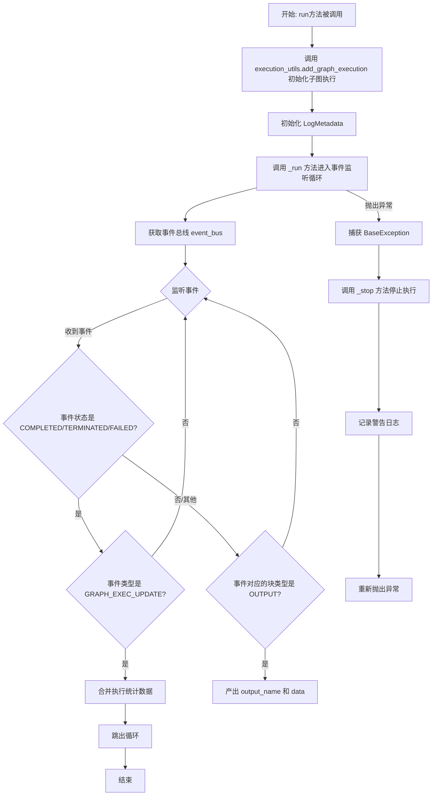
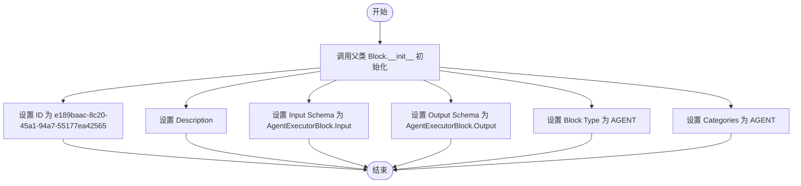
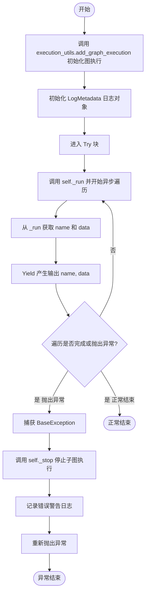
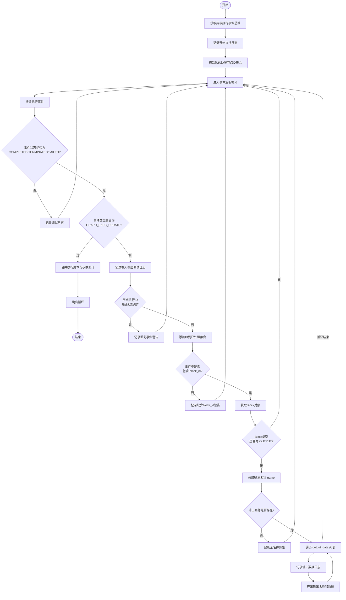
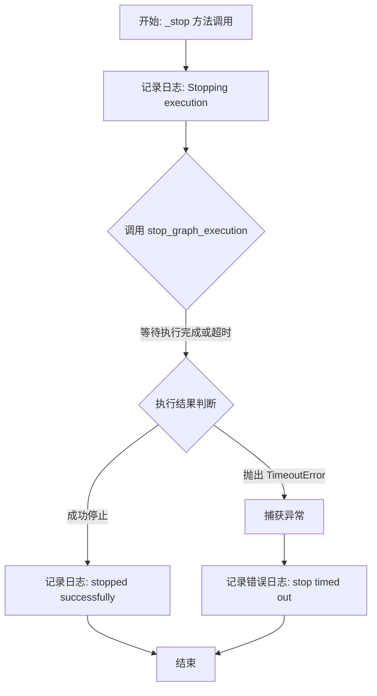
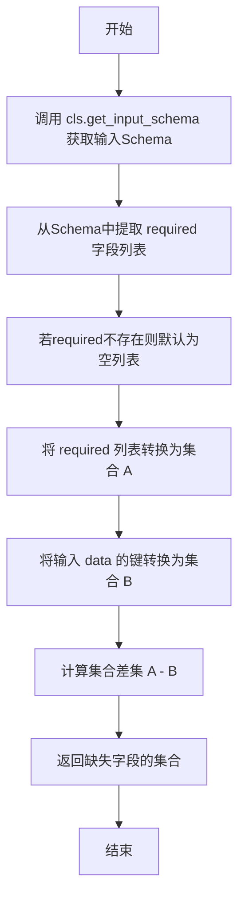
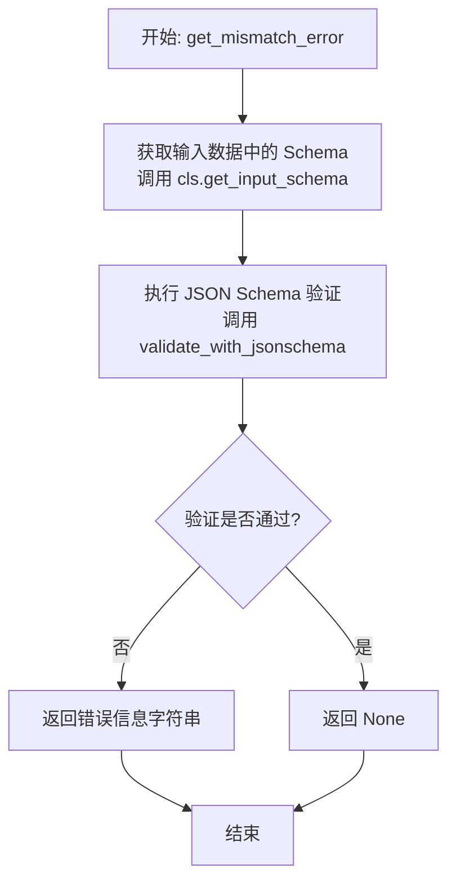

# `AutoGPT\autogpt_platform\backend\backend\blocks\agent.py` 详细设计文档

该代码定义了一个 `AgentExecutorBlock` 类，用于在当前工作流中异步执行嵌套的子图或代理。它负责初始化子图执行，通过事件总线监听子图的执行状态，聚合来自输出节点的结果，并处理错误停止和重试逻辑，实现了代理调用的核心功能。

## 整体流程



## 类结构

```
AgentExecutorBlock (Block)
├── Input (BlockSchemaInput)
│   ├── user_id
│   ├── graph_id
│   ├── graph_version
│   ├── agent_name
│   ├── inputs
│   ├── input_schema
│   ├── output_schema
│   ├── nodes_input_masks
│   ├── get_input_schema (classmethod)
│   ├── get_input_defaults (classmethod)
│   ├── get_missing_input (classmethod)
│   └── get_mismatch_error (classmethod)
└── Output (BlockSchema)
```

## 全局变量及字段


### `_logger`
    
模块级别的日志记录器，用于记录运行时信息。

类型：`logging.Logger`
    


### `AgentExecutorBlock.id`
    
该块的唯一标识符。

类型：`str`
    


### `AgentExecutorBlock.description`
    
该块的功能描述。

类型：`str`
    


### `AgentExecutorBlock.input_schema`
    
定义该块输入数据的模式类。

类型：`type[BlockSchemaInput]`
    


### `AgentExecutorBlock.output_schema`
    
定义该块输出数据的模式类。

类型：`type[BlockSchema]`
    


### `AgentExecutorBlock.block_type`
    
该块的类型枚举值（如 AGENT）。

类型：`BlockType`
    


### `AgentExecutorBlock.categories`
    
该块所属的类别集合。

类型：`set[BlockCategory]`
    


### `AgentExecutorBlock.Input.user_id`
    
执行该块的用户 ID。

类型：`str`
    


### `AgentExecutorBlock.Input.graph_id`
    
要执行的子图的 ID。

类型：`str`
    


### `AgentExecutorBlock.Input.graph_version`
    
要执行的子图的版本号。

类型：`int`
    


### `AgentExecutorBlock.Input.agent_name`
    
在 Builder UI 中显示的代理名称。

类型：`Optional[str]`
    


### `AgentExecutorBlock.Input.inputs`
    
传递给子图的输入数据。

类型：`BlockInput`
    


### `AgentExecutorBlock.Input.input_schema`
    
子图的输入数据模式（JSON Schema）。

类型：`dict`
    


### `AgentExecutorBlock.Input.output_schema`
    
子图的输出数据模式（JSON Schema）。

类型：`dict`
    


### `AgentExecutorBlock.Input.nodes_input_masks`
    
子图中节点的输入掩码配置。

类型：`Optional[NodesInputMasks]`
    
    

## 全局函数及方法


### `AgentExecutorBlock.__init__`

初始化 `AgentExecutorBlock` 实例，配置其在系统中的唯一标识符、描述信息、输入输出模式、块类型以及所属分类。

参数：

- `self`：`AgentExecutorBlock`，类的实例对象本身。

返回值：`None`，构造函数无返回值。

#### 流程图



#### 带注释源码

```python
def __init__(self):
    # 调用父类 Block 的构造函数进行初始化
    super().__init__(
        # 定义该 Block 的唯一 ID (UUID)
        id="e189baac-8c20-45a1-94a7-55177ea42565",
        # 定义该 Block 的功能描述
        description="Executes an existing agent inside your agent",
        # 指定输入数据的 Schema 定义，使用内部类 Input
        input_schema=AgentExecutorBlock.Input,
        # 指定输出数据的 Schema 定义，使用内部类 Output
        output_schema=AgentExecutorBlock.Output,
        # 指定 Block 类型为 AGENT
        block_type=BlockType.AGENT,
        # 指定 Block 所属的分类为 AGENT
        categories={BlockCategory.AGENT},
    )
```


### `AgentExecutorBlock.run`

负责在当前代理执行上下文中启动并管理子图的执行，处理执行记录创建、日志设置、结果传播以及发生异常时的停止操作。

参数：

- `input_data`：`Input`，包含执行子图所需的数据，如图ID、版本、用户ID和具体的输入数据。
- `graph_exec_id`：`str`，当前图执行的唯一标识符，将作为子图执行的父执行ID。
- `execution_context`：`ExecutionContext`，执行上下文对象，包含执行环境的元数据和状态。
- `**kwargs`：`Any`，其他可选的关键字参数。

返回值：`BlockOutput`，异步生成器，逐个产生执行结果的名称和数据。

#### 流程图



#### 带注释源码

```python
async def run(
    self,
    input_data: Input,
    *,
    graph_exec_id: str,
    execution_context: ExecutionContext,
    **kwargs,
) -> BlockOutput:
    # 导入执行工具模块
    from backend.executor import utils as execution_utils

    # 调用工具函数添加图执行记录，初始化子图执行
    # 复制执行上下文并更新 parent_execution_id，建立父子执行关系
    graph_exec = await execution_utils.add_graph_execution(
        graph_id=input_data.graph_id,
        graph_version=input_data.graph_version,
        user_id=input_data.user_id,
        inputs=input_data.inputs,
        nodes_input_masks=input_data.nodes_input_masks,
        execution_context=execution_context.model_copy(
            update={"parent_execution_id": graph_exec_id},
        ),
    )

    # 构建带有元数据的日志记录器，用于追踪此次特定执行
    logger = execution_utils.LogMetadata(
        logger=_logger,
        user_id=input_data.user_id,
        graph_eid=graph_exec.id,
        graph_id=input_data.graph_id,
        node_eid="*",
        node_id="*",
        block_name=self.name,
    )

    try:
        # 调用内部 _run 方法执行实际逻辑，并遍历返回的生成器结果
        async for name, data in self._run(
            graph_id=input_data.graph_id,
            graph_version=input_data.graph_version,
            graph_exec_id=graph_exec.id,
            user_id=input_data.user_id,
            logger=logger,
        ):
            # 将子图的执行产出逐个 yield 给调用方
            yield name, data
    except BaseException as e:
        # 如果发生任何异常，尝试停止正在运行的子图执行
        await self._stop(
            graph_exec_id=graph_exec.id,
            user_id=input_data.user_id,
            logger=logger,
        )
        # 记录失败日志，包含异常类型和消息
        logger.warning(
            f"Execution of graph {input_data.graph_id}v{input_data.graph_version} failed: {e.__class__.__name__} {str(e)}; execution is stopped."
        )
        # 继续向上抛出异常，由上层处理
        raise
```


### `AgentExecutorBlock._run`

该方法负责监听特定图执行过程的异步事件。它通过事件总线获取执行状态，过滤并处理来自输出类型的 Block 的事件，将生成的数据输出给调用方，并在检测到图执行完成（成功、终止或失败）时更新统计信息并结束监听。

参数：

-  `graph_id`：`str`，被执行的图的唯一标识符。
-  `graph_version`：`int`，被执行的图的版本号。
-  `graph_exec_id`：`str`，当前图执行会话的唯一标识符。
-  `user_id`：`str`，发起执行的用户 ID。
-  `logger`：`LogMetadata`（推断类型），用于记录执行过程和元数据的日志记录器实例。

返回值：`BlockOutput`（异步生成器），逐步产生的图执行输出数据，格式为 `(output_name: str, output_data: Any)` 的元组。

#### 流程图



#### 带注释源码

```python
    async def _run(
        self,
        graph_id: str,
        graph_version: int,
        graph_exec_id: str,
        user_id: str,
        logger,
    ) -> BlockOutput:
        # 导入必要的类型和工具
        from backend.data.execution import ExecutionEventType
        from backend.executor import utils as execution_utils

        # 获取全局异步执行事件总线，用于监听图执行状态
        event_bus = execution_utils.get_async_execution_event_bus()

        # 构造用于日志记录的标识字符串
        log_id = f"Graph #{graph_id}-V{graph_version}, exec-id: {graph_exec_id}"
        logger.info(f"Starting execution of {log_id}")
        
        # 集合用于记录已经产生过输出的节点执行ID，防止重复处理
        yielded_node_exec_ids = set()

        # 启动异步循环，监听该用户、图ID及执行ID下的所有事件
        async for event in event_bus.listen(
            user_id=user_id,
            graph_id=graph_id,
            graph_exec_id=graph_exec_id,
        ):
            # 如果事件状态不是最终状态（完成、终止、失败），则跳过处理
            if event.status not in [
                ExecutionStatus.COMPLETED,
                ExecutionStatus.TERMINATED,
                ExecutionStatus.FAILED,
            ]:
                logger.debug(
                    f"Execution {log_id} received event {event.event_type} with status {event.status}"
                )
                continue

            # 如果事件类型是图执行更新且状态为最终状态，说明整个图执行已结束
            if event.event_type == ExecutionEventType.GRAPH_EXEC_UPDATE:
                # 将本次执行的成本和步数统计合并到当前Block的统计中
                self.merge_stats(
                    NodeExecutionStats(
                        extra_cost=event.stats.cost if event.stats else 0,
                        extra_steps=event.stats.node_exec_count if event.stats else 0,
                    )
                )
                # 跳出监听循环，结束方法执行
                break

            # 记录事件携带的输入输出数据日志
            logger.debug(
                f"Execution {log_id} produced input {event.input_data} output {event.output_data}"
            )

            # 检查是否已处理过该节点的执行ID，防止重复输出
            if event.node_exec_id in yielded_node_exec_ids:
                logger.warning(
                    f"{log_id} received duplicate event for node execution {event.node_exec_id}"
                )
                continue
            else:
                yielded_node_exec_ids.add(event.node_exec_id)

            # 如果事件中没有block_id，记录警告并跳过
            if not event.block_id:
                logger.warning(f"{log_id} received event without block_id {event}")
                continue

            # 根据block_id获取Block实例
            block = get_block(event.block_id)
            # 过滤掉非Output类型的Block，只处理最终输出节点
            if not block or block.block_type != BlockType.OUTPUT:
                continue

            # 从输入数据中获取输出名称（对应Output Block的name输入）
            output_name = event.input_data.get("name")
            # 如果没有输出名称，记录警告并跳过
            if not output_name:
                logger.warning(f"{log_id} produced an output with no name {event}")
                continue

            # 遍历输出数据列表，将数据逐个yield出去
            for output_data in event.output_data.get("output", []):
                logger.debug(
                    f"Execution {log_id} produced {output_name}: {output_data}"
                )
                yield output_name, output_data
```


### `AgentExecutorBlock._stop`

该方法用于异步停止指定的子图执行。它通过调用执行工具函数来终止运行中的图任务，并具备重试机制、超时控制以及详细的日志记录功能，用于处理执行过程中的中断逻辑。

参数：

- `graph_exec_id`：`str`，需要停止的图执行实例的唯一标识符。
- `user_id`：`str`，发起该图执行的用户标识。
- `logger`：`Any`，日志记录器对象（通常为 `LogMetadata` 实例），用于记录操作过程中的状态和错误信息。

返回值：`None`，该方法仅执行停止操作和日志记录，不返回任何数据。

#### 流程图



#### 带注释源码

```python
    @func_retry  # 使用重试机制装饰器，自动处理可能的重试逻辑
    async def _stop(
        self,
        graph_exec_id: str,
        user_id: str,
        logger,
    ) -> None:
        # 导入执行工具模块，通常在函数内部导入以避免循环依赖或延迟加载
        from backend.executor import utils as execution_utils

        log_id = f"Graph exec-id: {graph_exec_id}"
        logger.info(f"Stopping execution of {log_id}")

        try:
            # 调用底层工具函数异步停止图执行
            # wait_timeout 设置为 3600 秒（1小时），意味着如果停止操作挂起，最多等待1小时
            await execution_utils.stop_graph_execution(
                graph_exec_id=graph_exec_id,
                user_id=user_id,
                wait_timeout=3600,
            )
            # 如果成功停止（或在超时时间内确认停止），记录成功日志
            logger.info(f"Execution {log_id} stopped successfully.")
        except TimeoutError as e:
            # 如果在等待时间内未收到停止确认，抛出超时异常，此处记录错误日志
            logger.error(f"Execution {log_id} stop timed out: {e}")
```


### `AgentExecutorBlock.Input.get_input_schema`

该方法用于从给定的块输入数据字典中提取 `input_schema` 字段。这通常用于获取被执行子图谱的输入架构定义，以便进行验证或进一步处理。如果输入数据中不包含该字段，则返回一个空字典作为默认值。

参数：

-  `data`：`BlockInput`，包含块输入数据的字典，其中预期包含 `input_schema` 键。

返回值：`dict[str, Any]`，从输入数据中提取的输入架构字典，如果未找到则返回空字典 `{}`。

#### 流程图

```mermaid
graph TD
    A[Start: get_input_schema] --> B[Receive data: BlockInput]
    B --> C[Attempt to retrieve key 'input_schema' from data]
    C --> D{Key exists?}
    D -- Yes --> E[Return associated value]
    D -- No --> F[Return default empty dict {}]
    E --> G[End]
    F --> G
```

#### 带注释源码

```python
        @classmethod
        def get_input_schema(cls, data: BlockInput) -> dict[str, Any]:
            # 使用字典的 get 方法尝试获取 'input_schema' 键的值
            # 如果该键不存在，则返回一个空字典 {} 作为默认值
            return data.get("input_schema", {})
```


### `AgentExecutorBlock.Input.get_input_defaults`

该方法用于从给定的输入数据字典中提取默认的输入值，如果未找到该键，则返回一个空字典。

参数：

-  `data`：`BlockInput`，包含块输入数据的字典对象，期望其中包含 "inputs" 键。

返回值：`BlockInput`，提取到的输入数据字典，若键不存在则返回空字典 `{}`。

#### 流程图

```mermaid
graph TD
    A[开始] --> B[接收参数 data]
    B --> C[执行 data.getinputs, {}]
    C --> D[返回结果]
    D --> E[结束]
```

#### 带注释源码

```python
@classmethod
def get_input_defaults(cls, data: BlockInput) -> BlockInput:
    # 使用字典的 get 方法尝试获取键 "inputs" 对应的值。
    # 如果 "inputs" 键不存在，则返回默认值空字典 {}。
    return data.get("inputs", {})
```


### `AgentExecutorBlock.Input.get_missing_input`

该方法用于根据输入数据的Schema定义，检测提供的输入数据中缺失了哪些必填字段。它通过对比Schema中定义的`required`字段列表与实际输入数据的键集合，计算出差集，从而返回缺失的字段名集合。

参数：

-  `data`：`BlockInput`，包含实际输入数据的字典对象，用于检查是否存在必填字段。

返回值：`set[str]`，包含所有在Schema中声明为必填但未在输入数据中提供的字段名称的集合。

#### 流程图



#### 带注释源码

```python
        @classmethod
        def get_missing_input(cls, data: BlockInput) -> set[str]:
            # 获取输入Schema中定义的必填字段列表，如果不存在则默认为空列表
            required_fields = cls.get_input_schema(data).get("required", [])
            # 计算必填字段集合与输入数据键集合的差集，即为缺失的字段
            return set(required_fields) - set(data)
```


### `AgentExecutorBlock.Input.get_mismatch_error`

该方法是 `AgentExecutorBlock.Input` 类的一个类方法，用于根据预定义的 JSON Schema 验证输入数据的有效性。它通过对比数据结构与 Schema 规则来检测不匹配项，从而确保输入数据的完整性和正确性。

参数：

- `data`：`BlockInput`，待验证的输入数据字典，包含实际的数据及其对应的 Schema 定义。

返回值：`str | None`，如果数据不符合 Schema 要求，返回包含具体错误信息的字符串；如果数据验证通过，则返回 `None`。

#### 流程图



#### 带注释源码

```python
@classmethod
def get_mismatch_error(cls, data: BlockInput) -> str | None:
    # 1. 从输入数据 data 中提取预定义的输入 Schema
    input_schema = cls.get_input_schema(data)
    
    # 2. 调用工具函数 validate_with_jsonschema 进行验证
    # 该函数将根据 schema 检查 data 的结构和内容
    # 如果验证失败，返回具体的错误信息；如果成功，返回 None
    return validate_with_jsonschema(input_schema, data)
```


## 关键组件


### AgentExecutorBlock.Input

定义了执行器块的输入数据结构，包含用户 ID、图 ID、版本及输入数据等字段，并提供基于 JSON Schema 的输入验证、缺失字段检查及默认值获取功能。

### AgentExecutorBlock.run

作为块执行的入口点，负责创建子图执行记录、配置带有父子关系的执行上下文，并协调日志记录与异常处理机制。

### AgentExecutorBlock._run

核心执行循环，通过异步事件总线监听子图执行事件，过滤特定状态和输出类型（BlockType.OUTPUT）的事件，并将结果流式输出。

### AgentExecutorBlock._stop

封装了停止图执行的逻辑，使用重试机制调用底层工具来终止子图运行，并记录相关日志信息。


## 问题及建议


### 已知问题

-   **循环导入风险**：在 `run` 方法内部使用 `from backend.executor import utils`，在 `_run` 方法内部使用 `from backend.data.execution import ExecutionEventType`。这种局部导入通常是为了规避模块级别的循环依赖问题，表明模块结构设计存在耦合，增加了维护难度和潜在的加载错误。
-   **`_stop` 方法的重试策略风险**：`_stop` 方法使用了 `@func_retry` 装饰器。当一个停止操作失败（如超时）时，自动重试可能会导致执行状态不一致，或者在某些无法恢复的错误场景下无限重试，造成资源阻塞。通常停止操作应遵循“尽力而为”且不阻塞主流程的原则。
-   **硬编码的超时配置**：在 `_stop` 方法中，`wait_timeout` 被硬编码为 3600 秒（1小时）。对于停止操作而言，这个时间过长，且缺乏配置灵活性，可能导致系统在需要快速释放资源时长时间挂起。
-   **潜在的内存泄漏**：在 `_run` 方法中，使用 `yielded_node_exec_ids` 集合来记录已处理的节点执行 ID 以去重。在一个运行时间极长或节点数量极多的图执行中，这个集合会无限增长，可能导致内存占用过高。
-   **过于宽泛的异常捕获**：在 `run` 方法中捕获 `BaseException`（包括 `KeyboardInterrupt` 和 `SystemExit`）可能会阻止系统的正常终止信号，导致服务无法优雅关闭。

### 优化建议

-   **优化 `get_block` 调用性能**：在 `_run` 的事件循环中频繁调用 `get_block(event.block_id)`，如果此函数涉及 I/O 或复杂计算，会显著影响性能。建议引入本地缓存机制（如 LRU Cache）存储已获取的 Block 对象。
-   **使用服务端/客户端事件过滤**：目前的实现是在事件监听的循环体内通过 `if` 语句过滤状态和类型。如果事件总线支持服务端过滤或订阅过滤参数，应将过滤逻辑下沉，以减少网络传输和无效的 Python 上下文切换。
-   **重构模块依赖结构**：建议重新设计包结构，将 `Block`、`ExecutionContext` 和 `ExecutionUtils` 的依赖理顺，消除循环导入，使导入语句可以移至文件顶部，提高代码可读性和加载效率。
-   **增强日志上下文信息**：目前的日志多为字符串拼接。建议使用结构化日志（Structural Logging），将 `graph_id`、`exec_id`、`node_id` 等关键信息作为日志字段传递，便于后续的日志检索与监控分析。
-   **提取配置常量**：将超时时间、重试策略等硬编码数值提取到配置文件或类常量中，以便根据不同环境进行动态调整。


## 其它


### 设计目标与约束

**设计目标：**
1. **嵌套执行能力**：核心目标是允许当前的代理或工作流作为一个“块”，去执行另一个预定义的图或代理。这实现了逻辑的复用和模块化。
2. **异步非阻塞**：作为一个异步块，其运行机制必须基于 `async/await`，以避免阻塞主执行循环，特别是在处理可能耗时的子图执行时。
3. **事件驱动反馈**：通过监听执行事件总线来获取子图的执行状态和输出，而不是直接轮询，从而提高效率和实时性。
4. **透明性**：能够将子图的统计数据（如成本、步数）合并到当前执行上下文中，并能通过日志追踪子图的执行细节。

**约束：**
1. **状态依赖**：强依赖于 `backend.executor.utils` 中的 `add_graph_execution` 和 `get_async_execution_event_bus` 的正确实现。
2. **输出类型限制**：只透传子图中 `BlockType.OUTPUT` 类型的块产生的数据，忽略其他类型的块输出。
3. **幂等性与去重**：内部维护 `yielded_node_exec_ids` 集合以防止重复处理相同的节点执行事件，确保数据流的正确性。
4. **资源清理**：无论执行成功还是失败，必须调用 `_stop` 方法尝试停止子图执行，防止资源泄露（如僵尸进程）。
5. **超时控制**：停止操作设置了 3600 秒的硬性等待超时。

### 错误处理与异常设计

1. **全局捕获与清理**：
   - 在 `run` 方法中，使用 `try...except BaseException` 捕获所有可能的异常（包括系统异常）。
   - 在异常发生时，首要任务是调用 `await self._stop(...)` 确保子图执行被终止，执行必要的清理操作。
   - 清理完成后，记录警告日志并重新抛出异常 (`raise`)，以保证父级执行上下文能感知到错误。

2. **重试机制**：
   - `_stop` 方法使用了 `@func_retry` 装饰器。这意味着停止子图的操作如果是暂时性失败，会自动重试，增强了系统的鲁棒性。

3. **超时处理**：
   - 在 `_stop` 方法内部，调用 `execution_utils.stop_graph_execution` 时指定了 `wait_timeout=3600`。
   - 捕获 `TimeoutError`，如果停止操作超时，记录错误日志但不会无限期阻塞，允许异常处理流程继续。

4. **数据验证与容错**：
   - 事件监听循环中，对事件数据进行了严格的防御性检查：
     - 检查 `event.block_id` 是否存在，防止空引用错误。
     - 检查块类型是否为 `BlockType.OUTPUT`。
     - 检查输出名称 `output_name` 是否存在。
   - 如果数据不符合预期，记录警告日志并跳过该事件（`continue`），而不是中断整个执行流程。

### 数据流与状态机

**数据流：**
1. **输入阶段**：
   - 外部调用者传入 `Input` 数据（包含 `graph_id`, `inputs`, `nodes_input_masks` 等）。
   - 数据被传递给 `execution_utils.add_graph_execution` 以初始化子图。
2. **处理与传输阶段**：
   - 子图开始运行，产生事件。
   - `AgentExecutorBlock` 通过事件总线监听这些事件。
   - 数据经过多层过滤：
     - 状态过滤：只关心 `COMPLETED`, `TERMINATED`, `FAILED` 状态的事件（或者在中间过程中的 debug 日志）。
     - 重复过滤：通过 `yielded_node_exec_ids` 去重。
     - 类型过滤：只处理 `BlockType.OUTPUT` 的块数据。
     - 内容过滤：提取 `name` 和 `output` 字段。
3. **输出阶段**：
   - 符合条件的数据通过 `yield (output_name, output_data)` 生成器模式返回给调用者。

**状态机：**
- **Initialized**：`run` 方法被调用，子图执行记录被创建。
- **Running (Listening)**：`_run` 方法启动，进入 `async for event in event_bus.listen(...)` 循环，持续监听事件。
- **Processing Event**：
  - 接收到事件 -> 检查状态。
  - 如果是中间状态 -> 继续。
  - 如果是结束状态 (`GRAPH_EXEC_UPDATE` 且状态为终态) -> 合并统计数据 -> 转入 **Finished**。
  - 如果是节点输出事件 -> 验证并 Yield 数据 -> 继续。
- **Exception (Stopped)**：
  - 发生异常 -> 触发 `_stop` -> 转入 **Finished** (抛出异常)。
- **Finished**：循环中断或异常抛出，执行结束。

### 外部依赖与接口契约

**内部模块依赖：**
1.  **`backend.data.block`**：
    - **契约**：依赖 `Block` 基类、`BlockSchema`、`BlockInput`、`BlockOutput` 等定义。必须实现 `run` 方法作为执行入口。
2.  **`backend.data.execution`**：
    - **契约**：使用 `ExecutionContext` 传递执行上下文（如用户ID、父执行ID）。使用 `ExecutionStatus` 和 `ExecutionEventType` 枚举来判断事件类型和状态。
3.  **`backend.util.json`**：
    - **契约**：使用 `validate_with_jsonschema` 在 Input 类中校验输入数据的完整性。
4.  **`backend.util.retry`**：
    - **契约**：使用 `func_retry` 装饰器为特定方法提供重试能力。

**外部服务/工具依赖 (`backend.executor.utils`)：**
1.  **`execution_utils.add_graph_execution`**：
    - **参数**：`graph_id`, `graph_version`, `user_id`, `inputs`, `nodes_input_masks`, `execution_context`。
    - **返回**：`GraphExecution` 对象（隐含，代码中使用了 `graph_exec.id`）。
    - **契约**：必须在数据库/存储中创建执行记录，并触发子图的执行流程。
2.  **`execution_utils.get_async_execution_event_bus`**：
    - **返回**：事件总线对象。
    - **契约**：必须提供 `listen(user_id, graph_id, graph_exec_id)` 异步生成器方法，实时产生执行事件。
3.  **`execution_utils.stop_graph_execution`**：
    - **参数**：`graph_exec_id`, `user_id`, `wait_timeout`。
    - **契约**：必须发送停止信号给正在运行的子图执行器，并等待其停止或超时。

**日志系统 (`logging`)**：
- **契约**：使用标准 logging 接口，支持 `execution_utils.LogMetadata` 封装的结构化日志上下文。

    