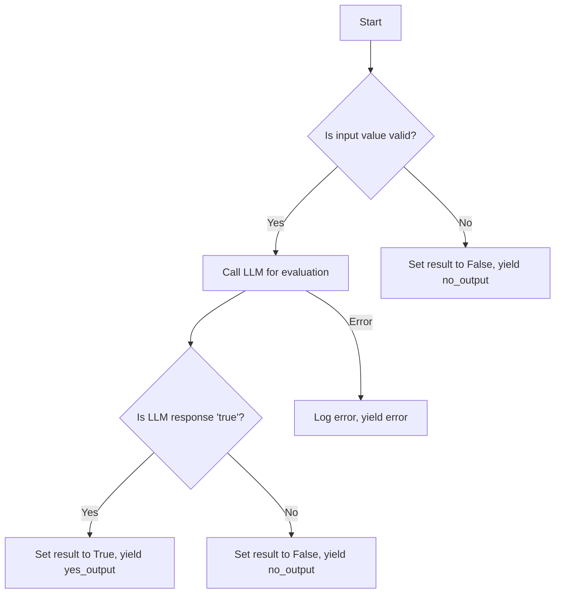
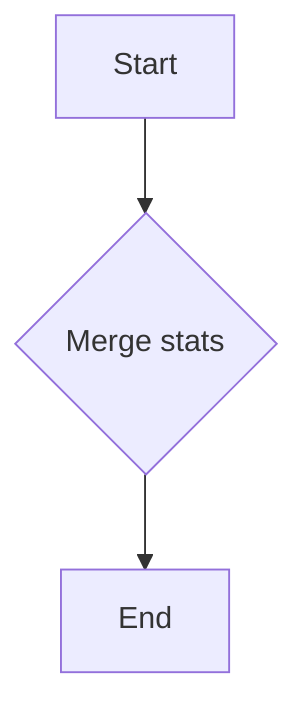
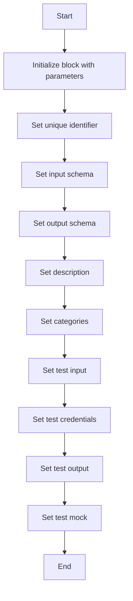
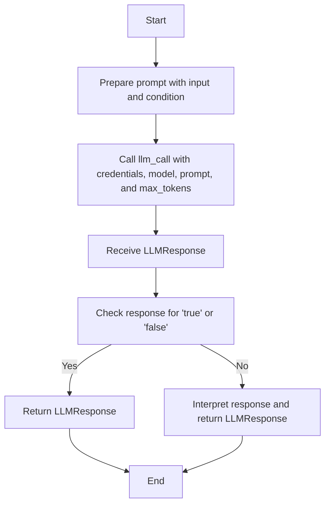
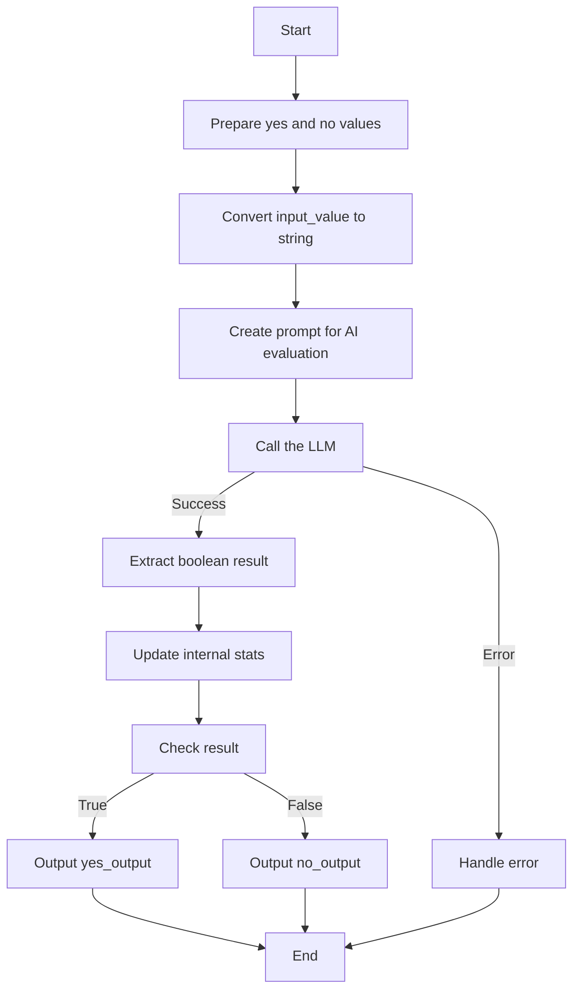

# `.\AutoGPT\autogpt_platform\backend\backend\blocks\ai_condition.py` 详细设计文档

The AIConditionBlock.py file implements an AI-powered condition block that evaluates natural language conditions using a language model and provides conditional outputs based on the evaluation result.

## 整体流程



## 类结构

```
AIBlockBase (Abstract Base Class)
├── AIConditionBlock (Concrete Class)
```

## 全局变量及字段


### `DEFAULT_LLM_MODEL`
    
The default language model to use for evaluating the condition.

类型：`LlmModel`
    


### `TEST_CREDENTIALS`
    
Test credentials for the AI condition block.

类型：`AICredentials`
    


### `TEST_CREDENTIALS_INPUT`
    
Test input credentials for the AI condition block.

类型：`AICredentialsField`
    


### `BlockCategory`
    
Enum for block categories.

类型：`BlockCategory`
    


### `BlockOutput`
    
Output schema for blocks.

类型：`BlockSchemaOutput`
    


### `BlockSchemaInput`
    
Input schema for blocks.

类型：`BlockSchemaInput`
    


### `BlockSchemaOutput`
    
Output schema for blocks.

类型：`BlockSchemaOutput`
    


### `APIKeyCredentials`
    
API key credentials for authentication.

类型：`APIKeyCredentials`
    


### `NodeExecutionStats`
    
Statistics for node execution.

类型：`NodeExecutionStats`
    


### `SchemaField`
    
Field schema for block inputs and outputs.

类型：`SchemaField`
    


### `LLMResponse`
    
Response from the language model call.

类型：`LLMResponse`
    


### `llm_call`
    
Function to call the language model.

类型：`function`
    


### `AIConditionBlock.id`
    
Unique identifier for the AI condition block.

类型：`str`
    


### `AIConditionBlock.input_schema`
    
Input schema for the AI condition block.

类型：`BlockSchemaInput`
    


### `AIConditionBlock.output_schema`
    
Output schema for the AI condition block.

类型：`BlockSchemaOutput`
    


### `AIConditionBlock.description`
    
Description of the AI condition block.

类型：`str`
    


### `AIConditionBlock.categories`
    
Categories to which the AI condition block belongs.

类型：`set`
    


### `AIConditionBlock.test_input`
    
Test input data for the AI condition block.

类型：`dict`
    


### `AIConditionBlock.test_credentials`
    
Test credentials for the AI condition block.

类型：`AICredentials`
    


### `AIConditionBlock.test_output`
    
Test output data for the AI condition block.

类型：`list`
    


### `AIConditionBlock.test_mock`
    
Mock data for testing the AI condition block.

类型：`dict`
    


### `AIConditionBlock.id`
    
Unique identifier for the AI condition block.

类型：`str`
    


### `AIConditionBlock.input_schema`
    
Input schema for the AI condition block.

类型：`BlockSchemaInput`
    


### `AIConditionBlock.output_schema`
    
Output schema for the AI condition block.

类型：`BlockSchemaOutput`
    


### `AIConditionBlock.description`
    
Description of the AI condition block.

类型：`str`
    


### `AIConditionBlock.categories`
    
Categories to which the AI condition block belongs.

类型：`set`
    


### `AIConditionBlock.test_input`
    
Test input data for the AI condition block.

类型：`dict`
    


### `AIConditionBlock.test_credentials`
    
Test credentials for the AI condition block.

类型：`AICredentials`
    


### `AIConditionBlock.test_output`
    
Test output data for the AI condition block.

类型：`list`
    


### `AIConditionBlock.test_mock`
    
Mock data for testing the AI condition block.

类型：`dict`
    
    

## 全局函数及方法


### `AIConditionBlock.merge_stats`

This method merges execution statistics for the AIConditionBlock.

参数：

- `stats`: `NodeExecutionStats`，The statistics to merge with the current block's statistics.

返回值：`None`，No return value, the method updates the internal statistics.

#### 流程图



#### 带注释源码

```python
def merge_stats(self, stats: NodeExecutionStats):
    # Merge the provided statistics with the current block's statistics
    # This is a placeholder for the actual merging logic, which would depend on the specific requirements
    # For example, it might involve summing up token counts or averaging response times
    # Here we simply print the stats to show that the merge has occurred
    print(f"Merging stats: {stats}")
```


### AIConditionBlock.__init__

This method initializes an instance of the AIConditionBlock class, setting up its properties and configurations.

参数：

- `id`: `str`，The unique identifier for the block.
- `input_schema`: `Input`，The schema for the input data of the block.
- `output_schema`: `Output`，The schema for the output data of the block.
- `description`: `str`，A description of the block's functionality.
- `categories`: `set`，A set of categories that the block belongs to.
- `test_input`: `dict`，The test input data for the block.
- `test_credentials`: `AICredentials`，The test credentials for the block.
- `test_output`: `list`，The expected test output data for the block.
- `test_mock`: `dict`，Mock data for testing the block.

返回值：`None`，This method does not return any value.

#### 流程图



#### 带注释源码

```python
def __init__(self, id: str, input_schema: Input, output_schema: Output, description: str, categories: set, test_input: dict, test_credentials: AICredentials, test_output: list, test_mock: dict):
    super().__init__(
        id=id,
        input_schema=input_schema,
        output_schema=output_schema,
        description=description,
        categories=categories,
        test_input=test_input,
        test_credentials=test_credentials,
        test_output=test_output,
        test_mock=test_mock,
    )
```


### AIConditionBlock.llm_call

This method is a wrapper for the `llm_call` function, which is used to call an external language model to evaluate a condition based on input data.

参数：

- `credentials`：`APIKeyCredentials`，The API key credentials for the language model.
- `llm_model`：`LlmModel`，The language model to use for the evaluation.
- `prompt`：`list`，The prompt to send to the language model, which includes the input data and the condition to evaluate.
- `max_tokens`：`int`，The maximum number of tokens to generate in the response from the language model.

返回值：`LLMResponse`，The response from the language model, which includes the raw response, prompt, response text, tool calls, prompt tokens, completion tokens, and reasoning.

#### 流程图



#### 带注释源码

```python
async def llm_call(
    self,
    credentials: APIKeyCredentials,
    llm_model: LlmModel,
    prompt: list,
    max_tokens: int,
) -> LLMResponse:
    """Wrapper method for llm_call to enable mocking in tests."""
    return await llm_call(
        credentials=credentials,
        llm_model=llm_model,
        prompt=prompt,
        force_json_output=False,
        max_tokens=max_tokens,
    )
```


### AIConditionBlock.run

Evaluate the AI condition and return appropriate outputs.

参数：

- `input_data`：`Input`，The input data to evaluate with the AI condition.
- `credentials`：`APIKeyCredentials`，The credentials to use for the AI call.
- `**kwargs`：`Any`，Additional keyword arguments.

返回值：`BlockOutput`，The output of the AI condition evaluation.

#### 流程图



#### 带注释源码

```python
async def run(
    self, input_data: Input, *, credentials: APIKeyCredentials, **kwargs
) -> BlockOutput:
    """
    Evaluate the AI condition and return appropriate outputs.
    """
    # Prepare the yes and no values, using input_value as default
    yes_value = (
        input_data.yes_value
        if input_data.yes_value is not None
        else input_data.input_value
    )
    no_value = (
        input_data.no_value
        if input_data.no_value is not None
        else input_data.input_value
    )

    # Convert input_value to string for AI evaluation
    input_str = str(input_data.input_value)

    # Create the prompt for AI evaluation
    prompt = [
        {
            "role": "system",
            "content": (
                "You are an AI assistant that evaluates conditions based on input data. "
                "You must respond with only 'true' or 'false' (lowercase) to indicate whether "
                "the given condition is met by the input value. Be accurate and consider the "
                "context and meaning of both the input and the condition."
            ),
        },
        {
            "role": "user",
            "content": (
                f"Input value: {input_str}\n"
                f"Condition to evaluate: {input_data.condition}\n\n"
                f"Does the input value satisfy the condition? Respond with only 'true' or 'false'."
            ),
        },
    ]

    # Call the LLM
    try:
        response = await self.llm_call(
            credentials=credentials,
            llm_model=input_data.model,
            prompt=prompt,
            max_tokens=10,  # We only expect a true/false response
        )

        # Extract the boolean result from the response
        response_text = response.response.strip().lower()
        if response_text == "true":
            result = True
        elif response_text == "false":
            result = False
        else:
            # If the response is not clear, try to interpret it using word boundaries
            import re

            # Use word boundaries to avoid false positives like 'untrue' or '10'
            tokens = set(re.findall(r"\b(true|false|yes|no|1|0)\b", response_text))

            if tokens == {"true"} or tokens == {"yes"} or tokens == {"1"}:
                result = True
            elif tokens == {"false"} or tokens == {"no"} or tokens == {"0"}:
                result = False
            else:
                # Unclear or conflicting response - default to False and yield error
                result = False
                yield "error", f"Unclear AI response: '{response.response}'"

        # Update internal stats
        self.merge_stats(
            NodeExecutionStats(
                input_token_count=response.prompt_tokens,
                output_token_count=response.completion_tokens,
            )
        )
        self.prompt = response.prompt

    except Exception as e:
        # In case of any error, default to False to be safe
        result = False
        # Log the error but don't fail the block execution
        import logging

        logger = logging.getLogger(__name__)
        logger.error(f"AI condition evaluation failed: {str(e)}")
        yield "error", f"AI evaluation failed: {str(e)}"

    # Yield results
    yield "result", result

    if result:
        yield "yes_output", yes_value
    else:
        yield "no_output", no_value
```


## 关键组件


### 张量索引与惰性加载

用于高效地索引和访问大型数据集，同时延迟加载数据以减少内存消耗。

### 反量化支持

提供对反量化操作的支持，允许在量化过程中进行逆量化，以恢复原始数据精度。

### 量化策略

定义了不同的量化策略，用于在模型训练和推理过程中调整模型参数的精度。

## 问题及建议


### 已知问题

-   **代码复用性低**：`llm_call` 函数被多次调用，且每次调用都包含相同的参数。这可能导致代码维护困难，且在参数发生变化时需要修改多个地方。
-   **异常处理过于简单**：在 `run` 方法中，异常被捕获并记录，但没有提供更详细的错误信息或恢复策略。
-   **错误处理逻辑复杂**：在处理 LLM 响应时，代码使用了正则表达式和多个条件判断来解析响应，这可能导致代码难以理解和维护。
-   **全局变量使用**：代码中使用了全局变量 `logger`，这可能导致代码难以测试和重用。

### 优化建议

-   **提取公共代码**：将 `llm_call` 函数提取为单独的模块或类，并在需要的地方调用它，以提高代码复用性。
-   **改进异常处理**：在捕获异常时，除了记录错误信息外，还可以根据错误类型提供更详细的错误信息或恢复策略。
-   **简化错误处理逻辑**：考虑使用更简单的逻辑来处理 LLM 响应，例如使用预定义的响应模板或状态机。
-   **避免全局变量**：将 `logger` 作为参数传递给需要它的函数，而不是使用全局变量。
-   **代码注释**：增加代码注释，特别是对于复杂的逻辑和算法，以提高代码的可读性和可维护性。
-   **单元测试**：编写单元测试来验证代码的功能和异常处理逻辑，以确保代码的稳定性和可靠性。
-   **性能优化**：考虑优化 LLM 调用的性能，例如通过缓存结果或减少不必要的调用。


## 其它


### 设计目标与约束

- 设计目标：
  - 实现一个基于AI的自然语言条件评估块，能够使用自然语言定义条件并使用AI进行评估。
  - 提供与标准条件块相同的数据通过功能。
  - 确保代码的可扩展性和可维护性。
  - 确保代码的健壮性和错误处理能力。

- 约束：
  - 必须使用提供的LLM模型和API进行AI评估。
  - 输入和输出必须符合预定义的schema。
  - 代码必须能够处理异常情况，如网络错误或AI评估失败。

### 错误处理与异常设计

- 错误处理：
  - 使用try-except块捕获可能发生的异常。
  - 在捕获异常时记录错误信息并返回适当的错误消息。
  - 在AI评估失败时，返回默认的False结果。

- 异常设计：
  - 定义自定义异常类以处理特定错误情况。
  - 使用logging模块记录错误和重要信息。

### 数据流与状态机

- 数据流：
  - 输入数据通过`run`方法传递给AI评估。
  - AI评估的结果用于确定输出值。
  - 输出数据通过`yield`语句返回。

- 状态机：
  - 状态机不适用于此代码，因为代码流程是线性的，没有多个状态之间的转换。

### 外部依赖与接口契约

- 外部依赖：
  - `backend.blocks.llm`模块：用于与LLM模型交互。
  - `backend.data.block`模块：用于处理块数据和schema。
  - `backend.data.model`模块：用于处理API密钥和节点执行统计。

- 接口契约：
  - `AIBlockBase`类定义了AI块的基本接口。
  - `BlockSchemaInput`和`BlockSchemaOutput`类定义了输入和输出schema。
  - `APIKeyCredentials`和`NodeExecutionStats`类定义了API密钥和节点执行统计。
  - `LlmModel`枚举定义了可用的LLM模型。
  - `LLMResponse`类定义了LLM响应的结构。


    