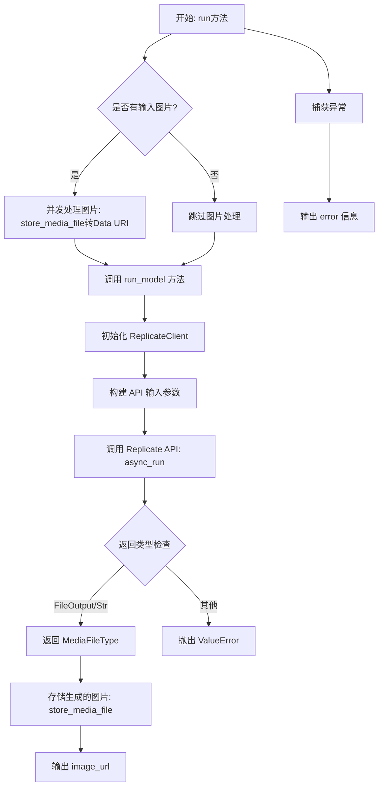
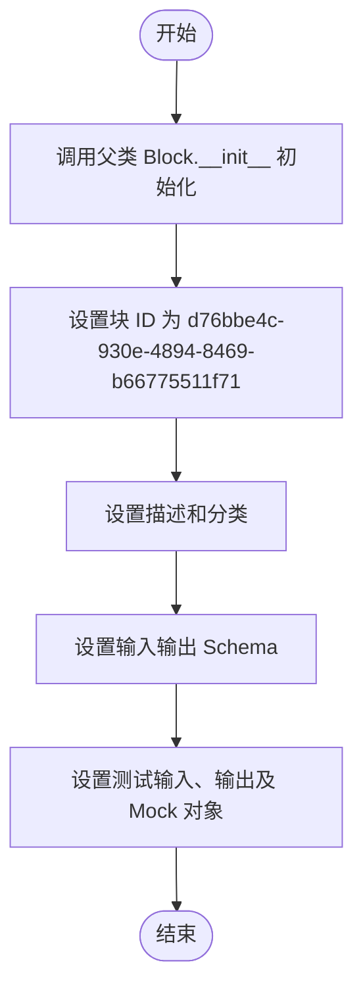
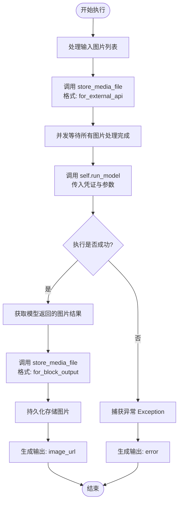
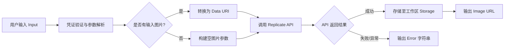

# `AutoGPT\autogpt_platform\backend\backend\blocks\ai_image_customizer.py` 详细设计文档

该代码实现了一个名为 `AIImageCustomizerBlock` 的核心组件，用于通过 Replicate API 集成 Google Gemini 2.5 (Nano-Banana) 模型，实现图像的生成与编辑功能。它支持用户输入文本提示、参考图片、模型选择、宽高比及输出格式，异步处理文件上传与转换，并将生成的图像持久化存储到用户工作区中。

## 整体流程



## 类结构

```
GeminiImageModel (Enum)
AspectRatio (Enum)
OutputFormat (Enum)
AIImageCustomizerBlock (Block)
├── Input (BlockSchemaInput)
└── Output (BlockSchemaOutput)
```

## 全局变量及字段


### `TEST_CREDENTIALS`
    
Mock API key credentials object for the Replicate provider used in testing.

类型：`APIKeyCredentials`
    


### `TEST_CREDENTIALS_INPUT`
    
Dictionary representation of the mock test credentials suitable for input validation.

类型：`dict`
    


### `GeminiImageModel.NANO_BANANA`
    
Identifier for the google/nano-banana image generation model.

类型：`str`
    


### `GeminiImageModel.NANO_BANANA_PRO`
    
Identifier for the google/nano-banana-pro image generation model.

类型：`str`
    


### `AspectRatio.MATCH_INPUT_IMAGE`
    
Sets the output aspect ratio to match the provided input image.

类型：`str`
    


### `AspectRatio.ASPECT_1_1`
    
Square aspect ratio (1:1).

类型：`str`
    


### `AspectRatio.ASPECT_2_3`
    
Portrait aspect ratio (2:3).

类型：`str`
    


### `AspectRatio.ASPECT_3_2`
    
Landscape aspect ratio (3:2).

类型：`str`
    


### `AspectRatio.ASPECT_3_4`
    
Portrait aspect ratio (3:4).

类型：`str`
    


### `AspectRatio.ASPECT_4_3`
    
Standard TV/Landscape aspect ratio (4:3).

类型：`str`
    


### `AspectRatio.ASPECT_4_5`
    
Portrait aspect ratio (4:5).

类型：`str`
    


### `AspectRatio.ASPECT_5_4`
    
Landscape aspect ratio (5:4).

类型：`str`
    


### `AspectRatio.ASPECT_9_16`
    
Vertical video/Story aspect ratio (9:16).

类型：`str`
    


### `AspectRatio.ASPECT_16_9`
    
Widescreen aspect ratio (16:9).

类型：`str`
    


### `AspectRatio.ASPECT_21_9`
    
Ultrawide cinematic aspect ratio (21:9).

类型：`str`
    


### `OutputFormat.JPG`
    
JPG image format.

类型：`str`
    


### `OutputFormat.PNG`
    
PNG image format.

类型：`str`
    


### `AIImageCustomizerBlock.Input.credentials`
    
Replicate API key with permissions for Google Gemini image models.

类型：`CredentialsMetaInput[Literal[ProviderName.REPLICATE], Literal["api_key"]]`
    


### `AIImageCustomizerBlock.Input.prompt`
    
A text description of the image you want to generate.

类型：`str`
    


### `AIImageCustomizerBlock.Input.model`
    
The AI model to use for image generation and editing.

类型：`GeminiImageModel`
    


### `AIImageCustomizerBlock.Input.images`
    
Optional list of input images to reference or modify.

类型：`list[MediaFileType]`
    


### `AIImageCustomizerBlock.Input.aspect_ratio`
    
Aspect ratio of the generated image.

类型：`AspectRatio`
    


### `AIImageCustomizerBlock.Input.output_format`
    
Format of the output image.

类型：`OutputFormat`
    


### `AIImageCustomizerBlock.Output.image_url`
    
URL of the generated image.

类型：`MediaFileType`
    
    

## 全局函数及方法


### `AIImageCustomizerBlock.__init__`

该方法是 `AIImageCustomizerBlock` 类的构造函数，用于初始化块的基本元数据。它调用父类 `Block` 的构造函数，配置了块的唯一标识符、描述、所属分类、输入输出 Schema 以及用于测试的模拟数据和断言逻辑。

参数：

- `self`：`AIImageCustomizerBlock`，类的实例本身

返回值：`None`，无返回值

#### 流程图



#### 带注释源码

```python
def __init__(self):
    super().__init__(
        id="d76bbe4c-930e-4894-8469-b66775511f71",  # 定义该块的唯一标识符
        description=(
            "Generate and edit custom images using Google's Nano-Banana model from Gemini 2.5. "
            "Provide a prompt and optional reference images to create or modify images."
        ),  # 块功能的自然语言描述
        categories={BlockCategory.AI, BlockCategory.MULTIMEDIA},  # 定义块所属的分类（AI 和 多媒体）
        input_schema=AIImageCustomizerBlock.Input,  # 指定输入数据的验证 Schema
        output_schema=AIImageCustomizerBlock.Output,  # 指定输出数据的验证 Schema
        test_input={
            "prompt": "Make the scene more vibrant and colorful",
            "model": GeminiImageModel.NANO_BANANA,
            "images": [],
            "aspect_ratio": AspectRatio.MATCH_INPUT_IMAGE,
            "output_format": OutputFormat.JPG,
            "credentials": TEST_CREDENTIALS_INPUT,
        },  # 定义用于单元测试的标准输入数据
        test_output=[
            # 定义验证测试输出结果的 lambda 函数，检查 image_url 是否以特定前缀开头
            ("image_url", lambda x: x.startswith(("workspace://", "data:"))),
        ],
        test_mock={
            # 定义在测试环境下模拟 run_model 方法的行为，返回伪造的 Base64 图片数据，避免真实 API 调用
            "run_model": lambda *args, **kwargs: MediaFileType(
                "data:image/jpeg;base64,/9j/4AAQSkZJRgABAgAAAQABAAD/2wBDAAgGBgcGBQgHBwcJCQgKDBQNDAsLDBkSEw8UHRofHh0aHBwgJC4nICIsIxwcKDcpLDAxNDQ0Hyc5PTgyPC4zNDL/2wBDAQkJCQwLDBgNDRgyIRwhMjIyMjIyMjIyMjIyMjIyMjIyMjIyMjIyMjIyMjIyMjIyMjIyMjIyMjIyMjIyMjIyMjL/wAARCAABAAEDASIAAhEBAxEB/8QAHwAAAQUBAQEBAQEAAAAAAAAAAAECAwQFBgcICQoL/8QAtRAAAgEDAwIEAwUFBAQAAAF9AQIDAAQRBRIhMUEGE1FhByJxFDKBkaEII0KxwRVS0fAkM2JyggkKFhcYGRolJicoKSo0NTY3ODk6Q0RFRkdISUpTVFVWV1hZWmNkZWZnaGlqc3R1dnd4eXqDhIWGh4iJipKTlJWWl5iZmqKjpKWmp6ipqrKztLW2t7i5usLDxMXGx8jJytLT1NXW19jZ2uHi4+Tl5ufo6erx8vP09fb3+Pn6/8QAHwEAAwEBAQEBAQEBAQAAAAAAAAECAwQFBgcICQoL/8QAtREAAgECBAQDBAcFBAQAAQJ3AAECAxEEBSExBhJBUQdhcRMiMoEIFEKRobHBCSMzUvAVYnLRChYkNOEl8RcYGRomJygpKjU2Nzg5OkNERUZHSElKU1RVVldYWVpjZGVmZ2hpanN0dXZ3eHl6goOEhYaHiImKkpOUlZaXmJmaoqOkpaanqKmqsrO0tba3uLm6wsPExcbHyMnK0tPU1dbX2Nna4uPk5ebn6Onq8vP09fb3+Pn6/9oADAMBAAIRAxEAPwD3+iiigD//2Q=="
            ),
        },
        test_credentials=TEST_CREDENTIALS,  # 定义测试环境使用的 API 凭证
    )
```


### `AIImageCustomizerBlock.run`

该方法是 `AIImageCustomizerBlock` 的核心执行入口，负责编排整个图像定制流程。它首先处理输入的本地图像文件，将其转换为外部 API 可访问的格式；随后调用 Replicate 的模型接口生成或编辑图像；最后将生成的图像持久化存储到工作区，并输出最终的图像 URL。

参数：

- `input_data`：`Input`，包含提示词、模型选择、输入图像列表、宽高比及输出格式的输入数据模型。
- `credentials`：`APIKeyCredentials`，用于身份验证的 API 密钥凭证，用于访问 Replicate 服务。
- `execution_context`：`ExecutionContext`，执行上下文对象，提供运行环境信息及文件存储所需的上下文。
- `**kwargs`：`dict`，扩展关键字参数，用于传递额外的上下文信息。

返回值：`BlockOutput`，一个异步生成器，逐步产生输出结果。成功时生成 `image_url`，失败时生成 `error`。

#### 流程图



#### 带注释源码

```python
async def run(
    self,
    input_data: Input,
    *,
    credentials: APIKeyCredentials,
    execution_context: ExecutionContext,
    **kwargs,
) -> BlockOutput:
    try:
        # 步骤 1: 预处理输入图片
        # 将本地文件路径转换为 Data URIs (base64) 或公开 URL，以便 Replicate API 能够访问
        processed_images = await asyncio.gather(
            *(
                store_media_file(
                    file=img,
                    execution_context=execution_context,
                    return_format="for_external_api",  # 获取供外部 API 使用的内容格式
                )
                for img in input_data.images
            )
        )

        # 步骤 2: 调用模型进行推理
        # 使用处理后的图片和用户参数调用 Replicate 模型
        result = await self.run_model(
            api_key=credentials.api_key,
            model_name=input_data.model.value,
            prompt=input_data.prompt,
            images=processed_images,
            aspect_ratio=input_data.aspect_ratio.value,
            output_format=input_data.output_format.value,
        )

        # 步骤 3: 持久化生成结果
        # 将生成的图片保存到用户的工作区，确保持久化并生成可供 Block 使用的引用
        stored_url = await store_media_file(
            file=result,
            execution_context=execution_context,
            return_format="for_block_output",  # 获取供 Block 输出使用的引用格式
        )
        yield "image_url", stored_url
    except Exception as e:
        # 步骤 4: 异常处理
        # 捕获运行时错误并返回错误信息
        yield "error", str(e)
```


### `AIImageCustomizerBlock.run_model`

该方法负责通过 Replicate API 异步执行 AI 图像生成或编辑任务。它构建请求参数，处理输入图像，调用指定的模型，并将返回的输出统一封装为 `MediaFileType` 格式。

参数：

- `api_key`：`SecretStr`，用于身份验证的 Replicate API 密钥。
- `model_name`：`str`，要调用的 AI 模型名称（如 "google/nano-banana"）。
- `prompt`：`str`，用于指导图像生成或修改的文本提示词。
- `images`：`list[MediaFileType]`，用于参考或修改的输入图像列表（可选）。
- `aspect_ratio`：`str`，生成图像的宽高比。
- `output_format`：`str`，生成图像的格式（如 "jpg", "png"）。

返回值：`MediaFileType`，包含生成的图像 URL 或数据的媒体文件类型对象。

#### 流程图

```mermaid
flowchart TD
    Start((开始)) --> InitClient[初始化 ReplicateClient]
    InitClient --> BuildDict[构建基础 input_params 字典]
    BuildDict --> CheckImages{images 列表是否非空?}
    CheckImages -- 是 --> AppendImages[将 images 转为字符串列表并添加至 image_input]
    CheckImages -- 否 --> CallAPI
    AppendImages --> CallAPI[调用 client.async_run 异步执行模型]
    CallAPI --> CheckOutputType{检查输出 output 类型}
    CheckOutputType -- FileOutput --> ReturnURL[返回 MediaFileType(output.url)]
    CheckOutputType -- 字符串 str --> ReturnStr[返回 MediaFileType(output)]
    CheckOutputType -- 其他 --> RaiseError[抛出 ValueError 异常]
    ReturnURL --> End((结束))
    ReturnStr --> End
    RaiseError --> End
```

#### 带注释源码

```python
async def run_model(
    self,
    api_key: SecretStr,
    model_name: str,
    prompt: str,
    images: list[MediaFileType],
    aspect_ratio: str,
    output_format: str,
) -> MediaFileType:
    # 使用提供的 API 密钥初始化 Replicate 客户端
    client = ReplicateClient(api_token=api_key.get_secret_value())

    # 准备传递给模型的基础参数字典
    input_params: dict = {
        "prompt": prompt,
        "aspect_ratio": aspect_ratio,
        "output_format": output_format,
    }

    # 如果提供了输入图片，将其转换为字符串列表并添加到参数中
    # API 期望的参数名为 "image_input"
    if images:
        input_params["image_input"] = [str(img) for img in images]

    # 调用 Replicate API 异步运行模型，wait=False 表示不在此处阻塞等待（尽管 await 用于获取结果句柄）
    output: FileOutput | str = await client.async_run(  # type: ignore
        model_name,
        input=input_params,
        wait=False,
    )

    # 处理模型返回的结果
    if isinstance(output, FileOutput):
        # 如果返回的是文件对象，提取其 URL 并封装为 MediaFileType
        return MediaFileType(output.url)
    if isinstance(output, str):
        # 如果返回的是字符串（如 URL），直接封装为 MediaFileType
        return MediaFileType(output)

    # 如果返回类型均不符合预期，抛出异常
    raise ValueError("No output received from the model")
```


## 关键组件


### AIImageCustomizerBlock

封装了核心逻辑，用于通过 Replicate API 使用 Google Nano-Banana 模型生成和编辑自定义图片。

### Configuration Schemas (Input/Output)

定义了输入参数（包括提示词、模型选择、纵横比等）和输出结果（图片 URL）的数据结构约束和验证规则。

### Media Processing Pipeline

处理输入图片的转换，将其从本地路径转换为 Data URI 以供 API 访问，并将生成的图片持久化存储到用户工作区。

### ReplicateClient Integration

负责与 Replicate API 进行异步通信，发送模型输入参数并检索生成的图片文件输出或 URL。

### Model Configuration Enums

包含定义可用 AI 模型（`GeminiImageModel`）、支持的目标纵横比（`AspectRatio`）和输出文件格式（`OutputFormat`）的枚举。


## 问题及建议


### 已知问题

-   **API 调用逻辑错误**：在 `run_model` 方法中，调用 `client.async_run(...)` 时设置了 `wait=False`。这通常意味着该方法会立即返回一个表示预测任务的 `Prediction` 对象，而不会等待生成完成。然而，后续代码直接尝试从 `output` 中获取 URL 或将其转换为字符串（`output.url`），这将导致 `AttributeError` 或获取到空结果，因为任务此时尚未完成。应设置为 `wait=True` 或实现异步轮询逻辑。
-   **异常处理过于宽泛**：`run` 方法中使用了 `try...except Exception` 捕获所有异常，并仅通过 `yield "error", str(e)` 输出错误信息。这种方式丢失了堆栈跟踪和具体的异常类型，不利于生产环境的问题排查和调试。
-   **客户端重复创建**：每次执行 `run_model` 时都会创建一个新的 `ReplicateClient` 实例。虽然 Python 的垃圾回收机制会处理旧实例，但在高并发场景下，频繁创建和销毁客户端对象（及其底层的 HTTP 会话）会带来不必要的性能开销。

### 优化建议

-   **增加超时控制**：在调用 `client.async_run` 时未设置超时时间。如果外部 API (Replicate) 响应缓慢或无响应，可能会导致当前协程永久挂起。建议使用 `asyncio.wait_for` 为该调用添加合理的超时机制。
-   **添加重试机制**：外部网络请求容易受到抖动或临时故障影响。建议在 `run_model` 方法中引入重试策略（例如使用 `tenacity` 库），在遇到可重试的错误（如网络超时、5xx 错误）时自动重试，以提高系统的鲁棒性。
-   **输入参数校验**：`images` 字段被定义为列表，但 Replicate 的特定模型通常对输入图像的数量有限制（例如仅支持单张图片）。建议在 `run` 方法开始处添加逻辑，校验输入图片的数量是否符合目标模型的要求，提前返回明确的错误信息。
-   **日志记录增强**：在关键的执行步骤（如开始生成、生成完成、发生错误）处添加结构化日志记录，以便于监控和追踪执行流程。


## 其它


### 设计目标与约束

**设计目标：**
1.  **模块化封装**：将 Google Gemini (Nano-Banana) 图像生成/编辑模型的调用逻辑封装为一个独立的 Block，以便在更大的工作流中复用。
2.  **异步处理**：利用 Python `asyncio` 实现非阻塞的 I/O 操作，特别是文件处理和外部 API 调用，提高系统并发性能。
3.  **数据隔离与安全**：通过 `pydantic.SecretStr` 和专门的凭证管理系统安全地处理 API 密钥，避免敏感信息泄露。
4.  **文件适配**：自动处理本地文件与远程 API 之间的格式转换（如将本地文件转换为 Data URI），简化用户输入。

**约束：**
1.  **API 依赖**：强依赖 `Replicate` 平台的稳定性和 API 规范，需确保网络连通性及 API 额度充足。
2.  **模型限制**：仅支持 `GeminiImageModel` 枚举中定义的特定模型版本（如 NANO_BANANA）。
3.  **异步上下文**：必须在支持 `async/await` 的运行环境中执行（如 `ExecutionContext`）。
4.  **格式限制**：输出图像格式受限于 `OutputFormat` 枚举值（JPG/PNG），且输入图像需能被 `store_media_file` 处理。

### 错误处理与异常设计

1.  **顶层异常捕获**：
    *   在 `run` 方法中实现了 `try...except Exception as e` 的全盘捕获机制。
    *   **策略**：任何在预处理、API 调用或后处理阶段发生的异常，都不会抛出至上层中断流程，而是转换为特定的输出 `yield "error", str(e)`。这保证了工作流的健壮性，允许下游 Block 处理错误或记录日志。

2.  **数据验证**：
    *   利用 `pydantic` 的 `BlockSchemaInput` 自动进行输入参数的类型和格式验证。如果输入类型不匹配（如错误的枚举值），在进入 `run` 方法前即会报错。

3.  **API 交互异常**：
    *   调用 `ReplicateClient` 可能引发的网络错误或 HTTP 错误由库内部抛出，被顶层捕获并转化为字符串输出。
    *   在 `run_model` 中，如果模型返回了非预期的类型（既不是 `FileOutput` 也不是 `str`），会显式抛出 `ValueError("No output received from the model")`。

### 数据流与状态机

**数据流：**
1.  **输入阶段**：接收用户凭证、提示词、模型配置及本地文件路径。
2.  **预处理阶段**：通过 `store_media_file` 将本地图片转换为 API 可访问的 Data URI 或公网 URL。
3.  **执行阶段**：构建请求参数，调用 Replicate API 异步生成图像。
4.  **后处理阶段**：接收 API 返回的图像 URL，通过 `store_media_file` 存储至工作区，生成持久化的访问链接。
5.  **输出阶段**：输出最终的图像 URL 或错误信息。

**Mermaid 数据流图：**


**状态机：**
该 Block 的生命周期状态较为简单，主要包含：
*   **Idle (空闲)**：Block 初始化完成，等待输入。
*   **Processing (处理中)**：`run` 方法被调用，正在进行文件上传或 API 请求。
*   **Completed (完成)**：成功生成结果并 Yield 输出，或捕获异常并 Yield 错误信息，随即结束。

### 外部依赖与接口契约

1.  **Replicate Client (`replicate.client`)**
    *   **描述**：用于实际调用 Google Gemini 模型的第三方 SDK。
    *   **接口契约**：
        *   初始化：`Client(api_token: str)`
        *   调用：`async_run(model: str, input: dict, wait: bool)`
        *   期望：`input` 字典需包含 `prompt`, `aspect_ratio` 等键；返回 `FileOutput` 或 `str`。

2.  **Internal Media Storage (`backend.util.file`)**
    *   **描述**：内部文件处理工具，用于文件的临时托管和持久化。
    *   **接口契约**：
        *   函数：`store_media_file(file: Any, execution_context: ExecutionContext, return_format: str) -> Awaitable[MediaFileType]`
        *   行为：当 `return_format="for_external_api"` 时，返回可被外部访问的 Data URI；当 `return_format="for_block_output"` 时，返回内部工作区引用。

3.  **Block Framework (`backend.data.block`)**
    *   **描述**：核心执行框架基类。
    *   **接口契约**：
        *   继承 `Block` 并实现 `run` 方法。
        *   `run` 必须是异步生成器 (`AsyncIterator[BlockOutput]`)。
        *   输入输出需继承 `BlockSchemaInput` 和 `BlockSchemaOutput` (Pydantic models)。

    