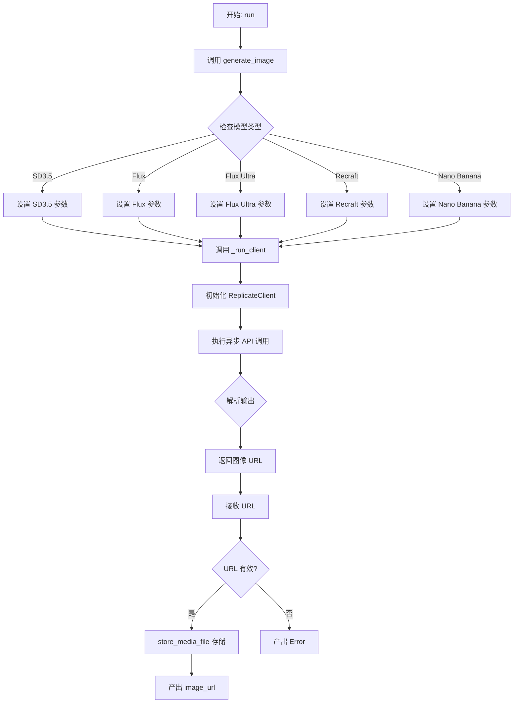
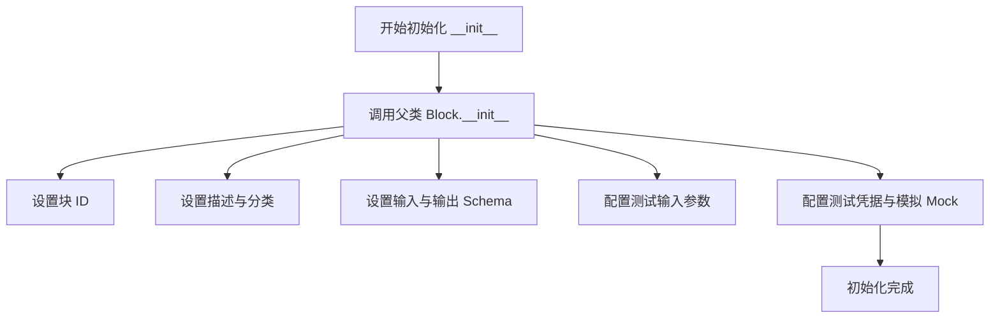
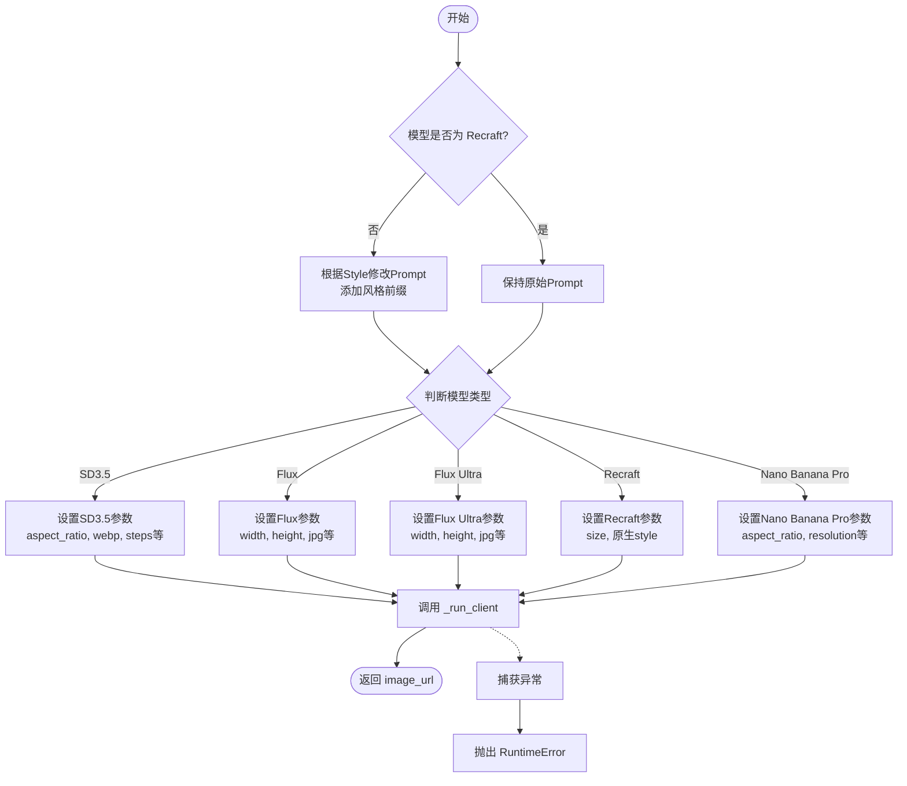
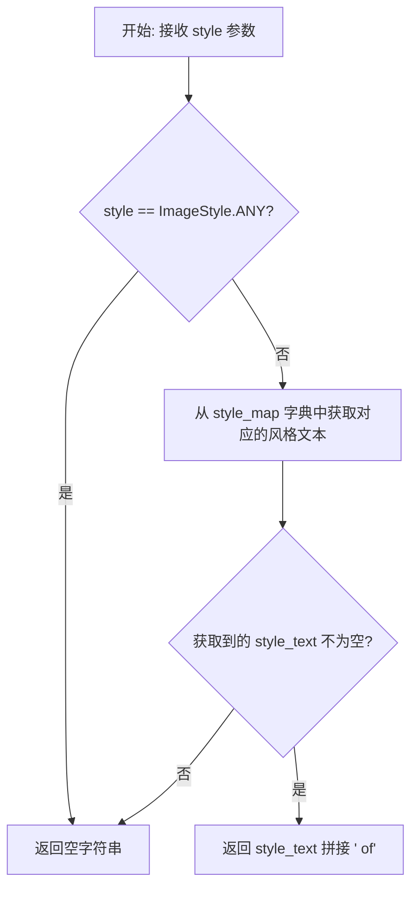
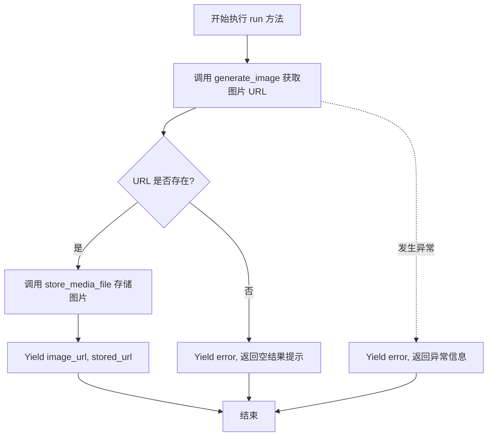

# `AutoGPT\autogpt_platform\backend\backend\blocks\ai_image_generator_block.py` 详细设计文档

该代码定义了一个 `AIImageGeneratorBlock` 类，用于通过统一的接口调用 Replicate API 集成多种 AI 图像生成模型（如 Stable Diffusion, Flux, Recraft 等）。它处理提示词、图像尺寸、风格等输入参数，根据不同模型配置相应的生成参数，异步执行生成任务，并将生成的图像存储到用户工作空间后返回 URL。

## 整体流程



## 类结构

```
AIImageGeneratorBlock (主类)
├── Input (内部输入类)
├── Output (内部输出类)
└── Methods
    ├── __init__
    ├── _run_client
    ├── generate_image
    ├── _style_to_prompt_prefix
    └── run

Enums (枚举类)
├── ImageSize
├── ImageStyle
└── ImageGenModel
```

## 全局变量及字段


### `SIZE_TO_SD_RATIO`
    
Maps semantic image sizes to Stable Diffusion aspect ratio strings.

类型：`dict[ImageSize, str]`
    


### `SIZE_TO_FLUX_RATIO`
    
Maps semantic image sizes to Flux model aspect ratio strings.

类型：`dict[ImageSize, str]`
    


### `SIZE_TO_FLUX_DIMENSIONS`
    
Maps semantic image sizes to Flux model pixel dimensions (width, height).

类型：`dict[ImageSize, tuple[int, int]]`
    


### `SIZE_TO_RECRAFT_DIMENSIONS`
    
Maps semantic image sizes to Recraft model dimension strings.

类型：`dict[ImageSize, str]`
    


### `SIZE_TO_NANO_BANANA_RATIO`
    
Maps semantic image sizes to Nano Banana Pro aspect ratio strings.

类型：`dict[ImageSize, str]`
    


### `TEST_CREDENTIALS`
    
Mock API credentials object used for testing the block.

类型：`APIKeyCredentials`
    


### `TEST_CREDENTIALS_INPUT`
    
Dictionary representation of the mock test credentials.

类型：`dict`
    


### `ImageSize.SQUARE`
    
Represents a square aspect ratio (1:1).

类型：`str`
    


### `ImageSize.LANDSCAPE`
    
Represents a landscape aspect ratio (4:3).

类型：`str`
    


### `ImageSize.PORTRAIT`
    
Represents a portrait aspect ratio (3:4).

类型：`str`
    


### `ImageSize.WIDE`
    
Represents a wide aspect ratio (16:9).

类型：`str`
    


### `ImageSize.TALL`
    
Represents a tall aspect ratio (9:16).

类型：`str`
    


### `ImageStyle.ANY`
    
Default style indicating no specific visual style preference.

类型：`str`
    


### `ImageStyle.REALISTIC`
    
Standard realistic photography style.

类型：`str`
    


### `ImageStyle.REALISTIC_BW`
    
Black and white photography style.

类型：`str`
    


### `ImageStyle.REALISTIC_HDR`
    
High Dynamic Range (HDR) photography style.

类型：`str`
    


### `ImageStyle.REALISTIC_NATURAL`
    
Natural light photography style.

类型：`str`
    


### `ImageStyle.REALISTIC_STUDIO`
    
Studio portrait photography style.

类型：`str`
    


### `ImageStyle.REALISTIC_ENTERPRISE`
    
Corporate or enterprise photography style.

类型：`str`
    


### `ImageStyle.REALISTIC_HARD_FLASH`
    
Photography style using a hard flash.

类型：`str`
    


### `ImageStyle.REALISTIC_MOTION_BLUR`
    
Photography style with motion blur effect.

类型：`str`
    


### `ImageStyle.DIGITAL_ART`
    
General digital art illustration style.

类型：`str`
    


### `ImageStyle.PIXEL_ART`
    
Pixel art illustration style.

类型：`str`
    


### `ImageStyle.HAND_DRAWN`
    
Hand drawn illustration style.

类型：`str`
    


### `ImageStyle.GRAIN`
    
Grainy digital illustration style.

类型：`str`
    


### `ImageStyle.SKETCH`
    
Sketchy or infantile illustration style.

类型：`str`
    


### `ImageStyle.POSTER`
    
2D art poster style.

类型：`str`
    


### `ImageStyle.POSTER_2`
    
Alternate 2D art poster style.

类型：`str`
    


### `ImageStyle.HANDMADE_3D`
    
Handmade 3D illustration style.

类型：`str`
    


### `ImageStyle.HAND_DRAWN_OUTLINE`
    
Hand drawn outline illustration style.

类型：`str`
    


### `ImageStyle.ENGRAVING_COLOR`
    
Color engraving illustration style.

类型：`str`
    


### `ImageGenModel.FLUX`
    
Represents the Flux 1.1 Pro model.

类型：`str`
    


### `ImageGenModel.FLUX_ULTRA`
    
Represents the Flux 1.1 Pro Ultra model.

类型：`str`
    


### `ImageGenModel.RECRAFT`
    
Represents the Recraft v3 model.

类型：`str`
    


### `ImageGenModel.SD3_5`
    
Represents the Stable Diffusion 3.5 Medium model.

类型：`str`
    


### `ImageGenModel.NANO_BANANA_PRO`
    
Represents the Nano Banana Pro (Google Gemini 3 Pro Image) model.

类型：`str`
    


### `AIImageGeneratorBlock.Input.credentials`
    
API credentials for authenticating with the Replicate provider.

类型：`CredentialsMetaInput`
    


### `AIImageGeneratorBlock.Input.prompt`
    
The text description used to generate the image.

类型：`str`
    


### `AIImageGeneratorBlock.Input.model`
    
The specific AI model selected for image generation.

类型：`ImageGenModel`
    


### `AIImageGeneratorBlock.Input.size`
    
The desired format or aspect ratio of the generated image.

类型：`ImageSize`
    


### `AIImageGeneratorBlock.Input.style`
    
The visual artistic style applied to the generated image.

类型：`ImageStyle`
    


### `AIImageGeneratorBlock.Output.image_url`
    
The URL pointing to the location of the generated image.

类型：`str`
    
    

## 全局函数及方法


### `AIImageGeneratorBlock.__init__`

初始化 `AIImageGeneratorBlock` 块，配置其唯一标识符、描述、类别、输入输出模式以及用于测试目的的模拟数据和预期输出。

参数：

-   `self`：`AIImageGeneratorBlock`，类的实例本身

返回值：`None`，无返回值

#### 流程图



#### 带注释源码

```python
def __init__(self):
    # 调用父类 Block 的初始化方法，配置块的核心元数据
    super().__init__(
        # 块的唯一标识符
        id="ed1ae7a0-b770-4089-b520-1f0005fad19a",
        # 块的功能描述
        description="Generate images using various AI models through a unified interface",
        # 将块归类为 AI 类别
        categories={BlockCategory.AI},
        # 定义块的输入数据结构 Schema
        input_schema=AIImageGeneratorBlock.Input,
        # 定义块的输出数据结构 Schema
        output_schema=AIImageGeneratorBlock.Output,
        # 定义用于测试的输入数据，包含模拟凭据、提示词、模型、尺寸和风格
        test_input={
            "credentials": TEST_CREDENTIALS_INPUT,
            "prompt": "An octopus using a laptop in a snowy forest with 'AutoGPT' clearly visible on the screen",
            "model": ImageGenModel.RECRAFT,
            "size": ImageSize.SQUARE,
            "style": ImageStyle.REALISTIC,
        },
        # 定义测试使用的凭据对象
        test_credentials=TEST_CREDENTIALS,
        # 定义预期的测试输出结果，检查 image_url 是否以 data:image/ 开头
        test_output=[
            (
                "image_url",
                # Test output is a data URI since we now store images
                lambda x: x.startswith("data:image/"),
            ),
        ],
        # 定义测试时的模拟行为，避免实际调用 API，直接返回模拟的 Data URI
        test_mock={
            # Return a data URI directly so store_media_file doesn't need to download
            "_run_client": lambda *args, **kwargs: "data:image/webp;base64,UklGRiQAAABXRUJQVlA4IBgAAAAwAQCdASoBAAEAAQAcJYgCdAEO"
        },
    )
```


### `AIImageGeneratorBlock._run_client`

该方法负责通过 Replicate 客户端异步运行指定的 AI 模型，处理模型执行过程，并从返回的输出中解析出生成的图片 URL。

参数：

-  `credentials`：`APIKeyCredentials`，包含用于初始化 Replicate 客户端的 API 密钥等凭证信息。
-  `model_name`：`str`，指定在 Replicate 平台上运行的 AI 模型名称或版本标识。
-  `input_params`：`dict`，传递给模型的具体参数字典，如提示词、图片尺寸、输出格式等。

返回值：`str | None`，返回生成图片的 URL 字符串，如果无法解析出 URL 则返回 None。

#### 流程图

```mermaid
flowchart TD
    A[开始: _run_client] --> B[使用 credentials 初始化 ReplicateClient]
    B --> C[调用 client.async_run 执行模型]
    C --> D{检查 output 类型}
    
    D -->|列表 且 长度 > 0| E{output[0] 是 FileOutput?}
    E -->|是| F[result_url = output[0].url]
    E -->|否| G[result_url = output[0]]
    
    D -->|FileOutput| H[result_url = output.url]
    
    D -->|字符串| I[result_url = output]
    
    D -->|其他类型| J[result_url = None]
    
    F --> K[返回 result_url]
    G --> K
    H --> K
    I --> K
    J --> K
    
    C -.->|捕获到 TypeError| L[抛出 TypeError: 模型执行错误]
    C -.->|捕获到其他 Exception| M[抛出 RuntimeError: 意外执行错误]
```

#### 带注释源码

```python
    async def _run_client(
        self, credentials: APIKeyCredentials, model_name: str, input_params: dict
    ):
        try:
            # 使用凭证中的 API Key 初始化 Replicate 客户端
            client = ReplicateClient(api_token=credentials.api_key.get_secret_value())

            # 异步运行指定的模型，传入参数，并设置 wait=False (意味着立即返回 Future 或类似对象，具体取决于库版本行为)
            # 注意：这里的逻辑假设 await 之后拿到的 output 是可以直接解析的结果结构
            output = await client.async_run(model_name, input=input_params, wait=False)

            # 处理输出，根据返回的数据结构类型提取图片 URL
            # 场景 1: 输出是一个列表且不为空
            if isinstance(output, list) and len(output) > 0:
                if isinstance(output[0], FileOutput):
                    result_url = output[0].url
                else:
                    result_url = output[0]
            # 场景 2: 输出是文件对象
            elif isinstance(output, FileOutput):
                result_url = output.url
            # 场景 3: 输出直接是字符串 URL
            elif isinstance(output, str):
                result_url = output
            # 场景 4: 无法识别的格式
            else:
                result_url = None

            return result_url

        # 捕获类型错误，通常意味着参数传递错误
        except TypeError as e:
            raise TypeError(f"Error during model execution: {e}")
        # 捕获其他通用异常
        except Exception as e:
            raise RuntimeError(f"Unexpected error during model execution: {e}")
```


### `AIImageGeneratorBlock.generate_image`

该方法负责协调不同AI模型（如Stable Diffusion, Flux, Recraft等）的图像生成流程。它根据用户选择的模型和图像参数（尺寸、风格等）构建特定的请求参数，通过统一的接口调用Replicate API，并处理风格提示词的注入，最终返回生成的图像URL。

参数：

-  `input_data`：`AIImageGeneratorBlock.Input`，包含生成图像所需的所有输入信息，如提示词、模型选择、图像尺寸和风格。
-  `credentials`：`APIKeyCredentials`，用于身份验证的API密钥对象，包含访问Replicate服务所需的凭证。

返回值：`str`，生成图像的URL地址。

#### 流程图



#### 带注释源码

```python
    async def generate_image(self, input_data: Input, credentials: APIKeyCredentials):
        try:
            # 1. 处理提示词：对于不支持原生风格的模型（即非Recraft模型），
            # 将风格枚举转换为提示词前缀，并添加到用户提示词之前。
            modified_prompt = input_data.prompt
            if input_data.model not in [ImageGenModel.RECRAFT]:
                style_prefix = self._style_to_prompt_prefix(input_data.style)
                modified_prompt = f"{style_prefix} {modified_prompt}".strip()

            # 2. 根据选择的模型构建特定的输入参数并执行
            if input_data.model == ImageGenModel.SD3_5:
                # Stable Diffusion 3.5 配置
                input_params = {
                    "prompt": modified_prompt,
                    "aspect_ratio": SIZE_TO_SD_RATIO[input_data.size], # 使用比例而非具体像素
                    "output_format": "webp",
                    "output_quality": 90,
                    "steps": 40,
                    "cfg_scale": 7.0,
                }
                output = await self._run_client(
                    credentials,
                    "stability-ai/stable-diffusion-3.5-medium",
                    input_params,
                )
                return output

            elif input_data.model == ImageGenModel.FLUX:
                # Flux 1.1 Pro 配置
                width, height = SIZE_TO_FLUX_DIMENSIONS[input_data.size]
                input_params = {
                    "prompt": modified_prompt,
                    "width": width,
                    "height": height,
                    "aspect_ratio": SIZE_TO_FLUX_RATIO[input_data.size],
                    "output_format": "jpg",  # Flux模型使用jpg以避免错误
                    "output_quality": 90,
                }
                output = await self._run_client(
                    credentials, "black-forest-labs/flux-1.1-pro", input_params
                )
                return output

            elif input_data.model == ImageGenModel.FLUX_ULTRA:
                # Flux 1.1 Pro Ultra 配置
                width, height = SIZE_TO_FLUX_DIMENSIONS[input_data.size]
                input_params = {
                    "prompt": modified_prompt,
                    "width": width,
                    "height": height,
                    "aspect_ratio": SIZE_TO_FLUX_RATIO[input_data.size],
                    "output_format": "jpg",
                    "output_quality": 90,
                }
                output = await self._run_client(
                    credentials, "black-forest-labs/flux-1.1-pro-ultra", input_params
                )
                return output

            elif input_data.model == ImageGenModel.RECRAFT:
                # Recraft v3 配置，支持原生风格参数
                input_params = {
                    "prompt": input_data.prompt, # 使用原始提示词，未修改
                    "size": SIZE_TO_RECRAFT_DIMENSIONS[input_data.size], # 字符串格式如 "1024x1024"
                    "style": input_data.style.value,
                }
                output = await self._run_client(
                    credentials, "recraft-ai/recraft-v3", input_params
                )
                return output

            elif input_data.model == ImageGenModel.NANO_BANANA_PRO:
                # Nano Banana Pro 配置
                input_params = {
                    "prompt": modified_prompt,
                    "aspect_ratio": SIZE_TO_NANO_BANANA_RATIO[input_data.size],
                    "resolution": "2K",  # 默认2K分辨率
                    "output_format": "jpg",
                    "safety_filter_level": "block_only_high",  # 宽松的安全过滤
                }
                output = await self._run_client(
                    credentials, "google/nano-banana-pro", input_params
                )
                return output

        except Exception as e:
            # 捕获并抛出运行时错误，包含具体的失败原因
            raise RuntimeError(f"Failed to generate image: {str(e)}")
```


### `AIImageGeneratorBlock._style_to_prompt_prefix`

该函数用于将输入的图像风格枚举转换为对应的提示词前缀字符串，主要服务于那些不支持原生风格参数的AI模型，通过在用户提示词前拼接风格描述词来引导图像生成。

参数：

-   `style`：`ImageStyle`，输入的图像风格枚举值，用于指定期望的图像风格。

返回值：`str`，生成的提示词前缀文本（例如 "photorealistic of"），如果风格为 "any" 或未在映射中找到对应描述则返回空字符串。

#### 流程图



#### 带注释源码

```python
def _style_to_prompt_prefix(self, style: ImageStyle) -> str:
    """
    Convert a style enum to a prompt prefix for models without native style support.
    """
    # 如果风格为 ANY（任意），则不需要添加前缀，直接返回空字符串
    if style == ImageStyle.ANY:
        return ""

    # 定义风格枚举到自然语言描述的映射字典
    # 用于将程序化的风格枚举转换为模型能理解的文本提示
    style_map = {
        ImageStyle.REALISTIC: "photorealistic",
        ImageStyle.REALISTIC_BW: "black and white photograph",
        ImageStyle.REALISTIC_HDR: "HDR photograph",
        ImageStyle.REALISTIC_NATURAL: "natural light photograph",
        ImageStyle.REALISTIC_STUDIO: "studio portrait photograph",
        ImageStyle.REALISTIC_ENTERPRISE: "enterprise photograph",
        ImageStyle.REALISTIC_HARD_FLASH: "hard flash photograph",
        ImageStyle.REALISTIC_MOTION_BLUR: "motion blur photograph",
        ImageStyle.DIGITAL_ART: "digital art",
        ImageStyle.PIXEL_ART: "pixel art",
        ImageStyle.HAND_DRAWN: "hand drawn illustration",
        ImageStyle.GRAIN: "grainy digital illustration",
        ImageStyle.SKETCH: "sketchy illustration",
        ImageStyle.POSTER: "2D art poster",
        ImageStyle.POSTER_2: "alternate 2D art poster",
        ImageStyle.HANDMADE_3D: "handmade 3D illustration",
        ImageStyle.HAND_DRAWN_OUTLINE: "hand drawn outline illustration",
        ImageStyle.ENGRAVING_COLOR: "color engraving illustration",
    }

    # 根据传入的 style 从字典中获取对应的文本描述，如果没有匹配到则默认为空字符串
    style_text = style_map.get(style, "")
    
    # 如果获取到了风格文本，则在末尾追加 " of" 以构成完整的前缀（例如 "photorealistic of a cat"）
    # 如果没有匹配到文本，则返回空字符串
    return f"{style_text} of" if style_text else ""
```


### `AIImageGeneratorBlock.run`

该方法是 `AIImageGeneratorBlock` 的核心执行入口，负责协调图片生成的整个生命周期。它调用底层的模型生成逻辑获取图片链接，将图片持久化存储到执行上下文中，并最终通过生成器返回处理后的图片 URL 或错误信息。

参数：

- `input_data`：`AIImageGeneratorBlock.Input`，包含生成图片所需的输入参数，如提示词、模型类型、图片尺寸和风格。
- `credentials`：`APIKeyCredentials`，用于身份验证的凭证对象，包含访问外部 API（如 Replicate）所需的 API 密钥。
- `execution_context`：`ExecutionContext`，执行上下文对象，提供执行环境信息，用于确定文件的存储路径。
- `**kwargs`：`dict`，扩展关键字参数，用于传递额外的上下文信息。

返回值：`AsyncGenerator[Tuple[str, str], None]`，异步生成器，产生包含两个字段的元组。成功时返回 `("image_url", "存储后的URL")`，失败时返回 `("error", "错误信息")`。

#### 流程图



#### 带注释源码

```python
async def run(
    self,
    input_data: Input,
    *,
    credentials: APIKeyCredentials,
    execution_context: ExecutionContext,
    **kwargs,
):
    try:
        # 1. 调用内部方法 generate_image，传入输入数据和凭证，获取生成的图片 URL
        url = await self.generate_image(input_data, credentials)

        if url:
            # 2. 如果获取到了 URL，将图片文件从 URL 下载并存储到用户的工作空间/执行目录
            stored_url = await store_media_file(
                file=MediaFileType(url),
                execution_context=execution_context,
                return_format="for_block_output",
            )
            # 3. 成功处理：输出图片的存储后 URL
            yield "image_url", stored_url
        else:
            # 4. 如果未获取到 URL（生成失败），输出错误信息
            yield "error", "Image generation returned an empty result."
    except Exception as e:
        # 5. 捕获任何异常，仅输出异常消息字符串，避免序列化不可序列化的对象
        yield "error", str(e)
```


## 关键组件


### 多模型参数映射策略
负责将统一的抽象输入（如尺寸枚举）转换为不同AI模型（如Flux, SD3.5, Recraft）所需的特定参数格式（如分辨率、宽高比），以兼容多种底层API。

### 风格提示词注入机制
针对不支持原生风格参数的模型，通过将风格枚举映射为自然语言描述前缀并拼接到用户提示词中，从而实现图像风格的动态控制。

### 统一模型执行接口
封装Replicate客户端的调用逻辑，处理异步请求、凭证认证及多种输出格式（如FileOutput、字符串URL）的解析，提供一致的运行结果。

### 媒体结果持久化处理
在执行流中捕获生成的图片URL，调用内部存储服务将其下载并保存至指定存储桶，确保生成的媒体文件在系统内的持久化可用性。


## 问题及建议


### 已知问题

-   **违反开闭原则 (OCP)**：`generate_image` 方法中使用了大量的 `if-elif` 分支来处理不同模型的逻辑。每次新增模型或修改现有模型参数时，都需要修改该方法的核心代码，导致代码难以维护且容易引入 Bug。
-   **硬编码的模型标识符**：模型版本字符串（如 `"black-forest-labs/flux-1.1-pro"`）直接硬编码在代码逻辑中。如果上游 API 更新模型版本或更换模型路径，需要重新部署代码。
-   **代码重复**：`FLUX` 和 `FLUX_ULTRA` 两个分支的处理逻辑几乎完全一致，仅在模型 ID 上有区别，存在明显的代码冗余。
-   **输出 Schema 与错误处理不一致**：`Output` 类仅定义了 `image_url` 字段，但在 `run` 方法的异常处理中，通过 `yield "error", str(e)` 返回错误。如果下游严格遵循 Schema 验证，这可能会导致数据解析错误或错误信息被忽略。
-   **全局配置混乱**：尺寸映射字典（如 `SIZE_TO_SD_RATIO`, `SIZE_TO_FLUX_DIMENSIONS`）散落在全局作用域，缺乏与对应模型类的内聚性，随着模型增多会难以管理。

### 优化建议

-   **引入策略模式 或 工厂模式**：为每个图像生成模型（如 Flux, SD3.5, Recraft）创建独立的策略类或配置类。`generate_image` 方法应仅负责根据输入选择对应的策略并执行，从而消除大量的 `if-elif` 分支，提高代码的可扩展性。
-   **配置外部化**：将模型 ID、默认参数（如 steps, cfg_scale）、支持的尺寸映射等元数据提取到配置文件（如 YAML 或 JSON）或数据库中，实现代码与配置的分离，便于热更新或维护。
-   **统一错误处理与 Schema 定义**：在 `Output` Schema 中显式增加 `error` 字段，或者确保错误处理机制符合预期的 Schema 约束。同时，细化异常捕获，区分网络错误、认证错误（401）和限流错误（429），以便实现针对性的重试或降级策略。
-   **增强日志记录**：在 `_run_client` 和 `generate_image` 中添加结构化日志，记录请求参数、模型 ID、响应时间和 API 返回的状态，以便在生产环境中排查问题。
-   **实现重试机制**：针对调用外部 Replicate API 的不稳定特性，在 `_run_client` 中集成指数退避重试机制，以应对临时的网络抖动或服务端 5xx 错误。


## 其它


### 设计目标与约束

**设计目标：**
1.  **统一抽象接口**：旨在为后端系统提供一个统一的图像生成入口，屏蔽底层不同 AI 模型（如 Flux, Stable Diffusion, Recraft 等）的参数差异。
2.  **语义化参数映射**：将通用的语义参数（如 "square", "realistic"）自动转换为特定模型所需的参数（如具体的宽高像素或特定的风格字符串），降低用户使用难度。
3.  **异步执行与持久化**：利用 Python 的 `asyncio` 机制进行非阻塞的 API 调用，并确保生成的结果（图像）被下载并持久化存储在内部系统中，而非仅依赖外部临时 URL。
4.  **灵活性**：支持多种模型和多种风格的组合，允许用户通过配置切换不同的生成引擎。

**设计约束：**
1.  **外部 API 依赖**：系统的核心功能完全依赖于 `Replicate` API 的可用性和响应时间。任何网络波动或服务中断都将直接导致块执行失败。
2.  **模型限制**：不同模型对输入参数有严格的格式限制。例如，Flux 模型在 1440 像素限制下对某些比例的尺寸需要特殊调整；部分模型不支持原生风格，必须通过 Prompt 修饰实现。
3.  **凭证要求**：必须提供有效的 `Replicate API Key` 才能执行任何生成任务。
4.  **输出格式一致性**：尽管不同模型可能输出不同格式（webp, jpg 等），系统最终通过 `store_media_file` 将其转换为内部统一的存储 URL 返回给调用方。

### 错误处理与异常设计

**分层处理策略：**
1.  **底层客户端 (`_run_client`)**：
    *   捕获 `TypeError`：通常由参数传递不匹配引起，捕获后重新抛出为带有上下文信息的 `TypeError`。
    *   捕获通用的 `Exception`：捕获 API 调用过程中的未知错误（如网络错误、认证失败），并包装为 `RuntimeError` 抛出。
    *   空值检查：如果 API 返回 `None` 或无法解析的格式，虽然当前代码返回 `None`，但在上层会触发 "empty result" 的错误处理。

2.  **中间业务逻辑 (`generate_image`)**：
    *   捕获所有执行过程中的异常，包装为 `RuntimeError("Failed to generate image: ...")`，向上传播，确保错误信息包含具体的失败原因。

3.  **顶层入口 (`run`)**：
    *   采用 **"错误即输出"** 的设计模式。捕获所有异常，不直接抛出 Python 异常中断工作流，而是通过 `yield "error", str(e)` 将错误信息作为输出流的一部分返回。
    *   **空结果处理**：如果 `generate_image` 返回空 URL，主动产生一个错误消息 "Image generation returned an empty result."，确保下游组件能感知到失败状态。

**异常传播图：**
`Replicate API Error` -> `_run_client (RuntimeError)` -> `generate_image (RuntimeError)` -> `run (yield "error")`

### 数据流与状态机

**数据流：**
1.  **输入阶段**：用户通过 `Input` Schema 提供 `prompt`、`model`、`size`、`style` 和 `credentials`。
2.  **预处理与参数映射**：
    *   **风格注入**：系统检查模型是否支持原生风格（如 Recraft）。若不支持，根据 `_style_to_prompt_prefix` 将风格枚举转换为文本前缀，拼接到 `prompt` 中。
    *   **尺寸转换**：系统根据所选模型查找对应的字典（如 `SIZE_TO_FLUX_DIMENSIONS`），将语义尺寸转换为具体的 `width`、`height` 或 `aspect_ratio`。
3.  **外部调用**：`_run_client` 使用处理好的参数调用 `Replicate` 异步接口。
4.  **结果解析**：API 返回的数据（可能是 `FileOutput` 对象、列表或字符串 URL）被解析并提取出标准的图像 URL 字符串。
5.  **持久化存储**：`run` 方法接收到外部 URL 后，调用 `store_media_file` 将图片下载并保存到内部存储介质（如 S3 或本地文件系统），获取一个永久有效的内部 URL。
6.  **输出生成**：通过 `yield` 机制返回 `(key, value)` 对，成功时为 `("image_url", internal_url)`，失败时为 `("error", message)`。

**状态机：**
该组件是无状态的（Stateless）。它表现为一个纯粹的转换函数：`Input Parameters -> [Transformation] -> Output URL`。不涉及跨请求的状态保持或复杂的内部状态流转。

### 外部依赖与接口契约

**依赖 1: Replicate Python Client**
*   **描述**：用于与 Replicate AI 模型托管平台进行交互的官方客户端。
*   **接口契约**：
    *   **初始化**：需要 `api_token` (SecretStr)。
    *   **方法**：`client.async_run(model_name, input=dict, wait=False)`。
    *   **预期行为**：发起异步推理任务。如果 `wait=False`，返回一个迭代器或 Future；代码中似乎隐含了等待逻辑或通过迭代器获取最终结果。
    *   **返回类型**：`FileOutput`, `str` (URL), 或 `list`。

**依赖 2: Backend Internal File Storage (`backend.util.file.store_media_file`)**
*   **描述**：内部工具函数，用于将外部媒体资源下载并存储到项目配置的存储后端。
*   **接口契约**：
    *   **参数**：
        *   `file`: `MediaFileType` (封装了 URL 字符串)。
        *   `execution_context`: `ExecutionContext` (包含执行环境信息，如用户 ID、执行 ID)。
        *   `return_format`: 字符串，指定返回格式（代码中为 `"for_block_output"`）。
    *   **返回值**：存储后的资源访问 URL (`str`)。
    *   **异常**：可能抛出网络请求错误或存储服务错误，这些错误会被 `run` 方法的顶层异常捕获器处理。

**接口契约 (Block Schema)**
*   **Input Contract**：
    *   必须包含 `credentials` 对象，且必须包含 Replicate API Key。
    *   `prompt` 为非空字符串。
    *   `model`, `size`, `style` 必须为预定义枚举值中的有效项。
*   **Output Contract**：
    *   **Success Channel**: 键名为 `image_url`，值为指向存储后的图片的 HTTP/HTTPS URL 字符串。
    *   **Error Channel**: 键名为 `error`，值为描述错误的字符串。

    