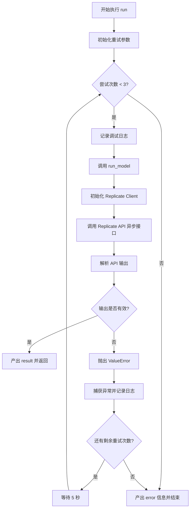
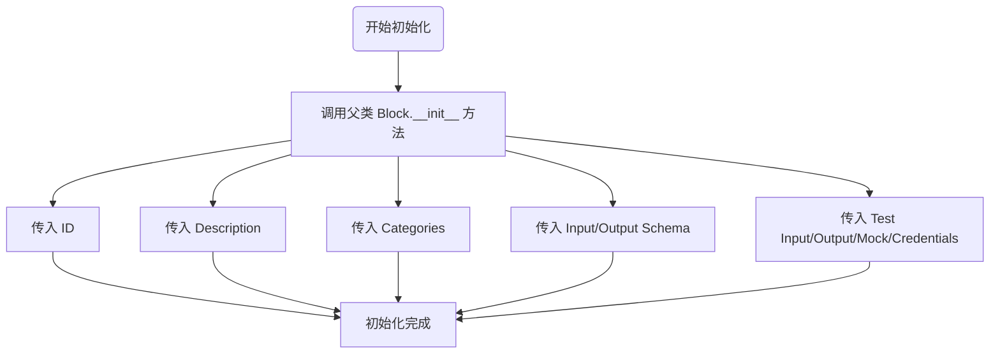
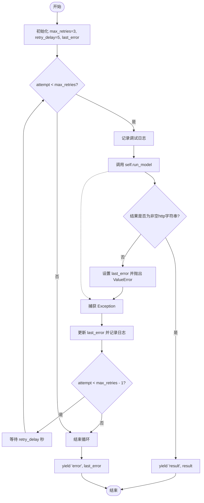
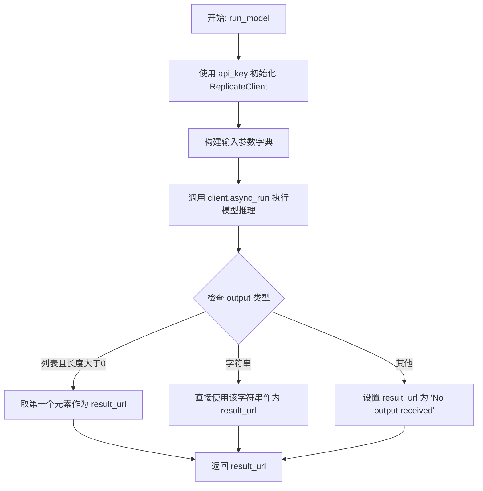

# `AutoGPT\autogpt_platform\backend\backend\blocks\ai_music_generator.py` 详细设计文档

该代码实现了一个基于 Replicate API 的 AI 音乐生成器块，通过集成 Meta 的 MusicGen 模型，根据用户提供的文本提示及多种音频参数（如时长、温度、输出格式等）生成音频文件，并实现了异步执行、重试机制与错误处理。

## 整体流程



## 类结构

```
MusicGenModelVersion (Enum)
AudioFormat (Enum)
NormalizationStrategy (Enum)
AIMusicGeneratorBlock (Class)
├── Input (Class)
├── Output (Class)
├── __init__
├── run
└── run_model
```

## 全局变量及字段


### `logger`
    
用于记录模块运行日志和错误信息的日志记录器实例

类型：`logging.Logger`
    


### `TEST_CREDENTIALS`
    
用于测试环境的模拟 Replicate API 凭证对象

类型：`APIKeyCredentials`
    


### `TEST_CREDENTIALS_INPUT`
    
用于测试输入的模拟凭证字典数据

类型：`dict`
    


### `MusicGenModelVersion.STEREO_LARGE`
    
表示立体声大模型版本枚举值

类型：`MusicGenModelVersion`
    


### `MusicGenModelVersion.MELODY_LARGE`
    
表示旋律大模型版本枚举值

类型：`MusicGenModelVersion`
    


### `MusicGenModelVersion.LARGE`
    
表示大模型版本枚举值

类型：`MusicGenModelVersion`
    


### `AudioFormat.WAV`
    
表示 WAV 音频格式枚举值

类型：`AudioFormat`
    


### `AudioFormat.MP3`
    
表示 MP3 音频格式枚举值

类型：`AudioFormat`
    


### `NormalizationStrategy.LOUDNESS`
    
表示响度归一化策略枚举值

类型：`NormalizationStrategy`
    


### `NormalizationStrategy.CLIP`
    
表示削波归一化策略枚举值

类型：`NormalizationStrategy`
    


### `NormalizationStrategy.PEAK`
    
表示峰值归一化策略枚举值

类型：`NormalizationStrategy`
    


### `NormalizationStrategy.RMS`
    
表示均方根（RMS）归一化策略枚举值

类型：`NormalizationStrategy`
    


### `AIMusicGeneratorBlock.Input.credentials`
    
用于身份验证的 Replicate API 凭证元数据

类型：`CredentialsMetaInput`
    


### `AIMusicGeneratorBlock.Input.prompt`
    
描述想要生成的音乐内容的文本提示词

类型：`str`
    


### `AIMusicGeneratorBlock.Input.music_gen_model_version`
    
指定用于生成音乐的模型版本

类型：`MusicGenModelVersion`
    


### `AIMusicGeneratorBlock.Input.duration`
    
生成音频的持续时间，单位为秒

类型：`int`
    


### `AIMusicGeneratorBlock.Input.temperature`
    
控制采样过程的保守程度，值越高多样性越大

类型：`float`
    


### `AIMusicGeneratorBlock.Input.top_k`
    
限制采样仅在概率最高的 k 个 token 中进行

类型：`int`
    


### `AIMusicGeneratorBlock.Input.top_p`
    
限制采样在累积概率达到 p 的 token 中进行

类型：`float`
    


### `AIMusicGeneratorBlock.Input.classifier_free_guidance`
    
增加输入对输出的影响程度，值越高输出越贴近输入

类型：`int`
    


### `AIMusicGeneratorBlock.Input.output_format`
    
指定生成音频的输出格式

类型：`AudioFormat`
    


### `AIMusicGeneratorBlock.Input.normalization_strategy`
    
指定音频归一化的处理策略

类型：`NormalizationStrategy`
    


### `AIMusicGeneratorBlock.Output.result`
    
生成的音频文件的 URL 地址

类型：`str`
    
    

## 全局函数及方法


### `AIMusicGeneratorBlock.__init__`

该初始化方法用于配置 AI 音乐生成器块的基本属性。它调用父类 `Block` 的构造函数，并传入该块的唯一标识符、功能描述、所属分类、输入/输出数据架构定义，以及用于测试的模拟输入、预期输出、模拟函数和测试凭据。

参数：

返回值：`None`，无返回值。

#### 流程图



#### 带注释源码

```python
    def __init__(self):
        # 调用父类 Block 的初始化方法，配置块的元数据和测试数据
        super().__init__(
            # 块的唯一标识符
            id="44f6c8ad-d75c-4ae1-8209-aad1c0326928",
            # 块的文本描述，说明其使用 Meta 的 MusicGen 模型生成音乐
            description="This block generates music using Meta's MusicGen model on Replicate.",
            # 块所属的分类，这里归为 AI 类
            categories={BlockCategory.AI},
            # 定义输入数据的 Schema，引用内部类 Input
            input_schema=AIMusicGeneratorBlock.Input,
            # 定义输出数据的 Schema，引用内部类 Output
            output_schema=AIMusicGeneratorBlock.Output,
            # 定义测试用的输入数据，包含凭据、提示词和各种生成参数
            test_input={
                "credentials": TEST_CREDENTIALS_INPUT,
                "prompt": "An upbeat electronic dance track with heavy bass",
                "music_gen_model_version": MusicGenModelVersion.STEREO_LARGE,
                "duration": 8,
                "temperature": 1.0,
                "top_k": 250,
                "top_p": 0.0,
                "classifier_free_guidance": 3,
                "output_format": AudioFormat.WAV,
                "normalization_strategy": NormalizationStrategy.LOUDNESS,
            },
            # 定义测试期望的输出结果，通常是音频文件的 URL
            test_output=[
                (
                    "result",
                    "https://replicate.com/output/generated-audio-url.wav",
                ),
            ],
            # 定义模拟函数，用于在测试环境中模拟 run_model 方法的行为，避免实际调用 API
            test_mock={
                "run_model": lambda api_key, music_gen_model_version, prompt, duration, temperature, top_k, top_p, classifier_free_guidance, output_format, normalization_strategy: "https://replicate.com/output/generated-audio-url.wav",
            },
            # 定义测试使用的凭据对象
            test_credentials=TEST_CREDENTIALS,
        )
```


### `AIMusicGeneratorBlock.run`

该方法是 `AIMusicGeneratorBlock` 的核心执行入口，负责异步调用 Replicate API 生成音乐。它实现了一个带有延迟机制的重试逻辑（最多重试3次），通过调用 `run_model` 方法与外部服务交互，并验证返回结果的格式。如果成功生成，产出音频 URL；如果重试耗尽仍失败，则产出错误信息。

参数：

-  `input_data`：`AIMusicGeneratorBlock.Input`，包含生成音乐所需的所有配置参数，如提示词、模型版本、时长、温度系数等。
-  `credentials`：`APIKeyCredentials`，用于身份验证的凭据对象，包含访问 Replicate API 所需的密钥。
-  `**kwargs`：`typing.Any`，额外的关键字参数，用于接收可能存在的扩展输入（当前未直接使用）。

返回值：`BlockOutput`，一个异步生成器，产出包含执行结果的元组。成功时产出 `("result", url)`，失败时产出 `("error", error_message)`。

#### 流程图



#### 带注释源码

```python
    async def run(
        self, input_data: Input, *, credentials: APIKeyCredentials, **kwargs
    ) -> BlockOutput:
        # 配置重试策略：最多重试3次，每次间隔5秒
        max_retries = 3
        retry_delay = 5  # seconds
        last_error = None

        # 循环尝试执行任务
        for attempt in range(max_retries):
            try:
                # 记录当前尝试的调试信息
                logger.debug(
                    f"[AIMusicGeneratorBlock] - Running model (attempt {attempt + 1})"
                )
                # 调用实际执行模型的方法，传入API密钥和用户输入参数
                result = await self.run_model(
                    api_key=credentials.api_key,
                    music_gen_model_version=input_data.music_gen_model_version,
                    prompt=input_data.prompt,
                    duration=input_data.duration,
                    temperature=input_data.temperature,
                    top_k=input_data.top_k,
                    top_p=input_data.top_p,
                    classifier_free_guidance=input_data.classifier_free_guidance,
                    output_format=input_data.output_format,
                    normalization_strategy=input_data.normalization_strategy,
                )
                # 验证返回结果是否为有效的HTTP URL
                if result and isinstance(result, str) and result.startswith("http"):
                    # 成功：产出结果并结束执行
                    yield "result", result
                    return
                else:
                    # 失败：结果无效，设置错误信息并抛出异常以触发重试
                    last_error = "Model returned empty or invalid response"
                    raise ValueError(last_error)
            except Exception as e:
                # 捕获执行过程中的异常
                last_error = f"Unexpected error: {str(e)}"
                logger.error(f"[AIMusicGeneratorBlock] - Error: {last_error}")
                # 如果未达到最大重试次数，则等待后继续下一次尝试
                if attempt < max_retries - 1:
                    await asyncio.sleep(retry_delay)
                    continue

        # 如果所有重试尝试均失败，产出错误信息
        yield "error", f"Failed after {max_retries} attempts. Last error: {last_error}"
```


### `AIMusicGeneratorBlock.run_model`

该方法负责初始化 Replicate 客户端，使用 Meta 的 MusicGen 模型并根据提供的参数异步生成音频，最终返回生成结果的 URL。

参数：

- `api_key`：`SecretStr`，用于访问 Replicate API 的密钥。
- `music_gen_model_version`：`MusicGenModelVersion`，指定使用的 MusicGen 模型版本（如 stereo-large）。
- `prompt`：`str`，描述想要生成的音乐的文本提示。
- `duration`：`int`，生成音频的持续时间（秒）。
- `temperature`：`float`，控制采样的随机性，值越高多样性越强。
- `top_k`：`int`，限制采样仅保留概率最高的 k 个 tokens。
- `top_p`：`float`，核采样参数，限制采样至累积概率为 p 的 tokens。
- `classifier_free_guidance`：`int`，无分类器引导强度，值越高输出越贴近输入提示。
- `output_format`：`AudioFormat`，生成音频的输出格式（如 wav, mp3）。
- `normalization_strategy`：`NormalizationStrategy`，音频归一化的策略（如 loudness, clip）。

返回值：`str`，生成的音频文件的 URL 地址，或者在未收到有效输出时的错误提示字符串。

#### 流程图



#### 带注释源码

```python
    async def run_model(
        self,
        api_key: SecretStr,
        music_gen_model_version: MusicGenModelVersion,
        prompt: str,
        duration: int,
        temperature: float,
        top_k: int,
        top_p: float,
        classifier_free_guidance: int,
        output_format: AudioFormat,
        normalization_strategy: NormalizationStrategy,
    ):
        # 使用提供的 API 密钥初始化 Replicate 客户端
        client = ReplicateClient(api_token=api_key.get_secret_value())

        # 异步运行指定的 MusicGen 模型，传入所有配置参数
        output = await client.async_run(
            "meta/musicgen:671ac645ce5e552cc63a54a2bbff63fcf798043055d2dac5fc9e36a837eedcfb",
            input={
                "prompt": prompt,
                "music_gen_model_version": music_gen_model_version,
                "duration": duration,
                "temperature": temperature,
                "top_k": top_k,
                "top_p": top_p,
                "classifier_free_guidance": classifier_free_guidance,
                "output_format": output_format,
                "normalization_strategy": normalization_strategy,
            },
        )

        # 处理模型的输出结果，确保返回的是字符串形式的 URL
        if isinstance(output, list) and len(output) > 0:
            result_url = output[0]  # 如果输出是列表，取第一个元素
        elif isinstance(output, str):
            result_url = output  # 如果输出是字符串，直接使用
        else:
            result_url = (
                "No output received"  # 如果输出格式不符合预期，返回兜底消息
            )

        return result_url
```


## 关键组件


### AIMusicGeneratorBlock

核心类组件，继承自 `Block`，负责封装音乐生成的整体逻辑，包括元数据定义、输入输出 Schema 的注册以及主要的执行流程控制。

### Schema Definition

基于 Pydantic 的数据契约定义，包含内部类 `Input` 和 `Output`，用于定义 API 凭证、提示词、模型参数（如温度、Top-K 等）及输出 URL 的结构化验证。

### Domain Configuration Enums

定义域模型的配置枚举集合，包括 `MusicGenModelVersion`（模型版本）、`AudioFormat`（音频格式）和 `NormalizationStrategy`（归一化策略），用于约束输入参数的合法取值。

### Replicate Model Invocation

外部服务交互组件，封装在 `run_model` 方法中，负责初始化 `ReplicateClient`，构建请求参数并异步调用 Meta 的 MusicGen 模型接口。

### Async Retry Mechanism

容错处理组件，实现在 `run` 方法内部的循环逻辑，通过最多 3 次的重试机制和延迟策略（5秒），增强了模型调用在网络波动或临时错误下的鲁棒性。


## 问题及建议


### 已知问题

-   **错误输出与Schema不匹配**：`run` 方法在失败时 yield `("error", ...)`，但 `Output` Schema 仅定义了 `result` 字段。这会导致输出数据验证失败，且下游组件可能无法正确处理未定义的错误字段，应抛出异常而非 yield 错误。
-   **客户端重复实例化导致性能损耗**：`run_model` 方法在每次调用时都会创建新的 `ReplicateClient` 实例，无法复用 HTTP 连接，增加了不必要的初始化开销和延迟。
-   **重试机制缺乏精细控制**：当前的 `max_retries` 逻辑会重试所有异常（包括认证失败、参数错误等 4xx 错误），这会无效消耗配额并延长失败反馈时间。
-   **模型版本硬编码**：模型版本 ID 字符串被硬编码在 `run_model` 方法内部，缺乏灵活性，更新模型需要修改代码。

### 优化建议

-   **优化错误处理机制**：建议将运行时的错误通过抛出特定异常（如 `BlockExecutionError`）向上传递，而不是作为输出数据 yield，以确保错误能被框架正确捕获和记录。
-   **优化客户端实例管理**：建议在 `__init__` 中初始化客户端或使用依赖注入/单例模式管理 `ReplicateClient`（需确保线程/异步安全），以实现连接复用。
-   **实施智能重试策略**：根据捕获的异常类型或 HTTP 状态码判断是否重试，仅对网络抖动或服务器端错误（5xx）进行重试，避免对客户端参数错误（4xx）进行无效重试。
-   **提取硬编码配置**：将模型版本 ID 和重试配置提取为类常量或配置项，提高代码的可维护性和灵活性。
-   **增加超时控制**：在调用 `client.async_run` 时增加 `timeout` 参数，防止因第三方服务响应缓慢而导致任务无限期挂起。


## 其它


### 设计目标与约束

**设计目标**：
1.  **模块化封装**：将 Replicate 的 MusicGen 模型封装为独立的 `Block` 组件，以便在更大的工作流图中灵活调用。
2.  **异步非阻塞**：利用 Python 的 `asyncio` 机制，确保在调用耗时较长的 AI 模型推理时，不阻塞主事件循环，提高系统并发能力。
3.  **易用性与可配置性**：通过 Pydantic 提供清晰的输入输出 Schema，允许用户调整模型版本、音频时长、采样参数等，同时提供合理的默认值。

**约束条件**：
1.  **API 依赖**：强依赖于 Replicate 提供的服务及其特定模型版本 (`meta/musicgen:...`)，需保持网络连通性及有效的 API Key。
2.  **重试策略限制**：当前重试逻辑被硬编码为最多 3 次，每次间隔 5 秒，无法通过外部配置动态调整。
3.  **状态限制**：该组件设计为无状态服务，不保存生成历史或会话信息，每次调用独立处理。
4.  **超时处理**：当前代码未显式设置 `asyncio.wait_for` 或 HTTP 客户端层面的超时，可能面临长时间挂起的风险。

### 错误处理与异常设计

**异常捕获机制**：
*   **全局捕获**：在 `run` 方法的重试循环中，使用 `try...except Exception as e` 捕获所有底层异常（如网络错误、API 返回错误、JSON 解析错误等）。
*   **重试逻辑**：当捕获到异常或模型返回无效响应时，只要未达到最大重试次数 (`max_retries`)，系统会记录错误日志 (`logger.error`)，休眠指定时间 (`retry_delay`)，然后自动发起下一次尝试。
*   **最终失败处理**：如果重试耗尽仍未成功，模块不会抛出异常中断工作流，而是通过 `yield` 机制输出一个名为 `"error"` 的键值对，包含具体的错误信息，以便下游块处理错误或由用户查看日志。

**数据校验**：
*   **响应校验**：在 `run` 方法中显式检查返回值是否为非空字符串且以 `"http"` 开头，确保返回的是有效的 URL。如果校验失败，视为业务逻辑错误，触发重试流程。

### 数据流与状态机

**数据流**：
1.  **输入阶段**：外部调用者传入 `input_data`（包含 prompt, duration 等参数）和 `credentials`（API Key）。
2.  **预处理**：`run` 方法提取输入数据，进入重试循环状态。
3.  **执行阶段**：`run_model` 方法被调用，将参数映射为 Replicate API 所需的格式，通过 `ReplicateClient` 发送异步请求。
4.  **输出处理**：API 返回结果（字符串 URL 或列表），`run_model` 提取首个有效 URL 并返回。
5.  **响应阶段**：`run` 方法校验 URL，若成功则通过 `yield "result", url` 输出；若失败则进入错误分支，最终输出 `yield "error", message`。

**执行状态机**：
1.  **Idle (空闲)**：Block 实例化，等待调用。
2.  **Running (运行中/重试中)**：进入 `run` 方法，执行 `attempt` 循环。包含子状态：`Awaiting_API_Response`（等待 Replicate 响应）。
3.  **Success (成功)**：获取有效 HTTP URL，产出结果并 `return`，生命周期结束。
4.  **Failure (失败)**：重试次数耗尽，产出错误信息，生命周期结束。

### 外部依赖与接口契约

**外部依赖库**：
1.  **`replicate` (ReplicateClient)**：核心依赖，用于与 Replicate 云端模型进行异步交互。
2.  **`pydantic` (SecretStr, BaseModel)**：用于数据校验、序列化和敏感信息（API Key）的保护。
3.  **`backend.data.block` & `backend.data.model`**：项目内部框架依赖，定义了 Block 的基类、输入输出模式规范以及凭证管理机制。

**接口契约 (Replicate API)**：
*   **输入契约**：调用端必须提供符合 Replicate API 规范的参数字典，包括 `prompt` (str), `music_gen_model_version` (enum), `duration` (int) 等。
*   **输出契约**：Replicate API 预期返回一个包含音频文件 URL 的列表 (List[str]) 或直接的字符串 (str)。代码假设输出列表的首个元素或直接字符串即为目标 URL。
*   **认证契约**：必须在初始化客户端时提供有效的 `api_token`，否则认证失败会触发异常并被重试机制捕获。

### 并发与性能考量

**并发模型**：
*   该模块完全基于 `async/await` 协程编写。`run_model` 方法内部调用 `client.async_run`，这使得在等待模型生成音频（通常需要几秒到几十秒）期间，线程控制权可以交还给事件循环，允许处理其他并发任务。

**资源管理**：
*   **客户端生命周期**：`ReplicateClient` 在每次 `run_model` 调用时被重新初始化。虽然增加了微小的初始化开销，但避免了长时间持有连接可能带来的状态污染问题，简化了错误恢复逻辑。
*   **内存占用**：主要内存消耗在于接收 API 返回的音频数据（尽管代码只处理 URL，不直接下载二进制流到内存，除非 Replicate 客户端库内部缓存），内存压力较小。

### 测试策略与可观测性

**测试支持**：
*   **Mock 机制**：在 `__init__` 中配置了 `test_mock`，允许在单元测试环境中拦截 `run_model` 的调用，直接返回预设的模拟 URL，避免真实网络调用。
*   **预设数据**：定义了 `TEST_CREDENTIALS` 和标准的 `test_input`，覆盖了大多数枚举类型的边界值（如 `STEREO_LARGE`, `WAV`），确保测试覆盖率。

**日志记录**：
*   使用了 Python 标准库 `logging`。
*   **关键点日志**：在重试循环中记录 `Running model (attempt X)`，以及在捕获异常时记录详细的 Error 堆栈信息。这对于追踪由于网络波动或 API 不稳定导致的偶发性失败至关重要。
*   **Debug 信息**：包含了 `logger.debug` 用于输出当前的尝试次数，便于在生产环境排查性能瓶颈或重试频繁的问题。

### 扩展性设计

**枚举驱动**：
*   模型版本 (`MusicGenModelVersion`)、音频格式 (`AudioFormat`) 和归一化策略 (`NormalizationStrategy`) 均使用 `Enum` 定义。如果 Replicate 更新模型支持新格式或新版本，只需在对应的 Enum 类中添加新成员，前端 UI 或调用方可自动获取新选项，无需修改核心逻辑代码。

**配置解耦**：
*   输入参数（Top K, Top P, Temperature 等）直接映射到模型参数，这种扁平化的设计使得未来如果需要暴露更多底层模型参数，只需在 `Input` 类中添加字段并在 `run_model` 中传递即可。

    