# `AutoGPT\autogpt_platform\backend\backend\blocks\ai_shortform_video_block.py` 详细设计文档

该文件实现了基于 Revid.ai API 的视频生成功能，包含三个核心 Block 类：AIShortformVideoCreatorBlock 用于生成短视频，AIAdMakerVideoCreatorBlock 用于生成广告视频，AIScreenshotToVideoAdBlock 用于将截图转化为视频广告。代码集成了异步 API 请求、任务状态轮询、错误处理以及视频文件的持久化存储，并定义了音频轨道、生成预设、配音和视觉媒体类型等枚举配置。

## 整体流程

```mermaid
graph TD
    A[开始: 接收输入数据] --> B[配置凭证与参数]
    B --> C[创建 Webhook URL (create_webhook)]
    C --> D[构建 API Payload]
    D --> E[调用 create_video API 发起生成任务]
    E --> F{是否返回 PID (任务ID)?}
    F -- 否 --> G[抛出 RuntimeError]
    F -- 是 --> H[进入轮询等待 (wait_for_video)]
    H --> I[调用 check_video_status 检查状态]
    I --> J{状态判断}
    J -- ready --> K[获取 video_url]
    J -- error/FAILED/CANCELED --> L[抛出 ValueError]
    J -- processing/other --> M[休眠 10 秒]
    M --> H
    H -- 超时 --> N[抛出 BlockExecutionError]
    K --> O[调用 store_media_file 存储视频]
    O --> P[结束: 返回存储后的 video_url]
```

## 类结构

```
AudioTrack (Enum)
GenerationPreset (Enum)
Voice (Enum)
VisualMediaType (Enum)
AIShortformVideoCreatorBlock (Block)
├── Input (BlockSchemaInput)
└── Output (BlockSchemaOutput)
AIAdMakerVideoCreatorBlock (Block)
├── Input (BlockSchemaInput)
└── Output (BlockSchemaOutput)
AIScreenshotToVideoAdBlock (Block)
├── Input (BlockSchemaInput)
└── Output (BlockSchemaOutput)
```

## 全局变量及字段


### `TEST_CREDENTIALS`
    
Mock Revid API credentials object used for testing purposes.

类型：`APIKeyCredentials`
    


### `TEST_CREDENTIALS_INPUT`
    
Input dictionary representation of the mock credentials used for testing.

类型：`dict`
    


### `logger`
    
Logger instance for recording execution details and debugging information.

类型：`logging.Logger`
    


    

## 全局函数及方法


### `AudioTrack.audio_url`

该属性用于获取当前 `AudioTrack` 枚举成员对应的音频文件 URL 地址。它通过内部定义的字典映射，将枚举值转换为 CDN 上的音频资源链接。

参数：

-  `self`：`AudioTrack`，表示当前的音频轨道枚举实例，用作字典查询的键。

返回值：`str`，对应音频轨道的 URL 字符串。

#### 流程图

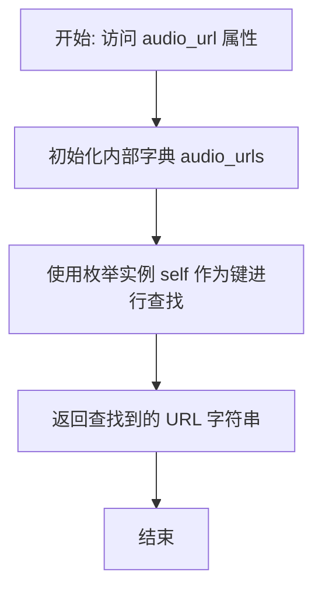

#### 带注释源码

```python
    @property
    def audio_url(self):
        # 定义一个字典，将每个 AudioTrack 枚举成员映射到其对应的 CDN 音频 URL
        audio_urls = {
            AudioTrack.OBSERVER: "https://cdn.tfrv.xyz/audio/observer.mp3",
            AudioTrack.FUTURISTIC_BEAT: "https://cdn.tfrv.xyz/audio/_futuristic-beat.mp3",
            AudioTrack.SCIENCE_DOCUMENTARY: "https://cdn.tfrv.xyz/audio/_science-documentary.mp3",
            AudioTrack.HOTLINE: "https://cdn.tfrv.xyz/audio/_hotline.mp3",
            AudioTrack.BLADERUNNER_2049: "https://cdn.tfrv.xyz/audio/_bladerunner-2049.mp3",
            AudioTrack.A_FUTURE: "https://cdn.tfrv.xyz/audio/a-future.mp3",
            AudioTrack.ELYSIAN_EMBERS: "https://cdn.tfrv.xyz/audio/elysian-embers.mp3",
            AudioTrack.INSPIRING_CINEMATIC: "https://cdn.tfrv.xyz/audio/inspiring-cinematic-ambient.mp3",
            AudioTrack.BLADERUNNER_REMIX: "https://cdn.tfrv.xyz/audio/bladerunner-remix.mp3",
            AudioTrack.IZZAMUZZIC: "https://cdn.tfrv.xyz/audio/_izzamuzzic.mp3",
            AudioTrack.NAS: "https://cdn.tfrv.xyz/audio/_nas.mp3",
            AudioTrack.PARIS_ELSE: "https://cdn.tfrv.xyz/audio/_paris-else.mp3",
            AudioTrack.SNOWFALL: "https://cdn.tfrv.xyz/audio/_snowfall.mp3",
            AudioTrack.BURLESQUE: "https://cdn.tfrv.xyz/audio/burlesque.mp3",
            AudioTrack.CORNY_CANDY: "https://cdn.tfrv.xyz/audio/corny-candy.mp3",
            AudioTrack.HIGHWAY_NOCTURNE: "https://cdn.tfrv.xyz/audio/highway-nocturne.mp3",
            AudioTrack.I_DONT_THINK_SO: "https://cdn.tfrv.xyz/audio/i-dont-think-so.mp3",
            AudioTrack.LOSING_YOUR_MARBLES: "https://cdn.tfrv.xyz/audio/losing-your-marbles.mp3",
            AudioTrack.REFRESHER: "https://cdn.tfrv.xyz/audio/refresher.mp3",
            AudioTrack.TOURIST: "https://cdn.tfrv.xyz/audio/tourist.mp3",
            AudioTrack.TWIN_TYCHES: "https://cdn.tfrv.xyz/audio/twin-tynches.mp3",
            AudioTrack.DONT_STOP_ME_ABSTRACT_FUTURE_BASS: "https://cdn.revid.ai/audio/_dont-stop-me-abstract-future-bass.mp3",
        }
        # 返回当前枚举实例（self）在字典中对应的 URL 值
        return audio_urls[self]
```


### `Voice.voice_id`

获取与该语音枚举实例对应的 API 语音 ID 字符串。

参数：

- `self`：`Voice`，当前的语音枚举实例（例如 `Voice.LILY`）。

返回值：`str`，映射后的 API 语音 ID 字符串。

#### 流程图

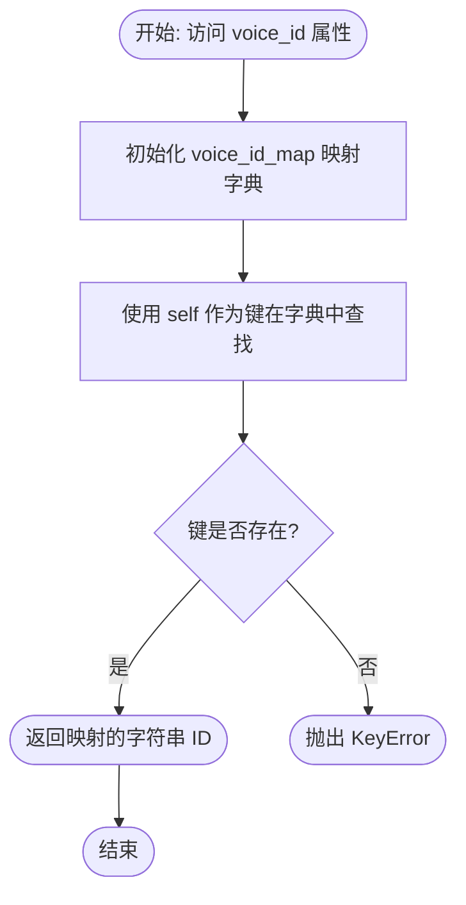

#### 带注释源码

```python
    @property
    def voice_id(self):
        # 定义语音枚举值到 API ID 的映射字典
        voice_id_map = {
            Voice.LILY: "pFZP5JQG7iQjIQuC4Bku",
            Voice.DANIEL: "onwK4e9ZLuTAKqWW03F9",
            Voice.BRIAN: "nPczCjzI2devNBz1zQrb",
            Voice.JESSICA: "cgSgspJ2msm6clMCkdW9",
            Voice.CHARLOTTE: "XB0fDUnXU5powFXDhCwa",
            Voice.CALLUM: "N2lVS1w4EtoT3dr4eOWO",
            Voice.EVA: "FGY2WhTYpPnrIDTdsKH5",
        }
        # 返回当前枚举实例 self 对应的 ID 值
        return voice_id_map[self]
```


### `Voice.__str__`

返回 `Voice` 枚举成员的字符串表示形式，即该成员的具体值。

参数：

- `self`：`Voice`，调用该方法的 `Voice` 枚举实例。

返回值：`str`，语音枚举成员的具体字符串值（例如 "Lily", "Daniel"）。

#### 流程图

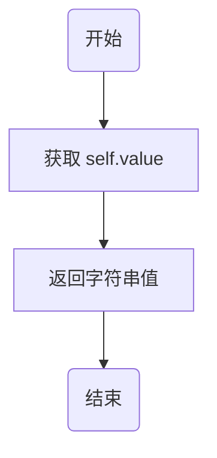

#### 带注释源码

```python
def __str__(self):
    # 返回枚举成员定义时的具体字符串值（例如 self.value == "Lily"）
    return self.value
```


### `AIShortformVideoCreatorBlock.create_webhook`

创建一个新的 Webhook URL 用于接收视频生成的异步通知。

参数：
- 无

返回值：`tuple[str, str]`，包含 Webhook 的唯一标识符 (UUID) 和完整的 Webhook URL。

#### 流程图

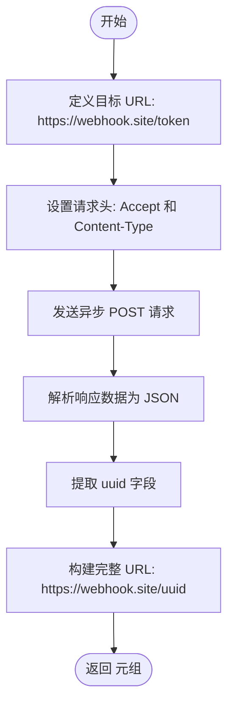

#### 带注释源码

```python
    async def create_webhook(self) -> tuple[str, str]:
        """Create a new webhook URL for receiving notifications."""
        # 定义 Webhook.site 的 Token 生成接口地址
        url = "https://webhook.site/token"
        # 设置请求头，指定接受 JSON 格式响应和发送 JSON 格式数据
        headers = {"Accept": "application/json", "Content-Type": "application/json"}
        # 发送 POST 请求创建新的 Webhook 钩子
        response = await Requests().post(url, headers=headers)
        # 解析返回的 JSON 数据
        webhook_data = response.json()
        # 返回 uuid 和根据 uuid 拼接出的完整 webhook 地址
        return webhook_data["uuid"], f"https://webhook.site/{webhook_data['uuid']}"
```


### `AIShortformVideoCreatorBlock.create_video`

使用 Revid API 创建视频。

参数：

- `api_key`：`SecretStr`，用于 Revid 身份验证的 API 密钥
- `payload`：`dict`，视频生成的配置和内容数据

返回值：`dict`，Revid API 返回的 JSON 响应（通常包含项目 ID 或状态）

#### 流程图

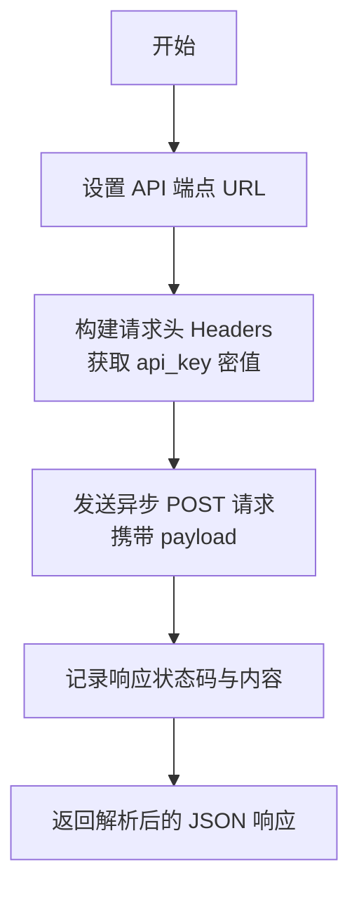

#### 带注释源码

```python
async def create_video(self, api_key: SecretStr, payload: dict) -> dict:
    """Create a video using the Revid API."""
    # 定义 Revid 视频渲染 API 的端点地址
    url = "https://www.revid.ai/api/public/v2/render"
    # 准备请求头，从 SecretStr 对象中提取实际的 API 密钥值
    headers = {"key": api_key.get_secret_value()}
    # 使用 Requests 工具发送异步 POST 请求，传入 JSON 格式的载荷和请求头
    response = await Requests().post(url, json=payload, headers=headers)
    # 记录 API 响应的状态码和文本内容，用于调试和日志追踪
    logger.debug(
        f"API Response Status Code: {response.status}, Content: {response.text}"
    )
    # 将响应体解析为 JSON 字典并返回
    return response.json()
```


### `AIShortformVideoCreatorBlock.check_video_status`

该方法用于检查视频创建任务的当前状态。通过向 Revid API 发送 GET 请求，根据传入的项目 ID (pid) 获取视频的渲染进度或最终结果。

参数：

- `api_key`：`SecretStr`，用于 Revid API 身份验证的密钥。
- `pid`：`str`，视频创建任务的唯一项目标识符。

返回值：`dict`，包含视频任务状态详情的字典，例如状态码、视频URL或错误信息。

#### 流程图

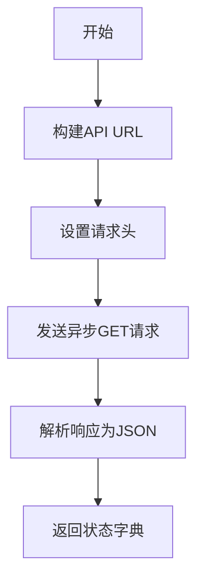

#### 带注释源码

```python
    async def check_video_status(self, api_key: SecretStr, pid: str) -> dict:
        """Check the status of a video creation job."""
        # 根据传入的项目ID (pid) 拼接查询视频状态的API地址
        url = f"https://www.revid.ai/api/public/v2/status?pid={pid}"
        # 设置请求头，包含用于身份验证的 API Key
        headers = {"key": api_key.get_secret_value()}
        # 使用封装好的 Requests 工具发起异步 GET 请求
        response = await Requests().get(url, headers=headers)
        # 返回 API 响应的 JSON 数据
        return response.json()
```


### `AIShortformVideoCreatorBlock.wait_for_video`

该函数用于轮询视频创建任务的状态，直到视频生成完成、发生错误或达到超时限制，最终返回视频的 URL。

参数：

- `api_key`：`SecretStr`，用于 Revid API 身份验证的密钥。
- `pid`：`str`，视频渲染任务的进程 ID（Project ID）。
- `max_wait_time`：`int`，最大等待时间（秒），默认为 1000。

返回值：`str`，创建完成的视频 URL。

#### 流程图

```mermaid
flowchart TD
    A([开始]) --> B[记录开始时间 start_time]
    B --> C{当前时间 - start_time < max_wait_time?}
    C -- 否 --> D[记录错误日志: Video creation timed out]
    D --> E[抛出 BlockExecutionError 异常]
    C -- 是 --> F[调用 check_video_status 获取状态]
    F --> G{状态判断}
    G -- status == 'ready' 且包含 videoUrl --> H[返回 status['videoUrl']]
    G -- status == 'error' --> I[获取 error 信息并记录日志]
    I --> J[抛出 ValueError 异常]
    G -- status 在 FAILED 或 CANCELED 之中 --> K[获取 message 信息并记录日志]
    K --> L[抛出 ValueError 异常]
    G -- 其他状态 --> M[异步等待 10 秒]
    M --> C
```

#### 带注释源码

```python
async def wait_for_video(
    self,
    api_key: SecretStr,
    pid: str,
    max_wait_time: int = 1000,
) -> str:
    """Wait for video creation to complete and return the video URL."""
    # 记录任务开始的时间戳，用于后续计算是否超时
    start_time = time.time()
    
    # 进入轮询循环，直到视频就绪、出错或超时
    while time.time() - start_time < max_wait_time:
        # 调用 check_video_status 方法异步查询当前视频的渲染状态
        status = await self.check_video_status(api_key, pid)
        logger.debug(f"Video status: {status}")

        # 如果状态为 'ready' 且返回数据中包含 'videoUrl'，说明视频生成成功
        if status.get("status") == "ready" and "videoUrl" in status:
            return status["videoUrl"]
        # 如果状态为 'error'，记录具体错误信息并抛出 ValueError
        elif status.get("status") == "error":
            error_message = status.get("error", "Unknown error occurred")
            logger.error(f"Video creation failed: {error_message}")
            raise ValueError(f"Video creation failed: {error_message}")
        # 如果状态为 'FAILED' 或 'CANCELED'，记录信息并抛出 ValueError
        elif status.get("status") in ["FAILED", "CANCELED"]:
            logger.error(f"Video creation failed: {status.get('message')}")
            raise ValueError(f"Video creation failed: {status.get('message')}")

        # 如果视频仍在处理中，等待 10 秒后再次轮询，避免频繁请求 API
        await asyncio.sleep(10)

    # 如果循环正常退出（即超过了 max_wait_time），记录超时日志并抛出特定异常
    logger.error("Video creation timed out")
    raise BlockExecutionError(
        message="Video creation timed out",
        block_name=self.name,
        block_id=self.id,
    )
```


### `AIShortformVideoCreatorBlock.__init__`

该方法是 `AIShortformVideoCreatorBlock` 类的构造函数，负责初始化块的基本元数据。它定义了块的唯一标识符、描述、所属分类、输入输出数据模式，以及用于测试的模拟输入、输出和凭证，确保块在执行前具有完整的配置信息和测试能力。

参数：

-  `self`：`AIShortformVideoCreatorBlock`，类的实例本身。

返回值：`None`，构造函数不返回任何值。

#### 流程图

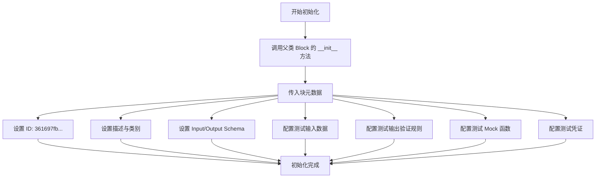

#### 带注释源码

```python
def __init__(self):
    # 调用父类 Block 的构造函数，传递配置参数
    super().__init__(
        # 块的唯一标识符
        id="361697fb-0c4f-4feb-aed3-8320c88c771b",
        # 块的功能描述
        description="Creates a shortform video using revid.ai",
        # 块所属的分类：社交和AI
        categories={BlockCategory.SOCIAL, BlockCategory.AI},
        # 定义输入数据的 Schema，引用内部类 Input
        input_schema=AIShortformVideoCreatorBlock.Input,
        # 定义输出数据的 Schema，引用内部类 Output
        output_schema=AIShortformVideoCreatorBlock.Output,
        # 定义用于测试的输入数据样本
        test_input={
            "credentials": TEST_CREDENTIALS_INPUT,
            "script": "[close-up of a cat] Meow!",
            "ratio": "9 / 16",
            "resolution": "720p",
            "frame_rate": 60,
            "generation_preset": GenerationPreset.LEONARDO,
            "background_music": AudioTrack.HIGHWAY_NOCTURNE,
            "voice": Voice.LILY,
            "video_style": VisualMediaType.STOCK_VIDEOS,
        },
        # 定义测试输出的验证规则，检查输出是否以特定前缀开头
        test_output=(
            "video_url",
            lambda x: x.startswith(("workspace://", "data:")),
        ),
        # 定义测试时的 Mock 函数，避免在单元测试中进行实际的网络请求
        test_mock={
            # Mock 创建 Webhook 的方法
            "create_webhook": lambda *args, **kwargs: (
                "test_uuid",
                "https://webhook.site/test_uuid",
            ),
            # Mock 创建视频的方法，返回假的项目 ID
            "create_video": lambda *args, **kwargs: {"pid": "test_pid"},
            # Mock 检查视频状态的方法，返回“就绪”状态和假的视频 URL
            "check_video_status": lambda *args, **kwargs: {
                "status": "ready",
                "videoUrl": "data:video/mp4;base64,AAAA",
            },
            # Mock 等待视频生成的方法，直接返回假的视频 URL
            # 使用 data URI 以避免 HTTP 请求
            "wait_for_video": lambda *args, **kwargs: "data:video/mp4;base64,AAAA",
        },
        # 定义测试使用的凭证对象
        test_credentials=TEST_CREDENTIALS,
    )
```


### `AIShortformVideoCreatorBlock.run`

执行创建短视频的核心逻辑。该方法通过调用 Revid API，根据输入的脚本、视觉风格、配音等配置生成视频，轮询处理状态直到视频就绪，并将最终生成的视频文件存储到工作空间中返回。

参数：

- `input_data`：`AIShortformVideoCreatorBlock.Input`，包含生成视频所需的所有输入参数，如脚本、分辨率、帧率、背景音乐、语音和视觉风格等。
- `credentials`：`APIKeyCredentials`，用于访问 Revid.ai API 的认证凭据（API Key）。
- `execution_context`：`ExecutionContext`，执行上下文，用于存储生成的媒体文件等环境信息。
- `**kwargs`：`dict`，扩展关键字参数，用于传递额外的上下文信息。

返回值：`BlockOutput`，异步生成器，产出包含键值对 `"video_url"` 和存储后的视频 URL。

#### 流程图

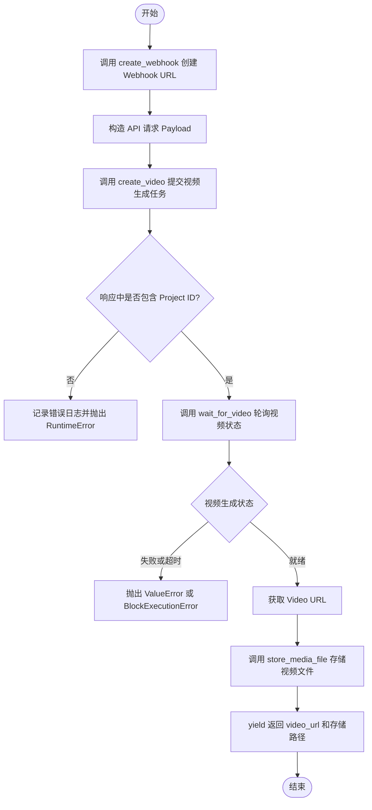

#### 带注释源码

```python
async def run(
    self,
    input_data: Input,
    *,
    credentials: APIKeyCredentials,
    execution_context: ExecutionContext,
    **kwargs,
) -> BlockOutput:
    # 1. 创建一个新的 Webhook URL (注意: 在此 payload 中实际并未使用该 URL，被设为了 None)
    webhook_token, webhook_url = await self.create_webhook()
    logger.debug(f"Webhook URL: {webhook_url}")

    # 2. 构造发送给 Revid API 的 Payload 数据
    payload = {
        "frameRate": input_data.frame_rate,
        "resolution": input_data.resolution,
        "frameDurationMultiplier": 18,
        "webhook": None,  # 显式设置为 None
        "creationParams": {
            "mediaType": input_data.video_style,
            "captionPresetName": "Wrap 1",
            "selectedVoice": input_data.voice.voice_id,
            "hasEnhancedGeneration": True,
            "generationPreset": input_data.generation_preset.name,
            "selectedAudio": input_data.background_music.value,
            "origin": "/create",
            "inputText": input_data.script,
            "flowType": "text-to-video",
            "slug": "create-tiktok-video",
            "hasToGenerateVoice": True,
            "hasToTranscript": False,
            "hasToSearchMedia": True,
            "hasAvatar": False,
            "hasWebsiteRecorder": False,
            "hasTextSmallAtBottom": False,
            "ratio": input_data.ratio,
            "sourceType": "contentScraping",
            "selectedStoryStyle": {"value": "custom", "label": "Custom"},
            # 如果不是使用 STOCK_VIDEOS，则需要生成视频
            "hasToGenerateVideos": input_data.video_style
            != VisualMediaType.STOCK_VIDEOS,
            "audioUrl": input_data.background_music.audio_url,
        },
    }

    logger.debug("Creating video...")
    
    # 3. 调用 API 创建视频任务
    response = await self.create_video(credentials.api_key, payload)
    pid = response.get("pid")

    # 4. 检查是否返回了有效的项目 ID
    if not pid:
        logger.error(
            f"Failed to create video: No project ID returned. API Response: {response}"
        )
        raise RuntimeError("Failed to create video: No project ID returned")
    else:
        logger.debug(
            f"Video created with project ID: {pid}. Waiting for completion..."
        )
        
        # 5. 轮询等待视频处理完成并获取 URL
        video_url = await self.wait_for_video(credentials.api_key, pid)
        logger.debug(f"Video ready: {video_url}")
        
        # 6. 将生成的视频文件存储到用户工作空间以保证持久化
        stored_url = await store_media_file(
            file=MediaFileType(video_url),
            execution_context=execution_context,
            return_format="for_block_output",
        )
        
        # 7. 返回结果
        yield "video_url", stored_url
```


### `AIAdMakerVideoCreatorBlock.create_webhook`

通过调用外部 Webhook 服务创建一个新的 Webhook URL，用于接收视频生成过程中的异步通知。

参数：

- `self`：`AIAdMakerVideoCreatorBlock`，类的实例引用。

返回值：`tuple[str, str]`，返回包含 Webhook 标识符 (UUID) 和完整 Webhook URL 的元组。

#### 流程图

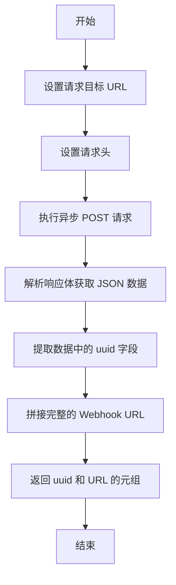

#### 带注释源码

```python
async def create_webhook(self) -> tuple[str, str]:
    """Create a new webhook URL for receiving notifications."""
    # 定义创建 Webhook token 的 API 端点
    url = "https://webhook.site/token"
    # 设置请求头，指定接受和发送 JSON 格式数据
    headers = {"Accept": "application/json", "Content-Type": "application/json"}
    # 发送异步 POST 请求以创建新的 Webhook
    response = await Requests().post(url, headers=headers)
    # 将响应内容解析为 JSON 格式
    webhook_data = response.json()
    # 返回 UUID 和构造好的完整 Webhook URL
    return webhook_data["uuid"], f"https://webhook.site/{webhook_data['uuid']}"
```


### `AIAdMakerVideoCreatorBlock.create_video`

该方法是 `AIAdMakerVideoCreatorBlock` 类的核心异步函数，负责通过向 Revid API 的渲染端点发送 HTTP POST 请求，提交视频生成任务。

参数：

-  `api_key`：`SecretStr`，用于验证 Revid API 请求权限的安全密钥。
-  `payload`：`dict`，包含视频生成所需的详细参数（如脚本、音频、媒体设置等）的字典对象。

返回值：`dict`，Revid API 返回的 JSON 格式响应数据，通常包含任务 ID 或状态信息。

#### 流程图

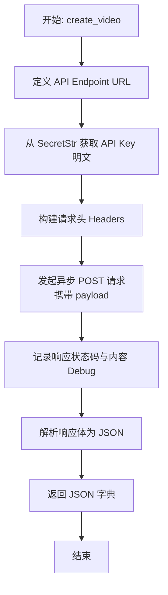

#### 带注释源码

```python
async def create_video(self, api_key: SecretStr, payload: dict) -> dict:
    """Create a video using the Revid API."""
    # 设定视频渲染的 API 地址
    url = "https://www.revid.ai/api/public/v2/render"
    
    # 构造请求头，从 SecretStr 对象中提取实际的 API Key 字符串
    headers = {"key": api_key.get_secret_value()}
    
    # 使用封装的 Requests 工具发起异步 POST 请求
    # json=payload 会自动将字典序列化为 JSON 并设置 Content-Type
    response = await Requests().post(url, json=payload, headers=headers)
    
    # 记录调试日志，包含 HTTP 状态码和响应文本内容，便于追踪问题
    logger.debug(
        f"API Response Status Code: {response.status}, Content: {response.text}"
    )
    
    # 将 API 响应解析为 JSON 字典并返回
    return response.json()
```


### `AIAdMakerVideoCreatorBlock.check_video_status`

通过向 Revid API 发起 HTTP GET 请求，检查指定视频渲染任务（Project ID）的当前状态。

参数：

-  `api_key`：`SecretStr`，用于身份验证的 Revid API 密钥
-  `pid`：`str`，视频渲染任务的唯一项目 ID (Project ID)

返回值：`dict`，包含任务状态信息的 JSON 响应对象（通常包含 status 字段，可能包含 videoUrl 或 error 信息）

#### 流程图

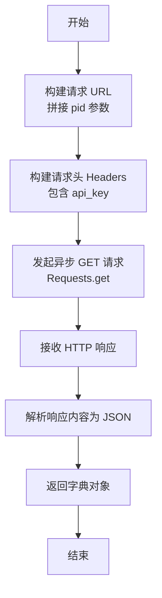

#### 带注释源码

```python
    async def check_video_status(self, api_key: SecretStr, pid: str) -> dict:
        """Check the status of a video creation job."""
        # 构造查询视频状态的 API URL，将 pid 作为查询参数
        url = f"https://www.revid.ai/api/public/v2/status?pid={pid}"
        
        # 设置请求头，使用 API Key 进行鉴权
        headers = {"key": api_key.get_secret_value()}
        
        # 发起异步 GET 请求
        response = await Requests().get(url, headers=headers)
        
        # 返回解析后的 JSON 数据（字典格式）
        return response.json()
```


### `AIAdMakerVideoCreatorBlock.wait_for_video`

Wait for video creation to complete and return the video URL.

参数：

-  `api_key`：`SecretStr`，用于身份验证的 Revid.ai API 密钥
-  `pid`：`str`，视频渲染任务的项目 ID (Project ID)
-  `max_wait_time`：`int`，等待视频生成的最大时长（秒），默认为 1000

返回值：`str`，创建完成的视频 URL

#### 流程图

```mermaid
flowchart TD
    Start([开始]) --> InitTime[记录开始时间 start_time]
    InitTime --> LoopCondition{当前时间 - start_time < max_wait_time?}
    
    LoopCondition -- 否 --> LogTimeout[记录日志: Video creation timed out]
    LogTimeout --> RaiseTimeoutError[抛出 BlockExecutionError]
    RaiseTimeoutError --> End([结束])
    
    LoopCondition -- 是 --> CheckStatus[调用 check_video_status 获取状态]
    CheckStatus --> LogStatus[记录日志: Video status]
    
    LogStatus --> IsReady{status == 'ready' \n 且存在 videoUrl?}
    IsReady -- 是 --> ReturnUrl[返回 status['videoUrl']]
    ReturnUrl --> End
    
    IsReady -- 否 --> IsError{status == 'error'?}
    IsError -- 是 --> LogGenericError[记录错误日志]
    LogGenericError --> RaiseValueError1[抛出 ValueError]
    RaiseValueError1 --> End
    
    IsError -- 否 --> IsFailed{status in ['FAILED', 'CANCELED']?}
    IsFailed -- 是 --> LogFailedError[记录错误日志]
    LogFailedError --> RaiseValueError2[抛出 ValueError]
    RaiseValueError2 --> End
    
    IsFailed -- 否 --> Sleep[等待 10 秒]
    Sleep --> LoopCondition
```

#### 带注释源码

```python
    async def wait_for_video(
        self,
        api_key: SecretStr,
        pid: str,
        max_wait_time: int = 1000,
    ) -> str:
        """Wait for video creation to complete and return the video URL."""
        # 记录任务开始的时间戳
        start_time = time.time()
        
        # 循环检查任务状态，直到超时
        while time.time() - start_time < max_wait_time:
            # 调用 API 检查视频生成状态
            status = await self.check_video_status(api_key, pid)
            logger.debug(f"Video status: {status}")

            # 检查状态是否为 "ready" 且返回结果中包含视频 URL
            if status.get("status") == "ready" and "videoUrl" in status:
                return status["videoUrl"]
            # 检查状态是否为 "error"
            elif status.get("status") == "error":
                error_message = status.get("error", "Unknown error occurred")
                logger.error(f"Video creation failed: {error_message}")
                raise ValueError(f"Video creation failed: {error_message}")
            # 检查状态是否为 "FAILED" 或 "CANCELED"
            elif status.get("status") in ["FAILED", "CANCELED"]:
                logger.error(f"Video creation failed: {status.get('message')}")
                raise ValueError(f"Video creation failed: {status.get('message')}")

            # 如果任务仍在进行中，等待 10 秒后再次检查
            await asyncio.sleep(10)

        # 如果循环结束仍未返回结果，则视为超时
        logger.error("Video creation timed out")
        raise BlockExecutionError(
            message="Video creation timed out",
            block_name=self.name,
            block_id=self.id,
        )
```


### `AIAdMakerVideoCreatorBlock.__init__`

该方法是 `AIAdMakerVideoCreatorBlock` 类的构造函数，负责初始化块的元数据、输入输出 Schema 定义以及用于自动化测试的模拟配置。它通过调用父类 `Block` 的构造函数并传入特定参数来完成设置。

参数：

*   无显式参数

返回值：`None`，构造函数不返回任何值。

#### 流程图

```mermaid
graph TD
    A[Start __init__] --> B[Call super().__init__]
    B --> C[Set id: 58bd2a19-115d-4fd1-8ca4-13b9e37fa6a0]
    B --> D[Set description: Creates an AI‑generated 30‑second advert]
    B --> E[Set categories: MARKETING, AI]
    B --> F[Set input_schema: AIAdMakerVideoCreatorBlock.Input]
    B --> G[Set output_schema: AIAdMakerVideoCreatorBlock.Output]
    B --> H[Set test_input configuration]
    B --> I[Set test_output validation]
    B --> J[Set test_mock functions]
    B --> K[Set test_credentials]
    K --> L[End]
```

#### 带注释源码

```python
def __init__(self):
    # 调用父类 Block 的初始化方法，配置块的基本属性和测试环境
    super().__init__(
        # 定义该块的唯一标识符
        id="58bd2a19-115d-4fd1-8ca4-13b9e37fa6a0",
        # 定义该块的描述，说明其功能为生成30秒的AI广告
        description="Creates an AI‑generated 30‑second advert (text + images)",
        # 定义该块的所属分类，这里归类为市场营销和AI
        categories={BlockCategory.MARKETING, BlockCategory.AI},
        # 定义输入数据的 Schema，关联到内部类 Input
        input_schema=AIAdMakerVideoCreatorBlock.Input,
        # 定义输出数据的 Schema，关联到内部类 Output
        output_schema=AIAdMakerVideoCreatorBlock.Output,
        # 配置测试输入数据，包含模拟的凭据、脚本和媒体URL
        test_input={
            "credentials": TEST_CREDENTIALS_INPUT,
            "script": "Test product launch!",
            "input_media_urls": [
                "https://cdn.revid.ai/uploads/1747076315114-image.png",
            ],
        },
        # 配置测试输出的验证逻辑，检查 video_url 是否以指定前缀开头
        test_output=(
            "video_url",
            lambda x: x.startswith(("workspace://", "data:")),
        ),
        # 配置测试模拟函数，用于在测试环境中替换真实的网络请求和长时间等待
        test_mock={
            "create_webhook": lambda *args, **kwargs: (
                "test_uuid",
                "https://webhook.site/test_uuid",
            ),
            "create_video": lambda *args, **kwargs: {"pid": "test_pid"},
            "check_video_status": lambda *args, **kwargs: {
                "status": "ready",
                "videoUrl": "data:video/mp4;base64,AAAA",
            },
            # 使用 data URI 模拟视频URL，避免测试期间进行实际的HTTP请求
            "wait_for_video": lambda *args, **kwargs: "data:video/mp4;base64,AAAA",
        },
        # 注入测试用的凭据对象
        test_credentials=TEST_CREDENTIALS,
    )
```


### `AIAdMakerVideoCreatorBlock.run`

该方法负责协调整个AI广告视频生成的全流程。它通过接收用户输入的脚本、图片素材及配置参数，构建API请求负载，调用Revid接口启动视频渲染任务，随后轮询任务状态直到生成完成，最终将生成的视频文件持久化存储并返回访问地址。

参数：

-   `input_data`：`AIAdMakerVideoCreatorBlock.Input`，包含广告脚本、目标时长、宽高比、配音、背景音乐、输入媒体URL列表以及是否仅使用提供媒体等配置信息。
-   `credentials`：`APIKeyCredentials`，用于访问Revid.ai API的身份验证凭据。
-   `execution_context`：`ExecutionContext`，执行上下文对象，用于在运行时存储和管理生成的媒体文件。
-   `**kwargs`：`typing.Any`，其他可选的关键字参数。

返回值：`BlockOutput`（异步生成器），生成包含键 `video_url` 的字典，值为已存储的视频文件访问路径（URL或内部URI）。

#### 流程图

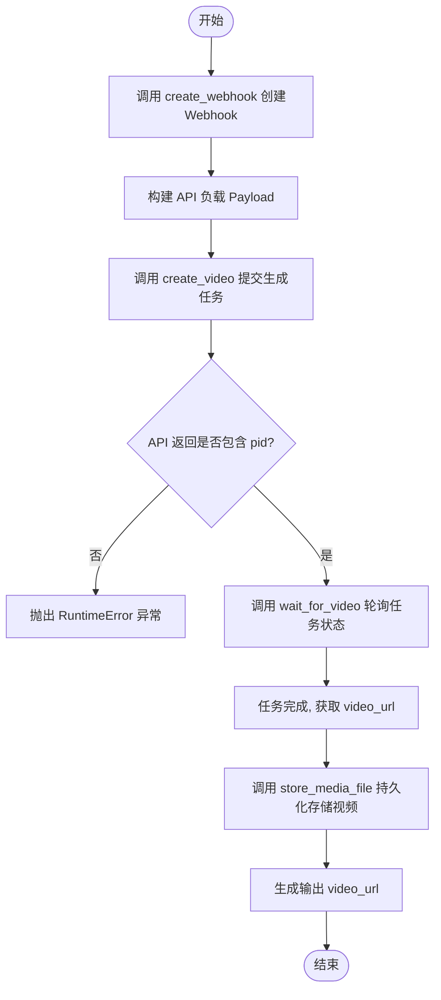

#### 带注释源码

```python
    async def run(
        self,
        input_data: Input,
        *,
        credentials: APIKeyCredentials,
        execution_context: ExecutionContext,
        **kwargs,
    ):
        # 步骤 1: 创建一个临时的 Webhook URL 用于接收任务完成通知（尽管在后续轮询中并未强制依赖webhook回调，但作为参数传入）
        webhook_token, webhook_url = await self.create_webhook()

        # 步骤 2: 构建发送给 Revid API 的请求负载
        # 包含视频参数（时长、比例）、媒体类型、脚本文本、配音、背景音乐以及用户提供的图片列表等
        payload = {
            "webhook": webhook_url,
            "creationParams": {
                "targetDuration": input_data.target_duration,
                "ratio": input_data.ratio,
                "mediaType": "aiVideo",
                "inputText": input_data.script,
                "flowType": "text-to-video",
                "slug": "ai-ad-generator",
                "slugNew": "",
                "isCopiedFrom": False,
                "hasToGenerateVoice": True,
                "hasToTranscript": False,
                "hasToSearchMedia": True,
                "hasAvatar": False,
                "hasWebsiteRecorder": False,
                "hasTextSmallAtBottom": False,
                "selectedAudio": input_data.background_music.value,
                "selectedVoice": input_data.voice.voice_id,
                "selectedAvatar": "https://cdn.revid.ai/avatars/young-woman.mp4",
                "selectedAvatarType": "video/mp4",
                "websiteToRecord": "",
                "hasToGenerateCover": True,
                "nbGenerations": 1,
                "disableCaptions": False,
                "mediaMultiplier": "medium",
                "characters": [],
                "captionPresetName": "Revid",
                "sourceType": "contentScraping",
                "selectedStoryStyle": {"value": "custom", "label": "General"},
                "generationPreset": "DEFAULT",
                "hasToGenerateMusic": False,
                "isOptimizedForChinese": False,
                "generationUserPrompt": "",
                "enableNsfwFilter": False,
                "addStickers": False,
                "typeMovingImageAnim": "dynamic",
                "hasToGenerateSoundEffects": False,
                "forceModelType": "gpt-image-1",
                "selectedCharacters": [],
                "lang": "",
                "voiceSpeed": 1,
                "disableAudio": False,
                "disableVoice": False,
                # 标记是否仅使用用户提供的媒体素材
                "useOnlyProvidedMedia": input_data.use_only_provided_media,
                "imageGenerationModel": "ultra",
                "videoGenerationModel": "pro",
                "hasEnhancedGeneration": True,
                "hasEnhancedGenerationPro": True,
                # 将用户提供的图片 URL 列表转换为 API 需要的格式
                "inputMedias": [
                    {"url": url, "title": "", "type": "image"}
                    for url in input_data.input_media_urls
                ],
                "hasToGenerateVideos": True,
                "audioUrl": input_data.background_music.audio_url,
                "watermark": None,
            },
        }

        # 步骤 3: 调用 create_video 接口创建视频任务
        response = await self.create_video(credentials.api_key, payload)
        
        # 步骤 4: 获取任务 ID (pid)
        pid = response.get("pid")
        
        # 如果未返回 pid，说明任务创建失败，抛出异常
        if not pid:
            raise RuntimeError("Failed to create video: No project ID returned")

        # 步骤 5: 轮询等待视频生成完成
        video_url = await self.wait_for_video(credentials.api_key, pid)
        
        # 步骤 6: 将生成的视频文件保存到工作空间，以便持久化访问
        stored_url = await store_media_file(
            file=MediaFileType(video_url),
            execution_context=execution_context,
            return_format="for_block_output",
        )
        
        # 步骤 7: 输出最终的视频地址
        yield "video_url", stored_url
```


### `AIScreenshotToVideoAdBlock.create_webhook`

创建一个新的 webhook URL，用于接收视频生成完成后的异步通知。

参数：

-  `self`：`AIScreenshotToVideoAdBlock`，类的实例本身。

返回值：`tuple[str, str]`，返回一个元组，第一个元素是 webhook 的 UUID，第二个元素是完整的 webhook URL。

#### 流程图

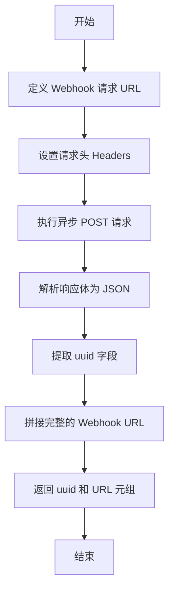

#### 带注释源码

```python
    async def create_webhook(self) -> tuple[str, str]:
        """Create a new webhook URL for receiving notifications."""
        # 定义创建 Webhook 的 API 端点
        url = "https://webhook.site/token"
        # 设置请求头，指定接受和发送的内容类型为 JSON
        headers = {"Accept": "application/json", "Content-Type": "application/json"}
        # 发送异步 POST 请求以获取新的 Webhook Token
        response = await Requests().post(url, headers=headers)
        # 将响应内容解析为 JSON 字典格式
        webhook_data = response.json()
        # 返回 UUID 和构造好的完整 Webhook URL
        return webhook_data["uuid"], f"https://webhook.site/{webhook_data['uuid']}"
```


### `AIScreenshotToVideoAdBlock.create_video`

通过向 Revid API 发送渲染请求来创建视频任务。

参数：

-   `api_key`：`SecretStr`，用于 Revid API 身份验证的密钥。
-   `payload`：`dict`，包含视频生成参数（如脚本、媒体URL、设置等）的请求体。

返回值：`dict`，API 返回的 JSON 响应数据，通常包含项目 ID (pid) 或错误信息。

#### 流程图

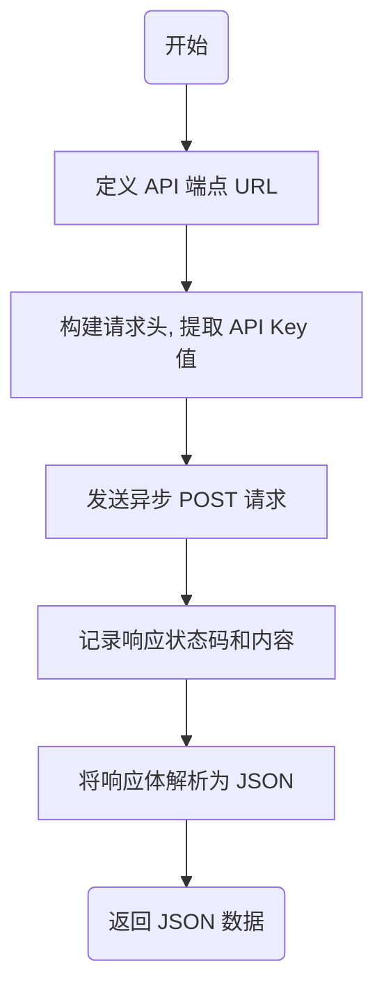

#### 带注释源码

```python
    async def create_video(self, api_key: SecretStr, payload: dict) -> dict:
        """Create a video using the Revid API."""
        # 定义 Revid API 的渲染端点地址
        url = "https://www.revid.ai/api/public/v2/render"
        # 构建请求头，使用 get_secret_value() 获取密钥字符串
        headers = {"key": api_key.get_secret_value()}
        # 使用封装的 Requests 库发送异步 POST 请求，携带 JSON 负载和请求头
        response = await Requests().post(url, json=payload, headers=headers)
        # 记录调试日志，输出响应状态码和原始文本内容
        logger.debug(
            f"API Response Status Code: {response.status}, Content: {response.text}"
        )
        # 返回解析后的 JSON 数据
        return response.json()
```


### `AIScreenshotToVideoAdBlock.check_video_status`

该方法用于查询 revid.ai API，以检查指定视频生成任务（Project ID）的当前状态和详细信息。

参数：

- `api_key`: `SecretStr`, 用于认证 Revid 服务的 API 密钥。
- `pid`: `str`, 视频创建任务的唯一进程 ID 或项目 ID。

返回值：`dict`, 包含视频任务状态、进度及结果 URL（如果完成）的 JSON 响应数据。

#### 流程图

```mermaid
flowchart TD
    A[开始] --> B[构建请求 URL<br/>https://www.revid.ai/api/public/v2/status?pid={pid}]
    B --> C[设置请求头<br/>key: api_key]
    C --> D[执行异步 GET 请求<br/>Requests.get]
    D --> E[解析响应内容为 JSON]
    E --> F[返回状态字典]
    F --> G[结束]
```

#### 带注释源码

```python
    async def check_video_status(self, api_key: SecretStr, pid: str) -> dict:
        """Check the status of a video creation job."""
        # 构建状态查询的 API 端点，将项目 ID 作为查询参数
        url = f"https://www.revid.ai/api/public/v2/status?pid={pid}"
        
        # 准备请求头，包含用于身份验证的 API Key
        headers = {"key": api_key.get_secret_value()}
        
        # 发起异步 GET 请求获取状态
        response = await Requests().get(url, headers=headers)
        
        # 返回解析后的 JSON 数据
        return response.json()
```


### `AIScreenshotToVideoAdBlock.wait_for_video`

等待视频创建任务完成，并通过轮询 API 状态返回生成的视频 URL。如果在指定时间内任务未完成或发生错误，则抛出相应的异常。

参数：

-  `self`：`AIScreenshotToVideoAdBlock`，类实例本身
-  `api_key`：`SecretStr`，用于身份验证的 Revid API 密钥
-  `pid`：`str`，视频创建任务的项目 ID
-  `max_wait_time`：`int`，等待视频生成的最大时长（秒），默认为 1000

返回值：`str`，成功生成的视频 URL

#### 流程图

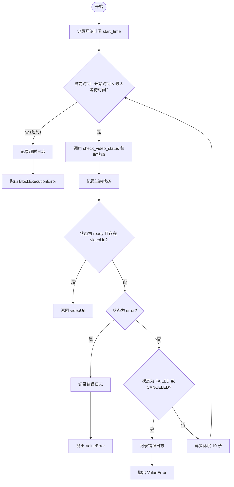

#### 带注释源码

```python
    async def wait_for_video(
        self,
        api_key: SecretStr,
        pid: str,
        max_wait_time: int = 1000,
    ) -> str:
        """Wait for video creation to complete and return the video URL."""
        # 记录任务开始的当前时间戳
        start_time = time.time()
        
        # 循环检查状态，直到超时或任务完成
        while time.time() - start_time < max_wait_time:
            # 调用 API 获取当前视频生成状态
            status = await self.check_video_status(api_key, pid)
            logger.debug(f"Video status: {status}")

            # 检查状态是否为 'ready' 且包含 'videoUrl'
            if status.get("status") == "ready" and "videoUrl" in status:
                # 任务成功，返回视频 URL
                return status["videoUrl"]
            # 检查状态是否为一般性错误 'error'
            elif status.get("status") == "error":
                error_message = status.get("error", "Unknown error occurred")
                logger.error(f"Video creation failed: {error_message}")
                # 抛出 ValueError 终止等待并通知调用者失败
                raise ValueError(f"Video creation failed: {error_message}")
            # 检查状态是否为明确失败 'FAILED' 或取消 'CANCELED'
            elif status.get("status") in ["FAILED", "CANCELED"]:
                logger.error(f"Video creation failed: {status.get('message')}")
                # 抛出 ValueError 终止等待并通知调用者失败
                raise ValueError(f"Video creation failed: {status.get('message')}")

            # 如果任务仍在进行中，休眠 10 秒后再次轮询
            await asyncio.sleep(10)

        # 循环结束仍未收到成功状态，视为超时
        logger.error("Video creation timed out")
        # 抛出 BlockExecutionError 特定异常，包含块上下文信息
        raise BlockExecutionError(
            message="Video creation timed out",
            block_name=self.name,
            block_id=self.id,
        )
```


### `AIScreenshotToVideoAdBlock.__init__`

该方法用于初始化 `AIScreenshotToVideoAdBlock` 类实例。它通过调用父类 `Block` 的初始化方法，配置了该模块的唯一标识、描述、分类、输入输出数据模型以及用于测试的各种模拟数据和凭证。

参数：

- `self`：`AIScreenshotToVideoAdBlock`，表示类实例自身。

返回值：`None`，该方法没有返回值，主要用于初始化对象状态。

#### 流程图

```mermaid
graph TD
    A[开始初始化] --> B[调用父类 Block.__init__]
    B --> C[传入基础元数据]
    C --> D[传入输入输出 Schema]
    D --> E[传入测试配置]
    E --> F[传入测试模拟 Mocks]
    F --> G[传入测试凭证]
    G --> H[初始化完成]
```

#### 带注释源码

```python
    def __init__(self):
        # 调用父类 Block 的初始化方法，配置块的基本属性和行为
        super().__init__(
            # 块的唯一标识符
            id="0f3e4635-e810-43d9-9e81-49e6f4e83b7c",
            # 块的功能描述
            description="Turns a screenshot into an engaging, avatar‑narrated video advert.",
            # 块所属的分类：AI 和 营销
            categories={BlockCategory.AI, BlockCategory.MARKETING},
            # 定义输入数据的 Schema，引用内部类 Input
            input_schema=AIScreenshotToVideoAdBlock.Input,
            # 定义输出数据的 Schema，引用内部类 Output
            output_schema=AIScreenshotToVideoAdBlock.Output,
            # 定义用于测试的输入数据，包含模拟凭证、脚本和截图 URL
            test_input={
                "credentials": TEST_CREDENTIALS_INPUT,
                "script": "Amazing numbers!",
                "screenshot_url": "https://cdn.revid.ai/uploads/1747080376028-image.png",
            },
            # 定义测试输出的验证规则，检查 video_url 是否以特定前缀开头
            test_output=(
                "video_url",
                lambda x: x.startswith(("workspace://", "data:")),
            ),
            # 定义测试时异步方法的 Mock 行为，避免实际调用 API
            test_mock={
                "create_webhook": lambda *args, **kwargs: (
                    "test_uuid",
                    "https://webhook.site/test_uuid",
                ),
                "create_video": lambda *args, **kwargs: {"pid": "test_pid"},
                "check_video_status": lambda *args, **kwargs: {
                    "status": "ready",
                    "videoUrl": "data:video/mp4;base64,AAAA",
                },
                "wait_for_video": lambda *args, **kwargs: "data:video/mp4;base64,AAAA",
            },
            # 传入测试用的 API 凭证对象
            test_credentials=TEST_CREDENTIALS,
        )
```


### `AIScreenshotToVideoAdBlock.run`

执行主逻辑以根据提供的截图、脚本和配置参数，通过 Revid.ai API 生成由 AI 头像讲解的视频广告，并存储视频文件。

参数：

-  `input_data`：`AIScreenshotToVideoAdBlock.Input`，包含脚本、截图 URL、视频比例、目标时长、配音和背景音乐等配置信息的输入数据对象。
-  `credentials`：`APIKeyCredentials`，用于访问 Revid.ai 服务的 API 凭证。
-  `execution_context`：`ExecutionContext`，执行上下文对象，用于持久化存储生成的媒体文件。
-  `**kwargs`：`dict`，额外的关键字参数。

返回值：`BlockOutput`，一个异步生成器，产生包含结果键值对（例如 `("video_url", "...")`）的元组，表示生成的视频地址。

#### 流程图

```mermaid
flowchart TD
    A[开始执行 run 方法] --> B[调用 create_webhook 创建通知地址]
    B --> C[构建 API 请求 Payload 包含脚本、截图等参数]
    C --> D[调用 create_video 发起视频创建任务]
    D --> E{检查响应是否包含 PID}
    E -- 否 --> F[抛出 RuntimeError 异常]
    E -- 是 --> G[调用 wait_for_video 轮询等待视频渲染完成]
    G --> H[调用 store_media_file 持久化存储视频文件]
    H --> I[Yield 输出 video_url]
    I --> J[结束]
```

#### 带注释源码

```python
    async def run(
        self,
        input_data: Input,
        *,
        credentials: APIKeyCredentials,
        execution_context: ExecutionContext,
        **kwargs,
    ):
        # 1. 创建一个新的 Webhook URL 用于接收任务完成通知
        webhook_token, webhook_url = await self.create_webhook()

        # 2. 构建发送给 Revid API 的 Payload 参数
        payload = {
            "webhook": webhook_url,
            "creationParams": {
                "targetDuration": input_data.target_duration,
                "ratio": input_data.ratio,
                "mediaType": "aiVideo",
                "hasAvatar": True,  # 启用 AI 头像
                "removeAvatarBackground": True,
                "inputText": input_data.script,  # 配音脚本
                "flowType": "text-to-video",
                "slug": "ai-ad-generator",
                "slugNew": "screenshot-to-video-ad",
                "isCopiedFrom": "ai-ad-generator",
                "hasToGenerateVoice": True,
                "hasToTranscript": False,
                "hasToSearchMedia": True,
                "hasWebsiteRecorder": False,
                "hasTextSmallAtBottom": False,
                "selectedAudio": input_data.background_music.value,
                "selectedVoice": input_data.voice.voice_id,
                "selectedAvatar": "https://cdn.revid.ai/avatars/young-woman.mp4",
                "selectedAvatarType": "video/mp4",
                "websiteToRecord": "",
                "hasToGenerateCover": True,
                "nbGenerations": 1,
                "disableCaptions": False,
                "mediaMultiplier": "medium",
                "characters": [],
                "captionPresetName": "Revid",
                "sourceType": "contentScraping",
                "selectedStoryStyle": {"value": "custom", "label": "General"},
                "generationPreset": "DEFAULT",
                "hasToGenerateMusic": False,
                "isOptimizedForChinese": False,
                "generationUserPrompt": "",
                "enableNsfwFilter": False,
                "addStickers": False,
                "typeMovingImageAnim": "dynamic",
                "hasToGenerateSoundEffects": False,
                "forceModelType": "gpt-image-1",
                "selectedCharacters": [],
                "lang": "",
                "voiceSpeed": 1,
                "disableAudio": False,
                "disableVoice": False,
                "useOnlyProvidedMedia": True,  # 限制只使用提供的媒体（截图）
                "imageGenerationModel": "ultra",
                "videoGenerationModel": "ultra",
                "hasEnhancedGeneration": True,
                "hasEnhancedGenerationPro": True,
                # 输入媒体列表，包含用户提供的截图 URL
                "inputMedias": [
                    {"url": input_data.screenshot_url, "title": "", "type": "image"}
                ],
                "hasToGenerateVideos": True,
                "audioUrl": input_data.background_music.audio_url,
                "watermark": None,
            },
        }

        # 3. 调用 create_video 方法向 Revid API 发起请求
        response = await self.create_video(credentials.api_key, payload)
        pid = response.get("pid")

        # 4. 检查是否成功获取项目 ID (PID)
        if not pid:
            raise RuntimeError("Failed to create video: No project ID returned")

        # 5. 调用 wait_for_video 方法轮询状态，直到视频生成完成
        video_url = await self.wait_for_video(credentials.api_key, pid)
        
        # 6. 将生成的视频文件存储到工作区并获取持久化 URL
        stored_url = await store_media_file(
            file=MediaFileType(video_url),
            execution_context=execution_context,
            return_format="for_block_output",
        )
        
        # 7. 输出最终的 video_url
        yield "video_url", stored_url
```


## 关键组件


### AIShortformVideoCreatorBlock
Creates a short‑form text‑to‑video clip using stock or AI imagery by processing scripts and style configurations.

### AIAdMakerVideoCreatorBlock
Generates a 30‑second vertical AI advert using optional user‑supplied imagery and specific advertisement parameters.

### AIScreenshotToVideoAdBlock
Creates an advert where the supplied screenshot is narrated by an AI avatar with specified background settings.

### AudioTrack
Enumerates the available background music tracks and maps them to their corresponding audio URLs.

### GenerationPreset
Defines the visual style presets (e.g., Anime, Realism, 3D Render) for AI-generated visual content.

### Voice
Lists the available AI voice options for narration, mapping each voice name to its unique voice ID.

### VisualMediaType
Specifies the type of visual media to be used in video generation, such as stock videos or AI-generated content.


## 问题及建议


### 已知问题

-   代码高度重复：`AIShortformVideoCreatorBlock`、`AIAdMakerVideoCreatorBlock` 和 `AIScreenshotToVideoAdBlock` 三个类中包含完全一致的 `create_webhook`、`create_video`、`check_video_status` 和 `wait_for_video` 方法。这违反了 DRY 原则，增加了维护成本。
-   Webhook 逻辑冗余或失效：在 `AIShortformVideoCreatorBlock` 中，代码调用了 `create_webhook` 生成 URL，但在 payload 中将 `webhook` 字段设为 `None`，导致该网络请求完全无效。在另外两个 Block 中，虽然传入了 webhook URL，但代码仍然使用 `wait_for_video` 进行同步轮询，造成了双重处理机制和资源浪费。
-   硬编码的配置：API 端点（如 `revid.ai` 和 `webhook.site`）、轮询间隔（10秒）和最大超时时间（1000秒）均硬编码在方法内部，缺乏灵活性，难以适应环境变更或性能调优。
-   缺乏显式的 HTTP 状态检查：`create_video` 和 `check_video_status` 方法中，直接调用 `response.json()` 而未先检查 HTTP 状态码（如 `response.status_code == 200`），可能导致对错误响应（如 401, 500）的误解析，进而抛出非预期的 JSON 解析错误。
-   异常处理粒度粗糙：在 `wait_for_video` 中，捕获到状态失败时仅抛出通用的 `ValueError` 或 `BlockExecutionError`，未保留原始 API 返回的详细错误堆栈或上下文，不利于问题排查。

### 优化建议

-   抽象公共 API 客户端：创建一个独立的 `RevidAPIClient` 类或使用 Mixin，将通用的 API 调用逻辑（创建视频、检查状态、等待视频、Webhook 管理）从各个 Block 中剥离出来，以消除重复代码并统一管理认证和请求逻辑。
-   优化 Webhook 与轮询策略：评估 Revid API 的要求。如果 API 必须要 Webhook，应配置后端接收回调端点而非使用 `webhook.site`；如果支持轮询，应移除 `create_webhook` 调用（特别是第一个 Block 中已设为 None 的情况），以减少网络延迟和外部依赖。
-   引入配置管理：将 API 地址、超时设置、轮询间隔等参数提取为类常量或通过配置文件注入，提高代码的可测试性和环境适应性。
-   使用 Pydantic 模型解析响应：定义针对 Revid API 返回结构的 Pydantic 模型，替换直接字典操作（`status.get(...)`），利用类型检查确保数据完整性，避免因字段缺失导致的运行时错误。
-   增强错误处理和重试机制：在 API 请求层添加对 5xx 或 429 状态码的自动重试逻辑，并在 `wait_for_video` 中引入指数退避算法调整轮询间隔，以减轻服务器压力并提高鲁棒性。


## 其它


### 设计目标与约束

该模块旨在将 Revid.ai 的视频生成能力封装为可复用的异步 Blocks，支持短视頻制作、广告生成和截图转视频等多种场景。
1.  **异步非阻塞**：所有网络请求（API 调用、状态轮询）必须使用异步 I/O，以避免阻塞主事件循环。
2.  **长时间运行任务支持**：考虑到视频生成属于计算密集型任务，设计需支持长时间等待（默认最大等待时间 1000 秒）。
3.  **资源持久化**：生成的视频 URL（通常是临时的或外部链接）必须通过 `store_media_file` 存储到本地工作空间，以确保数据的持久化和可访问性。
4.  **配置灵活性**：支持多种视觉风格、音轨、配音和媒体类型的动态配置，通过枚举类型限制输入范围以保证参数有效性。

### 外部依赖与接口契约

该代码严重依赖外部服务和内部基础设施，具体的接口契约如下：

1.  **Revid.ai API**
    *   **创建任务 (`POST /api/public/v2/render`)**
        *   **Headers**: `key` (API Key)。
        *   **Body**: 包含 `creationParams` 的复杂 JSON 对象，涵盖脚本 (`inputText`)、媒体类型 (`mediaType`)、配音 (`selectedVoice`)、背景音乐 (`selectedAudio`) 等详细参数。
        *   **Response**: JSON 对象，必须包含 `pid` (Project ID) 用于后续查询。
    *   **查询状态 (`GET /api/public/v2/status`)**
        *   **Query Params**: `pid`。
        *   **Headers**: `key` (API Key)。
        *   **Response**: JSON 对象，包含 `status` (字符串状态), `videoUrl` (生成成功时的视频链接), 或 `error`/`message` (失败信息)。

2.  **Webhook.site API**
    *   **创建 Webhook (`POST /token`)**
        *   **功能**: 生成一个临时的 Webhook URL。
        *   **Response**: JSON 对象，包含 `uuid`。
        *   **用途**: 将生成的 URL 传递给 Revid API 以接收回调（尽管当前实现主要依赖轮询）。

3.  **内部基础设施 (`backend.util.file`)**
    *   **函数**: `store_media_file`
    *   **参数**:
        *   `file`: `MediaFileType` (通常是视频 URL)。
        *   `execution_context`: `ExecutionContext` (用于获取用户上下文和存储路径)。
        *   `return_format`: 字符串，指定返回格式。
    *   **契约**: 接收外部 URL，下载/处理文件，并将其存储在内部对象存储中，返回持久化的访问路径。

### 错误处理与异常设计

代码通过检查 API 返回状态和异常捕获来处理错误，设计如下：

1.  **任务初始化失败**：
    *   **检测**：调用 `create_video` 后，响应中不包含 `pid`。
    *   **处理**：抛出 `RuntimeError("Failed to create video: No project ID returned")`。

2.  **视频生成逻辑错误**：
    *   **检测**：`check_video_status` 返回的状态为 `"error"`、`"FAILED"` 或 `"CANCELED"`。
    *   **处理**：记录错误日志，并抛出 `ValueError`，携带 API 返回的具体错误信息。

3.  **任务超时**：
    *   **检测**：在 `wait_for_video` 中，循环时间超过 `max_wait_time` (默认 1000s) 仍未收到 `"ready"` 状态。
    *   **处理**：记录超时日志，抛出特定领域异常 `BlockExecutionError`，包含 block_name 和 block_id，以便上层系统识别是哪个组件执行超时。

4.  **网络与未知错误**：
    *   **处理**：依赖底层的 `Requests` 库抛出的异常，或通过 `logger.debug` 记录响应内容以便排查。

### 数据流与状态机

**数据流**:
1.  **输入阶段**: 用户通过 Block Schema 输入脚本、配置参数（音效、风格）和凭据。
2.  **转换阶段**: `run` 方法构建符合 Revid API 规范的 `payload` 字典，并将枚举值映射为 API 需要的字符串或 ID。
3.  **执行阶段**: 发送创建请求 -> 获取 `pid` -> 进入轮询循环。
4.  **持久化阶段**: 获取 `videoUrl` -> 调用 `store_media_file` -> 转换为内部存储的 URL。
5.  **输出阶段**: 通过 `yield` 返回最终的 `video_url`。

**状态机 (Video Generation Lifecycle)**:
视频生成任务由外部系统处理，本地代码通过状态查询进行感知。状态流转如下：

```mermaid
stateDiagram-v2
    [*] --> Submitted: create_video API call
    Submitted --> Processing: pid returned
    Processing --> Processing: wait loop (sleep 10s)
    Processing --> Ready: status == "ready" & videoUrl exists
    Processing --> Error: status == "error"
    Processing --> Failed: status in ["FAILED", "CANCELED"]
    Processing --> Timeout: time > max_wait_time
    
    Ready --> [*]: Return videoUrl
    Error --> [*]: Raise ValueError
    Failed --> [*]: Raise ValueError
    Timeout --> [*]: Raise BlockExecutionError
```

### 并发与异步模型

1.  **异步 I/O**:
    *   使用 `async/await` 语法处理所有 HTTP 请求 (`Requests().post`, `Requests().get`)。
    *   这允许在等待 Revid API 响应时，Python 事件循环可以处理其他任务，提高系统的吞吐量。

2.  **轮询机制**:
    *   由于 Revid API 处理是异步的，`wait_for_video` 方法实现了一个主动轮询机制。
    *   使用 `await asyncio.sleep(10)` 在检查间隔挂起当前协程，释放控制权，避免 CPU 空转，同时严格遵守不阻塞线程的原则。

3.  **并发限制**:
    *   当前代码在单个 Block 执行过程中是串行的（先创建，后轮询）。
    *   在系统层面，不同 Block 的实例可以并发运行，但单个 `run` 方法的生命周期内遵循线性的状态流转。

    